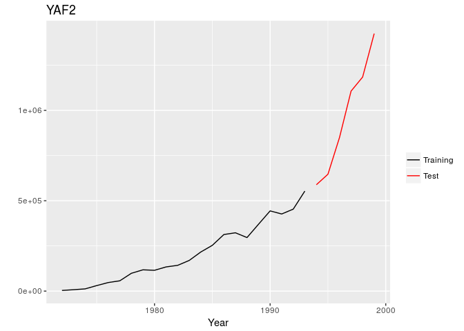

<!-- README.md is generated from README.Rmd. Please edit that file -->
Mcomp: Data from the M-Competitions
===================================

[](https://travis-ci.org/robjhyndman/Mcomp) [](https://cran.r-project.org/package=Mcomp) [](https://cran.r-project.org/package=Mcomp) [](https://www.gnu.org/licenses/gpl-3.0.en.html)

The R package *Mcomp* contains the 1001 time series from the M-competition (Makridakis et al. 1982) and the 3003 time series from the IJF-M3 competition (Makridakis and Hibon, 2000).

Installation
------------

You can install the **stable** version on [R CRAN](https://cran.r-project.org/package=Mcomp).

``` s
install.packages('Mcomp')
```

You can install the **development** version from [Github](https://github.com/robjhyndman/Mcomp)

``` s
# install.packages("devtools")
devtools::install_github("robjhyndman/Mcomp")
```

Usage
-----

``` r
library(Mcomp)
#> Loading required package: forecast
library(ggplot2)
M1
#> $YAF2
#> $st
#> [1] "Y1"
#> 
#> $n
#> [1] 22
#> 
#> $h
#> [1] 6
#> 
#> $period
#> [1] "YEARLY"
#> 
#> $type
#> [1] "MICRO1"
#> 
#> $description
#> [1] "FRANCE LA REGIE RENAULT A25 ANS(CHAMBRE DE COMMERCE FRANCAIS) TURNOVER-RENAULT"
#> 
#> $x
#> Time Series:
#> Start = 1972 
#> End = 1993 
#> Frequency = 1 
#>  [1]   3600   7700  12300  30500  47390  57006  98563 117759 115097 133759
#> [11] 142485 169611 216229 253227 313096 322681 296245 370333 443826 426751
#> [21] 453627 553400
#> 
#> $xx
#> Time Series:
#> Start = 1994 
#> End = 1999 
#> Frequency = 1 
#> [1]  588568  646758  849998 1106740 1184550 1425090
#> 
#> $sn
#> [1] "YAF2"
#> 
#> attr(,"class")
#> [1] "Mdata"
#> 
#> $YAF3
#> $st
#> [1] "Y2"
#> 
#> $n
#> [1] 23
#> 
#> $h
#> [1] 6
#> 
#> $period
#> [1] "YEARLY"
#> 
#> $type
#> [1] "MICRO1"
#> 
#> $description
#> [1] "FRANCE SYNDICHT DE LAUTOMOBILE PRODUCTION OF THE MAIN CAR CONSTRUCTERS"
#> 
#> $x
#> Time Series:
#> Start = 1974 
#> End = 1996 
#> Frequency = 1 
#>  [1]  12654  22879  34164  49524  64761  78199  88626 102168 102758 122442
#> [11] 129900 139706 178858 213162 236026 255542 314269 357822 374755 401439
#> [21] 451875 419245 384040
#> 
#> $xx
#> Time Series:
#> Start = 1997 
#> End = 2002 
#> Frequency = 1 
#> [1] 425507 471077 578326 648954 658827 598742
#> 
#> $sn
#> [1] "YAF3"
#> 
#> attr(,"class")
#> [1] "Mdata"
#> 
#> $YAF4
#> $st
#> [1] "Y3"
#> 
#> $n
#> [1] 23
#> 
#> $h
#> [1] 6
#> 
#> $period
#> [1] "YEARLY"
#> 
#> $type
#> [1] "MICRO1"
#> 
#> $description
#> [1] "FRANCE SYNDECHT DE LAUTOMOBILE PRODUCTION OF THE MAIN CAR CONSTRUCTORS"
#> 
#> $x
#> Time Series:
#> Start = 1974 
#> End = 1996 
#> Frequency = 1 
#>  [1]   2142  12935  19130  30500  48177  57462  64420  67689  73598  92086
#> [11] 112223 126902 145346 180153 193760 213266 236272 265299 254948 266798
#> [21] 338846 374028 362207
#> 
#> $xx
#> Time Series:
#> Start = 1997 
#> End = 2002 
#> Frequency = 1 
#> [1] 440716 525201 559479 603419 684536 634477
#> 
#> $sn
#> [1] "YAF4"
#> 
#> attr(,"class")
#> [1] "Mdata"
#> 
#> $YAF5
#> $st
#> [1] "Y4"
#> 
#> $n
#> [1] 23
#> 
#> $h
#> [1] 6
#> 
#> $period
#> [1] "YEARLY"
#> 
#> $type
#> [1] "MICRO1"
#> 
#> $description
#> [1] "FRANCE SYNDICHT DE LAUTOMOBILE PRODUCTION OF THE MAIN CAR CONSTRUCTERS"
#> 
#> $x
#> Time Series:
#> Start = 1974 
#> End = 1996 
#> Frequency = 1 
#>  [1]   5774   7650   9271  21447  28998  40991  69030  53926  81376  50023
#> [11] 170673 161909 199636 233006 214539 208055 251314 273587 276606 237456
#> [21] 327433 275882 350083
#> 
#> $xx
#> Time Series:
#> Start = 1997 
#> End = 2002 
#> Frequency = 1 
#> [1] 388275 402869 484266 534545 560496 444027
#> 
#> $sn
#> [1] "YAF5"
#> 
#> attr(,"class")
#> [1] "Mdata"
#> 
#> $YAF6
#> $st
#> [1] "Y5"
#> 
#> $n
#> [1] 39
#> 
#> $h
#> [1] 6
#> 
#> $period
#> [1] "YEARLY"
#> 
#> $type
#> [1] "MICRO1"
#> 
#> $description
#> [1] "USA MOODYS INDUSTRIAL MANUAL VOL.1 1977 GENERAL MOTORS CORPORATION- NET SALES"
#> 
#> $x
#> Time Series:
#> Start = 1976 
#> End = 2014 
#> Frequency = 1 
#>  [1]   432312   569011   862673  1155640  1439290  1606790  1066970
#>  [8]  1376830  1794940  2436800  2250550  3796120  4262250  3127930
#> [15]  1962500  3815160  4701770  5700830  7531090  7465550  7549150
#> [22] 10028000  9823530 12443300 10796400 10989800  9521970 11233100
#> [29] 12736000 11395900 14640200 16494800 16997000 20734000 20208500
#> [36] 20026300 22755400 24295100 18752400
#> 
#> $xx
#> Time Series:
#> Start = 2015 
#> End = 2020 
#> Frequency = 1 
#> [1] 28263900 30435200 35798200 31549500 35724800 47180900
#> 
#> $sn
#> [1] "YAF6"
#> 
#> attr(,"class")
#> [1] "Mdata"
#> 
#> $YAF7
#> $st
#> [1] "Y6"
#> 
#> $n
#> [1] 25
#> 
#> $h
#> [1] 6
#> 
#> $period
#> [1] "YEARLY"
#> 
#> $type
#> [1] "MICRO1"
#> 
#> $description
#> [1] "USA MOODY/S INDUSTRIAL MANUAL-VOL.1 1977 FORD MOTOR COMPANY- NET SALES"
#> 
#> $x
#> Time Series:
#> Start = 1976 
#> End = 2000 
#> Frequency = 1 
#>  [1]   894.5  1501.7  1971.2  2249.4  3029.5  2741.8  2640.2  4211.3
#>  [9]  4062.3  5594.0  4647.0  6839.3  5280.9  6648.8  6797.6  6709.4
#> [17]  8089.6  8742.5  9670.8 11536.8 12240.0 10515.7 14075.1 14755.6
#> [25] 14979.9
#> 
#> $xx
#> Time Series:
#> Start = 2001 
#> End = 2006 
#> Frequency = 1 
#> [1] 16433.0 20194.3 23015.0 23620.5 24009.0 28839.5
#> 
#> $sn
#> [1] "YAF7"
#> 
#> attr(,"class")
#> [1] "Mdata"
#> 
#> $YAF8
#> $st
#> [1] "Y7"
#> 
#> $n
#> [1] 10
#> 
#> $h
#> [1] 6
#> 
#> $period
#> [1] "YEARLY"
#> 
#> $type
#> [1] "MICRO1"
#> 
#> $description
#> [1] "USA MOODYS INDUSTRIAL MANUAL VOL.1 1977 CONSOLIDATED FOODS CORPORATION- NET SALES"
#> 
#> $x
#> Time Series:
#> Start = 1972 
#> End = 1981 
#> Frequency = 1 
#>  [1] 332381 352429 358621 424889 509281 519773 563115 633929 790109 847706
#> 
#> $xx
#> Time Series:
#> Start = 1982 
#> End = 1987 
#> Frequency = 1 
#> [1] 1089790 1216750 1512060 1570170 1678910 1832130
#> 
#> $sn
#> [1] "YAF8"
#> 
#> attr(,"class")
#> [1] "Mdata"
#> 
#> $YAF9
#> $st
#> [1] "Y8"
#> 
#> $n
#> [1] 11
#> 
#> $h
#> [1] 6
#> 
#> $period
#> [1] "YEARLY"
#> 
#> $type
#> [1] "MICRO1"
#> 
#> $description
#> [1] "USA MOODYS INDUSTRIAL MANUAL VOL.2 1977 PHILIP MORRIS INCORPORATED - NET SALES"
#> 
#> $x
#> Time Series:
#> Start = 1970 
#> End = 1980 
#> Frequency = 1 
#>  [1] 283219 326815 408814 440834 460495 506412 521709 526752 548179 581729
#> [11] 638296
#> 
#> $xx
#> Time Series:
#> Start = 1981 
#> End = 1986 
#> Frequency = 1 
#> [1]  701519  767471  899282 1013150 1142370 1509540
#> 
#> $sn
#> [1] "YAF9"
#> 
#> attr(,"class")
#> [1] "Mdata"
#> 
#> $YAF10
#> $st
#> [1] "Y9"
#> 
#> $n
#> [1] 9
#> 
#> $h
#> [1] 6
#> 
#> $period
#> [1] "YEARLY"
#> 
#> $type
#> [1] "MICRO1"
#> 
#> $description
#> [1] "USA MOODYS INDUSTRIAL MANUAL VOL.1 1977 COLGATE- PALMOLIVE COMPANY"
#> 
#> $x
#> Time Series:
#> Start = 1971 
#> End = 1979 
#> Frequency = 1 
#> [1] 506190 534047 581982 576326 604878 673833 722014 806581 862129
#> 
#> $xx
#> Time Series:
#> Start = 1980 
#> End = 1985 
#> Frequency = 1 
#> [1]  931630 1025350 1315560 1383340 1462760 1604000
#> 
#> $sn
#> [1] "YAF10"
#> 
#> attr(,"class")
#> [1] "Mdata"
#> 
#> $YAF11
#> $st
#> [1] "Y10"
#> 
#> $n
#> [1] 30
#> 
#> $h
#> [1] 6
#> 
#> $period
#> [1] "YEARLY"
#> 
#> $type
#> [1] "MICRO1"
#> 
#> $description
#> [1] "OTHER PRIVATE COMPANY DATA"
#> 
#> $x
#> Time Series:
#> Start = 1977 
#> End = 2006 
#> Frequency = 1 
#>  [1] 19.13 21.67 21.17 23.37 25.36 27.45 27.41 28.06 30.77 32.69 32.59
#> [12] 36.02 38.16 39.99 40.38 44.98 48.99 50.62 51.79 54.25 52.66 56.86
#> [23] 55.11 43.62 39.45 41.42 39.67 47.12 50.61 53.93
#> 
#> $xx
#> Time Series:
#> Start = 2007 
#> End = 2012 
#> Frequency = 1 
#> [1] 52.9599 56.8199 58.9998 56.3499 52.4999 55.1999
#> 
#> $sn
#> [1] "YAF11"
#> 
#> attr(,"class")
#> [1] "Mdata"
#> 
#> $YAF12
#> $st
#> [1] "Y11"
#> 
#> $n
#> [1] 21
#> 
#> $h
#> [1] 6
#> 
#> $period
#> [1] "YEARLY"
#> 
#> $type
#> [1] "MICRO1"
#> 
#> $description
#> [1] "OTHER PRIVATE COMPANY DATA"
#> 
#> $x
#> Time Series:
#> Start = 1977 
#> End = 1997 
#> Frequency = 1 
#>  [1] 2075 2359 2101 2371 2700 2850 2994 3192 3309 3481 4041 4348 4499 4869
#> [15] 5309 5681 6335 6725 7168 8025 8447
#> 
#> $xx
#> Time Series:
#> Start = 1998 
#> End = 2003 
#> Frequency = 1 
#> [1]  8117.98  8640.98  9736.98 10204.00  8052.98  9743.98
#> 
#> $sn
#> [1] "YAF12"
#> 
#> attr(,"class")
#> [1] "Mdata"
#> 
#> $YAF13
#> $st
#> [1] "Y12"
#> 
#> $n
#> [1] 28
#> 
#> $h
#> [1] 6
#> 
#> $period
#> [1] "YEARLY"
#> 
#> $type
#> [1] "MICRO1"
#> 
#> $description
#> [1] "OTHER FIAT COMPANY DATA"
#> 
#> $x
#> Time Series:
#> Start = 1976 
#> End = 2003 
#> Frequency = 1 
#>  [1]    2197    2394    7308   22583   53193   88205  109607  157296
#>  [9]  171519  201616  244195  276386  310198  340657  351933  373037
#> [17]  437702  545312  641389  789188  931918  907996  968054 1064530
#> [25] 1194120 1334710 1425000 1711840
#> 
#> $xx
#> Time Series:
#> Start = 2004 
#> End = 2009 
#> Frequency = 1 
#> [1] 1820390 2127440 2370370 2836800 2938130 3597020
#> 
#> $sn
#> [1] "YAF13"
#> 
#> attr(,"class")
#> [1] "Mdata"
#> 
#> $YAF14
#> $st
#> [1] "Y13"
#> 
#> $n
#> [1] 52
#> 
#> $h
#> [1] 6
#> 
#> $period
#> [1] "YEARLY"
#> 
#> $type
#> [1] "MICRO1"
#> 
#> $description
#> [1] "OTHER FIAT AGRICULTURAL TRACTOR"
#> 
#> $x
#> Time Series:
#> Start = 1976 
#> End = 2027 
#> Frequency = 1 
#>  [1]   263   992   437    35    55   140   205   175   150   620  1085
#> [12]   358   611   184   137   260   297   682   893   463   575   593
#> [23]   645   644   634   124    32   208   457   508  1832  4037  4589
#> [34]  6250 11721 14148 15488 13450 18689 17130 22637 28413 30468 32233
#> [45] 38038 36343 44401 47154 45339 52735 50558 50423
#> 
#> $xx
#> Time Series:
#> Start = 2028 
#> End = 2033 
#> Frequency = 1 
#> [1] 41229.9 41090.9 55845.9 62426.8 70832.8 85633.8
#> 
#> $sn
#> [1] "YAF14"
#> 
#> attr(,"class")
#> [1] "Mdata"
#> 
#> $YAF15
#> $st
#> [1] "Y14"
#> 
#> $n
#> [1] 21
#> 
#> $h
#> [1] 6
#> 
#> $period
#> [1] "YEARLY"
#> 
#> $type
#> [1] "MICRO1"
#> 
#> $description
#> [1] "OTHER FIAT REGISTERD CARS"
#> 
#> $x
#> Time Series:
#> Start = 1976 
#> End = 1996 
#> Frequency = 1 
#>  [1]  23180  21827  32567   9717  27319  42528  75036  99206 148432 169532
#> [11] 291222 341360 421484 595368 583326 655035 752561 881158 836680 815451
#> [21] 866498
#> 
#> $xx
#> Time Series:
#> Start = 1997 
#> End = 2002 
#> Frequency = 1 
#> [1] 919985 921579 885586 788831 593998 624498
#> 
#> $sn
#> [1] "YAF15"
#> 
#> attr(,"class")
#> [1] "Mdata"
#> 
#> $YAF16
#> $st
#> [1] "Y15"
#> 
#> $n
#> [1] 12
#> 
#> $h
#> [1] 6
#> 
#> $period
#> [1] "YEARLY"
#> 
#> $type
#> [1] "MICRO1"
#> 
#> $description
#> [1] "OTHER PRIVATE COMPANY DATA GERMANY"
#> 
#> $x
#> Time Series:
#> Start = 1977 
#> End = 1988 
#> Frequency = 1 
#>  [1]  574.9  519.3  545.5  562.9  630.2  679.8  702.9  733.0  836.3  911.5
#> [11] 1015.8 1041.9
#> 
#> $xx
#> Time Series:
#> Start = 1989 
#> End = 1994 
#> Frequency = 1 
#> [1] 1128.8 1319.4 1709.2 1412.0 1729.3 1817.7
#> 
#> $sn
#> [1] "YAF16"
#> 
#> attr(,"class")
#> [1] "Mdata"
#> 
#> $YAF17
#> $st
#> [1] "Y16"
#> 
#> $n
#> [1] 21
#> 
#> $h
#> [1] 6
#> 
#> $period
#> [1] "YEARLY"
#> 
#> $type
#> [1] "MICRO1"
#> 
#> $description
#> [1] "OTHER MOODY'S INDUSTRIAL BOOK IBM TOTAL FIRM DATA"
#> 
#> $x
#> Time Series:
#> Start = 1973 
#> End = 1993 
#> Frequency = 1 
#>  [1] 4.97358 5.08749 5.21202 5.37025 5.58649 5.81033 6.01613 6.13416
#>  [9] 6.33425 6.59897 6.90819 7.06629 7.17762 7.26965 7.43502 7.56280
#> [17] 7.63027 8.08313 8.18111 8.35413 8.58397
#> 
#> $xx
#> Time Series:
#> Start = 1994 
#> End = 1999 
#> Frequency = 1 
#> [1] 8.83760 8.88144 8.92317 9.02080 9.16245 9.30502
#> 
#> $sn
#> [1] "YAF17"
#> 
#> attr(,"class")
#> [1] "Mdata"
#> 
#> $YAM1
#> $st
#> [1] "Y17"
#> 
#> $n
#> [1] 23
#> 
#> $h
#> [1] 6
#> 
#> $period
#> [1] "YEARLY"
#> 
#> $type
#> [1] "MICRO2"
#> 
#> $description
#> [1] "FRANCE COMPTE RENDU D'ACTIVITE POUR L'ANNEE 1972(CHAM. COMERCE FRANCE) INDUSTRIAL CARS-RENAULT"
#> 
#> $x
#> Time Series:
#> Start = 1972 
#> End = 1994 
#> Frequency = 1 
#>  [1]  1045 12031 20306 25513 35766 37868 47797 66621 50626 41184 42929
#> [12] 45495 45044 47903 41512 33061 58243 43464 65667 80389 75747 72606
#> [23] 71755
#> 
#> $xx
#> Time Series:
#> Start = 1995 
#> End = 2000 
#> Frequency = 1 
#> [1]  70845.8  72951.8  98107.7 103942.0 105244.0 115841.0
#> 
#> $sn
#> [1] "YAM1"
#> 
#> attr(,"class")
#> [1] "Mdata"
#> 
#> $YAM2
#> $st
#> [1] "Y18"
#> 
#> $n
#> [1] 22
#> 
#> $h
#> [1] 6
#> 
#> $period
#> [1] "YEARLY"
#> 
#> $type
#> [1] "MICRO2"
#> 
#> $description
#> [1] "FRANCE COMPTE RENDU D'ACTIVITE POUR LANNEE 1972(CHM.COMMERCE FRANCE) PRIVATE CARS RENAULT"
#> 
#> $x
#> Time Series:
#> Start = 1972 
#> End = 1993 
#> Frequency = 1 
#>  [1]      5   8536  18971  32850  70608  86077 100525 121461 120460 157851
#> [11] 176392 219000 269540 367673 461099 484684 349699 499888 588478 476008
#> [21] 504507 666224
#> 
#> $xx
#> Time Series:
#> Start = 1994 
#> End = 1999 
#> Frequency = 1 
#> [1]  706620  734453  911262 1055800 1069070 1202480
#> 
#> $sn
#> [1] "YAM2"
#> 
#> attr(,"class")
#> [1] "Mdata"
#> 
#> $YAM3
#> $st
#> [1] "Y19"
#> 
#> $n
#> [1] 21
#> 
#> $h
#> [1] 6
#> 
#> $period
#> [1] "YEARLY"
#> 
#> $type
#> [1] "MICRO2"
#> 
#> $description
#> [1] "OTHER PRIVATE COMPANY DATA USA"
#> 
#> $x
#> Time Series:
#> Start = 1972 
#> End = 1992 
#> Frequency = 1 
#>  [1] 2189.29 2830.64 2256.02 2698.04 3372.33 4064.82 3829.08 4046.62
#>  [9] 4135.89 4895.12 5244.40 5479.28 5365.74 5691.62 5657.82 5970.70
#> [17] 6346.85 6140.57 6846.93 7268.15 6856.47
#> 
#> $xx
#> Time Series:
#> Start = 1993 
#> End = 1998 
#> Frequency = 1 
#> [1]  7288.07  9176.60 10314.60 10476.60 11626.80 11363.30
#> 
#> $sn
#> [1] "YAM3"
#> 
#> attr(,"class")
#> [1] "Mdata"
#> 
#> $YAM4
#> $st
#> [1] "Y20"
#> 
#> $n
#> [1] 22
#> 
#> $h
#> [1] 6
#> 
#> $period
#> [1] "YEARLY"
#> 
#> $type
#> [1] "MICRO2"
#> 
#> $description
#> [1] "FRANCE COMPTE RENDU D'ACTIVITE POUR LANNEE 1972(CHA. COMMERCE FRANCE) AGRICULTURAL TRACTORS RENAULT"
#> 
#> $x
#> Time Series:
#> Start = 1972 
#> End = 1993 
#> Frequency = 1 
#>  [1]   141   863  2245  5202  8637  8559  5065  6034  3534  3841  6252
#> [12] 10013 18869 21551 20961 16208 19348 15198 17242 21784 20244 18139
#> 
#> $xx
#> Time Series:
#> Start = 1994 
#> End = 1999 
#> Frequency = 1 
#> [1] 17167.00 15288.00 18788.00 18003.00  9844.97 11698.00
#> 
#> $sn
#> [1] "YAM4"
#> 
#> attr(,"class")
#> [1] "Mdata"
#> 
#> $YAM5
#> $st
#> [1] "Y21"
#> 
#> $n
#> [1] 13
#> 
#> $h
#> [1] 6
#> 
#> $period
#> [1] "YEARLY"
#> 
#> $type
#> [1] "MICRO2"
#> 
#> $description
#> [1] "FRANCE PETROL 1976 CPDP PRODUCTION- HUILE BRUTE- PICHEL BRONN"
#> 
#> $x
#> Time Series:
#> Start = 1964 
#> End = 1976 
#> Frequency = 1 
#>  [1] 51.4 49.3 50.0 57.0 61.6 56.8 51.4 45.8 40.1 35.7 32.8 27.7 26.9
#> 
#> $xx
#> Time Series:
#> Start = 1977 
#> End = 1982 
#> Frequency = 1 
#> [1] 22.79990 22.29990 20.59990 14.50000  6.19998  5.39999
#> 
#> $sn
#> [1] "YAM5"
#> 
#> attr(,"class")
#> [1] "Mdata"
#> 
#> $YAM6
#> $st
#> [1] "Y22"
#> 
#> $n
#> [1] 14
#> 
#> $h
#> [1] 6
#> 
#> $period
#> [1] "YEARLY"
#> 
#> $type
#> [1] "MICRO2"
#> 
#> $description
#> [1] "OTHER MOODY&S INDUSTRIAL IBM USA SALES"
#> 
#> $x
#> Time Series:
#> Start = 1973 
#> End = 1986 
#> Frequency = 1 
#>  [1] 2.56817 2.58339 2.60319 2.62582 2.63720 2.64514 2.65165 2.66325
#>  [9] 2.67212 2.67677 2.70744 2.71396 2.72536 2.74031
#> 
#> $xx
#> Time Series:
#> Start = 1987 
#> End = 1992 
#> Frequency = 1 
#> [1] 2.75654 2.75932 2.76196 2.76811 2.77696 2.78579
#> 
#> $sn
#> [1] "YAM6"
#> 
#> attr(,"class")
#> [1] "Mdata"
#> 
#> $YAM7
#> $st
#> [1] "Y23"
#> 
#> $n
#> [1] 17
#> 
#> $h
#> [1] 6
#> 
#> $period
#> [1] "YEARLY"
#> 
#> $type
#> [1] "MICRO2"
#> 
#> $description
#> [1] "FRANCE PITROLE 1976 CPDP CRUDE OIL ESSOREP"
#> 
#> $x
#> Time Series:
#> Start = 1976 
#> End = 1992 
#> Frequency = 1 
#>  [1]  131.5  576.5 1033.8 1223.2 1202.9 1232.0 1345.4 1503.2 1675.4 1870.0
#> [11] 2176.3 2355.6 2336.9 2308.4 2206.1 2064.0 1919.4
#> 
#> $xx
#> Time Series:
#> Start = 1993 
#> End = 1998 
#> Frequency = 1 
#> [1] 1517.700 1147.900  924.398  729.398  646.298  644.598
#> 
#> $sn
#> [1] "YAM7"
#> 
#> attr(,"class")
#> [1] "Mdata"
#> 
#> $YAM8
#> $st
#> [1] "Y24"
#> 
#> $n
#> [1] 13
#> 
#> $h
#> [1] 6
#> 
#> $period
#> [1] "YEARLY"
#> 
#> $type
#> [1] "MICRO2"
#> 
#> $description
#> [1] "FRANCE PETROLE 1976 CPDP CRUDE OIL PETROREP"
#> 
#> $x
#> Time Series:
#> Start = 1976 
#> End = 1988 
#> Frequency = 1 
#>  [1]  11.5 143.2 178.3 122.1 110.8  92.7  93.6  79.5  74.0  84.0  84.1
#> [12]  79.0  71.6
#> 
#> $xx
#> Time Series:
#> Start = 1989 
#> End = 1994 
#> Frequency = 1 
#> [1] 65.0998 57.4999 51.4999 44.5999 40.8999 39.3999
#> 
#> $sn
#> [1] "YAM8"
#> 
#> attr(,"class")
#> [1] "Mdata"
#> 
#> $YAM10
#> $st
#> [1] "Y25"
#> 
#> $n
#> [1] 22
#> 
#> $h
#> [1] 6
#> 
#> $period
#> [1] "YEARLY"
#> 
#> $type
#> [1] "MICRO2"
#> 
#> $description
#> [1] "FRANCE PETROLE 1976 CPDP CRUDE OIL SENA(NOTICE 2TIMES SNEA)"
#> 
#> $x
#> Time Series:
#> Start = 1976 
#> End = 1997 
#> Frequency = 1 
#>  [1]   0.1  65.3 233.9 297.2 307.3 307.5 251.1 177.8 126.3 101.4 100.1
#> [12]  88.4  91.1  85.9  86.4  81.9  86.7 101.9  86.8  73.6  61.2  57.8
#> 
#> $xx
#> Time Series:
#> Start = 1998 
#> End = 2003 
#> Frequency = 1 
#> [1] 54.3999 53.9999 49.4999 57.2999 49.2999 68.0998
#> 
#> $sn
#> [1] "YAM10"
#> 
#> attr(,"class")
#> [1] "Mdata"
#> 
#> $YAM11
#> $st
#> [1] "Y26"
#> 
#> $n
#> [1] 13
#> 
#> $h
#> [1] 6
#> 
#> $period
#> [1] "YEARLY"
#> 
#> $type
#> [1] "MICRO2"
#> 
#> $description
#> [1] "USA MOODY'S INDUSTRIAL MANUAL 1974 VOL.1 PLASTIC PLANTS- NET TONS"
#> 
#> $x
#> Time Series:
#> Start = 1973 
#> End = 1985 
#> Frequency = 1 
#>  [1] 18820900 18322300 19123200 13393000 14257400 15941100 14944300
#>  [8] 14676900 16108800 19436000 21032000 21275000 20525000
#> 
#> $xx
#> Time Series:
#> Start = 1986 
#> End = 1991 
#> Frequency = 1 
#> [1] 20371900 21767900 20585900 17439000 18334000 23701900
#> 
#> $sn
#> [1] "YAM11"
#> 
#> attr(,"class")
#> [1] "Mdata"
#> 
#> $YAM12
#> $st
#> [1] "Y27"
#> 
#> $n
#> [1] 13
#> 
#> $h
#> [1] 6
#> 
#> $period
#> [1] "YEARLY"
#> 
#> $type
#> [1] "MICRO2"
#> 
#> $description
#> [1] "USA MOODY'S INDUSTRIAL MANUAL 1974 VOL. 1 PLASTIC PLANTS- STEEL PROD. SHIPPED (NET TONS)"
#> 
#> $x
#> Time Series:
#> Start = 1974 
#> End = 1986 
#> Frequency = 1 
#>  [1] 13553800 13198800 13535700  9686230 10267800 11418700 10044500
#>  [8] 10390800 10987000 12762000 14319000 13849000 13056000
#> 
#> $xx
#> Time Series:
#> Start = 1987 
#> End = 1992 
#> Frequency = 1 
#> [1] 14394000 14481000 13838000 12577000 12494000 16627000
#> 
#> $sn
#> [1] "YAM12"
#> 
#> attr(,"class")
#> [1] "Mdata"
#> 
#> $YAM13
#> $st
#> [1] "Y28"
#> 
#> $n
#> [1] 33
#> 
#> $h
#> [1] 6
#> 
#> $period
#> [1] "YEARLY"
#> 
#> $type
#> [1] "MICRO2"
#> 
#> $description
#> [1] "OTHER PRIVATE COMPANY DATA"
#> 
#> $x
#> Time Series:
#> Start = 1977 
#> End = 2009 
#> Frequency = 1 
#>  [1] 2022 9193 3687 3554 3046 1807 1380 1911 3342 1056 1775 2471 1545 2901
#> [15] 4419 2846 3442 2220 2800 2383 2073 1798 2418 2328 1665 2388 2089 2841
#> [29] 3044 2952 2116 2938 3482
#> 
#> $xx
#> Time Series:
#> Start = 2010 
#> End = 2015 
#> Frequency = 1 
#> [1] 2407.99 2931.99 4063.99 2194.99 1743.00 7361.98
#> 
#> $sn
#> [1] "YAM13"
#> 
#> attr(,"class")
#> [1] "Mdata"
#> 
#> $YAM14
#> $st
#> [1] "Y29"
#> 
#> $n
#> [1] 20
#> 
#> $h
#> [1] 6
#> 
#> $period
#> [1] "YEARLY"
#> 
#> $type
#> [1] "MICRO2"
#> 
#> $description
#> [1] "OTHER BLUEBOOK CHEMICAL GOOD PULPE CAPACITY IN WEST GERMANY"
#> 
#> $x
#> Time Series:
#> Start = 1977 
#> End = 1996 
#> Frequency = 1 
#>  [1] 589 635 671 671 671 708 708 762 800 815 800 773 760 780 727 770 784
#> [18] 841 858 811
#> 
#> $xx
#> Time Series:
#> Start = 1997 
#> End = 2002 
#> Frequency = 1 
#> [1] 799.998 809.998 858.998 871.998 884.998 880.998
#> 
#> $sn
#> [1] "YAM14"
#> 
#> attr(,"class")
#> [1] "Mdata"
#> 
#> $YAM15
#> $st
#> [1] "Y30"
#> 
#> $n
#> [1] 22
#> 
#> $h
#> [1] 6
#> 
#> $period
#> [1] "YEARLY"
#> 
#> $type
#> [1] "MICRO2"
#> 
#> $description
#> [1] "OTHER VDP PRODUCTION OF GOOD PULPE IN WEST GERMANY"
#> 
#> $x
#> Time Series:
#> Start = 1977 
#> End = 1998 
#> Frequency = 1 
#>  [1] 553 631 546 601 699 724 737 750 742 787 828 826 796 791 749 751 740
#> [18] 764 812 851 828 770
#> 
#> $xx
#> Time Series:
#> Start = 1999 
#> End = 2004 
#> Frequency = 1 
#> [1] 757.998 798.998 857.998 724.998 811.998 843.998
#> 
#> $sn
#> [1] "YAM15"
#> 
#> attr(,"class")
#> [1] "Mdata"
#> 
#> $YAM16
#> $st
#> [1] "Y31"
#> 
#> $n
#> [1] 22
#> 
#> $h
#> [1] 6
#> 
#> $period
#> [1] "YEARLY"
#> 
#> $type
#> [1] "MICRO2"
#> 
#> $description
#> [1] "OTHER STATISTICHES BUNDESAMT PRICE MANUFACTURING CHEMICAL GOOD PULPE IN WEST GERMANY"
#> 
#> $x
#> Time Series:
#> Start = 1977 
#> End = 1998 
#> Frequency = 1 
#>  [1]  77.2 130.5 136.2 108.9 109.9 119.3 119.3 121.1 110.5 100.8 101.5
#> [12] 102.4  96.0  94.6  99.2 101.6  95.4  92.3  77.2  88.0 100.0 100.8
#> 
#> $xx
#> Time Series:
#> Start = 1999 
#> End = 2004 
#> Frequency = 1 
#> [1]  89.6998  91.4998 112.0000 141.2000 143.4000 130.0000
#> 
#> $sn
#> [1] "YAM16"
#> 
#> attr(,"class")
#> [1] "Mdata"
#> 
#> $YAM17
#> $st
#> [1] "Y32"
#> 
#> $n
#> [1] 14
#> 
#> $h
#> [1] 6
#> 
#> $period
#> [1] "YEARLY"
#> 
#> $type
#> [1] "MICRO2"
#> 
#> $description
#> [1] "OTHER VDP STOCKS OF PAPER MANUFACTURED IN WEST GERMANY"
#> 
#> $x
#> Time Series:
#> Start = 1977 
#> End = 1990 
#> Frequency = 1 
#>  [1] 111 115 146 139 131 153 184 159 163 139 189 209 259 175
#> 
#> $xx
#> Time Series:
#> Start = 1991 
#> End = 1996 
#> Frequency = 1 
#> [1] 189.000 238.999 246.999 248.999 256.999 190.000
#> 
#> $sn
#> [1] "YAM17"
#> 
#> attr(,"class")
#> [1] "Mdata"
#> 
#> $YAM18
#> $st
#> [1] "Y33"
#> 
#> $n
#> [1] 22
#> 
#> $h
#> [1] 6
#> 
#> $period
#> [1] "YEARLY"
#> 
#> $type
#> [1] "MICRO2"
#> 
#> $description
#> [1] "OTHER VDP PAPER BOARD PRODUCTION IN WEST GERMANY"
#> 
#> $x
#> Time Series:
#> Start = 1977 
#> End = 1998 
#> Frequency = 1 
#>  [1] 1565 1805 1695 1969 2301 2515 2687 2844 2919 3111 3434 3524 3609 3740
#> [15] 4024 4039 4143 4212 4741 5182 5504 5582
#> 
#> $xx
#> Time Series:
#> Start = 1999 
#> End = 2004 
#> Frequency = 1 
#> [1] 5854.99 6373.98 6513.98 5265.99 6393.98 6602.98
#> 
#> $sn
#> [1] "YAM18"
#> 
#> attr(,"class")
#> [1] "Mdata"
#> 
#> $YAM19
#> $st
#> [1] "Y34"
#> 
#> $n
#> [1] 22
#> 
#> $h
#> [1] 6
#> 
#> $period
#> [1] "YEARLY"
#> 
#> $type
#> [1] "MICRO2"
#> 
#> $description
#> [1] "OTHER STASTICAL BUNDESAMT PRICE MANUFACTURING IN WEST GERMANY"
#> 
#> $x
#> Time Series:
#> Start = 1977 
#> End = 1998 
#> Frequency = 1 
#>  [1]  74.4 121.0 116.9  97.0  95.4  98.7  98.5 100.8  99.1  95.0  95.2
#> [12]  97.1  97.1  96.2  96.0  97.5  97.7  96.2  96.0  98.2 100.0 101.4
#> 
#> $xx
#> Time Series:
#> Start = 1999 
#> End = 2004 
#> Frequency = 1 
#> [1]  98.9998 104.6000 140.5000 145.1000 136.2000 135.9000
#> 
#> $sn
#> [1] "YAM19"
#> 
#> attr(,"class")
#> [1] "Mdata"
#> 
#> $YAM20
#> $st
#> [1] "Y35"
#> 
#> $n
#> [1] 21
#> 
#> $h
#> [1] 6
#> 
#> $period
#> [1] "YEARLY"
#> 
#> $type
#> [1] "MICRO2"
#> 
#> $description
#> [1] "OTHER FAO CONIF NON.C SAUNGOOD PRODUCTION IN WEST GERMANY"
#> 
#> $x
#> Time Series:
#> Start = 1976 
#> End = 1996 
#> Frequency = 1 
#>  [1] 9160 8837 7907 7104 7103 7948 8385 6944 6677 6932 7739 8489 8496 8095
#> [15] 8799 8891 9010 8753 8951 9395 9383
#> 
#> $xx
#> Time Series:
#> Start = 1997 
#> End = 2002 
#> Frequency = 1 
#> [1]  9596.98  9591.98  9201.98  9904.97  9027.98 10300.00
#> 
#> $sn
#> [1] "YAM20"
#> 
#> attr(,"class")
#> [1] "Mdata"
#> 
#> $YAM21
#> $st
#> [1] "Y36"
#> 
#> $n
#> [1] 19
#> 
#> $h
#> [1] 6
#> 
#> $period
#> [1] "YEARLY"
#> 
#> $type
#> [1] "MICRO2"
#> 
#> $description
#> [1] "OTHER STATISTICAL BUNDESAMT PRICE MANUFACTURING IN WEST GERMANY"
#> 
#> $x
#> Time Series:
#> Start = 1976 
#> End = 1994 
#> Frequency = 1 
#>  [1] 186.25 163.98 168.01 192.57 188.93 191.09 189.77 183.35 186.11 194.35
#> [11] 195.56 194.11 195.18 197.85 198.68 186.42 174.72 187.57 207.95
#> 
#> $xx
#> Time Series:
#> Start = 1995 
#> End = 2000 
#> Frequency = 1 
#> [1] 213.909 217.369 240.669 273.289 256.069 274.249
#> 
#> $sn
#> [1] "YAM21"
#> 
#> attr(,"class")
#> [1] "Mdata"
#> 
#> $YAM22
#> $st
#> [1] "Y37"
#> 
#> $n
#> [1] 22
#> 
#> $h
#> [1] 6
#> 
#> $period
#> [1] "YEARLY"
#> 
#> $type
#> [1] "MICRO2"
#> 
#> $description
#> [1] "OTHER STATISTICAL BUNDESAMT INVENTORY PAPER WOOD PRICE IN WEST GERMANY"
#> 
#> $x
#> Time Series:
#> Start = 1977 
#> End = 1998 
#> Frequency = 1 
#>  [1]  54.2  65.1  97.0  91.5  86.7 113.3 111.8 111.7 103.8  79.1  78.5
#> [12]  96.3  93.2  81.1  84.2  87.4  88.3  79.3  73.6  83.9 100.0 102.8
#> 
#> $xx
#> Time Series:
#> Start = 1999 
#> End = 2004 
#> Frequency = 1 
#> [1]  93.5998  90.5998 105.4000 118.7000 112.8000 122.7000
#> 
#> $sn
#> [1] "YAM22"
#> 
#> attr(,"class")
#> [1] "Mdata"
#> 
#> $YAM23
#> $st
#> [1] "Y38"
#> 
#> $n
#> [1] 22
#> 
#> $h
#> [1] 6
#> 
#> $period
#> [1] "YEARLY"
#> 
#> $type
#> [1] "MICRO2"
#> 
#> $description
#> [1] "OTHER BLUE BOOK CHEMICAL WOOD PULP CAPACITY IN CANADA"
#> 
#> $x
#> Time Series:
#> Start = 1977 
#> End = 1998 
#> Frequency = 1 
#>  [1]  3315  3924  3838  3874  4082  4221  4513  4978  5352  5351  5376
#> [12]  5828  6809  7167  7822  8233  8376  9429 10212 10824 10936 12053
#> 
#> $xx
#> Time Series:
#> Start = 1999 
#> End = 2004 
#> Frequency = 1 
#> [1] 11876 12611 13454 13645 14034 14184
#> 
#> $sn
#> [1] "YAM23"
#> 
#> attr(,"class")
#> [1] "Mdata"
#> 
#> $YAM24
#> $st
#> [1] "Y39"
#> 
#> $n
#> [1] 21
#> 
#> $h
#> [1] 6
#> 
#> $period
#> [1] "YEARLY"
#> 
#> $type
#> [1] "MICRO2"
#> 
#> $description
#> [1] "OTHER BLUE BOOK PRODUCTION PRICE IN CANADA"
#> 
#> $x
#> Time Series:
#> Start = 1976 
#> End = 1996 
#> Frequency = 1 
#>  [1] 3007 3010 3192 3323 3680 3955 4214 4107 4033 4388 4721 5044 5336 5639
#> [15] 6208 6626 7349 7557 8297 9288 9050
#> 
#> $xx
#> Time Series:
#> Start = 1997 
#> End = 2002 
#> Frequency = 1 
#> [1]  9823.97 10487.00 11367.00 11933.00  9015.98 11048.00
#> 
#> $sn
#> [1] "YAM24"
#> 
#> attr(,"class")
#> [1] "Mdata"
#> 
#> $YAM25
#> $st
#> [1] "Y40"
#> 
#> $n
#> [1] 21
#> 
#> $h
#> [1] 6
#> 
#> $period
#> [1] "YEARLY"
#> 
#> $type
#> [1] "MICRO2"
#> 
#> $description
#> [1] "OTHER BLUE BOOK PAPER AND BOARD PRODUCTION PRICE IN CANADA"
#> 
#> $x
#> Time Series:
#> Start = 1976 
#> End = 1996 
#> Frequency = 1 
#>  [1]  6180  6555  6533  6692  6940  7258  7681  7530  7331  7756  8095
#> [12]  8156  8245  8472  9285  9855 10791 10573 10721 11710 11626
#> 
#> $xx
#> Time Series:
#> Start = 1997 
#> End = 2002 
#> Frequency = 1 
#> [1] 11582 12341 13033 13644 10406 12351
#> 
#> $sn
#> [1] "YAM25"
#> 
#> attr(,"class")
#> [1] "Mdata"
#> 
#> $YAM26
#> $st
#> [1] "Y41"
#> 
#> $n
#> [1] 21
#> 
#> $h
#> [1] 6
#> 
#> $period
#> [1] "YEARLY"
#> 
#> $type
#> [1] "MICRO2"
#> 
#> $description
#> [1] "OTHER FAO CONIFEROUS SAUNWOOD PRODUCTION PRICE IN CANADA"
#> 
#> $x
#> Time Series:
#> Start = 1976 
#> End = 1996 
#> Frequency = 1 
#>  [1] 15858 16878 16168 16782 17006 18841 18036 16429 16159 17072 17943
#> [12] 18483 19908 22150 21902 24302 23496 23347 25162 25677 25408
#> 
#> $xx
#> Time Series:
#> Start = 1997 
#> End = 2002 
#> Frequency = 1 
#> [1] 29246.9 31765.9 34866.9 31151.9 25741.9 35109.9
#> 
#> $sn
#> [1] "YAM26"
#> 
#> attr(,"class")
#> [1] "Mdata"
#> 
#> $YAM27
#> $st
#> [1] "Y42"
#> 
#> $n
#> [1] 21
#> 
#> $h
#> [1] 6
#> 
#> $period
#> [1] "YEARLY"
#> 
#> $type
#> [1] "MICRO2"
#> 
#> $description
#> [1] "OTHER FAO CHEMICAL WOOD PULP PRODUCTION IN BRAZIL"
#> 
#> $x
#> Time Series:
#> Start = 1976 
#> End = 1996 
#> Frequency = 1 
#>  [1]  40  40  40  52  80  72  84  97 103 122 160 165 198 235 262 313 380
#> [18] 397 448 492 559
#> 
#> $xx
#> Time Series:
#> Start = 1997 
#> End = 2002 
#> Frequency = 1 
#> [1]  544.999  673.998  794.998  958.998 1070.000 1228.000
#> 
#> $sn
#> [1] "YAM27"
#> 
#> attr(,"class")
#> [1] "Mdata"
#> 
#> $YAM28
#> $st
#> [1] "Y43"
#> 
#> $n
#> [1] 21
#> 
#> $h
#> [1] 6
#> 
#> $period
#> [1] "YEARLY"
#> 
#> $type
#> [1] "MICRO2"
#> 
#> $description
#> [1] "OTHER FAO PAPER AND BOARD PRODUCTION PRICE IN BRAZIL"
#> 
#> $x
#> Time Series:
#> Start = 1976 
#> End = 1996 
#> Frequency = 1 
#>  [1]  248  261  261  290  315  333  381  363  416  440  474  533  602  657
#> [15]  718  753  813  944 1006 1073 1219
#> 
#> $xx
#> Time Series:
#> Start = 1997 
#> End = 2002 
#> Frequency = 1 
#> [1] 1357.00 1345.00 1588.00 1854.00 1646.00 2009.99
#> 
#> $sn
#> [1] "YAM28"
#> 
#> attr(,"class")
#> [1] "Mdata"
#> 
#> $YAM29
#> $st
#> [1] "Y44"
#> 
#> $n
#> [1] 17
#> 
#> $h
#> [1] 6
#> 
#> $period
#> [1] "YEARLY"
#> 
#> $type
#> [1] "MICRO2"
#> 
#> $description
#> [1] "OTHER FAO CONIF NON.C SAWNWOOD PRODUCTION PRICE IN BRAZIL"
#> 
#> $x
#> Time Series:
#> Start = 1976 
#> End = 1992 
#> Frequency = 1 
#>  [1] 7400 7413 7254 6226 6534 6092 5700 6100 6300 5363 5531 5661 6072 6618
#> [15] 6965 7467 8035
#> 
#> $xx
#> Time Series:
#> Start = 1993 
#> End = 1998 
#> Frequency = 1 
#> [1] 8099.98 7549.98 7108.98 6851.98 7394.98 7394.98
#> 
#> $sn
#> [1] "YAM29"
#> 
#> attr(,"class")
#> [1] "Mdata"
#> 
#> $YAM30
#> $st
#> [1] "Y45"
#> 
#> $n
#> [1] 47
#> 
#> $h
#> [1] 6
#> 
#> $period
#> [1] "YEARLY"
#> 
#> $type
#> [1] "MICRO2"
#> 
#> $description
#> [1] "OTHER FIAT COMPANY DATA"
#> 
#> $x
#> Time Series:
#> Start = 1976 
#> End = 2022 
#> Frequency = 1 
#>  [1]  1083  2666  2393  3109  5071  3407  2901  1750  2332  2760  5020
#> [12]  5620  8302  9226  4670  2843 10829 12548 10614  8300  4476  3260
#> [23]  5792  5992  6440  9101 11379 11053  9502 15702 15283 17872 19264
#> [34] 18146 19940 18968 28718 34978 48813 69843 42478 35163 40990 51748
#> [45] 60225 55736 74667
#> 
#> $xx
#> Time Series:
#> Start = 2023 
#> End = 2028 
#> Frequency = 1 
#> [1]  68043.8  64323.8  81283.8  93548.8  95152.8 102893.0
#> 
#> $sn
#> [1] "YAM30"
#> 
#> attr(,"class")
#> [1] "Mdata"
#> 
#> $YAB1
#> $st
#> [1] "Y46"
#> 
#> $n
#> [1] 21
#> 
#> $h
#> [1] 6
#> 
#> $period
#> [1] "YEARLY"
#> 
#> $type
#> [1] "MICRO3"
#> 
#> $description
#> [1] "FRANCE COMPTE RENDU D'ACTIVITE POUR LANNEE 1972(CHA.COMMERCE FRANCE) MOTORS FOR STANDARD EXCHANGE RENAULT"
#> 
#> $x
#> Time Series:
#> Start = 1972 
#> End = 1992 
#> Frequency = 1 
#>  [1]  3022  4177  3751  5320  8397 11872 14541 14410 17534 19023 19306
#> [12] 13027 14750 13040 15874 17062 18163 21229 24163 27580 29809
#> 
#> $xx
#> Time Series:
#> Start = 1993 
#> End = 1998 
#> Frequency = 1 
#> [1] 34548.9 32960.9 44362.9 57251.9 68879.8 81793.8
#> 
#> $sn
#> [1] "YAB1"
#> 
#> attr(,"class")
#> [1] "Mdata"
#> 
#> $YAB2
#> $st
#> [1] "Y47"
#> 
#> $n
#> [1] 22
#> 
#> $h
#> [1] 6
#> 
#> $period
#> [1] "YEARLY"
#> 
#> $type
#> [1] "MICRO3"
#> 
#> $description
#> [1] "FRANCE COMPTE RENDU D'ACTIVITE POUR SANNEE 1972 INDUSTRIAL MOTORS NAVAL MOTORS RENAULT"
#> 
#> $x
#> Time Series:
#> Start = 1972 
#> End = 1993 
#> Frequency = 1 
#>  [1]   35  188  318  425  493  786 1662 1646 1512 1279 1845 1294 1724 1949
#> [15] 2280 1691 1231 1415 1894 3467 6786 7555
#> 
#> $xx
#> Time Series:
#> Start = 1994 
#> End = 1999 
#> Frequency = 1 
#> [1]  8574.98 28734.90 38913.90 38526.90 53029.90 56167.90
#> 
#> $sn
#> [1] "YAB2"
#> 
#> attr(,"class")
#> [1] "Mdata"
#> 
#> $YAB3
#> $st
#> [1] "Y48"
#> 
#> $n
#> [1] 19
#> 
#> $h
#> [1] 6
#> 
#> $period
#> [1] "YEARLY"
#> 
#> $type
#> [1] "MICRO3"
#> 
#> $description
#> [1] "FRANCE LA REGIE RENAULT A25 ANS (CHA. COMMERCE FRANCE) PRODUCTION TRACTORS VP"
#> 
#> $x
#> Time Series:
#> Start = 1969 
#> End = 1987 
#> Frequency = 1 
#>  [1]      5   8536  18971  32580  70608  86077 100525 121461 120460 157851
#> [11] 176392 219000 269540 367673 461099 484684 349699 499888 588478
#> 
#> $xx
#> Time Series:
#> Start = 1988 
#> End = 1993 
#> Frequency = 1 
#> [1] 476087 504506 666222 706620 734453 910998
#> 
#> $sn
#> [1] "YAB3"
#> 
#> attr(,"class")
#> [1] "Mdata"
#> 
#> $YAB4
#> $st
#> [1] "Y49"
#> 
#> $n
#> [1] 19
#> 
#> $h
#> [1] 6
#> 
#> $period
#> [1] "YEARLY"
#> 
#> $type
#> [1] "MICRO3"
#> 
#> $description
#> [1] "FRANCE LA REGIE RINAULT A 25 ANS (CHA. COMMERCE FRANCE) PRODUCTION TRACTOS VI- RENAULT"
#> 
#> $x
#> Time Series:
#> Start = 1969 
#> End = 1987 
#> Frequency = 1 
#>  [1] 12031 20306 25513 35766 37868 47797 66621 50626 41184 42929 45495
#> [12] 45044 47903 41512 33061 58243 43464 65667 80389
#> 
#> $xx
#> Time Series:
#> Start = 1988 
#> End = 1993 
#> Frequency = 1 
#> [1] 75746.8 72605.8 71754.8 70845.8 72951.8 97999.7
#> 
#> $sn
#> [1] "YAB4"
#> 
#> attr(,"class")
#> [1] "Mdata"
#> 
#> $YAB5
#> $st
#> [1] "Y50"
#> 
#> $n
#> [1] 17
#> 
#> $h
#> [1] 6
#> 
#> $period
#> [1] "YEARLY"
#> 
#> $type
#> [1] "MICRO3"
#> 
#> $description
#> [1] "OTHER PRIVATE COMPANY DATA"
#> 
#> $x
#> Time Series:
#> Start = 1977 
#> End = 1993 
#> Frequency = 1 
#>  [1]  4388  4851  5322  5018  5037  5656  5835  5945  6869  7196  7655
#> [12]  8344  9213  9193  9713 10305 10185
#> 
#> $xx
#> Time Series:
#> Start = 1994 
#> End = 1999 
#> Frequency = 1 
#> [1]  9994.97 10889.00 12105.00 11969.00  9497.98 12110.00
#> 
#> $sn
#> [1] "YAB5"
#> 
#> attr(,"class")
#> [1] "Mdata"
#> 
#> $YAB6
#> $st
#> [1] "Y51"
#> 
#> $n
#> [1] 44
#> 
#> $h
#> [1] 6
#> 
#> $period
#> [1] "YEARLY"
#> 
#> $type
#> [1] "MICRO3"
#> 
#> $description
#> [1] "OTHER PRIVATE COMPANY DATA - USA"
#> 
#> $x
#> Time Series:
#> Start = 1 
#> End = 44 
#> Frequency = 1 
#>  [1] 119 111 163 203 197 192  94 151 258 147 180 151 147 213 152 124 118
#> [18] 167 152 169 121 106 165 183 249 199 272 236 422 550 595 503 856 563
#> [35] 604 616 698 658 464 703 901 585 929 660
#> 
#> $xx
#> Time Series:
#> Start = 45 
#> End = 50 
#> Frequency = 1 
#> [1]  607.999  651.998  888.998  740.998 1109.000  944.998
#> 
#> $sn
#> [1] "YAB6"
#> 
#> attr(,"class")
#> [1] "Mdata"
#> 
#> $YAB7
#> $st
#> [1] "Y52"
#> 
#> $n
#> [1] 12
#> 
#> $h
#> [1] 6
#> 
#> $period
#> [1] "YEARLY"
#> 
#> $type
#> [1] "MICRO3"
#> 
#> $description
#> [1] "OTHER PRIVATE COMPANY DATA GERMANY"
#> 
#> $x
#> Time Series:
#> Start = 1977 
#> End = 1988 
#> Frequency = 1 
#>  [1] 402240 416673 429306 422028 440946 465313 480489 496315 575761 621903
#> [11] 662294 692102
#> 
#> $xx
#> Time Series:
#> Start = 1989 
#> End = 1994 
#> Frequency = 1 
#> [1] 741638 832195 864867 602914 768019 839973
#> 
#> $sn
#> [1] "YAB7"
#> 
#> attr(,"class")
#> [1] "Mdata"
#> 
#> $YAB8
#> $st
#> [1] "Y53"
#> 
#> $n
#> [1] 12
#> 
#> $h
#> [1] 6
#> 
#> $period
#> [1] "YEARLY"
#> 
#> $type
#> [1] "MICRO3"
#> 
#> $description
#> [1] "OTHER PRIVATE COMPANY DATA GERMANY"
#> 
#> $x
#> Time Series:
#> Start = 1977 
#> End = 1988 
#> Frequency = 1 
#>  [1] 137598 151945 153433 187552 187981 182672 165506 173459 164732 195228
#> [11] 185486 147233
#> 
#> $xx
#> Time Series:
#> Start = 1989 
#> End = 1994 
#> Frequency = 1 
#> [1] 138699 161490 146948 123541 143073 156122
#> 
#> $sn
#> [1] "YAB8"
#> 
#> attr(,"class")
#> [1] "Mdata"
#> 
#> $YAB9
#> $st
#> [1] "Y54"
#> 
#> $n
#> [1] 12
#> 
#> $h
#> [1] 6
#> 
#> $period
#> [1] "YEARLY"
#> 
#> $type
#> [1] "MICRO3"
#> 
#> $description
#> [1] "OTHER PRIVATE COMPANY DATA GERMANY"
#> 
#> $x
#> Time Series:
#> Start = 1977 
#> End = 1988 
#> Frequency = 1 
#>  [1]   4351  10303  14335  23996  57704  74653 100917 112146 138439 146502
#> [11] 179935 229789
#> 
#> $xx
#> Time Series:
#> Start = 1989 
#> End = 1994 
#> Frequency = 1 
#> [1] 259500 292276 308180 197322 287171 335619
#> 
#> $sn
#> [1] "YAB9"
#> 
#> attr(,"class")
#> [1] "Mdata"
#> 
#> $YAB10
#> $st
#> [1] "Y55"
#> 
#> $n
#> [1] 12
#> 
#> $h
#> [1] 6
#> 
#> $period
#> [1] "YEARLY"
#> 
#> $type
#> [1] "MICRO3"
#> 
#> $description
#> [1] "OTHER PRIVATE COMPANY DATA GERMANY"
#> 
#> $x
#> Time Series:
#> Start = 1977 
#> End = 1988 
#> Frequency = 1 
#>  [1]  9923 11387 15423 29402 25348 23793 29824 36163 40437 36853 37091
#> [12] 39098
#> 
#> $xx
#> Time Series:
#> Start = 1989 
#> End = 1994 
#> Frequency = 1 
#> [1] 40962.9 38434.9 38924.9 41533.9 39785.9 38336.9
#> 
#> $sn
#> [1] "YAB10"
#> 
#> attr(,"class")
#> [1] "Mdata"
#> 
#> $YAB11
#> $st
#> [1] "Y56"
#> 
#> $n
#> [1] 12
#> 
#> $h
#> [1] 6
#> 
#> $period
#> [1] "YEARLY"
#> 
#> $type
#> [1] "MICRO3"
#> 
#> $description
#> [1] "OTHER PRIVATE COMPANY DATA GERMANY"
#> 
#> $x
#> Time Series:
#> Start = 1977 
#> End = 1988 
#> Frequency = 1 
#>  [1]  83702  78925  87571  88408  86866  90027  92412  92675 139085 139423
#> [11] 140026 142157
#> 
#> $xx
#> Time Series:
#> Start = 1989 
#> End = 1994 
#> Frequency = 1 
#> [1] 153867 161520 163895 102746 148886 144977
#> 
#> $sn
#> [1] "YAB11"
#> 
#> attr(,"class")
#> [1] "Mdata"
#> 
#> $YAB12
#> $st
#> [1] "Y57"
#> 
#> $n
#> [1] 20
#> 
#> $h
#> [1] 6
#> 
#> $period
#> [1] "YEARLY"
#> 
#> $type
#> [1] "MICRO3"
#> 
#> $description
#> [1] "OTHER PRIVATE COMPANY DATA SWISS"
#> 
#> $x
#> Time Series:
#> Start = 1974 
#> End = 1993 
#> Frequency = 1 
#>  [1] 23350 23685 24427 24716 25632 24503 25382 25688 22078 26698 26482
#> [12] 25379 26848 24655 25811 24257 26036 27398 25935 26869
#> 
#> $xx
#> Time Series:
#> Start = 1994 
#> End = 1999 
#> Frequency = 1 
#> [1] 26896.9 23885.9 26663.9 27179.9 26306.9 28098.9
#> 
#> $sn
#> [1] "YAB12"
#> 
#> attr(,"class")
#> [1] "Mdata"
#> 
#> $YAI1
#> $st
#> [1] "Y58"
#> 
#> $n
#> [1] 18
#> 
#> $h
#> [1] 6
#> 
#> $period
#> [1] "YEARLY"
#> 
#> $type
#> [1] "INDUST"
#> 
#> $description
#> [1] "FRANCE NEW REGISTRATION OF MOTOR VEHICLES 1968/1969 WORLD MOTOR VEHICLES DETROIT (NOV.1970)"
#> 
#> $x
#> Time Series:
#> Start = 1969 
#> End = 1986 
#> Frequency = 1 
#>  [1]   67.5   62.3  112.4  175.5  238.8  317.9  378.5  378.0  443.4  541.2
#> [11]  608.1  639.2  697.4  664.4  761.7  838.0 1044.9 1191.0
#> 
#> $xx
#> Time Series:
#> Start = 1987 
#> End = 1992 
#> Frequency = 1 
#> [1] 1211.6 1222.8 1367.8 1382.7 1406.7 1589.0
#> 
#> $sn
#> [1] "YAI1"
#> 
#> attr(,"class")
#> [1] "Mdata"
#> 
#> $YAI2
#> $st
#> [1] "Y59"
#> 
#> $n
#> [1] 26
#> 
#> $h
#> [1] 6
#> 
#> $period
#> [1] "YEARLY"
#> 
#> $type
#> [1] "INDUST"
#> 
#> $description
#> [1] "FRANCE ANNUAIRI STATIS DE LA FRANCE 1958 MARITIM FISHING-SARDINE FISHING"
#> 
#> $x
#> Time Series:
#> Start = 1938 
#> End = 1963 
#> Frequency = 1 
#>  [1] 11460 23150 31539 26390 17757 15038 16715 23738 21642 19259 24546
#> [12] 14216 16478 21914 22733 21302 20321 24119 23732 25362 27213 31383
#> [23] 35870 30752 30631 39177
#> 
#> $xx
#> Time Series:
#> Start = 1964 
#> End = 1969 
#> Frequency = 1 
#> [1] 31319.9 43056.9 21798.9 25643.9 38308.9 35520.9
#> 
#> $sn
#> [1] "YAI2"
#> 
#> attr(,"class")
#> [1] "Mdata"
#> 
#> $YAI3
#> $st
#> [1] "Y60"
#> 
#> $n
#> [1] 39
#> 
#> $h
#> [1] 6
#> 
#> $period
#> [1] "YEARLY"
#> 
#> $type
#> [1] "INDUST"
#> 
#> $description
#> [1] "FRANCE ANNUAIRI STATIS. DE LA FRANCE 1958 ALCOHOL PRODUCTION OBTAINED FROM WINE DISTILLATION"
#> 
#> $x
#> Time Series:
#> Start = 1957 
#> End = 1995 
#> Frequency = 1 
#>  [1]  109.0   94.4  210.0   27.8   51.3   66.6  133.0  226.0  173.0  108.0
#> [11]  289.0  316.0  256.0  182.0   90.1  122.0  206.0  233.0  201.0  275.0
#> [21]  162.0  171.0 1169.0  838.0   88.5  230.0  642.0  498.0  174.0  148.0
#> [31]  149.0  185.0  200.0   95.8  167.0  110.0  139.0  140.0  365.0
#> 
#> $xx
#> Time Series:
#> Start = 1996 
#> End = 2001 
#> Frequency = 1 
#> [1]  389.999  456.999  788.998 1071.000  481.999  352.999
#> 
#> $sn
#> [1] "YAI3"
#> 
#> attr(,"class")
#> [1] "Mdata"
#> 
#> $YAI4
#> $st
#> [1] "Y61"
#> 
#> $n
#> [1] 39
#> 
#> $h
#> [1] 6
#> 
#> $period
#> [1] "YEARLY"
#> 
#> $type
#> [1] "INDUST"
#> 
#> $description
#> [1] "FRANCE ANNUAIRI STATIS DE LA FRANCE 1958 PRODUCTION OF ALCOHOLS FROM BEETROOT DISTILLATION"
#> 
#> $x
#> Time Series:
#> Start = 1957 
#> End = 1995 
#> Frequency = 1 
#>  [1] 1560  506  797  451  539  283  308  475  609  680  702  790  816  646
#> [15]  738  808 1015 1521 1733 2201 2404 2777 2863 2446 2278 1908 2557 1077
#> [29] 1587 1894 1864  552 1205 1508 1182 2202 1775 3178 2977
#> 
#> $xx
#> Time Series:
#> Start = 1996 
#> End = 2001 
#> Frequency = 1 
#> [1] 1894.000 2332.990  837.998 1223.000 1136.000 1218.000
#> 
#> $sn
#> [1] "YAI4"
#> 
#> attr(,"class")
#> [1] "Mdata"
#> 
#> $YAI5
#> $st
#> [1] "Y62"
#> 
#> $n
#> [1] 39
#> 
#> $h
#> [1] 6
#> 
#> $period
#> [1] "YEARLY"
#> 
#> $type
#> [1] "INDUST"
#> 
#> $description
#> [1] "FRANCE ANNUAIRI STATIS. DE LA FRANCE 1958 PRODUCTION OF ALCOHOLS FROM MOLASSES DISTILLATION"
#> 
#> $x
#> Time Series:
#> Start = 1957 
#> End = 1995 
#> Frequency = 1 
#>  [1]  607.0  377.0  317.0  155.0  152.0  150.0   71.9   56.1  264.0  281.0
#> [11]  145.0  170.0  303.0  141.0  226.0  414.0  469.0  750.0  857.0  598.0
#> [21]  846.0  863.0 1088.0  600.0  482.0  520.0  637.0  427.0  139.0  147.0
#> [31]  147.0   52.5   47.8  126.0  258.0  286.0  669.0  899.0  756.0
#> 
#> $xx
#> Time Series:
#> Start = 1996 
#> End = 2001 
#> Frequency = 1 
#> [1] 647.998 760.998 692.998 731.998 371.999 473.999
#> 
#> $sn
#> [1] "YAI5"
#> 
#> attr(,"class")
#> [1] "Mdata"
#> 
#> $YAI6
#> $st
#> [1] "Y63"
#> 
#> $n
#> [1] 33
#> 
#> $h
#> [1] 6
#> 
#> $period
#> [1] "YEARLY"
#> 
#> $type
#> [1] "INDUST"
#> 
#> $description
#> [1] "USA PAPER AND BOARD PAPER AND BOARD - TISSUE"
#> 
#> $x
#> Time Series:
#> Start = 1962 
#> End = 1994 
#> Frequency = 1 
#>  [1]  242000  281243  310000  316070  348174  380323  353090  388207
#>  [9]  351937  400769  390222  465508  480340  526305  535096  648429
#> [17]  733894  912874  981996  968789  965433  980788 1044490 1088660
#> [25] 1187790 1194830 1365220 1473030 1356810 1505260 1612240 1761040
#> [33] 1859860
#> 
#> $xx
#> Time Series:
#> Start = 1995 
#> End = 2000 
#> Frequency = 1 
#> [1] 1912000 1945310 2127930 2201410 2312220 2423750
#> 
#> $sn
#> [1] "YAI6"
#> 
#> attr(,"class")
#> [1] "Mdata"
#> 
#> $YAI7
#> $st
#> [1] "Y64"
#> 
#> $n
#> [1] 38
#> 
#> $h
#> [1] 6
#> 
#> $period
#> [1] "YEARLY"
#> 
#> $type
#> [1] "INDUST"
#> 
#> $description
#> [1] "USA STATISTICS OF PAPER AMERICAN PAPER AND PULP ASSOCIATION 1964 WOOD PULP- PRODUCTION"
#> 
#> $x
#> Time Series:
#> Start = 1963 
#> End = 2000 
#> Frequency = 1 
#>  [1]  3821700  2875600  3521640  3788670  3723270  3962220  4394770
#>  [8]  4313400  4510800  4862880  4630310  4409340  3760270  4276200
#> [15]  4436130  4925670  5695220  6572920  5933560  6993330  8959560
#> [22] 10375400 10783400  9680460 10108400 10167200 10606500 11945900
#> [29] 12872300 12207300 14849000 16524400 16473000 17537300 18302300
#> [36] 20739700 22130900 21800200
#> 
#> $xx
#> Time Series:
#> Start = 2001 
#> End = 2006 
#> Frequency = 1 
#> [1] 21795600 24383300 25315500 26522700 27908300 29439000
#> 
#> $sn
#> [1] "YAI7"
#> 
#> attr(,"class")
#> [1] "Mdata"
#> 
#> $YAI8
#> $st
#> [1] "Y65"
#> 
#> $n
#> [1] 18
#> 
#> $h
#> [1] 6
#> 
#> $period
#> [1] "YEARLY"
#> 
#> $type
#> [1] "INDUST"
#> 
#> $description
#> [1] "USA 1968/1969 WORLD MOTOR VEHICLES, DETROIT(NOV. 1970) NEW REGISTRATION OF MOTOR VEHICLES"
#> 
#> $x
#> Time Series:
#> Start = 1969 
#> End = 1986 
#> Frequency = 1 
#>  [1] 2440.4 4046.4 4526.1 5800.3 7468.7 6064.8 4970.5 6669.3 6364.6 8126.9
#> [11] 6849.4 6840.4 5381.2 6983.4 7520.1 6773.4 8007.6 8800.8
#> 
#> $xx
#> Time Series:
#> Start = 1987 
#> End = 1992 
#> Frequency = 1 
#> [1]  9426.88 10842.80 10618.90  9875.78 11179.50 11335.30
#> 
#> $sn
#> [1] "YAI8"
#> 
#> attr(,"class")
#> [1] "Mdata"
#> 
#> $YAI9
#> $st
#> [1] "Y66"
#> 
#> $n
#> [1] 11
#> 
#> $h
#> [1] 6
#> 
#> $period
#> [1] "YEARLY"
#> 
#> $type
#> [1] "INDUST"
#> 
#> $description
#> [1] "OTHER OCDE PRODUCTION CIMENT TURKEY"
#> 
#> $x
#> Time Series:
#> Start = 1971 
#> End = 1981 
#> Frequency = 1 
#>  [1]  68  81 105 126 145 170 170 194 224 245 270
#> 
#> $xx
#> Time Series:
#> Start = 1982 
#> End = 1987 
#> Frequency = 1 
#> [1] 320.999 352.999 393.999 482.999 530.999 628.998
#> 
#> $sn
#> [1] "YAI9"
#> 
#> attr(,"class")
#> [1] "Mdata"
#> 
#> $YAI10
#> $st
#> [1] "Y67"
#> 
#> $n
#> [1] 13
#> 
#> $h
#> [1] 6
#> 
#> $period
#> [1] "YEARLY"
#> 
#> $type
#> [1] "INDUST"
#> 
#> $description
#> [1] "USA STATIS OF ENERGY 1955-1969, 1959-1973. MOTOR GAZOLINE- PRODUCTION"
#> 
#> $x
#> Time Series:
#> Start = 1973 
#> End = 1985 
#> Frequency = 1 
#>  [1] 149020 154580 155500 154470 160120 165170 166380 171370 176050 188750
#> [11] 194210 205420 212140
#> 
#> $xx
#> Time Series:
#> Start = 1986 
#> End = 1991 
#> Frequency = 1 
#> [1] 223849 234769 244619 256049 269982 279653
#> 
#> $sn
#> [1] "YAI10"
#> 
#> attr(,"class")
#> [1] "Mdata"
#> 
#> $YAI11
#> $st
#> [1] "Y68"
#> 
#> $n
#> [1] 18
#> 
#> $h
#> [1] 6
#> 
#> $period
#> [1] "YEARLY"
#> 
#> $type
#> [1] "INDUST"
#> 
#> $description
#> [1] "OTHER WORLD MOTOR VEHICLE DATA.DETROIT (NOV, 1970) 1968/69 NEW REGISTRATIONS OF MOTOR VEHICLES,CANADA"
#> 
#> $x
#> Time Series:
#> Start = 1969 
#> End = 1986 
#> Frequency = 1 
#>  [1] 120.0 230.0 221.3 286.3 429.7 385.6 400.8 463.7 377.6 455.5 490.3
#> [12] 468.4 447.6 502.1 524.5 515.2 582.5 632.6
#> 
#> $xx
#> Time Series:
#> Start = 1987 
#> End = 1992 
#> Frequency = 1 
#> [1] 711.698 802.498 812.098 798.798 879.798 909.298
#> 
#> $sn
#> [1] "YAI11"
#> 
#> attr(,"class")
#> [1] "Mdata"
#> 
#> $YAI12
#> $st
#> [1] "Y69"
#> 
#> $n
#> [1] 18
#> 
#> $h
#> [1] 6
#> 
#> $period
#> [1] "YEARLY"
#> 
#> $type
#> [1] "INDUST"
#> 
#> $description
#> [1] "OTHER WORLD MOTOR VEHICLE DATA.DETROIT (NOV.1970)1968/69 NEW REGISTRATIONS OF MOTOR VEHICLES, GERMANY"
#> 
#> $x
#> Time Series:
#> Start = 1969 
#> End = 1986 
#> Frequency = 1 
#>  [1]    7.3    6.3   26.8  114.5  262.7  253.0  276.8  320.1  466.3  599.2
#> [11]  683.5  720.5  864.0 1011.9 1162.4 1308.7 1419.5 1472.2
#> 
#> $xx
#> Time Series:
#> Start = 1987 
#> End = 1992 
#> Frequency = 1 
#> [1] 1554.10 1729.60 1709.10 1535.30 1607.30 2058.19
#> 
#> $sn
#> [1] "YAI12"
#> 
#> attr(,"class")
#> [1] "Mdata"
#> 
#> $YAI13
#> $st
#> [1] "Y70"
#> 
#> $n
#> [1] 18
#> 
#> $h
#> [1] 6
#> 
#> $period
#> [1] "YEARLY"
#> 
#> $type
#> [1] "INDUST"
#> 
#> $description
#> [1] "OTHER WORLD MOTOR VEHICLE DATA. DETROIT (NOV 1970)1968/69 NEW REGISTRATIONS OF MOTOR VEHICLES, ITALY"
#> 
#> $x
#> Time Series:
#> Start = 1969 
#> End = 1986 
#> Frequency = 1 
#>  [1]   22.0   27.7   43.9   64.5   99.7  107.4  110.5  139.6  167.6  193.1
#> [11]  231.0  222.6  237.5  284.7  427.8  553.8  704.5 1038.4
#> 
#> $xx
#> Time Series:
#> Start = 1987 
#> End = 1992 
#> Frequency = 1 
#> [1]  893.998  939.598 1074.700 1240.700 1253.900 1309.000
#> 
#> $sn
#> [1] "YAI13"
#> 
#> attr(,"class")
#> [1] "Mdata"
#> 
#> $YAI14
#> $st
#> [1] "Y71"
#> 
#> $n
#> [1] 14
#> 
#> $h
#> [1] 6
#> 
#> $period
#> [1] "YEARLY"
#> 
#> $type
#> [1] "INDUST"
#> 
#> $description
#> [1] "OTHER WORLD MOTOR VEHICLE DATA. DETROIT (NOV1970) 1968/69 NEW REGISTRATIONS OF MOTOR VEHICLES, JAPN"
#> 
#> $x
#> Time Series:
#> Start = 1969 
#> End = 1982 
#> Frequency = 1 
#>  [1]  25.9  35.7  48.5  63.8  74.8  72.9 115.1 171.8 178.3 240.7 355.1
#> [12] 511.4 606.0 810.1
#> 
#> $xx
#> Time Series:
#> Start = 1983 
#> End = 1988 
#> Frequency = 1 
#> [1] 1057.40 1182.30 1492.40 1946.40 2315.19 2737.89
#> 
#> $sn
#> [1] "YAI14"
#> 
#> attr(,"class")
#> [1] "Mdata"
#> 
#> $YAI15
#> $st
#> [1] "Y72"
#> 
#> $n
#> [1] 18
#> 
#> $h
#> [1] 6
#> 
#> $period
#> [1] "YEARLY"
#> 
#> $type
#> [1] "INDUST"
#> 
#> $description
#> [1] "OTHER WORLD MPTPR VEHICLE DATA. DETROIT (NOV1970) 1968/69 NEW REGISTRATIONS OF MOTOR VEHICLES, SWEDEN"
#> 
#> $x
#> Time Series:
#> Start = 1969 
#> End = 1986 
#> Frequency = 1 
#>  [1]  19.4  35.5  25.4  22.4  73.2  74.0  63.9  89.7 142.1 141.5 145.0
#> [12] 167.5 161.0 184.1 174.8 196.7 212.0 247.1
#> 
#> $xx
#> Time Series:
#> Start = 1987 
#> End = 1992 
#> Frequency = 1 
#> [1] 275.399 294.699 226.599 194.100 229.899 243.899
#> 
#> $sn
#> [1] "YAI15"
#> 
#> attr(,"class")
#> [1] "Mdata"
#> 
#> $YAI16
#> $st
#> [1] "Y73"
#> 
#> $n
#> [1] 18
#> 
#> $h
#> [1] 6
#> 
#> $period
#> [1] "YEARLY"
#> 
#> $type
#> [1] "INDUST"
#> 
#> $description
#> [1] "OTHER WORLD MOTOR VEHICLE DATA. DETROIT (NOV1970) 1968/69 NEW REGISTRATIONS OF MOTOR VEHICLES, SWITZERLAND"
#> 
#> $x
#> Time Series:
#> Start = 1969 
#> End = 1986 
#> Frequency = 1 
#>  [1]   8.5  22.8  26.9  27.6  31.1  33.3  33.3  39.8  46.3  56.2  62.1
#> [12]  63.3  64.3  75.1  97.1 117.3 136.9 139.2
#> 
#> $xx
#> Time Series:
#> Start = 1987 
#> End = 1992 
#> Frequency = 1 
#> [1] 145.6 149.1 156.0 162.6 167.7 195.2
#> 
#> $sn
#> [1] "YAI16"
#> 
#> attr(,"class")
#> [1] "Mdata"
#> 
#> $YAI17
#> $st
#> [1] "Y74"
#> 
#> $n
#> [1] 18
#> 
#> $h
#> [1] 6
#> 
#> $period
#> [1] "YEARLY"
#> 
#> $type
#> [1] "INDUST"
#> 
#> $description
#> [1] "OTHER WORLD MOTOR VEHICLE DATA. DETROIT (NOV1970)1968/69 NEW REGISTRATIONS OF MOTOR VEHICLES. U.K."
#> 
#> $x
#> Time Series:
#> Start = 1969 
#> End = 1986 
#> Frequency = 1 
#>  [1]  246.8  299.6  246.4  289.8  250.9  246.9  293.5  417.4  525.1  689.9
#> [11]  582.6  595.7  758.7  871.1 1074.4 1008.0 1020.3 1272.2
#> 
#> $xx
#> Time Series:
#> Start = 1987 
#> End = 1992 
#> Frequency = 1 
#> [1] 1481.4 1424.3 1357.1 1405.8 1389.1 1265.6
#> 
#> $sn
#> [1] "YAI17"
#> 
#> attr(,"class")
#> [1] "Mdata"
#> 
#> $YAI18
#> $st
#> [1] "Y75"
#> 
#> $n
#> [1] 13
#> 
#> $h
#> [1] 6
#> 
#> $period
#> [1] "YEARLY"
#> 
#> $type
#> [1] "INDUST"
#> 
#> $description
#> [1] "OTHER ANNUAL ABSTRACT OF STATISTICS 1967/1975 JUTE YARN PRODUCTION ENGLAND"
#> 
#> $x
#> Time Series:
#> Start = 1974 
#> End = 1986 
#> Frequency = 1 
#>  [1] 142.24 137.80 127.60 137.60 141.80 115.60 129.80 133.80 130.80 129.90
#> [11] 120.90 113.80 111.50
#> 
#> $xx
#> Time Series:
#> Start = 1987 
#> End = 1992 
#> Frequency = 1 
#> [1] 107.9000  89.1998  77.5998  74.6998  68.1998  56.8999
#> 
#> $sn
#> [1] "YAI18"
#> 
#> attr(,"class")
#> [1] "Mdata"
#> 
#> $YAI19
#> $st
#> [1] "Y76"
#> 
#> $n
#> [1] 13
#> 
#> $h
#> [1] 6
#> 
#> $period
#> [1] "YEARLY"
#> 
#> $type
#> [1] "INDUST"
#> 
#> $description
#> [1] "OTHER ANNUAL ABSTRACT OF STATISTICS 1967/1975 PRODUCTION VIRGIN ALUMINIUM ENGLAND"
#> 
#> $x
#> Time Series:
#> Start = 1974 
#> End = 1986 
#> Frequency = 1 
#>  [1] 27.6 29.4 26.4 24.5 28.7 32.3 34.0 30.6 32.2 35.6 36.5 39.0 38.2
#> 
#> $xx
#> Time Series:
#> Start = 1987 
#> End = 1992 
#> Frequency = 1 
#> [1]  33.7999  39.5999 119.0000 171.4000 251.5990 239.0990
#> 
#> $sn
#> [1] "YAI19"
#> 
#> attr(,"class")
#> [1] "Mdata"
#> 
#> $YAI20
#> $st
#> [1] "Y77"
#> 
#> $n
#> [1] 13
#> 
#> $h
#> [1] 6
#> 
#> $period
#> [1] "YEARLY"
#> 
#> $type
#> [1] "INDUST"
#> 
#> $description
#> [1] "OTHER ANNUAL ABSTRUCT OF STATISTICS 1967/1975 IRON ORE PRODUCTION TOTAL: ENGLAND"
#> 
#> $x
#> Time Series:
#> Start = 1974 
#> End = 1986 
#> Frequency = 1 
#>  [1] 16.245 16.902 14.612 14.870 17.087 16.518 15.277 14.912 16.588 15.662
#> [11] 13.877 12.944 13.936
#> 
#> $xx
#> Time Series:
#> Start = 1987 
#> End = 1992 
#> Frequency = 1 
#> [1] 12.29800 12.01800 10.22800  9.04898  7.10498  3.60199
#> 
#> $sn
#> [1] "YAI20"
#> 
#> attr(,"class")
#> [1] "Mdata"
#> 
#> $YAI21
#> $st
#> [1] "Y78"
#> 
#> $n
#> [1] 21
#> 
#> $h
#> [1] 6
#> 
#> $period
#> [1] "YEARLY"
#> 
#> $type
#> [1] "INDUST"
#> 
#> $description
#> [1] "OTHERE PRIVATE PAPER AND BOARD PRODUCTION PRICE BRAZIL"
#> 
#> $x
#> Time Series:
#> Start = 1977 
#> End = 1997 
#> Frequency = 1 
#>  [1]  248  261  261  290  315  333  381  363  416  440  474  533  602  657
#> [15]  718  753  813  944 1006 1073 1219
#> 
#> $xx
#> Time Series:
#> Start = 1998 
#> End = 2003 
#> Frequency = 1 
#> [1] 1357.00 1345.00 1588.00 1854.00 1646.00 2009.99
#> 
#> $sn
#> [1] "YAI21"
#> 
#> attr(,"class")
#> [1] "Mdata"
#> 
#> $YAI22
#> $st
#> [1] "Y79"
#> 
#> $n
#> [1] 26
#> 
#> $h
#> [1] 6
#> 
#> $period
#> [1] "YEARLY"
#> 
#> $type
#> [1] "INDUST"
#> 
#> $description
#> [1] "OTHER PRIVATE COMPANY USA"
#> 
#> $x
#> Time Series:
#> Start = 1977 
#> End = 2002 
#> Frequency = 1 
#>  [1]  897.213 1410.830 1306.810 1031.580 1508.360 1543.030 1343.650
#>  [8] 1434.670 1579.870 1976.470 2279.870 2067.490 1974.300 2288.540
#> [15] 2230.030 2305.880 2581.110 2533.430 2860.680 3120.740 3547.670
#> [22] 3382.970 3578.010 3794.730 3281.110 3116.400
#> 
#> $xx
#> Time Series:
#> Start = 2003 
#> End = 2008 
#> Frequency = 1 
#> [1] 4117.63 5257.57 7060.66 6544.87 7914.52 7676.13
#> 
#> $sn
#> [1] "YAI22"
#> 
#> attr(,"class")
#> [1] "Mdata"
#> 
#> $YAI23
#> $st
#> [1] "Y80"
#> 
#> $n
#> [1] 20
#> 
#> $h
#> [1] 6
#> 
#> $period
#> [1] "YEARLY"
#> 
#> $type
#> [1] "INDUST"
#> 
#> $description
#> [1] "OTHER UNITED NATIONS NATUREL RUBBER PRODUCTION BRAZIL"
#> 
#> $x
#> Time Series:
#> Start = 1975 
#> End = 1994 
#> Frequency = 1 
#>  [1] 19.7 21.1 26.9 26.7 22.3 21.6 24.1 24.3 20.6 21.4 23.1 22.7 21.6 20.6
#> [15] 28.3 29.3 24.3 21.5 23.0 24.0
#> 
#> $xx
#> Time Series:
#> Start = 1995 
#> End = 2000 
#> Frequency = 1 
#> [1] 24.9999 24.1999 25.7999 23.3999 18.6000 19.2999
#> 
#> $sn
#> [1] "YAI23"
#> 
#> attr(,"class")
#> [1] "Mdata"
#> 
#> $YAI24
#> $st
#> [1] "Y81"
#> 
#> $n
#> [1] 25
#> 
#> $h
#> [1] 6
#> 
#> $period
#> [1] "YEARLY"
#> 
#> $type
#> [1] "INDUST"
#> 
#> $description
#> [1] "OTHER PRIVATE COMPANY-USA"
#> 
#> $x
#> Time Series:
#> Start = 1976 
#> End = 2000 
#> Frequency = 1 
#>  [1]  27562.2  36027.7  32254.0  33906.6  43264.9  52408.0  48912.9
#>  [8]  52123.1  53383.1  62171.6  67705.5  68636.3  67528.2  73524.4
#> [15]  73708.1  77361.5  82363.6  81629.1  89233.5  94982.8 102853.0
#> [22] 106519.0 118081.0 130707.0 131194.0
#> 
#> $xx
#> Time Series:
#> Start = 2001 
#> End = 2006 
#> Frequency = 1 
#> [1] 140717 147682 167810 207916 202895 248648
#> 
#> $sn
#> [1] "YAI24"
#> 
#> attr(,"class")
#> [1] "Mdata"
#> 
#> $YAI25
#> $st
#> [1] "Y82"
#> 
#> $n
#> [1] 20
#> 
#> $h
#> [1] 6
#> 
#> $period
#> [1] "YEARLY"
#> 
#> $type
#> [1] "INDUST"
#> 
#> $description
#> [1] "OTHER UNITED NATIONS PRODUCTION CAOUTCHOUC NATUREL NIGERIA"
#> 
#> $x
#> Time Series:
#> Start = 1975 
#> End = 1994 
#> Frequency = 1 
#>  [1] 13.6 21.2 18.6 21.6 21.2 30.9 38.7 40.2 41.7 54.1 59.5 55.7 60.1 64.2
#> [15] 72.2 69.0 71.0 47.9 52.8 56.8
#> 
#> $xx
#> Time Series:
#> Start = 1995 
#> End = 2000 
#> Frequency = 1 
#> [1] 59.2999 50.1999 41.1999 49.3999 59.9999 44.9999
#> 
#> $sn
#> [1] "YAI25"
#> 
#> attr(,"class")
#> [1] "Mdata"
#> 
#> $YAI26
#> $st
#> [1] "Y83"
#> 
#> $n
#> [1] 19
#> 
#> $h
#> [1] 6
#> 
#> $period
#> [1] "YEARLY"
#> 
#> $type
#> [1] "INDUST"
#> 
#> $description
#> [1] "OTHER UNITED NATIONS PRODUCTION SALT ARGENTINE"
#> 
#> $x
#> Time Series:
#> Start = 1975 
#> End = 1993 
#> Frequency = 1 
#>  [1] 417 451 360 525 392 375 326 594 519 570 416 556 272 391 732 890 855
#> [18] 737 470
#> 
#> $xx
#> Time Series:
#> Start = 1994 
#> End = 1999 
#> Frequency = 1 
#> [1]  957.998  820.998  818.998  697.998  994.997 1150.000
#> 
#> $sn
#> [1] "YAI26"
#> 
#> attr(,"class")
#> [1] "Mdata"
#> 
#> $YAI27
#> $st
#> [1] "Y84"
#> 
#> $n
#> [1] 19
#> 
#> $h
#> [1] 6
#> 
#> $period
#> [1] "YEARLY"
#> 
#> $type
#> [1] "INDUST"
#> 
#> $description
#> [1] "OTHER UNITED NATIONS PRODUCTION SALT MEXICO"
#> 
#> $x
#> Time Series:
#> Start = 1975 
#> End = 1993 
#> Frequency = 1 
#>  [1]  165  172  224  224  151  129  286  216  520  994 1063 1292 1281 1796
#> [15] 2022 2789 2853 3710 3840
#> 
#> $xx
#> Time Series:
#> Start = 1994 
#> End = 1999 
#> Frequency = 1 
#> [1] 4062.99 4702.99 5059.99 4318.99 5469.99 3802.99
#> 
#> $sn
#> [1] "YAI27"
#> 
#> attr(,"class")
#> [1] "Mdata"
#> 
#> $YAI28
#> $st
#> [1] "Y85"
#> 
#> $n
#> [1] 20
#> 
#> $h
#> [1] 6
#> 
#> $period
#> [1] "YEARLY"
#> 
#> $type
#> [1] "INDUST"
#> 
#> $description
#> [1] "FRANCE UNITED NATIONS PRODUCTION ALUMINIUM FRANCE"
#> 
#> $x
#> Time Series:
#> Start = 1975 
#> End = 1994 
#> Frequency = 1 
#>  [1]  60.7  91.1 106.2 112.2 120.1 129.0 149.8 159.9 168.8 173.0 238.5
#> [12] 279.5 295.1 298.4 316.0 340.5 363.5 361.2 365.7 371.7
#> 
#> $xx
#> Time Series:
#> Start = 1995 
#> End = 2000 
#> Frequency = 1 
#> [1] 381.099 383.699 393.699 358.899 393.299 382.599
#> 
#> $sn
#> [1] "YAI28"
#> 
#> attr(,"class")
#> [1] "Mdata"
#> 
#> $YAI29
#> $st
#> [1] "Y86"
#> 
#> $n
#> [1] 20
#> 
#> $h
#> [1] 6
#> 
#> $period
#> [1] "YEARLY"
#> 
#> $type
#> [1] "INDUST"
#> 
#> $description
#> [1] "OTHER UNITED NATIONS PRODUCTION ALUMINIUM ITALY"
#> 
#> $x
#> Time Series:
#> Start = 1975 
#> End = 1994 
#> Frequency = 1 
#>  [1]  34.2  49.3  52.2  55.5  57.5  61.7  63.7  66.2  63.8  74.9  83.6
#> [12]  83.4  82.9  91.4 115.6 124.0 128.5 127.8 142.3 144.6
#> 
#> $xx
#> Time Series:
#> Start = 1995 
#> End = 2000 
#> Frequency = 1 
#> [1] 146.500 136.400 149.500 184.200 212.199 190.100
#> 
#> $sn
#> [1] "YAI29"
#> 
#> attr(,"class")
#> [1] "Mdata"
#> 
#> $YAI30
#> $st
#> [1] "Y87"
#> 
#> $n
#> [1] 13
#> 
#> $h
#> [1] 6
#> 
#> $period
#> [1] "YEARLY"
#> 
#> $type
#> [1] "INDUST"
#> 
#> $description
#> [1] "OTHER UNITED NATIONS TRANSPORT EQUIPMENT PASSENGER CARS PRODUCTION ARGENTINA"
#> 
#> $x
#> Time Series:
#> Start = 1977 
#> End = 1989 
#> Frequency = 1 
#>  [1]  1.76  4.13  7.04  7.82  6.62  9.92 11.76 11.43 11.14 10.97 13.02
#> [12] 14.08 16.34
#> 
#> $xx
#> Time Series:
#> Start = 1990 
#> End = 1995 
#> Frequency = 1 
#> [1] 16.83 18.30 17.80 15.40 16.10 14.00
#> 
#> $sn
#> [1] "YAI30"
#> 
#> attr(,"class")
#> [1] "Mdata"
#> 
#> $YAI31
#> $st
#> [1] "Y88"
#> 
#> $n
#> [1] 12
#> 
#> $h
#> [1] 6
#> 
#> $period
#> [1] "YEARLY"
#> 
#> $type
#> [1] "INDUST"
#> 
#> $description
#> [1] "OTHER UNITED NATIONS TRANSPORT EQUIPMENT COMMERCIAL VEHICLES PRODUCTION -AUSTRALIA"
#> 
#> $x
#> Time Series:
#> Start = 1977 
#> End = 1988 
#> Frequency = 1 
#>  [1] 4.48 4.52 3.71 4.30 5.66 5.77 5.93 5.99 5.85 6.46 7.14 6.38
#> 
#> $xx
#> Time Series:
#> Start = 1989 
#> End = 1994 
#> Frequency = 1 
#> [1] 6.30999 6.94998 8.29998 7.89998 7.19998 7.09998
#> 
#> $sn
#> [1] "YAI31"
#> 
#> attr(,"class")
#> [1] "Mdata"
#> 
#> $YAI32
#> $st
#> [1] "Y89"
#> 
#> $n
#> [1] 13
#> 
#> $h
#> [1] 6
#> 
#> $period
#> [1] "YEARLY"
#> 
#> $type
#> [1] "INDUST"
#> 
#> $description
#> [1] "OTHER UNITED NATIONS NEWSPRINT PRODUCTION AUSTRIA"
#> 
#> $x
#> Time Series:
#> Start = 1977 
#> End = 1989 
#> Frequency = 1 
#>  [1] 11.4 11.5 11.8 10.6 11.4 11.2 10.8 11.3 10.6 11.2 13.5 14.2 14.2
#> 
#> $xx
#> Time Series:
#> Start = 1990 
#> End = 1995 
#> Frequency = 1 
#> [1] 13.4 13.2 12.9 12.3 12.8 14.2
#> 
#> $sn
#> [1] "YAI32"
#> 
#> attr(,"class")
#> [1] "Mdata"
#> 
#> $YAI33
#> $st
#> [1] "Y90"
#> 
#> $n
#> [1] 13
#> 
#> $h
#> [1] 6
#> 
#> $period
#> [1] "YEARLY"
#> 
#> $type
#> [1] "INDUST"
#> 
#> $description
#> [1] "OTHER UNITED NATIONS NEWSSPRINT PRODUCTION BELGIUM"
#> 
#> $x
#> Time Series:
#> Start = 1977 
#> End = 1989 
#> Frequency = 1 
#>  [1] 7.15 7.89 8.29 8.10 8.05 8.15 7.39 7.84 7.23 8.52 6.59 7.85 9.33
#> 
#> $xx
#> Time Series:
#> Start = 1990 
#> End = 1995 
#> Frequency = 1 
#> [1] 7.74998 8.06998 7.59998 6.42998 7.06998 6.87998
#> 
#> $sn
#> [1] "YAI33"
#> 
#> attr(,"class")
#> [1] "Mdata"
#> 
#> $YAI34
#> $st
#> [1] "Y91"
#> 
#> $n
#> [1] 11
#> 
#> $h
#> [1] 6
#> 
#> $period
#> [1] "YEARLY"
#> 
#> $type
#> [1] "INDUST"
#> 
#> $description
#> [1] "OTHER UNITED NATIONS NEWSPRINT PRODUCTION INDIA"
#> 
#> $x
#> Time Series:
#> Start = 1977 
#> End = 1987 
#> Frequency = 1 
#>  [1] 2.14 2.07 2.53 2.40 2.54 2.44 2.60 2.57 2.85 3.11 3.34
#> 
#> $xx
#> Time Series:
#> Start = 1988 
#> End = 1993 
#> Frequency = 1 
#> [1] 3.47999 3.64999 4.47999 4.37999 4.80999 4.70999
#> 
#> $sn
#> [1] "YAI34"
#> 
#> attr(,"class")
#> [1] "Mdata"
#> 
#> $YAI35
#> $st
#> [1] "Y92"
#> 
#> $n
#> [1] 12
#> 
#> $h
#> [1] 6
#> 
#> $period
#> [1] "YEARLY"
#> 
#> $type
#> [1] "INDUST"
#> 
#> $description
#> [1] "OTHER UNITED NATIONSS REFINED COPPER PRODUCTION FINLAND"
#> 
#> $x
#> Time Series:
#> Start = 1976 
#> End = 1987 
#> Frequency = 1 
#>  [1] 2.72 2.58 2.86 2.83 3.15 2.76 2.54 2.66 2.84 2.99 2.82 2.84
#> 
#> $xx
#> Time Series:
#> Start = 1988 
#> End = 1993 
#> Frequency = 1 
#> [1] 2.68999 3.19999 3.58999 3.18999 2.97999 3.17999
#> 
#> $sn
#> [1] "YAI35"
#> 
#> attr(,"class")
#> [1] "Mdata"
#> 
#> $YAG1
#> $st
#> [1] "Y93"
#> 
#> $n
#> [1] 13
#> 
#> $h
#> [1] 6
#> 
#> $period
#> [1] "YEARLY"
#> 
#> $type
#> [1] "MACRO1"
#> 
#> $description
#> [1] "FRANCE N NATIONAL PRODUCT AND NATIONAL EXPENDITURE"
#> 
#> $x
#> Time Series:
#> Start = 1968 
#> End = 1980 
#> Frequency = 1 
#>  [1] 137.31 147.78 152.39 158.98 164.73 174.11 184.50 194.54 195.87 199.19
#> [11] 208.84 221.49 237.60
#> 
#> $xx
#> Time Series:
#> Start = 1981 
#> End = 1986 
#> Frequency = 1 
#> [1] 254.589 268.769 280.599 293.719 307.909 323.359
#> 
#> $sn
#> [1] "YAG1"
#> 
#> attr(,"class")
#> [1] "Mdata"
#> 
#> $YAG2
#> $st
#> [1] "Y94"
#> 
#> $n
#> [1] 13
#> 
#> $h
#> [1] 6
#> 
#> $period
#> [1] "YEARLY"
#> 
#> $type
#> [1] "MACRO1"
#> 
#> $description
#> [1] "FRANCE N NATIONAL PRODUCT AND NATIONAL EXPENDITURE"
#> 
#> $x
#> Time Series:
#> Start = 1968 
#> End = 1980 
#> Frequency = 1 
#>  [1] 35.92 38.06 44.05 45.49 41.45 41.26 46.94 49.30 47.83 47.15 48.52
#> [12] 50.46 52.52
#> 
#> $xx
#> Time Series:
#> Start = 1981 
#> End = 1986 
#> Frequency = 1 
#> [1] 53.4499 55.3799 56.8899 58.4199 60.5098 63.6398
#> 
#> $sn
#> [1] "YAG2"
#> 
#> attr(,"class")
#> [1] "Mdata"
#> 
#> $YAG3
#> $st
#> [1] "Y95"
#> 
#> $n
#> [1] 13
#> 
#> $h
#> [1] 6
#> 
#> $period
#> [1] "YEARLY"
#> 
#> $type
#> [1] "MACRO1"
#> 
#> $description
#> [1] "FRANCE N NATIONAL PRODUCT AND NATIONAL EXPENDITURE"
#> 
#> $x
#> Time Series:
#> Start = 1968 
#> End = 1980 
#> Frequency = 1 
#>  [1] 35.64 37.56 36.16 36.40 39.54 44.67 48.40 53.43 55.90 64.06 69.00
#> [12] 77.53 84.66
#> 
#> $xx
#> Time Series:
#> Start = 1981 
#> End = 1986 
#> Frequency = 1 
#> [1]  91.6098 104.2700 111.7800 121.7400 128.6800 135.3300
#> 
#> $sn
#> [1] "YAG3"
#> 
#> attr(,"class")
#> [1] "Mdata"
#> 
#> $YAG4
#> $st
#> [1] "Y96"
#> 
#> $n
#> [1] 13
#> 
#> $h
#> [1] 6
#> 
#> $period
#> [1] "YEARLY"
#> 
#> $type
#> [1] "MACRO1"
#> 
#> $description
#> [1] "FRANCE N NATIONAL PRODUCT AND NATIONAL EXPENDITURE-CHANGE IN STOCKS"
#> 
#> $x
#> Time Series:
#> Start = 1968 
#> End = 1980 
#> Frequency = 1 
#>  [1]  5.97  3.89  3.87  1.68  3.73  2.77  5.31  6.17  7.02  7.77 13.41
#> [12]  9.36 11.39
#> 
#> $xx
#> Time Series:
#> Start = 1981 
#> End = 1986 
#> Frequency = 1 
#> [1] 10.35000 11.26000  5.90998  9.73997  9.87997  8.23998
#> 
#> $sn
#> [1] "YAG4"
#> 
#> attr(,"class")
#> [1] "Mdata"
#> 
#> $YAG5
#> $st
#> [1] "Y97"
#> 
#> $n
#> [1] 17
#> 
#> $h
#> [1] 6
#> 
#> $period
#> [1] "YEARLY"
#> 
#> $type
#> [1] "MACRO1"
#> 
#> $description
#> [1] "FRANCE NATIONAL ACCOUNTS OF OECD COUNTRY1950-1968, 1961-1972 VOLUME INDICES OF PRIVATE CONSUMPTION"
#> 
#> $x
#> Time Series:
#> Start = 1972 
#> End = 1988 
#> Frequency = 1 
#>  [1]  54  58  60  62  65  68  72  76  77  78  82  87  93 100 106 110 115
#> 
#> $xx
#> Time Series:
#> Start = 1989 
#> End = 1994 
#> Frequency = 1 
#> [1] 121.0 127.0 135.5 142.2 143.4 150.9
#> 
#> $sn
#> [1] "YAG5"
#> 
#> attr(,"class")
#> [1] "Mdata"
#> 
#> $YAG6
#> $st
#> [1] "Y98"
#> 
#> $n
#> [1] 10
#> 
#> $h
#> [1] 6
#> 
#> $period
#> [1] "YEARLY"
#> 
#> $type
#> [1] "MACRO1"
#> 
#> $description
#> [1] "FRANCE NATIONAL ACCOUNTS OF OECD COUNTRIES 1957-1966.1961-1972 GROSS NATIONAL PRODUCT AT MARKET PRICES,IN USA DOLLARS."
#> 
#> $x
#> Time Series:
#> Start = 1972 
#> End = 1981 
#> Frequency = 1 
#>  [1]  56.37  58.24  54.55  60.43  66.47  74.27  63.32  92.36  99.05 107.69
#> 
#> $xx
#> Time Series:
#> Start = 1982 
#> End = 1987 
#> Frequency = 1 
#> [1] 116.22 127.46 139.61 145.51 161.85 196.07
#> 
#> $sn
#> [1] "YAG6"
#> 
#> attr(,"class")
#> [1] "Mdata"
#> 
#> $YAG7
#> $st
#> [1] "Y99"
#> 
#> $n
#> [1] 37
#> 
#> $h
#> [1] 6
#> 
#> $period
#> [1] "YEARLY"
#> 
#> $type
#> [1] "MACRO1"
#> 
#> $description
#> [1] "FRANCE ANNUAIRE STATIS. DE LA FRANCE -1963 GENERAL INDECES IN ECONOMIC MOVEMENT -AGRICULTURAL PRODUCTION"
#> 
#> $x
#> Time Series:
#> Start = 1960 
#> End = 1996 
#> Frequency = 1 
#>  [1]  96  96  80  74  85  83  95  96  78  95  85  98  87  95 100  95 100
#> [18]  95  89  91 100  99  99  99  99  99  99  61  76  74  90  93 102  98
#> [35] 103 110 117
#> 
#> $xx
#> Time Series:
#> Start = 1997 
#> End = 2002 
#> Frequency = 1 
#> [1] 118 112 115 116 121 134
#> 
#> $sn
#> [1] "YAG7"
#> 
#> attr(,"class")
#> [1] "Mdata"
#> 
#> $YAG8
#> $st
#> [1] "Y100"
#> 
#> $n
#> [1] 37
#> 
#> $h
#> [1] 6
#> 
#> $period
#> [1] "YEARLY"
#> 
#> $type
#> [1] "MACRO1"
#> 
#> $description
#> [1] "FRANCE ANNUAIRE STATIS. DE LA FRANCE -1963 GENERAL INDEXES IN ECONOMIC MOVEMENT- INDUSTRIAL PRODUCTION"
#> 
#> $x
#> Time Series:
#> Start = 1962 
#> End = 1998 
#> Frequency = 1 
#>  [1]  67  60  85  96 118 117 137 120 121 133 133 115  98 107 100  96 103
#> [18] 109 100 100 100 100  61  54  38  50  84  99 113 122 128 143 145 146
#> [35] 159 172 188
#> 
#> $xx
#> Time Series:
#> Start = 1999 
#> End = 2004 
#> Frequency = 1 
#> [1] 203.999 212.999 219.999 241.999 253.999 272.999
#> 
#> $sn
#> [1] "YAG8"
#> 
#> attr(,"class")
#> [1] "Mdata"
#> 
#> $YAG9
#> $st
#> [1] "Y101"
#> 
#> $n
#> [1] 34
#> 
#> $h
#> [1] 6
#> 
#> $period
#> [1] "YEARLY"
#> 
#> $type
#> [1] "MACRO1"
#> 
#> $description
#> [1] "FRANCE ANNUAIRE STATIS. DE LA FRANCE 1963 GENERAL INDEXES IN ECONOMIC MOVEMENT -NATIONAL INCOME"
#> 
#> $x
#> Time Series:
#> Start = 1957 
#> End = 1990 
#> Frequency = 1 
#>  [1]  86  86  71  66  80  87 100 101 105 102 108 119 118 113 105 105 103
#> [18]  99  98 101 100 107  88  70  63  59  50  54  83  90  96 109 118 126
#> 
#> $xx
#> Time Series:
#> Start = 1991 
#> End = 1996 
#> Frequency = 1 
#> [1] 129 133 140 148 155 161
#> 
#> $sn
#> [1] "YAG9"
#> 
#> attr(,"class")
#> [1] "Mdata"
#> 
#> $YAG10
#> $st
#> [1] "Y102"
#> 
#> $n
#> [1] 20
#> 
#> $h
#> [1] 6
#> 
#> $period
#> [1] "YEARLY"
#> 
#> $type
#> [1] "MACRO1"
#> 
#> $description
#> [1] "FRANCE ANNUAIRE STAT, DE LA FRANCE 1956 NATIONAL PRODUCT -PUBLIC CONSUMPTION"
#> 
#> $x
#> Time Series:
#> Start = 1974 
#> End = 1993 
#> Frequency = 1 
#>  [1] 33.0 34.9 37.6 43.7 44.6 42.0 40.7 45.0 46.5 44.5 70.6 72.8 75.4 77.9
#> [15] 78.9 81.5 83.5 85.2 88.3 92.4
#> 
#> $xx
#> Time Series:
#> Start = 1994 
#> End = 1999 
#> Frequency = 1 
#> [1]  96.8997 100.1000 104.3000 108.4000 112.8000 116.7000
#> 
#> $sn
#> [1] "YAG10"
#> 
#> attr(,"class")
#> [1] "Mdata"
#> 
#> $YAG11
#> $st
#> [1] "Y103"
#> 
#> $n
#> [1] 13
#> 
#> $h
#> [1] 6
#> 
#> $period
#> [1] "YEARLY"
#> 
#> $type
#> [1] "MACRO1"
#> 
#> $description
#> [1] "USA NAT. ACCTS. OF OECD COUNTRIES 1950-1968 CONSUMERS EXPENDITURE"
#> 
#> $x
#> Time Series:
#> Start = 1968 
#> End = 1980 
#> Frequency = 1 
#>  [1] 191562 206884 217342 230677 237258 255201 267545 282349 291057 312343
#> [11] 326528 336577 356556
#> 
#> $xx
#> Time Series:
#> Start = 1981 
#> End = 1986 
#> Frequency = 1 
#> [1] 376576 402923 434678 468284 494343 538914
#> 
#> $sn
#> [1] "YAG11"
#> 
#> attr(,"class")
#> [1] "Mdata"
#> 
#> $YAG12
#> $st
#> [1] "Y104"
#> 
#> $n
#> [1] 13
#> 
#> $h
#> [1] 6
#> 
#> $period
#> [1] "YEARLY"
#> 
#> $type
#> [1] "MACRO1"
#> 
#> $description
#> [1] "USA NAT. ACCTS. OF OECD COUNTRIES 1950-1968 GOVERMMENT CURRENT EXPENDITURE"
#> 
#> $x
#> Time Series:
#> Start = 1968 
#> End = 1980 
#> Frequency = 1 
#>  [1]  34666  55413  69517  73404  68004  68322  72724  80115  64782  88190
#> [11]  91203  98994 107238
#> 
#> $xx
#> Time Series:
#> Start = 1981 
#> End = 1986 
#> Frequency = 1 
#> [1] 112237 118562 126179 146909 168313 184622
#> 
#> $sn
#> [1] "YAG12"
#> 
#> attr(,"class")
#> [1] "Mdata"
#> 
#> $YAG13
#> $st
#> [1] "Y105"
#> 
#> $n
#> [1] 13
#> 
#> $h
#> [1] 6
#> 
#> $period
#> [1] "YEARLY"
#> 
#> $type
#> [1] "MACRO1"
#> 
#> $description
#> [1] "USA NAT. ACCTS OF OECD COUNTRIES 1950-1968 GROSS DOMESTIC FIXED ASSET FORMATION"
#> 
#> $x
#> Time Series:
#> Start = 1968 
#> End = 1980 
#> Frequency = 1 
#>  [1] 53841 56919 57136 60905 62833 71309 76761 79489 76851 85466 85917
#> [12] 85739 93951
#> 
#> $xx
#> Time Series:
#> Start = 1981 
#> End = 1986 
#> Frequency = 1 
#> [1]  99522.7 108015.0 120038.0 130296.0 133884.0 146217.0
#> 
#> $sn
#> [1] "YAG13"
#> 
#> attr(,"class")
#> [1] "Mdata"
#> 
#> $YAG14
#> $st
#> [1] "Y106"
#> 
#> $n
#> [1] 13
#> 
#> $h
#> [1] 6
#> 
#> $period
#> [1] "YEARLY"
#> 
#> $type
#> [1] "MACRO1"
#> 
#> $description
#> [1] "USA NAT ACCTS. OF OECD COUNTRIES 1950-1968 CHANGE IN STOCKS"
#> 
#> $x
#> Time Series:
#> Start = 1968 
#> End = 1980 
#> Frequency = 1 
#>  [1]  6545 10170  4555  4461   711  7642  4482   380    78  5191  3794
#> [12]  1771  6347
#> 
#> $xx
#> Time Series:
#> Start = 1981 
#> End = 1986 
#> Frequency = 1 
#> [1]  5570.99  4774.99  8557.98 12053.00  6153.99  8603.98
#> 
#> $sn
#> [1] "YAG14"
#> 
#> attr(,"class")
#> [1] "Mdata"
#> 
#> $YAG15
#> $st
#> [1] "Y107"
#> 
#> $n
#> [1] 13
#> 
#> $h
#> [1] 6
#> 
#> $period
#> [1] "YEARLY"
#> 
#> $type
#> [1] "MACRO1"
#> 
#> $description
#> [1] "USA NAT. ACCTS. OF OECD COUNTRIES 1950-1968 EXPORTS OF GOODS AND SERVISES"
#> 
#> $x
#> Time Series:
#> Start = 1968 
#> End = 1980 
#> Frequency = 1 
#>  [1] 13807 18744 17992 16934 17746 19714 23595 26481 23067 23489 27244
#> [12] 28575 30278
#> 
#> $xx
#> Time Series:
#> Start = 1981 
#> End = 1986 
#> Frequency = 1 
#> [1] 32338.9 37098.9 39195.9 43359.9 46187.9 50593.9
#> 
#> $sn
#> [1] "YAG15"
#> 
#> attr(,"class")
#> [1] "Mdata"
#> 
#> $YAG16
#> $st
#> [1] "Y108"
#> 
#> $n
#> [1] 13
#> 
#> $h
#> [1] 6
#> 
#> $period
#> [1] "YEARLY"
#> 
#> $type
#> [1] "MACRO1"
#> 
#> $description
#> [1] "USA NAT. ACCTS OF OECD COUNTRIES 1950-1968 NATIONAL INCOME (GROSS NATIONAL PRODUCT AT FACTOR COST)"
#> 
#> $x
#> Time Series:
#> Start = 1968 
#> End = 1980 
#> Frequency = 1 
#>  [1] 242167 279232 293180 306635 304918 332985 352832 368187 399962 402355
#> [11] 417093 430129 460613
#> 
#> $xx
#> Time Series:
#> Start = 1981 
#> End = 1986 
#> Frequency = 1 
#> [1] 485263 521739 568423 625126 658972 719794
#> 
#> $sn
#> [1] "YAG16"
#> 
#> attr(,"class")
#> [1] "Mdata"
#> 
#> $YAG17
#> $st
#> [1] "Y109"
#> 
#> $n
#> [1] 16
#> 
#> $h
#> [1] 6
#> 
#> $period
#> [1] "YEARLY"
#> 
#> $type
#> [1] "MACRO1"
#> 
#> $description
#> [1] "OTHER OCDE BUILDING PERMITS ISSUED FINLAND"
#> 
#> $x
#> Time Series:
#> Start = 1976 
#> End = 1991 
#> Frequency = 1 
#>  [1] 25.29 21.68 18.83 18.17 22.85 24.57 28.16 29.76 26.99 29.23 31.71
#> [12] 36.70 28.82 31.59 38.95 41.42
#> 
#> $xx
#> Time Series:
#> Start = 1992 
#> End = 1997 
#> Frequency = 1 
#> [1] 42.6199 47.7299 54.9599 53.2299 51.4099 46.8899
#> 
#> $sn
#> [1] "YAG17"
#> 
#> attr(,"class")
#> [1] "Mdata"
#> 
#> $YAG18
#> $st
#> [1] "Y110"
#> 
#> $n
#> [1] 12
#> 
#> $h
#> [1] 6
#> 
#> $period
#> [1] "YEARLY"
#> 
#> $type
#> [1] "MACRO1"
#> 
#> $description
#> [1] "OTHER OCDE IMPORTS BELGIUM"
#> 
#> $x
#> Time Series:
#> Start = 1972 
#> End = 1983 
#> Frequency = 1 
#>  [1] 237 273 286 261 287 330 352 380 426 494 530 598
#> 
#> $xx
#> Time Series:
#> Start = 1984 
#> End = 1989 
#> Frequency = 1 
#> [1]  596.999  691.998  831.998  945.998 1056.000 1292.000
#> 
#> $sn
#> [1] "YAG18"
#> 
#> attr(,"class")
#> [1] "Mdata"
#> 
#> $YAG19
#> $st
#> [1] "Y111"
#> 
#> $n
#> [1] 12
#> 
#> $h
#> [1] 6
#> 
#> $period
#> [1] "YEARLY"
#> 
#> $type
#> [1] "MACRO1"
#> 
#> $description
#> [1] "OTHER OCDE EXPORTS BELGIUM"
#> 
#> $x
#> Time Series:
#> Start = 1972 
#> End = 1983 
#> Frequency = 1 
#>  [1] 232 264 266 254 275 315 327 360 403 466 532 569
#> 
#> $xx
#> Time Series:
#> Start = 1984 
#> End = 1989 
#> Frequency = 1 
#> [1]  585.999  679.998  838.998  965.997 1025.000 1333.000
#> 
#> $sn
#> [1] "YAG19"
#> 
#> attr(,"class")
#> [1] "Mdata"
#> 
#> $YAG20
#> $st
#> [1] "Y112"
#> 
#> $n
#> [1] 38
#> 
#> $h
#> [1] 6
#> 
#> $period
#> [1] "YEARLY"
#> 
#> $type
#> [1] "MACRO1"
#> 
#> $description
#> [1] "USA MAIN ECO. INDICATORS 1959-1970 GROSS NATIONAL PRODUCT"
#> 
#> $x
#> Time Series:
#> Start = 1969 
#> End = 2006 
#> Frequency = 1 
#>  [1] 474.0 486.9 484.0 490.5 503.0 504.7 504.2 503.3 503.6 514.9 524.2
#> [12] 537.7 547.8 557.2 564.4 572.0 577.4 584.2 594.7 605.8 617.7 628.0
#> [23] 638.9 645.1 662.8 675.7 691.1 710.0 729.5 743.3 755.9 770.7 774.4
#> [34] 784.5 800.9 815.9 834.9 858.1
#> 
#> $xx
#> Time Series:
#> Start = 2007 
#> End = 2012 
#> Frequency = 1 
#> [1] 875.798 891.398 907.598 923.698 942.598 951.698
#> 
#> $sn
#> [1] "YAG20"
#> 
#> attr(,"class")
#> [1] "Mdata"
#> 
#> $YAG21
#> $st
#> [1] "Y113"
#> 
#> $n
#> [1] 15
#> 
#> $h
#> [1] 6
#> 
#> $period
#> [1] "YEARLY"
#> 
#> $type
#> [1] "MACRO1"
#> 
#> $description
#> [1] "OTHER OFFICE OF STATISTICS AID, MAY 15 1971 TRIND OF GROSS NATIONAL PRODUCT IN CONSTANT 1969 PRICES,UNITED KINGDOM"
#> 
#> $x
#> Time Series:
#> Start = 1970 
#> End = 1984 
#> Frequency = 1 
#>  [1] 2.7 3.1 3.4 3.8 3.5 3.7 4.0 4.2 4.4 4.6 4.8 4.7 5.0 5.4 5.6
#> 
#> $xx
#> Time Series:
#> Start = 1985 
#> End = 1990 
#> Frequency = 1 
#> [1] 5.89998 6.49998 6.89998 7.39998 7.79998 8.19998
#> 
#> $sn
#> [1] "YAG21"
#> 
#> attr(,"class")
#> [1] "Mdata"
#> 
#> $YAG22
#> $st
#> [1] "Y114"
#> 
#> $n
#> [1] 15
#> 
#> $h
#> [1] 6
#> 
#> $period
#> [1] "YEARLY"
#> 
#> $type
#> [1] "MACRO1"
#> 
#> $description
#> [1] "OTHER OFFICE OF STATISTICS AND REPORTS, AID MAY 15,1971. TREND OF GROSS NATIONAL PRODUCT IN CONSTANT 1969 PRICES- AUSTRIA"
#> 
#> $x
#> Time Series:
#> Start = 1970 
#> End = 1984 
#> Frequency = 1 
#>  [1]  4.7  5.2  5.3  5.5  5.9  6.6  6.9  7.3  7.6  7.8  8.5  8.9  9.1  9.5
#> [15] 10.1
#> 
#> $xx
#> Time Series:
#> Start = 1985 
#> End = 1990 
#> Frequency = 1 
#> [1] 10.4 10.9 11.2 11.7 12.4 13.2
#> 
#> $sn
#> [1] "YAG22"
#> 
#> attr(,"class")
#> [1] "Mdata"
#> 
#> $YAG23
#> $st
#> [1] "Y115"
#> 
#> $n
#> [1] 15
#> 
#> $h
#> [1] 6
#> 
#> $period
#> [1] "YEARLY"
#> 
#> $type
#> [1] "MACRO1"
#> 
#> $description
#> [1] "OTHER OFFICE OF STATISTICS ANE RIPORTS,AID MAY,15,1971 TREND OF GROSS NATIONAL PRODUCT IN CONSTANT 1969 PRICES- GERMANY"
#> 
#> $x
#> Time Series:
#> Start = 1970 
#> End = 1984 
#> Frequency = 1 
#>  [1]  47.4  52.6  57.3  61.9  66.3  74.1  79.2  83.7  86.4  92.4 108.6
#> [12] 114.5 119.2 123.3 131.5
#> 
#> $xx
#> Time Series:
#> Start = 1985 
#> End = 1990 
#> Frequency = 1 
#> [1] 138.8 142.9 142.4 152.6 164.7 172.7
#> 
#> $sn
#> [1] "YAG23"
#> 
#> attr(,"class")
#> [1] "Mdata"
#> 
#> $YAG24
#> $st
#> [1] "Y116"
#> 
#> $n
#> [1] 15
#> 
#> $h
#> [1] 6
#> 
#> $period
#> [1] "YEARLY"
#> 
#> $type
#> [1] "MACRO1"
#> 
#> $description
#> [1] "OTHER OFFICE OF STATISTICS AND REPORTS,AID MAY 15,1971 TREND OF GRSS NATIONAL PRODUCTT IN CONSTANT 1969 PRICES- ITALY"
#> 
#> $x
#> Time Series:
#> Start = 1970 
#> End = 1984 
#> Frequency = 1 
#>  [1] 28.9 31.1 32.5 34.9 36.3 38.6 40.4 42.6 44.7 47.6 50.6 54.8 58.2 61.3
#> [15] 63.1
#> 
#> $xx
#> Time Series:
#> Start = 1985 
#> End = 1990 
#> Frequency = 1 
#> [1] 65.3998 69.2998 73.9998 78.3998 82.2998 87.2998
#> 
#> $sn
#> [1] "YAG24"
#> 
#> attr(,"class")
#> [1] "Mdata"
#> 
#> $YAG25
#> $st
#> [1] "Y117"
#> 
#> $n
#> [1] 15
#> 
#> $h
#> [1] 6
#> 
#> $period
#> [1] "YEARLY"
#> 
#> $type
#> [1] "MACRO1"
#> 
#> $description
#> [1] "OTHER OFFICE OF STATISTICS AND REPORTS, AID, MAY,15,1971 TREND OF GROSS NATIONAL PRODUCT IN CONSTANT 1969 PRICES- NETHERLANDS"
#> 
#> $x
#> Time Series:
#> Start = 1970 
#> End = 1984 
#> Frequency = 1 
#>  [1] 11.5 11.8 12.1 13.1 14.0 15.0 15.6 16.1 16.0 16.8 18.2 18.8 19.5 20.2
#> [15] 22.1
#> 
#> $xx
#> Time Series:
#> Start = 1985 
#> End = 1990 
#> Frequency = 1 
#> [1] 23.1999 23.7999 25.1999 26.8999 28.2999 29.7999
#> 
#> $sn
#> [1] "YAG25"
#> 
#> attr(,"class")
#> [1] "Mdata"
#> 
#> $YAG26
#> $st
#> [1] "Y118"
#> 
#> $n
#> [1] 15
#> 
#> $h
#> [1] 6
#> 
#> $period
#> [1] "YEARLY"
#> 
#> $type
#> [1] "MACRO1"
#> 
#> $description
#> [1] "OTHER OFFICE OF STATISTICS AND REPORTS AID,MAY 15,1971 TREND OF GROSS NATIONAL PRODUCT IN CONSTANT 1969 PRICES - DENMARK"
#> 
#> $x
#> Time Series:
#> Start = 1970 
#> End = 1984 
#> Frequency = 1 
#>  [1]  6.7  6.6  6.7  7.1  7.4  7.4  7.5  7.9  8.1  8.7  9.2  9.8 10.3 10.4
#> [15] 11.3
#> 
#> $xx
#> Time Series:
#> Start = 1985 
#> End = 1990 
#> Frequency = 1 
#> [1] 11.9 12.1 12.5 13.0 14.0 14.6
#> 
#> $sn
#> [1] "YAG26"
#> 
#> attr(,"class")
#> [1] "Mdata"
#> 
#> $YAG27
#> $st
#> [1] "Y119"
#> 
#> $n
#> [1] 15
#> 
#> $h
#> [1] 6
#> 
#> $period
#> [1] "YEARLY"
#> 
#> $type
#> [1] "MACRO1"
#> 
#> $description
#> [1] "OTHER OFFICE OF STATISTICS AND REPORTS,AID, MAY 15, 1971 TREND OF GROSS NATIONAL PRODUCT IN CONSTANT 1969 PRICES- GRECE"
#> 
#> $x
#> Time Series:
#> Start = 1970 
#> End = 1984 
#> Frequency = 1 
#>  [1] 2.5 2.7 2.7 3.1 3.2 3.4 3.7 4.0 4.1 4.2 4.4 4.9 5.1 5.5 6.0
#> 
#> $xx
#> Time Series:
#> Start = 1985 
#> End = 1990 
#> Frequency = 1 
#> [1] 6.49998 6.89998 7.29998 7.79998 8.39998 8.99998
#> 
#> $sn
#> [1] "YAG27"
#> 
#> attr(,"class")
#> [1] "Mdata"
#> 
#> $YAG28
#> $st
#> [1] "Y120"
#> 
#> $n
#> [1] 15
#> 
#> $h
#> [1] 6
#> 
#> $period
#> [1] "YEARLY"
#> 
#> $type
#> [1] "MACRO1"
#> 
#> $description
#> [1] "OTHER OFFICEL OF STATISTICS AND REPORTS. AID MAY 15,1971 TREND OF GROSS NATIONAL PRODUCT IN CONSTANT 1969 PRICES.- FINLAND"
#> 
#> $x
#> Time Series:
#> Start = 1970 
#> End = 1984 
#> Frequency = 1 
#>  [1] 3.7 4.1 4.2 4.2 4.6 4.9 5.0 5.1 5.1 5.5 6.1 6.5 6.8 7.0 7.4
#> 
#> $xx
#> Time Series:
#> Start = 1985 
#> End = 1990 
#> Frequency = 1 
#> [1] 7.79998 7.99998 8.19998 8.39998 9.09998 9.69998
#> 
#> $sn
#> [1] "YAG28"
#> 
#> attr(,"class")
#> [1] "Mdata"
#> 
#> $YAG29
#> $st
#> [1] "Y121"
#> 
#> $n
#> [1] 15
#> 
#> $h
#> [1] 6
#> 
#> $period
#> [1] "YEARLY"
#> 
#> $type
#> [1] "MACRO1"
#> 
#> $description
#> [1] "OTHER OFFICE OF STATISTICS AND REPORTS, AID, MAY 15,1971 TRREND OF GROSS NATIONAL PRODUCT IN CONSTANT 1969 PRICES"
#> 
#> $x
#> Time Series:
#> Start = 1970 
#> End = 1984 
#> Frequency = 1 
#>  [1] 4.4 4.6 4.8 5.0 5.2 5.4 5.6 5.8 5.8 6.0 6.3 6.7 7.0 7.3 7.7
#> 
#> $xx
#> Time Series:
#> Start = 1985 
#> End = 1990 
#> Frequency = 1 
#> [1]  8.09998  8.49998  8.99998  9.29998  9.69998 10.10000
#> 
#> $sn
#> [1] "YAG29"
#> 
#> attr(,"class")
#> [1] "Mdata"
#> 
#> $YAG30
#> $st
#> [1] "Y122"
#> 
#> $n
#> [1] 15
#> 
#> $h
#> [1] 6
#> 
#> $period
#> [1] "YEARLY"
#> 
#> $type
#> [1] "MACRO1"
#> 
#> $description
#> [1] "OTHER OFFICE OF STATISTICS AID, MAY 15,1971 TREND OF GROSS NATIONAL PRODUCT IN CONSTANT 1969 PRICES,PORTUGAL"
#> 
#> $x
#> Time Series:
#> Start = 1970 
#> End = 1984 
#> Frequency = 1 
#>  [1] 2.2 2.3 2.3 2.4 2.6 2.7 2.8 2.9 2.9 3.1 3.3 3.5 3.7 3.9 4.2
#> 
#> $xx
#> Time Series:
#> Start = 1985 
#> End = 1990 
#> Frequency = 1 
#> [1] 4.49999 4.69999 4.99999 5.49999 5.69999 6.09999
#> 
#> $sn
#> [1] "YAG30"
#> 
#> attr(,"class")
#> [1] "Mdata"
#> 
#> $YAC1
#> $st
#> [1] "Y123"
#> 
#> $n
#> [1] 13
#> 
#> $h
#> [1] 6
#> 
#> $period
#> [1] "YEARLY"
#> 
#> $type
#> [1] "MACRO2"
#> 
#> $description
#> [1] "FRANCE N NATIONAL PRODUCT AND NATIONAL EXPENDITURE"
#> 
#> $x
#> Time Series:
#> Start = 1963 
#> End = 1975 
#> Frequency = 1 
#>  [1] 49.64 51.75 53.16 56.01 57.97 60.45 61.77 63.64 64.76 66.49 69.18
#> [12] 71.17 74.51
#> 
#> $xx
#> Time Series:
#> Start = 1976 
#> End = 1981 
#> Frequency = 1 
#> [1] 77.7798 80.3998 83.1598 86.0498 88.8498 91.7698
#> 
#> $sn
#> [1] "YAC1"
#> 
#> attr(,"class")
#> [1] "Mdata"
#> 
#> $YAC2
#> $st
#> [1] "Y124"
#> 
#> $n
#> [1] 13
#> 
#> $h
#> [1] 6
#> 
#> $period
#> [1] "YEARLY"
#> 
#> $type
#> [1] "MACRO2"
#> 
#> $description
#> [1] "FRANCE N NATIONAL PRODUCT AND NATIONAL EXPENDITURE CLOTHING"
#> 
#> $x
#> Time Series:
#> Start = 1968 
#> End = 1980 
#> Frequency = 1 
#>  [1] 15.56 17.22 17.40 18.06 18.59 19.98 21.61 23.39 22.45 22.17 23.39
#> [12] 25.23 27.65
#> 
#> $xx
#> Time Series:
#> Start = 1981 
#> End = 1986 
#> Frequency = 1 
#> [1] 30.8599 32.1199 32.3899 33.5699 34.2799 35.8099
#> 
#> $sn
#> [1] "YAC2"
#> 
#> attr(,"class")
#> [1] "Mdata"
#> 
#> $YAC3
#> $st
#> [1] "Y125"
#> 
#> $n
#> [1] 13
#> 
#> $h
#> [1] 6
#> 
#> $period
#> [1] "YEARLY"
#> 
#> $type
#> [1] "MACRO2"
#> 
#> $description
#> [1] "FRANCE N NATIONAL PRODUCT AND NATIONAL EXPENDITURE- RENT"
#> 
#> $x
#> Time Series:
#> Start = 1968 
#> End = 1980 
#> Frequency = 1 
#>  [1]  9.78  9.92 10.03 10.19 10.50 10.96 11.25 11.90 12.50 15.04 15.74
#> [12] 16.68 17.70
#> 
#> $xx
#> Time Series:
#> Start = 1981 
#> End = 1986 
#> Frequency = 1 
#> [1] 18.7200 19.9599 21.1799 22.3099 23.6199 24.6399
#> 
#> $sn
#> [1] "YAC3"
#> 
#> attr(,"class")
#> [1] "Mdata"
#> 
#> $YAC4
#> $st
#> [1] "Y126"
#> 
#> $n
#> [1] 13
#> 
#> $h
#> [1] 6
#> 
#> $period
#> [1] "YEARLY"
#> 
#> $type
#> [1] "MACRO2"
#> 
#> $description
#> [1] "FRANCE N NATIONAL PRODUCT AND NATIONAL EXPENDITURE -DURABLE CONSUMPTION GOODS"
#> 
#> $x
#> Time Series:
#> Start = 1968 
#> End = 1980 
#> Frequency = 1 
#>  [1]  5.66  6.79  7.16  7.60  8.53 10.10 11.30 12.79 12.68 15.55 17.10
#> [12] 19.25 22.09
#> 
#> $xx
#> Time Series:
#> Start = 1981 
#> End = 1986 
#> Frequency = 1 
#> [1] 25.7699 27.9699 28.9699 30.7299 32.3499 35.2299
#> 
#> $sn
#> [1] "YAC4"
#> 
#> attr(,"class")
#> [1] "Mdata"
#> 
#> $YAC5
#> $st
#> [1] "Y127"
#> 
#> $n
#> [1] 13
#> 
#> $h
#> [1] 6
#> 
#> $period
#> [1] "YEARLY"
#> 
#> $type
#> [1] "MACRO2"
#> 
#> $description
#> [1] "FRANCE N NATIONAL PRODUCT AND NATIONAL EXPENDITURE- OTHER GOODS AND SERVICES"
#> 
#> $x
#> Time Series:
#> Start = 1968 
#> End = 1980 
#> Frequency = 1 
#>  [1] 57.14 62.37 64.87 67.28 69.14 72.34 78.15 82.19 84.17 79.93 83.44
#> [12] 89.16 95.65
#> 
#> $xx
#> Time Series:
#> Start = 1981 
#> End = 1986 
#> Frequency = 1 
#> [1] 101.47 108.33 114.89 121.05 128.81 135.61
#> 
#> $sn
#> [1] "YAC5"
#> 
#> attr(,"class")
#> [1] "Mdata"
#> 
#> $YAC6
#> $st
#> [1] "Y128"
#> 
#> $n
#> [1] 13
#> 
#> $h
#> [1] 6
#> 
#> $period
#> [1] "YEARLY"
#> 
#> $type
#> [1] "MACRO2"
#> 
#> $description
#> [1] "FRANCE N NATIONAL PRODUCT AND NATIONAL EXPENDITURE -MILITARY"
#> 
#> $x
#> Time Series:
#> Start = 1968 
#> End = 1980 
#> Frequency = 1 
#>  [1] 14.48 14.14 17.52 20.32 16.16 14.59 19.05 20.16 18.08 19.39 19.32
#> [12] 19.87 19.84
#> 
#> $xx
#> Time Series:
#> Start = 1981 
#> End = 1986 
#> Frequency = 1 
#> [1] 18.5200 18.4400 18.4900 18.8900 20.0400 20.6199
#> 
#> $sn
#> [1] "YAC6"
#> 
#> attr(,"class")
#> [1] "Mdata"
#> 
#> $YAC7
#> $st
#> [1] "Y129"
#> 
#> $n
#> [1] 13
#> 
#> $h
#> [1] 6
#> 
#> $period
#> [1] "YEARLY"
#> 
#> $type
#> [1] "MACRO2"
#> 
#> $description
#> [1] "FRANCE N NATIONAL PRODUCT AND NATIONAL EXPENDITURE -CIVILIAN"
#> 
#> $x
#> Time Series:
#> Start = 1968 
#> End = 1980 
#> Frequency = 1 
#>  [1] 21.47 24.09 26.59 24.96 25.39 26.95 27.90 29.14 29.93 27.77 29.21
#> [12] 30.58 32.69
#> 
#> $xx
#> Time Series:
#> Start = 1981 
#> End = 1986 
#> Frequency = 1 
#> [1] 34.9299 36.9399 38.3999 39.5299 40.4699 43.0199
#> 
#> $sn
#> [1] "YAC7"
#> 
#> attr(,"class")
#> [1] "Mdata"
#> 
#> $YAC8
#> $st
#> [1] "Y130"
#> 
#> $n
#> [1] 13
#> 
#> $h
#> [1] 6
#> 
#> $period
#> [1] "YEARLY"
#> 
#> $type
#> [1] "MACRO2"
#> 
#> $description
#> [1] "FRANCE N NATIONAL PRODUCT AND NATIONAL EXPENDITURE- OTHER BUILDING"
#> 
#> $x
#> Time Series:
#> Start = 1968 
#> End = 1980 
#> Frequency = 1 
#>  [1] 14.38 13.81 12.30 11.92 12.18 13.35 14.42 15.75 16.73 18.63 20.17
#> [12] 23.28 25.63
#> 
#> $xx
#> Time Series:
#> Start = 1981 
#> End = 1986 
#> Frequency = 1 
#> [1] 27.3399 30.7499 33.5199 37.3099 40.9999 42.0999
#> 
#> $sn
#> [1] "YAC8"
#> 
#> attr(,"class")
#> [1] "Mdata"
#> 
#> $YAC9
#> $st
#> [1] "Y131"
#> 
#> $n
#> [1] 13
#> 
#> $h
#> [1] 6
#> 
#> $period
#> [1] "YEARLY"
#> 
#> $type
#> [1] "MACRO2"
#> 
#> $description
#> [1] "FRANCE N NATIONAL PRODUCT AND NATIONAL EXPENDITURE- BUILDING HOUSING"
#> 
#> $x
#> Time Series:
#> Start = 1968 
#> End = 1980 
#> Frequency = 1 
#>  [1] 15.40 16.30 15.54 15.72 16.80 19.33 21.72 24.46 25.32 28.09 30.86
#> [12] 35.19 38.93
#> 
#> $xx
#> Time Series:
#> Start = 1981 
#> End = 1986 
#> Frequency = 1 
#> [1] 42.1099 45.7199 47.2499 52.0999 54.6199 59.3798
#> 
#> $sn
#> [1] "YAC9"
#> 
#> attr(,"class")
#> [1] "Mdata"
#> 
#> $YAC10
#> $st
#> [1] "Y132"
#> 
#> $n
#> [1] 13
#> 
#> $h
#> [1] 6
#> 
#> $period
#> [1] "YEARLY"
#> 
#> $type
#> [1] "MACRO2"
#> 
#> $description
#> [1] "USA NAT. ACCTS. OF PECD COUNTRIES 1950-1968 FOOD"
#> 
#> $x
#> Time Series:
#> Start = 1968 
#> End = 1980 
#> Frequency = 1 
#>  [1] 53473 59926 63014 63903 64947 57592 59923 63341 66071 67859 69530
#> [12] 71489 73782
#> 
#> $xx
#> Time Series:
#> Start = 1981 
#> End = 1986 
#> Frequency = 1 
#> [1] 75901.8 79876.8 85137.8 91254.8 92781.8 98589.7
#> 
#> $sn
#> [1] "YAC10"
#> 
#> attr(,"class")
#> [1] "Mdata"
#> 
#> $YAC11
#> $st
#> [1] "Y133"
#> 
#> $n
#> [1] 13
#> 
#> $h
#> [1] 6
#> 
#> $period
#> [1] "YEARLY"
#> 
#> $type
#> [1] "MACRO2"
#> 
#> $description
#> [1] "USA NAT. ACCTS. OF OECD COUNTRIES 1950-1968 CLOTHING"
#> 
#> $x
#> Time Series:
#> Start = 1968 
#> End = 1980 
#> Frequency = 1 
#>  [1] 20965 22623 23457 23614 23710 24833 25948 26135 26502 28418 29403
#> [12] 30063 31860
#> 
#> $xx
#> Time Series:
#> Start = 1981 
#> End = 1986 
#> Frequency = 1 
#> [1] 33033.9 36136.9 38731.9 43538.9 45971.9 50098.9
#> 
#> $sn
#> [1] "YAC11"
#> 
#> attr(,"class")
#> [1] "Mdata"
#> 
#> $YAC12
#> $st
#> [1] "Y134"
#> 
#> $n
#> [1] 13
#> 
#> $h
#> [1] 6
#> 
#> $period
#> [1] "YEARLY"
#> 
#> $type
#> [1] "MACRO2"
#> 
#> $description
#> [1] "USA NAT. ACCTS. OF OECD COUNTRIES 1950-1968 RENT"
#> 
#> $x
#> Time Series:
#> Start = 1968 
#> End = 1980 
#> Frequency = 1 
#>  [1] 21275 23619 26454 29291 31643 33726 35967 38394 40991 43518 46171
#> [12] 48567 51835
#> 
#> $xx
#> Time Series:
#> Start = 1981 
#> End = 1986 
#> Frequency = 1 
#> [1] 55278.9 59086.9 63162.8 67088.8 71194.8 76619.8
#> 
#> $sn
#> [1] "YAC12"
#> 
#> attr(,"class")
#> [1] "Mdata"
#> 
#> $YAC13
#> $st
#> [1] "Y135"
#> 
#> $n
#> [1] 13
#> 
#> $h
#> [1] 6
#> 
#> $period
#> [1] "YEARLY"
#> 
#> $type
#> [1] "MACRO2"
#> 
#> $description
#> [1] "USA NAT. ACCTS. OF IECD COUNTRIES 1950-1968 DURABLES"
#> 
#> $x
#> Time Series:
#> Start = 1968 
#> End = 1980 
#> Frequency = 1 
#>  [1] 25585 24510 23821 27703 27313 33470 32196 33629 30381 36014 36668
#> [12] 35278 40034
#> 
#> $xx
#> Time Series:
#> Start = 1981 
#> End = 1986 
#> Frequency = 1 
#> [1] 43729.9 47822.9 54090.9 56727.9 57953.9 66840.8
#> 
#> $sn
#> [1] "YAC13"
#> 
#> attr(,"class")
#> [1] "Mdata"
#> 
#> $YAC14
#> $st
#> [1] "Y136"
#> 
#> $n
#> [1] 13
#> 
#> $h
#> [1] 6
#> 
#> $period
#> [1] "YEARLY"
#> 
#> $type
#> [1] "MACRO2"
#> 
#> $description
#> [1] "USA NAT. ACCTS. OF OECD COUNTRIES 1950-1968 DEFENCE"
#> 
#> $x
#> Time Series:
#> Start = 1968 
#> End = 1980 
#> Frequency = 1 
#>  [1] 14243 32555 46046 48715 41519 39607 41161 44577 46301 46809 45946
#> [12] 48992 52950
#> 
#> $xx
#> Time Series:
#> Start = 1981 
#> End = 1986 
#> Frequency = 1 
#> [1] 52386.9 51861.9 52214.9 63204.8 75008.8 80920.8
#> 
#> $sn
#> [1] "YAC14"
#> 
#> attr(,"class")
#> [1] "Mdata"
#> 
#> $YAC15
#> $st
#> [1] "Y137"
#> 
#> $n
#> [1] 13
#> 
#> $h
#> [1] 6
#> 
#> $period
#> [1] "YEARLY"
#> 
#> $type
#> [1] "MACRO2"
#> 
#> $description
#> [1] "USA NAT. ACCTS. OF OECD COUNTRIES 1950-1968 CIVIL"
#> 
#> $x
#> Time Series:
#> Start = 1968 
#> End = 1980 
#> Frequency = 1 
#>  [1] 20423 21858 23471 24689 26485 28715 31563 35538 38481 41381 45257
#> [12] 50002 54288
#> 
#> $xx
#> Time Series:
#> Start = 1981 
#> End = 1986 
#> Frequency = 1 
#> [1]  59849.8  66699.8  73963.8  83703.8  93303.8 103701.0
#> 
#> $sn
#> [1] "YAC15"
#> 
#> attr(,"class")
#> [1] "Mdata"
#> 
#> $YAC16
#> $st
#> [1] "Y138"
#> 
#> $n
#> [1] 13
#> 
#> $h
#> [1] 6
#> 
#> $period
#> [1] "YEARLY"
#> 
#> $type
#> [1] "MACRO2"
#> 
#> $description
#> [1] "USA NAT ACCRS. OF OECD COUNTRIES 1950-1968 RESIDENTIAL CONSTRUCTION"
#> 
#> $x
#> Time Series:
#> Start = 1968 
#> End = 1980 
#> Frequency = 1 
#>  [1] 19810 17922 17930 18669 20109 23706 22103 21077 22297 26803 23965
#> [12] 24073 26875
#> 
#> $xx
#> Time Series:
#> Start = 1981 
#> End = 1986 
#> Frequency = 1 
#> [1] 27929.9 28275.9 28393.9 26305.9 26220.9 31513.9
#> 
#> $sn
#> [1] "YAC16"
#> 
#> attr(,"class")
#> [1] "Mdata"
#> 
#> $YAC17
#> $st
#> [1] "Y139"
#> 
#> $n
#> [1] 13
#> 
#> $h
#> [1] 6
#> 
#> $period
#> [1] "YEARLY"
#> 
#> $type
#> [1] "MACRO2"
#> 
#> $description
#> [1] "USA NAT. ACCTS. OF OECD COUNTRIES 1950-1968 MACHINERY AND EQUIPMENT"
#> 
#> $x
#> Time Series:
#> Start = 1968 
#> End = 1980 
#> Frequency = 1 
#>  [1] 18654 20651 20216 21503 20552 23804 26466 28375 25028 28435 30283
#> [12] 28647 32460
#> 
#> $xx
#> Time Series:
#> Start = 1981 
#> End = 1986 
#> Frequency = 1 
#> [1] 34814.9 39892.9 45760.9 53093.9 55742.9 59491.9
#> 
#> $sn
#> [1] "YAC17"
#> 
#> attr(,"class")
#> [1] "Mdata"
#> 
#> $YAC18
#> $st
#> [1] "Y140"
#> 
#> $n
#> [1] 13
#> 
#> $h
#> [1] 6
#> 
#> $period
#> [1] "YEARLY"
#> 
#> $type
#> [1] "MACRO2"
#> 
#> $description
#> [1] "USA NAT. ACCTS. OF OECD COUNTRIES 1950-1968 RENTS"
#> 
#> $x
#> Time Series:
#> Start = 1968 
#> End = 1980 
#> Frequency = 1 
#>  [1] 28.9 31.0 33.1 34.9 36.5 38.3 40.2 42.0 44.0 45.9 48.0 49.8 52.5
#> 
#> $xx
#> Time Series:
#> Start = 1981 
#> End = 1986 
#> Frequency = 1 
#> [1] 55.2999 58.4999 61.7998 64.6998 67.3998 70.6998
#> 
#> $sn
#> [1] "YAC18"
#> 
#> attr(,"class")
#> [1] "Mdata"
#> 
#> $YAC19
#> $st
#> [1] "Y141"
#> 
#> $n
#> [1] 33
#> 
#> $h
#> [1] 6
#> 
#> $period
#> [1] "YEARLY"
#> 
#> $type
#> [1] "MACRO2"
#> 
#> $description
#> [1] "USA STATISTICS OF PAPER AND BOARD TOTAL PAPER AND PAPERBOARD"
#> 
#> $x
#> Time Series:
#> Start = 1962 
#> End = 1994 
#> Frequency = 1 
#>  [1]  7929980  9001740  9794090 10002100 10403300 11140200 10169100
#>  [8]  9381840  7997870  9190020  9186600 10479100 11975600 12837000
#> [15] 11380800 13509600 14483700 17762400 17083900 17035700 17182800
#> [22] 17371000 19277700 21114000 21897300 20315400 24375500 26046700
#> [29] 24418400 26604600 26876200 30178100 31441200
#> 
#> $xx
#> Time Series:
#> Start = 1995 
#> End = 2000 
#> Frequency = 1 
#> [1] 30666400 30814300 34014700 34444200 35697900 37648200
#> 
#> $sn
#> [1] "YAC19"
#> 
#> attr(,"class")
#> [1] "Mdata"
#> 
#> $YAC20
#> $st
#> [1] "Y142"
#> 
#> $n
#> [1] 13
#> 
#> $h
#> [1] 6
#> 
#> $period
#> [1] "YEARLY"
#> 
#> $type
#> [1] "MACRO2"
#> 
#> $description
#> [1] "OTHER NO NATIONAL PRODUCT AND EXPENDITURE UNITED KINGDOM"
#> 
#> $x
#> Time Series:
#> Start = 1968 
#> End = 1980 
#> Frequency = 1 
#>  [1] 2631 2898 3185 3500 3695 4029 4252 4428 4530 4680 4754 4914 5141
#> 
#> $xx
#> Time Series:
#> Start = 1981 
#> End = 1986 
#> Frequency = 1 
#> [1] 5292.99 5525.99 5723.99 6006.99 6185.98 6390.98
#> 
#> $sn
#> [1] "YAC20"
#> 
#> attr(,"class")
#> [1] "Mdata"
#> 
#> $YAC21
#> $st
#> [1] "Y143"
#> 
#> $n
#> [1] 13
#> 
#> $h
#> [1] 6
#> 
#> $period
#> [1] "YEARLY"
#> 
#> $type
#> [1] "MACRO2"
#> 
#> $description
#> [1] "OTHER N NATIONAL PRODUCT AND EXPENDITURE CLOTHING UNITED KINGDOM"
#> 
#> $x
#> Time Series:
#> Start = 1968 
#> End = 1980 
#> Frequency = 1 
#>  [1] 1214 1288 1272 1296 1391 1503 1588 1675 1778 1749 1895 1973 2017
#> 
#> $xx
#> Time Series:
#> Start = 1981 
#> End = 1986 
#> Frequency = 1 
#> [1] 2123.99 2248.99 2392.99 2461.99 2498.99 2651.99
#> 
#> $sn
#> [1] "YAC21"
#> 
#> attr(,"class")
#> [1] "Mdata"
#> 
#> $YAC22
#> $st
#> [1] "Y144"
#> 
#> $n
#> [1] 13
#> 
#> $h
#> [1] 6
#> 
#> $period
#> [1] "YEARLY"
#> 
#> $type
#> [1] "MACRO2"
#> 
#> $description
#> [1] "OTHER N NATIONAL PRODUCT AND EXPENDITURE -RENT,UNITED KINGDOM"
#> 
#> $x
#> Time Series:
#> Start = 1968 
#> End = 1980 
#> Frequency = 1 
#>  [1]  841  886  934 1001 1056 1122 1183 1276 1349 1569 1660 1775 1955
#> 
#> $xx
#> Time Series:
#> Start = 1981 
#> End = 1986 
#> Frequency = 1 
#> [1] 2160.99 2342.99 2585.99 2834.99 3054.99 3263.99
#> 
#> $sn
#> [1] "YAC22"
#> 
#> attr(,"class")
#> [1] "Mdata"
#> 
#> $YAC23
#> $st
#> [1] "Y145"
#> 
#> $n
#> [1] 13
#> 
#> $h
#> [1] 6
#> 
#> $period
#> [1] "YEARLY"
#> 
#> $type
#> [1] "MACRO2"
#> 
#> $description
#> [1] "OTHER N NATIONAL PRODUCT AND EXPENDITURE -DURABLES ,UNITED KINGDOM"
#> 
#> $x
#> Time Series:
#> Start = 1968 
#> End = 1980 
#> Frequency = 1 
#>  [1]  586  662  686  832  966 1075 1028 1164 1333 1546 1588 1565 1654
#> 
#> $xx
#> Time Series:
#> Start = 1981 
#> End = 1986 
#> Frequency = 1 
#> [1] 1887.00 2082.99 2102.99 2116.99 2242.99 2450.99
#> 
#> $sn
#> [1] "YAC23"
#> 
#> attr(,"class")
#> [1] "Mdata"
#> 
#> $YAC24
#> $st
#> [1] "Y146"
#> 
#> $n
#> [1] 13
#> 
#> $h
#> [1] 6
#> 
#> $period
#> [1] "YEARLY"
#> 
#> $type
#> [1] "MACRO2"
#> 
#> $description
#> [1] "OTHER N NATIONAL PRODUCT AND EXPENDITURE -DEFENCE - UNITED KINGDOM"
#> 
#> $x
#> Time Series:
#> Start = 1968 
#> End = 1980 
#> Frequency = 1 
#>  [1]  814 1074 1440 1521 1515 1465 1544 1521 1466 1512 1583 1683 1804
#> 
#> $xx
#> Time Series:
#> Start = 1981 
#> End = 1986 
#> Frequency = 1 
#> [1] 1849.00 1928.00 2062.00 2149.99 2334.99 2367.99
#> 
#> $sn
#> [1] "YAC24"
#> 
#> attr(,"class")
#> [1] "Mdata"
#> 
#> $YAC25
#> $st
#> [1] "Y147"
#> 
#> $n
#> [1] 13
#> 
#> $h
#> [1] 6
#> 
#> $period
#> [1] "YEARLY"
#> 
#> $type
#> [1] "MACRO2"
#> 
#> $description
#> [1] "OTHER N NATIONAL PRODUCT AND EXPENDITURE- CIVIL-UNITED KINGDOM"
#> 
#> $x
#> Time Series:
#> Start = 1968 
#> End = 1980 
#> Frequency = 1 
#>  [1] 1312 1420 1536 1604 1695 1812 1999 2180 2317 2523 2701 2952 3165
#> 
#> $xx
#> Time Series:
#> Start = 1981 
#> End = 1986 
#> Frequency = 1 
#> [1] 3385.99 3637.99 4012.99 4452.99 5342.99 5378.99
#> 
#> $sn
#> [1] "YAC25"
#> 
#> attr(,"class")
#> [1] "Mdata"
#> 
#> $YAC26
#> $st
#> [1] "Y148"
#> 
#> $n
#> [1] 13
#> 
#> $h
#> [1] 6
#> 
#> $period
#> [1] "YEARLY"
#> 
#> $type
#> [1] "MACRO2"
#> 
#> $description
#> [1] "OTHER N NATIONAL PRODUCT AND EXPENDITURE- RESIDENTIAL COONSTRUCTION ENGLAND"
#> 
#> $x
#> Time Series:
#> Start = 1968 
#> End = 1980 
#> Frequency = 1 
#>  [1] 331 376 494 630 645 639 634 616 686 661 750 829 891
#> 
#> $xx
#> Time Series:
#> Start = 1981 
#> End = 1986 
#> Frequency = 1 
#> [1]  943.998 1210.000 1271.000 1327.000 1466.000 1585.000
#> 
#> $sn
#> [1] "YAC26"
#> 
#> attr(,"class")
#> [1] "Mdata"
#> 
#> $YAC27
#> $st
#> [1] "Y149"
#> 
#> $n
#> [1] 13
#> 
#> $h
#> [1] 6
#> 
#> $period
#> [1] "YEARLY"
#> 
#> $type
#> [1] "MACRO2"
#> 
#> $description
#> [1] "OTHER N NATIONAL PRODUCT AND EXPENDITURE-OTHER CONSTRUCTION-ENGLAND"
#> 
#> $x
#> Time Series:
#> Start = 1968 
#> End = 1980 
#> Frequency = 1 
#>  [1]  469  511  564  597  655  777  896  979 1048 1113 1227 1422 1549
#> 
#> $xx
#> Time Series:
#> Start = 1981 
#> End = 1986 
#> Frequency = 1 
#> [1] 1568.00 1849.00 1981.00 2062.99 2380.99 2437.99
#> 
#> $sn
#> [1] "YAC27"
#> 
#> attr(,"class")
#> [1] "Mdata"
#> 
#> $YAC28
#> $st
#> [1] "Y150"
#> 
#> $n
#> [1] 13
#> 
#> $h
#> [1] 6
#> 
#> $period
#> [1] "YEARLY"
#> 
#> $type
#> [1] "MACRO2"
#> 
#> $description
#> [1] "OTHER N NATIONAL PRODUCT AND EXPENDITURE-MACHINERY AND EQUIPMENT-ENGLAND"
#> 
#> $x
#> Time Series:
#> Start = 1968 
#> End = 1980 
#> Frequency = 1 
#>  [1]  900 1002 1048 1132 1252 1413 1573 1786 1858 1962 2143 2368 2291
#> 
#> $xx
#> Time Series:
#> Start = 1981 
#> End = 1986 
#> Frequency = 1 
#> [1] 2403.99 2794.99 3050.99 3316.99 3514.99 3774.99
#> 
#> $sn
#> [1] "YAC28"
#> 
#> attr(,"class")
#> [1] "Mdata"
#> 
#> $YAC29
#> $st
#> [1] "Y151"
#> 
#> $n
#> [1] 13
#> 
#> $h
#> [1] 6
#> 
#> $period
#> [1] "YEARLY"
#> 
#> $type
#> [1] "MACRO2"
#> 
#> $description
#> [1] "OTHER N NATIONAL PRODUCT AND EXPENDITURE- VETEMENTS-ENGLAND"
#> 
#> $x
#> Time Series:
#> Start = 1968 
#> End = 1980 
#> Frequency = 1 
#>  [1] 1552 1418 1394 1450 1561 1673 1726 1772 1790 1884 2016 2060 2045
#> 
#> $xx
#> Time Series:
#> Start = 1981 
#> End = 1986 
#> Frequency = 1 
#> [1] 2123.99 2205.99 2292.99 2301.99 2297.99 2366.99
#> 
#> $sn
#> [1] "YAC29"
#> 
#> attr(,"class")
#> [1] "Mdata"
#> 
#> $YAD1
#> $st
#> [1] "Y152"
#> 
#> $n
#> [1] 11
#> 
#> $h
#> [1] 6
#> 
#> $period
#> [1] "YEARLY"
#> 
#> $type
#> [1] "DEMOGR"
#> 
#> $description
#> [1] "FRANCE OCDE MAIN ECONOMIC INDICATORS UNEMPLOYMENT NON SATISFIED DEMANDS"
#> 
#> $x
#> Time Series:
#> Start = 1971 
#> End = 1981 
#> Frequency = 1 
#>  [1] 159 110  80  95 141 130 111  98  97  98 142
#> 
#> $xx
#> Time Series:
#> Start = 1982 
#> End = 1987 
#> Frequency = 1 
#> [1] 148.000 196.000 253.999 222.999 261.999 336.999
#> 
#> $sn
#> [1] "YAD1"
#> 
#> attr(,"class")
#> [1] "Mdata"
#> 
#> $YAD2
#> $st
#> [1] "Y153"
#> 
#> $n
#> [1] 39
#> 
#> $h
#> [1] 6
#> 
#> $period
#> [1] "YEARLY"
#> 
#> $type
#> [1] "DEMOGR"
#> 
#> $description
#> [1] "FRANCE ANNUAIRE STATIS. DE LA FRANCE 1958 POPULATION MOVEMENT -RESIDENT INHABITANTS"
#> 
#> $x
#> Time Series:
#> Start = 1865 
#> End = 1903 
#> Frequency = 1 
#>  [1] 30450 30700 30940 31190 31410 31600 31800 32000 32280 32370 32570
#> [12] 32730 32890 33070 33260 33540 33690 33790 33940 34080 34230 34450
#> [23] 34660 34900 35160 35400 35470 35520 35550 35630 35800 35950 36070
#> [34] 36230 36080 36190 36300 36340 36500
#> 
#> $xx
#> Time Series:
#> Start = 1904 
#> End = 1909 
#> Frequency = 1 
#> [1] 36509.9 37389.9 37519.9 37709.9 37859.9 38019.9
#> 
#> $sn
#> [1] "YAD2"
#> 
#> attr(,"class")
#> [1] "Mdata"
#> 
#> $YAD3
#> $st
#> [1] "Y154"
#> 
#> $n
#> [1] 39
#> 
#> $h
#> [1] 6
#> 
#> $period
#> [1] "YEARLY"
#> 
#> $type
#> [1] "DEMOGR"
#> 
#> $description
#> [1] "FRANCE ANNUAIRI STATIS. DE LA FRANCE 1958 MOVMENT OF POPULATION-MARRIAGES"
#> 
#> $x
#> Time Series:
#> Start = 1865 
#> End = 1903 
#> Frequency = 1 
#>  [1] 223 236 262 238 243 247 256 246 251 270 246 242 264 271 276 274 267
#> [18] 273 267 283 282 281 285 280 283 268 250 294 279 298 287 281 281 271
#> [35] 283 284 290 307 298
#> 
#> $xx
#> Time Series:
#> Start = 1904 
#> End = 1909 
#> Frequency = 1 
#> [1] 288.999 304.999 303.999 300.999 299.999 298.999
#> 
#> $sn
#> [1] "YAD3"
#> 
#> attr(,"class")
#> [1] "Mdata"
#> 
#> $YAD4
#> $st
#> [1] "Y155"
#> 
#> $n
#> [1] 9
#> 
#> $h
#> [1] 6
#> 
#> $period
#> [1] "YEARLY"
#> 
#> $type
#> [1] "DEMOGR"
#> 
#> $description
#> [1] "FRANCE ANNUAIRE STATISTIQUE DE LA FRANCE INSEE 1974 PRINCIPAL CONTAGIOUS ILLNESSES WHICH MUST BE DECLARED"
#> 
#> $x
#> Time Series:
#> Start = 1973 
#> End = 1981 
#> Frequency = 1 
#> [1] 2067 2261 2102 1590 1768 2246 1602 2074 1546
#> 
#> $xx
#> Time Series:
#> Start = 1982 
#> End = 1987 
#> Frequency = 1 
#> [1] 1289 1374 1210 1306 1010 1171
#> 
#> $sn
#> [1] "YAD4"
#> 
#> attr(,"class")
#> [1] "Mdata"
#> 
#> $YAD5
#> $st
#> [1] "Y156"
#> 
#> $n
#> [1] 39
#> 
#> $h
#> [1] 6
#> 
#> $period
#> [1] "YEARLY"
#> 
#> $type
#> [1] "DEMOGR"
#> 
#> $description
#> [1] "FRANCE ANNUAIRI STATIS DE LA FRANCE 1958 MOVEMENT OF POPULATON-BIRTH OF MALE CHILDREN"
#> 
#> $x
#> Time Series:
#> Start = 1865 
#> End = 1903 
#> Frequency = 1 
#>  [1] 498 501 496 508 503 511 505 502 496 497 509 483 501 509 512 505 486
#> [18] 496 493 489 503 506 503 492 505 496 461 482 506 490 496 495 482 474
#> [35] 463 488 482 496 522
#> 
#> $xx
#> Time Series:
#> Start = 1904 
#> End = 1909 
#> Frequency = 1 
#> [1] 489.999 514.999 509.999 518.999 515.999 514.999
#> 
#> $sn
#> [1] "YAD5"
#> 
#> attr(,"class")
#> [1] "Mdata"
#> 
#> $YAD6
#> $st
#> [1] "Y157"
#> 
#> $n
#> [1] 39
#> 
#> $h
#> [1] 6
#> 
#> $period
#> [1] "YEARLY"
#> 
#> $type
#> [1] "DEMOGR"
#> 
#> $description
#> [1] "FRANCE ANNUAIRI STATIS. DE LA FRANCE 1958 POPULATION MOVEMENT-MALE DEATH"
#> 
#> $x
#> Time Series:
#> Start = 1865 
#> End = 1903 
#> Frequency = 1 
#>  [1] 372 392 376 386 401 421 400 422 405 407 405 466 409 462 415 377 425
#> [18] 411 386 406 404 417 400 384 370 411 425 420 488 382 398 406 397 498
#> [35] 487 425 428 432 492
#> 
#> $xx
#> Time Series:
#> Start = 1904 
#> End = 1909 
#> Frequency = 1 
#> [1] 392.999 435.999 408.999 425.999 434.999 467.999
#> 
#> $sn
#> [1] "YAD6"
#> 
#> attr(,"class")
#> [1] "Mdata"
#> 
#> $YAD7
#> $st
#> [1] "Y158"
#> 
#> $n
#> [1] 39
#> 
#> $h
#> [1] 6
#> 
#> $period
#> [1] "YEARLY"
#> 
#> $type
#> [1] "DEMOGR"
#> 
#> $description
#> [1] "FRANCE ANNUIRI STATIS. DE LA FRANCE 1958 POPULATION MOVEMENT-FEMALE DEATH"
#> 
#> $x
#> Time Series:
#> Start = 1865 
#> End = 1903 
#> Frequency = 1 
#>  [1] 369 385 367 378 399 417 392 415 398 401 396 468 403 456 402 371 428
#> [18] 407 386 403 391 409 399 384 372 410 424 417 485 380 401 405 399 495
#> [35] 451 412 431 443 487
#> 
#> $xx
#> Time Series:
#> Start = 1904 
#> End = 1909 
#> Frequency = 1 
#> [1] 387.999 430.999 403.999 420.999 425.999 453.999
#> 
#> $sn
#> [1] "YAD7"
#> 
#> attr(,"class")
#> [1] "Mdata"
#> 
#> $YAD8
#> $st
#> [1] "Y159"
#> 
#> $n
#> [1] 39
#> 
#> $h
#> [1] 6
#> 
#> $period
#> [1] "YEARLY"
#> 
#> $type
#> [1] "DEMOGR"
#> 
#> $description
#> [1] "FRANCE ANNUAIRI STATIS DE LA FRANCE 1958 POPULATION MOVEMENT TOTAL DEATH"
#> 
#> $x
#> Time Series:
#> Start = 1865 
#> End = 1903 
#> Frequency = 1 
#>  [1] 741 777 743 764 800 838 792 837 803 808 801 934 812 918 817 748 858
#> [18] 818 772 809 795 826 799 768 742 821 849 837 973 762 799 811 796 993
#> [35] 938 837 859 874 979
#> 
#> $xx
#> Time Series:
#> Start = 1904 
#> End = 1909 
#> Frequency = 1 
#> [1] 781.998 866.998 812.998 846.998 859.998 921.998
#> 
#> $sn
#> [1] "YAD8"
#> 
#> attr(,"class")
#> [1] "Mdata"
#> 
#> $YAD9
#> $st
#> [1] "Y160"
#> 
#> $n
#> [1] 39
#> 
#> $h
#> [1] 6
#> 
#> $period
#> [1] "YEARLY"
#> 
#> $type
#> [1] "DEMOGR"
#> 
#> $description
#> [1] "FRANCE ANNUAIRI ATATIS. DE LA FRANCE 1958 POPULATION MOVEMENT BIRTH"
#> 
#> $x
#> Time Series:
#> Start = 1865 
#> End = 1903 
#> Frequency = 1 
#>  [1] 897 903 894 913 904 920 909 906 896 899 916 870 899 913 919 906 874
#> [18] 892 888 881 906 913 909 890 914 897 838 873 916 884 901 895 869 853
#> [35] 838 884 870 895 937
#> 
#> $xx
#> Time Series:
#> Start = 1904 
#> End = 1909 
#> Frequency = 1 
#> [1] 887.998 927.998 920.998 935.998 929.998 928.998
#> 
#> $sn
#> [1] "YAD9"
#> 
#> attr(,"class")
#> [1] "Mdata"
#> 
#> $YAD10
#> $st
#> [1] "Y161"
#> 
#> $n
#> [1] 39
#> 
#> $h
#> [1] 6
#> 
#> $period
#> [1] "YEARLY"
#> 
#> $type
#> [1] "DEMOGR"
#> 
#> $description
#> [1] "FRANCE ANNUAIRI STATIS. DE LA FRANCE 1958 POPULATION MOVEMENT-TOTAL BIRTH"
#> 
#> $x
#> Time Series:
#> Start = 1865 
#> End = 1903 
#> Frequency = 1 
#>  [1]  965  973  963  984  973  992  980  977  965  968  987  937  970  987
#> [15]  994  980  944  963  958  952  977  983  978  959  983  966  902  940
#> [29]  986  954  971  965  937  923  902  952  941  969 1018
#> 
#> $xx
#> Time Series:
#> Start = 1904 
#> End = 1909 
#> Frequency = 1 
#> [1]  956.998 1005.000  994.997 1013.000 1006.000 1005.000
#> 
#> $sn
#> [1] "YAD10"
#> 
#> attr(,"class")
#> [1] "Mdata"
#> 
#> $YAD11
#> $st
#> [1] "Y162"
#> 
#> $n
#> [1] 15
#> 
#> $h
#> [1] 6
#> 
#> $period
#> [1] "YEARLY"
#> 
#> $type
#> [1] "DEMOGR"
#> 
#> $description
#> [1] "USA YEAR BOOK OF LABOUR STATIS. 1966,1967,1976 GENERAL LEVEL OF UNEMPLOYMENT"
#> 
#> $x
#> Time Series:
#> Start = 1976 
#> End = 1990 
#> Frequency = 1 
#>  [1] 2822 2859 4602 3740 3852 4714 3911 4070 3786 3366 2875 3628 2817 2831
#> [15] 4088
#> 
#> $xx
#> Time Series:
#> Start = 1991 
#> End = 1996 
#> Frequency = 1 
#> [1] 4992.99 4839.99 4303.99 5379.99 7829.98 7654.98
#> 
#> $sn
#> [1] "YAD11"
#> 
#> attr(,"class")
#> [1] "Mdata"
#> 
#> $YAD12
#> $st
#> [1] "Y163"
#> 
#> $n
#> [1] 15
#> 
#> $h
#> [1] 6
#> 
#> $period
#> [1] "YEARLY"
#> 
#> $type
#> [1] "DEMOGR"
#> 
#> $description
#> [1] "USA YEAR BOOK OF LABOUR STATISTICS. 1966,1976 HOURS OF WORK IN NON-AGRICULTURAL SECTORS"
#> 
#> $x
#> Time Series:
#> Start = 1976 
#> End = 1990 
#> Frequency = 1 
#>  [1] 40.9 40.5 40.1 40.0 40.0 40.1 40.1 40.1 39.7 40.2 40.7 38.0 37.8 37.7
#> [15] 37.1
#> 
#> $xx
#> Time Series:
#> Start = 1991 
#> End = 1996 
#> Frequency = 1 
#> [1] 36.9999 37.0999 37.0999 36.5999 36.0999 36.3999
#> 
#> $sn
#> [1] "YAD12"
#> 
#> attr(,"class")
#> [1] "Mdata"
#> 
#> $YAD13
#> $st
#> [1] "Y164"
#> 
#> $n
#> [1] 15
#> 
#> $h
#> [1] 6
#> 
#> $period
#> [1] "YEARLY"
#> 
#> $type
#> [1] "DEMOGR"
#> 
#> $description
#> [1] "USA YEAR BOOK OF LABOUR STATISTICS 1966,1976 HOURS OF WORK IN MANUFACTURING"
#> 
#> $x
#> Time Series:
#> Start = 1976 
#> End = 1990 
#> Frequency = 1 
#>  [1] 40.4 39.8 39.2 40.3 39.7 39.8 40.4 40.5 40.7 41.2 41.6 40.6 40.7 40.6
#> [15] 39.8
#> 
#> $xx
#> Time Series:
#> Start = 1991 
#> End = 1996 
#> Frequency = 1 
#> [1] 39.8999 40.5999 40.6999 39.9999 39.3999 40.3999
#> 
#> $sn
#> [1] "YAD13"
#> 
#> attr(,"class")
#> [1] "Mdata"
#> 
#> $YAD14
#> $st
#> [1] "Y165"
#> 
#> $n
#> [1] 22
#> 
#> $h
#> [1] 6
#> 
#> $period
#> [1] "YEARLY"
#> 
#> $type
#> [1] "DEMOGR"
#> 
#> $description
#> [1] "OTHER BUSINESS CONDITION DIGEST NUMBER UNEMPLOYED MALES 20 YEARS AND OVER USA"
#> 
#> $x
#> Time Series:
#> Start = 1975 
#> End = 1996 
#> Frequency = 1 
#>  [1] 1305 2219 1922 1029  980 1019 2035 1580 1442 1541 2681 2022 2060 2518
#> [15] 2016 1971 1718 1435 1120 1060  993  963
#> 
#> $xx
#> Time Series:
#> Start = 1997 
#> End = 2002 
#> Frequency = 1 
#> [1] 1636.00 2085.99 1928.00 1594.00 1918.00 3427.99
#> 
#> $sn
#> [1] "YAD14"
#> 
#> attr(,"class")
#> [1] "Mdata"
#> 
#> $YAD15
#> $st
#> [1] "Y166"
#> 
#> $n
#> [1] 9
#> 
#> $h
#> [1] 6
#> 
#> $period
#> [1] "YEARLY"
#> 
#> $type
#> [1] "DEMOGR"
#> 
#> $description
#> [1] "USA STATISTICAL YEAR BOOK 1968,1963,1959 CRUDE BIRTH RATES"
#> 
#> $x
#> Time Series:
#> Start = 1967 
#> End = 1975 
#> Frequency = 1 
#> [1] 24.7 25.0 24.7 24.9 25.0 24.3 24.1 23.7 23.2
#> 
#> $xx
#> Time Series:
#> Start = 1976 
#> End = 1981 
#> Frequency = 1 
#> [1] 22.3999 21.6999 21.0000 19.4000 18.4000 17.9000
#> 
#> $sn
#> [1] "YAD15"
#> 
#> attr(,"class")
#> [1] "Mdata"
#> 
#> $YAD16
#> $st
#> [1] "Y167"
#> 
#> $n
#> [1] 9
#> 
#> $h
#> [1] 6
#> 
#> $period
#> [1] "YEARLY"
#> 
#> $type
#> [1] "DEMOGR"
#> 
#> $description
#> [1] "USA STATISTICAL YEAR BOOK 1959,1963,1968 CRUDE DEATH RATES"
#> 
#> $x
#> Time Series:
#> Start = 1967 
#> End = 1975 
#> Frequency = 1 
#> [1] 9.6 9.2 9.3 9.3 9.6 9.5 9.4 9.5 9.3
#> 
#> $xx
#> Time Series:
#> Start = 1976 
#> End = 1981 
#> Frequency = 1 
#> [1] 9.49998 9.59998 9.39998 9.39998 9.49998 9.39998
#> 
#> $sn
#> [1] "YAD16"
#> 
#> attr(,"class")
#> [1] "Mdata"
#> 
#> $YAD17
#> $st
#> [1] "Y168"
#> 
#> $n
#> [1] 14
#> 
#> $h
#> [1] 6
#> 
#> $period
#> [1] "YEARLY"
#> 
#> $type
#> [1] "DEMOGR"
#> 
#> $description
#> [1] "USA DEMOGRAPHIC YEARBOOK 1968,1971 NUMBER OF DIVORCES"
#> 
#> $x
#> Time Series:
#> Start = 1968 
#> End = 1981 
#> Frequency = 1 
#>  [1] 398464 386768 382665 393754 391853 380813 378902 383888 382734 369788
#> [11] 396378 393000 414000 413000
#> 
#> $xx
#> Time Series:
#> Start = 1982 
#> End = 1987 
#> Frequency = 1 
#> [1] 427999 449999 478999 498999 522999 431017
#> 
#> $sn
#> [1] "YAD17"
#> 
#> attr(,"class")
#> [1] "Mdata"
#> 
#> $YAD18
#> $st
#> [1] "Y169"
#> 
#> $n
#> [1] 12
#> 
#> $h
#> [1] 6
#> 
#> $period
#> [1] "YEARLY"
#> 
#> $type
#> [1] "DEMOGR"
#> 
#> $description
#> [1] "USA DEMOGRAPHIC YEARBOOK 1968,1971 DIVORCES AND CRUDE DIVORCE RATES"
#> 
#> $x
#> Time Series:
#> Start = 1970 
#> End = 1981 
#> Frequency = 1 
#>  [1] 2.47 2.35 2.30 2.28 2.24 2.12 2.24 2.18 2.26 2.22 2.27 2.35
#> 
#> $xx
#> Time Series:
#> Start = 1982 
#> End = 1987 
#> Frequency = 1 
#> [1] 2.46999 2.53999 2.63999 2.15999 3.16999 3.50999
#> 
#> $sn
#> [1] "YAD18"
#> 
#> attr(,"class")
#> [1] "Mdata"
#> 
#> $YAD19
#> $st
#> [1] "Y170"
#> 
#> $n
#> [1] 14
#> 
#> $h
#> [1] 6
#> 
#> $period
#> [1] "YEARLY"
#> 
#> $type
#> [1] "DEMOGR"
#> 
#> $description
#> [1] "USA DEMOGRAPHIC TEARBOOK 1968,1971 NUMBER OF MARRIAGES"
#> 
#> $x
#> Time Series:
#> Start = 1968 
#> End = 1981 
#> Frequency = 1 
#>  [1] 1586570 1674530 1602380 1547070 1553470 1479250 1538350 1591980
#>  [9] 1524580 1457340 1498960 1523380 1547940 1577360
#> 
#> $xx
#> Time Series:
#> Start = 1982 
#> End = 1987 
#> Frequency = 1 
#> [1] 1654000 1724690 1800200 1857290 1913000 2058990
#> 
#> $sn
#> [1] "YAD19"
#> 
#> attr(,"class")
#> [1] "Mdata"
#> 
#> $YAD20
#> $st
#> [1] "Y171"
#> 
#> $n
#> [1] 10
#> 
#> $h
#> [1] 6
#> 
#> $period
#> [1] "YEARLY"
#> 
#> $type
#> [1] "DEMOGR"
#> 
#> $description
#> [1] "USA STATIST. ABSTRACT U.S.A DIVORCES"
#> 
#> $x
#> Time Series:
#> Start = 1975 
#> End = 1984 
#> Frequency = 1 
#>  [1] 393 414 413 428 450 479 499 523 584 639
#> 
#> $xx
#> Time Series:
#> Start = 1985 
#> End = 1990 
#> Frequency = 1 
#> [1]  707.998  772.998  844.998  914.998  976.998 1026.000
#> 
#> $sn
#> [1] "YAD20"
#> 
#> attr(,"class")
#> [1] "Mdata"
#> 
#> $YAD21
#> $st
#> [1] "Y172"
#> 
#> $n
#> [1] 15
#> 
#> $h
#> [1] 6
#> 
#> $period
#> [1] "YEARLY"
#> 
#> $type
#> [1] "DEMOGR"
#> 
#> $description
#> [1] "OTHER ANNUAL ABSTRACT OF STATIS. 1967,1972 DE FACTO OR HOME POPULATION,MALES,UNITED KINGDOM"
#> 
#> $x
#> Time Series:
#> Start = 1971 
#> End = 1985 
#> Frequency = 1 
#>  [1] 24152 24217 24317 24401 24510 24645 24779 24889 25044 25272 25534
#> [12] 25854 26038 26254 26441
#> 
#> $xx
#> Time Series:
#> Start = 1986 
#> End = 1991 
#> Frequency = 1 
#> [1] 26601.9 26667.9 26860.9 26992.9 27082.9 26982.9
#> 
#> $sn
#> [1] "YAD21"
#> 
#> attr(,"class")
#> [1] "Mdata"
#> 
#> $YAD22
#> $st
#> [1] "Y173"
#> 
#> $n
#> [1] 18
#> 
#> $h
#> [1] 6
#> 
#> $period
#> [1] "YEARLY"
#> 
#> $type
#> [1] "DEMOGR"
#> 
#> $description
#> [1] "OTHER ANNUAL ABSTRACT OF STATIS.1967, BIRTHS MALES, UNITED KINGDOM"
#> 
#> $x
#> Time Series:
#> Start = 1966 
#> End = 1983 
#> Frequency = 1 
#>  [1] 418 453 410 492 528 466 440 421 410 407 414 409 406 424 438 448 453
#> [18] 473
#> 
#> $xx
#> Time Series:
#> Start = 1984 
#> End = 1989 
#> Frequency = 1 
#> [1] 486.999 502.999 507.999 521.999 512.999 503.999
#> 
#> $sn
#> [1] "YAD22"
#> 
#> attr(,"class")
#> [1] "Mdata"
#> 
#> $YAD23
#> $st
#> [1] "Y174"
#> 
#> $n
#> [1] 18
#> 
#> $h
#> [1] 6
#> 
#> $period
#> [1] "YEARLY"
#> 
#> $type
#> [1] "DEMOGR"
#> 
#> $description
#> [1] "OTHER ANNUAL ABSTRACT OF STATIS. 1967 BIRTHS FEMALES ,UNITED KINGDOM"
#> 
#> $x
#> Time Series:
#> Start = 1966 
#> End = 1983 
#> Frequency = 1 
#>  [1] 393 425 386 464 498 439 415 397 387 386 390 386 383 401 413 423 426
#> [18] 446
#> 
#> $xx
#> Time Series:
#> Start = 1984 
#> End = 1989 
#> Frequency = 1 
#> [1] 457.999 472.999 481.999 491.999 484.999 475.999
#> 
#> $sn
#> [1] "YAD23"
#> 
#> attr(,"class")
#> [1] "Mdata"
#> 
#> $YAD24
#> $st
#> [1] "Y175"
#> 
#> $n
#> [1] 13
#> 
#> $h
#> [1] 6
#> 
#> $period
#> [1] "YEARLY"
#> 
#> $type
#> [1] "DEMOGR"
#> 
#> $description
#> [1] "OTHER ANNUAL ABSTRACT OF STATES.1975 DEATHS: ANALYSIS BY AGE AND SEX,ALL AGES,MALES,UNITED KINGDOM"
#> 
#> $x
#> Time Series:
#> Start = 1974 
#> End = 1986 
#> Frequency = 1 
#>  [1] 307198 305958 310322 310311 308746 322023 325783 334842 314573 323083
#> [11] 329757 315461 333594
#> 
#> $xx
#> Time Series:
#> Start = 1987 
#> End = 1992 
#> Frequency = 1 
#> [1] 337798 334352 328536 342604 338787 337262
#> 
#> $sn
#> [1] "YAD24"
#> 
#> attr(,"class")
#> [1] "Mdata"
#> 
#> $YAD25
#> $st
#> [1] "Y176"
#> 
#> $n
#> [1] 15
#> 
#> $h
#> [1] 6
#> 
#> $period
#> [1] "YEARLY"
#> 
#> $type
#> [1] "DEMOGR"
#> 
#> $description
#> [1] "OTHER ANNUAL ABSTRACT OF STATIS. 1967,1972 DE FACTO OR HOME POPULATION, FIMALES,UNITED KINGDOM"
#> 
#> $x
#> Time Series:
#> Start = 1971 
#> End = 1985 
#> Frequency = 1 
#>  [1] 26139 26214 26276 26364 26436 26539 26651 26764 26912 27100 27282
#> [12] 27487 27640 27811 27995
#> 
#> $xx
#> Time Series:
#> Start = 1986 
#> End = 1991 
#> Frequency = 1 
#> [1] 28141.9 28301.9 28434.9 28554.9 28642.9 28582.9
#> 
#> $sn
#> [1] "YAD25"
#> 
#> attr(,"class")
#> [1] "Mdata"
#> 
#> $YAD26
#> $st
#> [1] "Y177"
#> 
#> $n
#> [1] 13
#> 
#> $h
#> [1] 6
#> 
#> $period
#> [1] "YEARLY"
#> 
#> $type
#> [1] "DEMOGR"
#> 
#> $description
#> [1] "OTHER ANNUAL ABSTRACT OF STATIS.1975 DEATHS:ANALYSIS BY AGE AND SEX ,ALL AGES FIMALES,UNITED KINGDOM"
#> 
#> $x
#> Time Series:
#> Start = 1974 
#> End = 1986 
#> Frequency = 1 
#>  [1] 290783 285242 293718 295804 294582 309765 310268 319446 296557 304715
#> [11] 313997 301249 322404
#> 
#> $xx
#> Time Series:
#> Start = 1987 
#> End = 1992 
#> Frequency = 1 
#> [1] 321736 321028 316540 331332 330903 330095
#> 
#> $sn
#> [1] "YAD26"
#> 
#> attr(,"class")
#> [1] "Mdata"
#> 
#> $YAD27
#> $st
#> [1] "Y178"
#> 
#> $n
#> [1] 12
#> 
#> $h
#> [1] 6
#> 
#> $period
#> [1] "YEARLY"
#> 
#> $type
#> [1] "DEMOGR"
#> 
#> $description
#> [1] "OTHER ANNUAL ABSTRACT OF STATIS. 1975 DEATHS:ANALYSIS BY AGE AND SEX,UNDER 1 YEAR,UNITED KINGDOM"
#> 
#> $x
#> Time Series:
#> Start = 1973 
#> End = 1984 
#> Frequency = 1 
#>  [1] 11693 11702 11703 11557 11951 12048 12705 12408 11989 11325 11105
#> [12] 10254
#> 
#> $xx
#> Time Series:
#> Start = 1985 
#> End = 1990 
#> Frequency = 1 
#> [1] 10319.00  9893.97  9712.97  9365.98  8392.98  7782.98
#> 
#> $sn
#> [1] "YAD27"
#> 
#> attr(,"class")
#> [1] "Mdata"
#> 
#> $YAD28
#> $st
#> [1] "Y179"
#> 
#> $n
#> [1] 12
#> 
#> $h
#> [1] 6
#> 
#> $period
#> [1] "YEARLY"
#> 
#> $type
#> [1] "DEMOGR"
#> 
#> $description
#> [1] "OTHER ANNUAL ABSTRACT OF STATIS.1975 DEATHS: ANALYSIS BY AGE AND SEX ,UNDER 1 YEAR ,FIMALES ,UNITED KINGDOM"
#> 
#> $x
#> Time Series:
#> Start = 1973 
#> End = 1984 
#> Frequency = 1 
#>  [1] 8438 8689 8590 8763 8710 8837 9114 9160 8868 8246 8129 7821
#> 
#> $xx
#> Time Series:
#> Start = 1985 
#> End = 1990 
#> Frequency = 1 
#> [1] 7428.98 7187.98 7001.98 6797.98 6197.98 5645.99
#> 
#> $sn
#> [1] "YAD28"
#> 
#> attr(,"class")
#> [1] "Mdata"
#> 
#> $YAD29
#> $st
#> [1] "Y180"
#> 
#> $n
#> [1] 22
#> 
#> $h
#> [1] 6
#> 
#> $period
#> [1] "YEARLY"
#> 
#> $type
#> [1] "DEMOGR"
#> 
#> $description
#> [1] "OTHER BUSINESS CONDITION DIGEST RATIO CIVILIAN EMPLOYMENT TO TOTAL POPULATION OF WORKING AGE (USA)"
#> 
#> $x
#> Time Series:
#> Start = 1975 
#> End = 1996 
#> Frequency = 1 
#>  [1] 55.91 54.70 55.30 55.75 55.46 55.37 53.82 55.11 56.05 55.68 54.18
#> [12] 54.82 54.95 54.18 54.24 54.14 54.47 54.99 55.55 55.79 56.00 56.49
#> 
#> $xx
#> Time Series:
#> Start = 1997 
#> End = 2002 
#> Frequency = 1 
#> [1] 56.0999 55.4699 56.0299 56.9299 56.9699 55.2399
#> 
#> $sn
#> [1] "YAD29"
#> 
#> attr(,"class")
#> [1] "Mdata"
#> 
#> $YAD30
#> $st
#> [1] "Y181"
#> 
#> $n
#> [1] 22
#> 
#> $h
#> [1] 6
#> 
#> $period
#> [1] "YEARLY"
#> 
#> $type
#> [1] "DEMOGR"
#> 
#> $description
#> [1] "OTHER BUSINESS CONDITION DIGEST NUMBER UNEMPLOYED FEMALES 20 YEARS AND OVER (USA)"
#> 
#> $x
#> Time Series:
#> Start = 1975 
#> End = 1996 
#> Frequency = 1 
#>  [1]  564  841  854  689  559  510  997  823  832  821 1242 1063 1080 1368
#> [15] 1175 1216 1195 1056  921 1078  985 1016
#> 
#> $xx
#> Time Series:
#> Start = 1997 
#> End = 2002 
#> Frequency = 1 
#> [1] 1347 1650 1610 1486 1748 1649
#> 
#> $sn
#> [1] "YAD30"
#> 
#> attr(,"class")
#> [1] "Mdata"
#> 
#> $QRF1
#> $st
#> [1] "Q1"
#> 
#> $n
#> [1] 40
#> 
#> $h
#> [1] 8
#> 
#> $period
#> [1] "QUARTERLY"
#> 
#> $type
#> [1] "MICRO1"
#> 
#> $description
#> [1] "OTHER MINECO.INDICTORS 1960-1975 UNEMPLOYMENT NEW ZELND"
#> 
#> $x
#>      Qtr1 Qtr2 Qtr3 Qtr4
#> 1975                0.54
#> 1976 0.78 0.82 0.46 0.52
#> 1977 0.66 0.53 0.34 0.38
#> 1978 0.46 0.54 0.47 0.60
#> 1979 2.83 6.15 5.83 6.92
#> 1980 8.31 7.56 4.74 3.67
#> 1981 3.35 2.94 1.75 1.53
#> 1982 1.61 1.78 1.48 1.29
#> 1983 2.58 4.03 4.57 5.07
#> 1984 5.86 6.79 5.02 3.24
#> 1985 2.78 2.25 1.02     
#> 
#> $xx
#>      Qtr1 Qtr2 Qtr3 Qtr4
#> 1985                0.72
#> 1986 0.94 1.14 1.03 3.09
#> 1987 4.11 5.10 4.30     
#> 
#> $sn
#> [1] "QRF1"
#> 
#> attr(,"class")
#> [1] "Mdata"
#> 
#> $QRF2
#> $st
#> [1] "Q2"
#> 
#> $n
#> [1] 60
#> 
#> $h
#> [1] 8
#> 
#> $period
#> [1] "QUARTERLY"
#> 
#> $type
#> [1] "MICRO1"
#> 
#> $description
#> [1] "FRANCE PRIVATE PRICE INDEX OF FRENCH PASTE DIVIDED PER DOLLAR RATE"
#> 
#> $x
#>      Qtr1 Qtr2 Qtr3 Qtr4
#> 1974                  97
#> 1975   95   95   94   93
#> 1976   90   90   90   80
#> 1977   80   84   84   87
#> 1978   89   88   88   81
#> 1979   81   76   79   78
#> 1980   78   80   80   86
#> 1981   86   86   86   90
#> 1982   90   90   90   83
#> 1983   83   83   83   81
#> 1984   81   81   81   80
#> 1985   80   80   80   83
#> 1986   83   87   86   92
#> 1987   93   98   98  102
#> 1988  105  109  110  100
#> 1989  101   99   99     
#> 
#> $xx
#>      Qtr1 Qtr2 Qtr3 Qtr4
#> 1989                 109
#> 1990  110  123  118  147
#> 1991  160  201  214     
#> 
#> $sn
#> [1] "QRF2"
#> 
#> attr(,"class")
#> [1] "Mdata"
#> 
#> $QRM1
#> $st
#> [1] "Q3"
#> 
#> $n
#> [1] 48
#> 
#> $h
#> [1] 8
#> 
#> $period
#> [1] "QUARTERLY"
#> 
#> $type
#> [1] "MICRO2"
#> 
#> $description
#> [1] "OTHER PRIVATE COMPANY DATA"
#> 
#> $x
#>      Qtr1 Qtr2 Qtr3 Qtr4
#> 1975        94  132  131
#> 1976  127   77  103  103
#> 1977  113   86  133  146
#> 1978  156  104  146  150
#> 1979  148   92  150  165
#> 1980  104  113  173  173
#> 1981  199  136  201  214
#> 1982  221  153  232  240
#> 1983  226  176  256  271
#> 1984  265  180  282  294
#> 1985  268  208  297  286
#> 1986  275  190  264  247
#> 1987  258               
#> 
#> $xx
#>      Qtr1 Qtr2 Qtr3 Qtr4
#> 1987       191  288  289
#> 1988  214  153  323  330
#> 1989  318               
#> 
#> $sn
#> [1] "QRM1"
#> 
#> attr(,"class")
#> [1] "Mdata"
#> 
#> $QNF1
#> $st
#> [1] "Q4"
#> 
#> $n
#> [1] 101
#> 
#> $h
#> [1] 8
#> 
#> $period
#> [1] "QUARTERLY"
#> 
#> $type
#> [1] "MICRO1"
#> 
#> $description
#> [1] "FRANCE PRIVATE COMPANY DAA"
#> 
#> $x
#>          Qtr1     Qtr2     Qtr3     Qtr4
#> 1977           9366.37  9169.56  7776.84
#> 1978 11186.30 11710.70 11641.00  9061.47
#> 1979 11688.50 10494.80  8230.14  6054.32
#> 1980 10021.60  9698.05  9679.38  8249.81
#> 1981 10688.00 11403.50 11515.00  9685.71
#> 1982 12146.00 13179.10 12785.30 10603.90
#> 1983 13594.30 14387.30 14654.30 11575.40
#> 1984 15238.70 16209.80 15425.10 12130.60
#> 1985 15048.90 15877.10 15077.90 12921.90
#> 1986 15250.10 15688.70 15415.70 12084.70
#> 1987 17141.90 18041.60 19311.60 15027.40
#> 1988 19489.40 20317.80 19812.30 16222.10
#> 1989 19191.60 20628.30 20508.90 16181.20
#> 1990 20499.40 21530.30 22276.00 17643.20
#> 1991 22506.70 22890.90 24256.20 18269.20
#> 1992 22598.00 23733.50 24178.20 19211.60
#> 1993 25221.80 27155.50 26496.10 20915.60
#> 1994 27048.10 27691.00 27894.00 21713.30
#> 1995 27750.40 29485.00 28389.80 23969.70
#> 1996 32013.00 35079.50 34953.10 26864.70
#> 1997 36303.20 36730.40 38244.00 28665.70
#> 1998 35077.20 37575.50 37161.70 29322.40
#> 1999 38075.90 41196.40 40492.30 32633.80
#> 2000 42812.10 44151.90 44190.60 33306.40
#> 2001 45653.70 48416.70 48614.30 39717.50
#> 2002 45665.10 38440.70                  
#> 
#> $xx
#>         Qtr1    Qtr2    Qtr3    Qtr4
#> 2002                 36465.9 27207.9
#> 2003 36602.0 40931.4 43695.3 35105.7
#> 2004 41235.1 46557.6                
#> 
#> $sn
#> [1] "QNF1"
#> 
#> attr(,"class")
#> [1] "Mdata"
#> 
#> $QNF2
#> $st
#> [1] "Q5"
#> 
#> $n
#> [1] 33
#> 
#> $h
#> [1] 8
#> 
#> $period
#> [1] "QUARTERLY"
#> 
#> $type
#> [1] "MICRO1"
#> 
#> $description
#> [1] "OTHER PRIVATE COMPANY DATA - GERMANY"
#> 
#> $x
#>        Qtr1   Qtr2   Qtr3   Qtr4
#> 1978        503674 549712 547329
#> 1979 555894 544511 579932 556567
#> 1980 588166 594508 610333 613351
#> 1981 599693 575521 590463 609949
#> 1982 644709 629433 638831 677068
#> 1983 676087 652228 664460 716446
#> 1984 692346 690205 727698 624318
#> 1985 499190 538455 582417 634526
#> 1986 711326 654071              
#> 
#> $xx
#>        Qtr1   Qtr2   Qtr3   Qtr4
#> 1986               691346 745667
#> 1987 722636 701800 741918 791015
#> 1988 772214 818797              
#> 
#> $sn
#> [1] "QNF2"
#> 
#> attr(,"class")
#> [1] "Mdata"
#> 
#> $QNF3
#> $st
#> [1] "Q6"
#> 
#> $n
#> [1] 34
#> 
#> $h
#> [1] 8
#> 
#> $period
#> [1] "QUARTERLY"
#> 
#> $type
#> [1] "MICRO1"
#> 
#> $description
#> [1] "FRANCE PRIVATE COMPANY DATA"
#> 
#> $x
#>         Qtr1    Qtr2    Qtr3    Qtr4
#> 1978         462.914 430.743 402.723
#> 1979 389.922 421.822 388.312 404.495
#> 1980 402.484 523.829 483.804 482.591
#> 1981 451.865 507.971 457.438 445.532
#> 1982 503.110 547.165 556.894 536.821
#> 1983 619.491 623.090 565.099 604.281
#> 1984 746.148 743.764 668.457 489.723
#> 1985 406.548 385.888 408.267 426.349
#> 1986 522.348 640.404 564.309        
#> 
#> $xx
#>         Qtr1    Qtr2    Qtr3    Qtr4
#> 1986                         521.386
#> 1987 581.109 619.826 564.637 656.687
#> 1988 701.198 740.835 663.858        
#> 
#> $sn
#> [1] "QNF3"
#> 
#> attr(,"class")
#> [1] "Mdata"
#> 
#> $QNM1
#> $st
#> [1] "Q7"
#> 
#> $n
#> [1] 13
#> 
#> $h
#> [1] 8
#> 
#> $period
#> [1] "QUARTERLY"
#> 
#> $type
#> [1] "MICRO2"
#> 
#> $description
#> [1] "FRANCE BULLETIN MENSUEL DE STATISTIQUE 1975 1 1975 2 1978 JAN 1 EXPORTS- FRUIT AND VEGETABLE"
#> 
#> $x
#>      Qtr1 Qtr2 Qtr3 Qtr4
#> 1977           13.3 33.9
#> 1978 19.6 14.2 18.4 46.2
#> 1979 35.1 14.1 18.0 39.3
#> 1980 31.6 18.2 23.3     
#> 
#> $xx
#>      Qtr1 Qtr2 Qtr3 Qtr4
#> 1980                49.3
#> 1981 26.7 16.8 23.0 48.2
#> 1982 42.5 30.7 26.8     
#> 
#> $sn
#> [1] "QNM1"
#> 
#> attr(,"class")
#> [1] "Mdata"
#> 
#> $QNM2
#> $st
#> [1] "Q8"
#> 
#> $n
#> [1] 50
#> 
#> $h
#> [1] 8
#> 
#> $period
#> [1] "QUARTERLY"
#> 
#> $type
#> [1] "MICRO2"
#> 
#> $description
#> [1] "FRANCE PRIVATE COMPANY DATA"
#> 
#> $x
#>          Qtr1     Qtr2     Qtr3     Qtr4
#> 1977           30.1888  38.5167  43.7217
#> 1978  46.8446  36.4347  43.7217  44.7627
#> 1979  46.8446  38.5167  46.8446  55.1726
#> 1980  54.1316  41.6397  58.2956  56.2136
#> 1981  57.2546  47.8856  62.4595  66.6235
#> 1982  62.4595  57.2546  78.0744  82.2384
#> 1983  85.3614  74.9514  92.6483  78.0744
#> 1984 106.1810  80.1564 131.1650 100.9760
#> 1985 120.7550  99.9353 150.9440 116.5910
#> 1986 151.9850 128.0420 167.6000 174.8870
#> 1987 168.6410 143.6570 174.8870 175.9280
#> 1988 189.4610 158.2310 137.4110 138.4520
#> 1989 148.8620 125.9600 160.3130         
#> 
#> $xx
#>         Qtr1    Qtr2    Qtr3    Qtr4
#> 1989                         156.149
#> 1990 172.805 169.682 167.600 182.174
#> 1991 182.174 140.534 166.559        
#> 
#> $sn
#> [1] "QNM2"
#> 
#> attr(,"class")
#> [1] "Mdata"
#> 
#> $QNM3
#> $st
#> [1] "Q9"
#> 
#> $n
#> [1] 35
#> 
#> $h
#> [1] 8
#> 
#> $period
#> [1] "QUARTERLY"
#> 
#> $type
#> [1] "MICRO2"
#> 
#> $description
#> [1] "OTHER PRIVATE COMPANY DAA"
#> 
#> $x
#>      Qtr1 Qtr2 Qtr3 Qtr4
#> 1977                3676
#> 1978 1190 1972 2711 2621
#> 1979 2736 2679 2934 2987
#> 1980 2118 2078 3693 2616
#> 1981 3740 2382 3094 1832
#> 1982 3188 2182 4100 3812
#> 1983 2945 2537 2904 2386
#> 1984 3229 2091 3880 2355
#> 1985 3923 1787 4282 3199
#> 1986 3831 2715          
#> 
#> $xx
#>      Qtr1 Qtr2 Qtr3 Qtr4
#> 1986           3203 2098
#> 1987 1015 3712 4139 2957
#> 1988 3253 2742          
#> 
#> $sn
#> [1] "QNM3"
#> 
#> attr(,"class")
#> [1] "Mdata"
#> 
#> $QNM4
#> $st
#> [1] "Q10"
#> 
#> $n
#> [1] 52
#> 
#> $h
#> [1] 8
#> 
#> $period
#> [1] "QUARTERLY"
#> 
#> $type
#> [1] "MICRO2"
#> 
#> $description
#> [1] "OTHER PRIVATE COMPANY DATA USA"
#> 
#> $x
#>       Qtr1  Qtr2  Qtr3  Qtr4
#> 1975                    5666
#> 1976  5405  5001  4688  5492
#> 1977  5231  4813  4780  4611
#> 1978  5201  5136  5124  6149
#> 1979  6202  5808  5572  7069
#> 1980  6839  6104  6812  8367
#> 1981  8130  7525  6918  6737
#> 1982  6900  6112  6717  7937
#> 1983  7647  6993  8089  9279
#> 1984  9547  8064  8188  8889
#> 1985  8655  7161  6912  8059
#> 1986  8701  7245  8023  8890
#> 1987 10089  8620  9742 12345
#> 1988 12031 10433 12770      
#> 
#> $xx
#>       Qtr1  Qtr2  Qtr3  Qtr4
#> 1988                   13819
#> 1989 15038 15518 12623 10887
#> 1990  9766  8861 11380      
#> 
#> $sn
#> [1] "QNM4"
#> 
#> attr(,"class")
#> [1] "Mdata"
#> 
#> $QNM5
#> $st
#> [1] "Q11"
#> 
#> $n
#> [1] 50
#> 
#> $h
#> [1] 8
#> 
#> $period
#> [1] "QUARTERLY"
#> 
#> $type
#> [1] "MICRO2"
#> 
#> $description
#> [1] "OTHER PRIVATE COMPANY DATA"
#> 
#> $x
#>      Qtr1 Qtr2 Qtr3 Qtr4
#> 1977                  29
#> 1978   37   42   45   35
#> 1979   42   43   45   37
#> 1980   45   53   52   40
#> 1981   56   54   55   46
#> 1982   60   64   60   55
#> 1983   75   79   82   72
#> 1984   89   75  102   77
#> 1985  126   97  116   96
#> 1986  145  112  146  123
#> 1987  161  168  162  138
#> 1988  168  169  182  152
#> 1989  132  133  143  121
#> 1990  154               
#> 
#> $xx
#>      Qtr1 Qtr2 Qtr3 Qtr4
#> 1990       150  166  163
#> 1991  161  175  175  135
#> 1992  160               
#> 
#> $sn
#> [1] "QNM5"
#> 
#> attr(,"class")
#> [1] "Mdata"
#> 
#> $QNM6
#> $st
#> [1] "Q12"
#> 
#> $n
#> [1] 20
#> 
#> $h
#> [1] 8
#> 
#> $period
#> [1] "QUARTERLY"
#> 
#> $type
#> [1] "MICRO2"
#> 
#> $description
#> [1] "OTHER PRIVATE COMPANY DATA"
#> 
#> $x
#>      Qtr1 Qtr2 Qtr3 Qtr4
#> 1977                 205
#> 1978  219  198  226  234
#> 1979  252  206  280  313
#> 1980  319  300  326  307
#> 1981  312  203  160  218
#> 1982  274  211  288     
#> 
#> $xx
#>      Qtr1 Qtr2 Qtr3 Qtr4
#> 1982                 333
#> 1983  366  278  320  331
#> 1984  330  227  319     
#> 
#> $sn
#> [1] "QNM6"
#> 
#> attr(,"class")
#> [1] "Mdata"
#> 
#> $QNM7
#> $st
#> [1] "Q13"
#> 
#> $n
#> [1] 60
#> 
#> $h
#> [1] 8
#> 
#> $period
#> [1] "QUARTERLY"
#> 
#> $type
#> [1] "MICRO2"
#> 
#> $description
#> [1] "OTHER PRIVATE COMPANY DATA"
#> 
#> $x
#>      Qtr1 Qtr2 Qtr3 Qtr4
#> 1977                 587
#> 1978  717  571  523  457
#> 1979  474  439  440  440
#> 1980  450  458  494  523
#> 1981  535  533  578  580
#> 1982  618  606  669  658
#> 1983  648  680  708  678
#> 1984  690  730  726  664
#> 1985  607  568  528  520
#> 1986  476  452  437  421
#> 1987  425  477  521  464
#> 1988  447  465  451  428
#> 1989  418  407  411  419
#> 1990  427  442  434  424
#> 1991  413  423  427  434
#> 1992  429  428  436     
#> 
#> $xx
#>      Qtr1 Qtr2 Qtr3 Qtr4
#> 1992                 475
#> 1993  512  610  639  613
#> 1994  678  795  844     
#> 
#> $sn
#> [1] "QNM7"
#> 
#> attr(,"class")
#> [1] "Mdata"
#> 
#> $QNM8
#> $st
#> [1] "Q14"
#> 
#> $n
#> [1] 33
#> 
#> $h
#> [1] 8
#> 
#> $period
#> [1] "QUARTERLY"
#> 
#> $type
#> [1] "MICRO2"
#> 
#> $description
#> [1] "OTHER PRIVATE COMPANY DATA - GERMANY"
#> 
#> $x
#>       Qtr1  Qtr2  Qtr3  Qtr4
#> 1978       17050 18408 18540
#> 1979 20505 18523 20076 21073
#> 1980 21822 20979 21948 22755
#> 1981 22434 20987 22298 23186
#> 1982 23879 22701 24506 25624
#> 1983 26115 24906 26025 27309
#> 1984 26942 25325 25237 24363
#> 1985 23927 23381 24847 26533
#> 1986 27657 24207            
#> 
#> $xx
#>       Qtr1  Qtr2  Qtr3  Qtr4
#> 1986             29154 29058
#> 1987 28628 26204 28345 29285
#> 1988 26278 28641            
#> 
#> $sn
#> [1] "QNM8"
#> 
#> attr(,"class")
#> [1] "Mdata"
#> 
#> $QNM9
#> $st
#> [1] "Q15"
#> 
#> $n
#> [1] 34
#> 
#> $h
#> [1] 8
#> 
#> $period
#> [1] "QUARTERLY"
#> 
#> $type
#> [1] "MICRO2"
#> 
#> $description
#> [1] "OTHER PRIVATE COMPANY DATA GERMANY"
#> 
#> $x
#>        Qtr1   Qtr2   Qtr3   Qtr4
#> 1978         65896  63922  76160
#> 1979  77622  78125  75453  84528
#> 1980  88997  91926  99877 106505
#> 1981 109341 108527 100791 119445
#> 1982 112400 126043 120669 130590
#> 1983 127057 128797 122665 133925
#> 1984 130428 129709 125517 134699
#> 1985 131711 127676 120658 121006
#> 1986 116420 131788 116357       
#> 
#> $xx
#>        Qtr1   Qtr2   Qtr3   Qtr4
#> 1986                      131782
#> 1987 121252 143642 128780 136479
#> 1988 135168 122733 144710       
#> 
#> $sn
#> [1] "QNM9"
#> 
#> attr(,"class")
#> [1] "Mdata"
#> 
#> $QNM10
#> $st
#> [1] "Q16"
#> 
#> $n
#> [1] 34
#> 
#> $h
#> [1] 8
#> 
#> $period
#> [1] "QUARTERLY"
#> 
#> $type
#> [1] "MICRO2"
#> 
#> $description
#> [1] "OTHER PRIVAE COMPANY DATA"
#> 
#> $x
#>       Qtr1  Qtr2  Qtr3  Qtr4
#> 1978       19168 16279 12767
#> 1979 13116 13141 15385 14279
#> 1980 17802 19297 20983 18198
#> 1981 17533 16297 17888 16737
#> 1982 24469 25004 23797 19169
#> 1983 21841 23124 26375 26513
#> 1984 31874 36355 32115 28230
#> 1985 18889 19612 29231 34971
#> 1986 35974 37522 25991      
#> 
#> $xx
#>       Qtr1  Qtr2  Qtr3  Qtr4
#> 1986                   17254
#> 1987 17976 25295 32532 28565
#> 1988 36819 28852 23243      
#> 
#> $sn
#> [1] "QNM10"
#> 
#> attr(,"class")
#> [1] "Mdata"
#> 
#> $QNM11
#> $st
#> [1] "Q17"
#> 
#> $n
#> [1] 34
#> 
#> $h
#> [1] 8
#> 
#> $period
#> [1] "QUARTERLY"
#> 
#> $type
#> [1] "MICRO2"
#> 
#> $description
#> [1] "OTHER PRIVATE COMPANY DATA GERMANY"
#> 
#> $x
#>        Qtr1   Qtr2   Qtr3   Qtr4
#> 1978        393004 374303 417670
#> 1979 414987 436997 421133 460312
#> 1980 441305 462839 473135 505824
#> 1981 488542 494992 469779 479296
#> 1982 452357 488936 484977 499887
#> 1983 517137 550720 515889 565356
#> 1984 568416 591947 571253 625722
#> 1985 559137 447298 400444 429054
#> 1986 464296 562216 547908       
#> 
#> $xx
#>        Qtr1   Qtr2   Qtr3   Qtr4
#> 1986                      548596
#> 1987 572670 592558 561684 615553
#> 1988 615895 612695 654950       
#> 
#> $sn
#> [1] "QNM11"
#> 
#> attr(,"class")
#> [1] "Mdata"
#> 
#> $QNM12
#> $st
#> [1] "Q18"
#> 
#> $n
#> [1] 34
#> 
#> $h
#> [1] 8
#> 
#> $period
#> [1] "QUARTERLY"
#> 
#> $type
#> [1] "MICRO2"
#> 
#> $description
#> [1] "OTHER PRIVATE COMPANY DATA GERMANY"
#> 
#> $x
#>        Qtr1   Qtr2   Qtr3   Qtr4
#> 1978         68462  63023  71918
#> 1979  81403  80790  86546  96206
#> 1980  96669  93260 101145  97325
#> 1981 108776  98919 104108 108048
#> 1982 120816 132652 132758 123878
#> 1983 147156 128768 128042 128009
#> 1984 132537 124437 109391 119149
#> 1985 119151 108886 114693 123091
#> 1986 131362 130534 117287       
#> 
#> $xx
#>        Qtr1   Qtr2   Qtr3   Qtr4
#> 1986                      131388
#> 1987 130712 130036 135511 132519
#> 1988 144162 121898 154758       
#> 
#> $sn
#> [1] "QNM12"
#> 
#> attr(,"class")
#> [1] "Mdata"
#> 
#> $QNM13
#> $st
#> [1] "Q19"
#> 
#> $n
#> [1] 34
#> 
#> $h
#> [1] 8
#> 
#> $period
#> [1] "QUARTERLY"
#> 
#> $type
#> [1] "MICRO2"
#> 
#> $description
#> [1] "OTHER PRIVATE DATA COMPANY GERMANY"
#> 
#> $x
#>       Qtr1  Qtr2  Qtr3  Qtr4
#> 1978       21194 13377 11982
#> 1979 12072 11927 13912 12920
#> 1980 18532 20231 20415 15203
#> 1981 14171 15583 19140 18512
#> 1982 23801 32083 27454 18471
#> 1983 25898 29855 31806 32348
#> 1984 36848 38480 36019 19567
#> 1985 16091 23917 32648 33882
#> 1986 37526 38135 23457      
#> 
#> $xx
#>       Qtr1  Qtr2  Qtr3  Qtr4
#> 1986                   16380
#> 1987 20976 28459 31185 33170
#> 1988 35500 24577 21109      
#> 
#> $sn
#> [1] "QNM13"
#> 
#> attr(,"class")
#> [1] "Mdata"
#> 
#> $QNM14
#> $st
#> [1] "Q20"
#> 
#> $n
#> [1] 34
#> 
#> $h
#> [1] 8
#> 
#> $period
#> [1] "QUARTERLY"
#> 
#> $type
#> [1] "MICRO2"
#> 
#> $description
#> [1] "OTHER PRIVATE COMPANY DATA GERMANY"
#> 
#> $x
#>        Qtr1   Qtr2   Qtr3   Qtr4
#> 1978        462914 430743 402723
#> 1979 389922 421822 388312 404495
#> 1980 402484 523829 483804 482591
#> 1981 451865 507971 457438 445532
#> 1982 503110 547165 556894 536821
#> 1983 619491 623090 565099 604281
#> 1984 746148 743764 668457 489723
#> 1985 406548 385888 408257 426349
#> 1986 522348 640404 564309       
#> 
#> $xx
#>        Qtr1   Qtr2   Qtr3   Qtr4
#> 1986                      521386
#> 1987 581109 619826 564637 656687
#> 1988 701198 740835 663858       
#> 
#> $sn
#> [1] "QNM14"
#> 
#> attr(,"class")
#> [1] "Mdata"
#> 
#> $QNM15
#> $st
#> [1] "Q21"
#> 
#> $n
#> [1] 24
#> 
#> $h
#> [1] 8
#> 
#> $period
#> [1] "QUARTERLY"
#> 
#> $type
#> [1] "MICRO2"
#> 
#> $description
#> [1] "OTHER PRIVATE COMPANY DATA GERMANY"
#> 
#> $x
#>        Qtr1   Qtr2   Qtr3   Qtr4
#> 1973                      101802
#> 1974  98612 108001 105627 103518
#> 1975 108341 110360 111116 112691
#> 1976 110138 118389 122469 121742
#> 1977 119507 123400 122027 117781
#> 1978 122794 126610 127598 125112
#> 1979 125328 114609 115452       
#> 
#> $xx
#>        Qtr1   Qtr2   Qtr3   Qtr4
#> 1979                      119101
#> 1980 116187 120615 122262 122630
#> 1981 123516 124408 131643       
#> 
#> $sn
#> [1] "QNM15"
#> 
#> attr(,"class")
#> [1] "Mdata"
#> 
#> $QNM16
#> $st
#> [1] "Q22"
#> 
#> $n
#> [1] 42
#> 
#> $h
#> [1] 8
#> 
#> $period
#> [1] "QUARTERLY"
#> 
#> $type
#> [1] "MICRO2"
#> 
#> $description
#> [1] "OTHER PRIVATE COMPANY DATA GERMANY"
#> 
#> $x
#>        Qtr1   Qtr2   Qtr3   Qtr4
#> 1978        113113 109569 120001
#> 1979 117363 115020 120379 122622
#> 1980 123462 125212 122376 131543
#> 1981 136077 135269 132786 137111
#> 1982 135586 130868 136438 140678
#> 1983 141776 139013 139253 127343
#> 1984 128280 132334 129097 134017
#> 1985 135847 136255 137240 138232
#> 1986 146270 148904 147056 150830
#> 1987 155579 146115 134412 119038
#> 1988 138651 149512 140471       
#> 
#> $xx
#>        Qtr1   Qtr2   Qtr3   Qtr4
#> 1988                      144997
#> 1989 152431 154517 153713 152062
#> 1990 147907 129675 136911       
#> 
#> $sn
#> [1] "QNM16"
#> 
#> attr(,"class")
#> [1] "Mdata"
#> 
#> $QNM17
#> $st
#> [1] "Q23"
#> 
#> $n
#> [1] 106
#> 
#> $h
#> [1] 8
#> 
#> $period
#> [1] "QUARTERLY"
#> 
#> $type
#> [1] "MICRO2"
#> 
#> $description
#> [1] "OTHER PRIVATE COMPANY DATA BELGIUM"
#> 
#> $x
#>         Qtr1    Qtr2    Qtr3    Qtr4
#> 1977                 135.608 132.218
#> 1978 127.232 125.238 126.036 134.611
#> 1979 154.154 170.108 219.964 240.903
#> 1980 240.903 240.903 215.975 175.493
#> 1981 162.131 160.935 160.935 160.935
#> 1982 162.331 165.322 166.718 170.507
#> 1983 170.507 170.507 171.305 173.099
#> 1984 173.099 172.701 173.099 173.099
#> 1985 173.099 173.099 176.490 178.085
#> 1986 178.085 178.085 176.091 172.102
#> 1987 168.114 159.937 159.937 159.937
#> 1988 159.937 159.937 159.937 159.937
#> 1989 159.937 159.937 159.937 159.937
#> 1990 159.937 159.539 159.140 159.140
#> 1991 159.140 159.140 159.140 159.140
#> 1992 161.134 161.134 166.319 166.319
#> 1993 166.319 166.319 166.319 171.105
#> 1994 171.105 171.105 172.102 174.296
#> 1995 174.296 174.296 174.296 174.296
#> 1996 174.296 174.296 174.296 174.296
#> 1997 174.296 174.894 176.490 176.490
#> 1998 182.871 182.871 182.871 182.871
#> 1999 201.816 201.816 195.036 198.626
#> 2000 198.626 198.626 198.626 198.626
#> 2001 198.626 202.215 208.996 215.975
#> 2002 221.958 228.739 263.438 308.508
#> 2003 349.988 371.127 367.936 365.742
#> 
#> $xx
#>         Qtr1    Qtr2    Qtr3    Qtr4
#> 2004 334.233 322.866 340.416 339.817
#> 2005 337.025 334.034 338.621 352.780
#> 
#> $sn
#> [1] "QNM17"
#> 
#> attr(,"class")
#> [1] "Mdata"
#> 
#> $QNM18
#> $st
#> [1] "Q24"
#> 
#> $n
#> [1] 43
#> 
#> $h
#> [1] 8
#> 
#> $period
#> [1] "QUARTERLY"
#> 
#> $type
#> [1] "MICRO2"
#> 
#> $description
#> [1] "FRANCE PRIVATE COMPANY DATA"
#> 
#> $x
#>      Qtr1 Qtr2 Qtr3 Qtr4
#> 1977                1299
#> 1978 1212 1031 1118 1248
#> 1979 1235 1045 1166 1300
#> 1980 1247  992 1199 1313
#> 1981 1007 1252 1343 1743
#> 1982 1769 1268 1316 1717
#> 1983 1435 1028 1114 1202
#> 1984 1376 1121 1272 1388
#> 1985 1482 1154 1321 1736
#> 1986 1544 1190 1540 1657
#> 1987 1623 1316  978 1057
#> 1988 1173  894          
#> 
#> $xx
#>      Qtr1 Qtr2 Qtr3 Qtr4
#> 1988           1185 1427
#> 1989 1276  871  931 1082
#> 1990 1084  706          
#> 
#> $sn
#> [1] "QNM18"
#> 
#> attr(,"class")
#> [1] "Mdata"
#> 
#> $QNM19
#> $st
#> [1] "Q25"
#> 
#> $n
#> [1] 43
#> 
#> $h
#> [1] 8
#> 
#> $period
#> [1] "QUARTERLY"
#> 
#> $type
#> [1] "MICRO2"
#> 
#> $description
#> [1] "FRANCE PRIVATE COMPANY DATA"
#> 
#> $x
#>      Qtr1 Qtr2 Qtr3 Qtr4
#> 1977                 960
#> 1978  923  777  956 1140
#> 1979 1003  788 1014  979
#> 1980  997  684 1008 1088
#> 1981  797  968 1194 1436
#> 1982 1466 1060 1124 1529
#> 1983 1328  934 1018 1305
#> 1984 1229 1073 1262 1413
#> 1985 1346 1085 1488 1773
#> 1986 1392 1150 1589 1784
#> 1987 1503 1321 1181 1121
#> 1988  989  832          
#> 
#> $xx
#>      Qtr1 Qtr2 Qtr3 Qtr4
#> 1988           1401 1537
#> 1989 1369 1082 1376 1295
#> 1990 1272  947          
#> 
#> $sn
#> [1] "QNM19"
#> 
#> attr(,"class")
#> [1] "Mdata"
#> 
#> $QNM20
#> $st
#> [1] "Q26"
#> 
#> $n
#> [1] 43
#> 
#> $h
#> [1] 8
#> 
#> $period
#> [1] "QUARTERLY"
#> 
#> $type
#> [1] "MICRO2"
#> 
#> $description
#> [1] "FRANCE PRIVATE COMPANY DATA"
#> 
#> $x
#>      Qtr1 Qtr2 Qtr3 Qtr4
#> 1977                 960
#> 1978  923  777  956 1140
#> 1979 1194  788 1014  979
#> 1980  997  684 1008 1088
#> 1981  797  968 1343 1436
#> 1982 1466 1060 1124 1529
#> 1983 1328  934 1018 1305
#> 1984 1229 1073 1262 1413
#> 1985 1346 1085 1488 1773
#> 1986 1392 1150 1589 1784
#> 1987 1503 1321 1181 1121
#> 1988  989  832          
#> 
#> $xx
#>      Qtr1 Qtr2 Qtr3 Qtr4
#> 1988           1401 1537
#> 1989 1369 1082 1376 1295
#> 1990 1272  947          
#> 
#> $sn
#> [1] "QNM20"
#> 
#> attr(,"class")
#> [1] "Mdata"
#> 
#> $QNB1
#> $st
#> [1] "Q27"
#> 
#> $n
#> [1] 28
#> 
#> $h
#> [1] 8
#> 
#> $period
#> [1] "QUARTERLY"
#> 
#> $type
#> [1] "MICRO3"
#> 
#> $description
#> [1] "OTHER PRIVATE COMPANY DATA"
#> 
#> $x
#>        Qtr1   Qtr2   Qtr3   Qtr4
#> 1977                      156.20
#> 1978 166.30 173.90 177.60 192.70
#> 1979 203.90 192.30 196.70 207.54
#> 1980 214.65 213.61 232.60 232.50
#> 1981 245.05 242.95 272.60 271.35
#> 1982 275.90 268.95 277.50 279.10
#> 1983 295.30 286.40 218.20 213.50
#> 1984 227.95 205.95 263.79       
#> 
#> $xx
#>        Qtr1   Qtr2   Qtr3   Qtr4
#> 1984                      298.49
#> 1985 305.65 224.50 268.30 297.90
#> 1986 258.20 227.05 227.50       
#> 
#> $sn
#> [1] "QNB1"
#> 
#> attr(,"class")
#> [1] "Mdata"
#> 
#> $QNB2
#> $st
#> [1] "Q28"
#> 
#> $n
#> [1] 18
#> 
#> $h
#> [1] 8
#> 
#> $period
#> [1] "QUARTERLY"
#> 
#> $type
#> [1] "MICRO3"
#> 
#> $description
#> [1] "OTHER PRIVATE COMPANY DATA"
#> 
#> $x
#>      Qtr1 Qtr2 Qtr3 Qtr4
#> 1977                13.7
#> 1978 10.9 12.9 13.9  5.6
#> 1979  5.1  6.6  3.7  5.2
#> 1980 16.1  7.6  3.5  8.2
#> 1981  9.0  7.0 11.5  6.2
#> 1982  6.6               
#> 
#> $xx
#>      Qtr1 Qtr2 Qtr3 Qtr4
#> 1982      12.0  5.3  3.9
#> 1983  6.4 12.7  4.8 21.1
#> 1984 21.0               
#> 
#> $sn
#> [1] "QNB2"
#> 
#> attr(,"class")
#> [1] "Mdata"
#> 
#> $QNB3
#> $st
#> [1] "Q29"
#> 
#> $n
#> [1] 30
#> 
#> $h
#> [1] 8
#> 
#> $period
#> [1] "QUARTERLY"
#> 
#> $type
#> [1] "MICRO3"
#> 
#> $description
#> [1] "OTHER PRIVATE COMPANY DATA"
#> 
#> $x
#>        Qtr1   Qtr2   Qtr3   Qtr4
#> 1977                       42413
#> 1978  42968  25729  41482  60789
#> 1979  50700  58788  30376  25946
#> 1980  52707  40417  38068  54382
#> 1981  52757  79071  50816  57260
#> 1982  59652  98673  52494  64333
#> 1983  66193  85145  74521 119120
#> 1984  62881  84724  89273  39744
#> 1985  76930                     
#> 
#> $xx
#>       Qtr1  Qtr2  Qtr3  Qtr4
#> 1985       74714 80396 58518
#> 1986 84043 75393 76521 93872
#> 1987 62929                  
#> 
#> $sn
#> [1] "QNB3"
#> 
#> attr(,"class")
#> [1] "Mdata"
#> 
#> $QNB4
#> $st
#> [1] "Q30"
#> 
#> $n
#> [1] 30
#> 
#> $h
#> [1] 8
#> 
#> $period
#> [1] "QUARTERLY"
#> 
#> $type
#> [1] "MICRO3"
#> 
#> $description
#> [1] "OTHER PRIVATE COMPANY DATA"
#> 
#> $x
#>      Qtr1 Qtr2 Qtr3 Qtr4
#> 1977                 489
#> 1978  698  861  958  461
#> 1979  366  603  679  740
#> 1980  678  759  743  664
#> 1981 1221 1338  192 1060
#> 1982  768  601  591  450
#> 1983 1396 1014  933  719
#> 1984  853  885 1173  965
#> 1985  724               
#> 
#> $xx
#>      Qtr1 Qtr2 Qtr3 Qtr4
#> 1985       595 1088  836
#> 1986  975  791  945  408
#> 1987  812               
#> 
#> $sn
#> [1] "QNB4"
#> 
#> attr(,"class")
#> [1] "Mdata"
#> 
#> $QNB5
#> $st
#> [1] "Q31"
#> 
#> $n
#> [1] 66
#> 
#> $h
#> [1] 8
#> 
#> $period
#> [1] "QUARTERLY"
#> 
#> $type
#> [1] "MICRO3"
#> 
#> $description
#> [1] "OTHER PRIVATE COMPANY DATA"
#> 
#> $x
#>      Qtr1 Qtr2 Qtr3 Qtr4
#> 1977                  34
#> 1978   92   76   85   77
#> 1979  104   83   79   60
#> 1980   74   84   86   87
#> 1981   80  106   98   93
#> 1982  111  117  137   68
#> 1983  152  133  144  135
#> 1984  157  148  134  173
#> 1985  165  156   85  120
#> 1986  207  188  237  162
#> 1987  224  176  197  180
#> 1988  229  208   99  196
#> 1989  226  155  215  185
#> 1990  266  311  225  278
#> 1991  343  269  276  198
#> 1992  312  278  381  367
#> 1993  359  393  371  245
#> 1994  344               
#> 
#> $xx
#>      Qtr1 Qtr2 Qtr3 Qtr4
#> 1994       250  333  207
#> 1995  393  389  356  394
#> 1996  307               
#> 
#> $sn
#> [1] "QNB5"
#> 
#> attr(,"class")
#> [1] "Mdata"
#> 
#> $QNB6
#> $st
#> [1] "Q32"
#> 
#> $n
#> [1] 28
#> 
#> $h
#> [1] 8
#> 
#> $period
#> [1] "QUARTERLY"
#> 
#> $type
#> [1] "MICRO3"
#> 
#> $description
#> [1] "OTHER PRIVATE COMPANY DATA"
#> 
#> $x
#>        Qtr1   Qtr2   Qtr3   Qtr4
#> 1977                      290.46
#> 1978 292.33 262.37 299.72 286.56
#> 1979 298.18 262.77 335.75 351.17
#> 1980 361.54 324.34 371.55 376.82
#> 1981 391.17 341.01 456.91 496.92
#> 1982 495.99 456.85 504.33 492.02
#> 1983 469.83 328.54 301.13 351.11
#> 1984 413.74 351.89 452.03       
#> 
#> $xx
#>        Qtr1   Qtr2   Qtr3   Qtr4
#> 1984                      492.06
#> 1985 493.80 394.42 457.29 467.76
#> 1986 447.23 352.98 463.89       
#> 
#> $sn
#> [1] "QNB6"
#> 
#> attr(,"class")
#> [1] "Mdata"
#> 
#> $QNB7
#> $st
#> [1] "Q33"
#> 
#> $n
#> [1] 30
#> 
#> $h
#> [1] 8
#> 
#> $period
#> [1] "QUARTERLY"
#> 
#> $type
#> [1] "MICRO3"
#> 
#> $description
#> [1] "OTHER PRIVATE COMPANY DATA"
#> 
#> $x
#>        Qtr1   Qtr2   Qtr3   Qtr4
#> 1977                       81042
#> 1978  97471 100051  94505  92247
#> 1979 131645 126483  51310  83240
#> 1980 112739 137303 129242 106438
#> 1981  92942 124449 135476 132365
#> 1982 155102  62847 112943  57202
#> 1983 156416  94855 133040 101827
#> 1984 108454  95242  85832 109062
#> 1985 159561                     
#> 
#> $xx
#>        Qtr1   Qtr2   Qtr3   Qtr4
#> 1985        119795  71246  93746
#> 1986  70472 124193  95087  89407
#> 1987 150123                     
#> 
#> $sn
#> [1] "QNB7"
#> 
#> attr(,"class")
#> [1] "Mdata"
#> 
#> $QNB8
#> $st
#> [1] "Q34"
#> 
#> $n
#> [1] 33
#> 
#> $h
#> [1] 8
#> 
#> $period
#> [1] "QUARTERLY"
#> 
#> $type
#> [1] "MICRO3"
#> 
#> $description
#> [1] "OTHER PRIVATE COMPANY DATA - GERMANY"
#> 
#> $x
#>      Qtr1 Qtr2 Qtr3 Qtr4
#> 1978       839  835  839
#> 1979  869  840  846  879
#> 1980  871  853  860  871
#> 1981  874  865  878  880
#> 1982  870  861  884  878
#> 1983  886  882  892  881
#> 1984  889  867  847  890
#> 1985  979  934  927  918
#> 1986  889  870          
#> 
#> $xx
#>      Qtr1 Qtr2 Qtr3 Qtr4
#> 1986            922  890
#> 1987  896  873  882  870
#> 1988  840  850          
#> 
#> $sn
#> [1] "QNB8"
#> 
#> attr(,"class")
#> [1] "Mdata"
#> 
#> $QNB10
#> $st
#> [1] "Q35"
#> 
#> $n
#> [1] 33
#> 
#> $h
#> [1] 8
#> 
#> $period
#> [1] "QUARTERLY"
#> 
#> $type
#> [1] "MICRO3"
#> 
#> $description
#> [1] "OTHER PRIVATE COMPANY DATA GERMANY"
#> 
#> $x
#>      Qtr1 Qtr2 Qtr3 Qtr4
#> 1978                1173
#> 1979 1439 1657 1425 1675
#> 1980 1863 1562 1391 1559
#> 1981 1620 1534 1412 1476
#> 1982 1355 1217 1265 1504
#> 1983 1321 1373 1242 1234
#> 1984 1078 1128 1067 1424
#> 1985 2216 2217 1095  634
#> 1986  734  359  523  310
#> 
#> $xx
#>      Qtr1 Qtr2 Qtr3 Qtr4
#> 1987  312  244  233  456
#> 1988  839 1650 2363 3348
#> 
#> $sn
#> [1] "QNB10"
#> 
#> attr(,"class")
#> [1] "Mdata"
#> 
#> $QNB11
#> $st
#> [1] "Q36"
#> 
#> $n
#> [1] 92
#> 
#> $h
#> [1] 8
#> 
#> $period
#> [1] "QUARTERLY"
#> 
#> $type
#> [1] "MICRO3"
#> 
#> $description
#> [1] "OTHER PRIVATE COMPANY DATA- USA"
#> 
#> $x
#>     Qtr1  Qtr2  Qtr3  Qtr4
#> 1                     2334
#> 2   2598  3067  3318  2710
#> 3   3075  3847  3969  3258
#> 4   3939  4815  4570  3594
#> 5   4023  4496  4545  3675
#> 6   4408  5124  5103  4080
#> 7   4529  4998  5128  5004
#> 8   5092  4340  4801  5149
#> 9   5453  4922  5254  5245
#> 10  5667  5451  5636  5298
#> 11  5573  5448  5476  5168
#> 12  5476  5409  5636  5388
#> 13  6130  6365  6527  5757
#> 14  7830  7092  7376  6518
#> 15  7113  7265  7312  6669
#> 16  7350  7730  8181  7295
#> 17  8353  8532  9124  8438
#> 18  9047  9831 10462  9632
#> 19 10446 10930 11131 10012
#> 20 11241 11655 11841 11392
#> 21 13012 13424 14258 13692
#> 22 18577 18753 18041 17580
#> 23 19558 19693 19846 18919
#> 24 20851 21589 21843      
#> 
#> $xx
#>     Qtr1  Qtr2  Qtr3  Qtr4
#> 24                   20843
#> 25 22523 23357 24115 23087
#> 26 25394 26208 26630      
#> 
#> $sn
#> [1] "QNB11"
#> 
#> attr(,"class")
#> [1] "Mdata"
#> 
#> $QNB12
#> $st
#> [1] "Q37"
#> 
#> $n
#> [1] 88
#> 
#> $h
#> [1] 8
#> 
#> $period
#> [1] "QUARTERLY"
#> 
#> $type
#> [1] "MICRO3"
#> 
#> $description
#> [1] "OTHER PRIVATE COMPANY DATA USA"
#> 
#> $x
#>    Qtr1 Qtr2 Qtr3 Qtr4
#> 1                  104
#> 2   109  156  174  243
#> 3   208  126  118  130
#> 4   153  158  142  108
#> 5   182  206  123  118
#> 6   147  124  137  129
#> 7   166  164  144  131
#> 8   143  188  173  179
#> 9   207  169  178  186
#> 10  272  196  208  215
#> 11  225  214  175  187
#> 12  212  175  231  219
#> 13  179  159  204  160
#> 14  172  220  167  160
#> 15  210  161  175  214
#> 16  176  196  227  147
#> 17  199  267  194  200
#> 18  179  170  208  183
#> 19  313  246  190  300
#> 20  242  268  265  242
#> 21  230  206  329  160
#> 22  238  243  189  235
#> 23  289  246  235     
#> 
#> $xx
#>    Qtr1 Qtr2 Qtr3 Qtr4
#> 23                 321
#> 24  278  291  305  285
#> 25  446  453  412     
#> 
#> $sn
#> [1] "QNB12"
#> 
#> attr(,"class")
#> [1] "Mdata"
#> 
#> $QNB13
#> $st
#> [1] "Q38"
#> 
#> $n
#> [1] 34
#> 
#> $h
#> [1] 8
#> 
#> $period
#> [1] "QUARTERLY"
#> 
#> $type
#> [1] "MICRO3"
#> 
#> $description
#> [1] "OTHER PRIVATE COMPANY DATA GERMANY"
#> 
#> $x
#>       Qtr1  Qtr2  Qtr3  Qtr4
#> 1978        2310  4190 10735
#> 1979  4009  4134  5513 12130
#> 1980  9232 14056  8035 18345
#> 1981 17017 24608 19028 30532
#> 1982 23503 21785 14050 20753
#> 1983 11280 14190  8213 11881
#> 1984  7550  7821  7000  9408
#> 1985  7629 20670 27839 29489
#> 1986 12785 16684 13260      
#> 
#> $xx
#>       Qtr1  Qtr2  Qtr3  Qtr4
#> 1986                   19634
#> 1987 10334 34632 35165 42445
#> 1988 43095 44496 43264      
#> 
#> $sn
#> [1] "QNB13"
#> 
#> attr(,"class")
#> [1] "Mdata"
#> 
#> $QNB14
#> $st
#> [1] "Q39"
#> 
#> $n
#> [1] 34
#> 
#> $h
#> [1] 8
#> 
#> $period
#> [1] "QUARTERLY"
#> 
#> $type
#> [1] "MICRO3"
#> 
#> $description
#> [1] "OTHER PRIVATE COMPANY DATA GERMANY"
#> 
#> $x
#>       Qtr1  Qtr2  Qtr3  Qtr4
#> 1978        1259  2202  3071
#> 1979  2732  3836  3695  4053
#> 1980  4531  4203  2816  5820
#> 1981  5963  6547  5778  5102
#> 1982  5374  6742  8400 12085
#> 1983 10568 12203 10882 11246
#> 1984  9756  9617  7076 12625
#> 1985 14519  7190  7912  9118
#> 1986  7766  8531 10736      
#> 
#> $xx
#>       Qtr1  Qtr2  Qtr3  Qtr4
#> 1986                   11081
#> 1987  7666  5639  6030  5339
#> 1988  6067  5707  9701      
#> 
#> $sn
#> [1] "QNB14"
#> 
#> attr(,"class")
#> [1] "Mdata"
#> 
#> $QNB15
#> $st
#> [1] "Q40"
#> 
#> $n
#> [1] 34
#> 
#> $h
#> [1] 8
#> 
#> $period
#> [1] "QUARTERLY"
#> 
#> $type
#> [1] "MICRO3"
#> 
#> $description
#> [1] "OTHER PRIVATE COMPANY DATA GERMANY"
#> 
#> $x
#>        Qtr1   Qtr2   Qtr3   Qtr4
#> 1978         63788  59714  68502
#> 1979  71273  81679  89768 107136
#> 1980 123269 123303 122995 128762
#> 1981 127511 147918 167297 164434
#> 1982 145785 123176 103443 101512
#> 1983 103444 110157 108929 127569
#> 1984  85123  79777  73372  84774
#> 1985 123756 193766 208411 196094
#> 1986 169968 153842 165671       
#> 
#> $xx
#>        Qtr1   Qtr2   Qtr3   Qtr4
#> 1986                      178926
#> 1987 160058 182222 194522 209704
#> 1988 182489 165275 169878       
#> 
#> $sn
#> [1] "QNB15"
#> 
#> attr(,"class")
#> [1] "Mdata"
#> 
#> $QNB16
#> $st
#> [1] "Q41"
#> 
#> $n
#> [1] 34
#> 
#> $h
#> [1] 8
#> 
#> $period
#> [1] "QUARTERLY"
#> 
#> $type
#> [1] "MICRO3"
#> 
#> $description
#> [1] "OTHER PRIVATE COMPANY DATA GERMANY"
#> 
#> $x
#>       Qtr1  Qtr2  Qtr3  Qtr4
#> 1978       13313 10780 10744
#> 1979 12584 15299 17701 14416
#> 1980 12712  9072 10710  9814
#> 1981 11961  4870  5397  4568
#> 1982  4263  8224 13418 14866
#> 1983 20417 23728 25261 19467
#> 1984 17795 15252 14203 14023
#> 1985 16119 10193 11243  7412
#> 1986 14995 29028 16464      
#> 
#> $xx
#>       Qtr1  Qtr2  Qtr3  Qtr4
#> 1986                   11759
#> 1987 13664 15708 20386 17003
#> 1988 13711 12763 14416      
#> 
#> $sn
#> [1] "QNB16"
#> 
#> attr(,"class")
#> [1] "Mdata"
#> 
#> $QNB17
#> $st
#> [1] "Q42"
#> 
#> $n
#> [1] 52
#> 
#> $h
#> [1] 8
#> 
#> $period
#> [1] "QUARTERLY"
#> 
#> $type
#> [1] "MICRO3"
#> 
#> $description
#> [1] "OTHER PRIVATE COMPANY DATA USA"
#> 
#> $x
#>     Qtr1  Qtr2  Qtr3  Qtr4
#> 1                    49954
#> 2  16602 23786 13457 10060
#> 3   9205  7748 15326  8336
#> 4  12782 13336  8841 54892
#> 5  14137 19871 17102 10254
#> 6  17377 10053 16140  6732
#> 7  10103 13419 20000 27525
#> 8  16173 22354 17790 11476
#> 9   8481 11525  6662 10201
#> 10 14141  9377  6049 38224
#> 11 53675 16078 10299 11127
#> 12  9666  9189 17798  8000
#> 13  2067 30917 27472 17313
#> 14 14418 13506 10687      
#> 
#> $xx
#>     Qtr1  Qtr2  Qtr3  Qtr4
#> 14                    8095
#> 15  7817 10219 12726 10673
#> 16 10408  6317  4075      
#> 
#> $sn
#> [1] "QNB17"
#> 
#> attr(,"class")
#> [1] "Mdata"
#> 
#> $QRI1
#> $st
#> [1] "Q43"
#> 
#> $n
#> [1] 56
#> 
#> $h
#> [1] 8
#> 
#> $period
#> [1] "QUARTERLY"
#> 
#> $type
#> [1] "INDUST"
#> 
#> $description
#> [1] "FRANCE MAIN ECO. INDICATORS 1960-1975 PRODUCTION: CRUDE STEEL"
#> 
#> $x
#>      Qtr1 Qtr2 Qtr3 Qtr4
#> 1975                1440
#> 1976 1436 1358 1525 1559
#> 1977 1492 1355 1452 1449
#> 1978 1456 1357 1485 1437
#> 1979 1537 1349 1528 1614
#> 1980 1703 1490 1787 1693
#> 1981 1687 1474 1680 1696
#> 1982 1686 1444 1702 1722
#> 1983 1583 1467 1779 1857
#> 1984 1395 1577 1969 1943
#> 1985 1950 1615 1996 2097
#> 1986 2073 1747 2003 2063
#> 1987 1855 1664 2038 2066
#> 1988 2071 1763 2164 2219
#> 1989 2154 1787 2259     
#> 
#> $xx
#>      Qtr1 Qtr2 Qtr3 Qtr4
#> 1989                2390
#> 1990 2205 2047 2364 2038
#> 1991 1812 1554 1767     
#> 
#> $sn
#> [1] "QRI1"
#> 
#> attr(,"class")
#> [1] "Mdata"
#> 
#> $QRI2
#> $st
#> [1] "Q44"
#> 
#> $n
#> [1] 56
#> 
#> $h
#> [1] 8
#> 
#> $period
#> [1] "QUARTERLY"
#> 
#> $type
#> [1] "INDUST"
#> 
#> $description
#> [1] "FRANCE INDUSTRIAL PRODUCTION- HISTORICAL STATIS. 1960-1975 CHEMICALS RUBBE AND PETROLEUC AND COAL PRODUCTS"
#> 
#> $x
#>      Qtr1 Qtr2 Qtr3 Qtr4
#> 1975                  41
#> 1976   41   38   44   45
#> 1977   45   41   47   49
#> 1978   48   44   51   56
#> 1979   61   53   64   66
#> 1980   67   56   67   68
#> 1981   69   60   73   72
#> 1982   74   64   76   77
#> 1983   78   69   81   86
#> 1984   73   76   92   94
#> 1985   95   83   98  103
#> 1986   98   90  109  110
#> 1987  107   96  116  119
#> 1988  114  106  128  132
#> 1989  131  120  137     
#> 
#> $xx
#>      Qtr1 Qtr2 Qtr3 Qtr4
#> 1989                 139
#> 1990  135  122  123  117
#> 1991  110   98  119     
#> 
#> $sn
#> [1] "QRI2"
#> 
#> attr(,"class")
#> [1] "Mdata"
#> 
#> $QRI3
#> $st
#> [1] "Q45"
#> 
#> $n
#> [1] 36
#> 
#> $h
#> [1] 8
#> 
#> $period
#> [1] "QUARTERLY"
#> 
#> $type
#> [1] "INDUST"
#> 
#> $description
#> [1] "USA GENERAL BUSINESS INDICATORS 1971 CHEMICAL"
#> 
#> $x
#>      Qtr1 Qtr2 Qtr3 Qtr4
#> 1970                  31
#> 1971   40   40   44   32
#> 1972   41   39   47   36
#> 1973   39   37   44   38
#> 1974   43   42   50   39
#> 1975   49   52   68   57
#> 1976   68   66   82   65
#> 1977   82   80   99   78
#> 1978   82   71   75   65
#> 1979   76   66   77     
#> 
#> $xx
#>      Qtr1 Qtr2 Qtr3 Qtr4
#> 1979                  67
#> 1980   76   76   91   76
#> 1981   89   87   92     
#> 
#> $sn
#> [1] "QRI3"
#> 
#> attr(,"class")
#> [1] "Mdata"
#> 
#> $QRI4
#> $st
#> [1] "Q46"
#> 
#> $n
#> [1] 36
#> 
#> $h
#> [1] 8
#> 
#> $period
#> [1] "QUARTERLY"
#> 
#> $type
#> [1] "INDUST"
#> 
#> $description
#> [1] "USA BUSINESS STATISTICS 1971 ELECTRICAL MACHINERY AND EQUIPMENT"
#> 
#> $x
#>      Qtr1 Qtr2 Qtr3 Qtr4
#> 1970                0.78
#> 1971 0.83 0.88 1.04 0.94
#> 1972 0.92 0.93 0.79 0.78
#> 1973 0.77 0.81 0.84 0.82
#> 1974 0.82 0.77 0.78 0.83
#> 1975 0.84 0.85 0.89 0.92
#> 1976 1.02 1.20 1.29 1.44
#> 1977 1.56 1.62 1.78 1.72
#> 1978 1.69 1.69 1.70 1.76
#> 1979 1.78 1.79 1.78     
#> 
#> $xx
#>      Qtr1 Qtr2 Qtr3 Qtr4
#> 1979                1.86
#> 1980 2.04 2.02 2.16 2.25
#> 1981 2.27 2.28 2.27     
#> 
#> $sn
#> [1] "QRI4"
#> 
#> attr(,"class")
#> [1] "Mdata"
#> 
#> $QRI5
#> $st
#> [1] "Q47"
#> 
#> $n
#> [1] 56
#> 
#> $h
#> [1] 8
#> 
#> $period
#> [1] "QUARTERLY"
#> 
#> $type
#> [1] "INDUST"
#> 
#> $description
#> [1] "OTHER OECD/OCDE 1960 1975 INDSTRIAL PRODUCTION:CONSTRUCTION BELGIUM"
#> 
#> $x
#>      Qtr1 Qtr2 Qtr3 Qtr4
#> 1975                  52
#> 1976   67   61   64   61
#> 1977   73   67   69   61
#> 1978   76   70   74   70
#> 1979   86   79   79   78
#> 1980   90   83   86   71
#> 1981   90   82   82   76
#> 1982   90   84   87   83
#> 1983   97   86   89   75
#> 1984   85   85   89   75
#> 1985   96   89   87   88
#> 1986  107   99  111   87
#> 1987  113   95  107   93
#> 1988  109   88  105   92
#> 1989  101   85   94     
#> 
#> $xx
#>      Qtr1 Qtr2 Qtr3 Qtr4
#> 1989                  98
#> 1990  108   88  101   93
#> 1991  108   88   99     
#> 
#> $sn
#> [1] "QRI5"
#> 
#> attr(,"class")
#> [1] "Mdata"
#> 
#> $QNI1
#> $st
#> [1] "Q48"
#> 
#> $n
#> [1] 32
#> 
#> $h
#> [1] 8
#> 
#> $period
#> [1] "QUARTERLY"
#> 
#> $type
#> [1] "INDUST"
#> 
#> $description
#> [1] "FRANCE MAIN ECO. INDICATORS 1955-1964 INDUSTRIAL PRODUCTION: TEXTILES"
#> 
#> $x
#>      Qtr1 Qtr2 Qtr3 Qtr4
#> 1964                  82
#> 1965   81   66   85   82
#> 1966   92   71   96   97
#> 1967  101   80  101  104
#> 1968  101   74   89   83
#> 1969   96   76  105  103
#> 1970  105   83  109  106
#> 1971  110   85  110  110
#> 1972  110   88  113     
#> 
#> $xx
#>      Qtr1 Qtr2 Qtr3 Qtr4
#> 1972                 114
#> 1973  124   93  127  128
#> 1974  130   89  116     
#> 
#> $sn
#> [1] "QNI1"
#> 
#> attr(,"class")
#> [1] "Mdata"
#> 
#> $QNI2
#> $st
#> [1] "Q49"
#> 
#> $n
#> [1] 32
#> 
#> $h
#> [1] 8
#> 
#> $period
#> [1] "QUARTERLY"
#> 
#> $type
#> [1] "INDUST"
#> 
#> $description
#> [1] "FRANCE MAIN ECO. INDICATORS 1955-1964 INDUSTRIAL PRODUCTION: CONSTRUCTION"
#> 
#> $x
#>      Qtr1 Qtr2 Qtr3 Qtr4
#> 1964                  77
#> 1965   88   64   90   71
#> 1966   93   85   93   88
#> 1967  100   91   98   91
#> 1968  101   92   92   88
#> 1969  102   95  104   90
#> 1970  105   99  105  100
#> 1971  111  105  108  102
#> 1972  118  111  117     
#> 
#> $xx
#>      Qtr1 Qtr2 Qtr3 Qtr4
#> 1972                  90
#> 1973  137  126  130  126
#> 1974  148  134  144     
#> 
#> $sn
#> [1] "QNI2"
#> 
#> attr(,"class")
#> [1] "Mdata"
#> 
#> $QNI3
#> $st
#> [1] "Q50"
#> 
#> $n
#> [1] 32
#> 
#> $h
#> [1] 8
#> 
#> $period
#> [1] "QUARTERLY"
#> 
#> $type
#> [1] "INDUSTRIAL"
#> 
#> $description
#> [1] "FRANCE MAIN ECO. INDICATORS 1955-1964 COMMPDITY OUTPUT: COMMERCIAL VEHICLES"
#> 
#> $x
#>      Qtr1 Qtr2 Qtr3 Qtr4
#> 1964                14.7
#> 1965 15.0 11.9 15.7 15.3
#> 1966 15.5 12.0 16.7 18.0
#> 1967 17.8 14.0 18.1 18.5
#> 1968 18.5 13.4 17.4 16.3
#> 1969 17.0 12.9 19.9 20.1
#> 1970 20.9 16.1 20.7 20.7
#> 1971 18.6 13.8 19.3 20.0
#> 1972 19.7 14.7 22.1     
#> 
#> $xx
#>      Qtr1 Qtr2 Qtr3 Qtr4
#> 1972                22.6
#> 1973 21.8 16.3 23.9 24.4
#> 1974 22.2 16.2 25.7     
#> 
#> $sn
#> [1] "QNI3"
#> 
#> attr(,"class")
#> [1] "Mdata"
#> 
#> $QNI4
#> $st
#> [1] "Q51"
#> 
#> $n
#> [1] 40
#> 
#> $h
#> [1] 8
#> 
#> $period
#> [1] "QUARTERLY"
#> 
#> $type
#> [1] "INDUST"
#> 
#> $description
#> [1] "FRANCE STATIS AMT DER EUROP GEMEINSCHFTEN NO.1 1961 PRODUCTION INDEX OF CHIMICAL INDUSTRIES"
#> 
#> $x
#>      Qtr1 Qtr2 Qtr3 Qtr4
#> 1962                  99
#> 1963  107  104  105  113
#> 1964  113  106  100  118
#> 1965  124  139  137  137
#> 1966  136  130  137  142
#> 1967  151  155  135  157
#> 1968  166  164  154  155
#> 1969  155  164  160  164
#> 1970  167  156  129  159
#> 1971  172  180  180  183
#> 1972  185  190  197     
#> 
#> $xx
#>      Qtr1 Qtr2 Qtr3 Qtr4
#> 1972                 196
#> 1973  193  185  158  197
#> 1974  154  155  155     
#> 
#> $sn
#> [1] "QNI4"
#> 
#> attr(,"class")
#> [1] "Mdata"
#> 
#> $QNI5
#> $st
#> [1] "Q52"
#> 
#> $n
#> [1] 36
#> 
#> $h
#> [1] 8
#> 
#> $period
#> [1] "QUARTERLY"
#> 
#> $type
#> [1] "INDUST"
#> 
#> $description
#> [1] "USA 1969 BUSINESS STATISTICS NONDURABLE GOODS INDUSTRIES- TEXTILE"
#> 
#> $x
#>      Qtr1 Qtr2 Qtr3 Qtr4
#> 1968                   7
#> 1969    7    7    8    8
#> 1970   10   10   13   12
#> 1971   13   14   14   12
#> 1972   12   12   14   13
#> 1973   16   15   17   15
#> 1974   18   15   17   14
#> 1975   18   20   25   20
#> 1976   22   26   30   27
#> 1977   32   28   26     
#> 
#> $xx
#>      Qtr1 Qtr2 Qtr3 Qtr4
#> 1977                  21
#> 1978   23   22   23   17
#> 1979   19   19   20     
#> 
#> $sn
#> [1] "QNI5"
#> 
#> attr(,"class")
#> [1] "Mdata"
#> 
#> $QNI6
#> $st
#> [1] "Q53"
#> 
#> $n
#> [1] 36
#> 
#> $h
#> [1] 8
#> 
#> $period
#> [1] "QUARTERLY"
#> 
#> $type
#> [1] "INDUST"
#> 
#> $description
#> [1] "USA 1969 BUSINESS STATISTICS NONDURABLE GOODS INDUSTRIES- PAPER"
#> 
#> $x
#>      Qtr1 Qtr2 Qtr3 Qtr4
#> 1968                  14
#> 1969   15   15   14   12
#> 1970   15   17   19   16
#> 1971   18   20   21   16
#> 1972   17   16   18   15
#> 1973   18   18   20   14
#> 1974   18   19   21   18
#> 1975   22   24   30   22
#> 1976   26   30   33   30
#> 1977   37   39   45     
#> 
#> $xx
#>      Qtr1 Qtr2 Qtr3 Qtr4
#> 1977                  40
#> 1978   42   42   40   32
#> 1979   39   35   40     
#> 
#> $sn
#> [1] "QNI6"
#> 
#> attr(,"class")
#> [1] "Mdata"
#> 
#> $QNI7
#> $st
#> [1] "Q54"
#> 
#> $n
#> [1] 36
#> 
#> $h
#> [1] 8
#> 
#> $period
#> [1] "QUARTERLY"
#> 
#> $type
#> [1] "INDUST"
#> 
#> $description
#> [1] "USA 1969BUSINESS STATISTICS NONDURABLE GOODS INDUSTRIES- CHEMICAL"
#> 
#> $x
#>      Qtr1 Qtr2 Qtr3 Qtr4
#> 1968                  34
#> 1969   35   30   32   26
#> 1970   30   31   36   33
#> 1971   40   40   46   33
#> 1972   42   40   46   37
#> 1973   40   37   43   36
#> 1974   40   39   47   37
#> 1975   47   50   63   55
#> 1976   64   63   77   61
#> 1977   75   74   88     
#> 
#> $xx
#>      Qtr1 Qtr2 Qtr3 Qtr4
#> 1977                  70
#> 1978   76   69   72   61
#> 1979   72   64   72     
#> 
#> $sn
#> [1] "QNI7"
#> 
#> attr(,"class")
#> [1] "Mdata"
#> 
#> $QNI8
#> $st
#> [1] "Q55"
#> 
#> $n
#> [1] 36
#> 
#> $h
#> [1] 8
#> 
#> $period
#> [1] "QUARTERLY"
#> 
#> $type
#> [1] "INDUST"
#> 
#> $description
#> [1] "USA 1969 BUSINESS STATISTICS NONDURABLE GOODS INDUSTRIES- PETROLEUM"
#> 
#> $x
#>      Qtr1 Qtr2 Qtr3 Qtr4
#> 1968                  59
#> 1969   63   55   66   52
#> 1970   62   63   73   53
#> 1971   69   63   78   56
#> 1972   70   70   80   62
#> 1973   69   76   80   59
#> 1974   70   76   87   70
#> 1975   84   84   99   79
#> 1976   92   97  114   94
#> 1977  108  112  128     
#> 
#> $xx
#>      Qtr1 Qtr2 Qtr3 Qtr4
#> 1977                 102
#> 1978  117  111  135  107
#> 1979  117  124  140     
#> 
#> $sn
#> [1] "QNI8"
#> 
#> attr(,"class")
#> [1] "Mdata"
#> 
#> $QNI9
#> $st
#> [1] "Q56"
#> 
#> $n
#> [1] 60
#> 
#> $h
#> [1] 8
#> 
#> $period
#> [1] "QUARTERLY"
#> 
#> $type
#> [1] "INDUST"
#> 
#> $description
#> [1] "OTHER OECD/OCDE MAIN ECONOMIC INDICATORS 1960-1975 COMMPDITYY OUTPUT: CRUDE STEEL"
#> 
#> $x
#>      Qtr1 Qtr2 Qtr3 Qtr4
#> 1971                 309
#> 1972  341  339  380  386
#> 1973  406  402  411  413
#> 1974  398  383  330  360
#> 1975  361  267  325  416
#> 1976  437  445  493  519
#> 1977  441  400  390  452
#> 1978  508  509  485  518
#> 1979  544  569  538  583
#> 1980  646  613  634  671
#> 1981  702  683  706  729
#> 1982  768  769  767  780
#> 1983  799  743  703  710
#> 1984  775  717  729  832
#> 1985  873  806  892  891
#> 1986  921  536  769     
#> 
#> $xx
#>      Qtr1 Qtr2 Qtr3 Qtr4
#> 1986                 949
#> 1987  958  894  932  880
#> 1988  971  899  931     
#> 
#> $sn
#> [1] "QNI9"
#> 
#> attr(,"class")
#> [1] "Mdata"
#> 
#> $QNI10
#> $st
#> [1] "Q57"
#> 
#> $n
#> [1] 57
#> 
#> $h
#> [1] 8
#> 
#> $period
#> [1] "QUARTERLY"
#> 
#> $type
#> [1] "INDUST"
#> 
#> $description
#> [1] "OTHER PRIVATE INDUSTRY GERMANY"
#> 
#> $x
#>       Qtr1  Qtr2  Qtr3  Qtr4
#> 1978  65.1  65.9  65.8  73.6
#> 1979  65.0  67.6  69.3  77.8
#> 1980  69.3  72.3  72.3  83.1
#> 1981  73.9  77.2  77.7  86.8
#> 1982  78.6  79.8  79.9  88.6
#> 1983  78.0  78.0  78.7  91.4
#> 1984  75.1  83.1  83.8  98.8
#> 1985  88.1  91.5  93.4 105.9
#> 1986  93.5  98.8  98.1 109.4
#> 1987  96.2  96.4  95.9 109.6
#> 1988  98.1 100.9 101.6 116.1
#> 1989 105.6 104.6 104.7 115.4
#> 1990 104.5 105.2 101.6 107.7
#> 1991  94.3  95.5  94.5 104.3
#> 1992  98.9                  
#> 
#> $xx
#>       Qtr1  Qtr2  Qtr3  Qtr4
#> 1992        98.4 103.5 116.2
#> 1993 107.9 108.7 109.5 125.3
#> 1994 107.8                  
#> 
#> $sn
#> [1] "QNI10"
#> 
#> attr(,"class")
#> [1] "Mdata"
#> 
#> $QNI11
#> $st
#> [1] "Q58"
#> 
#> $n
#> [1] 34
#> 
#> $h
#> [1] 8
#> 
#> $period
#> [1] "QUARTERLY"
#> 
#> $type
#> [1] "INDUST"
#> 
#> $description
#> [1] "OTHER PRIVATE INDUSTR\031Y GERMANY"
#> 
#> $x
#>         Qtr1    Qtr2    Qtr3    Qtr4
#> 1978         2989.43 2847.18 3177.06
#> 1979 3156.65 3324.07 3203.40 3501.42
#> 1980 3356.84 3520.64 3598.96 3847.61
#> 1981 3716.15 3765.22 3573.43 3645.82
#> 1982 3440.91 3719.15 3689.04 3802.45
#> 1983 3933.66 4189.12 3924.17 4300.45
#> 1984 4323.72 4502.72 4345.38 4759.63
#> 1985 4253.14 3402.43 3046.03 3263.65
#> 1986 3531.72 4276.56 4167.73        
#> 
#> $xx
#>         Qtr1    Qtr2    Qtr3    Qtr4
#> 1986                         4172.96
#> 1987 4356.08 4507.36 4272.52 4682.28
#> 1988 4684.88 4660.54 4981.96        
#> 
#> $sn
#> [1] "QNI11"
#> 
#> attr(,"class")
#> [1] "Mdata"
#> 
#> $QNI12
#> $st
#> [1] "Q59"
#> 
#> $n
#> [1] 37
#> 
#> $h
#> [1] 8
#> 
#> $period
#> [1] "QUARTERLY"
#> 
#> $type
#> [1] "INDUST"
#> 
#> $description
#> [1] "FRANCE PRIVATE INDUSTRY FRANCE"
#> 
#> $x
#>         Qtr1    Qtr2    Qtr3    Qtr4
#> 1977 585.641 590.403 495.177 616.590
#> 1978 602.306 597.545 497.557 630.874
#> 1979 642.777 538.028 547.551 702.294
#> 1980 683.248 702.294 585.641 735.623
#> 1981 733.242 738.003 609.448 773.713
#> 1982 766.571 757.049 640.396 818.946
#> 1983 826.088 809.423 678.487 876.082
#> 1984 909.411 876.082 733.242 928.456
#> 1985 933.217 918.933 771.333 895.127
#> 1986 845.133                        
#> 
#> $xx
#>         Qtr1    Qtr2    Qtr3    Qtr4
#> 1986         816.565 673.726 876.082
#> 1987 914.172 902.269 766.571 957.024
#> 1988 966.546                        
#> 
#> $sn
#> [1] "QNI12"
#> 
#> attr(,"class")
#> [1] "Mdata"
#> 
#> $QNI13
#> $st
#> [1] "Q60"
#> 
#> $n
#> [1] 42
#> 
#> $h
#> [1] 8
#> 
#> $period
#> [1] "QUARTERLY"
#> 
#> $type
#> [1] "INDUST"
#> 
#> $description
#> [1] "OTHER PRIVATE INDUSTRY GERMANY"
#> 
#> $x
#>        Qtr1   Qtr2   Qtr3   Qtr4
#> 1977               113113 109569
#> 1978 120001 117363 115020 120379
#> 1979 122622 123462 125212 122376
#> 1980 131543 136077 135269 132786
#> 1981 137111 135586 130868 136437
#> 1982 140678 141776 139013 139253
#> 1983 127343 128280 132334 129097
#> 1984 134017 135847 136255 137240
#> 1985 138232 146270 148904 147056
#> 1986 150830 155579 146115 134412
#> 1987 119038 138651 149512 140471
#> 
#> $xx
#>        Qtr1   Qtr2   Qtr3   Qtr4
#> 1988 144997 152431 154517 153713
#> 1989 152062 147916 129675 136911
#> 
#> $sn
#> [1] "QNI13"
#> 
#> attr(,"class")
#> [1] "Mdata"
#> 
#> $QNG1
#> $st
#> [1] "Q61"
#> 
#> $n
#> [1] 52
#> 
#> $h
#> [1] 8
#> 
#> $period
#> [1] "QUARTERLY"
#> 
#> $type
#> [1] "MACRO1"
#> 
#> $description
#> [1] "FRANCE PLAN REVUE TREMESTRIELLE OC. 1977 3 BENEFICIARY OF PUBLIC HELP"
#> 
#> $x
#>      Qtr1 Qtr2 Qtr3 Qtr4
#> 1976                  22
#> 1977   22   21   21   21
#> 1978   21   22   24   24
#> 1979   24   24   25   28
#> 1980   31   32   34   34
#> 1981   35   36   39   41
#> 1982   45   54   68   98
#> 1983  110  120  118  113
#> 1984  106  101   98  100
#> 1985  106  113  119  124
#> 1986  125  127  133  138
#> 1987  144  142  141  136
#> 1988  134  138  137  137
#> 1989  144  161  191     
#> 
#> $xx
#>      Qtr1 Qtr2 Qtr3 Qtr4
#> 1989                 233
#> 1990  292  358  397  415
#> 1991  419  437  453     
#> 
#> $sn
#> [1] "QNG1"
#> 
#> attr(,"class")
#> [1] "Mdata"
#> 
#> $QNG2
#> $st
#> [1] "Q62"
#> 
#> $n
#> [1] 52
#> 
#> $h
#> [1] 8
#> 
#> $period
#> [1] "QUARTERLY"
#> 
#> $type
#> [1] "MACRO1"
#> 
#> $description
#> [1] "FRANCE PLAN REVUE TRIMESTRIELLE OC. 1977 3 GROWTH OF INDUSTRIAL PRODUCTION OF PRINCIPAL PARTNERS"
#> 
#> $x
#>      Qtr1 Qtr2 Qtr3 Qtr4
#> 1976                  65
#> 1977   66   67   68   67
#> 1978   69   71   73   73
#> 1979   75   75   77   77
#> 1980   79   79   80   81
#> 1981   82   83   82   82
#> 1982   83   83   86   87
#> 1983   89   91   93   95
#> 1984   97   97   97  100
#> 1985  100  100  100  101
#> 1986  102  102  101  103
#> 1987  106  106  110  112
#> 1988  114  115  116  116
#> 1989  118  117  112     
#> 
#> $xx
#>      Qtr1 Qtr2 Qtr3 Qtr4
#> 1989                 108
#> 1990  105  105  108  113
#> 1991  115  116  118     
#> 
#> $sn
#> [1] "QNG2"
#> 
#> attr(,"class")
#> [1] "Mdata"
#> 
#> $QNG3
#> $st
#> [1] "Q63"
#> 
#> $n
#> [1] 52
#> 
#> $h
#> [1] 8
#> 
#> $period
#> [1] "QUARTERLY"
#> 
#> $type
#> [1] "MACRO1"
#> 
#> $description
#> [1] "FRANCE PLAN RECUE TRIMESTRIELLE OC. 1977 3 TAUX DE COUVERTURE DES ECHANGES EXTERIEURS"
#> 
#> $x
#>      Qtr1 Qtr2 Qtr3 Qtr4
#> 1976                 108
#> 1977  110  106  104  104
#> 1978  106   98   97   98
#> 1979   93   96  102  103
#> 1980  104  108  107  100
#> 1981  101  100   96   94
#> 1982  103  101  103  104
#> 1983   95  103   96   93
#> 1984   92   92   97  102
#> 1985  100  100   99  106
#> 1986  104  107  105  101
#> 1987  107  105  105  106
#> 1988  106  104  102   95
#> 1989   90   91   97     
#> 
#> $xx
#>      Qtr1 Qtr2 Qtr3 Qtr4
#> 1989                 103
#> 1990  107  104   97   97
#> 1991   96   91   90     
#> 
#> $sn
#> [1] "QNG3"
#> 
#> attr(,"class")
#> [1] "Mdata"
#> 
#> $QNG4
#> $st
#> [1] "Q64"
#> 
#> $n
#> [1] 44
#> 
#> $h
#> [1] 8
#> 
#> $period
#> [1] "QUARTERLY"
#> 
#> $type
#> [1] "MACRO1"
#> 
#> $description
#> [1] "FRANCE PLAN REVUE TRIMESTRIELLE JUILLET 1977 2 TAUX DINVESTISSEMENT PRODUCTIF"
#> 
#> $x
#>      Qtr1 Qtr2 Qtr3 Qtr4
#> 1976                15.6
#> 1977 16.0 16.0 15.8 15.8
#> 1978 15.9 15.5 15.6 16.0
#> 1979 15.9 16.5 16.6 16.7
#> 1980 16.6 16.0 16.2 15.9
#> 1981 15.9 16.3 16.8 16.6
#> 1982 17.2 17.0 16.8 17.2
#> 1983 17.3 17.4 17.2 17.4
#> 1984 17.1 17.7 17.7 17.7
#> 1985 17.8 17.5 17.6 17.4
#> 1986 17.4 17.8 17.4 18.2
#> 1987 18.3 17.7 17.5     
#> 
#> $xx
#>      Qtr1 Qtr2 Qtr3 Qtr4
#> 1987                17.0
#> 1988 16.6 16.2 16.6 16.6
#> 1989 16.4 16.4 15.9     
#> 
#> $sn
#> [1] "QNG4"
#> 
#> attr(,"class")
#> [1] "Mdata"
#> 
#> $QNG5
#> $st
#> [1] "Q65"
#> 
#> $n
#> [1] 48
#> 
#> $h
#> [1] 8
#> 
#> $period
#> [1] "QUARTERLY"
#> 
#> $type
#> [1] "MACRO1"
#> 
#> $description
#> [1] "FRANCE PLAN REVUE TRIMESTRIELLE JUILLET 1977 2 INDUSTRIAL PRODUCTION"
#> 
#> $x
#>      Qtr1 Qtr2 Qtr3 Qtr4
#> 1976                  66
#> 1977   71   73   73   75
#> 1978   74   74   74   74
#> 1979   76   76   78   79
#> 1980   80   82   81   82
#> 1981   82   83   84   86
#> 1982   74   89   92   92
#> 1983   96   95   96   98
#> 1984  100  100  102  104
#> 1985  105  107  110  110
#> 1986  112  113  115  121
#> 1987  119  121  122  125
#> 1988  125  125  118     
#> 
#> $xx
#>      Qtr1 Qtr2 Qtr3 Qtr4
#> 1988                 113
#> 1989  113  113  117  122
#> 1990  123  125  124     
#> 
#> $sn
#> [1] "QNG5"
#> 
#> attr(,"class")
#> [1] "Mdata"
#> 
#> $QNG6
#> $st
#> [1] "Q66"
#> 
#> $n
#> [1] 12
#> 
#> $h
#> [1] 8
#> 
#> $period
#> [1] "QUARTERLY"
#> 
#> $type
#> [1] "MACRO1"
#> 
#> $description
#> [1] "FRANCE TENDANCES MAI 1977 5 PRICES-ALL P.I.B."
#> 
#> $x
#>       Qtr1  Qtr2  Qtr3  Qtr4
#> 1976                   152.2
#> 1977 152.5 154.7 157.6 161.3
#> 1978 162.8 164.0 166.3 168.6
#> 1979 169.9 170.8 164.2      
#> 
#> $xx
#>       Qtr1  Qtr2  Qtr3  Qtr4
#> 1979                   161.6
#> 1980 163.5 162.9 168.3 172.0
#> 1981 174.2 175.8 175.1      
#> 
#> $sn
#> [1] "QNG6"
#> 
#> attr(,"class")
#> [1] "Mdata"
#> 
#> $QNG7
#> $st
#> [1] "Q67"
#> 
#> $n
#> [1] 12
#> 
#> $h
#> [1] 8
#> 
#> $period
#> [1] "QUARTERLY"
#> 
#> $type
#> [1] "MACRO1"
#> 
#> $description
#> [1] "FRANCE TENDANCES MAI 1977 5 PRICES- INDUSTRIAL P.I.B."
#> 
#> $x
#>      Qtr1 Qtr2 Qtr3 Qtr4
#> 1976                73.6
#> 1977 73.3 74.4 76.5 78.6
#> 1978 79.3 79.7 80.5 82.0
#> 1979 82.6 83.1 78.1     
#> 
#> $xx
#>      Qtr1 Qtr2 Qtr3 Qtr4
#> 1979                75.1
#> 1980 75.8 76.0 79.0 83.3
#> 1981 83.9 85.8 84.7     
#> 
#> $sn
#> [1] "QNG7"
#> 
#> attr(,"class")
#> [1] "Mdata"
#> 
#> $QNG8
#> $st
#> [1] "Q68"
#> 
#> $n
#> [1] 12
#> 
#> $h
#> [1] 8
#> 
#> $period
#> [1] "QUARTERLY"
#> 
#> $type
#> [1] "MACRO1"
#> 
#> $description
#> [1] "FRANCE TENDANCES MAI 1977 5 PRICES -NON INDUSTRIAL P.I.B."
#> 
#> $x
#>       Qtr1  Qtr2  Qtr3  Qtr4
#> 1976                   121.6
#> 1977 124.8 129.2 132.4 138.5
#> 1978 142.5 146.5 151.0 152.4
#> 1979 154.8 164.3 168.4      
#> 
#> $xx
#>       Qtr1  Qtr2  Qtr3  Qtr4
#> 1979                   172.0
#> 1980 180.9 184.8 194.5 200.0
#> 1981 209.2 215.6 221.9      
#> 
#> $sn
#> [1] "QNG8"
#> 
#> attr(,"class")
#> [1] "Mdata"
#> 
#> $QNG9
#> $st
#> [1] "Q69"
#> 
#> $n
#> [1] 13
#> 
#> $h
#> [1] 8
#> 
#> $period
#> [1] "QUARTERLY"
#> 
#> $type
#> [1] "MACRO1"
#> 
#> $description
#> [1] "FRANCE BULLETIN MENSUEL DE STATISTIQUE 1975 1 1975 2 1978 JAN 1 FOREIGN TRADE-EXPORTS"
#> 
#> $x
#>       Qtr1  Qtr2  Qtr3  Qtr4
#> 1977             28.56 29.77
#> 1978 28.30 32.85 31.89 31.19
#> 1979 33.27 34.40 29.52 29.77
#> 1980 25.81 30.11 26.56      
#> 
#> $xx
#>       Qtr1  Qtr2  Qtr3  Qtr4
#> 1980                   27.03
#> 1981 27.46 31.36 27.61 28.55
#> 1982 27.41 30.42 28.87      
#> 
#> $sn
#> [1] "QNG9"
#> 
#> attr(,"class")
#> [1] "Mdata"
#> 
#> $QNG10
#> $st
#> [1] "Q70"
#> 
#> $n
#> [1] 13
#> 
#> $h
#> [1] 8
#> 
#> $period
#> [1] "QUARTERLY"
#> 
#> $type
#> [1] "MACRO1"
#> 
#> $description
#> [1] "FRANCE BULLETIN MENSUEL DE STATISTIQUE 1975 1 1975 2 1978 JAN 1 FOREIGN TRADE - IMPORTS"
#> 
#> $x
#>       Qtr1  Qtr2  Qtr3  Qtr4
#> 1977             51.77 61.42
#> 1978 61.12 61.73 61.89 66.66
#> 1979 85.83 85.81 83.74 83.31
#> 1980 59.05 55.32 51.81      
#> 
#> $xx
#>       Qtr1  Qtr2  Qtr3  Qtr4
#> 1980                   58.43
#> 1981 66.16 62.84 82.53 69.76
#> 1982 65.95 62.08 61.63      
#> 
#> $sn
#> [1] "QNG10"
#> 
#> attr(,"class")
#> [1] "Mdata"
#> 
#> $QNG11
#> $st
#> [1] "Q71"
#> 
#> $n
#> [1] 13
#> 
#> $h
#> [1] 8
#> 
#> $period
#> [1] "QUARTERLY"
#> 
#> $type
#> [1] "MACRO1"
#> 
#> $description
#> [1] "FRANCE BULLETIN MENSUEL DE STATISTIQUE 1975 1 1975 2 1978 JAN 1 FOREIGN TRADE - COVERED RATE"
#> 
#> $x
#>       Qtr1  Qtr2  Qtr3  Qtr4
#> 1977             105.3 107.6
#> 1978 103.1 106.2 103.6 104.9
#> 1979  92.2  91.2  90.9  98.7
#> 1980 101.3 108.6 102.5      
#> 
#> $xx
#>      Qtr1 Qtr2 Qtr3 Qtr4
#> 1980                98.5
#> 1981 94.6 97.5 89.8 90.6
#> 1982 91.9 97.4 95.9     
#> 
#> $sn
#> [1] "QNG11"
#> 
#> attr(,"class")
#> [1] "Mdata"
#> 
#> $QNG12
#> $st
#> [1] "Q72"
#> 
#> $n
#> [1] 49
#> 
#> $h
#> [1] 8
#> 
#> $period
#> [1] "QUARTERLY"
#> 
#> $type
#> [1] "MACRO1"
#> 
#> $description
#> [1] "FRANCE PROJET DE LOI DE FINANCES POUR 1977 NATIONAL PRODUCTION"
#> 
#> $x
#>      Qtr1 Qtr2 Qtr3 Qtr4
#> 1976   84   85   87   88
#> 1977   87   91   93   95
#> 1978   97   99   99  100
#> 1979  101  102  104  106
#> 1980  107  109  110  111
#> 1981  111  114  116  117
#> 1982  120  112  124  127
#> 1983  127  131  132  132
#> 1984  135  138  138  142
#> 1985  142  144  147  150
#> 1986  152  152  155  158
#> 1987  161  163  164  166
#> 1988  169               
#> 
#> $xx
#>      Qtr1 Qtr2 Qtr3 Qtr4
#> 1988       170  171  164
#> 1989  162  163  163  168
#> 1990  174               
#> 
#> $sn
#> [1] "QNG12"
#> 
#> attr(,"class")
#> [1] "Mdata"
#> 
#> $QNG13
#> $st
#> [1] "Q73"
#> 
#> $n
#> [1] 10
#> 
#> $h
#> [1] 8
#> 
#> $period
#> [1] "QUARTERLY"
#> 
#> $type
#> [1] "MACRO1"
#> 
#> $description
#> [1] "USA GENERAL BUSINESS INDICATORS 1976 GROSS NATIONAL PRODUCT"
#> 
#> $x
#>        Qtr1   Qtr2   Qtr3   Qtr4
#> 1976        103.40 104.84 106.73
#> 1977 109.01 111.58 114.28 117.70
#> 1978 121.45 123.74 125.04       
#> 
#> $xx
#>        Qtr1   Qtr2   Qtr3   Qtr4
#> 1978                      127.21
#> 1979 129.22 131.47 133.06 134.56
#> 1980 136.35 138.13 140.51       
#> 
#> $sn
#> [1] "QNG13"
#> 
#> attr(,"class")
#> [1] "Mdata"
#> 
#> $QNG14
#> $st
#> [1] "Q74"
#> 
#> $n
#> [1] 10
#> 
#> $h
#> [1] 8
#> 
#> $period
#> [1] "QUARTERLY"
#> 
#> $type
#> [1] "MACRO1"
#> 
#> $description
#> [1] "USA GENERAL BUSINESS INDICATORS -1976 PERSONAL CONSUMPTION EXPENDITURES"
#> 
#> $x
#>       Qtr1  Qtr2  Qtr3  Qtr4
#> 1976       102.6 104.5 106.2
#> 1977 108.8 111.8 115.0 118.3
#> 1978 121.3 123.1 124.4      
#> 
#> $xx
#>       Qtr1  Qtr2  Qtr3  Qtr4
#> 1978                   126.7
#> 1979 128.3 130.8 132.3 134.0
#> 1980 135.6 137.9 139.8      
#> 
#> $sn
#> [1] "QNG14"
#> 
#> attr(,"class")
#> [1] "Mdata"
#> 
#> $QNG15
#> $st
#> [1] "Q75"
#> 
#> $n
#> [1] 10
#> 
#> $h
#> [1] 8
#> 
#> $period
#> [1] "QUARTERLY"
#> 
#> $type
#> [1] "MACRO1"
#> 
#> $description
#> [1] "USA GENERAL BUSINESS INDICATORS 1976 GROSS PRIVATE DOMESTIC INVESTMENT"
#> 
#> $x
#>       Qtr1  Qtr2  Qtr3  Qtr4
#> 1976       103.2 105.3 107.2
#> 1977 108.5 110.9 115.0 120.2
#> 1978 125.4 130.1 131.9      
#> 
#> $xx
#>       Qtr1  Qtr2  Qtr3  Qtr4
#> 1978                   132.6
#> 1979 135.6 136.9 138.6 140.6
#> 1980 142.9 145.8 148.5      
#> 
#> $sn
#> [1] "QNG15"
#> 
#> attr(,"class")
#> [1] "Mdata"
#> 
#> $QNG16
#> $st
#> [1] "Q76"
#> 
#> $n
#> [1] 10
#> 
#> $h
#> [1] 8
#> 
#> $period
#> [1] "QUARTERLY"
#> 
#> $type
#> [1] "MACRO1"
#> 
#> $description
#> [1] "USA GENERAL BUSINESS INDICATORS 1976 GOVT. PURECHASES OF GOODS AND SERVICES"
#> 
#> $x
#>       Qtr1  Qtr2  Qtr3  Qtr4
#> 1976       104.3 106.1 107.5
#> 1977 109.8 113.2 116.3 120.1
#> 1978 124.0 125.9 127.3      
#> 
#> $xx
#>       Qtr1  Qtr2  Qtr3  Qtr4
#> 1978                   129.2
#> 1979 131.7 134.0 135.7 137.2
#> 1980 139.8 142.3 144.6      
#> 
#> $sn
#> [1] "QNG16"
#> 
#> attr(,"class")
#> [1] "Mdata"
#> 
#> $QNG17
#> $st
#> [1] "Q77"
#> 
#> $n
#> [1] 10
#> 
#> $h
#> [1] 8
#> 
#> $period
#> [1] "QUARTERLY"
#> 
#> $type
#> [1] "MACRO1"
#> 
#> $description
#> [1] "USA GENERAL BUSINESS INDICATORS 1976 NATIONL INCOME TOTAL"
#> 
#> $x
#>        Qtr1   Qtr2   Qtr3   Qtr4
#> 1976        1031.2 1052.9 1078.1
#> 1977 1106.8 1122.3 1129.6 1151.3
#> 1978 1161.3 1155.2 1180.8       
#> 
#> $xx
#>        Qtr1   Qtr2   Qtr3   Qtr4
#> 1978                      1232.5
#> 1979 1275.7 1321.0 1353.9 1379.9
#> 1980 1402.1 1450.2 1505.1       
#> 
#> $sn
#> [1] "QNG17"
#> 
#> attr(,"class")
#> [1] "Mdata"
#> 
#> $QNG18
#> $st
#> [1] "Q78"
#> 
#> $n
#> [1] 60
#> 
#> $h
#> [1] 8
#> 
#> $period
#> [1] "QUARTERLY"
#> 
#> $type
#> [1] "MACRO1"
#> 
#> $description
#> [1] "OTHER OECD/OCDE MAIN ECO. INDICATORS 1955-1971 GROSS PRIVATE DOMESTIC FIXED INVESTMENT: TOTAL CANANA"
#> 
#> $x
#>       Qtr1  Qtr2  Qtr3  Qtr4
#> 1971                    5472
#> 1972  5884  6316  6488  6720
#> 1973  7180  7468  7592  7804
#> 1974  7684  7584  7252  7284
#> 1975  7504  7288  7252  7044
#> 1976  7368  7356  7284  7276
#> 1977  6880  6724  6844  6660
#> 1978  6628  6812  6772  6776
#> 1979  6740  7060  7004  6924
#> 1980  7120  7344  7740  8196
#> 1981  8292  8456  9148  8880
#> 1982  9184  9764 10168 10384
#> 1983 10672 10524 10588 10624
#> 1984 10584 10400 10060 10324
#> 1985 10316 10368 10652 10888
#> 1986 11016 11176 11324      
#> 
#> $xx
#>       Qtr1  Qtr2  Qtr3  Qtr4
#> 1986                   11216
#> 1987 10972 11312 11360 11276
#> 1988 11656 11820 12084      
#> 
#> $sn
#> [1] "QNG18"
#> 
#> attr(,"class")
#> [1] "Mdata"
#> 
#> $QNG19
#> $st
#> [1] "Q79"
#> 
#> $n
#> [1] 60
#> 
#> $h
#> [1] 8
#> 
#> $period
#> [1] "QUARTERLY"
#> 
#> $type
#> [1] "MACRO1"
#> 
#> $description
#> [1] "OTHER OECD/OCDE 1960 -1975 GOVERNMENT EXPENDITURE CANADA"
#> 
#> $x
#>       Qtr1  Qtr2  Qtr3  Qtr4
#> 1971                    6176
#> 1972  5972  6092  6116  6172
#> 1973  6152  6424  6456  6436
#> 1974  6472  6492  6372  6476
#> 1975  6740  6796  6924  6780
#> 1976  6768  6748  6884  6868
#> 1977  6712  7160  7104  7608
#> 1978  7769  8028  8088  8332
#> 1979  8388  8264  8336  8480
#> 1980  8356  8408  8504  8724
#> 1981  8608  8636  9032  9216
#> 1982  9280  9376  9572  9852
#> 1983 10104 10336 10692 10608
#> 1984 11020 10928 10960 11248
#> 1985 11372 11628 11920 11464
#> 1986 11688 11696 12040      
#> 
#> $xx
#>       Qtr1  Qtr2  Qtr3  Qtr4
#> 1986                   12288
#> 1987 12564 12552 12888 12892
#> 1988 13156 13696 13856      
#> 
#> $sn
#> [1] "QNG19"
#> 
#> attr(,"class")
#> [1] "Mdata"
#> 
#> $QNG20
#> $st
#> [1] "Q80"
#> 
#> $n
#> [1] 60
#> 
#> $h
#> [1] 8
#> 
#> $period
#> [1] "QUARTERLY"
#> 
#> $type
#> [1] "MACRO1"
#> 
#> $description
#> [1] "OTHER OECD - OCDE 1960 - 1975 GROSS NATIONAL PRODUCT CANADA"
#> 
#> $x
#>       Qtr1  Qtr2  Qtr3  Qtr4
#> 1971                   27244
#> 1972 28140 29140 29588 30936
#> 1973 31600 32496 33200 33232
#> 1974 33364 33992 33464 33776
#> 1975 34804 35008 35520 36140
#> 1976 36644 37116 37484 38564
#> 1977 37852 38437 38588 38288
#> 1978 39444 40004 40848 42280
#> 1979 42116 43240 44072 44656
#> 1980 45284 45992 47980 49016
#> 1981 49604 50812 51688 53404
#> 1982 54416 56064 57572 60192
#> 1983 61492 62308 63320 64776
#> 1984 66432 66536 67892 69596
#> 1985 71652 73528 75568 77616
#> 1986 78624 80256 82500      
#> 
#> $xx
#>       Qtr1  Qtr2  Qtr3  Qtr4
#> 1986                   83620
#> 1987 84796 86168 87212 89308
#> 1988 91828 94644 96596      
#> 
#> $sn
#> [1] "QNG20"
#> 
#> attr(,"class")
#> [1] "Mdata"
#> 
#> $QNG21
#> $st
#> [1] "Q81"
#> 
#> $n
#> [1] 60
#> 
#> $h
#> [1] 8
#> 
#> $period
#> [1] "QUARTERLY"
#> 
#> $type
#> [1] "MACRO1"
#> 
#> $description
#> [1] "OTHER OECD/OCDE MAIN ECO. INDICATORS 1955-1971 CONSUMERS EXPENDITURE JAPON"
#> 
#> $x
#>       Qtr1  Qtr2  Qtr3  Qtr4
#> 1971                    7727
#> 1972  7816  8171  8382  8511
#> 1973  8604  8699  8830  8955
#> 1974  9132  9197  9531  9571
#> 1975  9864  9969 10091 10259
#> 1976 10536 10964 10871 11457
#> 1977 11436 11757 12236 12325
#> 1978 12618 12815 13149 13476
#> 1979 13868 14027 14416 14710
#> 1980 15058 15574 15930 16497
#> 1981 17050 17278 17627 17696
#> 1982 17924 18316 18421 19019
#> 1983 19161 19646 20396 20725
#> 1984 21324 21855 22300 22864
#> 1985 23536 24036 24435 25025
#> 1986 25703 26199 26860      
#> 
#> $xx
#>       Qtr1  Qtr2  Qtr3  Qtr4
#> 1986                   26994
#> 1987 27581 28438 28694 29031
#> 1988 29782 30066 30565      
#> 
#> $sn
#> [1] "QNG21"
#> 
#> attr(,"class")
#> [1] "Mdata"
#> 
#> $QNG22
#> $st
#> [1] "Q82"
#> 
#> $n
#> [1] 60
#> 
#> $h
#> [1] 8
#> 
#> $period
#> [1] "QUARTERLY"
#> 
#> $type
#> [1] "MACRO1"
#> 
#> $description
#> [1] "OTHER MAIN ECO. INDICATORS 1955-1971 GOVERNMENT EXPENDITURE CANDA"
#> 
#> $x
#>      Qtr1 Qtr2 Qtr3 Qtr4
#> 1971                2631
#> 1972 2648 2836 2835 2651
#> 1973 2697 2600 2641 2571
#> 1974 2639 2667 2764 2861
#> 1975 2986 2966 3090 3115
#> 1976 3159 3360 3278 3445
#> 1977 3403 3498 3698 3692
#> 1978 3829 3898 4020 4190
#> 1979 4388 4632 4734 4869
#> 1980 4927 4994 5172 5264
#> 1981 5281 5406 5519 5676
#> 1982 5764 5916 6143 6365
#> 1983 6715 6654 6443 6561
#> 1984 6761 7241 7193 7398
#> 1985 7401 7639 8199 8058
#> 1986 8089 8049 8641     
#> 
#> $xx
#>       Qtr1  Qtr2  Qtr3  Qtr4
#> 1986                    8320
#> 1987  8717  8867  8963  9524
#> 1988  9988 10257 10215      
#> 
#> $sn
#> [1] "QNG22"
#> 
#> attr(,"class")
#> [1] "Mdata"
#> 
#> $QNG23
#> $st
#> [1] "Q83"
#> 
#> $n
#> [1] 60
#> 
#> $h
#> [1] 8
#> 
#> $period
#> [1] "QUARTERLY"
#> 
#> $type
#> [1] "MACRO1"
#> 
#> $description
#> [1] "OTHER OECD /OCDE MAIN ECO. INDICATORS 1955-1971 GRSS NATIONAL PRODUCT-JAPAN"
#> 
#> $x
#>       Qtr1  Qtr2  Qtr3  Qtr4
#> 1971                    8171
#> 1972  8270  8744  9099  9322
#> 1973  9550  9677 10173 10413
#> 1974 11188 11362 11302 11096
#> 1975 11326 11641 12043 12110
#> 1976 12662 13329 13570 14818
#> 1977 14874 15674 16494 17676
#> 1978 18635 19199 20657 20658
#> 1979 21088 21274 21566 22617
#> 1980 23708 24896 26254 27410
#> 1981 28347 29420 30150 30565
#> 1982 31567 32350 32959 34270
#> 1983 36149 37711 38815 41105
#> 1984 42034 44261 46084 48548
#> 1985 50175 52165 55212 55737
#> 1986 58866 60869 64887      
#> 
#> $xx
#>       Qtr1  Qtr2  Qtr3  Qtr4
#> 1986                   66974
#> 1987 70459 72736 73379 76025
#> 1988 77726 80404 81522      
#> 
#> $sn
#> [1] "QNG23"
#> 
#> attr(,"class")
#> [1] "Mdata"
#> 
#> $QNG24
#> $st
#> [1] "Q84"
#> 
#> $n
#> [1] 60
#> 
#> $h
#> [1] 8
#> 
#> $period
#> [1] "QUARTERLY"
#> 
#> $type
#> [1] "MACRO1"
#> 
#> $description
#> [1] "OTHER OECD/ OCDE 1960-1975 GROSS PRIVTE DOMESTIC FIXED INVESTMENT - JAPAN"
#> 
#> $x
#>       Qtr1  Qtr2  Qtr3  Qtr4
#> 1971                    1473
#> 1972  1435  1509  1689  1850
#> 1973  1967  2049  2230  2291
#> 1974  2547  2597  2433  2398
#> 1975  2406  2483  2469  2459
#> 1976  2708  2847  3145  3606
#> 1977  3598  3948  4238  4739
#> 1978  4939  5180  5343  5222
#> 1979  5357  5338  5354  5305
#> 1980  5580  5756  6272  6622
#> 1981  6847  7162  7237  7109
#> 1982  6872  6875  6761  6954
#> 1983  7515  7901  8093  8733
#> 1984  9119  9589 10335 11192
#> 1985 11470 11766 12754 12620
#> 1986 13866 14691 15203      
#> 
#> $xx
#>       Qtr1  Qtr2  Qtr3  Qtr4
#> 1986                   15780
#> 1987 16049 16380 16399 16738
#> 1988 16475 16673 16557      
#> 
#> $sn
#> [1] "QNG24"
#> 
#> attr(,"class")
#> [1] "Mdata"
#> 
#> $QNG25
#> $st
#> [1] "Q85"
#> 
#> $n
#> [1] 32
#> 
#> $h
#> [1] 8
#> 
#> $period
#> [1] "QUARTERLY"
#> 
#> $type
#> [1] "MACRO1"
#> 
#> $description
#> [1] "OTHER OECD/OCDE MAIN ECO. INDICATORS 1955,1971 INDUSTRIAL PRODUCTION:TOTAL GREECE"
#> 
#> $x
#>      Qtr1 Qtr2 Qtr3 Qtr4
#> 1971                  81
#> 1972   91  100   92   87
#> 1973   97  113  104   97
#> 1974  109  126  114  108
#> 1975  123  132  121  121
#> 1976  147  152  139  136
#> 1977  151  153  146  140
#> 1978  161  170  161  157
#> 1979  179  190  179     
#> 
#> $xx
#>      Qtr1 Qtr2 Qtr3 Qtr4
#> 1979                 178
#> 1980  195  205  201  198
#> 1981  213  232  223     
#> 
#> $sn
#> [1] "QNG25"
#> 
#> attr(,"class")
#> [1] "Mdata"
#> 
#> $QNG26
#> $st
#> [1] "Q86"
#> 
#> $n
#> [1] 60
#> 
#> $h
#> [1] 8
#> 
#> $period
#> [1] "QUARTERLY"
#> 
#> $type
#> [1] "MACRO1"
#> 
#> $description
#> [1] "OTHER OECD/OCDE 1955-1971 INDUSTRIAL PRODUCTION:TOTAL ITALY"
#> 
#> $x
#>      Qtr1 Qtr2 Qtr3 Qtr4
#> 1971                  48
#> 1972   51   47   51   50
#> 1973   55   51   56   56
#> 1974   59   55   59   58
#> 1975   60   56   62   62
#> 1976   66   62   71   73
#> 1977   78   72   79   80
#> 1978   85   79   91   91
#> 1979   94   85   97   97
#> 1980  104   94  106  105
#> 1981  104   92  102  103
#> 1982  108   99  113  114
#> 1983  123  111  124  126
#> 1984  135  116  134  133
#> 1985  142  125  143  144
#> 1986  155  131  134     
#> 
#> $xx
#>      Qtr1 Qtr2 Qtr3 Qtr4
#> 1986                 152
#> 1987  158  137  154  150
#> 1988  153  130  153     
#> 
#> $sn
#> [1] "QNG26"
#> 
#> attr(,"class")
#> [1] "Mdata"
#> 
#> $QNG27
#> $st
#> [1] "Q87"
#> 
#> $n
#> [1] 40
#> 
#> $h
#> [1] 8
#> 
#> $period
#> [1] "QUARTERLY"
#> 
#> $type
#> [1] "MACRO1"
#> 
#> $description
#> [1] "OTHER OCDE TOTAL OFFICIAL RESERVES TURKEY"
#> 
#> $x
#>      Qtr1 Qtr2 Qtr3 Qtr4
#> 1971                 226
#> 1972  204  203  212  193
#> 1973  187  196  201  197
#> 1974  193  203  190  190
#> 1975  179  158  178  135
#> 1976  134  115  142  131
#> 1977  146  132  141  135
#> 1978  134  115  131  113
#> 1979  116  112  119  118
#> 1980  124  112  123  109
#> 1981  149  186  245     
#> 
#> $xx
#>      Qtr1 Qtr2 Qtr3 Qtr4
#> 1981                 249
#> 1982  218  282  431  435
#> 1983  443  562  772     
#> 
#> $sn
#> [1] "QNG27"
#> 
#> attr(,"class")
#> [1] "Mdata"
#> 
#> $QNC1
#> $st
#> [1] "Q88"
#> 
#> $n
#> [1] 60
#> 
#> $h
#> [1] 8
#> 
#> $period
#> [1] "QUARTERLY"
#> 
#> $type
#> [1] "MACRO2"
#> 
#> $description
#> [1] "OTHER OECD/OCDE 1960 - 1975 CONSUMERS EXPENDITURE CANADA"
#> 
#> $x
#>       Qtr1  Qtr2  Qtr3  Qtr4
#> 1971                   19308
#> 1972 20088 20660 21212 21396
#> 1973 21752 22120 22096 22396
#> 1974 22552 22896 22788 23060
#> 1975 23020 23616 24184 24492
#> 1976 24576 24908 25136 25256
#> 1977 25432 25784 26100 25348
#> 1978 25824 26252 26296 26972
#> 1979 27104 26868 27400 27704
#> 1980 28256 28492 29180 29772
#> 1981 29696 30336 30680 31064
#> 1982 31064 31756 32156 32824
#> 1983 33256 33172 33920 34128
#> 1984 34556 35224 35108 35996
#> 1985 36332 36648 37304 37580
#> 1986 38428 38268 38652      
#> 
#> $xx
#>       Qtr1  Qtr2  Qtr3  Qtr4
#> 1986                   39300
#> 1987 38800 39028 39732 40216
#> 1988 40196 41360 42008      
#> 
#> $sn
#> [1] "QNC1"
#> 
#> attr(,"class")
#> [1] "Mdata"
#> 
#> $QNC2
#> $st
#> [1] "Q89"
#> 
#> $n
#> [1] 32
#> 
#> $h
#> [1] 8
#> 
#> $period
#> [1] "QUARTERLY"
#> 
#> $type
#> [1] "MACRO2"
#> 
#> $description
#> [1] "FRANCE MAIN ECO. INDICATORS 1955-1964 INDUSTRIAL PRODUCTION: TOTAL. EXCLUDING CONSTRUCTION"
#> 
#> $x
#>      Qtr1 Qtr2 Qtr3 Qtr4
#> 1964                  72
#> 1965   76   65   80   78
#> 1966   83   72   87   87
#> 1967   89   76   93   95
#> 1968   95   79   93   91
#> 1969   95   80  100  100
#> 1970  104   88  108  107
#> 1971  109   92  114  115
#> 1972  117   98  121     
#> 
#> $xx
#>      Qtr1 Qtr2 Qtr3 Qtr4
#> 1972                 114
#> 1973  124  103  129  131
#> 1974  134  106  134     
#> 
#> $sn
#> [1] "QNC2"
#> 
#> attr(,"class")
#> [1] "Mdata"
#> 
#> $QNC3
#> $st
#> [1] "Q90"
#> 
#> $n
#> [1] 44
#> 
#> $h
#> [1] 8
#> 
#> $period
#> [1] "QUARTERLY"
#> 
#> $type
#> [1] "MACRO2"
#> 
#> $description
#> [1] "FRANCE PLAN REVUE TRIMESTRIELLE JUILLET 1977 2 SAVING RATE OF FAMILIES"
#> 
#> $x
#>      Qtr1 Qtr2 Qtr3 Qtr4
#> 1976                13.9
#> 1977 15.6 15.2 15.1 16.0
#> 1978 15.8 14.6 15.5 15.5
#> 1979 15.2 15.4 15.7 15.6
#> 1980 15.8 16.1 16.1 16.1
#> 1981 17.4 15.2 14.7 14.8
#> 1982 14.7 13.5 16.3 16.7
#> 1983 16.7 17.5 17.3 17.8
#> 1984 16.8 16.9 16.3 16.6
#> 1985 17.1 15.7 17.3 17.9
#> 1986 17.5 17.7 17.9 16.1
#> 1987 16.5 17.8 19.3     
#> 
#> $xx
#>      Qtr1 Qtr2 Qtr3 Qtr4
#> 1987                17.2
#> 1988 17.0 18.1 18.2 16.8
#> 1989 16.0 18.1 17.0     
#> 
#> $sn
#> [1] "QNC3"
#> 
#> attr(,"class")
#> [1] "Mdata"
#> 
#> $QNC4
#> $st
#> [1] "Q91"
#> 
#> $n
#> [1] 48
#> 
#> $h
#> [1] 8
#> 
#> $period
#> [1] "QUARTERLY"
#> 
#> $type
#> [1] "MACRO2"
#> 
#> $description
#> [1] "FRANCE PLAN - REVUE TRIMESTRIELLE AVRIL 1977 1 AGRICULTURE"
#> 
#> $x
#>      Qtr1 Qtr2 Qtr3 Qtr4
#> 1976                13.6
#> 1977 13.5 13.9 13.8 13.7
#> 1978 14.2 14.5 13.6 14.9
#> 1979 15.1 15.2 14.4 14.6
#> 1980 14.5 13.6 13.9 14.0
#> 1981 14.7 15.4 14.9 15.1
#> 1982 13.4 12.8 12.9 13.9
#> 1983 11.9 13.1 13.7 14.0
#> 1984 15.0 14.8 15.4 15.7
#> 1985 15.7 16.5 14.9 15.6
#> 1986 15.5 15.5 16.0 15.3
#> 1987 15.6 15.5 16.1 16.3
#> 1988 16.8 18.1 17.3     
#> 
#> $xx
#>      Qtr1 Qtr2 Qtr3 Qtr4
#> 1988                19.2
#> 1989 19.3 18.4 18.6 18.2
#> 1990 16.6 19.1 17.2     
#> 
#> $sn
#> [1] "QNC4"
#> 
#> attr(,"class")
#> [1] "Mdata"
#> 
#> $QNC5
#> $st
#> [1] "Q92"
#> 
#> $n
#> [1] 13
#> 
#> $h
#> [1] 8
#> 
#> $period
#> [1] "QUARTERLY"
#> 
#> $type
#> [1] "MACRO2"
#> 
#> $description
#> [1] "FRANCE BULLETIN MENSUEL DE STATISTIQUE 1975 1 1975 2 1978 JAN 1 ANIMALSS FOR FOODS"
#> 
#> $x
#>      Qtr1 Qtr2 Qtr3 Qtr4
#> 1977            2.7  6.1
#> 1978  3.2  8.4  3.0  4.8
#> 1979  3.4  5.8  3.2  8.2
#> 1980  5.4  7.7  4.5     
#> 
#> $xx
#>      Qtr1 Qtr2 Qtr3 Qtr4
#> 1980                 8.2
#> 1981 10.4  6.6  5.3  6.6
#> 1982 10.9  8.2  7.3     
#> 
#> $sn
#> [1] "QNC5"
#> 
#> attr(,"class")
#> [1] "Mdata"
#> 
#> $QNC6
#> $st
#> [1] "Q93"
#> 
#> $n
#> [1] 13
#> 
#> $h
#> [1] 8
#> 
#> $period
#> [1] "QUARTERLY"
#> 
#> $type
#> [1] "MACRO2"
#> 
#> $description
#> [1] "FRANCE BULLETIN MENSUEL DE STATISTIQUE 1975 1 1975 2 1978 JAN 1 EXPORT OF MEAT"
#> 
#> $x
#>      Qtr1 Qtr2 Qtr3 Qtr4
#> 1977           11.1 14.0
#> 1978 15.9 17.1 14.9 21.7
#> 1979 21.1 17.7 24.1 33.8
#> 1980 33.6 34.6 31.3     
#> 
#> $xx
#>      Qtr1 Qtr2 Qtr3 Qtr4
#> 1980                52.9
#> 1981 39.3 47.6 45.5 58.2
#> 1982 63.8 63.5 66.7     
#> 
#> $sn
#> [1] "QNC6"
#> 
#> attr(,"class")
#> [1] "Mdata"
#> 
#> $QNC7
#> $st
#> [1] "Q94"
#> 
#> $n
#> [1] 13
#> 
#> $h
#> [1] 8
#> 
#> $period
#> [1] "QUARTERLY"
#> 
#> $type
#> [1] "MACRO2"
#> 
#> $description
#> [1] "FRANCE BULLETIN MENSUEL DE STATISTIQUE 1975 1 1975 2 1978 JAN 1 EXPORT OF CEREALS"
#> 
#> $x
#>       Qtr1  Qtr2  Qtr3  Qtr4
#> 1977              26.2  42.6
#> 1978  68.0  93.4 193.5  99.5
#> 1979 187.5 163.8 221.3 192.1
#> 1980 135.8 226.7 273.5      
#> 
#> $xx
#>       Qtr1  Qtr2  Qtr3  Qtr4
#> 1980                   247.1
#> 1981 176.7 204.3 186.3 107.7
#> 1982  77.2  86.9 135.0      
#> 
#> $sn
#> [1] "QNC7"
#> 
#> attr(,"class")
#> [1] "Mdata"
#> 
#> $QNC8
#> $st
#> [1] "Q95"
#> 
#> $n
#> [1] 13
#> 
#> $h
#> [1] 8
#> 
#> $period
#> [1] "QUARTERLY"
#> 
#> $type
#> [1] "MACRO2"
#> 
#> $description
#> [1] "FRANCE BULLETIN MENSUEL DE STATISTIQUE 1975 11975 2 1978 JAN 1 EXPORTS TINNED FOOD"
#> 
#> $x
#>      Qtr1 Qtr2 Qtr3 Qtr4
#> 1977           23.6 30.4
#> 1978 29.0 27.8 30.6 37.5
#> 1979 38.2 34.3 38.3 46.5
#> 1980 40.3 37.8 31.5     
#> 
#> $xx
#>      Qtr1 Qtr2 Qtr3 Qtr4
#> 1980                44.9
#> 1981 45.8 37.0 40.5 55.0
#> 1982 54.1 50.2 55.5     
#> 
#> $sn
#> [1] "QNC8"
#> 
#> attr(,"class")
#> [1] "Mdata"
#> 
#> $QNC9
#> $st
#> [1] "Q96"
#> 
#> $n
#> [1] 13
#> 
#> $h
#> [1] 8
#> 
#> $period
#> [1] "QUARTERLY"
#> 
#> $type
#> [1] "MACRO2"
#> 
#> $description
#> [1] "FRANCE BULLETIN MENSUEL DE STATISTIQUE 1975 11975 2 1978 JAN 1 EXPORTS- DRINK"
#> 
#> $x
#>      Qtr1 Qtr2 Qtr3 Qtr4
#> 1977           36.8 50.3
#> 1978 47.0 50.1 43.9 56.7
#> 1979 51.2 43.1 50.1 59.1
#> 1980 54.3 53.3 51.9     
#> 
#> $xx
#>      Qtr1 Qtr2 Qtr3 Qtr4
#> 1980                68.9
#> 1981 65.2 58.9 64.5 80.0
#> 1982 76.7 81.1 81.7     
#> 
#> $sn
#> [1] "QNC9"
#> 
#> attr(,"class")
#> [1] "Mdata"
#> 
#> $QNC10
#> $st
#> [1] "Q97"
#> 
#> $n
#> [1] 13
#> 
#> $h
#> [1] 8
#> 
#> $period
#> [1] "QUARTERLY"
#> 
#> $type
#> [1] "MACRO2"
#> 
#> $description
#> [1] "FRANCE BULLETIN MENSUEL DE STATISTIQUE 1975 1 1975 2 1978 JAN 1 EXPORTS- SIDERURGY"
#> 
#> $x
#>       Qtr1  Qtr2  Qtr3  Qtr4
#> 1977             157.8 209.1
#> 1978 193.1 211.1 191.7 241.3
#> 1979 331.2 410.5 354.2 410.2
#> 1980 473.9 544.5 326.3      
#> 
#> $xx
#>       Qtr1  Qtr2  Qtr3  Qtr4
#> 1980                   416.6
#> 1981 440.8 456.1 391.4 488.3
#> 1982 437.5 490.2 472.9      
#> 
#> $sn
#> [1] "QNC10"
#> 
#> attr(,"class")
#> [1] "Mdata"
#> 
#> $QNC11
#> $st
#> [1] "Q98"
#> 
#> $n
#> [1] 13
#> 
#> $h
#> [1] 8
#> 
#> $period
#> [1] "QUARTERLY"
#> 
#> $type
#> [1] "MACRO2"
#> 
#> $description
#> [1] "FRANCE BULLETIN MENSUEL DE STATISTIQUE 1975 1 1975 2 1978 JAN 1 EXPORTS ENGINES"
#> 
#> $x
#>        Qtr1   Qtr2   Qtr3   Qtr4
#> 1977                368.3  451.4
#> 1978  472.4  522.0  461.1  532.1
#> 1979  635.9  677.2  764.2  885.4
#> 1980 1058.4 1138.9  995.1       
#> 
#> $xx
#>        Qtr1   Qtr2   Qtr3   Qtr4
#> 1980                      1051.0
#> 1981 1132.7 1238.3 1153.8 1411.4
#> 1982 1310.1 1476.4 1385.3       
#> 
#> $sn
#> [1] "QNC11"
#> 
#> attr(,"class")
#> [1] "Mdata"
#> 
#> $QNC12
#> $st
#> [1] "Q99"
#> 
#> $n
#> [1] 13
#> 
#> $h
#> [1] 8
#> 
#> $period
#> [1] "QUARTERLY"
#> 
#> $type
#> [1] "MACRO2"
#> 
#> $description
#> [1] "FRANCE BULLETIN MENSUEL DE STATISTIQUE 1975 1 1975 2 1978 JAN 1 EXPORTS- METALLIC WORKS(EXEPT ARM)"
#> 
#> $x
#>       Qtr1  Qtr2  Qtr3  Qtr4
#> 1977             133.7 194.4
#> 1978 186.9 189.9 184.1 216.3
#> 1979 235.2 293.9 292.7 403.8
#> 1980 401.1 425.3 348.2      
#> 
#> $xx
#>       Qtr1  Qtr2  Qtr3  Qtr4
#> 1980                   386.1
#> 1981 425.1 443.1 386.6 534.6
#> 1982 529.5 590.9 536.4      
#> 
#> $sn
#> [1] "QNC12"
#> 
#> attr(,"class")
#> [1] "Mdata"
#> 
#> $QNC13
#> $st
#> [1] "Q100"
#> 
#> $n
#> [1] 52
#> 
#> $h
#> [1] 8
#> 
#> $period
#> [1] "QUARTERLY"
#> 
#> $type
#> [1] "MACRO2"
#> 
#> $description
#> [1] "FRANCE BULLETIN MENSUEL DE STATISTISTIQUE JAN 1978 1 MARKS OF THE QUOTATIONS OF THE MOVABLE VALUES-BANK AND FINANTIAL SOCIET"
#> 
#> $x
#>       Qtr1  Qtr2  Qtr3  Qtr4
#> 1977                   101.6
#> 1978  99.4 102.3 103.4 103.5
#> 1979 100.7  93.6  93.7  93.6
#> 1980  95.0  93.3  86.2  87.1
#> 1981  86.2  85.9  81.8  77.9
#> 1982  72.3  64.8  65.0  57.0
#> 1983  54.6  59.1  59.4  66.5
#> 1984  71.3  71.4  72.8  71.8
#> 1985  70.3  71.2  74.4  76.6
#> 1986  78.2  77.8  77.2  78.9
#> 1987  79.6  80.9  76.5  73.2
#> 1988  71.6  68.3  67.4  66.8
#> 1989  64.8  64.4  67.0  69.5
#> 1990  67.7  66.6  62.8      
#> 
#> $xx
#>      Qtr1 Qtr2 Qtr3 Qtr4
#> 1990                58.9
#> 1991 59.4 59.9 61.0 63.0
#> 1992 65.0 64.4 63.4     
#> 
#> $sn
#> [1] "QNC13"
#> 
#> attr(,"class")
#> [1] "Mdata"
#> 
#> $QNC14
#> $st
#> [1] "Q101"
#> 
#> $n
#> [1] 18
#> 
#> $h
#> [1] 8
#> 
#> $period
#> [1] "QUARTERLY"
#> 
#> $type
#> [1] "MACRO2"
#> 
#> $description
#> [1] "OTHER INT.FINANC.STAT EXPORTS EL SALVADOR"
#> 
#> $x
#>       Qtr1  Qtr2  Qtr3  Qtr4
#> 1978 132.1 176.7 171.7 215.2
#> 1979 119.6 272.1 256.3 158.1
#> 1980 193.5 315.9 290.0 213.1
#> 1981 337.5 343.3 395.1 309.1
#> 1982 239.3 424.0            
#> 
#> $xx
#>        Qtr1   Qtr2   Qtr3   Qtr4
#> 1982                532.7  392.6
#> 1983  454.2 1009.4  826.7  359.4
#> 1984  202.9  304.0              
#> 
#> $sn
#> [1] "QNC14"
#> 
#> attr(,"class")
#> [1] "Mdata"
#> 
#> $QNC15
#> $st
#> [1] "Q102"
#> 
#> $n
#> [1] 76
#> 
#> $h
#> [1] 8
#> 
#> $period
#> [1] "QUARTERLY"
#> 
#> $type
#> [1] "MACRO2"
#> 
#> $description
#> [1] "USA BUSINESS CONDITIONS DIGEST MARCH 1977 INDEX OF CONSUMER PRICES, FOOD"
#> 
#> $x
#>       Qtr1  Qtr2  Qtr3  Qtr4
#> 1976                    82.0
#> 1977  81.8  81.4  81.1  80.7
#> 1978  81.8  82.9  83.3  83.8
#> 1979  84.3  85.8  85.6  88.2
#> 1980  89.4  88.3  87.9  87.4
#> 1981  86.7  86.9  87.0  86.8
#> 1982  88.1  88.0  89.3  89.4
#> 1983  89.0  88.9  88.9  89.6
#> 1984  89.8  89.9  90.4  91.1
#> 1985  90.8  91.4  91.5  92.0
#> 1986  92.1  92.4  93.0  92.7
#> 1987  94.3  95.1  95.7  98.1
#> 1988  99.0  99.4 100.2  99.3
#> 1989  99.1 100.4 101.1 101.9
#> 1990 103.1 103.9 105.6 106.0
#> 1991 107.7 109.9 112.1 114.0
#> 1992 114.9 115.3 115.9 116.1
#> 1993 118.5 119.2 120.1 121.7
#> 1994 122.7 124.1 126.0 131.4
#> 1995 138.2 145.6 150.5      
#> 
#> $xx
#>       Qtr1  Qtr2  Qtr3  Qtr4
#> 1995                   156.7
#> 1996 159.7 162.3 168.3 171.1
#> 1997 172.8 177.7 180.3      
#> 
#> $sn
#> [1] "QNC15"
#> 
#> attr(,"class")
#> [1] "Mdata"
#> 
#> $QNC16
#> $st
#> [1] "Q103"
#> 
#> $n
#> [1] 60
#> 
#> $h
#> [1] 8
#> 
#> $period
#> [1] "QUARTERLY"
#> 
#> $type
#> [1] "MACRO2"
#> 
#> $description
#> [1] "OTHER MAIN ECO. INDICATORS 1955-1971 EXPORTS OF GOODS AND SERVICES -CANADA"
#> 
#> $x
#>       Qtr1  Qtr2  Qtr3  Qtr4
#> 1971                    6024
#> 1972  5960  6088  6140  6356
#> 1973  6572  6508  6596  6608
#> 1974  6360  6728  6576  6560
#> 1975  6600  6344  6676  6356
#> 1976  6948  6696  7196  7452
#> 1977  6772  7144  6992  7448
#> 1978  7532  7768  7748  7736
#> 1979  7912  7872  8176  8176
#> 1980  8456  8636  9312  9320
#> 1981  9976 10000  9928  9640
#> 1982  9920 10460 10992 11288
#> 1983 11340 11816 12116 12608
#> 1984 13000 12636 13064 13788
#> 1985 14288 14504 15096 15688
#> 1986 15312 15468 16516      
#> 
#> $xx
#>       Qtr1  Qtr2  Qtr3  Qtr4
#> 1986                   17164
#> 1987 17264 17352 17316 17852
#> 1988 18016 18312 18508      
#> 
#> $sn
#> [1] "QNC16"
#> 
#> attr(,"class")
#> [1] "Mdata"
#> 
#> $QNC17
#> $st
#> [1] "Q104"
#> 
#> $n
#> [1] 36
#> 
#> $h
#> [1] 8
#> 
#> $period
#> [1] "QUARTERLY"
#> 
#> $type
#> [1] "MACRO2"
#> 
#> $description
#> [1] "OTHER MAIN ECO. INDICATORS 1955-1971 INDUSTRIAL PRODUCTION: TOTAL SPAIN"
#> 
#> $x
#>      Qtr1 Qtr2 Qtr3 Qtr4
#> 1971                  77
#> 1972   78   76   91   91
#> 1973   87   82   96  101
#> 1974   99   93  107  111
#> 1975  110  104  119  121
#> 1976  127  123  135  142
#> 1977  147  139  157  152
#> 1978  161  146  159  163
#> 1979  167  152  180  186
#> 1980  194  181  204     
#> 
#> $xx
#>      Qtr1 Qtr2 Qtr3 Qtr4
#> 1980                 209
#> 1981  219  198  219  209
#> 1982  218  207  229     
#> 
#> $sn
#> [1] "QNC17"
#> 
#> attr(,"class")
#> [1] "Mdata"
#> 
#> $QNC18
#> $st
#> [1] "Q105"
#> 
#> $n
#> [1] 60
#> 
#> $h
#> [1] 8
#> 
#> $period
#> [1] "QUARTERLY"
#> 
#> $type
#> [1] "MACRO2"
#> 
#> $description
#> [1] "OTHER MAIAN ECO. INDICATORS 1955-1971 COMMODITY OUTPUT: CRUDE STEEL SPAIN"
#> 
#> $x
#>      Qtr1 Qtr2 Qtr3 Qtr4
#> 1971                 100
#> 1972  100   97  108  106
#> 1973   98  101  109  109
#> 1974  114  108  117  122
#> 1975  124  127  147  160
#> 1976  161  147  139  149
#> 1977  163  159  168  184
#> 1978  201  194  201  194
#> 1979  193  190  193  208
#> 1980  212  191  219  270
#> 1981  268  260  251  285
#> 1982  287  302  298  315
#> 1983  302  307  358  363
#> 1984  361  337  375  385
#> 1985  404  402  455  441
#> 1986  505  492  546     
#> 
#> $xx
#>      Qtr1 Qtr2 Qtr3 Qtr4
#> 1986                 585
#> 1987  649  582  647  590
#> 1988  565  640  700     
#> 
#> $sn
#> [1] "QNC18"
#> 
#> attr(,"class")
#> [1] "Mdata"
#> 
#> $QNC19
#> $st
#> [1] "Q106"
#> 
#> $n
#> [1] 60
#> 
#> $h
#> [1] 8
#> 
#> $period
#> [1] "QUARTERLY"
#> 
#> $type
#> [1] "MACRO2"
#> 
#> $description
#> [1] "OTHER MAIN ECO. INDICATORS 1950-1971 INDUSTRIAL PRODUCTION:EXPORT GOODS NORWAY"
#> 
#> $x
#>      Qtr1 Qtr2 Qtr3 Qtr4
#> 1971                  64
#> 1972   55   53   60   75
#> 1973   61   58   69   74
#> 1974   66   60   66   70
#> 1975   64   62   70   73
#> 1976   74   68   77   83
#> 1977   76   77   83   85
#> 1978   81   83   86   88
#> 1979   88   87   95   98
#> 1980   99   98  106  114
#> 1981  121  115  122  125
#> 1982  126  124  131  139
#> 1983  135  130  141  147
#> 1984  152  140  154  162
#> 1985  168  157  178  185
#> 1986  185  179  189     
#> 
#> $xx
#>      Qtr1 Qtr2 Qtr3 Qtr4
#> 1986                 184
#> 1987  200  186  195  203
#> 1988  199  183  197     
#> 
#> $sn
#> [1] "QNC19"
#> 
#> attr(,"class")
#> [1] "Mdata"
#> 
#> $QNC20
#> $st
#> [1] "Q107"
#> 
#> $n
#> [1] 16
#> 
#> $h
#> [1] 8
#> 
#> $period
#> [1] "QUARTERLY"
#> 
#> $type
#> [1] "MACRO2"
#> 
#> $description
#> [1] "OTHER INT. FINANC. STAT. EXPORTS EGYPTE"
#> 
#> $x
#>       Qtr1  Qtr2  Qtr3  Qtr4
#> 1978                   105.5
#> 1979 109.9  63.0  80.3 114.7
#> 1980 114.0  91.9 123.6 145.1
#> 1981 148.0 159.4 140.9 127.9
#> 1982 148.1 160.7 111.8      
#> 
#> $xx
#>       Qtr1  Qtr2  Qtr3  Qtr4
#> 1982                    96.0
#> 1983 184.8 115.9 198.8 154.7
#> 1984 187.0 125.5 201.2      
#> 
#> $sn
#> [1] "QNC20"
#> 
#> attr(,"class")
#> [1] "Mdata"
#> 
#> $QNC21
#> $st
#> [1] "Q108"
#> 
#> $n
#> [1] 60
#> 
#> $h
#> [1] 8
#> 
#> $period
#> [1] "QUARTERLY"
#> 
#> $type
#> [1] "MACRO2"
#> 
#> $description
#> [1] "OTHER MAIN ECO. INDICATORS 1955-1971 INDUSTRIAL PRODUCTION: BASIC METALS -LUXEMBIURG"
#> 
#> $x
#>      Qtr1 Qtr2 Qtr3 Qtr4
#> 1971                  81
#> 1972   79   81   86   86
#> 1973   90   86   91   91
#> 1974   91   85   88   88
#> 1975   86   82   86   88
#> 1976   93   90   98  103
#> 1977  103  101  101  105
#> 1978  108  103  101   98
#> 1979  101   98  102   97
#> 1980  102  100  101  108
#> 1981  118  112  115  115
#> 1982  117  109  114  109
#> 1983  111  105  110  113
#> 1984  113  108  110  112
#> 1985  119  116  122  131
#> 1986  135  133  138     
#> 
#> $xx
#>      Qtr1 Qtr2 Qtr3 Qtr4
#> 1986                 142
#> 1987  144  127  117  125
#> 1988  134  127  121     
#> 
#> $sn
#> [1] "QNC21"
#> 
#> attr(,"class")
#> [1] "Mdata"
#> 
#> $QNC22
#> $st
#> [1] "Q109"
#> 
#> $n
#> [1] 40
#> 
#> $h
#> [1] 8
#> 
#> $period
#> [1] "QUARTERLY"
#> 
#> $type
#> [1] "MACRO2"
#> 
#> $description
#> [1] "OTHER INTERN. FINANC. STAT. RESERVE MONEY EQUATEUR"
#> 
#> $x
#>      Qtr1 Qtr2 Qtr3 Qtr4
#> 1977                 682
#> 1978  673  667  786  793
#> 1979  791  814  958  848
#> 1980  848 1001 1279 1176
#> 1981 1212 1476 1651 1503
#> 1982 1525 1702 2030 1622
#> 1983 1754 1938 2348 2605
#> 1984 2540 2419 3225 3228
#> 1985 2673 3405 4412 4047
#> 1986 4254 4587 5127 4207
#> 1987 4587 4206 4778     
#> 
#> $xx
#>      Qtr1 Qtr2 Qtr3 Qtr4
#> 1987                5098
#> 1988 5746 5827 7248 7046
#> 1989 7872 7346 8445     
#> 
#> $sn
#> [1] "QNC22"
#> 
#> attr(,"class")
#> [1] "Mdata"
#> 
#> $QNC23
#> $st
#> [1] "Q110"
#> 
#> $n
#> [1] 40
#> 
#> $h
#> [1] 8
#> 
#> $period
#> [1] "QUARTERLY"
#> 
#> $type
#> [1] "MACRO2"
#> 
#> $description
#> [1] "OTHER INTERN. FINANC. STAT. MONEY - EQUATEUR"
#> 
#> $x
#>       Qtr1  Qtr2  Qtr3  Qtr4
#> 1977                    2830
#> 1978  3012  3032  3232  3242
#> 1979  3387  3554  3831  3664
#> 1980  3620  3733  4342  4116
#> 1981  4302  5119  5404  5182
#> 1982  5350  5724  6020  5887
#> 1983  6031  6638  7321  7573
#> 1984  7930  8258  9568  9949
#> 1985  9545 11412 13064 12555
#> 1986 12706 13464 14817 13053
#> 1987 13464 13280  3584      
#> 
#> $xx
#>       Qtr1  Qtr2  Qtr3  Qtr4
#> 1987                   18965
#> 1988 19528 21448 24757 24642
#> 1989 27374 28424 30330      
#> 
#> $sn
#> [1] "QNC23"
#> 
#> attr(,"class")
#> [1] "Mdata"
#> 
#> $QNC24
#> $st
#> [1] "Q111"
#> 
#> $n
#> [1] 38
#> 
#> $h
#> [1] 8
#> 
#> $period
#> [1] "QUARTERLY"
#> 
#> $type
#> [1] "MACRO2"
#> 
#> $description
#> [1] "OTHER INTERN. FINANC. STAT. NORWAY - RESERVES"
#> 
#> $x
#>      Qtr1 Qtr2 Qtr3 Qtr4
#> 1978  108  103  102  130
#> 1979   87  106   98  142
#> 1980   87   95  128  133
#> 1981   94  108   99  127
#> 1982  100  120  101  139
#> 1983   93  105   82  133
#> 1984   85  115  108  109
#> 1985  140   92  132  124
#> 1986  144  104  125  100
#> 1987  130  104          
#> 
#> $xx
#>      Qtr1 Qtr2 Qtr3 Qtr4
#> 1987            108  108
#> 1988  128   80   92   91
#> 1989  102   83          
#> 
#> $sn
#> [1] "QNC24"
#> 
#> attr(,"class")
#> [1] "Mdata"
#> 
#> $QNC25
#> $st
#> [1] "Q112"
#> 
#> $n
#> [1] 38
#> 
#> $h
#> [1] 8
#> 
#> $period
#> [1] "QUARTERLY"
#> 
#> $type
#> [1] "MACRO2"
#> 
#> $description
#> [1] "OTHER INTERN. FINANC. STAT. NORWAY - MONEY"
#> 
#> $x
#>      Qtr1 Qtr2 Qtr3 Qtr4
#> 1978 1026 1134 1078 1226
#> 1979 1087 1230 1184 1412
#> 1980 1231 1401 1384 1527
#> 1981 1391 1617 1515 1721
#> 1982 1577 1851 1675 1911
#> 1983 1795 2026 1879 2230
#> 1984 1978 2288 2148 2146
#> 1985 2575 2168 2587 2398
#> 1986 2881 2703 3124 2881
#> 1987 3365 2990          
#> 
#> $xx
#>      Qtr1 Qtr2 Qtr3 Qtr4
#> 1987           3558 3291
#> 1988 3792 3432 3581 3495
#> 1989 3681 3717          
#> 
#> $sn
#> [1] "QNC25"
#> 
#> attr(,"class")
#> [1] "Mdata"
#> 
#> $QNC26
#> $st
#> [1] "Q113"
#> 
#> $n
#> [1] 60
#> 
#> $h
#> [1] 8
#> 
#> $period
#> [1] "QUARTERLY"
#> 
#> $type
#> [1] "MACRO2"
#> 
#> $description
#> [1] "OTHER MAIN ECO. INDICATORS 1955-1971 COMMODITY OUTPUT :CRUDE STEEL-LUXEMBOURG"
#> 
#> $x
#>      Qtr1 Qtr2 Qtr3 Qtr4
#> 1971                 262
#> 1972  258  270  286  279
#> 1973  291  285  297  292
#> 1974  294  288  290  285
#> 1975  279  276  287  285
#> 1976  305  307  326  342
#> 1977  334  344  341  342
#> 1978  350  352  326  330
#> 1979  332  334  340  328
#> 1980  333  344  339  363
#> 1981  386  384  385  383
#> 1982  387  378  380  368
#> 1983  363  364  369  373
#> 1984  376  371  373  383
#> 1985  394  410  424  447
#> 1986  450  468  476     
#> 
#> $xx
#>      Qtr1 Qtr2 Qtr3 Qtr4
#> 1986                 475
#> 1987  480  451  415  431
#> 1988  439  464  414     
#> 
#> $sn
#> [1] "QNC26"
#> 
#> attr(,"class")
#> [1] "Mdata"
#> 
#> $QNC27
#> $st
#> [1] "Q114"
#> 
#> $n
#> [1] 32
#> 
#> $h
#> [1] 8
#> 
#> $period
#> [1] "QUARTERLY"
#> 
#> $type
#> [1] "MACRO2"
#> 
#> $description
#> [1] "OTHER INTERN. FINANC. STAT. EXPORTS - EQUATEUR"
#> 
#> $x
#>       Qtr1  Qtr2  Qtr3  Qtr4
#> 1977                    49.7
#> 1978  53.8  55.1  49.0  39.0
#> 1979  45.4  50.3  48.0  47.0
#> 1980  55.1  69.8  57.7  48.1
#> 1981  62.6  63.2  63.1  60.8
#> 1982  70.4  78.2 112.4 119.5
#> 1983 107.5 140.9 199.3 297.6
#> 1984 334.7 230.5 200.3 178.3
#> 1985 215.7 253.7 262.4      
#> 
#> $xx
#>       Qtr1  Qtr2  Qtr3  Qtr4
#> 1985                   239.7
#> 1986 264.4 306.1 353.4 297.6
#> 1987 334.1 316.7 280.5      
#> 
#> $sn
#> [1] "QNC27"
#> 
#> attr(,"class")
#> [1] "Mdata"
#> 
#> $QNC28
#> $st
#> [1] "Q115"
#> 
#> $n
#> [1] 37
#> 
#> $h
#> [1] 8
#> 
#> $period
#> [1] "QUARTERLY"
#> 
#> $type
#> [1] "MACRO2"
#> 
#> $description
#> [1] "OTHER INT. FINANC. STAT. EXPORTS - NORWAY"
#> 
#> $x
#>       Qtr1  Qtr2  Qtr3  Qtr4
#> 1978  2892  3206  2867  3446
#> 1979  3320  3402  3144  3976
#> 1980  4099  3900  3640  4100
#> 1981  4137  4517  4184  4700
#> 1982  4433  4441  4161  4953
#> 1983  4909  5373  5231  6072
#> 1984  6300  6653  6010  8112
#> 1985  8340  8631  8115  9647
#> 1986  8221  8489  9860 11204
#> 1987 10265                  
#> 
#> $xx
#>       Qtr1  Qtr2  Qtr3  Qtr4
#> 1987       10472 11017 11576
#> 1988 10775 11628 11221 12752
#> 1989 11134                  
#> 
#> $sn
#> [1] "QNC28"
#> 
#> attr(,"class")
#> [1] "Mdata"
#> 
#> $QNC29
#> $st
#> [1] "Q116"
#> 
#> $n
#> [1] 60
#> 
#> $h
#> [1] 8
#> 
#> $period
#> [1] "QUARTERLY"
#> 
#> $type
#> [1] "MACRO2"
#> 
#> $description
#> [1] "OTHER OECD/OCDE MAIN ECO. INDICATORS 1955-1971 INDUSTRIAL PRODUCTION:MINING AND MANUFACTURING IRELAND"
#> 
#> $x
#>      Qtr1 Qtr2 Qtr3 Qtr4
#> 1971                  65
#> 1972   71   70   74   69
#> 1973   71   66   69   64
#> 1974   71   66   72   67
#> 1975   72   67   71   68
#> 1976   80   78   80   78
#> 1977   85   82   85   85
#> 1978   93   89   93   89
#> 1979   99   91  100   92
#> 1980  101  100  107  101
#> 1981  111  108  112  107
#> 1982  116  110  116  109
#> 1983  115  121  124  120
#> 1984  134  126  133  127
#> 1985  148  145  150  133
#> 1986  163  155  159     
#> 
#> $xx
#>      Qtr1 Qtr2 Qtr3 Qtr4
#> 1986                 142
#> 1987  162  159  164  153
#> 1988  170  162  171     
#> 
#> $sn
#> [1] "QNC29"
#> 
#> attr(,"class")
#> [1] "Mdata"
#> 
#> $QRG1
#> $st
#> [1] "Q117"
#> 
#> $n
#> [1] 56
#> 
#> $h
#> [1] 8
#> 
#> $period
#> [1] "QUARTERLY"
#> 
#> $type
#> [1] "MACRO1"
#> 
#> $description
#> [1] "FRANCE MAIN ECO. INDICATORS 1960-1975 GROSS DOMESTIC PRODUCTION"
#> 
#> $x
#>       Qtr1  Qtr2  Qtr3  Qtr4
#> 1975                   299.0
#> 1976 304.1 311.2 316.4 320.4
#> 1977 321.2 327.6 330.4 340.3
#> 1978 345.8 352.6 355.1 351.0
#> 1979 367.2 373.5 382.7 391.7
#> 1980 396.9 397.2 402.5 405.9
#> 1981 413.5 421.5 429.6 434.9
#> 1982 441.1 443.1 449.0 456.8
#> 1983 461.9 469.2 474.3 486.5
#> 1984 451.4 500.0 508.0 511.2
#> 1985 521.8 526.6 531.3 541.9
#> 1986 554.3 557.6 572.0 573.6
#> 1987 581.3 590.2 602.0 610.8
#> 1988 613.3 622.2 634.4 646.0
#> 1989 652.9 658.8 668.3      
#> 
#> $xx
#>       Qtr1  Qtr2  Qtr3  Qtr4
#> 1989                   675.8
#> 1990 681.1 686.6 663.2 649.7
#> 1991 657.4 655.9 672.3      
#> 
#> $sn
#> [1] "QRG1"
#> 
#> attr(,"class")
#> [1] "Mdata"
#> 
#> $QRG2
#> $st
#> [1] "Q118"
#> 
#> $n
#> [1] 56
#> 
#> $h
#> [1] 8
#> 
#> $period
#> [1] "QUARTERLY"
#> 
#> $type
#> [1] "MACRO1"
#> 
#> $description
#> [1] "FRANCE MAIN ECO. INDICATORS 1960-1975 HOUSEHOLDS CONSUMPTION EXPENDITURE"
#> 
#> $x
#>       Qtr1  Qtr2  Qtr3  Qtr4
#> 1975                   197.5
#> 1976 201.7 203.6 205.7 212.0
#> 1977 212.1 215.0 217.3 221.6
#> 1978 229.2 231.8 236.4 240.3
#> 1979 245.8 250.3 254.5 258.2
#> 1980 259.4 261.7 264.6 264.5
#> 1981 270.5 276.2 277.9 281.3
#> 1982 284.5 286.0 290.1 296.4
#> 1983 298.3 302.6 304.6 306.3
#> 1984 300.6 318.0 328.6 327.0
#> 1985 333.5 338.6 335.2 339.7
#> 1986 345.1 349.2 358.2 361.0
#> 1987 365.5 371.4 378.5 384.9
#> 1988 386.2 395.3 398.8 407.3
#> 1989 411.0 411.7 424.3      
#> 
#> $xx
#>       Qtr1  Qtr2  Qtr3  Qtr4
#> 1989                   427.3
#> 1990 428.1 431.3 429.6 432.4
#> 1991 439.0 449.8 462.6      
#> 
#> $sn
#> [1] "QRG2"
#> 
#> attr(,"class")
#> [1] "Mdata"
#> 
#> $QRG3
#> $st
#> [1] "Q119"
#> 
#> $n
#> [1] 56
#> 
#> $h
#> [1] 8
#> 
#> $period
#> [1] "QUARTERLY"
#> 
#> $type
#> [1] "MACRO1"
#> 
#> $description
#> [1] "FRANCE MAIN ECO. INDICATORS 1960-1975 GROSS FIXED INVESTMINT"
#> 
#> $x
#>       Qtr1  Qtr2  Qtr3  Qtr4
#> 1975                    66.1
#> 1976  67.1  69.6  72.0  73.4
#> 1977  75.8  79.1  80.7  82.7
#> 1978  83.3  85.9  86.9  85.7
#> 1979  88.6  92.4  96.1  98.8
#> 1980 102.7 104.9 106.3 107.6
#> 1981 110.0 110.4 114.3 117.2
#> 1982 119.3 121.4 124.7 126.8
#> 1983 127.9 129.9 131.6 138.1
#> 1984 128.7 139.3 145.2 146.1
#> 1985 151.3 153.0 154.3 155.6
#> 1986 158.4 159.3 162.6 165.3
#> 1987 166.6 170.9 173.7 178.2
#> 1988 180.1 182.8 184.3 188.9
#> 1989 191.8 193.2 194.2      
#> 
#> $xx
#>       Qtr1  Qtr2  Qtr3  Qtr4
#> 1989                   196.7
#> 1990 196.9 197.0 192.5 186.3
#> 1991 187.4 188.0 194.6      
#> 
#> $sn
#> [1] "QRG3"
#> 
#> attr(,"class")
#> [1] "Mdata"
#> 
#> $QRG4
#> $st
#> [1] "Q120"
#> 
#> $n
#> [1] 56
#> 
#> $h
#> [1] 8
#> 
#> $period
#> [1] "QUARTERLY"
#> 
#> $type
#> [1] "MACRO1"
#> 
#> $description
#> [1] "USA INDUSTRIAL PRODUCTION HISTORICAL STATIS. TOTAL INDUSTRIAL PRODUCTION"
#> 
#> $x
#>      Qtr1 Qtr2 Qtr3 Qtr4
#> 1975                  63
#> 1976   63   61   60   58
#> 1977   62   63   65   66
#> 1978   68   67   68   69
#> 1979   72   71   73   74
#> 1980   77   76   78   81
#> 1981   83   83   86   88
#> 1982   92   91   93   92
#> 1983   93   92   95   96
#> 1984   99   98  101  102
#> 1985  104  103  104  101
#> 1986  102  100   98   99
#> 1987  102  100  101  103
#> 1988  108  109  113  115
#> 1989  119  119  120     
#> 
#> $xx
#>      Qtr1 Qtr2 Qtr3 Qtr4
#> 1989                 117
#> 1990  120  119  114  105
#> 1991  106  108  111     
#> 
#> $sn
#> [1] "QRG4"
#> 
#> attr(,"class")
#> [1] "Mdata"
#> 
#> $QRG5
#> $st
#> [1] "Q121"
#> 
#> $n
#> [1] 76
#> 
#> $h
#> [1] 8
#> 
#> $period
#> [1] "QUARTERLY"
#> 
#> $type
#> [1] "MACRO1"
#> 
#> $description
#> [1] "OTHER BUSINESSS CONDITIONS DIGEST FEDERAL GOVERNMENT RECEIPTS USA"
#> 
#> $x
#>       Qtr1  Qtr2  Qtr3  Qtr4
#> 1975                    69.7
#> 1976  71.6  73.6  75.5  76.0
#> 1977  77.6  77.6  80.5  82.7
#> 1978  82.5  82.6  79.6  76.0
#> 1979  75.9  79.5  83.0  87.6
#> 1980  91.6  89.8  90.3  97.9
#> 1981  96.5  95.7  94.5  94.5
#> 1982  96.6  98.9 102.2 103.4
#> 1983 105.1 107.5 108.8 111.6
#> 1984 114.1 115.3 116.6 115.4
#> 1985 112.1 115.3 117.0 122.8
#> 1986 124.4 123.1 127.1 136.5
#> 1987 141.3 143.7 145.9 147.1
#> 1988 147.6 151.5 155.8 164.1
#> 1989 169.1 180.3 185.4 195.6
#> 1990 199.2 196.0 197.1 193.2
#> 1991 194.7 190.8 189.5 194.9
#> 1992 197.1 198.8 203.8 222.6
#> 1993 224.3 227.7 235.3 252.0
#> 1994 255.7 259.3 266.2      
#> 
#> $xx
#>       Qtr1  Qtr2  Qtr3  Qtr4
#> 1994                   276.7
#> 1995 285.8 297.5 292.9 287.2
#> 1996 254.4 297.7 306.7      
#> 
#> $sn
#> [1] "QRG5"
#> 
#> attr(,"class")
#> [1] "Mdata"
#> 
#> $QRG6
#> $st
#> [1] "Q122"
#> 
#> $n
#> [1] 36
#> 
#> $h
#> [1] 8
#> 
#> $period
#> [1] "QUARTERLY"
#> 
#> $type
#> [1] "MACRO1"
#> 
#> $description
#> [1] "USA MAIN ECO. INDICATORS 1959-1960 WHOLESALE SALES: TOTAL"
#> 
#> $x
#>       Qtr1  Qtr2  Qtr3  Qtr4
#> 1969                   11.12
#> 1970 11.61 11.59 11.62 11.82
#> 1971 11.71 11.48 11.55 11.65
#> 1972 11.85 12.07 12.43 12.53
#> 1973 12.66 12.69 12.86 13.00
#> 1974 13.22 13.60 13.67 14.08
#> 1975 14.31 14.58 14.92 15.14
#> 1976 15.50 15.64 16.03 17.03
#> 1977 17.10 17.06 16.91 17.00
#> 1978 16.95 17.22 17.42      
#> 
#> $xx
#>       Qtr1  Qtr2  Qtr3  Qtr4
#> 1978                   17.89
#> 1979 18.09 18.52 18.68 18.89
#> 1980 19.90 20.00 20.19      
#> 
#> $sn
#> [1] "QRG6"
#> 
#> attr(,"class")
#> [1] "Mdata"
#> 
#> $QRG7
#> $st
#> [1] "Q123"
#> 
#> $n
#> [1] 36
#> 
#> $h
#> [1] 8
#> 
#> $period
#> [1] "QUARTERLY"
#> 
#> $type
#> [1] "MACRO1"
#> 
#> $description
#> [1] "USA MAIN ECO. INDICATORS 1959-1969 GROSS NATIONAL PRODUCT"
#> 
#> $x
#>       Qtr1  Qtr2  Qtr3  Qtr4
#> 1969                   474.0
#> 1970 486.9 484.0 490.5 503.0
#> 1971 504.7 504.2 503.3 503.6
#> 1972 514.9 524.2 537.7 547.8
#> 1973 557.2 564.4 572.0 577.4
#> 1974 584.2 594.7 605.8 617.7
#> 1975 628.0 638.9 645.1 662.8
#> 1976 675.7 691.1 710.0 729.5
#> 1977 743.3 755.9 770.7 774.4
#> 1978 784.5 800.9 815.9      
#> 
#> $xx
#>       Qtr1  Qtr2  Qtr3  Qtr4
#> 1978                   834.9
#> 1979 858.1 875.8 891.4 907.6
#> 1980 923.7 942.6 951.7      
#> 
#> $sn
#> [1] "QRG7"
#> 
#> attr(,"class")
#> [1] "Mdata"
#> 
#> $QRG8
#> $st
#> [1] "Q124"
#> 
#> $n
#> [1] 36
#> 
#> $h
#> [1] 8
#> 
#> $period
#> [1] "QUARTERLY"
#> 
#> $type
#> [1] "MACRO1"
#> 
#> $description
#> [1] "USA MAIN ECO. INDICATORS 1959-1969 GOVERNMENT EXPENDITURE"
#> 
#> $x
#>       Qtr1  Qtr2  Qtr3  Qtr4
#> 1969                    94.3
#> 1970  95.1  94.3  94.2  93.9
#> 1971  94.7  95.4  95.9  97.6
#> 1972  99.5 102.0 102.9 105.5
#> 1973 107.8 107.8 108.5 110.2
#> 1974 108.7 110.0 109.5 110.4
#> 1975 112.6 111.2 110.5 111.4
#> 1976 113.1 115.9 118.4 121.4
#> 1977 124.3 128.7 131.6 137.7
#> 1978 140.2 140.7 142.2      
#> 
#> $xx
#>       Qtr1  Qtr2  Qtr3  Qtr4
#> 1978                   146.4
#> 1979 148.5 148.3 150.0 149.5
#> 1980 147.9 147.8 146.6      
#> 
#> $sn
#> [1] "QRG8"
#> 
#> attr(,"class")
#> [1] "Mdata"
#> 
#> $QRG9
#> $st
#> [1] "Q125"
#> 
#> $n
#> [1] 36
#> 
#> $h
#> [1] 8
#> 
#> $period
#> [1] "QUARTERLY"
#> 
#> $type
#> [1] "MACRO1"
#> 
#> $description
#> [1] "USA MAIN ECO. INDICATORS 1959-1969 NATIONAL INCOME: CORPORATE PROFITS AFTER TAX"
#> 
#> $x
#>      Qtr1 Qtr2 Qtr3 Qtr4
#> 1969                28.0
#> 1970 30.8 27.9 27.0 28.9
#> 1971 27.8 25.5 24.5 24.4
#> 1972 26.4 27.8 30.1 30.7
#> 1973 30.9 31.5 31.8 31.1
#> 1974 32.8 33.5 34.9 37.7
#> 1975 38.2 39.1 38.8 44.5
#> 1976 45.7 46.3 49.3 49.8
#> 1977 50.0 50.7 49.3 45.7
#> 1978 45.9 46.2 48.9     
#> 
#> $xx
#>      Qtr1 Qtr2 Qtr3 Qtr4
#> 1978                46.9
#> 1979 48.3 48.0 49.6 49.5
#> 1980 49.7 47.9 47.1     
#> 
#> $sn
#> [1] "QRG9"
#> 
#> attr(,"class")
#> [1] "Mdata"
#> 
#> $QRG10
#> $st
#> [1] "Q126"
#> 
#> $n
#> [1] 36
#> 
#> $h
#> [1] 8
#> 
#> $period
#> [1] "QUARTERLY"
#> 
#> $type
#> [1] "MACRO1"
#> 
#> $description
#> [1] "USA MAIN ECO. INDICATORS 1959-1969 N"
#> 
#> $x
#>       Qtr1  Qtr2  Qtr3  Qtr4
#> 1969                    7.09
#> 1970  8.46  8.62  9.38  8.06
#> 1971  9.72  9.07  9.90  7.72
#> 1972  9.07  8.93 10.18  8.27
#> 1973  9.80  9.71 10.61  8.39
#> 1974 10.14 10.40 11.84 10.00
#> 1975 11.85 11.70 13.42 11.20
#> 1976 13.63 13.65 15.93 13.33
#> 1977 16.05 15.92 18.22 14.46
#> 1978 16.69 16.20 18.12      
#> 
#> $xx
#>       Qtr1  Qtr2  Qtr3  Qtr4
#> 1978                   15.10
#> 1979 16.85 16.79 19.03 16.04
#> 1980 18.81 19.25 21.46      
#> 
#> $sn
#> [1] "QRG10"
#> 
#> attr(,"class")
#> [1] "Mdata"
#> 
#> $QRG11
#> $st
#> [1] "Q127"
#> 
#> $n
#> [1] 44
#> 
#> $h
#> [1] 8
#> 
#> $period
#> [1] "QUARTERLY"
#> 
#> $type
#> [1] "MACRO1"
#> 
#> $description
#> [1] "OTHER MAIN ECO. INDICATORS 1962-1975 TOTAL INDUSTRIAL PRODUCTION- AUSTRALIA"
#> 
#> $x
#>      Qtr1 Qtr2 Qtr3 Qtr4
#> 1975                  63
#> 1976   67   70   71   69
#> 1977   75   80   79   74
#> 1978   80   82   80   75
#> 1979   80   82   84   80
#> 1980   85   87   87   82
#> 1981   89   93   94   89
#> 1982   95   99   99   94
#> 1983  101  101  103   97
#> 1984  104  107  106   94
#> 1985  105  109  112  106
#> 1986  114  125  119     
#> 
#> $xx
#>      Qtr1 Qtr2 Qtr3 Qtr4
#> 1986                 115
#> 1987  122  123  116  104
#> 1988  109  113  115     
#> 
#> $sn
#> [1] "QRG11"
#> 
#> attr(,"class")
#> [1] "Mdata"
#> 
#> $QRG12
#> $st
#> [1] "Q128"
#> 
#> $n
#> [1] 52
#> 
#> $h
#> [1] 8
#> 
#> $period
#> [1] "QUARTERLY"
#> 
#> $type
#> [1] "MACRO1"
#> 
#> $description
#> [1] "OTHER BUSINESS CONDITIONS DIGEST IMPLICIT PRICE DEFLATOR GNP USA"
#> 
#> $x
#>      Qtr1 Qtr2 Qtr3 Qtr4
#> 1975                 688
#> 1976  692  695  696  702
#> 1977  704  706  710  713
#> 1978  714  716  721  723
#> 1979  725  729  731  737
#> 1980  741  746  749  757
#> 1981  766  770  777  782
#> 1982  785  792  802  812
#> 1983  821  829  840  850
#> 1984  860  874  885  898
#> 1985  909  917  930  944
#> 1986  957  965  974  988
#> 1987  994 1003 1014 1029
#> 1988 1046 1066 1090     
#> 
#> $xx
#>      Qtr1 Qtr2 Qtr3 Qtr4
#> 1988                1116
#> 1989 1146 1180 1216 1246
#> 1990 1259 1281 1303     
#> 
#> $sn
#> [1] "QRG12"
#> 
#> attr(,"class")
#> [1] "Mdata"
#> 
#> $QRG13
#> $st
#> [1] "Q129"
#> 
#> $n
#> [1] 52
#> 
#> $h
#> [1] 8
#> 
#> $period
#> [1] "QUARTERLY"
#> 
#> $type
#> [1] "MACRO1"
#> 
#> $description
#> [1] "OTHER BUSINESS CONDITIONS DIGEST PER CAPITA GNP IN CURRENT DOLLARS"
#> 
#> $x
#>      Qtr1 Qtr2 Qtr3 Qtr4
#> 1975                2777
#> 1976 2827 2864 2924 2980
#> 1977 3019 3038 3049 3081
#> 1978 3112 3167 3206 3259
#> 1979 3301 3340 3348 3439
#> 1980 3499 3571 3653 3748
#> 1981 3809 3855 3908 3927
#> 1982 3960 4035 4102 4187
#> 1983 4299 4378 4439 4521
#> 1984 4589 4665 4682 4725
#> 1985 4773 4837 4841 5012
#> 1986 5107 5172 5249 5412
#> 1987 5544 5651 5820 6029
#> 1988 6129 6255 6421     
#> 
#> $xx
#>      Qtr1 Qtr2 Qtr3 Qtr4
#> 1988                6495
#> 1989 6610 6749 6817 6793
#> 1990 6950 7244 7413     
#> 
#> $sn
#> [1] "QRG13"
#> 
#> attr(,"class")
#> [1] "Mdata"
#> 
#> $QRG14
#> $st
#> [1] "Q130"
#> 
#> $n
#> [1] 52
#> 
#> $h
#> [1] 8
#> 
#> $period
#> [1] "QUARTERLY"
#> 
#> $type
#> [1] "MACRO1"
#> 
#> $description
#> [1] "OTHER BUSINESS CONDITIONS DIGEST GROSS SAVING PRIVATE SAVING PLUS GOVERNMENT SURPLUS USA"
#> 
#> $x
#>       Qtr1  Qtr2  Qtr3  Qtr4
#> 1975                    70.3
#> 1976  73.5  78.1  81.1  82.7
#> 1977  84.1  84.3  83.3  85.2
#> 1978  90.4  90.2  92.7  95.3
#> 1979  96.9 101.7 106.5 114.1
#> 1980 116.1 116.2 115.1 120.4
#> 1981 124.6 121.9 124.7 117.9
#> 1982 114.8 120.6 128.0 124.8
#> 1983 130.6 132.0 135.9 143.3
#> 1984 147.3 152.4 147.0 143.3
#> 1985 144.3 146.0 140.2 151.7
#> 1986 154.5 154.9 160.7 168.9
#> 1987 173.7 178.3 189.3 203.2
#> 1988 213.1 219.1 231.8      
#> 
#> $xx
#>       Qtr1  Qtr2  Qtr3  Qtr4
#> 1988                   213.0
#> 1989 206.5 200.0 201.7 172.1
#> 1990 180.2 204.6 208.0      
#> 
#> $sn
#> [1] "QRG14"
#> 
#> attr(,"class")
#> [1] "Mdata"
#> 
#> $QRG15
#> $st
#> [1] "Q131"
#> 
#> $n
#> [1] 52
#> 
#> $h
#> [1] 8
#> 
#> $period
#> [1] "QUARTERLY"
#> 
#> $type
#> [1] "MACRO1"
#> 
#> $description
#> [1] "OTHER BUSINESS CONDITIONS DIGEST CAPITAL CONSUMPTIONALLOWANCES USA"
#> 
#> $x
#>       Qtr1  Qtr2  Qtr3  Qtr4
#> 1975                    48.4
#> 1976  48.8  49.3  49.8  50.0
#> 1977  50.2  50.7  51.2  51.5
#> 1978  51.9  52.5  53.2  53.5
#> 1979  54.0  54.9  55.8  56.2
#> 1980  56.8  57.8  59.1  59.8
#> 1981  60.8  62.3  64.0  64.8
#> 1982  65.9  67.7  69.7  70.8
#> 1983  72.3  74.7  77.3  79.0
#> 1984  81.0  83.7  86.3  87.7
#> 1985  89.4  91.8  94.3  96.1
#> 1986  97.5  99.6 101.9 101.1
#> 1987 107.5 104.8 108.1 111.7
#> 1988 115.8 118.8 124.3      
#> 
#> $xx
#>       Qtr1  Qtr2  Qtr3  Qtr4
#> 1988                   128.5
#> 1989 134.5 140.6 147.2 152.9
#> 1990 158.7 164.4 169.5      
#> 
#> $sn
#> [1] "QRG15"
#> 
#> attr(,"class")
#> [1] "Mdata"
#> 
#> $QRG16
#> $st
#> [1] "Q132"
#> 
#> $n
#> [1] 52
#> 
#> $h
#> [1] 8
#> 
#> $period
#> [1] "QUARTERLY"
#> 
#> $type
#> [1] "MACRO1"
#> 
#> $description
#> [1] "OTHER BUSINESS CONDITIONS DIGEST POTENTIAL GROSS NATIONAL PRODUCT IN CONSTANT $."
#> 
#> $x
#>       Qtr1  Qtr2  Qtr3  Qtr4
#> 1975                    7967
#> 1976  8036  8106  8176  8246
#> 1977  8318  8390  8462  8540
#> 1978  8619  8699  8779  8860
#> 1979  8942  9025  9108  9193
#> 1980  9278  9363  9450  9537
#> 1981  9625  9715  9804  9895
#> 1982  9986 10079 10172 10266
#> 1983 10361 10457 10553 10657
#> 1984 10762 10868 10976 11084
#> 1985 11193 11303 11415 11527
#> 1986 11641 11755 11871 11988
#> 1987 12106 12226 12346 12468
#> 1988 12591 12715 12840      
#> 
#> $xx
#>       Qtr1  Qtr2  Qtr3  Qtr4
#> 1988                   12966
#> 1989 13094 13223 13353 13485
#> 1990 13618 13752 13888      
#> 
#> $sn
#> [1] "QRG16"
#> 
#> attr(,"class")
#> [1] "Mdata"
#> 
#> $QRG17
#> $st
#> [1] "Q133"
#> 
#> $n
#> [1] 36
#> 
#> $h
#> [1] 8
#> 
#> $period
#> [1] "QUARTERLY"
#> 
#> $type
#> [1] "MACRO1"
#> 
#> $description
#> [1] "OTHER MAIN ECO. INDICATORS,1970 GROSS DOMESTIC PRODUCT- UNITED KINGDOM"
#> 
#> $x
#>       Qtr1  Qtr2  Qtr3  Qtr4
#> 1969                   20356
#> 1970 21040 21220 21852 22320
#> 1971 22404 22568 23052 23852
#> 1972 23900 24520 24364 24676
#> 1973 25252 25420 25544 25512
#> 1974 26700 26940 27880 28060
#> 1975 28780 29104 29752 31152
#> 1976 30356 31324 31768 32008
#> 1977 32552 32944 32940 34076
#> 1978 34412 34808 34500      
#> 
#> $xx
#>       Qtr1  Qtr2  Qtr3  Qtr4
#> 1978                   35864
#> 1979 35852 36888 37444 37036
#> 1980 37868 38596 39804      
#> 
#> $sn
#> [1] "QRG17"
#> 
#> attr(,"class")
#> [1] "Mdata"
#> 
#> $QRG18
#> $st
#> [1] "Q134"
#> 
#> $n
#> [1] 36
#> 
#> $h
#> [1] 8
#> 
#> $period
#> [1] "QUARTERLY"
#> 
#> $type
#> [1] "MACRO1"
#> 
#> $description
#> [1] "OTHER MAIN ECO. INDICATORS 1970 CONSUMERS EXPENDITURE- UNITED KINGDOM"
#> 
#> $x
#>       Qtr1  Qtr2  Qtr3  Qtr4
#> 1969                   17332
#> 1970 17688 17768 18200 18388
#> 1971 18416 18488 18488 18828
#> 1972 18820 18928 18908 19032
#> 1973 19304 19276 19464 19536
#> 1974 20072 20376 20364 20628
#> 1975 20676 20804 21024 21108
#> 1976 20984 21268 21372 21676
#> 1977 21844 21540 21416 21604
#> 1978 21940 22288 22464      
#> 
#> $xx
#>       Qtr1  Qtr2  Qtr3  Qtr4
#> 1978                   23032
#> 1979 22172 22460 22616 22320
#> 1980 22612 22732 22852      
#> 
#> $sn
#> [1] "QRG18"
#> 
#> attr(,"class")
#> [1] "Mdata"
#> 
#> $QRC1
#> $st
#> [1] "Q135"
#> 
#> $n
#> [1] 64
#> 
#> $h
#> [1] 8
#> 
#> $period
#> [1] "QUARTERLY"
#> 
#> $type
#> [1] "MACRO2"
#> 
#> $description
#> [1] "OTHER BUSINESS CONDITIONS DIGEST MEMBER BANK BORROWINGS FROM THE FEDERAL RESERVE USA"
#> 
#> $x
#>      Qtr1 Qtr2 Qtr3 Qtr4
#> 1975                 277
#> 1976  130  279  489  555
#> 1977  788  956  896  785
#> 1978  510  302  126   85
#> 1979   72   52  106   76
#> 1980   77   99  163  142
#> 1981  189  324  339  273
#> 1982  246  310  327  373
#> 1983  501  539  465  477
#> 1984  674  753  634  317
#> 1985  119   89  166  423
#> 1986  707  535  587  813
#> 1987 1268 1169 1154  984
#> 1988  895  931  403  339
#> 1989  310  708  291   51
#> 1990  107  385  743 1538
#> 1991 1765 2018 1387     
#> 
#> $xx
#>      Qtr1 Qtr2 Qtr3 Qtr4
#> 1991                1194
#> 1992 2431 3315 1260  214
#> 1993  147  289  126     
#> 
#> $sn
#> [1] "QRC1"
#> 
#> attr(,"class")
#> [1] "Mdata"
#> 
#> $QRC2
#> $st
#> [1] "Q136"
#> 
#> $n
#> [1] 36
#> 
#> $h
#> [1] 8
#> 
#> $period
#> [1] "QUARTERLY"
#> 
#> $type
#> [1] "MACRO2"
#> 
#> $description
#> [1] "OTHER MAIN ECO. INDICATORS 1959-1969 COMMODITY OUTPUT: CRUDE STEEL- SPAIN"
#> 
#> $x
#>      Qtr1 Qtr2 Qtr3 Qtr4
#> 1969                 160
#> 1970  161  147  139  149
#> 1971  163  159  168  184
#> 1972  201  194  201  194
#> 1973  193  190  193  208
#> 1974  212  191  219  270
#> 1975  268  260  251  285
#> 1976  287  302  298  315
#> 1977  302  307  358  363
#> 1978  361  337  375     
#> 
#> $xx
#>      Qtr1 Qtr2 Qtr3 Qtr4
#> 1978                 385
#> 1979  404  402  455  441
#> 1980  505  492  546     
#> 
#> $sn
#> [1] "QRC2"
#> 
#> attr(,"class")
#> [1] "Mdata"
#> 
#> $QRC3
#> $st
#> [1] "Q137"
#> 
#> $n
#> [1] 36
#> 
#> $h
#> [1] 8
#> 
#> $period
#> [1] "QUARTERLY"
#> 
#> $type
#> [1] "MACRO2"
#> 
#> $description
#> [1] "USA MAIN ECO. INDICATORS 1959-1969 INDUSTRIEL PRODUCTION TOTAL"
#> 
#> $x
#>       Qtr1  Qtr2  Qtr3  Qtr4
#> 1969                    83.8
#> 1970  90.7  80.6  84.3  92.7
#> 1971  89.1  83.2  83.5  79.8
#> 1972  86.0  85.9  92.1  93.2
#> 1973  95.7  92.8  97.0  97.0
#> 1974 102.0  97.8 103.1 104.0
#> 1975 108.7 106.0 110.4 115.5
#> 1976 120.0 116.9 124.4 128.8
#> 1977 133.6 130.4 136.7 131.8
#> 1978 132.4 127.6 134.0      
#> 
#> $xx
#>       Qtr1  Qtr2  Qtr3  Qtr4
#> 1978                   135.4
#> 1979 138.4 132.5 139.2 140.7
#> 1980 144.1 140.5 141.8      
#> 
#> $sn
#> [1] "QRC3"
#> 
#> attr(,"class")
#> [1] "Mdata"
#> 
#> $QRC4
#> $st
#> [1] "Q138"
#> 
#> $n
#> [1] 52
#> 
#> $h
#> [1] 8
#> 
#> $period
#> [1] "QUARTERLY"
#> 
#> $type
#> [1] "MACRO2"
#> 
#> $description
#> [1] "OTHER BUSINESS CONDITIONS DIGEST VALUE OF MANUFACTURERS' NEW ORDERS FOR CONSUMER GOODS AND MATERIALS USA"
#> 
#> $x
#>        Qtr1   Qtr2   Qtr3   Qtr4
#> 1975                       51.19
#> 1976  56.64  56.96  60.41  60.87
#> 1977  58.23  60.60  61.21  63.81
#> 1978  64.59  64.25  65.88  67.94
#> 1979  69.56  71.67  71.37  75.40
#> 1980  76.05  76.94  79.46  82.77
#> 1981  82.91  81.74  80.42  78.34
#> 1982  79.70  82.03  83.06  85.51
#> 1983  86.05  85.42  89.88  90.02
#> 1984  89.58  90.57  88.22  83.13
#> 1985  83.53  81.83  79.03  86.66
#> 1986  84.67  85.12  87.91  92.49
#> 1987  94.75  97.82 103.02 110.16
#> 1988 108.77 106.77 107.09       
#> 
#> $xx
#>        Qtr1   Qtr2   Qtr3   Qtr4
#> 1988                      103.97
#> 1989 104.21  97.88  87.45  79.86
#> 1990  84.02  90.17  92.21       
#> 
#> $sn
#> [1] "QRC4"
#> 
#> attr(,"class")
#> [1] "Mdata"
#> 
#> $QRC5
#> $st
#> [1] "Q139"
#> 
#> $n
#> [1] 52
#> 
#> $h
#> [1] 8
#> 
#> $period
#> [1] "QUARTERLY"
#> 
#> $type
#> [1] "MACRO2"
#> 
#> $description
#> [1] "OTHER BUSINESS CONDITIONS DIGEST VALUE OF MANUFACTURERS'NEW ORDERS CAPITAL GOODS IND.USA"
#> 
#> $x
#>       Qtr1  Qtr2  Qtr3  Qtr4
#> 1975                   12.46
#> 1976 12.41 13.53 13.42 13.99
#> 1977 13.86 13.68 14.50 14.91
#> 1978 15.38 15.60 15.93 16.87
#> 1979 18.07 17.58 18.26 18.74
#> 1980 19.22 19.66 21.24 22.26
#> 1981 23.14 23.22 22.17 19.38
#> 1982 20.50 21.35 21.45 24.39
#> 1983 22.60 23.51 25.23 25.61
#> 1984 27.12 26.31 24.98 23.94
#> 1985 21.70 21.61 22.05 22.37
#> 1986 23.20 22.63 24.44 25.12
#> 1987 26.42 27.21 28.54 30.00
#> 1988 31.96 32.24 35.34      
#> 
#> $xx
#>       Qtr1  Qtr2  Qtr3  Qtr4
#> 1988                   35.06
#> 1989 33.25 34.07 27.75 24.65
#> 1990 23.81 24.84 24.62      
#> 
#> $sn
#> [1] "QRC5"
#> 
#> attr(,"class")
#> [1] "Mdata"
#> 
#> $QRC6
#> $st
#> [1] "Q140"
#> 
#> $n
#> [1] 72
#> 
#> $h
#> [1] 8
#> 
#> $period
#> [1] "QUARTERLY"
#> 
#> $type
#> [1] "MACRO2"
#> 
#> $description
#> [1] "OTHER BUSINESS CONDITIONS DIGEST NET EXPORTS OF GOODS USA"
#> 
#> $x
#>      Qtr1 Qtr2 Qtr3 Qtr4
#> 1975                35.5
#> 1976 36.0 35.2 33.7 32.5
#> 1977 32.3 31.6 31.1 30.4
#> 1978 29.6 29.3 29.5 28.7
#> 1979 28.7 30.8 34.1 37.9
#> 1980 39.2 38.3 36.9 38.2
#> 1981 34.8 33.5 33.4 33.8
#> 1982 34.0 38.9 38.8 40.2
#> 1983 43.3 43.9 45.6 46.4
#> 1984 44.1 42.8 41.9 43.4
#> 1985 44.1 43.0 42.3 42.7
#> 1986 40.1 38.0 33.3 32.7
#> 1987 36.3 38.4 41.4 41.9
#> 1988 42.9 42.8 43.6 45.2
#> 1989 44.7 42.9 40.1 40.2
#> 1990 38.3 39.6 43.4 46.4
#> 1991 51.3 54.6 56.4 60.9
#> 1992 61.6 61.7 63.8 64.4
#> 1993 62.0 58.3 54.0     
#> 
#> $xx
#>      Qtr1 Qtr2 Qtr3 Qtr4
#> 1993                49.9
#> 1994 47.0 43.9 39.3 35.4
#> 1995 36.8 39.6 41.9     
#> 
#> $sn
#> [1] "QRC6"
#> 
#> attr(,"class")
#> [1] "Mdata"
#> 
#> $QRC7
#> $st
#> [1] "Q141"
#> 
#> $n
#> [1] 56
#> 
#> $h
#> [1] 8
#> 
#> $period
#> [1] "QUARTERLY"
#> 
#> $type
#> [1] "MACRO2"
#> 
#> $description
#> [1] "FRANCE INDUSTRIAL PRODUCTION HISTORICAL STATIS.1960-1975 TEXTILES AND LEATHER"
#> 
#> $x
#>      Qtr1 Qtr2 Qtr3 Qtr4
#> 1975                  81
#> 1976   82   65   83   83
#> 1977   85   67   85   85
#> 1978   86   68   86  102
#> 1979  109   82  109  102
#> 1980  109   77   98   93
#> 1981   96   71  101  107
#> 1982  108   80  106  103
#> 1983  102   73   96  100
#> 1984   93   76  110  112
#> 1985  115   80  108  110
#> 1986  109   75  107  111
#> 1987  116   83  117  121
#> 1988  127   87  123  122
#> 1989  123   86  116     
#> 
#> $xx
#>      Qtr1 Qtr2 Qtr3 Qtr4
#> 1989                 125
#> 1990  124   84  109  112
#> 1991  110   77  104     
#> 
#> $sn
#> [1] "QRC7"
#> 
#> attr(,"class")
#> [1] "Mdata"
#> 
#> $QRC8
#> $st
#> [1] "Q142"
#> 
#> $n
#> [1] 56
#> 
#> $h
#> [1] 8
#> 
#> $period
#> [1] "QUARTERLY"
#> 
#> $type
#> [1] "MACRO2"
#> 
#> $description
#> [1] "FRANCE INDUSTRIAL PRODUCTION- HISTORICAL STATIS.1960-1975 MANUFACTURING"
#> 
#> $x
#>      Qtr1 Qtr2 Qtr3 Qtr4
#> 1975                  55
#> 1976   58   50   60   61
#> 1977   62   54   62   65
#> 1978   66   56   65   67
#> 1979   71   59   72   73
#> 1980   77   62   76   76
#> 1981   80   66   82   82
#> 1982   85   71   85   85
#> 1983   89   73   89   90
#> 1984   80   78   96   96
#> 1985  101   83  102  101
#> 1986  107   89  103  104
#> 1987  110   91  109  111
#> 1988  113   97  117  121
#> 1989  124  104  121     
#> 
#> $xx
#>      Qtr1 Qtr2 Qtr3 Qtr4
#> 1989                 129
#> 1990  133  109  119  115
#> 1991  114   91  111     
#> 
#> $sn
#> [1] "QRC8"
#> 
#> attr(,"class")
#> [1] "Mdata"
#> 
#> $QRC9
#> $st
#> [1] "Q143"
#> 
#> $n
#> [1] 56
#> 
#> $h
#> [1] 8
#> 
#> $period
#> [1] "QUARTERLY"
#> 
#> $type
#> [1] "MACRO2"
#> 
#> $description
#> [1] "USA INDUSTRIAL PRODUCTION HISTORICAL STATIS. MINING AND QUARRYING"
#> 
#> $x
#>      Qtr1 Qtr2 Qtr3 Qtr4
#> 1975                  71
#> 1976   74   73   72   70
#> 1977   72   74   76   73
#> 1978   76   76   75   75
#> 1979   79   79   80   79
#> 1980   82   81   83   81
#> 1981   84   84   86   85
#> 1982   88   88   89   87
#> 1983   89   91   91   90
#> 1984   95   95   94   94
#> 1985   97   95   99   98
#> 1986  100   99  103  100
#> 1987  101   98   96   99
#> 1988  102  101  104  102
#> 1989  104  104  106     
#> 
#> $xx
#>      Qtr1 Qtr2 Qtr3 Qtr4
#> 1989                 103
#> 1990  105  102  102  100
#> 1991  100   98  100     
#> 
#> $sn
#> [1] "QRC9"
#> 
#> attr(,"class")
#> [1] "Mdata"
#> 
#> $QRC10
#> $st
#> [1] "Q144"
#> 
#> $n
#> [1] 56
#> 
#> $h
#> [1] 8
#> 
#> $period
#> [1] "QUARTERLY"
#> 
#> $type
#> [1] "MACRO2"
#> 
#> $description
#> [1] "USA INDUSTRIAL PROKUCTION HISTORICAL STATIS MANUFACTURING INDUSTRIES"
#> 
#> $x
#>      Qtr1 Qtr2 Qtr3 Qtr4
#> 1975                  64
#> 1976   63   61   60   58
#> 1977   62   63   66   66
#> 1978   68   67   69   69
#> 1979   73   71   74   74
#> 1980   78   76   79   82
#> 1981   85   84   88   90
#> 1982   94   93   95   93
#> 1983   95   93   97   98
#> 1984  101   99  102  103
#> 1985  106  104  105  101
#> 1986  103   99   97   98
#> 1987  102  100  102  103
#> 1988  109  109  114  116
#> 1989  121  119  121     
#> 
#> $xx
#>      Qtr1 Qtr2 Qtr3 Qtr4
#> 1989                 118
#> 1990  122  119  115  104
#> 1991  106  108  111     
#> 
#> $sn
#> [1] "QRC10"
#> 
#> attr(,"class")
#> [1] "Mdata"
#> 
#> $QRC11
#> $st
#> [1] "Q145"
#> 
#> $n
#> [1] 56
#> 
#> $h
#> [1] 8
#> 
#> $period
#> [1] "QUARTERLY"
#> 
#> $type
#> [1] "MACRO2"
#> 
#> $description
#> [1] "USA INDUSTRIAL PRODUCTION HISTORICAL STATIS. BASIC METALS"
#> 
#> $x
#>      Qtr1 Qtr2 Qtr3 Qtr4
#> 1975                  85
#> 1976   73   58   57   59
#> 1977   69   68   73   81
#> 1978   75   64   69   76
#> 1979   88   72   76   85
#> 1980   91   86   92  100
#> 1981  103   93   88  100
#> 1982  106   97   98   97
#> 1983   95   86   93   99
#> 1984  104   88   94  107
#> 1985  110  101  106  105
#> 1986  107   96   93  103
#> 1987  108   81   87  101
#> 1988  110  101  111  119
#> 1989  122  114  118     
#> 
#> $xx
#>      Qtr1 Qtr2 Qtr3 Qtr4
#> 1989                 122
#> 1990  124  110  109  101
#> 1991   93   86   89     
#> 
#> $sn
#> [1] "QRC11"
#> 
#> attr(,"class")
#> [1] "Mdata"
#> 
#> $QRC12
#> $st
#> [1] "Q146"
#> 
#> $n
#> [1] 52
#> 
#> $h
#> [1] 8
#> 
#> $period
#> [1] "QUARTERLY"
#> 
#> $type
#> [1] "MACRO2"
#> 
#> $description
#> [1] "OTHER BUSINESS CONDITIONS DIGEST PERSONAL CONSUMPTION EXPENDITURESS NONDURABLE GOODS (USA)"
#> 
#> $x
#>       Qtr1  Qtr2  Qtr3  Qtr4
#> 1975                   209.6
#> 1976 211.6 211.7 214.8 216.5
#> 1977 217.3 219.3 220.8 221.5
#> 1978 222.3 224.1 224.2 228.2
#> 1979 232.2 236.1 236.7 239.3
#> 1980 240.9 244.1 251.8 253.5
#> 1981 255.4 257.2 255.9 258.3
#> 1982 259.4 259.5 260.8 266.0
#> 1983 268.4 273.2 273.2 275.1
#> 1984 275.8 276.8 277.9 280.3
#> 1985 281.2 283.5 285.8 286.0
#> 1986 287.5 287.4 289.0 291.1
#> 1987 298.5 301.4 306.4 310.9
#> 1988 307.8 310.6 308.0      
#> 
#> $xx
#>       Qtr1  Qtr2  Qtr3  Qtr4
#> 1988                   305.1
#> 1989 304.0 304.9 299.8 300.6
#> 1990 307.2 306.8 309.5      
#> 
#> $sn
#> [1] "QRC12"
#> 
#> attr(,"class")
#> [1] "Mdata"
#> 
#> $QRC13
#> $st
#> [1] "Q147"
#> 
#> $n
#> [1] 36
#> 
#> $h
#> [1] 8
#> 
#> $period
#> [1] "QUARTERLY"
#> 
#> $type
#> [1] "MACRO2"
#> 
#> $description
#> [1] "USA MAIN ECO. INDICATORS 1959-1969 INDUSTRIAL PRODUCTION: DURABLE MANUFACTURES"
#> 
#> $x
#>       Qtr1  Qtr2  Qtr3  Qtr4
#> 1969                    83.8
#> 1970  90.7  80.6  84.3  92.7
#> 1971  89.1  83.2  83.5  79.8
#> 1972  86.0  85.9  92.1  93.2
#> 1973  95.7  92.8  97.0  97.0
#> 1974 102.0  97.8 103.1 104.0
#> 1975 108.7 106.0 110.4 115.5
#> 1976 120.0 116.9 124.4 128.8
#> 1977 133.8 130.4 136.7 131.8
#> 1978 132.4 127.7 134.0      
#> 
#> $xx
#>       Qtr1  Qtr2  Qtr3  Qtr4
#> 1978                   135.4
#> 1979 138.4 132.5 139.2 140.7
#> 1980 144.1 140.5 141.8      
#> 
#> $sn
#> [1] "QRC13"
#> 
#> attr(,"class")
#> [1] "Mdata"
#> 
#> $QRC14
#> $st
#> [1] "Q148"
#> 
#> $n
#> [1] 36
#> 
#> $h
#> [1] 8
#> 
#> $period
#> [1] "QUARTERLY"
#> 
#> $type
#> [1] "MACRO2"
#> 
#> $description
#> [1] "USA MAIN ECO. INDICATORS 1959-1969 INDUSTRIAL PRODUCTION: NON DURABLE MANUFACTURES"
#> 
#> $x
#>       Qtr1  Qtr2  Qtr3  Qtr4
#> 1969                    81.8
#> 1970  85.0  86.8  86.4  86.1
#> 1971  88.4  88.0  87.0  85.3
#> 1972  89.5  91.8  93.8  92.7
#> 1973  96.1  97.0  96.5  96.1
#> 1974 100.2 101.5 102.2 101.6
#> 1975 106.0 107.2 108.6 109.0
#> 1976 111.4 113.4 115.6 116.5
#> 1977 120.6 121.5 122.8 120.8
#> 1978 122.5 123.4 127.0      
#> 
#> $xx
#>       Qtr1  Qtr2  Qtr3  Qtr4
#> 1978                   125.7
#> 1979 130.1 131.5 134.0 133.1
#> 1980 136.2 137.6 137.6      
#> 
#> $sn
#> [1] "QRC14"
#> 
#> attr(,"class")
#> [1] "Mdata"
#> 
#> $QRC15
#> $st
#> [1] "Q149"
#> 
#> $n
#> [1] 36
#> 
#> $h
#> [1] 8
#> 
#> $period
#> [1] "QUARTERLY"
#> 
#> $type
#> [1] "MACRO2"
#> 
#> $description
#> [1] "USA MAIN ECO. INDICATORS 1959-1969 INDUSTRIAL PRODUCTION: FINISHED GOODS"
#> 
#> $x
#>       Qtr1  Qtr2  Qtr3  Qtr4
#> 1969                    82.0
#> 1970  84.7  86.0  85.6  88.4
#> 1971  88.5  87.5  87.4  85.0
#> 1972  87.9  89.6  93.7  93.1
#> 1973  95.6  96.7  98.0  97.7
#> 1974  99.4 100.2 102.7 102.5
#> 1975 105.6 105.7 108.3 111.0
#> 1976 112.5 113.5 119.3 121.1
#> 1977 123.7 124.4 128.7 125.7
#> 1978 126.2 125.6 129.3      
#> 
#> $xx
#>       Qtr1  Qtr2  Qtr3  Qtr4
#> 1978                   129.9
#> 1979 131.5 131.9 135.5 135.5
#> 1980 136.4 138.5 136.8      
#> 
#> $sn
#> [1] "QRC15"
#> 
#> attr(,"class")
#> [1] "Mdata"
#> 
#> $QRC16
#> $st
#> [1] "Q150"
#> 
#> $n
#> [1] 36
#> 
#> $h
#> [1] 8
#> 
#> $period
#> [1] "QUARTERLY"
#> 
#> $type
#> [1] "MACRO2"
#> 
#> $description
#> [1] "USA MAIN ECO. INDICATORS 1959-1969 INDUSTRIAL PRODUCTION :INVESTMENT GOODS"
#> 
#> $x
#>       Qtr1  Qtr2  Qtr3  Qtr4
#> 1969                    79.9
#> 1970  84.8  85.1  85.3  88.2
#> 1971  87.8  85.6  84.9  84.8
#> 1972  86.2  86.8  91.1  93.4
#> 1973  96.1  97.0  98.7  98.7
#> 1974  99.3  99.6 102.4 103.5
#> 1975 106.4 106.1 109.3 112.7
#> 1976 116.2 118.2 126.3 132.8
#> 1977 137.6 140.4 145.1 145.5
#> 1978 144.7 142.3 145.4      
#> 
#> $xx
#>       Qtr1  Qtr2  Qtr3  Qtr4
#> 1978                   146.6
#> 1979 146.9 145.6 149.0 149.6
#> 1980 153.5 152.9 151.6      
#> 
#> $sn
#> [1] "QRC16"
#> 
#> attr(,"class")
#> [1] "Mdata"
#> 
#> $QRC17
#> $st
#> [1] "Q151"
#> 
#> $n
#> [1] 36
#> 
#> $h
#> [1] 8
#> 
#> $period
#> [1] "QUARTERLY"
#> 
#> $type
#> [1] "MACRO2"
#> 
#> $description
#> [1] "USA MAIN ECO. INDICATORS 1959-1969 INDUSTRIAL PRODUCTION: CONSUMER GOODS"
#> 
#> $x
#>       Qtr1  Qtr2  Qtr3  Qtr4
#> 1969                    82.9
#> 1970  84.8  86.5  86.3  88.5
#> 1971  88.9  88.5  88.6  85.2
#> 1972  88.7  91.0  94.8  93.0
#> 1973  95.4  96.4  97.7  97.3
#> 1974  99.5 100.5 102.9 102.1
#> 1975 105.1 105.5 107.9 110.3
#> 1976 110.8 111.3 116.0 115.7
#> 1977 117.3 117.1 121.0 116.7
#> 1978 117.7 118.0 122.0      
#> 
#> $xx
#>       Qtr1  Qtr2  Qtr3  Qtr4
#> 1978                   122.2
#> 1979 124.4 125.5 129.2 129.0
#> 1980 128.5 131.9 130.1      
#> 
#> $sn
#> [1] "QRC17"
#> 
#> attr(,"class")
#> [1] "Mdata"
#> 
#> $QRC18
#> $st
#> [1] "Q152"
#> 
#> $n
#> [1] 36
#> 
#> $h
#> [1] 8
#> 
#> $period
#> [1] "QUARTERLY"
#> 
#> $type
#> [1] "MACRO2"
#> 
#> $description
#> [1] "USA MAIN ECO. INDICATORS INDUSTRIAL PRODUCTION: MATERIALS"
#> 
#> $x
#>       Qtr1  Qtr2  Qtr3  Qtr4
#> 1969                    84.4
#> 1970  90.7  81.1  84.7  91.0
#> 1971  88.8  84.5  83.8  81.7
#> 1972  87.8  88.6  92.4  93.5
#> 1973  95.8  93.5  95.5  96.0
#> 1974 102.3  99.7 102.0 103.4
#> 1975 108.3 107.7 110.0 112.9
#> 1976 117.5 116.4 119.4 123.3
#> 1977 128.2 127.0 129.2 126.5
#> 1978 127.5 126.1 130.2      
#> 
#> $xx
#>       Qtr1  Qtr2  Qtr3  Qtr4
#> 1978                   131.2
#> 1979 135.7 133.1 136.3 138.0
#> 1980 142.9 141.1 142.4      
#> 
#> $sn
#> [1] "QRC18"
#> 
#> attr(,"class")
#> [1] "Mdata"
#> 
#> $QRC19
#> $st
#> [1] "Q153"
#> 
#> $n
#> [1] 36
#> 
#> $h
#> [1] 8
#> 
#> $period
#> [1] "QUARTERLY"
#> 
#> $type
#> [1] "MACRO2"
#> 
#> $description
#> [1] "USA MAIN ECO. INDICATORS 1959-1969 COMMODITY OUTPUT: CRUDE STEEL"
#> 
#> $x
#>      Qtr1 Qtr2 Qtr3 Qtr4
#> 1969                2.15
#> 1970 2.36 1.57 1.45 2.43
#> 1971 1.81 1.36 1.30 1.39
#> 1972 1.75 1.78 1.90 2.16
#> 1973 1.64 1.42 1.64 1.88
#> 1974 2.27 1.68 1.78 2.06
#> 1975 2.22 2.16 2.38 2.47
#> 1976 2.48 2.27 1.92 2.32
#> 1977 2.45 2.29 2.27 2.23
#> 1978 2.13 2.10 2.38     
#> 
#> $xx
#>      Qtr1 Qtr2 Qtr3 Qtr4
#> 1978                2.55
#> 1979 2.58 1.97 2.00 2.43
#> 1980 2.53 2.37 2.49     
#> 
#> $sn
#> [1] "QRC19"
#> 
#> attr(,"class")
#> [1] "Mdata"
#> 
#> $QRC20
#> $st
#> [1] "Q154"
#> 
#> $n
#> [1] 36
#> 
#> $h
#> [1] 8
#> 
#> $period
#> [1] "QUARTERLY"
#> 
#> $type
#> [1] "MACRO2"
#> 
#> $description
#> [1] "USA MAIN ECO. INDICATORS 1959-1969 CONSTRUCTION : VALUE OF CONTRACTS"
#> 
#> $x
#>      Qtr1 Qtr2 Qtr3 Qtr4
#> 1969                2.66
#> 1970 3.66 3.27 2.58 2.49
#> 1971 3.39 3.34 2.97 2.63
#> 1972 3.47 3.36 3.00 3.13
#> 1973 3.92 3.55 3.27 3.09
#> 1974 4.41 3.96 3.83 3.59
#> 1975 4.50 4.04 3.80 3.53
#> 1976 4.75 4.40 3.93 3.93
#> 1977 5.03 4.41 3.59 3.52
#> 1978 4.97 4.89 4.44     
#> 
#> $xx
#>      Qtr1 Qtr2 Qtr3 Qtr4
#> 1978                4.28
#> 1979 5.55 5.82 5.19 4.86
#> 1980 6.47 5.99 5.31     
#> 
#> $sn
#> [1] "QRC20"
#> 
#> attr(,"class")
#> [1] "Mdata"
#> 
#> $QRC21
#> $st
#> [1] "Q155"
#> 
#> $n
#> [1] 56
#> 
#> $h
#> [1] 8
#> 
#> $period
#> [1] "QUARTERLY"
#> 
#> $type
#> [1] "MACRO2"
#> 
#> $description
#> [1] "OTHER OECD/OCDE 1960 -1975 INDUSTRIAL PRODUTION: TOTAL BELGIUM"
#> 
#> $x
#>      Qtr1 Qtr2 Qtr3 Qtr4
#> 1975                  60
#> 1976   62   60   64   60
#> 1977   67   64   69   66
#> 1978   70   67   72   69
#> 1979   76   72   80   78
#> 1980   80   74   83   80
#> 1981   83   75   86   82
#> 1982   84   77   86   83
#> 1983   85   78   89   86
#> 1984   90   83   95   94
#> 1985  101   91  102   99
#> 1986  103   94  105  103
#> 1987  103   94  107  107
#> 1988  113  100  118  116
#> 1989  119  107  122     
#> 
#> $xx
#>      Qtr1 Qtr2 Qtr3 Qtr4
#> 1989                 125
#> 1990  128  110  121  115
#> 1991  122   95  113     
#> 
#> $sn
#> [1] "QRC21"
#> 
#> attr(,"class")
#> [1] "Mdata"
#> 
#> $QRC22
#> $st
#> [1] "Q156"
#> 
#> $n
#> [1] 56
#> 
#> $h
#> [1] 8
#> 
#> $period
#> [1] "QUARTERLY"
#> 
#> $type
#> [1] "MACRO2"
#> 
#> $description
#> [1] "OTHER OECD/OCDE 1960 -1975 INDUSTRIAL PRODUCTIN:TOTAL AUSTRIA"
#> 
#> $x
#>       Qtr1  Qtr2  Qtr3  Qtr4
#> 1975                    54.1
#> 1976  59.5  56.5  63.9  57.8
#> 1977  62.0  58.5  65.0  59.6
#> 1978  63.6  60.4  66.3  60.6
#> 1979  66.8  63.2  71.0  66.5
#> 1980  72.0  67.8  75.6  69.2
#> 1981  74.1  70.7  77.8  72.3
#> 1982  78.1  72.4  82.6  72.9
#> 1983  79.5  72.6  82.8  76.0
#> 1984  85.1  80.5  89.1  84.8
#> 1985  94.2  89.5  99.3  93.1
#> 1986 103.5  96.4 107.2 101.7
#> 1987 109.5 101.3 112.6 105.5
#> 1988 115.4 108.0 129.9 112.4
#> 1989 123.6 114.9 131.0      
#> 
#> $xx
#>       Qtr1  Qtr2  Qtr3  Qtr4
#> 1989                   122.6
#> 1990 131.9 120.5 130.7 115.7
#> 1991 119.7 109.7 125.1      
#> 
#> $sn
#> [1] "QRC22"
#> 
#> attr(,"class")
#> [1] "Mdata"
#> 
#> $QRC23
#> $st
#> [1] "Q157"
#> 
#> $n
#> [1] 44
#> 
#> $h
#> [1] 8
#> 
#> $period
#> [1] "QUARTERLY"
#> 
#> $type
#> [1] "MACRO2"
#> 
#> $description
#> [1] "OTHER OECD/OCDE 1960 -1975 INDUSTRIAL PRODUCTION: TOTAL AUSTRALIA"
#> 
#> $x
#>      Qtr1 Qtr2 Qtr3 Qtr4
#> 1975                  63
#> 1976   67   70   71   69
#> 1977   75   80   79   74
#> 1978   80   82   80   75
#> 1979   80   82   84   80
#> 1980   85   87   87   82
#> 1981   89   93   94   89
#> 1982   95   99   99   94
#> 1983  101  101  103   97
#> 1984  104  107  106   94
#> 1985  105  109  112  106
#> 1986  114  125  119     
#> 
#> $xx
#>      Qtr1 Qtr2 Qtr3 Qtr4
#> 1986                 115
#> 1987  122  123  116  104
#> 1988  109  113  115     
#> 
#> $sn
#> [1] "QRC23"
#> 
#> attr(,"class")
#> [1] "Mdata"
#> 
#> $QRC24
#> $st
#> [1] "Q158"
#> 
#> $n
#> [1] 52
#> 
#> $h
#> [1] 8
#> 
#> $period
#> [1] "QUARTERLY"
#> 
#> $type
#> [1] "MACRO2"
#> 
#> $description
#> [1] "OTHER BUSINESS CONDITIONS DIGEST CORPORATE PROFITS AFTER TAXES USA"
#> 
#> $x
#>      Qtr1 Qtr2 Qtr3 Qtr4
#> 1975                 235
#> 1976  248  264  285  290
#> 1977  290  298  306  297
#> 1978  312  321  329  363
#> 1979  363  373  369  424
#> 1980  439  444  467  476
#> 1981  476  471  461  435
#> 1982  436  449  474  453
#> 1983  466  461  466  461
#> 1984  449  427  414  381
#> 1985  371  377  351  404
#> 1986  431  455  481  507
#> 1987  523  550  604  665
#> 1988  679  654  685     
#> 
#> $xx
#>      Qtr1 Qtr2 Qtr3 Qtr4
#> 1988                 758
#> 1989  733  810  706  540
#> 1990  610  721  741     
#> 
#> $sn
#> [1] "QRC24"
#> 
#> attr(,"class")
#> [1] "Mdata"
#> 
#> $QRC25
#> $st
#> [1] "Q159"
#> 
#> $n
#> [1] 52
#> 
#> $h
#> [1] 8
#> 
#> $period
#> [1] "QUARTERLY"
#> 
#> $type
#> [1] "MACRO2"
#> 
#> $description
#> [1] "OTHER BUSINESS CONDITIONS DIGEST NET CASH FLOW,CORPORATE USA"
#> 
#> $x
#>       Qtr1  Qtr2  Qtr3  Qtr4
#> 1975                    49.8
#> 1976  52.2  54.2  56.6  61.2
#> 1977  60.8  62.3  63.7  62.3
#> 1978  65.3  66.6  67.9  72.3
#> 1979  71.8  73.4  72.5  80.5
#> 1980  82.7  83.6  85.8  87.5
#> 1981  88.4  88.5  88.2  84.1
#> 1982  84.0  85.8  90.0  86.4
#> 1983  87.8  86.3  87.0  87.6
#> 1984  86.6  83.7  81.7  77.5
#> 1985  76.7  77.6  74.8  80.1
#> 1986  83.6  86.2  89.3  92.8
#> 1987  97.1  98.0 103.6 109.1
#> 1988 110.3 106.2 108.6      
#> 
#> $xx
#>       Qtr1  Qtr2  Qtr3  Qtr4
#> 1988                   113.4
#> 1989 108.2 112.1 100.6  84.8
#> 1990  89.4  97.0  98.2      
#> 
#> $sn
#> [1] "QRC25"
#> 
#> attr(,"class")
#> [1] "Mdata"
#> 
#> $QRC26
#> $st
#> [1] "Q160"
#> 
#> $n
#> [1] 52
#> 
#> $h
#> [1] 8
#> 
#> $period
#> [1] "QUARTERLY"
#> 
#> $type
#> [1] "MACRO2"
#> 
#> $description
#> [1] "OTHER BUSINESS CONDITIONS DIGEST FINAL SALES USA"
#> 
#> $x
#>        Qtr1   Qtr2   Qtr3   Qtr4
#> 1975                       510.1
#> 1976  516.6  522.0  535.7  544.7
#> 1977  555.0  561.4  568.2  574.3
#> 1978  582.7  593.3  604.8  617.8
#> 1979  626.0  636.1  639.9  654.3
#> 1980  669.7  684.7  705.6  722.2
#> 1981  732.2  746.0  754.2  765.2
#> 1982  779.7  792.9  807.0  832.0
#> 1983  851.4  872.1  887.6  904.3
#> 1984  918.3  935.0  947.1  961.7
#> 1985  972.3  986.8  993.7 1026.5
#> 1986 1046.5 1067.6 1087.7 1122.3
#> 1987 1146.6 1169.3 1208.6 1253.5
#> 1988 1273.0 1302.1 1326.1       
#> 
#> $xx
#>        Qtr1   Qtr2   Qtr3   Qtr4
#> 1988                      1360.0
#> 1989 1386.4 1424.2 1439.4 1468.4
#> 1990 1512.3 1550.6 1592.5       
#> 
#> $sn
#> [1] "QRC26"
#> 
#> attr(,"class")
#> [1] "Mdata"
#> 
#> $QRC27
#> $st
#> [1] "Q161"
#> 
#> $n
#> [1] 52
#> 
#> $h
#> [1] 8
#> 
#> $period
#> [1] "QUARTERLY"
#> 
#> $type
#> [1] "MACRO2"
#> 
#> $description
#> [1] "OTHER BUSINESS CONDITIONS DIGEST PERSONAL CONSUMPTION EXPENDITURES DURABLE GOODS USA"
#> 
#> $x
#>       Qtr1  Qtr2  Qtr3  Qtr4
#> 1975                    48.6
#> 1976  49.3  50.4  52.8  53.9
#> 1977  55.2  55.7  58.1  59.2
#> 1978  60.4  61.1  62.0  64.1
#> 1979  65.6  67.6  65.4  71.4
#> 1980  71.4  73.9  76.9  80.4
#> 1981  76.4  79.4  79.1  77.5
#> 1982  80.9  80.1  80.2  85.2
#> 1983  86.6  90.5  90.7  92.2
#> 1984  92.0  91.6  91.7  89.7
#> 1985  90.7  90.7  84.5  93.6
#> 1986  96.5  98.7 103.7 106.4
#> 1987 109.2 111.8 117.6 124.9
#> 1988 123.0 121.2 118.1      
#> 
#> $xx
#>       Qtr1  Qtr2  Qtr3  Qtr4
#> 1988                   114.9
#> 1989 115.0 116.1 103.1 106.0
#> 1990 108.4 115.1 118.0      
#> 
#> $sn
#> [1] "QRC27"
#> 
#> attr(,"class")
#> [1] "Mdata"
#> 
#> $QRC28
#> $st
#> [1] "Q162"
#> 
#> $n
#> [1] 52
#> 
#> $h
#> [1] 8
#> 
#> $period
#> [1] "QUARTERLY"
#> 
#> $type
#> [1] "MACRO2"
#> 
#> $description
#> [1] "OTHER BUSINESS CONDITIONS DIGEST GROSS PRIVATE DOMESTIC FIXED INVESTMENT USA"
#> 
#> $x
#>       Qtr1  Qtr2  Qtr3  Qtr4
#> 1975                    69.8
#> 1976  71.1  72.6  75.1  76.3
#> 1977  79.1  80.0  79.4  80.1
#> 1978  83.6  85.1  88.1  89.4
#> 1979  89.9  91.3  92.6  98.1
#> 1980 101.2 103.8 106.9 110.3
#> 1981 111.4 110.7 108.2 106.3
#> 1982 109.4 111.5 115.8 119.8
#> 1983 121.4 124.3 129.8 135.3
#> 1984 136.5 138.6 137.0 136.0
#> 1985 136.2 137.5 138.4 145.2
#> 1986 151.2 156.2 161.9 171.9
#> 1987 174.8 178.8 189.7 198.8
#> 1988 202.6 204.6 202.5      
#> 
#> $xx
#>       Qtr1  Qtr2  Qtr3  Qtr4
#> 1988                   203.8
#> 1989 205.8 206.0 201.7 194.6
#> 1990 194.3 198.6 205.7      
#> 
#> $sn
#> [1] "QRC28"
#> 
#> attr(,"class")
#> [1] "Mdata"
#> 
#> $QRC29
#> $st
#> [1] "Q163"
#> 
#> $n
#> [1] 36
#> 
#> $h
#> [1] 8
#> 
#> $period
#> [1] "QUARTERLY"
#> 
#> $type
#> [1] "MACRO2"
#> 
#> $description
#> [1] "OTHER MAIN ECO. INDICATORS 1959-1969 INDUSTRIAL PRODUCTION:MANUFACTURING -SWEDEN"
#> 
#> $x
#>      Qtr1 Qtr2 Qtr3 Qtr4
#> 1969                  77
#> 1970   78   65   84   84
#> 1971   85   70   91   92
#> 1972   92   75   98   97
#> 1973   99   80  105  101
#> 1974  106   86  111  112
#> 1975  115   94  122  123
#> 1976  125   99  129  129
#> 1977  130  101  134  132
#> 1978  136  106  139     
#> 
#> $xx
#>      Qtr1 Qtr2 Qtr3 Qtr4
#> 1978                 133
#> 1979  144  114  151  147
#> 1980  157  123  165     
#> 
#> $sn
#> [1] "QRC29"
#> 
#> attr(,"class")
#> [1] "Mdata"
#> 
#> $QRC30
#> $st
#> [1] "Q164"
#> 
#> $n
#> [1] 36
#> 
#> $h
#> [1] 8
#> 
#> $period
#> [1] "QUARTERLY"
#> 
#> $type
#> [1] "MACRO2"
#> 
#> $description
#> [1] "OTHER MAIN ECO. INDICATORS 1959-1969 INDUSTRIAL PRODUCTION: METAL PRODUCTS- SWEDEN"
#> 
#> $x
#>      Qtr1 Qtr2 Qtr3 Qtr4
#> 1969                  75
#> 1970   74   61   80   83
#> 1971   81   63   88   93
#> 1972   90   70   98  100
#> 1973   99   79  110  104
#> 1974  104   85  112  113
#> 1975  116   90  122  128
#> 1976  126   98  135  139
#> 1977  138  102  142  138
#> 1978  141  105  145     
#> 
#> $xx
#>      Qtr1 Qtr2 Qtr3 Qtr4
#> 1978                 131
#> 1979  149  114  158  150
#> 1980  164  123  178     
#> 
#> $sn
#> [1] "QRC30"
#> 
#> attr(,"class")
#> [1] "Mdata"
#> 
#> $QND1
#> $st
#> [1] "Q165"
#> 
#> $n
#> [1] 40
#> 
#> $h
#> [1] 8
#> 
#> $period
#> [1] "QUARTERLY"
#> 
#> $type
#> [1] "DEMOGR"
#> 
#> $description
#> [1] "FRANCE PLAN REVUE TREMESTRIELLE OC. 1977 3 INDUSTRIAL EMPLOYMENT SUPPLY"
#> 
#> $x
#>      Qtr1 Qtr2 Qtr3 Qtr4
#> 1976                  20
#> 1977   21   23   24   27
#> 1978   30   32   30   26
#> 1979   25   23   22   22
#> 1980   22   23   37   47
#> 1981   62   68   75   75
#> 1982   73   75   76   86
#> 1983   91   95   90   90
#> 1984   99  115  157  175
#> 1985  177  177  191  164
#> 1986  162  142   99     
#> 
#> $xx
#>      Qtr1 Qtr2 Qtr3 Qtr4
#> 1986                  80
#> 1987   60   58   62   70
#> 1988   85   88   79     
#> 
#> $sn
#> [1] "QND1"
#> 
#> attr(,"class")
#> [1] "Mdata"
#> 
#> $QND2
#> $st
#> [1] "Q166"
#> 
#> $n
#> [1] 43
#> 
#> $h
#> [1] 8
#> 
#> $period
#> [1] "QUARTERLY"
#> 
#> $type
#> [1] "DEMOGR"
#> 
#> $description
#> [1] "FRANCE PLAN REVUE TREMESTRIELLE OC. 1977 3 INDUSTRIAL EMPLOYMENT APPLY"
#> 
#> $x
#>      Qtr1 Qtr2 Qtr3 Qtr4
#> 1974                  54
#> 1975   65   79   79   71
#> 1976   65   59   52   55
#> 1977   59   66   73   79
#> 1978   81   83   79   79
#> 1979   81   87   95  108
#> 1980  114  127  143  143
#> 1981  154  143  129  119
#> 1982  115  110  114  127
#> 1983  140  153  164  164
#> 1984  168  183  188  183
#> 1985  182  179          
#> 
#> $xx
#>      Qtr1 Qtr2 Qtr3 Qtr4
#> 1985            164  160
#> 1986  171  184  183  174
#> 1987  194  279          
#> 
#> $sn
#> [1] "QND2"
#> 
#> attr(,"class")
#> [1] "Mdata"
#> 
#> $QND3
#> $st
#> [1] "Q167"
#> 
#> $n
#> [1] 44
#> 
#> $h
#> [1] 8
#> 
#> $period
#> [1] "QUARTERLY"
#> 
#> $type
#> [1] "DEMOGR"
#> 
#> $description
#> [1] "FRANCE PLAN RECUE TREMESTRIELLE OC. 1977 3 COMMERCIAL AND SERVICES EMPLOYMENT APPLY"
#> 
#> $x
#>      Qtr1 Qtr2 Qtr3 Qtr4
#> 1976                   8
#> 1977    8    7    6    5
#> 1978    6    6    6    7
#> 1979    7    8    7    7
#> 1980    7    7    7    6
#> 1981    7    6    9   10
#> 1982   13   14   14   15
#> 1983   16   18   20   28
#> 1984   32   35   36   36
#> 1985   39   45   54   60
#> 1986   64   69   71   64
#> 1987   68   60   53     
#> 
#> $xx
#>      Qtr1 Qtr2 Qtr3 Qtr4
#> 1987                  52
#> 1988   42   42   43   41
#> 1989   43   43   39     
#> 
#> $sn
#> [1] "QND3"
#> 
#> attr(,"class")
#> [1] "Mdata"
#> 
#> $QND4
#> $st
#> [1] "Q168"
#> 
#> $n
#> [1] 44
#> 
#> $h
#> [1] 8
#> 
#> $period
#> [1] "QUARTERLY"
#> 
#> $type
#> [1] "DEMOGR"
#> 
#> $description
#> [1] "FRANCE PLAN REVUE TREMESTRIELLE OC. 1977 3 COMMERCIAL AND SEVICES EMPLOYMENT SUPPLY"
#> 
#> $x
#>      Qtr1 Qtr2 Qtr3 Qtr4
#> 1976                  50
#> 1977   50   49   51   54
#> 1978   56   58   59   59
#> 1979   59   60   63   67
#> 1980   74   79   87   93
#> 1981  100  104  103  100
#> 1982   99  100   97  104
#> 1983  115  122  133  145
#> 1984  152  161  173  180
#> 1985  190  200  202  200
#> 1986  208  223  231  239
#> 1987  248  273  323     
#> 
#> $xx
#>      Qtr1 Qtr2 Qtr3 Qtr4
#> 1987                 367
#> 1988  414  462  475  484
#> 1989  519  530  519     
#> 
#> $sn
#> [1] "QND4"
#> 
#> attr(,"class")
#> [1] "Mdata"
#> 
#> $QND5
#> $st
#> [1] "Q169"
#> 
#> $n
#> [1] 56
#> 
#> $h
#> [1] 8
#> 
#> $period
#> [1] "QUARTERLY"
#> 
#> $type
#> [1] "DEMOGR"
#> 
#> $description
#> [1] "FRANCE PLAN REVUE TREMESTRIELLE OC. 1977 3 NUMBER OF WAGE-EARNERS IN INDUSTRY OUT BTP"
#> 
#> $x
#>       Qtr1  Qtr2  Qtr3  Qtr4
#> 1976                   5.133
#> 1977 5.155 5.174 5.201 5.221
#> 1978 5.205 5.235 5.255 5.272
#> 1979 5.299 5.318 5.340 5.385
#> 1980 5.430 5.454 5.493 5.536
#> 1981 5.565 5.586 5.594 5.576
#> 1982 5.544 5.530 5.536 5.544
#> 1983 5.564 5.596 5.596 5.599
#> 1984 5.591 5.566 5.532 5.498
#> 1985 5.484 5.442 5.447 5.490
#> 1986 5.544 5.583 5.628 5.679
#> 1987 5.691 5.707 5.724 5.726
#> 1988 5.745 5.767 5.789 5.785
#> 1989 5.785 5.806 5.827 5.856
#> 1990 5.896 5.914 5.938      
#> 
#> $xx
#>       Qtr1  Qtr2  Qtr3  Qtr4
#> 1990                   5.971
#> 1991 5.976 5.973 5.961 5.902
#> 1992 5.848 5.794 5.745      
#> 
#> $sn
#> [1] "QND5"
#> 
#> attr(,"class")
#> [1] "Mdata"
#> 
#> $QND6
#> $st
#> [1] "Q170"
#> 
#> $n
#> [1] 13
#> 
#> $h
#> [1] 8
#> 
#> $period
#> [1] "QUARTERLY"
#> 
#> $type
#> [1] "DEMOGR"
#> 
#> $description
#> [1] "FRANCE ETUDES RAPPORT SUR LES COMPTES DE LA NATION 1966 1 INDEX OF NUMBER OF REMUNERATED HOURS"
#> 
#> $x
#>       Qtr1  Qtr2  Qtr3  Qtr4
#> 1967  99.0  99.4 100.6 100.6
#> 1968  99.4 100.0 101.4 101.4
#> 1969  99.4  99.8 100.8 100.0
#> 1970  98.0                  
#> 
#> $xx
#>       Qtr1  Qtr2  Qtr3  Qtr4
#> 1970        97.6  99.8  99.8
#> 1971  99.0  99.4 100.6 100.0
#> 1972  98.4                  
#> 
#> $sn
#> [1] "QND6"
#> 
#> attr(,"class")
#> [1] "Mdata"
#> 
#> $QND7
#> $st
#> [1] "Q171"
#> 
#> $n
#> [1] 13
#> 
#> $h
#> [1] 8
#> 
#> $period
#> [1] "QUARTERLY"
#> 
#> $type
#> [1] "DEMOGR"
#> 
#> $description
#> [1] "FRANCE ETUDES RAPPORT SUR LES COMPTES DE LA NATION 1966 1 MARK OF WEEKLY WAGE"
#> 
#> $x
#>       Qtr1  Qtr2  Qtr3  Qtr4
#> 1967  94.7  96.9 100.6 102.8
#> 1968 104.1 106.6 110.8 112.9
#> 1969 112.3 114.9 118.2 118.7
#> 1970 118.1                  
#> 
#> $xx
#>       Qtr1  Qtr2  Qtr3  Qtr4
#> 1970       119.2 124.0 125.5
#> 1971 126.2 128.9 132.3 133.2
#> 1972 132.7                  
#> 
#> $sn
#> [1] "QND7"
#> 
#> attr(,"class")
#> [1] "Mdata"
#> 
#> $QND8
#> $st
#> [1] "Q172"
#> 
#> $n
#> [1] 13
#> 
#> $h
#> [1] 8
#> 
#> $period
#> [1] "QUARTERLY"
#> 
#> $type
#> [1] "DEMOGR"
#> 
#> $description
#> [1] "FRANCE ETUDES RAPPORT SUR LES COMPTES DE LA NATION 1966 1 MARK OF THE 159 ARTICLES (ALL FRANCE)"
#> 
#> $x
#>       Qtr1  Qtr2  Qtr3  Qtr4
#> 1967  98.2  99.1 100.2 100.7
#> 1968 102.5 103.6 105.1 106.4
#> 1969 107.3 107.6 108.2 109.2
#> 1970 109.8                  
#> 
#> $xx
#>       Qtr1  Qtr2  Qtr3  Qtr4
#> 1970       110.4 111.5 111.7
#> 1971 112.7 113.5 114.2 114.8
#> 1972 115.9                  
#> 
#> $sn
#> [1] "QND8"
#> 
#> attr(,"class")
#> [1] "Mdata"
#> 
#> $QND9
#> $st
#> [1] "Q173"
#> 
#> $n
#> [1] 13
#> 
#> $h
#> [1] 8
#> 
#> $period
#> [1] "QUARTERLY"
#> 
#> $type
#> [1] "DEMOGR"
#> 
#> $description
#> [1] "FRANCE ETUDES RAPPORT SUR LES COMPTES DE LA NATION 1966 1 MARK OFTHE RATES OF HOURLY WAGES"
#> 
#> $x
#>       Qtr1  Qtr2  Qtr3  Qtr4
#> 1967  95.7  97.5 100.0 102.2
#> 1968 104.7 106.6 109.3 111.3
#> 1969 113.0 115.1 117.3 118.7
#> 1970 120.5                  
#> 
#> $xx
#>       Qtr1  Qtr2  Qtr3  Qtr4
#> 1970       122.1 124.2 128.8
#> 1971 127.5 129.7 131.5 133.2
#> 1972 134.9                  
#> 
#> $sn
#> [1] "QND9"
#> 
#> attr(,"class")
#> [1] "Mdata"
#> 
#> $QND10
#> $st
#> [1] "Q174"
#> 
#> $n
#> [1] 51
#> 
#> $h
#> [1] 8
#> 
#> $period
#> [1] "QUARTERLY"
#> 
#> $type
#> [1] "DEMOGR"
#> 
#> $description
#> [1] "FRANCE PROJET DE LOI DE FINANCES POUR 1977 WORK DEMANDS AT THE END OF THE MONTHS"
#> 
#> $x
#>      Qtr1 Qtr2 Qtr3 Qtr4
#> 1975            119  113
#> 1976  110  105   98   98
#> 1977  133  168  158  152
#> 1978  137  120  106  110
#> 1979  116  121  131  141
#> 1980  147  148  143  143
#> 1981  148  155  167  185
#> 1982  197  223  245  256
#> 1983  268  249  238  227
#> 1984  218  211  226  250
#> 1985  271  289  309  324
#> 1986  342  358  369  383
#> 1987  383  382  368  378
#> 1988  408               
#> 
#> $xx
#>      Qtr1 Qtr2 Qtr3 Qtr4
#> 1988       414  424  435
#> 1989  482  596  693  807
#> 1990  905               
#> 
#> $sn
#> [1] "QND10"
#> 
#> attr(,"class")
#> [1] "Mdata"
#> 
#> $QND11
#> $st
#> [1] "Q175"
#> 
#> $n
#> [1] 46
#> 
#> $h
#> [1] 8
#> 
#> $period
#> [1] "QUARTERLY"
#> 
#> $type
#> [1] "DEMOGR"
#> 
#> $description
#> [1] "FRANCE PROJET DE LOI DE FINANCIAICES POUR 1977 WORK DEMANDS AT THE ENDS OF THE MONTHS CORRECTED ADRIFT"
#> 
#> $x
#>      Qtr1 Qtr2 Qtr3 Qtr4
#> 1976             26   24
#> 1977   25   26   27   27
#> 1978   31   37   43   46
#> 1979   48   49   49   59
#> 1980   54   60   69   79
#> 1981   87   91  105  116
#> 1982  115   99   90   85
#> 1983   84   86   94  102
#> 1984  109  117  121  125
#> 1985  133  140  141  131
#> 1986  129  127  125  129
#> 1987  130  138  140  149
#> 
#> $xx
#>      Qtr1 Qtr2 Qtr3 Qtr4
#> 1988  175  214  266  231
#> 1989  366  359  352  368
#> 
#> $sn
#> [1] "QND11"
#> 
#> attr(,"class")
#> [1] "Mdata"
#> 
#> $QND12
#> $st
#> [1] "Q176"
#> 
#> $n
#> [1] 52
#> 
#> $h
#> [1] 8
#> 
#> $period
#> [1] "QUARTERLY"
#> 
#> $type
#> [1] "DEMOGR"
#> 
#> $description
#> [1] "FRANCE PROJET DE LOI DE FINANCIAICES POUR 1977 BENEFICIARIES OF THE PUBLIC HELP"
#> 
#> $x
#>      Qtr1 Qtr2 Qtr3 Qtr4
#> 1960                  18
#> 1961   19   15   11    8
#> 1962    8    7    7    9
#> 1963   12   21   25   26
#> 1964   37   51   49   46
#> 1965   55   59   52   46
#> 1966   44   39   33   33
#> 1967   36   41   46   58
#> 1968   64   66   62   61
#> 1969   66   67   58   54
#> 1970   55   53   47   40
#> 1971   34   30   24   21
#> 1972   18   18   17   17
#> 1973   18   19   23     
#> 
#> $xx
#>      Qtr1 Qtr2 Qtr3 Qtr4
#> 1973                  32
#> 1974   38   38   38   37
#> 1975   36   34   32     
#> 
#> $sn
#> [1] "QND12"
#> 
#> attr(,"class")
#> [1] "Mdata"
#> 
#> $QND13
#> $st
#> [1] "Q177"
#> 
#> $n
#> [1] 48
#> 
#> $h
#> [1] 8
#> 
#> $period
#> [1] "QUARTERLY"
#> 
#> $type
#> [1] "DEMOGR"
#> 
#> $description
#> [1] "FRANCE PROJET DE LOIN DE FINANCIAICES POUR 1977 WORK SUPPLIES:INDUSTRIAL JOBS AND CRAFTS"
#> 
#> $x
#>      Qtr1 Qtr2 Qtr3 Qtr4
#> 1976                  55
#> 1977   41   42   43   42
#> 1978   38   36   27   20
#> 1979   21   23   24   27
#> 1980   30   32   30   26
#> 1981   25   23   22   23
#> 1982   25   25   38   48
#> 1983   62   69   76   77
#> 1984   72   75   77   86
#> 1985   91   94   92   90
#> 1986   98  120  160  172
#> 1987  175  182  193  159
#> 1988  160  147  100     
#> 
#> $xx
#>      Qtr1 Qtr2 Qtr3 Qtr4
#> 1988                  77
#> 1989   59   61   62   66
#> 1990   84   91   92     
#> 
#> $sn
#> [1] "QND13"
#> 
#> attr(,"class")
#> [1] "Mdata"
#> 
#> $QND14
#> $st
#> [1] "Q178"
#> 
#> $n
#> [1] 47
#> 
#> $h
#> [1] 8
#> 
#> $period
#> [1] "QUARTERLY"
#> 
#> $type
#> [1] "DEMOGR"
#> 
#> $description
#> [1] "FRANCE PROJET DE LOIN DE FINANCIAICES POUR 1977 WORK DEMANDS : INDUSTRIAL JOBS AND CRAFTS"
#> 
#> $x
#>      Qtr1 Qtr2 Qtr3 Qtr4
#> 1976             73   71
#> 1977   65   59   52   55
#> 1978   59   66   73   79
#> 1979   81   83   79   79
#> 1980   81   87   95  108
#> 1981  114  127  143  108
#> 1982  154  143  129  119
#> 1983  115  110  114  127
#> 1984  140  153  164  164
#> 1985  168  183  188  183
#> 1986  182  179  164  160
#> 1987  171  184  183  174
#> 1988  194               
#> 
#> $xx
#>      Qtr1 Qtr2 Qtr3 Qtr4
#> 1988       279  336  364
#> 1989  395  454  435  394
#> 1990  378               
#> 
#> $sn
#> [1] "QND14"
#> 
#> attr(,"class")
#> [1] "Mdata"
#> 
#> $QND15
#> $st
#> [1] "Q179"
#> 
#> $n
#> [1] 36
#> 
#> $h
#> [1] 8
#> 
#> $period
#> [1] "QUARTERLY"
#> 
#> $type
#> [1] "DEMOGR"
#> 
#> $description
#> [1] "USA MAIN ECO. INDICATORS 1959-1969 EMPLOYMENT IN MANUFACTURING"
#> 
#> $x
#>       Qtr1  Qtr2  Qtr3  Qtr4
#> 1969                   16.31
#> 1970 16.72 16.84 16.83 16.94
#> 1971 16.85 16.86 16.54 15.93
#> 1972 16.16 16.54 16.68 16.53
#> 1973 16.82 17.05 17.00 16.69
#> 1974 16.94 17.17 17.18 16.91
#> 1975 17.15 17.50 17.54 17.52
#> 1976 17.87 18.31 18.55 18.60
#> 1977 19.11 19.49 19.66 19.36
#> 1978 19.33 19.46 19.61      
#> 
#> $xx
#>       Qtr1  Qtr2  Qtr3  Qtr4
#> 1978                   19.46
#> 1979 19.69 19.90 20.02 19.89
#> 1980 20.12 20.38 20.23      
#> 
#> $sn
#> [1] "QND15"
#> 
#> attr(,"class")
#> [1] "Mdata"
#> 
#> $QND16
#> $st
#> [1] "Q180"
#> 
#> $n
#> [1] 36
#> 
#> $h
#> [1] 8
#> 
#> $period
#> [1] "QUARTERLY"
#> 
#> $type
#> [1] "DEMOGR"
#> 
#> $description
#> [1] "USA MAIN ECO. INDICATORS 1959-1970 UNEMPLOYMENT"
#> 
#> $x
#>      Qtr1 Qtr2 Qtr3 Qtr4
#> 1969                4.56
#> 1970 3.56 3.38 3.46 4.06
#> 1971 3.72 3.64 3.99 5.47
#> 1972 4.96 4.48 3.95 4.48
#> 1973 3.89 3.71 3.57 4.65
#> 1974 4.17 3.79 3.68 4.40
#> 1975 3.94 3.50 3.31 3.94
#> 1976 3.59 3.15 2.79 3.11
#> 1977 3.04 2.79 2.57 3.10
#> 1978 2.92 3.03 2.86     
#> 
#> $xx
#>      Qtr1 Qtr2 Qtr3 Qtr4
#> 1978                3.10
#> 1979 2.80 2.87 2.50 2.85
#> 1980 2.75 3.00 2.73     
#> 
#> $sn
#> [1] "QND16"
#> 
#> attr(,"class")
#> [1] "Mdata"
#> 
#> $QND17
#> $st
#> [1] "Q181"
#> 
#> $n
#> [1] 36
#> 
#> $h
#> [1] 8
#> 
#> $period
#> [1] "QUARTERLY"
#> 
#> $type
#> [1] "DEMOGR"
#> 
#> $description
#> [1] "USA MAIN ECO INDICATORS 1950-1970 NON-AGRICULTURAL JOB OPININGS"
#> 
#> $x
#>      Qtr1 Qtr2 Qtr3 Qtr4
#> 1969                 183
#> 1970  202  207  210  210
#> 1971  192  174  173  167
#> 1972  172  193  214  225
#> 1973  235  226  214  217
#> 1974  216  222  222  231
#> 1975  237  242  255  266
#> 1976  283  316  357  403
#> 1977  428  428  415  380
#> 1978  352  355  353     
#> 
#> $xx
#>      Qtr1 Qtr2 Qtr3 Qtr4
#> 1978                 364
#> 1979  387  373  373  371
#> 1980  382  350  333     
#> 
#> $sn
#> [1] "QND17"
#> 
#> attr(,"class")
#> [1] "Mdata"
#> 
#> $QND18
#> $st
#> [1] "Q182"
#> 
#> $n
#> [1] 36
#> 
#> $h
#> [1] 8
#> 
#> $period
#> [1] "QUARTERLY"
#> 
#> $type
#> [1] "DEMOGR"
#> 
#> $description
#> [1] "OTHER MAIN ECO. INDICATORS 1959-1969 UNEMPLOYMENT-FINLAND"
#> 
#> $x
#>      Qtr1 Qtr2 Qtr3 Qtr4
#> 1969                 3.5
#> 1970  1.8  1.8  1.9  2.4
#> 1971  1.4  0.9  1.3  1.7
#> 1972  1.2  0.9  1.1  1.7
#> 1973  0.9  0.8  1.5  2.2
#> 1974  1.1  1.0  1.6  2.2
#> 1975  1.3  1.1  1.5  1.8
#> 1976  1.8  1.1  1.5  2.3
#> 1977  1.4  1.0  1.6  2.9
#> 1978  2.2  2.4  3.9     
#> 
#> $xx
#>      Qtr1 Qtr2 Qtr3 Qtr4
#> 1978                 5.3
#> 1979  3.9  3.3  3.6  4.4
#> 1980  3.0  2.0  2.1     
#> 
#> $sn
#> [1] "QND18"
#> 
#> attr(,"class")
#> [1] "Mdata"
#> 
#> $QND19
#> $st
#> [1] "Q183"
#> 
#> $n
#> [1] 36
#> 
#> $h
#> [1] 8
#> 
#> $period
#> [1] "QUARTERLY"
#> 
#> $type
#> [1] "DEMOGR"
#> 
#> $description
#> [1] "OTHER MAIN ECO. INDICATORS 1959-1970 EMPLOYMENT IN MANUFACTURING"
#> 
#> $x
#>      Qtr1 Qtr2 Qtr3 Qtr4
#> 1969                6903
#> 1970 7047 7162 7250 7269
#> 1971 7418 7538 7633 7648
#> 1972 7752 7768 7751 7752
#> 1973 7802 7822 7810 7725
#> 1974 7768 7755 7739 7695
#> 1975 7791 7841 7890 7896
#> 1976 8002 8024 8023 7966
#> 1977 8017 7985 7830 7573
#> 1978 7443 7429 7414     
#> 
#> $xx
#>      Qtr1 Qtr2 Qtr3 Qtr4
#> 1978                7397
#> 1979 7471 7625 7756 7824
#> 1980 7913 8053 8172     
#> 
#> $sn
#> [1] "QND19"
#> 
#> attr(,"class")
#> [1] "Mdata"
#> 
#> $QND20
#> $st
#> [1] "Q184"
#> 
#> $n
#> [1] 36
#> 
#> $h
#> [1] 8
#> 
#> $period
#> [1] "QUARTERLY"
#> 
#> $type
#> [1] "DEMOGR"
#> 
#> $description
#> [1] "OTHER MAIN ECO.INDICATORS 1959-1969 EMPLOYMENT IN INDUSTRY-NETHERLANDS"
#> 
#> $x
#>      Qtr1 Qtr2 Qtr3 Qtr4
#> 1969                1.03
#> 1970 1.04 1.07 1.06 1.07
#> 1971 1.07 1.09 1.10 1.09
#> 1972 1.09 1.12 1.12 1.12
#> 1973 1.11 1.13 1.13 1.13
#> 1974 1.12 1.13 1.13 1.13
#> 1975 1.13 1.15 1.15 1.14
#> 1976 1.14 1.15 1.15 1.14
#> 1977 1.13 1.14 1.13 1.10
#> 1978 1.09 1.09 1.08     
#> 
#> $xx
#>      Qtr1 Qtr2 Qtr3 Qtr4
#> 1978                1.08
#> 1979 1.08 1.09 1.08 1.08
#> 1980 1.09 1.10 1.09     
#> 
#> $sn
#> [1] "QND20"
#> 
#> attr(,"class")
#> [1] "Mdata"
#> 
#> $QND21
#> $st
#> [1] "Q185"
#> 
#> $n
#> [1] 36
#> 
#> $h
#> [1] 8
#> 
#> $period
#> [1] "QUARTERLY"
#> 
#> $type
#> [1] "DEMOGR"
#> 
#> $description
#> [1] "OTHER MAIN ECO. INDICATORS 1959-1969 UNIMAPLOYMENT-NETHERLANDS"
#> 
#> $x
#>      Qtr1 Qtr2 Qtr3 Qtr4
#> 1969                  82
#> 1970   85   33   44   47
#> 1971   22   20   27   31
#> 1972   13   16   24   27
#> 1973   14   18   27   40
#> 1974   14   16   23   27
#> 1975   13   17   26   34
#> 1976   17   20   30   41
#> 1977   20   26   55   90
#> 1978   62   64   84     
#> 
#> $xx
#>      Qtr1 Qtr2 Qtr3 Qtr4
#> 1978                  99
#> 1979   59   55   60   71
#> 1980   43   43   54     
#> 
#> $sn
#> [1] "QND21"
#> 
#> attr(,"class")
#> [1] "Mdata"
#> 
#> $QND22
#> $st
#> [1] "Q186"
#> 
#> $n
#> [1] 36
#> 
#> $h
#> [1] 8
#> 
#> $period
#> [1] "QUARTERLY"
#> 
#> $type
#> [1] "DEMOGR"
#> 
#> $description
#> [1] "OTHER MAIN ECO. INDICATORS JOBS VACANT TOTAL JOBS OFFERED-NETHRLANDS"
#> 
#> $x
#>      Qtr1 Qtr2 Qtr3 Qtr4
#> 1969                  43
#> 1970   63   74   64   70
#> 1971   95  109   95   98
#> 1972  125  136  114  112
#> 1973  131  135  111  103
#> 1974  128  138  118  114
#> 1975  137  148  125  118
#> 1976  135  142  122  115
#> 1977  131  127   87   65
#> 1978   75   75   59     
#> 
#> $xx
#>      Qtr1 Qtr2 Qtr3 Qtr4
#> 1978                  60
#> 1979   80   87   82   84
#> 1980  109  123  110     
#> 
#> $sn
#> [1] "QND22"
#> 
#> attr(,"class")
#> [1] "Mdata"
#> 
#> $QND23
#> $st
#> [1] "Q187"
#> 
#> $n
#> [1] 36
#> 
#> $h
#> [1] 8
#> 
#> $period
#> [1] "QUARTERLY"
#> 
#> $type
#> [1] "DEMOGR"
#> 
#> $description
#> [1] "OTHER MAIN ECO. INDICATORS1959-1969 EMPLOYMENT IN MANFACTURING -NORWAY"
#> 
#> $x
#>      Qtr1 Qtr2 Qtr3 Qtr4
#> 1969                 313
#> 1970  321  325  324  325
#> 1971  331  335  333  333
#> 1972  339  343  342  340
#> 1973  344  345  343  339
#> 1974  345  346  344  342
#> 1975  349  351  349  348
#> 1976  354  357  355  355
#> 1977  360  363  362  360
#> 1978  364  366  363     
#> 
#> $xx
#>      Qtr1 Qtr2 Qtr3 Qtr4
#> 1978                 361
#> 1979  363  364  361  360
#> 1980  366  370  370     
#> 
#> $sn
#> [1] "QND23"
#> 
#> attr(,"class")
#> [1] "Mdata"
#> 
#> $QND24
#> $st
#> [1] "Q188"
#> 
#> $n
#> [1] 36
#> 
#> $h
#> [1] 8
#> 
#> $period
#> [1] "QUARTERLY"
#> 
#> $type
#> [1] "DEMOGR"
#> 
#> $description
#> [1] "OTHER MAIN ECO. INDICATORS 1959-1969 UNEMPLOYMENT-NORWAY"
#> 
#> $x
#>      Qtr1 Qtr2 Qtr3 Qtr4
#> 1969                37.2
#> 1970 15.7 11.0 26.6 28.9
#> 1971 12.0  6.6 20.9 23.5
#> 1972  8.5  4.5 15.6 23.0
#> 1973 11.3  5.9 20.4 32.0
#> 1974 11.3  7.1 20.5 26.6
#> 1975 10.1  7.2 18.2 23.1
#> 1976  8.7  5.3 16.3 24.3
#> 1977  7.9  4.0 11.6 17.6
#> 1978  7.5  5.4 15.2     
#> 
#> $xx
#>      Qtr1 Qtr2 Qtr3 Qtr4
#> 1978                24.2
#> 1979 12.2  9.1 20.4 26.2
#> 1980 11.5  8.7 16.0     
#> 
#> $sn
#> [1] "QND24"
#> 
#> attr(,"class")
#> [1] "Mdata"
#> 
#> $QND25
#> $st
#> [1] "Q189"
#> 
#> $n
#> [1] 36
#> 
#> $h
#> [1] 8
#> 
#> $period
#> [1] "QUARTERLY"
#> 
#> $type
#> [1] "DEMOGR"
#> 
#> $description
#> [1] "OTHER MAIN ECO. INDICATORS 1959-1969 JOBS VACANT, UNFILLED VACANCIES-NORWAY"
#> 
#> $x
#>      Qtr1 Qtr2 Qtr3 Qtr4
#> 1969                 2.1
#> 1970  3.9  2.9  2.5  3.2
#> 1971  5.2  4.3  3.1  3.8
#> 1972  6.3  4.7  3.4  3.5
#> 1973  5.2  4.0  2.7  3.0
#> 1974  5.2  3.8  2.4  3.5
#> 1975  6.3  4.8  3.8  4.6
#> 1976  7.6  5.9  5.2  6.0
#> 1977 10.1  8.0  6.2  6.1
#> 1978 10.1  7.6  4.9     
#> 
#> $xx
#>      Qtr1 Qtr2 Qtr3 Qtr4
#> 1978                 4.6
#> 1979  7.5  4.9  3.4  3.9
#> 1980  8.2  6.3  5.3     
#> 
#> $sn
#> [1] "QND25"
#> 
#> attr(,"class")
#> [1] "Mdata"
#> 
#> $QND26
#> $st
#> [1] "Q190"
#> 
#> $n
#> [1] 36
#> 
#> $h
#> [1] 8
#> 
#> $period
#> [1] "QUARTERLY"
#> 
#> $type
#> [1] "DEMOGR"
#> 
#> $description
#> [1] "OTHER MAIN ECO. INDICATORS 1959-1970 NET WAGES, SALARIES, AND SOCIAL SECURITY -ALLEMAGNE"
#> 
#> $x
#>      Qtr1 Qtr2 Qtr3 Qtr4
#> 1969                29.0
#> 1970 30.1 30.6 31.3 33.2
#> 1971 34.9 36.1 37.1 37.0
#> 1972 39.0 39.8 41.6 40.8
#> 1973 43.3 43.7 45.1 43.8
#> 1974 46.4 46.7 47.7 48.0
#> 1975 50.3 50.6 53.6 53.6
#> 1976 56.4 57.0 58.8 58.4
#> 1977 60.2 60.8 61.9 60.6
#> 1978 61.9 62.0 63.8     
#> 
#> $xx
#>      Qtr1 Qtr2 Qtr3 Qtr4
#> 1978                62.7
#> 1979 64.4 65.8 68.3 67.1
#> 1980 71.1 71.7 76.8     
#> 
#> $sn
#> [1] "QND26"
#> 
#> attr(,"class")
#> [1] "Mdata"
#> 
#> $QND27
#> $st
#> [1] "Q191"
#> 
#> $n
#> [1] 12
#> 
#> $h
#> [1] 8
#> 
#> $period
#> [1] "QUARTERLY"
#> 
#> $type
#> [1] "DEMOGR"
#> 
#> $description
#> [1] "OTHER GENERAL STATISTICS 1964 UNEMPLOYMENT GERMANY"
#> 
#> $x
#>      Qtr1 Qtr2 Qtr3 Qtr4
#> 1963                 119
#> 1964  328  200  290  471
#> 1965  159  115  177  282
#> 1966  114   95  145     
#> 
#> $xx
#>      Qtr1 Qtr2 Qtr3 Qtr4
#> 1966                 238
#> 1967  103   84  144  333
#> 1968  116   96  154     
#> 
#> $sn
#> [1] "QND27"
#> 
#> attr(,"class")
#> [1] "Mdata"
#> 
#> $QND28
#> $st
#> [1] "Q192"
#> 
#> $n
#> [1] 12
#> 
#> $h
#> [1] 8
#> 
#> $period
#> [1] "QUARTERLY"
#> 
#> $type
#> [1] "DEMOGR"
#> 
#> $description
#> [1] "OTHER DEMOGRAPHIC YEARBOOK 1968 MARRIAGES BY MONTH OF OCCURRENCE- ILE DE MAN"
#> 
#> $x
#>      Qtr1 Qtr2 Qtr3 Qtr4
#> 1967                  60
#> 1968   90  104  101   78
#> 1969   64   97   86   54
#> 1970   74  107   74     
#> 
#> $xx
#>      Qtr1 Qtr2 Qtr3 Qtr4
#> 1970                  65
#> 1971   69   98  102   90
#> 1972   76  126   80     
#> 
#> $sn
#> [1] "QND28"
#> 
#> attr(,"class")
#> [1] "Mdata"
#> 
#> $QND29
#> $st
#> [1] "Q193"
#> 
#> $n
#> [1] 56
#> 
#> $h
#> [1] 8
#> 
#> $period
#> [1] "QUARTERLY"
#> 
#> $type
#> [1] "DEMOGR"
#> 
#> $description
#> [1] "OTHER MAIN ECO. INDICATORS 1960-1975 EMPLOYMENT:MINING AND MANUFACTURING- BELGIUM"
#> 
#> $x
#>      Qtr1 Qtr2 Qtr3 Qtr4
#> 1975                 102
#> 1976  102  100  104  100
#> 1977  106   98  109  108
#> 1978  106   98  100  107
#> 1979  110  101  114  112
#> 1980  112  102  114  110
#> 1981  109   96  111  107
#> 1982  107   94  107  104
#> 1983  101   88  102  100
#> 1984   98   87  103  101
#> 1985  102   91  106  102
#> 1986  103   90  104  102
#> 1987  100   89   99  100
#> 1988   96   81   98   95
#> 1989   92   79   94     
#> 
#> $xx
#>      Qtr1 Qtr2 Qtr3 Qtr4
#> 1989                  96
#> 1990   94   80   93   84
#> 1991   80   66   79     
#> 
#> $sn
#> [1] "QND29"
#> 
#> attr(,"class")
#> [1] "Mdata"
#> 
#> $QND30
#> $st
#> [1] "Q194"
#> 
#> $n
#> [1] 48
#> 
#> $h
#> [1] 8
#> 
#> $period
#> [1] "QUARTERLY"
#> 
#> $type
#> [1] "DEMOGR"
#> 
#> $description
#> [1] "OTHER MAIN ECO. INDICATORS 1960-1975 UNEMPLOYMENT- CANADA"
#> 
#> $x
#>      Qtr1 Qtr2 Qtr3 Qtr4
#> 1975                 561
#> 1976  373  282  346  546
#> 1977  372  272  305  463
#> 1978  326  243  266  397
#> 1979  298  210  214  352
#> 1980  258  226  233  392
#> 1981  320  250  299  478
#> 1982  399  317  333  463
#> 1983  400  315  350  518
#> 1984  529  455  478  664
#> 1985  584  468  493  645
#> 1986  571  502  530  650
#> 1987  522  438  470     
#> 
#> $xx
#>      Qtr1 Qtr2 Qtr3 Qtr4
#> 1987                 624
#> 1988  520  448  507  832
#> 1989  738  621  638     
#> 
#> $sn
#> [1] "QND30"
#> 
#> attr(,"class")
#> [1] "Mdata"
#> 
#> $QND31
#> $st
#> [1] "Q195"
#> 
#> $n
#> [1] 40
#> 
#> $h
#> [1] 8
#> 
#> $period
#> [1] "QUARTERLY"
#> 
#> $type
#> [1] "DEMOGR"
#> 
#> $description
#> [1] "OTHER MAIN ECO. INDICATORS 1960-1975 IMPLOYMENT: MANUFACTURING- CANADA"
#> 
#> $x
#>       Qtr1  Qtr2  Qtr3  Qtr4
#> 1975                    87.3
#> 1976  90.1  92.9  91.5  91.5
#> 1977  94.8  97.8  97.6  97.6
#> 1978 100.8 102.6 101.2  99.4
#> 1979 100.2 102.2  99.4  96.9
#> 1980  99.2 101.2 100.4  99.8
#> 1981 102.8 103.2 102.2  99.8
#> 1982 100.6 101.0  98.5  96.8
#> 1983  99.5 100.7  99.2  97.9
#> 1984 100.9 102.5 101.8 101.7
#> 1985 105.9 107.8 107.7      
#> 
#> $xx
#>       Qtr1  Qtr2  Qtr3  Qtr4
#> 1985                   107.1
#> 1986 110.4 110.7 107.4 101.9
#> 1987 104.2 103.3 102.1      
#> 
#> $sn
#> [1] "QND31"
#> 
#> attr(,"class")
#> [1] "Mdata"
#> 
#> $QND32
#> $st
#> [1] "Q196"
#> 
#> $n
#> [1] 40
#> 
#> $h
#> [1] 8
#> 
#> $period
#> [1] "QUARTERLY"
#> 
#> $type
#> [1] "DEMOGR"
#> 
#> $description
#> [1] "OTHER MAIN ECO. INDICATORS 1960-1975 WEEKLY HOURS WORKED:MANUFACTURING- CANADA"
#> 
#> $x
#>      Qtr1 Qtr2 Qtr3 Qtr4
#> 1975                41.0
#> 1976 41.1 41.4 40.9 41.0
#> 1977 41.0 40.9 41.3 41.1
#> 1978 40.7 40.8 40.5 40.2
#> 1979 40.3 40.3 40.4 40.2
#> 1980 40.4 40.3 40.2 40.4
#> 1981 40.1 40.1 39.6 39.8
#> 1982 39.8 39.6 39.6 39.3
#> 1983 39.5 39.7 40.0 39.8
#> 1984 40.0 40.0 40.1 40.1
#> 1985 39.7 39.3 39.5     
#> 
#> $xx
#>      Qtr1 Qtr2 Qtr3 Qtr4
#> 1985                39.4
#> 1986 38.6 38.8 38.5 38.5
#> 1987 38.5 38.5 38.8     
#> 
#> $sn
#> [1] "QND32"
#> 
#> attr(,"class")
#> [1] "Mdata"
#> 
#> $QND33
#> $st
#> [1] "Q197"
#> 
#> $n
#> [1] 40
#> 
#> $h
#> [1] 8
#> 
#> $period
#> [1] "QUARTERLY"
#> 
#> $type
#> [1] "DEMOGR"
#> 
#> $description
#> [1] "OTHER MAIN ECO. INDICATORS 1960-1975 LABOUR DISPUTES: TIME LOST- CANADA"
#> 
#> $x
#>      Qtr1 Qtr2 Qtr3 Qtr4
#> 1975                 197
#> 1976  348  360  668  630
#> 1977  553  786  356  735
#> 1978 1207 2684  552  815
#> 1979 1325 1176  730 1451
#> 1980 1246 1764  622  407
#> 1981 2334 3426 1585  388
#> 1982 2178 2083 1892  622
#> 1983  675 1073  724  735
#> 1984 4049 2277  943  566
#> 1985 1475 2571 1158     
#> 
#> $xx
#>      Qtr1 Qtr2 Qtr3 Qtr4
#> 1985                1130
#> 1986 4075 2840 1638 1295
#> 1987 2109 4051 4025     
#> 
#> $sn
#> [1] "QND33"
#> 
#> attr(,"class")
#> [1] "Mdata"
#> 
#> $QND34
#> $st
#> [1] "Q198"
#> 
#> $n
#> [1] 48
#> 
#> $h
#> [1] 8
#> 
#> $period
#> [1] "QUARTERLY"
#> 
#> $type
#> [1] "DEMOGR"
#> 
#> $description
#> [1] "OTHER MAIN ECO. INDICATORS 1960-1975 HOURLY EARNENGS:MANUFACTURING - CANADA"
#> 
#> $x
#>      Qtr1 Qtr2 Qtr3 Qtr4
#> 1975                  62
#> 1976   63   63   63   64
#> 1977   65   65   66   66
#> 1978   67   68   68   69
#> 1979   70   70   72   73
#> 1980   74   75   76   78
#> 1981   79   81   82   83
#> 1982   85   87   88   90
#> 1983   92   93   95   97
#> 1984   99  101  103  106
#> 1985  108  110  112  114
#> 1986  116  119  121  124
#> 1987  127  129  133     
#> 
#> $xx
#>      Qtr1 Qtr2 Qtr3 Qtr4
#> 1987                 136
#> 1988  141  149  155  161
#> 1989  166  170  176     
#> 
#> $sn
#> [1] "QND34"
#> 
#> attr(,"class")
#> [1] "Mdata"
#> 
#> $QND35
#> $st
#> [1] "Q199"
#> 
#> $n
#> [1] 40
#> 
#> $h
#> [1] 8
#> 
#> $period
#> [1] "QUARTERLY"
#> 
#> $type
#> [1] "DEMOGR"
#> 
#> $description
#> [1] "OTHER MAIN ECO. INDICATORS 1960-1975 EMPLOYMENT IN MANUFACTURING- AUSTRALIA"
#> 
#> $x
#>      Qtr1 Qtr2 Qtr3 Qtr4
#> 1975                1184
#> 1976 1196 1209 1216 1242
#> 1977 1247 1245 1244 1254
#> 1978 1257 1262 1268 1283
#> 1979 1286 1284 1294 1307
#> 1980 1310 1314 1322 1334
#> 1981 1343 1351 1361 1375
#> 1982 1380 1374 1384 1394
#> 1983 1363 1294 1297 1288
#> 1984 1278 1269 1281 1290
#> 1985 1288 1304 1323     
#> 
#> $xx
#>      Qtr1 Qtr2 Qtr3 Qtr4
#> 1985                1330
#> 1986 1334 1306 1263 1222
#> 1987 1209 1201 1204     
#> 
#> $sn
#> [1] "QND35"
#> 
#> attr(,"class")
#> [1] "Mdata"
#> 
#> $QND36
#> $st
#> [1] "Q200"
#> 
#> $n
#> [1] 40
#> 
#> $h
#> [1] 8
#> 
#> $period
#> [1] "QUARTERLY"
#> 
#> $type
#> [1] "DEMOGR"
#> 
#> $description
#> [1] "OTHER MAIN ECO INDICATORS UNEMPLOYMENT -AUSTRALIA"
#> 
#> $x
#>         Qtr1    Qtr2    Qtr3    Qtr4
#> 1975                          71.000
#> 1976  50.900  40.000  43.000  51.841
#> 1977  41.600  37.700  49.900  67.500
#> 1978  57.400  54.000  61.700  76.500
#> 1979  66.200  59.500  65.100  81.600
#> 1980  66.500  54.400  63.200  74.600
#> 1981  56.700  45.200  58.000  64.200
#> 1982  49.900  48.500  62.800  76.700
#> 1983  64.900  63.300  89.500 114.400
#> 1984  96.400  95.000 110.000 108.000
#> 1985  80.900  68.900  78.600        
#> 
#> $xx
#>       Qtr1  Qtr2  Qtr3  Qtr4
#> 1985                   100.4
#> 1986  77.8 107.2 202.6 293.4
#> 1987 253.2 248.6 280.5      
#> 
#> $sn
#> [1] "QND36"
#> 
#> attr(,"class")
#> [1] "Mdata"
#> 
#> $QND37
#> $st
#> [1] "Q201"
#> 
#> $n
#> [1] 40
#> 
#> $h
#> [1] 8
#> 
#> $period
#> [1] "QUARTERLY"
#> 
#> $type
#> [1] "DEMOGR"
#> 
#> $description
#> [1] "OTHER MAIN ECO. INDICATORS 1960-1975 JOBS VACANT UNFILLED VACANCIES-AUSTRALIA"
#> 
#> $x
#>      Qtr1 Qtr2 Qtr3 Qtr4
#> 1975                40.8
#> 1976 36.9 44.2 62.1 57.1
#> 1977 46.8 48.3 61.7 49.0
#> 1978 35.1 37.7 52.8 43.8
#> 1979 32.7 32.1 41.7 40.0
#> 1980 30.3 33.9 44.1 41.9
#> 1981 35.3 42.5 57.3 59.2
#> 1982 44.6 43.3 56.6 51.6
#> 1983 34.2 34.6 43.0 35.3
#> 1984 26.1 28.8 39.6 52.9
#> 1985 52.1 69.1 81.9     
#> 
#> $xx
#>      Qtr1 Qtr2 Qtr3 Qtr4
#> 1985                90.0
#> 1986 72.5 45.1 40.2 38.5
#> 1987 28.5 25.9 27.6     
#> 
#> $sn
#> [1] "QND37"
#> 
#> attr(,"class")
#> [1] "Mdata"
#> 
#> $QND38
#> $st
#> [1] "Q202"
#> 
#> $n
#> [1] 40
#> 
#> $h
#> [1] 8
#> 
#> $period
#> [1] "QUARTERLY"
#> 
#> $type
#> [1] "DEMOGR"
#> 
#> $description
#> [1] "OTHER MAIN ECO. INDICATORS 1960-1975 EMPLOYMENT: TOTAL NEW ZEALAND"
#> 
#> $x
#>      Qtr1 Qtr2 Qtr3 Qtr4
#> 1975                 659
#> 1976  660  661  673  686
#> 1977  688  688  700  711
#> 1978  713  712  722  733
#> 1979  728  714  717  721
#> 1980  716  712  723  737
#> 1981  736  734  747  761
#> 1982  764  759  773  785
#> 1983  780  771  780  790
#> 1984  787  781  794  810
#> 1985  814  808  813     
#> 
#> $xx
#>      Qtr1 Qtr2 Qtr3 Qtr4
#> 1985                 837
#> 1986  846  836  840  853
#> 1987  860  847  847     
#> 
#> $sn
#> [1] "QND38"
#> 
#> attr(,"class")
#> [1] "Mdata"
#> 
#> $QND39
#> $st
#> [1] "Q203"
#> 
#> $n
#> [1] 40
#> 
#> $h
#> [1] 8
#> 
#> $period
#> [1] "QUARTERLY"
#> 
#> $type
#> [1] "DEMOGR"
#> 
#> $description
#> [1] "OTHER MAIN ECO. INDICATORS 1960-1975 JOBS VACANT ,UNFILLED VACANCIES"
#> 
#> $x
#>      Qtr1 Qtr2 Qtr3 Qtr4
#> 1975                6.42
#> 1976 6.16 6.30 7.58 7.87
#> 1977 7.70 7.53 8.64 8.47
#> 1978 7.61 7.05 7.88 7.05
#> 1979 3.84 2.70 2.92 2.47
#> 1980 2.11 2.14 4.00 3.58
#> 1981 3.61 3.73 5.74 5.44
#> 1982 5.03 4.87 5.65 4.70
#> 1983 2.50 2.25 2.69 2.14
#> 1984 2.42 3.34 2.85 3.18
#> 1985 3.88 4.24 4.20     
#> 
#> $xx
#>      Qtr1 Qtr2 Qtr3 Qtr4
#> 1985                4.64
#> 1986 4.93 4.45 2.49 2.07
#> 1987 2.00 1.65 1.65     
#> 
#> $sn
#> [1] "QND39"
#> 
#> attr(,"class")
#> [1] "Mdata"
#> 
#> $MRF1
#> $st
#> [1] "M1"
#> 
#> $n
#> [1] 42
#> 
#> $h
#> [1] 18
#> 
#> $period
#> [1] "MONTHLY"
#> 
#> $type
#> [1] "MICRO1"
#> 
#> $description
#> [1] "OTHER PRIVATE COMPANY DATA USA"
#> 
#> $x
#>          Jan     Feb     Mar     Apr     May     Jun     Jul     Aug
#> 1975                                                                
#> 1976 1187650 1069690 1078430 1059910 1058020  512728  884901  905529
#> 1977  937352 1513480 1138080  687150 1366120 1083180 1375330  456139
#> 1978 1459230 1782530 1331670 1672240 1266130 1290270 1926500  843637
#> 1979 2196870 1330660  894202 1972540 1656590                        
#>          Sep     Oct     Nov     Dec
#> 1975                          697458
#> 1976  617722  410292  854875  652371
#> 1977 1243690  922653  848388  861378
#> 1978 1330520 1394260  950071  675046
#> 1979                                
#> 
#> $xx
#>          Jan     Feb     Mar     Apr     May     Jun     Jul     Aug
#> 1979                                         1179180 1939450  630177
#> 1980 1282970 1267910 1206720 1406860  688207  516501 1378010  840271
#>          Sep     Oct     Nov     Dec
#> 1979  913313 1617990  622073  915206
#> 1980  437741  556951  700000        
#> 
#> $sn
#> [1] "MRF1"
#> 
#> attr(,"class")
#> [1] "Mdata"
#> 
#> $MRM1
#> $st
#> [1] "M2"
#> 
#> $n
#> [1] 109
#> 
#> $h
#> [1] 18
#> 
#> $period
#> [1] "MONTHLY"
#> 
#> $type
#> [1] "MICRO2"
#> 
#> $description
#> [1] "FRANCE PRIVATE INDEX PRICES"
#> 
#> $x
#>           Jan      Feb      Mar      Apr      May      Jun      Jul
#> 1975                                                        61.6094
#> 1976 128.3530 159.1580  78.0017  93.9313 100.2580 108.0240  90.1567
#> 1977  85.6454 120.5990 176.4790 199.1770 200.9180 204.4180 186.9570
#> 1978  97.8469  97.8469 101.3410 103.0830 104.8330 106.5800 100.2050
#> 1979 100.6940  99.4663  98.0842 100.2890 103.1930 102.5740 103.9790
#> 1980 104.7230 104.6770  99.6920  99.8099  99.8262 103.4890 104.8240
#> 1981  98.5844  92.3449  96.0886  96.0886  99.8120  98.5442 104.8240
#> 1982 104.7170  99.7916 101.0800 101.0800 100.4040 100.0190  97.5886
#> 1983  97.1373  95.1565  98.6446  98.4461  92.1488 101.2150 111.4580
#> 1984 123.8430 131.0970 125.2620 121.0230 119.5620 119.3120 137.3490
#>           Aug      Sep      Oct      Nov      Dec
#> 1975  66.7435  71.8776  82.1458  87.2800 107.8160
#> 1976  70.4633  57.6598  70.0849  69.9946  75.1603
#> 1977 136.2830 111.8190  99.5913 101.3410  97.8441
#> 1978 106.1700 104.8340 101.8090  99.8363 102.8080
#> 1979  99.0476  99.1728 106.2120 107.2560 104.7770
#> 1980 104.8240 104.5250  98.5844  98.5844  98.5844
#> 1981 104.8240 104.8240 104.8240 107.3200 107.3200
#> 1982  98.5442 100.9980 100.9150  95.6980  94.6591
#> 1983 115.2260 120.7220 127.6830 124.2020 124.1790
#> 1984                                             
#> 
#> $xx
#>          Jan     Feb     Mar     Apr     May     Jun     Jul     Aug
#> 1984                                                         152.048
#> 1985 256.661 277.880 306.027 308.764 273.653 264.436 252.761 260.586
#> 1986 249.276                                                        
#>          Sep     Oct     Nov     Dec
#> 1984 161.141 151.959 186.112 188.906
#> 1985 258.142 263.290 253.499 256.075
#> 1986                                
#> 
#> $sn
#> [1] "MRM1"
#> 
#> attr(,"class")
#> [1] "Mdata"
#> 
#> $MRM2
#> $st
#> [1] "M3"
#> 
#> $n
#> [1] 129
#> 
#> $h
#> [1] 18
#> 
#> $period
#> [1] "MONTHLY"
#> 
#> $type
#> [1] "MICRO2"
#> 
#> $description
#> [1] "FRANCE PRIVATE COMPANY DATA"
#> 
#> $x
#>      Jan Feb Mar Apr May Jun Jul Aug Sep Oct Nov Dec
#> 1975             409 419 339 421 474 427 452 272 444
#> 1976 558 514 455 510 435 506 508 431 438 402 324 466
#> 1977 663 548 545 513 504 572 524 492 495 546 325 552
#> 1978 659 663 660 517 470 570 463 475 572 490 297 545
#> 1979 589 538 586 516 404 556 463 473 563 496 334 539
#> 1980 657 604 577 569 611 640 652 568 544 610 361 684
#> 1981 921 864 736 775 795 821 816 926 820 755 467 673
#> 1982 899 823 791 779 695 786 787 782 819 857 317 770
#> 1983 979 932 846 882 899 963 840 886 865 756 436 989
#> 1984 927 857 809 773 826 880 874 818 954 756 447 583
#> 1985 738 762 888 689 823 918 915 762 775 742 362 832
#> 
#> $xx
#>       Jan  Feb  Mar  Apr  May  Jun  Jul  Aug  Sep  Oct  Nov  Dec
#> 1986  754  886  833  859 1006  938 1018  945  952  916  317  817
#> 1987  825  624  533  611  698  695                              
#> 
#> $sn
#> [1] "MRM2"
#> 
#> attr(,"class")
#> [1] "Mdata"
#> 
#> $MRM4
#> $st
#> [1] "M4"
#> 
#> $n
#> [1] 70
#> 
#> $h
#> [1] 18
#> 
#> $period
#> [1] "MONTHLY"
#> 
#> $type
#> [1] "MICRO2"
#> 
#> $description
#> [1] "FRANCE PRIVATE COMPANY DATA"
#> 
#> $x
#>       Jan  Feb  Mar  Apr  May  Jun  Jul  Aug  Sep  Oct  Nov  Dec
#> 1975                3334 3363 3395 3831 3292 5043 4476 4206 5402
#> 1976 6394 5389 5031 4748 5053 5280 5150 4397 6064 5002 4275 4904
#> 1977 5410 4435 3973 3833 4282 4729 4605 4330 5773 5094 4719 5516
#> 1978 5604 5854 5164 4978 5483 5980 5390 5427 6456 5685 5391 5829
#> 1979 7297 6956 6340 6255 6784 7130 5767 5992 6376 5696 5841 5948
#> 1980 7606 7293 6720 6637 7241 7898 6493 7366 7421 6561 6921 6650
#> 1981 8579                                                       
#> 
#> $xx
#>       Jan  Feb  Mar  Apr  May  Jun  Jul  Aug  Sep  Oct  Nov  Dec
#> 1981      8202 7582 6880 6841 6618 5719 6296 6500 4957 5058 4674
#> 1982 4370 4010 3633 4680 4963 5355 5060                         
#> 
#> $sn
#> [1] "MRM4"
#> 
#> attr(,"class")
#> [1] "Mdata"
#> 
#> $MRM5
#> $st
#> [1] "M5"
#> 
#> $n
#> [1] 129
#> 
#> $h
#> [1] 18
#> 
#> $period
#> [1] "MONTHLY"
#> 
#> $type
#> [1] "MICRO2"
#> 
#> $description
#> [1] "FRANCE PRIVATE COMPANY DATA"
#> 
#> $x
#>          Jan     Feb     Mar     Apr     May     Jun     Jul     Aug
#> 1975                 33.6576 30.9665 38.0410 37.3077 33.8624 37.5000
#> 1976 33.2248 40.4762 35.8209 38.0497 33.1588 33.3333 38.2239 40.9867
#> 1977 36.0555 37.0769 32.3017 35.7914 35.0548 34.7682 36.7418 40.6040
#> 1978 36.5682 37.0079 41.9469 36.3985 37.2488 37.6384 39.7548 38.3234
#> 1979 39.4366 36.2319 41.3121 42.9719 38.3361 39.5564 42.8339 40.8955
#> 1980 43.5821 38.8112 39.7482 38.2003 37.8289 39.4945 33.0709 50.8296
#> 1981 38.6174 39.3162 43.1786 46.4334 39.3064 38.4286 37.4507 44.0476
#> 1982 37.5000 36.7347 42.2509 43.3099 40.7407 40.3483 38.7346 42.9932
#> 1983 39.1765 44.4740 40.5732 44.1894 41.6030 43.1694 43.5629 46.6912
#> 1984 44.4598 47.7987 46.4384 46.6057 43.7166 44.9351 44.4302 45.8333
#> 1985 48.4375 46.8244 49.1026 44.9275 45.2088 45.4662 45.8693 46.6418
#>          Sep     Oct     Nov     Dec
#> 1975 36.6038 35.5482 40.6910 31.2112
#> 1976 42.3529 27.8481 38.1308 38.2842
#> 1977 35.8814 27.4691 45.0832 34.5876
#> 1978 40.0000 35.7955 41.7431 37.6344
#> 1979 42.2789 29.0598 43.8168 40.6120
#> 1980 46.1422 31.5615 43.6975 38.4439
#> 1981 43.6601 22.8125 53.2625 42.6346
#> 1982 40.0794 36.4341 53.2428 40.1274
#> 1983 42.8384 37.2822 41.6067 45.9948
#> 1984 41.4938 41.8848 53.0827 48.9820
#> 1985 47.9762 43.5821 43.7111        
#> 
#> $xx
#>          Jan     Feb     Mar     Apr     May     Jun     Jul     Aug
#> 1985                                                                
#> 1986 48.6293 45.6724 49.5575 44.5638 46.3171 40.7503 41.5301 38.0697
#> 1987 42.2303 44.5205 43.1338 43.2937 42.6523                        
#>          Sep     Oct     Nov     Dec
#> 1985                         52.4439
#> 1986 41.4231 35.3383 42.8999 37.7880
#> 1987                                
#> 
#> $sn
#> [1] "MRM5"
#> 
#> attr(,"class")
#> [1] "Mdata"
#> 
#> $MRM6
#> $st
#> [1] "M6"
#> 
#> $n
#> [1] 42
#> 
#> $h
#> [1] 18
#> 
#> $period
#> [1] "MONTHLY"
#> 
#> $type
#> [1] "MICRO2"
#> 
#> $description
#> [1] "OTHER PRIVATE PRODUCTION OF MOTOR CYCLES GERMANY"
#> 
#> $x
#>       Jan  Feb  Mar  Apr  May  Jun  Jul  Aug  Sep  Oct  Nov  Dec
#> 1975                                                         341
#> 1976  793 1687 2477 2007 1964 2329 1668 1275  764  478  448  565
#> 1977 1391 4355 3128  757 3533 3458 2688 1661 1084  580  594  863
#> 1978 1594 4912 5861 5989 4943 4492 3343 1876 1163  654  437 1077
#> 1979 2011 4504 6417 5253 3564                                   
#> 
#> $xx
#>       Jan  Feb  Mar  Apr  May  Jun  Jul  Aug  Sep  Oct  Nov  Dec
#> 1979                          3464 2557 1927  984  699  708 1800
#> 1980 2799 4701 6427 6134 5686 5056 4157 2880 1754  972  909     
#> 
#> $sn
#> [1] "MRM6"
#> 
#> attr(,"class")
#> [1] "Mdata"
#> 
#> $MRM7
#> $st
#> [1] "M7"
#> 
#> $n
#> [1] 42
#> 
#> $h
#> [1] 18
#> 
#> $period
#> [1] "MONTHLY"
#> 
#> $type
#> [1] "MICRO2"
#> 
#> $description
#> [1] "OTHER PRIVATE ADMISSION OF BERLINE CARS FACTORY IN GERMANY"
#> 
#> $x
#>         Jan    Feb    Mar    Apr    May    Jun    Jul    Aug    Sep    Oct
#> 1975                                                                      
#> 1976 153276 241443 218709 202896 200064 192762 109974 154109 163650 129863
#> 1977 147950 247927 184599 213691 204560 157170 123872 135217 166298 139032
#> 1978 178397 233687 215396 197457 182984 155172 107915 128639 147643 114334
#> 1979 115199 166369 175057 173856 133181                                   
#>         Nov    Dec
#> 1975        117497
#> 1976  89690 127367
#> 1977 113558 153676
#> 1978  64709  98618
#> 1979              
#> 
#> $xx
#>         Jan    Feb    Mar    Apr    May    Jun    Jul    Aug    Sep    Oct
#> 1979                                    139844  99098 123147 136589 109528
#> 1980 143008 193415 222637 187172 183758 162622 110771 170540 191787 144563
#>         Nov    Dec
#> 1979  88284 120652
#> 1980 124708       
#> 
#> $sn
#> [1] "MRM7"
#> 
#> attr(,"class")
#> [1] "Mdata"
#> 
#> $MRM8
#> $st
#> [1] "M8"
#> 
#> $n
#> [1] 42
#> 
#> $h
#> [1] 18
#> 
#> $period
#> [1] "MONTHLY"
#> 
#> $type
#> [1] "MICRO2"
#> 
#> $description
#> [1] "OTHER PRIVATE ADMISSION OF SPECIAL CARS FACTORY IN GERMANY"
#> 
#> $x
#>       Jan  Feb  Mar  Apr  May  Jun  Jul  Aug  Sep  Oct  Nov  Dec
#> 1975                                                        1061
#> 1976 1237 1613 1506 1306 1556 1712 1036 1326 1313 1399 1531 1000
#> 1977 1122 1837 1319 1596 1469 1264 1247 1164 1430 1397 1205 1236
#> 1978 1208 1628 1675 1761 1465 1570 1114 1059 1388 1274 1167  552
#> 1979  463  679  673  699  728                                   
#> 
#> $xx
#>       Jan  Feb  Mar  Apr  May  Jun  Jul  Aug  Sep  Oct  Nov  Dec
#> 1979                          1109  582  597  719  662  685  539
#> 1980  557  656  744  618  673  872  522  585  649  669  973     
#> 
#> $sn
#> [1] "MRM8"
#> 
#> attr(,"class")
#> [1] "Mdata"
#> 
#> $MRM9
#> $st
#> [1] "M9"
#> 
#> $n
#> [1] 42
#> 
#> $h
#> [1] 18
#> 
#> $period
#> [1] "MONTHLY"
#> 
#> $type
#> [1] "MICRO2"
#> 
#> $description
#> [1] "OTHER PRIVATE ADMISSION OF TRAILERS FACTORY IN GERMANY"
#> 
#> $x
#>        Jan   Feb   Mar   Apr   May   Jun   Jul   Aug   Sep   Oct   Nov
#> 1975                                                                  
#> 1976  4352  9148 11714 10878 11830 13432  6003  5378  4948  4292  4230
#> 1977  5029 12908  9957 12211 13186 12249  6750  5317  5664  4608  4098
#> 1978  5730 10496 13435 13230 12612 14019  6542  5357  5660  4225  2918
#> 1979  5150  9470 11154 11396 10048                                    
#>        Dec
#> 1975  3341
#> 1976  3911
#> 1977  4830
#> 1978  4010
#> 1979      
#> 
#> $xx
#>        Jan   Feb   Mar   Apr   May   Jun   Jul   Aug   Sep   Oct   Nov
#> 1979                               12656  6081  5045  5085  3659  3551
#> 1980  4978  9169 10185 10844 12410 12097  5576  5683  5999  4673  4554
#>        Dec
#> 1979  3805
#> 1980      
#> 
#> $sn
#> [1] "MRM9"
#> 
#> attr(,"class")
#> [1] "Mdata"
#> 
#> $MRM10
#> $st
#> [1] "M10"
#> 
#> $n
#> [1] 132
#> 
#> $h
#> [1] 18
#> 
#> $period
#> [1] "MONTHLY"
#> 
#> $type
#> [1] "MICRO2"
#> 
#> $description
#> [1] "OTHER PRIVATE SELL OF SPECIAL TRANSPORT CARS IN RFA"
#> 
#> $x
#>        Jan   Feb   Mar   Apr   May   Jun   Jul   Aug   Sep   Oct   Nov
#> 1975                          5237  3612  4385  6479 13286  9928  6755
#> 1976  5824  5433  6868  7853  5112  4082  5483  8502 11436 10313  6437
#> 1977  6976  5592  6975  6659  4688  4929  6019  7140 11166  9140  7288
#> 1978  5962  5861  7378  8632  6212  5906  5290  8238 12111  7127  6643
#> 1979  5214  5698  6675  4775  4721  4404  5635  9111  6150  4930  4994
#> 1980  4421  6296  7215  5844  8021  4090  3253  5431  4905  4671  4843
#> 1981  5201  6826  8696  5730  4949  5109  5386  9204  7656  5906  5851
#> 1982  5230  7409  7869  4989  6708  4389  4926  7518  7549  4405  5923
#> 1983  5435  6821  8376  6154  5412  4984  5999  8686  6184  4753  5038
#> 1984  4265  6484  6316  4344  5302  3566  4549  7848  4346  4553  4610
#> 1985  4675  5655  6484  4405  4022  4719  5203  8333  5740  5877  4762
#> 1986  4794  4473  5212  3518                                          
#>        Dec
#> 1975  5943
#> 1976  6751
#> 1977  7373
#> 1978  5998
#> 1979  3727
#> 1980  4980
#> 1981  5469
#> 1982  5593
#> 1983  4258
#> 1984  3890
#> 1985  4964
#> 1986      
#> 
#> $xx
#>       Jan  Feb  Mar  Apr  May  Jun  Jul  Aug  Sep  Oct  Nov  Dec
#> 1986                     2863 3955 4638 8562 5507 4898 4419 4386
#> 1987 4270 4512 5861 4255 3299 4070 5329 8180 7789 5709          
#> 
#> $sn
#> [1] "MRM10"
#> 
#> attr(,"class")
#> [1] "Mdata"
#> 
#> $MRM11
#> $st
#> [1] "M11"
#> 
#> $n
#> [1] 132
#> 
#> $h
#> [1] 18
#> 
#> $period
#> [1] "MONTHLY"
#> 
#> $type
#> [1] "MICRO2"
#> 
#> $description
#> [1] "OTHER PRIVATE COMPANY DATA USA"
#> 
#> $x
#>       Jan  Feb  Mar  Apr  May  Jun  Jul  Aug  Sep  Oct  Nov  Dec
#> 1975                                              1807 1702 1760
#> 1976 1675 1701 1778 1684 1662 2210 1888 2051 2273 1829 2100 2053
#> 1977 1723 2032 1915 1945 1712 2223 2249 2597 2495 2038 2306 1962
#> 1978 2058 2084 2207 2168 2437 2500 2794 3073 2772 2754 2604 2565
#> 1979 2492 2468 2630 2231 2057 2104 2272 2361 2388 2233 2279 1778
#> 1980 2252 2082 2029 2334 2354 2502 2810 2625 2467 2653 2527 2071
#> 1981 2282 2640 2875 2410 2804 3107 3136 3036 3375 3075 3097 2538
#> 1982 2611 2915 2944 2208 3036 3220 2906 2763 2948 2978 2729 2342
#> 1983 2470 2349 2718 2005 2189 2505 2478 3076 3172 2558 2971 2473
#> 1984 2385 2387 2810 2495 2718 2935 3029 2926 3424 3566 3099 2729
#> 1985 2890 3001 3411 3512 2819 3806 3587 4952 3951 4188 3892 3342
#> 1986 3822 3269 4905 4340 3525 5073 4191 4555 5075               
#> 
#> $xx
#>       Jan  Feb  Mar  Apr  May  Jun  Jul  Aug  Sep  Oct  Nov  Dec
#> 1986                                              4942 5021 5748
#> 1987 4897 4873 5869 3031 3723 4057 2978 3852 3281 3309 3176 2593
#> 1988 2851 3417 4115                                             
#> 
#> $sn
#> [1] "MRM11"
#> 
#> attr(,"class")
#> [1] "Mdata"
#> 
#> $MRM12
#> $st
#> [1] "M12"
#> 
#> $n
#> [1] 105
#> 
#> $h
#> [1] 18
#> 
#> $period
#> [1] "MONTHLY"
#> 
#> $type
#> [1] "MICRO2"
#> 
#> $description
#> [1] "OTHER PRIVATE COMPANY DATA (U.K)"
#> 
#> $x
#>       Jan  Feb  Mar  Apr  May  Jun  Jul  Aug  Sep  Oct  Nov  Dec
#> 1975                                                        23.9
#> 1976 23.3 18.1 21.6 32.4 26.7 22.4 30.9 24.4 23.5 34.0 28.4 28.4
#> 1977 29.4 18.4 20.8 25.8 19.8 27.0 32.2 22.8 27.0 25.4 22.1 23.0
#> 1978 29.0 17.2 23.1 25.2 28.5 24.9 26.8 19.3 27.2 25.4 27.8 23.8
#> 1979 26.9 19.8 24.3 23.3 23.4 20.6 30.0 25.8 29.0 31.1 29.0 25.9
#> 1980 28.2 18.1 22.1 27.4 19.0 21.7 32.7 26.8 18.3 25.7 36.5 38.1
#> 1981 31.1 24.3 23.0 38.5 25.2 18.9 29.4 27.5 22.0 32.7 23.8 23.1
#> 1982 28.4 21.2 20.8 24.9 23.7 27.8 31.3 17.3 22.4 18.8 31.7 27.4
#> 1983 28.0 20.4 28.0 26.6 27.7 27.1 29.5 35.3 24.1 29.4 28.7 25.5
#> 1984 26.9 24.0 20.3 29.1 24.6 25.3 36.2 25.6                    
#> 
#> $xx
#>       Jan  Feb  Mar  Apr  May  Jun  Jul  Aug  Sep  Oct  Nov  Dec
#> 1984                                         25.3 36.8 33.6 30.4
#> 1985 37.9 27.2 28.2 27.1 22.2 25.0 28.7 30.3 19.9 28.7 25.9 27.9
#> 1986 28.5 20.6                                                  
#> 
#> $sn
#> [1] "MRM12"
#> 
#> attr(,"class")
#> [1] "Mdata"
#> 
#> $MRM13
#> $st
#> [1] "M13"
#> 
#> $n
#> [1] 105
#> 
#> $h
#> [1] 18
#> 
#> $period
#> [1] "MONTHLY"
#> 
#> $type
#> [1] "MICRO2"
#> 
#> $description
#> [1] "OTHER PRIVATE COMPANY DATA UK"
#> 
#> $x
#>       Jan  Feb  Mar  Apr  May  Jun  Jul  Aug  Sep  Oct  Nov  Dec
#> 1975                                                        13.9
#> 1976 10.0  6.6 10.4 11.4 10.4 11.7 14.4 11.9 10.9 11.0  9.6 14.9
#> 1977 10.6 11.6 12.8 11.2  8.9 16.4 11.9 11.0 10.7 11.3 12.3  7.9
#> 1978 14.6  9.5  9.4 14.8  9.0 11.3 14.9  7.0  8.8 12.7 12.3 21.0
#> 1979 23.8 23.0 20.9 22.5 20.4 20.7 26.7 22.7 23.9 24.7 21.4 22.4
#> 1980 26.7 18.4 21.8 29.4 21.3 20.1 29.9 22.0 24.6 19.1 24.5 19.1
#> 1981 29.7 16.5 18.7 25.8 21.5 16.8 25.5 18.6 21.3 20.6 18.3 21.1
#> 1982 27.2 13.0 20.0 18.3 18.2 19.6 24.0 15.8 16.7 19.5 20.6 18.0
#> 1983 23.8 14.5 21.8 25.6 19.1 19.9 27.0 19.7 18.6 21.3 19.2 18.8
#> 1984 28.7 20.5 19.2 22.2 23.2 21.5 29.8 22.6                    
#> 
#> $xx
#>       Jan  Feb  Mar  Apr  May  Jun  Jul  Aug  Sep  Oct  Nov  Dec
#> 1984                                         23.6 22.8 21.8 20.2
#> 1985 26.2 16.0 20.4 22.7 18.4 19.8 22.9 19.8 14.4 18.0 20.4 24.6
#> 1986 25.3 13.8                                                  
#> 
#> $sn
#> [1] "MRM13"
#> 
#> attr(,"class")
#> [1] "Mdata"
#> 
#> $MRM15
#> $st
#> [1] "M14"
#> 
#> $n
#> [1] 79
#> 
#> $h
#> [1] 18
#> 
#> $period
#> [1] "MONTHLY"
#> 
#> $type
#> [1] "MICRO2"
#> 
#> $description
#> [1] "OTHER PRIVATE COMPANY DATA BELGIUM"
#> 
#> $x
#>       Jan  Feb  Mar  Apr  May  Jun  Jul  Aug  Sep  Oct  Nov  Dec
#> 1975                           198  212  154  131  181  114   57
#> 1976   89   84  116  178  363  492  264  212  205  205  191  190
#> 1977  215  242  224  240  429  586  584  481  311  333  431  444
#> 1978  438  466  350  422  712  739  587  651  534  578  626  420
#> 1979  448  648  429  579 1178 1049 1099 1111  613  785  837  748
#> 1980  820 1000  951  911 1065 1298 1426 1278  905 1085 1150 1150
#> 1981 1163  974  810  846 1640 1855 1632 1687 1330 1760 1869 1524
#> 
#> $xx
#>       Jan  Feb  Mar  Apr  May  Jun  Jul  Aug  Sep  Oct  Nov  Dec
#> 1982 1686 1751 1015  788 1524 1872 1649 1756 1105 1152 1207 1158
#> 1983 1128  986  846 1173 2171 2700                              
#> 
#> $sn
#> [1] "MRM15"
#> 
#> attr(,"class")
#> [1] "Mdata"
#> 
#> $MRM16
#> $st
#> [1] "M15"
#> 
#> $n
#> [1] 112
#> 
#> $h
#> [1] 18
#> 
#> $period
#> [1] "MONTHLY"
#> 
#> $type
#> [1] "MICRO2"
#> 
#> $description
#> [1] "OTHER PRIVATE COMPANY DATA SWISS"
#> 
#> $x
#>            Jan       Feb       Mar       Apr       May       Jun       Jul
#> 1975                                                                      
#> 1976   442.740   410.117   490.276   358.386   477.227   625.894   449.264
#> 1977   667.177   618.017   738.811   540.062   719.147   943.178   677.009
#> 1978   858.167   794.933   950.307   694.663   925.013  1213.180   870.813
#> 1979   985.000  1360.000  1335.000  1425.000   835.000  1527.500  1572.500
#> 1980  2612.500  4162.500  5587.500  5095.000  3855.000  4192.500  3447.500
#> 1981  5312.500  4075.000  5845.000  3252.500  2067.500  2852.500  2275.000
#> 1982  2050.000  3337.500  3500.000  3190.000  2450.000  3602.500  2600.000
#> 1983  4310.000  5355.000  5115.000  3730.000  4867.500  5552.500  6335.000
#> 1984 11120.000 12080.000 14170.000 11410.000 12877.500 24275.000 13015.000
#> 1985  8877.500                                                            
#>            Aug       Sep       Oct       Nov       Dec
#> 1975                       372.833   377.494   559.250
#> 1976   452.992   577.426   561.833   568.856   842.750
#> 1977   682.627   870.139   722.667   731.700  1084.000
#> 1978   878.040  1119.230   640.000  1052.500  1667.500
#> 1979  1885.000  1787.500   912.500  2192.500  4620.000
#> 1980  2942.500  5360.000  2707.500  4430.000 12847.500
#> 1981  2240.000  2197.500  3667.500  2415.000  3760.000
#> 1982  4670.000  5397.500  3040.000  3160.000  6882.500
#> 1983  7215.000 10090.000  7105.000 10077.500 16200.000
#> 1984 15730.000 12550.000 11802.500 15200.000 11925.000
#> 1985                                                  
#> 
#> $xx
#>          Jan     Feb     Mar     Apr     May     Jun     Jul     Aug
#> 1985          9222.5 15527.5  8742.5  9315.0  8247.5  4735.0  3992.5
#> 1986 10177.5  8207.5  8142.5  6880.0  4390.0  3842.5  8315.0        
#>          Sep     Oct     Nov     Dec
#> 1985  5485.0  2497.5  9905.0  9227.5
#> 1986                                
#> 
#> $sn
#> [1] "MRM16"
#> 
#> attr(,"class")
#> [1] "Mdata"
#> 
#> $MRM17
#> $st
#> [1] "M16"
#> 
#> $n
#> [1] 90
#> 
#> $h
#> [1] 18
#> 
#> $period
#> [1] "MONTHLY"
#> 
#> $type
#> [1] "MICRO2"
#> 
#> $description
#> [1] "OTHER PRIVATE COMPANY DATA"
#> 
#> $x
#>      Jan Feb Mar Apr May Jun Jul Aug Sep Oct Nov Dec
#> 1969                                             155
#> 1970 155 159 159 157 174 160 175 180 170 167 182 187
#> 1971 172 161 130 117 122 120 123 125 111 106 115 124
#> 1972 126 116 108 112 108 106 110 110  96  94  96  97
#> 1973  99  94  97  93 107 103 108  96  99  98 120 125
#> 1974 123 119 104 107 105 105 108 116 103 110 114 124
#> 1975 124 108 103 106 113 125 139 149 140 117 135 127
#> 1976 130 134 158 147 114 127 125 119 114 101 117 121
#> 1977 135 135 138 122 124                            
#> 
#> $xx
#>      Jan Feb Mar Apr May Jun Jul Aug Sep Oct Nov Dec
#> 1977                     111 103 101  97  90  93 102
#> 1978  92  89  93  88  95  98  99  97  98  93 101    
#> 
#> $sn
#> [1] "MRM17"
#> 
#> attr(,"class")
#> [1] "Mdata"
#> 
#> $MRM18
#> $st
#> [1] "M17"
#> 
#> $n
#> [1] 89
#> 
#> $h
#> [1] 18
#> 
#> $period
#> [1] "MONTHLY"
#> 
#> $type
#> [1] "MICRO2"
#> 
#> $description
#> [1] "OTHER PRIVATE COMPANY DATA"
#> 
#> $x
#>       Jan  Feb  Mar  Apr  May  Jun  Jul  Aug  Sep  Oct  Nov  Dec
#> 1969                                                        43.2
#> 1970 44.8 43.1 41.9 44.4 37.8 35.7 35.2 31.7 30.3 35.9 44.2 45.8
#> 1971 44.8 42.8 34.2 36.4 33.7 31.4 41.0 32.2 33.7 37.2 39.8 39.0
#> 1972 33.7 29.9 29.9 30.7 28.5 25.0 29.5 23.5 23.4 22.2 26.9 28.1
#> 1973 24.6 25.7 24.9 34.0 31.4 30.0 25.4 26.8 26.4 32.2 39.8 43.4
#> 1974 41.8 35.1 32.7 30.7 26.5 24.6 24.8 24.2 26.5 29.0 33.3 37.2
#> 1975 32.4 30.6 24.0 28.8 36.5 37.6 39.8 35.4 29.2 26.8 30.7 29.5
#> 1976 24.1 29.8 34.7 36.3 30.1 24.1 25.1 25.9 29.6 30.7 28.3 29.9
#> 1977 33.3 42.7 41.3 45.3                                        
#> 
#> $xx
#>       Jan  Feb  Mar  Apr  May  Jun  Jul  Aug  Sep  Oct  Nov  Dec
#> 1977                     39.5 34.2 36.9 33.6 30.9 26.6 31.0 31.9
#> 1978 26.2 33.7 29.5 35.2 32.3 31.3 33.0 30.6 31.7 30.9          
#> 
#> $sn
#> [1] "MRM18"
#> 
#> attr(,"class")
#> [1] "Mdata"
#> 
#> $MRB1
#> $st
#> [1] "M18"
#> 
#> $n
#> [1] 102
#> 
#> $h
#> [1] 18
#> 
#> $period
#> [1] "MONTHLY"
#> 
#> $type
#> [1] "MICRO3"
#> 
#> $description
#> [1] "FRANCE PRIVATE COMPANY DATA"
#> 
#> $x
#>           Jan      Feb      Mar      Apr      May      Jun      Jul
#> 1975                                                               
#> 1976 1717.270 3035.640 3450.490 2443.270 4042.860 3725.740 2790.310
#> 1977 2564.930 1615.550 3596.090 3891.280 3460.470 2943.890 1934.670
#> 1978 3743.690 1822.980 2341.550  847.665 3001.730 1559.700 2148.080
#> 1979 1079.030 1920.710 1300.420 2323.600  883.566 1077.030  961.351
#> 1980  849.659  482.670  554.472 1428.070  981.296 1272.490 1290.440
#> 1981 1521.810 1629.510 2012.460 2259.770 5181.720 4880.550 2211.910
#> 1982 2828.210 2106.200 4880.550 2187.970 2967.820 2762.390 1906.750
#> 1983 5895.760 2941.890 2582.880 2114.180 3502.350 3037.630 2598.840
#> 1984 2221.880 2969.820 2610.810                                    
#>           Aug      Sep      Oct      Nov      Dec
#> 1975                   1830.960 1356.260 1581.640
#> 1976 2489.140 3422.570 3099.460 3919.200 2327.590
#> 1977 4453.730 3117.410 3055.580 2381.440 1757.160
#> 1978 1063.070 2108.190 2150.080 3183.230 3089.490
#> 1979 1920.710 2215.890 1073.040 1025.180  137.621
#> 1980  939.412 1477.930 1152.820 1886.800 2257.780
#> 1981 2054.340 1318.370 2054.340 1729.240 3195.200
#> 1982 2726.490 3153.310 1986.530 3083.500 1777.100
#> 1983 1741.200 4300.150 1789.070 3177.250 3039.630
#> 1984                                             
#> 
#> $xx
#>          Jan     Feb     Mar     Apr     May     Jun     Jul     Aug
#> 1984                         3514.32 2279.72 1840.93 4539.49 2120.16
#> 1985 4338.05 3941.14 3268.99 3257.03 4192.45 2084.26 5227.60 3123.39
#>          Sep     Oct     Nov     Dec
#> 1984 3626.01 3011.70 2808.26 3843.41
#> 1985 2590.86                        
#> 
#> $sn
#> [1] "MRB1"
#> 
#> attr(,"class")
#> [1] "Mdata"
#> 
#> $MRB2
#> $st
#> [1] "M19"
#> 
#> $n
#> [1] 70
#> 
#> $h
#> [1] 18
#> 
#> $period
#> [1] "MONTHLY"
#> 
#> $type
#> [1] "MICRO3"
#> 
#> $description
#> [1] "FRANCE PRIVATE COMPANY DATA"
#> 
#> $x
#>            Jan       Feb       Mar       Apr       May       Jun       Jul
#> 1975                               12908.400 11486.200 10930.800  9801.450
#> 1976  8225.540 11238.900 10498.500 11685.000 10060.000  8946.760 11437.500
#> 1977 10611.000 10093.700  6554.380  8937.880  6281.940  8205.880  9209.530
#> 1978  8035.950  7365.000  5048.030 13100.800  8476.130  6879.620 10509.400
#> 1979 10073.400  8322.000  7506.950  9589.410  9475.260  9053.590  9223.800
#> 1980  7940.180  7665.710 10276.100 10351.600  9161.130  9211.480  8155.590
#> 1981  6559.410                                                            
#>            Aug       Sep       Oct       Nov       Dec
#> 1975  6128.940  8839.890 10319.000   798.353  8456.630
#> 1976 13121.700 11705.000 11239.900  3528.660  7710.180
#> 1977 12032.300  9183.680  9378.740  5567.060  5911.590
#> 1978  9229.080  6959.590 11477.600  2576.220  9100.000
#> 1979 10411.100  8459.180  9875.400   254.995  8966.430
#> 1980  8745.410  6806.100  8952.260  1405.390  7562.640
#> 1981                                                  
#> 
#> $xx
#>          Jan     Feb     Mar     Apr     May     Jun     Jul     Aug
#> 1981         6538.10 8883.89 9371.54 8139.19 7537.95 5355.45 6372.71
#> 1982 5487.23 3563.16 5600.57 6640.57 5681.69 6415.91 7129.81        
#>          Sep     Oct     Nov     Dec
#> 1981 7463.84 6866.85 1606.90 6424.55
#> 1982                                
#> 
#> $sn
#> [1] "MRB2"
#> 
#> attr(,"class")
#> [1] "Mdata"
#> 
#> $MRB3
#> $st
#> [1] "M20"
#> 
#> $n
#> [1] 70
#> 
#> $h
#> [1] 18
#> 
#> $period
#> [1] "MONTHLY"
#> 
#> $type
#> [1] "MICRO3"
#> 
#> $description
#> [1] "FRANCE PRIVATE COMPANY DATA"
#> 
#> $x
#>            Jan       Feb       Mar       Apr       May       Jun       Jul
#> 1975                                9223.610  8621.120 10519.200  9580.240
#> 1976  9727.760 11242.100 11015.100 10179.300  9668.560 11088.100 10355.000
#> 1977 10584.900 10669.500  9280.770  9558.820  8300.600  9532.370  9031.210
#> 1978  9517.740 10427.000 10056.300  9692.040  7610.560  8498.920  9083.720
#> 1979 10229.700  8038.000  8428.840 10041.100  9129.370  9665.340  9786.710
#> 1980  8668.980  8250.480 10519.500  9771.550  8919.010  8812.620  9228.200
#> 1981  9282.300                                                            
#>            Aug       Sep       Oct       Nov       Dec
#> 1975  6334.120  9362.680  9763.520  1602.820  9694.430
#> 1976 11468.700 10561.000 10650.400   820.071 10064.500
#> 1977 11284.500  8973.680  8974.710  1219.450  9274.210
#> 1978 10143.500  8823.820  9399.010  2370.870  8146.200
#> 1979 10106.700  9096.820 10653.700  1226.310  7415.610
#> 1980  8386.820  8952.300  8944.450   739.679  7724.290
#> 1981                                                  
#> 
#> $xx
#>           Jan      Feb      Mar      Apr      May      Jun      Jul
#> 1981          8638.100 9839.430 9447.450 7067.820 7878.690 6494.980
#> 1982 5727.320 5989.470 5858.840 4274.570 5330.620 7981.590 6128.420
#>           Aug      Sep      Oct      Nov      Dec
#> 1981 6192.940 7272.630 4819.680  632.157 6013.650
#> 1982                                             
#> 
#> $sn
#> [1] "MRB3"
#> 
#> attr(,"class")
#> [1] "Mdata"
#> 
#> $MRB4
#> $st
#> [1] "M21"
#> 
#> $n
#> [1] 70
#> 
#> $h
#> [1] 18
#> 
#> $period
#> [1] "MONTHLY"
#> 
#> $type
#> [1] "MICRO3"
#> 
#> $description
#> [1] "FRANCE PRIVATE COMPANY DATA"
#> 
#> $x
#>            Jan       Feb       Mar       Apr       May       Jun       Jul
#> 1975                               10368.200  9479.100 11166.300 10103.300
#> 1976  9727.760 11242.100 11015.100 10179.300  9668.560 11088.100 10354.000
#> 1977 10584.900 10950.500  9549.620 10598.800  9731.110 11139.200 10001.600
#> 1978 10228.400 11038.000 10711.400 11369.600  9657.470 10105.800 10613.600
#> 1979 11854.900 10303.000 10518.600 11411.500 10429.300 11015.400 11398.300
#> 1980 10968.300 10063.800 11807.100 10905.400 10405.000 10626.900 11604.700
#> 1981 10994.700                                                            
#>            Aug       Sep       Oct       Nov       Dec
#> 1975  6652.240  9551.680  9763.520  1602.820  9694.430
#> 1976 11468.700 10561.000 10650.400   820.071 10111.200
#> 1977 12273.900 10217.500 10079.500  1235.760 10214.400
#> 1978 11741.300 10504.800 10521.600  2526.590  9622.640
#> 1979 11098.900  9994.090 12445.400  1321.690  9010.280
#> 1980 10477.200  9941.400 10180.000   887.615  9484.340
#> 1981                                                  
#> 
#> $xx
#>            Jan       Feb       Mar       Apr       May       Jun       Jul
#> 1981           10395.200 11084.300 10260.100  9426.450 11081.800  9477.980
#> 1982  9925.420  9994.740 10022.700  9421.180  8935.150 10642.500  9329.660
#>            Aug       Sep       Oct       Nov       Dec
#> 1981  9856.940 11110.100  8334.320   809.569  9706.670
#> 1982                                                  
#> 
#> $sn
#> [1] "MRB4"
#> 
#> attr(,"class")
#> [1] "Mdata"
#> 
#> $MRB5
#> $st
#> [1] "M22"
#> 
#> $n
#> [1] 58
#> 
#> $h
#> [1] 18
#> 
#> $period
#> [1] "MONTHLY"
#> 
#> $type
#> [1] "MICRO3"
#> 
#> $description
#> [1] "FRANCE PRIVATE COMPANY DATA"
#> 
#> $x
#>          Jan     Feb     Mar     Apr     May     Jun     Jul     Aug
#> 1975                         2356.89 2042.34 1065.32 2321.67  539.57
#> 1976 1889.47 1600.00  200.00  808.00 1622.00 1134.00 1788.47  249.00
#> 1977 3397.68 1635.26  243.00 2288.96 2607.23 2654.80 2541.32  955.06
#> 1978 2816.31 3619.00 1590.47 3069.82 4386.00 3775.00 2190.00  851.60
#> 1979 4064.63 1997.78 2041.34 3334.00 3567.12 3556.17 2618.86 3506.00
#> 1980 3913.80                                                        
#>          Sep     Oct     Nov     Dec
#> 1975 2938.06 3095.31  354.00 2365.30
#> 1976 3242.26 2336.65  435.00 3443.00
#> 1977 3925.43 3311.95  958.05 2645.52
#> 1978 3233.48 3118.88  957.96 2810.01
#> 1979 3272.69 3066.98 1316.36 2578.99
#> 1980                                
#> 
#> $xx
#>          Jan     Feb     Mar     Apr     May     Jun     Jul     Aug
#> 1980         3032.52 3326.00 3066.12 3138.41 2808.51 2352.03 2417.00
#> 1981 1710.21 2033.23 1756.23 2491.00 2369.00 2365.00 2149.00        
#>          Sep     Oct     Nov     Dec
#> 1980 2534.29 2515.48  874.00 2110.99
#> 1981                                
#> 
#> $sn
#> [1] "MRB5"
#> 
#> attr(,"class")
#> [1] "Mdata"
#> 
#> $MRB6
#> $st
#> [1] "M23"
#> 
#> $n
#> [1] 54
#> 
#> $h
#> [1] 18
#> 
#> $period
#> [1] "MONTHLY"
#> 
#> $type
#> [1] "MICRO3"
#> 
#> $description
#> [1] "FRANCE PRIVATE COMPANY DATA"
#> 
#> $x
#>          Jan     Feb     Mar     Apr     May     Jun     Jul     Aug
#> 1975                                                                
#> 1976 31.8699 39.3560 36.2121 33.0508 38.5612 36.0679 32.3383 37.1994
#> 1977 37.0478 31.3433 31.6285 37.4456 37.5178 42.1583 25.8581 34.6423
#> 1978 34.0314 34.1772 34.4180 36.2694 38.9642 34.4538 24.9423 40.8994
#> 1979 35.0829 37.5685 38.5126 38.8674 39.0841 42.2850 37.3418 40.9534
#> 1980 43.4174 37.7380 38.9987 42.8744 39.4624                        
#>          Sep     Oct     Nov     Dec
#> 1975                         34.5600
#> 1976 31.7848 34.5223 40.7552 34.6991
#> 1977 35.2539 35.5294 36.4061 29.2414
#> 1978 32.9603 33.7662 35.2306 37.9352
#> 1979 37.2737 40.8791 37.3932 39.5076
#> 1980                                
#> 
#> $xx
#>          Jan     Feb     Mar     Apr     May     Jun     Jul     Aug
#> 1980                                         41.9204 26.9147 41.6035
#> 1981 35.1380 34.5603 37.0048 27.8272 48.4848 44.2413 27.3642 41.4885
#>          Sep     Oct     Nov     Dec
#> 1980 38.3099 41.0156 35.6027 39.0139
#> 1981 38.3534 37.7073 39.2739        
#> 
#> $sn
#> [1] "MRB6"
#> 
#> attr(,"class")
#> [1] "Mdata"
#> 
#> $MRB7
#> $st
#> [1] "M24"
#> 
#> $n
#> [1] 82
#> 
#> $h
#> [1] 18
#> 
#> $period
#> [1] "MONTHLY"
#> 
#> $type
#> [1] "MICRO3"
#> 
#> $description
#> [1] "OTHER PRIVATE DATA COMPANY USA"
#> 
#> $x
#>      Jan Feb Mar Apr May Jun Jul Aug Sep Oct Nov Dec
#> 1975                                 885 870 866 859
#> 1976 862 855 857 839 847 836 876 873 865 860 846 839
#> 1977 852 864 884 878 874 865 868 855 857 865 861 853
#> 1978 860 863 882 876 883 875 861 864 869 875 871 878
#> 1979 876 879 891 885 871 861 848 821 814 800 814 816
#> 1980 819 790 754 763 758 748 743 762 732 715 732 720
#> 1981 720 721 714 716 707 716 705 703 701 694 695 677
#> 1982 678 670 659 703 680 673                        
#> 
#> $xx
#>      Jan Feb Mar Apr May Jun Jul Aug Sep Oct Nov Dec
#> 1982                         676 680 688 686 677 694
#> 1983 703 671 688 679 683 663 680 693 668 685 679 644
#> 
#> $sn
#> [1] "MRB7"
#> 
#> attr(,"class")
#> [1] "Mdata"
#> 
#> $MRB8
#> $st
#> [1] "M25"
#> 
#> $n
#> [1] 78
#> 
#> $h
#> [1] 18
#> 
#> $period
#> [1] "MONTHLY"
#> 
#> $type
#> [1] "MICRO3"
#> 
#> $description
#> [1] "OTHER PRIVATE COMPANY DATA USA"
#> 
#> $x
#>       Jan  Feb  Mar  Apr  May  Jun  Jul  Aug  Sep  Oct  Nov  Dec
#> 1975                                          443  469  251  286
#> 1976  342  585  510  535  511  993 1147  977  416  423  384   93
#> 1977  604  525  436  317  540  923 1079 1747  653  491  368  127
#> 1978  747  689  438  442  504 1123 1481 1097  453 1065  597  354
#> 1979  591  891  902  963  874 1072 2100 2349  877  799  945  550
#> 1980  703 1083 1246 1039 1127 1805 2233 1280 1041  744  691  491
#> 1981  515 1021 1051 1209 1267 2552 1877 2070 1207 1000  773  528
#> 1982  634  880                                                  
#> 
#> $xx
#>       Jan  Feb  Mar  Apr  May  Jun  Jul  Aug  Sep  Oct  Nov  Dec
#> 1982            722  677  957 1734 2323 1763  608  947 1232 1132
#> 1983 1190 1293 1028 1035 1635 1612 1855 1421                    
#> 
#> $sn
#> [1] "MRB8"
#> 
#> attr(,"class")
#> [1] "Mdata"
#> 
#> $MRB9
#> $st
#> [1] "M26"
#> 
#> $n
#> [1] 66
#> 
#> $h
#> [1] 18
#> 
#> $period
#> [1] "MONTHLY"
#> 
#> $type
#> [1] "MICRO3"
#> 
#> $description
#> [1] "OTHER PRIVATE COMPANY DATA USA"
#> 
#> $x
#>       Jan  Feb  Mar  Apr  May  Jun  Jul  Aug  Sep  Oct  Nov  Dec
#> 1974                                                         890
#> 1975  984 2440 4124 3197  889 1157 1264  605  607  539  529 1287
#> 1976 1141 3035 4362 3729 1288 1375 1285  711  543  703  481 1038
#> 1977  994 2760 5053 3367 1254 1374 1165  572  800  719  608 1531
#> 1978 2236 2767 4103 4362 2176 2427 2134  799 1145  609  890 1065
#> 1979 1637 3335 4657 3787 2105 3937 3348 3479 4255 2127 1151 1356
#> 1980 2489 5028 5618 4916 4186                                   
#> 
#> $xx
#>       Jan  Feb  Mar  Apr  May  Jun  Jul  Aug  Sep  Oct  Nov  Dec
#> 1980                          3966 4225 4634 3475 1548  856 6532
#> 1981 2637 5427 4303 5539 2240 4389 5289 5114 6090 3673 2436     
#> 
#> $sn
#> [1] "MRB9"
#> 
#> attr(,"class")
#> [1] "Mdata"
#> 
#> $MRB10
#> $st
#> [1] "M27"
#> 
#> $n
#> [1] 66
#> 
#> $h
#> [1] 18
#> 
#> $period
#> [1] "MONTHLY"
#> 
#> $type
#> [1] "MICRO3"
#> 
#> $description
#> [1] "OTHER PRIVATE COMPANY DATA BELGIUM"
#> 
#> $x
#>       Jan  Feb  Mar  Apr  May  Jun  Jul  Aug  Sep  Oct  Nov  Dec
#> 1975                                                         682
#> 1976  626 1084 1133  896 1034 1206  823 1423 1554 1305 1264 1338
#> 1977 1255 1062 1674 1295 1545 1185 1066 1744 1646 1398 1067 1441
#> 1978 1738 1846 1728 1707 1740 1291 1648 2125 1880 1955 2473 2758
#> 1979 3151 2791 2583 2731 3362 2998 2753 3036 3667 3054 2388 3021
#> 1980 3017 2803 2429 3802 3117 3492 4567 3593 3028 3635 3537 3902
#> 1981 3559 3840 3483 4122 3941                                   
#> 
#> $xx
#>       Jan  Feb  Mar  Apr  May  Jun  Jul  Aug  Sep  Oct  Nov  Dec
#> 1981                          4109 3511 3667 4416 4065 1732 5061
#> 1982 4516 3798 2695 1314 3409 2496 3514 5800 4776 4578 4037     
#> 
#> $sn
#> [1] "MRB10"
#> 
#> attr(,"class")
#> [1] "Mdata"
#> 
#> $MRB11
#> $st
#> [1] "M28"
#> 
#> $n
#> [1] 66
#> 
#> $h
#> [1] 18
#> 
#> $period
#> [1] "MONTHLY"
#> 
#> $type
#> [1] "MICRO3"
#> 
#> $description
#> [1] "OTHER PRIVATE COMPANY DATA BELGIUM"
#> 
#> $x
#>       Jan  Feb  Mar  Apr  May  Jun  Jul  Aug  Sep  Oct  Nov  Dec
#> 1975                                                         867
#> 1976  638  926  964  709 1051  581  257 1270  958 1315 1058  952
#> 1977  797  946 1064  626 1243  991  799 1256 1192 1181 1216 1252
#> 1978 1534 1579 1761 1516 1535 1533 1068 1497 1375 1146 1008 1508
#> 1979 1732 1275 1326 1500 1836 1654 1822 1524 1788 1952 1383 2036
#> 1980 2264 1861 1435 1846 1696 1469 1718 1861 2268 2676 2212 2427
#> 1981 1986 2937 1731 1417  941                                   
#> 
#> $xx
#>       Jan  Feb  Mar  Apr  May  Jun  Jul  Aug  Sep  Oct  Nov  Dec
#> 1981                          2402 2138 2532 1966 1479 2509 1840
#> 1982 1798 1574 1506 1664 1710  844 1056 1495 1478 1354  817     
#> 
#> $sn
#> [1] "MRB11"
#> 
#> attr(,"class")
#> [1] "Mdata"
#> 
#> $MRB12
#> $st
#> [1] "M29"
#> 
#> $n
#> [1] 66
#> 
#> $h
#> [1] 18
#> 
#> $period
#> [1] "MONTHLY"
#> 
#> $type
#> [1] "MICRO3"
#> 
#> $description
#> [1] "OTHER PRIVATE COMPANY DATA BELGIUM"
#> 
#> $x
#>      Jan Feb Mar Apr May Jun Jul Aug Sep Oct Nov Dec
#> 1975                                             264
#> 1976 234 234 248 271 219 258 113 232 283 180 196 245
#> 1977 234 217 219 255 207 215 144 319 206 271 261 259
#> 1978 250 256 212 198 198 208 166 207 188 215 176 189
#> 1979 264 213 258 222 235 230 110 214 269 233 253 213
#> 1980 212 238 265 221 264 256 157 293 320 298 118 155
#> 1981 193 260 211 252 176                            
#> 
#> $xx
#>      Jan Feb Mar Apr May Jun Jul Aug Sep Oct Nov Dec
#> 1981                     182 105 181 152 120 184 152
#> 1982 122 124 172 180 151 123 134 115 136 144 158    
#> 
#> $sn
#> [1] "MRB12"
#> 
#> attr(,"class")
#> [1] "Mdata"
#> 
#> $MRB13
#> $st
#> [1] "M30"
#> 
#> $n
#> [1] 62
#> 
#> $h
#> [1] 18
#> 
#> $period
#> [1] "MONTHLY"
#> 
#> $type
#> [1] "MICRO3"
#> 
#> $description
#> [1] "OTHER PRIVATE COMPANY DATA BELGIUM"
#> 
#> $x
#>      Jan Feb Mar Apr May Jun Jul Aug Sep Oct Nov Dec
#> 1975                              32  28  30  25  32
#> 1976  24  30  11  19  24  24  28  22  22  30  28  26
#> 1977  28  35  11  24  33  33  30  37  38  41  41  40
#> 1978  33  39  25  29  43  45  36  42  48  46  35  44
#> 1979  41  43  28  36  41  43  50  40  47  57  46  45
#> 1980  46  48  27  30  54  51  48  46  51            
#> 
#> $xx
#>      Jan Feb Mar Apr May Jun Jul Aug Sep Oct Nov Dec
#> 1980                                      47  63  70
#> 1981  41  52  15  50  52  46  51  53  51  51  48  41
#> 1982  40  43  21                                    
#> 
#> $sn
#> [1] "MRB13"
#> 
#> attr(,"class")
#> [1] "Mdata"
#> 
#> $MRB14
#> $st
#> [1] "M31"
#> 
#> $n
#> [1] 63
#> 
#> $h
#> [1] 18
#> 
#> $period
#> [1] "MONTHLY"
#> 
#> $type
#> [1] "MICRO3"
#> 
#> $description
#> [1] "OTHER PRIVATE COMPANY DATA BELGIUM"
#> 
#> $x
#>       Jan  Feb  Mar  Apr  May  Jun  Jul  Aug  Sep  Oct  Nov  Dec
#> 1975                                          670  634  655  658
#> 1976  729  715  962   92  817  894  859  863  868  847  819  845
#> 1977  643  874  695  117  867  982  889 1265  964 1019 1066  992
#> 1978 1018  940 1001  279 1220 1204 1079 1235 1203 1449 1502 1429
#> 1979 1289 1482 1284  474 1375 1594 1641 1345 1688 1747 1555 1824
#> 1980 1523 1704 1484  570 1512 2120 1800 1815 2162 1246 1365     
#> 
#> $xx
#>       Jan  Feb  Mar  Apr  May  Jun  Jul  Aug  Sep  Oct  Nov  Dec
#> 1980                                                        1523
#> 1981 1597 1392 1654  190 1525 1573  859  985 1227 1122  988 1200
#> 1982 1068 1294 1217  153 1451                                   
#> 
#> $sn
#> [1] "MRB14"
#> 
#> attr(,"class")
#> [1] "Mdata"
#> 
#> $MRB15
#> $st
#> [1] "M32"
#> 
#> $n
#> [1] 63
#> 
#> $h
#> [1] 18
#> 
#> $period
#> [1] "MONTHLY"
#> 
#> $type
#> [1] "MICRO3"
#> 
#> $description
#> [1] "OTHER PRIVATE COMPANY DATA BELGIUM"
#> 
#> $x
#>       Jan  Feb  Mar  Apr  May  Jun  Jul  Aug  Sep  Oct  Nov  Dec
#> 1975                                          796  881  891  977
#> 1976  894  942 1224  134 1007 1154 1133 1055 1037 1176 1134 1107
#> 1977  917 1106  986  240 1140 1212 1161 1515 1261 1259 1343 1349
#> 1978 1268 1321 1362  469 1660 1912 2002 2150 1911 2321 2145 1954
#> 1979 1915 2070 1718  725 1994 2295 2374 1985 2422 2734 2329 2910
#> 1980 2568 2758 2341 1088 2345 3320 2539 2575 2846 1716 2324     
#> 
#> $xx
#>       Jan  Feb  Mar  Apr  May  Jun  Jul  Aug  Sep  Oct  Nov  Dec
#> 1980                                                        2366
#> 1981 2821 2522 2453  765 2233 2358 1443 1450 1525 1530 1306 1620
#> 1982 1512 1796 1635  565 2132                                   
#> 
#> $sn
#> [1] "MRB15"
#> 
#> attr(,"class")
#> [1] "Mdata"
#> 
#> $MRB16
#> $st
#> [1] "M33"
#> 
#> $n
#> [1] 54
#> 
#> $h
#> [1] 18
#> 
#> $period
#> [1] "MONTHLY"
#> 
#> $type
#> [1] "MICRO3"
#> 
#> $description
#> [1] "OTHER PRIVATE COMPANY DATA BELGIUM"
#> 
#> $x
#>       Jan  Feb  Mar  Apr  May  Jun  Jul  Aug  Sep  Oct  Nov  Dec
#> 1974                                                        2276
#> 1975 2106 2190 2017 2244 2364 1799  994 2132 2477 2373 1684 2022
#> 1976 2241 2159 2404 1942 2364 1549 1049 2017 1918 2241 2755 2183
#> 1977 2483 2593 2452 1994 2323 2141 1251 2850 2455 2601 2858 2562
#> 1978 2802 3367 2460 2565 2869 1913 1341 2316 2870 2841 2772 2534
#> 1979 2029 2828 2727 3310 2904                                   
#> 
#> $xx
#>       Jan  Feb  Mar  Apr  May  Jun  Jul  Aug  Sep  Oct  Nov  Dec
#> 1979                          2602 1453 2750 3031 2908 2222 3157
#> 1980 2544 3116 3091 3088 2843 2253 1609 2705 2917 1872 1834     
#> 
#> $sn
#> [1] "MRB16"
#> 
#> attr(,"class")
#> [1] "Mdata"
#> 
#> $MRB17
#> $st
#> [1] "M34"
#> 
#> $n
#> [1] 63
#> 
#> $h
#> [1] 18
#> 
#> $period
#> [1] "MONTHLY"
#> 
#> $type
#> [1] "MICRO3"
#> 
#> $description
#> [1] "OTHER PRIVATE COMPANY DATA BELGIUM"
#> 
#> $x
#>      Jan Feb Mar Apr May Jun Jul Aug Sep Oct Nov Dec
#> 1975                                 403 372 381 465
#> 1976 402 535 397 369 322 510 403 416 380 419 404 380
#> 1977 318 374 318 291 347 443 357 403 320 354 513 414
#> 1978 320 371 330 256 351 430 317 444 284 316 293 370
#> 1979 343 343 328 288 296 330 344 417 215 364 331 350
#> 1980 377 350 318 285 292 388 344 480 281 324 427    
#> 
#> $xx
#>      Jan Feb Mar Apr May Jun Jul Aug Sep Oct Nov Dec
#> 1980                                             343
#> 1981 283 344 327 212 282 334 304 323 224 283 185 306
#> 1982 216 270 256 248 260                            
#> 
#> $sn
#> [1] "MRB17"
#> 
#> attr(,"class")
#> [1] "Mdata"
#> 
#> $MRB18
#> $st
#> [1] "M35"
#> 
#> $n
#> [1] 62
#> 
#> $h
#> [1] 18
#> 
#> $period
#> [1] "MONTHLY"
#> 
#> $type
#> [1] "MICRO3"
#> 
#> $description
#> [1] "OTHER PRIVATE COMPANY DATA BELGIUM"
#> 
#> $x
#>      Jan Feb Mar Apr May Jun Jul Aug Sep Oct Nov Dec
#> 1975                             677 667 711 775 706
#> 1976 811 704 569 706 872 746 763 717 715 797 751 697
#> 1977 778 703 530 651 804 723 760 629 705 793 795 651
#> 1978 741 727 527 642 781 629 756 630 643 682 720 747
#> 1979 668 726 551 649 725 758 729 588 701 653 705 789
#> 1980 663 686 498 597 763 663 810 625 616            
#> 
#> $xx
#>      Jan Feb Mar Apr May Jun Jul Aug Sep Oct Nov Dec
#> 1980                                     692 672 660
#> 1981 708 650 466 567 671 534 662 492 557 522 545 591
#> 1982 492 552 442                                    
#> 
#> $sn
#> [1] "MRB18"
#> 
#> attr(,"class")
#> [1] "Mdata"
#> 
#> $MRB19
#> $st
#> [1] "M36"
#> 
#> $n
#> [1] 63
#> 
#> $h
#> [1] 18
#> 
#> $period
#> [1] "MONTHLY"
#> 
#> $type
#> [1] "MICRO3"
#> 
#> $description
#> [1] "OTHER PRIVATE COMPANY DATA BELGIUM"
#> 
#> $x
#>      Jan Feb Mar Apr May Jun Jul Aug Sep Oct Nov Dec
#> 1975                                 105 117 128 149
#> 1976 179  95  95  65 107 154 132 108  98 146 185 159
#> 1977 149 163 138 115 182 194 211 192 132 191 211 180
#> 1978 154 148 178 125 198 199 186 157 181 159 203 161
#> 1979 165 181 188 179 180 264 225 183 242 199 230 213
#> 1980 218 188 202 184 130 266 227 256 294 219 230    
#> 
#> $xx
#>      Jan Feb Mar Apr May Jun Jul Aug Sep Oct Nov Dec
#> 1980                                             214
#> 1981 208 282 200 171 261 252 207 224 297 246 185 199
#> 1982 140 229 268 152 150                            
#> 
#> $sn
#> [1] "MRB19"
#> 
#> attr(,"class")
#> [1] "Mdata"
#> 
#> $MRB20
#> $st
#> [1] "M37"
#> 
#> $n
#> [1] 62
#> 
#> $h
#> [1] 18
#> 
#> $period
#> [1] "MONTHLY"
#> 
#> $type
#> [1] "MICRO3"
#> 
#> $description
#> [1] "OTHER PRIVATE COMPANY DATA BELGIUM"
#> 
#> $x
#>       Jan  Feb  Mar  Apr  May  Jun  Jul  Aug  Sep  Oct  Nov  Dec
#> 1975                                     692  696  809  886  835
#> 1976  647  677  678  795  948  753  707  666  263  927  948  749
#> 1977  775  664  611  805  850  927  730  677  771  967  899  777
#> 1978  527  725  706  874  900  844  717  892  787  923  838  863
#> 1979  815  703  753  871  943  960  779  949  822  904  862  997
#> 1980  841  923  852  878 1253 1120  968 1071  899               
#> 
#> $xx
#>       Jan  Feb  Mar  Apr  May  Jun  Jul  Aug  Sep  Oct  Nov  Dec
#> 1980                                               884 1002 1023
#> 1981  926  943  735  954  994  618  940  932  805  820  852  678
#> 1982  866  861  667                                             
#> 
#> $sn
#> [1] "MRB20"
#> 
#> attr(,"class")
#> [1] "Mdata"
#> 
#> $MRB21
#> $st
#> [1] "M38"
#> 
#> $n
#> [1] 60
#> 
#> $h
#> [1] 18
#> 
#> $period
#> [1] "MONTHLY"
#> 
#> $type
#> [1] "MICRO3"
#> 
#> $description
#> [1] "OTHER PRIVATE COMPANY DATA BELGIUM"
#> 
#> $x
#>       Jan  Feb  Mar  Apr  May  Jun  Jul  Aug  Sep  Oct  Nov  Dec
#> 1975                           676  667  711  775  706  811  704
#> 1976  569  706  872  746  763  705  742  803  852  754  916  792
#> 1977  343  877  844  784  763  763  762  842  796  713  910  729
#> 1978  552  855  841  846  833  786  876  982  790  822 1056  825
#> 1979  543  967  969  961  906  933  914 1035  991 1037 1130 1047
#> 1980  612  921  929 1206 1058                                   
#> 
#> $xx
#>       Jan  Feb  Mar  Apr  May  Jun  Jul  Aug  Sep  Oct  Nov  Dec
#> 1980                          1108 1119 1064 1147 1189  943 1139
#> 1981  451  933  965  777  795  810  837  846  888  783  944     
#> 
#> $sn
#> [1] "MRB21"
#> 
#> attr(,"class")
#> [1] "Mdata"
#> 
#> $MRB22
#> $st
#> [1] "M39"
#> 
#> $n
#> [1] 63
#> 
#> $h
#> [1] 18
#> 
#> $period
#> [1] "MONTHLY"
#> 
#> $type
#> [1] "MICRO3"
#> 
#> $description
#> [1] "OTHER PRIVATE COMPANY DATA BELGIUM"
#> 
#> $x
#>      Jan Feb Mar Apr May Jun Jul Aug Sep Oct Nov Dec
#> 1975                                 587 634 600 664
#> 1976 633 696 630 333 761 645 517 543 662 516 553 742
#> 1977 633 565 410 211 680 501 625 645 572 550 643 600
#> 1978 604 754 536 302 670 669 662 665 642 618 684 612
#> 1979 659 677 514 326 634 686 697 679 644 566 610 520
#> 1980 616 611 580 345 606 648 693 596 820 736 692    
#> 
#> $xx
#>      Jan Feb Mar Apr May Jun Jul Aug Sep Oct Nov Dec
#> 1980                                             620
#> 1981 659 616 602 277 457 532 480 474 464 496 495 517
#> 1982 387 481 429 185 467                            
#> 
#> $sn
#> [1] "MRB22"
#> 
#> attr(,"class")
#> [1] "Mdata"
#> 
#> $MRB23
#> $st
#> [1] "M40"
#> 
#> $n
#> [1] 63
#> 
#> $h
#> [1] 18
#> 
#> $period
#> [1] "MONTHLY"
#> 
#> $type
#> [1] "MICRO3"
#> 
#> $description
#> [1] "OTHER PRIVATE COMPANY DATA BELGIUM"
#> 
#> $x
#>      Jan Feb Mar Apr May Jun Jul Aug Sep Oct Nov Dec
#> 1975                                 180 147 148 137
#> 1976 179 156 113 107 161 214 234 200 291 264 345 348
#> 1977 257 293 346 333 265 269 191 224 323 257 333 329
#> 1978 315 266 242 120 241 248 335 273 285 278 346 228
#> 1979 325 210 205 193 208 181 292 253 291 299 519 473
#> 1980 499 440 359 170 297 344 399 410 659 589 637    
#> 
#> $xx
#>      Jan Feb Mar Apr May Jun Jul Aug Sep Oct Nov Dec
#> 1980                                             592
#> 1981 760 690 795 124 588 331 409 380 441 477 281 422
#> 1982 368 268 307 143 272                            
#> 
#> $sn
#> [1] "MRB23"
#> 
#> attr(,"class")
#> [1] "Mdata"
#> 
#> $MRB24
#> $st
#> [1] "M41"
#> 
#> $n
#> [1] 63
#> 
#> $h
#> [1] 18
#> 
#> $period
#> [1] "MONTHLY"
#> 
#> $type
#> [1] "MICRO3"
#> 
#> $description
#> [1] "OTHER PRIVATE COMPANY DATA BELGIUM"
#> 
#> $x
#>      Jan Feb Mar Apr May Jun Jul Aug Sep Oct Nov Dec
#> 1975                                 140 250 222 210
#> 1976 200 251 126 147 241 154 190 258 227 230 229 216
#> 1977 221 201 201 194 194 205 157 270 188 220 222 203
#> 1978 240 194 174 165 167 182 162 232 308 194 284 251
#> 1979 221 171 195 144 178 229 339 229 292 205 253 167
#> 1980 177 204 162 182 279 327 314 250 346 309 310    
#> 
#> $xx
#>      Jan Feb Mar Apr May Jun Jul Aug Sep Oct Nov Dec
#> 1980                                             214
#> 1981 322 261 228 171 247 305 338 324 296 284 222 251
#> 1982 215 142 139 100 190                            
#> 
#> $sn
#> [1] "MRB24"
#> 
#> attr(,"class")
#> [1] "Mdata"
#> 
#> $MRB25
#> $st
#> [1] "M42"
#> 
#> $n
#> [1] 105
#> 
#> $h
#> [1] 18
#> 
#> $period
#> [1] "MONTHLY"
#> 
#> $type
#> [1] "MICRO3"
#> 
#> $description
#> [1] "OTHER PRIVATE COMPANY DATA SWISS"
#> 
#> $x
#>        Jan   Feb   Mar   Apr   May   Jun   Jul   Aug   Sep   Oct   Nov
#> 1975                                                 13224 14302 17824
#> 1976 19384 19728 22825 23408 19821 18078 16488 16958 14808 14779 18784
#> 1977 18851 20510 22815 20263 16718 16795 16865 17163 15600 16709 19280
#> 1978 18471 22555 26737 23442 20542 19363 19976 18639 15004 15623 18679
#> 1979 20713 20775 24909 24267 21625 20213 17515 17847 17362 16336 20014
#> 1980 21639 22774 27326 24704 22552 23357 18295 19982 19000 16339 22416
#> 1981 22166 26175 29664 28726 25175 23346 21533 24083 20610 21238 24683
#> 1982 26122 26240 27003 26226 23186 23735 22589 22116 20863 19847 24580
#> 1983 28081 24826 29509 31958 25954 29219 24523 23795 19957 18444 22309
#> 1984 25917 26927 28834 30289 26346                                    
#>        Dec
#> 1975 20295
#> 1976 17783
#> 1977 22373
#> 1978 22517
#> 1979 21908
#> 1980 28137
#> 1981 22842
#> 1982 26604
#> 1983 25355
#> 1984      
#> 
#> $xx
#>        Jan   Feb   Mar   Apr   May   Jun   Jul   Aug   Sep   Oct   Nov
#> 1984                               22063 24783 25923 20796 21257 23026
#> 1985 25358 27267 32287 31038 27664 26828 22133 26347 22300 21400 26100
#>        Dec
#> 1984 26802
#> 1985      
#> 
#> $sn
#> [1] "MRB25"
#> 
#> attr(,"class")
#> [1] "Mdata"
#> 
#> $MRB26
#> $st
#> [1] "M43"
#> 
#> $n
#> [1] 105
#> 
#> $h
#> [1] 18
#> 
#> $period
#> [1] "MONTHLY"
#> 
#> $type
#> [1] "MICRO3"
#> 
#> $description
#> [1] "OTHER PRIVATE COMPANY DATA SWISS"
#> 
#> $x
#>          Jan     Feb     Mar     Apr     May     Jun     Jul     Aug
#> 1975                                                                
#> 1976 19384.0 19728.0 22825.0 23408.0 19821.0 18078.0 16488.0 16958.0
#> 1977 18851.0 20510.0 22815.0 20263.0 16718.0 16795.0 16865.0 17163.0
#> 1978 18471.0 22555.0 26737.0 23442.0 20542.0 19363.0 19976.0 18639.0
#> 1979 20713.0 20775.0 24909.0 24267.0 21625.0 20213.0 17515.0 17847.0
#> 1980 21639.0 22774.0 27326.0 24704.0 22552.0 23357.0 18295.0 19982.0
#> 1981 22166.0 26175.0 29664.0 28726.0 25175.0 23346.0 21533.0 24083.0
#> 1982 26122.0 26240.0 27003.0 26226.0 23186.0 23735.0 22589.0 22116.0
#> 1983 28081.0 24826.0 29509.0 31958.0 25954.0 29219.0 24523.0 23795.0
#> 1984 25917.0 26927.0 28834.0 30289.0 26346.0                        
#>          Sep     Oct     Nov     Dec
#> 1975 13224.0 14404.2 17824.0 20295.0
#> 1976 14808.0 14884.6 18784.0 17783.0
#> 1977 15600.0 16248.1 19280.0 22373.0
#> 1978 15004.0 15734.6 18679.0 22517.0
#> 1979 17362.0 16452.7 20014.0 21908.0
#> 1980 19000.0 16455.7 22416.0 28137.0
#> 1981 20610.0 20652.1 24683.0 22842.0
#> 1982 20863.0 19988.8 24580.0 26604.0
#> 1983 19957.0 18575.7 22309.0 25355.0
#> 1984                                
#> 
#> $xx
#>          Jan     Feb     Mar     Apr     May     Jun     Jul     Aug
#> 1984                                         22063.0 24783.0 25923.0
#> 1985 25358.0 27267.0 32287.0 31038.0 27664.0 26828.0 22133.0 26347.0
#>          Sep     Oct     Nov     Dec
#> 1984 20796.0 21408.8 23026.0 26802.0
#> 1985 22300.0 20809.7 26100.0        
#> 
#> $sn
#> [1] "MRB26"
#> 
#> attr(,"class")
#> [1] "Mdata"
#> 
#> $MRB27
#> $st
#> [1] "M44"
#> 
#> $n
#> [1] 105
#> 
#> $h
#> [1] 18
#> 
#> $period
#> [1] "MONTHLY"
#> 
#> $type
#> [1] "MICRO3"
#> 
#> $description
#> [1] "OTHER PRIVATE COMPANY DATA SWISS"
#> 
#> $x
#>        Jan   Feb   Mar   Apr   May   Jun   Jul   Aug   Sep   Oct   Nov
#> 1975                                                  7546  8105  9750
#> 1976 10484 10977 12275 12551 11014 10342  9530  9965  8719  8745 10993
#> 1977 11549 12345 13001 13408 12037 11384 10308 10421  9488  9717 11065
#> 1978 11938 12740 15027 13743 12392 12502 11709 11899  9576  9725 11882
#> 1979 13522 13162 15711 15770 14211 13272 11592 11632 11404 10912 12923
#> 1980 13896 14617 17226 15827 14600 14771 12511 13626 12642 11502 13826
#> 1981 13742 16082 18300 17275 15844 15455 14161 14964 12957 13385 16267
#> 1982 16894 17225 19089 18982 17269 16698 15653 15490 14638 14128 17097
#> 1983 18878 17578 19869 20434 17812 19939 16868 16435 14192 13338 15786
#> 1984 17656 18683 18862 20005 17743                                    
#>        Dec
#> 1975 10610
#> 1976 10706
#> 1977 12703
#> 1978 13321
#> 1979 14031
#> 1980 16514
#> 1981 15707
#> 1982 18249
#> 1983 17455
#> 1984      
#> 
#> $xx
#>        Jan   Feb   Mar   Apr   May   Jun   Jul   Aug   Sep   Oct   Nov
#> 1984                               16916 16351 17362 14497 14803 16345
#> 1985 18355 18125 21438 20486 19067 18761 15703 18361 15870 15110 18350
#>        Dec
#> 1984 18052
#> 1985      
#> 
#> $sn
#> [1] "MRB27"
#> 
#> attr(,"class")
#> [1] "Mdata"
#> 
#> $MRB28
#> $st
#> [1] "M45"
#> 
#> $n
#> [1] 66
#> 
#> $h
#> [1] 18
#> 
#> $period
#> [1] "MONTHLY"
#> 
#> $type
#> [1] "MICRO3"
#> 
#> $description
#> [1] "OTHER PRIVATE COMPANY DATA SWISS"
#> 
#> $x
#>           Jan      Feb      Mar      Apr      May      Jun      Jul
#> 1975                                                               
#> 1976 10484.00 10977.00 12275.00 12551.00 11014.00 10342.00  9530.00
#> 1977 11549.00 12345.00 13001.00 13408.00 12037.00 11384.00 10308.00
#> 1978 11938.00 12740.00 15027.00 13743.00 12392.00 12502.00 11709.00
#> 1979 13522.00 13162.00 15711.00 15770.00 14211.00 13272.00 11592.00
#> 1980 13896.00 14617.00 17226.00 15827.00 14600.00 14771.00 12511.00
#> 1981 13742.00 16082.00                                             
#>           Aug      Sep      Oct      Nov      Dec
#> 1975           7546.00  8162.89  9750.00 10610.00
#> 1976  9965.00  8719.00  8807.46 10993.00 10706.00
#> 1977 10421.00  9488.00  9448.95 11065.00 12703.00
#> 1978 11899.00  9576.00  9794.46 11882.00 13321.00
#> 1979 11632.00 11404.00 10989.90 12923.00 14031.00
#> 1980 13626.00 12642.00 11584.20 13826.00 16514.00
#> 1981                                             
#> 
#> $xx
#>          Jan     Feb     Mar     Apr     May     Jun     Jul     Aug
#> 1981                 18300.0 17275.0 15844.0 15455.0 14161.0 14964.0
#> 1982 16894.0 17225.0 19089.0 18982.0 17269.0 16698.0 15653.0 15490.0
#>          Sep     Oct     Nov     Dec
#> 1981 12957.0 13015.8 16267.0 15707.0
#> 1982                                
#> 
#> $sn
#> [1] "MRB28"
#> 
#> attr(,"class")
#> [1] "Mdata"
#> 
#> $MRB29
#> $st
#> [1] "M46"
#> 
#> $n
#> [1] 78
#> 
#> $h
#> [1] 18
#> 
#> $period
#> [1] "MONTHLY"
#> 
#> $type
#> [1] "MICRO3"
#> 
#> $description
#> [1] "OTHER PRIVATE COMPANY DATA"
#> 
#> $x
#>          Jan     Feb     Mar     Apr     May     Jun     Jul     Aug
#> 1975                                                                
#> 1976 184.891 179.721 185.947 186.503 179.962 174.802 173.012 170.176
#> 1977 163.226 166.140 175.486 151.126 138.888 147.532 163.611 164.696
#> 1978 154.724 177.041 177.926 170.574 165.768 154.879 170.604 156.643
#> 1979 153.180 157.841 158.545 153.881 152.171 152.298 151.096 153.430
#> 1980 155.721 155.805 158.632 156.088 154.466 158.127 146.231 146.646
#> 1981 161.301 162.760 162.098 166.287 158.893 151.058 152.058 160.940
#> 1982 154.623 152.337                                                
#>          Sep     Oct     Nov     Dec
#> 1975 175.245 176.459 182.810 191.282
#> 1976 169.836 168.999 170.872 166.103
#> 1977 164.418 171.956 174.243 176.124
#> 1978 156.683 160.648 157.204 169.034
#> 1979 152.245 149.707 154.871 156.140
#> 1980 150.293 142.054 162.129 170.383
#> 1981 159.065 158.670 151.737 145.426
#> 1982                                
#> 
#> $xx
#>          Jan     Feb     Mar     Apr     May     Jun     Jul     Aug
#> 1982                 141.458 138.162 134.264 142.143 144.311 142.776
#> 1983 148.750 141.233 148.518 156.396 145.711 146.542 145.382 144.782
#>          Sep     Oct     Nov     Dec
#> 1982 142.526 140.480 143.768 145.783
#> 1983                                
#> 
#> $sn
#> [1] "MRB29"
#> 
#> attr(,"class")
#> [1] "Mdata"
#> 
#> $MRB30
#> $st
#> [1] "M47"
#> 
#> $n
#> [1] 39
#> 
#> $h
#> [1] 18
#> 
#> $period
#> [1] "MONTHLY"
#> 
#> $type
#> [1] "MICRO3"
#> 
#> $description
#> [1] "OTHER PRIVATE COMPANY DATA SWISS"
#> 
#> $x
#>        Jan   Feb   Mar   Apr   May   Jun   Jul   Aug   Sep   Oct   Nov
#> 1975                                                  2285  2396  2390
#> 1976  2099  2019  1352  1850  1947  1853  1349  2591  2026  2887  2419
#> 1977  2302  2611  1950  1726  2820  2600  2460  3635  2768  3482  4592
#> 1978  4755  5963  4687  4406  7419  6507  7179 10907  6595  9034 10461
#>        Dec
#> 1975  1704
#> 1976  2582
#> 1977  4822
#> 1978      
#> 
#> $xx
#>       Jan  Feb  Mar  Apr  May  Jun  Jul  Aug  Sep  Oct  Nov  Dec
#> 1978                                                        7898
#> 1979 7819 8591 6602 5937 9308 6087 5752 7438 5142 6382 8571 5454
#> 1980 5078 6127 3759 3343 7109                                   
#> 
#> $sn
#> [1] "MRB30"
#> 
#> attr(,"class")
#> [1] "Mdata"
#> 
#> $MRB31
#> $st
#> [1] "M48"
#> 
#> $n
#> [1] 39
#> 
#> $h
#> [1] 18
#> 
#> $period
#> [1] "MONTHLY"
#> 
#> $type
#> [1] "MICRO3"
#> 
#> $description
#> [1] "OTHER PRIVATE COMPANY DATA SWISS"
#> 
#> $x
#>       Jan  Feb  Mar  Apr  May  Jun  Jul  Aug  Sep  Oct  Nov  Dec
#> 1975                                         1396 1548 2131 1337
#> 1976 1267 1137  706 1232 1558 1273 1736  993 1011 1173 1534 1223
#> 1977 1026 1106  944 1129 1560 1536 1390 1897 1082 2148 3239 2105
#> 1978 2261 3156 3271 3462 6940 5353 5612 8066 5173 7181 9012     
#> 
#> $xx
#>        Jan   Feb   Mar   Apr   May   Jun   Jul   Aug   Sep   Oct   Nov
#> 1978                                                                  
#> 1979  7632  8164  6796  5910 10239  9589  7878  9094  5940  6146  7710
#> 1980  5601  5408  4517  3527  6495                                    
#>        Dec
#> 1978  7169
#> 1979  5396
#> 1980      
#> 
#> $sn
#> [1] "MRB31"
#> 
#> attr(,"class")
#> [1] "Mdata"
#> 
#> $MRB32
#> $st
#> [1] "M49"
#> 
#> $n
#> [1] 39
#> 
#> $h
#> [1] 18
#> 
#> $period
#> [1] "MONTHLY"
#> 
#> $type
#> [1] "MICRO3"
#> 
#> $description
#> [1] "OTHER PRIVATE COMPANY DATA SWISS"
#> 
#> $x
#>          Jan     Feb     Mar     Apr     May     Jun     Jul     Aug
#> 1975                                                                
#> 1976 6.56667 6.90174 6.04501 6.80238 6.78672 6.51175 5.86930 6.10925
#> 1977 6.14419 6.25958 5.96615 6.18415 6.07993 6.28227 6.38012 6.31174
#> 1978 6.35437 6.85435 6.58479 6.80904 7.50879 7.67971 7.80873 8.05325
#>          Sep     Oct     Nov     Dec
#> 1975 6.78106 6.82220 6.86380 6.50279
#> 1976 5.66988 6.01371 6.01616 5.82305
#> 1977 5.76832 5.45104 6.44413 5.78382
#> 1978 7.58121 8.03204 8.37240        
#> 
#> $xx
#>          Jan     Feb     Mar     Apr     May     Jun     Jul     Aug
#> 1978                                                                
#> 1979 8.52892 8.61668 8.45744 8.42530 8.85481 8.65713 8.59341 8.70633
#> 1980 8.40514 8.49351 8.12178 7.72974 8.31115                        
#>          Sep     Oct     Nov     Dec
#> 1978                         8.15880
#> 1979 8.33591 8.34854 8.58167 8.04270
#> 1980                                
#> 
#> $sn
#> [1] "MRB32"
#> 
#> attr(,"class")
#> [1] "Mdata"
#> 
#> $MNF1
#> $st
#> [1] "M50"
#> 
#> $n
#> [1] 104
#> 
#> $h
#> [1] 18
#> 
#> $period
#> [1] "MONTHLY"
#> 
#> $type
#> [1] "MICRO1"
#> 
#> $description
#> [1] "FRANCE PRIVATE COMPANY DATA"
#> 
#> $x
#>        Jan   Feb   Mar   Apr   May   Jun   Jul   Aug   Sep   Oct   Nov
#> 1977                                                                  
#> 1978 27845 27205 27612 14103 21508 23741 10175 25742 39822 30090 36041
#> 1979 35411 43435 37265 37725 38796 36265 15542 28636 42702 36609 40880
#> 1980 42175 36981 40651 41652 37615 30922 13252 28311 31751 28964 34841
#> 1981 28416 33211 32310 26131 29405 24079 10319 22233 28367 27724 36083
#> 1982 29437 39600 35877 30843 36682 33021 14152 26322 36740 42927 43132
#> 1983 42408 63987 48367 46460 42541 44275 18975 35631 48889 41158 49736
#> 1984 40354 49810 49455 46546 41191 47303 20273 30201 33635 40846 30174
#> 1985 34262 39662 29608 29888 33945 29000 12428 23325 32838 33814 32471
#> 1986 34818 44056 42332 35877 36999 33027 14154                        
#>        Dec
#> 1977 25857
#> 1978 39888
#> 1979 38785
#> 1980 37339
#> 1981 35332
#> 1982 52427
#> 1983 46327
#> 1984 36149
#> 1985 36753
#> 1986      
#> 
#> $xx
#>        Jan   Feb   Mar   Apr   May   Jun   Jul   Aug   Sep   Oct   Nov
#> 1986                                           27518 36765 32517 37962
#> 1987 35300 37157 32392 35056 34249 33890 14524 30123 32524 33972 36899
#> 1988 35932                                                            
#>        Dec
#> 1986 36341
#> 1987 27951
#> 1988      
#> 
#> $sn
#> [1] "MNF1"
#> 
#> attr(,"class")
#> [1] "Mdata"
#> 
#> $MNF2
#> $st
#> [1] "M51"
#> 
#> $n
#> [1] 66
#> 
#> $h
#> [1] 18
#> 
#> $period
#> [1] "MONTHLY"
#> 
#> $type
#> [1] "MICRO1"
#> 
#> $description
#> [1] "FRANCE PRIVATE COMPANY DATA"
#> 
#> $x
#>       Jan  Feb  Mar  Apr  May  Jun  Jul  Aug  Sep  Oct  Nov  Dec
#> 1977                                                        1264
#> 1978 1150 1384 1651 1374 1608 1830 1727 1584 1545 1416 1496 1296
#> 1979 1339 1627 1571 1689 1722 1909 1898 1727 1670 1565 1549 1464
#> 1980 1413 1710 1825 1888 1758 1987 2043 1781 1994 1687 1644 1419
#> 1981 1334 1579 1746 1766 1868 1886 2001 1774 1692 1635 1736 1450
#> 1982 1480 1635 1805 1836 1813 2144 2049 1907 1876 1570 1836 1587
#> 1983 1496 1859 1985 1819 1984                                   
#> 
#> $xx
#>       Jan  Feb  Mar  Apr  May  Jun  Jul  Aug  Sep  Oct  Nov  Dec
#> 1983                          2225 2226 1991 1783 1750 1836 1564
#> 1984 1589 1817 1966 2020 1905 2181 2233 1991 1856 1800 1887     
#> 
#> $sn
#> [1] "MNF2"
#> 
#> attr(,"class")
#> [1] "Mdata"
#> 
#> $MNF3
#> $st
#> [1] "M52"
#> 
#> $n
#> [1] 101
#> 
#> $h
#> [1] 18
#> 
#> $period
#> [1] "MONTHLY"
#> 
#> $type
#> [1] "MICRO1"
#> 
#> $description
#> [1] "FRANCE PRIVATE COMPANY DATA"
#> 
#> $x
#>       Jan  Feb  Mar  Apr  May  Jun  Jul  Aug  Sep  Oct  Nov  Dec
#> 1977                                                        2107
#> 1978 2097 2135 2165 2205 2272 2284 2252 2267 2261 2230 2266 2354
#> 1979 2361 2392 2413 2361 2417 2452 2421 2414 2380 2342 2399 2351
#> 1980 2328 2358 2387 2368 2427 2482 2478 2497 2547 2558 2664 2618
#> 1981 2624 2669 2686 2695 2781 2844 2812 2829 2866 2847 2971 2911
#> 1982 2910 2999 3016 3010 3144 3211 3168 3202 3192 3200 3271 3160
#> 1983 3118 3161 3219 3202 3273 3303 3277 3288 3265 3204 3352 3166
#> 1984 3087 3086 3085 3113 3171 3183 3140 3166 3195 3268 3436 3306
#> 1985 3279 3344 3365 3341 3466 3530 3491 3540 3595 3616 3761 3667
#> 1986 3648 3686 3718 3647                                        
#> 
#> $xx
#>       Jan  Feb  Mar  Apr  May  Jun  Jul  Aug  Sep  Oct  Nov  Dec
#> 1986                     3759 3745 3676 3657 3712 3667 3796 3751
#> 1987 3711 3759 3773 3699 3789 3882 3869 3880 3923 3910          
#> 
#> $sn
#> [1] "MNF3"
#> 
#> attr(,"class")
#> [1] "Mdata"
#> 
#> $MNF4
#> $st
#> [1] "M53"
#> 
#> $n
#> [1] 66
#> 
#> $h
#> [1] 18
#> 
#> $period
#> [1] "MONTHLY"
#> 
#> $type
#> [1] "MICRO1"
#> 
#> $description
#> [1] "FRANCE PRIVATE COMPANY DATA"
#> 
#> $x
#>       Jan  Feb  Mar  Apr  May  Jun  Jul  Aug  Sep  Oct  Nov  Dec
#> 1977                                                        37.4
#> 1978 33.6 46.0 57.6 46.2 53.6 60.9 58.5 50.9 47.0 44.7 48.9 42.3
#> 1979 44.3 51.5 48.4 55.4 55.7 56.6 53.8 48.4 49.8 47.4 46.9 44.1
#> 1980 42.0 52.9 57.9 59.3 53.5 63.0 65.2 55.2 62.4 52.9 50.7 42.8
#> 1981 40.5 48.3 55.8 56.8 57.9 58.6 63.8 56.6 49.2 53.7 55.0 45.2
#> 1982 45.6 50.2 57.3 56.2 58.4 67.7 64.3 59.3 58.3 49.1 56.4 49.5
#> 1983 46.2 56.7 64.2 57.9 64.2                                   
#> 
#> $xx
#>       Jan  Feb  Mar  Apr  May  Jun  Jul  Aug  Sep  Oct  Nov  Dec
#> 1983                          71.3 70.8 62.4 61.5 48.1 56.9 48.7
#> 1984 49.5 56.3 63.0 65.2 59.1 68.6 68.6 63.0 56.0 57.0 58.0     
#> 
#> $sn
#> [1] "MNF4"
#> 
#> attr(,"class")
#> [1] "Mdata"
#> 
#> $MNF5
#> $st
#> [1] "M54"
#> 
#> $n
#> [1] 64
#> 
#> $h
#> [1] 18
#> 
#> $period
#> [1] "MONTHLY"
#> 
#> $type
#> [1] "MICRO1"
#> 
#> $description
#> [1] "FRANCE PRIVATE COMPANY DATA"
#> 
#> $x
#>          Jan     Feb     Mar     Apr     May     Jun     Jul     Aug
#> 1977                                                                
#> 1978 28286.1 29434.2 31861.8 20855.8 20855.3 30511.5 33034.8 31834.6
#> 1979 28286.1 29434.2 31861.8 20855.8 20855.3 30511.5 33034.8 31834.6
#> 1980 30994.1 32593.0 34698.6 25293.8 25294.2 32647.9 37923.6 38204.9
#> 1981 44721.2 47118.4 48248.3 36708.9 36708.5 44106.6 48735.0 46461.6
#> 1982 49512.5 44691.3 45437.4 28932.0 28932.0 43644.4 48164.9 44107.0
#> 1983 55479.1                                                        
#>          Sep     Oct     Nov     Dec
#> 1977         31120.6 31120.6 31794.7
#> 1978 34648.2 31120.6 31120.6 31794.7
#> 1979 34648.2 32712.7 32712.3 33721.1
#> 1980 35481.0 41291.6 41292.0 42760.8
#> 1981 58090.0 51899.3 50538.1 49730.2
#> 1982 51394.0 46630.8 46630.4 54635.4
#> 1983                                
#> 
#> $xx
#>          Jan     Feb     Mar     Apr     May     Jun     Jul     Aug
#> 1983         46240.3 55979.8 32888.3 32888.3 56873.4 50031.9 51249.3
#> 1984 54860.4 50418.3 64303.3 35357.2 35357.2 56379.9 53066.0        
#>          Sep     Oct     Nov     Dec
#> 1983 52534.8 52329.8 52330.2 55874.6
#> 1984                                
#> 
#> $sn
#> [1] "MNF5"
#> 
#> attr(,"class")
#> [1] "Mdata"
#> 
#> $MNF6
#> $st
#> [1] "M55"
#> 
#> $n
#> [1] 100
#> 
#> $h
#> [1] 18
#> 
#> $period
#> [1] "MONTHLY"
#> 
#> $type
#> [1] "MICRO1"
#> 
#> $description
#> [1] "FRANCE PRIVATE COMPANY DATA"
#> 
#> $x
#>           Jan      Feb      Mar      Apr      May      Jun      Jul
#> 1977                                                               
#> 1978 10890.20 12387.80 10144.00  2667.20  9489.73  9991.04  9296.38
#> 1979 10319.50 12050.10  9738.89  2744.79  9903.11 10169.50  9140.23
#> 1980 12057.70 13690.10 11177.90  3249.84 10627.10 11503.80 10810.40
#> 1981 12366.40 14999.70 12010.10  3464.44 11861.40 12455.70 11589.20
#> 1982 13443.60 16138.70 13448.00  3885.19 13626.40 14607.20 14707.90
#> 1983 16859.00 17806.00 12656.00  2648.00  9435.00  7637.00  7044.00
#> 1984 10779.00 13114.00 12056.00  2635.00 10846.00 11690.00 10853.00
#> 1985 12468.00 16172.00 12605.00  3397.00 12595.00 12664.00 11893.00
#>           Aug      Sep      Oct      Nov      Dec
#> 1977           8892.00  8821.00  9799.65  9846.78
#> 1978  8673.85  9231.95  9047.28  9666.55  9261.69
#> 1979  8854.77 10667.10 10277.20 11591.00 11054.00
#> 1980 10708.10 11379.10 10629.40 12251.80 12714.60
#> 1981 12543.30 11766.90 12633.30 13104.50 12856.30
#> 1982 16065.80 16277.60 15899.00 18405.00 17583.00
#> 1983  7911.00  9506.00  9541.00 11293.00 10270.00
#> 1984 11211.00 12427.00 12164.00 13234.00 12715.00
#> 1985 12206.00 12764.00 12708.00 14129.00 13176.00
#> 
#> $xx
#>        Jan   Feb   Mar   Apr   May   Jun   Jul   Aug   Sep   Oct   Nov
#> 1986 12071 15621 12249  3659 12710 12524 12153 11963 12410 12392 14751
#> 1987 13444 16833 13379  4178 13750 14070                              
#>        Dec
#> 1986 13427
#> 1987      
#> 
#> $sn
#> [1] "MNF6"
#> 
#> attr(,"class")
#> [1] "Mdata"
#> 
#> $MNF7
#> $st
#> [1] "M56"
#> 
#> $n
#> [1] 64
#> 
#> $h
#> [1] 18
#> 
#> $period
#> [1] "MONTHLY"
#> 
#> $type
#> [1] "MICRO1"
#> 
#> $description
#> [1] "FRANCE PRIVATE COMPANY DATA"
#> 
#> $x
#>          Jan     Feb     Mar     Apr     May     Jun     Jul     Aug
#> 1977                                                                
#> 1978 255.901 230.992 238.291 264.023 166.780 165.769 248.358 268.072
#> 1979 255.901 230.992 238.291 264.023 165.769 165.769 248.358 268.072
#> 1980 274.775 251.878 271.059 270.783 190.169 190.172 271.437 303.268
#> 1981 363.521 377.020 399.215 424.077 298.780 298.777 407.024 433.932
#> 1982 337.108 332.580 312.691 321.609 200.651 200.651 339.845 349.926
#> 1983 394.643 401.019                                                
#>          Sep     Oct     Nov     Dec
#> 1977                 244.893 244.893
#> 1978 262.806 264.882 244.893 244.893
#> 1979 262.806 264.882 260.786 260.789
#> 1980 300.456 298.982 337.570 337.570
#> 1981 372.668 400.169 379.289 379.289
#> 1982 305.223 380.705 309.343 309.343
#> 1983                                
#> 
#> $xx
#>          Jan     Feb     Mar     Apr     May     Jun     Jul     Aug
#> 1983                 334.431 399.562 234.785 234.781 421.572 370.823
#> 1984 428.743 412.749 386.700 501.795 268.841 268.841 417.371 402.789
#>          Sep     Oct     Nov     Dec
#> 1983 359.980 434.566 376.653 376.656
#> 1984                                
#> 
#> $sn
#> [1] "MNF7"
#> 
#> attr(,"class")
#> [1] "Mdata"
#> 
#> $MNF8
#> $st
#> [1] "M57"
#> 
#> $n
#> [1] 81
#> 
#> $h
#> [1] 18
#> 
#> $period
#> [1] "MONTHLY"
#> 
#> $type
#> [1] "MICRO1"
#> 
#> $description
#> [1] "FRANCE PRIVATE COMPANY DATA"
#> 
#> $x
#>          Jan     Feb     Mar     Apr     May     Jun     Jul     Aug
#> 1978                 573.768 638.439 679.047 648.215 534.665 654.983
#> 1979 525.641 624.152 628.664 638.439 707.623 582.040 601.592 739.206
#> 1980 590.312 632.424 645.207 777.558 773.798 751.990 660.999 796.357
#> 1981 688.823 697.847 730.934 755.750 797.109 739.206 802.373 733.942
#> 1982 933.972 859.525 879.828 775.302 849.749 740.710 846.741 758.758
#> 1983 519.625 518.873 477.288 494.313 526.791 677.874 590.124 655.810
#> 1984 658.931 665.278 785.078 737.612 932.272 768.917 743.868 706.871
#>          Sep     Oct     Nov     Dec
#> 1978 503.833 228.605 526.393 528.649
#> 1979 609.112 263.196 611.368 614.376
#> 1980 579.784 266.956 626.408 682.055
#> 1981 664.759 251.917 639.943 942.995
#> 1982 668.519 281.244 712.135 722.662
#> 1983 554.344 180.718 577.303 707.111
#> 1984 633.288 267.054 587.853        
#> 
#> $xx
#>           Jan      Feb      Mar      Apr      May      Jun      Jul
#> 1984                                                               
#> 1985  722.392  760.352  753.276  790.334  906.787  729.829  753.231
#> 1986  842.372  893.905  890.311 1009.550 1059.240                  
#>           Aug      Sep      Oct      Nov      Dec
#> 1984                                      616.820
#> 1985  833.318  688.853  301.698  747.801  773.971
#> 1986                                             
#> 
#> $sn
#> [1] "MNF8"
#> 
#> attr(,"class")
#> [1] "Mdata"
#> 
#> $MNF9
#> $st
#> [1] "M58"
#> 
#> $n
#> [1] 42
#> 
#> $h
#> [1] 18
#> 
#> $period
#> [1] "MONTHLY"
#> 
#> $type
#> [1] "MICRO1"
#> 
#> $description
#> [1] "OTHER PRIVATE COMPANY DATA USA"
#> 
#> $x
#>     Jan   Feb   Mar   Apr   May   Jun   Jul   Aug   Sep   Oct   Nov   Dec
#> 1                                                                   11184
#> 2 12094 11542 10245  9031  8371  7693  7631  8195  9692 11048 12237 15255
#> 3 13193 10952 10290  9768  9078  8499  9177  9894 10901 11928 13110 15279
#> 4 14279 12320 11675 10625  9579  9359  9298 10712 12023 12415 13126 13180
#> 5 15945 15181 12710 10468  9565                                          
#> 
#> $xx
#>     Jan   Feb   Mar   Apr   May   Jun   Jul   Aug   Sep   Oct   Nov   Dec
#> 5                                8733  8998 10187 11061 11511 12954 14916
#> 6 15032 12227 10686  9771  8887  8436  8898 10122 11434 11656 12954      
#> 
#> $sn
#> [1] "MNF9"
#> 
#> attr(,"class")
#> [1] "Mdata"
#> 
#> $MNM1
#> $st
#> [1] "M59"
#> 
#> $n
#> [1] 42
#> 
#> $h
#> [1] 18
#> 
#> $period
#> [1] "MONTHLY"
#> 
#> $type
#> [1] "MICRO2"
#> 
#> $description
#> [1] "FRANCE BULLETIN MENSUEL DE STATISTIQUE 1978 1JAN ELECTRIC MATERIAL-QUOTED AT PARIS STOCK EXCHANGE FROM 1973TO 77"
#> 
#> $x
#>        Jan   Feb   Mar   Apr   May   Jun   Jul   Aug   Sep   Oct   Nov
#> 1977                                                                  
#> 1978 105.4 115.4 123.1 129.1 124.1 115.3 112.6 110.1 111.2 107.5  94.2
#> 1979 106.7 101.1  92.1  89.4  81.2  75.4  74.0  62.5  60.2  58.8  60.4
#> 1980  80.4  83.0  93.1  94.7  90.7  93.9  97.5  94.7  97.5 101.1 104.3
#> 1981 106.2 108.6 100.4  97.5  99.2                                    
#>        Dec
#> 1977 105.5
#> 1978 105.5
#> 1979  73.2
#> 1980 104.3
#> 1981      
#> 
#> $xx
#>       Jan  Feb  Mar  Apr  May  Jun  Jul  Aug  Sep  Oct  Nov  Dec
#> 1981                          94.7 93.6 91.8 86.4 83.1 85.2 89.0
#> 1982 83.3 78.3 70.8 66.9 71.8 73.9 75.3 78.9 87.0 90.4 84.9     
#> 
#> $sn
#> [1] "MNM1"
#> 
#> attr(,"class")
#> [1] "Mdata"
#> 
#> $MNM5
#> $st
#> [1] "M60"
#> 
#> $n
#> [1] 66
#> 
#> $h
#> [1] 18
#> 
#> $period
#> [1] "MONTHLY"
#> 
#> $type
#> [1] "MICRO2"
#> 
#> $description
#> [1] "FRANCE PRIVATE COMPANY DATA"
#> 
#> $x
#>       Jan  Feb  Mar  Apr  May  Jun  Jul  Aug  Sep  Oct  Nov  Dec
#> 1977                                                        29.8
#> 1978 27.3 37.1 41.3 38.3 41.7 38.7 28.7 38.1 39.6 36.1 41.4 35.8
#> 1979 36.1 40.1 33.0 41.7 39.2 33.7 25.0 33.9 37.2 36.8 37.3 34.4
#> 1980 32.0 39.4 38.8 40.5 39.3 35.3 30.3 36.9 39.7 41.7 40.5 32.0
#> 1981 29.9 35.2 38.4 38.7 37.3 33.1 27.4 35.2 36.3 35.3 38.3 31.9
#> 1982 32.0 30.9 39.8 34.7 38.4 35.4 25.7 36.0 38.6 32.1 38.3 32.9
#> 1983 28.8 38.5 38.4 37.2 38.3                                   
#> 
#> $xx
#>       Jan  Feb  Mar  Apr  May  Jun  Jul  Aug  Sep  Oct  Nov  Dec
#> 1983                          36.7 29.3 38.2 39.0 37.7 41.8 36.8
#> 1984 35.6 40.4 39.9 40.2 37.0 35.1 28.6 36.9 37.3 35.7 38.5     
#> 
#> $sn
#> [1] "MNM5"
#> 
#> attr(,"class")
#> [1] "Mdata"
#> 
#> $MNM6
#> $st
#> [1] "M61"
#> 
#> $n
#> [1] 75
#> 
#> $h
#> [1] 18
#> 
#> $period
#> [1] "MONTHLY"
#> 
#> $type
#> [1] "MICRO2"
#> 
#> $description
#> [1] "FRANCE STVA DAF COMPANY DATA"
#> 
#> $x
#>         Jan    Feb    Mar    Apr    May    Jun    Jul    Aug    Sep    Oct
#> 1978                                                          90000  87000
#> 1979  77000  71000  93000  36000  96000 105000 106000 105000  90000 105000
#> 1980 100000  88000  76000  47000  94000 114000 111000  96000 103000 101000
#> 1981 108000 105000  95000  49000  90000 115000 115000  89000 105000  89000
#> 1982  97000  85000  86000  35000  83000  94000  74000  77000  71000  76000
#> 1983  79000  82000  84000  46000  82000 112000  85000  92000 102000 104000
#> 1984 106000 101000 108000  60000 106000 114000 115000 118000 105000 118000
#>         Nov    Dec
#> 1978 111000 108000
#> 1979 131000 100000
#> 1980 120000  81000
#> 1981  94000 100000
#> 1982  65000  72000
#> 1983 105000 119000
#> 1984 135000       
#> 
#> $xx
#>         Jan    Feb    Mar    Apr    May    Jun    Jul    Aug    Sep    Oct
#> 1984                                                                      
#> 1985 103000 112000  96000  55000 117000 109000 111000 100000 111000 106000
#> 1986 104000 109000  91000  62000 109000                                   
#>         Nov    Dec
#> 1984        110000
#> 1985 137000 116000
#> 1986              
#> 
#> $sn
#> [1] "MNM6"
#> 
#> attr(,"class")
#> [1] "Mdata"
#> 
#> $MNM7
#> $st
#> [1] "M62"
#> 
#> $n
#> [1] 83
#> 
#> $h
#> [1] 18
#> 
#> $period
#> [1] "MONTHLY"
#> 
#> $type
#> [1] "MICRO2"
#> 
#> $description
#> [1] "FRANCE PRIVATE COMPANY DATA"
#> 
#> $x
#>          Jan     Feb     Mar     Apr     May     Jun     Jul     Aug
#> 1978                                         3672.76 3464.47 3239.43
#> 1979 2664.92 3323.62 3168.92 3036.99 3718.99 3905.93 3603.23 3210.17
#> 1980 2374.19 3239.64 3194.38 3426.52 3561.45 3330.66 3731.32 3547.80
#> 1981 2445.21 3409.39 3335.48 3431.87 3734.69 3617.71 3634.46 3658.08
#> 1982 2378.91 3572.50 3706.11 4128.58 3685.97 3812.07 3608.40 3885.16
#> 1983 2664.87 3698.27 3558.57 3563.49 3126.98 2976.06 2935.01 3130.34
#> 1984 2173.80 3140.17 3394.87 3659.18 3295.63 4190.92 3422.53 4224.43
#> 1985 2452.54 2907.92 3128.84 3253.35                                
#>          Sep     Oct     Nov     Dec
#> 1978 3353.19 3381.60 3807.01 3274.41
#> 1979 3121.30 3254.64 4296.95 3334.68
#> 1980 3542.61 3274.68 3835.98 3160.36
#> 1981 3652.24 3490.96 3696.07 3367.25
#> 1982 3447.90 3867.92 3684.40 3312.75
#> 1983 3675.77 3735.42 3435.83 3100.39
#> 1984 3556.21 3806.66 3349.94 3422.81
#> 1985                                
#> 
#> $xx
#>          Jan     Feb     Mar     Apr     May     Jun     Jul     Aug
#> 1985                                 3513.84 3649.38 3365.69 3741.97
#> 1986 2621.47 3325.68 3285.03 3703.81 4060.73 3828.90 4597.01 4004.96
#>          Sep     Oct     Nov     Dec
#> 1985 3505.97 3575.99 3432.75 3396.32
#> 1986 3837.53 3785.53                
#> 
#> $sn
#> [1] "MNM7"
#> 
#> attr(,"class")
#> [1] "Mdata"
#> 
#> $MNM8
#> $st
#> [1] "M63"
#> 
#> $n
#> [1] 102
#> 
#> $h
#> [1] 18
#> 
#> $period
#> [1] "MONTHLY"
#> 
#> $type
#> [1] "MICRO2"
#> 
#> $description
#> [1] "FRANCE PRIVATE COMPANY DATA"
#> 
#> $x
#>           Jan      Feb      Mar      Apr      May      Jun      Jul
#> 1978                                                               
#> 1979 128.2150 152.6370 189.2700 238.1140 286.9580 311.3800 341.9070
#> 1980 262.5360 299.1690 421.2790 616.6550 696.0260 702.1310 714.3420
#> 1981 341.9070 341.9070 341.9070 354.1180 360.2240 366.3290 372.4350
#> 1982 378.5400 378.5400 372.4350 366.3290 378.5400 409.0680 427.3840
#> 1983 512.8610 512.8610 512.8610 488.4390 488.4390 488.4390 506.7560
#> 1984 482.3340 482.3340 451.8060 470.1230 470.1230 488.4390 482.3340
#> 1985 525.0720 512.8610 488.4390 494.5450 494.5450 494.5450 494.5450
#> 1986 470.1230 482.3340 470.1230 488.4390 488.4390 512.8610 561.7050
#> 1987 683.8150                                                      
#>           Aug      Sep      Oct      Nov      Dec
#> 1978  73.2659  79.3714  85.4769  97.6879 103.7930
#> 1979 286.9580 232.0090 201.4810 244.2200 244.2200
#> 1980 653.2870 476.2280 390.7510 348.0130 354.1180
#> 1981 360.2240 378.5400 372.4350 372.4350 372.4350
#> 1982 415.1730 415.1730 415.1730 445.7010 525.0720
#> 1983 512.8610 512.8610 512.8610 482.3340 482.3340
#> 1984 512.8610 512.8610 512.8610 512.8610 525.0720
#> 1985 482.3340 482.3340 494.5450 494.5450 470.1230
#> 1986 616.6550 634.9710 665.4990 665.4990 683.8150
#> 1987                                             
#> 
#> $xx
#>           Jan      Feb      Mar      Apr      May      Jun      Jul
#> 1987           683.815  683.815  628.866  604.444  598.338  610.549
#> 1988  909.718 1214.990 1233.310 1288.260 1245.520 1239.410 1184.470
#>           Aug      Sep      Oct      Nov      Dec
#> 1987  622.760  622.760  683.815  714.342  885.296
#> 1988                                             
#> 
#> $sn
#> [1] "MNM8"
#> 
#> attr(,"class")
#> [1] "Mdata"
#> 
#> $MNM9
#> $st
#> [1] "M64"
#> 
#> $n
#> [1] 126
#> 
#> $h
#> [1] 18
#> 
#> $period
#> [1] "MONTHLY"
#> 
#> $type
#> [1] "MICRO2"
#> 
#> $description
#> [1] "FRANCE PRIVATE COMPANY DATA"
#> 
#> $x
#>          Jan     Feb     Mar     Apr     May     Jun     Jul     Aug
#> 1976                                                                
#> 1977 1996.29 2252.22 2195.35 2178.29 2132.79 2041.79 2127.10 2138.48
#> 1978 2161.23 2417.16 2400.10 2422.85 2468.35 2218.10 2456.97 2388.72
#> 1979 2286.35 2491.10 2400.10 2365.97 2309.10 2075.91 2405.79 2218.10
#> 1980 2314.79 2417.16 2536.60 2513.85 2451.28 2292.04 2394.41 2320.47
#> 1981 2417.16 2678.78 2576.41 2673.09 2633.28 2456.97 2650.34 2570.72
#> 1982 2474.03 2712.91 2638.97 2570.72 2502.47 2417.16 2474.03 2462.66
#> 1983 2451.28 2883.53 2752.72 2678.78 2718.59 2383.04 2712.91 2576.41
#> 1984 2604.85 2968.84 2769.78 2940.40 2894.90 2616.22 2946.09 2883.53
#> 1985 2832.34 3207.71 2963.15 3253.21 3099.65 2985.90 3236.15 2957.47
#> 1986 2974.53 3361.27 3327.15 3287.34 3111.03 3150.84 3247.53 3037.09
#> 1987 1910.98 2053.16 2127.10 2337.54 2377.35                        
#>          Sep     Oct     Nov     Dec
#> 1976                         2064.54
#> 1977 2292.04 2161.23 2138.48 2280.66
#> 1978 2445.60 2172.60 2110.04 2474.03
#> 1979 2371.66 2183.98 2087.29 2354.60
#> 1980 2616.22 2365.97 2337.54 2610.53
#> 1981 2792.53 2576.41 2565.03 2729.97
#> 1982 2638.97 2434.22 2354.60 2479.72
#> 1983 2695.84 2559.35 2513.85 2695.84
#> 1984 3071.21 3002.97 2860.78 3093.96
#> 1985 3395.40 3122.40 2877.84 3344.21
#> 1986 3384.02 2957.47 2314.79 2286.35
#> 1987                                
#> 
#> $xx
#>          Jan     Feb     Mar     Apr     May     Jun     Jul     Aug
#> 1987                                         2434.22 2621.91 2644.66
#> 1988 3253.21 3139.46 3065.53 3065.53 3093.96 2735.66 2894.90 2758.41
#>          Sep     Oct     Nov     Dec
#> 1987 3002.97 2883.53 2917.65 3076.90
#> 1988 2906.28 2855.09 2729.97        
#> 
#> $sn
#> [1] "MNM9"
#> 
#> attr(,"class")
#> [1] "Mdata"
#> 
#> $MNM10
#> $st
#> [1] "M65"
#> 
#> $n
#> [1] 126
#> 
#> $h
#> [1] 18
#> 
#> $period
#> [1] "MONTHLY"
#> 
#> $type
#> [1] "MICRO2"
#> 
#> $description
#> [1] "FRANCE PRIVATE COMPANY DATA"
#> 
#> $x
#>           Jan      Feb      Mar      Apr      May      Jun      Jul
#> 1976                                                               
#> 1977  4759.95  6029.44  4597.24  3919.20  3418.08  3878.36  2155.71
#> 1978  5188.06  5398.10  5821.57  5005.87  5185.28  5475.12  2764.78
#> 1979  5710.21  5709.59  5927.36  5882.51  5579.36  4874.09  2460.71
#> 1980  7966.76  7693.32  7456.68  7096.00  6440.23  7558.14  5096.50
#> 1981 10211.30 10267.60  9843.46  8350.02  8793.60  9612.08  4853.06
#> 1982  8328.99  8597.48  9441.64  8372.60  7801.89  8151.74  4115.62
#> 1983  7608.25  9088.08  8740.70  8468.19  7866.54  8054.92  4067.06
#> 1984 10437.70 12169.60 10496.50 10940.70 11743.00 10578.10  5340.87
#> 1985 11359.50 11888.70 11251.20 11887.50 11130.00 12547.30  6319.59
#> 1986 12833.10 14270.90 11067.20 12895.90 13275.80 10022.90  6153.48
#> 1987  7879.84  7075.90  7457.92  6032.53  6213.18                  
#>           Aug      Sep      Oct      Nov      Dec
#> 1976                                      4618.28
#> 1977  3907.75  4237.80  4731.80  5722.27  4911.21
#> 1978  5755.99  5846.93  5603.49  6115.43  6003.14
#> 1979  5747.95  6674.70  6864.32  6317.73  7737.86
#> 1980  6664.80  8738.54  8571.81  9113.45  8492.00
#> 1981  8414.98  9573.11  9252.33  9488.04  9566.30
#> 1982  6408.67  6547.56  6903.60  7441.52  7244.79
#> 1983  8967.75  9026.52  9464.84  9651.99 10097.70
#> 1984  9342.04 10682.40  9759.32 12147.30 12317.50
#> 1985 10764.60 11662.90 12872.10 11645.60 12847.00
#> 1986  9090.25  7237.37  7243.55  7017.43  8556.96
#> 1987                                             
#> 
#> $xx
#>           Jan      Feb      Mar      Apr      May      Jun      Jul
#> 1987                                               6698.51  3381.89
#> 1988 10413.20 13298.70 11648.10  9690.65 12288.10 11119.40  5614.01
#>           Aug      Sep      Oct      Nov      Dec
#> 1987  7142.71  8897.22 10963.80  9372.66 12046.80
#> 1988 10915.60 10813.80 10729.70 11785.70         
#> 
#> $sn
#> [1] "MNM10"
#> 
#> attr(,"class")
#> [1] "Mdata"
#> 
#> $MNM11
#> $st
#> [1] "M66"
#> 
#> $n
#> [1] 118
#> 
#> $h
#> [1] 18
#> 
#> $period
#> [1] "MONTHLY"
#> 
#> $type
#> [1] "MICRO2"
#> 
#> $description
#> [1] "FRANCE PRIVATE COMPANY DATA"
#> 
#> $x
#>          Jan     Feb     Mar     Apr     May     Jun     Jul     Aug
#> 1977                         6419.94 5692.17 6224.04 5944.83 5887.16
#> 1978 6357.69 6360.44 6558.17 6715.63 6365.93 6650.63 6394.31 6133.41
#> 1979 6946.32 6711.05 7031.45 7167.85 6647.88 6932.58 6896.88 6747.67
#> 1980 7427.83 7097.36 7600.85 7678.66 7094.62 7599.94 7577.96 7028.70
#> 1981 7918.51 7701.55 8046.67 7876.40 7539.52 8234.33 7589.87 7253.90
#> 1982 8073.21 8127.23 8537.34 8308.48 7996.32 8406.43 7885.55 8001.81
#> 1983 8739.65 8705.78 8838.52 9176.31 8417.42 9082.94 8542.83 8804.65
#> 1984 9589.17 9443.62 9216.59 9624.87 8805.56 9352.99 9032.59 9126.88
#> 1985 9716.42 8946.54 9157.09 9392.36 8508.96 8907.18 8909.01 8064.98
#> 1986 9230.32 8790.00 9506.79 9488.48 9037.17 9687.12 9012.45 8850.42
#> 1987 9527.84                                                        
#>          Sep     Oct     Nov     Dec
#> 1977 6172.77 5671.12 4728.22 6049.19
#> 1978 6174.60 6251.50 4952.50 6217.63
#> 1979 6817.24 6658.87 5214.31 6692.74
#> 1980 7230.10 6962.79 5510.91 7354.60
#> 1981 7445.23 7141.30 5855.12 7591.70
#> 1982 7874.57 7375.65 6216.71 8080.54
#> 1983 8491.57 8238.91 6800.76 8336.86
#> 1984 8571.21 8909.92 7108.35 8726.83
#> 1985 8334.11 8121.73 6359.52 8418.33
#> 1986 9099.42 8689.30 7056.17 9292.57
#> 1987                                
#> 
#> $xx
#>           Jan      Feb      Mar      Apr      May      Jun      Jul
#> 1987           9743.88 10251.00 10349.00  9444.54 10276.70  9368.55
#> 1988  9632.20  9900.42  9949.86 10617.20  9789.65 10423.10 10015.80
#>           Aug      Sep      Oct      Nov      Dec
#> 1987  8844.01  9645.93  8587.69  7324.39  9437.21
#> 1988                                             
#> 
#> $sn
#> [1] "MNM11"
#> 
#> attr(,"class")
#> [1] "Mdata"
#> 
#> $MNM12
#> $st
#> [1] "M67"
#> 
#> $n
#> [1] 69
#> 
#> $h
#> [1] 18
#> 
#> $period
#> [1] "MONTHLY"
#> 
#> $type
#> [1] "MICRO2"
#> 
#> $description
#> [1] "FRANCE PRIVATE COMPANY DATA"
#> 
#> $x
#>          Jan     Feb     Mar     Apr     May     Jun     Jul     Aug
#> 1978                 13936.1 14330.5 19923.0 19040.9 16874.0 17874.7
#> 1979 20354.9 19912.0 18984.2 21177.5 22286.3 19483.0 19054.8 22689.5
#> 1980 19333.0 20170.2 21752.1 19790.6 27202.0 20752.2 19416.8 19635.4
#> 1981 21103.9 18399.3 23502.5 21486.5 20263.7 22205.4 22444.5 20753.0
#> 1982 18666.3 15633.5 18119.7 17493.5 11999.6 11040.1 12338.0 14759.4
#> 1983 15821.9 18761.3 17915.1 23630.6 30191.4 28410.1 28966.3 25553.8
#>          Sep     Oct     Nov     Dec
#> 1978 18678.1 13702.9 17238.2 20401.3
#> 1979 17756.9 13702.1 18180.7 18177.8
#> 1980 18388.2 16127.2 18706.1 22206.1
#> 1981 22905.1 22468.0 27139.4 26993.7
#> 1982 13403.4  8463.5 13822.8 16308.2
#> 1983 21607.2 16097.1 25013.8        
#> 
#> $xx
#>          Jan     Feb     Mar     Apr     May     Jun     Jul     Aug
#> 1983                                                                
#> 1984 21125.3 23484.9 23172.9 21617.5 27054.8 25033.7 24483.3 27235.1
#> 1985 26826.7 24715.1 29435.0 27360.9 31969.7                        
#>          Sep     Oct     Nov     Dec
#> 1983                         21594.0
#> 1984 18839.3 14577.0 23276.6 24211.1
#> 1985                                
#> 
#> $sn
#> [1] "MNM12"
#> 
#> attr(,"class")
#> [1] "Mdata"
#> 
#> $MNM13
#> $st
#> [1] "M68"
#> 
#> $n
#> [1] 81
#> 
#> $h
#> [1] 18
#> 
#> $period
#> [1] "MONTHLY"
#> 
#> $type
#> [1] "MICRO2"
#> 
#> $description
#> [1] "FRANCE PRIVATE COMPANY DATA"
#> 
#> $x
#>          Jan     Feb     Mar     Apr     May     Jun     Jul     Aug
#> 1977                 695.041 686.392 731.084 797.208 726.125 834.545
#> 1978 767.158 784.727 737.437 736.290 819.619 772.391 717.485 800.095
#> 1979 743.676 781.259 647.120 725.773 815.238 817.439 669.870 762.281
#> 1980 646.926 777.643 694.952 661.823 701.408 740.671 768.453 697.217
#> 1981 779.502 747.731 604.730 720.795 671.345 725.582 811.572 681.529
#> 1982 681.969 936.073 642.946 633.520 711.904 691.791 678.699 728.053
#> 1983 549.296 681.082 506.098 573.392 537.421 560.498 607.956 506.115
#>          Sep     Oct     Nov     Dec
#> 1977 723.945 585.231 725.828 896.552
#> 1978 722.804 544.564 669.359 827.174
#> 1979 747.954 541.930 660.203 803.158
#> 1980 746.935 567.127 667.197 746.041
#> 1981 705.429 511.794 613.759 784.777
#> 1982 667.677 479.790 583.298 690.250
#> 1983 567.837 454.681 585.325        
#> 
#> $xx
#>          Jan     Feb     Mar     Apr     May     Jun     Jul     Aug
#> 1983                                                                
#> 1984 487.599 568.865 504.441 491.358 482.901 644.755 514.794 602.278
#> 1985 511.626 526.251 389.240 527.746 579.752                        
#>          Sep     Oct     Nov     Dec
#> 1983                         555.493
#> 1984 502.137 394.724 503.125 508.440
#> 1985                                
#> 
#> $sn
#> [1] "MNM13"
#> 
#> attr(,"class")
#> [1] "Mdata"
#> 
#> $MNM14
#> $st
#> [1] "M69"
#> 
#> $n
#> [1] 123
#> 
#> $h
#> [1] 18
#> 
#> $period
#> [1] "MONTHLY"
#> 
#> $type
#> [1] "MICRO2"
#> 
#> $description
#> [1] "FRANCE PRIVATE COMPANY DATA"
#> 
#> $x
#>          Jan     Feb     Mar     Apr     May     Jun     Jul     Aug
#> 1977                                                                
#> 1978 5468.22 5804.45 5070.05 3565.84 5503.61 5680.58 5592.09 5326.65
#> 1979 4424.12 6264.56 5078.90 4424.12 4565.70 5960.18 5620.41 5450.52
#> 1980 4282.55 4769.21 6246.86 3680.87 5963.72 6583.10 5931.87 5521.31
#> 1981 6292.87 6462.76 6144.22 4018.87 6356.58 7266.18 6176.08 6000.88
#> 1982 6096.44 6857.39 6204.39 3946.32 6616.72 6875.09 6712.28 6475.15
#> 1983 6473.38 6409.67 6390.21 4767.44 6963.57 7073.29 6659.19 6682.20
#> 1984 7064.44 7253.79 6476.92 4916.09 6951.19 7536.94 7344.05 6772.45
#> 1985 7954.58 7526.32 7405.99 5084.20 6922.87 8207.64 7993.51 8002.36
#> 1986 7970.50 7421.91 7600.65 4415.28 6799.00 7202.48 5526.62 6565.40
#> 1987 5815.07 6915.79 6480.46 3896.77 6724.67 7411.29 6269.87 7023.74
#>          Sep     Oct     Nov     Dec
#> 1977 4742.66 5061.20 5627.49 5388.58
#> 1978 5494.76 5485.91 5654.03 5724.82
#> 1979 5800.91 5512.46 6131.84 5822.15
#> 1980 5770.83 5832.77 6222.09 6662.73
#> 1981 6066.36 6430.91 7216.63 7101.61
#> 1982 5972.57 6411.44 7613.03 6837.93
#> 1983 6620.26 6853.85 7607.73 6784.84
#> 1984 7064.44 7089.22 7674.97 7298.04
#> 1985 7766.99 7690.90 7745.76 7945.73
#> 1986 6376.05 6491.08 6606.10 6807.84
#> 1987 6837.93 6721.13 7174.16        
#> 
#> $xx
#>          Jan     Feb     Mar     Apr     May     Jun     Jul     Aug
#> 1987                                                                
#> 1988 6763.60 7471.46 7032.59 4491.37 7699.75 7480.31 7593.57 7531.63
#> 1989 7101.61 8526.17 6901.63 4565.70 7933.34                        
#>          Sep     Oct     Nov     Dec
#> 1987                         7296.27
#> 1988 7190.09 7651.97 8182.86 7381.21
#> 1989                                
#> 
#> $sn
#> [1] "MNM14"
#> 
#> attr(,"class")
#> [1] "Mdata"
#> 
#> $MNM15
#> $st
#> [1] "M70"
#> 
#> $n
#> [1] 101
#> 
#> $h
#> [1] 18
#> 
#> $period
#> [1] "MONTHLY"
#> 
#> $type
#> [1] "MICRO2"
#> 
#> $description
#> [1] "FRANCE PRIVATE COMPANY DATA"
#> 
#> $x
#>           Jan      Feb      Mar      Apr      May      Jun      Jul
#> 1977                                                               
#> 1978  6404.38  5074.96  4526.14  3061.17  2715.10  1304.73  4594.11
#> 1979  6816.25  6304.98  7529.14  6045.71  2889.98  1400.19  5493.71
#> 1980  7198.47  8107.36  8047.54  6553.42  2794.52  1669.76  6825.04
#> 1981 10817.90  7364.31  9461.09  8623.73  3879.56  2253.97  7894.55
#> 1982 10397.70  9750.91 10301.80  9097.71  4149.52  2985.05  8865.30
#> 1983 10875.40 10549.30 12681.00 10374.60  4858.72  3072.49  9453.33
#> 1984 13737.80 11499.30 13023.40 12733.00  6000.02  3454.46 10152.90
#> 1985 12504.70 14240.30 14088.20 12242.20  6264.12  4150.29 11944.20
#> 1986 15440.00 14152.10 17947.50                                    
#>           Aug      Sep      Oct      Nov      Dec
#> 1977                             2783.70  3746.94
#> 1978  6783.80  7315.31  4601.74  4545.74  4996.30
#> 1979  7827.73  7154.43  5998.37  4425.33  5315.52
#> 1980  8891.02  7439.54  6977.39  5018.83  6085.30
#> 1981 10906.20  8970.18  8861.36  4934.45  6589.83
#> 1982 12702.10 11120.00  9177.90  6316.69  7526.47
#> 1983 13200.10 12895.10 10483.00  6948.88  8955.54
#> 1984 13304.80 11076.60 12205.50  8840.11 10243.60
#> 1985 17475.50 14773.90 13414.70 10538.60 11090.60
#> 1986                                             
#> 
#> $xx
#>           Jan      Feb      Mar      Apr      May      Jun      Jul
#> 1986                            15387.00  7594.18  4600.60 14985.60
#> 1987 18902.50 17684.00 18696.00 19908.50  9193.30  6551.01 18716.30
#>           Aug      Sep      Oct      Nov      Dec
#> 1986 19687.10 18467.70 16699.30 11709.30 13390.80
#> 1987 21230.00 19398.50                           
#> 
#> $sn
#> [1] "MNM15"
#> 
#> attr(,"class")
#> [1] "Mdata"
#> 
#> $MNM16
#> $st
#> [1] "M71"
#> 
#> $n
#> [1] 121
#> 
#> $h
#> [1] 18
#> 
#> $period
#> [1] "MONTHLY"
#> 
#> $type
#> [1] "MICRO2"
#> 
#> $description
#> [1] "FRANCE PRIVATE COMPANY DATA"
#> 
#> $x
#>          Jan     Feb     Mar     Apr     May     Jun     Jul     Aug
#> 1977                                                 52075.6 53003.9
#> 1978 50938.7 47292.2 60309.7 55236.8 52278.4 48995.3 51251.6 52129.5
#> 1979 48478.4 42859.3 49744.3 57796.7 54130.3 53887.7 54033.0 50596.4
#> 1980 52930.1 43420.8 56337.4 62513.2 58530.4 62611.7 62366.7 51604.4
#> 1981 53400.1 44298.7 59703.7 62694.9 57133.2 63119.2 56984.4 58354.6
#> 1982 52546.8 41679.0 52586.6 58809.4 56829.7 61449.0 52937.1 49221.5
#> 1983 47581.7 46011.1 55725.5 59999.1 58122.5 56129.9 54651.9 55248.5
#> 1984 56642.1 46656.9 60316.7 69578.7 64701.6 63221.2 56490.9 58056.9
#> 1985 56183.8 43338.7 55693.9 58793.0 49046.9 61663.5 51666.5 49798.2
#> 1986 48866.4 37700.9 51837.7 58599.6 52390.9 54954.3 53214.9 52246.7
#> 1987 55219.2 43587.2 58674.6 60791.4 61971.7 64769.5 59765.8        
#>          Sep     Oct     Nov     Dec
#> 1977 60964.9 57644.3 57789.6 61004.7
#> 1978 55041.0 53195.0 42977.7 57446.2
#> 1979 58798.8 56945.7 60309.7 56454.6
#> 1980 54673.0 60079.9 57361.8 60060.0
#> 1981 60913.3 56849.6 55955.3 57494.3
#> 1982 59093.0 50145.1 54700.0 52808.2
#> 1983 60538.2 59172.7 61303.6 58031.1
#> 1984 63693.5 63346.6 66704.7 65869.0
#> 1985 54651.9 58242.1 53883.0 52706.2
#> 1986 61815.8 55098.5 55584.9 57160.2
#> 1987                                
#> 
#> $xx
#>          Jan     Feb     Mar     Apr     May     Jun     Jul     Aug
#> 1987                                                         52244.4
#> 1988 48641.3 47161.0 59913.5 62743.0 61697.4 63034.8 58326.5 58386.2
#> 1989 52842.2                                                        
#>          Sep     Oct     Nov     Dec
#> 1987 64659.4 60962.5 55902.5 62172.1
#> 1988 64752.0 61645.9 62235.4 64318.3
#> 1989                                
#> 
#> $sn
#> [1] "MNM16"
#> 
#> attr(,"class")
#> [1] "Mdata"
#> 
#> $MNM17
#> $st
#> [1] "M72"
#> 
#> $n
#> [1] 86
#> 
#> $h
#> [1] 18
#> 
#> $period
#> [1] "MONTHLY"
#> 
#> $type
#> [1] "MICRO2"
#> 
#> $description
#> [1] "FRANCE PRIVATE COMPANY DATA"
#> 
#> $x
#>            Jan       Feb       Mar       Apr       May       Jun       Jul
#> 1978                                                                      
#> 1979  276.7040  234.5970   98.2499  306.7800  350.8920  348.8870  324.8260
#> 1980  290.7390  280.7140  132.3370  320.8160  304.7750  290.7390  264.6730
#> 1981  338.8620  415.0560  220.5610  272.6940  397.0100  441.1220  312.7960
#> 1982  475.2090  374.9540  278.7090  443.1270  409.0400  697.7750  659.6780
#> 1983  637.6220  749.9070  378.9640  503.2800  753.9170  437.1120  595.5150
#> 1984 1166.9700  651.6570  196.5000  609.5500  755.9230  709.8050  920.3410
#> 1985 1319.3600 1070.7200  358.9130  974.4790  775.9740 1257.2000 1024.6100
#>            Aug       Sep       Oct       Nov       Dec
#> 1978  288.7340  262.6680  296.7550  262.6680  326.8310
#> 1979  393.0000  423.0760  386.9840  316.8060  437.1120
#> 1980  425.0810  284.7240  350.8920  318.8110  372.9490
#> 1981  374.9540  344.8770  437.1120  443.1270  531.3510
#> 1982  665.6930  671.7080  785.9990  615.5660  898.2850
#> 1983  503.2800  796.0250  619.5760  828.1060  513.3060
#> 1984  733.8670  745.8970  761.9380  725.8460  800.0350
#> 1985  844.1470  954.4270                              
#> 
#> $xx
#>           Jan      Feb      Mar      Apr      May      Jun      Jul
#> 1985                                                               
#> 1986 1291.280  870.213  459.168 1293.290  994.530 1285.270 1181.000
#> 1987 1525.880  894.274 1349.430                                    
#>           Aug      Sep      Oct      Nov      Dec
#> 1985                    830.111 1038.640  908.310
#> 1986 1098.790 1391.540 1297.300 1259.200 1281.260
#> 1987                                             
#> 
#> $sn
#> [1] "MNM17"
#> 
#> attr(,"class")
#> [1] "Mdata"
#> 
#> $MNM18
#> $st
#> [1] "M73"
#> 
#> $n
#> [1] 62
#> 
#> $h
#> [1] 18
#> 
#> $period
#> [1] "MONTHLY"
#> 
#> $type
#> [1] "MICRO2"
#> 
#> $description
#> [1] "FRANCE PRIVATE COMPANY DATA"
#> 
#> $x
#>           Jan      Feb      Mar      Apr      May      Jun      Jul
#> 1977                                                               
#> 1978 27967.10 27438.40  7953.71 29214.00 30963.70 30036.10 28887.00
#> 1979 28155.10 24718.40 16202.30 28436.20 33671.50 30101.80 28022.10
#> 1980 31000.40 26776.70 17125.30 31501.60 35969.70 33136.60 29762.60
#> 1981 25083.60 19969.10  4781.39 23546.30 28165.80 26361.10 27580.50
#> 1982 32554.40 31225.00  4830.29 31772.00 29637.30 26620.90 27196.90
#>           Aug      Sep      Oct      Nov      Dec
#> 1977 27366.60 27311.60 29605.20 26610.20 26792.00
#> 1978 31876.00 29128.50 31891.20 27627.90 31629.90
#> 1979 31626.90 30080.50 31718.60 31170.00 32886.00
#> 1980 33046.50 24415.80 23094.00 28460.70 26274.00
#> 1981 30078.90 24800.90 31908.00 30224.10 31299.90
#> 1982 31581.00 27195.40                           
#> 
#> $xx
#>          Jan     Feb     Mar     Apr     May     Jun     Jul     Aug
#> 1982                                                                
#> 1983 34218.5 27936.5 12270.6 30589.3 32453.6 31561.2 29891.0 31567.3
#> 1984 32791.3 29724.4 11093.9                                        
#>          Sep     Oct     Nov     Dec
#> 1982         31510.7 30500.7 31244.9
#> 1983 29718.3 32096.0 33856.4 30601.5
#> 1984                                
#> 
#> $sn
#> [1] "MNM18"
#> 
#> attr(,"class")
#> [1] "Mdata"
#> 
#> $MNM19
#> $st
#> [1] "M74"
#> 
#> $n
#> [1] 111
#> 
#> $h
#> [1] 18
#> 
#> $period
#> [1] "MONTHLY"
#> 
#> $type
#> [1] "MICRO2"
#> 
#> $description
#> [1] "FRANCE PRIVATE COMPANY DATA"
#> 
#> $x
#>           Jan      Feb      Mar      Apr      May      Jun      Jul
#> 1977                                                               
#> 1978 14497.50 20489.20 22744.30  5719.80 20188.20 22126.10 22969.80
#> 1979 23328.10 23791.00 18565.40  6344.55 21207.80 25136.50 20884.10
#> 1980 22855.50 24369.30 21943.70  7017.85 20435.30 22180.00 22035.40
#> 1981 20464.40 20301.50 15645.60  5826.62 19003.40 22321.40 21454.90
#> 1982 21238.00 21420.40 17216.60  7159.20 20568.00 21254.20 21103.20
#> 1983 24630.40 20631.60 21021.20  6086.66 18891.20 29916.50 30795.90
#> 1984 28931.30 23751.00 18774.70  8912.58 13297.70 14992.80 16221.80
#> 1985 18051.70 20382.40 18593.40  5164.12 16833.60 20234.60 20640.30
#> 1986 25039.40 21842.30 17164.80  6915.34 16291.90 18118.60 20661.90
#>           Aug      Sep      Oct      Nov      Dec
#> 1977          18964.60 19730.70 22483.20 18554.60
#> 1978 20019.90 24811.70 20406.10 21935.10 23026.00
#> 1979 21629.70 21407.40 21348.10 22973.10 22585.70
#> 1980 21918.90 20235.70 21328.70 23180.30 22627.80
#> 1981 24589.40 21085.90 19671.30 22644.00 20095.40
#> 1982 20091.10 18950.60 20209.80 20780.50 18700.20
#> 1983 28917.30 28269.90 33506.30 32785.60 26845.60
#> 1984 16653.40 16659.80 17060.10 18813.50 14898.90
#> 1985 21868.20 17405.40 18929.00 27553.50 27766.00
#> 1986 20158.00 18029.10 17934.10 19090.80         
#> 
#> $xx
#>           Jan      Feb      Mar      Apr      May      Jun      Jul
#> 1986                                                               
#> 1987 15891.60 20108.30 18639.80  8091.46 17893.10 17819.80 18413.20
#> 1988 18285.90 20384.60 17224.10  6824.70 16476.40                  
#>           Aug      Sep      Oct      Nov      Dec
#> 1986                                     16741.80
#> 1987 18281.60 19027.20 21214.30 22145.50 18021.50
#> 1988                                             
#> 
#> $sn
#> [1] "MNM19"
#> 
#> attr(,"class")
#> [1] "Mdata"
#> 
#> $MNM20
#> $st
#> [1] "M75"
#> 
#> $n
#> [1] 121
#> 
#> $h
#> [1] 18
#> 
#> $period
#> [1] "MONTHLY"
#> 
#> $type
#> [1] "MICRO2"
#> 
#> $description
#> [1] "FRANCE PRIVATE COMPANY DATA"
#> 
#> $x
#>          Jan     Feb     Mar     Apr     May     Jun     Jul     Aug
#> 1978                                                 144.634 134.772
#> 1979 131.485 142.990 146.277 149.564 146.277 157.782 152.851 151.208
#> 1980 141.346 154.495 151.208 159.426 159.426 156.138 157.782 136.416
#> 1981 142.990 164.356 149.564 170.931 154.495 149.564 161.069 157.782
#> 1982 166.000 177.505 170.931 180.792 172.574 170.931 170.931 134.772
#> 1983 149.564 177.505 166.000 185.723 187.366 189.010 166.000 169.287
#> 1984 175.861 193.940 185.723 197.228 189.010 175.861 190.653 174.218
#> 1985 185.723 218.594 200.515 223.525 203.802 203.802 195.584 180.792
#> 1986 195.584 213.663 180.792 212.020 195.584 162.713 157.782 124.911
#> 1987 147.921 166.000 159.426 200.515 195.584 189.010 185.723 180.792
#> 1988 182.435 187.366 174.218 195.584 180.792 174.218 182.435        
#>          Sep     Oct     Nov     Dec
#> 1978 149.564 139.703 161.069 151.208
#> 1979 159.426 152.851 164.356 159.426
#> 1980 144.634 156.138 162.713 156.138
#> 1981 175.861 164.356 164.356 175.861
#> 1982 174.218 151.208 169.287 167.643
#> 1983 170.931 167.643 187.366 185.723
#> 1984 198.871 177.505 200.515 203.802
#> 1985 198.871 202.158 207.089 210.376
#> 1986 141.346 144.634 151.208 138.059
#> 1987 180.792 187.366 190.653 182.435
#> 1988                                
#> 
#> $xx
#>          Jan     Feb     Mar     Apr     May     Jun     Jul     Aug
#> 1988                                                         189.010
#> 1989 172.574 187.366 182.435 189.010 180.792 167.643 172.574 166.000
#> 1990 131.485                                                        
#>          Sep     Oct     Nov     Dec
#> 1988 170.931 185.723 185.723 184.079
#> 1989 190.653 182.435 203.802 169.287
#> 1990                                
#> 
#> $sn
#> [1] "MNM20"
#> 
#> attr(,"class")
#> [1] "Mdata"
#> 
#> $MNM21
#> $st
#> [1] "M76"
#> 
#> $n
#> [1] 79
#> 
#> $h
#> [1] 18
#> 
#> $period
#> [1] "MONTHLY"
#> 
#> $type
#> [1] "MICRO2"
#> 
#> $description
#> [1] "FRANCE PRIVATE COMPANY DATA"
#> 
#> $x
#>           Jan      Feb      Mar      Apr      May      Jun      Jul
#> 1978 1287.410 1339.450 1428.240 1422.120 1220.050 1261.380 1230.770
#> 1979 1290.470 1412.930 1688.480 1357.820 1641.020 1417.530 1478.760
#> 1980 1480.290 1483.350 1740.520 1553.770 1593.570 1608.880 1477.230
#> 1981 1526.210 1663.980 1668.580 1572.140 1700.720 1619.590 1495.600
#> 1982 1690.010 1803.290 1686.950 1794.100 1734.400 1703.790 1641.020
#> 1983 1360.890 1539.990 1618.060 1562.950 1340.980 1680.820 1451.200
#> 1984 1517.030 1712.970 1919.630 1769.610 1765.020 1867.580 1685.420
#>           Aug      Sep      Oct      Nov      Dec
#> 1978  768.464 1288.940 1301.180 1273.630 1331.800
#> 1979 1037.890 1477.230 1472.630 1360.890 1463.450
#> 1980 1010.330 1428.240 1615.000 1373.130 1371.600
#> 1981  910.829 1501.720 1824.720 1509.370 1769.610
#> 1982  897.052 1428.240 1483.350 1213.930 1377.720
#> 1983  774.587 1572.140 1674.700 1564.480 1679.290
#> 1984                                             
#> 
#> $xx
#>          Jan     Feb     Mar     Apr     May     Jun     Jul     Aug
#> 1984                                                         1059.32
#> 1985 1986.98 2163.03 2247.22 2100.26 1970.15 2290.08 1804.82 1397.62
#> 1986 2061.99                                                        
#>          Sep     Oct     Nov     Dec
#> 1984 1976.27 1896.67 1911.98 1985.45
#> 1985 2192.11 2086.49 2081.89 2066.59
#> 1986                                
#> 
#> $sn
#> [1] "MNM21"
#> 
#> attr(,"class")
#> [1] "Mdata"
#> 
#> $MNM22
#> $st
#> [1] "M77"
#> 
#> $n
#> [1] 83
#> 
#> $h
#> [1] 18
#> 
#> $period
#> [1] "MONTHLY"
#> 
#> $type
#> [1] "MICRO2"
#> 
#> $description
#> [1] "FRANCE PRIVATE COMPANY DATA"
#> 
#> $x
#>          Jan     Feb     Mar     Apr     May     Jun     Jul     Aug
#> 1977                                 5800.54 5900.04 6295.79 6709.63
#> 1978 6478.96 7256.89 6155.58 5891.00 6110.35 6483.49 7351.87 7078.24
#> 1979 6372.68 6811.39 6754.86 6510.62 5850.29 6422.43 7767.97 6895.07
#> 1980 6711.89 6962.91 6393.03 6619.17 6616.91 6727.72 7392.58 6806.87
#> 1981 6587.51 7390.32 7141.56 6508.36 6843.05 6904.11 7376.75 6992.31
#> 1982 6558.11 8315.24 7406.15 7740.84 7369.96 7211.66 7374.49 7501.13
#> 1983 6472.18 6924.46 5264.58 6508.36 6257.35 6298.05 6440.52 6540.02
#> 1984 6492.53 7096.33 6058.34                                        
#>          Sep     Oct     Nov     Dec
#> 1977 6397.55 6370.42 6212.12 3810.49
#> 1978 6035.73 6630.48 6085.48 4244.68
#> 1979 6635.00 6017.64 6454.09 4794.21
#> 1980 6974.22 6815.92 6363.63 4986.43
#> 1981 7740.84 6942.56 6976.48 5045.23
#> 1982 7379.01 7367.70 7060.15 4543.19
#> 1983 5581.18 6571.68 6325.19 4129.35
#> 1984                                
#> 
#> $xx
#>          Jan     Feb     Mar     Apr     May     Jun     Jul     Aug
#> 1984                         6910.90 6696.06 6454.09 7073.72 7155.13
#> 1985 7460.42 7109.90 7593.84 7417.46 6981.00 7444.59 7955.67 7198.10
#>          Sep     Oct     Nov     Dec
#> 1984 6564.90 7195.83 6497.06 4848.48
#> 1985 6987.78                        
#> 
#> $sn
#> [1] "MNM22"
#> 
#> attr(,"class")
#> [1] "Mdata"
#> 
#> $MNM23
#> $st
#> [1] "M78"
#> 
#> $n
#> [1] 59
#> 
#> $h
#> [1] 18
#> 
#> $period
#> [1] "MONTHLY"
#> 
#> $type
#> [1] "MICRO2"
#> 
#> $description
#> [1] "FRANCE PRIVATE COMPANY DATA"
#> 
#> $x
#>            Jan       Feb       Mar       Apr       May       Jun       Jul
#> 1977                                          395.8840  509.2160  844.5530
#> 1978  763.8240  912.8630  838.3430  569.7630  416.0670  608.5750  745.1940
#> 1979  784.0060 1055.6900  850.7630  648.9400  499.9010  605.4700  737.4320
#> 1980  527.8460  847.6580  888.0230  530.9510  375.7020  574.4200  726.5640
#> 1981  453.3260  742.0890  586.8400  630.3100  357.0720  426.9340  565.1050
#> 1982  400.5420  667.5700  589.9450                                        
#>            Aug       Sep       Oct       Nov       Dec
#> 1977  639.6250  878.7080  659.8070  220.4530  155.2490
#> 1978  768.4810  692.4090  670.6750  242.1880  131.9610
#> 1979  667.5700  799.5310  706.3820  226.6630   97.8067
#> 1980  620.9950  620.9950  749.8510  329.1270   18.6298
#> 1981  520.0830  492.1380  524.7410  178.5360   77.6244
#> 1982                                                  
#> 
#> $xx
#>           Jan      Feb      Mar      Apr      May      Jun      Jul
#> 1982                            506.1110 307.3930 353.9670 473.5090
#> 1983 462.6410 714.1440 628.7570 520.0830 290.3150 402.0940 574.4200
#>           Aug      Sep      Oct      Nov      Dec
#> 1982 450.2210 602.3650 589.9450 189.4030  90.0443
#> 1983 512.3210 698.6190                           
#> 
#> $sn
#> [1] "MNM23"
#> 
#> attr(,"class")
#> [1] "Mdata"
#> 
#> $MNM24
#> $st
#> [1] "M79"
#> 
#> $n
#> [1] 124
#> 
#> $h
#> [1] 18
#> 
#> $period
#> [1] "MONTHLY"
#> 
#> $type
#> [1] "MICRO2"
#> 
#> $description
#> [1] "FRANCE PRIVATE COMPANY DATA"
#> 
#> $x
#>           Jan      Feb      Mar      Apr      May      Jun      Jul
#> 1977                                                               
#> 1978 13109.50 12152.60 13875.00 10430.20  5837.06 13013.80 13013.80
#> 1979 13492.20 11195.70 13970.70 11674.10  6124.13 13875.00 13875.00
#> 1980 16267.20 15597.40 16937.10 14066.40  5932.75 17319.80 17224.10
#> 1981 16458.60 14544.80 16458.60 13683.60  6411.20 15884.50 17224.10
#> 1982 18372.40 16362.90 17893.90 15310.30  6602.58 17511.20 17224.10
#> 1983 18085.30 18276.70 20764.60 16267.20  8324.99 18468.10 21147.40
#> 1984 19425.00 21530.20 20668.90 19425.00  9377.58 18181.00 23061.20
#> 1985 24937.70 25201.80 24473.60 22906.20  8899.13 19654.60 20007.70
#> 1986 16656.70 14467.30 16425.10 13835.80  7049.45 16699.70 18372.40
#> 1987 19447.90 17847.10 18774.30 15028.00  8194.86 20544.60 18204.90
#> 1988 17477.70                                                      
#>           Aug      Sep      Oct      Nov      Dec
#> 1977                   12344.00 13970.70 13587.90
#> 1978 13109.50 12535.30 12918.10 13683.60 13683.60
#> 1979 12822.40 13492.20 14257.70 17319.80 15597.40
#> 1980 16075.80 15980.20 15310.30 18372.40 17224.10
#> 1981 15597.40 16745.70 15788.80 18372.40 17415.50
#> 1982 17224.10 18276.70 16650.00 18946.50 19137.90
#> 1983 20190.50 19137.90 20381.90 21051.70 21243.10
#> 1984 23348.30 24592.20 27484.90 27092.60 25003.70
#> 1985 15292.20 14878.80 17134.20 16450.90 16574.40
#> 1986 15794.50 17139.00 18093.90 18915.00 20734.00
#> 1987 17967.60 19474.70 20066.10 21381.80 21815.30
#> 1988                                             
#> 
#> $xx
#>           Jan      Feb      Mar      Apr      May      Jun      Jul
#> 1988          18142.70 21367.50 15880.60  9326.86 20823.00 19371.40
#> 1989 20735.90 19775.20 21889.00 16340.90 10582.30 21691.90 22324.40
#>           Aug      Sep      Oct      Nov      Dec
#> 1988 19203.90 19238.40 21576.10 22023.90 23149.20
#> 1989                                             
#> 
#> $sn
#> [1] "MNM24"
#> 
#> attr(,"class")
#> [1] "Mdata"
#> 
#> $MNM25
#> $st
#> [1] "M80"
#> 
#> $n
#> [1] 100
#> 
#> $h
#> [1] 18
#> 
#> $period
#> [1] "MONTHLY"
#> 
#> $type
#> [1] "MICRO2"
#> 
#> $description
#> [1] "FRANCE PRIVATE COMPANY DATA"
#> 
#> $x
#>           Jan      Feb      Mar      Apr      May      Jun      Jul
#> 1977                                                               
#> 1978 10934.90 11559.90 13539.40 11435.20  2747.42 10641.80 11419.00
#> 1979 10774.90 10377.70 13797.50 10977.80  2968.71 11105.40 11117.60
#> 1980 12275.70 12799.30 15675.30 12027.10  3682.34 11917.20 12004.60
#> 1981 12774.80 13817.90 17174.90 12307.20  3925.50 12696.80 13616.90
#> 1982 13597.10 15772.50 16799.10 15158.80  4402.25 13891.60 16694.80
#> 1983 19526.40 19780.30 17608.50 14914.60  2864.44 10100.20  8729.01
#> 1984 11948.90 11442.60 14333.30 13590.70  2715.12 12163.20 13361.20
#> 1985 14120.60 13932.10 17675.70 13563.20  3849.57 14124.40 13215.50
#> 1986 13935.30                                                      
#>           Aug      Sep      Oct      Nov      Dec
#> 1977                   10076.20  9639.32 10330.10
#> 1978  9757.87  9677.01  9985.09  9885.77 10189.80
#> 1979 10098.90  9878.85 10987.90 11229.60 13382.10
#> 1980 11944.30 12489.60 12307.40 12195.20 14145.00
#> 1981 13445.10 12721.70 13332.90 13804.10 14471.60
#> 1982 17063.10 16294.40 18443.90 17373.00 19401.80
#> 1983  7394.58  8424.87 10771.70 10426.10 11338.10
#> 1984 11392.30 12508.10 13440.90 13292.00 15279.20
#> 1985 13140.50 14237.20 13806.00 13886.60 16313.10
#> 1986                                             
#> 
#> $xx
#>           Jan      Feb      Mar      Apr      May      Jun      Jul
#> 1986          13488.50 17886.60 12552.90  4146.68 14253.40 13069.90
#> 1987 14201.40 15022.10 19274.90 13710.20  4734.40 14719.30 15382.40
#>           Aug      Sep      Oct      Nov      Dec
#> 1986 13427.70 13347.00 14062.40 13540.40 16290.80
#> 1987                                             
#> 
#> $sn
#> [1] "MNM25"
#> 
#> attr(,"class")
#> [1] "Mdata"
#> 
#> $MNM26
#> $st
#> [1] "M81"
#> 
#> $n
#> [1] 124
#> 
#> $h
#> [1] 18
#> 
#> $period
#> [1] "MONTHLY"
#> 
#> $type
#> [1] "MICRO2"
#> 
#> $description
#> [1] "FRANCE PRIVATE COMPANY DATA"
#> 
#> $x
#>           Jan      Feb      Mar      Apr      May      Jun      Jul
#> 1978                                                               
#> 1979  4656.60  4311.58  5300.80  3826.62  1599.65  4738.63  4760.35
#> 1980  4784.48  4424.98  5406.96  4157.16  1739.59  4796.54  5143.97
#> 1981  5242.90  5139.15  5571.03  4765.17  1992.93  5889.51  5667.54
#> 1982  5797.83  5530.01  6396.19  4996.80  2132.87  6063.23  6130.79
#> 1983  6051.17  5773.70  6678.48  5216.36  2226.96  6331.04  6401.01
#> 1984  6118.72  6157.33  7168.27  5993.26  2509.26  6690.54  7327.51
#> 1985  7899.33  7650.82  7665.29  7732.85  2861.52  7436.08  8584.55
#> 1986 11851.40 10903.20 12353.30  9619.62  4453.93  8463.91 10256.60
#> 1987  7378.18  6282.79  7648.40  6142.85  2654.02  7527.77  7580.85
#> 1988  8683.47  7329.92  7754.57  6169.39  3324.76  8171.97  7728.03
#> 1989  7187.57                                                      
#>           Aug      Sep      Oct      Nov      Dec
#> 1978                    4514.25  5481.76  4837.56
#> 1979  4811.02  4808.60  4316.40  4948.54  4644.54
#> 1980  5737.51  4690.38  4338.12  5544.49  4924.41
#> 1981  5440.74  5556.55  5197.05  6331.04  5730.27
#> 1982  6331.04  5930.53  5426.27  6608.51  5983.61
#> 1983  6608.51  6191.11  4866.51  7305.79  6736.39
#> 1984  7614.63  7732.85  6454.10  8157.49  6335.87
#> 1985  8751.03 11344.70  9812.64 14384.80 10104.60
#> 1986  7037.98  6444.44  7771.46  7566.37  7597.74
#> 1987  6466.16  7474.69  7588.09  7778.69  8415.66
#> 1988  7433.67  7846.25  7896.92  8652.11  8765.51
#> 1989                                             
#> 
#> $xx
#>          Jan     Feb     Mar     Apr     May     Jun     Jul     Aug
#> 1989         6890.80 7848.66 5631.35 3566.04 8256.42 7814.88 8251.59
#> 1990 8852.37 8179.21 9289.07 6531.30 4186.11 9192.56 9737.84        
#>          Sep     Oct     Nov     Dec
#> 1989 8266.07 9011.61 9416.95 9863.30
#> 1990                                
#> 
#> $sn
#> [1] "MNM26"
#> 
#> attr(,"class")
#> [1] "Mdata"
#> 
#> $MNM27
#> $st
#> [1] "M82"
#> 
#> $n
#> [1] 126
#> 
#> $h
#> [1] 18
#> 
#> $period
#> [1] "MONTHLY"
#> 
#> $type
#> [1] "MICRO2"
#> 
#> $description
#> [1] "FRANCE PRIVATE COMPANY DATA"
#> 
#> $x
#>           Jan      Feb      Mar      Apr      May      Jun      Jul
#> 1973                                                               
#> 1974 131824.0 133024.0 139420.0 141575.0 146510.0 126635.0  62041.6
#> 1975 147406.0 171286.0 184739.0 150541.0 150693.0 123652.0  55932.1
#> 1976 146907.0 153321.0 144110.0 142403.0 166495.0 112337.0  38668.3
#> 1977 130370.0 148978.0 137443.0 134469.0 163174.0 128469.0  44575.0
#> 1978 132474.0 188778.0 136091.0 144499.0 193908.0 136632.0  44203.2
#> 1979 140350.0 161670.0 151893.0 135998.0 184342.0 117484.0  39733.0
#> 1980 154521.0 176078.0 145310.0 113537.0 160462.0 178123.0  44794.7
#> 1981 159811.0 171785.0 180328.0 182694.0 186319.0 145395.0  49687.4
#> 1982 167188.0 179914.0 176880.0 178993.0 190849.0 171852.0  54960.3
#> 1983 167036.0 181536.0 177210.0 160267.0 158991.0 122528.0  45631.3
#> 1984 154056.0 177337.0 157377.0 166326.0 167754.0                  
#>           Aug      Sep      Oct      Nov      Dec
#> 1973                                     126754.0
#> 1974 140806.0 124514.0 139395.0 126162.0 144778.0
#> 1975 146595.0 152552.0 164061.0 141296.0 149780.0
#> 1976 143544.0 128655.0 117247.0 129973.0 141153.0
#> 1977 140789.0 152476.0 158408.0 155670.0 140164.0
#> 1978 162743.0 151124.0 157335.0 178646.0 127649.0
#> 1979 152104.0 145538.0 138204.0 145640.0 148521.0
#> 1980 158104.0 173281.0 179889.0 156786.0 194313.0
#> 1981 166089.0 196857.0 163554.0 169393.0 167653.0
#> 1982 160039.0 173703.0 172571.0 171658.0 158476.0
#> 1983 148826.0 174810.0 168025.0 192572.0 165135.0
#> 1984                                             
#> 
#> $xx
#>           Jan      Feb      Mar      Apr      May      Jun      Jul
#> 1984                                              134832.0  56067.3
#> 1985 158273.0 162743.0 146451.0 192894.0 161577.0 164628.0  47667.8
#>           Aug      Sep      Oct      Nov      Dec
#> 1984 161078.0 166453.0 165270.0 157343.0 148412.0
#> 1985 147947.0 234291.0 241178.0 226466.0         
#> 
#> $sn
#> [1] "MNM27"
#> 
#> attr(,"class")
#> [1] "Mdata"
#> 
#> $MNM28
#> $st
#> [1] "M83"
#> 
#> $n
#> [1] 121
#> 
#> $h
#> [1] 18
#> 
#> $period
#> [1] "MONTHLY"
#> 
#> $type
#> [1] "MICRO2"
#> 
#> $description
#> [1] "FRANCE PRIVATE COMPANY DATA"
#> 
#> $x
#>          Jan     Feb     Mar     Apr     May     Jun     Jul     Aug
#> 1978                                                 2027.43 1892.26
#> 1979 1701.17 1971.50 1817.69 1943.53 1789.73 1710.50 1929.55 1896.93
#> 1980 1878.28 1962.18 1901.59 2143.95 1938.87 1915.57 2139.28 1980.82
#> 1981 2013.44 2171.91 2106.66 2288.43 2111.32 2102.00 2237.16 2027.43
#> 1982 1980.82 2027.43 2018.10 2162.59 1994.80 1929.55 2032.09 2008.78
#> 1983 1952.85 2223.18 2111.32 2209.20 2097.34 2060.05 2209.20 2134.62
#> 1984 2143.95 2414.27 2363.00 2516.81 2460.88 2344.36 2535.45 2321.05
#> 1985 2446.89 2651.97 2423.59 2782.47 2558.75 2358.34 2740.52 2437.57
#> 1986 2582.06 2661.29 2488.84 2773.15 2423.59 1896.93 1873.62 1566.01
#> 1987 1994.80 2148.61 2167.25 2460.88 2363.00 2390.96 2530.79 2395.63
#> 1988 2241.82 2372.32 2260.46 2381.64 2339.70 2237.16 2404.95        
#>          Sep     Oct     Nov     Dec
#> 1978 2041.41 1966.84 1938.87 1892.26
#> 1979 1980.82 2078.69 2060.05 2008.78
#> 1980 2195.21 2111.32 2190.55 2157.93
#> 1981 2223.18 2162.59 2106.66 2050.73
#> 1982 2363.00 2255.80 2195.21 2227.84
#> 1983 2432.91 2269.79 2409.61 2372.32
#> 1984 2628.66 2428.25 2665.95 2540.11
#> 1985 2754.50 2726.54 2693.91 2549.43
#> 1986 1682.53 1743.12 1915.57 1948.19
#> 1987 2665.95 2577.39 2512.14 2535.45
#> 1988                                
#> 
#> $xx
#>          Jan     Feb     Mar     Apr     May     Jun     Jul     Aug
#> 1988                                                         2339.70
#> 1989 2456.22 2759.16 2577.39 2773.15 2633.32 2605.36 2610.02 2628.66
#> 1990 2670.61                                                        
#>          Sep     Oct     Nov     Dec
#> 1988 2875.68 2675.27 2647.31 2684.59
#> 1989 3066.77 2871.02 2945.59 2945.59
#> 1990                                
#> 
#> $sn
#> [1] "MNM28"
#> 
#> attr(,"class")
#> [1] "Mdata"
#> 
#> $MNM29
#> $st
#> [1] "M84"
#> 
#> $n
#> [1] 110
#> 
#> $h
#> [1] 18
#> 
#> $period
#> [1] "MONTHLY"
#> 
#> $type
#> [1] "MICRO2"
#> 
#> $description
#> [1] "FRANCE PRIVATE COMPANY DATA"
#> 
#> $x
#>          Jan     Feb     Mar     Apr     May     Jun     Jul     Aug
#> 1977                                                         16180.4
#> 1978 15557.5 14293.1 11916.7 15246.0 16023.5 16030.4 16528.8 16925.6
#> 1979 15562.1 15755.9 12482.0 15670.5 17507.1 16914.1 17721.6 18065.4
#> 1980 17181.7 16782.6 13141.8 16868.0 18720.6 17887.7 19156.7 19352.8
#> 1981 18222.3 17548.6 13889.4 18536.1 19957.3 19410.5 20280.3 19851.2
#> 1982 18764.5 17998.5 14756.9 19133.6 20347.2 20483.4 21517.0 20940.2
#> 1983 19846.6 18589.1 15668.2 20365.7 22026.9 21941.5 22276.0 23127.4
#> 1984 21401.6 20764.8 17140.2 21011.7 24168.0 23801.1 23228.9 24257.9
#> 1985 21602.3 22456.0 17915.4 21994.6 24488.7 22548.3 23079.0 23671.9
#> 1986 21004.8 20469.5 16028.1 21217.0 23263.5 22153.8 23960.3 23914.2
#>          Sep     Oct     Nov     Dec
#> 1977 14346.2 15686.7 14983.0 14837.6
#> 1978 16044.3 16761.8 16115.8 15458.3
#> 1979 16754.9 17472.4 17382.5 17006.4
#> 1980 17880.8 19154.4 19099.0 17714.7
#> 1981 19002.1 20753.3 19129.0 18282.3
#> 1982 20153.4 21187.0 19874.2 20167.3
#> 1983 21214.7 22892.1 21530.8 22190.7
#> 1984 22193.0 23572.7 22765.2 23002.8
#> 1985 21445.5 22449.1 22453.7 20326.5
#> 1986 22776.7                        
#> 
#> $xx
#>          Jan     Feb     Mar     Apr     May     Jun     Jul     Aug
#> 1986                                                                
#> 1987 22933.6 21900.0 17783.9 23420.4 24013.4 24557.9 25836.1 26082.9
#> 1988 24311.0 21643.9 18459.9                                        
#>          Sep     Oct     Nov     Dec
#> 1986         24414.8 22714.4 22306.0
#> 1987 23803.4 25900.7 23611.9 22289.9
#> 1988                                
#> 
#> $sn
#> [1] "MNM29"
#> 
#> attr(,"class")
#> [1] "Mdata"
#> 
#> $MNM30
#> $st
#> [1] "M85"
#> 
#> $n
#> [1] 91
#> 
#> $h
#> [1] 18
#> 
#> $period
#> [1] "MONTHLY"
#> 
#> $type
#> [1] "MICRO2"
#> 
#> $description
#> [1] "FRANCE PRIVATE COMPANY DATA"
#> 
#> $x
#>           Jan      Feb      Mar      Apr      May      Jun      Jul
#> 1978  5732.77  5658.64  6029.29  6572.92  5988.11  6877.68  5971.64
#> 1979  5979.87  6317.58  6811.78  7273.04  6391.71  7767.25  6712.94
#> 1980  6490.55  6449.37  7141.25  6712.94  5963.40  7915.51  6235.21
#> 1981  6712.94  7396.59  8483.84  6787.07  7478.96  8936.86  6968.28
#> 1982  7956.69  7849.61  8854.50  8500.32  8829.79  9744.06  9060.41
#> 1983  9307.52  9529.91  9192.20  9661.70 10221.80  7709.59  9661.70
#> 1984  6885.91  7273.04  7289.51  7866.09  6737.65  8253.21  7124.78
#> 1985  7437.78  7775.48  7627.22  7899.03  7569.56  8566.21  9068.65
#>           Aug      Sep      Oct      Nov      Dec
#> 1978  4826.73  5988.11  7388.36  6325.82  6474.08
#> 1979  2907.57  7586.04  7190.67  6638.81  6424.66
#> 1980  4727.89  7964.93  7561.33  7709.59  6992.99
#> 1981  4719.65  8360.29  8162.61  8170.85  7816.67
#> 1982  5287.99  8335.58  7915.51 10230.00  9052.18
#> 1983  4003.06  8072.00  8302.63  6548.21  6852.97
#> 1984  3097.01  7651.93  8648.58  7116.54  7520.14
#> 1985                                             
#> 
#> $xx
#>           Jan      Feb      Mar      Apr      May      Jun      Jul
#> 1985                                                               
#> 1986  8039.06  8500.32  9109.83  8137.90  7627.22 10172.40  8179.08
#> 1987  8689.76                                                      
#>           Aug      Sep      Oct      Nov      Dec
#> 1985  3245.28  8665.05  8920.39  7684.88  8039.06
#> 1986  3377.06  9233.38  8879.20  8632.10  8220.27
#> 1987                                             
#> 
#> $sn
#> [1] "MNM30"
#> 
#> attr(,"class")
#> [1] "Mdata"
#> 
#> $MNM31
#> $st
#> [1] "M86"
#> 
#> $n
#> [1] 79
#> 
#> $h
#> [1] 18
#> 
#> $period
#> [1] "MONTHLY"
#> 
#> $type
#> [1] "MICRO2"
#> 
#> $description
#> [1] "FRANCE PRIVATE COMPANY DATA"
#> 
#> $x
#>           Jan      Feb      Mar      Apr      May      Jun      Jul
#> 1977 1081.980 1239.200 1505.190 1538.850 1215.610 1258.850 1077.720
#> 1978 1098.630 1251.770 1569.700 1459.830 1262.250  856.302 1177.180
#> 1979 1448.460 1277.900 1498.830 1360.650 1401.710 1323.530 1141.400
#> 1980 1539.870 1334.030 1466.870 1399.890 1618.270 1364.460 1497.840
#> 1981 1738.820 1459.090 1435.090 1626.810 1660.610 1503.000 1531.190
#> 1982 1513.700 1307.020 1331.550 1383.370 1100.620 1405.810 1397.690
#> 1983 1282.190 1699.330 1581.800 1499.200 1206.610 1400.170 1408.010
#>           Aug      Sep      Oct      Nov      Dec
#> 1977  991.763 1306.190 1379.120 1504.410 1183.930
#> 1978 1146.580 1418.470 1460.670 1370.630 1164.210
#> 1979 1221.940 1413.860 1531.510 1557.620 1264.640
#> 1980 1383.930 1425.430 2033.610 1817.870 1571.580
#> 1981 1194.300 1548.650 1613.510 1003.610 1526.420
#> 1982 1082.760 1384.700 1784.040 1318.150 1582.750
#> 1983                                             
#> 
#> $xx
#>          Jan     Feb     Mar     Apr     May     Jun     Jul     Aug
#> 1983                                                         1333.31
#> 1984 1626.19 1507.91 1542.47 1405.81 1399.31 1582.75 1298.34 1188.28
#> 1985 1652.55                                                        
#>          Sep     Oct     Nov     Dec
#> 1983 1546.53 1584.16 1845.71 1623.24
#> 1984 1660.67 2006.44 1644.43 1475.61
#> 1985                                
#> 
#> $sn
#> [1] "MNM31"
#> 
#> attr(,"class")
#> [1] "Mdata"
#> 
#> $MNM32
#> $st
#> [1] "M87"
#> 
#> $n
#> [1] 101
#> 
#> $h
#> [1] 18
#> 
#> $period
#> [1] "MONTHLY"
#> 
#> $type
#> [1] "MICRO2"
#> 
#> $description
#> [1] "FRANCE PRIVATE COMPANY DATA"
#> 
#> $x
#>           Jan      Feb      Mar      Apr      May      Jun      Jul
#> 1977                                                               
#> 1978 41736.60 45624.20 42416.10 23599.30 21489.20 11200.80 27924.60
#> 1979 47672.20 49398.10 56436.60 41916.40 17306.30 11105.00 32336.20
#> 1980 45269.10 50300.10 50779.20 45041.30 16824.50  9829.55 32845.50
#> 1981 51840.70 46235.00 61047.80 45519.90 20483.40 12150.40 33453.10
#> 1982 47017.40 54606.10 65457.20 46401.20 23626.20 13550.40 36798.70
#> 1983 54472.20 68268.00 77336.60 57765.60 26267.10 13791.30 46637.70
#> 1984 58414.60 70472.40 82101.50 62202.90 29224.40 15776.40 51827.70
#> 1985 61325.60 67794.20 72498.90 53892.00 23692.30 14081.20 50623.20
#> 1986 67045.10 74019.80 89406.10                                    
#>           Aug      Sep      Oct      Nov      Dec
#> 1977                            14645.20 23412.30
#> 1978 47629.10 28477.00 55262.30 15721.20 23949.80
#> 1979 55535.10 52688.80 36889.90 17053.30 25613.60
#> 1980 50228.20 49089.30 34870.60 17646.50 26081.50
#> 1981 52863.20 49517.60 36459.40 19851.50 28699.90
#> 1982 64987.10 59153.90 45369.40 22838.40 33460.30
#> 1983 75808.10 68212.20 51927.90 24115.70 38346.10
#> 1984 75396.40 61667.60 56326.50 26214.50 34692.20
#> 1985 75951.90 72509.30 57102.70 30299.00 40089.40
#> 1986                                             
#> 
#> $xx
#>           Jan      Feb      Mar      Apr      May      Jun      Jul
#> 1986                             61597.9  27650.5  17464.5  60020.9
#> 1987  82359.9  98321.5 111334.0  79100.2  32211.3  22741.3  81239.5
#>           Aug      Sep      Oct      Nov      Dec
#> 1986  94762.0  95169.2  70267.9  39338.4  49568.9
#> 1987 120614.0 110578.0                           
#> 
#> $sn
#> [1] "MNM32"
#> 
#> attr(,"class")
#> [1] "Mdata"
#> 
#> $MNM33
#> $st
#> [1] "M88"
#> 
#> $n
#> [1] 80
#> 
#> $h
#> [1] 18
#> 
#> $period
#> [1] "MONTHLY"
#> 
#> $type
#> [1] "MICRO2"
#> 
#> $description
#> [1] "FRANCE PRIVATE COMPANY DATA]"
#> 
#> $x
#>          Jan     Feb     Mar     Apr     May     Jun     Jul     Aug
#> 1978         2496.26 2485.05 2639.59 2649.48 2313.73 2666.50 2169.56
#> 1979 2637.78 2548.46 2596.05 2815.45 2426.74 2462.15 2840.18 2425.37
#> 1980 2631.52 2524.31 2802.44 2955.14 2752.10 2593.77 2909.61 2268.55
#> 1981 2711.74 2772.24 2845.66 3038.66 2867.79 3064.74 2835.52 2635.35
#> 1982 3242.76 3184.12 2941.96 3225.47 2940.28 3267.28 3028.02 2637.45
#> 1983 2343.99 2073.01 2085.92 2248.99 2695.28 2398.67 2547.69 2224.47
#> 1984 2608.92 2887.39 2749.80 3406.11 2876.94 2820.74 2751.81 2531.29
#>          Sep     Oct     Nov     Dec
#> 1978 1314.43 2331.04 2386.01 2286.84
#> 1979 1360.01 2431.81 2541.85 2447.61
#> 1980 1440.89 2521.98 2734.89 2721.37
#> 1981 1412.96 2632.17 3561.26 3457.92
#> 1982 1433.57 2741.19 2819.14 2138.45
#> 1983 1083.19 2332.18 2776.10 2550.50
#> 1984 1401.28                        
#> 
#> $xx
#>          Jan     Feb     Mar     Apr     May     Jun     Jul     Aug
#> 1984                                                                
#> 1985 3014.02 2913.60 2884.90 3387.55 2873.18 2849.96 3158.33 2565.54
#> 1986 3327.82 3241.18 3546.57                                        
#>          Sep     Oct     Nov     Dec
#> 1984         2471.65 2580.71 2870.72
#> 1985 1548.85 2902.00 3015.60 3173.74
#> 1986                                
#> 
#> $sn
#> [1] "MNM33"
#> 
#> attr(,"class")
#> [1] "Mdata"
#> 
#> $MNM34
#> $st
#> [1] "M89"
#> 
#> $n
#> [1] 113
#> 
#> $h
#> [1] 18
#> 
#> $period
#> [1] "MONTHLY"
#> 
#> $type
#> [1] "MICRO2"
#> 
#> $description
#> [1] "FRANCE PRIVATE COMPANY DATA"
#> 
#> $x
#>        Jan   Feb   Mar   Apr   May   Jun   Jul   Aug   Sep   Oct   Nov
#> 1976                                                              6484
#> 1977  7539  5078  4043  3172  5014  3170  5042  5621  4215  6803  4860
#> 1978  6400  7361  4951  5251  5857  2959  7683  4838  5642  7853  5837
#> 1979  6510  7868  6910  5876  6791  3428  8157  8365  9267  9316 11214
#> 1980 10020  9848  9373  8508  8016  8186  8548 12236 11012 11266  9809
#> 1981 12668 11339  8889  8791 12192  6155  8916 11727 11525 11539  8095
#> 1982  8998 11837 10159  6448 10169  5134  7785  6664  7689  8347  7255
#> 1983 10150 12480 11293 10638 12761  6443 11791 13886 14370 12129 12298
#> 1984 16327 13832 15548 14133 14169  7154  8225 14093 11908 15236 14957
#> 1985 14509 12530 17358 13866 17814  8944 12847 15900 15999 14823 15291
#> 1986 18560 11934 16687                                                
#>        Dec
#> 1976  7083
#> 1977  5598
#> 1978  6376
#> 1979 10074
#> 1980 12234
#> 1981  8548
#> 1982  9244
#> 1983 12867
#> 1984 12406
#> 1985 14970
#> 1986      
#> 
#> $xx
#>        Jan   Feb   Mar   Apr   May   Jun   Jul   Aug   Sep   Oct   Nov
#> 1986                   18141  6944  7039 11483  8463 10019 11365 10288
#> 1987  7282  9094  7593  7278  9759  4927  8404 11950 17548            
#>        Dec
#> 1986  8306
#> 1987      
#> 
#> $sn
#> [1] "MNM34"
#> 
#> attr(,"class")
#> [1] "Mdata"
#> 
#> $MNM35
#> $st
#> [1] "M90"
#> 
#> $n
#> [1] 95
#> 
#> $h
#> [1] 18
#> 
#> $period
#> [1] "MONTHLY"
#> 
#> $type
#> [1] "MICRO2"
#> 
#> $description
#> [1] "FRANCE PRIVATE COMPANY DATA"
#> 
#> $x
#>       Jan  Feb  Mar  Apr  May  Jun  Jul  Aug  Sep  Oct  Nov  Dec
#> 1976                     1871 2272 2005 1930 1787 2197 1586  663
#> 1977 1964 1973 1994 1993 1789 2051 1925 1983 1834 2241 1723  721
#> 1978 1988 2132 2378 1944 1798 2298 2041 2173 2130 2309 1975  826
#> 1979 2441 2349 2255 2303 2154 2624 2375 2403 2292 2651 2071  884
#> 1980 2513 2541 2624 2458 2249 2739 2480 2508 2393 2768 2162  923
#> 1981 2624 2653 2739 2566 2017 3028 2792 2536 2552 2971 2484 1040
#> 1982 2773 3037 3156 3205 2675 3381 2626 3274 3171 3177 3205 1186
#> 1983 3082 3558 3627 4702 4067 5962 4188 4912 4519 4519 3987 1846
#> 1984 3508 4251 2917                                             
#> 
#> $xx
#>         Jan    Feb    Mar    Apr    May    Jun    Jul    Aug    Sep    Oct
#> 1984                      2671.0 3221.0 3136.0 3149.0 3058.0 2907.0 3170.0
#> 1985 3120.0 3141.0 2680.0 3098.0 3145.0 3224.0 3488.0 3598.5 3041.0       
#>         Nov    Dec
#> 1984 2546.0 1100.0
#> 1985              
#> 
#> $sn
#> [1] "MNM35"
#> 
#> attr(,"class")
#> [1] "Mdata"
#> 
#> $MNM37
#> $st
#> [1] "M91"
#> 
#> $n
#> [1] 132
#> 
#> $h
#> [1] 18
#> 
#> $period
#> [1] "MONTHLY"
#> 
#> $type
#> [1] "MICRO2"
#> 
#> $description
#> [1] "OTHER PRIVATE NUMBER OF TOURISM CARS SENTTO THE SCRAPIRON IN RFA"
#> 
#> $x
#>         Jan    Feb    Mar    Apr    May    Jun    Jul    Aug    Sep    Oct
#> 1977                                                                      
#> 1978  44555  52185  49913  42271  58172  55780  48950  48119  39588  47223
#> 1979  57098  61976  63834  67330  65170  66388  55598  50589  63389  60714
#> 1980  63418  59901  66875  66271  53248  91093  54110  59437  52060  75715
#> 1981  51457  81886  66035  63504  55949  75691  66560  52078  51766  59451
#> 1982  72212  75564  62063  81230  70069  77413  66704  73174  68962  59134
#> 1983  70382 106192  83473  90533  90429 116347 100682  95879  66393  92106
#> 1984  99093  99261  94649 114043 117162 105258 107434 106617  77386  95072
#> 1985 115858 123075 114076 126338 114230 135825 118716 101902  86374  98699
#> 1986 128999 117899 147563 135226 140442 137911 109405 104269 103293 111842
#> 1987 139716 130560 133115 131610 118298 137157 108873  93952  87250  99005
#> 1988 143612 121241 142814  97136 121847 117213 129501  91070 102079  94260
#>         Nov    Dec
#> 1977         51560
#> 1978  48187  55117
#> 1979  67257  58150
#> 1980  49255  73211
#> 1981  56201  49081
#> 1982  66110  78865
#> 1983  69466 102074
#> 1984 107631 107274
#> 1985 108265 117140
#> 1986 116429 112543
#> 1987  88439 112147
#> 1988  97153       
#> 
#> $xx
#>         Jan    Feb    Mar    Apr    May    Jun    Jul    Aug    Sep    Oct
#> 1988                                                                      
#> 1989 133264 115598  98100 129444 134163 142448 116690 103336  91859 116589
#> 1990 124004 132424 121735 131634 137109                                   
#>         Nov    Dec
#> 1988        115050
#> 1989 102222 121851
#> 1990              
#> 
#> $sn
#> [1] "MNM37"
#> 
#> attr(,"class")
#> [1] "Mdata"
#> 
#> $MNM38
#> $st
#> [1] "M92"
#> 
#> $n
#> [1] 132
#> 
#> $h
#> [1] 18
#> 
#> $period
#> [1] "MONTHLY"
#> 
#> $type
#> [1] "MICRO2"
#> 
#> $description
#> [1] "OTHER PRIVATE NUMBER OF LORRIES SENT TO THE SCRAPIRON IN RFA"
#> 
#> $x
#>        Jan   Feb   Mar   Apr   May   Jun   Jul   Aug   Sep   Oct   Nov
#> 1977                                                                  
#> 1978  7323  7796  7339  6650  9032  8400  7431  6961  5346  6337  6737
#> 1979  7248  9264  9336 11173 10922 10343  7918  6853  8333  7844  8657
#> 1980  7927  6718  8249  8201  7100 12074  7004  6927  5758  8056  5068
#> 1981  5547  8413  7155  7060  6428  9200  8123  5737  5510  6050  5902
#> 1982  7275  7451  6357  8153  7224  8869  7113  7873  6789  5687  5988
#> 1983  6218  9533  7276  8960  8688 11626  9805  9017  5629  7767  5664
#> 1984  7679  8024  8348 10163 10874 10046 10007  9200  6372  7701  8701
#> 1985  8538  9164  9070 10034  9328 11507  9629  8018  5937  6597  6932
#> 1986  8410  7457 10277  9124 10311 10140  7670  7532  6891  7434  7171
#> 1987  8537  8392  8942  8694  8251 10759  8779  7181  6739  7896  7592
#> 1988 12043  9834 12497  8556 10727 10251 11536  7538  8429  7924  7415
#>        Dec
#> 1977  8458
#> 1978  7888
#> 1979  7475
#> 1980  7409
#> 1981  5141
#> 1982  6936
#> 1983  8411
#> 1984  7895
#> 1985  7214
#> 1986  6560
#> 1987  9910
#> 1988      
#> 
#> $xx
#>       Jan  Feb  Mar  Apr  May  Jun  Jul  Aug  Sep  Oct  Nov  Dec
#> 1988                                                        8652
#> 1989 9655 8357 6421 8425 8818 9431 7463 7445 6060 7339 6316 7787
#> 1990 7553 8358 7671 8372 9103                                   
#> 
#> $sn
#> [1] "MNM38"
#> 
#> attr(,"class")
#> [1] "Mdata"
#> 
#> $MNM39
#> $st
#> [1] "M93"
#> 
#> $n
#> [1] 56
#> 
#> $h
#> [1] 18
#> 
#> $period
#> [1] "MONTHLY"
#> 
#> $type
#> [1] "MICRO2"
#> 
#> $description
#> [1] "OTHER PRIVATE COMPANY DATA"
#> 
#> $x
#>       Jan  Feb  Mar  Apr  May  Jun  Jul  Aug  Sep  Oct  Nov  Dec
#> 1977                                                         490
#> 1978 1030  930  754  690  978  559  626  361  518  545  736  945
#> 1979  981  983  874 1042  941  894  695  499  941  776  696 1122
#> 1980 1031  997  977 1030 1025 1074  579  721 1119  893 1156 1520
#> 1981 1329 1088 1227 1033 1267 1271  665 1198 1202  925 1280 1356
#> 1982 1299 1566 1311 1252 1578 1355 1327                         
#> 
#> $xx
#>       Jan  Feb  Mar  Apr  May  Jun  Jul  Aug  Sep  Oct  Nov  Dec
#> 1982                                    1217 1488 1418 1755 1645
#> 1983 1677 1931 1597 1457 1760 1350 1449 1427 1759 1645 1704 2041
#> 1984 1908                                                       
#> 
#> $sn
#> [1] "MNM39"
#> 
#> attr(,"class")
#> [1] "Mdata"
#> 
#> $MNM40
#> $st
#> [1] "M94"
#> 
#> $n
#> [1] 54
#> 
#> $h
#> [1] 18
#> 
#> $period
#> [1] "MONTHLY"
#> 
#> $type
#> [1] "MICRO2"
#> 
#> $description
#> [1] "OTHER PRIVATE COMPANY DATA"
#> 
#> $x
#>        Jan   Feb   Mar   Apr   May   Jun   Jul   Aug   Sep   Oct   Nov
#> 1977                                                                  
#> 1978 331.4 332.2 372.8 369.4 350.1 359.7 374.0 361.0 352.4 359.7 368.9
#> 1979 414.2 441.2 443.6 430.6 434.9 442.6 483.1 441.2 462.0 466.5 482.7
#> 1980 508.9 538.2 556.7 523.7 560.4 531.3 542.9 554.2 548.4 588.7 586.7
#> 1981 585.1 663.1 614.9 627.0 625.6 646.5 670.3 618.1 527.2 532.6 571.8
#> 1982 642.2 542.9 649.4 709.7 680.6                                    
#>        Dec
#> 1977 338.3
#> 1978 318.1
#> 1979 525.5
#> 1980 595.9
#> 1981 531.8
#> 1982      
#> 
#> $xx
#>        Jan   Feb   Mar   Apr   May   Jun   Jul   Aug   Sep   Oct   Nov
#> 1982                               688.3 679.8 671.5 724.1 717.7 672.8
#> 1983 474.1 483.7 569.0 517.6 581.5 586.8 646.5 645.2 659.2 634.0 617.6
#>        Dec
#> 1982 540.2
#> 1983      
#> 
#> $sn
#> [1] "MNM40"
#> 
#> attr(,"class")
#> [1] "Mdata"
#> 
#> $MNM41
#> $st
#> [1] "M95"
#> 
#> $n
#> [1] 56
#> 
#> $h
#> [1] 18
#> 
#> $period
#> [1] "MONTHLY"
#> 
#> $type
#> [1] "MICRO2"
#> 
#> $description
#> [1] "OTHER PRIVATE COMPANY DATA"
#> 
#> $x
#>      Jan Feb Mar Apr May Jun Jul Aug Sep Oct Nov Dec
#> 1977                                             184
#> 1978 370 379 268 245 341 258 365 164 230 251 381 413
#> 1979 445 377 285 414 351 459 349 268 429 346 279 661
#> 1980 489 475 503 516 534 511 271 338 488 353 447 871
#> 1981 600 501 548 481 555 584 264 548 433 405 476 694
#> 1982 518 680 574 505 572 502 512                    
#> 
#> $xx
#>      Jan Feb Mar Apr May Jun Jul Aug Sep Oct Nov Dec
#> 1982                             576 561 552 691 801
#> 1983 623 759 623 672 733 603 520 626 631 624 662 942
#> 1984 757                                            
#> 
#> $sn
#> [1] "MNM41"
#> 
#> attr(,"class")
#> [1] "Mdata"
#> 
#> $MNM42
#> $st
#> [1] "M96"
#> 
#> $n
#> [1] 56
#> 
#> $h
#> [1] 18
#> 
#> $period
#> [1] "MONTHLY"
#> 
#> $type
#> [1] "MICRO2"
#> 
#> $description
#> [1] "OTHER PRIVATE COMPANY DATA"
#> 
#> $x
#>       Jan  Feb  Mar  Apr  May  Jun  Jul  Aug  Sep  Oct  Nov  Dec
#> 1977                                                         876
#> 1978 1653 1280 1226 1133 1667 1072 1005  683  900 1023 1111 1419
#> 1979 1400 1475 1419 1560 1441 1562 1054  868 1733 1367 1173 1972
#> 1980 1821 1781 1555 1738 1784 1819  997 1373 1897 1619 1998 2560
#> 1981 2349 1815 2364 1834 2371 2176 1290 1930 1876 1692 2154 2253
#> 1982 2189 2724 2095 2392 2762 2141 2151                         
#> 
#> $xx
#>       Jan  Feb  Mar  Apr  May  Jun  Jul  Aug  Sep  Oct  Nov  Dec
#> 1982                                    2128 2462 2257 2747 2591
#> 1983 2816 3013 2433 2491 3007 2391 2287 2093 2487 2553 2592 3087
#> 1984 3278                                                       
#> 
#> $sn
#> [1] "MNM42"
#> 
#> attr(,"class")
#> [1] "Mdata"
#> 
#> $MNM43
#> $st
#> [1] "M97"
#> 
#> $n
#> [1] 56
#> 
#> $h
#> [1] 18
#> 
#> $period
#> [1] "MONTHLY"
#> 
#> $type
#> [1] "MICRO2"
#> 
#> $description
#> [1] "OTHER PRIVATE COMPANY DATA"
#> 
#> $x
#>      Jan Feb Mar Apr May Jun Jul Aug Sep Oct Nov Dec
#> 1977                                              24
#> 1978  77  54  43  14  37  55  62  32  72  61  71  42
#> 1979  58  68  87  93  63 101  71  59 114  98 100  89
#> 1980 129  96 118  61  91 111  89  72 154 123 138 196
#> 1981 171 112 183 108 157 136  61 147 140  78 156 149
#> 1982 119 132 125 104 159 195 134                    
#> 
#> $xx
#>      Jan Feb Mar Apr May Jun Jul Aug Sep Oct Nov Dec
#> 1982                              98 102 179 171 120
#> 1983 182 179 158 137 151 131 140 149 151 126 168 148
#> 1984 193                                            
#> 
#> $sn
#> [1] "MNM43"
#> 
#> attr(,"class")
#> [1] "Mdata"
#> 
#> $MNM44
#> $st
#> [1] "M98"
#> 
#> $n
#> [1] 94
#> 
#> $h
#> [1] 18
#> 
#> $period
#> [1] "MONTHLY"
#> 
#> $type
#> [1] "MICRO2"
#> 
#> $description
#> [1] "OTHER PRIVATE COMPANY DATA"
#> 
#> $x
#>       Jan  Feb  Mar  Apr  May  Jun  Jul  Aug  Sep  Oct  Nov  Dec
#> 1977                                                         587
#> 1978  717  571  523  457  474  439  440  440  450  458  494  523
#> 1979  535  533  578  580  618  606  669  658  648  680  708  678
#> 1980  690  730  726  664  607  568  528  520  476  452  437  421
#> 1981  425  477  521  464  447  465  451  428  418  407  411  419
#> 1982  427  442  434  424  413  423  427  434  429  428  436  475
#> 1983  512  610  639  613  678  795  844  800  850  951  961  914
#> 1984 1007 1173 1269 1191 1021  803  768  631  600  609  554  513
#> 1985  529  555  561  540  523  560  604  580  573               
#> 
#> $xx
#>      Jan Feb Mar Apr May Jun Jul Aug Sep Oct Nov Dec
#> 1985                                     575 569 588
#> 1986 602 684 818 836 878 922 862 845 785 781 767 804
#> 1987 825 872 822                                    
#> 
#> $sn
#> [1] "MNM44"
#> 
#> attr(,"class")
#> [1] "Mdata"
#> 
#> $MNM45
#> $st
#> [1] "M99"
#> 
#> $n
#> [1] 102
#> 
#> $h
#> [1] 18
#> 
#> $period
#> [1] "MONTHLY"
#> 
#> $type
#> [1] "MICRO2"
#> 
#> $description
#> [1] "OTHER PRIVATE COMPANY DATA"
#> 
#> $x
#>       Jan  Feb  Mar  Apr  May  Jun  Jul  Aug  Sep  Oct  Nov  Dec
#> 1977                                                         587
#> 1978  717  571  523  457  474  439  440  440  450  458  494  523
#> 1979  535  533  578  580  618  606  669  658  648  680  708  678
#> 1980  690  730  726  664  607  568  528  520  476  452  437  421
#> 1981  425  477  521  464  447  465  451  428  418  407  411  419
#> 1982  427  442  434  424  413  423  427  434  429  428  436  475
#> 1983  512  610  639  613  678  795  844  800  850  951  961  914
#> 1984 1007 1173 1269 1191 1021  803  768  631  600  609  554  513
#> 1985  529  555  561  540  523  560  604  580  573  575  569  588
#> 1986  602  684  818  836  878                                   
#> 
#> $xx
#>      Jan Feb Mar Apr May Jun Jul Aug Sep Oct Nov Dec
#> 1986                     922 862 845 785 781 767 804
#> 1987 825 872 822 789 753 714 657 677 674 641 679    
#> 
#> $sn
#> [1] "MNM45"
#> 
#> attr(,"class")
#> [1] "Mdata"
#> 
#> $MNM46
#> $st
#> [1] "M100"
#> 
#> $n
#> [1] 110
#> 
#> $h
#> [1] 18
#> 
#> $period
#> [1] "MONTHLY"
#> 
#> $type
#> [1] "MICRO2"
#> 
#> $description
#> [1] "OTHER PRIVATE COMPANY DATA"
#> 
#> $x
#>      Jan Feb Mar Apr May Jun Jul Aug Sep Oct Nov Dec
#> 1977                                             230
#> 1978 231 231 231 231 231 231 231 231 231 231 232 234
#> 1979 248 266 308 296 289 305 357 415 485 500 453 357
#> 1980 421 442 481 492 467 405 432 474 501 525 542 600
#> 1981 669 669 681 594 606 560 427 403 455 465 434 444
#> 1982 436 392 355 370 363 356 373 379 407 516 552 587
#> 1983 717 571 523 457 474 439 440 440 450 458 494 523
#> 1984 535 533 578 580 618 606 669 658 648 680 708 678
#> 1985 690 730 726 664 607 568 528 520 476 452 437 421
#> 1986 425 477 521 464 447 465 451 428 418 407 411 419
#> 1987 427                                            
#> 
#> $xx
#>      Jan Feb Mar Apr May Jun Jul Aug Sep Oct Nov Dec
#> 1987     442 434 424 413 423 427 434 429 428 436 475
#> 1988 512 610 639 613 678 795 844                    
#> 
#> $sn
#> [1] "MNM46"
#> 
#> attr(,"class")
#> [1] "Mdata"
#> 
#> $MNM47
#> $st
#> [1] "M101"
#> 
#> $n
#> [1] 66
#> 
#> $h
#> [1] 18
#> 
#> $period
#> [1] "MONTHLY"
#> 
#> $type
#> [1] "MICRO2"
#> 
#> $description
#> [1] "OTHER PRIVATE COMPANY DATA"
#> 
#> $x
#>          Jan     Feb     Mar     Apr     May     Jun     Jul     Aug
#> 1977                                                                
#> 1978 14.1739 16.1850 17.0200 16.0844 16.2313 16.1202 16.5605 15.8460
#> 1979 15.8327 15.1199 14.5130 15.3937 15.2149 14.0911 13.7513 13.3758
#> 1980 14.0127 11.9883 14.5205 14.8305 14.0501 14.7962 15.5653 14.5424
#> 1981 13.7931 14.1229 14.4903 14.6093 14.4004 14.8462 15.0925 14.8253
#> 1982 14.3243 14.0673 14.8476 13.8344 15.0028 15.0187 15.0317 14.6303
#> 1983 14.1711 14.3088 14.6600 14.4585 14.8186                        
#>          Sep     Oct     Nov     Dec
#> 1977                         14.9525
#> 1978 15.0809 15.1836 16.0428 15.8951
#> 1979 14.1916 14.3770 14.2027 14.2076
#> 1980 14.5938 14.5228 14.4161 14.0240
#> 1981 13.4752 15.1070 14.9194 14.3448
#> 1982 14.2857 14.1401 13.0719 14.0517
#> 1983                                
#> 
#> $xx
#>          Jan     Feb     Mar     Apr     May     Jun     Jul     Aug
#> 1983                                         15.1461 15.4088 15.1180
#> 1984 15.4185 15.3550 15.3611 15.0495 14.8031 15.1765 15.0470 14.9171
#>          Sep     Oct     Nov     Dec
#> 1983 15.1874 14.4378 15.0327 15.2174
#> 1984 14.4935 14.5000 14.4144        
#> 
#> $sn
#> [1] "MNM47"
#> 
#> attr(,"class")
#> [1] "Mdata"
#> 
#> $MNM48
#> $st
#> [1] "M102"
#> 
#> $n
#> [1] 60
#> 
#> $h
#> [1] 18
#> 
#> $period
#> [1] "MONTHLY"
#> 
#> $type
#> [1] "MICRO2"
#> 
#> $description
#> [1] "OTHER PRIVATE PRODUCTION OF BREAKS FACTORY IN GERMANY"
#> 
#> $x
#>        Jan   Feb   Mar   Apr   May   Jun   Jul   Aug   Sep   Oct   Nov
#> 1977                                     10713 12843 20673 18157 17551
#> 1978 16521  8700 13654 15868 14212 10285 11973 12439 18748 16358 19244
#> 1979 13774 10472 15396 17257 15287 11284 13743 14220 19879 18704 18118
#> 1980 11046  7526  8766  9845  7943  5429  6761  8453 14584 16326 16468
#> 1981 13940  7093 10332  9254  8528  8530  8675  9818 13695 15830 15596
#> 1982 12970  8833 15611 14041 10111  9821                              
#>        Dec
#> 1977 18447
#> 1978 19490
#> 1979 15773
#> 1980 13971
#> 1981 15414
#> 1982      
#> 
#> $xx
#>        Jan   Feb   Mar   Apr   May   Jun   Jul   Aug   Sep   Oct   Nov
#> 1982                                     11237 13387 17355 16650 16786
#> 1983 11800  8647 12561 12325 12020 12078 11822 13304 18983 16760 16584
#>        Dec
#> 1982 16349
#> 1983 16401
#> 
#> $sn
#> [1] "MNM48"
#> 
#> attr(,"class")
#> [1] "Mdata"
#> 
#> $MNM49
#> $st
#> [1] "M103"
#> 
#> $n
#> [1] 60
#> 
#> $h
#> [1] 18
#> 
#> $period
#> [1] "MONTHLY"
#> 
#> $type
#> [1] "MICRO2"
#> 
#> $description
#> [1] "OTHER PRIVATE BUS PRODUCTION FACTORY IN GERMANY"
#> 
#> $x
#>      Jan Feb Mar Apr May Jun Jul Aug Sep Oct Nov Dec
#> 1977                         464 347 581 624 590 481
#> 1978 460 375 516 421 330 182 432 425 625 637 602 541
#> 1979 495 539 508 440 290 238 576 339 584 702 641 445
#> 1980 347 300 393 487 305 422 420 468 527 638 656 408
#> 1981 421 268 510 427 297 545 267 303 480 638 622 514
#> 1982 487 338 368 344 448 530                        
#> 
#> $xx
#>      Jan Feb Mar Apr May Jun Jul Aug Sep Oct Nov Dec
#> 1982                         411 428 604 819 594 476
#> 1983 379 256 390 413 420 432 291 295 752 749 719 637
#> 
#> $sn
#> [1] "MNM49"
#> 
#> attr(,"class")
#> [1] "Mdata"
#> 
#> $MNM50
#> $st
#> [1] "M104"
#> 
#> $n
#> [1] 60
#> 
#> $h
#> [1] 18
#> 
#> $period
#> [1] "MONTHLY"
#> 
#> $type
#> [1] "MICRO2"
#> 
#> $description
#> [1] "OTHER PRIVATE PRODUCTION OF BIG LORRIES FACTORY IN GERMANY"
#> 
#> $x
#>        Jan   Feb   Mar   Apr   May   Jun   Jul   Aug   Sep   Oct   Nov
#> 1977                                9904 10084 14000 12296 11439 12448
#> 1978  7949 10391 11542 10964 10419  8322  8918 13484 10394 11687 12406
#> 1979  7252  9623 12217 10121  7818 10177  9818 11933 11553 12123  9141
#> 1980  7409  7926  8938  6765  4976  6142  6847  8664  8962  8802  7921
#> 1981  6152  7343  7957  6222  5979  5070  5938  7253  8760  7500  8305
#> 1982  6154  8350  9841  8356  7436                                    
#>        Dec
#> 1977 11475
#> 1978 10186
#> 1979  9700
#> 1980  8809
#> 1981  7642
#> 1982      
#> 
#> $xx
#>        Jan   Feb   Mar   Apr   May   Jun   Jul   Aug   Sep   Oct   Nov
#> 1982                                7757  8816 12353 11363 11364 12537
#> 1983  7680  9462  9516  8464  7695  7530  8130 12154  9929 11126 10992
#>        Dec
#> 1982  9280
#> 1983      
#> 
#> $sn
#> [1] "MNM50"
#> 
#> attr(,"class")
#> [1] "Mdata"
#> 
#> $MNM51
#> $st
#> [1] "M105"
#> 
#> $n
#> [1] 80
#> 
#> $h
#> [1] 18
#> 
#> $period
#> [1] "MONTHLY"
#> 
#> $type
#> [1] "MICRO2"
#> 
#> $description
#> [1] "OTHER PRIVATE COMPANY DATA"
#> 
#> $x
#>        Jan   Feb   Mar   Apr   May   Jun   Jul   Aug   Sep   Oct   Nov
#> 1978       387.0 403.0 471.1 389.1 396.3 488.2 332.3 307.4 465.6 394.5
#> 1979 396.2 366.0 356.9 421.4 329.1 357.3 443.1 271.3 304.2 427.5 353.4
#> 1980 360.7 358.4 306.3 428.5 341.2 351.0 421.8 284.7 316.6 419.9 354.6
#> 1981 386.4 372.9 379.3 484.5 358.4 375.2 478.8 288.9 313.6 448.6 387.7
#> 1982 404.8 342.0 377.6 470.3 380.3 379.6 461.5 318.0 304.4 432.6 389.8
#> 1983 361.7 295.6 288.4 337.4 285.5 277.0 350.9 259.0 237.5 356.5 306.1
#> 1984 326.5 272.3 327.8 411.2 308.5 340.5 407.2 291.7 254.9            
#>        Dec
#> 1978 472.2
#> 1979 345.1
#> 1980 369.3
#> 1981 379.2
#> 1982 379.8
#> 1983 314.2
#> 1984      
#> 
#> $xx
#>        Jan   Feb   Mar   Apr   May   Jun   Jul   Aug   Sep   Oct   Nov
#> 1984                                                       408.7 354.1
#> 1985 345.0 341.3 352.3 439.4 326.3 347.2 397.1 258.2 266.9 385.1 336.6
#> 1986 324.7 314.6 338.8                                                
#>        Dec
#> 1984 433.2
#> 1985 338.7
#> 1986      
#> 
#> $sn
#> [1] "MNM51"
#> 
#> attr(,"class")
#> [1] "Mdata"
#> 
#> $MNM52
#> $st
#> [1] "M106"
#> 
#> $n
#> [1] 80
#> 
#> $h
#> [1] 18
#> 
#> $period
#> [1] "MONTHLY"
#> 
#> $type
#> [1] "MICRO2"
#> 
#> $description
#> [1] "OTHER PRIVATE COMPANY DATA"
#> 
#> $x
#>        Jan   Feb   Mar   Apr   May   Jun   Jul   Aug   Sep   Oct   Nov
#> 1978       292.9 297.9 351.4 286.5 293.5 363.8 253.2 233.4 346.4 288.9
#> 1979 297.7 265.5 259.4 310.2 242.4 264.0 320.8 205.2 224.2 312.9 258.1
#> 1980 264.1 257.1 215.2 311.7 252.8 257.6 310.6 207.9 231.3 309.3 264.6
#> 1981 278.9 275.8 277.4 351.3 263.9 273.9 348.6 219.4 234.5 323.9 286.2
#> 1982 294.8 249.8 274.4 346.2 274.7 279.4 338.4 231.8 228.9 316.3 281.3
#> 1983 268.1 216.9 215.8 252.0 212.2 207.7 264.3 188.6 173.3 261.4 226.0
#> 1984 245.7 200.9 239.2 297.2 227.7 249.5 294.0 223.3 187.3            
#>        Dec
#> 1978 350.6
#> 1979 252.0
#> 1980 268.4
#> 1981 279.1
#> 1982 278.8
#> 1983 228.5
#> 1984      
#> 
#> $xx
#>        Jan   Feb   Mar   Apr   May   Jun   Jul   Aug   Sep   Oct   Nov
#> 1984                                                       294.1 261.8
#> 1985 253.8 256.6 259.5 322.5 240.3 253.5 294.6 197.6 202.0 290.9 253.4
#> 1986 240.4 235.2 251.4                                                
#>        Dec
#> 1984 316.7
#> 1985 251.3
#> 1986      
#> 
#> $sn
#> [1] "MNM52"
#> 
#> attr(,"class")
#> [1] "Mdata"
#> 
#> $MNM53
#> $st
#> [1] "M107"
#> 
#> $n
#> [1] 80
#> 
#> $h
#> [1] 18
#> 
#> $period
#> [1] "MONTHLY"
#> 
#> $type
#> [1] "MICRO2"
#> 
#> $description
#> [1] "OTHER PRIVATE COMPANY DATA"
#> 
#> $x
#>       Jan  Feb  Mar  Apr  May  Jun  Jul  Aug  Sep  Oct  Nov  Dec
#> 1978      60.4 60.8 77.8 60.9 62.1 73.3 58.5 48.5 69.7 55.9 72.0
#> 1979 57.1 47.2 51.1 59.3 45.8 50.2 53.1 42.1 36.4 57.5 42.3 44.8
#> 1980 45.4 37.0 34.4 52.3 40.0 37.1 41.7 30.4 32.2 44.4 37.6 38.5
#> 1981 41.7 35.8 36.7 49.5 37.1 36.3 47.6 27.6 26.8 40.3 34.7 34.4
#> 1982 35.1 29.8 33.1 40.3 34.8 29.4 36.2 28.7 22.3 34.4 30.7 30.5
#> 1983 31.4 23.9 20.4 35.1 30.0 24.8 30.1 21.3 15.3 27.9 28.0 26.6
#> 1984 31.7 25.4 27.2 32.7 25.3 26.1 32.5 26.0 11.9               
#> 
#> $xx
#>       Jan  Feb  Mar  Apr  May  Jun  Jul  Aug  Sep  Oct  Nov  Dec
#> 1984                                              27.0 28.1 34.7
#> 1985 29.2 26.2 24.8 31.0 24.4 24.6 28.9 25.4 13.1 28.0 26.3 24.9
#> 1986 23.0 22.3 21.4                                             
#> 
#> $sn
#> [1] "MNM53"
#> 
#> attr(,"class")
#> [1] "Mdata"
#> 
#> $MNM54
#> $st
#> [1] "M108"
#> 
#> $n
#> [1] 80
#> 
#> $h
#> [1] 18
#> 
#> $period
#> [1] "MONTHLY"
#> 
#> $type
#> [1] "MICRO2"
#> 
#> $description
#> [1] "OTHER PRIVATE COMPANY DATA"
#> 
#> $x
#>        Jan   Feb   Mar   Apr   May   Jun   Jul   Aug   Sep   Oct   Nov
#> 1978        85.6  86.5 101.8  81.2  85.8 108.9  74.7  63.6 102.5  83.2
#> 1979  85.6  85.9  77.9  96.2  75.4  80.8 101.7  65.1  72.5  99.1  79.9
#> 1980  86.3  86.6  70.9 103.5  82.2  87.2 105.7  68.5  78.1 104.5  87.6
#> 1981 103.5  94.9  93.9 116.1  83.4  88.6 116.9  72.9  76.4 113.6 101.2
#> 1982 106.8  84.4  96.5 120.9  89.0 100.0 117.5  73.0  73.4 107.7  94.8
#> 1983  98.6  74.2  81.2  82.4  63.3  65.6  84.0  55.4  50.1  79.9  67.1
#> 1984  75.1  58.4  74.7  93.1  70.3  81.7  95.7  71.7  58.8            
#>        Dec
#> 1978 101.0
#> 1979  82.2
#> 1980  93.3
#> 1981  98.1
#> 1982  94.7
#> 1983  71.2
#> 1984      
#> 
#> $xx
#>        Jan   Feb   Mar   Apr   May   Jun   Jul   Aug   Sep   Oct   Nov
#> 1984                                                        92.1  77.0
#> 1985  80.3  79.3  82.2 104.2  74.3  80.4  96.2  59.4  64.9  90.0  77.6
#> 1986  79.4  75.6  81.7                                                
#>        Dec
#> 1984  97.2
#> 1985  78.9
#> 1986      
#> 
#> $sn
#> [1] "MNM54"
#> 
#> attr(,"class")
#> [1] "Mdata"
#> 
#> $MNM55
#> $st
#> [1] "M109"
#> 
#> $n
#> [1] 50
#> 
#> $h
#> [1] 18
#> 
#> $period
#> [1] "MONTHLY"
#> 
#> $type
#> [1] "MICRO2"
#> 
#> $description
#> [1] "OTHER PRIVATE COMPANY DATA USA"
#> 
#> $x
#>       Jan     Feb     Mar     Apr     May     Jun     Jul     Aug     Sep
#> 1                                                                        
#> 2 3162.30 2522.70 2065.30 1954.80 2298.20 2949.10 3056.60 4306.10 4016.70
#> 3 2892.40 2516.40 1943.10 2192.10 2528.30 2848.40 3605.80 4403.50 4310.30
#> 4 3654.00 2825.50 2249.10 2551.60 2194.00 3177.70 4086.50 4538.40 4552.90
#> 5 3108.10 2837.20 2503.30 2631.30 2806.76 2915.31 4119.75 4525.49 4829.60
#> 6 3607.25                                                                
#>       Oct     Nov     Dec
#> 1                 3738.30
#> 2 3928.10 3865.00 3480.30
#> 3 4263.90 4160.30 3803.70
#> 4 4507.40 4473.40 4226.30
#> 5 4741.39 4208.40 4629.25
#> 6                        
#> 
#> $xx
#>       Jan     Feb     Mar     Apr     May     Jun     Jul     Aug     Sep
#> 6         3069.89 2919.96 3142.77 3243.69 2986.97 3754.35 4523.72 4759.53
#> 7 2503.51 2549.64 2569.71 2486.63 2462.59 2864.97 3573.01                
#>       Oct     Nov     Dec
#> 6 3959.90 3810.87 2867.70
#> 7                        
#> 
#> $sn
#> [1] "MNM55"
#> 
#> attr(,"class")
#> [1] "Mdata"
#> 
#> $MNM56
#> $st
#> [1] "M110"
#> 
#> $n
#> [1] 62
#> 
#> $h
#> [1] 18
#> 
#> $period
#> [1] "MONTHLY"
#> 
#> $type
#> [1] "MICRO2"
#> 
#> $description
#> [1] "OTHER PRIVATE COMPANY DATA USA"
#> 
#> $x
#>      Jan    Feb    Mar    Apr    May    Jun    Jul    Aug    Sep    Oct
#> 1                                                                      
#> 2  34800  22900  29800  32450  39300  38300  53000  30300  28200  31600
#> 3  25900  49300  49300  41600  54600  56000  49700  36200  34600  38200
#> 4  44000  54700  65500  31300  55500  80600  67800  56800  74100  62100
#> 5  86200 113200 136000 158900 113700 173900 138000 136608  91500 165100
#> 6 139700 110200  76900 141200 116100 121000 113300  91600 167900 168100
#> 7 210500                                                               
#>      Nov    Dec
#> 1         36500
#> 2  28300  36200
#> 3  52600  67500
#> 4 100600 121600
#> 5 128200 112500
#> 6 151900 153800
#> 7              
#> 
#> $xx
#>      Jan    Feb    Mar    Apr    May    Jun    Jul    Aug    Sep    Oct
#> 7        197100 104800 101300 123500 123300  89000  98700  57300 142600
#> 8 106300 101100  78500 136100  90200 146000 109700                     
#>      Nov    Dec
#> 7 111500 126800
#> 8              
#> 
#> $sn
#> [1] "MNM56"
#> 
#> attr(,"class")
#> [1] "Mdata"
#> 
#> $MNM57
#> $st
#> [1] "M111"
#> 
#> $n
#> [1] 108
#> 
#> $h
#> [1] 18
#> 
#> $period
#> [1] "MONTHLY"
#> 
#> $type
#> [1] "MICRO2"
#> 
#> $description
#> [1] "OTHER PRIVATE COMPANY DATA GERMANY MAJOR PRODUCT PAPER AND BOARD FRG"
#> 
#> $x
#>         Jan    Feb    Mar    Apr    May    Jun    Jul    Aug    Sep    Oct
#> 1978               329131 334465 377928 345469 362411 331571 349283 318579
#> 1979 334420 308055 341143 325769 375540 347972 336871 342494 355354 324358
#> 1980 334660 334177 385471 387160 415750 416124 345298 386938 396276 329498
#> 1981 356905 353356 358398 361793 446483 377808 355219 385002 373440 332747
#> 1982 392686 394367 396108 434668 452055 430569 423025 434060 386798 400859
#> 1983 475779 422971 463196 431240 510552 424433 465399 444765 444505 449665
#> 1984 540038 513020 590388 522221 566710 507714 544695 447658 455042 374172
#> 1985 301052 272587 335810 311016 331805 358464 317908 357079 352618 308062
#> 1986 407402 405181 464931 498969 563179 479190 465317 442214 406780 395422
#> 1987 456706 451994                                                        
#>         Nov    Dec
#> 1978 354433 369414
#> 1979 356014 372902
#> 1980 388484 398378
#> 1981 399538 406622
#> 1982 436584 474637
#> 1983 473034 523826
#> 1984 379500 377226
#> 1985 420659 465931
#> 1986 467218 458362
#> 1987              
#> 
#> $xx
#>         Jan    Feb    Mar    Apr    May    Jun    Jul    Aug    Sep    Oct
#> 1987               447979 477198 535792 431935 448411 481161 447142 465905
#> 1988 495035 488355 487275 484941 549661 515831 502888 532410              
#>         Nov    Dec
#> 1987 506439 495521
#> 1988              
#> 
#> $sn
#> [1] "MNM57"
#> 
#> attr(,"class")
#> [1] "Mdata"
#> 
#> $MNM58
#> $st
#> [1] "M112"
#> 
#> $n
#> [1] 125
#> 
#> $h
#> [1] 18
#> 
#> $period
#> [1] "MONTHLY"
#> 
#> $type
#> [1] "MICRO2"
#> 
#> $description
#> [1] "OTHER PRIVATE COMPANY DATA USA"
#> 
#> $x
#>           Jan      Feb      Mar      Apr      May      Jun      Jul
#> 1977                                                               
#> 1978  840.438  820.438  809.374  754.054  457.028  157.875  652.776
#> 1979  607.669  699.585  700.011  735.330  468.092  425.538  575.753
#> 1980  805.119  756.182  852.779  860.439  521.710  489.369  683.840
#> 1981  771.501  688.947  688.947  798.735  510.646  468.092  730.224
#> 1982  680.861  680.861  731.500  787.246  437.879  468.092  595.754
#> 1983  800.438  725.968  811.076  722.139  531.923  468.943  734.054
#> 1984  746.394  826.821  789.374  769.799  553.200  561.711  769.799
#> 1985  902.567  854.481  882.141  922.142  699.585  553.200  761.714
#> 1986  592.349  651.499  681.287  694.479  493.199  439.581  677.031
#> 1987  492.348  572.349  589.371  640.861  457.879  506.816  640.435
#> 1988 1018.740 1037.040 1096.190                                    
#>           Aug      Sep      Oct      Nov      Dec
#> 1977                             834.055  809.374
#> 1978  836.608  816.608  553.200  595.754  571.073
#> 1979  624.265  674.904  553.200  595.754  741.713
#> 1980  723.415  680.861  722.139  749.373  756.182
#> 1981  787.672  714.479  522.135  638.307  638.307
#> 1982  553.200  553.200  534.902  773.203  803.416
#> 1983  794.906  745.118  582.562  722.564  751.075
#> 1984  864.268  854.906  671.074  857.460  907.673
#> 1985  888.524  844.694  548.944  566.392  600.435
#> 1986  773.203  605.967  377.878  375.325  393.623
#> 1987  694.904  649.372  641.286  854.481  973.632
#> 1988                                             
#> 
#> $xx
#>           Jan      Feb      Mar      Apr      May      Jun      Jul
#> 1988                            1065.120  731.926  748.096  843.417
#> 1989 1184.700 1095.340 1160.440 1203.420  928.099  732.352 1046.400
#>           Aug      Sep      Oct      Nov      Dec
#> 1988  916.609  982.994  888.524  997.462 1001.720
#> 1989 1200.870 1057.460                           
#> 
#> $sn
#> [1] "MNM58"
#> 
#> attr(,"class")
#> [1] "Mdata"
#> 
#> $MNM59
#> $st
#> [1] "M113"
#> 
#> $n
#> [1] 105
#> 
#> $h
#> [1] 18
#> 
#> $period
#> [1] "MONTHLY"
#> 
#> $type
#> [1] "MICRO2"
#> 
#> $description
#> [1] "FRANCE PRIVATE COMPANY DATA"
#> 
#> $x
#>        Jan   Feb   Mar   Apr   May   Jun   Jul   Aug   Sep   Oct   Nov
#> 1978              6910  7035  7717  6651  7304  7329  7341  7047  7019
#> 1979  8248  8309  8337  8256  8717  8747  8786  8892  7655  8455  9593
#> 1980  9135 10198 10194  9709  9701 11171  9816  9979 10070  9081 10224
#> 1981 11206 10375 11005 10627 11215 11369 10883 11340  9736 11646 11262
#> 1982 11366 11824 11985 11914 12647 11780 12895 11228 11413 13173 12912
#> 1983 12011 12109 12554 12861 13830 13072 14953 14906 14609 13513 16921
#> 1984 16980 18724 17739 15529 16991 17835 18453 18237 17762 16287 20044
#> 1985 18368 19127 20123 16983 18786 20442 20163 20724 20826 17167 22424
#> 1986 21827 22069 24113 22312 23844 23179 22984 25967 22151 19910 24898
#>        Dec
#> 1978  8038
#> 1979 10349
#> 1980 11211
#> 1981 11769
#> 1982 12970
#> 1983 18301
#> 1984 20125
#> 1985 25109
#> 1986      
#> 
#> $xx
#>        Jan   Feb   Mar   Apr   May   Jun   Jul   Aug   Sep   Oct   Nov
#> 1986                                                                  
#> 1987 24694 23950 23142 22535 24106 22150 23065 23418 20251 19817 24681
#> 1988 23266 22191 22010 20443 22831                                    
#>        Dec
#> 1986 25485
#> 1987 23826
#> 1988      
#> 
#> $sn
#> [1] "MNM59"
#> 
#> attr(,"class")
#> [1] "Mdata"
#> 
#> $MNM60
#> $st
#> [1] "M114"
#> 
#> $n
#> [1] 105
#> 
#> $h
#> [1] 18
#> 
#> $period
#> [1] "MONTHLY"
#> 
#> $type
#> [1] "MICRO2"
#> 
#> $description
#> [1] "FRANCE PRIVATE COMPANY DATA"
#> 
#> $x
#>        Jan   Feb   Mar   Apr   May   Jun   Jul   Aug   Sep   Oct   Nov
#> 1978              5231  5349  5903  5108  5634  5730  5696  5363  5393
#> 1979  6453  6521  6606  6557  6979  7061  7118  7315  6308  6895  7861
#> 1980  7805  8966  8816  8575  8661  9948  8894  8850  9015  8053  9212
#> 1981 10119  9431 10250  9939 10628 10518 10406 11044  9443 11214 11001
#> 1982 11462 11925 11965 12261 13008 11992 13307 11512 11801 13804 13346
#> 1983 12535 12675 13223 13278 14731 14006 16013 16118 15885 14738 18274
#> 1984 19067 20698 19953 17918 19629 20941 21673 21950 21231 19511 24175
#> 1985 22544 23408 24845 21001 23628 25695 25127 25822 25738 21177 27781
#> 1986 27505 28040 30545 28108 29970 29001 29154 32629 28187 25123 31727
#>        Dec
#> 1978  6249
#> 1979  8737
#> 1980 10054
#> 1981 11770
#> 1982 13229
#> 1983 20202
#> 1984 24634
#> 1985 31006
#> 1986      
#> 
#> $xx
#>        Jan   Feb   Mar   Apr   May   Jun   Jul   Aug   Sep   Oct   Nov
#> 1986                                                                  
#> 1987 31813 32370 32879 33301 36083 34183 36332 36637 33078 31752 40730
#> 1988 40109 38814 38191 35398 40008                                    
#>        Dec
#> 1986 32693
#> 1987 40322
#> 1988      
#> 
#> $sn
#> [1] "MNM60"
#> 
#> attr(,"class")
#> [1] "Mdata"
#> 
#> $MNM61
#> $st
#> [1] "M115"
#> 
#> $n
#> [1] 105
#> 
#> $h
#> [1] 18
#> 
#> $period
#> [1] "MONTHLY"
#> 
#> $type
#> [1] "MICRO2"
#> 
#> $description
#> [1] "FRANCE PRIVATE COMPANY DATA"
#> 
#> $x
#>        Jan   Feb   Mar   Apr   May   Jun   Jul   Aug   Sep   Oct   Nov
#> 1978               780   815   929   851   921   830   864   868   919
#> 1979  1035   991  1120   961  1204   994  1050   984   888  1183  1143
#> 1980  1108  1233  1367  1263  1220  1475  1412  1397  1423  1288  1486
#> 1981  1586  1672  1690  1691  1771  1936  1645  2027  1534  2047  1851
#> 1982  1819  2039  1968  1951  2211  2045  2411  1813  2149  2651  2407
#> 1983  2405  2307  2451  2777  2984  2893  3276  3308  3227  3396  3993
#> 1984  4289  4712  4705  4452  4765  5118  5578  5753  5631  4881  6519
#> 1985  6036  6355  6918  5482  6497  7127  7127  7265  7074  6609  8462
#> 1986  8263  8517  9357  8737 10006  9057  9027 10954  8898  8419 11012
#>        Dec
#> 1978   995
#> 1979  1152
#> 1980  1589
#> 1981  1814
#> 1982  2407
#> 1983  4372
#> 1984  6449
#> 1985  9666
#> 1986      
#> 
#> $xx
#>        Jan   Feb   Mar   Apr   May   Jun   Jul   Aug   Sep   Oct   Nov
#> 1986                                                                  
#> 1987 10870  9687  9029  9010  9323  7830  8163  8242  6521  6300  8272
#> 1988  7775  6768  6430  5953  6727                                    
#>        Dec
#> 1986 10672
#> 1987  7800
#> 1988      
#> 
#> $sn
#> [1] "MNM61"
#> 
#> attr(,"class")
#> [1] "Mdata"
#> 
#> $MNM62
#> $st
#> [1] "M116"
#> 
#> $n
#> [1] 96
#> 
#> $h
#> [1] 18
#> 
#> $period
#> [1] "MONTHLY"
#> 
#> $type
#> [1] "MICRO2"
#> 
#> $description
#> [1] "FRANCE PRIVATE COMPANY DATA"
#> 
#> $x
#>       Jan  Feb  Mar  Apr  May  Jun  Jul  Aug  Sep  Oct  Nov  Dec
#> 1978             54  151  346  407  540  811  930  860 1088  944
#> 1979 1049 1275 1471 1323 1652 1362 1469 1435 1517 1283 1345 1338
#> 1980 1060 1376 1263 1429 1045 1336  955 1036  978 1074  944  791
#> 1981  867  882  973  983  843  792  877  744  687  886  632  603
#> 1982  696  747  790  662  691  778  675  693  708  710  660  613
#> 1983  507  773  809  870  683  810  616  690  702  672  660  587
#> 1984  586  732  769  738  631  813  575  685  680  828  765  708
#> 1985  617  825  873  885  831  887  864  829  978  833 1027  819
#> 1986  809  901                                                  
#> 
#> $xx
#>       Jan  Feb  Mar  Apr  May  Jun  Jul  Aug  Sep  Oct  Nov  Dec
#> 1986           1130 1077 1039 1010 1098 1183 1186 1033 1173 1127
#> 1987 1073 1278 1395 1284 1413 1503 1223 1631                    
#> 
#> $sn
#> [1] "MNM62"
#> 
#> attr(,"class")
#> [1] "Mdata"
#> 
#> $MNM63
#> $st
#> [1] "M117"
#> 
#> $n
#> [1] 105
#> 
#> $h
#> [1] 18
#> 
#> $period
#> [1] "MONTHLY"
#> 
#> $type
#> [1] "MICRO2"
#> 
#> $description
#> [1] "FRANCE PRIVATE COMPANY DATA"
#> 
#> $x
#>       Jan  Feb  Mar  Apr  May  Jun  Jul  Aug  Sep  Oct  Nov  Dec
#> 1978           1348 1266 1345 1254 1370 1348 1330 1186 1313 1597
#> 1979 1541 1680 1643 1613 1644 1529 1630 1682 1412 1473 1651 1819
#> 1980 1526 1772 1776 1682 1627 1890 1672 1596 1797 1600 1848 2053
#> 1981 2060 1990 2109 2016 2018 2057 2072 1975 1909 2249 2000 2197
#> 1982 1922 2147 2179 2141 2231 2244 2291 2213 2089 2629 2273 2316
#> 1983 2070 2278 2138 2149 2239 2222 2367 2228 2200 1834 2445 2410
#> 1984 2364 2398 2164 1806 2089 2099 2037 1876 1845 1643 1901 1937
#> 1985 1732 1819 1815 1507 1632 1761 1586 1701 1713 1291 1730 1736
#> 1986 1564 1566 1732 1546 1401 1593 1479 1701 1618 1188 1393     
#> 
#> $xx
#>       Jan  Feb  Mar  Apr  May  Jun  Jul  Aug  Sep  Oct  Nov  Dec
#> 1986                                                        1279
#> 1987 1307 1344 1280 1186 1207 1129 1307 1198 1028  984 1240 1123
#> 1988 1067 1121  986  909  839                                   
#> 
#> $sn
#> [1] "MNM63"
#> 
#> attr(,"class")
#> [1] "Mdata"
#> 
#> $MNM64
#> $st
#> [1] "M118"
#> 
#> $n
#> [1] 105
#> 
#> $h
#> [1] 18
#> 
#> $period
#> [1] "MONTHLY"
#> 
#> $type
#> [1] "MICRO2"
#> 
#> $description
#> [1] "FRANCE PRIVATE COMPANY DATA"
#> 
#> $x
#>       Jan  Feb  Mar  Apr  May  Jun  Jul  Aug  Sep  Oct  Nov  Dec
#> 1978            425  425  421  322  414  359  416  448  416  422
#> 1979  427  412  416  448  405  411  437  389  335  398  433  442
#> 1980  326  343  352  344  294  406  361  289  295  383  339  381
#> 1981  367  349  377  371  408  439  389  428  326  431  401  356
#> 1982  371  344  386  391  397  379  466  380  342  405  389  364
#> 1983  361  396  478  348  458  532  581  610  610  612  724  798
#> 1984  698  764  708  624  736  652  724  678  755  846  872  932
#> 1985  785  754  855  636  867  991  726  841 1006  705  914 1133
#> 1986  852  812 1046  783  842  839 1080  979  939  699  912     
#> 
#> $xx
#>       Jan  Feb  Mar  Apr  May  Jun  Jul  Aug  Sep  Oct  Nov  Dec
#> 1986                                                        1036
#> 1987  823  844  744  750  914  833  855  874  847  762  939  949
#> 1988  782  900  879  787  891                                   
#> 
#> $sn
#> [1] "MNM64"
#> 
#> attr(,"class")
#> [1] "Mdata"
#> 
#> $MNM65
#> $st
#> [1] "M119"
#> 
#> $n
#> [1] 106
#> 
#> $h
#> [1] 18
#> 
#> $period
#> [1] "MONTHLY"
#> 
#> $type
#> [1] "MICRO2"
#> 
#> $description
#> [1] "FRANCE PRIVATE COMPANY DATA"
#> 
#> $x
#>       Jan  Feb  Mar  Apr  May  Jun  Jul  Aug  Sep  Oct  Nov  Dec
#> 1978             24   83  140  166  163  205  199  232  231  203
#> 1979  233  240  279  265  227  306  264  264  268  241  273  286
#> 1980  276  248  308  281  251  298  319  323  280  324  255  274
#> 1981  312  352  353  325  327  354  411  353  328  301  372  292
#> 1982  296  310  330  274  363  342  334  321  288  308  379  340
#> 1983  353  363  323  372  289  410  315  359  414  396  385  397
#> 1984  449  383  480  412  399  411  429  442  389  359  342  438
#> 1985  484  439  400  439  455  516  629  693  695  708  561  779
#> 1986  840  768  865  951  895  983 1012 1047 1033  964  852 1049
#> 
#> $xx
#>       Jan  Feb  Mar  Apr  May  Jun  Jul  Aug  Sep  Oct  Nov  Dec
#> 1987 1097 1019 1195 1101 1035 1116 1082 1122 1199 1085 1089 1253
#> 1988 1166 1222 1249 1306 1023 1320                              
#> 
#> $sn
#> [1] "MNM65"
#> 
#> attr(,"class")
#> [1] "Mdata"
#> 
#> $MNM66
#> $st
#> [1] "M120"
#> 
#> $n
#> [1] 117
#> 
#> $h
#> [1] 18
#> 
#> $period
#> [1] "MONTHLY"
#> 
#> $type
#> [1] "MICRO2"
#> 
#> $description
#> [1] "FRANCE PRIVATE COMPANY DATA"
#> 
#> $x
#>        Jan   Feb   Mar   Apr   May   Jun   Jul   Aug   Sep   Oct   Nov
#> 1978              7184  7201  7395  7457  7784  7349  7413  6707  7431
#> 1979  7825  7629  8065  8231  8973  7879  8636  8700  8680  8455  8339
#> 1980  9731  9699  9815  9623 10067 10121 10195 10358  8995  9861 11097
#> 1981 10464 11727 11724 11132 11086 12627 11287 11395 11579 10397 11670
#> 1982 12802 11944 12604 12176 12915 13109 12823 13196 11412 13520 13204
#> 1983 13435 13875 13969 14196 14904 13839 15123 13178 13395 15519 15144
#> 1984 14266 14207 14834 14764 16230 15132 17283 17383 16897 15718 19404
#> 1985 19897 21570 20704 18429 20260 21227 21952 21704 21094 19455 23812
#> 1986 21831 22833 23975 20613 22745 24666 24032 24370 24556 20123 26218
#> 1987 25898 26356 28729 26407 28696 27806 27760 31234 27044 23929 29948
#>        Dec
#> 1978  7195
#> 1979  9520
#> 1980 11891
#> 1981 12927
#> 1982 13851
#> 1983 15190
#> 1984 21283
#> 1985 24216
#> 1986 29321
#> 1987      
#> 
#> $xx
#>        Jan   Feb   Mar   Apr   May   Jun   Jul   Aug   Sep   Oct   Nov
#> 1987                                                                  
#> 1988 30193 29931 29292 28566 30951 28842 30362 31482 27745 26710 33298
#> 1989 32064 31530 30870 28927 32332                                    
#>        Dec
#> 1987 30862
#> 1988 32359
#> 1989      
#> 
#> $sn
#> [1] "MNM66"
#> 
#> attr(,"class")
#> [1] "Mdata"
#> 
#> $MNM67
#> $st
#> [1] "M121"
#> 
#> $n
#> [1] 88
#> 
#> $h
#> [1] 18
#> 
#> $period
#> [1] "MONTHLY"
#> 
#> $type
#> [1] "MICRO2"
#> 
#> $description
#> [1] "FRANCE PRIVATE COMPANY DATA"
#> 
#> $x
#>       Jan  Feb  Mar  Apr  May  Jun  Jul  Aug  Sep  Oct  Nov  Dec
#> 1978            420  840  986 1327 1093  922  744  781  632  638
#> 1979  693  694  656  536  567  482  459  638  498  710  545  554
#> 1980  614 1102 1262 1430 1194 1436 1888 2102 2408 2451 2604 3091
#> 1981 2821 3132 3402 2985 2751 3345 3611 3508 3527 3442 3238 4149
#> 1982 3838 4014 4615 4442 4066 5238 5587 5139 5496 5289 4469 4928
#> 1983 5135 4975 5176 5084 4739 6119 5556 5322 4984 6040 5035 6146
#> 1984 6517 6117 6014 6175 4959 6623 6696 5892 5775 6037 5763 6606
#> 1985 6332 6065 6946 6082 5078 6572                              
#> 
#> $xx
#>       Jan  Feb  Mar  Apr  May  Jun  Jul  Aug  Sep  Oct  Nov  Dec
#> 1985                               6376 6847 6973 6659 6429 7627
#> 1986 7167 7878 8422 6892 6862 8664 8249 8187 8130 8426 7564 8408
#> 
#> $sn
#> [1] "MNM67"
#> 
#> attr(,"class")
#> [1] "Mdata"
#> 
#> $MNM68
#> $st
#> [1] "M122"
#> 
#> $n
#> [1] 105
#> 
#> $h
#> [1] 18
#> 
#> $period
#> [1] "MONTHLY"
#> 
#> $type
#> [1] "MICRO2"
#> 
#> $description
#> [1] "FRANCE PRIVATE COMPANY DATA"
#> 
#> $x
#>        Jan   Feb   Mar   Apr   May   Jun   Jul   Aug   Sep   Oct   Nov
#> 1978             13858 14919 15451 14760 16263 15619 15365 15760 15038
#> 1979 18267 18041 19566 17198 20364 19343 20364 21024 19106 21077 22796
#> 1980 21731 22704 23717 22772 24859 27920 25298 25148 26720 23821 26501
#> 1981 28634 27504 30647 29700 32853 32608 32396 32182 29871 32618 34554
#> 1982 34803 35672 36783 36526 41739 37632 41523 36624 36428 39699 44214
#> 1983 42194 39925 41233 40702 46793 43852 48004 49229 47647 42829 54728
#> 1984 56623 57870 59472 52183 57877 59883 62254 61938 60061 56911 70822
#> 1985 64770 64608 72467 60526 72281 78434 79130 79933 80045 66253 84916
#> 1986 85816 83962 90797 83433 92684 92221 90271 97639 89925 75838 95206
#>        Dec
#> 1978 18666
#> 1979 24971
#> 1980 28870
#> 1981 35975
#> 1982 42773
#> 1983 58273
#> 1984 68776
#> 1985 92434
#> 1986      
#> 
#> $xx
#>         Jan    Feb    Mar    Apr    May    Jun    Jul    Aug    Sep    Oct
#> 1986                                                                      
#> 1987  95332  95657  98009  92451 104821  99802 105658 109998  96503  93258
#> 1988 113675 114936 114120 105787 116476                                   
#>         Nov    Dec
#> 1986         93193
#> 1987 117407 113309
#> 1988              
#> 
#> $sn
#> [1] "MNM68"
#> 
#> attr(,"class")
#> [1] "Mdata"
#> 
#> $MNM69
#> $st
#> [1] "M123"
#> 
#> $n
#> [1] 105
#> 
#> $h
#> [1] 18
#> 
#> $period
#> [1] "MONTHLY"
#> 
#> $type
#> [1] "MICRO2"
#> 
#> $description
#> [1] "FRANCE PRIVATE COMPANY DATA"
#> 
#> $x
#>        Jan   Feb   Mar   Apr   May   Jun   Jul   Aug   Sep   Oct   Nov
#> 1978              2876  3175  3295  3085  3793  3227  3380  3829  3240
#> 1979  3648  3654  4139  3447  4009  4155  4217  4141  3876  4304  4579
#> 1980  4702  4769  5052  4976  5338  5891  5203  5554  5628  5204  6119
#> 1981  5894  5902  6448  6409  6698  6667  5993  6232  5268  6545  7240
#> 1982  6562  6543  7031  6752  7619  6560  7467  6144  6541  7211  8299
#> 1983  7584  6584  7380  7395  8334  7658  8545  8465  8175  7843 10055
#> 1984  9634  9022 10414  8722  9527  9803 10375  9934  9444  9533 11948
#> 1985 10209 10347 11677  8662 10426 10882 11121 11258 10186  8994 11592
#> 1986 10933 10871 11484 10104 11195 12044 10322 12199 10776  9426 11702
#>        Dec
#> 1978  3979
#> 1979  5347
#> 1980  6344
#> 1981  7199
#> 1982  6937
#> 1983  9702
#> 1984 10927
#> 1985 11905
#> 1986      
#> 
#> $xx
#>        Jan   Feb   Mar   Apr   May   Jun   Jul   Aug   Sep   Oct   Nov
#> 1986                                                                  
#> 1987 11328 10757 11773 10741 11712 10937 12132 11743 10361 10433 12572
#> 1988 11384 11891 10963 10534 11135                                    
#>        Dec
#> 1986 10236
#> 1987 11786
#> 1988      
#> 
#> $sn
#> [1] "MNM69"
#> 
#> attr(,"class")
#> [1] "Mdata"
#> 
#> $MNM70
#> $st
#> [1] "M124"
#> 
#> $n
#> [1] 105
#> 
#> $h
#> [1] 18
#> 
#> $period
#> [1] "MONTHLY"
#> 
#> $type
#> [1] "MICRO2"
#> 
#> $description
#> [1] "FRANCE PRIVATE COMPANY DATA"
#> 
#> $x
#>        Jan   Feb   Mar   Apr   May   Jun   Jul   Aug   Sep   Oct   Nov
#> 1978             13858 14919 15451 14760 16263 15619 15365 15760 15038
#> 1979 18267 18041 19566 17198 20364 19343 20364 21024 19106 21077 22796
#> 1980 21731 22704 23717 22772 24859 27920 25298 25148 26720 23821 26501
#> 1981 28634 27504 30647 29700 32853 32608 32396 32182 29871 32618 34554
#> 1982 34803 35672 36783 36526 41739 37632 41523 36624 36428 39699 44214
#> 1983 42194 39925 41233 40702 46793 43852 48004 49229 47647 42829 54728
#> 1984 56623 57870 59472 52183 57877 59883 62254 61938 60061 56911 70822
#> 1985 64770 64608 72467 60526 72281 78434 79130 79933 80045 66253 84916
#> 1986 85816 83962 90797 83433 92684 92221 90271 97639 89925 75838 95206
#>        Dec
#> 1978 18666
#> 1979 24971
#> 1980 28870
#> 1981 35975
#> 1982 42773
#> 1983 58273
#> 1984 68776
#> 1985 92434
#> 1986      
#> 
#> $xx
#>         Jan    Feb    Mar    Apr    May    Jun    Jul    Aug    Sep    Oct
#> 1986                                                                      
#> 1987  95332  95657  98009  92451 104821  99802 105658 109998  96503  93258
#> 1988 113675 114936 114120 105787 116476                                   
#>         Nov    Dec
#> 1986         93193
#> 1987 117407 113309
#> 1988              
#> 
#> $sn
#> [1] "MNM70"
#> 
#> attr(,"class")
#> [1] "Mdata"
#> 
#> $MNM71
#> $st
#> [1] "M125"
#> 
#> $n
#> [1] 101
#> 
#> $h
#> [1] 18
#> 
#> $period
#> [1] "MONTHLY"
#> 
#> $type
#> [1] "MICRO2"
#> 
#> $description
#> [1] "FRANCE PRIVAYE COMPANY DATA"
#> 
#> $x
#>       Jan  Feb  Mar  Apr  May  Jun  Jul  Aug  Sep  Oct  Nov  Dec
#> 1978             69  239  341  350  432  532  641  613  662  717
#> 1979  869  870 1012  967  895  968 1109 1182 1070 1144 1197 1124
#> 1980 1310 1381 1277 1297 1464 1414 1386 1520 1557 1496 1773 1680
#> 1981 2022 1860 1955 1891 1816 2203 2098 2213 2408 2480 2330 2484
#> 1982 2765 2712 2647 2567 2684 3053 3038 3042 3111 3093 3273 3190
#> 1983 3815 3485 3884 4231 4210 3555 4686 4906 4918 5032 5145 4621
#> 1984 5272 5254 5300 5253 5387 5010 6017 5391 5465 5134 5931 4597
#> 1985 5251 5903 5773 6391 6270 5625 6738 7532 6465 6903 7640 6809
#> 1986 7991 7717 7712 8214 8407 7124 8390                         
#> 
#> $xx
#>        Jan   Feb   Mar   Apr   May   Jun   Jul   Aug   Sep   Oct   Nov
#> 1986                                            7967  8115  8332  9111
#> 1987  9054  8636  8627  8956  8583  8138 10226  9293  9266  9243  9713
#> 1988  9713                                                            
#>        Dec
#> 1986  7914
#> 1987  8565
#> 1988      
#> 
#> $sn
#> [1] "MNM71"
#> 
#> attr(,"class")
#> [1] "Mdata"
#> 
#> $MNM72
#> $st
#> [1] "M126"
#> 
#> $n
#> [1] 105
#> 
#> $h
#> [1] 18
#> 
#> $period
#> [1] "MONTHLY"
#> 
#> $type
#> [1] "MICRO2"
#> 
#> $description
#> [1] "FRANCE PRIVATE COMPANY DATA"
#> 
#> $x
#>       Jan  Feb  Mar  Apr  May  Jun  Jul  Aug  Sep  Oct  Nov  Dec
#> 1978           2613 2629 2606 2774 2606 2931 2718 2831 2700 3261
#> 1979 3020 3291 3132 2827 3818 2796 3526 3779 2687 3187 3340 3787
#> 1980 3389 3325 3786 2983 3504 4191 3720 3458 4176 3494 3754 3986
#> 1981 4343 3791 4885 4583 4767 4519 5378 4153 5034 4409 4950 4590
#> 1982 4447 4863 5064 4671 5397 4649 5000 4252 3990 4726 5297 5097
#> 1983 4919 5415 4326 4148 4846 4554 5013 5264 4902 4402 5498 5819
#> 1984 5357 5362 5379 4564 5178 5394 5950 5264 5732 5320 6710 5904
#> 1985 5823 5227 6737 4900 5403 5696 5948 5511 5837 4671 5952 6543
#> 1986 5845 5988 6484 6278 5756 6216 5788 6368 6053 4342 6307     
#> 
#> $xx
#>       Jan  Feb  Mar  Apr  May  Jun  Jul  Aug  Sep  Oct  Nov  Dec
#> 1986                                                        5439
#> 1987 5805 5540 5325 5122 5841 5932 5491 5993 5168 5071 5934 5494
#> 1988 5655 5708 5802 4940 6037                                   
#> 
#> $sn
#> [1] "MNM72"
#> 
#> attr(,"class")
#> [1] "Mdata"
#> 
#> $MNM73
#> $st
#> [1] "M127"
#> 
#> $n
#> [1] 105
#> 
#> $h
#> [1] 18
#> 
#> $period
#> [1] "MONTHLY"
#> 
#> $type
#> [1] "MICRO2"
#> 
#> $description
#> [1] "FRANCE PRIVATE COMPANY DATA"
#> 
#> $x
#>       Jan  Feb  Mar  Apr  May  Jun  Jul  Aug  Sep  Oct  Nov  Dec
#> 1978            950 1205 1226 1083 1212 1186 1186 1119 1180 1458
#> 1979 1396 1178 1434 1288 1375 1464 1408 1285 1169 1278 1489 1871
#> 1980 1484 1676 1426 1751 1672 1860 1825 1656 1683 1431 1611 1840
#> 1981 1884 1668 1855 1655 1707 1808 1903 2028 1552 1912 2003 1969
#> 1982 1943 1771 2310 1914 2152 2214 2815 1987 1909 2165 2471 2359
#> 1983 2187 2017 2091 2032 2494 2329 2497 2435 2327 2110 2670 3288
#> 1984 3122 3205 2943 2716 2856 3073 3080 3069 2786 2611 3576 3153
#> 1985 2738 3083 2823 2369 2935 2596 2582 2746 2637 2041 3170 3023
#> 1986 2950 2485 2770 2798 3099 2876 2858 2751 2830 2215 2833     
#> 
#> $xx
#>       Jan  Feb  Mar  Apr  May  Jun  Jul  Aug  Sep  Oct  Nov  Dec
#> 1986                                                        2916
#> 1987 2610 2663 2834 2486 2756 2590 2787 2943 2420 2339 3290 3089
#> 1988 3127 2642 2690 2611 2855                                   
#> 
#> $sn
#> [1] "MNM73"
#> 
#> attr(,"class")
#> [1] "Mdata"
#> 
#> $MNM74
#> $st
#> [1] "M128"
#> 
#> $n
#> [1] 105
#> 
#> $h
#> [1] 18
#> 
#> $period
#> [1] "MONTHLY"
#> 
#> $type
#> [1] "MICRO2"
#> 
#> $description
#> [1] "FRANCE PRIVATE COMPANY DATA"
#> 
#> $x
#>       Jan  Feb  Mar  Apr  May  Jun  Jul  Aug  Sep  Oct  Nov  Dec
#> 1978           1193 1202 1305 1223 1321 1224 1160  994 1288 2022
#> 1979 2447 2618 2880 2593 2914 2723 2626 2803 2499 2566 2635 2919
#> 1980 2253 2190 2277 2109 2260 2650 2390 2304 2401 2356 2246 2796
#> 1981 3035 3080 3173 2952 3411 3199 2834 2907 2483 2646 2755 3035
#> 1982 2897 3130 2792 2727 2850 2759 2832 2701 2615 2643 3032 3032
#> 1983 2550 2498 2751 2374 2925 2593 2937 2954 2573 2389 2932 3030
#> 1984 2926 2866 2742 2531 2641 2991 2862 2869 3058 2508 2984 2878
#> 1985 2536 2410 2813 2221 2484 2514 2622 2416 2545 1987 2323 2772
#> 1986 2473 2201 2373 2133 2401 2097 2296 2188 1848 1569 2094     
#> 
#> $xx
#>       Jan  Feb  Mar  Apr  May  Jun  Jul  Aug  Sep  Oct  Nov  Dec
#> 1986                                                        2096
#> 1987 1868 1872 1645 1810 1753 1859 1549 1830 1535 1403 1970 1679
#> 1988 1483 1741 1500 1495 1575                                   
#> 
#> $sn
#> [1] "MNM74"
#> 
#> attr(,"class")
#> [1] "Mdata"
#> 
#> $MNM75
#> $st
#> [1] "M129"
#> 
#> $n
#> [1] 93
#> 
#> $h
#> [1] 18
#> 
#> $period
#> [1] "MONTHLY"
#> 
#> $type
#> [1] "MICRO2"
#> 
#> $description
#> [1] "FRANCE PRIVATE COMPANY DATA"
#> 
#> $x
#>        Jan   Feb   Mar   Apr   May   Jun   Jul   Aug   Sep   Oct   Nov
#> 1978              2219  1964  2164  2282  2289  2549  2754  3194  3746
#> 1979  3147  3318  2860  3109  3044  3424  3292  3004  3106  2732  2897
#> 1980  3356  2972  3534  3091  3797  4219  4701  5213  4797  4952  5251
#> 1981  6032  6431  6793  6666  7633  7155  8216  7488  6958  7387  8012
#> 1982  8009  7793  7933  7818  9229  9015  9373  9967  9848  8699 11256
#> 1983 11721 12414 11894 10545 11372 11835 11889 12568 11448 10876 13839
#> 1984 12007 11896 13030 11167 13165 14290 13984 14109 14368 11807 16074
#> 1985 15261 14316 15935 15049 16777 15890 16041 17148 15402 13167 17057
#>        Dec
#> 1978  3812
#> 1979  3086
#> 1980  6037
#> 1981  8595
#> 1982 12670
#> 1983 13104
#> 1984 16783
#> 1985      
#> 
#> $xx
#>        Jan   Feb   Mar   Apr   May   Jun   Jul   Aug   Sep   Oct   Nov
#> 1985                                                                  
#> 1986 16808 16498 16654 15799 17958 17091 18570 19729 16058 16045 20597
#> 1987 19539 18569 19159 17773 19795                                    
#>        Dec
#> 1985 16881
#> 1986 19656
#> 1987      
#> 
#> $sn
#> [1] "MNM75"
#> 
#> attr(,"class")
#> [1] "Mdata"
#> 
#> $MNM76
#> $st
#> [1] "M130"
#> 
#> $n
#> [1] 88
#> 
#> $h
#> [1] 18
#> 
#> $period
#> [1] "MONTHLY"
#> 
#> $type
#> [1] "MICRO2"
#> 
#> $description
#> [1] "FRANCE PRIVATE COMPANY DATA"
#> 
#> $x
#>        Jan   Feb   Mar   Apr   May   Jun   Jul   Aug   Sep   Oct   Nov
#> 1978               461   959  1113  1465  1130   918   700   699   538
#> 1979   559   553   518   416   432   364   352   476   367   544   417
#> 1980   479  1054  1281  1505  1218  1474  1973  2212  2558  2612  2765
#> 1981  3011  3381  3487  3197  2963  3623  3919  3776  3824  3684  3500
#> 1982  4163  4371  5094  4910  4507  5929  6559  6220  6745  6616  5660
#> 1983  6599  6573  6791  6561  6063  8083  7504  7201  6787  8303  8168
#> 1984 11947 11617 11518 11781  9190 12445 13126 11715 11491 11309 10876
#> 1985 11701 11142 13035 11399  9853 11808                              
#>        Dec
#> 1978   546
#> 1979   416
#> 1980  3287
#> 1981  4469
#> 1982  6425
#> 1983 11401
#> 1984 12313
#> 1985      
#> 
#> $xx
#>        Jan   Feb   Mar   Apr   May   Jun   Jul   Aug   Sep   Oct   Nov
#> 1985                                     11221 12102 11905 10560 10509
#> 1986 11283 12497 13646 10997 11688 14354 12857 13684 13477 13377 12358
#>        Dec
#> 1985 12059
#> 1986 13515
#> 
#> $sn
#> [1] "MNM76"
#> 
#> attr(,"class")
#> [1] "Mdata"
#> 
#> $MNM77
#> $st
#> [1] "M131"
#> 
#> $n
#> [1] 88
#> 
#> $h
#> [1] 18
#> 
#> $period
#> [1] "MONTHLY"
#> 
#> $type
#> [1] "MICRO2"
#> 
#> $description
#> [1] "FRANCE PRIVATE COMPANY DATA"
#> 
#> $x
#>       Jan  Feb  Mar  Apr  May  Jun  Jul  Aug  Sep  Oct  Nov  Dec
#> 1978            420  840  986 1327 1093  922  744  781  632  638
#> 1979  693  694  656  536  567  482  459  638  498  710  545  554
#> 1980  614 1102 1262 1430 1194 1436 1830 1976 2191 2138 2255 2690
#> 1981 2385 2492 2791 2379 2252 2794 2983 2709 2779 2574 2550 3166
#> 1982 2929 3039 3574 3527 3274 4132 4384 3885 4170 3981 3271 3696
#> 1983 3839 3802 3802 3964 3676 4672 4109 3868 3767 4496 3235 3186
#> 1984 3310 2864 2621 2697 2178 2888 2543 2173 2102 2277 2107 2203
#> 1985 2216 1840 2048 1670 1461 1745                              
#> 
#> $xx
#>       Jan  Feb  Mar  Apr  May  Jun  Jul  Aug  Sep  Oct  Nov  Dec
#> 1985                               1509 1484 1570 1636 1443 1692
#> 1986 1469 1605 1615 1166 1281 1525 1461 1422 1339 1433 1112 1403
#> 
#> $sn
#> [1] "MNM77"
#> 
#> attr(,"class")
#> [1] "Mdata"
#> 
#> $MNB1
#> $st
#> [1] "M132"
#> 
#> $n
#> [1] 66
#> 
#> $h
#> [1] 18
#> 
#> $period
#> [1] "MONTHLY"
#> 
#> $type
#> [1] "MICRO3"
#> 
#> $description
#> [1] "FRANCE PRIVATE COMPANY DATA"
#> 
#> $x
#>      Jan Feb Mar Apr May Jun Jul Aug Sep Oct Nov Dec
#> 1977                                              68
#> 1978  63  74  71  74  74  67  57  74  68  78  80  75
#> 1979  76  83  85  85  82  64  63  79  90  97  93 104
#> 1980  95 114 103 112 104 102  90 108 109 113 104 107
#> 1981  96 104 109 106  97  82  61  60  50  59  51  63
#> 1982  73  82  96  90  88  73  57  81  94  91 103 106
#> 1983 108 119 124 125 117                            
#> 
#> $xx
#>      Jan Feb Mar Apr May Jun Jul Aug Sep Oct Nov Dec
#> 1983                      93  79 106 106 108 106 100
#> 1984 111 120 112 116 102  73  61  93 108 106 109    
#> 
#> $sn
#> [1] "MNB1"
#> 
#> attr(,"class")
#> [1] "Mdata"
#> 
#> $MNB2
#> $st
#> [1] "M133"
#> 
#> $n
#> [1] 30
#> 
#> $h
#> [1] 18
#> 
#> $period
#> [1] "MONTHLY"
#> 
#> $type
#> [1] "MICRO3"
#> 
#> $description
#> [1] "FRANCE NESTLE COMPANY DATA"
#> 
#> $x
#>        Jan   Feb   Mar   Apr   May   Jun   Jul   Aug   Sep   Oct   Nov
#> 1977                                                              8605
#> 1978 11647  9730  9462  6919  4690  4957  6772  7179  6615  6630  4924
#> 1979 12459  5853 11685  8960 12406  5802  5395 10760  8189  8644  8105
#> 1980 12580 10728  9074  9199                                          
#>        Dec
#> 1977 12337
#> 1978  9605
#> 1979  9243
#> 1980      
#> 
#> $xx
#>        Jan   Feb   Mar   Apr   May   Jun   Jul   Aug   Sep   Oct   Nov
#> 1980                         11916  5502  5292 10743 11907 12623  9725
#> 1981  8250 12162 12164  7881 11031  9880  4663  7930  5834  5542      
#>        Dec
#> 1980  8969
#> 1981      
#> 
#> $sn
#> [1] "MNB2"
#> 
#> attr(,"class")
#> [1] "Mdata"
#> 
#> $MNB3
#> $st
#> [1] "M134"
#> 
#> $n
#> [1] 30
#> 
#> $h
#> [1] 18
#> 
#> $period
#> [1] "MONTHLY"
#> 
#> $type
#> [1] "MICRO3"
#> 
#> $description
#> [1] "FRANCE NESTLE COMPANY DATA"
#> 
#> $x
#>       Jan  Feb  Mar  Apr  May  Jun  Jul  Aug  Sep  Oct  Nov  Dec
#> 1977                                                   3645 5203
#> 1978 4313 6015 6127 5917 3470 2884 3791 2812 4410 4041 3496 3565
#> 1979 3619 4269 4640 4001 4564 1567 4796 4629 5451 3778 4049 5294
#> 1980 5552 5698 3646 1869                                        
#> 
#> $xx
#>       Jan  Feb  Mar  Apr  May  Jun  Jul  Aug  Sep  Oct  Nov  Dec
#> 1980                     3753 4279 1899 5021 4722 5377 4590 5198
#> 1981 4785 4889 3718 4111 3715 2770  895 2941 2464  687          
#> 
#> $sn
#> [1] "MNB3"
#> 
#> attr(,"class")
#> [1] "Mdata"
#> 
#> $MNB4
#> $st
#> [1] "M135"
#> 
#> $n
#> [1] 30
#> 
#> $h
#> [1] 18
#> 
#> $period
#> [1] "MONTHLY"
#> 
#> $type
#> [1] "MICRO3"
#> 
#> $description
#> [1] "FRANCE NESTLE COMPANY DATA"
#> 
#> $x
#>        Jan   Feb   Mar   Apr   May   Jun   Jul   Aug   Sep   Oct   Nov
#> 1977                                                               494
#> 1978  8029  8453 10756 13881  9317  6679  9642 13046  4659 15396  8006
#> 1979  8502  6346  5390  4680  7694  4991 10292  7252  9409 13105 10588
#> 1980  6595  5612  4974  5538                                          
#>        Dec
#> 1977  7037
#> 1978 12716
#> 1979  9237
#> 1980      
#> 
#> $xx
#>        Jan   Feb   Mar   Apr   May   Jun   Jul   Aug   Sep   Oct   Nov
#> 1980                          3774  2671  7522 10560 12814 10570 20199
#> 1981  6787  9188  8526  9874 10935  1323  7781  8341  4406  6542      
#>        Dec
#> 1980  8183
#> 1981      
#> 
#> $sn
#> [1] "MNB4"
#> 
#> attr(,"class")
#> [1] "Mdata"
#> 
#> $MNB5
#> $st
#> [1] "M136"
#> 
#> $n
#> [1] 120
#> 
#> $h
#> [1] 18
#> 
#> $period
#> [1] "MONTHLY"
#> 
#> $type
#> [1] "MICRO3"
#> 
#> $description
#> [1] "FRANCE PRIVATE COMPANY DATA"
#> 
#> $x
#>           Jan      Feb      Mar      Apr      May      Jun      Jul
#> 1977                                              11072.90 10903.30
#> 1978  3620.06 12167.30 12449.40 11633.50 12132.60 12300.10 10924.60
#> 1979  3858.73 12325.80 12697.80 11631.30 11433.20 12229.40 11727.30
#> 1980  4399.48 12169.30 14035.00 12917.80 13059.20 13892.00 12523.90
#> 1981  3830.00 13416.40 14808.30 12866.70 13989.00 14316.20 13689.40
#> 1982  3330.15 15098.80 15756.00 14398.00 14322.40 14442.70 14169.20
#> 1983  4413.16 16226.20 16596.40 15279.20 16410.40 16145.50 16432.10
#> 1984  4932.88 17024.00 17940.40 17067.10 16925.10 17591.00 16660.90
#> 1985  4454.29 17443.40 19085.20 18510.90 17162.80 19085.20 17833.00
#> 1986  5493.41 20536.90 19971.20 15587.80 13254.60 15217.70 13972.10
#> 1987  2654.15 15337.10 15793.20 14595.20 14633.90                  
#>           Aug      Sep      Oct      Nov      Dec
#> 1977 11927.30 11097.70 11011.30 11927.60 11042.80
#> 1978 12136.00 11602.70 11056.40 12502.70 10959.50
#> 1979 12230.80 11657.80  8994.77 11480.00 12174.20
#> 1980 13562.10 13106.10 13318.00 13571.30 13735.40
#> 1981 14074.80 15136.60 13582.10 15032.00 14972.60
#> 1982 15541.50 14824.20 14202.60 16273.40 15637.40
#> 1983 17726.70 15439.70 15875.20 17191.70 15720.80
#> 1984 18726.70 16506.10 17879.70 17218.60 17426.90
#> 1985 19699.60 18509.30 20017.80 19185.30 19958.30
#> 1986 14178.40 15222.30 13608.00 15550.60 15196.20
#> 1987                                             
#> 
#> $xx
#>          Jan     Feb     Mar     Apr     May     Jun     Jul     Aug
#> 1987                                         16030.8 15679.7 17963.9
#> 1988  3524.0 18281.6 17526.5 16692.7 16324.7 17677.1 16952.4 19712.4
#>          Sep     Oct     Nov     Dec
#> 1987 16513.1 16593.3 18649.2 17565.5
#> 1988 16513.1 16593.3 18649.2        
#> 
#> $sn
#> [1] "MNB5"
#> 
#> attr(,"class")
#> [1] "Mdata"
#> 
#> $MNB6
#> $st
#> [1] "M137"
#> 
#> $n
#> [1] 76
#> 
#> $h
#> [1] 18
#> 
#> $period
#> [1] "MONTHLY"
#> 
#> $type
#> [1] "MICRO3"
#> 
#> $description
#> [1] "FRANCE PRIVATE COMPANY DATA"
#> 
#> $x
#>          Jan     Feb     Mar     Apr     May     Jun     Jul     Aug
#> 1977                                                                
#> 1978 42265.7 41705.6 52135.4 35544.3 20852.8 46399.2 43649.2 43136.3
#> 1979 45709.2 54266.2 58163.5 44204.3 23940.2 48558.7 59965.3 54365.8
#> 1980 64534.1 56397.1 50235.7 42463.1 22978.6 46476.8 61959.5 63000.5
#> 1981 49498.4 50949.4 53879.9 50186.8 21915.7 49749.8 54595.2 33499.5
#> 1982 44394.9 37018.8 40695.0 36527.9 19086.4 41506.5 53245.5 44065.9
#> 1983 55403.4 50080.5 46505.5 39703.0 18941.3 36484.0 45687.2 53343.4
#> 1984 51322.2                                                        
#>          Sep     Oct     Nov     Dec
#> 1977         48238.2 52827.1 61600.2
#> 1978 47084.2 40404.9 50689.6 53363.6
#> 1979 52832.2 54424.8 55887.6 66501.2
#> 1980 56626.5 60604.8 52938.5 53959.2
#> 1981 38243.7 42178.0 40504.4 39549.5
#> 1982 44475.9 53292.8 45665.3 54898.9
#> 1983 56295.9 49997.8 58473.9 64515.5
#> 1984                                
#> 
#> $xx
#>          Jan     Feb     Mar     Apr     May     Jun     Jul     Aug
#> 1984         54252.8 61239.1 40615.8 22958.3 46291.2 51352.6 54892.2
#> 1985 57854.8 57237.3 62727.2 36826.5 20059.9 44271.7 59955.2        
#>          Sep     Oct     Nov     Dec
#> 1984 58457.1 64510.5 59913.1 66428.7
#> 1985                                
#> 
#> $sn
#> [1] "MNB6"
#> 
#> attr(,"class")
#> [1] "Mdata"
#> 
#> $MNB7
#> $st
#> [1] "M138"
#> 
#> $n
#> [1] 75
#> 
#> $h
#> [1] 18
#> 
#> $period
#> [1] "MONTHLY"
#> 
#> $type
#> [1] "MICRO3"
#> 
#> $description
#> [1] "FRANCE PRIVATE COMPANY DATA"
#> 
#> $x
#>           Jan      Feb      Mar      Apr      May      Jun      Jul
#> 1977                                                               
#> 1978 1572.030 1347.010 1535.810 1747.210 1621.560 1173.500 1341.830
#> 1979 1785.940 2008.210 1582.890 2043.250 1571.370 1067.140 1457.630
#> 1980 1763.150 1793.760 1750.500 1728.360 1762.340  584.070 1502.840
#> 1981 1977.340 1539.590 1819.280 1763.990 1639.390 1098.430 1594.550
#> 1982 1438.440 1683.370 1664.850 1696.300 1626.900  783.836 1396.890
#> 1983 2183.310 1814.070 1912.430 1697.520 1854.320  981.388 1298.040
#> 1984 1909.370                                                      
#>           Aug      Sep      Oct      Nov      Dec
#> 1977                            1656.320 1593.200
#> 1978 1448.130 1420.290 1493.430 1655.440 1895.840
#> 1979 1519.200 1551.890 1777.980 1640.970 1801.340
#> 1980 1958.450 2055.180 1904.510 1901.590 1860.110
#> 1981 1564.550 1502.530 1250.770 1086.830 1255.650
#> 1982 1677.570 1628.400 1736.640 1930.790 1967.750
#> 1983 1312.020 1620.360 1671.700 1737.000 1893.680
#> 1984                                             
#> 
#> $xx
#>           Jan      Feb      Mar      Apr      May      Jun      Jul
#> 1984          1736.310 1883.340 1792.100 1933.120 1083.720 1559.410
#> 1985 2223.400 2184.380 2075.400 1891.820 1791.260  922.673 1548.470
#>           Aug      Sep      Oct      Nov      Dec
#> 1984 1599.590 1861.650 1984.140 1950.700 2516.720
#> 1985                                             
#> 
#> $sn
#> [1] "MNB7"
#> 
#> attr(,"class")
#> [1] "Mdata"
#> 
#> $MNB8
#> $st
#> [1] "M139"
#> 
#> $n
#> [1] 71
#> 
#> $h
#> [1] 18
#> 
#> $period
#> [1] "MONTHLY"
#> 
#> $type
#> [1] "MICRO3"
#> 
#> $description
#> [1] "FRANCE PRIVATE COMPANY DATA"
#> 
#> $x
#>          Jan     Feb     Mar     Apr     May     Jun     Jul     Aug
#> 1978                                 5122.23 5656.23 6885.36 6103.71
#> 1979 5893.02 6246.96 5607.85 5800.76 5950.01 5896.30 6539.20 6098.83
#> 1980 5807.24 6437.05 6225.35 5700.32 6015.93 6146.80 6521.30 6164.43
#> 1981 5784.26 7543.80 6575.37 6906.68 6557.44 6400.70 6517.63 6694.83
#> 1982 5818.96 6219.36 4711.17 5884.87 5468.46 5579.48 5640.28 5756.52
#> 1983 5830.62 6419.73 5472.03 6214.82 5408.81 6307.54 6329.89 6351.11
#> 1984 6672.82 6475.32 6927.33                                        
#>          Sep     Oct     Nov     Dec
#> 1978 5939.05 5189.10 5709.91 4497.10
#> 1979 6218.26 5954.77 5635.31 4626.16
#> 1980 6892.14 6022.79 6144.25 4662.92
#> 1981 6631.54 6452.04 6250.30 4223.25
#> 1982 5041.25 5821.30 5632.69 3911.92
#> 1983 5817.33 6448.91 5805.83 4485.53
#> 1984                                
#> 
#> $xx
#>          Jan     Feb     Mar     Apr     May     Jun     Jul     Aug
#> 1984                         6733.96 6267.82 6729.19 7107.08 6433.70
#> 1985 6850.51 7206.77 6727.10 6433.70 6645.60 6058.81 7409.35 7095.00
#>          Sep     Oct     Nov     Dec
#> 1984 6256.74 7223.07 5930.28 4638.41
#> 1985 6941.32                        
#> 
#> $sn
#> [1] "MNB8"
#> 
#> attr(,"class")
#> [1] "Mdata"
#> 
#> $MNB9
#> $st
#> [1] "M140"
#> 
#> $n
#> [1] 69
#> 
#> $h
#> [1] 18
#> 
#> $period
#> [1] "MONTHLY"
#> 
#> $type
#> [1] "MICRO3"
#> 
#> $description
#> [1] "FRANCE PRIVATE COMPANY DATA"
#> 
#> $x
#>          Jan     Feb     Mar     Apr     May     Jun     Jul     Aug
#> 1977                 17104.2 14984.0 21199.9 21409.5 17012.8 22897.1
#> 1978 23825.7 23404.0 17653.0 22117.1 29133.3 21267.2 25559.8 24111.6
#> 1979 24505.4 23781.3 25047.8 22361.0 26493.5 26592.6 31881.1 30257.6
#> 1980 31627.1 34326.6 32803.4 36967.7 35777.4 38445.1 36618.3 42984.2
#> 1981 35909.5 35262.9 27742.3 38212.7 27624.1 31898.9 27251.9 29813.0
#> 1982 25285.4 24147.1 26444.0 27561.9 27953.2 28329.2 31050.3 36309.6
#>          Sep     Oct     Nov     Dec
#> 1977 23434.5 14685.4 19346.4 22416.9
#> 1978 22692.6 17307.5 18877.7 28785.3
#> 1979 31037.6 19606.9 22669.7 34003.9
#> 1980 39587.2 26731.1 33081.6 30748.0
#> 1981 29268.0 17540.0 26150.5 28128.5
#> 1982 36262.6 26003.2 28208.5        
#> 
#> $xx
#>          Jan     Feb     Mar     Apr     May     Jun     Jul     Aug
#> 1982                                                                
#> 1983 30857.2 32812.3 35186.6 34974.5 40738.1 35189.2 36600.6 41619.8
#> 1984 40767.4 40245.2 46077.5 42675.5 45005.3                        
#>          Sep     Oct     Nov     Dec
#> 1982                         32988.9
#> 1983 36347.8 26450.3 38006.9 38929.1
#> 1984                                
#> 
#> $sn
#> [1] "MNB9"
#> 
#> attr(,"class")
#> [1] "Mdata"
#> 
#> $MNB10
#> $st
#> [1] "M141"
#> 
#> $n
#> [1] 83
#> 
#> $h
#> [1] 18
#> 
#> $period
#> [1] "MONTHLY"
#> 
#> $type
#> [1] "MICRO3"
#> 
#> $description
#> [1] "FRANCE PRIVATE COMPANY DATA"
#> 
#> $x
#>           Jan      Feb      Mar      Apr      May      Jun      Jul
#> 1977                                     1210.380 1350.640 1470.770
#> 1978 1233.600 1771.690 1527.050 1245.910 1124.180 1685.250 2136.320
#> 1979 2104.570 2240.850 2429.530 2209.460 1519.610 2197.490 2430.270
#> 1980 2283.510 2292.720 2146.550 1815.100 2088.530 1828.940 2336.990
#> 1981 2075.070 3048.100 2593.680 2111.600 2790.940 2305.480 2644.610
#> 1982 2074.730 3064.550 2612.250 2952.530 3390.350 2521.670 2656.200
#> 1983 3014.170 2914.360 2386.450 3158.870 3419.470 2830.840 2140.910
#> 1984 1729.310 2824.540 1982.940                                    
#>           Aug      Sep      Oct      Nov      Dec
#> 1977 1719.110 2065.770 1095.780 1089.710  749.068
#> 1978 1832.540 1715.370 1882.890 1587.810 1330.510
#> 1979 2070.020 1774.550 1712.260 2053.980 1438.260
#> 1980 1858.390 1903.980 2083.090 2168.230 2061.440
#> 1981 2457.800 2518.270 2163.750 2390.610 2122.190
#> 1982 2508.370 2398.290 3253.680 2304.960 1973.860
#> 1983 2292.880 1619.520 2638.190 3089.700 1752.370
#> 1984                                             
#> 
#> $xx
#>          Jan     Feb     Mar     Apr     May     Jun     Jul     Aug
#> 1984                         2628.55 3412.51 2213.52 2640.08 2363.39
#> 1985 3032.06 3573.91 2674.67 2409.51 3093.16 2719.63 2059.03 2309.21
#>          Sep     Oct     Nov     Dec
#> 1984 2178.93 2813.01 3135.82 2593.97
#> 1985 2037.13                        
#> 
#> $sn
#> [1] "MNB10"
#> 
#> attr(,"class")
#> [1] "Mdata"
#> 
#> $MNB11
#> $st
#> [1] "M142"
#> 
#> $n
#> [1] 79
#> 
#> $h
#> [1] 18
#> 
#> $period
#> [1] "MONTHLY"
#> 
#> $type
#> [1] "MICRO3"
#> 
#> $description
#> [1] "FRANCE PRIVATE COMPANY DATA"
#> 
#> $x
#>          Jan     Feb     Mar     Apr     May     Jun     Jul     Aug
#> 1978 1759.81 1912.56 2171.54 2191.08 1804.54 1867.16 1713.56 1299.20
#> 1979 1774.12 1977.63 2416.39 2085.23 2159.10 1696.75 1974.19 1615.99
#> 1980 2170.44 2050.12 2405.11 2163.33 2223.20 2178.66 1947.29 1649.17
#> 1981 2271.19 2228.23 2327.26 2205.55 2460.65 2216.26 2217.62 1689.78
#> 1982 2539.16 2424.39 2318.42 2538.00 2516.78 2380.09 2352.50 1542.90
#> 1983 2126.30 2114.25 2191.43 2186.67 1814.07 2292.69 2111.75 1369.31
#> 1984 2078.89 2528.28 2601.36 2427.55 2213.65 2431.05 2297.77        
#>          Sep     Oct     Nov     Dec
#> 1978 1922.21 1983.99 2053.08 1866.98
#> 1979 2146.53 2173.38 2023.41 1953.19
#> 1980 2105.87 2332.89 2167.22 1955.37
#> 1981 2170.22 2853.88 2458.27 2479.61
#> 1982 2202.80 2291.46 1647.42 2148.29
#> 1983 2194.63 2560.01 2140.93 2418.76
#> 1984                                
#> 
#> $xx
#>          Jan     Feb     Mar     Apr     May     Jun     Jul     Aug
#> 1984                                                         1766.61
#> 1985 2684.64 2733.83 2822.88 2612.54 2508.65 2884.54 2309.96 1920.30
#> 1986 2760.80                                                        
#>          Sep     Oct     Nov     Dec
#> 1984 2619.19 2585.54 2785.30 2681.35
#> 1985 2865.86 3033.96 2770.14 2637.06
#> 1986                                
#> 
#> $sn
#> [1] "MNB11"
#> 
#> attr(,"class")
#> [1] "Mdata"
#> 
#> $MNB12
#> $st
#> [1] "M143"
#> 
#> $n
#> [1] 76
#> 
#> $h
#> [1] 18
#> 
#> $period
#> [1] "MONTHLY"
#> 
#> $type
#> [1] "MICRO3"
#> 
#> $description
#> [1] "FRANCE PRIVATE COMPANY DATA"
#> 
#> $x
#>           Jan      Feb      Mar      Apr      May      Jun      Jul
#> 1977                                                               
#> 1978 16016.30 15269.30 20450.10 11719.40  8792.29 12246.10 15737.10
#> 1979 14767.10 23386.30 24840.30 17373.40 10443.00 19255.30 25144.90
#> 1980 25576.80 29928.70 29554.70 19791.70  9801.24 18789.20 24995.70
#> 1981 21665.60 23246.30 24117.90 18114.60  9618.77 16152.30 22998.20
#> 1982 16385.00 17895.60 18365.20 13498.20  7054.75 16072.00 23897.90
#> 1983 24405.40 23895.80 22909.10 17096.40  8887.45 15588.10 21133.10
#> 1984 23204.10                                                      
#>           Aug      Sep      Oct      Nov      Dec
#> 1977                   17686.10 21199.70 24896.50
#> 1978 15362.70 18090.40 14362.80 20494.50 21098.20
#> 1979 22030.10 21769.00 22225.00 24541.20 27547.30
#> 1980 24439.60 24356.40 25598.10 25749.40 25281.40
#> 1981 16078.80 17009.30 19503.70 16575.10 18105.50
#> 1982 19235.80 20425.00 21520.70 22357.30 24544.70
#> 1983 24431.50 25622.60 22301.20 27042.20 28220.70
#> 1984                                             
#> 
#> $xx
#>           Jan      Feb      Mar      Apr      May      Jun      Jul
#> 1984          25212.90 26318.80 18135.70  9838.40 20184.50 23378.10
#> 1985 26767.60 25560.10 28341.30 16362.60  9224.69 19624.20 27614.20
#>           Aug      Sep      Oct      Nov      Dec
#> 1984 24379.80 26690.50 29770.80 26892.70 29606.80
#> 1985                                             
#> 
#> $sn
#> [1] "MNB12"
#> 
#> attr(,"class")
#> [1] "Mdata"
#> 
#> $MNB13
#> $st
#> [1] "M144"
#> 
#> $n
#> [1] 121
#> 
#> $h
#> [1] 18
#> 
#> $period
#> [1] "MONTHLY"
#> 
#> $type
#> [1] "MICRO3"
#> 
#> $description
#> [1] "FRANCE PRIVATE COMPANY DATA"
#> 
#> $x
#>          Jan     Feb     Mar     Apr     May     Jun     Jul     Aug
#> 1978                                                 1702.22 1590.88
#> 1979 1455.98 1631.56 1552.34 1622.99 1530.92 1500.95 1629.42 1616.57
#> 1980 1575.89 1680.80 1655.11 1839.25 1663.68 1665.82 1790.00 1631.56
#> 1981 1691.51 1819.98 1745.04 1903.48 1747.18 1749.32 1839.25 1689.37
#> 1982 1691.51 1742.90 1725.77 1811.41 1702.22 1665.82 1730.05 1650.83
#> 1983 1622.99 1852.10 1762.17 1877.79 1811.41 1777.16 1843.53 1787.86
#> 1984 1796.43 2036.24 1967.72 2100.47 2049.08 1929.18 2083.34 1939.88
#> 1985 2025.53 2192.54 2014.82 2261.06 2143.29 2008.40 2246.07 2012.68
#> 1986 2085.48 2216.09 2040.52 2241.79 1997.69 1680.80 1676.52 1434.57
#> 1987 1648.69 1785.72 1760.03 2040.52 1933.46 2010.54 2091.91 1999.84
#> 1988 1927.04 2061.93 1991.27 2091.91 2034.09 1952.73 2051.22        
#>          Sep     Oct     Nov     Dec
#> 1978 1717.20 1640.12 1657.25 1627.28
#> 1979 1706.50 1721.49 1740.76 1710.78
#> 1980 1832.83 1760.03 1807.13 1768.59
#> 1981 1875.65 1822.12 1768.59 1749.32
#> 1982 1931.32 1811.41 1787.86 1804.99
#> 1983 1993.41 1869.23 1963.44 1920.61
#> 1984 2205.39 2023.39 2205.39 2130.45
#> 1985 2246.07 2228.94 2243.93 2147.58
#> 1986 1509.51 1520.22 1597.30 1608.01
#> 1987 2218.23 2128.31 2113.32 2136.87
#> 1988                                
#> 
#> $xx
#>          Jan     Feb     Mar     Apr     May     Jun     Jul     Aug
#> 1988                                                         2010.54
#> 1989 2031.95 2331.71 2186.12 2318.87 2241.79 2173.27 2216.09 2175.41
#> 1990 2128.31                                                        
#>          Sep     Oct     Nov     Dec
#> 1988 2361.69 2216.09 2207.53 2261.06
#> 1989 2517.99 2325.29 2462.32 2340.28
#> 1990                                
#> 
#> $sn
#> [1] "MNB13"
#> 
#> attr(,"class")
#> [1] "Mdata"
#> 
#> $MNB14
#> $st
#> [1] "M145"
#> 
#> $n
#> [1] 120
#> 
#> $h
#> [1] 18
#> 
#> $period
#> [1] "MONTHLY"
#> 
#> $type
#> [1] "MICRO3"
#> 
#> $description
#> [1] "FRANCE PRIVATE COMPANY DATA"
#> 
#> $x
#>           Jan      Feb      Mar      Apr      May      Jun      Jul
#> 1977                                               9584.80 10440.10
#> 1978  4259.67 11799.30 11794.00 11316.20 11790.50 11236.30 10375.70
#> 1979  4763.33 11868.80 12252.20 11571.90 11059.50 11506.00 11353.30
#> 1980  4901.16 12345.50 13858.20 12120.90 12151.20 13295.30 11844.30
#> 1981  4909.47 13689.20 14327.20 11945.90 13208.20 13795.20 13519.90
#> 1982  4699.65 15687.90 15352.00 14047.80 13938.80 13637.50 14168.00
#> 1983  4919.34 15964.80 15802.80 15133.70 16174.60 15230.90 15748.40
#> 1984  6192.93 16728.80 17116.20 16398.30 16432.60 16605.10 15422.00
#> 1985  6732.58 16219.00 18805.70 17830.50 15754.50 18488.10 17416.40
#> 1986  6125.04 21112.00 19509.30 13959.20 12525.90 15441.60 13772.40
#> 1987  3622.75 15569.20 16337.10 14237.90 14817.60                  
#>           Aug      Sep      Oct      Nov      Dec
#> 1977 11640.60 10627.90 10213.30 11491.70 10407.50
#> 1978 11801.30 11223.30 10804.20 11944.70 10306.70
#> 1979 11920.40 11439.30  8707.85 10865.40 12216.50
#> 1980 13213.80 13197.00 13027.60 13642.00 13419.10
#> 1981 14357.20 15103.40 13141.30 15247.30 14697.70
#> 1982 14983.70 14062.00 13481.80 15624.60 15299.30
#> 1983 17142.80 15120.80 15648.80 15922.90 14949.30
#> 1984 17634.10 15443.10 16969.10 16635.10 17060.10
#> 1985 19512.80 19285.80 20887.40 19927.90 20915.40
#> 1986 13471.70 14700.00 14095.30 16047.70 15096.40
#> 1987                                             
#> 
#> $xx
#>           Jan      Feb      Mar      Apr      May      Jun      Jul
#> 1987                                              15353.30 14737.40
#> 1988  5246.52 18548.80 16761.10 15728.30 15908.50 16027.60 15728.70
#>           Aug      Sep      Oct      Nov      Dec
#> 1987 16484.30 16301.40 16488.90 18170.10 15993.90
#> 1988 18385.70 16301.40 16488.90 18170.10         
#> 
#> $sn
#> [1] "MNB14"
#> 
#> attr(,"class")
#> [1] "Mdata"
#> 
#> $MNB15
#> $st
#> [1] "M146"
#> 
#> $n
#> [1] 54
#> 
#> $h
#> [1] 18
#> 
#> $period
#> [1] "MONTHLY"
#> 
#> $type
#> [1] "MICRO3"
#> 
#> $description
#> [1] "OTHER PRIVATE COMPANY DATA USA"
#> 
#> $x
#>       Jan  Feb  Mar  Apr  May  Jun  Jul  Aug  Sep  Oct  Nov  Dec
#> 1976                               1732 2760 2092 2728 1462 1723
#> 1977 1264 3460 1382 1931 1973 2135 2237 1776 2625 2526 1756 2502
#> 1978 2440 2076 2931 1243 2370 2621 2724 1797 2694 3016 2945 2658
#> 1979 1981 2862 2320 2927 2370 2480 3188 2462 3049 2598 2761 2868
#> 1980 1974 3303 2329 3616 2738 1398 2940 2317 1290 3948 2818 3693
#> 
#> $xx
#>       Jan  Feb  Mar  Apr  May  Jun  Jul  Aug  Sep  Oct  Nov  Dec
#> 1981 3224 2562 3143 4183 2448 2230 1325 1797 1823 1160 1429 1047
#> 1982 1281 1621 1527 2067 2157 1902                              
#> 
#> $sn
#> [1] "MNB15"
#> 
#> attr(,"class")
#> [1] "Mdata"
#> 
#> $MNB16
#> $st
#> [1] "M147"
#> 
#> $n
#> [1] 56
#> 
#> $h
#> [1] 18
#> 
#> $period
#> [1] "MONTHLY"
#> 
#> $type
#> [1] "MICRO3"
#> 
#> $description
#> [1] "OTHER PRIVATE COMPANY DATA"
#> 
#> $x
#>       Jan  Feb  Mar  Apr  May  Jun  Jul  Aug  Sep  Oct  Nov  Dec
#> 1977                                                         386
#> 1978  623  350  472  443  689  513  379  322  382  478  375  474
#> 1979  419  492  545  518  500  668  359  369  792  591  477  850
#> 1980  790  784  578  708  759  745  418  652  778  726  842 1040
#> 1981 1020  727 1137  801 1104  905  625  732  674  767  874  897
#> 1982  890 1158  784 1140 1184  786  824                         
#> 
#> $xx
#>       Jan  Feb  Mar  Apr  May  Jun  Jul  Aug  Sep  Oct  Nov  Dec
#> 1982                                     911  974  839  992  946
#> 1983 1139 1082  836 1034 1247 1041  838  666  728  908  888 1046
#> 1984 1370                                                       
#> 
#> $sn
#> [1] "MNB16"
#> 
#> attr(,"class")
#> [1] "Mdata"
#> 
#> $MNB17
#> $st
#> [1] "M148"
#> 
#> $n
#> [1] 42
#> 
#> $h
#> [1] 18
#> 
#> $period
#> [1] "MONTHLY"
#> 
#> $type
#> [1] "MICRO3"
#> 
#> $description
#> [1] "OTHER PRIVATE COMPANY DATA"
#> 
#> $x
#>       Jan  Feb  Mar  Apr  May  Jun  Jul  Aug  Sep  Oct  Nov  Dec
#> 1977                                                         475
#> 1978  512  610  639  613  678  795  844  800  850  951  961  914
#> 1979 1007 1173 1269 1191 1021  803  768  631  600  609  554  513
#> 1980  529  555  561  540  523  560  604  580  573  575  569  588
#> 1981  602  684  818  836  878                                   
#> 
#> $xx
#>      Jan Feb Mar Apr May Jun Jul Aug Sep Oct Nov Dec
#> 1981                     922 862 845 785 781 767 804
#> 1982 825 872 822 789 753 714 657 677 674 641 679    
#> 
#> $sn
#> [1] "MNB17"
#> 
#> attr(,"class")
#> [1] "Mdata"
#> 
#> $MNB18
#> $st
#> [1] "M149"
#> 
#> $n
#> [1] 66
#> 
#> $h
#> [1] 18
#> 
#> $period
#> [1] "MONTHLY"
#> 
#> $type
#> [1] "MICRO3"
#> 
#> $description
#> [1] "OTHER PRIVATE COMPANY DATA"
#> 
#> $x
#>      Jan Feb Mar Apr May Jun Jul Aug Sep Oct Nov Dec
#> 1977                                              33
#> 1978  38  40  37  37  43  34  30  40  42  45  46  43
#> 1979  46  49  45  53  50  39  37  49  57  60  55  64
#> 1980  57  66  62  64  62  56  55  64  66  66  56  67
#> 1981  63  67  65  69  57  46  39  45  45  41  34  45
#> 1982  38  43  61  51  51  39  35  54  57  57  60  59
#> 1983  63  70  63  57  59                            
#> 
#> $xx
#>      Jan Feb Mar Apr May Jun Jul Aug Sep Oct Nov Dec
#> 1983                      46  44  59  57  59  55  56
#> 1984  61  65  54  59  53  45  42  59  60  62  62    
#> 
#> $sn
#> [1] "MNB18"
#> 
#> attr(,"class")
#> [1] "Mdata"
#> 
#> $MNB19
#> $st
#> [1] "M150"
#> 
#> $n
#> [1] 56
#> 
#> $h
#> [1] 18
#> 
#> $period
#> [1] "MONTHLY"
#> 
#> $type
#> [1] "MICRO3"
#> 
#> $description
#> [1] "OTHER PRIVATE COMPANY DATA"
#> 
#> $x
#>      Jan Feb Mar Apr May Jun Jul Aug Sep Oct Nov Dec
#> 1977                                              60
#> 1978 147 147 106 113 145 131  87  90 112 128 160 118
#> 1979 117 146 144 149 125 180 106  77 204 138 132 162
#> 1980 167 213 175 212 170 219  95 140 180 159 227 168
#> 1981 232 197 189 152 211 210 181 201 292 207 298 191
#> 1982 260 282 280 248 345 222 258                    
#> 
#> $xx
#>      Jan Feb Mar Apr May Jun Jul Aug Sep Oct Nov Dec
#> 1982                             215 352 305 358 205
#> 1983 363 366 324 290 296 221 276 299 392 326 358 358
#> 1984 330                                            
#> 
#> $sn
#> [1] "MNB19"
#> 
#> attr(,"class")
#> [1] "Mdata"
#> 
#> $MNB20
#> $st
#> [1] "M151"
#> 
#> $n
#> [1] 54
#> 
#> $h
#> [1] 18
#> 
#> $period
#> [1] "MONTHLY"
#> 
#> $type
#> [1] "MICRO3"
#> 
#> $description
#> [1] "OTHER PRIVATE COMPANY DATA"
#> 
#> $x
#>       Jan  Feb  Mar  Apr  May  Jun  Jul  Aug  Sep  Oct  Nov  Dec
#> 1977                                                         8.2
#> 1978  7.9  9.6  8.6  9.4 10.0  5.1  5.1  9.2  6.7  6.4  9.9 11.2
#> 1979 10.2  8.2  9.0  8.6  6.8  5.9  5.9  8.4  9.2 10.0  9.5 10.9
#> 1980 12.0 11.8 10.7 10.7 11.9  6.1  5.9 10.4  7.5  4.9  8.2  7.7
#> 1981  7.2  5.0  5.4  3.9  4.0  2.9  2.9  6.5  6.4  5.2  4.2  6.6
#> 1982  6.2  7.7  6.5  6.7  8.9                                   
#> 
#> $xx
#>      Jan Feb Mar Apr May Jun Jul Aug Sep Oct Nov Dec
#> 1982                     4.7 4.7 6.6 9.8 4.9 7.4 5.4
#> 1983 7.5 6.5 9.1 6.0 5.9 3.7 3.3 5.7 5.8 6.1 5.0    
#> 
#> $sn
#> [1] "MNB20"
#> 
#> attr(,"class")
#> [1] "Mdata"
#> 
#> $MNB21
#> $st
#> [1] "M152"
#> 
#> $n
#> [1] 66
#> 
#> $h
#> [1] 18
#> 
#> $period
#> [1] "MONTHLY"
#> 
#> $type
#> [1] "MICRO3"
#> 
#> $description
#> [1] "OTHER PRIVATE COMPANY DATA"
#> 
#> $x
#>      Jan Feb Mar Apr May Jun Jul Aug Sep Oct Nov Dec
#> 1977                                             254
#> 1978 237 283 300 273 303 287 204 286 311 283 299 266
#> 1979 267 313 291 315 319 289 221 305 324 307 308 288
#> 1980 274 329 318 341 317 294 236 307 370 324 318 276
#> 1981 259 298 316 322 330 281 228 299 323 308 322 281
#> 1982 278 299 324 328 322 305 231 320 350 298 348 303
#> 1983 273 340 346 330 337                            
#> 
#> $xx
#>      Jan Feb Mar Apr May Jun Jul Aug Sep Oct Nov Dec
#> 1983                     315 250 331 337 320 342 300
#> 1984 293 333 336 354 336 308 257 337 343 329 350    
#> 
#> $sn
#> [1] "MNB21"
#> 
#> attr(,"class")
#> [1] "Mdata"
#> 
#> $MNB22
#> $st
#> [1] "M153"
#> 
#> $n
#> [1] 66
#> 
#> $h
#> [1] 18
#> 
#> $period
#> [1] "MONTHLY"
#> 
#> $type
#> [1] "MICRO3"
#> 
#> $description
#> [1] "OTHER PRIVATE COMPANY DATA"
#> 
#> $x
#>      Jan Feb Mar Apr May Jun Jul Aug Sep Oct Nov Dec
#> 1977                                             189
#> 1978 163 224 281 221 261 295 286 251 233 215 240 206
#> 1979 212 246 228 260 262 269 261 231 237 225 220 208
#> 1980 198 205 265 280 247 294 318 259 291 245 237 199
#> 1981 184 223 253 258 269 280 302 263 228 247 259 208
#> 1982 212 230 268 254 272 322 308 279 268 222 240 223
#> 1983 212 266 291 263 294                            
#> 
#> $xx
#>      Jan Feb Mar Apr May Jun Jul Aug Sep Oct Nov Dec
#> 1983                     337 343 301 265 260 276 238
#> 1984 245 279 302 304 282 331 336 297 269 261 272    
#> 
#> $sn
#> [1] "MNB22"
#> 
#> attr(,"class")
#> [1] "Mdata"
#> 
#> $MNB23
#> $st
#> [1] "M154"
#> 
#> $n
#> [1] 57
#> 
#> $h
#> [1] 18
#> 
#> $period
#> [1] "MONTHLY"
#> 
#> $type
#> [1] "MICRO3"
#> 
#> $description
#> [1] "OTHER PRIVATE PRODUCT LEVEL"
#> 
#> $x
#>          Jan     Feb     Mar     Apr     May     Jun     Jul     Aug
#> 1978                 77.0173 79.8518 72.7308 69.8963 73.1457 77.0518
#> 1979 59.2839 57.2444 53.4074 54.8938 49.8469 54.6518 56.0691 66.5777
#> 1980 59.8024 58.7308 53.5111 53.0617 49.2247 50.2963 56.9679 60.0099
#> 1981 58.1432 57.6592 50.0197 48.7753 48.8099 44.8000 46.5975 50.1580
#> 1982 57.1407 53.9605 50.4691 49.5704 51.2642 51.1950 54.6518 62.3950
#>          Sep     Oct     Nov     Dec
#> 1978 68.8938 76.8790 69.1358 61.4963
#> 1979 61.0123 66.4740 68.3062 63.6740
#> 1980 58.7308 61.7037 64.6765 61.6000
#> 1981 48.2568 51.6099 50.0889 53.5457
#> 1982 59.4222 58.8691 50.3654        
#> 
#> $xx
#>          Jan     Feb     Mar     Apr     May     Jun     Jul     Aug
#> 1982                                                                
#> 1983 46.3555 49.1210 43.9012 45.1111 41.5852 40.4444 43.2099 43.6247
#> 1984 45.4568 42.8296 40.8938 42.4148 41.9654                        
#>          Sep     Oct     Nov     Dec
#> 1982                         49.3975
#> 1983 43.9704 39.5802 39.8568 42.5876
#> 1984                                
#> 
#> $sn
#> [1] "MNB23"
#> 
#> attr(,"class")
#> [1] "Mdata"
#> 
#> $MNB24
#> $st
#> [1] "M155"
#> 
#> $n
#> [1] 57
#> 
#> $h
#> [1] 18
#> 
#> $period
#> [1] "MONTHLY"
#> 
#> $type
#> [1] "MICRO3"
#> 
#> $description
#> [1] "OTHER PRIVATE PRODUCT LEVEL"
#> 
#> $x
#>           Jan      Feb      Mar      Apr      May      Jun      Jul
#> 1978                   103.4270 103.1510  99.8666 103.7380 104.7410
#> 1979 104.8790 100.8350  96.5135  98.0345  94.1975  95.6148  98.9333
#> 1980 114.8000 120.1930 118.2910 116.7010 121.4020 126.1040 135.1600
#> 1981 151.3040 161.1210 152.9630 153.6540 152.6520 159.3580 162.0890
#> 1982 197.0020 202.0490 192.8200 190.6070 194.3750 199.6990 204.1230
#>           Aug      Sep      Oct      Nov      Dec
#> 1978 110.8590 111.3090 112.9330 106.3650 106.7110
#> 1979  99.1753 104.8100 102.2170 113.4860 107.2640
#> 1980 143.4220 143.9410 144.8390 154.4490 155.1750
#> 1981 174.1530 181.4120 180.1330 186.5280 192.0590
#> 1982 210.0000 221.5110 212.0050 212.4200         
#> 
#> $xx
#>          Jan     Feb     Mar     Apr     May     Jun     Jul     Aug
#> 1982                                                                
#> 1983 226.592 215.185 213.318 219.506 224.795 238.138 245.017 256.874
#> 1984 258.533 261.299 251.101 258.084 257.634                        
#>          Sep     Oct     Nov     Dec
#> 1982                         208.617
#> 1983 261.368 252.795 263.234 260.123
#> 1984                                
#> 
#> $sn
#> [1] "MNB24"
#> 
#> attr(,"class")
#> [1] "Mdata"
#> 
#> $MNB25
#> $st
#> [1] "M156"
#> 
#> $n
#> [1] 57
#> 
#> $h
#> [1] 18
#> 
#> $period
#> [1] "MONTHLY"
#> 
#> $type
#> [1] "MICRO3"
#> 
#> $description
#> [1] "OTHER PRIVATE PRODUCT LEVEL"
#> 
#> $x
#>           Jan      Feb      Mar      Apr      May      Jun      Jul
#> 1978                    66.4395  63.8469  65.7135  68.9975  74.6666
#> 1979  73.1802  76.7061  86.1777  87.9061  91.0173  87.9407  88.9086
#> 1980 101.4570  96.0296 109.8570 110.2370 114.3510 119.6740 123.1650
#> 1981 122.6470 119.8470 128.5580 125.1700 124.5140 128.6270 133.6050
#> 1982 132.8100 130.2170 137.0620 136.0250 130.5970 136.3360 143.7680
#>           Aug      Sep      Oct      Nov      Dec
#> 1978  70.9333  68.5135  73.8370  74.8395  71.9012
#> 1979  95.3728  91.1555  94.3012  94.0938  95.0271
#> 1980 121.7480 119.8810 121.1600 118.3950 114.0050
#> 1981 133.9160 126.4840 131.6690 130.6670 129.4220
#> 1982 144.0100 140.3800 137.5460 138.2020         
#> 
#> $xx
#>          Jan     Feb     Mar     Apr     May     Jun     Jul     Aug
#> 1982                                                                
#> 1983 149.368 144.839 153.309 152.825 153.274 161.363 162.746 157.941
#> 1984 167.862 167.447 173.254 176.227 184.247                        
#>          Sep     Oct     Nov     Dec
#> 1982                         142.869
#> 1983 154.968 160.395 162.193 158.183
#> 1984                                
#> 
#> $sn
#> [1] "MNB25"
#> 
#> attr(,"class")
#> [1] "Mdata"
#> 
#> $MNB26
#> $st
#> [1] "M157"
#> 
#> $n
#> [1] 57
#> 
#> $h
#> [1] 18
#> 
#> $period
#> [1] "MONTHLY"
#> 
#> $type
#> [1] "MICRO3"
#> 
#> $description
#> [1] "OTHER PRIVATE PRODUCT LEVEL"
#> 
#> $x
#>          Jan     Feb     Mar     Apr     May     Jun     Jul     Aug
#> 1978                 145.047 140.035 138.479 139.758 144.528 146.879
#> 1979 161.709 157.699 152.099 148.746 148.849 149.195 159.704 158.321
#> 1980 190.089 180.721 170.627 166.237 170.938 174.084 183.417 189.605
#> 1981 207.131 198.281 188.464 188.222 192.336 196.691 203.225 217.017
#> 1982 234.405 233.575 229.427 231.639 236.479 239.141 253.175 260.746
#>          Sep     Oct     Nov     Dec
#> 1978 152.099 159.462 156.420 161.156
#> 1979 171.699 191.091 182.000 191.748
#> 1980 201.462 217.467 236.444 207.165
#> 1981 228.667 248.197 231.778 238.276
#> 1982 279.136 292.755 273.397        
#> 
#> $xx
#>          Jan     Feb     Mar     Apr     May     Jun     Jul     Aug
#> 1982                                                                
#> 1983 283.664 281.417 274.434 274.434 274.607 281.348 296.765 306.548
#> 1984 334.202 330.815 318.923 313.323 321.516                        
#>          Sep     Oct     Nov     Dec
#> 1982                         284.286
#> 1983 325.457 344.193 320.410 336.346
#> 1984                                
#> 
#> $sn
#> [1] "MNB26"
#> 
#> attr(,"class")
#> [1] "Mdata"
#> 
#> $MNB27
#> $st
#> [1] "M158"
#> 
#> $n
#> [1] 57
#> 
#> $h
#> [1] 18
#> 
#> $period
#> [1] "MONTHLY"
#> 
#> $type
#> [1] "MICRO3"
#> 
#> $description
#> [1] "OTHER PRIVATE COMPANY DATA"
#> 
#> $x
#>           Jan      Feb      Mar      Apr      May      Jun      Jul
#> 1978                    90.6368  91.1207  89.4960  87.5602  90.6713
#> 1979 100.1770  96.7207  90.6368  90.6713  86.9380  82.3059  83.7232
#> 1980 101.0070  94.9232 100.1080 105.0860 100.9730  92.9182  93.6787
#> 1981  86.0047  81.2343  80.9578  86.0047  81.8566  78.8492  80.8541
#> 1982  89.3578  88.5281  91.7084  98.1726  95.8911  91.6392  91.6738
#>           Aug      Sep      Oct      Nov      Dec
#> 1978  95.1997  85.3479  91.5701  92.3306  94.0590
#> 1979  84.3454  82.8590  91.6047  97.1355 100.4190
#> 1980  91.8121  84.3109  82.7899  79.7825  80.3701
#> 1981  81.4072  77.6393  80.3356  80.5430  88.9775
#> 1982  95.0269  92.7454  91.7775  87.7331         
#> 
#> $xx
#>           Jan      Feb      Mar      Apr      May      Jun      Jul
#> 1982                                                               
#> 1983  96.7898  98.2763  96.3405  95.4763  98.6219  79.4022 100.0740
#> 1984  96.3405  96.9281  98.2763 106.1580 105.6740                  
#>           Aug      Sep      Oct      Nov      Dec
#> 1982                                      91.6047
#> 1983 103.6340 104.7750 108.6120 102.8390  92.6763
#> 1984                                             
#> 
#> $sn
#> [1] "MNB27"
#> 
#> attr(,"class")
#> [1] "Mdata"
#> 
#> $MNB28
#> $st
#> [1] "M159"
#> 
#> $n
#> [1] 57
#> 
#> $h
#> [1] 18
#> 
#> $period
#> [1] "MONTHLY"
#> 
#> $type
#> [1] "MICRO3"
#> 
#> $description
#> [1] "OTHER PRIVATE COMPANY DATA"
#> 
#> $x
#>          Jan     Feb     Mar     Apr     May     Jun     Jul     Aug
#> 1978                 102.701 113.175 110.306 110.479 109.234 111.654
#> 1979 106.953 106.019 109.926 118.637 124.237 131.047 134.019 143.042
#> 1980 161.812 162.953 170.592 184.039 186.148 191.229 193.407 200.493
#> 1981 224.656 225.002 236.133 256.597 255.421 259.328 261.540 260.123
#> 1982 285.011 288.434 297.318 319.026 318.577 328.360 336.621 338.903
#>          Sep     Oct     Nov     Dec
#> 1978 104.395 109.407 102.459 102.390
#> 1979 143.007 146.153 147.535 153.481
#> 1980 193.165 206.957 206.128 212.454
#> 1981 263.579 275.713 268.834 268.695
#> 1982 331.851 350.103 339.214        
#> 
#> $xx
#>          Jan     Feb     Mar     Apr     May     Jun     Jul     Aug
#> 1982                                                                
#> 1983 364.759 368.631 372.883 400.157 395.870 401.125 406.725 415.574
#> 1984 463.174 463.762 474.858 505.692 504.897                        
#>          Sep     Oct     Nov     Dec
#> 1982                         344.053
#> 1983 417.164 441.949 427.846 439.495
#> 1984                                
#> 
#> $sn
#> [1] "MNB28"
#> 
#> attr(,"class")
#> [1] "Mdata"
#> 
#> $MNB29
#> $st
#> [1] "M160"
#> 
#> $n
#> [1] 57
#> 
#> $h
#> [1] 18
#> 
#> $period
#> [1] "MONTHLY"
#> 
#> $type
#> [1] "MICRO3"
#> 
#> $description
#> [1] "OTHER PRIVATE COMPANY DATA"
#> 
#> $x
#>          Jan     Feb     Mar     Apr     May     Jun     Jul     Aug
#> 1978                 151.511 148.884 148.192 144.459 146.740 140.864
#> 1979 135.886 133.535 137.096 129.871 131.185 132.602 136.819 130.182
#> 1980 135.851 136.612 144.805 144.632 139.274 135.402 137.338 135.575
#> 1981 152.651 158.217 159.738 158.217 159.772 162.883 162.054 157.802
#> 1982 164.819 168.587 168.276 162.330 156.523 160.533 159.288 151.372
#>          Sep     Oct     Nov     Dec
#> 1978 147.466 147.881 141.486 137.269
#> 1979 135.437 137.269 138.029 140.622
#> 1980 143.595 148.987 150.646 150.681
#> 1981 165.303 170.039 169.520 164.404
#> 1982 152.513 160.256 158.632        
#> 
#> $xx
#>          Jan     Feb     Mar     Apr     May     Jun     Jul     Aug
#> 1982                                                                
#> 1983 157.318 157.906 157.595 154.898 161.190 162.469 165.165 159.392
#> 1984 170.177 173.945 183.555 182.518 188.740                        
#>          Sep     Oct     Nov     Dec
#> 1982                         156.350
#> 1983 166.893 173.599 170.108 173.254
#> 1984                                
#> 
#> $sn
#> [1] "MNB29"
#> 
#> attr(,"class")
#> [1] "Mdata"
#> 
#> $MNB30
#> $st
#> [1] "M161"
#> 
#> $n
#> [1] 57
#> 
#> $h
#> [1] 18
#> 
#> $period
#> [1] "MONTHLY"
#> 
#> $type
#> [1] "MICRO3"
#> 
#> $description
#> [1] "OTHER PRIVATE COMPANY DATA"
#> 
#> $x
#>          Jan     Feb     Mar     Apr     May     Jun     Jul     Aug
#> 1978                 260.641 265.792 250.651 264.962 267.002 280.449
#> 1979 300.602 285.772 280.172 279.688 264.997 279.654 281.174 291.510
#> 1980 298.147 282.626 280.103 282.384 267.486 284.078 282.211 293.342
#> 1981 306.858 295.071 285.046 283.456 263.130 274.814 270.735 282.350
#> 1982 303.056 291.891 292.928 294.518 272.705 286.256 283.974 293.999
#>          Sep     Oct     Nov     Dec
#> 1978 297.905 299.426 298.769 296.592
#> 1979 301.639 303.644 303.263 296.453
#> 1980 304.266 308.137 307.239 306.755
#> 1981 295.900 298.873 298.597 293.792
#> 1982 302.399 313.910 315.189        
#> 
#> $xx
#>          Jan     Feb     Mar     Apr     May     Jun     Jul     Aug
#> 1982                                                                
#> 1983 319.960 304.819 294.034 298.597 283.940 294.587 294.448 309.244
#> 1984 317.471 304.750 298.424 301.535 285.323                        
#>          Sep     Oct     Nov     Dec
#> 1982                         313.323
#> 1983 316.814 313.081 312.666 309.900
#> 1984                                
#> 
#> $sn
#> [1] "MNB30"
#> 
#> attr(,"class")
#> [1] "Mdata"
#> 
#> $MNB31
#> $st
#> [1] "M162"
#> 
#> $n
#> [1] 57
#> 
#> $h
#> [1] 18
#> 
#> $period
#> [1] "MONTHLY"
#> 
#> $type
#> [1] "MICRO3"
#> 
#> $description
#> [1] "OTHER PRIVATE COMPANY DATA"
#> 
#> $x
#>          Jan     Feb     Mar     Apr     May     Jun     Jul     Aug
#> 1978                 123.753 124.859 127.210 133.121 137.856 136.405
#> 1979 145.323 147.363 155.797 153.619 156.730 160.083 158.804 154.483
#> 1980 156.523 158.424 161.916 162.572 165.822 169.555 169.348 163.437
#> 1981 173.012 165.027 171.111 170.316 166.167 175.155 176.572 168.656
#> 1982 177.195 174.706 174.809 175.501 181.274 189.190 188.844 179.856
#>          Sep     Oct     Nov     Dec
#> 1978 144.113 140.345 143.698 146.360
#> 1979 156.177 153.965 156.143 162.330
#> 1980 170.108 165.683 165.165 173.496
#> 1981 176.330 168.069 171.491 173.116
#> 1982 192.508 185.491 186.528        
#> 
#> $xx
#>          Jan     Feb     Mar     Apr     May     Jun     Jul     Aug
#> 1982                                                                
#> 1983 192.474 191.540 195.896 192.370 190.883 199.041 207.303 198.212
#> 1984 214.666 212.834 212.661 206.059 206.232                        
#>          Sep     Oct     Nov     Dec
#> 1982                         193.441
#> 1983 205.022 201.185 209.308 212.315
#> 1984                                
#> 
#> $sn
#> [1] "MNB31"
#> 
#> attr(,"class")
#> [1] "Mdata"
#> 
#> $MNB32
#> $st
#> [1] "M163"
#> 
#> $n
#> [1] 57
#> 
#> $h
#> [1] 18
#> 
#> $period
#> [1] "MONTHLY"
#> 
#> $type
#> [1] "MICRO3"
#> 
#> $description
#> [1] "OTHER PRIVATE DATA COMPANY"
#> 
#> $x
#>          Jan     Feb     Mar     Apr     May     Jun     Jul     Aug
#> 1978                 205.471 215.323 204.572 212.627 208.271 222.755
#> 1979 221.752 212.834 223.896 233.575 219.540 227.525 229.910 240.972
#> 1980 261.713 248.370 254.592 264.340 251.377 267.071 263.061 278.962
#> 1981 307.965 287.950 297.560 312.942 301.293 303.090 306.720 327.426
#> 1982 343.258 321.757 332.508 346.508 331.263 341.011 341.945 357.120
#>          Sep     Oct     Nov     Dec
#> 1978 221.683 224.933 221.441 227.629
#> 1979 244.014 246.918 251.273 264.720
#> 1980 283.732 297.283 302.676 316.364
#> 1981 322.068 331.643 338.453 346.784
#> 1982 356.671 366.626 372.191        
#> 
#> $xx
#>          Jan     Feb     Mar     Apr     May     Jun     Jul     Aug
#> 1982                                                                
#> 1983 386.675 363.377 376.167 392.517 367.352 381.075 385.846 409.041
#> 1984 458.853 430.888 443.125 457.851 436.384                        
#>          Sep     Oct     Nov     Dec
#> 1982                         388.266
#> 1983 407.278 420.102 436.246 462.932
#> 1984                                
#> 
#> $sn
#> [1] "MNB32"
#> 
#> attr(,"class")
#> [1] "Mdata"
#> 
#> $MNB33
#> $st
#> [1] "M164"
#> 
#> $n
#> [1] 82
#> 
#> $h
#> [1] 18
#> 
#> $period
#> [1] "MONTHLY"
#> 
#> $type
#> [1] "MICRO3"
#> 
#> $description
#> [1] "OTHER PRIVATE COMPANY DATA USA"
#> 
#> $x
#>    Jan  Feb  Mar  Apr  May  Jun  Jul  Aug  Sep  Oct  Nov  Dec
#> 1                                                        2561
#> 2 2974 2724 2983 3426 3254 4507 3422 3274 2975 3137 2929 2762
#> 3 3639 3131 3507 3101 3555 4667 3305 3118 3196 3106 3217 3163
#> 4 3048 3133 3324 2884 3752 5375 4444 3762 3671 3416 4024 3848
#> 5 3603 3646 4097 3423 4281 4369 4078 4308 3585 3264 3866 3573
#> 6 3649 3675 3523 3972 4377 4660 4605 4240 3580 3850 3935 3576
#> 7 4056 3568 3989 4144 4521 5104 4038 4208 4054 4185 4206 4024
#> 8 4457 3853 4821 4240 3851 5902 4110 3897 3958               
#> 
#> $xx
#>     Jan  Feb  Mar  Apr  May  Jun  Jul  Aug  Sep  Oct  Nov  Dec
#> 8                                               4268 3914 4205
#> 9  4317 4218 4736 4192 5210 5454 4639 4451 4441 4050 4526 4542
#> 10 4132 4572 4944                                             
#> 
#> $sn
#> [1] "MNB33"
#> 
#> attr(,"class")
#> [1] "Mdata"
#> 
#> $MNB34
#> $st
#> [1] "M165"
#> 
#> $n
#> [1] 78
#> 
#> $h
#> [1] 18
#> 
#> $period
#> [1] "MONTHLY"
#> 
#> $type
#> [1] "MICRO3"
#> 
#> $description
#> [1] "OTHER PRIVATE COMPANY DATA USA"
#> 
#> $x
#>    Jan  Feb  Mar  Apr  May  Jun  Jul  Aug  Sep  Oct  Nov  Dec
#> 1                                                        1446
#> 2 1446 1664 1601 1504 1546 1351 1666 1582 1659 1710 1881 1581
#> 3 1621 1965 1437 1774 1589 1370 1491 1627 1779 1485 1372 1635
#> 4 1446 1725 1811 1784 1649 2060 1638 1666 2171 1611 1711 1430
#> 5 1394 1560 1420 1819 1596 1509 1516 1607 1443 1585 1896 1343
#> 6 1576 2049 1652 1507 1888 1591 1616 1832 1730 1585 1883 1476
#> 7 1666 1834 1641 1943 1962 1754 1797 1685 2319 1893 1864 1974
#> 8 1845 2262 1780 1987 2428                                   
#> 
#> $xx
#>    Jan  Feb  Mar  Apr  May  Jun  Jul  Aug  Sep  Oct  Nov  Dec
#> 8                          1796 2072 1938 2221 2430 2056 2516
#> 9 2684 2525 2479 2732 2678 2342 2952 2992 3110 2612 2911     
#> 
#> $sn
#> [1] "MNB34"
#> 
#> attr(,"class")
#> [1] "Mdata"
#> 
#> $MNB35
#> $st
#> [1] "M166"
#> 
#> $n
#> [1] 30
#> 
#> $h
#> [1] 18
#> 
#> $period
#> [1] "MONTHLY"
#> 
#> $type
#> [1] "MICRO3"
#> 
#> $description
#> [1] "OTHER PRIVATE COMPANY DATA USA"
#> 
#> $x
#>     Jan   Feb   Mar   Apr   May   Jun   Jul   Aug   Sep   Oct   Nov   Dec
#> 1                                                                    2346
#> 2  3388  4020  3476  2497  3564  6224  8526 16843 13190  7445  3448  3058
#> 3  5324  4817  2927  3395  4769  5391 11238 13932 15352 13981  6174  2923
#> 4  4334  4540  3875  4615  9437                                          
#> 
#> $xx
#>     Jan   Feb   Mar   Apr   May   Jun   Jul   Aug   Sep   Oct   Nov   Dec
#> 4                                6417 13353 10781 15343 10415  4590  2572
#> 5  5011  6130  6431  5145  9613  9129 11259 13427 12846  6455  2740      
#> 
#> $sn
#> [1] "MNB35"
#> 
#> attr(,"class")
#> [1] "Mdata"
#> 
#> $MNB36
#> $st
#> [1] "M167"
#> 
#> $n
#> [1] 76
#> 
#> $h
#> [1] 18
#> 
#> $period
#> [1] "MONTHLY"
#> 
#> $type
#> [1] "MICRO3"
#> 
#> $description
#> [1] "OTHER PRIVATE DATA COMPANY USA"
#> 
#> $x
#>     Jan   Feb   Mar   Apr   May   Jun   Jul   Aug   Sep   Oct   Nov   Dec
#> 1                                                                    6287
#> 2  7406  8743  5571  6309  4695  6718  8106  5160  7220  5085  6816  7604
#> 3  7667  7382  7124  7644  6030  7151  7000  7497  8071  7995  8841  9564
#> 4  8887 10144  9385  9718  8991  8717  8754  8450  8786  8126  7864  6081
#> 5  7924  6499  7358  6553  6078  6308  8258  7970  4597  6864  6545  4268
#> 6  6946  7275  6509  6593  6686  4473  7639  4664  9174  7717  7783  7625
#> 7  5530  9708  6333  8208  5612  5987  7984  7718  9215  8258  6743  6898
#> 8  8060  6661  6582                                                      
#> 
#> $xx
#>    Jan  Feb  Mar  Apr  May  Jun  Jul  Aug  Sep  Oct  Nov  Dec
#> 8                6921 6772 5801 8710 7382 6831 6421 6186 5628
#> 9 6270 4334 4910 3443 3222 3625 3431 6045 5782               
#> 
#> $sn
#> [1] "MNB36"
#> 
#> attr(,"class")
#> [1] "Mdata"
#> 
#> $MNB37
#> $st
#> [1] "M168"
#> 
#> $n
#> [1] 30
#> 
#> $h
#> [1] 18
#> 
#> $period
#> [1] "MONTHLY"
#> 
#> $type
#> [1] "MICRO3"
#> 
#> $description
#> [1] "OTHER PRIVATE COMPANY DATA USA"
#> 
#> $x
#>    Jan  Feb  Mar  Apr  May  Jun  Jul  Aug  Sep  Oct  Nov  Dec
#> 1                                                        4472
#> 2 5351 6366 4927 4940 6298 5848 7488 6844 5255 4159 5615 3518
#> 3 5015 3905 4960 4610 7542 6450 9177 9855 6460 5889 7044 5615
#> 4 6043 5809 7372 8883 9087                                   
#> 
#> $xx
#>     Jan   Feb   Mar   Apr   May   Jun   Jul   Aug   Sep   Oct   Nov   Dec
#> 4                               10160 10189 10996  9523  7161 10131  6504
#> 5  5120  8544  7581  9011 12927 11421 12530 13335  9454  8250  8146      
#> 
#> $sn
#> [1] "MNB37"
#> 
#> attr(,"class")
#> [1] "Mdata"
#> 
#> $MNB38
#> $st
#> [1] "M169"
#> 
#> $n
#> [1] 32
#> 
#> $h
#> [1] 18
#> 
#> $period
#> [1] "MONTHLY"
#> 
#> $type
#> [1] "MICRO3"
#> 
#> $description
#> [1] "OTHER PRIVATE COMPANY DATA USA"
#> 
#> $x
#>    Jan  Feb  Mar  Apr  May  Jun  Jul  Aug  Sep  Oct  Nov  Dec
#> 1                                                         613
#> 2  696  402  285 1215  921  916 1385 1037  776  546  643  467
#> 3  362  497  905  970 1288 1033 1592 1840  961  860  824  673
#> 4  563  744 1166 1367 1586 1661 1674                         
#> 
#> $xx
#>    Jan  Feb  Mar  Apr  May  Jun  Jul  Aug  Sep  Oct  Nov  Dec
#> 4                                    1205 1354  955 1301  796
#> 5  720 1029 1244 1539 1776 1783 2443 1977 1365 1132  956  816
#> 6  939                                                       
#> 
#> $sn
#> [1] "MNB38"
#> 
#> attr(,"class")
#> [1] "Mdata"
#> 
#> $MNB39
#> $st
#> [1] "M170"
#> 
#> $n
#> [1] 42
#> 
#> $h
#> [1] 18
#> 
#> $period
#> [1] "MONTHLY"
#> 
#> $type
#> [1] "MICRO3"
#> 
#> $description
#> [1] "OTHER PRIVATE COMPANY DATA USA"
#> 
#> $x
#>      Jan    Feb    Mar    Apr    May    Jun    Jul    Aug    Sep    Oct
#> 1                                                                      
#> 2 197073 261792 132044 161976 128051 118698  88864  65239 104006  99860
#> 3 412885 223831 195298 111366 139554  85900 120503  97352 194996 135038
#> 4 334764 340237 244080 163367 185614 142536  99126 234828 227694 133845
#> 5 603054 329980 222985 307863 172284                                   
#>      Nov    Dec
#> 1        467214
#> 2 132448 535291
#> 3  57948 520719
#> 4  97221 628919
#> 5              
#> 
#> $xx
#>      Jan    Feb    Mar    Apr    May    Jun    Jul    Aug    Sep    Oct
#> 5                                     72886 211685 111051 159814 154763
#> 6 269334 230798 215776 135893  79313 179056 103391 113474 169149  90607
#>      Nov    Dec
#> 5  54732 429236
#> 6  47421       
#> 
#> $sn
#> [1] "MNB39"
#> 
#> attr(,"class")
#> [1] "Mdata"
#> 
#> $MNB40
#> $st
#> [1] "M171"
#> 
#> $n
#> [1] 81
#> 
#> $h
#> [1] 18
#> 
#> $period
#> [1] "MONTHLY"
#> 
#> $type
#> [1] "MICRO3"
#> 
#> $description
#> [1] "OTHER PRIVATE COMPANY DATA USA"
#> 
#> $x
#>    Jan  Feb  Mar  Apr  May  Jun  Jul  Aug  Sep  Oct  Nov  Dec
#> 1                                                         217
#> 2  229  473 1144 1649 1815 2810 2739 4446 3143 3846 3365 4412
#> 3 3377 3569 4613 5137 3996 5298 5281 5162 5054 3834 2328 4212
#> 4 3994 3641 3012 2519 2630 2882 3660 4202 3899 3723 3970 2255
#> 5 4206 4483 2520 1765 3025 3139 3023 3401 4376 2259 2136 3546
#> 6 3011 3524 2264 3274 3493 3639 3010 3258 4374 3770 3403 2089
#> 7 4032 3149 3026 5534 3948 3714 3406 3499 4607 3801 3886 3593
#> 8 4432 3343 1380 4260 4485 5131 4840 4600                    
#> 
#> $xx
#>     Jan  Feb  Mar  Apr  May  Jun  Jul  Aug  Sep  Oct  Nov  Dec
#> 8                                          4422 3620 2970 4352
#> 9  3166 1587 1964 2023 4422 5583 5226 4619 6487 2449 6701 4109
#> 10 6527 5305                                                  
#> 
#> $sn
#> [1] "MNB40"
#> 
#> attr(,"class")
#> [1] "Mdata"
#> 
#> $MNB41
#> $st
#> [1] "M172"
#> 
#> $n
#> [1] 54
#> 
#> $h
#> [1] 18
#> 
#> $period
#> [1] "MONTHLY"
#> 
#> $type
#> [1] "MICRO3"
#> 
#> $description
#> [1] "OTHER PRIVATE COMPANY DATA USA"
#> 
#> $x
#>   Jan Feb Mar Apr May Jun Jul Aug Sep Oct Nov Dec
#> 1                                              48
#> 2  38  47  34  40  34  41  61  41  41  50  44  51
#> 3  46  49  47  75  18   9  40  50  23  31  51  33
#> 4  46  37  38  53  53  32  50  40  41  38  40  43
#> 5  45  37  41  42  47  52  49  32  42  42  33  61
#> 6  48  40  45  58  57                            
#> 
#> $xx
#>   Jan Feb Mar Apr May Jun Jul Aug Sep Oct Nov Dec
#> 6                      38  51  40  59  35  62  42
#> 7  31  31  47  55  41  29  44  47  48  43  43    
#> 
#> $sn
#> [1] "MNB41"
#> 
#> attr(,"class")
#> [1] "Mdata"
#> 
#> $MNB42
#> $st
#> [1] "M173"
#> 
#> $n
#> [1] 37
#> 
#> $h
#> [1] 18
#> 
#> $period
#> [1] "MONTHLY"
#> 
#> $type
#> [1] "MICRO3"
#> 
#> $description
#> [1] "OTHER PRIVATE COMPANY DATA USA"
#> 
#> $x
#>     Jan   Feb   Mar   Apr   May   Jun   Jul   Aug   Sep   Oct   Nov   Dec
#> 1                                                                    8263
#> 2  7803 10150 11288 10933 11548 11252 11377  9473 10734 10461 12777 11038
#> 3 10067 12786 13799 12155 13973 11448 12113 12237 11400 11978 14122 12009
#> 4 12219 14694 14455 14914 17380 16655 15819 13901 15757 13946 14541 12697
#> 
#> $xx
#>     Jan   Feb   Mar   Apr   May   Jun   Jul   Aug   Sep   Oct   Nov   Dec
#> 5 12065 14096 15331 14500 14757 15245 13842 19275 13114 11500 11636 11019
#> 6  8811 10639  9659  9299  8502  8230                                    
#> 
#> $sn
#> [1] "MNB42"
#> 
#> attr(,"class")
#> [1] "Mdata"
#> 
#> $MNB43
#> $st
#> [1] "M174"
#> 
#> $n
#> [1] 82
#> 
#> $h
#> [1] 18
#> 
#> $period
#> [1] "MONTHLY"
#> 
#> $type
#> [1] "MICRO3"
#> 
#> $description
#> [1] "OTHER PRIVATE COMPANY DATA USA"
#> 
#> $x
#>   Jan Feb Mar Apr May Jun Jul Aug Sep Oct Nov Dec
#> 1                                             508
#> 2 480 518 415 440 466 414 429 425 461 455 447 492
#> 3 450 449 409 424 399 405 454 458 466 438 431 448
#> 4 455 467 474 439 424 417 423 487 575 420 431 441
#> 5 460 447 438 451 460 488 443 478 464 444 494 431
#> 6 441 496 472 423 493 270 428 438 490 466 531 478
#> 7 459 449 433 438 468 432 478 468 461 465 491 486
#> 8 460 501 464 478 465 444 495 461 498            
#> 
#> $xx
#>    Jan Feb Mar Apr May Jun Jul Aug Sep Oct Nov Dec
#> 8                                      514 498 522
#> 9  497 508 509 497 477 516 513 479 517 480 511 470
#> 10 455 464 488                                    
#> 
#> $sn
#> [1] "MNB43"
#> 
#> attr(,"class")
#> [1] "Mdata"
#> 
#> $MNB44
#> $st
#> [1] "M175"
#> 
#> $n
#> [1] 71
#> 
#> $h
#> [1] 18
#> 
#> $period
#> [1] "MONTHLY"
#> 
#> $type
#> [1] "MICRO3"
#> 
#> $description
#> [1] "OTHER PRIVATE COMPANY DATA USA"
#> 
#> $x
#>    Jan  Feb  Mar  Apr  May  Jun  Jul  Aug  Sep  Oct  Nov  Dec
#> 1                                                        1424
#> 2 1666 2175 1690 1106 1724 1267 1697 1916 1529 1194 1541 1090
#> 3 1032  974  646  871  683  761  829 1553 1250 1175 2028 1732
#> 4 1974 2834 1888 2120 1902 2455 1954 2504 2017 1634 2528 2210
#> 5 2082 2695 2233 2544 1796 2475 2162 2489 1936 1898 2533 2434
#> 6 1520 1802 1878 1763 2148 1974 2035 2379 2015 1940 2533 2086
#> 7 2043 1915 1695 1645 1540 1518 1795 1901 1371 1277          
#> 
#> $xx
#>    Jan  Feb  Mar  Apr  May  Jun  Jul  Aug  Sep  Oct  Nov  Dec
#> 7                                                   1802 1366
#> 8 1552 1955 1772 1727 1915 2178 2041 2529 2259 1934 2518 2018
#> 9 2218 2609 2231 1780                                        
#> 
#> $sn
#> [1] "MNB44"
#> 
#> attr(,"class")
#> [1] "Mdata"
#> 
#> $MNB45
#> $st
#> [1] "M176"
#> 
#> $n
#> [1] 80
#> 
#> $h
#> [1] 18
#> 
#> $period
#> [1] "MONTHLY"
#> 
#> $type
#> [1] "MICRO3"
#> 
#> $description
#> [1] "OTHER PRIVATE COMPANY DATA U.K"
#> 
#> $x
#>        Jan   Feb   Mar   Apr   May   Jun   Jul   Aug   Sep   Oct   Nov
#> 1978       107.6 105.5 102.5  99.2  99.4 102.7  96.8  92.6  95.6  96.9
#> 1979  97.7  99.6  97.9  98.9  98.4  94.8 100.7  93.7  95.4 101.4  95.4
#> 1980  84.4 104.1  95.7 103.8 102.8 103.6 111.8 107.4 104.5 108.1 105.4
#> 1981 106.2 113.7 112.2 117.7 106.9 105.5 100.4  86.8  88.2  91.9  88.9
#> 1982  83.5  73.6  67.8  73.1  65.3  63.5  65.4  56.0  55.4  55.2  60.4
#> 1983  71.9  75.6  77.7  74.9  74.5  74.6  77.1  73.7  69.3  73.5  72.9
#> 1984  78.1  80.3  80.1  81.6  78.2  83.3  85.3  80.0  77.3            
#>        Dec
#> 1978  96.6
#> 1979  94.1
#> 1980 106.6
#> 1981  81.1
#> 1982  63.6
#> 1983  73.9
#> 1984      
#> 
#> $xx
#>       Jan  Feb  Mar  Apr  May  Jun  Jul  Aug  Sep  Oct  Nov  Dec
#> 1984                                              76.5 78.4 77.2
#> 1985 75.5 69.9 74.4 76.7 77.0 78.2 83.4 76.0 77.3 80.9 81.3 80.6
#> 1986 82.1 80.3 78.4                                             
#> 
#> $sn
#> [1] "MNB45"
#> 
#> attr(,"class")
#> [1] "Mdata"
#> 
#> $MNB46
#> $st
#> [1] "M177"
#> 
#> $n
#> [1] 90
#> 
#> $h
#> [1] 18
#> 
#> $period
#> [1] "MONTHLY"
#> 
#> $type
#> [1] "MICRO3"
#> 
#> $description
#> [1] "OTHER PRIVATE COMPANY DATA U.K"
#> 
#> $x
#>       Jan  Feb  Mar  Apr  May  Jun  Jul  Aug  Sep  Oct  Nov  Dec
#> 1977                                                         7.2
#> 1978  6.2  6.4  6.7  6.1  9.6  9.3  9.3  8.7  8.8  7.9  7.7  9.5
#> 1979 10.4  7.6 10.2  7.6 15.0  7.7  8.4  8.1  8.5  6.0  8.3  5.9
#> 1980  5.7  8.8  8.8  7.0  5.9  6.9  4.8  7.6  7.1  6.3  7.1  6.1
#> 1981  6.0  7.1  6.9  6.9  6.1  6.8  3.5  6.2  6.9  5.6  9.3  6.6
#> 1982  8.1  8.9  8.7  7.5  8.4  8.5  5.1 11.3 10.6 13.0 12.7  7.6
#> 1983  8.5  8.3 13.5 16.9 14.6 18.2 15.3 15.5 13.9  6.3  5.2  4.3
#> 1984  6.2  4.6  5.1  9.0  5.9  6.6  5.3  5.0  6.4  7.9  7.2  5.5
#> 1985  5.6  5.6  5.0  5.4  6.5                                   
#> 
#> $xx
#>      Jan Feb Mar Apr May Jun Jul Aug Sep Oct Nov Dec
#> 1985                     4.9 5.2 4.7 5.8 4.5 4.8 4.3
#> 1986 5.4 5.9 6.2 4.8 5.5 5.2 2.9 4.8 4.5 7.8 3.0    
#> 
#> $sn
#> [1] "MNB46"
#> 
#> attr(,"class")
#> [1] "Mdata"
#> 
#> $MNB47
#> $st
#> [1] "M178"
#> 
#> $n
#> [1] 80
#> 
#> $h
#> [1] 18
#> 
#> $period
#> [1] "MONTHLY"
#> 
#> $type
#> [1] "MICRO3"
#> 
#> $description
#> [1] "OTHER PRIVATE COMPANY DATA U.K"
#> 
#> $x
#>       Jan  Feb  Mar  Apr  May  Jun  Jul  Aug  Sep  Oct  Nov  Dec
#> 1978       7.5  6.4  7.0  6.7  5.5  6.4  7.0  2.4  5.8  5.5  5.9
#> 1979  5.5  4.8  6.3  5.9  6.0  5.4  6.7  6.1  5.2  4.8  5.6  4.8
#> 1980  5.1  4.6  5.4  4.9  4.7  5.9  6.6  5.6  2.4  5.5  6.7  6.8
#> 1981  5.9  5.5  5.8  5.8  4.1  5.6  7.0  7.1  5.1  4.5  8.0  7.7
#> 1982  5.4  9.5 10.3 11.3  7.3  7.8  7.3  7.9  6.3  5.7  9.4  6.6
#> 1983  6.5  6.3  4.9  4.6  5.0  6.3  4.8  5.1  3.0  4.4  6.1  4.3
#> 1984  6.2  4.6  5.6  7.3  5.3  5.7  8.3  7.8  6.0               
#> 
#> $xx
#>       Jan  Feb  Mar  Apr  May  Jun  Jul  Aug  Sep  Oct  Nov  Dec
#> 1984                                               7.7  8.4 10.1
#> 1985  9.4  7.1  7.0  9.1  7.5  7.9  7.2  7.6  6.0  6.9  8.2  8.9
#> 1986  8.1  7.3  8.5                                             
#> 
#> $sn
#> [1] "MNB47"
#> 
#> attr(,"class")
#> [1] "Mdata"
#> 
#> $MNB48
#> $st
#> [1] "M179"
#> 
#> $n
#> [1] 80
#> 
#> $h
#> [1] 18
#> 
#> $period
#> [1] "MONTHLY"
#> 
#> $type
#> [1] "MICRO3"
#> 
#> $description
#> [1] "OTHER PRIVATE COMPANY DATA U.K"
#> 
#> $x
#>       Jan  Feb  Mar  Apr  May  Jun  Jul  Aug  Sep  Oct  Nov  Dec
#> 1978      17.8 18.5 18.0 17.4 16.2 19.1 20.6  9.2 18.4 16.8 19.6
#> 1979 18.5 15.0 15.6 17.4 21.3 16.6 18.2 20.3 18.7 16.9 17.8 18.6
#> 1980 17.5 16.5 17.6 17.5 18.6 21.0 21.6 17.5  6.8 19.3 22.7 23.8
#> 1981 20.5 22.8 23.4 24.6 20.3 24.7 24.7 26.4 18.2 18.4 24.2 24.3
#> 1982 19.7 25.3 32.5 31.2 26.6 29.3 27.1 32.4 24.2 28.7 33.5 25.0
#> 1983 21.2 22.0 19.2 18.3 19.5 20.1 19.7 19.7 10.6 17.6 22.6 17.6
#> 1984 21.1 18.6 23.7 26.0 23.3 25.3 28.0 26.9 19.1               
#> 
#> $xx
#>       Jan  Feb  Mar  Apr  May  Jun  Jul  Aug  Sep  Oct  Nov  Dec
#> 1984                                              25.3 26.6 30.6
#> 1985 31.1 23.8 25.8 34.1 27.3 29.5 27.6 26.7 19.1 24.0 26.5 25.5
#> 1986 26.5 22.9 27.5                                             
#> 
#> $sn
#> [1] "MNB48"
#> 
#> attr(,"class")
#> [1] "Mdata"
#> 
#> $MNB49
#> $st
#> [1] "M180"
#> 
#> $n
#> [1] 108
#> 
#> $h
#> [1] 18
#> 
#> $period
#> [1] "MONTHLY"
#> 
#> $type
#> [1] "MICRO3"
#> 
#> $description
#> [1] "OTHER PRIVATE COMPANY DATA GERMANY"
#> 
#> $x
#>         Jan    Feb    Mar    Apr    May    Jun    Jul    Aug    Sep    Oct
#> 1978                                    139220 146061 144560 133360 132701
#> 1979 150120 156401 143507 142499 149160 156934 164515 174253 162939 159860
#> 1980 206891 213343 212547 219686 223231 251052 258775 238429 227185 235559
#> 1981 284011 277861 284379 299936 279773 316795 306034 310524 295219 310282
#> 1982 337369 337792 337553 320512 300362 291325 283562 278510 259297 216720
#> 1983 352749 280942 266628 260158 253408 248067 251177 249627 239755 239177
#> 1984 267889 281581 241372 226660 209806 181796 178077 178222 155013 154316
#> 1985 186166 212718 229268 267521 280580 302110 351674 354994 364950 358176
#> 1986 386586 367122 337540 328860 319904 299659 307220 287016 265006 305072
#> 1987 341703 352793 366291 366154 323056                                   
#>         Nov    Dec
#> 1978 136595 136990
#> 1979 179485 188083
#> 1980 239708 251634
#> 1981 311990 321237
#> 1982 252917 274400
#> 1983 238761 258189
#> 1984 164936 166715
#> 1985 378036 397062
#> 1986 307591 329214
#> 1987              
#> 
#> $xx
#>         Jan    Feb    Mar    Apr    May    Jun    Jul    Aug    Sep    Oct
#> 1987                                    338512 354630 366305 353958 358280
#> 1988 402124 407116 419643 407552 388979 377444 378927 365212 367142 368918
#>         Nov    Dec
#> 1987 374104 401485
#> 1988 367427       
#> 
#> $sn
#> [1] "MNB49"
#> 
#> attr(,"class")
#> [1] "Mdata"
#> 
#> $MNB50
#> $st
#> [1] "M181"
#> 
#> $n
#> [1] 64
#> 
#> $h
#> [1] 18
#> 
#> $period
#> [1] "MONTHLY"
#> 
#> $type
#> [1] "MICRO3"
#> 
#> $description
#> [1] "FRANCE PRIVATE COMPANY DATA"
#> 
#> $x
#>          Jan     Feb     Mar     Apr     May     Jun     Jul     Aug
#> 1977                                                                
#> 1978 25068.1 27748.0 27955.4 18601.4 18601.4 27268.1 30514.7 29266.9
#> 1979 25068.1 27748.0 27955.4 18601.4 18601.4 27268.1 30514.7 29266.9
#> 1980 26995.5 32650.9 28855.7 21274.3 21274.3 29849.1 35608.2 32220.0
#> 1981 44071.0 48615.9 50821.4 42002.0 42001.4 50410.2 56062.1 49788.7
#> 1982 41151.5 36444.0 34150.9 15574.0 15574.0 28955.8 34806.7 28389.7
#> 1983 46876.2                                                        
#>          Sep     Oct     Nov     Dec
#> 1977         22910.9 22911.6 26539.4
#> 1978 34223.1 22910.9 22911.6 26539.4
#> 1979 34223.1 27317.8 27317.8 33598.8
#> 1980 45288.6 36282.9 36282.9 44748.5
#> 1981 61959.2 36786.0 36786.0 36449.0
#> 1982 43799.8 35460.4 35460.4 49946.4
#> 1983                                
#> 
#> $xx
#>          Jan     Feb     Mar     Apr     May     Jun     Jul     Aug
#> 1983         43359.1 47879.5 28033.8 28034.5 42301.2 44803.1 42242.4
#> 1984 41190.7 40342.3 45311.1 33913.4 33913.4 49161.0 46294.0        
#>          Sep     Oct     Nov     Dec
#> 1983 41335.8 38851.4 38850.7 48258.6
#> 1984                                
#> 
#> $sn
#> [1] "MNB50"
#> 
#> attr(,"class")
#> [1] "Mdata"
#> 
#> $MNB51
#> $st
#> [1] "M182"
#> 
#> $n
#> [1] 53
#> 
#> $h
#> [1] 18
#> 
#> $period
#> [1] "MONTHLY"
#> 
#> $type
#> [1] "MICRO3"
#> 
#> $description
#> [1] "FRANCE PRIVATE COMPANY DATA"
#> 
#> $x
#>          Jan     Feb     Mar     Apr     May     Jun     Jul     Aug
#> 1977                                                                
#> 1978 527.203 583.942 581.578 430.273 241.142 134.756 435.002 598.127
#> 1979 650.138 567.393 654.867 588.671 534.295 354.621 957.476 692.693
#> 1980 513.018 574.486 747.068 576.850 546.116 151.305 914.922 678.508
#> 1981 371.170 446.822 288.425 338.072 406.632 141.848 468.100 631.225
#> 1982 489.377 624.133 200.952                                        
#>          Sep     Oct     Nov     Dec
#> 1977                 543.752 456.279
#> 1978 600.491 444.458 517.746 605.220
#> 1979 945.656 588.671 815.628 548.480
#> 1980 600.491 619.404 716.334 472.828
#> 1981 340.436 219.865 420.817 108.750
#> 1982                                
#> 
#> $xx
#>          Jan     Feb     Mar     Apr     May     Jun     Jul     Aug
#> 1982                         392.447 390.083 104.022 936.199 406.632
#> 1983 475.192 600.491 425.545 588.671 645.410 217.501 619.404 522.475
#>          Sep     Oct     Nov     Dec
#> 1982 560.301 567.393 463.371 368.806
#> 1983 494.105                        
#> 
#> $sn
#> [1] "MNB51"
#> 
#> attr(,"class")
#> [1] "Mdata"
#> 
#> $MNB52
#> $st
#> [1] "M183"
#> 
#> $n
#> [1] 83
#> 
#> $h
#> [1] 18
#> 
#> $period
#> [1] "MONTHLY"
#> 
#> $type
#> [1] "MICRO3"
#> 
#> $description
#> [1] "FRANCE PRIVATE COMPANY DATA"
#> 
#> $x
#>          Jan     Feb     Mar     Apr     May     Jun     Jul     Aug
#> 1978                 5096.30 5378.42 6109.78 5924.60 5130.37 5251.88
#> 1979 5646.12 5318.27 4892.27 5402.30 6576.24 5829.69 5672.42 4956.14
#> 1980 5356.09 5540.34 5682.89 5631.59 6245.63 5825.03 5939.10 5687.44
#> 1981 5945.87 5444.41 5745.85 5870.85 6228.53 5887.68 6582.73 5752.41
#> 1982 6280.18 6596.61 6263.05 6113.35 6225.02 6394.27 6333.82 6162.38
#> 1983 4499.66 5620.68 5222.96 5328.99 5387.07 5498.09 4814.93 5559.96
#> 1984 5226.36 5935.82 5165.99 6024.37 6045.72 6065.99 5556.17 6159.39
#> 1985 6616.33                                                        
#>          Sep     Oct     Nov     Dec
#> 1978 4968.15 3698.36 5258.92 5645.72
#> 1979 5453.57 4295.21 5628.46 5966.51
#> 1980 5382.32 4418.47 5546.53 6148.07
#> 1981 5868.41 4453.58 5524.58 7205.13
#> 1982 5969.70 4033.66 5557.73 5940.15
#> 1983 5379.82 3736.29 5568.86 6131.53
#> 1984 5545.19 4284.16 6373.25 6184.62
#> 1985                                
#> 
#> $xx
#>          Jan     Feb     Mar     Apr     May     Jun     Jul     Aug
#> 1985         6431.64 5986.43 6427.08 6788.01 6144.87 5975.85 6898.80
#> 1986 6425.09 6144.87 6347.25 5786.81 7076.72 6776.48 6629.70        
#>          Sep     Oct     Nov     Dec
#> 1985 5664.04 4430.18 6542.96 6883.23
#> 1986                                
#> 
#> $sn
#> [1] "MNB52"
#> 
#> attr(,"class")
#> [1] "Mdata"
#> 
#> $MNB53
#> $st
#> [1] "M184"
#> 
#> $n
#> [1] 81
#> 
#> $h
#> [1] 18
#> 
#> $period
#> [1] "MONTHLY"
#> 
#> $type
#> [1] "MICRO3"
#> 
#> $description
#> [1] "FRANCE PRIVATE COMPANY DATA"
#> 
#> $x
#>          Jan     Feb     Mar     Apr     May     Jun     Jul     Aug
#> 1977                 16.4636 18.4047 17.2416 18.4080 23.4722 16.0641
#> 1978 18.2550 16.6992 15.9991 20.9412 21.8552 18.3373 21.7292 23.0318
#> 1979 24.8678 28.7367 21.2990 27.0323 23.8405 21.8349 21.6483 30.7908
#> 1980 24.1158 24.0074 22.2032 22.0385 24.0095 21.0314 20.9162 24.2356
#> 1981 25.6409 25.7113 27.9091 26.6118 27.7619 27.0353 23.9624 24.4188
#> 1982 22.1274 28.9292 30.0241 26.6125 28.5010 23.7429 22.2389 33.3346
#> 1983 36.6154 31.8667 34.7854 33.3512 24.7582 25.5225 22.6584 28.8975
#>          Sep     Oct     Nov     Dec
#> 1977 15.2676 10.4791 14.7126 17.7319
#> 1978 22.6866 20.6580 24.8105 25.0203
#> 1979 26.8679 19.3158 24.7892 24.1700
#> 1980 29.2514 25.9776 22.5998 30.6469
#> 1981 24.5767 23.6129 22.4128 23.2048
#> 1982 23.1801 25.4497 29.9704 27.8132
#> 1983 34.0397 24.9213 19.2307        
#> 
#> $xx
#>          Jan     Feb     Mar     Apr     May     Jun     Jul     Aug
#> 1983                                                                
#> 1984 23.1647 25.5731 40.9826 20.0578 25.7007 24.2748 27.8070 30.9364
#> 1985 22.3144 22.8572 29.2894 27.7725 20.5555                        
#>          Sep     Oct     Nov     Dec
#> 1983                         24.3794
#> 1984 34.2946 29.9580 30.1896 34.7394
#> 1985                                
#> 
#> $sn
#> [1] "MNB53"
#> 
#> attr(,"class")
#> [1] "Mdata"
#> 
#> $MNB54
#> $st
#> [1] "M185"
#> 
#> $n
#> [1] 83
#> 
#> $h
#> [1] 18
#> 
#> $period
#> [1] "MONTHLY"
#> 
#> $type
#> [1] "MICRO3"
#> 
#> $description
#> [1] "FRANCE PRIVATE COMPANY DATA"
#> 
#> $x
#>           Jan      Feb      Mar      Apr      May      Jun      Jul
#> 1977                                      921.189  850.355  870.027
#> 1978  737.107 1164.960  921.120  950.814  867.829  956.827  921.173
#> 1979  792.192 1011.540  817.937  920.440  732.374  808.772 1172.650
#> 1980  801.501  981.516  725.586 1014.350  649.473  722.656  668.656
#> 1981  675.861  753.573  787.195  951.790  490.750  832.422  757.628
#> 1982  667.484  886.866  786.916 1096.470  642.227  739.956  975.433
#> 1983  645.369  763.764  694.651  738.066  511.843  646.816  422.905
#> 1984  594.109  539.268  584.969                                    
#>           Aug      Sep      Oct      Nov      Dec
#> 1977 1063.100  919.446 1222.400  907.682  843.470
#> 1978  868.096  726.049  854.455  727.777  665.921
#> 1979  945.886  729.689  847.040  754.354  584.242
#> 1980  844.151  784.692  782.949  749.782  658.881
#> 1981  798.773  860.576  799.666  727.610  651.253
#> 1982  783.093  646.190  786.726  748.459  484.293
#> 1983  698.771  493.442  616.911  584.969  566.689
#> 1984                                             
#> 
#> $xx
#>          Jan     Feb     Mar     Apr     May     Jun     Jul     Aug
#> 1984                         710.646 520.988 728.926 525.558 653.520
#> 1985 728.926 658.090 712.931 722.071 381.601 603.021 797.706 658.776
#>          Sep     Oct     Nov     Dec
#> 1984 621.530 850.033 605.534 459.292
#> 1985 498.138                        
#> 
#> $sn
#> [1] "MNB54"
#> 
#> attr(,"class")
#> [1] "Mdata"
#> 
#> $MNB55
#> $st
#> [1] "M186"
#> 
#> $n
#> [1] 76
#> 
#> $h
#> [1] 18
#> 
#> $period
#> [1] "MONTHLY"
#> 
#> $type
#> [1] "MICRO3"
#> 
#> $description
#> [1] "FRANCE PRIVATE COMPANY DATA"
#> 
#> $x
#>          Jan     Feb     Mar     Apr     May     Jun     Jul     Aug
#> 1977                                                                
#> 1978 51.6254 50.8389 49.3322 50.1874 47.9667 50.6501 52.8504 58.9339
#> 1979 49.7738 48.9306 48.5642 50.0056 50.0828 52.3338 53.8331 57.5933
#> 1980 54.9485 54.5741 53.2149 53.4322 52.5823 54.1734 54.9651 58.3170
#> 1981 51.0454 51.6582 51.4915 52.2207 51.1288 52.8129 54.8431 58.3413
#> 1982 56.4249 60.8247 59.9886 58.8447 54.5038 56.1075 57.3869 62.9463
#> 1983 61.0753 58.5365 56.3696 55.1425 55.0097 58.1195 62.4026 67.8873
#> 1984 65.9380                                                        
#>          Sep     Oct     Nov     Dec
#> 1977         57.4853 53.7925 53.2551
#> 1978 57.0752 54.8282 50.8080 50.8394
#> 1979 55.8972 54.6236 53.0891 54.6373
#> 1980 57.2328 56.0716 52.6863 52.1035
#> 1981 57.7933 55.3038 52.0992 53.1398
#> 1982 63.0820 63.1463 61.5558 61.9299
#> 1983 67.8294 66.1160 64.6224 65.3264
#> 1984                                
#> 
#> $xx
#>          Jan     Feb     Mar     Apr     May     Jun     Jul     Aug
#> 1984         63.3267 61.2758 61.0792 62.9424 64.8646 65.3749 66.8888
#> 1985 63.7495 64.2781 64.8774 66.4318 66.2441 65.1584 63.3601        
#>          Sep     Oct     Nov     Dec
#> 1984 65.9920 65.0163 63.0383 63.4136
#> 1985                                
#> 
#> $sn
#> [1] "MNB55"
#> 
#> attr(,"class")
#> [1] "Mdata"
#> 
#> $MNB56
#> $st
#> [1] "M187"
#> 
#> $n
#> [1] 64
#> 
#> $h
#> [1] 18
#> 
#> $period
#> [1] "MONTHLY"
#> 
#> $type
#> [1] "MICRO3"
#> 
#> $description
#> [1] "FRANCE PRIVATE COMPANY DATA"
#> 
#> $x
#>          Jan     Feb     Mar     Apr     May     Jun     Jul     Aug
#> 1977                                                                
#> 1978 23829.3 24712.6 25393.7 18497.1 18498.7 25134.0 25490.1 26839.9
#> 1979 23829.3 24712.6 25393.7 18497.1 18498.7 25134.0 25490.1 26839.9
#> 1980 28262.7 28662.4 28979.6 22790.6 22790.6 30455.3 32175.2 32800.3
#> 1981 37333.2 40925.4 38880.5 27164.9 27166.4 38751.4 41057.5 42222.3
#> 1982 46094.3 46193.8 44932.7 25930.2 25930.2 44550.1 46243.6 48414.4
#> 1983 51717.3                                                        
#>          Sep     Oct     Nov     Dec
#> 1977         23746.9 23746.9 27454.1
#> 1978 30957.6 23746.9 23746.9 27454.1
#> 1979 30957.6 28920.5 28920.5 29755.6
#> 1980 30963.8 35691.1 35691.1 38785.6
#> 1981 46417.7 44906.2 44904.7 45644.9
#> 1982 45192.4 48806.3 48806.3 50914.9
#> 1983                                
#> 
#> $xx
#>          Jan     Feb     Mar     Apr     May     Jun     Jul     Aug
#> 1983         50644.3 57736.8 28301.6 28301.6 49534.0 50079.8 50902.4
#> 1984 53452.7 53060.8 55315.6 33095.8 33095.8 53580.2 55475.8        
#>          Sep     Oct     Nov     Dec
#> 1983 48994.4 53045.3 53046.8 53165.0
#> 1984                                
#> 
#> $sn
#> [1] "MNB56"
#> 
#> attr(,"class")
#> [1] "Mdata"
#> 
#> $MNB57
#> $st
#> [1] "M188"
#> 
#> $n
#> [1] 76
#> 
#> $h
#> [1] 18
#> 
#> $period
#> [1] "MONTHLY"
#> 
#> $type
#> [1] "MICRO3"
#> 
#> $description
#> [1] "FRANCE PRIVATE COMPANY DATA"
#> 
#> $x
#>          Jan     Feb     Mar     Apr     May     Jun     Jul     Aug
#> 1977                                                                
#> 1978 4853.29 4476.57 4879.28 3393.41 5891.81 3532.83 4517.70 4590.00
#> 1979 3463.47 6240.04 5501.44 5284.99 6899.44 5421.50 6502.16 5640.74
#> 1980 6102.51 6578.69 7102.18 5251.04 6862.01 5178.39 4675.02 4615.16
#> 1981 5158.80 4842.06 5606.14 4779.05 6032.02 4000.36 5612.88 5457.48
#> 1982 4263.08 5348.48 4939.06 4294.61 6885.05 4910.14 5960.72 5148.71
#> 1983 5598.01 5665.69 5716.04 4761.36 5869.55 4676.82 6042.71 5964.91
#> 1984 5607.51                                                        
#>          Sep     Oct     Nov     Dec
#> 1977         4961.82 5856.50 6205.32
#> 1978 5045.07 3926.15 4648.70 4808.90
#> 1979 5501.82 5362.79 5727.22 6095.21
#> 1980 4997.84 5131.42 5857.66 5247.31
#> 1981 5781.66 7207.14 5914.01 6061.76
#> 1982 5414.86 4834.71 5345.87 4643.46
#> 1983 5943.42 5221.56 6034.75 5488.95
#> 1984                                
#> 
#> $xx
#>          Jan     Feb     Mar     Apr     May     Jun     Jul     Aug
#> 1984         5903.66 5570.36 4643.40 5751.47 4760.56 5327.36 5104.50
#> 1985 4930.07 4972.81 5491.79 4105.62 5846.01 4762.17 5516.75        
#>          Sep     Oct     Nov     Dec
#> 1984 5266.14 5897.67 4698.32 4929.65
#> 1985                                
#> 
#> $sn
#> [1] "MNB57"
#> 
#> attr(,"class")
#> [1] "Mdata"
#> 
#> $MNB58
#> $st
#> [1] "M189"
#> 
#> $n
#> [1] 56
#> 
#> $h
#> [1] 18
#> 
#> $period
#> [1] "MONTHLY"
#> 
#> $type
#> [1] "MICRO3"
#> 
#> $description
#> [1] "FRANCE PRIVATE COMPANY DATA"
#> 
#> $x
#>           Jan      Feb      Mar      Apr      May      Jun      Jul
#> 1977          13251.40 11529.60 12298.20 11006.90 10099.90 10345.90
#> 1978 10714.80 13220.60 10745.60 11652.60 11283.60 11345.10  9392.79
#> 1979 11498.90 16049.20 14742.50 14358.20 14604.20 13528.10 11560.40
#> 1980 10484.30 12513.50 12452.00 11883.20 12159.90 10053.80 10238.30
#> 1981 13497.30 15142.20 13528.10 14312.10 12436.60  9700.24  9131.45
#>           Aug      Sep      Oct      Nov      Dec
#> 1977  8086.10  7332.83  7578.80  8347.44  9392.79
#> 1978  9792.48  7963.12 13820.20 10844.00 10284.40
#> 1979  9992.33  6625.68  8654.89  8823.99  9438.91
#> 1980  9930.84  6725.60  8685.64 12375.10 11683.30
#> 1981  8362.81  6594.94                           
#> 
#> $xx
#>           Jan      Feb      Mar      Apr      May      Jun      Jul
#> 1981                                                               
#> 1982 11668.00 11375.90 10561.10 10883.90  9023.84  8946.98  8962.35
#> 1983 11145.30 14588.80 12621.10                                    
#>           Aug      Sep      Oct      Nov      Dec
#> 1981                    8362.81  9561.89 10192.20
#> 1982  7778.64  4350.50  7548.05  8885.48 10376.60
#> 1983                                             
#> 
#> $sn
#> [1] "MNB58"
#> 
#> attr(,"class")
#> [1] "Mdata"
#> 
#> $MNB59
#> $st
#> [1] "M190"
#> 
#> $n
#> [1] 119
#> 
#> $h
#> [1] 18
#> 
#> $period
#> [1] "MONTHLY"
#> 
#> $type
#> [1] "MICRO3"
#> 
#> $description
#> [1] "FRANCE PRIVATE COMPANY"
#> 
#> $x
#>           Jan      Feb      Mar      Apr      May      Jun      Jul
#> 1978                                     16485.10 14040.80 14487.60
#> 1979 15268.70 15437.20 14669.40 15540.10 19692.20 18198.20 16298.20
#> 1980 17322.50 19081.90 16094.40 19593.30 19234.90 17491.60 18369.50
#> 1981 18314.40 17773.70 14566.70 16972.40 18856.50 18793.40 17748.60
#> 1982 19698.70 16258.10 15241.70 17843.50 18171.70 17957.60 20039.80
#> 1983 17615.30 16642.70 15650.80 18648.80 16832.90 18179.10 18771.60
#> 1984 17459.80 18660.60 18806.70 16095.90 19711.30 16536.60 19905.40
#> 1985 14954.30 15221.00 15042.30 18534.60 17011.20 17518.90 15499.10
#> 1986 14341.60 14799.00 12851.20 13240.70 15393.20 13758.30 12468.70
#> 1987 10671.30 12998.00  9252.76 13108.40 13229.70 14935.90 14336.30
#> 1988 10948.90 13151.50 11315.90                                    
#>           Aug      Sep      Oct      Nov      Dec
#> 1978 13268.50 13578.10 15950.70 12984.10  9121.05
#> 1979 17346.90 15691.60 16916.40 18579.80  9617.46
#> 1980 18357.60 15506.60 17448.80 17007.60  8352.01
#> 1981 20195.20 14574.30 19751.50 18072.90  9222.64
#> 1982 17329.70 15700.30 19955.80 16354.50 10720.50
#> 1983 15760.00 19007.00 21294.30 18397.50 10881.00
#> 1984 15266.60 17137.60 14609.20 15924.30 10785.10
#> 1985 15355.60 13551.00 12830.70 18893.60  8814.35
#> 1986 14144.70 12837.90 14165.40 12497.30  7318.94
#> 1987 14595.30 11862.50 14792.50 13011.90  7242.30
#> 1988                                             
#> 
#> $xx
#>           Jan      Feb      Mar      Apr      May      Jun      Jul
#> 1988                            13043.30 12476.00 12853.90 13909.00
#> 1989 10402.70  9782.33  8904.86 10091.40  9589.12  9971.99 10703.00
#>           Aug      Sep      Oct      Nov      Dec
#> 1988 10407.00 10561.30 13578.10  9723.76  6310.37
#> 1989  9187.87 10963.70                           
#> 
#> $sn
#> [1] "MNB59"
#> 
#> attr(,"class")
#> [1] "Mdata"
#> 
#> $MNB60
#> $st
#> [1] "M191"
#> 
#> $n
#> [1] 111
#> 
#> $h
#> [1] 18
#> 
#> $period
#> [1] "MONTHLY"
#> 
#> $type
#> [1] "MICRO3"
#> 
#> $description
#> [1] "FRANCE PRIVATE COMPANY DATA"
#> 
#> $x
#>           Jan      Feb      Mar      Apr      May      Jun      Jul
#> 1977                                                               
#> 1978  9562.56 15100.40 17289.70  3582.41 15441.60 15735.40 18742.90
#> 1979 18667.10 18785.50 15752.80  5803.25 15509.50 18144.20 16866.40
#> 1980 17664.00 19302.00 16675.20  5626.34 13173.40 16002.40 17281.80
#> 1981 15839.70 15787.50 13426.10  4738.63 12459.40 17525.00 16237.70
#> 1982 17495.00 17912.00 17278.60  6392.42 16507.80 17490.30 17618.20
#> 1983 20527.80 18809.20 19177.20  4598.05 15710.20 23821.10 26986.50
#> 1984 24865.20 20875.30 14966.20  9973.24 10169.10 10071.20 12878.00
#> 1985 17441.30 17847.30 16730.50  4326.37 10911.50 20407.70 22056.80
#> 1986 25530.20 20622.50 17777.80  7299.08 13925.30 16582.10 19562.70
#>           Aug      Sep      Oct      Nov      Dec
#> 1977          13805.20 14915.60 16819.00 14124.30
#> 1978 14331.20 16278.80 15525.30 16188.80 15564.80
#> 1979 17490.30 16015.00 15321.60 18559.60 17128.60
#> 1980 16904.30 14571.30 16067.10 17447.60 17679.80
#> 1981 18589.70 15125.70 12282.50 19175.70 15920.20
#> 1982 17027.50 14302.80 16847.40 19319.40 15061.00
#> 1983 28690.80 23830.60 30005.00 21826.10 25544.40
#> 1984 14012.10 13525.60 15414.80 16218.80 12126.20
#> 1985 24137.00 15899.70 19152.00 29690.70 30035.00
#> 1986 19731.70 17089.10 16751.10 17232.80         
#> 
#> $xx
#>           Jan      Feb      Mar      Apr      May      Jun      Jul
#> 1986                                                               
#> 1987 14587.10 20384.00 15528.50  6705.17 15408.50 15754.40 16075.00
#> 1988 16733.70 19319.40 15264.70  5485.76 14783.00                  
#>           Aug      Sep      Oct      Nov      Dec
#> 1986                                     15481.10
#> 1987 17013.30 17243.90 18957.70 20219.70 16411.50
#> 1988                                             
#> 
#> $sn
#> [1] "MNB60"
#> 
#> attr(,"class")
#> [1] "Mdata"
#> 
#> $MNB61
#> $st
#> [1] "M192"
#> 
#> $n
#> [1] 111
#> 
#> $h
#> [1] 18
#> 
#> $period
#> [1] "MONTHLY"
#> 
#> $type
#> [1] "MICRO3"
#> 
#> $description
#> [1] "FRANCE PRIVATE DATA COMPANY"
#> 
#> $x
#>           Jan      Feb      Mar      Apr      May      Jun      Jul
#> 1977                                                               
#> 1978  50286.0  64230.2  69025.8  20660.7  60858.2  71825.5  64182.5
#> 1979  66771.0  69182.5  49271.1  15027.2  67002.6  80442.7  59107.6
#> 1980  68113.0  70606.2  66621.2  20040.8  72200.2  71014.9  64584.4
#> 1981  60885.5  60081.7  40871.9  16348.8  66239.7  65340.5  65422.3
#> 1982  58630.7  57983.6  34175.7  17629.4  58658.0  58753.3  57247.9
#> 1983  66968.6  49134.8  50006.8  18596.7  51512.2  86137.5  78038.1
#> 1984  75415.4  59918.2  53985.0  13256.1  40095.3  51219.3  46873.2
#> 1985  38746.5  51709.7  45231.6  13944.1  59216.6  39734.3  35183.9
#> 1986  47976.8  48957.7  31696.1  12179.8  42799.7  42874.6  46076.2
#>           Aug      Sep      Oct      Nov      Dec
#> 1977           60190.7  60238.4  69407.3  56226.1
#> 1978  64584.4  86437.2  61873.2  68664.8  78242.4
#> 1979  61123.9  66083.0  68698.8  64993.1  68719.3
#> 1980  65476.8  64911.4  65361.0  71096.6  66607.5
#> 1981  75068.0  67888.2  71219.3  60258.8  58208.4
#> 1982  53405.9  57956.3  54931.8  47874.6  53106.2
#> 1983  58828.3  75701.5  82132.1 112854.0  59318.7
#> 1984  44707.0  46846.0  41226.1  48828.3  41764.3
#> 1985  33964.5  41314.7  36907.3  45905.9  45762.9
#> 1986  42166.2  40122.6  40980.9  46205.7         
#> 
#> $xx
#>          Jan     Feb     Mar     Apr     May     Jun     Jul     Aug
#> 1986                                                                
#> 1987 37418.2 39039.5 50708.4 22166.2 46512.2 44557.2 46920.9 42043.5
#> 1988 43276.5 45374.6 42908.7 19427.8 40265.6                        
#>          Sep     Oct     Nov     Dec
#> 1986                         38930.5
#> 1987 45756.1 51559.9 52608.9 42997.2
#> 1988                                
#> 
#> $sn
#> [1] "MNB61"
#> 
#> attr(,"class")
#> [1] "Mdata"
#> 
#> $MNB62
#> $st
#> [1] "M193"
#> 
#> $n
#> [1] 83
#> 
#> $h
#> [1] 18
#> 
#> $period
#> [1] "MONTHLY"
#> 
#> $type
#> [1] "MICRO3"
#> 
#> $description
#> [1] "FRANCE PRIVATE COMPANY DATA"
#> 
#> $x
#>          Jan     Feb     Mar     Apr     May     Jun     Jul     Aug
#> 1978                                         3009.00 2995.48 3181.77
#> 1979 1584.41 2809.84 2876.10 2756.57 3179.59 3071.92 3129.29 3393.76
#> 1980 1639.36 2931.31 3063.95 2950.36 3172.04 3042.81 3378.07 3562.13
#> 1981 1736.85 3040.00 3296.64 3280.35 3268.74 3341.67 3430.16 3662.81
#> 1982 1703.19 3172.83 4292.75 4168.19 3908.83 3838.15 3546.24 3887.99
#> 1983 1728.02 3304.24 3398.19 2577.69 2825.46 2498.81 2514.38 2710.94
#> 1984 1305.68 2811.21 3346.31 3074.38 3144.81 3480.47 3314.62 4105.74
#> 1985 1689.11 2979.33 3110.79 3460.37                                
#>          Sep     Oct     Nov     Dec
#> 1978 3193.69 2788.98 3214.21 2615.19
#> 1979 2925.20 2967.88 3423.57 2923.55
#> 1980 3317.39 3126.54 3507.25 2734.52
#> 1981 3456.84 3694.24 3417.94 3176.66
#> 1982 3544.22 3938.38 3649.98 3179.19
#> 1983 3248.89 2891.37 3070.99 2681.38
#> 1984 3467.87 3400.12 3317.04 3051.22
#> 1985                                
#> 
#> $xx
#>          Jan     Feb     Mar     Apr     May     Jun     Jul     Aug
#> 1985                                 3633.11 3512.06 3477.47 4083.36
#> 1986 1866.99 3498.08 3635.02 3825.63 4011.36 3906.92 4276.51 4556.22
#>          Sep     Oct     Nov     Dec
#> 1985 3463.34 3435.35 3807.06 3092.51
#> 1986 4180.53 4034.55                
#> 
#> $sn
#> [1] "MNB62"
#> 
#> attr(,"class")
#> [1] "Mdata"
#> 
#> $MNB63
#> $st
#> [1] "M194"
#> 
#> $n
#> [1] 54
#> 
#> $h
#> [1] 18
#> 
#> $period
#> [1] "MONTHLY"
#> 
#> $type
#> [1] "MICRO3"
#> 
#> $description
#> [1] "FRANCE PRIVATE COMPANY DATA"
#> 
#> $x
#>           Jan      Feb      Mar      Apr      May      Jun      Jul
#> 1977                                                               
#> 1978  4395.96  8356.96  6154.35  9032.55  9495.29  6034.04  4673.61
#> 1979  6283.92 11947.80  8791.93 12910.30 13567.30  8616.09  6681.87
#> 1980 18796.20 16667.60 14492.80 14659.40 17602.40 14909.30 15214.70
#> 1981  9763.67 13928.30 11475.80 10568.80 16936.00 13123.10  7459.26
#> 1982 18833.20 19869.80 24182.40 19147.90 21415.30                  
#>           Aug      Sep      Oct      Nov      Dec
#> 1977                                      1129.07
#> 1978  6108.08  5885.97  3905.47  4238.64  1601.06
#> 1979  8727.15  8403.23  5580.56  6052.55 11309.20
#> 1980 17898.50 25783.50 18824.00 12253.20 18944.30
#> 1981 12660.40 16695.40 11883.00 14770.40 18370.50
#> 1982                                             
#> 
#> $xx
#>          Jan     Feb     Mar     Apr     May     Jun     Jul     Aug
#> 1982                                         18037.3 14094.9 18916.5
#> 1983 21091.4 26412.8 26662.7 24413.8 25616.9 19444.0 12262.4 21452.3
#>          Sep     Oct     Nov     Dec
#> 1982 20267.7 17139.6 17398.8 22748.0
#> 1983 22562.9 24580.4 24376.8        
#> 
#> $sn
#> [1] "MNB63"
#> 
#> attr(,"class")
#> [1] "Mdata"
#> 
#> $MNB64
#> $st
#> [1] "M195"
#> 
#> $n
#> [1] 64
#> 
#> $h
#> [1] 18
#> 
#> $period
#> [1] "MONTHLY"
#> 
#> $type
#> [1] "MICRO3"
#> 
#> $description
#> [1] "FRANCE PRIVATE COMPANY DATA"
#> 
#> $x
#>           Jan      Feb      Mar      Apr      May      Jun      Jul
#> 1977                                                               
#> 1978 1259.130 1101.740 1259.130  983.695  527.261 1109.610 1306.350
#> 1979 1416.520 1180.430 1345.700  944.348  472.174 1219.780 1416.520
#> 1980 1495.220 1101.740 1337.830 1030.910  550.869 1101.740 1526.700
#> 1981 1219.780 1015.170 1078.130  967.956  424.956 1023.040 1400.780
#> 1982 1306.350  960.087 1101.740  763.348  377.739 1023.040 1180.430
#> 1983  952.217                                                      
#>           Aug      Sep      Oct      Nov      Dec
#> 1977                   1259.130 1337.830 1416.520
#> 1978 1164.700 1298.480 1180.430 1495.220 1534.560
#> 1979 1180.430 1495.220 1298.480 1416.520 1416.520
#> 1980 1101.740 1141.090 1101.740 1345.700 1337.830
#> 1981  920.739 1180.430 1156.830 1164.700 1361.430
#> 1982 1078.130 1211.910 1007.300 1274.870 1235.520
#> 1983                                             
#> 
#> $xx
#>           Jan      Feb      Mar      Apr      May      Jun      Jul
#> 1983           865.652 1046.650  786.956  409.217  983.695  991.565
#> 1984 1207.190 1202.470 1569.190 1045.080  561.887 1285.800 1656.980
#>           Aug      Sep      Oct      Nov      Dec
#> 1983  952.217 1479.480 1235.520 1332.320 1526.700
#> 1984                                             
#> 
#> $sn
#> [1] "MNB64"
#> 
#> attr(,"class")
#> [1] "Mdata"
#> 
#> $MNB65
#> $st
#> [1] "M196"
#> 
#> $n
#> [1] 52
#> 
#> $h
#> [1] 18
#> 
#> $period
#> [1] "MONTHLY"
#> 
#> $type
#> [1] "MICRO3"
#> 
#> $description
#> [1] "FRANCE PRIVATE COMPANY DATA"
#> 
#> $x
#>          Jan     Feb     Mar     Apr     May     Jun     Jul     Aug
#> 1977                                                                
#> 1978 12269.4 12327.2 12411.8 12476.3 12614.2 12545.2 12282.7 12282.7
#> 1979 12053.6 12129.2 12253.8 12471.8 12353.9 12269.4 12311.7 12414.0
#> 1980 12514.1 12543.0 12654.3 12914.6 12845.6 12612.0 12640.9 12678.7
#> 1981 12605.3 12578.6 12458.5 12449.6 12373.9 12322.8 12269.4 12093.6
#> 1982 11726.5                                                        
#>          Sep     Oct     Nov     Dec
#> 1977         12480.7 12285.0 12325.0
#> 1978 12158.1 12044.7 12049.1 12053.6
#> 1979 12313.9 12380.6 12436.2 12456.3
#> 1980 12571.9 12594.2 12645.4 12571.9
#> 1981 12006.9 11840.0 11828.9 11817.8
#> 1982                                
#> 
#> $xx
#>          Jan     Feb     Mar     Apr     May     Jun     Jul     Aug
#> 1982         11686.5 11811.1 11955.7 11940.1 11635.3 11550.8 11452.9
#> 1983 11337.2 11346.1 11553.0 11706.5 11644.2 11194.8 11034.7        
#>          Sep     Oct     Nov     Dec
#> 1982 11459.6 11412.9 11404.0 11386.2
#> 1983                                
#> 
#> $sn
#> [1] "MNB65"
#> 
#> attr(,"class")
#> [1] "Mdata"
#> 
#> $MNB66
#> $st
#> [1] "M197"
#> 
#> $n
#> [1] 60
#> 
#> $h
#> [1] 18
#> 
#> $period
#> [1] "MONTHLY"
#> 
#> $type
#> [1] "MICRO3"
#> 
#> $description
#> [1] "FRANCE PRIVATE COMPANY DATA"
#> 
#> $x
#>           Jan      Feb      Mar      Apr      May      Jun      Jul
#> 1977                                               7850.63  7273.40
#> 1978  4610.42  8996.32  9215.77  8864.46 10210.20  9461.05 11380.40
#> 1979  6092.21  8503.93  5916.56  7025.36  4963.58 12214.40  8982.03
#> 1980  8246.20 11233.80 15765.80 12203.30  9325.04 16401.60 17599.40
#> 1981  2697.56  5884.74  2810.51 10571.70  2810.05  4767.82  6012.55
#> 1982  2476.72 10613.70 11503.90  9330.57  8699.87                  
#>           Aug      Sep      Oct      Nov      Dec
#> 1977  8055.33  8092.68  6288.62  7573.54  3020.29
#> 1978 13648.70 12598.00  8672.20 10109.30  5625.64
#> 1979 11255.90 11000.00 11802.20 10930.40  5058.56
#> 1980 13322.70 11551.40 13998.20 12464.30  7298.30
#> 1981 10598.90  8789.31  6433.38  9822.51  7840.02
#> 1982                                             
#> 
#> $xx
#>           Jan      Feb      Mar      Apr      May      Jun      Jul
#> 1982                                              16068.20 12589.20
#> 1983  2097.28 12190.40 12448.60 11943.30  7941.45 13371.60 13213.00
#>           Aug      Sep      Oct      Nov      Dec
#> 1982 14735.40 11770.40 14829.40 12929.50 11782.50
#> 1983  7755.19 17338.90 17535.70  6116.65         
#> 
#> $sn
#> [1] "MNB66"
#> 
#> attr(,"class")
#> [1] "Mdata"
#> 
#> $MNB67
#> $st
#> [1] "M198"
#> 
#> $n
#> [1] 69
#> 
#> $h
#> [1] 18
#> 
#> $period
#> [1] "MONTHLY"
#> 
#> $type
#> [1] "MICRO3"
#> 
#> $description
#> [1] "FRANCE PRIVATE COMPANY DATA"
#> 
#> $x
#>           Jan      Feb      Mar      Apr      May      Jun      Jul
#> 1977                   16923.30 14353.90 11198.30 12787.80 12186.50
#> 1978 12922.90 13237.60  9431.76 10052.80 14732.60 11956.90 16572.60
#> 1979 15164.90 13174.60 11831.10 12473.10  4525.94 14831.70 21797.70
#> 1980 18892.60 25652.40 16172.90 23185.50 24030.40 23402.30 21347.90
#> 1981 26681.40 30891.50 20055.60 30651.50 29640.00 35080.70 28762.50
#> 1982 21441.10 15741.70 19188.60 11162.20  1130.32  4296.38  5911.45
#>           Aug      Sep      Oct      Nov      Dec
#> 1977 15999.30 15219.70 15074.00 13750.30 11557.20
#> 1978  9487.69 15998.10 17480.30 11827.60 20920.20
#> 1979 19962.40 22653.00 15748.70 14473.90 19327.30
#> 1980 29866.10 23341.70 12241.20 10668.10  8758.22
#> 1981 27276.80 28924.50 25990.30 25400.70 23278.70
#> 1982 16140.30 22347.70 21663.70  9564.60         
#> 
#> $xx
#>          Jan     Feb     Mar     Apr     May     Jun     Jul     Aug
#> 1982                                                                
#> 1983 18152.7 16209.0 18881.0 21149.8 17825.2 15936.3 18102.6 18348.5
#> 1984 18213.3 21078.7 18953.2 19117.5 13955.4                        
#>          Sep     Oct     Nov     Dec
#> 1982                         19365.7
#> 1983 26809.5 24481.3 21303.6 20669.7
#> 1984                                
#> 
#> $sn
#> [1] "MNB67"
#> 
#> attr(,"class")
#> [1] "Mdata"
#> 
#> $MNB68
#> $st
#> [1] "M199"
#> 
#> $n
#> [1] 81
#> 
#> $h
#> [1] 18
#> 
#> $period
#> [1] "MONTHLY"
#> 
#> $type
#> [1] "MICRO3"
#> 
#> $description
#> [1] "FRANCE PRIVATE COMPANY DATA"
#> 
#> $x
#>          Jan     Feb     Mar     Apr     May     Jun     Jul     Aug
#> 1977                 431.709 403.534 387.630 434.363 412.445 477.107
#> 1978 391.096 394.666 383.320 423.288 366.084 366.086 329.614 347.856
#> 1979 358.252 383.753 368.638 362.976 468.528 376.908 354.813 361.943
#> 1980 365.331 424.871 304.410 355.666 310.516 371.233 332.609 365.778
#> 1981 328.940 414.618 264.333 376.170 367.589 358.582 345.394 382.188
#> 1982 375.851 381.541 325.362 380.450 446.302 368.715 310.124 351.976
#> 1983 411.919 352.978 329.423 367.436 256.319 406.081 264.372 397.032
#>          Sep     Oct     Nov     Dec
#> 1977 408.395 469.456 330.787 423.241
#> 1978 327.967 398.314 385.499 398.327
#> 1979 328.513 351.157 395.438 398.060
#> 1980 326.967 378.424 329.955 329.014
#> 1981 335.967 414.483 354.238 368.098
#> 1982 365.135 328.782 360.388 360.417
#> 1983 335.553 405.966 330.614        
#> 
#> $xx
#>          Jan     Feb     Mar     Apr     May     Jun     Jul     Aug
#> 1983                                                                
#> 1984 390.771 406.908 336.411 483.212 354.499 330.154 393.260 459.717
#> 1985 453.886 446.930 319.333 372.186 448.180                        
#>          Sep     Oct     Nov     Dec
#> 1983                         316.212
#> 1984 392.797 379.007 471.911 421.597
#> 1985                                
#> 
#> $sn
#> [1] "MNB68"
#> 
#> attr(,"class")
#> [1] "Mdata"
#> 
#> $MNB69
#> $st
#> [1] "M200"
#> 
#> $n
#> [1] 79
#> 
#> $h
#> [1] 18
#> 
#> $period
#> [1] "MONTHLY"
#> 
#> $type
#> [1] "MICRO3"
#> 
#> $description
#> [1] "FRANCE PRIVATE COMPANY DATA"
#> 
#> $x
#>          Jan     Feb     Mar     Apr     May     Jun     Jul     Aug
#> 1977 2916.44 2901.56 3299.59 2927.60 2830.88 2834.60 2849.48 2045.97
#> 1978 2529.56 2734.16 3299.59 3106.15 2607.68 2882.96 2830.88 2034.81
#> 1979 2589.08 2886.68 2782.52 2849.48 2849.48 2570.48 2797.40 2135.25
#> 1980 2373.33 2719.28 3002.00 2819.72 3169.39 2559.32 2749.04 2064.57
#> 1981 2384.48 2499.80 3024.32 2607.68 2574.20 2723.00 2488.64 1830.21
#> 1982 1960.41 2176.17 2027.37 2228.25 2272.89 1993.89 2269.17 1886.01
#> 1983 2016.21 2019.93 1822.77 2410.52 2239.41 2555.60 1952.97        
#>          Sep     Oct     Nov     Dec
#> 1977 2670.92 3121.03 2901.56 2946.20
#> 1978 2574.20 3054.08 2510.96 3042.92
#> 1979 2566.76 2849.48 3039.20 2875.52
#> 1980 2324.97 2957.36 2670.92 3132.19
#> 1981 2276.61 2633.72 2276.61 2555.60
#> 1982 2321.25 2098.05 1919.49 2220.81
#> 1983                                
#> 
#> $xx
#>          Jan     Feb     Mar     Apr     May     Jun     Jul     Aug
#> 1983                                                         1536.34
#> 1984 1458.22 2038.53 2358.45 1952.97 2001.33 2347.29 2112.93 1290.82
#> 1985 1819.05                                                        
#>          Sep     Oct     Nov     Dec
#> 1983 2313.81 2105.49 2191.05 2213.37
#> 1984 1811.61 1845.09 1919.49 1874.85
#> 1985                                
#> 
#> $sn
#> [1] "MNB69"
#> 
#> attr(,"class")
#> [1] "Mdata"
#> 
#> $MNB70
#> $st
#> [1] "M201"
#> 
#> $n
#> [1] 86
#> 
#> $h
#> [1] 18
#> 
#> $period
#> [1] "MONTHLY"
#> 
#> $type
#> [1] "MICRO3"
#> 
#> $description
#> [1] "FRANCE PRIVATE COMPANY DATA"
#> 
#> $x
#>           Jan      Feb      Mar      Apr      May      Jun      Jul
#> 1978                                                               
#> 1979  749.590  536.472  257.212  587.914  801.033  661.403  749.590
#> 1980  830.429  793.684  433.587  712.846  845.127  970.058  896.569
#> 1981 1175.830  881.871 1212.570 1102.340 1072.940 1197.870 1286.060
#> 1982 1469.790  999.454  587.914 1374.250 1234.620 1580.020 1896.020
#> 1983 1807.840 1396.300  698.148 1521.230 1763.740 1535.930 1800.490
#> 1984 1844.580 1433.040  646.706 1587.370 2109.140 1690.250 1969.510
#> 1985 2278.170 1829.880  933.314 1712.300 1881.330 2307.560 2447.190
#>           Aug      Sep      Oct      Nov      Dec
#> 1978  654.054  778.986  683.450  734.893  712.846
#> 1979  661.403  940.663  771.637  896.569  815.731
#> 1980  881.871 1139.080 1036.200 1102.340 1006.800
#> 1981 1094.990 1396.300 1241.970 1359.550 1396.300
#> 1982 1616.760 1888.670 1543.270 1800.490 1543.270
#> 1983 1624.110 2417.800 1727.000 1815.180 1616.760
#> 1984 1675.560 2204.680 1741.700 2043.000 2028.300
#> 1985 1969.510 2505.980                           
#> 
#> $xx
#>           Jan      Feb      Mar      Apr      May      Jun      Jul
#> 1985                                                               
#> 1986 2814.640 2065.050  852.475 2601.520 2292.870 2748.500 2660.310
#> 1987 3189.430 2381.050  962.709                                    
#>           Aug      Sep      Oct      Nov      Dec
#> 1985                   2263.470 2410.450 2204.680
#> 1986 2476.590 3365.810 2939.570 2763.200 2763.200
#> 1987                                             
#> 
#> $sn
#> [1] "MNB70"
#> 
#> attr(,"class")
#> [1] "Mdata"
#> 
#> $MNB71
#> $st
#> [1] "M202"
#> 
#> $n
#> [1] 121
#> 
#> $h
#> [1] 18
#> 
#> $period
#> [1] "MONTHLY"
#> 
#> $type
#> [1] "MICRO3"
#> 
#> $description
#> [1] "FRANCE PRIVATE COMPANY DATA"
#> 
#> $x
#>          Jan     Feb     Mar     Apr     May     Jun     Jul     Aug
#> 1978                                                 843.239 842.104
#> 1979 827.204 855.488 829.001 847.804 827.663 806.819 838.386 830.761
#> 1980 843.831 826.496 813.409 825.264 825.089 814.124 846.126 859.533
#> 1981 842.723 844.881 854.691 851.154 855.532 850.713 861.145 849.651
#> 1982 829.068 823.556 827.906 845.232 829.669 820.067 831.579 861.492
#> 1983 851.870 849.827 848.256 832.928 819.729 820.677 848.406 845.293
#> 1984 844.937 839.417 850.200 848.307 850.258 860.343 861.617 847.090
#> 1985 855.257 856.329 851.613 871.242 845.214 831.335 863.834 857.437
#> 1986 876.555 850.206 863.529 875.787 858.915 799.012 791.212 772.846
#> 1987 856.607 851.850 871.785 853.826 865.264 841.938 856.513 848.095
#> 1988 823.628 814.554 803.687 806.036 814.345 811.101 830.066        
#>          Sep     Oct     Nov     Dec
#> 1978 841.644 849.009 828.287 823.267
#> 1979 821.787 854.884 837.838 831.302
#> 1980 847.960 849.288 858.191 863.832
#> 1981 839.156 840.266 843.309 829.964
#> 1982 866.223 881.665 869.286 873.834
#> 1983 864.071 859.692 868.859 874.488
#> 1984 843.860 849.639 855.829 844.115
#> 1985 868.241 866.031 849.953 840.456
#> 1986 789.126 811.786 849.046 857.758
#> 1987 850.873 857.368 841.589 840.034
#> 1988                                
#> 
#> $xx
#>          Jan     Feb     Mar     Apr     May     Jun     Jul     Aug
#> 1988                                                         823.885
#> 1989 855.801 837.765 834.695 846.676 831.630 848.739 833.827 855.488
#> 1990 888.376                                                        
#>          Sep     Oct     Nov     Dec
#> 1988 862.061 854.673 849.020 840.595
#> 1989 862.277 874.136 846.930 891.098
#> 1990                                
#> 
#> $sn
#> [1] "MNB71"
#> 
#> attr(,"class")
#> [1] "Mdata"
#> 
#> $MNB72
#> $st
#> [1] "M203"
#> 
#> $n
#> [1] 38
#> 
#> $h
#> [1] 18
#> 
#> $period
#> [1] "MONTHLY"
#> 
#> $type
#> [1] "MICRO3"
#> 
#> $description
#> [1] "OTHER PRIVATE COMPANY DATA GERMANY"
#> 
#> $x
#>          Jan     Feb     Mar     Apr     May     Jun     Jul     Aug
#> 1973                                                                
#> 1974  88.373 104.093 101.796  90.377  72.039  58.449  41.374  57.012
#> 1975  86.113  86.907 101.018  99.635  74.269  64.025  56.262  59.083
#> 1976 101.020  96.225 109.776  96.942  69.982  68.816  64.973  64.168
#>          Sep     Oct     Nov     Dec
#> 1973  45.814  50.803  57.819  79.113
#> 1974  64.943  43.512  68.224  99.411
#> 1975  55.047  63.582  93.245  90.106
#> 1976  64.609  65.855                
#> 
#> $xx
#>          Jan     Feb     Mar     Apr     May     Jun     Jul     Aug
#> 1976                                                                
#> 1977 142.326 123.315 134.534 117.770 105.249  79.236  67.978  70.150
#> 1978 123.695 116.613 145.957 123.641                                
#>          Sep     Oct     Nov     Dec
#> 1976                  89.660 107.582
#> 1977  93.931  73.787 105.628 107.967
#> 1978                                
#> 
#> $sn
#> [1] "MNB72"
#> 
#> attr(,"class")
#> [1] "Mdata"
#> 
#> $MRI1
#> $st
#> [1] "M204"
#> 
#> $n
#> [1] 126
#> 
#> $h
#> [1] 18
#> 
#> $period
#> [1] "MONTHLY"
#> 
#> $type
#> [1] "INDUST"
#> 
#> $description
#> [1] "FRANCE MAIN ECO. INDICATORS 1960-1975 PRODUCTION:PASSENGER CARS"
#> 
#> $x
#>        Jan   Feb   Mar   Apr   May   Jun   Jul   Aug   Sep   Oct   Nov
#> 1975                                                                  
#> 1976 125.5 128.7 137.1 111.0 133.1 110.9   9.2 112.0 104.7  97.0 108.5
#> 1977 106.1 119.7 115.0 115.6 128.0  87.4  45.4 137.5 130.4 130.8 153.4
#> 1978 150.1 161.9 157.8 158.2 179.6 159.2  12.8 165.3 153.9 151.4 159.8
#> 1979 150.6 167.8 158.5 150.5 168.8 139.1  12.5 155.8 164.3 162.6 157.6
#> 1980 174.0 178.0 180.8  96.0  69.2 191.5  20.1 169.8 208.1 175.2 190.9
#> 1981 180.4 183.2 207.5 190.1 198.7 211.7   8.7 188.8 226.7 174.1 203.5
#> 1982 204.4 222.7 234.6 189.3 238.9  47.9 186.1 224.4 236.6 217.6 242.1
#> 1983 230.9 263.1 248.4 176.6 262.2 249.6  19.2 260.5 255.2 245.5 266.3
#> 1984 259.7 286.9 245.3 262.0 288.0 203.5  71.0 266.6 293.0 279.8 272.3
#> 1985 275.3 309.1 197.9 308.2 298.0 284.1  56.5 284.1 332.9 305.0 253.6
#> 1986 269.6 283.9 284.8 283.8 257.1                                    
#>        Dec
#> 1975 139.0
#> 1976 104.6
#> 1977 141.4
#> 1978 163.7
#> 1979 179.4
#> 1980 195.2
#> 1981 213.3
#> 1982 225.5
#> 1983 264.8
#> 1984 297.6
#> 1985 305.1
#> 1986      
#> 
#> $xx
#>        Jan   Feb   Mar   Apr   May   Jun   Jul   Aug   Sep   Oct   Nov
#> 1986                               295.5  20.9 252.0 301.9 245.2 243.4
#> 1987 243.8 324.4 243.7 248.4 282.5 284.5  22.7 265.3 316.6 254.2 293.0
#>        Dec
#> 1986 272.0
#> 1987      
#> 
#> $sn
#> [1] "MRI1"
#> 
#> attr(,"class")
#> [1] "Mdata"
#> 
#> $MRI2
#> $st
#> [1] "M205"
#> 
#> $n
#> [1] 54
#> 
#> $h
#> [1] 18
#> 
#> $period
#> [1] "MONTHLY"
#> 
#> $type
#> [1] "INDUST"
#> 
#> $description
#> [1] "USA METAL STATISTICS 1975 YELLOW BRASS INGOT PRICES"
#> 
#> $x
#>       Jan  Feb  Mar  Apr  May  Jun  Jul  Aug  Sep  Oct  Nov  Dec
#> 1975                                                        3986
#> 1976 4175 4175 4500 4625 4625 4625 4482 4527 4575 4731 4875 4875
#> 1977 4875 4965 5172 5300 5075 4787 4400 4100 4100 4100 4061 4027
#> 1978 4000 4317 4792 4825 4625 4625 4625 4492 4381 4165 4025 4025
#> 1979 4156 4587 4675 4454 4132 4100 4100 4100 4100 4100 4100 4358
#> 1980 4828 5392 5465 5475 5535                                   
#> 
#> $xx
#>       Jan  Feb  Mar  Apr  May  Jun  Jul  Aug  Sep  Oct  Nov  Dec
#> 1980                          5500 5908 6125 6148 6475 6523 6500
#> 1981 6803 7710 8591 9100 8538 7902 7368 6673 6099 5985 5900     
#> 
#> $sn
#> [1] "MRI2"
#> 
#> attr(,"class")
#> [1] "Mdata"
#> 
#> $MRI3
#> $st
#> [1] "M206"
#> 
#> $n
#> [1] 97
#> 
#> $h
#> [1] 18
#> 
#> $period
#> [1] "MONTHLY"
#> 
#> $type
#> [1] "INDUST"
#> 
#> $description
#> [1] "FRANCE PRIVATE ACIER FRANCE"
#> 
#> $x
#>           Jan      Feb      Mar      Apr      May      Jun      Jul
#> 1975                                                        987.631
#> 1976  921.072  594.327 1119.410 1072.340 1046.790  995.027 1136.890
#> 1977  945.275  718.033 1116.720 1085.790 1073.020 1011.830 1143.610
#> 1978 1039.400  706.603 1099.910 1386.990 1207.480 1184.620 1470.350
#> 1979 1144.280  953.343 1358.750 1368.830 1286.810 1324.460 1492.540
#> 1980 1334.550 1015.200 1559.770 1483.800 1222.270 1176.550 1326.480
#> 1981 1093.860  919.727 1404.470 1423.960 1316.390 1224.960 1304.960
#> 1982 1125.460 1019.230 1489.180 1545.650 1466.990 1393.040 1494.560
#> 1983 1324.460 1063.600 1474.390 1591.370 1614.900 1509.350 1698.270
#>           Aug      Sep      Oct      Nov      Dec
#> 1975  941.241 1089.150  940.569  962.083 1092.510
#> 1976 1013.850 1159.740  827.620 1075.030 1190.670
#> 1977 1070.330 1173.190 1036.710  700.553  739.547
#> 1978 1274.710 1398.420 1290.850 1409.850 1278.070
#> 1979 1251.180 1367.490 1532.210 1380.260 1516.070
#> 1980 1239.080 1340.600 1181.260 1095.200 1089.820
#> 1981 1422.620 1447.490 1208.150 1484.470 1389.000
#> 1982 1440.770 1561.790 1477.080 1447.490 1542.290
#> 1983                                             
#> 
#> $xx
#>           Jan      Feb      Mar      Apr      May      Jun      Jul
#> 1983                                                               
#> 1984 1308.330 1040.070 1593.390 1501.280 1474.390 1368.160 1374.210
#> 1985  999.061                                                      
#>           Aug      Sep      Oct      Nov      Dec
#> 1983 1581.290 1619.610 1474.390 1553.720 1011.830
#> 1984 1292.190 1029.990 1220.920  824.259 1337.910
#> 1985                                             
#> 
#> $sn
#> [1] "MRI3"
#> 
#> attr(,"class")
#> [1] "Mdata"
#> 
#> $MRI4
#> $st
#> [1] "M207"
#> 
#> $n
#> [1] 87
#> 
#> $h
#> [1] 18
#> 
#> $period
#> [1] "MONTHLY"
#> 
#> $type
#> [1] "INDUST"
#> 
#> $description
#> [1] "FRANCE PRIVATE CHAMPAGNE SALES"
#> 
#> $x
#>         Jan    Feb    Mar    Apr    May    Jun    Jul    Aug    Sep    Oct
#> 1970                                                          2.815  2.672
#> 1971  2.946  3.036  2.282  2.212  2.922  4.301  5.764  7.312  2.541  2.475
#> 1972  3.776  3.230  3.028  1.759  3.595  4.474  6.838  8.357  3.113  3.006
#> 1973  3.937  3.986  3.260  1.573  3.528  5.211  7.614  9.254  5.375  3.088
#> 1974  4.520  4.539  3.663  1.643  4.739  5.428  8.314 10.651  3.633  4.292
#> 1975  4.647  4.753  3.965  1.723  5.048  6.922  9.858 11.331  4.016  3.957
#> 1976  4.968  4.677  3.523  1.821  5.222  6.872 10.803 13.916  2.639  2.899
#> 1977  2.927  3.986  4.217  1.738  5.221  6.424  9.842 13.076  3.934  3.162
#>         Nov    Dec
#> 1970  2.755  2.721
#> 1971  3.031  3.266
#> 1972  4.047  3.523
#> 1973  3.718  4.514
#> 1974  4.154  4.121
#> 1975  4.510  4.276
#> 1976  3.370  3.740
#> 1977  4.286       
#> 
#> $xx
#>         Jan    Feb    Mar    Apr    May    Jun    Jul    Aug    Sep    Oct
#> 1977                                                                      
#> 1978  5.010  4.874  4.633  1.659  5.951  6.981  9.851 12.670  4.348  3.564
#> 1979  4.618  5.312  4.298  1.431  5.877                                   
#>         Nov    Dec
#> 1977         4.676
#> 1978  4.577  4.788
#> 1979              
#> 
#> $sn
#> [1] "MRI4"
#> 
#> attr(,"class")
#> [1] "Mdata"
#> 
#> $MRI5
#> $st
#> [1] "M208"
#> 
#> $n
#> [1] 126
#> 
#> $h
#> [1] 18
#> 
#> $period
#> [1] "MONTHLY"
#> 
#> $type
#> [1] "INDUST"
#> 
#> $description
#> [1] "OTHER OECD/OCDE 1960-1975 DELIVERIES METAL PRODUCT BELGIUM"
#> 
#> $x
#>        Jan   Feb   Mar   Apr   May   Jun   Jul   Aug   Sep   Oct   Nov
#> 1975                                                                  
#> 1976 10.75 11.62 12.22 10.48 12.39  9.93  9.31 13.08 12.18 11.94 14.24
#> 1977 11.60 13.26 12.72 13.53 13.67 10.23  9.96 14.05 13.88 12.91 16.16
#> 1978 12.97 13.05 13.83 13.59 15.39  9.95 10.84 14.16 13.92 13.87 15.98
#> 1979 12.70 14.73 13.98 13.31 15.30 10.03 12.08 14.41 14.43 14.51 15.92
#> 1980 14.13 16.01 15.61 15.23 14.86 12.13 11.86 15.63 17.15 14.93 17.54
#> 1981 15.88 17.44 18.67 17.58 20.50 14.85 14.07 20.09 21.66 18.32 22.37
#> 1982 18.02 21.44 21.50 19.59 22.58 16.97 15.98 23.10 23.41 23.21 31.48
#> 1983 21.83 23.59 24.15 22.47 26.84 18.23 19.31 26.17 25.30 23.94 26.83
#> 1984 25.46 28.81 25.04 26.66 28.50 16.22 22.67 29.07 28.72 28.51 29.41
#> 1985 28.92 28.37 30.04 32.93 30.11 21.34 26.18 32.43 35.01 33.08 32.26
#> 1986 31.79 35.81 35.93 35.67 34.25                                    
#>        Dec
#> 1975 10.24
#> 1976 11.19
#> 1977 11.64
#> 1978 12.83
#> 1979 14.02
#> 1980 15.96
#> 1981 17.59
#> 1982 18.97
#> 1983 23.32
#> 1984 26.83
#> 1985 31.48
#> 1986      
#> 
#> $xx
#>        Jan   Feb   Mar   Apr   May   Jun   Jul   Aug   Sep   Oct   Nov
#> 1986                               28.15 28.25 36.48 40.54 35.73 38.75
#> 1987 36.35 37.38 39.82 35.71 40.56 26.87 27.99 43.01 43.00 37.41 44.56
#>        Dec
#> 1986 34.06
#> 1987      
#> 
#> $sn
#> [1] "MRI5"
#> 
#> attr(,"class")
#> [1] "Mdata"
#> 
#> $MRI6
#> $st
#> [1] "M209"
#> 
#> $n
#> [1] 126
#> 
#> $h
#> [1] 18
#> 
#> $period
#> [1] "MONTHLY"
#> 
#> $type
#> [1] "INDUST"
#> 
#> $description
#> [1] "OTHER PRIVATE COMPANY DATA INDUSTRY"
#> 
#> $x
#>       Jan  Feb  Mar  Apr  May  Jun  Jul  Aug  Sep  Oct  Nov  Dec
#> 1975                                                        57.7
#> 1976 55.7 66.1 61.3 61.6 81.1 47.1 44.5 73.3 61.7 63.1 77.1 58.4
#> 1977 63.0 78.3 56.9 60.4 72.6 48.5 48.4 76.3 63.0 67.7 74.3 62.4
#> 1978 63.9 76.8 60.6 60.8 78.8 50.8 45.6 69.7 58.9 76.9 55.4 59.6
#> 1979 53.9 67.3 58.8 59.6 67.5 44.0 40.6 69.0 57.3 60.5 65.0 60.4
#> 1980 63.1 80.1 63.2 53.6 71.3 46.8 42.6 63.4 57.7 56.3 65.2 59.9
#> 1981 61.0 75.9 66.1 62.4 82.6 53.6 46.0 71.0 62.1 66.1 70.3 60.4
#> 1982 60.8 77.8 60.9 62.1 73.3 58.5 48.5 69.7 55.9 72.0 57.1 47.2
#> 1983 51.1 59.3 45.8 50.2 53.1 42.1 36.4 57.5 42.3 44.8 45.4 37.0
#> 1984 34.4 52.3 40.0 37.1 41.7 30.4 32.2 44.4 37.6 38.5 41.7 35.8
#> 1985 36.7 49.5 37.1 36.3 47.6 27.6 26.8 40.3 34.7 34.4 35.1 29.8
#> 1986 33.1 40.3 34.8 29.4 36.2                                   
#> 
#> $xx
#>       Jan  Feb  Mar  Apr  May  Jun  Jul  Aug  Sep  Oct  Nov  Dec
#> 1986                          28.7 22.3 34.4 30.7 30.5 31.4 23.9
#> 1987 20.4 35.1 30.0 24.8 30.1 21.3 15.3 27.9 28.0 26.6 31.7     
#> 
#> $sn
#> [1] "MRI6"
#> 
#> attr(,"class")
#> [1] "Mdata"
#> 
#> $MRI7
#> $st
#> [1] "M210"
#> 
#> $n
#> [1] 126
#> 
#> $h
#> [1] 18
#> 
#> $period
#> [1] "MONTHLY"
#> 
#> $type
#> [1] "INDUST"
#> 
#> $description
#> [1] "OTHER PRIVATE COMPAGNIE DATA"
#> 
#> $x
#>        Jan   Feb   Mar   Apr   May   Jun   Jul   Aug   Sep   Oct   Nov
#> 1975                                                                  
#> 1976  79.5  96.1  84.6  76.3  99.6  56.3  65.4  99.1  83.3  84.0  93.0
#> 1977  83.4 100.2  74.0  79.0  94.4  54.8  67.1  98.2  82.9  82.8  95.3
#> 1978  85.9 109.2  81.7  86.0 106.3  59.3  74.2 102.4  85.1  53.1  87.8
#> 1979  76.3  96.0  84.3  85.4 104.4  59.7  71.2  99.4  88.2  87.5 101.3
#> 1980  85.7 103.7  80.7  82.1  99.3  62.5  62.1  92.8  84.4  82.8  83.4
#> 1981  83.5 106.2  78.8  85.2 103.7  70.7  62.4 104.2  87.7  86.9 106.7
#> 1982  86.5 101.8  81.2  85.8 108.9  74.7  63.6 102.5  83.2 101.0  85.6
#> 1983  77.9  96.2  75.4  80.8 101.7  65.1  72.5  99.1  79.9  82.2  86.3
#> 1984  70.9 103.5  82.2  87.2 105.7  68.5  78.1 104.5  87.6  93.3 103.5
#> 1985  93.9 116.1  83.4  88.6 116.9  72.9  76.4 113.6 101.2  98.1 106.8
#> 1986  96.5 120.9  89.0 100.0 117.5                                    
#>        Dec
#> 1975  79.9
#> 1976  82.2
#> 1977  81.1
#> 1978  75.5
#> 1979  85.0
#> 1980  82.1
#> 1981  85.6
#> 1982  85.9
#> 1983  86.6
#> 1984  94.9
#> 1985  84.4
#> 1986      
#> 
#> $xx
#>        Jan   Feb   Mar   Apr   May   Jun   Jul   Aug   Sep   Oct   Nov
#> 1986                                73.0  73.4 107.7  94.8  94.7  98.6
#> 1987  81.2  82.4  63.3  65.6  84.0  55.4  50.1  79.9  67.1  71.2  75.1
#>        Dec
#> 1986  74.2
#> 1987      
#> 
#> $sn
#> [1] "MRI7"
#> 
#> attr(,"class")
#> [1] "Mdata"
#> 
#> $MRI8
#> $st
#> [1] "M211"
#> 
#> $n
#> [1] 126
#> 
#> $h
#> [1] 18
#> 
#> $period
#> [1] "MONTHLY"
#> 
#> $type
#> [1] "INDUST"
#> 
#> $description
#> [1] "OTHER PRIVATE UK INDUSTRY"
#> 
#> $x
#>        Jan   Feb   Mar   Apr   May   Jun   Jul   Aug   Sep   Oct   Nov
#> 1975                                                                  
#> 1976 240.3 284.8 255.2 244.6 319.6 184.8 205.8 309.1 258.7 262.6 298.5
#> 1977 263.7 318.1 238.8 260.3 304.5 192.9 219.0 310.2 264.4 269.4 301.7
#> 1978 268.7 333.9 256.4 266.0 329.0 200.7 227.7 308.4 264.8 246.3 266.6
#> 1979 244.6 293.6 257.0 252.5 307.1 189.1 212.4 303.5 261.8 266.4 296.6
#> 1980 269.8 330.0 260.0 264.2 317.1 208.6 210.6 295.4 265.6 266.7 294.0
#> 1981 276.2 346.5 267.9 279.5 349.3 236.7 224.2 338.1 289.8 293.9 334.4
#> 1982 297.9 351.4 286.5 293.5 363.8 253.2 233.4 346.4 288.9 350.6 297.7
#> 1983 259.4 310.2 242.4 264.0 320.8 205.2 224.2 312.9 258.1 252.0 264.1
#> 1984 215.2 311.7 252.8 257.6 310.6 207.9 231.3 309.3 264.6 268.4 278.9
#> 1985 277.4 351.3 263.9 273.9 348.6 219.4 234.5 323.9 286.2 279.1 294.8
#> 1986 274.4 346.2 274.7 279.4 338.4                                    
#>        Dec
#> 1975 246.9
#> 1976 259.4
#> 1977 255.2
#> 1978 247.6
#> 1979 263.2
#> 1980 269.8
#> 1981 292.9
#> 1982 265.5
#> 1983 257.1
#> 1984 275.8
#> 1985 249.8
#> 1986      
#> 
#> $xx
#>        Jan   Feb   Mar   Apr   May   Jun   Jul   Aug   Sep   Oct   Nov
#> 1986                               231.8 228.9 316.3 281.3 278.8 268.1
#> 1987 215.8 252.0 212.2 207.7 264.3 188.6 173.3 261.4 226.0 228.5 245.7
#>        Dec
#> 1986 216.9
#> 1987      
#> 
#> $sn
#> [1] "MRI8"
#> 
#> attr(,"class")
#> [1] "Mdata"
#> 
#> $MRI9
#> $st
#> [1] "M212"
#> 
#> $n
#> [1] 126
#> 
#> $h
#> [1] 18
#> 
#> $period
#> [1] "MONTHLY"
#> 
#> $type
#> [1] "INDUST"
#> 
#> $description
#> [1] "OTHER PRIVATE EXPORT GERMANY"
#> 
#> $x
#>        Jan   Feb   Mar   Apr   May   Jun   Jul   Aug   Sep   Oct   Nov
#> 1975                                                                  
#> 1976  61.1  59.1  62.1  54.8  61.1  56.1  49.7  57.4  61.7  61.4  62.5
#> 1977  59.7  67.9  60.7  61.9  60.3  60.9  53.1  62.1  63.8  64.4  71.5
#> 1978  63.6  74.5  67.9  68.8  70.5  60.7  61.9  67.9  71.2  71.9  75.0
#> 1979  72.5  78.4  71.5  70.9  84.5  69.0  71.4  73.1  77.8  82.6  85.1
#> 1980  82.6  82.2  86.8  89.9  82.9  91.8  81.8  88.1  99.8 102.6 102.4
#> 1981 100.5 110.2 106.6 104.8 106.1 106.8  92.9 110.4 106.8  95.8 101.1
#> 1982  99.9 106.9 103.2  90.5 103.4 100.3  85.3 105.1  99.9 102.3 107.7
#> 1983  97.9 117.1 105.2  98.4 105.0 100.1  83.5  98.6  96.9  97.3  99.2
#> 1984 104.1 114.7 101.3 106.4 108.6  96.0  95.0 108.7 122.3 129.3 132.3
#> 1985 128.1 147.2 129.0 146.2 133.9 139.1 123.7 140.2 142.6 142.6 142.0
#> 1986 147.7 163.3 151.7 148.1 143.3                                    
#>        Dec
#> 1975  61.0
#> 1976  56.4
#> 1977  63.4
#> 1978  68.1
#> 1979  78.8
#> 1980  98.0
#> 1981  95.7
#> 1982 100.7
#> 1983  96.0
#> 1984 143.7
#> 1985 150.8
#> 1986      
#> 
#> $xx
#>        Jan   Feb   Mar   Apr   May   Jun   Jul   Aug   Sep   Oct   Nov
#> 1986                               138.2 142.7 138.9 152.3 132.4 115.4
#> 1987 123.8 117.3 122.6 112.3 118.1 116.4 101.9 137.6 142.9 126.7 125.0
#>        Dec
#> 1986 123.0
#> 1987      
#> 
#> $sn
#> [1] "MRI9"
#> 
#> attr(,"class")
#> [1] "Mdata"
#> 
#> $MRI10
#> $st
#> [1] "M213"
#> 
#> $n
#> [1] 126
#> 
#> $h
#> [1] 18
#> 
#> $period
#> [1] "MONTHLY"
#> 
#> $type
#> [1] "INDUST"
#> 
#> $description
#> [1] "OTHER PRIVATE INDUSTRY GERMANY"
#> 
#> $x
#>        Jan   Feb   Mar   Apr   May   Jun   Jul   Aug   Sep   Oct   Nov
#> 1975                                                                  
#> 1976  64.9  67.3  72.8  65.4  70.0  69.4  60.6  69.3  75.0  71.5  69.3
#> 1977  66.2  76.0  73.3  72.3  68.9  68.7  63.4  76.0  76.4  74.1  72.1
#> 1978  66.9  81.9  72.8  73.1  71.2  65.7  63.7  71.6  72.3  68.8  63.3
#> 1979  61.6  70.7  67.4  68.2  73.2  66.1  66.5  73.9  82.8  79.9  74.1
#> 1980  76.3  81.3  84.6  89.3  77.7  86.0  80.9  90.1 101.7  94.7  89.5
#> 1981  92.7 105.2 103.8 100.4  98.7 104.4  93.4 108.0 114.2 103.7  98.3
#> 1982  98.9 105.8 106.1  94.4 101.6  99.4  88.7 104.2 105.5 102.2 100.9
#> 1983  93.3 110.9 103.0  97.8 100.7  96.5  87.4 101.7 102.8  99.9  94.7
#> 1984  97.7 110.8 102.2 102.2 105.3  94.0  93.3 105.3 116.3 113.2 109.3
#> 1985 115.4 126.3 114.2 129.5 111.3 108.4 103.9 111.1 120.1 114.2 102.8
#> 1986 114.6 125.1 116.3 117.1 104.5                                    
#>        Dec
#> 1975  63.1
#> 1976  64.2
#> 1977  65.0
#> 1978  60.1
#> 1979  72.7
#> 1980  92.1
#> 1981  92.5
#> 1982  89.3
#> 1983  90.6
#> 1984 121.5
#> 1985 113.4
#> 1986      
#> 
#> $xx
#>        Jan   Feb   Mar   Apr   May   Jun   Jul   Aug   Sep   Oct   Nov
#> 1986                               105.1  99.8 105.0 116.1 101.2  89.2
#> 1987  99.1 101.2 109.1  94.6 121.2 100.5  85.2 107.7 116.3 104.9 101.0
#>        Dec
#> 1986  99.9
#> 1987      
#> 
#> $sn
#> [1] "MRI10"
#> 
#> attr(,"class")
#> [1] "Mdata"
#> 
#> $MRI11
#> $st
#> [1] "M214"
#> 
#> $n
#> [1] 84
#> 
#> $h
#> [1] 18
#> 
#> $period
#> [1] "MONTHLY"
#> 
#> $type
#> [1] "INDUST"
#> 
#> $description
#> [1] "OTHER UNITED NATIONS WOOL YARN PRODUCTION JAPAN"
#> 
#> $x
#>      Jan Feb Mar Apr May Jun Jul Aug Sep Oct Nov Dec
#> 1975                                             140
#> 1976 134 144 140 139 136 121 132 132 135 132 137 143
#> 1977 132 144 143 144 142 126 144 141 149 144 149 152
#> 1978 138 153 150 146 152 131 149 148 160 149 159 158
#> 1979 146 156 156 151 152 130 146 145 151 148 155 157
#> 1980 144 157 153 153 155 137 159 162 161 164 169 171
#> 1981 158 171 170 170 172 153 168 173 175 170 175 173
#> 1982 156 166 164 155 156 132 146 138 131 118 115    
#> 
#> $xx
#>      Jan Feb Mar Apr May Jun Jul Aug Sep Oct Nov Dec
#> 1982                                             111
#> 1983  89  96  91  93 100  93 104 107 112 117 128 133
#> 1984 109 125 128 129 136                            
#> 
#> $sn
#> [1] "MRI11"
#> 
#> attr(,"class")
#> [1] "Mdata"
#> 
#> $MRI12
#> $st
#> [1] "M215"
#> 
#> $n
#> [1] 84
#> 
#> $h
#> [1] 18
#> 
#> $period
#> [1] "MONTHLY"
#> 
#> $type
#> [1] "INDUST"
#> 
#> $description
#> [1] "OTHER UNITED NATIONS REFINED COPPER PRODUCTION HUNGARY"
#> 
#> $x
#>       Jan  Feb  Mar  Apr  May  Jun  Jul  Aug  Sep  Oct  Nov  Dec
#> 1975                                                        0.94
#> 1976 1.12 1.02 1.20 1.17 0.86 1.29 0.96 1.02 0.89 0.96 0.68 0.80
#> 1977 0.91 1.05 0.88 1.01 0.94 1.17 1.04 1.00 0.87 0.83 0.72 0.94
#> 1978 0.88 0.99 1.01 0.86 0.63 1.04 1.05 1.05 0.99 0.96 0.53 1.12
#> 1979 0.91 1.12 1.01 0.80 0.63 0.92 0.92 0.99 0.68 0.69 1.10 0.97
#> 1980 1.03 0.96 0.86 0.74 0.75 0.77 0.52 0.68 0.35 0.45 0.42 0.42
#> 1981 0.56 0.35 0.61 0.42 0.24 0.59 0.46 0.54 0.72 0.95 0.88 0.36
#> 1982 0.68 0.52 1.07 0.99 0.45 1.12 0.83 0.96 0.78 0.98 0.67     
#> 
#> $xx
#>       Jan  Feb  Mar  Apr  May  Jun  Jul  Aug  Sep  Oct  Nov  Dec
#> 1982                                                        0.77
#> 1983 0.57 0.88 0.90 0.88 0.72 1.04 0.97 0.96 0.86 0.92 0.88 0.96
#> 1984 0.91 0.88 1.13 1.03 0.95                                   
#> 
#> $sn
#> [1] "MRI12"
#> 
#> attr(,"class")
#> [1] "Mdata"
#> 
#> $MRI13
#> $st
#> [1] "M216"
#> 
#> $n
#> [1] 84
#> 
#> $h
#> [1] 18
#> 
#> $period
#> [1] "MONTHLY"
#> 
#> $type
#> [1] "INDUST"
#> 
#> $description
#> [1] "OTHER UNITED NATIONSS REFINED COPPER PRODUCTION JAPAN"
#> 
#> $x
#>       Jan  Feb  Mar  Apr  May  Jun  Jul  Aug  Sep  Oct  Nov  Dec
#> 1975                                                        39.9
#> 1976 39.2 39.5 41.8 42.5 43.5 42.6 42.7 44.7 40.1 45.9 45.5 47.1
#> 1977 47.3 46.9 48.0 48.6 48.9 52.1 48.7 54.0 47.0 50.1 51.6 51.6
#> 1978 49.4 52.2 55.8 56.9 59.6 57.8 54.7 61.4 58.1 58.3 58.2 52.3
#> 1979 57.5 56.4 60.7 59.4 61.2 61.7 57.7 60.4 56.9 46.5 63.8 64.8
#> 1980 64.0 62.7 58.5 58.8 58.2 63.2 61.5 69.2 69.8 59.8 69.9 63.2
#> 1981 81.8 68.6 71.1 70.6 63.0 67.9 70.0 76.0 77.7 74.1 82.4 84.8
#> 1982 85.3 80.1 83.3 83.7 80.1 79.0 75.8 85.2 79.8 84.7 82.5     
#> 
#> $xx
#>       Jan  Feb  Mar  Apr  May  Jun  Jul  Aug  Sep  Oct  Nov  Dec
#> 1982                                                        89.9
#> 1983 89.1 81.7 82.5 86.1 79.7 69.4 66.4 72.6 66.0 63.1 65.7 69.7
#> 1984 68.2 68.5 70.2 68.0 70.9                                   
#> 
#> $sn
#> [1] "MRI13"
#> 
#> attr(,"class")
#> [1] "Mdata"
#> 
#> $MRI14
#> $st
#> [1] "M217"
#> 
#> $n
#> [1] 84
#> 
#> $h
#> [1] 18
#> 
#> $period
#> [1] "MONTHLY"
#> 
#> $type
#> [1] "INDUST"
#> 
#> $description
#> [1] "OTHER UNITED NATIONS TRANSPORT EQUIPMENT PASSENGER CARS PRODUCTION CZECHOSLOVAKIA"
#> 
#> $x
#>        Jan   Feb   Mar   Apr   May   Jun   Jul   Aug   Sep   Oct   Nov
#> 1975                                                                  
#> 1976 10.50  9.94 10.73 11.71  9.05 11.24 10.92 11.10 10.94 11.07 10.57
#> 1977  9.36 11.93 12.15 11.82 10.64 11.40 11.10 11.40 11.80 11.50 12.00
#> 1978 11.54 11.52 13.22 12.54 11.98 11.51 11.36 12.78 13.63 12.50 13.02
#> 1979 11.38 12.87 12.80 13.90 12.10 10.20 13.00 14.20 13.50 12.40 14.10
#> 1980 12.50 13.80 13.20 14.60 12.80 13.20 13.60 14.90 12.70 14.00 14.00
#> 1981 11.24 13.49 14.16 14.83 11.52 14.97 13.62 14.97 14.30 14.30 14.30
#> 1982 12.90 14.29 17.07 14.50 12.27 15.35 14.02 14.81 15.40 14.70 14.00
#>        Dec
#> 1975  5.14
#> 1976  3.79
#> 1977 12.36
#> 1978  5.06
#> 1979  4.80
#> 1980  6.82
#> 1981  7.00
#> 1982      
#> 
#> $xx
#>       Jan  Feb  Mar  Apr  May  Jun  Jul  Aug  Sep  Oct  Nov  Dec
#> 1982                                                        10.7
#> 1983  9.6 15.8 16.1 14.7 13.5 15.6 14.2 15.0 16.5 14.2 15.1 11.6
#> 1984 10.3 16.6 16.5 15.4 14.5                                   
#> 
#> $sn
#> [1] "MRI14"
#> 
#> attr(,"class")
#> [1] "Mdata"
#> 
#> $MRI15
#> $st
#> [1] "M218"
#> 
#> $n
#> [1] 74
#> 
#> $h
#> [1] 18
#> 
#> $period
#> [1] "MONTHLY"
#> 
#> $type
#> [1] "INDUST"
#> 
#> $description
#> [1] "OTHER UNITED NATIONS ZINC PRODUCTION ARGENTINA"
#> 
#> $x
#>       Jan  Feb  Mar  Apr  May  Jun  Jul  Aug  Sep  Oct  Nov  Dec
#> 1975      2.38 2.49 2.39 1.77 1.63 1.35 1.17 1.26 1.28 1.03 1.87
#> 1976 1.64 1.40 1.93 2.27 2.47 2.22 2.41 2.18 1.80 2.44 2.47 1.91
#> 1977 1.90 1.90 1.98 1.85 2.03 2.11 2.02 2.13 1.29 2.61 2.28 2.80
#> 1978 2.37 2.45 3.11 2.57 2.83 2.63 2.84 3.10 2.59 2.15 2.58 3.13
#> 1979 2.49 2.30 2.73 2.87 3.20 3.30 3.45 3.78 3.01 3.28 2.61 2.70
#> 1980 3.00 3.87 3.88 2.97 3.49 3.56 3.91 3.29 3.37 4.00 3.78 2.72
#> 1981 3.45 3.03 2.97                                             
#> 
#> $xx
#>       Jan  Feb  Mar  Apr  May  Jun  Jul  Aug  Sep  Oct  Nov  Dec
#> 1981                2.34 2.88 1.94 1.97 2.19 3.24 3.40 2.78 3.01
#> 1982 2.75 1.99 3.13 3.89 3.51 3.36 3.93 3.32 3.52               
#> 
#> $sn
#> [1] "MRI15"
#> 
#> attr(,"class")
#> [1] "Mdata"
#> 
#> $MRI16
#> $st
#> [1] "M219"
#> 
#> $n
#> [1] 84
#> 
#> $h
#> [1] 18
#> 
#> $period
#> [1] "MONTHLY"
#> 
#> $type
#> [1] "INDUST"
#> 
#> $description
#> [1] "OTHER UNITED NATIONS ZINC PRODUCTION ZAMBIA"
#> 
#> $x
#>      Jan Feb Mar Apr May Jun Jul Aug Sep Oct Nov Dec
#> 1975                                             450
#> 1976 383 424 377 358 385 461 403 458 440 275 336 566
#> 1977 517 490 507 468 402 443 395 492 375 432 445 494
#> 1978 482 514 205 412 327 432 324 390 420 472 481 469
#> 1979 507 472 473 444 462 419 441 482 464 513 472 484
#> 1980 540 453 520 438 479 440 485 315 275 566 509 525
#> 1981 519 487 518 473 491 416 358 413 488 446 407 430
#> 1982 490 510 500 456 421 467 482 535 426 493 511    
#> 
#> $xx
#>      Jan Feb Mar Apr May Jun Jul Aug Sep Oct Nov Dec
#> 1982                                             578
#> 1983 535 488 510 440 370 450 400 420 270 510 410 380
#> 1984 490 370 260 340 410                            
#> 
#> $sn
#> [1] "MRI16"
#> 
#> attr(,"class")
#> [1] "Mdata"
#> 
#> $MNI1
#> $st
#> [1] "M220"
#> 
#> $n
#> [1] 78
#> 
#> $h
#> [1] 18
#> 
#> $period
#> [1] "MONTHLY"
#> 
#> $type
#> [1] "INDUST"
#> 
#> $description
#> [1] "FRANCE STATIS. GENERAL DE L'INDUSTRIE TEXTILE FRANCAIS 1972,1976 PRODUCRION TEXTILE"
#> 
#> $x
#>      Jan Feb Mar Apr May Jun Jul Aug Sep Oct Nov Dec
#> 1976                                             123
#> 1977 124 123 125 125 124 121 121 120 125 114 120 124
#> 1978 126 124 124 122 119 115 115 119 123 124 124 128
#> 1979 127 128 130 130 133 136 136 136 135 135 139 142
#> 1980 141 141 145 144 143 143 143 143 143 145 146 117
#> 1981 119 120 118 120 119 122 122 118 118 118 114 120
#> 1982 123 119 119 119 121 117 117 111 104 103  94  99
#> 1983 104 106 101  99 103                            
#> 
#> $xx
#>      Jan Feb Mar Apr May Jun Jul Aug Sep Oct Nov Dec
#> 1983                      94  94  98 104 100 108 111
#> 1984 109 113 111 107 110 105 105 116 113 115 108    
#> 
#> $sn
#> [1] "MNI1"
#> 
#> attr(,"class")
#> [1] "Mdata"
#> 
#> $MNI2
#> $st
#> [1] "M221"
#> 
#> $n
#> [1] 30
#> 
#> $h
#> [1] 18
#> 
#> $period
#> [1] "MONTHLY"
#> 
#> $type
#> [1] "INDUST"
#> 
#> $description
#> [1] "FRANCE STATISTISCHS AMT DER EUROPAISCHEN GEMEINSCHAFTIN NO.1 1961 PRODUCTION INDEX OF TEXTILES INDUSTRIES"
#> 
#> $x
#>      Jan Feb Mar Apr May Jun Jul Aug Sep Oct Nov Dec
#> 1962                                              84
#> 1963  87  88  98 104 103  86  55 103 106 112 112 105
#> 1964 106 103 108 110 111 103  44 106 105 114 110 101
#> 1965 110 111 112 109 109                            
#> 
#> $xx
#>      Jan Feb Mar Apr May Jun Jul Aug Sep Oct Nov Dec
#> 1965                      94  52 111 112 115 106 104
#> 1966 111 107 110 110 106 104  43 109 109 117 114    
#> 
#> $sn
#> [1] "MNI2"
#> 
#> attr(,"class")
#> [1] "Mdata"
#> 
#> $MNI3
#> $st
#> [1] "M222"
#> 
#> $n
#> [1] 30
#> 
#> $h
#> [1] 18
#> 
#> $period
#> [1] "MONTHLY"
#> 
#> $type
#> [1] "INDUST"
#> 
#> $description
#> [1] "FRANCE STATIS. AMT DER EUROP GEMEINSCHRIN 1959-1960 NO.1 1961 PRODUCTION INDEX OF THE INDUSTRIES OF PAPER AND CARTON"
#> 
#> $x
#>      Jan Feb Mar Apr May Jun Jul Aug Sep Oct Nov Dec
#> 1962                                             109
#> 1963 110 112 113 120 115  99  61 111 115 119 122 128
#> 1964 123 124 125 131 125 115  66 125 129 135 132 133
#> 1965 134 134 135 139 135                            
#> 
#> $xx
#>      Jan Feb Mar Apr May Jun Jul Aug Sep Oct Nov Dec
#> 1965                     114  73 130 137 139 137 137
#> 1966 138 138 138 144 138 126  67 137 138 141 147    
#> 
#> $sn
#> [1] "MNI3"
#> 
#> attr(,"class")
#> [1] "Mdata"
#> 
#> $MNI4
#> $st
#> [1] "M223"
#> 
#> $n
#> [1] 30
#> 
#> $h
#> [1] 18
#> 
#> $period
#> [1] "MONTHLY"
#> 
#> $type
#> [1] "INDUST"
#> 
#> $description
#> [1] "FRANCE STATIS AMT DER EUROP GEMEINSCHFTIN 1959-1960, NO.1 1961 PRODUCTION INDEX OF CHIMICAL INDUSTRIES"
#> 
#> $x
#>      Jan Feb Mar Apr May Jun Jul Aug Sep Oct Nov Dec
#> 1962                                              90
#> 1963 102  99 108 109 110  80  72 105 103 103 104 104
#> 1964 104 101  95  96  95  71  66  94 100 118 111  99
#> 1965 112 105 103 106 110                            
#> 
#> $xx
#>      Jan Feb Mar Apr May Jun Jul Aug Sep Oct Nov Dec
#> 1965                      92  64 103 111 121 117 106
#> 1966 111 100 108 110 105  85  71 100 118 112 114    
#> 
#> $sn
#> [1] "MNI4"
#> 
#> attr(,"class")
#> [1] "Mdata"
#> 
#> $MNI5
#> $st
#> [1] "M224"
#> 
#> $n
#> [1] 30
#> 
#> $h
#> [1] 18
#> 
#> $period
#> [1] "MONTHLY"
#> 
#> $type
#> [1] "INDUST"
#> 
#> $description
#> [1] "FRANCE STATIS AMT DER EUROP GEMEINSCHFTEN 1959-1960 NO.1 1961 PRODUCTION INDEX OF THE TRANSFORMATOR METALS INDUSTRIES"
#> 
#> $x
#>      Jan Feb Mar Apr May Jun Jul Aug Sep Oct Nov Dec
#> 1962                                             101
#> 1963 107 102 108 116 111 102  57  99 106 119 120 109
#> 1964 107 106 114 114 117 102  62 109 111 120 117 108
#> 1965 112 111 116 122 120                            
#> 
#> $xx
#>      Jan Feb Mar Apr May Jun Jul Aug Sep Oct Nov Dec
#> 1965                     101  70 110 117 128 131 116
#> 1966 122 117 126 128 127 113  76 120 126 136 140    
#> 
#> $sn
#> [1] "MNI5"
#> 
#> attr(,"class")
#> [1] "Mdata"
#> 
#> $MNI6
#> $st
#> [1] "M225"
#> 
#> $n
#> [1] 30
#> 
#> $h
#> [1] 18
#> 
#> $period
#> [1] "MONTHLY"
#> 
#> $type
#> [1] "INDUST"
#> 
#> $description
#> [1] "FRANCE SATIS. AMT DER EUROP GEMEINSCHFTEN NO.1 1961 PRODUCTION OF OVEN COKE"
#> 
#> $x
#>       Jan  Feb  Mar  Apr  May  Jun  Jul  Aug  Sep  Oct  Nov  Dec
#> 1962                                                        1113
#> 1963 1023 1114 1059 1083 1051 1077 1067 1067 1132 1133 1174 1191
#> 1964 1120 1169 1121 1157 1106 1103 1078 1086 1158 1132 1185 1199
#> 1965 1097 1187 1128 1156 1108                                   
#> 
#> $xx
#>       Jan  Feb  Mar  Apr  May  Jun  Jul  Aug  Sep  Oct  Nov  Dec
#> 1965                          1101 1068 1075 1121 1091 1115 1149
#> 1966 1056 1184 1139 1141 1096 1055 1064 1083 1125 1128 1205     
#> 
#> $sn
#> [1] "MNI6"
#> 
#> attr(,"class")
#> [1] "Mdata"
#> 
#> $MNI7
#> $st
#> [1] "M226"
#> 
#> $n
#> [1] 30
#> 
#> $h
#> [1] 18
#> 
#> $period
#> [1] "MONTHLY"
#> 
#> $type
#> [1] "INDUST"
#> 
#> $description
#> [1] "FRANCE STATIS AMT DER EUROP GEMEINSCHFTEN 1959-1960 NET PRODUCTION OF ELECTRICITY"
#> 
#> $x
#>       Jan  Feb  Mar  Apr  May  Jun  Jul  Aug  Sep  Oct  Nov  Dec
#> 1962                                                        5520
#> 1963 4855 5123 5160 4933 5046 4905 4127 4969 5611 5636 6026 6046
#> 1964 5720 5992 5602 5579 5459 5372 4826 5744 6238 6293 6729 6642
#> 1965 5882 6208 5778 5887 6253                                   
#> 
#> $xx
#>       Jan  Feb  Mar  Apr  May  Jun  Jul  Aug  Sep  Oct  Nov  Dec
#> 1965                          5945 5306 6201 6797 7007 7401 7349
#> 1966 6496 7330 6850 6861 6442 6442 5570 6664 7398 7610 8108     
#> 
#> $sn
#> [1] "MNI7"
#> 
#> attr(,"class")
#> [1] "Mdata"
#> 
#> $MNI8
#> $st
#> [1] "M227"
#> 
#> $n
#> [1] 30
#> 
#> $h
#> [1] 18
#> 
#> $period
#> [1] "MONTHLY"
#> 
#> $type
#> [1] "INDUST"
#> 
#> $description
#> [1] "FRANCE STATIS AMT DER EUROP GEMEINSCHFTIN 1959-1960 CRUDE PETROL USED"
#> 
#> $x
#>       Jan  Feb  Mar  Apr  May  Jun  Jul  Aug  Sep  Oct  Nov  Dec
#> 1962                                                        2597
#> 1963 2377 2513 2364 2454 2329 2630 2690 2620 2660 2650 2882 2725
#> 1964 2598 2670 2448 2571 2001 2826 2800 2754 2933 2873 3098 3094
#> 1965 2947 3136 2768 2915 2915                                   
#> 
#> $xx
#>       Jan  Feb  Mar  Apr  May  Jun  Jul  Aug  Sep  Oct  Nov  Dec
#> 1965                          3082 3014 3011 3266 3325 3601 3527
#> 1966 3110 3433 3105 3195 3140 3271 3306 3024 3599 3577 3567     
#> 
#> $sn
#> [1] "MNI8"
#> 
#> attr(,"class")
#> [1] "Mdata"
#> 
#> $MNI9
#> $st
#> [1] "M228"
#> 
#> $n
#> [1] 30
#> 
#> $h
#> [1] 18
#> 
#> $period
#> [1] "MONTHLY"
#> 
#> $type
#> [1] "INDUST"
#> 
#> $description
#> [1] "USA STATIS. AMT DER EUROP GEMENSCHFTEN 1963 N0.1 PRODUCTION OF HARD COAL COKE"
#> 
#> $x
#>       Jan  Feb  Mar  Apr  May  Jun  Jul  Aug  Sep  Oct  Nov  Dec
#> 1962                                                        5428
#> 1963 5345 6166 6015 6144 5836 2299 1532 1722 1787 4181 5925 6064
#> 1964 5825 6150 5537 5165 4433 3910 3852 3540 3796 3411 3309 3415
#> 1965 3237 3596 3734 4183 4149                                   
#> 
#> $xx
#>       Jan  Feb  Mar  Apr  May  Jun  Jul  Aug  Sep  Oct  Nov  Dec
#> 1965                          4250 4391 4466 4773 4724 4990 5176
#> 1966 4801 5119 4837 4359 3748 3442 3679 3616 3789 3759 3775     
#> 
#> $sn
#> [1] "MNI9"
#> 
#> attr(,"class")
#> [1] "Mdata"
#> 
#> $MNI10
#> $st
#> [1] "M229"
#> 
#> $n
#> [1] 30
#> 
#> $h
#> [1] 18
#> 
#> $period
#> [1] "MONTHLY"
#> 
#> $type
#> [1] "INDUST"
#> 
#> $description
#> [1] "USA STATISCHES AMT DER EUROPAISCHEN GEMEINSCHAFTEN NO.1 1960 INDEX OF THE PRODUCTION OF TEXTILE INDUSTRIES"
#> 
#> $x
#>      Jan Feb Mar Apr May Jun Jul Aug Sep Oct Nov Dec
#> 1962                                             112
#> 1963 115 115 122 119 118 108 121 117 120 117 107 117
#> 1964 117 115 117 118 117 102 114 107 111 106  96 102
#> 1965 107 107 113 116 115                            
#> 
#> $xx
#>      Jan Feb Mar Apr May Jun Jul Aug Sep Oct Nov Dec
#> 1965                     102 120 117 125 121 117 118
#> 1966 124 126 121 126 128 106 125 123 123 122 115    
#> 
#> $sn
#> [1] "MNI10"
#> 
#> attr(,"class")
#> [1] "Mdata"
#> 
#> $MNI11
#> $st
#> [1] "M230"
#> 
#> $n
#> [1] 30
#> 
#> $h
#> [1] 18
#> 
#> $period
#> [1] "MONTHLY"
#> 
#> $type
#> [1] "INDUST"
#> 
#> $description
#> [1] "USA STATISTISCHES AMT DER EUROPAISCHEN GEMEINSCHAFTEN NO.1 1960 PRODUCTION INDEX OF PAPER AND CARTON INDUSTRIES"
#> 
#> $x
#>      Jan Feb Mar Apr May Jun Jul Aug Sep Oct Nov Dec
#> 1962                                             103
#> 1963 110 109 115 111 111 102 113 114 120 109 101 111
#> 1964 114 114 115 112 113 100 112 112 118 110  98 109
#> 1965 113 115 120 116 121                            
#> 
#> $xx
#>      Jan Feb Mar Apr May Jun Jul Aug Sep Oct Nov Dec
#> 1965                     104 124 122 129 123 112 118
#> 1966 125 127 126 124 126 111 127 126 131 127 112    
#> 
#> $sn
#> [1] "MNI11"
#> 
#> attr(,"class")
#> [1] "Mdata"
#> 
#> $MNI12
#> $st
#> [1] "M231"
#> 
#> $n
#> [1] 30
#> 
#> $h
#> [1] 18
#> 
#> $period
#> [1] "MONTHLY"
#> 
#> $type
#> [1] "INDUST"
#> 
#> $description
#> [1] "USA STATIS. AMT DER EUROP GEMENSCHFTEN N0.1 1963 NET ELECTRICITY PRODUCTION"
#> 
#> $x
#>        Jan   Feb   Mar   Apr   May   Jun   Jul   Aug   Sep   Oct   Nov
#> 1962                                                                  
#> 1963 60968 65889 63394 65381 67390 68539 69562 64846 65499 65275 70539
#> 1964 67622 72110 66220 67982 69304 70694 74613 69628 69485 68271 72997
#> 1965 65746 71742 68289 71032 72410                                    
#>        Dec
#> 1962 67227
#> 1963 71532
#> 1964 73547
#> 1965      
#> 
#> $xx
#>        Jan   Feb   Mar   Apr   May   Jun   Jul   Aug   Sep   Oct   Nov
#> 1965                               75223 78965 74466 74471 74221 78419
#> 1966 72047 78646 73528 78021 77819 80322 84093 77018 79784 78109 82702
#>        Dec
#> 1965 80913
#> 1966      
#> 
#> $sn
#> [1] "MNI12"
#> 
#> attr(,"class")
#> [1] "Mdata"
#> 
#> $MNI13
#> $st
#> [1] "M232"
#> 
#> $n
#> [1] 120
#> 
#> $h
#> [1] 18
#> 
#> $period
#> [1] "MONTHLY"
#> 
#> $type
#> [1] "INDUST"
#> 
#> $description
#> [1] "FRANCE PRIVATE INDUSTRIE FRANCE"
#> 
#> $x
#>          Jan     Feb     Mar     Apr     May     Jun     Jul     Aug
#> 1977                                         1081.76 1080.11 1353.93
#> 1978 1642.42 1472.13 1394.65 1263.26 1274.14 1178.36 1184.63 1350.80
#> 1979 1667.15 1500.48 1506.91 1429.76 1455.81 1184.30 1192.87 1474.11
#> 1980 1926.13 1742.16 1626.43 1423.99 1446.08 1400.75 1339.09 1590.82
#> 1981 1947.89 1774.63 1802.33 1522.24 1651.82 1579.12 1415.91 1696.00
#> 1982 2082.74 1906.84 1837.44 1737.71 1824.58 1590.82 1659.24 2011.36
#> 1983 2341.56 2119.67 2050.10 1918.71 1882.61 1802.00 1732.92 2097.58
#> 1984 2478.22 2191.38 2476.90 2076.81 2038.07 1754.36 1639.12 1943.44
#> 1985 2463.38 2175.72 2158.24 1974.43 2139.12 1795.57 1829.86 2030.65
#> 1986 2506.41 2344.36 2314.19 1939.15 2279.08 1954.16 1850.63 2292.93
#> 1987 2737.70 2445.08 2508.22 1860.19 2287.82                        
#>          Sep     Oct     Nov     Dec
#> 1977 1326.56 1406.02 1502.30 1593.95
#> 1978 1556.37 1507.08 1539.72 1839.42
#> 1979 1650.33 1651.32 1607.31 1895.63
#> 1980 1707.21 1690.39 1778.09 2104.17
#> 1981 2024.05 1674.07 1974.10 2241.33
#> 1982 1941.46 2084.55 2115.55 2351.12
#> 1983 2250.89 2321.12 2170.77 2440.96
#> 1984 2148.19 2176.38 2304.63 2304.30
#> 1985 2228.63 2273.31 2205.39 2642.58
#> 1986 2453.00 2233.09 2438.33 2731.10
#> 1987                                
#> 
#> $xx
#>          Jan     Feb     Mar     Apr     May     Jun     Jul     Aug
#> 1987                                         1946.74 1983.00 2260.12
#> 1988 2734.73 2443.44 2294.25 2216.11 2333.98 2351.45 1699.62 2484.15
#>          Sep     Oct     Nov     Dec
#> 1987 2451.35 2501.79 2349.47 2666.81
#> 1988 2335.95 2733.41 2487.78        
#> 
#> $sn
#> [1] "MNI13"
#> 
#> attr(,"class")
#> [1] "Mdata"
#> 
#> $MNI14
#> $st
#> [1] "M233"
#> 
#> $n
#> [1] 121
#> 
#> $h
#> [1] 18
#> 
#> $period
#> [1] "MONTHLY"
#> 
#> $type
#> [1] "INDUST"
#> 
#> $description
#> [1] "FRANCE PRIVATE INDUSTRY FRANCE"
#> 
#> $x
#>          Jan     Feb     Mar     Apr     May     Jun     Jul     Aug
#> 1977                                                 1893.49 1650.29
#> 1978 1539.30 1332.67 1667.66 1770.43 1834.61 1971.57 2004.31 1857.29
#> 1979 1679.92 1403.25 1731.30 1940.67 1963.53 2125.36 2130.84 1949.08
#> 1980 1813.04 1483.16 1859.85 2073.98 2056.24 2332.72 2301.63 2087.32
#> 1981 1902.64 1584.83 2036.31 2245.13 2216.79 2423.60 2436.40 2199.78
#> 1982 1968.65 1679.00 2108.72 2322.48 2418.48 2587.62 2586.16 2409.70
#> 1983 2058.80 1808.47 2278.59 2522.16 2595.12 2770.48 2886.05 2597.68
#> 1984 2262.32 1962.07 2380.81 2778.16 2843.99 2961.75 3013.32 2734.09
#> 1985 2477.73 2069.59 2545.20 2983.51 2863.37 2975.28 3070.00 2744.52
#> 1986 2370.02 1964.63 2483.94 2869.04 2940.54 3327.28 3331.12 3122.12
#> 1987 2562.02 2177.11 2771.21 3023.37 3310.28 3690.81 3729.39        
#>          Sep     Oct     Nov     Dec
#> 1977 1785.79 1666.75 1622.50 1633.29
#> 1978 1915.25 1763.30 1700.58 1664.01
#> 1979 2046.73 1918.36 1876.49 1838.45
#> 1980 2246.78 2144.74 1958.04 1955.12
#> 1981 2450.11 2137.61 2053.31 2055.69
#> 1982 2487.97 2297.98 2269.82 2183.87
#> 1983 2756.04 2528.56 2469.86 2321.75
#> 1984 2918.96 2649.06 2637.00 2423.42
#> 1985 2987.53 2749.82 2494.91 2448.65
#> 1986 3207.88 2838.14 2686.73 2633.70
#> 1987                                
#> 
#> $xx
#>          Jan     Feb     Mar     Apr     May     Jun     Jul     Aug
#> 1987                                                         3232.93
#> 1988 2651.44 2321.56 2856.42 3086.64 3418.71 3707.08 3986.30 3594.99
#> 1989 2797.73                                                        
#>          Sep     Oct     Nov     Dec
#> 1987 3396.77 3091.58 2915.49 2834.48
#> 1988 3661.73 3387.08 3070.19 2944.01
#> 1989                                
#> 
#> $sn
#> [1] "MNI14"
#> 
#> attr(,"class")
#> [1] "Mdata"
#> 
#> $MNI15
#> $st
#> [1] "M234"
#> 
#> $n
#> [1] 121
#> 
#> $h
#> [1] 18
#> 
#> $period
#> [1] "MONTHLY"
#> 
#> $type
#> [1] "INDUST"
#> 
#> $description
#> [1] "FRANCE PRIVATE INDUSTRY FRANCE"
#> 
#> $x
#>           Jan      Feb      Mar      Apr      May      Jun      Jul
#> 1977                                                       1646.670
#> 1978 1480.540 1221.650 1653.910 1704.990 1667.470 1711.060 1706.320
#> 1979 1718.050 1309.830 1627.370 1852.400 1771.290 1793.830 1801.570
#> 1980 1626.040 1268.900 1480.040 1934.590 1721.460 1807.640 1859.640
#> 1981 1678.610 1351.430 1764.720 1838.840 1773.950 1716.880 1662.730
#> 1982 1634.270 1393.110 1768.130 1777.860 1731.440 1786.100 1706.320
#> 1983 1482.450 1272.230 1661.560 1711.560 1723.620 1723.120 1782.850
#> 1984 1608.820 1379.630 1650.660 1717.630 1879.190 1672.460 1902.480
#> 1985 1809.310 1448.010 1744.000 1792.500 1561.980 1608.980 1687.430
#> 1986 1273.390 1068.660 1414.740 1464.150 1407.580 1320.150 1479.210
#> 1987 1415.980 1256.760 1567.640 1557.660 1505.660 1421.220 1421.310
#>           Aug      Sep      Oct      Nov      Dec
#> 1977 1512.320 1681.360 1400.340 1607.490 1740.590
#> 1978 1624.620 1675.200 1650.750  945.209 1401.010
#> 1979 1627.790 1688.180 1748.910 1736.680 1750.240
#> 1980 1673.210 1764.300 1873.280 1723.700 1806.060
#> 1981 1658.570 1829.360 1745.750 1606.740 1336.700
#> 1982 1593.760 1699.660 1599.670 1681.110 1653.990
#> 1983 1669.460 1822.200 1635.190 1767.210 1787.680
#> 1984 1752.650 1936.010 1755.900 1900.320 1824.360
#> 1985 1485.110 1591.850 1454.170 1460.240 1569.720
#> 1986 1444.770 1426.220 1593.930 1638.020 1611.400
#> 1987                                             
#> 
#> $xx
#>          Jan     Feb     Mar     Apr     May     Jun     Jul     Aug
#> 1987                                                         1433.62
#> 1988 1307.54 1059.42 1421.84 1471.05 1391.36 1395.52 1411.57 1344.16
#> 1989 1307.31                                                        
#>          Sep     Oct     Nov     Dec
#> 1987 1580.53 1363.24 1464.93 1569.35
#> 1988 1533.00 1488.28 1521.74 1513.43
#> 1989                                
#> 
#> $sn
#> [1] "MNI15"
#> 
#> attr(,"class")
#> [1] "Mdata"
#> 
#> $MNI16
#> $st
#> [1] "M235"
#> 
#> $n
#> [1] 126
#> 
#> $h
#> [1] 18
#> 
#> $period
#> [1] "MONTHLY"
#> 
#> $type
#> [1] "INDUST"
#> 
#> $description
#> [1] "FRANCE PRIVATE INDUSTRY FRANCE"
#> 
#> $x
#>          Jan     Feb     Mar     Apr     May     Jun     Jul     Aug
#> 1976                                                                
#> 1977 3438.24 4446.06 4340.20 4535.20 4493.73 4508.79 3878.38 4502.60
#> 1978 3689.57 4658.81 4715.14 4578.95 4774.78 4631.36 3952.26 4639.00
#> 1979 4024.48 4912.21 4952.45 4952.45 4952.45 5071.72 4294.60 4707.51
#> 1980 3920.69 5062.43 5242.37 5240.72 5481.53 5395.07 4449.57 5229.58
#> 1981 4163.97 4784.89 5462.96 5401.05 5703.15 5576.25 4127.04 5361.64
#> 1982 4369.29 4956.57 5312.74 5633.82 5580.58 5492.47 4694.09 5529.82
#> 1983 4293.77 5720.28 5521.36 5519.50 5825.73 5578.52 4520.96 5560.57
#> 1984 4653.65 6013.92 5856.68 6114.21 5794.36 5994.52 4846.17 4539.74
#> 1985 4983.19 6209.54 6128.65 6293.73 6159.60 6295.80 4886.41 5559.12
#> 1986 4711.01 5004.03 5476.58 5420.86 5724.20 5619.99 4143.96 5319.96
#> 1987 4446.88 5525.07 5774.76 5898.16 5610.29                        
#>          Sep     Oct     Nov     Dec
#> 1976                         3507.98
#> 1977 4476.60 3585.36 3523.25 3714.33
#> 1978 4731.03 4051.72 3380.46 3817.51
#> 1979 4982.57 4127.86 3936.58 3764.07
#> 1980 5365.15 4614.44 3961.96 3920.69
#> 1981 5522.60 4910.35 4242.59 4023.86
#> 1982 5659.41 4591.33 4524.06 4206.48
#> 1983 5732.66 4963.59 4678.82 4250.85
#> 1984 5887.01 4333.39 4127.04 4746.09
#> 1985 5682.93 4799.75 4581.01 4529.42
#> 1986 5567.99 4796.24 4038.93 4434.50
#> 1987                                
#> 
#> $xx
#>          Jan     Feb     Mar     Apr     May     Jun     Jul     Aug
#> 1987                                         5353.80 4227.33 5096.69
#> 1988 4506.73 5651.98 5243.40 5346.58 5693.25 5193.88 4040.37 5402.29
#>          Sep     Oct     Nov     Dec
#> 1987 5328.42 4644.98 4314.82 4224.02
#> 1988 5530.23 4568.63 3900.05        
#> 
#> $sn
#> [1] "MNI16"
#> 
#> attr(,"class")
#> [1] "Mdata"
#> 
#> $MNI17
#> $st
#> [1] "M236"
#> 
#> $n
#> [1] 105
#> 
#> $h
#> [1] 18
#> 
#> $period
#> [1] "MONTHLY"
#> 
#> $type
#> [1] "INDUST"
#> 
#> $description
#> [1] "FRANCE PRIVATE INDUSTRY FRANVCE"
#> 
#> $x
#>           Jan      Feb      Mar      Apr      May      Jun      Jul
#> 1977                    8522.86  8007.64  8687.70  8931.28  7479.46
#> 1978  8170.68  8121.91  8889.80  8680.06  9282.20  8995.97  8548.06
#> 1979  9275.18  9605.76 10778.00 10207.30 10961.70 10364.50 10466.40
#> 1980 10472.60 11274.70 11485.80 10610.90 11353.70 11952.20 11122.20
#> 1981 10517.80 10096.10 10974.60 10948.60 12296.80 11239.60 11005.80
#> 1982 11378.50 11387.10 12179.00 12023.60 13315.00 12043.20 12283.60
#> 1983 12822.90 12729.10 13917.00 12561.20 13731.00 13103.80 13958.50
#> 1984 13888.20 13407.30 14730.60 13974.60 15387.90 14397.50 15330.10
#> 1985 14254.10 12124.70 12663.50 11269.80 11074.60 11739.10 10630.90
#>           Aug      Sep      Oct      Nov      Dec
#> 1977  8992.37  7934.93  3329.87  8509.54  8979.78
#> 1978  8310.60  8716.77  4026.94  9085.51 10273.30
#> 1979 11001.00  9969.28  4109.46 10387.00 11314.00
#> 1980 11754.50  9975.67  4916.12 11214.10 11331.00
#> 1981 11597.70 11822.90  3043.38 11837.70 11910.10
#> 1982 12549.60 12889.70  3857.24 12972.60 13437.00
#> 1983 13182.10 13590.20  3683.85 13058.10 14281.50
#> 1984 14545.50 15358.10  5775.34 15037.40 15208.40
#> 1985 10839.60 11301.20  2471.74 11005.40         
#> 
#> $xx
#>          Jan     Feb     Mar     Apr     May     Jun     Jul     Aug
#> 1985                                                                
#> 1986 11042.5 10992.6 12612.4 11955.0 12708.9 11681.8 14076.3 14035.3
#> 1987 12560.2 12310.6 14239.3 13231.0 14929.9                        
#>          Sep     Oct     Nov     Dec
#> 1985                         11298.4
#> 1986 13458.9  4986.4 13525.5 12682.1
#> 1987                                
#> 
#> $sn
#> [1] "MNI17"
#> 
#> attr(,"class")
#> [1] "Mdata"
#> 
#> $MNI18
#> $st
#> [1] "M237"
#> 
#> $n
#> [1] 62
#> 
#> $h
#> [1] 18
#> 
#> $period
#> [1] "MONTHLY"
#> 
#> $type
#> [1] "INDUST"
#> 
#> $description
#> [1] "FRANCE PRIVATE INDUSTRY FRANCE"
#> 
#> $x
#>           Jan      Feb      Mar      Apr      May      Jun      Jul
#> 1978                                                               
#> 1979 20951.50 20051.80  6100.29 21720.70 22225.20 21647.40 20875.70
#> 1980 20491.70 17509.30 12754.80 21338.00 23547.50 22478.80 20008.30
#> 1981 21996.60 18697.30 13425.90 23009.40 24223.50 20191.00 18073.50
#> 1982 14930.70 12139.70  3221.01 15809.30 16624.50 14125.50 15463.90
#> 1983 18273.50 17443.40  2476.65 18113.20 16593.40 14190.10 14562.90
#>           Aug      Sep      Oct      Nov      Dec
#> 1978 20265.60 20299.10 21739.40 19365.90 19588.30
#> 1979 22840.40 20726.60 22707.40 19309.90 22688.80
#> 1980 22830.40 21685.90 22717.30 22426.60 23671.70
#> 1981 21252.20 14453.60 15175.60 17452.10 15547.10
#> 1982 16583.50 12606.90 18278.50 16690.40 16508.90
#> 1983 17288.10 15344.60                           
#> 
#> $xx
#>           Jan      Feb      Mar      Apr      May      Jun      Jul
#> 1983                                                               
#> 1984 19434.20 14681.00  8733.52 17556.50 16829.60 16741.30 15511.10
#> 1985 18863.80 15256.30  7559.20                                    
#>           Aug      Sep      Oct      Nov      Dec
#> 1983                   17483.20 16710.30 16603.40
#> 1984 17243.40 16062.80 17371.40 18121.90 16077.70
#> 1985                                             
#> 
#> $sn
#> [1] "MNI18"
#> 
#> attr(,"class")
#> [1] "Mdata"
#> 
#> $MNI19
#> $st
#> [1] "M238"
#> 
#> $n
#> [1] 120
#> 
#> $h
#> [1] 18
#> 
#> $period
#> [1] "MONTHLY"
#> 
#> $type
#> [1] "INDUST"
#> 
#> $description
#> [1] "FRANCE PRIVATE INDUSTRY FRANCE"
#> 
#> $x
#>           Jan      Feb      Mar      Apr      May      Jun      Jul
#> 1977                                               9127.33 14356.00
#> 1978  6317.20 13205.10 16106.30 15684.30 13456.00 14543.00 12520.90
#> 1979  4779.46 12484.10 12725.50 13152.30 10225.50 11101.50 11942.30
#> 1980  4309.51 10393.30 10585.20  9830.67  9557.33 11229.30  9645.24
#> 1981  5374.10 11051.90 14045.90 12661.60 14129.00 13815.70 14322.40
#> 1982  2862.88 13366.50 13177.90 11589.00 12615.20 11891.10 11673.70
#> 1983  5983.12 16560.30 14210.50 15518.10 16881.60 14562.20 16286.90
#> 1984  6596.94 13515.20 15855.30 17370.70 17724.00 19007.60 18940.40
#> 1985  9403.87 12148.50 16544.30 17722.40 14985.80 21036.00 22903.10
#> 1986 10486.00 18708.60 17230.00 11579.40 11501.10 12690.40 11392.40
#> 1987  5466.81 12551.30 15419.00 13934.00 12847.00                  
#>           Aug      Sep      Oct      Nov      Dec
#> 1977 16131.90 15291.10 12001.40 14416.70 13340.90
#> 1978 15006.60 11494.70 11027.90 11846.40  9271.20
#> 1979 12674.40 10225.50  9162.50  8889.16 10115.20
#> 1980 11766.40 14809.90 15005.00 16521.90 13670.20
#> 1981 14443.90 14993.80 11581.00 15535.70 15735.50
#> 1982 14630.90 12365.90 13721.40 13459.20 13259.40
#> 1983 17994.10 15369.40 17482.60 16878.40 13112.40
#> 1984 17923.80 15414.20 18500.80 16763.30 15773.80
#> 1985 22906.30 22919.00 23257.90 18659.10 22492.20
#> 1986 13200.30 14018.70 11537.80 14779.60 15593.20
#> 1987                                             
#> 
#> $xx
#>           Jan      Feb      Mar      Apr      May      Jun      Jul
#> 1987                                              14100.20 12410.60
#> 1988  8099.51 17805.50 16683.40 14351.20 12770.30 13182.70 16755.30
#>           Aug      Sep      Oct      Nov      Dec
#> 1987 14881.90 19728.50 18504.00 19693.30 17278.00
#> 1988 21163.90 19728.50 18504.00 19693.30         
#> 
#> $sn
#> [1] "MNI19"
#> 
#> attr(,"class")
#> [1] "Mdata"
#> 
#> $MNI20
#> $st
#> [1] "M239"
#> 
#> $n
#> [1] 59
#> 
#> $h
#> [1] 18
#> 
#> $period
#> [1] "MONTHLY"
#> 
#> $type
#> [1] "INDUST"
#> 
#> $description
#> [1] "FRANCE PRIVATE MONTHLY AVERAGE OF WEEKLY PUBLICITY (NBER OF PAGES)"
#> 
#> $x
#>           Jan      Feb      Mar      Apr      May      Jun      Jul
#> 1978                                     148.8940 242.8110 371.0880
#> 1979 280.6070 429.5010 389.4140 257.7000 144.3120 254.2640 374.5250
#> 1980 257.7000 465.0060 506.2380 383.6870 303.5140 463.8610 738.7410
#> 1981 536.0170 877.3270 925.4310 526.8540 288.6240 471.8780 641.3880
#> 1982 382.5420 826.9320 601.3010 625.3530 196.9980 295.4960 494.7850
#> 1983 313.8220 639.0970 664.2940                                    
#>           Aug      Sep      Oct      Nov      Dec
#> 1978 475.3140 503.9470 343.6000 128.2780  98.4988
#> 1979 471.8780 494.7850 355.0540 132.8590  74.4468
#> 1980 865.8730 975.8250 678.0380 229.0670 158.0560
#> 1981 737.5960 859.0010 684.9100 304.6590 135.1500
#> 1982 629.9340 649.4050 453.5530 154.6200  80.1734
#> 1983                                             
#> 
#> $xx
#>          Jan     Feb     Mar     Apr     May     Jun     Jul     Aug
#> 1983                         522.273 215.323 423.774 586.411 742.177
#> 1984 460.425 902.524 944.901 809.752 274.880 352.763 652.841 787.990
#>          Sep     Oct     Nov     Dec
#> 1983 847.548 624.208 284.043 128.278
#> 1984 913.977                        
#> 
#> $sn
#> [1] "MNI20"
#> 
#> attr(,"class")
#> [1] "Mdata"
#> 
#> $MNI21
#> $st
#> [1] "M240"
#> 
#> $n
#> [1] 129
#> 
#> $h
#> [1] 18
#> 
#> $period
#> [1] "MONTHLY"
#> 
#> $type
#> [1] "INDUST"
#> 
#> $description
#> [1] "FRANCE PRIVATE INDUSTRY FRANCE"
#> 
#> $x
#>       Jan  Feb  Mar  Apr  May  Jun  Jul  Aug  Sep  Oct  Nov  Dec
#> 1978            625  615  559  660  708  695  707  402  707  818
#> 1979  785  768  781  691  737  743  689  701  695  437  713 1024
#> 1980  850  857  725  764  869  799  772  811  833  433  934  983
#> 1981 1001 1019  833  724  913  753  777  939  849  474  923  939
#> 1982  910  936  853  714  893  759  828  930  854  457  923 1065
#> 1983 1024  896  933  942  978 1035  787 1056 1094  497 1169 1494
#> 1984 1387 1212 1334 1357 1285 1273 1432 1366 1269  564 1332 1443
#> 1985 1254 1148 1228 1108 1260 1251 1210 1411 1319  471 1349 1498
#> 1986 1552 1425 1369 1465 1558 1425 1356 1528 1279  635 1579 1516
#> 1987 1447 1409 1355 1505 1532 1511 1475 1571 1321  722 1236 1446
#> 1988 1489 1538 1399 1550 1656 1569 1510 1450 1488  582 1554     
#> 
#> $xx
#>       Jan  Feb  Mar  Apr  May  Jun  Jul  Aug  Sep  Oct  Nov  Dec
#> 1988                                                        1485
#> 1989 1730 1525 1667 1766 1706 1676 1582 1501 1497  479 1360 1323
#> 1990 1069  972 1104 1169 1126                                   
#> 
#> $sn
#> [1] "MNI21"
#> 
#> attr(,"class")
#> [1] "Mdata"
#> 
#> $MNI22
#> $st
#> [1] "M241"
#> 
#> $n
#> [1] 36
#> 
#> $h
#> [1] 18
#> 
#> $period
#> [1] "MONTHLY"
#> 
#> $type
#> [1] "INDUST"
#> 
#> $description
#> [1] "FRANCE PRIVATE INDUSTRY FRANCE"
#> 
#> $x
#>          Jan     Feb     Mar     Apr     May     Jun     Jul     Aug
#> 1978                                         2478.62 2404.63 2413.13
#> 1979 1421.49 2582.14 3248.23 2646.46 2636.22 2701.81 2582.47 2561.48
#> 1980 1253.07 2753.24 3084.01 2580.07 3119.24 2641.14 2978.01 3146.55
#> 1981 1666.45 3429.73 3132.79 3085.52 3645.44                        
#>          Sep     Oct     Nov     Dec
#> 1978 2480.82 2826.67 2459.02 2686.86
#> 1979 2910.71 2478.17 2556.88 2705.87
#> 1980 2960.99 2778.37 3145.19 2709.93
#> 1981                                
#> 
#> $xx
#>          Jan     Feb     Mar     Apr     May     Jun     Jul     Aug
#> 1981                                         3003.32 3233.28 3996.42
#> 1982 1962.66 3665.03 3520.83 3854.18 3943.10 3451.30 3467.76 4321.13
#>          Sep     Oct     Nov     Dec
#> 1981 3090.52 3318.23 3896.09 2637.11
#> 1982 3341.41 3920.97 4129.49        
#> 
#> $sn
#> [1] "MNI22"
#> 
#> attr(,"class")
#> [1] "Mdata"
#> 
#> $MNI23
#> $st
#> [1] "M242"
#> 
#> $n
#> [1] 36
#> 
#> $h
#> [1] 18
#> 
#> $period
#> [1] "MONTHLY"
#> 
#> $type
#> [1] "INDUST"
#> 
#> $description
#> [1] "FRANCE PRIVATE INDEX OF PRODUCTION"
#> 
#> $x
#>           Jan      Feb      Mar      Apr      May      Jun      Jul
#> 1978                                               96.9878  98.7391
#> 1979  59.7784 112.4650 127.4590 108.6690 120.0400 111.0070 111.3440
#> 1980  52.6954 114.4670 126.7780 111.2400 123.5080 113.6820 122.2830
#> 1981  70.0793 135.8020 134.6370 133.0330 144.3430                  
#>           Aug      Sep      Oct      Nov      Dec
#> 1978 103.7080 106.9610 110.2650 108.3930 109.1090
#> 1979 110.0840 113.5440 101.7590 112.7070 104.6490
#> 1980 129.3490 121.5840 119.7900 126.0360 115.2860
#> 1981                                             
#> 
#> $xx
#>           Jan      Feb      Mar      Apr      May      Jun      Jul
#> 1981                                              129.2710 132.7650
#> 1982  78.7843 152.3750 151.3140 150.3470 163.9350 148.5530 142.3930
#>           Aug      Sep      Oct      Nov      Dec
#> 1981 156.8180 133.2480 143.0660 148.3200 117.2880
#> 1982 161.4850 150.9260 152.9530 173.7530         
#> 
#> $sn
#> [1] "MNI23"
#> 
#> attr(,"class")
#> [1] "Mdata"
#> 
#> $MNI24
#> $st
#> [1] "M243"
#> 
#> $n
#> [1] 104
#> 
#> $h
#> [1] 18
#> 
#> $period
#> [1] "MONTHLY"
#> 
#> $type
#> [1] "INDUST"
#> 
#> $description
#> [1] "FRANCE PRIVATE FUEL CONSUMPTION"
#> 
#> $x
#>      Jan Feb Mar Apr May Jun Jul Aug Sep Oct Nov Dec
#> 1976     221 241 290 266 268 291 280 252 279 290 287
#> 1977 292 263 257 304 298 297 353 293 261 306 325 314
#> 1978 302 292 295 332 331 312 320 367 269 319 376 353
#> 1979 359 314 310 366 374 360 376 386 321 406 404 355
#> 1980 367 357 352 391 419 383 427 427 334 428 451 395
#> 1981 409 390 393 449 463 377 467 454 350 442 546 438
#> 1982 473 425 425 503 457 489 515 470 416 511 539 512
#> 1983 499 496 480 564 530 611 528 524 447 524 597 578
#> 1984 540 505 505 575 569 604 529 568 459            
#> 
#> $xx
#>      Jan Feb Mar Apr May Jun Jul Aug Sep Oct Nov Dec
#> 1984                                     552 628 566
#> 1985 597 519 524 537 624 559 606 610 455 611 674 575
#> 1986 640 567 571                                    
#> 
#> $sn
#> [1] "MNI24"
#> 
#> attr(,"class")
#> [1] "Mdata"
#> 
#> $MNI25
#> $st
#> [1] "M244"
#> 
#> $n
#> [1] 30
#> 
#> $h
#> [1] 18
#> 
#> $period
#> [1] "MONTHLY"
#> 
#> $type
#> [1] "INDUST"
#> 
#> $description
#> [1] "OTHER STATISTISC HESAMT DER EUROPAISCHEN GEMEINSCHAFTEN 1960 NO. 1 PRODUCTION INDEX OF PAPER AND CARTON INDUSTRIES"
#> 
#> $x
#>      Jan Feb Mar Apr May Jun Jul Aug Sep Oct Nov Dec
#> 1962                                             102
#> 1963 104 102 106 107 108 104 106 108 110 114 104 114
#> 1964 112 114 109 118 115 115 116 117 117 121 109 120
#> 1965 120 121 115 120 122                            
#> 
#> $xx
#>      Jan Feb Mar Apr May Jun Jul Aug Sep Oct Nov Dec
#> 1965                     117 117 117 120 121 113 116
#> 1966 119 121 118 123 124 118 117 121 118 126 117    
#> 
#> $sn
#> [1] "MNI25"
#> 
#> attr(,"class")
#> [1] "Mdata"
#> 
#> $MNI26
#> $st
#> [1] "M245"
#> 
#> $n
#> [1] 30
#> 
#> $h
#> [1] 18
#> 
#> $period
#> [1] "MONTHLY"
#> 
#> $type
#> [1] "INDUST"
#> 
#> $description
#> [1] "OTHER STATISTISC HESAMT DER EUROPAISCHEN GEMEINSCHAFTEN 1960 NO. 1 PRODUCTION INDEX OF PAPER AND CARTON INDUSTRIES-ITALIA"
#> 
#> $x
#>      Jan Feb Mar Apr May Jun Jul Aug Sep Oct Nov Dec
#> 1962                                             112
#> 1963 113 116 116 122 115 109  87 110 110 119 117 124
#> 1964 119 123 129 129 141 124 105 115 122 139 135 139
#> 1965 137 135 140 138 144                            
#> 
#> $xx
#>      Jan Feb Mar Apr May Jun Jul Aug Sep Oct Nov Dec
#> 1965                     134 108 134 142 145 151 145
#> 1966 144 148 151 156 160 149 121 151 155 156 139    
#> 
#> $sn
#> [1] "MNI26"
#> 
#> attr(,"class")
#> [1] "Mdata"
#> 
#> $MNI27
#> $st
#> [1] "M246"
#> 
#> $n
#> [1] 30
#> 
#> $h
#> [1] 18
#> 
#> $period
#> [1] "MONTHLY"
#> 
#> $type
#> [1] "INDUST"
#> 
#> $description
#> [1] "OTHER STATISC HESAMAT DER EUROPAISCHEN GEMEINSCHAFTEN 1960 NO. 1 PRODUCTION INDEX OF PAPER AND CARTON INDUSTRIES NEDERLANDS"
#> 
#> $x
#>      Jan Feb Mar Apr May Jun Jul Aug Sep Oct Nov Dec
#> 1962                                             113
#> 1963 109 109 116 106 108 106  93 128 117 119 118 121
#> 1964 121 129 123 121 134 104  97 137 126 129 137 125
#> 1965 130 137 133 130 126                            
#> 
#> $xx
#>      Jan Feb Mar Apr May Jun Jul Aug Sep Oct Nov Dec
#> 1965                     105 115 128 125 141 125 132
#> 1966 129 121 126 135 128 103 112 130 136 126 116    
#> 
#> $sn
#> [1] "MNI27"
#> 
#> attr(,"class")
#> [1] "Mdata"
#> 
#> $MNI28
#> $st
#> [1] "M247"
#> 
#> $n
#> [1] 30
#> 
#> $h
#> [1] 18
#> 
#> $period
#> [1] "MONTHLY"
#> 
#> $type
#> [1] "INDUST"
#> 
#> $description
#> [1] "OTHER STATISTISC HESAMT DER EUROPAISCHEN GEMEINSCHAFTEN 1960 NO. 1 PRODUCTION INDEX OF PAPER AND CARTON INDUSTRIES BELGIUM"
#> 
#> $x
#>      Jan Feb Mar Apr May Jun Jul Aug Sep Oct Nov Dec
#> 1962                                              99
#> 1963 102 105 108 105 110  84 102 115 112 122 116 114
#> 1964 116 120 119 136 124  91 110 128 121 116 116 121
#> 1965 128 132 126 129 131                            
#> 
#> $xx
#>      Jan Feb Mar Apr May Jun Jul Aug Sep Oct Nov Dec
#> 1965                      93 115 131 136 142 127 134
#> 1966 132 128 128 136 133 109 123 133 139 145 132    
#> 
#> $sn
#> [1] "MNI28"
#> 
#> attr(,"class")
#> [1] "Mdata"
#> 
#> $MNI29
#> $st
#> [1] "M248"
#> 
#> $n
#> [1] 132
#> 
#> $h
#> [1] 18
#> 
#> $period
#> [1] "MONTHLY"
#> 
#> $type
#> [1] "INDUST"
#> 
#> $description
#> [1] "OTHER SOUTH AFRICA DETAIL PASSENGER CAR SALES"
#> 
#> $x
#>        Jan   Feb   Mar   Apr   May   Jun   Jul   Aug   Sep   Oct   Nov
#> 1978                                           11960 10277 10596 12785
#> 1979 14222 10325 11045 12539 12968 10622 12014 13765 11363 11889 12215
#> 1980 12143 10268 10797 11105 12023 11082 11167 11895 11575 12742 13227
#> 1981 12453 12706 13593 14116 13662 11970 13875 17224 13716 12709 13942
#> 1982 14643 14875 15852 16977 17665 14047 15515 15557 15890 16878 17205
#> 1983 18541 16781 17075 16474 19220 13413 15122 16528 11164 12188 13947
#> 1984 15293 15045 14301 14922 19436 13377 13849 13130 12627 14184 15976
#> 1985 17020 14877 15410 17215 18690 16953 17713 18191 16924 19024 18443
#> 1986 22751 19924 22034 21610 14917 15880 17589 18259 17580 19288 19301
#> 1987 20442 18235 20989 20271 18002 17032 17168 17762 18105 18245 18541
#> 1988 20638 22264 23666 17952 16631 16080 16636 17760 18412 14696 15080
#> 1989 15361 13860 13814 13347 14983 12659 12387                        
#>        Dec
#> 1978 11135
#> 1979 11019
#> 1980 12798
#> 1981 14497
#> 1982 18671
#> 1983 14525
#> 1984 16606
#> 1985 20961
#> 1986 20940
#> 1987 21247
#> 1988 15103
#> 1989      
#> 
#> $xx
#>        Jan   Feb   Mar   Apr   May   Jun   Jul   Aug   Sep   Oct   Nov
#> 1989                                           14598 12052 12797 14287
#> 1990 15662 14400 13661 14770 15566 14630 15223 15246 17273 17718 26128
#> 1991 18169                                                            
#>        Dec
#> 1989 13932
#> 1990 13008
#> 1991      
#> 
#> $sn
#> [1] "MNI29"
#> 
#> attr(,"class")
#> [1] "Mdata"
#> 
#> $MNI30
#> $st
#> [1] "M249"
#> 
#> $n
#> [1] 86
#> 
#> $h
#> [1] 18
#> 
#> $period
#> [1] "MONTHLY"
#> 
#> $type
#> [1] "INDUST"
#> 
#> $description
#> [1] "OTHER SOUTH AFRICA RETAIL COMMERCIAL VEHICLE SALES"
#> 
#> $x
#>        Jan   Feb   Mar   Apr   May   Jun   Jul   Aug   Sep   Oct   Nov
#> 1978              6277  7547  7377  7660  7374  7721  8008  8649  8577
#> 1979  9073  8912  7214  9311 10055  8744  9119  9760 10275 12092 12395
#> 1980 10443 10088  7743  8689  9402  7774  9572  9708  9267 10561  9207
#> 1981  9504  8975  8816  9621  9381  8563  9863  9373 10262 10892  9841
#> 1982  9329  7320  7112  8515  9566  8626 10077  9887 11040 10539 10247
#> 1983 10176  8873  8935  9996 10328 11406 12345 11763 12305 11652 13302
#> 1984 10341  8823  8687  9964 10970 11047  9369 10158  9577 10266  9637
#> 1985  9106  7420  6636  7699                                          
#>        Dec
#> 1978  8544
#> 1979 10302
#> 1980  8824
#> 1981  9660
#> 1982 10563
#> 1983 13378
#> 1984  8915
#> 1985      
#> 
#> $xx
#>        Jan   Feb   Mar   Apr   May   Jun   Jul   Aug   Sep   Oct   Nov
#> 1985                          8633  7588  7656  7949  7294  8372  7219
#> 1986  7345  6625  6760  8207  8654  8315  8569 12654  6439  8542      
#>        Dec
#> 1985  7021
#> 1986      
#> 
#> $sn
#> [1] "MNI30"
#> 
#> attr(,"class")
#> [1] "Mdata"
#> 
#> $MNI31
#> $st
#> [1] "M250"
#> 
#> $n
#> [1] 87
#> 
#> $h
#> [1] 18
#> 
#> $period
#> [1] "MONTHLY"
#> 
#> $type
#> [1] "INDUST"
#> 
#> $description
#> [1] "OTHER SOUTH AFRICA PHARMACEUTICAL PRODUCT GROUP 90% OF MARKET"
#> 
#> $x
#>        Jan   Feb   Mar   Apr   May   Jun   Jul   Aug   Sep   Oct   Nov
#> 1976                                5052  5601  7054  5293  5216  6013
#> 1977  6409  6725  3367  5545  4809  6226  4938  6037  6108  8756  7207
#> 1978  6243  4092  6578  7212  6331  6225  8245  7873  6784  7356  8031
#> 1979  8283  4528  5923  8113  7618  5444  7604  7122  6708  8588  9146
#> 1980  8329  2501  7056  7715  7846  6350  8086  8086  7805 10992  9766
#> 1981 11123  5610 11625 10445 11501  9360 10647  9596  9059 10134 11138
#> 1982 12258  8377  8438 11960  9931 11398 11981 11538 10144 10559 10704
#> 1983 14424  8580  7808 11730  9302  9401  9250 11364                  
#>        Dec
#> 1976  4916
#> 1977  5902
#> 1978  5513
#> 1979  8335
#> 1980  9444
#> 1981  9965
#> 1982  9289
#> 1983      
#> 
#> $xx
#>        Jan   Feb   Mar   Apr   May   Jun   Jul   Aug   Sep   Oct   Nov
#> 1983                                                  8107 11635 11728
#> 1984 13624  6026  8055 10793 10179 12803  9344  8362 12186  8990  9879
#> 1985 10601  5162                                                      
#>        Dec
#> 1983  9850
#> 1984 12155
#> 1985      
#> 
#> $sn
#> [1] "MNI31"
#> 
#> attr(,"class")
#> [1] "Mdata"
#> 
#> $MNI32
#> $st
#> [1] "M251"
#> 
#> $n
#> [1] 98
#> 
#> $h
#> [1] 18
#> 
#> $period
#> [1] "MONTHLY"
#> 
#> $type
#> [1] "INDUST"
#> 
#> $description
#> [1] "OTHER SOUTH AFRICA AGRICULTURAL PACKAGING PRODUCT 60% OF MARKET"
#> 
#> $x
#>       Jan  Feb  Mar  Apr  May  Jun  Jul  Aug  Sep  Oct  Nov  Dec
#> 1978                                     580  467  354  255  164
#> 1979   87   94  251  613  442  832  519  700  352  380  210   90
#> 1980  100   95  127  264  182 1353 1472 1193  625  400  244  170
#> 1981  119  118  293 1129 1330 1443  867  640  726  408  189  153
#> 1982   98   89   64  109  828  899  523  356  176  419  258  376
#> 1983  246   88  624 1222 1651 1303  879  733  947  546  636  344
#> 1984  140  530 1080 1110 1370 1455  454  352  330  250  189  202
#> 1985   34  200 1032 1867  510  930  280  530  370  290  110  120
#> 1986  120  128  430  800  500  580  530  370  150               
#> 
#> $xx
#>       Jan  Feb  Mar  Apr  May  Jun  Jul  Aug  Sep  Oct  Nov  Dec
#> 1986                                               220   80   40
#> 1987  190   90   60  690  630 1230  220  160  540  490   60   80
#> 1988  260  120  190                                             
#> 
#> $sn
#> [1] "MNI32"
#> 
#> attr(,"class")
#> [1] "Mdata"
#> 
#> $MNI33
#> $st
#> [1] "M252"
#> 
#> $n
#> [1] 98
#> 
#> $h
#> [1] 18
#> 
#> $period
#> [1] "MONTHLY"
#> 
#> $type
#> [1] "INDUST"
#> 
#> $description
#> [1] "OTHER SOUTH AFRICA HOUSEHOLD TEXTILE SINGLE PRODUCT"
#> 
#> $x
#>       Jan  Feb  Mar  Apr  May  Jun  Jul  Aug  Sep  Oct  Nov  Dec
#> 1978                                    1500 1773 1591 1996 2384
#> 1979 2070 2673 2529 2493 2763 2439  999 1413 1377  936 1836 2664
#> 1980 2133 2187 2052 2403 2565 1980 1494 1503 1602 1278 2106 1863
#> 1981 2007 2682 2394 2520 2457 2214 2043 1044 1764 2808 1632 2116
#> 1982 2443 2496 1680 2747 2292 2002 2359 1720 1667 1975 1442 1950
#> 1983 2908 1826 3033 2102 2873 2961 1012 1307 2440 3515 1760  996
#> 1984 2060 1560 1815 1217  819 2527 1052 1196 1572  825 1166 2079
#> 1985 2300 1893 2782 2278 2231 2680 1798 2517 2107 1916 2931 1927
#> 1986 2347 3011 2541 2945 3897 2642 2949 1824 1470               
#> 
#> $xx
#>       Jan  Feb  Mar  Apr  May  Jun  Jul  Aug  Sep  Oct  Nov  Dec
#> 1986                                              2210 3098 1491
#> 1987 1670 2239 2235 2167 2327 2728 2808 1561 2194 2643 2222 2918
#> 1988 3211 2444 3431                                             
#> 
#> $sn
#> [1] "MNI33"
#> 
#> attr(,"class")
#> [1] "Mdata"
#> 
#> $MNI34
#> $st
#> [1] "M253"
#> 
#> $n
#> [1] 86
#> 
#> $h
#> [1] 18
#> 
#> $period
#> [1] "MONTHLY"
#> 
#> $type
#> [1] "INDUST"
#> 
#> $description
#> [1] "OTHER SOUTH AFRICA SINGLE NATURAL FIBRE INDUSTRIAL YARN PRODUCT - SALES"
#> 
#> $x
#>       Jan  Feb  Mar  Apr  May  Jun  Jul  Aug  Sep  Oct  Nov  Dec
#> 1978                                    1430 1600  810  650 1345
#> 1979 1390 1870 1310 1090 1865 1630 1450 1250 1600 1275 1560 1390
#> 1980 1390  465 1405 1560  470  740 1095 1105 1005 1100  844 1430
#> 1981 1584 1152 1008 1284 1328 1831 1034 1143 1165 1637 1640 1047
#> 1982 1118 1309 2070 1580 1604 2551 1220  868 1577 2227 1737  550
#> 1983 1697  890 1450 1780 1070 1633  907 1496 1234  744  584 1602
#> 1984 1270 1380 2020 1549  787 1420 1500 1800 1610 1690 1180 1230
#> 1985  992 1331  768 1418 1420 1450 1650 1240 1350               
#> 
#> $xx
#>       Jan  Feb  Mar  Apr  May  Jun  Jul  Aug  Sep  Oct  Nov  Dec
#> 1985                                              1540 1380 1310
#> 1986 1230 1490 1240 1560 1070 1320 1240 1490 1400 1410 1380 1460
#> 1987 1390 1440 1380                                             
#> 
#> $sn
#> [1] "MNI34"
#> 
#> attr(,"class")
#> [1] "Mdata"
#> 
#> $MNI35
#> $st
#> [1] "M254"
#> 
#> $n
#> [1] 50
#> 
#> $h
#> [1] 18
#> 
#> $period
#> [1] "MONTHLY"
#> 
#> $type
#> [1] "INDUST"
#> 
#> $description
#> [1] "OTHER SOUTH AFRICA INDUSTRIAL NATURAL FIBRE YARNS 85% OF TOTAL MARKET - SALES"
#> 
#> $x
#>       Jan  Feb  Mar  Apr  May  Jun  Jul  Aug  Sep  Oct  Nov  Dec
#> 1978                                    2545 2620 3628 3682 3161
#> 1979 3447 3480 3400 3300 3510 5430 2270 2520 3950 4940 2050 4700
#> 1980 3510 2770 2110 2070 3310 3790 1360 2200 2090 1890 1840 3330
#> 1981 3490 3340 4490 3730 3380 3750 3150 3310 3330 3390 3130 2790
#> 1982 2480 3080 2160 2890 3170 2770 2370 1910 2400               
#> 
#> $xx
#>       Jan  Feb  Mar  Apr  May  Jun  Jul  Aug  Sep  Oct  Nov  Dec
#> 1982                                              2400 2950 2870
#> 1983 2560 3150 2180 3370 2300 2610 2080 2700 2570 3170 2980 3080
#> 1984 3420 2760 3310                                             
#> 
#> $sn
#> [1] "MNI35"
#> 
#> attr(,"class")
#> [1] "Mdata"
#> 
#> $MNI36
#> $st
#> [1] "M255"
#> 
#> $n
#> [1] 86
#> 
#> $h
#> [1] 18
#> 
#> $period
#> [1] "MONTHLY"
#> 
#> $type
#> [1] "INDUST"
#> 
#> $description
#> [1] "OTHER SOUTH AFRICA GROUP OF TEXTILE PACKAGING PRODUCTS 60% OF TOTAL MARKET - SALES"
#> 
#> $x
#>       Jan  Feb  Mar  Apr  May  Jun  Jul  Aug  Sep  Oct  Nov  Dec
#> 1978                                     757 1061 1040 1288 1304
#> 1979  915 1313 1215 1252 1524  998  568 1365  838  901 1076  941
#> 1980 1534 1098  900 1001 1260 1414 1238  921  989 1007 1068 1123
#> 1981 1341  802 1107 1126 1132 1133  803 1090 1112 1615  913 1218
#> 1982 2131 1195 1541 1411 1988  714 1257  737 1215 1465 1298 1600
#> 1983 1398 1260 1220 1140  910 1254  917 1138 1499  988 1328 1135
#> 1984 1243 1460 1540  965 1304 1030  790  910 1200  920  770 1180
#> 1985 1209 1486  880 1036  950  530  750  640  750               
#> 
#> $xx
#>       Jan  Feb  Mar  Apr  May  Jun  Jul  Aug  Sep  Oct  Nov  Dec
#> 1985                                              1030 1080  590
#> 1986  840 1080  920 1030  920  880  780  620  850  870  590  620
#> 1987  880  850  750                                             
#> 
#> $sn
#> [1] "MNI36"
#> 
#> attr(,"class")
#> [1] "Mdata"
#> 
#> $MNI37
#> $st
#> [1] "M256"
#> 
#> $n
#> [1] 68
#> 
#> $h
#> [1] 18
#> 
#> $period
#> [1] "MONTHLY"
#> 
#> $type
#> [1] "INDUST"
#> 
#> $description
#> [1] "OTHER SOUTH AFRICA SINGLE CARPET PRODUCT - SALES (M2)"
#> 
#> $x
#>         Jan    Feb    Mar    Apr    May    Jun    Jul    Aug    Sep    Oct
#> 1978                                                   66610  93465  88519
#> 1979  48725  45947  84109  65206  60258  80811 109261  79408 121287 100504
#> 1980  55242  77764  78609 106564  76918 115579 129146 181252 116593 141464
#> 1981  87993 142476 111008  89076 118763 110100 115442 106548  96944 106195
#> 1982  58820  59540  84790  73061  66968  84474  89498  79811  98101 137179
#> 1983  55404  38984  96462  86314  91172  70548  57083  87622  59265  53539
#> 1984  36612  46781  69476                                                 
#>         Nov    Dec
#> 1978  88317  82991
#> 1979 115357 116980
#> 1980 136393 145974
#> 1981  99373  89934
#> 1982 121576  84080
#> 1983  85095  71777
#> 1984              
#> 
#> $xx
#>        Jan   Feb   Mar   Apr   May   Jun   Jul   Aug   Sep   Oct   Nov
#> 1984                   60524 40434 42155 41402 63455 30165 61688 38489
#> 1985 18231 19243 24403 37709 28673 27486 49604 33504 30748            
#>        Dec
#> 1984 47480
#> 1985      
#> 
#> $sn
#> [1] "MNI37"
#> 
#> attr(,"class")
#> [1] "Mdata"
#> 
#> $MNI38
#> $st
#> [1] "M257"
#> 
#> $n
#> [1] 89
#> 
#> $h
#> [1] 18
#> 
#> $period
#> [1] "MONTHLY"
#> 
#> $type
#> [1] "INDUST"
#> 
#> $description
#> [1] "OTHER SOUTH AFRICA SINGLE BRAND OF HOUSEHOLD TEXTILES - SALES"
#> 
#> $x
#>         Jan    Feb    Mar    Apr    May    Jun    Jul    Aug    Sep    Oct
#> 1978                                                   55159  51520  24988
#> 1979  57859  54848  42884  48554  58276  93904  69993  74639  86286  44568
#> 1980  83745  51492  70504  81431  99285 118975  95817  97629 117777  59197
#> 1981   8456  57308  47664  41992  50307  58785  61079 113006  81580  43978
#> 1982  76625  58790  68411  74606  66279  61122 129024 122319 150952 132690
#> 1983 184421 173823 158685 109678 162501 147609  97818 111288 121817  85933
#> 1984 164446  94943 136937 160330 201051 129604 183497 193302 150100 146500
#> 1985 171824 159889 116084 139230 180156 139041 170061 240458 156178 102606
#>         Nov    Dec
#> 1978  40925  50270
#> 1979  54279  69005
#> 1980  73740 102406
#> 1981  46244  59388
#> 1982  94063 159708
#> 1983  50550 104415
#> 1984  33172  95580
#> 1985 102483 131008
#> 
#> $xx
#>         Jan    Feb    Mar    Apr    May    Jun    Jul    Aug    Sep    Oct
#> 1986 209534 230767 162118 152117 167278 150125 176459 129873 139330 171800
#> 1987 191652 123530 118178 239624 212619 226720                            
#>         Nov    Dec
#> 1986  92800 147050
#> 1987              
#> 
#> $sn
#> [1] "MNI38"
#> 
#> attr(,"class")
#> [1] "Mdata"
#> 
#> $MNI39
#> $st
#> [1] "M258"
#> 
#> $n
#> [1] 92
#> 
#> $h
#> [1] 18
#> 
#> $period
#> [1] "MONTHLY"
#> 
#> $type
#> [1] "INDUST"
#> 
#> $description
#> [1] "OTHER PRIVATE INDUSTRY U.K"
#> 
#> $x
#>        Jan   Feb   Mar   Apr   May   Jun   Jul   Aug   Sep   Oct   Nov
#> 1978       258.1 205.6 205.5 211.1 234.0 212.1 196.4 210.0 213.4 257.3
#> 1979 226.3 229.3 187.5 217.9 233.4 226.2 249.9 135.7 255.6 268.5 258.6
#> 1980 232.0 201.5 162.7 160.9 148.5 162.5 205.3 144.4 163.6 182.7 196.8
#> 1981 170.2 180.0 218.3 157.2 167.5 200.5 184.2 163.6 114.3 204.9 227.1
#> 1982 191.4 204.1 151.0 196.3 181.3 213.2 160.0 181.5 182.5 165.0 187.4
#> 1983 169.9 192.2 171.9 177.1 190.5 182.1 163.2 206.8 163.2 221.0 178.7
#> 1984 172.4 209.1 177.2 129.0 188.6 155.4 148.1 195.2  97.5 113.2 117.6
#> 1985 136.1 158.2 151.6 181.5 202.6 151.6 190.0 182.2 181.9            
#>        Dec
#> 1978 210.8
#> 1979 239.0
#> 1980 174.2
#> 1981 197.2
#> 1982 161.3
#> 1983 203.7
#> 1984 130.6
#> 1985      
#> 
#> $xx
#>        Jan   Feb   Mar   Apr   May   Jun   Jul   Aug   Sep   Oct   Nov
#> 1985                                                       173.5 132.2
#> 1986 136.9 145.3 151.7 196.6 138.0 180.5 173.9 140.6 136.6 161.7 129.6
#> 1987 149.5 141.7 131.2                                                
#>        Dec
#> 1985 164.4
#> 1986 131.7
#> 1987      
#> 
#> $sn
#> [1] "MNI39"
#> 
#> attr(,"class")
#> [1] "Mdata"
#> 
#> $MNI40
#> $st
#> [1] "M259"
#> 
#> $n
#> [1] 64
#> 
#> $h
#> [1] 18
#> 
#> $period
#> [1] "MONTHLY"
#> 
#> $type
#> [1] "INDUST"
#> 
#> $description
#> [1] "OTHER UNITED NATIONS MINING COAL AUSTRALIA"
#> 
#> $x
#>       Jan  Feb  Mar  Apr  May  Jun  Jul  Aug  Sep  Oct  Nov  Dec
#> 1978                3718 3476 3557 5128 5222 3925 2750 5117 5570
#> 1979 3812 5917 5575 5301 4991 5014 5907 5954 3854 3195 4714 5363
#> 1980 4094 5993 5331 6257 6300 4859 6009 5865 3658 3161 4698 4530
#> 1981 3306 6291 5930 6613 5239 5952 7046 5928 4875 4630 6514 5470
#> 1982 5984 6568 5353 4846 3614 4691 7478 6738 4990 4262 6399 6790
#> 1983 5859 6594 7083 6870 5399 6405 6796                         
#> 
#> $xx
#>       Jan  Feb  Mar  Apr  May  Jun  Jul  Aug  Sep  Oct  Nov  Dec
#> 1983                                    7564 4832 3715 6724 6149
#> 1984 5497 7206 7517 6954 6630 6901 7085 7532 5329 4721 6704 6101
#> 1985 6596                                                       
#> 
#> $sn
#> [1] "MNI40"
#> 
#> attr(,"class")
#> [1] "Mdata"
#> 
#> $MNI41
#> $st
#> [1] "M260"
#> 
#> $n
#> [1] 65
#> 
#> $h
#> [1] 18
#> 
#> $period
#> [1] "MONTHLY"
#> 
#> $type
#> [1] "INDUST"
#> 
#> $description
#> [1] "OTHER UNITED NATIONS MINING COAL CANADA"
#> 
#> $x
#>       Jan  Feb  Mar  Apr  May  Jun  Jul  Aug  Sep  Oct  Nov  Dec
#> 1978                     1068  947 1307 1363 1279 1270 1445 1453
#> 1979 1936 1706 1733 1452 1973 1107 1407 1480 1517 1419 1716 1515
#> 1980 1734 1565 1522 1393 1245 1043 1235 1563 1568 1601 1300 1380
#> 1981 1618 1452 1393 1232 1129 1217 1438 1724 1733 1687 1710 1597
#> 1982 1797 1839 1804 1905 1709 1831 1823 2005 1872 1878 1803 1852
#> 1983 2076 1794 1460 1076 1440 1584 1615 1949 2163               
#> 
#> $xx
#>       Jan  Feb  Mar  Apr  May  Jun  Jul  Aug  Sep  Oct  Nov  Dec
#> 1983                                              1986 1872 2120
#> 1984 2324 1893 2081 1844 1712 1536 1958 1881 2005 1975 1953 2062
#> 1985 2110 2107 2105                                             
#> 
#> $sn
#> [1] "MNI41"
#> 
#> attr(,"class")
#> [1] "Mdata"
#> 
#> $MNI42
#> $st
#> [1] "M261"
#> 
#> $n
#> [1] 66
#> 
#> $h
#> [1] 18
#> 
#> $period
#> [1] "MONTHLY"
#> 
#> $type
#> [1] "INDUST"
#> 
#> $description
#> [1] "OTHER UNITED NATIONS MINING COAL TCHECOSLOVAQUIA."
#> 
#> $x
#>       Jan  Feb  Mar  Apr  May  Jun  Jul  Aug  Sep  Oct  Nov  Dec
#> 1978                          2163 2184 2367 2393 2556 2387 2370
#> 1979 2386 2217 2256 2438 2347 2011 2216 2237 2412 2599 2047 2451
#> 1980 2248 2480 2322 2269 2289 2103 2264 2204 2509 2612 2025 2489
#> 1981 2288 2388 2460 2346 2222 2226 2104 2314 2477 2547 2111 2486
#> 1982 2299 2328 2577 2252 2229 2264 2165 2398 2495 2273 2355 2388
#> 1983 2322 2601 2362 2385 2399 2104 2155 2320 2317 2553 2359     
#> 
#> $xx
#>       Jan  Feb  Mar  Apr  May  Jun  Jul  Aug  Sep  Oct  Nov  Dec
#> 1983                                                        2318
#> 1984 2253 2507 2297 2292 2317 2089 2228 2357 2366 2612 2321 2469
#> 1985 2291 2573 2300 2322 2383                                   
#> 
#> $sn
#> [1] "MNI42"
#> 
#> attr(,"class")
#> [1] "Mdata"
#> 
#> $MNI43
#> $st
#> [1] "M262"
#> 
#> $n
#> [1] 67
#> 
#> $h
#> [1] 18
#> 
#> $period
#> [1] "MONTHLY"
#> 
#> $type
#> [1] "INDUST"
#> 
#> $description
#> [1] "OTHER UNITED NATIONS MINING COAL HUNGARY"
#> 
#> $x
#>      Jan Feb Mar Apr May Jun Jul Aug Sep Oct Nov Dec
#> 1978                         303 303 316 349 359 353
#> 1979 309 312 323 272 292 282 294 309 309 308 346 315
#> 1980 298 274 277 255 302 279 292 284 256 316 307 271
#> 1981 282 279 284 248 257 243 287 238 271 288 275 257
#> 1982 287 272 272 257 246 229 252 224 240 250 246 245
#> 1983 243 229 258 234 226 236 237 250 255 239 264 265
#> 1984 258                                            
#> 
#> $xx
#>      Jan Feb Mar Apr May Jun Jul Aug Sep Oct Nov Dec
#> 1984     237 281 217 236 245 215 251 243 244 243 256
#> 1985 249 227 252 219 248 262 236                    
#> 
#> $sn
#> [1] "MNI43"
#> 
#> attr(,"class")
#> [1] "Mdata"
#> 
#> $MNI44
#> $st
#> [1] "M263"
#> 
#> $n
#> [1] 66
#> 
#> $h
#> [1] 18
#> 
#> $period
#> [1] "MONTHLY"
#> 
#> $type
#> [1] "INDUST"
#> 
#> $description
#> [1] "OTHER UNITED NATIONS MINING COAL JAPAN"
#> 
#> $x
#>       Jan  Feb  Mar  Apr  May  Jun  Jul  Aug  Sep  Oct  Nov  Dec
#> 1978                          2753 2394 2742 2585 2581 2690 2439
#> 1979 2593 2705 2480 2380 2287 2220 2138 2291 2169 2144 2243 2103
#> 1980 2136 2380 1908 1705 1837 1728 1583 1588 1848 1770 1828 1667
#> 1981 1676 1794 1551 1684 1682 1800 1532 1686 1779 1725 1757 1608
#> 1982 1678 1809 1615 1377 1580 1598 1354 1514 1626 1587 1654 1531
#> 1983 1555 1608 1502 1421 1546 1496 1324 1620 1550 1624 1619     
#> 
#> $xx
#>       Jan  Feb  Mar  Apr  May  Jun  Jul  Aug  Sep  Oct  Nov  Dec
#> 1983                                                        1521
#> 1984 1528 1574 1402 1412 1533 1529 1365 1524 1531 1598 1731 1573
#> 1985 1662 1711 1483 1509 1641                                   
#> 
#> $sn
#> [1] "MNI44"
#> 
#> attr(,"class")
#> [1] "Mdata"
#> 
#> $MNI45
#> $st
#> [1] "M264"
#> 
#> $n
#> [1] 65
#> 
#> $h
#> [1] 18
#> 
#> $period
#> [1] "MONTHLY"
#> 
#> $type
#> [1] "INDUST"
#> 
#> $description
#> [1] "OTHER UNITED NATIONS MINING COAL KOREA"
#> 
#> $x
#>       Jan  Feb  Mar  Apr  May  Jun  Jul  Aug  Sep  Oct  Nov  Dec
#> 1978                      946  924 1041 1085 1191 1308 1175  974
#> 1979 1043  980 1060 1033 1035  815  805 1033 1157 1271 1189  955
#> 1980 1186 1119 1137 1118 1094 1114 1024 1176 1157 1304 1234 1105
#> 1981 1261 1200 1274 1257 1225 1258 1264 1344 1422 1445 1603 1315
#> 1982 1498 1429 1449 1401 1468 1442 1337 1547 1496 1532 1374 1330
#> 1983 1420 1373 1439 1342 1397 1286 1250 1362 1367               
#> 
#> $xx
#>       Jan  Feb  Mar  Apr  May  Jun  Jul  Aug  Sep  Oct  Nov  Dec
#> 1983                                              1488 1491 1286
#> 1984 1439 1374 1406 1416 1430 1459 1373 1533 1447 1666 1542 1281
#> 1985 1538 1481 1507                                             
#> 
#> $sn
#> [1] "MNI45"
#> 
#> attr(,"class")
#> [1] "Mdata"
#> 
#> $MNI46
#> $st
#> [1] "M265"
#> 
#> $n
#> [1] 65
#> 
#> $h
#> [1] 18
#> 
#> $period
#> [1] "MONTHLY"
#> 
#> $type
#> [1] "INDUST"
#> 
#> $description
#> [1] "OTHER UNITED NATIONS COPPER ORE PRODUCTION AUSTRALIA"
#> 
#> $x
#>        Jan   Feb   Mar   Apr   May   Jun   Jul   Aug   Sep   Oct   Nov
#> 1978                         14.62 13.42 13.59 14.45 13.41 14.27 14.30
#> 1979 15.04 16.05 15.85 16.44 16.67 16.34 15.65 15.13 15.26 16.01 16.65
#> 1980 15.86 17.22 16.78 19.74 21.31 21.65 18.18 19.40 20.92 18.88 18.77
#> 1981 19.88 21.80 24.80 24.11 22.11 20.94 19.42 20.90 21.00 17.80 17.09
#> 1982 20.16 18.99 19.92 18.22 18.80 17.70 18.80 17.80 18.10 16.90 18.80
#> 1983 20.10 17.50 17.50 17.00 18.80 18.30 17.00 17.10 17.40            
#>        Dec
#> 1978 13.31
#> 1979 14.27
#> 1980 17.97
#> 1981 15.17
#> 1982 18.50
#> 1983      
#> 
#> $xx
#>       Jan  Feb  Mar  Apr  May  Jun  Jul  Aug  Sep  Oct  Nov  Dec
#> 1983                                              16.8 16.2 15.7
#> 1984 18.3 18.0 18.9 18.9 19.5 21.2 16.7 17.8 19.0 17.4 16.4 15.4
#> 1985 17.1 18.3 20.0                                             
#> 
#> $sn
#> [1] "MNI46"
#> 
#> attr(,"class")
#> [1] "Mdata"
#> 
#> $MNI47
#> $st
#> [1] "M266"
#> 
#> $n
#> [1] 66
#> 
#> $h
#> [1] 18
#> 
#> $period
#> [1] "MONTHLY"
#> 
#> $type
#> [1] "INDUST"
#> 
#> $description
#> [1] "OTHER UNITED NATIONS COPPER ORE PRODUCTION CANADA"
#> 
#> $x
#>       Jan  Feb  Mar  Apr  May  Jun  Jul  Aug  Sep  Oct  Nov  Dec
#> 1978                          57.6 53.4 55.5 55.5 59.6 61.4 50.8
#> 1979 56.4 53.5 62.5 56.3 47.8 75.3 44.6 63.9 64.7 66.1 67.0 53.8
#> 1980 61.5 78.6 63.6 72.7 67.9 69.5 56.7 64.2 76.0 70.4 80.7 58.3
#> 1981 66.4 66.5 70.6 77.5 67.6 70.0 54.4 67.5 83.3 64.6 79.4 51.0
#> 1982 61.5 53.4 69.2 67.2 60.1 67.9 59.3 54.6 53.1 62.9 60.5 68.9
#> 1983 51.2 59.6 57.4 66.5 57.1 52.8 59.5 70.0 68.9 59.3 53.8     
#> 
#> $xx
#>       Jan  Feb  Mar  Apr  May  Jun  Jul  Aug  Sep  Oct  Nov  Dec
#> 1983                                                        71.8
#> 1984 65.9 70.1 50.3 79.9 69.5 61.7 67.6 59.8 66.0 65.5 54.1 56.2
#> 1985 63.4 65.4 61.0 69.0 66.7                                   
#> 
#> $sn
#> [1] "MNI47"
#> 
#> attr(,"class")
#> [1] "Mdata"
#> 
#> $MNI48
#> $st
#> [1] "M267"
#> 
#> $n
#> [1] 66
#> 
#> $h
#> [1] 18
#> 
#> $period
#> [1] "MONTHLY"
#> 
#> $type
#> [1] "INDUST"
#> 
#> $description
#> [1] "OTHER UNITED NATIONS COPPER ORE PRODUCTION JAPAN"
#> 
#> $x
#>        Jan   Feb   Mar   Apr   May   Jun   Jul   Aug   Sep   Oct   Nov
#> 1978                               10.79  9.90 10.36 10.47  9.88 10.18
#> 1979  9.90 10.12  9.76  8.51  9.93  9.27  8.81  9.26  8.55  8.60  9.23
#> 1980  8.32  8.23  7.52  6.62  4.74  7.42  7.37  7.63  7.77  7.09  6.84
#> 1981  6.95  6.69  6.61  7.01  7.04  7.17  6.54  6.57  7.53  6.89  7.01
#> 1982  7.20  7.44  7.36  6.06  7.24  7.55  6.49  7.08  7.27  6.99  7.11
#> 1983  6.84  7.26  6.53  6.59  6.85  6.96  6.57  7.01  6.79  6.66  6.88
#>        Dec
#> 1978  9.98
#> 1979  8.65
#> 1980  6.52
#> 1981  6.86
#> 1982  6.70
#> 1983      
#> 
#> $xx
#>       Jan  Feb  Mar  Apr  May  Jun  Jul  Aug  Sep  Oct  Nov  Dec
#> 1983                                                        6.30
#> 1984 6.36 6.95 6.61 6.98 6.84 6.57 6.85 7.06 6.81 7.10 6.96 6.47
#> 1985 6.25 6.99 6.59 6.37 5.99                                   
#> 
#> $sn
#> [1] "MNI48"
#> 
#> attr(,"class")
#> [1] "Mdata"
#> 
#> $MNI49
#> $st
#> [1] "M268"
#> 
#> $n
#> [1] 67
#> 
#> $h
#> [1] 18
#> 
#> $period
#> [1] "MONTHLY"
#> 
#> $type
#> [1] "INDUST"
#> 
#> $description
#> [1] "OTHER UNITED NATIONS COPPER ORE PRODUCTION NORWAY"
#> 
#> $x
#>       Jan  Feb  Mar  Apr  May  Jun  Jul  Aug  Sep  Oct  Nov  Dec
#> 1978                               0.86 2.09 2.06 2.05 2.08 1.85
#> 1979 1.81 1.93 2.08 1.98 2.00 2.32 1.17 1.67 2.19 3.04 2.86 2.32
#> 1980 2.72 2.27 2.86 2.34 2.76 2.48 1.34 2.30 2.59 2.69 2.34 1.93
#> 1981 2.20 1.97 2.46 1.88 2.22 1.76 0.84 1.30 1.80 1.99 2.66 1.78
#> 1982 2.30 2.63 2.30 2.97 2.33 2.72 1.35 1.98 2.47 3.00 2.70 2.12
#> 1983 2.79 2.85 3.58 2.48 2.98 2.83 1.28 2.30 2.75 2.51 2.67 2.47
#> 1984 2.72                                                       
#> 
#> $xx
#>       Jan  Feb  Mar  Apr  May  Jun  Jul  Aug  Sep  Oct  Nov  Dec
#> 1984      2.60 2.76 2.33 2.02 2.64 0.94 2.34 2.98 2.80 3.00 2.36
#> 1985 2.70 2.74 2.53 2.78 2.00 2.64 0.98                         
#> 
#> $sn
#> [1] "MNI49"
#> 
#> attr(,"class")
#> [1] "Mdata"
#> 
#> $MNI50
#> $st
#> [1] "M269"
#> 
#> $n
#> [1] 61
#> 
#> $h
#> [1] 18
#> 
#> $period
#> [1] "MONTHLY"
#> 
#> $type
#> [1] "INDUST"
#> 
#> $description
#> [1] "OTHER UNITED NATIONS COPPER ORE PRODUCTION SPAIN"
#> 
#> $x
#>       Jan  Feb  Mar  Apr  May  Jun  Jul  Aug  Sep  Oct  Nov  Dec
#> 1978 3.23 2.71 2.67 2.99 2.71 2.76 1.76 1.87 2.31 2.78 3.02 2.98
#> 1979 2.56 2.51 2.80 2.78 2.36 2.45 1.93 2.01 1.88 2.32 2.04 1.79
#> 1980 1.58 2.05 2.05 2.02 1.97 1.83 1.80 1.74 1.65 2.06 2.39 2.38
#> 1981 2.07 2.51 2.50 2.07 2.09 1.83 1.52 1.54 1.75 1.77 1.96 1.81
#> 1982 1.57 1.76 1.87 2.22 1.63 2.00 1.73 1.80 1.70 1.64 1.59 1.52
#> 1983 1.00                                                       
#> 
#> $xx
#>       Jan  Feb  Mar  Apr  May  Jun  Jul  Aug  Sep  Oct  Nov  Dec
#> 1983      1.27 2.13 1.81 1.70 1.52 1.82 1.27 1.35 1.58 1.43 1.83
#> 1984 1.88 1.63 1.45 1.48 1.20 1.23 1.38                         
#> 
#> $sn
#> [1] "MNI50"
#> 
#> attr(,"class")
#> [1] "Mdata"
#> 
#> $MNI51
#> $st
#> [1] "M270"
#> 
#> $n
#> [1] 66
#> 
#> $h
#> [1] 18
#> 
#> $period
#> [1] "MONTHLY"
#> 
#> $type
#> [1] "INDUST"
#> 
#> $description
#> [1] "OTHER UNITED NATIONS COPPER ORE PRODUCTION YUGOSLAVIA"
#> 
#> $x
#>        Jan   Feb   Mar   Apr   May   Jun   Jul   Aug   Sep   Oct   Nov
#> 1978                                6.80  7.29  7.98  9.34  9.40 11.32
#> 1979  6.70  8.22  6.76  8.14 10.63  9.15  8.42  8.44 10.10 11.43 11.57
#> 1980  8.99  9.00 10.66  7.88  8.75 10.58  9.34  8.87  9.11  9.27  9.38
#> 1981  5.16  7.70  9.20  8.94 10.00 10.62 12.48 11.52 10.94  9.82  9.17
#> 1982  7.32  8.89  8.17 11.05 10.35  9.86 10.19  8.58 10.84 10.57 11.47
#> 1983  8.89  9.00  8.94 10.61  7.92 11.52 11.69 12.28 11.10 10.06  9.26
#>        Dec
#> 1978  3.58
#> 1979  9.99
#> 1980  6.57
#> 1981  7.61
#> 1982  8.87
#> 1983      
#> 
#> $xx
#>        Jan   Feb   Mar   Apr   May   Jun   Jul   Aug   Sep   Oct   Nov
#> 1983                                                                  
#> 1984  9.70  9.90 10.61  8.87  8.07  9.16  8.72  9.93  9.62  9.75 11.42
#> 1985  9.09  8.78  9.45 10.74 10.42                                    
#>        Dec
#> 1983 10.47
#> 1984 10.39
#> 1985      
#> 
#> $sn
#> [1] "MNI51"
#> 
#> attr(,"class")
#> [1] "Mdata"
#> 
#> $MNI52
#> $st
#> [1] "M271"
#> 
#> $n
#> [1] 65
#> 
#> $h
#> [1] 18
#> 
#> $period
#> [1] "MONTHLY"
#> 
#> $type
#> [1] "INDUST"
#> 
#> $description
#> [1] "OTHER UNITED NATIONS ZINC ORE PRODUCTION AUSTRALIA"
#> 
#> $x
#>       Jan  Feb  Mar  Apr  May  Jun  Jul  Aug  Sep  Oct  Nov  Dec
#> 1978                     42.1 45.1 44.1 43.2 45.7 36.2 32.2 38.6
#> 1979 42.0 38.9 47.5 46.3 42.7 54.1 44.3 44.6 47.3 32.4 29.3 34.6
#> 1980 36.8 39.6 48.6 39.7 48.1 47.4 34.2 40.1 36.3 32.0 24.8 31.7
#> 1981 37.9 34.9 21.0 40.9 43.2 44.7 39.4 46.6 43.6 36.1 31.3 41.0
#> 1982 43.0 39.5 41.2 41.5 44.8 43.3 41.8 41.9 43.7 35.9 24.9 36.2
#> 1983 38.6 34.9 37.1 44.7 41.4 43.0 43.6 39.9 44.8               
#> 
#> $xx
#>       Jan  Feb  Mar  Apr  May  Jun  Jul  Aug  Sep  Oct  Nov  Dec
#> 1983                                              31.0 25.2 39.3
#> 1984 46.6 35.4 41.5 43.0 44.5 51.2 44.2 41.8 46.6 30.1 24.1 42.3
#> 1985 38.0 32.5 39.2                                             
#> 
#> $sn
#> [1] "MNI52"
#> 
#> attr(,"class")
#> [1] "Mdata"
#> 
#> $MNI53
#> $st
#> [1] "M272"
#> 
#> $n
#> [1] 63
#> 
#> $h
#> [1] 18
#> 
#> $period
#> [1] "MONTHLY"
#> 
#> $type
#> [1] "INDUST"
#> 
#> $description
#> [1] "OTHER UNITED NATIONS ZINC ORE PRODUCTION INDIA"
#> 
#> $x
#>       Jan  Feb  Mar  Apr  May  Jun  Jul  Aug  Sep  Oct  Nov  Dec
#> 1978      0.56 0.55 0.79 0.72 0.79 0.92 0.86 0.72 0.85 0.86 0.82
#> 1979 0.76 0.77 0.80 0.72 0.75 0.65 1.03 1.03 1.16 1.06 0.82 1.23
#> 1980 1.37 1.34 1.31 0.85 1.01 1.13 1.22 1.38 1.22 1.35 1.32 1.18
#> 1981 1.08 1.57 1.57 1.58 1.50 1.30 1.41 1.72 2.05 1.72 3.16 1.60
#> 1982 1.62 1.64 1.99 1.91 1.90 1.81 1.98 2.20 2.11 2.29 2.24 2.19
#> 1983 1.93 1.83 2.13 2.10                                        
#> 
#> $xx
#>       Jan  Feb  Mar  Apr  May  Jun  Jul  Aug  Sep  Oct  Nov  Dec
#> 1983                     1.88 2.02 2.62 2.22 1.93 1.89 2.16 2.08
#> 1984 1.88 2.03 2.42 2.32 2.30 2.27 2.52 3.25 3.08 2.81          
#> 
#> $sn
#> [1] "MNI53"
#> 
#> attr(,"class")
#> [1] "Mdata"
#> 
#> $MNI54
#> $st
#> [1] "M273"
#> 
#> $n
#> [1] 66
#> 
#> $h
#> [1] 18
#> 
#> $period
#> [1] "MONTHLY"
#> 
#> $type
#> [1] "INDUST"
#> 
#> $description
#> [1] "OTHER UNITED NATIONS ZINC ORE PRODUCTION JAPAN"
#> 
#> $x
#>       Jan  Feb  Mar  Apr  May  Jun  Jul  Aug  Sep  Oct  Nov  Dec
#> 1978                          26.5 23.9 26.5 26.8 24.3 24.6 23.5
#> 1979 24.5 25.5 23.9 19.5 24.7 24.8 23.5 23.4 22.5 22.2 23.0 22.6
#> 1980 22.6 23.5 23.0 19.3 23.3 22.9 21.9 21.3 21.5 21.1 21.0 19.8
#> 1981 18.7 19.6 19.8 22.6 20.9 21.7 20.3 20.8 22.2 19.9 19.8 19.3
#> 1982 19.9 21.4 21.6 17.1 21.2 23.2 21.0 22.8 22.7 20.5 22.9 20.3
#> 1983 21.6 23.2 21.4 18.6 22.1 23.0 20.5 22.7 21.7 21.7 23.1     
#> 
#> $xx
#>       Jan  Feb  Mar  Apr  May  Jun  Jul  Aug  Sep  Oct  Nov  Dec
#> 1983                                                        20.9
#> 1984 21.3 23.3 20.4 23.3 24.2 24.2 23.5 24.2 22.7 23.0 24.8 22.5
#> 1985 19.3 25.3 24.8 23.4 23.9                                   
#> 
#> $sn
#> [1] "MNI54"
#> 
#> attr(,"class")
#> [1] "Mdata"
#> 
#> $MNI55
#> $st
#> [1] "M274"
#> 
#> $n
#> [1] 65
#> 
#> $h
#> [1] 18
#> 
#> $period
#> [1] "MONTHLY"
#> 
#> $type
#> [1] "INDUST"
#> 
#> $description
#> [1] "OTHER UNITED NATIONS ZINC ORE PRODUCTION IN KOREA"
#> 
#> $x
#>       Jan  Feb  Mar  Apr  May  Jun  Jul  Aug  Sep  Oct  Nov  Dec
#> 1978                     2.64 2.37 2.42 2.66 3.32 3.35 3.45 3.29
#> 1979 3.26 3.18 3.28 3.11 3.22 2.19 2.64 3.03 3.30 3.42 3.52 3.71
#> 1980 3.88 4.04 4.46 4.48 4.34 4.46 4.18 4.53 3.55 3.15 3.90 3.50
#> 1981 4.00 3.60 4.25 2.90 3.20 2.99 3.25 3.48 3.52 3.72 4.24 3.92
#> 1982 4.04 4.04 4.11 3.20 3.66 3.65 3.30 3.52 3.76 4.22 4.58 4.24
#> 1983 4.62 4.78 4.58 4.43 4.51 4.46 4.34 4.92 5.36               
#> 
#> $xx
#>       Jan  Feb  Mar  Apr  May  Jun  Jul  Aug  Sep  Oct  Nov  Dec
#> 1983                                              5.33 4.95 4.87
#> 1984 5.12 5.69 5.74 5.98 6.16 6.10 5.92 6.31 5.98 6.02 5.54 5.30
#> 1985 5.84 5.54 6.04                                             
#> 
#> $sn
#> [1] "MNI55"
#> 
#> attr(,"class")
#> [1] "Mdata"
#> 
#> $MNI56
#> $st
#> [1] "M275"
#> 
#> $n
#> [1] 67
#> 
#> $h
#> [1] 18
#> 
#> $period
#> [1] "MONTHLY"
#> 
#> $type
#> [1] "INDUST"
#> 
#> $description
#> [1] "OTHER UNITED NATIONS ZINC ORE PRODUCTION IN NORWAY"
#> 
#> $x
#>       Jan  Feb  Mar  Apr  May  Jun  Jul  Aug  Sep  Oct  Nov  Dec
#> 1978                               0.52 0.59 0.94 0.88 1.08 1.26
#> 1979 1.03 1.19 1.41 1.09 0.98 1.37 0.76 0.95 1.20 1.55 2.62 1.47
#> 1980 1.54 1.40 1.58 1.36 1.64 1.69 0.91 1.31 1.68 2.10 2.21 1.56
#> 1981 1.94 1.90 2.02 1.62 1.61 1.72 0.93 1.40 2.10 2.21 2.20 1.74
#> 1982 1.71 2.21 1.98 2.66 2.14 2.28 0.99 1.72 2.40 2.26 2.19 1.67
#> 1983 2.40 2.06 2.92 1.97 2.19 2.62 1.18 2.35 2.62 2.66 3.11 2.50
#> 1984 2.55                                                       
#> 
#> $xx
#>       Jan  Feb  Mar  Apr  May  Jun  Jul  Aug  Sep  Oct  Nov  Dec
#> 1984      2.34 3.01 2.23 2.10 2.65 1.00 2.46 3.20 3.37 3.21 2.45
#> 1985 2.49 2.79 2.14 2.92 2.11 2.99 1.35                         
#> 
#> $sn
#> [1] "MNI56"
#> 
#> attr(,"class")
#> [1] "Mdata"
#> 
#> $MNI57
#> $st
#> [1] "M276"
#> 
#> $n
#> [1] 66
#> 
#> $h
#> [1] 18
#> 
#> $period
#> [1] "MONTHLY"
#> 
#> $type
#> [1] "INDUST"
#> 
#> $description
#> [1] "OTHER UNITED NATIONS ZINC ORE PRODUCTION IN YUGOSLAVIA"
#> 
#> $x
#>        Jan   Feb   Mar   Apr   May   Jun   Jul   Aug   Sep   Oct   Nov
#> 1978                                9.92  7.92  7.96  9.19  7.65  7.75
#> 1979  7.92  9.10  7.83  7.32  8.19  7.32  9.11  8.02  7.54  8.51  7.96
#> 1980  7.21  8.62  8.14  8.02 10.17  7.59  8.00  8.31  7.94  7.52  8.32
#> 1981  7.06  7.80  7.74  7.22  7.61  7.96  8.18  8.00  8.68  8.10  8.82
#> 1982  8.18  9.02  9.93  8.13  7.79  8.26  8.79  8.37  7.99  9.31  9.43
#> 1983  8.44  9.37  8.26  8.02  9.06  7.20  9.29  9.26  9.65  9.07 10.73
#>        Dec
#> 1978  7.92
#> 1979  6.60
#> 1980  7.52
#> 1981  8.23
#> 1982  8.29
#> 1983      
#> 
#> $xx
#>        Jan   Feb   Mar   Apr   May   Jun   Jul   Aug   Sep   Oct   Nov
#> 1983                                                                  
#> 1984  7.71  8.43  8.54  9.06 10.09  9.20  9.66  9.43  9.30  8.91  8.77
#> 1985  8.17  9.74  8.31  8.24  8.67                                    
#>        Dec
#> 1983  8.04
#> 1984  8.98
#> 1985      
#> 
#> $sn
#> [1] "MNI57"
#> 
#> attr(,"class")
#> [1] "Mdata"
#> 
#> $MNI58
#> $st
#> [1] "M277"
#> 
#> $n
#> [1] 66
#> 
#> $h
#> [1] 18
#> 
#> $period
#> [1] "MONTHLY"
#> 
#> $type
#> [1] "INDUST"
#> 
#> $description
#> [1] "OTHER UNITED NATIONS TEXTILES COTTON YARN PRODUCTION AUSTRALIA"
#> 
#> $x
#>       Jan  Feb  Mar  Apr  May  Jun  Jul  Aug  Sep  Oct  Nov  Dec
#> 1978                          2.65 2.35 2.51 2.59 2.44 1.99 0.96
#> 1979 1.78 2.52 1.88 2.31 2.46 2.13 2.28 2.65 2.26 2.34 1.77 1.13
#> 1980 2.31 2.90 2.10 2.80 2.71 2.84 3.31 2.68 2.77 2.92 1.88 1.05
#> 1981 2.50 3.01 2.24 3.05 2.44 2.60 2.86 2.69 2.22 2.14 1.26 0.37
#> 1982 1.83 1.79 1.95 2.36 2.17 2.29 2.61 2.42 2.71 2.20 1.82 0.71
#> 1983 2.22 2.22 2.05 2.25 2.30 2.09 2.01 1.96 2.07 1.91 1.43     
#> 
#> $xx
#>       Jan  Feb  Mar  Apr  May  Jun  Jul  Aug  Sep  Oct  Nov  Dec
#> 1983                                                        0.67
#> 1984 1.70 1.84 1.46 1.70 1.88 2.06 2.18 2.29 1.62 2.14 1.65 0.72
#> 1985 1.76 1.90 1.71 2.10 2.23                                   
#> 
#> $sn
#> [1] "MNI58"
#> 
#> attr(,"class")
#> [1] "Mdata"
#> 
#> $MNI59
#> $st
#> [1] "M278"
#> 
#> $n
#> [1] 64
#> 
#> $h
#> [1] 18
#> 
#> $period
#> [1] "MONTHLY"
#> 
#> $type
#> [1] "INDUST"
#> 
#> $description
#> [1] "OTHER UNITED NATIONS TEXTILES COTTON YARN PRODUCTION AUSTRIA"
#> 
#> $x
#>       Jan  Feb  Mar  Apr  May  Jun  Jul  Aug  Sep  Oct  Nov  Dec
#> 1978                1.64 1.53 1.94 1.83 1.96 1.70 1.78 1.84 2.03
#> 1979 1.73 1.83 1.91 1.42 1.67 1.85 1.80 1.94 1.49 1.74 1.65 1.91
#> 1980 1.66 1.82 1.64 1.53 1.68 1.70 1.93 1.89 1.47 1.88 1.74 1.91
#> 1981 1.76 1.77 1.72 1.64 1.52 1.52 1.86 1.70 1.29 1.50 1.50 1.42
#> 1982 1.49 0.97 2.42 1.06 1.08 1.06 1.50 1.65 1.20 1.37 1.59 1.88
#> 1983 1.55 1.68 1.85 1.55 1.32 1.97 1.91                         
#> 
#> $xx
#>       Jan  Feb  Mar  Apr  May  Jun  Jul  Aug  Sep  Oct  Nov  Dec
#> 1983                                    2.04 1.77 1.74 1.78 1.93
#> 1984 1.71 1.76 1.86 1.26 1.41 1.82 1.46 1.74 1.57 1.66 1.53 1.74
#> 1985 1.55                                                       
#> 
#> $sn
#> [1] "MNI59"
#> 
#> attr(,"class")
#> [1] "Mdata"
#> 
#> $MNI60
#> $st
#> [1] "M279"
#> 
#> $n
#> [1] 66
#> 
#> $h
#> [1] 18
#> 
#> $period
#> [1] "MONTHLY"
#> 
#> $type
#> [1] "INDUST"
#> 
#> $description
#> [1] "OTHER UNITED NATIONS TEXTILES COTTON YARN PRODUCTION CZECHOSLOVAKIA"
#> 
#> $x
#>        Jan   Feb   Mar   Apr   May   Jun   Jul   Aug   Sep   Oct   Nov
#> 1978                                6.04 10.01 10.66 10.21 11.17  9.71
#> 1979 10.40 11.40 10.00 10.80 10.90  5.70 10.70 10.60 10.90 11.30  8.67
#> 1980 10.10 11.09 10.18 10.44 10.56  6.22 10.96 10.64 11.55 11.61  9.16
#> 1981 10.41 11.05 10.96 10.79 10.42  7.02 10.65 11.12 11.09 11.16  9.41
#> 1982 10.43 10.83 11.95 10.43 11.57  7.00 10.50 11.90 11.90 10.70 10.40
#> 1983 10.30 11.90 10.80 10.80 11.30  6.20 10.70 10.90 10.20 11.00  9.80
#>        Dec
#> 1978 10.00
#> 1979 10.80
#> 1980 10.98
#> 1981 11.23
#> 1982 10.70
#> 1983      
#> 
#> $xx
#>       Jan  Feb  Mar  Apr  May  Jun  Jul  Aug  Sep  Oct  Nov  Dec
#> 1983                                                        10.1
#> 1984 10.0 11.6 10.5 10.7 11.3  6.0 11.3 11.5 10.5 11.4  9.9 11.1
#> 1985 10.4 11.8 11.5 11.3 11.5                                   
#> 
#> $sn
#> [1] "MNI60"
#> 
#> attr(,"class")
#> [1] "Mdata"
#> 
#> $MNI61
#> $st
#> [1] "M280"
#> 
#> $n
#> [1] 67
#> 
#> $h
#> [1] 18
#> 
#> $period
#> [1] "MONTHLY"
#> 
#> $type
#> [1] "INDUST"
#> 
#> $description
#> [1] "OTHER UNITED NATIONS TEXTILES COTTON YARN PRODUCTION HUNGARY"
#> 
#> $x
#>       Jan  Feb  Mar  Apr  May  Jun  Jul  Aug  Sep  Oct  Nov  Dec
#> 1978                               4.75 4.37 4.76 4.53 4.70 4.55
#> 1979 4.47 4.67 5.12 4.14 4.87 4.80 4.56 4.80 4.65 4.89 4.78 4.25
#> 1980 4.98 4.60 5.30 4.32 4.92 4.80 4.73 4.81 4.70 5.34 4.77 4.25
#> 1981 5.01 5.14 4.44 4.53 5.15 4.65 5.13 4.62 4.72 5.24 4.98 4.36
#> 1982 5.32 4.50 5.69 5.28 5.28 5.01 5.39 4.82 5.26 5.48 4.72 4.44
#> 1983 4.51 4.37 5.03 4.68 4.76 5.02 4.94 4.71 5.07 5.13 5.28 4.87
#> 1984 5.08                                                       
#> 
#> $xx
#>       Jan  Feb  Mar  Apr  May  Jun  Jul  Aug  Sep  Oct  Nov  Dec
#> 1984      5.10 5.62 4.45 5.08 4.92 4.82 5.02 4.99 5.10 4.99 4.92
#> 1985 5.37 4.73 5.89 5.03 5.59 5.35 5.12                         
#> 
#> $sn
#> [1] "MNI61"
#> 
#> attr(,"class")
#> [1] "Mdata"
#> 
#> $MNI62
#> $st
#> [1] "M281"
#> 
#> $n
#> [1] 66
#> 
#> $h
#> [1] 18
#> 
#> $period
#> [1] "MONTHLY"
#> 
#> $type
#> [1] "INDUST"
#> 
#> $description
#> [1] "OTHER UNITED NATIONS TEXTILES COTTON YARN PRODUCTION INDIA"
#> 
#> $x
#>       Jan  Feb  Mar  Apr  May  Jun  Jul  Aug  Sep  Oct  Nov  Dec
#> 1978                          77.5 77.3 74.8 69.3 77.9 82.7 81.6
#> 1979 72.7 77.0 78.3 81.5 81.2 84.3 86.5 85.4 81.3 77.0 85.4 83.4
#> 1980 72.3 75.2 71.9 77.5 79.0 88.9 89.0 90.8 86.3 91.6 92.3 77.5
#> 1981 68.0 86.8 78.2 76.4 76.8 89.6 88.4 85.6 77.0 87.0 88.4 86.6
#> 1982 82.4 81.4 73.0 74.9 74.1 87.1 84.3 85.4 85.4 83.8 92.2 88.8
#> 1983 87.6 88.4 87.2 87.7 85.2 86.7 83.2 81.3 78.1 78.2 80.3     
#> 
#> $xx
#>       Jan  Feb  Mar  Apr  May  Jun  Jul  Aug  Sep  Oct  Nov  Dec
#> 1983                                                        76.7
#> 1984 71.0 73.1 68.7 66.1 66.6 73.1 72.6 68.3 68.4 65.9 75.6 74.6
#> 1985 69.0 76.1 76.3 76.8 78.7                                   
#> 
#> $sn
#> [1] "MNI62"
#> 
#> attr(,"class")
#> [1] "Mdata"
#> 
#> $MNI63
#> $st
#> [1] "M282"
#> 
#> $n
#> [1] 54
#> 
#> $h
#> [1] 18
#> 
#> $period
#> [1] "MONTHLY"
#> 
#> $type
#> [1] "INDUST"
#> 
#> $description
#> [1] "OTHER UNITED NATIONS TEXTILES COTTON YARN PRODUCTION ISRAEL"
#> 
#> $x
#>       Jan  Feb  Mar  Apr  May  Jun  Jul  Aug  Sep  Oct  Nov  Dec
#> 1978                          1.80 1.52 1.51 1.80 1.85 1.89 2.05
#> 1979 1.91 1.98 1.81 1.93 1.81 1.98 1.73 1.62 1.19 1.65 1.66 1.72
#> 1980 1.71 1.79 1.54 1.68 1.67 1.82 1.30 1.48 1.70 1.85 2.00 2.08
#> 1981 1.82 1.76 1.70 1.83 1.90 1.93 1.58 1.55 1.84 1.69 1.86 1.92
#> 1982 1.84 1.93 1.57 1.77 1.76 1.79 1.61 1.74 1.52 1.84 1.96     
#> 
#> $xx
#>       Jan  Feb  Mar  Apr  May  Jun  Jul  Aug  Sep  Oct  Nov  Dec
#> 1982                                                        2.09
#> 1983 1.95 2.20 1.77 1.99 2.00 1.87 1.75 1.23 1.74 1.88 1.89 2.11
#> 1984 1.88 2.02 1.73 1.95 1.89                                   
#> 
#> $sn
#> [1] "MNI63"
#> 
#> attr(,"class")
#> [1] "Mdata"
#> 
#> $MNI64
#> $st
#> [1] "M283"
#> 
#> $n
#> [1] 66
#> 
#> $h
#> [1] 18
#> 
#> $period
#> [1] "MONTHLY"
#> 
#> $type
#> [1] "INDUST"
#> 
#> $description
#> [1] "OTHER UNITED NATIONS WOOL YARN PRODUCTION AUSTRALIA"
#> 
#> $x
#>       Jan  Feb  Mar  Apr  May  Jun  Jul  Aug  Sep  Oct  Nov  Dec
#> 1978                          2.26 2.34 2.58 2.45 2.81 2.18 1.25
#> 1979 1.96 2.63 2.15 2.89 2.49 2.83 2.75 2.65 2.74 2.48 1.73 1.37
#> 1980 2.04 2.28 1.81 2.78 1.97 2.39 2.45 2.23 2.38 2.01 1.56 1.25
#> 1981 2.10 2.12 1.99 2.24 1.90 2.18 1.84 1.56 1.69 1.44 1.10 0.67
#> 1982 1.41 1.28 1.51 1.62 1.68 1.96 1.88 2.08 2.25 1.95 1.65 0.86
#> 1983 2.09 2.32 1.75 1.84 1.92 1.81 1.79 1.85 1.78 1.81 1.39     
#> 
#> $xx
#>       Jan  Feb  Mar  Apr  May  Jun  Jul  Aug  Sep  Oct  Nov  Dec
#> 1983                                                        0.67
#> 1984 1.62 1.75 1.36 1.73 1.74 1.83 1.87 1.61 1.26 2.13 1.34 0.77
#> 1985 1.67 1.80 1.80 1.85 1.76                                   
#> 
#> $sn
#> [1] "MNI64"
#> 
#> attr(,"class")
#> [1] "Mdata"
#> 
#> $MNI65
#> $st
#> [1] "M284"
#> 
#> $n
#> [1] 64
#> 
#> $h
#> [1] 18
#> 
#> $period
#> [1] "MONTHLY"
#> 
#> $type
#> [1] "INDUST"
#> 
#> $description
#> [1] "OTHER UNITED NATIONS WOOL YARN PRODUCTION AUSTRIA"
#> 
#> $x
#>       Jan  Feb  Mar  Apr  May  Jun  Jul  Aug  Sep  Oct  Nov  Dec
#> 1978                0.60 0.90 1.07 1.09 1.14 1.03 0.98 1.05 1.19
#> 1979 1.04 1.07 1.17 0.64 0.93 1.19 1.10 1.07 0.87 1.11 1.07 1.18
#> 1980 1.09 1.10 1.17 0.83 1.23 0.98 1.07 1.08 0.69 0.85 0.91 0.93
#> 1981 0.98 0.87 0.90 0.63 0.78 0.98 1.02 0.94 0.53 0.56 0.74 0.69
#> 1982 0.58 0.70 0.86 0.70 0.54 0.84 0.90 0.72 0.57 0.70 0.82 0.82
#> 1983 0.73 0.74 0.75 0.60 0.57 0.90 0.78                         
#> 
#> $xx
#>       Jan  Feb  Mar  Apr  May  Jun  Jul  Aug  Sep  Oct  Nov  Dec
#> 1983                                    0.89 0.82 0.83 0.86 1.01
#> 1984 0.56 0.54 0.55 0.40 0.64 0.81 0.79 0.74 0.62 0.73 0.77 0.88
#> 1985 0.77                                                       
#> 
#> $sn
#> [1] "MNI65"
#> 
#> attr(,"class")
#> [1] "Mdata"
#> 
#> $MNI66
#> $st
#> [1] "M285"
#> 
#> $n
#> [1] 67
#> 
#> $h
#> [1] 18
#> 
#> $period
#> [1] "MONTHLY"
#> 
#> $type
#> [1] "INDUST"
#> 
#> $description
#> [1] "OTHER UNITED NATIONS WOOL YARN PRODUCTION HUNGARY"
#> 
#> $x
#>       Jan  Feb  Mar  Apr  May  Jun  Jul  Aug  Sep  Oct  Nov  Dec
#> 1978                               1.23 1.13 1.25 1.18 1.22 1.15
#> 1979 1.04 1.32 1.29 0.96 1.16 1.14 1.13 1.19 1.11 1.12 1.11 0.96
#> 1980 1.14 1.09 1.20 1.20 1.12 1.12 1.09 1.11 1.00 1.16 1.08 0.87
#> 1981 1.12 1.02 1.05 0.95 1.07 0.96 1.00 0.96 0.99 1.09 0.94 0.71
#> 1982 0.84 0.84 0.90 1.02 0.93 0.84 0.79 0.73 0.81 0.88 0.80 0.72
#> 1983 0.82 0.78 0.88 0.78 0.78 0.83 0.83 0.80 0.83 0.77 0.82 0.79
#> 1984 0.86                                                       
#> 
#> $xx
#>       Jan  Feb  Mar  Apr  May  Jun  Jul  Aug  Sep  Oct  Nov  Dec
#> 1984      0.79 0.93 0.82 0.93 0.92 0.90 1.00 0.87 0.97 0.84 0.78
#> 1985 0.96 0.88 0.98 0.85 0.95 0.97 0.93                         
#> 
#> $sn
#> [1] "MNI66"
#> 
#> attr(,"class")
#> [1] "Mdata"
#> 
#> $MNI67
#> $st
#> [1] "M286"
#> 
#> $n
#> [1] 65
#> 
#> $h
#> [1] 18
#> 
#> $period
#> [1] "MONTHLY"
#> 
#> $type
#> [1] "INDUST"
#> 
#> $description
#> [1] "OTHER UNITED NATIONS WOOL YARN PRODUCCTION NETHERLANDS"
#> 
#> $x
#>       Jan  Feb  Mar  Apr  May  Jun  Jul  Aug  Sep  Oct  Nov  Dec
#> 1978                     0.74 1.41 1.49 1.45 1.55 1.58 1.38 1.50
#> 1979 1.66 1.28 1.41 1.55 0.68 1.30 1.26 1.26 1.25 0.98 1.17 1.09
#> 1980 1.18 1.15 1.12 1.10 0.56 1.10 0.88 0.90 0.86 0.73 0.83 0.72
#> 1981 0.92 0.81 0.94 0.81 0.39 0.85 0.90 0.91 0.76 0.76 0.85 0.83
#> 1982 0.71 0.79 0.74 0.81 0.40 0.70 0.81 0.88 0.87 0.84 0.88 0.76
#> 1983 1.01 1.05 1.01 0.98 0.31 0.94 0.94 0.92 0.97               
#> 
#> $xx
#>       Jan  Feb  Mar  Apr  May  Jun  Jul  Aug  Sep  Oct  Nov  Dec
#> 1983                                              1.18 0.95 0.93
#> 1984 1.15 0.99 0.93 0.97 0.35 0.86 0.82 0.82 0.86 0.72 0.93 0.78
#> 1985 0.92 0.80 0.75                                             
#> 
#> $sn
#> [1] "MNI67"
#> 
#> attr(,"class")
#> [1] "Mdata"
#> 
#> $MNI68
#> $st
#> [1] "M287"
#> 
#> $n
#> [1] 67
#> 
#> $h
#> [1] 18
#> 
#> $period
#> [1] "MONTHLY"
#> 
#> $type
#> [1] "INDUST"
#> 
#> $description
#> [1] "OTHER UNITED NATIONS WOOL YARN PRODUCTION POLAND"
#> 
#> $x
#>       Jan  Feb  Mar  Apr  May  Jun  Jul  Aug  Sep  Oct  Nov  Dec
#> 1978                               6.87 7.03 7.67 7.41 7.22 7.45
#> 1979 7.25 7.30 7.84 7.02 7.71 7.36 6.10 7.48 7.37 7.57 7.38 6.85
#> 1980 7.57 7.01 7.81 7.10 7.68 7.15 7.06 7.64 7.09 7.98 7.60 6.90
#> 1981 8.01 7.46 8.09 7.99 8.42 7.60 7.93 8.23 8.15 8.97 8.22 7.86
#> 1982 8.83 8.15 8.42 8.80 7.91 8.32 8.19 8.08 8.70 9.34 8.59 8.21
#> 1983 8.85 8.31 9.32 8.60 8.58 8.54 8.39 8.67 8.78 9.91 8.86 9.02
#> 1984 8.83                                                       
#> 
#> $xx
#>       Jan  Feb  Mar  Apr  May  Jun  Jul  Aug  Sep  Oct  Nov  Dec
#> 1984      8.59 9.72 8.80 9.10 8.60 8.20 9.30 9.10 8.70 9.00 8.70
#> 1985 9.20 8.60 9.30 9.10 8.30 9.20 8.50                         
#> 
#> $sn
#> [1] "MNI68"
#> 
#> attr(,"class")
#> [1] "Mdata"
#> 
#> $MNI69
#> $st
#> [1] "M288"
#> 
#> $n
#> [1] 66
#> 
#> $h
#> [1] 18
#> 
#> $period
#> [1] "MONTHLY"
#> 
#> $type
#> [1] "INDUST"
#> 
#> $description
#> [1] "OTHER UNITED NATIONS WOOL YARN PRODUCTION YUGOSLAVIA"
#> 
#> $x
#>       Jan  Feb  Mar  Apr  May  Jun  Jul  Aug  Sep  Oct  Nov  Dec
#> 1978                          2.92 3.29 3.46 3.47 3.06 3.42 3.33
#> 1979 3.53 3.87 3.48 3.58 3.71 2.79 3.41 3.76 3.77 3.51 3.65 3.36
#> 1980 3.77 3.87 3.73 3.69 3.63 2.80 3.36 3.37 3.67 3.36 3.32 3.36
#> 1981 3.54 3.56 3.61 3.44 3.41 2.50 3.22 3.41 3.60 3.30 3.43 3.20
#> 1982 3.49 3.84 3.78 3.44 3.52 2.61 3.22 3.69 3.88 3.54 3.53 3.56
#> 1983 3.86 4.20 4.00 3.51 3.84 2.73 3.59 3.82 3.75 3.52 3.86     
#> 
#> $xx
#>       Jan  Feb  Mar  Apr  May  Jun  Jul  Aug  Sep  Oct  Nov  Dec
#> 1983                                                        3.82
#> 1984 3.88 4.45 4.12 3.97 4.02 2.72 3.80 3.94 3.92 3.57 3.90 3.53
#> 1985 3.49 4.33 3.90 4.09 4.12                                   
#> 
#> $sn
#> [1] "MNI69"
#> 
#> attr(,"class")
#> [1] "Mdata"
#> 
#> $MNI70
#> $st
#> [1] "M289"
#> 
#> $n
#> [1] 66
#> 
#> $h
#> [1] 18
#> 
#> $period
#> [1] "MONTHLY"
#> 
#> $type
#> [1] "INDUST"
#> 
#> $description
#> [1] "OTHER UNITED NATIONS NEWSPRINT PAPER PRODUCTION AUSTRALIA"
#> 
#> $x
#>       Jan  Feb  Mar  Apr  May  Jun  Jul  Aug  Sep  Oct  Nov  Dec
#> 1978                          1546 1567 1487 1363 1320 1140 1542
#> 1979 1435 1726 1676 1719 1627 1725 1729 1697 1647 1714 1280 1552
#> 1980 1570 1805 1783 1738 1668 1750 1810 1740 1770 1740 1260 1580
#> 1981 1690 1720 1610 1760 1680 1610 1680 1620 1720 1610 1250 1600
#> 1982 1600 1760 1740 1760 1700 1770 1840 1740 1740 1700 1290 1630
#> 1983 1700 1830 1790 1820 1770 1700 1790 1750 1820 1750 1360     
#> 
#> $xx
#>       Jan  Feb  Mar  Apr  May  Jun  Jul  Aug  Sep  Oct  Nov  Dec
#> 1983                                                        1710
#> 1984 1660 1860 1810 1810 1740 1790 1790 1790 1820 1710 1390 1630
#> 1985 1680 1830 1790 1810 1730                                   
#> 
#> $sn
#> [1] "MNI70"
#> 
#> attr(,"class")
#> [1] "Mdata"
#> 
#> $MNI71
#> $st
#> [1] "M290"
#> 
#> $n
#> [1] 65
#> 
#> $h
#> [1] 18
#> 
#> $period
#> [1] "MONTHLY"
#> 
#> $type
#> [1] "INDUST"
#> 
#> $description
#> [1] "OTHER UNITED NATIONS NEWSPRINT PAPER PRODUCTION CANADA"
#> 
#> $x
#>      Jan Feb Mar Apr May Jun Jul Aug Sep Oct Nov Dec
#> 1978                 584 616 628 713 687 633 658 602
#> 1979 622 656 666 665 634 666 629 712 680 667 696 655
#> 1980 736 701 738 734 692 609 530 639 712 693 739 687
#> 1981 757 725 720 726 728 748 692 740 696 701 747 689
#> 1982 747 699 727 688 585 632 462 442 344 294 335 501
#> 1983 737 731 737 737 738 746 689 760 719            
#> 
#> $xx
#>      Jan Feb Mar Apr May Jun Jul Aug Sep Oct Nov Dec
#> 1983                                     651 665 626
#> 1984 659 664 685 690 654 710 647 762 757 636 736 696
#> 1985 749 834 843                                    
#> 
#> $sn
#> [1] "MNI71"
#> 
#> attr(,"class")
#> [1] "Mdata"
#> 
#> $MNI72
#> $st
#> [1] "M291"
#> 
#> $n
#> [1] 66
#> 
#> $h
#> [1] 18
#> 
#> $period
#> [1] "MONTHLY"
#> 
#> $type
#> [1] "INDUST"
#> 
#> $description
#> [1] "OTHER UNITED NATIONS NEWSPRINT PAPER PRODUCTION FINLAND"
#> 
#> $x
#>        Jan   Feb   Mar   Apr   May   Jun   Jul   Aug   Sep   Oct   Nov
#> 1978                               117.1 126.9 120.5 128.7 133.7 123.3
#> 1979 122.7 128.2  96.3 110.9 104.2 125.4 125.5 130.4 149.0 136.5 128.8
#> 1980 140.2 155.7 130.1 137.9 103.0 141.3 154.2 142.8 145.3 143.9 137.4
#> 1981 126.4 133.8 100.0 124.6 106.4 127.3 130.8 135.7 130.4 134.7 109.4
#> 1982 110.6 113.6 120.7 118.2  43.5  94.4 120.1  82.5  99.0 126.0  87.0
#> 1983  99.0  94.0  36.0  85.0  59.0  44.0  93.0 105.0 103.0  96.0  87.0
#>        Dec
#> 1978 133.1
#> 1979 148.0
#> 1980 133.6
#> 1981 133.3
#> 1982  89.0
#> 1983      
#> 
#> $xx
#>      Jan Feb Mar Apr May Jun Jul Aug Sep Oct Nov Dec
#> 1983                                              80
#> 1984  83  61  67  78  74  44  82 107 104 103 103 100
#> 1985  97  85  95  88  96                            
#> 
#> $sn
#> [1] "MNI72"
#> 
#> attr(,"class")
#> [1] "Mdata"
#> 
#> $MNI73
#> $st
#> [1] "M292"
#> 
#> $n
#> [1] 64
#> 
#> $h
#> [1] 18
#> 
#> $period
#> [1] "MONTHLY"
#> 
#> $type
#> [1] "INDUST"
#> 
#> $description
#> [1] "OTHER UNITED NATIONS NEWSPRINT PAPER PRODUCTION ITALY"
#> 
#> $x
#>       Jan  Feb  Mar  Apr  May  Jun  Jul  Aug  Sep  Oct  Nov  Dec
#> 1978                17.9 20.9 23.8 28.1 24.4 19.8 21.3 22.5 22.0
#> 1979 21.7 25.9 21.6 22.2 11.3 21.0 23.3 23.0 20.5 21.0 26.4 20.8
#> 1980 18.9 25.2 18.9 21.4 14.8 23.6 23.6 25.1 21.2 24.9 20.5 23.1
#> 1981 21.6 19.4 22.3 24.5 17.7 24.4 25.9 24.9 23.8 22.8 15.0 14.9
#> 1982 22.3 24.2 25.3 16.9 16.9 22.8 23.5 20.0 18.1 20.9 23.1 23.2
#> 1983 27.0 19.9 24.3 11.8 11.8 22.0 25.2                         
#> 
#> $xx
#>       Jan  Feb  Mar  Apr  May  Jun  Jul  Aug  Sep  Oct  Nov  Dec
#> 1983                                    24.4 16.2 22.1 18.8 20.4
#> 1984 18.2 23.7 22.1 21.3 13.2 19.7 19.7 19.9 15.3 21.1 20.6 20.3
#> 1985 22.3                                                       
#> 
#> $sn
#> [1] "MNI73"
#> 
#> attr(,"class")
#> [1] "Mdata"
#> 
#> $MNI74
#> $st
#> [1] "M293"
#> 
#> $n
#> [1] 66
#> 
#> $h
#> [1] 18
#> 
#> $period
#> [1] "MONTHLY"
#> 
#> $type
#> [1] "INDUST"
#> 
#> $description
#> [1] "OTHER UNITED NATIONS NEWSPRINT PAPER PRODUCTION JAPAN"
#> 
#> $x
#>        Jan   Feb   Mar   Apr   May   Jun   Jul   Aug   Sep   Oct   Nov
#> 1978                               151.8 150.4 160.0 167.0 160.3 167.1
#> 1979 165.7 175.6 169.8 172.5 170.1 167.9 174.7 170.9 178.6 171.6 177.2
#> 1980 166.7 180.5 174.6 182.2 176.9 164.7 178.2 177.1 186.3 182.1 163.0
#> 1981 169.7 181.7 179.2 182.1 187.3 185.9 200.0 194.3 199.4 191.1 185.4
#> 1982 176.7 184.3 183.2 158.9 179.1 182.0 182.0 183.0 181.0 178.0 185.0
#> 1983 181.0 187.0 188.0 196.0 196.0 196.0 203.0 206.0 207.0 198.0 196.0
#>        Dec
#> 1978 164.8
#> 1979 173.3
#> 1980 176.6
#> 1981 186.9
#> 1982 184.0
#> 1983      
#> 
#> $xx
#>      Jan Feb Mar Apr May Jun Jul Aug Sep Oct Nov Dec
#> 1983                                             195
#> 1984 186 211 193 200 194 187 197 202 202 197 204 198
#> 1985 184 205 206 209 210                            
#> 
#> $sn
#> [1] "MNI74"
#> 
#> attr(,"class")
#> [1] "Mdata"
#> 
#> $MNI75
#> $st
#> [1] "M294"
#> 
#> $n
#> [1] 66
#> 
#> $h
#> [1] 18
#> 
#> $period
#> [1] "MONTHLY"
#> 
#> $type
#> [1] "INDUST"
#> 
#> $description
#> [1] "OTHER UNITED NATIONS NEWSPRINT PAPER PRODUCTION REP OF KOREA"
#> 
#> $x
#>        Jan   Feb   Mar   Apr   May   Jun   Jul   Aug   Sep   Oct   Nov
#> 1978                                8.98  9.50  9.27  8.91  9.24  9.03
#> 1979  9.44 10.57  9.77 10.41  9.92  9.83  8.30  8.26  9.29  9.17  9.40
#> 1980  8.54  9.66  9.34 11.45 11.12 11.50 11.53 10.28 10.67 10.44 10.52
#> 1981 10.16 13.02 11.79 12.14 13.04 12.31 14.04 13.44 13.42 13.53 13.21
#> 1982 12.16 13.60 13.08 11.20 12.25 10.50 10.90 11.80 13.60 13.10 13.30
#> 1983 11.90 13.50 13.20 11.70 12.10 13.50 13.00 12.80 14.00 13.40 13.80
#>        Dec
#> 1978  9.29
#> 1979  9.53
#> 1980 10.43
#> 1981 13.66
#> 1982 11.60
#> 1983      
#> 
#> $xx
#>       Jan  Feb  Mar  Apr  May  Jun  Jul  Aug  Sep  Oct  Nov  Dec
#> 1983                                                        13.7
#> 1984 12.9 17.9 16.9 17.1 16.5 17.6 18.5 16.1 17.5 17.3 17.8 19.4
#> 1985 17.7 20.2 19.6 19.5 18.3                                   
#> 
#> $sn
#> [1] "MNI75"
#> 
#> attr(,"class")
#> [1] "Mdata"
#> 
#> $MNI76
#> $st
#> [1] "M295"
#> 
#> $n
#> [1] 66
#> 
#> $h
#> [1] 18
#> 
#> $period
#> [1] "MONTHLY"
#> 
#> $type
#> [1] "INDUST"
#> 
#> $description
#> [1] "OTHER UNITED NATIONS CHEMICALS SULPHURIC ACID PRODUCTION AUSTRALIA"
#> 
#> $x
#>      Jan Feb Mar Apr May Jun Jul Aug Sep Oct Nov Dec
#> 1978                      73 144 149 155 147 134 137
#> 1979 133 130 185 185 178 125 148 163 195 173 202 214
#> 1980 199 195 212 220 218 160 201 217 167 182 197 226
#> 1981 226 189 228 223 214 167 160 210 208 179 201 154
#> 1982 140 124  94  69  63  67  73  72  73 109 113 129
#> 1983 135 153 161 102 107 108 106 130 136 147 168    
#> 
#> $xx
#>      Jan Feb Mar Apr May Jun Jul Aug Sep Oct Nov Dec
#> 1983                                             143
#> 1984 139 143 167 174 179 109 104 142 135 157 158 172
#> 1985 160 170 189 177 149                            
#> 
#> $sn
#> [1] "MNI76"
#> 
#> attr(,"class")
#> [1] "Mdata"
#> 
#> $MNI77
#> $st
#> [1] "M296"
#> 
#> $n
#> [1] 67
#> 
#> $h
#> [1] 18
#> 
#> $period
#> [1] "MONTHLY"
#> 
#> $type
#> [1] "INDUST"
#> 
#> $description
#> [1] "OTHER UNITED NATIONS CHEMICALS-SULPHURIC ACID PRODUCTION BULGARIA"
#> 
#> $x
#>       Jan  Feb  Mar  Apr  May  Jun  Jul  Aug  Sep  Oct  Nov  Dec
#> 1978                               45.2 44.3 40.7 44.2 47.6 46.8
#> 1979 33.2 41.7 49.7 47.8 43.9 43.7 41.4 41.0 43.9 43.4 42.7 41.1
#> 1980 43.2 42.9 47.4 34.9 46.6 39.7 43.7 47.4 52.7 49.1 53.9 59.8
#> 1981 59.5 49.3 63.4 50.7 62.9 59.4 72.3 70.7 64.4 63.8 69.4 75.4
#> 1982 74.4 70.2 78.8 58.5 74.7 69.1 62.5 69.8 77.9 77.0 70.8 69.8
#> 1983 79.4 67.0 73.2 62.2 87.7 84.3 72.3 68.2 60.2 67.7 61.9 72.9
#> 1984 70.3                                                       
#> 
#> $xx
#>       Jan  Feb  Mar  Apr  May  Jun  Jul  Aug  Sep  Oct  Nov  Dec
#> 1984      62.5 81.8 74.0 75.8 78.3 62.2 70.4 54.7 80.6 66.6 75.3
#> 1985 83.6 69.6 86.3 81.5 90.0 83.5 83.0                         
#> 
#> $sn
#> [1] "MNI77"
#> 
#> attr(,"class")
#> [1] "Mdata"
#> 
#> $MNI78
#> $st
#> [1] "M297"
#> 
#> $n
#> [1] 66
#> 
#> $h
#> [1] 18
#> 
#> $period
#> [1] "MONTHLY"
#> 
#> $type
#> [1] "INDUST"
#> 
#> $description
#> [1] "OTHER UNITED NATIONS PRODUCTION CHEMICALS(SULPHURIC ACID) CZECHOSLOVAKIA"
#> 
#> $x
#>        Jan   Feb   Mar   Apr   May   Jun   Jul   Aug   Sep   Oct   Nov
#> 1978                                95.1  97.2  94.1  94.2  98.8 106.9
#> 1979 101.1 103.5  98.4  88.5  89.1  96.0  96.3  93.3  95.5 108.4 110.4
#> 1980 101.3 111.7  99.7  98.7  90.2 105.5 100.6  84.3 102.0 105.2 104.7
#> 1981  97.8 106.5 101.0 100.5  89.4 103.0 102.5  97.6  94.6 104.3 108.7
#> 1982  95.8 105.5  97.0 102.9  87.0  99.0 105.0 108.0 107.0 114.0 116.0
#> 1983 104.0 112.0  95.0 110.0  93.0  92.0 102.0  90.0  94.0 114.0 117.0
#>        Dec
#> 1978 107.8
#> 1979 110.8
#> 1980 105.6
#> 1981 107.0
#> 1982 117.0
#> 1983      
#> 
#> $xx
#>      Jan Feb Mar Apr May Jun Jul Aug Sep Oct Nov Dec
#> 1983                                             120
#> 1984 107 116  93 115 103 110 109  75  96 115 118 117
#> 1985  99 103 104 106 105                            
#> 
#> $sn
#> [1] "MNI78"
#> 
#> attr(,"class")
#> [1] "Mdata"
#> 
#> $MNI79
#> $st
#> [1] "M298"
#> 
#> $n
#> [1] 66
#> 
#> $h
#> [1] 18
#> 
#> $period
#> [1] "MONTHLY"
#> 
#> $type
#> [1] "INDUST"
#> 
#> $description
#> [1] "OTHER UNITED NATIONS PRODUCTION CHEMICALS (SULFURIC ACID) FINLAND"
#> 
#> $x
#>        Jan   Feb   Mar   Apr   May   Jun   Jul   Aug   Sep   Oct   Nov
#> 1978                                80.2  72.5  66.1  52.2  80.7  84.9
#> 1979  81.5  89.9  87.8  77.8  74.6  75.5  75.9  65.4  89.3  84.2  84.7
#> 1980  78.2  78.4  83.4  82.6  80.9  67.3  81.1  77.2  60.7  76.5  82.0
#> 1981  73.5  93.1  87.6  81.8  68.9  77.8  75.5  80.4  80.1  85.3 100.7
#> 1982  94.1  94.6  89.3  81.8  79.3  59.6  93.2  72.5  84.3  85.5  95.7
#> 1983  72.7  78.1  74.3  79.8  65.1  94.6  82.4  90.3  86.9  96.4 108.8
#>        Dec
#> 1978  87.7
#> 1979  87.0
#> 1980  79.8
#> 1981  99.8
#> 1982  93.0
#> 1983      
#> 
#> $xx
#>        Jan   Feb   Mar   Apr   May   Jun   Jul   Aug   Sep   Oct   Nov
#> 1983                                                                  
#> 1984  83.6  90.4  83.4  93.2  70.7  71.7  77.4  70.8  85.8  75.6  77.3
#> 1985  64.3  71.7  75.3  64.5  45.5                                    
#>        Dec
#> 1983 104.9
#> 1984  76.4
#> 1985      
#> 
#> $sn
#> [1] "MNI79"
#> 
#> attr(,"class")
#> [1] "Mdata"
#> 
#> $MNI80
#> $st
#> [1] "M299"
#> 
#> $n
#> [1] 67
#> 
#> $h
#> [1] 18
#> 
#> $period
#> [1] "MONTHLY"
#> 
#> $type
#> [1] "INDUST"
#> 
#> $description
#> [1] "OTHER UNITED NATIONS PRODUCTION SULPHURIC ACID HUNGARY"
#> 
#> $x
#>        Jan   Feb   Mar   Apr   May   Jun   Jul   Aug   Sep   Oct   Nov
#> 1978                                     41.20 35.80 39.30 41.70 38.00
#> 1979 40.60 38.60 40.00 39.30 39.00 43.80 53.20 55.90 45.60 58.40 56.20
#> 1980 62.53 53.90 46.30 49.10 59.10 56.20 54.40 54.90 45.20 54.70 58.00
#> 1981 52.80 54.00 58.50 46.70 52.90 55.90 55.80 54.90 56.30 56.90 53.90
#> 1982 56.30 49.90 52.70 38.60 56.90 52.80 54.60 58.50 54.80 46.20 51.70
#> 1983 57.40 46.10 48.90 48.70 50.70 52.00 54.60 56.50 52.80 47.90 52.30
#> 1984 43.30                                                            
#>        Dec
#> 1978 40.10
#> 1979 55.90
#> 1980 54.00
#> 1981 58.80
#> 1982 57.70
#> 1983 49.00
#> 1984      
#> 
#> $xx
#>       Jan  Feb  Mar  Apr  May  Jun  Jul  Aug  Sep  Oct  Nov  Dec
#> 1984      50.1 44.3 52.0 47.4 45.5 58.0 60.4 56.4 60.5 54.8 59.5
#> 1985 59.8 52.8 51.9 56.0 40.0 52.7 59.0                         
#> 
#> $sn
#> [1] "MNI80"
#> 
#> attr(,"class")
#> [1] "Mdata"
#> 
#> $MNI81
#> $st
#> [1] "M300"
#> 
#> $n
#> [1] 66
#> 
#> $h
#> [1] 18
#> 
#> $period
#> [1] "MONTHLY"
#> 
#> $type
#> [1] "INDUST"
#> 
#> $description
#> [1] "OTHER UNITED NATIONS CHEMICALS- SULPHURIC ACID PRODUCTION JAPAN"
#> 
#> $x
#>      Jan Feb Mar Apr May Jun Jul Aug Sep Oct Nov Dec
#> 1978                     550 541 553 545 539 550 586
#> 1979 550 586 554 555 552 553 532 528 537 560 599 603
#> 1980 541 618 568 625 585 615 582 578 619 572 609 596
#> 1981 531 599 579 613 596 603 616 592 605 590 608 583
#> 1982 524 509 480 454 453 491 474 488 478 527 541 556
#> 1983 513 500 459 493 486 506 495 496 511 537 551    
#> 
#> $xx
#>      Jan Feb Mar Apr May Jun Jul Aug Sep Oct Nov Dec
#> 1983                                             577
#> 1984 512 512 504 524 520 517 520 543 516 516 576 570
#> 1985 524 533 512 542 517                            
#> 
#> $sn
#> [1] "MNI81"
#> 
#> attr(,"class")
#> [1] "Mdata"
#> 
#> $MNI82
#> $st
#> [1] "M301"
#> 
#> $n
#> [1] 67
#> 
#> $h
#> [1] 18
#> 
#> $period
#> [1] "MONTHLY"
#> 
#> $type
#> [1] "INDUST"
#> 
#> $description
#> [1] "OTHER UNITED NATIONS PRODUCTION CHEMICLS(SULFURIC ACID)NORWAY"
#> 
#> $x
#>       Jan  Feb  Mar  Apr  May  Jun  Jul  Aug  Sep  Oct  Nov  Dec
#> 1978                               28.7 28.4 27.1 31.2 31.0 32.6
#> 1979 32.0 26.5 27.7 29.7 30.9 17.3 32.1 33.3 27.1 33.7 29.1 33.4
#> 1980 35.9 30.5 33.9 31.8 26.3 22.8 35.1 34.2 33.4 33.8 32.5 32.7
#> 1981 32.7 29.0 33.7 32.6 17.3 32.0 37.8 32.2 32.8 34.2 34.2 35.3
#> 1982 31.3 31.9 30.9 33.1 29.0 11.9 21.1 19.4 30.6 31.4 25.6 36.9
#> 1983 37.0 28.1 37.3 37.2 42.6 35.8 31.6 31.9 19.1 33.8 33.0 34.1
#> 1984 41.5                                                       
#> 
#> $xx
#>       Jan  Feb  Mar  Apr  May  Jun  Jul  Aug  Sep  Oct  Nov  Dec
#> 1984      36.7 35.2 36.0 31.1 33.4 25.8 32.5 17.4 29.5 32.4 36.1
#> 1985 34.4 24.4 37.4 35.2 36.3 29.9 25.6                         
#> 
#> $sn
#> [1] "MNI82"
#> 
#> attr(,"class")
#> [1] "Mdata"
#> 
#> $MNI83
#> $st
#> [1] "M302"
#> 
#> $n
#> [1] 64
#> 
#> $h
#> [1] 18
#> 
#> $period
#> [1] "MONTHLY"
#> 
#> $type
#> [1] "INDUST"
#> 
#> $description
#> [1] "OTHER UNITED NATIONS PRODUCTION CHEMICALS(SULFURIC ACID) PAKISTAN"
#> 
#> $x
#>      Jan Feb Mar Apr May Jun Jul Aug Sep Oct Nov Dec
#> 1978             149 197 216 288 274 213 319 274 213
#> 1979 249 271 283 258 238 348 379 368 364 263 258 369
#> 1980 361 370 324 233 351 370 390 366 272 354 427 317
#> 1981 138 131 164 322 327 310 339 280 302 234 302 302
#> 1982 300 296 296 280 474 440 374 416 274 302 363 368
#> 1983 358 348 353 348 281 286 332                    
#> 
#> $xx
#>      Jan Feb Mar Apr May Jun Jul Aug Sep Oct Nov Dec
#> 1983                             389 471 507 461 355
#> 1984 364 380 336 356 359 471 502 355 430 525 392 381
#> 1985 378                                            
#> 
#> $sn
#> [1] "MNI83"
#> 
#> attr(,"class")
#> [1] "Mdata"
#> 
#> $MNI84
#> $st
#> [1] "M303"
#> 
#> $n
#> [1] 66
#> 
#> $h
#> [1] 18
#> 
#> $period
#> [1] "MONTHLY"
#> 
#> $type
#> [1] "INDUST"
#> 
#> $description
#> [1] "OTHER UNITED NATIONS CEMENT PRODUCTION AUSTRALIA"
#> 
#> $x
#>      Jan Feb Mar Apr May Jun Jul Aug Sep Oct Nov Dec
#> 1978                     423 374 402 443 437 373 292
#> 1979 349 429 418 435 429 433 442 428 443 461 377 313
#> 1980 375 460 400 469 436 478 419 445 516 494 442 300
#> 1981 416 469 434 468 450 399 450 467 485 446 422 305
#> 1982 401 415 413 460 424 439 429 450 443 449 389 255
#> 1983 416 438 431 454 414 470 439 432 443 436 411    
#> 
#> $xx
#>      Jan Feb Mar Apr May Jun Jul Aug Sep Oct Nov Dec
#> 1983                                             282
#> 1984 409 410 434 421 429 461 430 430 432 472 413 278
#> 1985 420 423 421 432 408                            
#> 
#> $sn
#> [1] "MNI84"
#> 
#> attr(,"class")
#> [1] "Mdata"
#> 
#> $MNI85
#> $st
#> [1] "M304"
#> 
#> $n
#> [1] 65
#> 
#> $h
#> [1] 18
#> 
#> $period
#> [1] "MONTHLY"
#> 
#> $type
#> [1] "INDUST"
#> 
#> $description
#> [1] "OTHER UNITED NATIONS CEMENT PRODUCTION AUSTRIA"
#> 
#> $x
#>      Jan Feb Mar Apr May Jun Jul Aug Sep Oct Nov Dec
#> 1978                 603 577 575 565 406 266 194 290
#> 1979 583 625 654 583 643 625 649 624 524 352 240 336
#> 1980 483 642 700 610 647 668 637 572 476 249 250 413
#> 1981 616 676 684 580 679 636 619 567 438 277 232 292
#> 1982 491 579 590 547 577 548 555 538 426 303 190 256
#> 1983 447 597 648 575 619 614 607 572 462            
#> 
#> $xx
#>      Jan Feb Mar Apr May Jun Jul Aug Sep Oct Nov Dec
#> 1983                                     293 186 293
#> 1984 519 596 647 607 635 584 614 577 475 260 213 239
#> 1985 462 596 621                                    
#> 
#> $sn
#> [1] "MNI85"
#> 
#> attr(,"class")
#> [1] "Mdata"
#> 
#> $MNI86
#> $st
#> [1] "M305"
#> 
#> $n
#> [1] 67
#> 
#> $h
#> [1] 18
#> 
#> $period
#> [1] "MONTHLY"
#> 
#> $type
#> [1] "INDUST"
#> 
#> $description
#> [1] "OTHER UNITED NATIONS CEMENT PRODUCTION BULGARIA"
#> 
#> $x
#>      Jan Feb Mar Apr May Jun Jul Aug Sep Oct Nov Dec
#> 1978                         310 350 346 352 308 362
#> 1979 300 295 312 332 338 304 320 350 352 347 345 316
#> 1980 347 333 373 363 341 346 356 355 360 348 335 322
#> 1981 347 343 378 347 397 346 339 368 350 390 350 343
#> 1982 355 342 379 349 354 312 356 378 365 382 357 373
#> 1983 365 337 396 308 356 372 363 377 379 349 365 396
#> 1984 355                                            
#> 
#> $xx
#>      Jan Feb Mar Apr May Jun Jul Aug Sep Oct Nov Dec
#> 1984     352 413 364 383 414 420 402 414 412 394 343
#> 1985 413 384 482 414 417 364 452                    
#> 
#> $sn
#> [1] "MNI86"
#> 
#> attr(,"class")
#> [1] "Mdata"
#> 
#> $MNI87
#> $st
#> [1] "M306"
#> 
#> $n
#> [1] 66
#> 
#> $h
#> [1] 18
#> 
#> $period
#> [1] "MONTHLY"
#> 
#> $type
#> [1] "INDUST"
#> 
#> $description
#> [1] "OTHER UNITED NATIONS CEMENT PRODUCTION CANADA"
#> 
#> $x
#>       Jan  Feb  Mar  Apr  May  Jun  Jul  Aug  Sep  Oct  Nov  Dec
#> 1978                           938  918  891  910  752  546  438
#> 1979  453  482  592  862  940  969  985 1032  949  806  577  518
#> 1980  502  691  713  941 1022 1067 1004 1001 1062  826  706  532
#> 1981  572  686  796  925 1069 1081 1143 1127 1100  923  685  468
#> 1982  473  611  665  943 1175 1056  951  908 1061  929  608  427
#> 1983  491  600  735 1036 1063 1049 1124  936 1010  875  645     
#> 
#> $xx
#>       Jan  Feb  Mar  Apr  May  Jun  Jul  Aug  Sep  Oct  Nov  Dec
#> 1983                                                         397
#> 1984  412  573  717 1050 1135 1053 1040 1018 1020  916  591  342
#> 1985  407  594  648 1031 1234                                   
#> 
#> $sn
#> [1] "MNI87"
#> 
#> attr(,"class")
#> [1] "Mdata"
#> 
#> $MNI88
#> $st
#> [1] "M307"
#> 
#> $n
#> [1] 67
#> 
#> $h
#> [1] 18
#> 
#> $period
#> [1] "MONTHLY"
#> 
#> $type
#> [1] "INDUST"
#> 
#> $description
#> [1] "OTHER UNITED NATIONS CEMENT PRODUCTION CYPRUS"
#> 
#> $x
#>         Jan    Feb    Mar    Apr    May    Jun    Jul    Aug    Sep    Oct
#> 1978                                            26.47  27.37  27.40  23.86
#> 1979  29.84  25.67  30.67  31.52  37.44  37.76  41.80  45.50  40.10  38.20
#> 1980  36.40  34.50  35.90  35.40  39.80  38.20  40.10  33.00  38.10  46.30
#> 1981  35.50  37.70  37.00  33.50  41.90  42.90  20.30  10.90  27.80  20.10
#> 1982  14.10  25.50  41.00  40.30  38.50  47.00  63.20  69.50  72.20  77.70
#> 1983  57.20  57.60  72.60  74.80  75.70 100.50 103.40  94.60  93.60 104.70
#> 1984  77.40                                                               
#>         Nov    Dec
#> 1978  35.74  27.56
#> 1979  36.30  34.50
#> 1980  44.00  34.70
#> 1981  19.00  14.10
#> 1982  68.00  54.40
#> 1983  97.90  87.50
#> 1984              
#> 
#> $xx
#>        Jan   Feb   Mar   Apr   May   Jun   Jul   Aug   Sep   Oct   Nov
#> 1984        59.5  94.0  80.5  78.2 100.8 105.4  90.0 100.8 100.0  91.5
#> 1985  86.8  93.2 102.7  74.1  93.1  99.3  92.3                        
#>        Dec
#> 1984  95.6
#> 1985      
#> 
#> $sn
#> [1] "MNI88"
#> 
#> attr(,"class")
#> [1] "Mdata"
#> 
#> $MNI89
#> $st
#> [1] "M308"
#> 
#> $n
#> [1] 66
#> 
#> $h
#> [1] 18
#> 
#> $period
#> [1] "MONTHLY"
#> 
#> $type
#> [1] "INDUST"
#> 
#> $description
#> [1] "OTHER UNITED NATIONS CEMENT PRODUCTION CZECHOSLOVAKIA"
#> 
#> $x
#>      Jan Feb Mar Apr May Jun Jul Aug Sep Oct Nov Dec
#> 1978                     720 700 684 681 669 624 581
#> 1979 612 623 632 679 722 731 746 715 681 683 640 629
#> 1980 617 674 691 752 747 746 773 732 699 709 612 638
#> 1981 652 746 764 795 788 778 807 798 704 752 745 686
#> 1982 684 764 827 833 806 820 843 758 752 771 760 621
#> 1983 627 752 748 842 848 829 888 870 903 809 814    
#> 
#> $xx
#>      Jan Feb Mar Apr May Jun Jul Aug Sep Oct Nov Dec
#> 1983                                             607
#> 1984 638 786 798 905 907 896 849 861 832 835 836 699
#> 1985 726 832 780 894 914                            
#> 
#> $sn
#> [1] "MNI89"
#> 
#> attr(,"class")
#> [1] "Mdata"
#> 
#> $MNI90
#> $st
#> [1] "M309"
#> 
#> $n
#> [1] 67
#> 
#> $h
#> [1] 18
#> 
#> $period
#> [1] "MONTHLY"
#> 
#> $type
#> [1] "INDUST"
#> 
#> $description
#> [1] "OTHER UNITED NATIONS PRODUCTION CRUDE STEEL ARGENTINA"
#> 
#> $x
#>      Jan Feb Mar Apr May Jun Jul Aug Sep Oct Nov Dec
#> 1978                         183 170 163 168 168 139
#> 1979 104 151 171 179 178 183 185 194 191 200 188 178
#> 1980 157 163 131 184 178 189 203 198 178 200 196 175
#> 1981 171 182 191 191 176 186 186 238 214 234 204 180
#> 1982 175 174 213 224 198 195 157 174 194 160 203 169
#> 1983 160 169 195 225 245 232 250 243 183 198 156 154
#> 1984 160                                            
#> 
#> $xx
#>      Jan Feb Mar Apr May Jun Jul Aug Sep Oct Nov Dec
#> 1984     158 203 211 228 222 241 243 258 242 271 236
#> 1985 168 160 226 207 232 230 246                    
#> 
#> $sn
#> [1] "MNI90"
#> 
#> attr(,"class")
#> [1] "Mdata"
#> 
#> $MNI91
#> $st
#> [1] "M310"
#> 
#> $n
#> [1] 67
#> 
#> $h
#> [1] 18
#> 
#> $period
#> [1] "MONTHLY"
#> 
#> $type
#> [1] "INDUST"
#> 
#> $description
#> [1] "OTHER UNITED NATIONS PRODUCTION CRUDE STEEL AUSTRALIA"
#> 
#> $x
#>      Jan Feb Mar Apr May Jun Jul Aug Sep Oct Nov Dec
#> 1978                         616 594 575 600 568 516
#> 1979 493 497 530 492 543 491 564 636 615 655 665 622
#> 1980 610 559 646 628 654 494 689 692 677 705 669 718
#> 1981 690 640 675 528 538 527 656 651 624 748 727 751
#> 1982 679 660 692 640 664 573 593 735 696 589 663 661
#> 1983 672 584 706 631 733 675 695 634 631 635 554 624
#> 1984 679                                            
#> 
#> $xx
#>      Jan Feb Mar Apr May Jun Jul Aug Sep Oct Nov Dec
#> 1984     566 564 637 651 603 588 619 617 638 557 594
#> 1985 669 603 675 573 706 694 630                    
#> 
#> $sn
#> [1] "MNI91"
#> 
#> attr(,"class")
#> [1] "Mdata"
#> 
#> $MNI92
#> $st
#> [1] "M311"
#> 
#> $n
#> [1] 67
#> 
#> $h
#> [1] 18
#> 
#> $period
#> [1] "MONTHLY"
#> 
#> $type
#> [1] "INDUST"
#> 
#> $description
#> [1] "OTHER UNITED NATIONS PRODUCTION CRUDE STEEL AUSTRIA"
#> 
#> $x
#>      Jan Feb Mar Apr May Jun Jul Aug Sep Oct Nov Dec
#> 1978                         348 347 339 324 310 281
#> 1979 321 335 365 295 323 346 357 342 352 358 355 320
#> 1980 352 341 376 334 369 344 408 395 418 431 417 344
#> 1981 375 422 459 430 442 412 478 432 453 484 439 395
#> 1982 432 422 409 418 324 393 365 312 369 398 366 295
#> 1983 343 370 442 425 449 441 401 444 403 414 407 367
#> 1984 383                                            
#> 
#> $xx
#>      Jan Feb Mar Apr May Jun Jul Aug Sep Oct Nov Dec
#> 1984     388 440 358 352 357 331 353 386 388 372 312
#> 1985 381 385 440 438 415 380 317                    
#> 
#> $sn
#> [1] "MNI92"
#> 
#> attr(,"class")
#> [1] "Mdata"
#> 
#> $MNI93
#> $st
#> [1] "M312"
#> 
#> $n
#> [1] 67
#> 
#> $h
#> [1] 18
#> 
#> $period
#> [1] "MONTHLY"
#> 
#> $type
#> [1] "INDUST"
#> 
#> $description
#> [1] "OTHER UNITED NATIONS PRODUCTION CRUDE STEEL BELGIUM"
#> 
#> $x
#>       Jan  Feb  Mar  Apr  May  Jun  Jul  Aug  Sep  Oct  Nov  Dec
#> 1978                               1046 1038 1124 1020  819  777
#> 1979 1140 1154 1272 1222 1225 1273 1044 1077 1201 1277 1302 1351
#> 1980 1385 1164 1405 1371 1362 1223 1239 1280 1014 1279 1411 1393
#> 1981 1476 1373 1430 1484 1489 1423 1290 1199 1261 1375 1298 1133
#> 1982 1287 1147 1194  998 1070 1106  699  413  902  924  889  957
#> 1983  976  893 1039 1180 1033 1008  943 1016 1103 1042  979  879
#> 1984  956                                                       
#> 
#> $xx
#>       Jan  Feb  Mar  Apr  May  Jun  Jul  Aug  Sep  Oct  Nov  Dec
#> 1984       949 1083  904 1061  950  881  868  893  827  952  938
#> 1985 1045 1000 1114 1104 1102  834  831                         
#> 
#> $sn
#> [1] "MNI93"
#> 
#> attr(,"class")
#> [1] "Mdata"
#> 
#> $MNI94
#> $st
#> [1] "M313"
#> 
#> $n
#> [1] 66
#> 
#> $h
#> [1] 18
#> 
#> $period
#> [1] "MONTHLY"
#> 
#> $type
#> [1] "INDUST"
#> 
#> $description
#> [1] "OTHER UNITED NATIONS PRODUCTION CRUDE STEEL CZECHOSLOVAKIA"
#> 
#> $x
#>       Jan  Feb  Mar  Apr  May  Jun  Jul  Aug  Sep  Oct  Nov  Dec
#> 1978                           984  980  987 1000 1005 1043 1074
#> 1979 1042 1110 1054 1086 1054 1022 1022 1052 1066 1076 1067 1109
#> 1980 1015 1151 1108 1128 1097 1096 1114 1054 1121 1089 1067 1398
#> 1981 1081 1176 1164 1134 1110 1091 1118 1112 1176 1156 1152 1241
#> 1982 1141 1244 1224 1230 1140 1150 1196 1172 1209 1175 1203 1227
#> 1983 1182 1281 1228 1243 1149 1196 1239 1196 1256 1246 1255     
#> 
#> $xx
#>       Jan  Feb  Mar  Apr  May  Jun  Jul  Aug  Sep  Oct  Nov  Dec
#> 1983                                                        1257
#> 1984 1155 1329 1234 1305 1261 1255 1271 1231 1238 1250 1257 1323
#> 1985 1177 1257 1248 1295 1275                                   
#> 
#> $sn
#> [1] "MNI94"
#> 
#> attr(,"class")
#> [1] "Mdata"
#> 
#> $MNI95
#> $st
#> [1] "M314"
#> 
#> $n
#> [1] 67
#> 
#> $h
#> [1] 18
#> 
#> $period
#> [1] "MONTHLY"
#> 
#> $type
#> [1] "INDUST"
#> 
#> $description
#> [1] "OTHER UNITED NATIONS PRODUCTION CRUDE STEEL FINLAND"
#> 
#> $x
#>        Jan   Feb   Mar   Apr   May   Jun   Jul   Aug   Sep   Oct   Nov
#> 1978                                      42.7  96.8 114.6 121.8 118.0
#> 1979 115.4 112.6 119.6 123.9 131.1 114.9  90.9  92.5 129.1 140.1 143.9
#> 1980 148.1 137.2 140.8 134.6 150.4 126.5  79.4 120.2 137.1 155.8 145.9
#> 1981 151.6 144.9 153.2 153.3 151.6 121.1  79.9 142.2 124.2 148.5 147.3
#> 1982 155.3 143.7 154.0 153.1 144.9  92.0  86.0 133.0 143.0 149.0 142.0
#> 1983 140.0 131.0 150.0 135.0 151.0 120.0  89.0 102.0 143.0 164.0 155.0
#> 1984 163.0                                                            
#>        Dec
#> 1978 114.3
#> 1979 140.5
#> 1980 139.2
#> 1981 138.8
#> 1982 126.0
#> 1983 163.0
#> 1984      
#> 
#> $xx
#>      Jan Feb Mar Apr May Jun Jul Aug Sep Oct Nov Dec
#> 1984     171 178 179 180 190 122 193 202 179 213 221
#> 1985 213 182 224 205 214 189 185                    
#> 
#> $sn
#> [1] "MNI95"
#> 
#> attr(,"class")
#> [1] "Mdata"
#> 
#> $MNI96
#> $st
#> [1] "M315"
#> 
#> $n
#> [1] 67
#> 
#> $h
#> [1] 18
#> 
#> $period
#> [1] "MONTHLY"
#> 
#> $type
#> [1] "INDUST"
#> 
#> $description
#> [1] "OTHER UNITED NATIONS PRODUCTION CRUDE STEEL INDIA"
#> 
#> $x
#>      Jan Feb Mar Apr May Jun Jul Aug Sep Oct Nov Dec
#> 1978                         459 465 415 451 544 601
#> 1979 558 536 556 493 458 426 547 579 576 591 567 612
#> 1980 617 590 687 526 497 320 581 579 526 562 542 566
#> 1981 562 427 497 505 483 567 611 603 592 607 598 632
#> 1982 635 607 687 567 538 571 633 708 678 708 716 752
#> 1983 785 728 790 687 711 703 784 786 764 777 787 846
#> 1984 890                                            
#> 
#> $xx
#>      Jan Feb Mar Apr May Jun Jul Aug Sep Oct Nov Dec
#> 1984     753 868 798 759 748 820 804 807 854 830 834
#> 1985 859 800 855 812 728 715 813                    
#> 
#> $sn
#> [1] "MNI96"
#> 
#> attr(,"class")
#> [1] "Mdata"
#> 
#> $MNI97
#> $st
#> [1] "M316"
#> 
#> $n
#> [1] 67
#> 
#> $h
#> [1] 18
#> 
#> $period
#> [1] "MONTHLY"
#> 
#> $type
#> [1] "INDUST"
#> 
#> $description
#> [1] "OTHER UNITED NATIONS PRODUCTION CRUDE STEEL ITALY"
#> 
#> $x
#>       Jan  Feb  Mar  Apr  May  Jun  Jul  Aug  Sep  Oct  Nov  Dec
#> 1978                               1451 1157 1501 1614 1577 1617
#> 1979 1551 1558 1742 1605 1736 1674 1719 1359 1738 1809 1641 1557
#> 1980 1434 1227 1423 1667 1899 1841 1872 1588 1905 2013 1969 1937
#> 1981 2104 1816 2042 1964 2043 2005 2025 1641 2067 2100 1925 2037
#> 1982 2165 1925 1972 2053 1816 1749 1709 1302 1850 1861 1680 1719
#> 1983 1818 1748 1909 1741 2090 2076 2163 1681 2169 2235 1922 1908
#> 1984 2031                                                       
#> 
#> $xx
#>       Jan  Feb  Mar  Apr  May  Jun  Jul  Aug  Sep  Oct  Nov  Dec
#> 1984      1954 2107 1882 2008 1920 1983 1519 2075 1994 1917 1909
#> 1985 2108 2010 2068 2106 2146 2067 2029                         
#> 
#> $sn
#> [1] "MNI97"
#> 
#> attr(,"class")
#> [1] "Mdata"
#> 
#> $MNI98
#> $st
#> [1] "M317"
#> 
#> $n
#> [1] 68
#> 
#> $h
#> [1] 18
#> 
#> $period
#> [1] "MONTHLY"
#> 
#> $type
#> [1] "INDUST"
#> 
#> $description
#> [1] "OTHER UNITED NATIONS PRODUCTION CRUDE STEEL LUXEMBOURG"
#> 
#> $x
#>      Jan Feb Mar Apr May Jun Jul Aug Sep Oct Nov Dec
#> 1978                             485 456 452 428 422
#> 1979 391 432 420 475 440 453 465 460 474 479 476 449
#> 1980 435 475 463 534 472 498 477 505 512 482 520 511
#> 1981 476 536 497 554 550 560 497 580 541 541 581 529
#> 1982 481 447 417 433 470 376 404 364 191 413 393 354
#> 1983 362 383 376 414 411 407 401 380 306 422 400 352
#> 1984 313 326 342                                    
#> 
#> $xx
#>      Jan Feb Mar Apr May Jun Jul Aug Sep Oct Nov Dec
#> 1984             407 369 365 405 346 297 384 362 366
#> 1985 360 388 368 410 425 431 454 405 363            
#> 
#> $sn
#> [1] "MNI98"
#> 
#> attr(,"class")
#> [1] "Mdata"
#> 
#> $MNI99
#> $st
#> [1] "M318"
#> 
#> $n
#> [1] 66
#> 
#> $h
#> [1] 18
#> 
#> $period
#> [1] "MONTHLY"
#> 
#> $type
#> [1] "INDUST"
#> 
#> $description
#> [1] "OTHER UNITED NATIONS PRODUCTION CRUDE STEEL MEXICO"
#> 
#> $x
#>      Jan Feb Mar Apr May Jun Jul Aug Sep Oct Nov Dec
#> 1978                     305 313 286 344 329 321 347
#> 1979 333 360 352 350 337 357 388 383 403 379 372 398
#> 1980 355 401 365 375 298 396 379 360 382 404 391 399
#> 1981 394 421 416 434 432 406 429 387 451 443 430 412
#> 1982 397 450 430 420 440 440 432 415 442 425 354 413
#> 1983 422 452 440 451 437 413 440 400 442 417 425    
#> 
#> $xx
#>      Jan Feb Mar Apr May Jun Jul Aug Sep Oct Nov Dec
#> 1983                                             454
#> 1984 414 419 411 418 407 433 438 463 502 526 512 520
#> 1985 492 567 543 532 547                            
#> 
#> $sn
#> [1] "MNI99"
#> 
#> attr(,"class")
#> [1] "Mdata"
#> 
#> $MNI100
#> $st
#> [1] "M319"
#> 
#> $n
#> [1] 63
#> 
#> $h
#> [1] 18
#> 
#> $period
#> [1] "MONTHLY"
#> 
#> $type
#> [1] "INDUST"
#> 
#> $description
#> [1] "OTHER UNITED NATIONS ALUMINIUM PRODUCTION AUSTRALIA"
#> 
#> $x
#>        Jan   Feb   Mar   Apr   May   Jun   Jul   Aug   Sep   Oct   Nov
#> 1978             19.47 19.63 18.09 18.30 17.59 18.17 17.73 16.11 16.86
#> 1979 17.04 17.01 17.58 17.64 17.33 17.87 17.07 17.19 17.11 15.16 16.92
#> 1980 18.33 18.03 18.11 18.47 17.52 16.82 15.91 17.47 17.09 15.19 17.69
#> 1981 18.34 18.09 19.07 19.27 18.86 19.76 18.75 19.72 19.09 17.05 18.16
#> 1982 18.02 17.78 18.00 18.10 17.60 18.10 17.30 17.90 18.10 17.80 19.30
#> 1983 19.80 19.00 19.90 20.20 19.30                                    
#>        Dec
#> 1978 16.42
#> 1979 17.30
#> 1980 17.50
#> 1981 17.14
#> 1982 19.00
#> 1983      
#> 
#> $xx
#>       Jan  Feb  Mar  Apr  May  Jun  Jul  Aug  Sep  Oct  Nov  Dec
#> 1983                          20.2 19.5 20.1 19.8 18.0 20.2 19.8
#> 1984 20.2 19.8 21.0 22.1 21.3 21.9 21.4 22.1 22.2 20.0 22.0     
#> 
#> $sn
#> [1] "MNI100"
#> 
#> attr(,"class")
#> [1] "Mdata"
#> 
#> $MNI101
#> $st
#> [1] "M320"
#> 
#> $n
#> [1] 67
#> 
#> $h
#> [1] 18
#> 
#> $period
#> [1] "MONTHLY"
#> 
#> $type
#> [1] "INDUST"
#> 
#> $description
#> [1] "OTHER UNITED NATIONS ALUMINIUM PRODUCTION HUNGARY"
#> 
#> $x
#>       Jan  Feb  Mar  Apr  May  Jun  Jul  Aug  Sep  Oct  Nov  Dec
#> 1978                               5.65 5.65 5.54 5.71 5.53 5.73
#> 1979 5.80 5.42 5.74 5.55 5.78 5.57 5.80 5.80 5.61 5.79 5.62 5.72
#> 1980 5.78 5.19 5.74 5.59 5.74 5.57 5.80 5.78 5.57 5.72 5.60 5.81
#> 1981 5.83 5.24 5.80 5.62 5.84 5.68 5.90 5.92 5.67 5.92 5.72 5.91
#> 1982 5.98 5.40 5.96 5.80 5.99 5.75 5.95 5.98 5.77 5.97 5.75 5.92
#> 1983 5.92 5.57 5.98 5.84 6.00 5.79 5.94 5.88 5.78 5.96 5.83 6.01
#> 1984 6.04                                                       
#> 
#> $xx
#>       Jan  Feb  Mar  Apr  May  Jun  Jul  Aug  Sep  Oct  Nov  Dec
#> 1984      5.51 6.06 5.88 6.07 5.84 6.02 6.00 5.90 6.08 5.88 6.06
#> 1985 6.08 5.49 6.06 5.85 6.07 5.83 6.00                         
#> 
#> $sn
#> [1] "MNI101"
#> 
#> attr(,"class")
#> [1] "Mdata"
#> 
#> $MNI102
#> $st
#> [1] "M321"
#> 
#> $n
#> [1] 63
#> 
#> $h
#> [1] 18
#> 
#> $period
#> [1] "MONTHLY"
#> 
#> $type
#> [1] "INDUST"
#> 
#> $description
#> [1] "OTHER UNITED NATIONS ALUMINIUM PRODUCTION ITALY"
#> 
#> $x
#>        Jan   Feb   Mar   Apr   May   Jun   Jul   Aug   Sep   Oct   Nov
#> 1978              8.15  9.10  6.16  9.17  9.41  9.85  9.87  9.15  9.69
#> 1979 10.10  9.61 12.96 13.19 13.19 13.93 13.47 13.44 13.87 12.70 14.01
#> 1980 15.78 15.80 16.60 17.30 16.40 17.50 18.10 19.20 19.00 16.10 19.20
#> 1981 19.00 18.10 19.00 18.30 18.50 19.20 19.20 19.80 18.40 16.90 18.30
#> 1982 17.80 16.50 16.70 13.90 14.30 14.60 13.10 15.30 15.00 13.40 15.60
#> 1983 17.40 17.60 18.50 18.60 19.40                                    
#>        Dec
#> 1978  9.60
#> 1979 14.11
#> 1980 18.20
#> 1981 18.20
#> 1982 15.30
#> 1983      
#> 
#> $xx
#>       Jan  Feb  Mar  Apr  May  Jun  Jul  Aug  Sep  Oct  Nov  Dec
#> 1983                          19.8 20.4 22.1 22.3 20.3 22.3 21.8
#> 1984 22.5 18.8 22.0 22.0 22.1 22.9 22.9 22.5 22.6 21.1 23.1     
#> 
#> $sn
#> [1] "MNI102"
#> 
#> attr(,"class")
#> [1] "Mdata"
#> 
#> $MNI103
#> $st
#> [1] "M322"
#> 
#> $n
#> [1] 65
#> 
#> $h
#> [1] 18
#> 
#> $period
#> [1] "MONTHLY"
#> 
#> $type
#> [1] "INDUST"
#> 
#> $description
#> [1] "OTHER UNITED NATIONS ALUMINIUM PRODUCTION NETHERLANDS"
#> 
#> $x
#>        Jan   Feb   Mar   Apr   May   Jun   Jul   Aug   Sep   Oct   Nov
#> 1978                         10.36 10.27 10.82 12.12 11.78 12.24 13.46
#> 1979 14.14 14.28 13.42 14.41 13.92 14.38 14.43 13.87 12.93 14.62 13.93
#> 1980 15.41 15.06 15.48 14.92 15.09 16.57 15.86 16.90 17.48 19.49 18.47
#> 1981 19.15 19.78 21.43 21.26 21.47 22.93 21.04 22.67 22.31 23.70 22.68
#> 1982 22.71 21.99 23.05 21.79 22.30 21.30 21.60 21.70 20.70 20.50 20.80
#> 1983 21.40 20.50 21.00 20.60 21.20 21.20 20.70 22.90 22.50            
#>        Dec
#> 1978 12.49
#> 1979 13.83
#> 1980 17.54
#> 1981 20.59
#> 1982 19.70
#> 1983      
#> 
#> $xx
#>       Jan  Feb  Mar  Apr  May  Jun  Jul  Aug  Sep  Oct  Nov  Dec
#> 1983                                              23.0 22.7 20.6
#> 1984 22.8 21.8 21.4 14.0 14.6 16.8 20.9 22.1 21.7 21.9 22.4 20.3
#> 1985 22.5 21.6 22.2                                             
#> 
#> $sn
#> [1] "MNI103"
#> 
#> attr(,"class")
#> [1] "Mdata"
#> 
#> $MNI104
#> $st
#> [1] "M323"
#> 
#> $n
#> [1] 66
#> 
#> $h
#> [1] 18
#> 
#> $period
#> [1] "MONTHLY"
#> 
#> $type
#> [1] "INDUST"
#> 
#> $description
#> [1] "OTHER UNITED NATIONS ALUMINIUM PRODUCTION YUGOSLAVIA"
#> 
#> $x
#>        Jan   Feb   Mar   Apr   May   Jun   Jul   Aug   Sep   Oct   Nov
#> 1978                                3.96  3.44  3.45  4.07  4.19  4.35
#> 1979  3.63  4.26  3.95  3.98  3.88  4.04  3.99  6.59  7.06  6.55  7.48
#> 1980  6.45  1.71  7.09  6.93  7.31  8.01  8.15  7.64  7.60  8.10  8.77
#> 1981  9.35 10.98 12.12 12.84 11.89 13.77 13.42 12.79 13.10 13.51 14.50
#> 1982 13.49 14.72 14.32 14.65 13.88 13.90 12.60 12.80 14.30 14.50 14.20
#> 1983 14.60 15.30 15.80 17.70 16.60 16.40 17.00 16.50 16.40 18.30 17.30
#>        Dec
#> 1978  3.77
#> 1979  7.08
#> 1980  8.82
#> 1981 14.36
#> 1982 15.60
#> 1983      
#> 
#> $xx
#>       Jan  Feb  Mar  Apr  May  Jun  Jul  Aug  Sep  Oct  Nov  Dec
#> 1983                                                        15.7
#> 1984 15.7 16.6 16.2 16.5 16.7 16.7 16.2 15.5 18.9 17.1 18.7 16.8
#> 1985 15.9 17.9 16.1 16.7 15.2                                   
#> 
#> $sn
#> [1] "MNI104"
#> 
#> attr(,"class")
#> [1] "Mdata"
#> 
#> $MNI105
#> $st
#> [1] "M324"
#> 
#> $n
#> [1] 63
#> 
#> $h
#> [1] 18
#> 
#> $period
#> [1] "MONTHLY"
#> 
#> $type
#> [1] "INDUST"
#> 
#> $description
#> [1] "OTHER UNITED NATIONS REFINED COPPER PRODUCTION AUSTRALIA"
#> 
#> $x
#>        Jan   Feb   Mar   Apr   May   Jun   Jul   Aug   Sep   Oct   Nov
#> 1978              9.43 12.19  9.61 12.35 10.00  7.25 12.79 10.19 12.02
#> 1979 12.46 11.52 11.62 13.00  9.38 12.75 11.88 11.73 10.88  9.33 10.99
#> 1980 13.54 14.09 12.99 13.91 12.07 13.12 14.40 11.95 11.79  5.66  9.93
#> 1981 15.73 13.26 13.69 16.97 13.46 17.54 15.39 14.78 14.89 14.22 13.93
#> 1982 13.55 14.33 14.20 13.50 12.50 16.00 10.90 13.60 17.60 11.20 16.20
#> 1983 13.20 12.60 12.70 15.30 13.90                                    
#>        Dec
#> 1978  9.67
#> 1979  9.63
#> 1980 13.90
#> 1981 15.51
#> 1982 12.80
#> 1983      
#> 
#> $xx
#>       Jan  Feb  Mar  Apr  May  Jun  Jul  Aug  Sep  Oct  Nov  Dec
#> 1983                          12.2 11.3 11.8  8.5 13.4 14.7 11.6
#> 1984 13.1 15.7 10.7 13.3 13.1 12.1 14.3 11.5 11.8 13.2 14.0     
#> 
#> $sn
#> [1] "MNI105"
#> 
#> attr(,"class")
#> [1] "Mdata"
#> 
#> $MNI106
#> $st
#> [1] "M325"
#> 
#> $n
#> [1] 65
#> 
#> $h
#> [1] 18
#> 
#> $period
#> [1] "MONTHLY"
#> 
#> $type
#> [1] "INDUST"
#> 
#> $description
#> [1] "OTHER UNITED NATIONS REFINED COPPER PRODUCTION AUSTRIA"
#> 
#> $x
#>       Jan  Feb  Mar  Apr  May  Jun  Jul  Aug  Sep  Oct  Nov  Dec
#> 1978                     2.00 1.95 2.06 2.00 1.91 1.96 1.88 1.86
#> 1979 1.88 1.91 1.78 1.93 1.81 1.96 1.68 1.88 2.06 2.07 1.75 1.56
#> 1980 1.82 1.82 1.82 1.91 1.97 2.04 1.96 1.99 2.07 2.11 2.12 2.02
#> 1981 2.29 2.10 2.28 2.21 2.33 2.20 2.24 2.44 2.30 2.18 2.29 2.10
#> 1982 2.19 1.96 2.16 2.26 2.26 2.38 2.18 2.35 2.34 2.46 2.40 2.09
#> 1983 2.40 2.40 2.45 2.62 2.79 2.68 2.59 2.58 2.94               
#> 
#> $xx
#>       Jan  Feb  Mar  Apr  May  Jun  Jul  Aug  Sep  Oct  Nov  Dec
#> 1983                                              2.60 2.67 2.46
#> 1984 3.07 3.24 2.96 2.82 2.84 2.92 2.85 3.18 3.17 2.88 3.03 2.51
#> 1985 3.11 2.21 2.69                                             
#> 
#> $sn
#> [1] "MNI106"
#> 
#> attr(,"class")
#> [1] "Mdata"
#> 
#> $MNI107
#> $st
#> [1] "M326"
#> 
#> $n
#> [1] 66
#> 
#> $h
#> [1] 18
#> 
#> $period
#> [1] "MONTHLY"
#> 
#> $type
#> [1] "INDUST"
#> 
#> $description
#> [1] "OTHER UNITED NATIONS REFINED COPPER PRODUCTION CANADA"
#> 
#> $x
#>       Jan  Feb  Mar  Apr  May  Jun  Jul  Aug  Sep  Oct  Nov  Dec
#> 1978                          38.2 38.2 38.3 43.0 42.7 47.4 38.9
#> 1979 42.0 43.2 40.1 41.9 42.0 39.2 33.1 39.9 44.6 46.0 45.1 38.9
#> 1980 39.1 45.5 42.6 42.1 38.6 41.2 38.1 33.8 46.9 45.9 44.8 49.5
#> 1981 42.9 45.1 43.7 50.7 45.1 49.6 42.7 44.7 48.6 49.4 47.1 47.8
#> 1982 44.2 44.3 45.8 48.8 44.0 36.2 42.8 46.9 47.5 39.9 41.1 39.3
#> 1983 39.1 43.4 42.2 43.9 45.5 42.8 46.3 44.7 41.5 43.9 37.8     
#> 
#> $xx
#>       Jan  Feb  Mar  Apr  May  Jun  Jul  Aug  Sep  Oct  Nov  Dec
#> 1983                                                        37.0
#> 1984 36.5 46.8 26.7 43.7 45.7 42.7 47.8 49.1 41.8 48.8 41.9 44.4
#> 1985 40.2 46.5 43.0 49.4 43.0                                   
#> 
#> $sn
#> [1] "MNI107"
#> 
#> attr(,"class")
#> [1] "Mdata"
#> 
#> $MNI108
#> $st
#> [1] "M327"
#> 
#> $n
#> [1] 66
#> 
#> $h
#> [1] 18
#> 
#> $period
#> [1] "MONTHLY"
#> 
#> $type
#> [1] "INDUST"
#> 
#> $description
#> [1] "OTHER UNITED NATIONS PRODUCTION REFINED COPPER YUGOSLAVIA"
#> 
#> $x
#>        Jan   Feb   Mar   Apr   May   Jun   Jul   Aug   Sep   Oct   Nov
#> 1978                                7.51  6.46  6.17  8.50  9.95 13.00
#> 1979  9.10  9.00  9.78 10.70 12.00 12.48 12.20 11.75 10.00 10.02 11.24
#> 1980 10.50 12.02 12.00 10.05 12.57 10.60 12.01 12.25 13.00 11.62 10.54
#> 1981 10.20 11.35 10.49 13.27 13.71 13.02 12.89 12.88 14.20 13.42 13.31
#> 1982 11.39 13.51 11.09 12.39 11.83 11.10 11.40 10.30 11.00 11.90 10.00
#> 1983  9.20 10.70 12.30 12.30 11.60 11.60 10.60 11.70 12.50 12.00 13.50
#>        Dec
#> 1978 11.70
#> 1979 10.48
#> 1980 11.31
#> 1981 12.01
#> 1982  8.50
#> 1983      
#> 
#> $xx
#>       Jan  Feb  Mar  Apr  May  Jun  Jul  Aug  Sep  Oct  Nov  Dec
#> 1983                                                        11.7
#> 1984 11.1  9.3  7.7 11.0  9.5 11.0 10.3  7.9  8.4  9.3 14.0 13.0
#> 1985  9.1 13.2 12.0 10.3 12.4                                   
#> 
#> $sn
#> [1] "MNI108"
#> 
#> attr(,"class")
#> [1] "Mdata"
#> 
#> $MNI109
#> $st
#> [1] "M328"
#> 
#> $n
#> [1] 62
#> 
#> $h
#> [1] 18
#> 
#> $period
#> [1] "MONTHLY"
#> 
#> $type
#> [1] "INDUST"
#> 
#> $description
#> [1] "OTHER UNITED NATIONS PRODUCTION REFINED COPPER ZAMBIA"
#> 
#> $x
#>       Jan  Feb  Mar  Apr  May  Jun  Jul  Aug  Sep  Oct  Nov  Dec
#> 1978      43.7 41.6 44.0 42.4 50.4 53.0 46.5 47.3 47.7 45.7 51.6
#> 1979 57.2 54.6 51.1 52.8 54.8 50.7 54.4 54.1 49.3 53.6 50.1 53.8
#> 1980 54.6 52.9 56.6 53.3 54.2 48.8 57.1 55.2 49.5 60.5 45.7 58.7
#> 1981 55.7 58.7 58.3 55.3 62.2 51.6 57.4 57.4 47.8 60.8 52.8 53.5
#> 1982 51.3 42.8 40.3 50.5 52.5 46.0 63.4 65.6 52.7 61.1 59.5 53.9
#> 1983 56.4 60.7 62.5                                             
#> 
#> $xx
#>       Jan  Feb  Mar  Apr  May  Jun  Jul  Aug  Sep  Oct  Nov  Dec
#> 1983                61.7 59.2 50.6 57.5 57.3 59.4 53.2 51.1 52.9
#> 1984 56.7 57.8 55.1 54.9 45.9 46.9 57.0 56.7 48.9               
#> 
#> $sn
#> [1] "MNI109"
#> 
#> attr(,"class")
#> [1] "Mdata"
#> 
#> $MNI110
#> $st
#> [1] "M329"
#> 
#> $n
#> [1] 65
#> 
#> $h
#> [1] 18
#> 
#> $period
#> [1] "MONTHLY"
#> 
#> $type
#> [1] "INDUST"
#> 
#> $description
#> [1] "OTHER UNITED NATIONS LEAD PRODUCTION AUSTRIA"
#> 
#> $x
#>       Jan  Feb  Mar  Apr  May  Jun  Jul  Aug  Sep  Oct  Nov  Dec
#> 1978                     0.47 0.77 0.84 1.16 1.02 1.02 0.96 0.72
#> 1979 0.96 0.68 0.66 0.88 0.57 0.99 0.85 0.93 0.74 0.76 0.66 0.70
#> 1980 0.91 1.02 0.93 1.03 1.36 0.53 0.91 0.59 0.78 0.76 0.86 0.70
#> 1981 0.88 0.75 1.01 0.42 0.69 0.43 0.84 0.71 0.85 0.91 0.61 0.55
#> 1982 0.51 1.01 1.04 0.98 0.45 0.55 0.80 0.89 0.87 0.90 1.29 0.83
#> 1983 0.83 0.90 1.04 0.72 0.64 0.78 0.83 0.76 0.59               
#> 
#> $xx
#>       Jan  Feb  Mar  Apr  May  Jun  Jul  Aug  Sep  Oct  Nov  Dec
#> 1983                                              0.90 0.49 0.84
#> 1984 0.72 0.88 1.11 0.97 0.89 0.72 1.20 0.46 0.66 0.61 0.44 0.77
#> 1985 1.05 0.69 0.64                                             
#> 
#> $sn
#> [1] "MNI110"
#> 
#> attr(,"class")
#> [1] "Mdata"
#> 
#> $MNI111
#> $st
#> [1] "M330"
#> 
#> $n
#> [1] 63
#> 
#> $h
#> [1] 18
#> 
#> $period
#> [1] "MONTHLY"
#> 
#> $type
#> [1] "INDUST"
#> 
#> $description
#> [1] "OTHER UNITED NATIONS LEAD PRODUCTION BELGIUM"
#> 
#> $x
#>        Jan   Feb   Mar   Apr   May   Jun   Jul   Aug   Sep   Oct   Nov
#> 1978                                9.29  7.64  6.63  6.66  7.95  7.76
#> 1979  8.73  9.62  9.35  9.13  9.84 10.01  7.97  6.59  6.97  9.06  9.49
#> 1980  9.67 11.06 11.84 11.21 10.36  9.14  8.36  6.84  7.06  8.01  9.64
#> 1981  9.95 10.62 11.35 11.69 10.98  9.18  8.49  5.77  6.47  6.51  9.15
#> 1982 10.41 10.67 11.23 11.38 10.78  9.21  7.52  7.52  8.06  9.49  9.35
#> 1983  6.93  8.02 11.30 11.69 11.06  9.98  9.66  9.91                  
#>        Dec
#> 1978  8.21
#> 1979  9.18
#> 1980  9.87
#> 1981  9.91
#> 1982  7.19
#> 1983      
#> 
#> $xx
#>        Jan   Feb   Mar   Apr   May   Jun   Jul   Aug   Sep   Oct   Nov
#> 1983                                                 11.08 11.67 11.51
#> 1984 11.01 11.45 11.15 10.39  9.83  9.59  7.18  6.74  8.42 11.94 12.90
#> 1985 12.40 12.70                                                      
#>        Dec
#> 1983 11.02
#> 1984 13.84
#> 1985      
#> 
#> $sn
#> [1] "MNI111"
#> 
#> attr(,"class")
#> [1] "Mdata"
#> 
#> $MNI112
#> $st
#> [1] "M331"
#> 
#> $n
#> [1] 66
#> 
#> $h
#> [1] 18
#> 
#> $period
#> [1] "MONTHLY"
#> 
#> $type
#> [1] "INDUST"
#> 
#> $description
#> [1] "OTHER UNITED NATIONS LEAD PRODUCTION CANADA"
#> 
#> $x
#>       Jan  Feb  Mar  Apr  May  Jun  Jul  Aug  Sep  Oct  Nov  Dec
#> 1978                           9.6  9.3 15.0 15.1 15.3 11.3 14.7
#> 1979 13.4 21.8 19.0 19.1 17.3  6.6 11.1 16.4 17.5 16.9 12.2 16.5
#> 1980 13.3 17.0 16.8 16.7 16.0 15.6 14.4  9.8 16.1 17.1 17.6 18.1
#> 1981 16.7 12.9 17.1 17.0 15.8  3.6  3.1  2.9  0.5  3.7 15.1 17.7
#> 1982 15.5 15.3 16.0 15.0  9.8 16.0  3.8 14.8 14.2 14.7 18.7 17.6
#> 1983 16.2 17.1 16.0 16.0 16.3 12.1  1.9 14.9 15.0 16.0 16.7     
#> 
#> $xx
#>       Jan  Feb  Mar  Apr  May  Jun  Jul  Aug  Sep  Oct  Nov  Dec
#> 1983                                                        16.2
#> 1984 16.2 18.3 17.1 17.8 16.4 16.2  6.3 14.1 15.2 17.6 15.8 14.5
#> 1985 15.9 17.8 16.0 17.3 18.3                                   
#> 
#> $sn
#> [1] "MNI112"
#> 
#> attr(,"class")
#> [1] "Mdata"
#> 
#> $MNI114
#> $st
#> [1] "M332"
#> 
#> $n
#> [1] 61
#> 
#> $h
#> [1] 18
#> 
#> $period
#> [1] "MONTHLY"
#> 
#> $type
#> [1] "INDUST"
#> 
#> $description
#> [1] "OTHER UNITED NATIONS LEAD PRODUCTION SPAIN"
#> 
#> $x
#>       Jan  Feb  Mar  Apr  May  Jun  Jul  Aug  Sep  Oct  Nov  Dec
#> 1978 6.42 5.13 6.07 6.06 6.30 6.52 7.56 8.31 7.88 7.22 7.92 8.00
#> 1979 7.49 6.02 8.46 7.26 6.97 9.06 8.74 8.34 8.82 8.39 8.94 8.94
#> 1980 8.03 8.15 8.44 7.56 7.33 7.60 6.89 6.05 5.79 6.82 6.15 6.86
#> 1981 5.39 6.61 6.66 6.93 6.99 7.21 6.79 6.30 7.10 6.55 6.40 6.00
#> 1982 3.18 4.02 6.73 6.54 7.21 6.54 6.89 5.90 6.29 3.90 4.44 6.34
#> 1983 7.11                                                       
#> 
#> $xx
#>       Jan  Feb  Mar  Apr  May  Jun  Jul  Aug  Sep  Oct  Nov  Dec
#> 1983      4.53 5.67 8.77 8.65 7.03 7.37 5.69 5.58 7.77 8.87 8.15
#> 1984 7.82 6.22 7.46 8.10 8.32 7.84 8.40                         
#> 
#> $sn
#> [1] "MNI114"
#> 
#> attr(,"class")
#> [1] "Mdata"
#> 
#> $MNI115
#> $st
#> [1] "M333"
#> 
#> $n
#> [1] 65
#> 
#> $h
#> [1] 18
#> 
#> $period
#> [1] "MONTHLY"
#> 
#> $type
#> [1] "INDUST"
#> 
#> $description
#> [1] "OTHER UNITED NATIONS LEAD PRODUCTION U.K."
#> 
#> $x
#>        Jan   Feb   Mar   Apr   May   Jun   Jul   Aug   Sep   Oct   Nov
#> 1978                         10.23  9.12  8.00 10.26  9.84  9.72 10.67
#> 1979 10.29  9.19  9.76  9.21 11.20 13.80 13.00 11.90 12.90  9.10 11.90
#> 1980 13.30 12.40 14.20 12.10  9.40 11.60 13.20 12.00 12.90  9.10 11.40
#> 1981 12.10 12.90  6.30 12.20 10.90  9.10 12.50 13.10 12.40  9.30 12.20
#> 1982 12.70 11.30 13.10 10.10  7.40  8.10  9.70  9.60  8.30  9.20  9.00
#> 1983 10.60 10.20 10.70  9.40  8.80  7.80 11.20 11.70 10.30            
#>        Dec
#> 1978 11.46
#> 1979 12.90
#> 1980 10.80
#> 1981 11.60
#> 1982  9.70
#> 1983      
#> 
#> $xx
#>       Jan  Feb  Mar  Apr  May  Jun  Jul  Aug  Sep  Oct  Nov  Dec
#> 1983                                               9.9  8.6  9.9
#> 1984 13.9 10.3 11.6 11.4  8.6  7.2 12.0 11.5  9.5 10.3  9.8 10.1
#> 1985 10.2 11.0 10.1                                             
#> 
#> $sn
#> [1] "MNI115"
#> 
#> attr(,"class")
#> [1] "Mdata"
#> 
#> $MNI116
#> $st
#> [1] "M334"
#> 
#> $n
#> [1] 64
#> 
#> $h
#> [1] 18
#> 
#> $period
#> [1] "MONTHLY"
#> 
#> $type
#> [1] "INDUST"
#> 
#> $description
#> [1] "OTHER UNITED NATIONS TIN PRODUCTION AUSTRALIA"
#> 
#> $x
#>      Jan Feb Mar Apr May Jun Jul Aug Sep Oct Nov Dec
#> 1978             125 727 736 391 633 466 650 519 407
#> 1979 550 467 718 329 451 872 670 672 721 569 571 812
#> 1980 380 563 692 468 543 637 570 464 635 598 728 427
#> 1981 334 610 495 345 615 756 559 446 801 177 472 539
#> 1982 481 390 392 421 388 605 462 328 599 280 342 565
#> 1983 459 467 470 533 440 695 451                    
#> 
#> $xx
#>      Jan Feb Mar Apr May Jun Jul Aug Sep Oct Nov Dec
#> 1983                             496 405 161 393 570
#> 1984 394 358 477 422 378 694 524 524 666 336 469 496
#> 1985 460                                            
#> 
#> $sn
#> [1] "MNI116"
#> 
#> attr(,"class")
#> [1] "Mdata"
#> 
#> $MNI117
#> $st
#> [1] "M335"
#> 
#> $n
#> [1] 63
#> 
#> $h
#> [1] 18
#> 
#> $period
#> [1] "MONTHLY"
#> 
#> $type
#> [1] "INDUST"
#> 
#> $description
#> [1] "OTHER UNITED NATIONS TIN PRODUCTION BELGIUM"
#> 
#> $x
#>      Jan Feb Mar Apr May Jun Jul Aug Sep Oct Nov Dec
#> 1978             248 458 411 196 267 369 310 339 291
#> 1979 294 317 254 207 375 439 398 382 375 210 331 336
#> 1980 317 343 431 339 353 420 533 497 335 379 390 371
#> 1981 380 268 305 310 401 389 362 354 373 404 466 477
#> 1982 439 412 398 426 456 484 535 520 489 455 503 528
#> 1983 553 515 462 433 501 548                        
#> 
#> $xx
#>      Jan Feb Mar Apr May Jun Jul Aug Sep Oct Nov Dec
#> 1983                         573 500 462 432 471 512
#> 1984 510 449 403 428 406 355 296 343 522 424 628 226
#> 
#> $sn
#> [1] "MNI117"
#> 
#> attr(,"class")
#> [1] "Mdata"
#> 
#> $MNI118
#> $st
#> [1] "M336"
#> 
#> $n
#> [1] 60
#> 
#> $h
#> [1] 18
#> 
#> $period
#> [1] "MONTHLY"
#> 
#> $type
#> [1] "INDUST"
#> 
#> $description
#> [1] "OTHER UNITED NATIONS TIN PRODUCTION INDONESIA"
#> 
#> $x
#>       Jan  Feb  Mar  Apr  May  Jun  Jul  Aug  Sep  Oct  Nov  Dec
#> 1977                                                         930
#> 1978  848  983  630  610  772  716  671  747 1148 1128 1351 1037
#> 1979  762  848 1234 1047 1321 1087 1300 1331 1077 1269 1280 1321
#> 1980 1018 1209 1405 1321  914 1422 1117 1361 1382 1271 1116 1219
#> 1981 1422 1077 1361 1240 1077 1432 1057 1372 1260 1321 1219 1361
#> 1982 1051 1148 1687 2091 2827 1742 1274 1984 1995 2030 2060     
#> 
#> $xx
#>       Jan  Feb  Mar  Apr  May  Jun  Jul  Aug  Sep  Oct  Nov  Dec
#> 1982                                                        2088
#> 1983 2100 1750 2300 2155 2015 1507 1415 1716 1700 2280 2050 2185
#> 1984 2270 2045 2135 2350 2230                                   
#> 
#> $sn
#> [1] "MNI118"
#> 
#> attr(,"class")
#> [1] "Mdata"
#> 
#> $MNI119
#> $st
#> [1] "M337"
#> 
#> $n
#> [1] 59
#> 
#> $h
#> [1] 18
#> 
#> $period
#> [1] "MONTHLY"
#> 
#> $type
#> [1] "INDUST"
#> 
#> $description
#> [1] "OTHER UNITED NATIONS TIN PRODUCTION MALAISIA"
#> 
#> $x
#>       Jan  Feb  Mar  Apr  May  Jun  Jul  Aug  Sep  Oct  Nov  Dec
#> 1977                                                        7359
#> 1978 7274 7175 7124 7319 7461 8190 7099 7913 7800 7178 7289 7868
#> 1979 8204 7695 7802 7658 6485 6851 7095 7646 6705 6628 6354 7087
#> 1980 6695 7063 6818 7172 6354 7410 6440 7079 6860 6971 7041 6479
#> 1981 6934 6934 6602 7982 7788 7736 6187 7569 6636 5094 8400 6656
#> 1982 5595 9350 6634 5425 8374 5895 4698 7045 5831 6243          
#> 
#> $xx
#>       Jan  Feb  Mar  Apr  May  Jun  Jul  Aug  Sep  Oct  Nov  Dec
#> 1982                                                   9000 6587
#> 1983 5464 6147 6365 6368 6494 5407 5637 5630 5822 5114 5438 5385
#> 1984 5073 5596 5272 5437                                        
#> 
#> $sn
#> [1] "MNI119"
#> 
#> attr(,"class")
#> [1] "Mdata"
#> 
#> $MNI120
#> $st
#> [1] "M338"
#> 
#> $n
#> [1] 60
#> 
#> $h
#> [1] 18
#> 
#> $period
#> [1] "MONTHLY"
#> 
#> $type
#> [1] "INDUST"
#> 
#> $description
#> [1] "OTHER UNITED NATIONS TIN PRODUCTION NIGERIA"
#> 
#> $x
#>      Jan Feb Mar Apr May Jun Jul Aug Sep Oct Nov Dec
#> 1977                                             712
#> 1978 532 781 560 795 433 512 484 740 700 668 433 577
#> 1979 557 510 538 467 559 597 642 538 532 444 357 412
#> 1980 427 582 546 407 499 505 512 507 491 500 475 401
#> 1981 407 464 467 410 437 412 201 576 389 354 383 422
#> 1982 372  22 710 278 558 260 502 255 190 304 306    
#> 
#> $xx
#>      Jan Feb Mar Apr May Jun Jul Aug Sep Oct Nov Dec
#> 1982                                             192
#> 1983 442 331 189 484 212 256 296 323 328 342 207  98
#> 1984 384 276 199 323 284                            
#> 
#> $sn
#> [1] "MNI120"
#> 
#> attr(,"class")
#> [1] "Mdata"
#> 
#> $MNI121
#> $st
#> [1] "M339"
#> 
#> $n
#> [1] 61
#> 
#> $h
#> [1] 18
#> 
#> $period
#> [1] "MONTHLY"
#> 
#> $type
#> [1] "INDUST"
#> 
#> $description
#> [1] "OTHER UNITED NATION TIN PRODUCTION SPAIN"
#> 
#> $x
#>       Jan  Feb  Mar  Apr  May  Jun  Jul  Aug  Sep  Oct  Nov  Dec
#> 1978  335  411  431  258  203  204  130  170  603  143  363  407
#> 1979  433  349  338  450  301  586  666  360  368  247  225  219
#> 1980  355  329  313  432  350  394  407  446  388  364  361  561
#> 1981  568  613  601  728  414  709  789  963  963  788  703  624
#> 1982  525  482  500  628  425  652  703  455  472 1142  334  307
#> 1983  333                                                       
#> 
#> $xx
#>      Jan Feb Mar Apr May Jun Jul Aug Sep Oct Nov Dec
#> 1983     370 303 280 344 325 337 739 756 489 676 238
#> 1984 362 327 368 220 394 437 461                    
#> 
#> $sn
#> [1] "MNI121"
#> 
#> attr(,"class")
#> [1] "Mdata"
#> 
#> $MNI122
#> $st
#> [1] "M340"
#> 
#> $n
#> [1] 62
#> 
#> $h
#> [1] 18
#> 
#> $period
#> [1] "MONTHLY"
#> 
#> $type
#> [1] "INDUST"
#> 
#> $description
#> [1] "OTHER UNITED NATIONS PRODUCTION TIN THAILAND"
#> 
#> $x
#>       Jan  Feb  Mar  Apr  May  Jun  Jul  Aug  Sep  Oct  Nov  Dec
#> 1978      1677 1829 1998 1903 1880 1849 1729 2083 2337 2289 1510
#> 1979 1489 1637 1828 2011 2062 1636 1629 2137 2034 2259 1963 1415
#> 1980 2217 2287 1365 1786 1870 1659 1925 1733 1537 1854 1705 1756
#> 1981 1601 1628 1544 1538 1569 1506 1846 1424 1527 1605 1399 1426
#> 1982 1323 1450 1210 1354 1443  918 1551 1678 1302 1890 2069 1827
#> 1983 1311 1643 1503                                             
#> 
#> $xx
#>       Jan  Feb  Mar  Apr  May  Jun  Jul  Aug  Sep  Oct  Nov  Dec
#> 1983                1376 1604 1580 2554 1976 2549 2888 2519 1857
#> 1984 1636 1531 1373 1022 1740 1699 2312 3140 2572               
#> 
#> $sn
#> [1] "MNI122"
#> 
#> attr(,"class")
#> [1] "Mdata"
#> 
#> $MNI123
#> $st
#> [1] "M341"
#> 
#> $n
#> [1] 64
#> 
#> $h
#> [1] 18
#> 
#> $period
#> [1] "MONTHLY"
#> 
#> $type
#> [1] "INDUST"
#> 
#> $description
#> [1] "OTHER UNITED NATIONS ZINC PRODUCTION AUSTRALIA"
#> 
#> $x
#>       Jan  Feb  Mar  Apr  May  Jun  Jul  Aug  Sep  Oct  Nov  Dec
#> 1978                23.8 22.7 21.5 22.8 22.2 21.8 21.6 22.1 24.5
#> 1979 23.3 25.5 22.4 26.6 24.9 25.9 26.6 25.1 26.3 24.2 21.4 26.0
#> 1980 23.4 24.4 24.4 26.1 26.3 27.9 26.9 26.0 20.2 26.2 23.4 11.9
#> 1981 22.1 22.6 21.9 29.0 24.7 25.0 24.3 22.3 23.3 21.1 16.9 14.9
#> 1982 13.5 14.4 13.7 16.6 14.7 15.2 17.4 16.6 18.3 15.6 15.3 17.5
#> 1983 18.4 20.8 18.2 23.6 23.6 23.4 23.2                         
#> 
#> $xx
#>       Jan  Feb  Mar  Apr  May  Jun  Jul  Aug  Sep  Oct  Nov  Dec
#> 1983                                    21.1 20.9 20.8 17.6 19.4
#> 1984 22.1 20.6 22.2 22.0 21.3 22.0 19.5 19.5 19.7 21.6 18.8 22.3
#> 1985 22.0                                                       
#> 
#> $sn
#> [1] "MNI123"
#> 
#> attr(,"class")
#> [1] "Mdata"
#> 
#> $MNI124
#> $st
#> [1] "M342"
#> 
#> $n
#> [1] 67
#> 
#> $h
#> [1] 18
#> 
#> $period
#> [1] "MONTHLY"
#> 
#> $type
#> [1] "INDUST"
#> 
#> $description
#> [1] "OTHER UNITED NATIONS ZINCC PRODUCTION GERMANY"
#> 
#> $x
#>        Jan   Feb   Mar   Apr   May   Jun   Jul   Aug   Sep   Oct   Nov
#> 1978                                     13.37 11.14 15.00 14.90 14.55
#> 1979 19.56 20.00 21.27 23.54 24.76 23.56 22.19 24.66 22.86 25.24 25.19
#> 1980 27.07 24.25 27.15 27.15 24.23 25.08 25.82 29.39 24.58 24.97 24.44
#> 1981 24.75 25.56 25.50 28.64 28.26 25.54 27.44 24.66 26.68 25.90 26.74
#> 1982 25.67 24.06 22.10 20.68 18.55 19.81 19.50 12.70 16.30 18.30 19.00
#> 1983 18.60 19.00 19.50 18.40 20.40 23.00 22.00 20.90 21.10 24.10 20.20
#> 1984 19.30                                                            
#>        Dec
#> 1978 14.23
#> 1979 27.20
#> 1980 25.26
#> 1981 23.85
#> 1982 19.90
#> 1983 23.00
#> 1984      
#> 
#> $xx
#>       Jan  Feb  Mar  Apr  May  Jun  Jul  Aug  Sep  Oct  Nov  Dec
#> 1984      20.7 23.6 23.1 22.9 23.5 24.6 24.2 23.2 23.6 24.8 24.4
#> 1985 23.8 21.9 23.0 20.7 21.8 21.6 22.4                         
#> 
#> $sn
#> [1] "MNI124"
#> 
#> attr(,"class")
#> [1] "Mdata"
#> 
#> $MNI125
#> $st
#> [1] "M343"
#> 
#> $n
#> [1] 63
#> 
#> $h
#> [1] 18
#> 
#> $period
#> [1] "MONTHLY"
#> 
#> $type
#> [1] "INDUST"
#> 
#> $description
#> [1] "OTHER UNITED NATIONS ZINC PRODUCTION ITALY"
#> 
#> $x
#>        Jan   Feb   Mar   Apr   May   Jun   Jul   Aug   Sep   Oct   Nov
#> 1978             15.25 10.74 10.60 12.74 14.48 11.49 10.26 11.90 13.21
#> 1979 14.36 12.45 13.33 13.43 13.47 13.72 12.81 13.35 10.58  9.29  9.72
#> 1980 14.17 13.35 12.89 13.57 14.13 15.67 14.09 14.35 15.27 14.71 13.39
#> 1981 14.46 13.04 16.05 13.77 15.53 17.08 16.06 15.37 14.40 14.12 16.04
#> 1982 14.35 16.09 15.70  9.30 11.90 17.70 18.30 17.00 16.80 15.10 16.50
#> 1983 17.50 13.50 14.40 18.70 18.80                                    
#>        Dec
#> 1978 14.06
#> 1979 13.85
#> 1980 14.29
#> 1981 16.76
#> 1982 15.70
#> 1983      
#> 
#> $xx
#>       Jan  Feb  Mar  Apr  May  Jun  Jul  Aug  Sep  Oct  Nov  Dec
#> 1983                          18.9 17.1 18.5 13.5 12.4 12.2 15.9
#> 1984 13.7 14.6 17.5 18.2 16.2 16.5 15.7 14.1 15.1 13.3 14.1     
#> 
#> $sn
#> [1] "MNI125"
#> 
#> attr(,"class")
#> [1] "Mdata"
#> 
#> $MNI126
#> $st
#> [1] "M344"
#> 
#> $n
#> [1] 66
#> 
#> $h
#> [1] 18
#> 
#> $period
#> [1] "MONTHLY"
#> 
#> $type
#> [1] "INDUST"
#> 
#> $description
#> [1] "OTHER UNITED NATIONS ZINC PRODUCTION NORWAY"
#> 
#> $x
#>       Jan  Feb  Mar  Apr  May  Jun  Jul  Aug  Sep  Oct  Nov  Dec
#> 1978                               5.53 4.59 4.90 5.90 5.14 6.15
#> 1979 6.20 5.86 6.22 5.81 5.14 5.90 6.38 5.94 6.68 6.44 6.20 6.58
#> 1980 6.86 6.14 7.18 7.25 6.86 6.27 5.81 6.69 6.63 7.09 6.83 6.89
#> 1981 6.59 4.89 6.60 6.86 5.50 6.48 5.52 6.54 5.80 5.62 5.62 5.90
#> 1982 5.68 5.90 4.13 4.65 5.87 5.43 5.25 5.04 5.66 5.85 6.08 6.32
#> 1983 4.39 4.28 4.00 4.02 4.20 4.01 6.26 5.58 5.75 4.97 7.30 8.09
#> 
#> $xx
#>       Jan  Feb  Mar  Apr  May  Jun  Jul  Aug  Sep  Oct  Nov  Dec
#> 1984 6.08 5.79 6.11 6.20 6.40 6.07 6.24 6.37 6.21 6.92 7.01 6.25
#> 1985 5.08 6.20 5.93 6.41 5.85 5.92                              
#> 
#> $sn
#> [1] "MNI126"
#> 
#> attr(,"class")
#> [1] "Mdata"
#> 
#> $MNI127
#> $st
#> [1] "M345"
#> 
#> $n
#> [1] 61
#> 
#> $h
#> [1] 18
#> 
#> $period
#> [1] "MONTHLY"
#> 
#> $type
#> [1] "INDUST"
#> 
#> $description
#> [1] "OTHER UNITED NATIONS ZINC PRODUCTION SPAIN"
#> 
#> $x
#>        Jan   Feb   Mar   Apr   May   Jun   Jul   Aug   Sep   Oct   Nov
#> 1978  7.53  6.91  7.42  7.72  7.69  8.10  8.19  8.18  8.50  8.45  7.07
#> 1979  7.68  8.59  8.39  8.65  8.72  9.16  8.54  7.49  8.56  8.75  9.35
#> 1980  9.16  7.87  8.50  9.09  9.84 10.94 10.79 10.07 11.73 11.31 10.85
#> 1981 10.04 10.51 10.11 10.05 11.56 11.64 13.19 11.41 13.69 12.35 13.56
#> 1982  6.20  8.20  8.10 13.00 12.40 12.30 13.00 12.90 12.90 13.40 13.60
#> 1983 12.50                                                            
#>        Dec
#> 1978  7.67
#> 1979  8.83
#> 1980 10.80
#> 1981  9.03
#> 1982 12.10
#> 1983      
#> 
#> $xx
#>       Jan  Feb  Mar  Apr  May  Jun  Jul  Aug  Sep  Oct  Nov  Dec
#> 1983      12.8 11.9 12.2 15.4 15.7 16.3 15.0 15.8 15.6 14.2 14.9
#> 1984  9.7  7.1  9.7  8.6 14.5 15.4 15.0                         
#> 
#> $sn
#> [1] "MNI127"
#> 
#> attr(,"class")
#> [1] "Mdata"
#> 
#> $MNI128
#> $st
#> [1] "M346"
#> 
#> $n
#> [1] 66
#> 
#> $h
#> [1] 18
#> 
#> $period
#> [1] "MONTHLY"
#> 
#> $type
#> [1] "INDUST"
#> 
#> $description
#> [1] "OTHER UNITED NATIONS ZINC PRODUCTION YOUGOSLAVIA"
#> 
#> $x
#>        Jan   Feb   Mar   Apr   May   Jun   Jul   Aug   Sep   Oct   Nov
#> 1978                                4.80  4.93  4.03  3.48  4.64  5.08
#> 1979  4.54  4.88  4.99  4.46  4.43  3.95  2.12  2.81  3.55  4.59  4.58
#> 1980  4.85  5.46  4.65  4.27  3.43  4.07  4.90  4.76  4.97  4.44  4.15
#> 1981  4.49  5.31  4.24  4.14  5.10  5.19  4.90  4.00  7.02  7.45  8.71
#> 1982  8.03  8.21  9.13  9.72  9.50  7.84  5.81  6.94  7.28  7.49  9.23
#> 1983 11.93 14.15  6.33 11.26 13.05  8.42 11.61  8.03  8.74  8.53  8.25
#>        Dec
#> 1978  4.28
#> 1979  5.22
#> 1980  4.61
#> 1981  8.72
#> 1982 12.44
#> 1983      
#> 
#> $xx
#>       Jan  Feb  Mar  Apr  May  Jun  Jul  Aug  Sep  Oct  Nov  Dec
#> 1983                                                        6.95
#> 1984 7.30 7.12 7.52 9.90 8.53 9.08 7.87 7.97 9.50 9.29 7.81 7.98
#> 1985 8.13 7.79 7.91 8.56 9.08                                   
#> 
#> $sn
#> [1] "MNI128"
#> 
#> attr(,"class")
#> [1] "Mdata"
#> 
#> $MNI129
#> $st
#> [1] "M347"
#> 
#> $n
#> [1] 66
#> 
#> $h
#> [1] 18
#> 
#> $period
#> [1] "MONTHLY"
#> 
#> $type
#> [1] "INDUST"
#> 
#> $description
#> [1] "OTHER UNITED NATIONS MOTOR VEHICLES PRODUCTION AUSTRALIA"
#> 
#> $x
#>       Jan  Feb  Mar  Apr  May  Jun  Jul  Aug  Sep  Oct  Nov  Dec
#> 1978                          35.6 39.7 39.7 38.0 38.8 26.6 11.2
#> 1979 20.2 33.7 30.7 37.3 36.1 32.9 37.1 32.1 35.1 33.7 26.5 13.6
#> 1980 32.3 37.2 29.7 33.6 25.6 31.6 40.2 35.7 37.5 32.0 28.7 16.5
#> 1981 33.6 36.0 33.7 37.9 35.3 38.7 35.2 37.0 36.3 30.6 23.0 10.7
#> 1982 27.9 26.6 29.0 34.8 31.6 33.2 31.0 34.1 35.6 28.8 27.8 10.3
#> 1983 32.7 35.9 29.5 36.0 34.6 32.8 32.6 39.4 35.7 38.2 28.5     
#> 
#> $xx
#>       Jan  Feb  Mar  Apr  May  Jun  Jul  Aug  Sep  Oct  Nov  Dec
#> 1983                                                        29.6
#> 1984 29.5 33.7 27.0 33.0 28.8 27.3 29.4 28.8 13.7 33.2 23.9 10.9
#> 1985 28.6 31.1 27.5 32.5 28.7                                   
#> 
#> $sn
#> [1] "MNI129"
#> 
#> attr(,"class")
#> [1] "Mdata"
#> 
#> $MNI130
#> $st
#> [1] "M348"
#> 
#> $n
#> [1] 61
#> 
#> $h
#> [1] 18
#> 
#> $period
#> [1] "MONTHLY"
#> 
#> $type
#> [1] "INDUST"
#> 
#> $description
#> [1] "OTHER UNITED NATIONS MOTOR VEHICLES PRODUCTION BRAZIL"
#> 
#> $x
#>        Jan   Feb   Mar   Apr   May   Jun   Jul   Aug   Sep   Oct   Nov
#> 1978 34.15 31.96 28.72 35.32 33.29 30.53 25.05 34.57 40.77 36.47 39.96
#> 1979 34.46 41.78 30.61 41.62 38.50 37.13 30.26 38.52 39.90 38.14 45.58
#> 1980 40.08 43.44 38.13 49.49 49.01 39.53 40.51 44.29 53.36 48.70 49.60
#> 1981 51.00 47.70 46.60 54.10 39.10 48.30 43.00 45.20 49.50 51.00 48.80
#> 1982 47.60 44.00 46.90 50.20 40.30 36.70 40.70 45.40 48.70 45.60 47.60
#> 1983 48.40                                                            
#>        Dec
#> 1978 35.74
#> 1979 40.06
#> 1980 38.40
#> 1981 50.70
#> 1982 49.50
#> 1983      
#> 
#> $xx
#>       Jan  Feb  Mar  Apr  May  Jun  Jul  Aug  Sep  Oct  Nov  Dec
#> 1983      46.6 45.5 49.5 47.7 40.8 64.0 80.0 82.5 32.5 40.3 38.3
#> 1984 38.3 40.2 36.3 37.8 44.7 41.0 40.1                         
#> 
#> $sn
#> [1] "MNI130"
#> 
#> attr(,"class")
#> [1] "Mdata"
#> 
#> $MNI131
#> $st
#> [1] "M349"
#> 
#> $n
#> [1] 66
#> 
#> $h
#> [1] 18
#> 
#> $period
#> [1] "MONTHLY"
#> 
#> $type
#> [1] "INDUST"
#> 
#> $description
#> [1] "OTHER UNITED NATIONS MOTOR VEHICLES PRODUCTION CANADA"
#> 
#> $x
#>        Jan   Feb   Mar   Apr   May   Jun   Jul   Aug   Sep   Oct   Nov
#> 1978                                38.2  74.4 102.6  99.9 102.0  79.5
#> 1979  98.0 104.8 107.5 115.7 113.2  49.1  60.2  95.1 112.2 117.9  84.9
#> 1980 105.9 121.1 114.7 127.4 126.2  75.7  39.2  93.3 128.7 115.8  66.9
#> 1981 107.1 112.0 109.6 116.2  99.6  64.6  60.0  87.9 112.1 108.1  70.1
#> 1982  77.2  96.6 102.2  96.3  93.8  63.6  66.9  92.2 109.6  99.8  82.0
#> 1983  95.1 113.3 109.6 103.7 119.9  41.1  79.7  99.9  78.1 108.4  89.6
#>        Dec
#> 1978  96.0
#> 1979 112.7
#> 1980 118.2
#> 1981  64.7
#> 1982  98.9
#> 1983      
#> 
#> $xx
#>        Jan   Feb   Mar   Apr   May   Jun   Jul   Aug   Sep   Oct   Nov
#> 1983                                                                  
#> 1984  96.4 132.2 113.7 116.6 129.9  65.9  47.4  81.1  92.1 106.7  82.2
#> 1985  89.2 112.2 106.5 112.0 118.0                                    
#>        Dec
#> 1983  98.3
#> 1984  84.1
#> 1985      
#> 
#> $sn
#> [1] "MNI131"
#> 
#> attr(,"class")
#> [1] "Mdata"
#> 
#> $MNI132
#> $st
#> [1] "M350"
#> 
#> $n
#> [1] 61
#> 
#> $h
#> [1] 18
#> 
#> $period
#> [1] "MONTHLY"
#> 
#> $type
#> [1] "INDUST"
#> 
#> $description
#> [1] "OTHER UNITED NATIONS COMMERCIAL VEHICLES PRODUCTION BRAZIL"
#> 
#> $x
#>        Jan   Feb   Mar   Apr   May   Jun   Jul   Aug   Sep   Oct   Nov
#> 1978 14.01 14.33 12.31 13.79 12.77 12.22 10.26 12.82 15.25 13.75 16.49
#> 1979 14.86 16.52 14.80 16.62 15.23 14.13 13.47 17.98 18.16 17.84 20.82
#> 1980 21.52 24.93 23.01 27.34 25.36 21.34 19.86 24.72 29.17 26.90 29.00
#> 1981 33.60 32.80 30.00 35.10 27.40 27.00 29.80 25.80 31.10 30.60 30.50
#> 1982 32.90 30.40 31.80 35.50 31.70 29.60 31.50 33.90 34.50 31.90 37.60
#> 1983 37.20                                                            
#>        Dec
#> 1978 16.05
#> 1979 19.19
#> 1980 21.50
#> 1981 30.20
#> 1982 34.90
#> 1983      
#> 
#> $xx
#>       Jan  Feb  Mar  Apr  May  Jun  Jul  Aug  Sep  Oct  Nov  Dec
#> 1983      37.7 36.2 33.9 36.7 30.4 30.0 38.7 43.3 33.2 42.1 38.7
#> 1984 36.5 41.6 32.6 37.3 41.2 40.1 33.0                         
#> 
#> $sn
#> [1] "MNI132"
#> 
#> attr(,"class")
#> [1] "Mdata"
#> 
#> $MNI133
#> $st
#> [1] "M351"
#> 
#> $n
#> [1] 66
#> 
#> $h
#> [1] 18
#> 
#> $period
#> [1] "MONTHLY"
#> 
#> $type
#> [1] "INDUST"
#> 
#> $description
#> [1] "OTHER UNITED NATIONS COMMERCIAL VEHICLES PRODUCTION CANADA"
#> 
#> $x
#>       Jan  Feb  Mar  Apr  May  Jun  Jul  Aug  Sep  Oct  Nov  Dec
#> 1978                          17.6 17.2 23.5 23.1 25.4 20.1 27.0
#> 1979 27.9 29.1 28.8 34.8 34.8 17.1 18.2 19.9 27.2 30.9 24.0 32.8
#> 1980 31.0 35.2 31.9 35.8 33.7 17.5 18.6 28.5 32.4 29.7 20.4 35.3
#> 1981 29.2 33.6 32.2 35.0 29.4 28.9 17.2 26.2 34.4 35.6 24.7 27.4
#> 1982 29.9 29.0 34.5 31.7 36.2 29.4 18.3 33.0 40.4 36.9 32.5 38.9
#> 1983 40.8 48.7 47.8 45.5 50.3 30.5 32.3 43.9 33.7 49.0 41.5     
#> 
#> $xx
#>       Jan  Feb  Mar  Apr  May  Jun  Jul  Aug  Sep  Oct  Nov  Dec
#> 1983                                                        46.5
#> 1984 47.2 61.6 53.7 54.5 57.8 40.6 20.5 55.8 61.1 64.4 49.3 51.1
#> 1985 57.6 66.7 62.8 64.7 64.6                                   
#> 
#> $sn
#> [1] "MNI133"
#> 
#> attr(,"class")
#> [1] "Mdata"
#> 
#> $MNI134
#> $st
#> [1] "M352"
#> 
#> $n
#> [1] 65
#> 
#> $h
#> [1] 18
#> 
#> $period
#> [1] "MONTHLY"
#> 
#> $type
#> [1] "INDUST"
#> 
#> $description
#> [1] "OTHER UNITED NATIONS COMMERCIAL VEHICLES PRODUCTION TCHECOSLOVAKIA"
#> 
#> $x
#>       Jan  Feb  Mar  Apr  May  Jun  Jul  Aug  Sep  Oct  Nov  Dec
#> 1978 2.29 4.31 4.72 4.34 5.01 6.49 4.10 4.74 4.63 4.24 4.15 4.79
#> 1979 1.66 2.37 2.78 4.30 5.20 5.61 3.77 4.66 5.63 4.46 5.48 5.50
#> 1980 2.67 4.88 5.06 5.61 6.04 5.04 4.32 5.59 6.00 4.56 5.93 5.57
#> 1981 2.72 5.21 6.04 4.82 6.68 6.20 4.95 5.81 6.24 5.89 5.70 3.02
#> 1982 1.90 5.50 6.20 6.60 6.40 6.50 3.70 5.60 6.80 6.60 6.20 7.00
#> 1983 4.00 5.50 7.30 6.80 7.70                                   
#> 
#> $xx
#>      Jan Feb Mar Apr May Jun Jul Aug Sep Oct Nov Dec
#> 1983                     7.8 6.4 6.5 7.5 6.6 7.1 6.9
#> 1984 3.5 6.5 7.6 6.9 8.1 7.0 7.0 7.0 7.8 7.5 7.5    
#> 
#> $sn
#> [1] "MNI134"
#> 
#> attr(,"class")
#> [1] "Mdata"
#> 
#> $MNI135
#> $st
#> [1] "M353"
#> 
#> $n
#> [1] 66
#> 
#> $h
#> [1] 18
#> 
#> $period
#> [1] "MONTHLY"
#> 
#> $type
#> [1] "INDUST"
#> 
#> $description
#> [1] "OTHER UNITED NATIONS ELECTRICITE PRODUCTION AUSTRALIA"
#> 
#> $x
#>       Jan  Feb  Mar  Apr  May  Jun  Jul  Aug  Sep  Oct  Nov  Dec
#> 1978                          5892 5618 5158 5030 4800 4654 4453
#> 1979 4440 4945 4792 5529 5683 6061 5846 5242 5408 5114 5042 5008
#> 1980 4657 5359 5193 5891 5980 6390 6366 5757 5640 5429 5398 5413
#> 1981 5141 5695 5554 6369 6579 7107 6917 6353 6205 5830 5645 5339
#> 1982 5448 5824 5907 6482 6746 7028 6776 6274 6273 5940 5950 5770
#> 1983 5875 6359 6163 6869 7201 7601 7581 7090 6929 6398 6423     
#> 
#> $xx
#>       Jan  Feb  Mar  Apr  May  Jun  Jul  Aug  Sep  Oct  Nov  Dec
#> 1983                                                        6176
#> 1984 6138 6717 6466 7312 7763 8161 7777 7301 6665 6692 6715 6542
#> 1985 6420 7098 6855 7672 8068                                   
#> 
#> $sn
#> [1] "MNI135"
#> 
#> attr(,"class")
#> [1] "Mdata"
#> 
#> $MNI136
#> $st
#> [1] "M354"
#> 
#> $n
#> [1] 64
#> 
#> $h
#> [1] 18
#> 
#> $period
#> [1] "MONTHLY"
#> 
#> $type
#> [1] "INDUST"
#> 
#> $description
#> [1] "OTHER UNITED NATIONSS ELECTRICITE PRODUCTION AUSTRIA"
#> 
#> $x
#>       Jan  Feb  Mar  Apr  May  Jun  Jul  Aug  Sep  Oct  Nov  Dec
#> 1978                2433 2533 2341 2268 2288 2323 2437 2165 2399
#> 1979 2266 2440 2617 2690 2592 2359 2331 2540 2530 2565 2235 2492
#> 1980 2513 2760 2837 2843 2529 2412 2740 2652 2751 2752 2561 2666
#> 1981 2815 2802 2954 3140 3035 2750 2863 2684 2772 2918 2640 2706
#> 1982 2881 3154 3137 3405 3195 2868 2742 2730 2831 3085 2876 3064
#> 1983 2772 2594 2922 2842 2915 2997 2852                         
#> 
#> $xx
#>       Jan  Feb  Mar  Apr  May  Jun  Jul  Aug  Sep  Oct  Nov  Dec
#> 1983                                    2863 3255 3173 3003 3375
#> 1984 3151 3207 3338 3139 3291 3066 2853 2959 3126 3249 2978 3177
#> 1985 3030                                                       
#> 
#> $sn
#> [1] "MNI136"
#> 
#> attr(,"class")
#> [1] "Mdata"
#> 
#> $MNI137
#> $st
#> [1] "M355"
#> 
#> $n
#> [1] 65
#> 
#> $h
#> [1] 18
#> 
#> $period
#> [1] "MONTHLY"
#> 
#> $type
#> [1] "INDUST"
#> 
#> $description
#> [1] "OTHER UNITED NATIONS ELECTRICITE PRODUCTION BELGIUM"
#> 
#> $x
#>       Jan  Feb  Mar  Apr  May  Jun  Jul  Aug  Sep  Oct  Nov  Dec
#> 1978                     2357 2572 2775 3012 3042 3184 2914 3060
#> 1979 3010 2931 2956 2902 2558 2753 3184 3479 3530 3631 3677 3366
#> 1980 3655 3399 3248 3087 2836 3191 3305 3823 3735 3749 3815 3497
#> 1981 3793 3438 3446 3263 3066 3321 3594 4055 3780 3693 3722 3371
#> 1982 3611 3417 3095 3201 2663 2797 3225 3873 4051 4122 4233 4049
#> 1983 4148 3847 3887 3726 3553 3594 4185 3918 4033               
#> 
#> $xx
#>       Jan  Feb  Mar  Apr  May  Jun  Jul  Aug  Sep  Oct  Nov  Dec
#> 1983                                              4177 4200 3751
#> 1984 4305 4000 3879 3691 3144 3373 3798 4136 4320 4497 4474 4011
#> 1985 4481 4148 4016                                             
#> 
#> $sn
#> [1] "MNI137"
#> 
#> attr(,"class")
#> [1] "Mdata"
#> 
#> $MNI138
#> $st
#> [1] "M356"
#> 
#> $n
#> [1] 67
#> 
#> $h
#> [1] 18
#> 
#> $period
#> [1] "MONTHLY"
#> 
#> $type
#> [1] "INDUST"
#> 
#> $description
#> [1] "OTHER UNITED NATIONS ELECTRICITE PRODUCTION BULGARIE"
#> 
#> $x
#>       Jan  Feb  Mar  Apr  May  Jun  Jul  Aug  Sep  Oct  Nov  Dec
#> 1978                               1717 1792 1746 1830 1828 1992
#> 1979 1923 1890 1913 1763 1756 1753 1800 1775 1778 1926 1889 2105
#> 1980 2036 1826 2065 1844 1692 1654 1721 1769 1713 1814 1835 1982
#> 1981 1940 1750 1928 1799 1894 1673 1862 1843 1885 1898 2002 2328
#> 1982 2259 2060 2122 1950 1995 1857 1995 1977 1904 2178 2343 2593
#> 1983 2463 2393 2534 2102 2095 2120 2146 2146 2135 2305 2501 2801
#> 1984 2785                                                       
#> 
#> $xx
#>       Jan  Feb  Mar  Apr  May  Jun  Jul  Aug  Sep  Oct  Nov  Dec
#> 1984      2401 2598 2334 2299 2150 2288 2331 2280 2569 2619 3046
#> 1985 2876 2974 2736 2510 2491 2252 2338                         
#> 
#> $sn
#> [1] "MNI138"
#> 
#> attr(,"class")
#> [1] "Mdata"
#> 
#> $MNI139
#> $st
#> [1] "M357"
#> 
#> $n
#> [1] 65
#> 
#> $h
#> [1] 18
#> 
#> $period
#> [1] "MONTHLY"
#> 
#> $type
#> [1] "INDUST"
#> 
#> $description
#> [1] "OTHER UNITED NATIONS ELECTRICITE PRODUCTION CANADA"
#> 
#> $x
#>        Jan   Feb   Mar   Apr   May   Jun   Jul   Aug   Sep   Oct   Nov
#> 1978                         16112 16749 16885 18241 18945 20590 21165
#> 1979 20725 18926 19175 18334 17950 18302 18440 20620 21384 22479 23819
#> 1980 23065 21046 21026 20486 20688 20608 19674 21699 23437 24753 26301
#> 1981 25638 22801 22582 20947 21329 21770 21168 23628 23841 25455 26579
#> 1982 24950 22802 21382 20391 20267 20685 20400 22201 22941 26207 27549
#> 1983 26840 23553 23914 22186 21200 21671 21561 24616 26138            
#>        Dec
#> 1978 20142
#> 1979 21971
#> 1980 23733
#> 1981 23853
#> 1982 25061
#> 1983      
#> 
#> $xx
#>        Jan   Feb   Mar   Apr   May   Jun   Jul   Aug   Sep   Oct   Nov
#> 1983                                                       29467 30850
#> 1984 27487 25057 24179 23294 23819 24444 23604 26574 28366 32275 33344
#> 1985 30746 26424 25147                                                
#>        Dec
#> 1983 26600
#> 1984 30234
#> 1985      
#> 
#> $sn
#> [1] "MNI139"
#> 
#> attr(,"class")
#> [1] "Mdata"
#> 
#> $MNI140
#> $st
#> [1] "M358"
#> 
#> $n
#> [1] 66
#> 
#> $h
#> [1] 18
#> 
#> $period
#> [1] "MONTHLY"
#> 
#> $type
#> [1] "INDUST"
#> 
#> $description
#> [1] "OTHER UNITED NATIONS ELECTRICITE PRODUCTION TCHECOSLOVAQUIE"
#> 
#> $x
#>       Jan  Feb  Mar  Apr  May  Jun  Jul  Aug  Sep  Oct  Nov  Dec
#> 1978                          3362 3572 3718 4174 4482 4665 4759
#> 1979 4469 4497 4103 4076 3801 3562 4025 4100 4472 4673 4820 4988
#> 1980 4485 4742 4331 4127 3963 3814 4143 4102 4761 4952 5012 5039
#> 1981 4570 4709 4435 4418 4217 4018 4307 4476 5032 5270 5406 5578
#> 1982 5082 5171 4753 4540 4440 4342 4551 4747 5116 5794 5674 5747
#> 1983 5401 5571 4966 4811 4668 4402 4795 4981 5454 5746 6128     
#> 
#> $xx
#>       Jan  Feb  Mar  Apr  May  Jun  Jul  Aug  Sep  Oct  Nov  Dec
#> 1983                                                        6197
#> 1984 5445 5698 5428 5107 4914 4629 5132 5363 5742 5999 6593 6454
#> 1985 5828 6052 5480 5282 5044                                   
#> 
#> $sn
#> [1] "MNI140"
#> 
#> attr(,"class")
#> [1] "Mdata"
#> 
#> $MNI141
#> $st
#> [1] "M359"
#> 
#> $n
#> [1] 64
#> 
#> $h
#> [1] 18
#> 
#> $period
#> [1] "MONTHLY"
#> 
#> $type
#> [1] "INDUST"
#> 
#> $description
#> [1] "OTHER UNITED NATIONS ELECTRICITE PRODUCTION DANEMARK"
#> 
#> $x
#>       Jan  Feb  Mar  Apr  May  Jun  Jul  Aug  Sep  Oct  Nov  Dec
#> 1978                      978 1318 1522 1637 1768 1807 1932 1789
#> 1979 1832 1550 1344 1150  896 1478 1694 1983 1920 1820 1580 1509
#> 1980 1382 1338 1136  956 1434 1504 1795 1711 1467 1514 1382 1534
#> 1981 1276 1349 1310 1231 1368 1395 1604 1659 1634 1665 1468 1450
#> 1982 1511 1138 1324 1140 1537 1446 1442 1482 1548 1777 1566 1761
#> 1983 1355 1238 1282 1013 1577 1623 1877 1990                    
#> 
#> $xx
#>       Jan  Feb  Mar  Apr  May  Jun  Jul  Aug  Sep  Oct  Nov  Dec
#> 1983                                         2189 2381 2133 1991
#> 1984 2038 1425 1280 1065 1744 2138 1984 1917 1938 1831 1882 1667
#> 1985 1768 1602                                                  
#> 
#> $sn
#> [1] "MNI141"
#> 
#> attr(,"class")
#> [1] "Mdata"
#> 
#> $MNI142
#> $st
#> [1] "M360"
#> 
#> $n
#> [1] 66
#> 
#> $h
#> [1] 18
#> 
#> $period
#> [1] "MONTHLY"
#> 
#> $type
#> [1] "INDUST"
#> 
#> $description
#> [1] "OTHER UNITED NATIONSS ELECTRICITE PRODUCTION FINLANDE"
#> 
#> $x
#>       Jan  Feb  Mar  Apr  May  Jun  Jul  Aug  Sep  Oct  Nov  Dec
#> 1978                          1662 1849 1994 2138 2269 2272 2256
#> 1979 2364 2421 2086 1979 1787 1768 2107 2235 2314 2494 2468 2686
#> 1980 2455 2609 2227 2188 1819 1934 2269 2413 2695 2804 2831 2799
#> 1981 2477 2661 2214 2247 1964 2024 2246 2363 2690 2718 2655 2940
#> 1982 2614 2594 2484 2158 1707 1722 2227 2217 2492 2701 2910 2821
#> 1983 2608 2725 2160 2342 1714 1596 2296 2481 2916 2773 2887     
#> 
#> $xx
#>       Jan  Feb  Mar  Apr  May  Jun  Jul  Aug  Sep  Oct  Nov  Dec
#> 1983                                                        3242
#> 1984 3116 2700 2231 2420 2100 1782 2440 2773 2948 3002 3122 3371
#> 1985 3234 3043 2789 2623 2167                                   
#> 
#> $sn
#> [1] "MNI142"
#> 
#> attr(,"class")
#> [1] "Mdata"
#> 
#> $MNI143
#> $st
#> [1] "M361"
#> 
#> $n
#> [1] 64
#> 
#> $h
#> [1] 18
#> 
#> $period
#> [1] "MONTHLY"
#> 
#> $type
#> [1] "INDUST"
#> 
#> $description
#> [1] "OTHER UNITED NATIONS CIVIL AVIATION TRAFFIC(PASSENGER-KM) SOUTH AFRICA"
#> 
#> $x
#>        Jan   Feb   Mar   Apr   May   Jun   Jul   Aug   Sep   Oct   Nov
#> 1978 143.6 161.0 163.6 181.3 170.0 173.6 171.5 131.6 198.3 211.1 134.1
#> 1979 178.0 174.8 192.2 217.0 213.0 220.3 199.4 148.1 247.9 264.5 160.4
#> 1980 209.6 208.3 244.9 229.1 237.7 262.0 262.2 214.7 298.3 310.0 203.6
#> 1981 242.2 294.3 296.8 341.9 342.4 313.2 296.9 268.8 349.9 376.5 247.5
#> 1982 316.0 335.0 331.0 364.0 402.0 356.0 338.0 289.0 363.0 392.0 284.0
#> 1983 319.0 321.0 320.0 384.0                                          
#>        Dec
#> 1978 171.3
#> 1979 199.8
#> 1980 250.1
#> 1981 276.4
#> 1982 298.0
#> 1983      
#> 
#> $xx
#>      Jan Feb Mar Apr May Jun Jul Aug Sep Oct Nov Dec
#> 1983                 365 353 313 273 407 404 263 296
#> 1984 354 358 347 470 426 402 379 336 455 435        
#> 
#> $sn
#> [1] "MNI143"
#> 
#> attr(,"class")
#> [1] "Mdata"
#> 
#> $MNI144
#> $st
#> [1] "M362"
#> 
#> $n
#> [1] 63
#> 
#> $h
#> [1] 18
#> 
#> $period
#> [1] "MONTHLY"
#> 
#> $type
#> [1] "INDUST"
#> 
#> $description
#> [1] "OTHER UNITED NATIONS CIVIL AVIATION TRAFFIC(INTERNATIONAL) SPAIN"
#> 
#> $x
#>       Jan  Feb  Mar  Apr  May  Jun  Jul  Aug  Sep  Oct  Nov  Dec
#> 1977                                                         589
#> 1978  614  631  783  777  751  667  436  480  473  437  578  627
#> 1979  656  674  889  892  892  781  584  600  593  538  628  805
#> 1980  773  828 1031 1043 1000  858  720  757  711  615  774  865
#> 1981  817  867 1039 1097 1046  897  669  708  736  660  851  855
#> 1982  906  967 1141 1186 1099  862  658  773  767  684  790  941
#> 1983  895  949                                                  
#> 
#> $xx
#>       Jan  Feb  Mar  Apr  May  Jun  Jul  Aug  Sep  Oct  Nov  Dec
#> 1983           1189 1247 1136  952  717  862  862  738  906 1018
#> 1984  986 1038 1351 1349 1310 1188  766 1000                    
#> 
#> $sn
#> [1] "MNI144"
#> 
#> attr(,"class")
#> [1] "Mdata"
#> 
#> $MNI145
#> $st
#> [1] "M363"
#> 
#> $n
#> [1] 65
#> 
#> $h
#> [1] 18
#> 
#> $period
#> [1] "MONTHLY"
#> 
#> $type
#> [1] "INDUST"
#> 
#> $description
#> [1] "OTHER UNITED NATIONS CIVIL AVIATION TRAFFIC INTERNATIONAL SWEDEN"
#> 
#> $x
#>        Jan   Feb   Mar   Apr   May   Jun   Jul   Aug   Sep   Oct   Nov
#> 1978       128.7 177.9 219.7 246.0 238.9 201.9 161.3 122.9 122.0 128.3
#> 1979 145.0 164.0 205.2 273.0 279.5 269.5 236.3 188.0 157.5 159.9 164.2
#> 1980 185.4 193.1 249.4 299.5 312.1 297.2 265.1 216.5 176.0 187.0 182.5
#> 1981 183.3 193.8 248.7 291.4 292.0 292.5 264.3 220.6 187.0 187.2 195.8
#> 1982 213.4 203.0 242.0 282.0 307.0 305.0 262.0 241.0 204.0 198.0 205.0
#> 1983 215.0 215.0 282.0 329.0 344.0 335.0                              
#>        Dec
#> 1978 116.5
#> 1979 135.7
#> 1980 142.8
#> 1981 168.4
#> 1982 183.0
#> 1983      
#> 
#> $xx
#>      Jan Feb Mar Apr May Jun Jul Aug Sep Oct Nov Dec
#> 1983                         298 256 224 226 232 200
#> 1984 255 253 216 362 364 362 323 287 244 234 241 206
#> 
#> $sn
#> [1] "MNI145"
#> 
#> attr(,"class")
#> [1] "Mdata"
#> 
#> $MNI146
#> $st
#> [1] "M364"
#> 
#> $n
#> [1] 64
#> 
#> $h
#> [1] 18
#> 
#> $period
#> [1] "MONTHLY"
#> 
#> $type
#> [1] "INDUST"
#> 
#> $description
#> [1] "OTHER UNITED NATIONS CIVIL AVIATION TRAFFIC INTERNATIONAL SWITZERLAND"
#> 
#> $x
#>      Jan Feb Mar Apr May Jun Jul Aug Sep Oct Nov Dec
#> 1978 398 430 486 577 582 557 471 306 343 364 338 473
#> 1979 479 488 520 610 607 618 512 356 418 437 388 520
#> 1980 543 594 608 721 698 695 575 435 514 503 420 559
#> 1981 599 594 642 714 728 711 629 475 517 524 451 602
#> 1982 563 597 647 738 805 754 738 572 573 612 546 641
#> 1983 677 721 758 849                                
#> 
#> $xx
#>      Jan Feb Mar Apr May Jun Jul Aug Sep Oct Nov Dec
#> 1983                 851 820 776 618 624 658 580 737
#> 1984 766 795 778 895 887 883 886 700 704 751        
#> 
#> $sn
#> [1] "MNI146"
#> 
#> attr(,"class")
#> [1] "Mdata"
#> 
#> $MNI147
#> $st
#> [1] "M365"
#> 
#> $n
#> [1] 65
#> 
#> $h
#> [1] 18
#> 
#> $period
#> [1] "MONTHLY"
#> 
#> $type
#> [1] "INDUST"
#> 
#> $description
#> [1] "OTHER UNITED NATIONS CIVIL AVIATION TRAFFIC INTERNATIONAL THAILAND"
#> 
#> $x
#>        Jan   Feb   Mar   Apr   May   Jun   Jul   Aug   Sep   Oct   Nov
#> 1978        79.9  86.1  76.4  93.0 103.4  86.7 105.3 100.9  94.8  88.6
#> 1979  89.4  89.4  84.6  83.6  97.4 111.2 100.6 118.8 113.6 115.5 117.2
#> 1980 128.2 136.2 132.2 114.8 137.4 150.8 135.5 179.9 194.1 203.9 219.4
#> 1981 217.4 222.8 234.0 227.8 255.8 282.4 224.2 243.8 245.2 280.0 291.5
#> 1982 314.9 365.0 367.0 349.0 364.0 441.0 345.0 405.0 396.0 360.0 402.0
#> 1983 419.0 398.0 388.0 367.0 407.0 462.0                              
#>        Dec
#> 1978  88.8
#> 1979 120.2
#> 1980 192.2
#> 1981 269.0
#> 1982 393.0
#> 1983      
#> 
#> $xx
#>      Jan Feb Mar Apr May Jun Jul Aug Sep Oct Nov Dec
#> 1983                         376 381 341 329 286 252
#> 1984 270 267 268 245 284 333 273 295 321 324 340 325
#> 
#> $sn
#> [1] "MNI147"
#> 
#> attr(,"class")
#> [1] "Mdata"
#> 
#> $MNI148
#> $st
#> [1] "M366"
#> 
#> $n
#> [1] 64
#> 
#> $h
#> [1] 18
#> 
#> $period
#> [1] "MONTHLY"
#> 
#> $type
#> [1] "INDUST"
#> 
#> $description
#> [1] "OTHER UNITED NATIONS CIVIL AVIATION TRAFFIC CARGO SOUTH AFRICA"
#> 
#> $x
#>        Jan   Feb   Mar   Apr   May   Jun   Jul   Aug   Sep   Oct   Nov
#> 1978  5675  5725  5217  5310  5745  6058  7062  7063  6874  5945  5942
#> 1979  6131  6615  6524  7167  7316  6640  7059  9492  8262  8757  9035
#> 1980  8773  9932  8990  8822  9859 10820 12664 12448 10756 11356 12857
#> 1981 12440 13094 13026 12695 13679 12717 11781 13350 13369 12611 13535
#> 1982 12705 12896 13538 12870 11274 12619 11858 13450 12720 11448 13371
#> 1983 12992 12983 13465 15059                                          
#>        Dec
#> 1978  9316
#> 1979 10821
#> 1980 14449
#> 1981 15031
#> 1982 15252
#> 1983      
#> 
#> $xx
#>        Jan   Feb   Mar   Apr   May   Jun   Jul   Aug   Sep   Oct   Nov
#> 1983                         10494 12602 13848 13351 13970 11941 14772
#> 1984 15089 14061 14997 15830 14231 17057 18151 18444 19013 16036      
#>        Dec
#> 1983 16262
#> 1984      
#> 
#> $sn
#> [1] "MNI148"
#> 
#> attr(,"class")
#> [1] "Mdata"
#> 
#> $MNI149
#> $st
#> [1] "M367"
#> 
#> $n
#> [1] 63
#> 
#> $h
#> [1] 18
#> 
#> $period
#> [1] "MONTHLY"
#> 
#> $type
#> [1] "INDUST"
#> 
#> $description
#> [1] "OTHER UNITED NATIONS CIVIL AVIATION TRAFFIC CARGO SPAIN"
#> 
#> $x
#>        Jan   Feb   Mar   Apr   May   Jun   Jul   Aug   Sep   Oct   Nov
#> 1977                                                                  
#> 1978 11439 12410 13556 11063 11799 14497 14999 15711 12584 13036 15307
#> 1979 14060 13495 14160 13225 14755 15687 15865 18178 15403 16268 15942
#> 1980 15286 14887 14537 14993 15606 17758 18560 19497 15940 16466 19717
#> 1981 20043 18055 17103 15858 17592 20076 19574 22944 18059 18871 22315
#> 1982 18995 17996 18548 16905 17869 21946 21751 24539 20985 25837 24665
#> 1983 23004 20583                                                      
#>        Dec
#> 1977 12193
#> 1978 14136
#> 1979 14710
#> 1980 18769
#> 1981 20114
#> 1982 22842
#> 1983      
#> 
#> $xx
#>        Jan   Feb   Mar   Apr   May   Jun   Jul   Aug   Sep   Oct   Nov
#> 1983             23089 21494 24456 26802 25738 30178 25440 26484 29666
#> 1984 29608 25601 27818 26313 29364 33896 32669 37659                  
#>        Dec
#> 1983 26426
#> 1984      
#> 
#> $sn
#> [1] "MNI149"
#> 
#> attr(,"class")
#> [1] "Mdata"
#> 
#> $MNI150
#> $st
#> [1] "M368"
#> 
#> $n
#> [1] 65
#> 
#> $h
#> [1] 18
#> 
#> $period
#> [1] "MONTHLY"
#> 
#> $type
#> [1] "INDUST"
#> 
#> $description
#> [1] "OTHER UNITED NATIONS CIVIL AVIATION TRAFFIC CARGO SWEDEN"
#> 
#> $x
#>        Jan   Feb   Mar   Apr   May   Jun   Jul   Aug   Sep   Oct   Nov
#> 1978        8806  8860  8322  8012  7892 10067 11636 11963 12153  9928
#> 1979 12090 10569 10742 11177  9486 10060 11822 12344 12401 12569 10424
#> 1980 12639 11576 11994 11086 11704 10339 12576 13248 14665 14068 12088
#> 1981 14556 12964 13965 13460 11089 12418 13374 14833 14554 13752 11971
#> 1982 14161 13067 12867 12213 11015 12209 13821 14516 13393 10645 11680
#> 1983 15220 14873 14697 13510 12709 13545                              
#>        Dec
#> 1978 10968
#> 1979 10513
#> 1980 13249
#> 1981 12568
#> 1982 13719
#> 1983      
#> 
#> $xx
#>        Jan   Feb   Mar   Apr   May   Jun   Jul   Aug   Sep   Oct   Nov
#> 1983                                     15479 15920 15326 15838 12868
#> 1984 16323 15102 13280 14931 12548 13338 15961 18403 18989 18170 15459
#>        Dec
#> 1983 13954
#> 1984 16200
#> 
#> $sn
#> [1] "MNI150"
#> 
#> attr(,"class")
#> [1] "Mdata"
#> 
#> $MNI151
#> $st
#> [1] "M369"
#> 
#> $n
#> [1] 64
#> 
#> $h
#> [1] 18
#> 
#> $period
#> [1] "MONTHLY"
#> 
#> $type
#> [1] "INDUST"
#> 
#> $description
#> [1] "OTHER UNITED NATIONS CIVIL AVIATION TRAFFIC CARGO SWITZERLAND"
#> 
#> $x
#>        Jan   Feb   Mar   Apr   May   Jun   Jul   Aug   Sep   Oct   Nov
#> 1978 16120 16523 15768 15516 14903 17079 19785 19296 20384 17084 16223
#> 1979 18619 18008 17908 17797 16416 18360 18706 18692 21137 16927 18208
#> 1980 22990 21898 21587 21787 20109 21842 22919 23030 24142 20472 21876
#> 1981 26079 26498 26581 24932 23162 23761 25335 24658 25071 20389 21733
#> 1982 26147 25965 26091 25289 25491 25669 28731 28701 28562 25121 27363
#> 1983 30646 30247 27863 28786                                          
#>        Dec
#> 1978 19527
#> 1979 23297
#> 1980 26595
#> 1981 25719
#> 1982 30279
#> 1983      
#> 
#> $xx
#>        Jan   Feb   Mar   Apr   May   Jun   Jul   Aug   Sep   Oct   Nov
#> 1983                         26065 28411 31064 29386 30546 26436 28118
#> 1984 30539 31875 30021 31097 28051 28746 35370 37501 37691 31395      
#>        Dec
#> 1983 32409
#> 1984      
#> 
#> $sn
#> [1] "MNI151"
#> 
#> attr(,"class")
#> [1] "Mdata"
#> 
#> $MNI152
#> $st
#> [1] "M370"
#> 
#> $n
#> [1] 65
#> 
#> $h
#> [1] 18
#> 
#> $period
#> [1] "MONTHLY"
#> 
#> $type
#> [1] "INDUST"
#> 
#> $description
#> [1] "OTHER UNITED NATIONS CIVIL AVIATION TRAFFIC CARGO THAILAND"
#> 
#> $x
#>        Jan   Feb   Mar   Apr   May   Jun   Jul   Aug   Sep   Oct   Nov
#> 1978        3149  4305  5110  4797  3991  4844  3128  3652  3214  2237
#> 1979  1699  1618  1526  1612  1824  2099  1867  1861  1854  1684  1724
#> 1980  2447  2275  2381  2331  2332  2665  2772  3213  4181  3814  3401
#> 1981  4649  4935  6166  5481  6197  6059  5567  5753  5640  5593  5320
#> 1982  6902  8479  8153  8408 10991 10183  9485 11385 11196 11127  9207
#> 1983 12381 11661 11058 10158 10817 10454                              
#>        Dec
#> 1978  1222
#> 1979  1634
#> 1980  3807
#> 1981  5078
#> 1982  8706
#> 1983      
#> 
#> $xx
#>        Jan   Feb   Mar   Apr   May   Jun   Jul   Aug   Sep   Oct   Nov
#> 1983                                      9715 15535 10476 10174  7040
#> 1984  9257  8875  9145  9058  9374  8737  8903  9748 10297 10925  8769
#>        Dec
#> 1983  7732
#> 1984  9912
#> 
#> $sn
#> [1] "MNI152"
#> 
#> attr(,"class")
#> [1] "Mdata"
#> 
#> $MNI153
#> $st
#> [1] "M371"
#> 
#> $n
#> [1] 66
#> 
#> $h
#> [1] 18
#> 
#> $period
#> [1] "MONTHLY"
#> 
#> $type
#> [1] "INDUST"
#> 
#> $description
#> [1] "OTHER UNITED NATIONS CIVIL AVIATION TRAFFIC (PASSENGERS-KM)AUSTRALIA"
#> 
#> $x
#>       Jan  Feb  Mar  Apr  May  Jun  Jul  Aug  Sep  Oct  Nov  Dec
#> 1978            305  337  399  324  351  425  309  296  433  336
#> 1979  320  409  385  421  548  460  521  621  465  432  673  504
#> 1980  506  585  517  515  668  583  664  822  572  561  876  731
#> 1981  669  783  632  759  923  734  872 1032  711  638 1062  801
#> 1982  735  923  595  778  924  773  873 1110  769  723 1129  950
#> 1983  820 1031  782  843 1076  853 1020 1228                    
#> 
#> $xx
#>       Jan  Feb  Mar  Apr  May  Jun  Jul  Aug  Sep  Oct  Nov  Dec
#> 1983                                          790  772 1202 1041
#> 1984  801  894  853  782 1077  894 1033 1264  837  842 1258 1021
#> 1985  871  956                                                  
#> 
#> $sn
#> [1] "MNI153"
#> 
#> attr(,"class")
#> [1] "Mdata"
#> 
#> $MNI154
#> $st
#> [1] "M372"
#> 
#> $n
#> [1] 65
#> 
#> $h
#> [1] 18
#> 
#> $period
#> [1] "MONTHLY"
#> 
#> $type
#> [1] "INDUST"
#> 
#> $description
#> [1] "OTHER UNITED NATIONS CIVIL AVIATION TRAFFIC (PASSENGER-KM) AUSTRIA"
#> 
#> $x
#>       Jan  Feb  Mar  Apr  May  Jun  Jul  Aug  Sep  Oct  Nov  Dec
#> 1978      29.5 37.5 38.9 42.0 41.2 47.7 39.7 27.6 25.4 26.0 25.4
#> 1979 31.2 37.8 46.0 46.6 49.1 48.8 56.2 47.7 32.2 29.7 29.9 29.9
#> 1980 37.8 48.9 59.3 59.2 56.6 58.4 66.1 55.9 40.3 36.9 34.0 33.7
#> 1981 44.3 52.1 58.9 56.9 54.8 56.7 64.9 58.5 42.1 41.2 38.8 37.9
#> 1982 49.7 53.6 59.9 64.2 66.2 66.4 72.4 67.0 52.3 49.1 46.5 45.5
#> 1983 58.5 69.7 81.2 79.0 77.7 77.5                              
#> 
#> $xx
#>       Jan  Feb  Mar  Apr  May  Jun  Jul  Aug  Sep  Oct  Nov  Dec
#> 1983                               87.8 81.6 62.9 55.7 55.1 56.6
#> 1984 75.3 80.4 87.2 82.7 80.6 82.0 95.4 85.0 68.3 62.3 62.5 59.8
#> 
#> $sn
#> [1] "MNI154"
#> 
#> attr(,"class")
#> [1] "Mdata"
#> 
#> $MNI155
#> $st
#> [1] "M373"
#> 
#> $n
#> [1] 64
#> 
#> $h
#> [1] 18
#> 
#> $period
#> [1] "MONTHLY"
#> 
#> $type
#> [1] "INDUST"
#> 
#> $description
#> [1] "OTHER UNITED NATIONS CIVIL AVIATION TRAFFIC (PASSENGER-KM)BELGIUM"
#> 
#> $x
#>      Jan Feb Mar Apr May Jun Jul Aug Sep Oct Nov Dec
#> 1978 206 203 259 335 310 303 229 174 203 199 159 235
#> 1979 231 223 293 365 358 337 264 194 235 240 203 280
#> 1980 301 296 344 429 411 387 251 240 262 270 226 275
#> 1981 337 314 375 448 456 413 320 243 297 292 223 302
#> 1982 284 290 331 417 416 379 324 255 373 275 234 254
#> 1983 305 296 347 455                                
#> 
#> $xx
#>      Jan Feb Mar Apr May Jun Jul Aug Sep Oct Nov Dec
#> 1983                 438 386 324 283 296 291 245 307
#> 1984 326 306 337 451 435 402 346 305 300 315        
#> 
#> $sn
#> [1] "MNI155"
#> 
#> attr(,"class")
#> [1] "Mdata"
#> 
#> $MNI156
#> $st
#> [1] "M374"
#> 
#> $n
#> [1] 60
#> 
#> $h
#> [1] 18
#> 
#> $period
#> [1] "MONTHLY"
#> 
#> $type
#> [1] "INDUST"
#> 
#> $description
#> [1] "OTHER UNITED NATIONS CIVIL AVIATION TRAFFIC (PASSENGER-KM) BRAZIL"
#> 
#> $x
#>        Jan   Feb   Mar   Apr   May   Jun   Jul   Aug   Sep   Oct   Nov
#> 1977                                                 162.9 177.3 201.2
#> 1978 234.1 214.5 207.0 175.8 198.7 206.4 207.5 192.3 198.0 186.0 225.0
#> 1979 253.0 227.0 248.0 223.0 247.0 249.0 237.0 269.0 246.0 253.0 282.0
#> 1980 305.0 298.0 295.0 284.0 301.0 308.0 291.0 311.0 289.0 292.0 323.0
#> 1981 371.0 339.0 340.0 317.0 339.0 370.0 352.0 307.0 315.0 329.0 380.0
#> 1982 444.0 379.0 408.0 371.0 357.0 376.0 366.0 338.0                  
#>        Dec
#> 1977 252.1
#> 1978 281.0
#> 1979 332.0
#> 1980 388.0
#> 1981 453.0
#> 1982      
#> 
#> $xx
#>      Jan Feb Mar Apr May Jun Jul Aug Sep Oct Nov Dec
#> 1982                                 321 322 332 420
#> 1983 391 331 336 303 342 357 354 333 312 302 317 411
#> 1984 379 360                                        
#> 
#> $sn
#> [1] "MNI156"
#> 
#> attr(,"class")
#> [1] "Mdata"
#> 
#> $MNI157
#> $st
#> [1] "M375"
#> 
#> $n
#> [1] 63
#> 
#> $h
#> [1] 18
#> 
#> $period
#> [1] "MONTHLY"
#> 
#> $type
#> [1] "INDUST"
#> 
#> $description
#> [1] "OTHER UNITED NATIONS CIVIL TRAFFIC AVIATION PASSENGER-KM CANADA"
#> 
#> $x
#>       Jan  Feb  Mar  Apr  May  Jun  Jul  Aug  Sep  Oct  Nov  Dec
#> 1977                                                         530
#> 1978  534  588  745  771  680  527  407  564  430  559  726  682
#> 1979  746  825 1033 1037  882  665  513  336  759  668  871  757
#> 1980  843  870 1073 1002  844  692  587  777  833  751  995  732
#> 1981  931 1029 1230 1299 1078  816  613  827  931  797 1031  785
#> 1982  804  972 1211 1273  948  771  643  890 1002  872 1033  916
#> 1983  935  720                                                  
#> 
#> $xx
#>       Jan  Feb  Mar  Apr  May  Jun  Jul  Aug  Sep  Oct  Nov  Dec
#> 1983           1425 1395 1082  864  658  984 1128  927 1229 1041
#> 1984 1030 1150  935 1431 1057  833  629  962                    
#> 
#> $sn
#> [1] "MNI157"
#> 
#> attr(,"class")
#> [1] "Mdata"
#> 
#> $MNI158
#> $st
#> [1] "M376"
#> 
#> $n
#> [1] 66
#> 
#> $h
#> [1] 18
#> 
#> $period
#> [1] "MONTHLY"
#> 
#> $type
#> [1] "INDUST"
#> 
#> $description
#> [1] "OTHER UNITED NATIONS CIVIL TRAFFIC AVIATION CARGO AUSTRALIA"
#> 
#> $x
#>        Jan   Feb   Mar   Apr   May   Jun   Jul   Aug   Sep   Oct   Nov
#> 1978             13871 13255 15013 12413 12752 16222 13622 13193 17201
#> 1979 11649 15269 10703 10623 14171 11414 12325 15902 13305 13424 18838
#> 1980 12780 17524 13328 13049 17036 14738 15529 19901 15086 17221 23195
#> 1981 15828 22800 15402 18266 22372 19721 18434 23590 19490 18744 24860
#> 1982 16452 25160 16337 18278 22451 18805 19275 26609 21234 22179 29380
#> 1983 20017 28459 23251 22044 26093 21362 21035 28981                  
#>        Dec
#> 1978  9455
#> 1979 10390
#> 1980 12999
#> 1981 12778
#> 1982 16242
#> 1983      
#> 
#> $xx
#>        Jan   Feb   Mar   Apr   May   Jun   Jul   Aug   Sep   Oct   Nov
#> 1983                                                 21633 23793 32405
#> 1984 21357 27637 24664 19858 27555 22979 23463 29091 24447 26267 37091
#> 1985 26286 33857                                                      
#>        Dec
#> 1983 18092
#> 1984 19721
#> 1985      
#> 
#> $sn
#> [1] "MNI158"
#> 
#> attr(,"class")
#> [1] "Mdata"
#> 
#> $MNI159
#> $st
#> [1] "M377"
#> 
#> $n
#> [1] 65
#> 
#> $h
#> [1] 18
#> 
#> $period
#> [1] "MONTHLY"
#> 
#> $type
#> [1] "INDUST"
#> 
#> $description
#> [1] "OTHER UNITED NATIONS CIVIL TRAFFIC AVIATION CARGO AUSTRIA"
#> 
#> $x
#>      Jan Feb Mar Apr May Jun Jul Aug Sep Oct Nov Dec
#> 1978     251 236 249 267 257 232 286 366 432 318 421
#> 1979 494 404 491 514 484 503 557 545 584 761 491 563
#> 1980 670 613 650 654 640 596 603 698 706 865 561 613
#> 1981 733 731 780 714 659 589 641 711 648 904 558 608
#> 1982 692 697 704 655 564 579 695 745 851 820 661 758
#> 1983 774 892 832 837 783 642                        
#> 
#> $xx
#>       Jan  Feb  Mar  Apr  May  Jun  Jul  Aug  Sep  Oct  Nov  Dec
#> 1983                                782  824  993 1037  763  859
#> 1984  963 1004  934  909  834  749  924  941 1089 1204  899  931
#> 
#> $sn
#> [1] "MNI159"
#> 
#> attr(,"class")
#> [1] "Mdata"
#> 
#> $MNI160
#> $st
#> [1] "M378"
#> 
#> $n
#> [1] 64
#> 
#> $h
#> [1] 18
#> 
#> $period
#> [1] "MONTHLY"
#> 
#> $type
#> [1] "INDUST"
#> 
#> $description
#> [1] "OTHER UNITED NATIONS CIVIL AVIATION TRAFFIC CARGO BELGIUM"
#> 
#> $x
#>        Jan   Feb   Mar   Apr   May   Jun   Jul   Aug   Sep   Oct   Nov
#> 1978 15255 16047 15097 16079 14926 17966 22681 23662 21958 17094 17661
#> 1979 18368 18911 20571 18512 18055 19352 20236 21018 23133 18347 20452
#> 1980 21960 21725 19726 19864 19839 21061 18484 21874 20757 20750 22362
#> 1981 24261 26428 25587 23273 24395 25131 26129 25456 25164 22426 21948
#> 1982 23953 23431 22137 21050 22259 23871 27280 26434 25715 24084 25307
#> 1983 27467 27325 25150 26941                                          
#>        Dec
#> 1978 20212
#> 1979 23519
#> 1980 25755
#> 1981 28605
#> 1982 26888
#> 1983      
#> 
#> $xx
#>        Jan   Feb   Mar   Apr   May   Jun   Jul   Aug   Sep   Oct   Nov
#> 1983                         25690 27434 29299 28971 31253 26407 27186
#> 1984 27102 26967 26284 26946 25446 27848 33635 35874 33775 26171      
#>        Dec
#> 1983 30779
#> 1984      
#> 
#> $sn
#> [1] "MNI160"
#> 
#> attr(,"class")
#> [1] "Mdata"
#> 
#> $MNI161
#> $st
#> [1] "M379"
#> 
#> $n
#> [1] 60
#> 
#> $h
#> [1] 18
#> 
#> $period
#> [1] "MONTHLY"
#> 
#> $type
#> [1] "INDUST"
#> 
#> $description
#> [1] "OTHER UNITED NATIONS CIVIL AVIATION TRAFFIC CARGO BRAZIL"
#> 
#> $x
#>        Jan   Feb   Mar   Apr   May   Jun   Jul   Aug   Sep   Oct   Nov
#> 1977                                                 13991 15370 13445
#> 1978 14992 16658 19283 19577 21352 18887 16828 21883 19797 20594 20820
#> 1979 24609 23102 24640 24805 27768 24365 23586 26768 27363 29013 27405
#> 1980 28520 27121 29371 28097 32418 25615 26233 30536 27859 31329 30242
#> 1981 40638 40936 43792 41643 42873 32587 31067 39508 37570 37789 42247
#> 1982 38785 33755 44439 43894 42890 36009 38665 41871                  
#>        Dec
#> 1977 15242
#> 1978 21829
#> 1979 25423
#> 1980 38711
#> 1981 45156
#> 1982      
#> 
#> $xx
#>        Jan   Feb   Mar   Apr   May   Jun   Jul   Aug   Sep   Oct   Nov
#> 1982                                                 40239 42734 40133
#> 1983 39899 40123 43484 44439 40096 29501 29815 35873 32832 38306 35857
#> 1984 37580 37848                                                      
#>        Dec
#> 1982 30257
#> 1983 37846
#> 1984      
#> 
#> $sn
#> [1] "MNI161"
#> 
#> attr(,"class")
#> [1] "Mdata"
#> 
#> $MNI162
#> $st
#> [1] "M380"
#> 
#> $n
#> [1] 63
#> 
#> $h
#> [1] 18
#> 
#> $period
#> [1] "MONTHLY"
#> 
#> $type
#> [1] "INDUST"
#> 
#> $description
#> [1] "OTHER UNITED NATIONS CIVIL AVIATION TRAFFIC CARGO CANADA"
#> 
#> $x
#>        Jan   Feb   Mar   Apr   May   Jun   Jul   Aug   Sep   Oct   Nov
#> 1977                                                                  
#> 1978 33259 34508 34860 34649 40062 44475 49893 49140 22502 36892 43327
#> 1979 39722 42208 39914 41668 45114 44604 47396 36117 38070 40865 46298
#> 1980 42352 42814 41303 42952 43856 48418 52470 50787 45956 45864 51869
#> 1981 51740 47363 45015 45555 48674 48918 50758 49775 42982 42674 47220
#> 1982 47341 45671 47640 47572 50381 55613 47794 57606 51392 34754 56288
#> 1983 52897 39227                                                      
#>        Dec
#> 1977 35889
#> 1978 37808
#> 1979 41876
#> 1980 35160
#> 1981 48181
#> 1982 56704
#> 1983      
#> 
#> $xx
#>        Jan   Feb   Mar   Apr   May   Jun   Jul   Aug   Sep   Oct   Nov
#> 1983             49399 49209 52333 55712 58107 57883 42177 47193 55816
#> 1984 48955 49785 49191 35898 51685 54089 62815 61783                  
#>        Dec
#> 1983 49944
#> 1984      
#> 
#> $sn
#> [1] "MNI162"
#> 
#> attr(,"class")
#> [1] "Mdata"
#> 
#> $MNI163
#> $st
#> [1] "M381"
#> 
#> $n
#> [1] 89
#> 
#> $h
#> [1] 18
#> 
#> $period
#> [1] "MONTHLY"
#> 
#> $type
#> [1] "INDUST"
#> 
#> $description
#> [1] "FRANCE PRIVATE INDUSTRY FRANCE"
#> 
#> $x
#>          Jan     Feb     Mar     Apr     May     Jun     Jul     Aug
#> 1977                                                                
#> 1978 5.26931 5.15463 5.15463 5.30446 4.85116 4.76299 5.21359 5.29033
#> 1979 5.14267 5.14267 5.21536 5.28978 4.69538 4.76299 5.00736 4.93227
#> 1980 5.30662 5.20767 5.32000 5.20231 4.89252 4.76483 5.21889 5.29959
#> 1981 5.23578 5.33948 5.29251 5.26707 4.93227 4.94773 5.26707 5.38436
#> 1982 5.42830 5.37282 5.40510 5.45004 5.17016 4.93227 5.25637 5.41241
#> 1983 5.00155 5.09800 5.14330 5.16273 4.81593 4.69931 5.13695 5.27154
#> 1984 4.81418 4.96675 4.99644 5.08131 4.74064 4.84353 5.08064 5.16335
#> 1985 5.55099 5.56903 5.62523                                        
#>          Sep     Oct     Nov     Dec
#> 1977                 5.23982 5.24898
#> 1978 5.19150 4.87370 5.07727 5.07727
#> 1979 4.93227 4.89818 5.27154 5.31038
#> 1980 5.23405 4.98467 5.20290 5.24212
#> 1981 5.37333 5.12799 5.37635 5.43402
#> 1982 5.36115 4.92444 4.95615 5.01529
#> 1983 5.02458 4.54605 4.53918 4.58741
#> 1984 5.09468 5.08199 5.37282 5.50510
#> 1985                                
#> 
#> $xx
#>          Jan     Feb     Mar     Apr     May     Jun     Jul     Aug
#> 1985                         5.59610 5.21595 5.23809 5.35962 5.44394
#> 1986 5.70392 5.62445 5.68296 5.71981 5.45656 5.21654 5.57813 5.71765
#>          Sep     Oct     Nov     Dec
#> 1985 5.51479 5.41241 5.52960 5.53391
#> 1986 5.58879                        
#> 
#> $sn
#> [1] "MNI163"
#> 
#> attr(,"class")
#> [1] "Mdata"
#> 
#> $MNI164
#> $st
#> [1] "M382"
#> 
#> $n
#> [1] 121
#> 
#> $h
#> [1] 18
#> 
#> $period
#> [1] "MONTHLY"
#> 
#> $type
#> [1] "INDUST"
#> 
#> $description
#> [1] "OTHER PRIVATE INDUSTRY USA"
#> 
#> $x
#>          Jan     Feb     Mar     Apr     May     Jun     Jul     Aug
#> 1978                                                 595.492 558.273
#> 1979 514.487 551.706 538.570 547.327 529.812 521.055 556.084 560.463
#> 1980 540.759 591.113 597.681 661.171 577.977 595.492 615.195 556.084
#> 1981 593.302 621.763 595.492 643.656 588.924 602.060 615.195 564.841
#> 1982 577.977 593.302 588.924 595.492 573.599 569.220 586.734 564.841
#> 1983 542.948 613.006 588.924 634.899 617.385 597.681 626.142 599.870
#> 1984 595.492 689.632 654.603 702.768 687.443 637.088 685.253 661.171
#> 1985 674.307 704.957 654.603 707.146 718.093 674.307 748.743 672.117
#> 1986 658.982 731.229 676.496 707.146 643.656 610.817 623.953 564.841
#> 1987 551.706 595.492 569.220 663.360 606.438 680.875 702.768 678.685
#> 1988 674.307 744.365 742.175 759.690 739.986 713.714 724.661        
#>          Sep     Oct     Nov     Dec
#> 1978 597.681 567.031 569.220 573.599
#> 1979 602.060 580.166 593.302 593.302
#> 1980 650.224 599.870 602.060 586.734
#> 1981 639.278 628.331 599.870 591.113
#> 1982 632.710 591.113 571.409 575.788
#> 1983 667.739 621.763 626.142 602.060
#> 1984 755.311 691.821 735.607 713.714
#> 1985 737.797 729.039 753.122 718.093
#> 1986 564.841 542.948 532.002 545.138
#> 1987 775.015 715.904 726.850 750.932
#> 1988                                
#> 
#> $xx
#>          Jan     Feb     Mar     Apr     May     Jun     Jul     Aug
#> 1988                                                         704.957
#> 1989 694.010 838.505 781.583 816.612 814.422 775.015 810.044 768.447
#> 1990 746.554                                                        
#>          Sep     Oct     Nov     Dec
#> 1988 836.316 761.879 766.258 805.665
#> 1989 880.102 785.961 862.587 783.772
#> 1990                                
#> 
#> $sn
#> [1] "MNI164"
#> 
#> attr(,"class")
#> [1] "Mdata"
#> 
#> $MNI165
#> $st
#> [1] "M383"
#> 
#> $n
#> [1] 117
#> 
#> $h
#> [1] 18
#> 
#> $period
#> [1] "MONTHLY"
#> 
#> $type
#> [1] "INDUST"
#> 
#> $description
#> [1] "OTHER PRIVATE COMPANY USA"
#> 
#> $x
#>          Jan     Feb     Mar     Apr     May     Jun     Jul     Aug
#> 1978                 1894.90 1770.95 1911.58 1825.77 1844.84 1811.47
#> 1979 1704.22 1670.85 1813.86 1799.56 1899.66 1916.35 1937.80 1904.43
#> 1980 1851.99 1854.38 1992.62 1816.24 2040.29 1959.25 2011.69 1968.79
#> 1981 1944.95 1947.33 2047.44 1880.60 2087.96 2028.37 1968.79 1947.33
#> 1982 1894.90 1854.38 1925.88 1837.69 2149.93 2016.46 1990.24 2009.31
#> 1983 2016.46 1978.32 2052.21 1990.24 2219.06 2080.81 2185.69 2138.02
#> 1984 2281.03 2147.55 2319.16 2159.47 2455.02 2252.42 2455.02 2371.60
#> 1985 2385.90 2235.74 2500.31 2240.51 2500.31 2481.24 2497.93 2390.67
#> 1986 2223.82 1871.06 1866.29 1596.96 1680.38 1692.30 1778.10 1790.02
#> 1987 2152.32 2238.12 2328.70 2226.21 2469.32 2369.22 2352.53 2378.75
#>          Sep     Oct     Nov     Dec
#> 1978 1620.79 1816.24 1728.05 1806.71
#> 1979 1754.27 1871.06 1842.46 2047.44
#> 1980 1882.98 2025.99 1942.57 2118.95
#> 1981 1882.98 1940.18 1921.12 2016.46
#> 1982 1806.71 2061.74 1961.63 2090.35
#> 1983 1999.77 2266.73 2190.45 2338.23
#> 1984 2254.81 2440.72 2242.89 2516.99
#> 1985 2321.55 2466.94 2271.49 2495.54
#> 1986 1835.31 1987.85 1959.25 2271.49
#> 1987 2145.17 2295.33 2216.67        
#> 
#> $xx
#>          Jan     Feb     Mar     Apr     May     Jun     Jul     Aug
#> 1987                                                                
#> 1988 2264.34 2173.77 2283.41 2238.12 2629.02 2466.94 2457.41 2516.99
#> 1989 2495.54 2419.27 2466.94 2366.83 2705.29                        
#>          Sep     Oct     Nov     Dec
#> 1987                         2328.70
#> 1988 2261.96 2595.65 2433.57 2581.35
#> 1989                                
#> 
#> $sn
#> [1] "MNI165"
#> 
#> attr(,"class")
#> [1] "Mdata"
#> 
#> $MNI166
#> $st
#> [1] "M384"
#> 
#> $n
#> [1] 84
#> 
#> $h
#> [1] 18
#> 
#> $period
#> [1] "MONTHLY"
#> 
#> $type
#> [1] "INDUST"
#> 
#> $description
#> [1] "OTHER PRIVATE INDUSTRY INTERNATIONAL"
#> 
#> $x
#>      Jan Feb Mar Apr May Jun Jul Aug Sep Oct Nov Dec
#> 1957                     101 144 112 118 132 129 121
#> 1958 135 148 148 136 119 104 118 115 126 141 135 125
#> 1959 149 170 170 158 133 114 140 145 150 178 163 172
#> 1960 178 199 199 184 162 146 166 171 180 193 181 183
#> 1961 218 230 242 209 191 172 194 196 196 236 235 229
#> 1962 243 264 272 237 211 180 201 204 188 235 227 234
#> 1963 264 302 293 259 229 203 229 242 233 267 269 270
#> 1964 315 364 347 312 274                            
#> 
#> $xx
#>      Jan Feb Mar Apr May Jun Jul Aug Sep Oct Nov Dec
#> 1964                     237 278 284 277 317 313 318
#> 1965 374 413 405 355 306 271 306 315 301 356 348    
#> 
#> $sn
#> [1] "MNI166"
#> 
#> attr(,"class")
#> [1] "Mdata"
#> 
#> $MNI167
#> $st
#> [1] "M385"
#> 
#> $n
#> [1] 66
#> 
#> $h
#> [1] 18
#> 
#> $period
#> [1] "MONTHLY"
#> 
#> $type
#> [1] "INDUST"
#> 
#> $description
#> [1] "OTHER PRIVATE INDUSTRY USA"
#> 
#> $x
#>         Jan    Feb    Mar    Apr    May    Jun    Jul    Aug    Sep    Oct
#> 1971                                                                      
#> 1972 550.32 636.88 812.32 780.72 754.32 724.20 648.68 565.43 658.45 563.52
#> 1973 631.11 798.66 895.92 841.42 841.54 833.55 766.72 589.53 745.82 793.85
#> 1974 721.59 878.80 822.57 777.19 752.52 832.73 743.62 573.76 766.65 732.11
#> 1975 538.89 670.78 786.08 821.49 805.56 753.31 725.73 550.15 710.07 641.31
#> 1976 604.62 724.98 859.44 824.29 800.60 871.99 744.38 705.32 880.25 757.02
#> 1977 607.53 681.21 876.02 880.14 841.87                                   
#>         Nov    Dec
#> 1971        613.84
#> 1972 756.71 667.01
#> 1973 908.71 606.57
#> 1974 800.32 616.13
#> 1975 737.37 657.93
#> 1976 972.98 657.62
#> 1977              
#> 
#> $xx
#>         Jan    Feb    Mar    Apr    May    Jun    Jul    Aug    Sep    Oct
#> 1977                                    815.30 718.84 733.36 955.55 757.54
#> 1978 578.42 741.13 768.35 784.39 900.86 837.71 683.15 612.14 719.03 537.15
#>         Nov    Dec
#> 1977 912.49 619.14
#> 1978 606.67       
#> 
#> $sn
#> [1] "MNI167"
#> 
#> attr(,"class")
#> [1] "Mdata"
#> 
#> $MNI168
#> $st
#> [1] "M386"
#> 
#> $n
#> [1] 126
#> 
#> $h
#> [1] 18
#> 
#> $period
#> [1] "MONTHLY"
#> 
#> $type
#> [1] "INDUST"
#> 
#> $description
#> [1] "OTHER PRIVATE INDUSTRY USA"
#> 
#> $x
#>       Jan  Feb  Mar  Apr  May  Jun  Jul  Aug  Sep  Oct  Nov  Dec
#> 1972                                                        2079
#> 1973 1952 1941 2311 3035 2276 3514 2398 2734 2650 2847 2495 2592
#> 1974 3190 2741 2806 2993 2704 2999 2640 2360 2413 2501 2391 2328
#> 1975 2691 3045 2918 3071 2847 3141 2730 2546 2255 2536 2495 2373
#> 1976 2734 2985 2889 3109 2638 3940 2986 3178 3122 2559 2625 2584
#> 1977 3271 3287 3536 4042 3165 4119 3178 3449 3687 4187 3112 3571
#> 1978 3755 4303 4651 4128 3953 4646 3622 3929 4183 3936 3758 3605
#> 1979 3919 3526 2997 2883 2346 2773 2539 3052 3311 3836 2942 3356
#> 1980 4070 3657 3348 3562 3335 3660 3426 3530 3263 3471 3212 3600
#> 1981 3408 3921 3462 3408 3315 4463 3213 3195 2976 2759 2659 3419
#> 1982 3348 3311 3488 2941 3142 2935 2440 2591 2314 2346 2252 1990
#> 1983 2354 2639 2915 2977 3105                                   
#> 
#> $xx
#>       Jan  Feb  Mar  Apr  May  Jun  Jul  Aug  Sep  Oct  Nov  Dec
#> 1983                          2994 2454 2372 2709 2833 3173 2350
#> 1984 2831 3351 3275 3271 3218 3732 2813 2845 3036 2996 2670     
#> 
#> $sn
#> [1] "MNI168"
#> 
#> attr(,"class")
#> [1] "Mdata"
#> 
#> $MRG1
#> $st
#> [1] "M387"
#> 
#> $n
#> [1] 126
#> 
#> $h
#> [1] 18
#> 
#> $period
#> [1] "MONTHLY"
#> 
#> $type
#> [1] "MACRO1"
#> 
#> $description
#> [1] "FRANCE INDUSTRIAL PRODUCTION HISTORICAL STATIS.1960-1975 TOTAL INDUSTRIAL PRODUCTION"
#> 
#> $x
#>      Jan Feb Mar Apr May Jun Jul Aug Sep Oct Nov Dec
#> 1975                                              77
#> 1976  78  78  79  79  78  68  43  76  79  79  77  75
#> 1977  78  77  78  78  80  69  46  78  82  83  83  79
#> 1978  83  83  83  83  85  75  47  84  85  87  86  83
#> 1979  85  85  84  83  87  75  49  85  87  89  90  87
#> 1980  90  91  91  61  77  82  54  89  96  99  99  96
#> 1981  97  97 100 100 100  89  56  97 103 101 102 102
#> 1982 105 105 107 103 104  92  59 102 107 107 108 105
#> 1983 109 110 109 104 108  96  61 109 112 115 115 113
#> 1984 114 115 116 115 115  99  70 115 121 123 124 123
#> 1985 125 126 122 127 125 108  78 122 129 132 127 130
#> 1986 134 131 131 131 130                            
#> 
#> $xx
#>      Jan Feb Mar Apr May Jun Jul Aug Sep Oct Nov Dec
#> 1986                     114  81 124 128 125 121 119
#> 1987 122 119 118 112 117  99  68 112 119 121 125    
#> 
#> $sn
#> [1] "MRG1"
#> 
#> attr(,"class")
#> [1] "Mdata"
#> 
#> $MRG2
#> $st
#> [1] "M388"
#> 
#> $n
#> [1] 114
#> 
#> $h
#> [1] 18
#> 
#> $period
#> [1] "MONTHLY"
#> 
#> $type
#> [1] "MACRO1"
#> 
#> $description
#> [1] "OTHER BUSINESS CONDITIONS DIGEST MONEY SUPPLY USA"
#> 
#> $x
#>        Jan   Feb   Mar   Apr   May   Jun   Jul   Aug   Sep   Oct   Nov
#> 1975                                                                  
#> 1976 375.9 377.7 378.5 379.0 380.4 383.2 386.0 388.6 392.0 394.1 395.7
#> 1977 398.1 399.2 401.3 402.4 403.0 403.1 402.1 403.4 402.2 403.1 404.3
#> 1978 409.2 412.9 413.8 418.3 421.1 424.0 425.9 427.8 429.6 430.4 431.1
#> 1979 433.6 434.4 435.9 437.7 439.0 439.3 441.5 444.2 445.4 448.0 450.5
#> 1980 451.4 450.1 449.2 448.7 447.9 445.0 441.8 440.6 439.1 437.9 435.4
#> 1981 430.5 431.3 432.9 432.9 434.3 436.7 439.9 442.4 442.9 443.7 445.6
#> 1982 455.8 461.2 464.6 467.5 469.4 470.6 471.6 473.7 475.7 478.4 480.2
#> 1983 487.4 491.5 494.4 496.2 499.6 502.2 505.9 508.8 511.3 513.4 517.0
#> 1984 518.5 516.4 515.8 517.7 519.2 520.6 515.2 515.3 515.7 516.3 517.0
#> 1985 513.3 511.6 511.8 507.3 507.3                                    
#>        Dec
#> 1975 373.3
#> 1976 398.7
#> 1977 405.9
#> 1978 431.8
#> 1979 451.5
#> 1980 433.9
#> 1981 449.4
#> 1982 484.4
#> 1983 519.2
#> 1984 514.7
#> 1985      
#> 
#> $xx
#>        Jan   Feb   Mar   Apr   May   Jun   Jul   Aug   Sep   Oct   Nov
#> 1985                               506.5 502.5 498.3 497.9 496.1 493.8
#> 1986 492.4 494.4 494.8 497.8 501.2 500.2 500.7 500.3 499.5 501.3 500.2
#>        Dec
#> 1985 492.0
#> 1986      
#> 
#> $sn
#> [1] "MRG2"
#> 
#> attr(,"class")
#> [1] "Mdata"
#> 
#> $MRG3
#> $st
#> [1] "M389"
#> 
#> $n
#> [1] 126
#> 
#> $h
#> [1] 18
#> 
#> $period
#> [1] "MONTHLY"
#> 
#> $type
#> [1] "MACRO1"
#> 
#> $description
#> [1] "OTHER BUSINESS CONDITIONS DIGEST EXPORTS USA"
#> 
#> $x
#>       Jan  Feb  Mar  Apr  May  Jun  Jul  Aug  Sep  Oct  Nov  Dec
#> 1974                                                        1987
#> 1975 2143 1954 1927 1899 1837 1839 1912 1964 1943 1946 2059 2052
#> 1976 2076 2067 2081 2076 2080 2118 2095 2237 2150 2183 2394 1228
#> 1977 1623 2739 2406 2299 2235 2300 2329 2291 2349 2378 2362 2298
#> 1978 2353 2530 2316 2416 2484 2469 2460 2502 2616 2491 2467 2639
#> 1979 2582 2524 2608 2549 2582 2601 2566 2597 2415 2671 2677 2814
#> 1980 2775 2439 2855 2740 2870 2858 2950 3211 2631 2972 2977 2161
#> 1981 2266 3188 3318 3268 3179 3182 3366 3341 3342 3398 3280 3406
#> 1982 3546 3375 3410 3661 3727 3704 3591 3553 3688 3499 3569 3601
#> 1983 3694 3790 3631 3746 3672 3573 3666 4487 2669 3196 3881 4074
#> 1984 3824 3868 3820 3882 3971 4074 4196 4176 4316 4473 4558 4955
#> 1985 5071 5311 5494 5561 5728                                   
#> 
#> $xx
#>       Jan  Feb  Mar  Apr  May  Jun  Jul  Aug  Sep  Oct  Nov  Dec
#> 1985                          5865 6042 6420 6585 6879 6949 7150
#> 1986 7549 7625 8108 7652 8317 8307 8379 8399 8673 8973 8862     
#> 
#> $sn
#> [1] "MRG3"
#> 
#> attr(,"class")
#> [1] "Mdata"
#> 
#> $MRG4
#> $st
#> [1] "M390"
#> 
#> $n
#> [1] 126
#> 
#> $h
#> [1] 18
#> 
#> $period
#> [1] "MONTHLY"
#> 
#> $type
#> [1] "MACRO1"
#> 
#> $description
#> [1] "OTHER BUSINESS CONDITIONS DIGEST GENERAL IMPORTS USA"
#> 
#> $x
#>       Jan  Feb  Mar  Apr  May  Jun  Jul  Aug  Sep  Oct  Nov  Dec
#> 1974                                                        1089
#> 1975 1510 1485 1412 1409 1432 1447 1507 1455 1459 1459 1488 1421
#> 1976 1462 1518 1525 1535 1525 1576 1585 1558 1550 1688 1655 1199
#> 1977 1606 1861 1811 1797 1848 1742 1825 1858 1885 1941 1911 1966
#> 1978 2013 2050 2090 2060 2102 2216 2137 2288 2303 2195 2196 2317
#> 1979 2216 2166 2198 2118 2184 2245 2145 2198 2254 2396 2493 2687
#> 1980 2592 2588 2604 2755 2792 2725 2872 2951 2734 2883 2908 2002
#> 1981 2672 2982 3183 3256 3152 3074 3163 3078 3192 3180 3078 3222
#> 1982 3279 3219 3262 3337 3265 3254 3346 3423 3498 3428 3402 3599
#> 1983 3564 3629 3774 3908 4037 3832 3913 4179 3469 3456 4169 4436
#> 1984 4473 4515 4417 4486 4468 4565 4726 4612 4738 5148 5002 5244
#> 1985 5483 5414 5360 5703 5775                                   
#> 
#> $xx
#>       Jan  Feb  Mar  Apr  May  Jun  Jul  Aug  Sep  Oct  Nov  Dec
#> 1985                          5829 6010 5644 5996 6684 6291 6498
#> 1986 7318 7742 8025 8264 8577 8922 9267 8696 8772 8973 9257     
#> 
#> $sn
#> [1] "MRG4"
#> 
#> attr(,"class")
#> [1] "Mdata"
#> 
#> $MRG5
#> $st
#> [1] "M391"
#> 
#> $n
#> [1] 114
#> 
#> $h
#> [1] 18
#> 
#> $period
#> [1] "MONTHLY"
#> 
#> $type
#> [1] "MACRO1"
#> 
#> $description
#> [1] "OTHER BUSINESSS CONDITIONS DIGEST MONEY SUPPLY USA"
#> 
#> $x
#>        Jan   Feb   Mar   Apr   May   Jun   Jul   Aug   Sep   Oct   Nov
#> 1975                                                                  
#> 1976 1.843 1.844 1.848 1.858 1.858 1.856 1.852 1.886 1.858 1.860 1.861
#> 1977 1.861 1.864 1.856 1.856 1.866 1.873 1.882 1.888 1.897 1.904 1.901
#> 1978 1.892 1.888 1.884 1.867 1.861 1.857 1.853 1.846 1.837 1.844 1.857
#> 1979 1.863 1.874 1.873 1.878 1.879 1.885 1.881 1.877 1.873 1.867 1.862
#> 1980 1.867 1.877 1.884 1.892 1.898 1.917 1.936 1.944 1.953 1.958 1.969
#> 1981 1.987 1.989 2.020 1.998 1.986 1.980 1.971 1.966 1.948 1.939 1.938
#> 1982 1.919 1.906 1.896 1.886 1.911 1.881 1.885 1.882 1.879 1.881 1.890
#> 1983 1.898 1.890 1.890 1.887 1.853 1.871 1.871 1.863 1.882 1.892 1.888
#> 1984 1.901 1.911 1.915 1.909 1.908 1.913 1.918 1.930 1.935 1.936 1.931
#> 1985 1.911 1.910 1.913 1.927 1.931                                    
#>        Dec
#> 1975 1.856
#> 1976 1.852
#> 1977 1.908
#> 1978 1.854
#> 1979 1.860
#> 1980 1.970
#> 1981 1.943
#> 1982 1.892
#> 1983 1.888
#> 1984 1.918
#> 1985      
#> 
#> $xx
#>        Jan   Feb   Mar   Apr   May   Jun   Jul   Aug   Sep   Oct   Nov
#> 1985                               1.947 1.951 1.961 1.963 1.952 1.958
#> 1986 1.944 1.939 1.936 1.931 1.952 1.934 1.948 1.956 1.968 1.964 1.969
#>        Dec
#> 1985 1.952
#> 1986      
#> 
#> $sn
#> [1] "MRG5"
#> 
#> attr(,"class")
#> [1] "Mdata"
#> 
#> $MRG6
#> $st
#> [1] "M392"
#> 
#> $n
#> [1] 41
#> 
#> $h
#> [1] 18
#> 
#> $period
#> [1] "MONTHLY"
#> 
#> $type
#> [1] "MACRO1"
#> 
#> $description
#> [1] "USA SURVEY OF CURRENT BUSINESS 1972,1973,1974,1975,1971 NO.12 PRODUCTS TOTAL"
#> 
#> $x
#>        Jan   Feb   Mar   Apr   May   Jun   Jul   Aug   Sep   Oct   Nov
#> 1975                                                             104.6
#> 1976 104.5 105.5 105.9 106.1 106.8 106.2 106.4 106.5 107.5 108.0 108.4
#> 1977 110.1 111.4 112.1 112.0 112.2 113.3 114.4 115.6 117.1 119.1 120.7
#> 1978 121.7 122.1 122.9 123.7 124.2 123.7 124.3 124.5 125.0 118.8 118.9
#> 1979 123.1 122.0 123.2                                                
#>        Dec
#> 1975 105.0
#> 1976 109.5
#> 1977 121.5
#> 1978 121.7
#> 1979      
#> 
#> $xx
#>        Jan   Feb   Mar   Apr   May   Jun   Jul   Aug   Sep   Oct   Nov
#> 1979                   127.9 121.8 125.7 129.8 127.4 121.4 114.1 111.9
#> 1980 112.3 112.5 112.7 117.7 113.6 118.6 122.6 121.1 117.3            
#>        Dec
#> 1979 112.8
#> 1980      
#> 
#> $sn
#> [1] "MRG6"
#> 
#> attr(,"class")
#> [1] "Mdata"
#> 
#> $MRG7
#> $st
#> [1] "M393"
#> 
#> $n
#> [1] 41
#> 
#> $h
#> [1] 18
#> 
#> $period
#> [1] "MONTHLY"
#> 
#> $type
#> [1] "MACRO1"
#> 
#> $description
#> [1] "USA SURVEY OF CURRENT BUSINESS 1971 1972 1973 1974 1975 N0.12 CONSUMER GOODS"
#> 
#> $x
#>        Jan   Feb   Mar   Apr   May   Jun   Jul   Aug   Sep   Oct   Nov
#> 1975                                                                  
#> 1976 112.8 112.9 112.7 114.6 115.7 116.1 116.0 116.0 115.7 116.2 117.1
#> 1977 118.5 119.6 119.6 122.0 122.2 122.1 122.0 123.1 124.7 125.4 126.9
#> 1978 129.8 130.2 130.8 130.9 131.7 131.9 132.9 131.2 132.4 132.9 133.2
#> 1979 125.2 127.9 129.0 127.2                                          
#>        Dec
#> 1975 110.8
#> 1976 118.0
#> 1977 127.7
#> 1978 122.8
#> 1979      
#> 
#> $xx
#>        Jan   Feb   Mar   Apr   May   Jun   Jul   Aug   Sep   Oct   Nov
#> 1979                         127.7 134.3 126.9 133.6 138.0 134.8 126.2
#> 1980 116.7 117.9 117.4 118.7 119.4 127.1 122.7 130.9 135.1 132.8      
#>        Dec
#> 1979 116.1
#> 1980      
#> 
#> $sn
#> [1] "MRG7"
#> 
#> attr(,"class")
#> [1] "Mdata"
#> 
#> $MRG8
#> $st
#> [1] "M394"
#> 
#> $n
#> [1] 40
#> 
#> $h
#> [1] 18
#> 
#> $period
#> [1] "MONTHLY"
#> 
#> $type
#> [1] "MACRO1"
#> 
#> $description
#> [1] "USA SURVEY OF CURRENT BUSINESS 1971 1972 1973 1974 1975 NO.12 DURABLE CONSUMER GOODS"
#> 
#> $x
#>        Jan   Feb   Mar   Apr   May   Jun   Jul   Aug   Sep   Oct   Nov
#> 1975                                                                  
#> 1976 110.6 111.6 112.2 117.2 116.1 115.8 115.8 115.4 115.9 116.0 117.4
#> 1977 120.3 118.9 125.9 125.3 126.0 123.9 125.8 126.0 127.7 129.7 135.0
#> 1978 137.8 140.4 140.5 141.6 141.8 142.4 134.0 138.2 139.1 140.3 134.6
#> 1979 126.4 128.5 130.8                                                
#>        Dec
#> 1975 108.1
#> 1976 117.5
#> 1977 136.0
#> 1978 128.2
#> 1979      
#> 
#> $xx
#>        Jan   Feb   Mar   Apr   May   Jun   Jul   Aug   Sep   Oct   Nov
#> 1979                   132.8 133.5 131.6 131.8 128.6 126.8 120.4 110.1
#> 1980 101.0 103.1 107.8 110.5 113.2 115.9 116.1 117.5 117.9            
#>        Dec
#> 1979 104.0
#> 1980      
#> 
#> $sn
#> [1] "MRG8"
#> 
#> attr(,"class")
#> [1] "Mdata"
#> 
#> $MRG9
#> $st
#> [1] "M395"
#> 
#> $n
#> [1] 40
#> 
#> $h
#> [1] 18
#> 
#> $period
#> [1] "MONTHLY"
#> 
#> $type
#> [1] "MACRO1"
#> 
#> $description
#> [1] "USA SURVEY OF CURRENT BUSINESS 1971 1972 1973 1974 1975 NO.12 NONDURABLE CONSUMER GOODS"
#> 
#> $x
#>        Jan   Feb   Mar   Apr   May   Jun   Jul   Aug   Sep   Oct   Nov
#> 1975                                                                  
#> 1976 113.8 113.1 115.5 115.1 116.1 116.1 116.1 115.8 116.4 117.5 118.4
#> 1977 119.3 119.9 120.5 121.0 120.6 121.3 122.1 124.1 124.5 126.0 125.0
#> 1978 127.3 127.1 127.1 128.0 128.1 129.0 130.2 130.1 130.7 130.6 130.2
#> 1979 129.1 128.7 127.6                                                
#>        Dec
#> 1975 114.6
#> 1976 119.0
#> 1977 127.4
#> 1978 129.5
#> 1979      
#> 
#> $xx
#>        Jan   Feb   Mar   Apr   May   Jun   Jul   Aug   Sep   Oct   Nov
#> 1979                   128.5 129.0 129.4 129.1 129.6 129.3 129.0 128.5
#> 1980 125.6 124.2 124.0 125.3 127.2 129.0 129.4 129.8 130.7            
#>        Dec
#> 1979 126.3
#> 1980      
#> 
#> $sn
#> [1] "MRG9"
#> 
#> attr(,"class")
#> [1] "Mdata"
#> 
#> $MRG10
#> $st
#> [1] "M396"
#> 
#> $n
#> [1] 114
#> 
#> $h
#> [1] 18
#> 
#> $period
#> [1] "MONTHLY"
#> 
#> $type
#> [1] "MACRO1"
#> 
#> $description
#> [1] "OTHER MAIN ECO. INDICATORS 1959-1969 INDUSTRIAL PRODUCTION:TOTAL- NETHERLANDS"
#> 
#> $x
#>      Jan Feb Mar Apr May Jun Jul Aug Sep Oct Nov Dec
#> 1969                                              73
#> 1970  74  75  77  79  78  74  74  80  87  87  84  81
#> 1971  82  83  87  87  87  80  81  87  95  95  94  86
#> 1972  88  89  92  90  90  84  83  90  97  98  97  90
#> 1973  93  92  94  95  96  88  89  95 102 104  97  92
#> 1974  93  97 100 101 103  93  94 102 109 111 106 104
#> 1975 108 110 110 113 110  97 101 111 121 121 117 112
#> 1976 114 114 115 119 117 103 105 118 127 128 124 117
#> 1977 119 123 125 125 124 104 115 124 133 134 131 122
#> 1978 125 126 130 125 130 108 122 131 139 143 143 134
#> 1979 139 141 141 142 145                            
#> 
#> $xx
#>      Jan Feb Mar Apr May Jun Jul Aug Sep Oct Nov Dec
#> 1979                     118 136 144 155 162 164 151
#> 1980 157 160 159 159 159 138 148 160 172 183 183    
#> 
#> $sn
#> [1] "MRG10"
#> 
#> attr(,"class")
#> [1] "Mdata"
#> 
#> $MRG11
#> $st
#> [1] "M397"
#> 
#> $n
#> [1] 40
#> 
#> $h
#> [1] 18
#> 
#> $period
#> [1] "MONTHLY"
#> 
#> $type
#> [1] "MACRO1"
#> 
#> $description
#> [1] "USA SURVEY OF CURRENT BUSINESS 1971 1972 1973 1974 1975 NO.12 HOME GOODS"
#> 
#> $x
#>        Jan   Feb   Mar   Apr   May   Jun   Jul   Aug   Sep   Oct   Nov
#> 1975                                                                  
#> 1976 106.5 108.2 111.4 113.9 113.3 113.5 112.9 110.9 111.7 111.6 116.0
#> 1977 120.7 118.7 124.2 124.3 126.1 123.5 125.1 126.0 126.8 127.2 130.5
#> 1978 135.8 138.3 139.8 140.9 141.3 142.9 141.1 143.0 142.9 142.6 138.7
#> 1979 137.5 140.1 140.6                                                
#>        Dec
#> 1975 106.5
#> 1976 118.1
#> 1977 134.5
#> 1978 139.6
#> 1979      
#> 
#> $xx
#>        Jan   Feb   Mar   Apr   May   Jun   Jul   Aug   Sep   Oct   Nov
#> 1979                   142.4 142.7 141.8 141.2 138.3 132.6 128.0 121.5
#> 1980 115.5 113.2 115.2 119.3 122.8 124.8 123.2 122.7 123.4            
#>        Dec
#> 1979 114.4
#> 1980      
#> 
#> $sn
#> [1] "MRG11"
#> 
#> attr(,"class")
#> [1] "Mdata"
#> 
#> $MRG12
#> $st
#> [1] "M398"
#> 
#> $n
#> [1] 40
#> 
#> $h
#> [1] 18
#> 
#> $period
#> [1] "MONTHLY"
#> 
#> $type
#> [1] "MACRO1"
#> 
#> $description
#> [1] "USA SURVEY OF CURRENT BUSINISS 1971 1972 1973 1974 1975 NO.12 COMMERCIAL TANSIT FARM EQ."
#> 
#> $x
#>        Jan   Feb   Mar   Apr   May   Jun   Jul   Aug   Sep   Oct   Nov
#> 1975                                                        97.2  99.0
#> 1976  98.2  98.4  99.6 101.5 102.2 103.6 103.6 103.9 102.4 103.3 105.1
#> 1977 107.6 109.6 108.4 108.3 110.7 111.0 113.2 115.7 117.6 121.4 122.4
#> 1978 122.2 123.7 125.4 125.8 127.0 128.8 127.7 127.8 129.2 128.5 128.2
#> 1979 128.2                                                            
#>        Dec
#> 1975  98.0
#> 1976 107.0
#> 1977 121.9
#> 1978 128.7
#> 1979      
#> 
#> $xx
#>        Jan   Feb   Mar   Apr   May   Jun   Jul   Aug   Sep   Oct   Nov
#> 1979       130.9 131.5 132.5 127.6 132.7 133.9 133.0 127.6 121.6 118.0
#> 1980 114.2 114.7 113.9 114.6 116.5 116.6 115.8                        
#>        Dec
#> 1979 115.1
#> 1980      
#> 
#> $sn
#> [1] "MRG12"
#> 
#> attr(,"class")
#> [1] "Mdata"
#> 
#> $MRG13
#> $st
#> [1] "M399"
#> 
#> $n
#> [1] 90
#> 
#> $h
#> [1] 18
#> 
#> $period
#> [1] "MONTHLY"
#> 
#> $type
#> [1] "MACRO1"
#> 
#> $description
#> [1] "OTHER MAIN ECO. INDICATORS1959-1969 INDUSTRIAL PRODUCTION:TOTAL-SPAIN"
#> 
#> $x
#>      Jan Feb Mar Apr May Jun Jul Aug Sep Oct Nov Dec
#> 1969                                              78
#> 1970  76  77  77  81  77  73  74  82  84  91  97  92
#> 1971  87  93  86  89  87  83  79  84  90  97 101 104
#> 1972  98 100  98 102  97  93  90  96 105 106 111 114
#> 1973 113 106 111 110 110 108  96 109 114 119 124 116
#> 1974 121 127 125 130 126 130 110 128 132 135 139 137
#> 1975 138 149 144 149 148 141 125 151 156 154 161 155
#> 1976 147 155 161 159 163 154 130 154 156 160 160 161
#> 1977 164 167 165 172 167                            
#> 
#> $xx
#>      Jan Feb Mar Apr May Jun Jul Aug Sep Oct Nov Dec
#> 1977                     161 135 166 178 180 188 185
#> 1978 176 192 189 196 193 192 155 194 208 200 201    
#> 
#> $sn
#> [1] "MRG13"
#> 
#> attr(,"class")
#> [1] "Mdata"
#> 
#> $MRG14
#> $st
#> [1] "M400"
#> 
#> $n
#> [1] 114
#> 
#> $h
#> [1] 18
#> 
#> $period
#> [1] "MONTHLY"
#> 
#> $type
#> [1] "MACRO1"
#> 
#> $description
#> [1] "OTHER MAIN ECO. INDICATORS1959-1969 INDUSTRIAL PRODUCTION:TOTAL-LUXEMBOURG"
#> 
#> $x
#>      Jan Feb Mar Apr May Jun Jul Aug Sep Oct Nov Dec
#> 1969                                              88
#> 1970  86  90  92  96  93  92  89  92  94  99 100 101
#> 1971  99 101 102 103 102 101  98 101 101 102  99 102
#> 1972 102 105 107 109 106 105 103 103 103 103  97  96
#> 1973  99  99 101  99 101  98  94 102 100 104  97  95
#> 1974  95  97 101 103 104 103  98 103  99 102 103 101
#> 1975 103 110 112 115 114 110 107 110 112 109 109 110
#> 1976 113 106 114 115 114 109 103 110 110 112 107 106
#> 1977 106 104 107 111 110 105  99 106 107 105 104 105
#> 1978 106 107 110 112 108 106  96 105 105 109 103 102
#> 1979 104 111 114 118 117                            
#> 
#> $xx
#>      Jan Feb Mar Apr May Jun Jul Aug Sep Oct Nov Dec
#> 1979                     112 105 117 115 117 116 121
#> 1980 122 125 129 129 133 127 117 129 128 131 127    
#> 
#> $sn
#> [1] "MRG14"
#> 
#> attr(,"class")
#> [1] "Mdata"
#> 
#> $MRG15
#> $st
#> [1] "M401"
#> 
#> $n
#> [1] 114
#> 
#> $h
#> [1] 18
#> 
#> $period
#> [1] "MONTHLY"
#> 
#> $type
#> [1] "MACRO1"
#> 
#> $description
#> [1] "OTHER MAIN ECO. INDICATORS1959-1969 INDUSTRIAL PRODUCTION :TOTAL-FINLAND"
#> 
#> $x
#>      Jan Feb Mar Apr May Jun Jul Aug Sep Oct Nov Dec
#> 1969                                              66
#> 1970  70  72  73  76  72  55  71  75  78  79  77  77
#> 1971  80  83  85  85  84  61  77  84  86  88  85  86
#> 1972  91  93  94  95  89  67  88  93  95  99  95  96
#> 1973  99  98 103 102  95  69  92 100 101 104 100  98
#> 1974 101  96 104 105 103  71  96 105 108 108 106 104
#> 1975 106 109 110 111 105  78 104 112 115 116 110 114
#> 1976 117 116 121 120 116  83 111 120 118 121 116 117
#> 1977 121 122 126 126 117  84 113 125 130 131 125 128
#> 1978 130 130 133 129 116  87 118 126 132 133 129 132
#> 1979 133 134 142 138 125                            
#> 
#> $xx
#>      Jan Feb Mar Apr May Jun Jul Aug Sep Oct Nov Dec
#> 1979                      90 122 134 138 143 143 146
#> 1980 148 151 156 157 141 105 141 151 156 161 162    
#> 
#> $sn
#> [1] "MRG15"
#> 
#> attr(,"class")
#> [1] "Mdata"
#> 
#> $MRG16
#> $st
#> [1] "M402"
#> 
#> $n
#> [1] 114
#> 
#> $h
#> [1] 18
#> 
#> $period
#> [1] "MONTHLY"
#> 
#> $type
#> [1] "MACRO1"
#> 
#> $description
#> [1] "OTHER MAIN ECO. INDICATORS1959-1969 INDUSTRIAL PRODUCTION:TOTAL-GERMANY"
#> 
#> $x
#>      Jan Feb Mar Apr May Jun Jul Aug Sep Oct Nov Dec
#> 1969                                              70
#> 1970  72  75  76  82  78  73  76  81  85  89  84  81
#> 1971  81  84  89  88  89  84  81  90  93  97  94  87
#> 1972  90  94  96  94  92  88  86  95  96 100  98  88
#> 1973  93  93  98  98 100  91  90 102 100 107 103  90
#> 1974  92  98 101 100 107  93  93 104 106 114 105  98
#> 1975 104 105 109 115 109 102  99 111 116 121 113 110
#> 1976 112 111 118 118 117 107 103 117 120 125 116 111
#> 1977 114 117 123 121 121 111 102 118 121 123 114 104
#> 1978 108 111 115 114 113 108  99 118 121 127 127 110
#> 1979 116 122 127 128 137                            
#> 
#> $xx
#>      Jan Feb Mar Apr May Jun Jul Aug Sep Oct Nov Dec
#> 1979                     116 119 134 136 150 141 129
#> 1980 137 141 146 149 150 132 132 147 153 167 154    
#> 
#> $sn
#> [1] "MRG16"
#> 
#> attr(,"class")
#> [1] "Mdata"
#> 
#> $MRG17
#> $st
#> [1] "M403"
#> 
#> $n
#> [1] 111
#> 
#> $h
#> [1] 18
#> 
#> $period
#> [1] "MONTHLY"
#> 
#> $type
#> [1] "MACRO1"
#> 
#> $description
#> [1] "OTHER MAIN ECO. INDICATORS1959-1969 INDUSTRIAL PRODUCTION:TOTAL-ITALY"
#> 
#> $x
#>      Jan Feb Mar Apr May Jun Jul Aug Sep Oct Nov Dec
#> 1969                                  60  63  65  66
#> 1970  66  66  63  53  69  69  73  72  70  73  76  76
#> 1971  78  80  76  62  79  78  80  78  78  81  83  84
#> 1972  85  86  84  66  87  89  93  91  90  92  92  94
#> 1973  96  92  92  72  92  94  99  98  95  95 100 103
#> 1974 104 104 100  76 105 105 107 105 104 103 107 106
#> 1975 104 102 100  75 102 101 106 103 101 104 104 106
#> 1976 109 110 107  80 109 110 116 113 110 114 120 119
#> 1977 125 125 120  89 124 122 127 124 121 127 130 133
#> 1978 136 136 128  91 130 133 137 131 128 134 138    
#> 
#> $xx
#>      Jan Feb Mar Apr May Jun Jul Aug Sep Oct Nov Dec
#> 1978                                             141
#> 1979 143 143 136  97 143 144 143 142 140 142 150 153
#> 1980 152 155 148 104 140                            
#> 
#> $sn
#> [1] "MRG17"
#> 
#> attr(,"class")
#> [1] "Mdata"
#> 
#> $MRG18
#> $st
#> [1] "M404"
#> 
#> $n
#> [1] 111
#> 
#> $h
#> [1] 18
#> 
#> $period
#> [1] "MONTHLY"
#> 
#> $type
#> [1] "MACRO1"
#> 
#> $description
#> [1] "OTHER MAIN ECO. INDICARORS1959-1969 INDUSTRIAL PRODUCTION:INVESTMENT GOODS-ITALY"
#> 
#> $x
#>      Jan Feb Mar Apr May Jun Jul Aug Sep Oct Nov Dec
#> 1969                                  59  62  62  62
#> 1970  62  62  60  66  67  69  71  72  71  74  75  76
#> 1971  76  79  78  79  80  79  80  80  80  83  83  84
#> 1972  85  86  88  87  89  89  89  92  92  94  91  92
#> 1973  93  87  93  94  90  92  97  98  98  94  97  99
#> 1974 100 103 100 101 104 104 101 100 102 102  98  94
#> 1975  93  91  92  84  93  93  92  94  93  97  94  99
#> 1976 100 102 101 102 104 104 105 104 103 102 104 104
#> 1977 109 108 109 112 114 112 113 115 117 118 119 120
#> 1978 122 124 122 121 123 126 126 123 125 127 129    
#> 
#> $xx
#>      Jan Feb Mar Apr May Jun Jul Aug Sep Oct Nov Dec
#> 1978                                             128
#> 1979 129 131 130 128 135 137 131 137 136 133 138 142
#> 1980 140 146 141 137 128                            
#> 
#> $sn
#> [1] "MRG18"
#> 
#> attr(,"class")
#> [1] "Mdata"
#> 
#> $MRG19
#> $st
#> [1] "M405"
#> 
#> $n
#> [1] 114
#> 
#> $h
#> [1] 18
#> 
#> $period
#> [1] "MONTHLY"
#> 
#> $type
#> [1] "MACRO1"
#> 
#> $description
#> [1] "OTHER MAIN ECO. INDICATORS 1959-1969 CONSUMERS EXPENDITURE-NETHERLANDS"
#> 
#> $x
#>      Jan Feb Mar Apr May Jun Jul Aug Sep Oct Nov Dec
#> 1969                                              79
#> 1970  66  76  76  82  76  84  75  73  81  77  86  79
#> 1971  70  76  85  83  82  91  81  80  85  85  93  84
#> 1972  75  87  86  87  84  96  84  85  88  92  99  90
#> 1973  78  90  89  93  93  99  91  91  95  99 106  96
#> 1974  84  96  96 102  96 107 101  95 104 109 114 102
#> 1975  95 102  99 109 101 115 101 104 115 109 122 110
#> 1976  97 107 111 112 107 123 105 111 119 120 139 114
#> 1977  99 112 118 116 115 125 112 116 121 126 136 122
#> 1978 106 122 118 122 123 125 117 125 123 135 144 126
#> 1979 116 127 126 133 125                            
#> 
#> $xx
#>      Jan Feb Mar Apr May Jun Jul Aug Sep Oct Nov Dec
#> 1979                     136 126 124 134 144 154 127
#> 1980 119 133 132 141 131 139 134 133 140 145 161    
#> 
#> $sn
#> [1] "MRG19"
#> 
#> attr(,"class")
#> [1] "Mdata"
#> 
#> $MRG20
#> $st
#> [1] "M406"
#> 
#> $n
#> [1] 114
#> 
#> $h
#> [1] 18
#> 
#> $period
#> [1] "MONTHLY"
#> 
#> $type
#> [1] "MACRO1"
#> 
#> $description
#> [1] "OTHER MAIN ECO. INDICATORS 1959-1969 INDUSTRIAL PRODUCTION:TOTAL -NORWAY"
#> 
#> $x
#>      Jan Feb Mar Apr May Jun Jul Aug Sep Oct Nov Dec
#> 1969                                              76
#> 1970  83  84  73  75  85  54  79  88  90  90  81  85
#> 1971  89  90  79  86  90  56  86  95  98 100  90  90
#> 1972  96  89  91  83  95  59  93  99 101 106  93  92
#> 1973  99  99  88  91  98  62  96 104 107 109  94  96
#> 1974 104 104  91  96 104  67 101 111 113 114 102 104
#> 1975 110 104 114 104 116  74 109 119 120 124 110 111
#> 1976 122 123 110 114 120  75 118 127 127 130 115 117
#> 1977 126 131 109 115 132  77 120 135 135 137 122 128
#> 1978 135 116 135 117 136  76 128 136 140 146 126 130
#> 1979 139 142 122 131 136                            
#> 
#> $xx
#>      Jan Feb Mar Apr May Jun Jul Aug Sep Oct Nov Dec
#> 1979                      86 133 141 148 148 129 136
#> 1980 146 147 128 131 148  93 139 150 155 155 136    
#> 
#> $sn
#> [1] "MRG20"
#> 
#> attr(,"class")
#> [1] "Mdata"
#> 
#> $MRG21
#> $st
#> [1] "M407"
#> 
#> $n
#> [1] 114
#> 
#> $h
#> [1] 18
#> 
#> $period
#> [1] "MONTHLY"
#> 
#> $type
#> [1] "MACRO1"
#> 
#> $description
#> [1] "OTHER MAIN ECO. INDICATORS1959-1969 INDUSTRIAL PRODUCTION: EXPORT GOODS-NORWAY"
#> 
#> $x
#>      Jan Feb Mar Apr May Jun Jul Aug Sep Oct Nov Dec
#> 1969                                              66
#> 1970  82  71  73  68  81  59  66  79  79  78  74  77
#> 1971  87  87  71  76  83  70  77  85  83  84  82  84
#> 1972  87  83  84  77  82  76  85  88  88  89  81  82
#> 1973  89  92  82  86  97  76  89  96  98  98  87  90
#> 1974 101 103  89  98 109  82 101 111 109 110  99 108
#> 1975 115 119 119 115 129 100 119 125 126 128 114 115
#> 1976 129 130 119 124 135 106 129 138 136 135 121 122
#> 1977 148 146 124 131 150 108 135 148 149 144 130 143
#> 1978 160 140 152 142 161 114 151 156 156 165 143 147
#> 1979 156 165 150 163 171                            
#> 
#> $xx
#>      Jan Feb Mar Apr May Jun Jul Aug Sep Oct Nov Dec
#> 1979                     126 161 166 179 176 156 162
#> 1980 172 177 161 169 183 139 174 183 187 176 159    
#> 
#> $sn
#> [1] "MRG21"
#> 
#> attr(,"class")
#> [1] "Mdata"
#> 
#> $MRG22
#> $st
#> [1] "M408"
#> 
#> $n
#> [1] 114
#> 
#> $h
#> [1] 18
#> 
#> $period
#> [1] "MONTHLY"
#> 
#> $type
#> [1] "MACRO1"
#> 
#> $description
#> [1] "OTHER MAIN ECO. INDICATORS 1959-1969 INDUSTRIAL PRODUCTION INVESTMENT GOODS-NORWAY"
#> 
#> $x
#>      Jan Feb Mar Apr May Jun Jul Aug Sep Oct Nov Dec
#> 1969                                              73
#> 1970  80  69  80  71  82  48  78  87  87  87  77  78
#> 1971  84  87  76  82  88  49  85  92  94  95  87  91
#> 1972  95  90  89  79  96  44  94  98  99 106  89  93
#> 1973  99  98  85  89  95  49  94 103 104 106  90  99
#> 1974 107 105  91  95 105  52 103 112 113 115  98 102
#> 1975 106  94 107  96 111  55 104 115 117 121 106 110
#> 1976 119 118 103 107 115  52 116 126 127 129 109 125
#> 1977 132 135 105 113 132  63 122 141 141 146 123 130
#> 1978 135 106 133 105 131  48 123 132 133 138 117 126
#> 1979 135 133 105 117 128                            
#> 
#> $xx
#>      Jan Feb Mar Apr May Jun Jul Aug Sep Oct Nov Dec
#> 1979                      57 119 132 136 137 111 128
#> 1980 135 132 110 117 136  60 128 141 145 148 120    
#> 
#> $sn
#> [1] "MRG22"
#> 
#> attr(,"class")
#> [1] "Mdata"
#> 
#> $MRG23
#> $st
#> [1] "M409"
#> 
#> $n
#> [1] 90
#> 
#> $h
#> [1] 18
#> 
#> $period
#> [1] "MONTHLY"
#> 
#> $type
#> [1] "MACRO1"
#> 
#> $description
#> [1] "OTHER MAIN ECO. INDICATORS 1959-1969 INDEX OF VOLUME:IMPORTS, TOTAL-UNEITED KINGDOM"
#> 
#> $x
#>      Jan Feb Mar Apr May Jun Jul Aug Sep Oct Nov Dec
#> 1969                                             103
#> 1970  90 101  90  99  93  89  92  88  96  95  87 104
#> 1971  85 100  89 104  94  98  97  88 104  98  89 102
#> 1972  90  98  97 106  94 106  98  96 109 103 105 122
#> 1973 103 107 117 108 114 108 109 109 118 109 113 111
#> 1974  94 118 109 117 112 116 106 112 113 116 116 122
#> 1975 110 126 114 116 113 118 113 114 110 104 116 134
#> 1976 114 126 123 127 128 113 122 117 120 135 124 146
#> 1977 134 138 133 148 121                            
#> 
#> $xx
#>      Jan Feb Mar Apr May Jun Jul Aug Sep Oct Nov Dec
#> 1977                     144 133 123 145 139 127 148
#> 1978 129 138 142 144 139 148 130 127 149 130 139    
#> 
#> $sn
#> [1] "MRG23"
#> 
#> attr(,"class")
#> [1] "Mdata"
#> 
#> $MRG24
#> $st
#> [1] "M410"
#> 
#> $n
#> [1] 90
#> 
#> $h
#> [1] 18
#> 
#> $period
#> [1] "MONTHLY"
#> 
#> $type
#> [1] "MACRO1"
#> 
#> $description
#> [1] "OTHER MAIN ICO. INDICATORS 1959-1969 INDIX OF VOLUME: EXPORTS TOTAL-UNITED KINGDOM"
#> 
#> $x
#>      Jan Feb Mar Apr May Jun Jul Aug Sep Oct Nov Dec
#> 1969                                             100
#> 1970  90  93  96  90  95  93  92  79  97  96  90  93
#> 1971  90  96  98 101  96  98  87  85 103  94  94  96
#> 1972  94 108  99 108  99 100  96  89 104 103 106  97
#> 1973 104 114 101 116 103  96 101  87 105 106 110  99
#> 1974 102 110 112 109 110 115  98 101 107 122 114 103
#> 1975 112 128 103 118 100 104 107 108 117 132 115 119
#> 1976 117 118 116 122 116 113  99  98  88  97 116 121
#> 1977 126 126 121 125 123                            
#> 
#> $xx
#>      Jan Feb Mar Apr May Jun Jul Aug Sep Oct Nov Dec
#> 1977                     128 119 119 124 145 125 128
#> 1978 119 129 132 145 146 145 136 136 141 156 148    
#> 
#> $sn
#> [1] "MRG24"
#> 
#> attr(,"class")
#> [1] "Mdata"
#> 
#> $MRG25
#> $st
#> [1] "M411"
#> 
#> $n
#> [1] 66
#> 
#> $h
#> [1] 18
#> 
#> $period
#> [1] "MONTHLY"
#> 
#> $type
#> [1] "MACRO1"
#> 
#> $description
#> [1] "OTHER MAIN ECO. INDICATORS 1959-1969 PERSONAL INCOME TOTAL-YUGOSLAVIA"
#> 
#> $x
#>      Jan Feb Mar Apr May Jun Jul Aug Sep Oct Nov Dec
#> 1969                                              89
#> 1970  88  93  96  96  95 104 101  98 106 110 121 104
#> 1971 107 109 118 116 119 135 130 130 142 142 168 138
#> 1972 148 153 157 155 160 179 182 182 201 209 238 200
#> 1973 225 225 233 231 236 261 247 244 269 269 289 250
#> 1974 267 272 264 269 272 289 280 272 294 289 305 275
#> 1975 289 286 292 294 292                            
#> 
#> $xx
#>      Jan Feb Mar Apr May Jun Jul Aug Sep Oct Nov Dec
#> 1975                     319 305 297 328 325 342 315
#> 1976 324 327 342 342 342 373 351 354 382 367 394    
#> 
#> $sn
#> [1] "MRG25"
#> 
#> attr(,"class")
#> [1] "Mdata"
#> 
#> $MRG26
#> $st
#> [1] "M412"
#> 
#> $n
#> [1] 114
#> 
#> $h
#> [1] 18
#> 
#> $period
#> [1] "MONTHLY"
#> 
#> $type
#> [1] "MACRO1"
#> 
#> $description
#> [1] "OTHER MAIN ECO. INDICATORS1959-1969 EXPENDITURE ON INVESTMENT-YUGOSLAVIA"
#> 
#> $x
#>       Jan  Feb  Mar  Apr  May  Jun  Jul  Aug  Sep  Oct  Nov  Dec
#> 1969                                                        0.28
#> 1970 0.28 0.33 0.50 0.45 0.60 0.62 0.57 0.59 0.73 0.66 1.40 0.35
#> 1971 0.34 0.48 0.66 0.64 0.82 0.87 0.80 0.74 0.78 0.70 1.62 0.45
#> 1972 0.51 0.61 0.87 0.69 0.91 0.95 1.04 0.79 0.88 0.90 2.18 0.50
#> 1973 0.53 0.73 0.82 0.86 1.12 1.02 1.19 0.96 1.15 1.13 2.30 0.38
#> 1974 0.48 0.77 0.97 1.01 1.41 1.11 1.24 1.26 1.40 1.32 3.30 0.53
#> 1975 0.83 1.09 1.54 1.41 1.85 1.57 1.50 1.73 1.82 1.47 3.49 0.67
#> 1976 0.99 1.49 1.62 1.15 1.95 1.57 1.39 1.59 1.64 1.65 3.44 0.50
#> 1977 1.00 1.59 1.72 1.43 2.40 1.75 1.97 1.91 1.88 1.74 3.27 0.89
#> 1978 1.18 1.42 1.67 1.62 2.12 1.32 1.76 1.66 1.51 1.65 3.12 1.03
#> 1979 1.11 1.51 1.89 2.38 2.44                                   
#> 
#> $xx
#>       Jan  Feb  Mar  Apr  May  Jun  Jul  Aug  Sep  Oct  Nov  Dec
#> 1979                          2.04 2.09 2.14 2.41 2.14 3.97 1.28
#> 1980 1.32 1.78 2.28 2.10 2.88 2.41 2.48 2.54 2.47 2.44 5.09     
#> 
#> $sn
#> [1] "MRG26"
#> 
#> attr(,"class")
#> [1] "Mdata"
#> 
#> $MRC1
#> $st
#> [1] "M413"
#> 
#> $n
#> [1] 114
#> 
#> $h
#> [1] 18
#> 
#> $period
#> [1] "MONTHLY"
#> 
#> $type
#> [1] "MACRO2"
#> 
#> $description
#> [1] "OTHER BUSINESS CONDITIONS DIGEST PERSONAL INCOME USA"
#> 
#> $x
#>         Jan    Feb    Mar    Apr    May    Jun    Jul    Aug    Sep    Oct
#> 1975                                                                      
#> 1976  678.3  679.5  683.5  688.9  692.6  695.7  698.4  715.9  712.1  716.5
#> 1977  725.0  728.1  729.8  731.0  736.2  738.7  741.4  744.9  747.3  751.3
#> 1978  760.2  764.3  765.1  766.1  768.8  772.8  775.0  775.9  776.0  780.6
#> 1979  792.6  797.8  799.9  805.6  810.4  814.6  817.1  819.9  821.2  824.2
#> 1980  832.3  835.0  837.2  840.3  841.2  846.0  848.4  849.8  852.7  851.9
#> 1981  854.9  859.4  876.7  869.0  865.7  868.0  871.4  874.6  867.1  865.4
#> 1982  876.0  881.2  882.2  883.7  899.7  887.5  890.5  892.7  895.0  901.0
#> 1983  924.8  928.5  933.5  935.4  926.7  940.3  946.9  946.4  963.0  972.4
#> 1984  986.9  990.7  991.4  992.2  995.0  998.2  998.1 1004.5 1006.7 1008.0
#> 1985  989.6  984.9  985.4  984.7  984.5                                   
#>         Nov    Dec
#> 1975         678.8
#> 1976  720.8  721.7
#> 1977  752.2  758.8
#> 1978  786.4  785.9
#> 1979  826.9  827.9
#> 1980  853.7  852.6
#> 1981  867.7  876.5
#> 1982  908.6  916.1
#> 1983  976.4  980.6
#> 1984 1005.1  996.2
#> 1985              
#> 
#> $xx
#>         Jan    Feb    Mar    Apr    May    Jun    Jul    Aug    Sep    Oct
#> 1985                                     991.5  987.5  985.4  984.9  976.8
#> 1986  971.4  973.6  973.9  978.2  995.8  985.8  994.1  999.3 1004.5 1007.1
#>         Nov    Dec
#> 1985  977.1  972.0
#> 1986 1007.1       
#> 
#> $sn
#> [1] "MRC1"
#> 
#> attr(,"class")
#> [1] "Mdata"
#> 
#> $MRC2
#> $st
#> [1] "M414"
#> 
#> $n
#> [1] 126
#> 
#> $h
#> [1] 18
#> 
#> $period
#> [1] "MONTHLY"
#> 
#> $type
#> [1] "MACRO2"
#> 
#> $description
#> [1] "FRANCE INDUSTRIAL PRODUCTION HISTORICAL STATIS. 1960-1975 MINING AND QUARRYING"
#> 
#> $x
#>      Jan Feb Mar Apr May Jun Jul Aug Sep Oct Nov Dec
#> 1975                                             105
#> 1976 104  98 105 107 106  91  75 102 104 107  96 100
#> 1977 101  97 103 106 107  91  75 104 105 106  98  96
#> 1978 100  97 103 106 106  88  77 104 103 106 101 100
#> 1979  99  98  96 105 106  85  73 102 103 104 100 100
#> 1980 101 101 106  71  99  87  78 104 103 107  99 102
#> 1981  98  98 107 110 107  91  73 105 106 106  94 106
#> 1982 102 101 109 111 107  85  75 105 102 105  99 100
#> 1983  98  99 103 101  98  76  73  98  98  99  96  95
#> 1984  96  96  97 101  93  73  69  96  97  94  92  95
#> 1985  97  93  94  95  92  76  67  88  92  95  87  91
#> 1986  96  89  97  98  93                            
#> 
#> $xx
#>      Jan Feb Mar Apr May Jun Jul Aug Sep Oct Nov Dec
#> 1986                      74  72  90  91  90  85  89
#> 1987  93  91  91  88  85  72  60  85  88  87  84    
#> 
#> $sn
#> [1] "MRC2"
#> 
#> attr(,"class")
#> [1] "Mdata"
#> 
#> $MRC3
#> $st
#> [1] "M415"
#> 
#> $n
#> [1] 126
#> 
#> $h
#> [1] 18
#> 
#> $period
#> [1] "MONTHLY"
#> 
#> $type
#> [1] "MACRO2"
#> 
#> $description
#> [1] "FRANCE INDUSTRIAL PRODUTION HISTORICAL STATIS. 1960-1975 MANUFACTURING INDUSTRIES"
#> 
#> $x
#>      Jan Feb Mar Apr May Jun Jul Aug Sep Oct Nov Dec
#> 1975                                              75
#> 1976  77  77  78  78  78  68  39  76  78  78  76  73
#> 1977  76  76  77  77  79  68  42  77  81  81  82  77
#> 1978  82  83  82  82  85  75  44  83  84  85  85  81
#> 1979  84  85  84  82  86  75  46  86  86  87  88  85
#> 1980  88  91  91  60  77  83  51  89  97  98  99  95
#> 1981  96  97 100 101 101  90  53  97 104 100 101 101
#> 1982 105 105 107 103 105  93  56 103 108 107 108 104
#> 1983 109 110 110 106 110  98  58 111 114 115 115 113
#> 1984 114 117 117 116 117 101  69 117 122 124 125 123
#> 1985 125 128 123 131 130 111  77 125 131 133 127 132
#> 1986 135 133 134 134 134                            
#> 
#> $xx
#>      Jan Feb Mar Apr May Jun Jul Aug Sep Oct Nov Dec
#> 1986                     118  80 128 130 126 122 118
#> 1987 121 118 118 113 119 100  66 114 120 120 124    
#> 
#> $sn
#> [1] "MRC3"
#> 
#> attr(,"class")
#> [1] "Mdata"
#> 
#> $MRC4
#> $st
#> [1] "M416"
#> 
#> $n
#> [1] 126
#> 
#> $h
#> [1] 18
#> 
#> $period
#> [1] "MONTHLY"
#> 
#> $type
#> [1] "MACRO2"
#> 
#> $description
#> [1] "FRANCE INDUSTRIAL PRODUCTION HISTORICAL STATIS. 1960-1975 BASIC METALS"
#> 
#> $x
#>      Jan Feb Mar Apr May Jun Jul Aug Sep Oct Nov Dec
#> 1975                                              83
#> 1976  86  86  89  90  88  79  43  87  91  92  85  87
#> 1977  88  86  87  87  88  77  46  86  87  87  84  83
#> 1978  89  86  87  86  87  78  45  86  89  88  85  85
#> 1979  86  89  78  87  90  76  49  88  90  90  88  89
#> 1980  92  94  94  59  75  81  51  92 100 102  98  99
#> 1981 100  99 102 105 104  86  53  99 104 107 103 107
#> 1982 111 108 109 109 104  88  53 102 104 106  98 104
#> 1983 106 105 103 101  98  83  56 102 105 104 100 103
#> 1984 105 105 107 109 106  86  60 106 108 111 107 110
#> 1985 115 115 114 116 116  92  63 110 115 119 112 122
#> 1986 125 123 121 126 119                            
#> 
#> $xx
#>      Jan Feb Mar Apr May Jun Jul Aug Sep Oct Nov Dec
#> 1986                     102  67 120 120 119 108 107
#> 1987 107 104 103  91 103  76  54  97  95 102  92    
#> 
#> $sn
#> [1] "MRC4"
#> 
#> attr(,"class")
#> [1] "Mdata"
#> 
#> $MRC5
#> $st
#> [1] "M417"
#> 
#> $n
#> [1] 126
#> 
#> $h
#> [1] 18
#> 
#> $period
#> [1] "MONTHLY"
#> 
#> $type
#> [1] "MACRO2"
#> 
#> $description
#> [1] "FRANCE INDUSTRIAL PRODUCTION HISTORICAL STATIS.1960-1975 BASIC METALS:IRON AND STEEL."
#> 
#> $x
#>      Jan Feb Mar Apr May Jun Jul Aug Sep Oct Nov Dec
#> 1975                                              85
#> 1976  88  87  90  91  90  81  45  89  93  94  87  89
#> 1977  90  88  87  87  89  77  48  87  87  86  83  82
#> 1978  88  85  86  84  86  78  45  86  90  88  85  86
#> 1979  87  89  74  86  90  75  50  88  90  90  88  89
#> 1980  93  95  94  58  72  81  52  92 100 102  97  99
#> 1981  99  99 101 105 104  83  55 100 103 107 103 108
#> 1982 112 108 109 110 104  87  54 102 104 106  97 104
#> 1983 105 105 102  99  95  80  58 101 105 102  99 101
#> 1984 103 104 105 107 104  82  62 104 106 108 104 107
#> 1985 112 112 110 112 114  88  65 108 112 116 110 120
#> 1986 124 121 119 126 116                            
#> 
#> $xx
#>      Jan Feb Mar Apr May Jun Jul Aug Sep Oct Nov Dec
#> 1986                      99  71 119 120 120 108 106
#> 1987 105 101 101  87 101  72  55  96  92 100  89    
#> 
#> $sn
#> [1] "MRC5"
#> 
#> attr(,"class")
#> [1] "Mdata"
#> 
#> $MRC6
#> $st
#> [1] "M418"
#> 
#> $n
#> [1] 126
#> 
#> $h
#> [1] 18
#> 
#> $period
#> [1] "MONTHLY"
#> 
#> $type
#> [1] "MACRO2"
#> 
#> $description
#> [1] "FRANCE INDUSTRIAL PRODUCTION HISTORICAL STATIS. 1960-1975 METAL PRODUCTS"
#> 
#> $x
#>      Jan Feb Mar Apr May Jun Jul Aug Sep Oct Nov Dec
#> 1975                                              65
#> 1976  66  67  68  68  69  61  24  65  66  68  73  60
#> 1977  64  66  67  68  71  59  30  66  74  74  82  67
#> 1978  72  75  74  75  80  71  28  76  77  79  85  72
#> 1979  76  78  79  76  81  68  30  78  78  82  96  77
#> 1980  79  83  86  50  65  80  37  84  93  99 107  85
#> 1981  88  90  98  96 101  92  36  91 101  99 107  95
#> 1982  99 106 107 103 109  94  41 101 109 107 126 106
#> 1983 108 111 112 104 118 111  41 116 122 124 132 116
#> 1984 116 123 126 124 130 101  65 124 134 130 149 128
#> 1985 131 138 125 146 151 114  73 137 144 153 155 141
#> 1986 142 144 144 144 151                            
#> 
#> $xx
#>      Jan Feb Mar Apr May Jun Jul Aug Sep Oct Nov Dec
#> 1986                     120  75 136 150 148 153 134
#> 1987 138 140 140 139 148 119  71 137 154 147 173    
#> 
#> $sn
#> [1] "MRC6"
#> 
#> attr(,"class")
#> [1] "Mdata"
#> 
#> $MRC7
#> $st
#> [1] "M419"
#> 
#> $n
#> [1] 47
#> 
#> $h
#> [1] 18
#> 
#> $period
#> [1] "MONTHLY"
#> 
#> $type
#> [1] "MACRO2"
#> 
#> $description
#> [1] "USA CONSTRUCTION REVIEW OCT.20 1975 IN STRUCTURES WITH - TOTAL"
#> 
#> $x
#>        Jan   Feb   Mar   Apr   May   Jun   Jul   Aug   Sep   Oct   Nov
#> 1975                         105.1  97.1  95.8 103.4 107.5 130.7 117.3
#> 1976 128.9 141.0 120.5 123.5 107.3  98.4 108.2 133.2 133.7 144.3 145.6
#> 1977 169.9 174.6 153.0 166.5 144.4 142.5 143.2 145.8 151.9 172.0 160.4
#> 1978 189.8 189.4 160.8 187.4 156.5 138.4 153.5 160.4 169.5 196.1 164.8
#> 1979 180.7 192.1 161.0                                                
#>        Dec
#> 1975 147.5
#> 1976 171.4
#> 1977 184.0
#> 1978 176.1
#> 1979      
#> 
#> $xx
#>        Jan   Feb   Mar   Apr   May   Jun   Jul   Aug   Sep   Oct   Nov
#> 1979                   164.7 140.1 126.6 133.6 135.1 134.6 162.1 139.4
#> 1980 147.1 153.6 136.4 138.2 115.1  89.4  97.6  89.0 100.5            
#>        Dec
#> 1979 144.8
#> 1980      
#> 
#> $sn
#> [1] "MRC7"
#> 
#> attr(,"class")
#> [1] "Mdata"
#> 
#> $MRC8
#> $st
#> [1] "M420"
#> 
#> $n
#> [1] 48
#> 
#> $h
#> [1] 18
#> 
#> $period
#> [1] "MONTHLY"
#> 
#> $type
#> [1] "MACRO2"
#> 
#> $description
#> [1] "USA CONSTRUCTION REVIEW OCT.20 1975 CONSTRUCTION - ALL PUBLIC PROGRAMS"
#> 
#> $x
#>       Jan  Feb  Mar  Apr  May  Jun  Jul  Aug  Sep  Oct  Nov  Dec
#> 1975                          2860 2846 3116 2173 2309 6670 2725
#> 1976 2795 2887 2907 1404 2671 4206 2330 1410 2497 4959 3012 2725
#> 1977 1457 1815 2009 2678 3223 1782 1426 1875 1605 2072 3153  973
#> 1978 2348 1411 1677 1414 2141  799 1502 1014  435  140  796  622
#> 1979 2643  532 2404 1322  135                                   
#> 
#> $xx
#>       Jan  Feb  Mar  Apr  May  Jun  Jul  Aug  Sep  Oct  Nov  Dec
#> 1979                          1781  209 2388 1420  945 1877  577
#> 1980 2905 1345  491  487  333  804 1489  862  494  972  598     
#> 
#> $sn
#> [1] "MRC8"
#> 
#> attr(,"class")
#> [1] "Mdata"
#> 
#> $MRC9
#> $st
#> [1] "M421"
#> 
#> $n
#> [1] 114
#> 
#> $h
#> [1] 18
#> 
#> $period
#> [1] "MONTHLY"
#> 
#> $type
#> [1] "MACRO2"
#> 
#> $description
#> [1] "OTHER BUSINESS CONDITIONS DIGEST MANUFACTURING AND TRADE SALES (USA)"
#> 
#> $x
#>         Jan    Feb    Mar    Apr    May    Jun    Jul    Aug    Sep    Oct
#> 1975                                                                      
#> 1976  77347  78986  79429  79241  79363  80734  80550  80662  81693  83254
#> 1977  85383  87179  86731  86295  87367  87022  88190  88085  88348  88038
#> 1978  87900  88639  88663  89034  89620  89502  90618  90641  89522  91492
#> 1979  94370  95292  95275  96256  96796  98232  96796  98241  99449  99884
#> 1980 101015 101557 102270 102341 102714 103431 103816 104616 105795 104770
#> 1981 104780 104059 103582 104757 105293 105681 105355 105887 104131 102759
#> 1982 108828 109990 110680 111980 113113 112705 113066 113910 113490 115703
#> 1983 118688 120699 121681 123005 123334 124098 126866 127807 130487 132270
#> 1984 140030 141944 141992 143383 143656 146219 146181 146500 149615 152999
#> 1985 158635 162069 163759 165672 167073                                   
#>         Nov    Dec
#> 1975         77123
#> 1976  83965  84827
#> 1977  88275  88362
#> 1978  93659  94305
#> 1979  99445 100206
#> 1980 104870 104247
#> 1981 105810 107199
#> 1982 116503 118463
#> 1983 134791 137412
#> 1984 152974 156452
#> 1985              
#> 
#> $xx
#>         Jan    Feb    Mar    Apr    May    Jun    Jul    Aug    Sep    Oct
#> 1985                                    170788 173241 172605 173026 170950
#> 1986 168070 164116 167687 167995 170625 173802 176001 177475 178621 178119
#>         Nov    Dec
#> 1985 166865 166596
#> 1986 181647       
#> 
#> $sn
#> [1] "MRC9"
#> 
#> attr(,"class")
#> [1] "Mdata"
#> 
#> $MRC10
#> $st
#> [1] "M422"
#> 
#> $n
#> [1] 48
#> 
#> $h
#> [1] 18
#> 
#> $period
#> [1] "MONTHLY"
#> 
#> $type
#> [1] "MACRO2"
#> 
#> $description
#> [1] "USA CONSTRUCTION REVIEW OCT. 20 1975 CONSTRUCTION-FEDERALLY OWNED- TOTAL NUMBER OF UNITS"
#> 
#> $x
#>       Jan  Feb  Mar  Apr  May  Jun  Jul  Aug  Sep  Oct  Nov  Dec
#> 1975                          2860 2812 3016 2173 1903 5826 2480
#> 1976 2301 2587 2757 1204 2571 4006 2318 1170  776 2851 2923 2162
#> 1977 1307 1815 2009 2678 2081 1482 1426 1545 1225 1368 2738  693
#> 1978 1056  931 1323 1109 1397  699  592  764  435  140  222  422
#> 1979 1633  232 1404 1322  135                                   
#> 
#> $xx
#>       Jan  Feb  Mar  Apr  May  Jun  Jul  Aug  Sep  Oct  Nov  Dec
#> 1979                           581  209 1168  314  529  557  127
#> 1980  433  539  189  480  333  584  989  862  346  472  510     
#> 
#> $sn
#> [1] "MRC10"
#> 
#> attr(,"class")
#> [1] "Mdata"
#> 
#> $MRC11
#> $st
#> [1] "M423"
#> 
#> $n
#> [1] 40
#> 
#> $h
#> [1] 18
#> 
#> $period
#> [1] "MONTHLY"
#> 
#> $type
#> [1] "MACRO2"
#> 
#> $description
#> [1] "USA SURVEY OF CURRENT BUSINESS - 1971 1972 1973 1974 1975 NO.12 FINAL PRODUCTS"
#> 
#> $x
#>        Jan   Feb   Mar   Apr   May   Jun   Jul   Aug   Sep   Oct   Nov
#> 1975                                                                  
#> 1976 103.0 102.5 103.6 103.9 104.5 104.9 105.0 105.0 105.1 105.8 106.2
#> 1977 107.6 108.2 109.8 110.2 110.1 110.1 111.3 112.4 113.6 114.8 116.8
#> 1978 119.3 119.6 120.0 120.8 121.3 122.1 121.4 122.6 122.8 123.1 116.8
#> 1979 120.6 121.6 119.9                                                
#>        Dec
#> 1975 102.9
#> 1976 106.4
#> 1977 118.6
#> 1978 118.1
#> 1979      
#> 
#> $xx
#>        Jan   Feb   Mar   Apr   May   Jun   Jul   Aug   Sep   Oct   Nov
#> 1979                   121.2 126.1 120.1 123.7 128.8 126.8 120.6 113.1
#> 1980 112.9 112.2 112.0 112.4 117.7 113.3 118.3 122.4 120.8            
#>        Dec
#> 1979 112.5
#> 1980      
#> 
#> $sn
#> [1] "MRC11"
#> 
#> attr(,"class")
#> [1] "Mdata"
#> 
#> $MRC12
#> $st
#> [1] "M424"
#> 
#> $n
#> [1] 40
#> 
#> $h
#> [1] 18
#> 
#> $period
#> [1] "MONTHLY"
#> 
#> $type
#> [1] "MACRO2"
#> 
#> $description
#> [1] "USA SURVEY OF CURRENT BUSINESS 1971 1972 1973 1974 1975 NO.12 AUTOMOTIVE PRODUCTS"
#> 
#> $x
#>        Jan   Feb   Mar   Apr   May   Jun   Jul   Aug   Sep   Oct   Nov
#> 1975                                                                  
#> 1976 117.8 117.8 113.7 123.1 121.2 120.1 121.1 123.5 123.4 123.8 119.9
#> 1977 119.5 119.3 128.9 127.4 125.7 124.7 127.1 126.2 129.4 133.9 142.9
#> 1978 141.7 144.1 141.7 142.6 142.6 141.7 121.1 129.8 132.5 135.9 120.6
#> 1979 106.6 108.0 113.8                                                
#>        Dec
#> 1975 110.9
#> 1976 116.6
#> 1977 138.6
#> 1978 108.0
#> 1979      
#> 
#> $xx
#>        Jan   Feb   Mar   Apr   May   Jun   Jul   Aug   Sep   Oct   Nov
#> 1979                   116.1 117.3 113.5 114.9 111.6 116.7 106.8  87.5
#> 1980  78.2  86.8  93.6  97.6 103.4 106.9 105.9 106.3 108.8            
#>        Dec
#> 1979  80.3
#> 1980      
#> 
#> $sn
#> [1] "MRC12"
#> 
#> attr(,"class")
#> [1] "Mdata"
#> 
#> $MRC13
#> $st
#> [1] "M425"
#> 
#> $n
#> [1] 40
#> 
#> $h
#> [1] 18
#> 
#> $period
#> [1] "MONTHLY"
#> 
#> $type
#> [1] "MACRO2"
#> 
#> $description
#> [1] "USA SURVEY OF CURRENT BUSINESS 1971 1972 1973 1974 1975 NO.12 CARS"
#> 
#> $x
#>        Jan   Feb   Mar   Apr   May   Jun   Jul   Aug   Sep   Oct   Nov
#> 1975                                                                  
#> 1976 112.8 112.2 103.2 108.3 107.9 107.9 108.5 108.0 107.8 109.2 109.5
#> 1977 106.4 104.6 114.3 111.3 108.2 108.2 109.5 109.6 116.9 124.2 133.9
#> 1978 131.5 130.8 128.1 129.8 132.6 134.0 103.9 118.4 122.5 124.8 106.2
#> 1979  86.4  86.3  97.9                                                
#>        Dec
#> 1975 104.1
#> 1976 102.8
#> 1977 130.2
#> 1978  90.0
#> 1979      
#> 
#> $xx
#>        Jan   Feb   Mar   Apr   May   Jun   Jul   Aug   Sep   Oct   Nov
#> 1979                   100.3  99.6 101.5 103.1  99.6 108.4  91.0  69.8
#> 1980  58.9  73.1  82.4  86.3  93.2  97.7  96.8  97.9 101.2            
#>        Dec
#> 1979  62.6
#> 1980      
#> 
#> $sn
#> [1] "MRC13"
#> 
#> attr(,"class")
#> [1] "Mdata"
#> 
#> $MRC14
#> $st
#> [1] "M426"
#> 
#> $n
#> [1] 40
#> 
#> $h
#> [1] 18
#> 
#> $period
#> [1] "MONTHLY"
#> 
#> $type
#> [1] "MACRO2"
#> 
#> $description
#> [1] "USA SURVEY OF CURRENT BUSINESS 1971 1972 1973 1974 1975 NO.12 AUTO PARTS AND ALLIED GOODS"
#> 
#> $x
#>        Jan   Feb   Mar   Apr   May   Jun   Jul   Aug   Sep   Oct   Nov
#> 1975                                                                  
#> 1976 127.4 128.6 133.9 151.4 146.8 143.6 145.2 153.4 153.6 152.0 140.0
#> 1977 144.5 147.5 157.0 158.3 159.3 156.9 169.9 157.6 153.4 152.3 160.0
#> 1978 161.4 169.9 167.5 167.0 161.9 156.7 154.2 151.8 151.5 157.3 147.8
#> 1979 145.5 149.8 144.7                                                
#>        Dec
#> 1975 124.1
#> 1976 143.4
#> 1977 155.0
#> 1978 142.6
#> 1979      
#> 
#> $xx
#>        Jan   Feb   Mar   Apr   May   Jun   Jul   Aug   Sep   Oct   Nov
#> 1979                   146.5 151.3 136.9 137.6 134.5 132.6 137.3 121.5
#> 1980 115.5 113.2 115.2 119.3 122.8 124.8 123.2 122.7 123.4            
#>        Dec
#> 1979 114.4
#> 1980      
#> 
#> $sn
#> [1] "MRC14"
#> 
#> attr(,"class")
#> [1] "Mdata"
#> 
#> $MRC15
#> $st
#> [1] "M427"
#> 
#> $n
#> [1] 40
#> 
#> $h
#> [1] 18
#> 
#> $period
#> [1] "MONTHLY"
#> 
#> $type
#> [1] "MACRO2"
#> 
#> $description
#> [1] "USA SURVEY OF CURRENT BUSINESS 1971 1972 1973 1974 1975 NO.12 APPLIANESS TV AND RADIOS"
#> 
#> $x
#>        Jan   Feb   Mar   Apr   May   Jun   Jul   Aug   Sep   Oct   Nov
#> 1975                                                                  
#> 1976 102.5 107.9 116.4 120.7 116.7 115.0 112.1 105.7 109.0 110.5 116.9
#> 1977 123.1 115.1 132.2 129.3 125.9 121.6 119.7 123.1 122.4 121.7 133.3
#> 1978 137.8 143.0 149.7 148.1 147.2 147.8 146.3 150.2 150.3 140.5 134.3
#> 1979 131.9 135.8 135.2                                                
#>        Dec
#> 1975 104.9
#> 1976 123.8
#> 1977 140.7
#> 1978 138.4
#> 1979      
#> 
#> $xx
#>        Jan   Feb   Mar   Apr   May   Jun   Jul   Aug   Sep   Oct   Nov
#> 1979                   137.7 141.2 139.3 139.1 133.2 121.2 115.3 102.5
#> 1980  89.0  85.0  96.7 102.3 103.5 104.8 106.5 106.6 106.4            
#>        Dec
#> 1979  94.4
#> 1980      
#> 
#> $sn
#> [1] "MRC15"
#> 
#> attr(,"class")
#> [1] "Mdata"
#> 
#> $MRC16
#> $st
#> [1] "M428"
#> 
#> $n
#> [1] 40
#> 
#> $h
#> [1] 18
#> 
#> $period
#> [1] "MONTHLY"
#> 
#> $type
#> [1] "MACRO2"
#> 
#> $description
#> [1] "USA SURVEY SO CURRENT BUSINESS 1971 1972 1973 1974 1975 NO.12 CARPETING AND FURNITURE"
#> 
#> $x
#>        Jan   Feb   Mar   Apr   May   Jun   Jul   Aug   Sep   Oct   Nov
#> 1975                                                                  
#> 1976 110.1 108.3 110.7 111.7 113.6 114.8 114.7 114.5 115.5 122.2 120.4
#> 1977 126.1 127.1 131.3 132.0 134.0 132.6 138.4 136.1 136.3 137.6 139.0
#> 1978 145.0 145.7 146.7 147.8 148.9 155.4 154.2 153.3 153.9 152.7 150.1
#> 1979 153.3 154.5 158.2                                                
#>        Dec
#> 1975 106.4
#> 1976 121.7
#> 1977 142.1
#> 1978 153.5
#> 1979      
#> 
#> $xx
#>        Jan   Feb   Mar   Apr   May   Jun   Jul   Aug   Sep   Oct   Nov
#> 1979                   157.4 157.2 155.3 157.1 155.4 154.1 144.7 143.8
#> 1980 132.3 127.9 127.8 128.6 131.1 135.5 136.0 135.0 134.9            
#>        Dec
#> 1979 135.1
#> 1980      
#> 
#> $sn
#> [1] "MRC16"
#> 
#> attr(,"class")
#> [1] "Mdata"
#> 
#> $MRC17
#> $st
#> [1] "M429"
#> 
#> $n
#> [1] 38
#> 
#> $h
#> [1] 18
#> 
#> $period
#> [1] "MONTHLY"
#> 
#> $type
#> [1] "MACRO2"
#> 
#> $description
#> [1] "USA SURVEY OF CURRENT BUSINESS 1971 1972 1973 1974 1975 NO.12 CLOTHING"
#> 
#> $x
#>        Jan   Feb   Mar   Apr   May   Jun   Jul   Aug   Sep   Oct   Nov
#> 1975                                                                  
#> 1976  97.3  96.9 101.0 102.6 101.9 102.4 100.3 103.0 103.2 103.7 105.0
#> 1977 102.7 105.0 105.0 106.2 106.8 108.0 109.1 111.0 114.8 112.2 115.1
#> 1978 115.4 114.5 114.2 116.0 116.5 117.0 118.0 116.8 117.3 120.3 116.3
#> 1979 112.0                                                            
#>        Dec
#> 1975  99.7
#> 1976 105.8
#> 1977 115.2
#> 1978 114.5
#> 1979      
#> 
#> $xx
#>        Jan   Feb   Mar   Apr   May   Jun   Jul   Aug   Sep   Oct   Nov
#> 1979       106.2 107.0 108.7 108.6 106.4 106.4 104.5 103.1 102.0  95.0
#> 1980  90.9  89.2  94.4  97.7 101.6 102.0 101.5                        
#>        Dec
#> 1979  94.5
#> 1980      
#> 
#> $sn
#> [1] "MRC17"
#> 
#> attr(,"class")
#> [1] "Mdata"
#> 
#> $MRC18
#> $st
#> [1] "M430"
#> 
#> $n
#> [1] 40
#> 
#> $h
#> [1] 18
#> 
#> $period
#> [1] "MONTHLY"
#> 
#> $type
#> [1] "MACRO2"
#> 
#> $description
#> [1] "USA SURVEY OF CURRENT BUSINESS 1971 1972 1973 1974 1975 NO.12 SONSUMER STAPLES"
#> 
#> $x
#>        Jan   Feb   Mar   Apr   May   Jun   Jul   Aug   Sep   Oct   Nov
#> 1975                                                                  
#> 1976 118.1 117.4 119.4 118.5 119.9 119.8 120.2 119.1 119.4 120.4 121.9
#> 1977 123.7 123.9 124.6 124.9 124.4 124.8 125.5 127.6 128.9 130.6 128.4
#> 1978 130.5 130.3 130.6 131.7 131.4 132.5 133.6 133.4 134.5 134.4 132.8
#> 1979 133.0 133.1 133.2                                                
#>        Dec
#> 1975 118.5
#> 1976 122.5
#> 1977 130.7
#> 1978 133.0
#> 1979      
#> 
#> $xx
#>        Jan   Feb   Mar   Apr   May   Jun   Jul   Aug   Sep   Oct   Nov
#> 1979                   134.2 134.3 134.9 135.1 135.7 135.9 136.1 135.4
#> 1980 133.6 132.7 133.3 133.4 134.9 136.3 136.6 137.3 137.7            
#>        Dec
#> 1979 134.5
#> 1980      
#> 
#> $sn
#> [1] "MRC18"
#> 
#> attr(,"class")
#> [1] "Mdata"
#> 
#> $MRC19
#> $st
#> [1] "M431"
#> 
#> $n
#> [1] 41
#> 
#> $h
#> [1] 18
#> 
#> $period
#> [1] "MONTHLY"
#> 
#> $type
#> [1] "MACRO2"
#> 
#> $description
#> [1] "USA SURVEY OF CURRENT BUISINESS 1971 1972 1973 1974 1975 NO.12 CONSUMER FOODS AND TABACO"
#> 
#> $x
#>        Jan   Feb   Mar   Apr   May   Jun   Jul   Aug   Sep   Oct   Nov
#> 1975                                                             114.0
#> 1976 111.8 112.7 113.2 113.5 112.0 112.6 110.6 111.2 112.0 115.5 115.4
#> 1977 116.3 116.8 117.2 116.8 116.4 117.6 118.5 118.4 119.2 119.1 121.1
#> 1978 120.9 120.9 120.9 119.6 121.3 121.9 122.5 123.2 124.5 125.0 126.9
#> 1979 125.7 123.9 124.7                                                
#>        Dec
#> 1975 112.6
#> 1976 115.5
#> 1977 121.5
#> 1978 125.9
#> 1979      
#> 
#> $xx
#>        Jan   Feb   Mar   Apr   May   Jun   Jul   Aug   Sep   Oct   Nov
#> 1979                   124.7 125.5 124.4 126.3 125.3 125.4 125.3 123.3
#> 1980 120.7 122.7 122.4 124.2 125.5 125.8 125.7 126.3 126.3            
#>        Dec
#> 1979 123.2
#> 1980      
#> 
#> $sn
#> [1] "MRC19"
#> 
#> attr(,"class")
#> [1] "Mdata"
#> 
#> $MRC20
#> $st
#> [1] "M432"
#> 
#> $n
#> [1] 41
#> 
#> $h
#> [1] 18
#> 
#> $period
#> [1] "MONTHLY"
#> 
#> $type
#> [1] "MACRO2"
#> 
#> $description
#> [1] "USA SURVEY OF CURRENT BUSINESS 1971 1972 1973 1974 1975 NO. 12 BUSINESS EQUIPMENT"
#> 
#> $x
#>        Jan   Feb   Mar   Apr   May   Jun   Jul   Aug   Sep   Oct   Nov
#> 1975                                                              94.2
#> 1976  95.0  95.1  94.4  95.0  96.3  96.7  97.8  97.3  98.1  98.0  98.4
#> 1977 101.3 101.3 102.5 102.4 102.1 105.0 106.4 108.1 109.4 114.4 116.9
#> 1978 118.6 119.6 121.3 122.5 123.0 124.6 126.4 125.8 126.6 126.9 126.8
#> 1979 127.6 127.9 130.3                                                
#>        Dec
#> 1975  96.0
#> 1976  99.9
#> 1977 118.2
#> 1978 127.3
#> 1979      
#> 
#> $xx
#>        Jan   Feb   Mar   Apr   May   Jun   Jul   Aug   Sep   Oct   Nov
#> 1979                   130.2 131.3 128.8 132.3 132.4 131.0 127.1 122.3
#> 1980 117.0 115.4 115.0 113.9 113.9 114.9 115.9 115.5 115.7            
#>        Dec
#> 1979 119.3
#> 1980      
#> 
#> $sn
#> [1] "MRC20"
#> 
#> attr(,"class")
#> [1] "Mdata"
#> 
#> $MRC21
#> $st
#> [1] "M433"
#> 
#> $n
#> [1] 41
#> 
#> $h
#> [1] 18
#> 
#> $period
#> [1] "MONTHLY"
#> 
#> $type
#> [1] "MACRO2"
#> 
#> $description
#> [1] "USA SURVEY OF CURRENT BUSINESS 11971 1972 1973 1974 1975 NO.12 INDUSTRIAL EQUIPMENT"
#> 
#> $x
#>        Jan   Feb   Mar   Apr   May   Jun   Jul   Aug   Sep   Oct   Nov
#> 1975                                                        94.0  91.5
#> 1976  92.4  92.4  90.9  90.9  91.8  92.0  92.5  91.8  93.0  94.2  94.1
#> 1977  96.3  95.7  96.3  97.2  96.7  99.9 102.3 103.7 104.0 111.5 113.0
#> 1978 115.6 117.4 119.1 119.8 120.5 122.5 124.4 124.2 125.6 124.9 125.3
#> 1979 126.8 127.5                                                      
#>        Dec
#> 1975  93.4
#> 1976  95.4
#> 1977 114.5
#> 1978 126.6
#> 1979      
#> 
#> $xx
#>        Jan   Feb   Mar   Apr   May   Jun   Jul   Aug   Sep   Oct   Nov
#> 1979             129.6 129.0 130.3 129.6 132.1 131.2 129.2 126.7 122.9
#> 1980 118.8 116.4 115.3 114.0 126.9 128.3 129.7 132.1                  
#>        Dec
#> 1979 120.4
#> 1980      
#> 
#> $sn
#> [1] "MRC21"
#> 
#> attr(,"class")
#> [1] "Mdata"
#> 
#> $MRC22
#> $st
#> [1] "M434"
#> 
#> $n
#> [1] 41
#> 
#> $h
#> [1] 18
#> 
#> $period
#> [1] "MONTHLY"
#> 
#> $type
#> [1] "MACRO2"
#> 
#> $description
#> [1] "USA SURVEY CURRENT BUSINESS 1971 1972 1973 1974 1975 NO.12 BUILDING AND MINING EQUIPMENT"
#> 
#> $x
#>        Jan   Feb   Mar   Apr   May   Jun   Jul   Aug   Sep   Oct   Nov
#> 1975                                                              90.6
#> 1976  92.4  91.2  91.5  88.8  88.9  96.4  96.6  96.6  96.6  94.0  98.0
#> 1977 101.2  98.4  97.0  98.3  98.0 104.8 105.7 105.0 103.4 112.3 113.0
#> 1978 116.0 118.1 118.8 119.1 119.6 123.0 124.2 125.2 126.0 126.0 128.5
#> 1979 131.2 133.5 135.0                                                
#>        Dec
#> 1975  94.3
#> 1976  99.6
#> 1977 115.1
#> 1978 130.3
#> 1979      
#> 
#> $xx
#>        Jan   Feb   Mar   Apr   May   Jun   Jul   Aug   Sep   Oct   Nov
#> 1979                   137.4 136.2 136.5 139.8 140.7 137.5 137.4 138.4
#> 1980 137.7 132.3 131.7 127.7 126.9 128.3 129.7 132.1 132.0            
#>        Dec
#> 1979 137.0
#> 1980      
#> 
#> $sn
#> [1] "MRC22"
#> 
#> attr(,"class")
#> [1] "Mdata"
#> 
#> $MRC23
#> $st
#> [1] "M435"
#> 
#> $n
#> [1] 41
#> 
#> $h
#> [1] 18
#> 
#> $period
#> [1] "MONTHLY"
#> 
#> $type
#> [1] "MACRO2"
#> 
#> $description
#> [1] "USA SURVEY OF CURRENT BUSINESS 1971 1972 1973 1974 1975 NO.12 MANUFACTURING EQUIPMENT"
#> 
#> $x
#>        Jan   Feb   Mar   Apr   May   Jun   Jul   Aug   Sep   Oct   Nov
#> 1975                                                              82.9
#> 1976  81.3  82.1  79.5  80.1  81.1  79.9  80.6  79.1  80.0  83.8  82.4
#> 1977  84.5  84.9  85.9  86.7  87.1  89.4  92.6  95.2  96.1 102.5 104.7
#> 1978 107.5 109.4 112.0 113.1 113.9 115.1 117.3 117.2 118.9 118.5 119.3
#> 1979 121.1 122.1 124.1                                                
#>        Dec
#> 1975  82.2
#> 1976  83.4
#> 1977 106.1
#> 1978 120.6
#> 1979      
#> 
#> $xx
#>        Jan   Feb   Mar   Apr   May   Jun   Jul   Aug   Sep   Oct   Nov
#> 1979                   121.9 124.9 123.1 124.7 123.0 120.6 116.5 111.8
#> 1980 106.6 105.6 105.0 104.3 105.5 105.1 105.5 104.1 104.8            
#>        Dec
#> 1979 109.4
#> 1980      
#> 
#> $sn
#> [1] "MRC23"
#> 
#> attr(,"class")
#> [1] "Mdata"
#> 
#> $MRC24
#> $st
#> [1] "M436"
#> 
#> $n
#> [1] 41
#> 
#> $h
#> [1] 18
#> 
#> $period
#> [1] "MONTHLY"
#> 
#> $type
#> [1] "MACRO2"
#> 
#> $description
#> [1] "USA SURVEY OF CURRENT BUSINESS1971 1972 1973 1974 1975 NO.12 COMMERCIAL EQUIPMENT"
#> 
#> $x
#>        Jan   Feb   Mar   Apr   May   Jun   Jul   Aug   Sep   Oct   Nov
#> 1975                                                             105.5
#> 1976 106.6 107.1 107.6 107.6 109.9 109.9 112.2 112.1 112.5 109.4 109.1
#> 1977 114.7 114.1 116.4 116.7 117.3 120.0 121.5 122.4 122.0 126.5 128.8
#> 1978 130.6 131.3 131.6 134.1 135.9 137.0 140.2 138.4 139.6 139.3 139.8
#> 1979 140.8 140.4 141.5                                                
#>        Dec
#> 1975 107.0
#> 1976 111.9
#> 1977 129.9
#> 1978 139.8
#> 1979      
#> 
#> $xx
#>        Jan   Feb   Mar   Apr   May   Jun   Jul   Aug   Sep   Oct   Nov
#> 1979                   142.7 143.5 134.0 143.1 145.5 144.5 139.3 135.2
#> 1980 127.8 123.2 121.5 120.7 123.0 123.4 122.6 123.1 123.4            
#>        Dec
#> 1979 130.4
#> 1980      
#> 
#> $sn
#> [1] "MRC24"
#> 
#> attr(,"class")
#> [1] "Mdata"
#> 
#> $MRC25
#> $st
#> [1] "M437"
#> 
#> $n
#> [1] 41
#> 
#> $h
#> [1] 18
#> 
#> $period
#> [1] "MONTHLY"
#> 
#> $type
#> [1] "MACRO2"
#> 
#> $description
#> [1] "USA SURVEY OF CURRENT BUSINESS 1971 1972 1973 1974 1975 NO.12 TRANSIT EQUIPMENT"
#> 
#> $x
#>        Jan   Feb   Mar   Apr   May   Jun   Jul   Aug   Sep   Oct   Nov
#> 1975                                                              88.6
#> 1976  87.2  87.3  87.3  90.5  88.4  90.2  90.2  90.2  90.2  93.1  95.1
#> 1977  95.4  97.0  98.9  94.4  92.5  93.0  93.1  97.5 104.0 101.7 110.0
#> 1978 110.2 107.5 109.8 109.7 109.0 108.4 109.6 109.4 107.9 111.1 109.5
#> 1979 109.4 106.7 110.4                                                
#>        Dec
#> 1975  89.1
#> 1976  94.7
#> 1977 111.8
#> 1978 109.3
#> 1979      
#> 
#> $xx
#>        Jan   Feb   Mar   Apr   May   Jun   Jul   Aug   Sep   Oct   Nov
#> 1979                   110.4 111.4 109.3 111.8 111.6 109.3 102.9  91.8
#> 1980  88.8  92.2  98.6  98.0  98.0 101.5 104.1 100.6 100.0            
#>        Dec
#> 1979  91.5
#> 1980      
#> 
#> $sn
#> [1] "MRC25"
#> 
#> attr(,"class")
#> [1] "Mdata"
#> 
#> $MRC26
#> $st
#> [1] "M438"
#> 
#> $n
#> [1] 126
#> 
#> $h
#> [1] 18
#> 
#> $period
#> [1] "MONTHLY"
#> 
#> $type
#> [1] "MACRO2"
#> 
#> $description
#> [1] "OTHER MAIN ECO.INDICATORS 1962-1975 MANUFACTURING INDUSTRIES- AUSTRALIA"
#> 
#> $x
#>      Jan Feb Mar Apr May Jun Jul Aug Sep Oct Nov Dec
#> 1975                                              54
#> 1976  78  77  76  76  74  79  79  83  81  84  77  59
#> 1977  81  84  81  82  80  82  82  86  85  86  74  58
#> 1978  83  86  80  82  81  82  83  84  87  89  78  62
#> 1979  90  89  86  87  84  85  87  91  92  94  80  64
#> 1980  91  94  90  91  89  91  92  97  99 101  85  71
#> 1981 100 100  95  95  96  98  99 102 103 103  91  74
#> 1982 107 104 102 101  99  99  98 104 106 110  95  79
#> 1983 108 106 104 102 105 104 105 110 111 112  96  74
#> 1984  96 108 104 105 103 102 106 113 114 116 103  82
#> 1985 114 118 110 116 109 119 122 128 122 123 110  90
#> 1986 128 123 116 123 121                            
#> 
#> $xx
#>      Jan Feb Mar Apr May Jun Jul Aug Sep Oct Nov Dec
#> 1986                     120 118 123 123 120 100  83
#> 1987 112 110 105 106 105 106 109 114 118 120 102    
#> 
#> $sn
#> [1] "MRC26"
#> 
#> attr(,"class")
#> [1] "Mdata"
#> 
#> $MRC27
#> $st
#> [1] "M439"
#> 
#> $n
#> [1] 114
#> 
#> $h
#> [1] 18
#> 
#> $period
#> [1] "MONTHLY"
#> 
#> $type
#> [1] "MACRO2"
#> 
#> $description
#> [1] "OTHER BUSINESS CONDITION DIGEST WAGE AND SALARY INCOME (USA)"
#> 
#> $x
#>        Jan   Feb   Mar   Apr   May   Jun   Jul   Aug   Sep   Oct   Nov
#> 1975                                                                  
#> 1976 185.9 186.5 185.5 187.0 187.6 188.1 189.4 189.9 192.1 193.8 195.4
#> 1977 198.0 199.5 201.1 201.6 203.6 203.9 204.7 205.1 205.4 205.7 205.6
#> 1978 204.9 205.4 205.1 204.4 205.0 205.7 207.4 206.0 205.6 208.5 210.1
#> 1979 212.7 212.9 212.9 216.2 216.0 216.3 216.3 218.0 218.7 219.4 220.5
#> 1980 220.6 222.2 222.5 222.9 223.7 224.3 224.3 224.7 224.1 222.0 222.5
#> 1981 219.3 219.9 217.2 214.3 214.7 214.9 214.0 212.0 206.1 205.0 208.2
#> 1982 209.3 209.6 210.6 211.3 210.8 210.1 209.7 210.0 210.4 210.8 214.1
#> 1983 217.8 220.0 221.3 221.4 222.0 220.6 222.9 224.5 226.3 228.1 229.2
#> 1984 233.6 233.5 234.4 233.9 234.7 235.9 232.9 234.5 234.6 235.3 235.1
#> 1985 231.1 230.1 229.6 229.2 229.6                                    
#>        Dec
#> 1975 184.3
#> 1976 196.1
#> 1977 206.9
#> 1978 209.3
#> 1979 220.7
#> 1980 220.4
#> 1981 210.2
#> 1982 215.8
#> 1983 232.3
#> 1984 231.9
#> 1985      
#> 
#> $xx
#>        Jan   Feb   Mar   Apr   May   Jun   Jul   Aug   Sep   Oct   Nov
#> 1985                               229.8 228.8 227.5 226.1 220.3 218.2
#> 1986 208.6 208.3 207.3 206.9 206.2 206.1 208.2 209.7 210.8 211.6 212.7
#>        Dec
#> 1985 214.0
#> 1986      
#> 
#> $sn
#> [1] "MRC27"
#> 
#> attr(,"class")
#> [1] "Mdata"
#> 
#> $MRC28
#> $st
#> [1] "M440"
#> 
#> $n
#> [1] 126
#> 
#> $h
#> [1] 18
#> 
#> $period
#> [1] "MONTHLY"
#> 
#> $type
#> [1] "MACRO2"
#> 
#> $description
#> [1] "OTHER MAIN ECO. INDICATORS1962-1975 BASIC METALS-AUSTRALIA"
#> 
#> $x
#>      Jan Feb Mar Apr May Jun Jul Aug Sep Oct Nov Dec
#> 1975                                              82
#> 1976  78  77  74  81  85  86  82  89  90  90  85  79
#> 1977  77  71  70  71  75  80  81  85  79  85  84  82
#> 1978  78  77  74  81  85  86  82  89  90  90  85  85
#> 1979  85  86  85  97  94  91  94  92  88  85  88  86
#> 1980  85  89  91  90  89  84  91  93  95  94  97  96
#> 1981  96 100  99  93  99  89  99  98  99 103 103  99
#> 1982  97  92  94 102 102 101 102 102 103 101 103  99
#> 1983  94 101 103  87 103 106 104 105 105 103  91  92
#> 1984  95  97  93  98  92  98 107 107 111 115 108 105
#> 1985 105 111 110 113  94 118 120 120 121 119 122 118
#> 1986 119 113  99  99  99                            
#> 
#> $xx
#>      Jan Feb Mar Apr May Jun Jul Aug Sep Oct Nov Dec
#> 1986                     115 115 114 126 127 127 116
#> 1987 123 117 113 112 103 103 122 120 105 113 110    
#> 
#> $sn
#> [1] "MRC28"
#> 
#> attr(,"class")
#> [1] "Mdata"
#> 
#> $MRC29
#> $st
#> [1] "M441"
#> 
#> $n
#> [1] 126
#> 
#> $h
#> [1] 18
#> 
#> $period
#> [1] "MONTHLY"
#> 
#> $type
#> [1] "MACRO2"
#> 
#> $description
#> [1] "OTHER MAIN ECO. INDICATORS 1960-1975 METAL PRODUCTS:NON ELECTRICAL MACHINERY-AUSTRALIA"
#> 
#> $x
#>      Jan Feb Mar Apr May Jun Jul Aug Sep Oct Nov Dec
#> 1975                                              83
#> 1976 100  90  94  93  93 102 101 106 106  98  96  90
#> 1977  99  99 101  96  98 101 108  99 101  92  91  88
#> 1978  96  94  95  88  92  92  94 101 104  97  95  92
#> 1979 100 100  94  90  96  96  97 104  97  93  91  86
#> 1980  93  93  90  94  99  93  99  99 100  95  94  91
#> 1981  97  98  98  97  98  99  99 103 101 101 102  96
#> 1982 101 101 100 100 101  97  97 101 104 101  99  96
#> 1983 101 102 102  99 100 100 101 102 102  98  97  93
#> 1984  95  98 100  94  94  97  98 102 100 100  98  92
#> 1985 102 102  99 102 100 104 106 112 110 112 107 104
#> 1986 110 110 108 113 116                            
#> 
#> $xx
#>      Jan Feb Mar Apr May Jun Jul Aug Sep Oct Nov Dec
#> 1986                     114 114 116 113 109 102 101
#> 1987 100  99 101 100  99 105 101 104 104 105  99    
#> 
#> $sn
#> [1] "MRC29"
#> 
#> attr(,"class")
#> [1] "Mdata"
#> 
#> $MRC30
#> $st
#> [1] "M442"
#> 
#> $n
#> [1] 126
#> 
#> $h
#> [1] 18
#> 
#> $period
#> [1] "MONTHLY"
#> 
#> $type
#> [1] "MACRO2"
#> 
#> $description
#> [1] "OTHER MAIN ECO. INDICATORS 1962-1975 FOOD, BEVERAGES, AND TOBACCO-AUSTRALIA"
#> 
#> $x
#>      Jan Feb Mar Apr May Jun Jul Aug Sep Oct Nov Dec
#> 1975                                              77
#> 1976  99  98  79  71  67  71  78  83  84  89  84  80
#> 1977  97 101  86  77  72  74  78  86  92  96  88  84
#> 1978 104 105  88  76  74  79  78  84  94  97  91  84
#> 1979 109 116  99  78  74  77  78  85  94  99  94  85
#> 1980 114 120  98  81  78  80  83  91  95 104  91  89
#> 1981 109 117  95  84  79  84  89  90  95 102  97  94
#> 1982 122 121 101  86  82  87  91  98 105 109 102 102
#> 1983 125 127 105  92  95  94  96 103 112 114 110 100
#> 1984 119 127 109  94  91  95  96 110 112 119 117 104
#> 1985 139 135 108 104  99 103 108 118 120 131 125 105
#> 1986 136 129 116 109 106                            
#> 
#> $xx
#>      Jan Feb Mar Apr May Jun Jul Aug Sep Oct Nov Dec
#> 1986                     108 111 122 124 131 121 122
#> 1987 137 146 119 105 100 104 112 115 125 130 118    
#> 
#> $sn
#> [1] "MRC30"
#> 
#> attr(,"class")
#> [1] "Mdata"
#> 
#> $MRC31
#> $st
#> [1] "M443"
#> 
#> $n
#> [1] 126
#> 
#> $h
#> [1] 18
#> 
#> $period
#> [1] "MONTHLY"
#> 
#> $type
#> [1] "MACRO2"
#> 
#> $description
#> [1] "OTHER BUSINESS CONDITIONS DIGEST MANUFACTURERS'INVENTORIES OF FINISHED GOODS (USA)"
#> 
#> $x
#>       Jan  Feb  Mar  Apr  May  Jun  Jul  Aug  Sep  Oct  Nov  Dec
#> 1975                                                        2077
#> 1976 2087 2095 2109 2114 2116 2118 2122 2114 2141 2148 2157 2175
#> 1977 2177 2184 2165 2176 2193 2204 2203 2212 2223 2236 2250 2273
#> 1978 2281 2298 2301 2325 2355 2372 2389 2413 2434 2468 2495 2538
#> 1979 2559 2578 2608 2632 2639 2642 2664 2673 2677 2685 2700 2721
#> 1980 2721 2732 2729 2747 2759 2765 2789 2816 2830 2848 2870 2875
#> 1981 2902 2931 2955 2995 3016 3031 3052 3068 3071 3105 3122 3150
#> 1982 3182 3206 3265 3274 3298 3324 3343 3362 3392 3421 3416 3446
#> 1983 3458 3481 3462 3471 3467 3440 3453 3474 3507 3497 3484 3484
#> 1984 3491 3513 3533 3560 3584 3580 3632 3616 3592 3589 3586 3574
#> 1985 3582 3618 3624 3675 3707 3711 3706 3730 3754 3777 3836 3917
#> 1986 3960 4026 4089 4143 4206                                   
#> 
#> $xx
#>       Jan  Feb  Mar  Apr  May  Jun  Jul  Aug  Sep  Oct  Nov  Dec
#> 1986                          4292 4398 4494 4609 4728 4834 4942
#> 1987 4954 4972 4963 4965 4938 4890 4924 4961 4989 4981 4987     
#> 
#> $sn
#> [1] "MRC31"
#> 
#> attr(,"class")
#> [1] "Mdata"
#> 
#> $MRC32
#> $st
#> [1] "M444"
#> 
#> $n
#> [1] 126
#> 
#> $h
#> [1] 18
#> 
#> $period
#> [1] "MONTHLY"
#> 
#> $type
#> [1] "MACRO2"
#> 
#> $description
#> [1] "OTHER BUSINESS CONDITIONS DIGEST MANUFACTURERS'MACHINERY AND EQUIPMENT SALES USA"
#> 
#> $x
#>        Jan   Feb   Mar   Apr   May   Jun   Jul   Aug   Sep   Oct   Nov
#> 1975                                                                  
#> 1976  5004  5057  5132  5258  5335  5565  5398  5464  5526  5566  5715
#> 1977  5839  6022  6101  6124  6138  6242  6202  6406  6542  6665  6895
#> 1978  6805  7090  7108  7124  7283  7378  7501  7494  7580  7433  7505
#> 1979  7280  7208  7147  7189  7312  7351  7435  7452  7356  7463  7793
#> 1980  9351  9463  9617  9388  9363  9375  9493  9666  9780  9900  9645
#> 1981 10156 10404 10271 10279 10392 10590 10667 10947 10838 10776 10812
#> 1982 10811 10688 10704 10600 10294 10489 10465 10214 10097 10146 10318
#> 1983 10201 10391 10209 10357 10533 10337 10491 10739 10694 10835 11546
#> 1984 11544 11661 11685 11652 11686 11634 11775 11717 11796 12081 12293
#> 1985 12620 13026 13403 13477 13763 14203 14120 14392 14705 15165 15040
#> 1986 15343 15383 15443 15594 16150                                    
#>        Dec
#> 1975  5023
#> 1976  5747
#> 1977  6812
#> 1978  7316
#> 1979  9703
#> 1980  9957
#> 1981 10545
#> 1982 10193
#> 1983 11677
#> 1984 12731
#> 1985 15199
#> 1986      
#> 
#> $xx
#>        Jan   Feb   Mar   Apr   May   Jun   Jul   Aug   Sep   Oct   Nov
#> 1986                               15916 16004 16509 16728 16664 16307
#> 1987 16307 16050 15956 15863 15941 16036 16173 16185 16497 16347 16575
#>        Dec
#> 1986 16131
#> 1987      
#> 
#> $sn
#> [1] "MRC32"
#> 
#> attr(,"class")
#> [1] "Mdata"
#> 
#> $MRC33
#> $st
#> [1] "M445"
#> 
#> $n
#> [1] 114
#> 
#> $h
#> [1] 18
#> 
#> $period
#> [1] "MONTHLY"
#> 
#> $type
#> [1] "MACRO2"
#> 
#> $description
#> [1] "OTHER BUSINESS CONDITIONS DIGEST CONSUMER INSTALLMENT DEBT (USA)"
#> 
#> $x
#>         Jan    Feb    Mar    Apr    May    Jun    Jul    Aug    Sep    Oct
#> 1975                                                                      
#> 1976  63004  63616  64594  65455  66102  66765  67394  67991  68521  69036
#> 1977  70679  71298  71759  72214  72671  73194  73594  73835  74095  74436
#> 1978  74967  75215  75195  75333  75689  75837  76260  76565  76757  77238
#> 1979  78957  79599  80287  80971  81592  82234  82821  83317  84243  85005
#> 1980  87768  88482  89501  90560  91433  92036  92586  93228  93900  94493
#> 1981  95800  96058  96379  96725  97165  97695  98148  98682  98877  98861
#> 1982  99941 100561 101271 101838 102367 103051 103924 104995 105959 107178
#> 1983 110486 111875 113101 114352 115622 116674 117992 119233 120524 122055
#> 1984 127914 129906 131439 133128 134765 136664 138164 139579 141344 142687
#> 1985 145694 146402 147420 148560 149642                                   
#>         Nov    Dec
#> 1975         62301
#> 1976  69590  70160
#> 1977  74787  74970
#> 1978  77711  78164
#> 1979  85828  86716
#> 1980  94811  95310
#> 1981  99282  99435
#> 1982 108242 109418
#> 1983 123937 125824
#> 1984 143593 144598
#> 1985              
#> 
#> $xx
#>         Jan    Feb    Mar    Apr    May    Jun    Jul    Aug    Sep    Oct
#> 1985                                    150753 152046 152802 153015 152606
#> 1986 152368 152102 152119 151817 152265 153551 154389 155382 156563 157887
#>         Nov    Dec
#> 1985 152197 152051
#> 1986 159377       
#> 
#> $sn
#> [1] "MRC33"
#> 
#> attr(,"class")
#> [1] "Mdata"
#> 
#> $MRC34
#> $st
#> [1] "M446"
#> 
#> $n
#> [1] 126
#> 
#> $h
#> [1] 18
#> 
#> $period
#> [1] "MONTHLY"
#> 
#> $type
#> [1] "MACRO2"
#> 
#> $description
#> [1] "OTHER BUSINESS CONDITIONS DIGEST PERSONAL INCOME"
#> 
#> $x
#>        Jan   Feb   Mar   Apr   May   Jun   Jul   Aug   Sep   Oct   Nov
#> 1975                                                                  
#> 1976  4821  4847  4883  4916  4941  4970  5009  5036  5042  5078  5137
#> 1977  5182  5212  5249  5298  5340  5371  5392  5541  5512  5560  5608
#> 1978  5684  5723  5751  5775  5823  5858  5909  5959  5993  6033  6048
#> 1979  6112  6153  6167  6190  6235  6283  6324  6347  6363  6424  6496
#> 1980  6602  6678  6711  6783  6840  6900  6945  6994  7038  7088  7128
#> 1981  7216  7281  7334  7386  7436  7496  7551  7597  7640  7676  7726
#> 1982  7788  7846  8039  7995  7990  8038  8087  8151  8125  8143  8208
#> 1983  8340  8407  8451  8501  8691  8600  8656  8686  8726  8803  8913
#> 1984  9146  9201  9270  9317  9230  9403  9497  9540  9717  9841  9920
#> 1985 10126 10224 10311 10378 10457 10541 10640 10748 10862 10967 11036
#> 1986 11093 11159 11253 11373 11479                                    
#>        Dec
#> 1975  4798
#> 1976  5179
#> 1977  5626
#> 1978  6101
#> 1979  6523
#> 1980  7161
#> 1981  7742
#> 1982  8318
#> 1983  9024
#> 1984 10002
#> 1985 11038
#> 1986      
#> 
#> $xx
#>        Jan   Feb   Mar   Apr   May   Jun   Jul   Aug   Sep   Oct   Nov
#> 1986                               11640 11722 11815 11917 11917 11989
#> 1987 12016 12083 12135 12237 12537 12520 12675 12771 12908 13002 13082
#>        Dec
#> 1986 11994
#> 1987      
#> 
#> $sn
#> [1] "MRC34"
#> 
#> attr(,"class")
#> [1] "Mdata"
#> 
#> $MRC35
#> $st
#> [1] "M447"
#> 
#> $n
#> [1] 126
#> 
#> $h
#> [1] 18
#> 
#> $period
#> [1] "MONTHLY"
#> 
#> $type
#> [1] "MACRO2"
#> 
#> $description
#> [1] "OTHER BUSINESS CONDITIONS DIGEST WAGE AND SALARY INCOME IN MINING USA"
#> 
#> $x
#>       Jan  Feb  Mar  Apr  May  Jun  Jul  Aug  Sep  Oct  Nov  Dec
#> 1975                                                        1262
#> 1976 1285 1293 1304 1307 1314 1323 1335 1345 1328 1350 1374 1378
#> 1977 1390 1396 1392 1407 1417 1421 1429 1436 1454 1470 1488 1495
#> 1978 1519 1534 1552 1559 1577 1582 1598 1605 1614 1617 1618 1630
#> 1979 1617 1621 1622 1620 1631 1642 1662 1656 1657 1687 1705 1705
#> 1980 1738 1747 1750 1784 1791 1802 1809 1829 1845 1860 1874 1881
#> 1981 1889 1915 1928 1939 1957 1971 1980 1992 1996 1988 2005 1996
#> 1982 1997 2011 1997 1981 1989 1998 1997 1986 1941 1940 1979 2003
#> 1983 1996 2004 2020 2037 2042 2041 2042 2046 2054 2063 2103 2125
#> 1984 2154 2179 2195 2203 2213 2208 2236 2259 2285 2310 2329 2371
#> 1985 2399 2419 2447 2457 2478 2497 2507 2534 2554 2582 2599 2593
#> 1986 2613 2628 2638 2663 2690                                   
#> 
#> $xx
#>       Jan  Feb  Mar  Apr  May  Jun  Jul  Aug  Sep  Oct  Nov  Dec
#> 1986                          2713 2735 2751 2757 2711 2706 2673
#> 1987 2619 2625 2626 2633 2643 2668 2705 2737 2767 2795 2824     
#> 
#> $sn
#> [1] "MRC35"
#> 
#> attr(,"class")
#> [1] "Mdata"
#> 
#> $MRC36
#> $st
#> [1] "M448"
#> 
#> $n
#> [1] 114
#> 
#> $h
#> [1] 18
#> 
#> $period
#> [1] "MONTHLY"
#> 
#> $type
#> [1] "MACRO2"
#> 
#> $description
#> [1] "OTHER BUSINESS CONDITIONS DIGESST MANUFACTURING TRADE INVENTORIES USA"
#> 
#> $x
#>         Jan    Feb    Mar    Apr    May    Jun    Jul    Aug    Sep    Oct
#> 1975                                                                      
#> 1976 112.99 114.28 114.89 115.58 116.44 117.48 118.48 118.88 119.35 120.11
#> 1977 123.24 124.42 125.44 127.02 128.72 130.06 131.49 132.64 134.19 135.60
#> 1978 138.90 139.56 140.14 140.51 140.72 141.41 142.36 142.78 142.97 144.10
#> 1979 146.89 147.33 148.50 149.83 150.54 151.06 152.13 152.86 154.09 154.71
#> 1980 157.67 158.77 159.79 160.93 161.91 163.05 164.07 165.37 166.60 167.22
#> 1981 169.27 169.75 170.93 170.86 171.76 172.95 173.87 174.34 174.46 175.17
#> 1982 177.14 178.34 179.18 180.26 180.55 181.34 182.45 183.41 183.78 183.60
#> 1983 185.90 186.74 187.72 189.36 189.90 190.62 192.57 194.03 195.32 196.66
#> 1984 202.68 204.93 206.38 209.27 211.87 214.27 216.67 218.37 220.53 223.80
#> 1985 234.76 238.51 241.37 245.92 250.27                                   
#>         Nov    Dec
#> 1975        112.46
#> 1976 120.91 121.76
#> 1977 136.79 138.23
#> 1978 145.36 146.03
#> 1979 155.36 156.28
#> 1980 168.30 168.20
#> 1981 175.42 176.19
#> 1982 184.76 185.27
#> 1983 198.04 200.28
#> 1984 227.93 231.58
#> 1985              
#> 
#> $xx
#>         Jan    Feb    Mar    Apr    May    Jun    Jul    Aug    Sep    Oct
#> 1985                                    255.29 259.81 264.74 270.63 274.38
#> 1986 277.87 276.63 275.63 274.14 273.42 273.28 274.91 275.58 277.68 276.80
#>         Nov    Dec
#> 1985 278.39 278.71
#> 1986 275.48       
#> 
#> $sn
#> [1] "MRC36"
#> 
#> attr(,"class")
#> [1] "Mdata"
#> 
#> $MRC37
#> $st
#> [1] "M449"
#> 
#> $n
#> [1] 126
#> 
#> $h
#> [1] 18
#> 
#> $period
#> [1] "MONTHLY"
#> 
#> $type
#> [1] "MACRO2"
#> 
#> $description
#> [1] "OTHER BUSINESS CONDITIONS DIGESST STOCKS OF MATERIALS AND SUPPLIES ON HAND AND ON ORDER USA"
#> 
#> $x
#>         Jan    Feb    Mar    Apr    May    Jun    Jul    Aug    Sep    Oct
#> 1975                                                                      
#> 1976  44.00  44.29  44.61  45.06  45.52  46.14  46.66  47.72  48.86  49.65
#> 1977  51.54  52.13  52.36  52.93  53.31  53.71  53.98  54.68  55.48  56.01
#> 1978  58.78  60.26  61.29  62.34  63.63  64.66  65.92  66.20  66.51  66.61
#> 1979  67.25  67.01  67.33  67.46  68.00  68.79  69.56  70.05  70.34  70.85
#> 1980  72.70  72.65  72.75  72.81  72.32  71.75  72.11  72.34  72.81  73.26
#> 1981  74.20  74.84  75.65  76.51  76.79  77.28  77.33  77.84  78.42  77.99
#> 1982  76.36  76.20  76.01  76.03  76.06  75.57  75.30  75.11  74.86  75.24
#> 1983  76.48  76.53  76.20  75.64  74.56  74.27  74.25  74.04  74.35  74.57
#> 1984  76.13  76.60  76.85  77.87  78.58  79.61  80.99  82.16  82.96  84.22
#> 1985  89.61  92.53  94.42  97.46  99.84 101.64 103.82 106.15 108.82 111.10
#> 1986 120.07 122.49 125.10 129.75 133.39                                   
#>         Nov    Dec
#> 1975         43.96
#> 1976  50.29  50.91
#> 1977  56.97  57.68
#> 1978  66.56  67.14
#> 1979  71.65  72.31
#> 1980  73.82  74.13
#> 1981  77.79  76.85
#> 1982  75.60  76.32
#> 1983  75.08  75.50
#> 1984  85.31  87.47
#> 1985 113.99 116.95
#> 1986              
#> 
#> $xx
#>         Jan    Feb    Mar    Apr    May    Jun    Jul    Aug    Sep    Oct
#> 1986                                    136.65 139.65 141.49 141.12 141.22
#> 1987 137.52 134.64 131.23 129.83 128.02 127.43 126.51 125.76 125.88 126.12
#>         Nov    Dec
#> 1986 141.06 139.22
#> 1987 125.66       
#> 
#> $sn
#> [1] "MRC37"
#> 
#> attr(,"class")
#> [1] "Mdata"
#> 
#> $MRC38
#> $st
#> [1] "M450"
#> 
#> $n
#> [1] 126
#> 
#> $h
#> [1] 18
#> 
#> $period
#> [1] "MONTHLY"
#> 
#> $type
#> [1] "MACRO2"
#> 
#> $description
#> [1] "OTHER BUSINESS CONDITIONS DIGESST MANUFACTURERS'UNFILLED ORDERS,DURABLE GOODS INDUSTRIES USA"
#> 
#> $x
#>         Jan    Feb    Mar    Apr    May    Jun    Jul    Aug    Sep    Oct
#> 1975                                                                      
#> 1976  53.18  53.97  54.92  56.11  57.34  58.94  59.67  60.76  62.01  62.80
#> 1977  65.58  66.36  67.48  68.44  69.32  70.16  71.03  72.34  73.71  74.95
#> 1978  79.83  82.14  84.08  85.61  87.79  89.63  90.90  93.15  94.00  94.35
#> 1979  94.68  94.18  94.53  95.57  97.19  97.88  98.42  98.67  99.75 100.06
#> 1980 101.39 102.80 103.21 102.98 102.95 101.58 102.42 103.40 104.97 105.36
#> 1981 107.34 108.00 110.40 111.50 111.58 111.45 111.42 112.16 112.12 112.15
#> 1982 109.76 109.00 107.58 106.95 106.36 105.59 104.34 103.64 102.50 102.14
#> 1983 104.12 104.10 103.44 102.34 100.73 100.30 100.32 100.68 101.27 102.10
#> 1984 103.42 103.87 104.30 105.31 107.23 107.85 108.39 110.96 111.98 113.40
#> 1985 121.24 125.50 129.00 132.92 136.26 138.40 140.98 143.83 147.28 151.21
#> 1986 161.80 164.75 167.73 173.07 176.84                                   
#>         Nov    Dec
#> 1975         52.56
#> 1976  63.81  64.65
#> 1977  76.40  78.23
#> 1978  94.69  94.59
#> 1979 101.14 101.18
#> 1980 106.56 106.56
#> 1981 112.16 110.79
#> 1982 102.87 103.52
#> 1983 102.62 102.76
#> 1984 116.00 118.52
#> 1985 154.36 158.16
#> 1986              
#> 
#> $xx
#>         Jan    Feb    Mar    Apr    May    Jun    Jul    Aug    Sep    Oct
#> 1986                                    180.66 186.12 188.76 187.67 186.77
#> 1987 179.10 175.44 172.76 171.35 168.76 168.33 167.15 166.04 164.63 164.37
#>         Nov    Dec
#> 1986 184.70 181.80
#> 1987 163.58       
#> 
#> $sn
#> [1] "MRC38"
#> 
#> attr(,"class")
#> [1] "Mdata"
#> 
#> $MRC39
#> $st
#> [1] "M451"
#> 
#> $n
#> [1] 126
#> 
#> $h
#> [1] 18
#> 
#> $period
#> [1] "MONTHLY"
#> 
#> $type
#> [1] "MACRO2"
#> 
#> $description
#> [1] "OTHER BUSINESS CONDITIONS DIGEST CURRENT LIABILITIES OF BUSINESS FAILURES USA"
#> 
#> $x
#>         Jan    Feb    Mar    Apr    May    Jun    Jul    Aug    Sep    Oct
#> 1975                                                                      
#> 1976 123.94 111.00 112.88  93.42 144.50 125.64  95.18 114.56  93.77 119.32
#> 1977 111.98 146.58  83.25 133.11 144.61 121.48 135.04 104.98  82.07  71.72
#> 1978  95.54 103.47 110.14  96.38 123.58  69.88 178.09 129.16 108.05 106.73
#> 1979 113.45 119.32 103.82  93.37 104.64  72.55 108.90  93.94  81.63  69.98
#> 1980  79.60  88.59  80.11  91.41  74.66  90.27  65.77  58.65  65.38  58.65
#> 1981  89.99  84.12 118.76  92.60  91.92 112.73  62.83  73.70 116.44 127.14
#> 1982 139.39 120.02 131.90 147.89 170.50 251.92 169.59 232.94 144.77 119.84
#> 1983 150.90 224.65 153.80 249.49 165.84 147.03 155.56 115.85 144.70 129.00
#> 1984 191.33 220.66 148.47 190.14 127.90 204.62 253.62 113.54 152.97 208.58
#> 1985 137.16 252.35 119.34 167.95 180.21 206.19 190.15 189.47 185.66 218.67
#> 1986 213.13 204.59 209.76 375.69 215.50                                   
#>         Nov    Dec
#> 1975         96.73
#> 1976  98.28  89.27
#> 1977  97.58 103.18
#> 1978 161.48 108.17
#> 1979 195.45 104.49
#> 1980  83.41  75.03
#> 1981  96.85 137.28
#> 1982 121.72 168.80
#> 1983 111.32 101.62
#> 1984  86.79 205.84
#> 1985 245.62 337.28
#> 1986              
#> 
#> $xx
#>         Jan    Feb    Mar    Apr    May    Jun    Jul    Aug    Sep    Oct
#> 1986                                    153.40 232.68 217.01 306.83 344.66
#> 1987 384.76 343.35 372.08 357.79 175.92 242.03 222.44 205.53 295.39 252.87
#>         Nov    Dec
#> 1986 242.59 391.14
#> 1987 136.88       
#> 
#> $sn
#> [1] "MRC39"
#> 
#> attr(,"class")
#> [1] "Mdata"
#> 
#> $MRC40
#> $st
#> [1] "M452"
#> 
#> $n
#> [1] 126
#> 
#> $h
#> [1] 18
#> 
#> $period
#> [1] "MONTHLY"
#> 
#> $type
#> [1] "MACRO2"
#> 
#> $description
#> [1] "OTHER BUSINESS CONDITIONS DIGEST NEW PRIVATE HOUSING UNITS STARTED USA"
#> 
#> $x
#>       Jan  Feb  Mar  Apr  May  Jun  Jul  Aug  Sep  Oct  Nov  Dec
#> 1975                                                        1603
#> 1976 1820 1517 1448 1467 1550 1562 1569 1455 1524 1486 1484 1361
#> 1977 1433 1423 1438 1478 1488 1529 1432 1482 1452 1460 1656 1370
#> 1978 1378 1394 1352 1265 1194 1086 1119 1046  843  961  990 1067
#> 1979 1123 1056 1091 1304 1248 1364 1407 1421 1491 1538 1308 1380
#> 1980 1520 1466 1554 1408 1405 1512 1495 1556 1569 1630 1548 1769
#> 1981 1705 1561 1524 1583 1528 1368 1358 1507 1381 1229 1327 1085
#> 1982 1305 1319 1264 1290 1385 1517 1399 1534 1580 1647 1893 1828
#> 1983 1741 1910 1986 2049 2026 2083 2158 2041 2128 2182 2295 2494
#> 1984 2390 2334 2249 2221 2254 2252 2382 2481 2485 2421 2366 2481
#> 1985 2289 2365 2084 2266 2067 2123 2051 1874 1677 1724 1526 1453
#> 1986 1784 1553 1571 1415 1526                                   
#> 
#> $xx
#>       Jan  Feb  Mar  Apr  May  Jun  Jul  Aug  Sep  Oct  Nov  Dec
#> 1986                          1290 1145 1180 1100 1028  940 1005
#> 1987  953  986  982 1085 1080 1207 1264 1304 1431 1381 1283     
#> 
#> $sn
#> [1] "MRC40"
#> 
#> attr(,"class")
#> [1] "Mdata"
#> 
#> $MRC41
#> $st
#> [1] "M453"
#> 
#> $n
#> [1] 126
#> 
#> $h
#> [1] 18
#> 
#> $period
#> [1] "MONTHLY"
#> 
#> $type
#> [1] "MACRO2"
#> 
#> $description
#> [1] "OTHER BUSINESS CONDITIONS DIGEST NET CHANGE IN MORTGAGE DEBT HELD BY FIN.INST.AND LIFE INS.COMP. USA"
#> 
#> $x
#>        Jan   Feb   Mar   Apr   May   Jun   Jul   Aug   Sep   Oct   Nov
#> 1975                                                                  
#> 1976 22.80 21.88 21.24 21.61 21.06 22.54 20.74 21.20 21.52 21.66 21.54
#> 1977 19.06 20.93 20.29 20.76 21.46 21.00 21.43 21.72 21.00 21.54 21.80
#> 1978 21.98 22.30 21.20 17.76 13.45 14.54 11.56 10.97 10.74  8.68  6.82
#> 1979 11.92 11.36 13.07 15.62 17.14 18.24 21.23 20.54 19.70 21.10 19.26
#> 1980 19.19 20.76 19.86 22.48 17.48 17.89 17.86 18.22 20.08 21.16 24.06
#> 1981 23.58 21.76 22.98 20.38 20.89 17.53 20.28 19.66 18.18 19.73 12.01
#> 1982 15.71 15.37 15.68 18.44 19.03 21.78 20.21 22.14 22.87 21.59 22.97
#> 1983 27.06 30.29 31.72 33.48 37.36 40.88 41.24 40.42 39.30 39.86 43.31
#> 1984 42.40 44.88 45.54 48.49 47.04 43.54 51.13 50.04 51.53 55.30 60.30
#> 1985 50.33 53.70 50.58 50.34 57.19 51.82 52.76 43.60 40.84 41.03 34.67
#> 1986 41.11 42.30 45.10 43.24 39.30                                    
#>        Dec
#> 1975 19.16
#> 1976 20.89
#> 1977 24.92
#> 1978  9.90
#> 1979 20.59
#> 1980 20.93
#> 1981 18.64
#> 1982 26.72
#> 1983 42.74
#> 1984 49.62
#> 1985 39.59
#> 1986      
#> 
#> $xx
#>        Jan   Feb   Mar   Apr   May   Jun   Jul   Aug   Sep   Oct   Nov
#> 1986                               37.25 32.33 30.40 29.94 25.78 19.87
#> 1987 31.72 29.66 32.89 34.74 35.09 38.05 39.36 47.48 58.60 44.68 48.34
#>        Dec
#> 1986 28.25
#> 1987      
#> 
#> $sn
#> [1] "MRC41"
#> 
#> attr(,"class")
#> [1] "Mdata"
#> 
#> $MRC42
#> $st
#> [1] "M454"
#> 
#> $n
#> [1] 126
#> 
#> $h
#> [1] 18
#> 
#> $period
#> [1] "MONTHLY"
#> 
#> $type
#> [1] "MACRO2"
#> 
#> $description
#> [1] "OTHER BUSINESS CONDITIONS DIGEST %COMPANIES REPORTING HIGHER INVENTORIES OF PURCHASED MATERIALS USA"
#> 
#> $x
#>      Jan Feb Mar Apr May Jun Jul Aug Sep Oct Nov Dec
#> 1975                                              42
#> 1976  50  55  53  50  54  55  54  59  59  63  60  61
#> 1977  62  57  61  59  56  54  58  57  47  49  49  49
#> 1978  47  52  51  53  54  58  57  53  56  55  55  48
#> 1979  45  46  37  40  43  40  42  44  45  46  54  55
#> 1980  53  52  51  55  59  59  55  40  42  44  43  43
#> 1981  47  49  49  51  49  50  51  50  54  57  48  50
#> 1982  50  51  45  40  46  46  44  47  46  47  44  46
#> 1983  49  51  57  55  58  59  51  41  39  42  49  49
#> 1984  52  51  52  52  49  46  56  58  66  64  63  61
#> 1985  63  61  57  58  63  64  61  64  70  64  65  63
#> 1986  59  57  59  58  56                            
#> 
#> $xx
#>      Jan Feb Mar Apr May Jun Jul Aug Sep Oct Nov Dec
#> 1986                      54  57  58  49  47  41  37
#> 1987  30  30  26  31  29  25  28  37  42  38  40    
#> 
#> $sn
#> [1] "MRC42"
#> 
#> attr(,"class")
#> [1] "Mdata"
#> 
#> $MRC43
#> $st
#> [1] "M455"
#> 
#> $n
#> [1] 114
#> 
#> $h
#> [1] 18
#> 
#> $period
#> [1] "MONTHLY"
#> 
#> $type
#> [1] "MACRO2"
#> 
#> $description
#> [1] "OTHER BUSINESS CONDITIONS DIGEST COMMERCIAL AND INDUSTRIAL LOANS OUTSTANDING"
#> 
#> $x
#>         Jan    Feb    Mar    Apr    May    Jun    Jul    Aug    Sep    Oct
#> 1975                                                                      
#> 1976  44618  45563  46203  47209  47718  48072  49139  50141  50812  51650
#> 1977  53908  54585  55022  55877  56955  57838  58857  59328  59822  60282
#> 1978  61023  61592  61996  62132  62494  62824  62875  63203  63587  64065
#> 1979  65595  65843  67010  67184  67664  68015  68681  69339  70163  71105
#> 1980  74190  74886  76283  77457  78541  79055  79884  80889  82073  82627
#> 1981  84229  84462  84770  85241  85420  85599  86220  86230  84649  83982
#> 1982  83709  83851  83163  83716  83701  83101  84437  86139  85677  85598
#> 1983  85052  85444  86303  86696  86127  86218  86801  87803  89350  90748
#> 1984  98131 101548 103726 104919 106008 107920 110370 110872 111133 111492
#> 1985 114646 117146 121497 123199 124442                                   
#>         Nov    Dec
#> 1975         43562
#> 1976  52300  53062
#> 1977  60532  60701
#> 1978  64830  65333
#> 1979  72210  73450
#> 1980  83365  83205
#> 1981  83566  83235
#> 1982  85216  84509
#> 1983  91910  93885
#> 1984 112909 114558
#> 1985              
#> 
#> $xx
#>         Jan    Feb    Mar    Apr    May    Jun    Jul    Aug    Sep    Oct
#> 1985                                    128154 129335 130988 131813 133598
#> 1986 130508 129056 127162 125270 123742 123132 121572 121805 122269 123042
#>         Nov    Dec
#> 1985 134783 133817
#> 1986 123887       
#> 
#> $sn
#> [1] "MRC43"
#> 
#> attr(,"class")
#> [1] "Mdata"
#> 
#> $MRC44
#> $st
#> [1] "M456"
#> 
#> $n
#> [1] 114
#> 
#> $h
#> [1] 18
#> 
#> $period
#> [1] "MONTHLY"
#> 
#> $type
#> [1] "MACRO2"
#> 
#> $description
#> [1] "OTHER MAIN ECO. INDICATORS1959-1969 COMMODITY OUTPUT: CEMENT-SPAIN"
#> 
#> $x
#>       Jan  Feb  Mar  Apr  May  Jun  Jul  Aug  Sep  Oct  Nov  Dec
#> 1969                                                         400
#> 1970  372  431  425  439  441  448  463  457  472  456  415  361
#> 1971  360  415  420  458  446  454  471  503  490  429  407  387
#> 1972  408  526  520  517  513  508  527  515  489  507  511  462
#> 1973  484  561  563  581  538  561  574  567  618  508  545  491
#> 1974  469  551  590  643  606  620  630  613  664  603  643  580
#> 1975  589  637  649  706  662  710  729  711  732  705  684  657
#> 1976  648  751  791  791  815  867  881  843  858  859  840  771
#> 1977  816  984  991 1040 1015 1040 1055 1042 1083 1009  969  899
#> 1978  942 1091 1165 1136 1170 1108 1116 1200 1154 1078 1030 1027
#> 1979 1113 1217 1218 1303 1199                                   
#> 
#> $xx
#>       Jan  Feb  Mar  Apr  May  Jun  Jul  Aug  Sep  Oct  Nov  Dec
#> 1979                          1298 1315 1315 1391 1294 1215 1144
#> 1980 1179 1316 1330 1418 1373 1429 1431 1389 1418 1342 1243     
#> 
#> $sn
#> [1] "MRC44"
#> 
#> attr(,"class")
#> [1] "Mdata"
#> 
#> $MNG1
#> $st
#> [1] "M457"
#> 
#> $n
#> [1] 34
#> 
#> $h
#> [1] 18
#> 
#> $period
#> [1] "MONTHLY"
#> 
#> $type
#> [1] "MACRO1"
#> 
#> $description
#> [1] "FRANCE STATISTIQUES &ETUDES FINANCIERES JUI 1977 (342) FISCAL RECEIPTS"
#> 
#> $x
#>       Jan  Feb  Mar  Apr  May  Jun  Jul  Aug  Sep  Oct  Nov  Dec
#> 1977                3.80 2.91 2.96 2.71 4.13 3.46 3.32 3.93 2.89
#> 1978 3.53 4.14 5.38 3.67 3.70 3.12 3.05 4.24 3.50 3.65 3.98 3.16
#> 1979 3.66 2.96 6.01 3.86 3.93 3.34 3.37 4.08 3.64 3.92 4.21 3.44
#> 1980 3.90                                                       
#> 
#> $xx
#>       Jan  Feb  Mar  Apr  May  Jun  Jul  Aug  Sep  Oct  Nov  Dec
#> 1980      5.53 5.76 5.76 7.63 3.63 3.64 5.63 3.37 3.84 4.74 3.79
#> 1981 4.05 5.89 8.58 9.61 4.18 4.14 5.32                         
#> 
#> $sn
#> [1] "MNG1"
#> 
#> attr(,"class")
#> [1] "Mdata"
#> 
#> $MNG2
#> $st
#> [1] "M458"
#> 
#> $n
#> [1] 35
#> 
#> $h
#> [1] 18
#> 
#> $period
#> [1] "MONTHLY"
#> 
#> $type
#> [1] "MACRO1"
#> 
#> $description
#> [1] "FRANCE STATISTIQUES & ETUDES FINANCIERES JUIN 1977(342) BUDGET GENERAL"
#> 
#> $x
#>       Jan  Feb  Mar  Apr  May  Jun  Jul  Aug  Sep  Oct  Nov  Dec
#> 1977                     0.77 2.99 3.42 2.45 4.05 2.52 3.45 2.67
#> 1978 2.24 2.55 2.45 2.68 0.54 3.81 3.43 3.10 3.60 4.12 3.25 3.90
#> 1979 2.78 2.97 2.73 2.93 1.75 4.21 4.02 4.02 4.78 4.10 4.50 3.68
#> 1980 3.25 3.75 2.82                                             
#> 
#> $xx
#>       Jan  Feb  Mar  Apr  May  Jun  Jul  Aug  Sep  Oct  Nov  Dec
#> 1980                4.18 4.18 8.05 4.60 5.20 3.72 4.45 4.90 4.34
#> 1981 3.55 4.19 3.72 3.57 3.57 7.24 5.76 5.56 4.44               
#> 
#> $sn
#> [1] "MNG2"
#> 
#> attr(,"class")
#> [1] "Mdata"
#> 
#> $MNG3
#> $st
#> [1] "M459"
#> 
#> $n
#> [1] 37
#> 
#> $h
#> [1] 18
#> 
#> $period
#> [1] "MONTHLY"
#> 
#> $type
#> [1] "MACRO1"
#> 
#> $description
#> [1] "FRANCE STATISTIQUES & ETUDES FINANCIERES JUIN 1977(342) GOLD QUOTATION IN PARIS"
#> 
#> $x
#>        Jan   Feb   Mar   Apr   May   Jun   Jul   Aug   Sep   Oct   Nov
#> 1977                                     10.82 11.49 12.29 13.54 14.99
#> 1978 16.10 15.31 14.88 14.33 15.40 16.10 21.41 25.14 27.22 28.50 26.89
#> 1979 22.44 24.37 24.09 24.71 27.99 27.41 25.76 25.20 24.64 23.47 22.46
#> 1980 23.33 23.59 21.59 21.30 20.57 20.36 19.49                        
#>        Dec
#> 1977 16.28
#> 1978 24.86
#> 1979 21.87
#> 1980      
#> 
#> $xx
#>        Jan   Feb   Mar   Apr   May   Jun   Jul   Aug   Sep   Oct   Nov
#> 1980                                           19.32 20.15 19.45 19.22
#> 1981 18.87 18.19 18.34 18.94 21.21 20.41 20.71 22.00 23.87 24.10 23.48
#> 1982 23.22                                                            
#>        Dec
#> 1980 19.36
#> 1981 23.06
#> 1982      
#> 
#> $sn
#> [1] "MNG3"
#> 
#> attr(,"class")
#> [1] "Mdata"
#> 
#> $MNG4
#> $st
#> [1] "M460"
#> 
#> $n
#> [1] 42
#> 
#> $h
#> [1] 18
#> 
#> $period
#> [1] "MONTHLY"
#> 
#> $type
#> [1] "MACRO1"
#> 
#> $description
#> [1] "FRANCE BULLETIN MENSUEL DE STATISTIQUE JAN 1978 1 PUBLIC SERVICES QUOTED IN STOCK-EXCHANGE OF PARIS"
#> 
#> $x
#>        Jan   Feb   Mar   Apr   May   Jun   Jul   Aug   Sep   Oct   Nov
#> 1977                                                                  
#> 1978  99.1 102.8 105.0 107.7 107.3 105.3 106.2 106.3 105.7 106.4 101.2
#> 1979 106.9 106.1 102.9 100.9  96.5  90.8  93.2  84.7  79.4  80.3  82.6
#> 1980  89.1  90.1  92.5  91.9  91.1  88.1  90.3  90.1  89.3  91.3  93.8
#> 1981  95.4  93.3  90.7  88.3  89.1                                    
#>        Dec
#> 1977 101.4
#> 1978 105.4
#> 1979  86.4
#> 1980  95.9
#> 1981      
#> 
#> $xx
#>       Jan  Feb  Mar  Apr  May  Jun  Jul  Aug  Sep  Oct  Nov  Dec
#> 1981                          86.3 88.1 86.5 82.3 79.8 78.5 82.0
#> 1982 78.8 78.1 75.4 73.4 78.7 82.7 83.9 84.5 83.1 80.8 80.4     
#> 
#> $sn
#> [1] "MNG4"
#> 
#> attr(,"class")
#> [1] "Mdata"
#> 
#> $MNG5
#> $st
#> [1] "M461"
#> 
#> $n
#> [1] 42
#> 
#> $h
#> [1] 18
#> 
#> $period
#> [1] "MONTHLY"
#> 
#> $type
#> [1] "MACRO1"
#> 
#> $description
#> [1] "FRANCE BULLETIN MENSUEL DE STATISTIQUE- JAN 1978 1 INDEX OF INDUSTRIAL VALUES QUOTED IN STOCK EXCHANGE OF PARIS"
#> 
#> $x
#>        Jan   Feb   Mar   Apr   May   Jun   Jul   Aug   Sep   Oct   Nov
#> 1977                                                                  
#> 1978 105.9 113.1 117.1 120.2 116.1 111.7 109.8 110.2 112.0 101.8 101.6
#> 1979 101.9  93.4  93.4  88.7  82.0  82.7  76.3  64.8  69.5  69.2  71.4
#> 1980  82.3  87.8  95.0  87.2  84.8  88.0  91.7  89.7  91.0  94.5  93.5
#> 1981 101.0  98.2  93.8  92.6  90.7                                    
#>        Dec
#> 1977 106.5
#> 1978 105.9
#> 1979  83.5
#> 1980  96.1
#> 1981      
#> 
#> $xx
#>       Jan  Feb  Mar  Apr  May  Jun  Jul  Aug  Sep  Oct  Nov  Dec
#> 1981                          86.9 87.4 84.9 75.4 72.6 77.2 77.7
#> 1982 73.5 68.1 62.9 65.1 69.7 66.8 70.5 73.5 74.9 74.6 70.6     
#> 
#> $sn
#> [1] "MNG5"
#> 
#> attr(,"class")
#> [1] "Mdata"
#> 
#> $MNG6
#> $st
#> [1] "M462"
#> 
#> $n
#> [1] 42
#> 
#> $h
#> [1] 18
#> 
#> $period
#> [1] "MONTHLY"
#> 
#> $type
#> [1] "MACRO1"
#> 
#> $description
#> [1] "OTHER BULLETIN MENSUEL DE STATISTIQUE JAN 1978 1 INDEX OF FOREIGN VALUES QUOTED IN STOCK-EXCHANGE IN PARIS"
#> 
#> $x
#>        Jan   Feb   Mar   Apr   May   Jun   Jul   Aug   Sep   Oct   Nov
#> 1977                                                                  
#> 1978 101.9 100.2 102.7 101.0 100.3  97.9  98.5  97.9  99.3  98.8  96.7
#> 1979 111.3 107.8 106.7 102.4  98.1  91.9  88.1  77.5  77.5  79.6  74.6
#> 1980  88.5  90.5  91.2  93.1  91.7  95.3  94.4  91.5  90.9  93.4  93.0
#> 1981  99.9 101.2 101.3 100.4 101.5                                    
#>        Dec
#> 1977 104.6
#> 1978 110.7
#> 1979  78.3
#> 1980  97.7
#> 1981      
#> 
#> $xx
#>        Jan   Feb   Mar   Apr   May   Jun   Jul   Aug   Sep   Oct   Nov
#> 1981                               102.8 102.1 100.9  98.7  99.6 101.2
#> 1982 102.0 105.8 104.7 105.2 103.7 103.6 104.3 107.3 105.5 102.8 102.8
#>        Dec
#> 1981 103.2
#> 1982      
#> 
#> $sn
#> [1] "MNG6"
#> 
#> attr(,"class")
#> [1] "Mdata"
#> 
#> $MNG7
#> $st
#> [1] "M463"
#> 
#> $n
#> [1] 44
#> 
#> $h
#> [1] 18
#> 
#> $period
#> [1] "MONTHLY"
#> 
#> $type
#> [1] "MACRO1"
#> 
#> $description
#> [1] "FRANCE OCDE INDUSTRIAL PRODUCTION FRANCE"
#> 
#> $x
#>      Jan Feb Mar Apr May Jun Jul Aug Sep Oct Nov Dec
#> 1978 128 126 129 130 125 129 128 110  80 123 132 135
#> 1979 131 133 133 131 130 130 131 114  81 124 129 126
#> 1980 123 121 122 119 118 117 116  99  68 113 110 120
#> 1981 124 124 128 129 127 125 127 111                
#> 
#> $xx
#>      Jan Feb Mar Apr May Jun Jul Aug Sep Oct Nov Dec
#> 1981                                  77 130 129 137
#> 1982 133 135 136 137 132 128 134 110  79 127 129 135
#> 1983 129 133                                        
#> 
#> $sn
#> [1] "MNG7"
#> 
#> attr(,"class")
#> [1] "Mdata"
#> 
#> $MNG8
#> $st
#> [1] "M464"
#> 
#> $n
#> [1] 45
#> 
#> $h
#> [1] 18
#> 
#> $period
#> [1] "MONTHLY"
#> 
#> $type
#> [1] "MACRO1"
#> 
#> $description
#> [1] "FRANCE OCDE AGRICULTURAL PRODUCTS"
#> 
#> $x
#>        Jan   Feb   Mar   Apr   May   Jun   Jul   Aug   Sep   Oct   Nov
#> 1978       126.2 128.2 128.4 129.5 131.2 133.5 132.4 130.2 131.8 130.5
#> 1979 130.2 130.4 129.2 128.8 128.6 127.2 127.5 126.6 124.2 133.1 185.8
#> 1980 142.5 141.2 137.8 189.0 139.4 141.3 143.8 144.8 146.4 149.6 150.0
#> 1981 154.0 155.0 155.1 156.8 158.3 166.1 161.7 160.8 163.0 172.6      
#>        Dec
#> 1978 129.9
#> 1979 140.3
#> 1980 153.1
#> 1981      
#> 
#> $xx
#>        Jan   Feb   Mar   Apr   May   Jun   Jul   Aug   Sep   Oct   Nov
#> 1981                                                             178.3
#> 1982 175.5 175.6 175.4 177.5 173.5 176.8 177.4 177.3 176.7 177.3 179.7
#> 1983 177.0 179.2 178.5 181.7                                          
#>        Dec
#> 1981 177.9
#> 1982 177.6
#> 1983      
#> 
#> $sn
#> [1] "MNG8"
#> 
#> attr(,"class")
#> [1] "Mdata"
#> 
#> $MNG9
#> $st
#> [1] "M465"
#> 
#> $n
#> [1] 45
#> 
#> $h
#> [1] 18
#> 
#> $period
#> [1] "MONTHLY"
#> 
#> $type
#> [1] "MACRO1"
#> 
#> $description
#> [1] "FRANCE OCDE PRIX DE GROS MATIERES PREMIERES"
#> 
#> $x
#>        Jan   Feb   Mar   Apr   May   Jun   Jul   Aug   Sep   Oct   Nov
#> 1978       105.4 109.2 113.1 115.0 117.0 115.9 119.1 124.2 127.7 129.8
#> 1979 144.5 146.9 161.5 165.1 173.6 181.0 175.8 171.8 170.0 166.5 163.2
#> 1980 155.9 150.2 147.8 140.8 140.7 140.5 137.8 132.9 131.4 135.1 136.8
#> 1981 131.3 134.7 136.1 137.6 139.9 143.1 147.5 151.8 154.7 161.2      
#>        Dec
#> 1978 134.9
#> 1979 159.5
#> 1980 136.2
#> 1981      
#> 
#> $xx
#>        Jan   Feb   Mar   Apr   May   Jun   Jul   Aug   Sep   Oct   Nov
#> 1981                                                             161.9
#> 1982 163.3 165.0 163.7 166.8 169.2 171.6 171.8 170.5 166.0 155.0 165.4
#> 1983 162.8 164.2 164.5 163.6                                          
#>        Dec
#> 1981 163.6
#> 1982 165.9
#> 1983      
#> 
#> $sn
#> [1] "MNG9"
#> 
#> attr(,"class")
#> [1] "Mdata"
#> 
#> $MNG10
#> $st
#> [1] "M466"
#> 
#> $n
#> [1] 39
#> 
#> $h
#> [1] 18
#> 
#> $period
#> [1] "MONTHLY"
#> 
#> $type
#> [1] "MACRO1"
#> 
#> $description
#> [1] "FRANCE OCDE DETAIL SALES IN BIG STORES"
#> 
#> $x
#>      Jan Feb Mar Apr May Jun Jul Aug Sep Oct Nov Dec
#> 1977                             170 102  91 109 103
#> 1978 113 115 103 100 119 128 128 188 120 103 119 118
#> 1979 132 126 126 119 143 153 142 203 132 115 133 133
#> 1980 147 136 136 125 156 166 154 236 146 121        
#> 
#> $xx
#>      Jan Feb Mar Apr May Jun Jul Aug Sep Oct Nov Dec
#> 1980                                         140 141
#> 1981 152 148 145 132 170 166 167 251 152 128 151 150
#> 1982 153 167 154 148                                
#> 
#> $sn
#> [1] "MNG10"
#> 
#> attr(,"class")
#> [1] "Mdata"
#> 
#> $MNG11
#> $st
#> [1] "M467"
#> 
#> $n
#> [1] 114
#> 
#> $h
#> [1] 18
#> 
#> $period
#> [1] "MONTHLY"
#> 
#> $type
#> [1] "MACRO1"
#> 
#> $description
#> [1] "FRANCE OCDE IMPORTATIONS"
#> 
#> $x
#>       Jan  Feb  Mar  Apr  May  Jun  Jul  Aug  Sep  Oct  Nov  Dec
#> 1971                                                         485
#> 1972  528  653  577  575  608  513  466  506  545  590  639  698
#> 1973  596  656  603  659  610  603  544  571  632  672  678  656
#> 1974  607  783  763  826  686  741  579  656  815  777  842  861
#> 1975  846  883  930  841  896  815  630  784  841  828  917  816
#> 1976  799  935  900  873  866  827  680  813  890  926 1024  898
#> 1977  935 1098  995 1003 1061  929  779  994 1031 1056 1105 1067
#> 1978 1040 1174 1050 1059 1021  928  775 1014 1062 1068 1152 1089
#> 1979 1105 1248 1181  800 1112 1245  934 1174 1324 1351 1448 1370
#> 1980 1330 1486 1574 1546 1542 1486 1030 1403 1569 1400 1567 1460
#> 1981 1497 1602 1793 1422 1761                                   
#> 
#> $xx
#>       Jan  Feb  Mar  Apr  May  Jun  Jul  Aug  Sep  Oct  Nov  Dec
#> 1981                          1574 1239 1593 1663 1675 1844 1509
#> 1982 1615 1947 1837 1654 1914 1765 1400 1802 1865 1851 2089     
#> 
#> $sn
#> [1] "MNG11"
#> 
#> attr(,"class")
#> [1] "Mdata"
#> 
#> $MNG12
#> $st
#> [1] "M468"
#> 
#> $n
#> [1] 114
#> 
#> $h
#> [1] 18
#> 
#> $period
#> [1] "MONTHLY"
#> 
#> $type
#> [1] "MACRO1"
#> 
#> $description
#> [1] "FRANCE OCDE EXPORTATIONS"
#> 
#> $x
#>       Jan  Feb  Mar  Apr  May  Jun  Jul  Aug  Sep  Oct  Nov  Dec
#> 1971                                                         544
#> 1972  558  679  562  619  641  606  505  583  631  638  660  603
#> 1973  609  676  595  621  593  622  495  554  718  660  620  602
#> 1974  612  672  695  720  692  715  546  620  769  691  752  731
#> 1975  751  769  771  706  797  755  554  697  835  806  824  688
#> 1976  782  896  840  854  823  857  671  827  917  896 1006  775
#> 1977  874 1023  947  916  961  952  729  843  950  921 1014  883
#> 1978  904  992  970  921 1024  956  703  918 1040 1020 1057  985
#> 1979 1066 1166 1090  796  796 1294  917 1002 1259 1144 1207 1153
#> 1980 1186 1267 1323 1244 1363 1374  850 1120 1404 1254 1452 1291
#> 1981 1408 1552 1610 1338 1698                                   
#> 
#> $xx
#>       Jan  Feb  Mar  Apr  May  Jun  Jul  Aug  Sep  Oct  Nov  Dec
#> 1981                          1519 1121 1444 1627 1593 1691 1450
#> 1982 1604 1819 1726 1659 1787 1814 1366 1632 1891 1829 1960     
#> 
#> $sn
#> [1] "MNG12"
#> 
#> attr(,"class")
#> [1] "Mdata"
#> 
#> $MNG13
#> $st
#> [1] "M469"
#> 
#> $n
#> [1] 114
#> 
#> $h
#> [1] 18
#> 
#> $period
#> [1] "MONTHLY"
#> 
#> $type
#> [1] "MACRO1"
#> 
#> $description
#> [1] "FRANCE OCDE INDUSTRIAL PRODUCTION BUILDING"
#> 
#> $x
#>      Jan Feb Mar Apr May Jun Jul Aug Sep Oct Nov Dec
#> 1971                                              77
#> 1972  81  90  89  92  93  92  74  94  95  92  82  84
#> 1973  81  89  94 102 101 102  79  99 105 101  88  64
#> 1974  65  95 110 118 112 116  86 111 115 112  97  95
#> 1975 107 110 124 121 122 121  87 125 125 123 110 104
#> 1976 103 117 129 133 136 127  94 132 132 126 122 101
#> 1977 119 131 136 139 138 132  96 138 136 131 122 113
#> 1978 120 135 140 144 140 133 100 140 141 139 122 121
#> 1979 126 134 143 140 137 132 106 138 146 135 126 128
#> 1980 114 139 149 151 145 144 105 149 151 145 118 127
#> 1981 130 136 155 153 153                            
#> 
#> $xx
#>      Jan Feb Mar Apr May Jun Jul Aug Sep Oct Nov Dec
#> 1981                     147 105 155 155 146 130 117
#> 1982 129 134 147 149 151 143 107 151 149 142 140    
#> 
#> $sn
#> [1] "MNG13"
#> 
#> attr(,"class")
#> [1] "Mdata"
#> 
#> $MNG14
#> $st
#> [1] "M470"
#> 
#> $n
#> [1] 116
#> 
#> $h
#> [1] 18
#> 
#> $period
#> [1] "MONTHLY"
#> 
#> $type
#> [1] "MACRO1"
#> 
#> $description
#> [1] "FRANCE OCDE PRODUCTION CRUDE STEEL"
#> 
#> $x
#>       Jan  Feb  Mar  Apr  May  Jun  Jul  Aug  Sep  Oct  Nov  Dec
#> 1971                                                        1557
#> 1972 1467 1653 1484 1507 1484 1507 1484 1423 1195 1446 1556 1424
#> 1973 1376 1447 1367 1533 1432 1487 1448 1382 1203 1487 1534 1461
#> 1974 1459 1471 1416 1425 1547 1589 1476 1447 1091 1509 1618 1446
#> 1975 1521 1629 1559 1653 1729 1649 1730 1562 1184 1724 1846 1779
#> 1976 1736 1696 1604 1778 1670 1683 1709 1467 1232 1724 1747 1607
#> 1977 1687 1640 1637 1811 1670 1634 1754 1408 1097 1737 1772 1628
#> 1978 1706 1747 1590 1830 1261 1663 1826 1465 1206 1729 1813 1758
#> 1979 1767 1850 1793 1929 1807 1156 1221 1691 1273 1767 2069 1930
#> 1980 1908 2024 1835 1971 1901 1965 1985 1546 1311 1987 2007 1939
#> 1981 2041 2196 1995 2100 2127 2086 2007                         
#> 
#> $xx
#>       Jan  Feb  Mar  Apr  May  Jun  Jul  Aug  Sep  Oct  Nov  Dec
#> 1981                                    1784 1386 2071 2126 1946
#> 1982 1938 2127 1957 2106 1979 1801 1784 1553 1434 2004 2109 1999
#> 1983 2005                                                       
#> 
#> $sn
#> [1] "MNG14"
#> 
#> attr(,"class")
#> [1] "Mdata"
#> 
#> $MNG15
#> $st
#> [1] "M471"
#> 
#> $n
#> [1] 36
#> 
#> $h
#> [1] 18
#> 
#> $period
#> [1] "MONTHLY"
#> 
#> $type
#> [1] "MACRO1"
#> 
#> $description
#> [1] "OTHER OCDE INDUSTRIAL PRODUCTION LUXEMBURG"
#> 
#> $x
#>        Jan   Feb   Mar   Apr   May   Jun   Jul   Aug   Sep   Oct   Nov
#> 1978 106.8 114.5 115.1 123.7 112.7 117.5 127.8 122.3 125.6 126.0 126.2
#> 1979 109.9 120.4 118.2 112.6 101.8  99.0 102.7 103.4  97.4  92.3 100.5
#> 1980  56.6  95.7  88.0  97.8  92.5  91.8  99.1 100.3 103.7 113.4 109.1
#>        Dec
#> 1978 120.5
#> 1979  90.0
#> 1980  92.3
#> 
#> $xx
#>        Jan   Feb   Mar   Apr   May   Jun   Jul   Aug   Sep   Oct   Nov
#> 1981  77.5 110.3 102.0  97.9  89.3  97.7  98.5 105.2 102.0 111.1 112.2
#> 1982  75.8 102.5  94.9 104.7  92.5 105.0                              
#>        Dec
#> 1981  95.1
#> 1982      
#> 
#> $sn
#> [1] "MNG15"
#> 
#> attr(,"class")
#> [1] "Mdata"
#> 
#> $MNG16
#> $st
#> [1] "M472"
#> 
#> $n
#> [1] 35
#> 
#> $h
#> [1] 18
#> 
#> $period
#> [1] "MONTHLY"
#> 
#> $type
#> [1] "MACRO1"
#> 
#> $description
#> [1] "OTHER OCDE BUILDING-PERMITS LUXEMBURG"
#> 
#> $x
#>      Jan Feb Mar Apr May Jun Jul Aug Sep Oct Nov Dec
#> 1977                                             210
#> 1978 178 208 146 162 220 218 397 258 236 313 265 175
#> 1979 196 151  95 224 141 147 258 282 221 183 179 168
#> 1980 154 180 235 181  78 191 208 157 165 215        
#> 
#> $xx
#>      Jan Feb Mar Apr May Jun Jul Aug Sep Oct Nov Dec
#> 1980                                         229 184
#> 1981 168 223 103 140 114 155 238 265 211 202 207 153
#> 1982 121 146 134 114                                
#> 
#> $sn
#> [1] "MNG16"
#> 
#> attr(,"class")
#> [1] "Mdata"
#> 
#> $MNG17
#> $st
#> [1] "M473"
#> 
#> $n
#> [1] 44
#> 
#> $h
#> [1] 18
#> 
#> $period
#> [1] "MONTHLY"
#> 
#> $type
#> [1] "MACRO1"
#> 
#> $description
#> [1] "OTHER OCDE INDUSTRIAL PRODUCTION HOLLAND"
#> 
#> $x
#>      Jan Feb Mar Apr May Jun Jul Aug Sep Oct Nov Dec
#> 1978 131 127 131 126 127 122 117  99 113 121 135 139
#> 1979 138 134 126 126 124 123 121 101 112 121 128 132
#> 1980 123 116 120 122 117 114 112  89 101 113 122 132
#> 1981 127 121 123 128 127 123 122  99                
#> 
#> $xx
#>      Jan Feb Mar Apr May Jun Jul Aug Sep Oct Nov Dec
#> 1981                                 113 128 133 136
#> 1982 138 129 131 132 135 126 123 100 111 124 132 136
#> 1983 137 126                                        
#> 
#> $sn
#> [1] "MNG17"
#> 
#> attr(,"class")
#> [1] "Mdata"
#> 
#> $MNG18
#> $st
#> [1] "M474"
#> 
#> $n
#> [1] 44
#> 
#> $h
#> [1] 18
#> 
#> $period
#> [1] "MONTHLY"
#> 
#> $type
#> [1] "MACRO1"
#> 
#> $description
#> [1] "OTHER OCDE BUILDING HOLLAND"
#> 
#> $x
#>      Jan Feb Mar Apr May Jun Jul Aug Sep Oct Nov Dec
#> 1978 157 158 159 161 160 158 154 156 156 155 151 148
#> 1979 142 140 138 136 135 130 127 124 123 120 116 112
#> 1980 107 107 106 105 104 103 102 101 100 101 100 100
#> 1981  97  98 100 103 104 103 102 103                
#> 
#> $xx
#>      Jan Feb Mar Apr May Jun Jul Aug Sep Oct Nov Dec
#> 1981                                 107 110 111 111
#> 1982 109 111 112 115 114 114 112 112 113 113 112 110
#> 1983 107 107                                        
#> 
#> $sn
#> [1] "MNG18"
#> 
#> attr(,"class")
#> [1] "Mdata"
#> 
#> $MNG19
#> $st
#> [1] "M475"
#> 
#> $n
#> [1] 31
#> 
#> $h
#> [1] 18
#> 
#> $period
#> [1] "MONTHLY"
#> 
#> $type
#> [1] "MACRO1"
#> 
#> $description
#> [1] "OTHER OCDE FOREIGN TRADE EXPORTS SWITZRLAND"
#> 
#> $x
#>       Jan  Feb  Mar  Apr  May  Jun  Jul  Aug  Sep  Oct  Nov  Dec
#> 1978      2.87 3.07 2.97 3.22 2.88 3.16 2.42 2.91 3.30 3.17 2.86
#> 1979 2.52 2.69 2.67 2.89 2.62 2.94 2.87 2.17 2.82 3.16 3.01 3.07
#> 1980 2.46 2.80 3.30 3.11 3.06 3.08 3.08 2.52                    
#> 
#> $xx
#>       Jan  Feb  Mar  Apr  May  Jun  Jul  Aug  Sep  Oct  Nov  Dec
#> 1980                                         3.11 3.62 3.59 3.40
#> 1981 2.72 3.19 3.67 3.29 3.38 3.72 3.51 3.88 3.67 3.71 3.93 4.03
#> 1982 3.15 3.34                                                  
#> 
#> $sn
#> [1] "MNG19"
#> 
#> attr(,"class")
#> [1] "Mdata"
#> 
#> $MNG20
#> $st
#> [1] "M476"
#> 
#> $n
#> [1] 44
#> 
#> $h
#> [1] 18
#> 
#> $period
#> [1] "MONTHLY"
#> 
#> $type
#> [1] "MACRO1"
#> 
#> $description
#> [1] "OTHER OCDE PRODUCTION INDUSTRIELLE CANADA"
#> 
#> $x
#>        Jan   Feb   Mar   Apr   May   Jun   Jul   Aug   Sep   Oct   Nov
#> 1978 115.9 116.0 123.3 123.0 123.0 122.0 126.0 112.3 112.1 123.6 126.8
#> 1979 121.8 122.8 119.7 121.2 124.0 126.2 125.7 118.5 118.3 143.9 124.5
#> 1980 120.1 113.6 118.1 117.5 122.9 123.5 122.7 118.4 118.6 142.3 122.8
#> 1981 123.2 117.9 122.2 123.9 129.8 130.5 131.8 125.4                  
#>        Dec
#> 1978 129.3
#> 1979 124.2
#> 1980 124.6
#> 1981      
#> 
#> $xx
#>        Jan   Feb   Mar   Apr   May   Jun   Jul   Aug   Sep   Oct   Nov
#> 1981                                                 127.0 153.9 131.4
#> 1982 130.1 126.4 129.9 130.7 135.6 136.9 136.8 130.6 132.3 156.7 137.2
#> 1983 134.9 127.1                                                      
#>        Dec
#> 1981 132.7
#> 1982 138.2
#> 1983      
#> 
#> $sn
#> [1] "MNG20"
#> 
#> attr(,"class")
#> [1] "Mdata"
#> 
#> $MNG21
#> $st
#> [1] "M477"
#> 
#> $n
#> [1] 43
#> 
#> $h
#> [1] 18
#> 
#> $period
#> [1] "MONTHLY"
#> 
#> $type
#> [1] "MACRO1"
#> 
#> $description
#> [1] "OTHER OCDE BUILDING CANADA"
#> 
#> $x
#>       Jan  Feb  Mar  Apr  May  Jun  Jul  Aug  Sep  Oct  Nov  Dec
#> 1977                                                         442
#> 1978  368  457  656  677  883  678  722  920  757  860  792  635
#> 1979  450  539  826  898 1187  764  761  918  871  849  606  515
#> 1980  494  498  628  933  964  951  988 1051 1051 1118  892  830
#> 1981  543  696 1021 1160 1210 1376                              
#> 
#> $xx
#>       Jan  Feb  Mar  Apr  May  Jun  Jul  Aug  Sep  Oct  Nov  Dec
#> 1981                               1108 1100 1038 1266 1042  776
#> 1982  482  646 1095 1154 1295 1353  911 1275 1206 1032 1083  852
#> 
#> $sn
#> [1] "MNG21"
#> 
#> attr(,"class")
#> [1] "Mdata"
#> 
#> $MNG22
#> $st
#> [1] "M478"
#> 
#> $n
#> [1] 43
#> 
#> $h
#> [1] 18
#> 
#> $period
#> [1] "MONTHLY"
#> 
#> $type
#> [1] "MACRO1"
#> 
#> $description
#> [1] "OTHER OCDE DETAIL SALES IRELAND"
#> 
#> $x
#>      Jan Feb Mar Apr May Jun Jul Aug Sep Oct Nov Dec
#> 1977                                             153
#> 1978 128 138 138 139 187 155 146 158 145 150 158 178
#> 1979 144 150 154 164 164 168 169 171 169 174 178 201
#> 1980 171 169 179 183 198 195 198 197 205 210 214 238
#> 1981 211 223 210 228 236 244                        
#> 
#> $xx
#>      Jan Feb Mar Apr May Jun Jul Aug Sep Oct Nov Dec
#> 1981                         228 224 254 241 257 308
#> 1982 237 247 249 269 280 275 276 292 288 292 302 308
#> 
#> $sn
#> [1] "MNG22"
#> 
#> attr(,"class")
#> [1] "Mdata"
#> 
#> $MNG23
#> $st
#> [1] "M479"
#> 
#> $n
#> [1] 45
#> 
#> $h
#> [1] 18
#> 
#> $period
#> [1] "MONTHLY"
#> 
#> $type
#> [1] "MACRO1"
#> 
#> $description
#> [1] "OTHER OCDE IMPORTS IRLAND"
#> 
#> $x
#>        Jan   Feb   Mar   Apr   May   Jun   Jul   Aug   Sep   Oct   Nov
#> 1978       187.0 201.0 205.0 223.0 222.0 245.0 225.0 252.0 221.0 208.0
#> 1979 261.0 203.0 240.0 118.7 143.4 150.1 134.8 150.8 150.8 131.4 128.5
#> 1980 124.6 124.3 144.2 145.2 124.7 144.5 149.7 125.6 145.5 133.9 134.1
#> 1981 159.3 153.6 154.1 167.5 201.8 188.8 197.0 189.8 189.7 169.0      
#>        Dec
#> 1978 281.0
#> 1979 147.8
#> 1980 161.2
#> 1981      
#> 
#> $xx
#>        Jan   Feb   Mar   Apr   May   Jun   Jul   Aug   Sep   Oct   Nov
#> 1981                                                             199.6
#> 1982 246.3 203.4 242.5 242.2 278.7 246.8 273.7 252.0 262.5 233.9 262.8
#> 1983 274.8 246.6 291.0 266.0                                          
#>        Dec
#> 1981 217.2
#> 1982 267.1
#> 1983      
#> 
#> $sn
#> [1] "MNG23"
#> 
#> attr(,"class")
#> [1] "Mdata"
#> 
#> $MNG24
#> $st
#> [1] "M480"
#> 
#> $n
#> [1] 43
#> 
#> $h
#> [1] 18
#> 
#> $period
#> [1] "MONTHLY"
#> 
#> $type
#> [1] "MACRO1"
#> 
#> $description
#> [1] "OTHER OCDE INDUSTRIAL PRODUCTION GREECE"
#> 
#> $x
#>        Jan   Feb   Mar   Apr   May   Jun   Jul   Aug   Sep   Oct   Nov
#> 1977                                                                  
#> 1978 126.0 135.0 140.0 143.0 156.0 155.0 152.0 150.0 155.0 150.0 146.0
#> 1979 140.2 147.2 145.7 141.5 144.8 144.0 138.7 140.7 149.7 145.0 142.1
#> 1980 137.4 144.5 151.5 152.7 147.3 151.1 149.0 146.0 159.8 152.8 158.4
#> 1981 140.2 153.4 163.0 161.3 157.6 165.5                              
#>        Dec
#> 1977 134.0
#> 1978 142.0
#> 1979 140.6
#> 1980 157.9
#> 1981      
#> 
#> $xx
#>        Jan   Feb   Mar   Apr   May   Jun   Jul   Aug   Sep   Oct   Nov
#> 1981                                     151.1 153.5 178.0 174.5 178.2
#> 1982 159.4 165.2 166.9 160.9 161.3 171.0 167.2 158.7 187.2 181.2 178.2
#>        Dec
#> 1981 175.8
#> 1982 175.5
#> 
#> $sn
#> [1] "MNG24"
#> 
#> attr(,"class")
#> [1] "Mdata"
#> 
#> $MNG25
#> $st
#> [1] "M481"
#> 
#> $n
#> [1] 43
#> 
#> $h
#> [1] 18
#> 
#> $period
#> [1] "MONTHLY"
#> 
#> $type
#> [1] "MACRO1"
#> 
#> $description
#> [1] "OTHER OCDE SALES ON DETAIL GREECE"
#> 
#> $x
#>        Jan   Feb   Mar   Apr   May   Jun   Jul   Aug   Sep   Oct   Nov
#> 1977                                                                  
#> 1978 118.0 126.0 126.0 142.0 132.0 133.0 129.0 132.0 140.0 160.0 155.0
#> 1979 151.2 155.3 152.1 167.7 160.9 159.1 145.4 153.7 153.5 178.6 183.4
#> 1980 175.0 181.5 162.3 190.5 178.3 179.3 175.7 183.8 179.2 209.3 212.1
#> 1981 189.5 204.8 192.2 240.4 205.3 211.8                              
#>        Dec
#> 1977 172.0
#> 1978 197.0
#> 1979 227.7
#> 1980 272.4
#> 1981      
#> 
#> $xx
#>        Jan   Feb   Mar   Apr   May   Jun   Jul   Aug   Sep   Oct   Nov
#> 1981                                     214.2 219.3 221.8 240.8 253.0
#> 1982 223.6 241.9 241.1 263.5 249.0 251.6 248.6 263.8 270.2 297.3 296.6
#>        Dec
#> 1981 324.6
#> 1982 381.1
#> 
#> $sn
#> [1] "MNG25"
#> 
#> attr(,"class")
#> [1] "Mdata"
#> 
#> $MNG26
#> $st
#> [1] "M482"
#> 
#> $n
#> [1] 43
#> 
#> $h
#> [1] 18
#> 
#> $period
#> [1] "MONTHLY"
#> 
#> $type
#> [1] "MACRO1"
#> 
#> $description
#> [1] "OTHER OCDE INDUSTRIAL PRODUCTION AUSTRIA"
#> 
#> $x
#>        Jan   Feb   Mar   Apr   May   Jun   Jul   Aug   Sep   Oct   Nov
#> 1978 134.0 105.0 115.0 118.0 120.0 122.0 124.0 109.0 110.0 124.0 128.0
#> 1979 123.0 113.3 126.2 126.9 128.2 130.1 136.0 115.5 116.5 129.2 128.2
#> 1980 130.3 108.6 120.2 118.3 118.3 120.4 120.4 104.7 107.3 117.0 118.0
#> 1981 128.4 106.3 118.5 120.2 120.8 130.3 131.4                        
#>        Dec
#> 1978 134.0
#> 1979 133.7
#> 1980 128.9
#> 1981      
#> 
#> $xx
#>        Jan   Feb   Mar   Apr   May   Jun   Jul   Aug   Sep   Oct   Nov
#> 1981                                           114.1 115.0 130.2 134.4
#> 1982 138.1 121.5 125.8 131.0 133.5 133.6 134.8 121.2 117.6 128.9 138.0
#> 1983 136.5                                                            
#>        Dec
#> 1981 138.5
#> 1982 139.0
#> 1983      
#> 
#> $sn
#> [1] "MNG26"
#> 
#> attr(,"class")
#> [1] "Mdata"
#> 
#> $MNG27
#> $st
#> [1] "M483"
#> 
#> $n
#> [1] 44
#> 
#> $h
#> [1] 18
#> 
#> $period
#> [1] "MONTHLY"
#> 
#> $type
#> [1] "MACRO1"
#> 
#> $description
#> [1] "OTHER OCDE FINANCES INTERNES DISPONIBILITE MONETAIRE"
#> 
#> $x
#>         Jan    Feb    Mar    Apr    May    Jun    Jul    Aug    Sep    Oct
#> 1978 102.06 100.78 100.62  98.21  98.13 100.81 104.20 103.24 104.27 105.73
#> 1979 108.29 101.50 103.59 102.26 103.21 106.21 109.22 109.70 111.97 113.05
#> 1980 114.05 110.98 115.64 115.66 116.63 121.31 121.51 124.91 126.22 128.54
#> 1981 134.30 132.95 139.83 139.97 138.51 138.10 144.54 145.56              
#>         Nov    Dec
#> 1978 100.12 106.96
#> 1979 107.60 113.13
#> 1980 120.88 131.32
#> 1981              
#> 
#> $xx
#>         Jan    Feb    Mar    Apr    May    Jun    Jul    Aug    Sep    Oct
#> 1981                                                         145.32 146.12
#> 1982 146.98 140.45 141.04 141.41 148.34 151.32 152.30 151.25 156.04 156.39
#> 1983 153.66 149.05                                                        
#>         Nov    Dec
#> 1981 140.48 151.52
#> 1982 150.47 161.19
#> 1983              
#> 
#> $sn
#> [1] "MNG27"
#> 
#> attr(,"class")
#> [1] "Mdata"
#> 
#> $MNG28
#> $st
#> [1] "M484"
#> 
#> $n
#> [1] 43
#> 
#> $h
#> [1] 18
#> 
#> $period
#> [1] "MONTHLY"
#> 
#> $type
#> [1] "MACRO1"
#> 
#> $description
#> [1] "OTHER OCDE INDUSTRIAL PRODUCTION SPAIN"
#> 
#> $x
#>      Jan Feb Mar Apr May Jun Jul Aug Sep Oct Nov Dec
#> 1977                                             128
#> 1978 134 133 141 134 142 143 136 108 142 146 149 141
#> 1979 156 151 160 156 160 161 149 118 147 158 146 132
#> 1980 139 139 137 144 146 149 142 101 141 122 145 148
#> 1981 137 137 155 152 153 152                        
#> 
#> $xx
#>      Jan Feb Mar Apr May Jun Jul Aug Sep Oct Nov Dec
#> 1981                         153 113 151 159 165 161
#> 1982 160 167 178 167 176 173 164 123 175 175 176 174
#> 
#> $sn
#> [1] "MNG28"
#> 
#> attr(,"class")
#> [1] "Mdata"
#> 
#> $MNG29
#> $st
#> [1] "M485"
#> 
#> $n
#> [1] 35
#> 
#> $h
#> [1] 18
#> 
#> $period
#> [1] "MONTHLY"
#> 
#> $type
#> [1] "MACRO1"
#> 
#> $description
#> [1] "OTHER OCDE BUILDING - HOUSING IN SPAIN"
#> 
#> $x
#>        Jan   Feb   Mar   Apr   May   Jun   Jul   Aug   Sep   Oct   Nov
#> 1977                                                                  
#> 1978 454.3 458.7 462.1 443.0 449.4 447.8 447.9 454.3 451.7 456.7 450.2
#> 1979 453.9 451.8 451.3 443.8 446.8 441.1 435.3 442.1 442.5 453.8 431.0
#> 1980 435.7 438.8 433.5 426.9 423.7 421.4 418.9 418.2 418.7 420.0      
#>        Dec
#> 1977 447.6
#> 1978 448.9
#> 1979 430.2
#> 1980      
#> 
#> $xx
#>        Jan   Feb   Mar   Apr   May   Jun   Jul   Aug   Sep   Oct   Nov
#> 1980                                                             418.3
#> 1981 416.8 418.3 415.8 426.1 420.4 410.5 401.5 394.4 393.9 391.1 386.0
#> 1982 384.3 380.0 375.0 375.0                                          
#>        Dec
#> 1980 417.1
#> 1981 384.5
#> 1982      
#> 
#> $sn
#> [1] "MNG29"
#> 
#> attr(,"class")
#> [1] "Mdata"
#> 
#> $MNG30
#> $st
#> [1] "M486"
#> 
#> $n
#> [1] 45
#> 
#> $h
#> [1] 18
#> 
#> $period
#> [1] "MONTHLY"
#> 
#> $type
#> [1] "MACRO1"
#> 
#> $description
#> [1] "OTHER OCDE BUILDING PERMITS ISSUED IN SWITZERLAND"
#> 
#> $x
#>       Jan  Feb  Mar  Apr  May  Jun  Jul  Aug  Sep  Oct  Nov  Dec
#> 1978      3.22 2.18 2.34 2.83 2.81 2.18 3.60 2.27 3.17 2.29 2.42
#> 1979 1.83 1.38 1.47 2.13 2.07 2.55 1.67 2.19 2.17 1.40 1.77 1.54
#> 1980 1.56 1.55 1.38 1.55 0.92 1.33 1.66 1.68 0.82 1.65 0.85 1.15
#> 1981 1.03 1.14 0.85 1.02 1.21 0.25 0.55 0.89 0.92 1.04          
#> 
#> $xx
#>       Jan  Feb  Mar  Apr  May  Jun  Jul  Aug  Sep  Oct  Nov  Dec
#> 1981                                                   0.75 1.09
#> 1982 0.65 1.11 0.58 0.87 1.07 0.96 0.91 1.11 1.01 0.81 0.71 0.58
#> 1983 0.73 0.48 0.87 0.89                                        
#> 
#> $sn
#> [1] "MNG30"
#> 
#> attr(,"class")
#> [1] "Mdata"
#> 
#> $MNG31
#> $st
#> [1] "M487"
#> 
#> $n
#> [1] 36
#> 
#> $h
#> [1] 18
#> 
#> $period
#> [1] "MONTHLY"
#> 
#> $type
#> [1] "MACRO1"
#> 
#> $description
#> [1] "OTHER OCDE FOREIGN TRADE EXPORTS ITALY"
#> 
#> $x
#>       Jan  Feb  Mar  Apr  May  Jun  Jul  Aug  Sep  Oct  Nov  Dec
#> 1978  996 1148 1225 1188 1492 1144 1331 1552 1567 1514 1552 2156
#> 1979 1472 1735 1882 1690 2086 1545 1720 1877 1749 1713 1957 2110
#> 1980 1711 1969 2080 2000 2321 1669 1880 2511 2362 2737 2535 2988
#> 
#> $xx
#>       Jan  Feb  Mar  Apr  May  Jun  Jul  Aug  Sep  Oct  Nov  Dec
#> 1981 2226 2721 2969 2981 3237 2523 2702 3419 3142 3415 3613 3467
#> 1982 3034 3136 3282 3518 4475 2735                              
#> 
#> $sn
#> [1] "MNG31"
#> 
#> attr(,"class")
#> [1] "Mdata"
#> 
#> $MNG32
#> $st
#> [1] "M488"
#> 
#> $n
#> [1] 36
#> 
#> $h
#> [1] 18
#> 
#> $period
#> [1] "MONTHLY"
#> 
#> $type
#> [1] "MACRO1"
#> 
#> $description
#> [1] "OTHER OCDE COMERCE EXTERIEUR IMPORTATIONS ITALIE"
#> 
#> $x
#>       Jan  Feb  Mar  Apr  May  Jun  Jul  Aug  Sep  Oct  Nov  Dec
#> 1978 1275 1578 1477 1403 1982 1634 2046 2303 2382 2088 2149 2747
#> 1979 1994 2326 2395 2062 2482 1897 1764 2088 1868 1848 2160 2096
#> 1980 1627 2385 2204 2201 2888 2088 2338 3098 3040 3246 3014 2883
#> 
#> $xx
#>       Jan  Feb  Mar  Apr  May  Jun  Jul  Aug  Sep  Oct  Nov  Dec
#> 1981 2574 3224 3289 3605 3883 2957 3200 3882 3649 3866 3529 3184
#> 1982 2780 3348 3745 3275 4538 2863                              
#> 
#> $sn
#> [1] "MNG32"
#> 
#> attr(,"class")
#> [1] "Mdata"
#> 
#> $MNG33
#> $st
#> [1] "M489"
#> 
#> $n
#> [1] 126
#> 
#> $h
#> [1] 18
#> 
#> $period
#> [1] "MONTHLY"
#> 
#> $type
#> [1] "MACRO1"
#> 
#> $description
#> [1] "OTHER MAIN ECO. INDICATORS 1955-1971 INDUSTRIAL PRODUCTION:TOTAL-CANADA"
#> 
#> $x
#>        Jan   Feb   Mar   Apr   May   Jun   Jul   Aug   Sep   Oct   Nov
#> 1971                                                                  
#> 1972  84.5  84.6  81.6  84.2  86.1  80.3  81.4  85.2  85.8  85.4  79.7
#> 1973  83.4  82.1  84.6  86.7  90.4  85.1  86.9  91.3  91.9  92.1  86.7
#> 1974  91.1  91.9  91.1  95.4  98.4  92.8  94.3  98.5  97.5  97.8  91.7
#> 1975  96.7  97.6  96.8 101.1 104.3  94.5  98.6 104.7 104.5 106.9 101.6
#> 1976 104.3 106.5 109.0 111.2 114.1 103.3 109.1 113.7 113.6 116.2 109.7
#> 1977 114.8 117.6 116.1 119.1 121.8 113.5 117.0 121.9 124.9 126.8 122.0
#> 1978 126.6 126.8 126.5 128.0 130.6 118.6 123.1 128.9 131.3 132.3 126.1
#> 1979 129.4 128.6 131.9 131.6 134.5 121.9 128.0 133.9 134.0 137.6 133.3
#> 1980 134.8 135.6 138.1 141.7 145.1 130.3 134.3 144.6 147.4 150.8 143.8
#> 1981 148.8 151.0 148.6 150.1 152.5 136.9 141.2 150.6 151.6 155.9 150.5
#> 1982 156.8 153.4 154.3 154.5 156.8                                    
#>        Dec
#> 1971  82.6
#> 1972  80.3
#> 1973  87.2
#> 1974  92.7
#> 1975 103.0
#> 1976 111.6
#> 1977 121.7
#> 1978 126.0
#> 1979 131.6
#> 1980 143.1
#> 1981 149.9
#> 1982      
#> 
#> $xx
#>        Jan   Feb   Mar   Apr   May   Jun   Jul   Aug   Sep   Oct   Nov
#> 1982                               140.9 146.6 153.2 154.2 157.4 150.6
#> 1983 157.6 158.5 156.3 158.6 163.0 145.4 156.4 166.1 167.1 168.4 160.2
#>        Dec
#> 1982 151.0
#> 1983      
#> 
#> $sn
#> [1] "MNG33"
#> 
#> attr(,"class")
#> [1] "Mdata"
#> 
#> $MNG34
#> $st
#> [1] "M490"
#> 
#> $n
#> [1] 31
#> 
#> $h
#> [1] 18
#> 
#> $period
#> [1] "MONTHLY"
#> 
#> $type
#> [1] "MACRO1"
#> 
#> $description
#> [1] "OTHER OCDE FOREIGN TRADE IMPORTS SWITZERLAND"
#> 
#> $x
#>       Jan  Feb  Mar  Apr  May  Jun  Jul  Aug  Sep  Oct  Nov  Dec
#> 1978      3.42 3.86 3.71 3.85 3.56 3.88 3.18 3.51 3.91 3.36 3.16
#> 1979 3.09 3.00 2.95 3.24 2.68 2.83 2.85 2.31 2.87 3.06 2.56 2.84
#> 1980 2.58 2.77 3.30 2.94 2.87 3.08 3.00 2.84                    
#> 
#> $xx
#>       Jan  Feb  Mar  Apr  May  Jun  Jul  Aug  Sep  Oct  Nov  Dec
#> 1980                                         3.29 3.32 3.35 3.53
#> 1981 3.07 2.30 4.02 3.46 3.51 3.86 3.50 3.49 3.70 3.70 3.78 3.54
#> 1982 3.36 3.29                                                  
#> 
#> $sn
#> [1] "MNG34"
#> 
#> attr(,"class")
#> [1] "Mdata"
#> 
#> $MNG35
#> $st
#> [1] "M491"
#> 
#> $n
#> [1] 102
#> 
#> $h
#> [1] 18
#> 
#> $period
#> [1] "MONTHLY"
#> 
#> $type
#> [1] "MACRO1"
#> 
#> $description
#> [1] "OTHER MAIN ECO. INDICATORS 1957-1967 INDUSTRIAL PRODUCTION: TOTAL JAPAN"
#> 
#> $x
#>      Jan Feb Mar Apr May Jun Jul Aug Sep Oct Nov Dec
#> 1966                                              42
#> 1967  46  50  48  50  49  49  47  47  47  46  47  44
#> 1968  48  51  46  46  45  46  45  46  48  47  50  47
#> 1969  52  56  53  55  56  56  55  58  60  60  65  60
#> 1970  67  72  68  68  69  69  69  71  73  74  77  73
#> 1971  78  86  79  82  83  84  83  84  87  87  91  86
#> 1972  90  99  90  91  90  88  87  89  89  89  92  86
#> 1973  93 101  97  97  98 101  99 103 107 107 112 104
#> 1974 113 120 112 113 117 116 112 120 120 118 125 114
#> 1975 119 130 118 116 120                            
#> 
#> $xx
#>      Jan Feb Mar Apr May Jun Jul Aug Sep Oct Nov Dec
#> 1975                     120 115 121 121 122 127 118
#> 1976 125 138 130 130 135 137 134 141 143 146 154    
#> 
#> $sn
#> [1] "MNG35"
#> 
#> attr(,"class")
#> [1] "Mdata"
#> 
#> $MNG36
#> $st
#> [1] "M492"
#> 
#> $n
#> [1] 102
#> 
#> $h
#> [1] 18
#> 
#> $period
#> [1] "MONTHLY"
#> 
#> $type
#> [1] "MACRO1"
#> 
#> $description
#> [1] "OTHER MAIN ECO. INDICATORS 1957-1967 INDUSTRIEL PRODUCTION-FINISHED INVESTMENT GOODS- JAPAN"
#> 
#> $x
#>      Jan Feb Mar Apr May Jun Jul Aug Sep Oct Nov Dec
#> 1966                                              36
#> 1967  40  44  45  48  47  47  45  45  44  43  43  38
#> 1968  41  42  42  38  39  38  39  40  41  38  41  35
#> 1969  39  45  43  45  50  45  46  51  51  52  58  48
#> 1970  55  66  64  63  64  64  65  72  71  72  72  66
#> 1971  73  84  78  79  84  86  87  93  93  89  95  86
#> 1972  92 107  95  98  94  90  94  94  87  88  89  81
#> 1973  94 101  95  96  98 100 101 108 108 107 112 104
#> 1974 120 133 121 121 128 128 122 141 129 125 132 120
#> 1975 132 148 133 125 133                            
#> 
#> $xx
#>      Jan Feb Mar Apr May Jun Jul Aug Sep Oct Nov Dec
#> 1975                     131 127 140 131 130 131 119
#> 1976 132 153 141 142 149 149 144 159 156 156 164    
#> 
#> $sn
#> [1] "MNG36"
#> 
#> attr(,"class")
#> [1] "Mdata"
#> 
#> $MNG37
#> $st
#> [1] "M493"
#> 
#> $n
#> [1] 102
#> 
#> $h
#> [1] 18
#> 
#> $period
#> [1] "MONTHLY"
#> 
#> $type
#> [1] "MACRO1"
#> 
#> $description
#> [1] "OTHER MAIN ECO. INDICATORS1957-1966 INDUSTRIAL PRODUCTION:FINISHED INVESTMENTGOODS-AUSTRIA"
#> 
#> $x
#>      Jan Feb Mar Apr May Jun Jul Aug Sep Oct Nov Dec
#> 1966                                              67
#> 1967  73  74  79  84  85  77  76  81  78  88  94  73
#> 1968  77  85  85  89  88  78  74  85  84  87  92  74
#> 1969  80  80  85  91  92  80  78  87  88  90  99  79
#> 1970  81  92  96  96  99  90  85  94 100 102 111  85
#> 1971  93  98  99 101  99  94  85 101  98 104 123  90
#> 1972  98  98 103  98 109  94  89 102 101 111 121  84
#> 1973  92  99  98 103 111  92  91  98 103 113 121  88
#> 1974  97 103 102 117 106  96  94 104 110 114 130  97
#> 1975 100 104 108 113 115                            
#> 
#> $xx
#>      Jan Feb Mar Apr May Jun Jul Aug Sep Oct Nov Dec
#> 1975                     101  97 110 110 119 124  96
#> 1976 106 109 114 114 115  99  95 106 110 117 138    
#> 
#> $sn
#> [1] "MNG37"
#> 
#> attr(,"class")
#> [1] "Mdata"
#> 
#> $MNG38
#> $st
#> [1] "M494"
#> 
#> $n
#> [1] 102
#> 
#> $h
#> [1] 18
#> 
#> $period
#> [1] "MONTHLY"
#> 
#> $type
#> [1] "MACRO1"
#> 
#> $description
#> [1] "OTHER MAIN ECO. INDICATORS-1957-1966 INDUSTRIAL PRODUCTION:TOTAL- AUSTRIA"
#> 
#> $x
#>      Jan Feb Mar Apr May Jun Jul Aug Sep Oct Nov Dec
#> 1966                                              70
#> 1967  68  72  73  79  77  69  73  78  78  82  78  74
#> 1968  72  75  76  81  79  72  73  76  81  82  80  74
#> 1969  73  75  81  86  83  75  78  82  86  90  88  81
#> 1970  81  86  89  93  92  83  87  91  94 101  98  85
#> 1971  88  92  93  96  95  86  87  95  98 102  99  89
#> 1972  92  94  97  96  98  88  91  99 101 105  99  90
#> 1973  92  96  99 103 105  91  96 104 107 115 104  99
#> 1974 103 104 106 116 110 100 102 110 116 120 112 108
#> 1975 107 106 111 115 116                            
#> 
#> $xx
#>      Jan Feb Mar Apr May Jun Jul Aug Sep Oct Nov Dec
#> 1975                     103 107 116 120 124 111 108
#> 1976 112 114 118 120 120 107 107 119 124 127 122    
#> 
#> $sn
#> [1] "MNG38"
#> 
#> attr(,"class")
#> [1] "Mdata"
#> 
#> $MNC1
#> $st
#> [1] "M495"
#> 
#> $n
#> [1] 90
#> 
#> $h
#> [1] 18
#> 
#> $period
#> [1] "MONTHLY"
#> 
#> $type
#> [1] "MACRO2"
#> 
#> $description
#> [1] "FRANCE STATIS AMT DIR EUROP GEMEINSCHFTEN 59-60 N0.1 1961 TOTAL INDUSTRIAL PRODUCTION"
#> 
#> $x
#>      Jan Feb Mar Apr May Jun Jul Aug Sep Oct Nov Dec
#> 1965                                             103
#> 1966 106 104 106 107 105  97  65  97 101 106 103 101
#> 1967 105 103 107 111 110  99  70 104 109 118 119 115
#> 1968 114 112 117 117 120 110  78 117 120 127 124 119
#> 1969 123 124 124 127 126 112  82 119 126 134 134 127
#> 1970 131 129 134 135 134 122  88 129 135 142 144 129
#> 1971 129 121 134 138 139 122  86 133 141 143 145 143
#> 1972 146 145 150 149 149 129  84 139 146 151 148 141
#> 1973 145 144 146 146 148                            
#> 
#> $xx
#>      Jan Feb Mar Apr May Jun Jul Aug Sep Oct Nov Dec
#> 1973                     129  91 142 151 156 158 150
#> 1974 156 157 158 158 161 142  95 153 160 167 167    
#> 
#> $sn
#> [1] "MNC1"
#> 
#> attr(,"class")
#> [1] "Mdata"
#> 
#> $MNC2
#> $st
#> [1] "M496"
#> 
#> $n
#> [1] 42
#> 
#> $h
#> [1] 18
#> 
#> $period
#> [1] "MONTHLY"
#> 
#> $type
#> [1] "MACRO2"
#> 
#> $description
#> [1] "FRANCE BULLETIN MENSUEL DE STATISTISTIQE JAN 1978 1 MARKS OF THE QUOTATIONS OF THE MOVABLE VALUES-INSURANCES"
#> 
#> $x
#>        Jan   Feb   Mar   Apr   May   Jun   Jul   Aug   Sep   Oct   Nov
#> 1977                                                                  
#> 1978 101.4 102.4 104.5 105.1 111.3 112.2 110.6 112.0 113.8 121.1 118.7
#> 1979 128.2 128.4 125.1 121.9 125.0 121.1 125.5 117.4 114.2 111.3 109.1
#> 1980 117.4 117.1 121.3 124.2 122.4 123.6 124.9 123.4 123.0 125.8 128.4
#> 1981 132.2 133.1 129.6 128.3 132.5                                    
#>        Dec
#> 1977 101.2
#> 1978 123.7
#> 1979 115.0
#> 1980 128.6
#> 1981      
#> 
#> $xx
#>        Jan   Feb   Mar   Apr   May   Jun   Jul   Aug   Sep   Oct   Nov
#> 1981                               131.4 130.2 129.1 122.6 115.1 114.1
#> 1982 119.8 116.8 110.1 109.6 113.6 118.4 119.2 131.2 133.7 132.8 132.4
#>        Dec
#> 1981 120.7
#> 1982      
#> 
#> $sn
#> [1] "MNC2"
#> 
#> attr(,"class")
#> [1] "Mdata"
#> 
#> $MNC3
#> $st
#> [1] "M497"
#> 
#> $n
#> [1] 42
#> 
#> $h
#> [1] 18
#> 
#> $period
#> [1] "MONTHLY"
#> 
#> $type
#> [1] "MACRO2"
#> 
#> $description
#> [1] "FRANCE BULLETIN MENSUEL DE STATISTISTIQUE JAN 1978 1 LAND SOCIETIES-MARKS OF THE QUOTATIONS OF THE MOVABLE VALUES"
#> 
#> $x
#>        Jan   Feb   Mar   Apr   May   Jun   Jul   Aug   Sep   Oct   Nov
#> 1977                                                                  
#> 1978  99.8 102.1 103.6 103.8 103.7 103.2 106.5 106.4 103.1 101.0  97.7
#> 1979 103.7 102.9 100.2  96.6  91.3  84.3  82.9  78.2  74.5  74.8  77.8
#> 1980  83.8  85.0  86.8  87.3  82.7  81.3  82.2  82.2  83.1  83.5  82.6
#> 1981  87.5  86.6  84.6  84.7  85.2                                    
#>        Dec
#> 1977 101.0
#> 1978 102.0
#> 1979  81.4
#> 1980  88.0
#> 1981      
#> 
#> $xx
#>       Jan  Feb  Mar  Apr  May  Jun  Jul  Aug  Sep  Oct  Nov  Dec
#> 1981                          84.9 85.0 83.3 80.9 80.6 80.2 82.3
#> 1982 81.3 80.2 76.8 73.0 74.6 75.2 77.4 79.3 80.7 79.5 74.7     
#> 
#> $sn
#> [1] "MNC3"
#> 
#> attr(,"class")
#> [1] "Mdata"
#> 
#> $MNC4
#> $st
#> [1] "M498"
#> 
#> $n
#> [1] 42
#> 
#> $h
#> [1] 18
#> 
#> $period
#> [1] "MONTHLY"
#> 
#> $type
#> [1] "MACRO2"
#> 
#> $description
#> [1] "FRANCE BULLETIN MENSUEL DE STATISTIQUE - JAN 1978 1 MARKS OF THE QUOTATIONS OF THE MOVABLE VALUES-INVESTMT.SOCIETIES"
#> 
#> $x
#>        Jan   Feb   Mar   Apr   May   Jun   Jul   Aug   Sep   Oct   Nov
#> 1977                                                                  
#> 1978  99.9 102.3 105.4 106.1 102.8  99.8  98.4  97.9  98.5  99.6  93.1
#> 1979 101.3  99.6  92.8  92.9  90.4  87.1  90.4  87.3  77.2  77.7  79.6
#> 1980  88.0  89.0  92.5  90.6  87.2  87.3  90.1  91.3  92.4  94.9  95.6
#> 1981  96.5  96.6  94.2  93.0  91.7                                    
#>        Dec
#> 1977 102.6
#> 1978 100.1
#> 1979  85.1
#> 1980  95.6
#> 1981      
#> 
#> $xx
#>       Jan  Feb  Mar  Apr  May  Jun  Jul  Aug  Sep  Oct  Nov  Dec
#> 1981                          89.0 90.1 89.6 85.3 80.4 81.5 82.2
#> 1982 78.6 76.1 72.1 69.0 71.4 73.1 75.8 76.8 77.9 77.3 74.2     
#> 
#> $sn
#> [1] "MNC4"
#> 
#> attr(,"class")
#> [1] "Mdata"
#> 
#> $MNC5
#> $st
#> [1] "M499"
#> 
#> $n
#> [1] 42
#> 
#> $h
#> [1] 18
#> 
#> $period
#> [1] "MONTHLY"
#> 
#> $type
#> [1] "MACRO2"
#> 
#> $description
#> [1] "FRANCE BULLETIN MENSUEL DE STATISTISTIQUE JAN 1978 1 AGRICULTURE-MARKS OF THE QUOTATIONS OF THE MOVABLE VALUES"
#> 
#> $x
#>        Jan   Feb   Mar   Apr   May   Jun   Jul   Aug   Sep   Oct   Nov
#> 1977                                                                  
#> 1978 101.1 100.6 102.7 105.9 102.9 101.7  98.4  94.9  93.1  99.5  99.8
#> 1979 110.1 111.5 112.2 103.5  95.0  87.6  92.9  79.1  79.5  76.2  76.1
#> 1980  82.7  83.7  79.3  74.9  71.8  72.7  75.3  76.0  73.4  73.7  74.5
#> 1981  76.9  79.1  77.3  73.4  75.5                                    
#>        Dec
#> 1977 105.0
#> 1978 105.9
#> 1979  78.9
#> 1980  74.8
#> 1981      
#> 
#> $xx
#>       Jan  Feb  Mar  Apr  May  Jun  Jul  Aug  Sep  Oct  Nov  Dec
#> 1981                          78.1 77.9 76.8 73.8 71.2 71.6 73.2
#> 1982 72.1 72.6 71.5 68.8 71.3 72.5 72.6 73.9 73.3 74.9 74.8     
#> 
#> $sn
#> [1] "MNC5"
#> 
#> attr(,"class")
#> [1] "Mdata"
#> 
#> $MNC6
#> $st
#> [1] "M500"
#> 
#> $n
#> [1] 42
#> 
#> $h
#> [1] 18
#> 
#> $period
#> [1] "MONTHLY"
#> 
#> $type
#> [1] "MACRO2"
#> 
#> $description
#> [1] "FRANCE BULLETIN MENSUEL DE STATISTISTIQUE JAN 1978 1 ALIMENTATION.BREWERIES DISTILLERIES-MARKS QUOTATIONS/MOVABLES"
#> 
#> $x
#>        Jan   Feb   Mar   Apr   May   Jun   Jul   Aug   Sep   Oct   Nov
#> 1977                                                                  
#> 1978 102.7 109.5 122.0 122.8 121.9 119.6 120.3 119.2 121.2 118.5 112.6
#> 1979 124.0 119.7 113.4 109.2 101.3  95.9  95.3  83.2  79.7  80.8  80.8
#> 1980  92.3  94.7  93.4  93.7  87.9  89.1  93.1  90.4  90.3  92.3  94.1
#> 1981  96.1  94.9  91.0  88.4  88.7                                    
#>        Dec
#> 1977 102.1
#> 1978 123.9
#> 1979  87.0
#> 1980  95.6
#> 1981      
#> 
#> $xx
#>       Jan  Feb  Mar  Apr  May  Jun  Jul  Aug  Sep  Oct  Nov  Dec
#> 1981                          87.5 86.9 86.7 82.0 78.4 76.8 78.7
#> 1982 73.9 71.1 66.4 63.0 63.8 65.8 67.7 70.3 73.5 72.2 69.3     
#> 
#> $sn
#> [1] "MNC6"
#> 
#> attr(,"class")
#> [1] "Mdata"
#> 
#> $MNC7
#> $st
#> [1] "M501"
#> 
#> $n
#> [1] 41
#> 
#> $h
#> [1] 18
#> 
#> $period
#> [1] "MONTHLY"
#> 
#> $type
#> [1] "MACRO2"
#> 
#> $description
#> [1] "FRANCE BULLETIN MENSUEL DE STATISTISTIQUE- JAN 1978 1 CARS,CYCLES AND THEIR EQUIPMENT-MARKS MOVABLE VALUES"
#> 
#> $x
#>        Jan   Feb   Mar   Apr   May   Jun   Jul   Aug   Sep   Oct   Nov
#> 1977                                                                  
#> 1978 108.8 111.6 109.3 112.9 108.5 103.5 100.9  97.8  95.7  88.0  75.2
#> 1979 124.0 119.7 113.4 109.2 101.3  95.9  95.3  83.2  79.7  80.8  87.0
#> 1980  94.7  98.4  93.7  87.9  89.1  93.1  90.4  90.3  92.3  94.1  95.6
#> 1981  94.9  91.0  88.4  88.7                                          
#>        Dec
#> 1977 107.7
#> 1978 123.9
#> 1979  92.3
#> 1980  96.1
#> 1981      
#> 
#> $xx
#>       Jan  Feb  Mar  Apr  May  Jun  Jul  Aug  Sep  Oct  Nov  Dec
#> 1981                     87.5 86.9 86.7 82.0 78.4 76.8 78.7 73.9
#> 1982 71.1 66.4 63.0 63.8 65.8 67.7 70.3 73.5 72.2 69.3          
#> 
#> $sn
#> [1] "MNC7"
#> 
#> attr(,"class")
#> [1] "Mdata"
#> 
#> $MNC8
#> $st
#> [1] "M502"
#> 
#> $n
#> [1] 42
#> 
#> $h
#> [1] 18
#> 
#> $period
#> [1] "MONTHLY"
#> 
#> $type
#> [1] "MACRO2"
#> 
#> $description
#> [1] "FRANCE BULLETIN MENSUEL DE STATISTIQUE- JAN 1978 BUILDING.BUILDING MATERIALS.PUBLIC WORKS-MARKS OF MOVABLE VALUES"
#> 
#> $x
#>        Jan   Feb   Mar   Apr   May   Jun   Jul   Aug   Sep   Oct   Nov
#> 1977                                                                  
#> 1978 103.0 111.6 120.3 123.9 120.5 112.2 111.4 109.7 106.6  99.4  88.4
#> 1979  90.3  90.0  85.7  86.2  81.3  74.7  72.8  62.9  56.9  56.8  59.9
#> 1980  76.2  81.1  87.0  88.9  85.6  88.1  97.7  99.1 101.3 101.9 103.8
#> 1981 106.4 107.9 103.1  99.3  99.2                                    
#>        Dec
#> 1977 102.9
#> 1978  90.5
#> 1979  71.3
#> 1980 104.4
#> 1981      
#> 
#> $xx
#>       Jan  Feb  Mar  Apr  May  Jun  Jul  Aug  Sep  Oct  Nov  Dec
#> 1981                          92.8 90.6 89.5 84.8 81.4 82.6 86.9
#> 1982 83.5 82.0 79.2 76.9 80.9 78.6 78.1 80.8 80.7 80.0 77.1     
#> 
#> $sn
#> [1] "MNC8"
#> 
#> attr(,"class")
#> [1] "Mdata"
#> 
#> $MNC9
#> $st
#> [1] "M503"
#> 
#> $n
#> [1] 42
#> 
#> $h
#> [1] 18
#> 
#> $period
#> [1] "MONTHLY"
#> 
#> $type
#> [1] "MACRO2"
#> 
#> $description
#> [1] "FRANCE BULLETIN MINSUEL DE STATISTQUE -JAN 1978 1 CAOUTCHOUC-MARKS OF MOVABLE VALUES"
#> 
#> $x
#>        Jan   Feb   Mar   Apr   May   Jun   Jul   Aug   Sep   Oct   Nov
#> 1977                                                                  
#> 1978  99.9 102.0 102.0 101.5 105.5 109.0 108.2 106.9 107.3  99.3  89.1
#> 1979  94.2  88.4  82.4  80.3  78.3  76.4  76.0  63.6  60.9  63.2  64.1
#> 1980  71.3  76.4  80.5  77.7  74.1  74.4  76.3  79.0  82.5  83.3  82.6
#> 1981  91.3  97.8  90.1  87.9  88.1                                    
#>        Dec
#> 1977 101.1
#> 1978  92.3
#> 1979  70.1
#> 1980  86.6
#> 1981      
#> 
#> $xx
#>       Jan  Feb  Mar  Apr  May  Jun  Jul  Aug  Sep  Oct  Nov  Dec
#> 1981                          84.4 84.5 81.8 76.6 72.3 68.4 70.9
#> 1982 69.6 67.1 61.6 55.4 55.7 60.1 60.6 62.6 61.7 59.3 57.8     
#> 
#> $sn
#> [1] "MNC9"
#> 
#> attr(,"class")
#> [1] "Mdata"
#> 
#> $MNC10
#> $st
#> [1] "M504"
#> 
#> $n
#> [1] 42
#> 
#> $h
#> [1] 18
#> 
#> $period
#> [1] "MONTHLY"
#> 
#> $type
#> [1] "MACRO2"
#> 
#> $description
#> [1] "FRANCE BULLETIN MENSUEL DE STATISTIQUE -JAN 1978 1 SALT-MINES COAL -MARKS OF MOVABLE VALUES"
#> 
#> $x
#>        Jan   Feb   Mar   Apr   May   Jun   Jul   Aug   Sep   Oct   Nov
#> 1977                                                                  
#> 1978 101.3 106.8 111.4 118.6 120.2 115.1 111.8 110.1 108.8 109.3 101.5
#> 1979 102.2 100.9  98.7  95.8  92.2  86.9  86.5  80.9  77.9  75.1  76.4
#> 1980  88.9  88.6  90.4  89.1  86.0  88.1  85.8  85.8  92.6  94.6  97.5
#> 1981 102.4 106.2 104.5 103.8 108.3                                    
#>        Dec
#> 1977 101.6
#> 1978 106.0
#> 1979  84.3
#> 1980  97.4
#> 1981      
#> 
#> $xx
#>        Jan   Feb   Mar   Apr   May   Jun   Jul   Aug   Sep   Oct   Nov
#> 1981                               104.8 101.9 100.2  98.8  95.9  92.8
#> 1982  93.8  90.6  85.7  80.7  81.7  85.6  86.6  88.6  85.8  83.3  83.2
#>        Dec
#> 1981  96.4
#> 1982      
#> 
#> $sn
#> [1] "MNC10"
#> 
#> attr(,"class")
#> [1] "Mdata"
#> 
#> $MNC11
#> $st
#> [1] "M505"
#> 
#> $n
#> [1] 42
#> 
#> $h
#> [1] 18
#> 
#> $period
#> [1] "MONTHLY"
#> 
#> $type
#> [1] "MACRO2"
#> 
#> $description
#> [1] "FRANCE BULLETIN MENSUEL DE STATISTIQUE -JAN 1978 1 MECHANICAL AND NAVAL CONSTRUCTIONS"
#> 
#> $x
#>        Jan   Feb   Mar   Apr   May   Jun   Jul   Aug   Sep   Oct   Nov
#> 1977                                                                  
#> 1978 108.1 118.4 126.2 130.9 127.3 116.8 114.4 113.1 110.1 110.7  99.6
#> 1979 108.7 104.5  99.5 100.9  94.6  86.7  86.5  75.2  71.8  69.6  68.0
#> 1980  87.5  90.0  91.2  89.0  85.0  83.3  85.7  85.6  85.3  85.1  90.3
#> 1981  92.3  91.9  86.7  83.8  85.2                                    
#>        Dec
#> 1977 104.8
#> 1978 107.1
#> 1979  79.6
#> 1980  92.8
#> 1981      
#> 
#> $xx
#>       Jan  Feb  Mar  Apr  May  Jun  Jul  Aug  Sep  Oct  Nov  Dec
#> 1981                          80.8 78.5 76.9 72.7 68.0 66.4 70.6
#> 1982 67.2 65.2 62.7 59.6 63.5 63.5 63.0 67.0 69.0 70.0 69.8     
#> 
#> $sn
#> [1] "MNC11"
#> 
#> attr(,"class")
#> [1] "Mdata"
#> 
#> $MNC12
#> $st
#> [1] "M506"
#> 
#> $n
#> [1] 42
#> 
#> $h
#> [1] 18
#> 
#> $period
#> [1] "MONTHLY"
#> 
#> $type
#> [1] "MACRO2"
#> 
#> $description
#> [1] "FRANCE BULLETIN MENSUEL DE STATISTIQUE- JAN 1978 1 HOTELS CASINOS THERMALISM-MARKS OF MOVABLE VALUES"
#> 
#> $x
#>        Jan   Feb   Mar   Apr   May   Jun   Jul   Aug   Sep   Oct   Nov
#> 1977                                                                  
#> 1978 106.1 111.2 117.0 126.0 127.9 123.1 126.2 124.8 127.5 123.9 110.7
#> 1979 114.9 116.6 111.7 105.2  97.0  91.8  93.3  83.2  83.7  88.5  87.4
#> 1980 100.3 101.2 105.9 103.3  98.2 103.0 108.9 110.5 108.4 106.5 109.9
#> 1981 114.1 113.8 111.0 107.2 108.9                                    
#>        Dec
#> 1977 104.1
#> 1978 114.2
#> 1979  94.4
#> 1980 113.3
#> 1981      
#> 
#> $xx
#>        Jan   Feb   Mar   Apr   May   Jun   Jul   Aug   Sep   Oct   Nov
#> 1981                               110.0 107.1 108.9  99.7  92.3  92.4
#> 1982  91.8  91.1  88.4  85.1  85.6  87.8  86.1  89.7  91.4  93.1  90.7
#>        Dec
#> 1981  97.1
#> 1982      
#> 
#> $sn
#> [1] "MNC12"
#> 
#> attr(,"class")
#> [1] "Mdata"
#> 
#> $MNC13
#> $st
#> [1] "M507"
#> 
#> $n
#> [1] 42
#> 
#> $h
#> [1] 18
#> 
#> $period
#> [1] "MONTHLY"
#> 
#> $type
#> [1] "MACRO2"
#> 
#> $description
#> [1] "FRANCE BULLETIN MENSUEL DE STATISTIQE JAN 1978 1 METALLURGIE,TRADE OF METALLURGIC PRODUCTS"
#> 
#> $x
#>        Jan   Feb   Mar   Apr   May   Jun   Jul   Aug   Sep   Oct   Nov
#> 1977                                                                  
#> 1978 101.0 108.6 111.8 116.0 115.9 108.3 106.3 106.0 110.7 109.4 102.8
#> 1979 113.9 112.3 106.5 107.9 106.8 102.1 104.6  91.4  98.5  98.5 101.9
#> 1980 102.8 103.9 110.4 109.4 106.6 102.7 101.8 100.7  95.4  91.9  97.8
#> 1981 100.6 107.3 100.2  98.5  95.2                                    
#>        Dec
#> 1977 104.1
#> 1978 113.7
#> 1979 104.6
#> 1980 102.2
#> 1981      
#> 
#> $xx
#>       Jan  Feb  Mar  Apr  May  Jun  Jul  Aug  Sep  Oct  Nov  Dec
#> 1981                          88.0 84.5 81.5 70.3 60.7 62.4 66.9
#> 1982 59.9 56.1 51.1 45.7 48.1 46.3 46.9 47.1 43.6 39.8 37.3     
#> 
#> $sn
#> [1] "MNC13"
#> 
#> attr(,"class")
#> [1] "Mdata"
#> 
#> $MNC14
#> $st
#> [1] "M508"
#> 
#> $n
#> [1] 42
#> 
#> $h
#> [1] 18
#> 
#> $period
#> [1] "MONTHLY"
#> 
#> $type
#> [1] "MACRO2"
#> 
#> $description
#> [1] "FRANCE BULLETIN MENSUEL DE STATISTIQUE- JAN 1978 1 METALLIC MINES QUOTED AT PARIS STOCK EXCHANGE"
#> 
#> $x
#>        Jan   Feb   Mar   Apr   May   Jun   Jul   Aug   Sep   Oct   Nov
#> 1977                                                                  
#> 1978 103.4 102.7 104.4 110.6 111.9 108.1 111.4 109.8 112.7 113.8 109.1
#> 1979 132.4 128.2 120.8 118.6 112.4 110.2 113.4 107.1 105.9 104.2 108.1
#> 1980 111.1 106.7 112.3 110.4  99.9  99.1 100.6 101.5  97.3  98.6  97.5
#> 1981 124.1 126.3 128.5 127.2 129.5                                    
#>        Dec
#> 1977 106.8
#> 1978 125.6
#> 1979 110.5
#> 1980 110.3
#> 1981      
#> 
#> $xx
#>        Jan   Feb   Mar   Apr   May   Jun   Jul   Aug   Sep   Oct   Nov
#> 1981                               127.7 135.9 129.0 119.5 107.9 103.1
#> 1982 104.5 106.5 101.7  96.5 101.0  99.1  95.6  93.0  91.0  86.0  80.4
#>        Dec
#> 1981 108.1
#> 1982      
#> 
#> $sn
#> [1] "MNC14"
#> 
#> attr(,"class")
#> [1] "Mdata"
#> 
#> $MNC15
#> $st
#> [1] "M509"
#> 
#> $n
#> [1] 42
#> 
#> $h
#> [1] 18
#> 
#> $period
#> [1] "MONTHLY"
#> 
#> $type
#> [1] "MACRO2"
#> 
#> $description
#> [1] "FRANCE BULLETIN MENSUEL DE STATISTIQUE JAN 1978 1 PETROLIUM AND MOTOR FUEL QUOTED ATPARISSTOCK EXCHANGE"
#> 
#> $x
#>        Jan   Feb   Mar   Apr   May   Jun   Jul   Aug   Sep   Oct   Nov
#> 1977                                                                  
#> 1978  99.4 100.3 100.4 104.0 104.3  99.4  99.3  97.6 101.5 101.9  93.1
#> 1979 101.3  97.3  93.5  88.2  85.6  76.6  76.3  68.8  64.0  63.5  64.1
#> 1980  74.1  80.7  83.1  81.2  81.3  79.3  82.5  83.7  80.4  77.8  79.2
#> 1981  94.0  94.1  89.2  88.5  87.7                                    
#>        Dec
#> 1977 102.2
#> 1978 101.1
#> 1979  69.9
#> 1980  86.2
#> 1981      
#> 
#> $xx
#>       Jan  Feb  Mar  Apr  May  Jun  Jul  Aug  Sep  Oct  Nov  Dec
#> 1981                          83.1 80.5 79.9 75.4 69.9 69.1 73.2
#> 1982 70.9 67.3 63.4 60.5 63.4 63.3 66.5 66.7 68.8 70.2 67.8     
#> 
#> $sn
#> [1] "MNC15"
#> 
#> attr(,"class")
#> [1] "Mdata"
#> 
#> $MNC16
#> $st
#> [1] "M510"
#> 
#> $n
#> [1] 42
#> 
#> $h
#> [1] 18
#> 
#> $period
#> [1] "MONTHLY"
#> 
#> $type
#> [1] "MACRO2"
#> 
#> $description
#> [1] "FRANCE BULLETIN MENSUEL DE STATISTIQUE -JAN 1978 1 CHIMICAL ELECTRO-METALLURGIC PRODUCTS-QUOTED AT PARIS STOCK EXCHANGE"
#> 
#> $x
#>        Jan   Feb   Mar   Apr   May   Jun   Jul   Aug   Sep   Oct   Nov
#> 1977                                                                  
#> 1978 103.6 113.3 116.4 123.1 118.6 113.4 113.7 113.8 118.8 115.6 105.3
#> 1979 117.3 112.6 104.5 106.8 105.5 100.9 101.3  93.0  92.4  92.5  95.4
#> 1980 106.6 112.2 117.0 115.2 110.3 109.3 113.5 112.8 114.5 115.9 112.5
#> 1981 113.5 113.0 106.1 101.8 102.4                                    
#>        Dec
#> 1977 103.8
#> 1978 112.4
#> 1979 103.1
#> 1980 112.8
#> 1981      
#> 
#> $xx
#>       Jan  Feb  Mar  Apr  May  Jun  Jul  Aug  Sep  Oct  Nov  Dec
#> 1981                          95.8 94.9 90.5 81.4 73.5 74.4 83.1
#> 1982 79.4 77.2 73.3 67.1 71.5 74.5 74.5 77.3 78.9 78.6 78.6     
#> 
#> $sn
#> [1] "MNC16"
#> 
#> attr(,"class")
#> [1] "Mdata"
#> 
#> $MNC17
#> $st
#> [1] "M511"
#> 
#> $n
#> [1] 42
#> 
#> $h
#> [1] 18
#> 
#> $period
#> [1] "MONTHLY"
#> 
#> $type
#> [1] "MACRO2"
#> 
#> $description
#> [1] "FRANCE BULLETIN MENSUEL DE STATISTIQUE JAN 1978 1 TEXTILES-QUOTED AT PARIS STOCK EXCHANGE"
#> 
#> $x
#>        Jan   Feb   Mar   Apr   May   Jun   Jul   Aug   Sep   Oct   Nov
#> 1977                                                                  
#> 1978 101.7 105.0 107.1 115.7 114.4 112.6 112.8 110.8 107.4 101.6  88.3
#> 1979  94.4  95.0  90.4  89.9  84.3  79.5  78.4  71.0  67.6  63.7  63.0
#> 1980  72.7  70.5  72.1  72.0  71.5  70.4  71.1  71.7  73.8  81.9  81.5
#> 1981  85.6  83.7  82.9  82.7  84.5                                    
#>        Dec
#> 1977 103.1
#> 1978  93.3
#> 1979  68.7
#> 1980  83.0
#> 1981      
#> 
#> $xx
#>        Jan   Feb   Mar   Apr   May   Jun   Jul   Aug   Sep   Oct   Nov
#> 1981                                82.3  82.2  81.5  77.8  74.8  75.7
#> 1982  88.1  86.7  81.8  77.9  80.3  86.1  92.1  96.9  96.8  99.8 102.6
#>        Dec
#> 1981  82.4
#> 1982      
#> 
#> $sn
#> [1] "MNC17"
#> 
#> attr(,"class")
#> [1] "Mdata"
#> 
#> $MNC18
#> $st
#> [1] "M512"
#> 
#> $n
#> [1] 42
#> 
#> $h
#> [1] 18
#> 
#> $period
#> [1] "MONTHLY"
#> 
#> $type
#> [1] "MACRO2"
#> 
#> $description
#> [1] "FRANCE BULLETIN MENSUEL DE STATISTIQUE JAN 1978 1 DIVERSE"
#> 
#> $x
#>        Jan   Feb   Mar   Apr   May   Jun   Jul   Aug   Sep   Oct   Nov
#> 1977                                                                  
#> 1978 105.0 111.5 114.1 116.1 114.8 109.0 108.9 107.4 110.7 106.7  94.7
#> 1979 105.5 104.4  98.6  97.0  90.3  84.7  83.6  70.9  69.0  73.2  75.8
#> 1980  94.8  96.5 103.4 102.7  96.3  93.6  97.7  96.6  99.7 106.4 109.2
#> 1981 115.4 117.0 112.6 110.5 111.1                                    
#>        Dec
#> 1977 105.7
#> 1978 105.7
#> 1979  92.4
#> 1980 114.2
#> 1981      
#> 
#> $xx
#>        Jan   Feb   Mar   Apr   May   Jun   Jul   Aug   Sep   Oct   Nov
#> 1981                               106.9 106.2 105.2  99.7  99.4 101.2
#> 1982  99.6  97.9  91.8  88.7  94.5  95.7 101.6 102.1 101.7  99.1  92.1
#>        Dec
#> 1981 102.6
#> 1982      
#> 
#> $sn
#> [1] "MNC18"
#> 
#> attr(,"class")
#> [1] "Mdata"
#> 
#> $MNC19
#> $st
#> [1] "M513"
#> 
#> $n
#> [1] 44
#> 
#> $h
#> [1] 18
#> 
#> $period
#> [1] "MONTHLY"
#> 
#> $type
#> [1] "MACRO2"
#> 
#> $description
#> [1] "OTHER OCDE TOTAL RETAIL SELLS CANADA"
#> 
#> $x
#>       Jan  Feb  Mar  Apr  May  Jun  Jul  Aug  Sep  Oct  Nov  Dec
#> 1978 3667 2649 2544 3064 3063 3305 3343 3108 3072 3082 3324 3601
#> 1979 4083 2997 2900 3324 3478 3997 3761 3711 3714 3526 3843 3994
#> 1980 4561 3394 3222 3641 3930 4443 4234 4253 4221 4106 4682 4701
#> 1981 5770 3946 3672 4260 4846 4896 5061 4931                    
#> 
#> $xx
#>       Jan  Feb  Mar  Apr  May  Jun  Jul  Aug  Sep  Oct  Nov  Dec
#> 1981                                         4602 4692 5036 5000
#> 1982 6297 4243 4003 4703 5097 5217 5339 5185 5123 5156 5292 5630
#> 1983 6836 4488                                                  
#> 
#> $sn
#> [1] "MNC19"
#> 
#> attr(,"class")
#> [1] "Mdata"
#> 
#> $MNC20
#> $st
#> [1] "M514"
#> 
#> $n
#> [1] 89
#> 
#> $h
#> [1] 18
#> 
#> $period
#> [1] "MONTHLY"
#> 
#> $type
#> [1] "MACRO2"
#> 
#> $description
#> [1] "USA STATIS. AMT DER EUROP GEMEINSCHFTEN 1968 PRODUCTION INDEX: ALL INDUSTRIES"
#> 
#> $x
#>      Jan Feb Mar Apr May Jun Jul Aug Sep Oct Nov Dec
#> 1966                                          99  98
#> 1967  97  94  94  98  93 101 104 106 109 107 109 113
#> 1968 115 118 119 120 110 110 112 113 112 117 122 122
#> 1969 122 121 119 118 111 115 116 117 115 110 111 112
#> 1970 113 117 117 120 114 119 122 125 125 124 123 126
#> 1971 129 128 128 130 122 126 131 132 130 127 128 131
#> 1972 133 134 136 139 130 133 138 140 138 135 137 140
#> 1973 141 144 144 146 138 144 148 146 148 148 150 153
#> 1974 156 156 157                                    
#> 
#> $xx
#>      Jan Feb Mar Apr May Jun Jul Aug Sep Oct Nov Dec
#> 1974             159 152 155 158 163 162 161 164 171
#> 1975 171 172 175 165 171 176 179 176 173            
#> 
#> $sn
#> [1] "MNC20"
#> 
#> attr(,"class")
#> [1] "Mdata"
#> 
#> $MNC21
#> $st
#> [1] "M515"
#> 
#> $n
#> [1] 52
#> 
#> $h
#> [1] 18
#> 
#> $period
#> [1] "MONTHLY"
#> 
#> $type
#> [1] "MACRO2"
#> 
#> $description
#> [1] "OTHER INT. FINANC. STAT. RESERVES MONEY - EL SALVADOR"
#> 
#> $x
#>         Jan    Feb    Mar    Apr    May    Jun    Jul    Aug    Sep    Oct
#> 1978                      203.30 211.70 210.90 224.80 221.40 218.40 217.40
#> 1979 231.80 230.50 235.20 226.40 227.00 223.40 233.50 239.20 255.90 252.00
#> 1980 256.70 265.70 280.10 262.80 262.80 259.60 266.40 287.10 295.30 310.80
#> 1981 328.80 351.80 360.60 350.90 347.60 349.70 345.10 357.90 378.10 378.80
#> 1982 418.40 440.30 459.13 433.72 428.50 415.21 410.60                     
#>         Nov    Dec
#> 1978 225.30 226.00
#> 1979 259.30 264.00
#> 1980 320.00 325.00
#> 1981 401.80 407.01
#> 1982              
#> 
#> $xx
#>        Jan   Feb   Mar   Apr   May   Jun   Jul   Aug   Sep   Oct   Nov
#> 1982                                           412.2 484.4 491.8 529.5
#> 1983 638.6 618.5 596.7 590.4 576.1 527.4 508.3 497.4 529.3 536.4 558.8
#> 1984 562.0                                                            
#>        Dec
#> 1982 598.9
#> 1983 571.1
#> 1984      
#> 
#> $sn
#> [1] "MNC21"
#> 
#> attr(,"class")
#> [1] "Mdata"
#> 
#> $MNC22
#> $st
#> [1] "M516"
#> 
#> $n
#> [1] 52
#> 
#> $h
#> [1] 18
#> 
#> $period
#> [1] "MONTHLY"
#> 
#> $type
#> [1] "MACRO2"
#> 
#> $description
#> [1] "OTHER INT. FINANC. STAT. MONEY - EL SALVADOR"
#> 
#> $x
#>         Jan    Feb    Mar    Apr    May    Jun    Jul    Aug    Sep    Oct
#> 1978                      339.90 327.20 333.50 340.80 369.20 410.80 400.90
#> 1979 410.00 394.60 393.40 389.60 392.80 400.80 403.30 418.30 493.40 492.70
#> 1980 530.70 502.40 533.30 523.10 503.20 492.10 504.50 564.20 593.10 576.70
#> 1981 599.70 580.50 594.40 592.20 591.20 594.90 575.10 600.10 693.00 703.20
#> 1982 758.71 733.25 766.94 753.08 744.87 740.87 743.00                     
#>         Nov    Dec
#> 1978 424.40 418.90
#> 1979 526.40 531.80
#> 1980 590.00 611.10
#> 1981 724.70 754.05
#> 1982              
#> 
#> $xx
#>         Jan    Feb    Mar    Apr    May    Jun    Jul    Aug    Sep    Oct
#> 1982                                                   808.9 1001.5 1019.7
#> 1983 1089.4 1087.3 1110.5 1005.2  943.9  900.4  889.1  952.2 1099.8 1048.8
#> 1984 1032.6                                                               
#>         Nov    Dec
#> 1982 1067.5 1159.4
#> 1983 1067.2 1045.0
#> 1984              
#> 
#> $sn
#> [1] "MNC22"
#> 
#> attr(,"class")
#> [1] "Mdata"
#> 
#> $MNC23
#> $st
#> [1] "M517"
#> 
#> $n
#> [1] 52
#> 
#> $h
#> [1] 18
#> 
#> $period
#> [1] "MONTHLY"
#> 
#> $type
#> [1] "MACRO2"
#> 
#> $description
#> [1] "OTHER INST. FINANC. STAT. EXPORTS - DANEMARK"
#> 
#> $x
#>        Jan   Feb   Mar   Apr   May   Jun   Jul   Aug   Sep   Oct   Nov
#> 1978                   2.198 2.308 2.546 2.955 2.754 2.750 2.588 2.949
#> 1979 2.626 3.195 3.016 2.896 2.735 3.743 3.698 3.391 3.746 3.243 3.908
#> 1980 3.766 4.039 3.799 3.362 3.734 4.179 4.557 4.252 3.955 3.655 4.086
#> 1981 4.295 3.986 4.390 3.533 3.617 4.211 5.447 4.230 4.434 4.104 4.326
#> 1982 4.316 4.824 4.883 3.942 4.439 4.762 4.824                        
#>        Dec
#> 1978 3.024
#> 1979 4.181
#> 1980 3.983
#> 1981 4.790
#> 1982      
#> 
#> $xx
#>        Jan   Feb   Mar   Apr   May   Jun   Jul   Aug   Sep   Oct   Nov
#> 1982                                           5.024 4.888 4.467 4.849
#> 1983 4.924 4.577 5.188 3.999 4.828 5.332 5.385 5.638 5.587 4.744 5.330
#> 1984 5.386                                                            
#>        Dec
#> 1982 5.683
#> 1983 5.244
#> 1984      
#> 
#> $sn
#> [1] "MNC23"
#> 
#> attr(,"class")
#> [1] "Mdata"
#> 
#> $MNC24
#> $st
#> [1] "M518"
#> 
#> $n
#> [1] 51
#> 
#> $h
#> [1] 18
#> 
#> $period
#> [1] "MONTHLY"
#> 
#> $type
#> [1] "MACRO2"
#> 
#> $description
#> [1] "OTHER INT. FINANC. STAT. RESERVES - EGYPTE"
#> 
#> $x
#>        Jan   Feb   Mar   Apr   May   Jun   Jul   Aug   Sep   Oct   Nov
#> 1978             176.8 238.1 228.1 187.9 151.9 185.3 193.8 202.2 245.1
#> 1979 244.3 275.8 244.8 233.9 219.8 219.0 221.8 259.7 252.0 254.3 259.5
#> 1980 294.8 289.0 309.6 306.6 333.4 326.6 357.2 381.5 397.3 400.0 423.2
#> 1981 366.7 382.1 377.8 348.5 301.9 233.9 229.4 369.5 312.9 396.8 427.3
#> 1982 407.1 421.2 411.7 363.3 361.9                                    
#>        Dec
#> 1978 206.6
#> 1979 304.6
#> 1980 309.5
#> 1981 429.4
#> 1982      
#> 
#> $xx
#>        Jan   Feb   Mar   Apr   May   Jun   Jul   Aug   Sep   Oct   Nov
#> 1982                               280.0 220.7 304.3 321.7 301.8 401.1
#> 1983 450.5 403.4 433.4 377.5 227.9 345.4 285.4 317.6 285.7 344.2 372.0
#>        Dec
#> 1982 394.9
#> 1983      
#> 
#> $sn
#> [1] "MNC24"
#> 
#> attr(,"class")
#> [1] "Mdata"
#> 
#> $MNC25
#> $st
#> [1] "M519"
#> 
#> $n
#> [1] 90
#> 
#> $h
#> [1] 18
#> 
#> $period
#> [1] "MONTHLY"
#> 
#> $type
#> [1] "MACRO2"
#> 
#> $description
#> [1] "OTHER STATISTICHES AMT DER EUROP. GEMEINSCHFTEN NO. 1960 GENERAL INDEX OF THE INDUSTRIAL PRODUCTION DEUSCLAND"
#> 
#> $x
#>      Jan Feb Mar Apr May Jun Jul Aug Sep Oct Nov Dec
#> 1966                                              97
#> 1967  97  98 102 100 101  96  93 103 105 109 100  95
#> 1968 100 105 107 108 109 101 102 114 116 123 118 111
#> 1969 115 120 121 124 124 113 112 127 126 135 126 123
#> 1970 127 130 133 132 130 119 116 131 132 138 134 125
#> 1971 131 130 138 139 139 125 123 141 139 148 140 127
#> 1972 130 138 142 141 146 130 129 145 147 157 145 139
#> 1973 147 152 151 159 154 143 137 156 161 168 157 155
#> 1974 159 158 166 167 165                            
#> 
#> $xx
#>      Jan Feb Mar Apr May Jun Jul Aug Sep Oct Nov Dec
#> 1974                     149 145 166 169 173 161 158
#> 1975 162 167 172 171 171 155 142 165 168 171 159    
#> 
#> $sn
#> [1] "MNC25"
#> 
#> attr(,"class")
#> [1] "Mdata"
#> 
#> $MNC26
#> $st
#> [1] "M520"
#> 
#> $n
#> [1] 90
#> 
#> $h
#> [1] 18
#> 
#> $period
#> [1] "MONTHLY"
#> 
#> $type
#> [1] "MACRO2"
#> 
#> $description
#> [1] "OTHER STATISCHES AMT DER EUROP. GEMEINSCHFTEN NO.1 1960 GENERAL INDEX OF THE INDUSTRIAL PRODUCTION ITALIA"
#> 
#> $x
#>      Jan Feb Mar Apr May Jun Jul Aug Sep Oct Nov Dec
#> 1966                                              96
#> 1967  97  99 100 102 106 102  80 104 104 107 102 100
#> 1968 107 110 111 114 113 109  91 116 118 123 121 119
#> 1969 125 131 132 135 138 132 106 134 132 136 132 133
#> 1970 140 142 146 148 149 147 115 150 152 158 154 155
#> 1971 159 160 163 167 160 162 126 160 161 167 167 164
#> 1972 165 173 179 181 182 175 131 183 181 184 179 181
#> 1973 179 187 185 183 177 176 130 176 175 181 176 175
#> 1974 182 182 185 191 191                            
#> 
#> $xx
#>      Jan Feb Mar Apr May Jun Jul Aug Sep Oct Nov Dec
#> 1974                     188 139 189 190 199 193 195
#> 1975 200 205 208 216 216 210 169 217 213 220 217    
#> 
#> $sn
#> [1] "MNC26"
#> 
#> attr(,"class")
#> [1] "Mdata"
#> 
#> $MNC27
#> $st
#> [1] "M521"
#> 
#> $n
#> [1] 90
#> 
#> $h
#> [1] 18
#> 
#> $period
#> [1] "MONTHLY"
#> 
#> $type
#> [1] "MACRO2"
#> 
#> $description
#> [1] "OTHER STATISCHES AMT DER EUROP. GEMEINSCHFTEN NO.1 1960 GENERAL INDEX OF THE INDUSTRIAL PRODUCTION NEDERLANDS"
#> 
#> $x
#>      Jan Feb Mar Apr May Jun Jul Aug Sep Oct Nov Dec
#> 1966                                              97
#> 1967  98 101 101 104 105  93  96 103 105 104  99 103
#> 1968 107 112 111 118 115 105 103 118 118 115 118 121
#> 1969 125 126 132 140 135 122 114 128 132 130 129 130
#> 1970 131 134 138 133 132 122 115 127 133 132 132 134
#> 1971 136 134 137 138 139 124 123 137 140 138 134 135
#> 1972 136 141 146 146 148 136 134 145 153 154 155 152
#> 1973 157 159 159 163 157 141 145 157 166 169 168 165
#> 1974 167 167 170 173 171                            
#> 
#> $xx
#>      Jan Feb Mar Apr May Jun Jul Aug Sep Oct Nov Dec
#> 1974                     150 153 171 180 181 181 175
#> 1975 177 183 186 183 183 153 169 184 192 194 195    
#> 
#> $sn
#> [1] "MNC27"
#> 
#> attr(,"class")
#> [1] "Mdata"
#> 
#> $MNC28
#> $st
#> [1] "M522"
#> 
#> $n
#> [1] 90
#> 
#> $h
#> [1] 18
#> 
#> $period
#> [1] "MONTHLY"
#> 
#> $type
#> [1] "MACRO2"
#> 
#> $description
#> [1] "OTHER STATISCHES AMT DER EUROP. GEMEINSCHFTEN NO.1 1960 GENERAL INDEX OF THE INDUSTRIAL PRODUCTION BELGIUM"
#> 
#> $x
#>      Jan Feb Mar Apr May Jun Jul Aug Sep Oct Nov Dec
#> 1966                                             102
#> 1967 102 101 103 103 101  96  95  98  99 101  98  99
#> 1968  97 102 104 109 103 103 100 104 107 112 112 107
#> 1969 114 117 115 115 114  96 106 118 117 119 103  83
#> 1970 121 124 122 124 123  99 113 121 124 126 121 120
#> 1971 123 123 125 127 124 108 118 124 128 133 125 122
#> 1972 130 136 142 142 144 119 135 147 146 153 144 139
#> 1973 148 149 150 156 146 123 138 151 156 156 146 148
#> 1974 153 150 156 155 152                            
#> 
#> $xx
#>      Jan Feb Mar Apr May Jun Jul Aug Sep Oct Nov Dec
#> 1974                     115 133 156 158 161 158 149
#> 1975 157 157 162 157 156 125 143 159 155 158 158    
#> 
#> $sn
#> [1] "MNC28"
#> 
#> attr(,"class")
#> [1] "Mdata"
#> 
#> $MNC29
#> $st
#> [1] "M523"
#> 
#> $n
#> [1] 90
#> 
#> $h
#> [1] 18
#> 
#> $period
#> [1] "MONTHLY"
#> 
#> $type
#> [1] "MACRO2"
#> 
#> $description
#> [1] "OTHER STATISCHES AMT DER EUROP. GEMEINSCHFTEN NO.1 1960 INDICE GENERAL DE LA PRODUCTION INDUSTRIELLE LUXEMBURG"
#> 
#> $x
#>      Jan Feb Mar Apr May Jun Jul Aug Sep Oct Nov Dec
#> 1966                                             102
#> 1967 102 101 103 103 101  96  95  98  99 101  98  99
#> 1968  97 102 104 109 103 103 100 104 107 112 112 113
#> 1969 111 114 115 117 115 114 110 115 115 115 110 115
#> 1970 115 118 120 123 119 118 115 115 116 116 109 108
#> 1971 112 112 116 113 114 111 107 116 114 119 109 108
#> 1972 108 109 114 117 117 114 109 116 112 114 116 115
#> 1973 117 125 129 131 130 123 122 126 127 125 124 125
#> 1974 129 121 130 132 129                            
#> 
#> $xx
#>      Jan Feb Mar Apr May Jun Jul Aug Sep Oct Nov Dec
#> 1974                     124 116 125 125 127 121 120
#> 1975 121 119 122 125 124 119 111 119 121 121 117    
#> 
#> $sn
#> [1] "MNC29"
#> 
#> attr(,"class")
#> [1] "Mdata"
#> 
#> $MNC30
#> $st
#> [1] "M524"
#> 
#> $n
#> [1] 90
#> 
#> $h
#> [1] 18
#> 
#> $period
#> [1] "MONTHLY"
#> 
#> $type
#> [1] "MACRO2"
#> 
#> $description
#> [1] "OTHER STATISCHES AMT DER EUROP. GEMEINSCHFTEN NO.1 1960 GENERAL INDEX OF THE INDUSTRIAL PRODUCTION UK"
#> 
#> $x
#>      Jan Feb Mar Apr May Jun Jul Aug Sep Oct Nov Dec
#> 1966                                             101
#> 1967 107 110  98 101 102  91  82 101 104 108 101 103
#> 1968 106 103 108 104 109  95  90 112 117 120 110 114
#> 1969 117 121 112 117 112 102  96 118 121 119 112 113
#> 1970 118 119 114 113 118 109  91 117 118 119 111 111
#> 1971 119 122 113 120 116 106  96 120 120 122 113 112
#> 1972 120 123 115 121 118 110 101 126 127 131 122 126
#> 1973 134 129 131 128 133 114 109 130 135 138 130 135
#> 1974 139 139 129 137 131                            
#> 
#> $xx
#>      Jan Feb Mar Apr May Jun Jul Aug Sep Oct Nov Dec
#> 1974                     116 113 133 138 140 133 135
#> 1975 140 146 132 136 136 121 114 135 136 138 131    
#> 
#> $sn
#> [1] "MNC30"
#> 
#> attr(,"class")
#> [1] "Mdata"
#> 
#> $MNC31
#> $st
#> [1] "M525"
#> 
#> $n
#> [1] 126
#> 
#> $h
#> [1] 18
#> 
#> $period
#> [1] "MONTHLY"
#> 
#> $type
#> [1] "MACRO2"
#> 
#> $description
#> [1] "OTHER MAIN ECO. INDICATORS 1955-1971 INDUSTRIAL PRODUCTION:MANUFACTURING CANADA"
#> 
#> $x
#>        Jan   Feb   Mar   Apr   May   Jun   Jul   Aug   Sep   Oct   Nov
#> 1971                                                                  
#> 1972  82.5  83.5  81.5  84.3  86.3  79.3  80.8  84.6  85.8  84.9  77.8
#> 1973  81.2  81.2  84.3  86.3  90.9  85.0  86.9  91.3  91.7  91.3  84.9
#> 1974  89.2  91.1  91.3  95.5 100.0  93.4  94.5  99.3  98.3  97.8  90.4
#> 1975  95.2  97.2  97.1 101.4 106.2  95.6  99.7 105.4 105.1 106.6  99.6
#> 1976 106.7 105.8 108.4 111.7 114.9 104.2 110.3 114.8 113.9 116.3 107.8
#> 1977 113.0 117.0 116.2 121.0 124.8 115.0 118.4 123.3 126.8 127.4 121.1
#> 1978 126.2 127.0 127.5 129.8 133.0 121.9 125.4 131.4 133.6 133.2 125.4
#> 1979 128.2 128.1 132.8 132.5 136.7 122.9 128.8 135.8 134.3 137.7 131.4
#> 1980 131.8 133.9 138.1 142.9 147.8 130.1 134.8 147.1 149.0 151.8 141.7
#> 1981 146.2 150.9 148.4 153.0 157.4 139.5 145.0 154.6 154.0 156.8 146.7
#> 1982 151.7 149.3 152.8 153.5 156.5                                    
#>        Dec
#> 1971  80.8
#> 1972  77.7
#> 1973  84.6
#> 1974  91.0
#> 1975 100.4
#> 1976 109.2
#> 1977 120.6
#> 1978 124.2
#> 1979 128.9
#> 1980 139.2
#> 1981 143.7
#> 1982      
#> 
#> $xx
#>        Jan   Feb   Mar   Apr   May   Jun   Jul   Aug   Sep   Oct   Nov
#> 1982                               138.0 144.8 151.0 150.9 152.4 141.7
#> 1983 150.3 152.6 152.3 156.5 162.4 141.1 154.5 165.3 165.7 164.4 151.6
#>        Dec
#> 1982 141.9
#> 1983      
#> 
#> $sn
#> [1] "MNC31"
#> 
#> attr(,"class")
#> [1] "Mdata"
#> 
#> $MNC32
#> $st
#> [1] "M526"
#> 
#> $n
#> [1] 114
#> 
#> $h
#> [1] 18
#> 
#> $period
#> [1] "MONTHLY"
#> 
#> $type
#> [1] "MACRO2"
#> 
#> $description
#> [1] "OTHER MAIN ECO. INDICATORS 1960-1971 INDUSTRIAL PRODUCTION:METAL PRODUCTS"
#> 
#> $x
#>      Jan Feb Mar Apr May Jun Jul Aug Sep Oct Nov Dec
#> 1971                                              86
#> 1972  87  87  93  92  92  89  86  88  98  97  98  92
#> 1973  93  93  95  98  97  93  93  92 104 102  96  94
#> 1974  93  94 101 101 103  97  95  98 107 108 109 103
#> 1975 106 108 111 114 114 103 102 107 119 120 120 110
#> 1976 110 110 114 116 118 107 106 114 125 123 124 113
#> 1977 114 116 122 123 125 107 114 119 130 129 129 115
#> 1978 117 118 125 124 129 111 118 122 131 131 132 121
#> 1979 124 125 133 134 138 119 128 132 144 144 147 130
#> 1980 133 136 149 150 156 136 143 148 161 163 164 150
#> 1981 153 155 164 164 168                            
#> 
#> $xx
#>      Jan Feb Mar Apr May Jun Jul Aug Sep Oct Nov Dec
#> 1981                     150 155 162 173 175 178 162
#> 1982 166 166 173 175 174 150 159 164 174 174 174    
#> 
#> $sn
#> [1] "MNC32"
#> 
#> attr(,"class")
#> [1] "Mdata"
#> 
#> $MNC33
#> $st
#> [1] "M527"
#> 
#> $n
#> [1] 126
#> 
#> $h
#> [1] 18
#> 
#> $period
#> [1] "MONTHLY"
#> 
#> $type
#> [1] "MACRO2"
#> 
#> $description
#> [1] "OTHER MAIN ECO. INDICATORS 1955-1971 INDUSTRIAL PRODUCTION:MINING- CANADA"
#> 
#> $x
#>        Jan   Feb   Mar   Apr   May   Jun   Jul   Aug   Sep   Oct   Nov
#> 1971                                                                  
#> 1972  89.6  87.3  79.8  85.6  89.4  90.1  88.0  92.0  87.8  85.6  81.3
#> 1973  86.7  80.7  83.1  88.6  92.0  89.8  91.4  96.2  95.3  94.6  87.9
#> 1974  90.8  90.8  87.2  96.0  97.1  97.3  98.9 102.1  98.0  97.8  92.1
#> 1975  96.1  95.5  93.7 103.7 102.1  93.7  99.9 108.7 105.9 106.1 103.2
#> 1976 109.2 105.3 110.1 115.4 120.0 112.2 112.6 116.4 116.9 116.6 109.3
#> 1977 113.4 116.7 113.7 115.6 117.0 115.9 120.1 123.8 120.4 123.0 118.8
#> 1978 116.7 118.7 119.4 122.8 127.0 109.2 118.6 123.3 124.1 123.6 118.9
#> 1979 117.9 118.7 122.4 127.7 131.0 122.5 131.2 132.4 134.3 132.3 131.5
#> 1980 131.2 133.5 134.4 137.7 140.0 135.8 137.0 140.1 142.0 140.4 136.4
#> 1981 141.3 145.7 142.6 134.6 132.1 124.6 123.7 133.3 135.5 141.6 149.7
#> 1982 157.1 155.6 147.8 156.7 160.7                                    
#>        Dec
#> 1971  86.4
#> 1972  84.2
#> 1973  89.3
#> 1974  91.2
#> 1975 105.2
#> 1976 113.6
#> 1977 114.1
#> 1978 119.1
#> 1979 123.0
#> 1980 137.0
#> 1981 151.1
#> 1982      
#> 
#> $xx
#>        Jan   Feb   Mar   Apr   May   Jun   Jul   Aug   Sep   Oct   Nov
#> 1982                               155.9 157.4 166.4 165.7 169.3 167.2
#> 1983 161.5 165.0 160.4 164.9 168.3 167.0 166.5 171.3 169.6 172.6 172.3
#>        Dec
#> 1982 159.7
#> 1983      
#> 
#> $sn
#> [1] "MNC33"
#> 
#> attr(,"class")
#> [1] "Mdata"
#> 
#> $MNC34
#> $st
#> [1] "M528"
#> 
#> $n
#> [1] 51
#> 
#> $h
#> [1] 18
#> 
#> $period
#> [1] "MONTHLY"
#> 
#> $type
#> [1] "MACRO2"
#> 
#> $description
#> [1] "OTHER INT. FINANC. STAT. MONEY - EGYPTE"
#> 
#> $x
#>         Jan    Feb    Mar    Apr    May    Jun    Jul    Aug    Sep    Oct
#> 1978                904.0  914.7  926.4  985.5 1010.0  989.3 1005.4 1025.0
#> 1979 1064.4 1086.0 1094.7 1087.3 1092.9 1144.2 1188.1 1204.8 1213.7 1228.1
#> 1980 1344.2 1366.1 1380.9 1385.7 1428.9 1500.9 1497.7 1502.8 1479.0 1485.0
#> 1981 1598.8 1630.9 1665.0 1689.9 1711.6 1770.2 1817.7 1849.7 1866.3 1899.9
#> 1982 2034.7 2077.5 2139.1 2135.7 2176.1                                   
#>         Nov    Dec
#> 1978 1021.5 1030.5
#> 1979 1261.2 1311.0
#> 1980 1507.6 1559.1
#> 1981 1957.7 2004.4
#> 1982              
#> 
#> $xx
#>         Jan    Feb    Mar    Apr    May    Jun    Jul    Aug    Sep    Oct
#> 1982                                    2166.0 2226.8 2238.9 2247.9 2346.5
#> 1983 2576.4 2596.1 2604.9 2681.3 2731.5 2789.7 2948.3 2943.0 2948.5 3007.5
#>         Nov    Dec
#> 1982 2413.0 2476.9
#> 1983 3037.3       
#> 
#> $sn
#> [1] "MNC34"
#> 
#> attr(,"class")
#> [1] "Mdata"
#> 
#> $MNC35
#> $st
#> [1] "M529"
#> 
#> $n
#> [1] 51
#> 
#> $h
#> [1] 18
#> 
#> $period
#> [1] "MONTHLY"
#> 
#> $type
#> [1] "MACRO2"
#> 
#> $description
#> [1] "OTHER INST. FINANC. STAT. RESERVES - DANEMARK"
#> 
#> $x
#>       Jan  Feb  Mar  Apr  May  Jun  Jul  Aug  Sep  Oct  Nov  Dec
#> 1978           2.62 3.08 3.06 3.12 3.54 3.09 2.99 2.30 2.17 2.34
#> 1979 3.01 2.89 2.87 2.65 2.53 2.51 2.75 2.80 2.32 1.54 1.53 1.69
#> 1980 1.58 1.81 1.72 1.78 0.72 0.96 2.12 2.15 1.79 1.07 1.36 1.37
#> 1981 0.72 0.84 0.81 1.20 1.10 1.03 2.33 3.61 4.61 3.53 3.55 3.39
#> 1982 3.72 4.45 4.97 4.29 3.16                                   
#> 
#> $xx
#>       Jan  Feb  Mar  Apr  May  Jun  Jul  Aug  Sep  Oct  Nov  Dec
#> 1982                          3.89 3.64 3.17 3.40 3.35 2.79 2.04
#> 1983 2.19 2.26 2.29 2.17 2.08 2.92 1.02 0.82 1.12 1.28 0.84     
#> 
#> $sn
#> [1] "MNC35"
#> 
#> attr(,"class")
#> [1] "Mdata"
#> 
#> $MNC36
#> $st
#> [1] "M530"
#> 
#> $n
#> [1] 51
#> 
#> $h
#> [1] 18
#> 
#> $period
#> [1] "MONTHLY"
#> 
#> $type
#> [1] "MACRO2"
#> 
#> $description
#> [1] "OTHER INST. FINANC. STAT. MONEY - DANEMARK"
#> 
#> $x
#>        Jan   Feb   Mar   Apr   May   Jun   Jul   Aug   Sep   Oct   Nov
#> 1978             34.60 36.55 36.45 35.04 39.11 37.08 35.38 34.86 39.01
#> 1979 40.78 41.58 39.98 40.45 44.60 40.93 45.51 42.35 39.47 39.10 42.01
#> 1980 43.53 44.31 37.17 37.05 37.55 38.26 40.68 39.39 37.99 38.27 37.92
#> 1981 41.22 44.53 44.98 46.31 48.02 49.04 50.57 52.93 48.91 49.28 49.56
#> 1982 52.01 52.68 52.02 50.39 51.41                                    
#>        Dec
#> 1978 37.39
#> 1979 40.38
#> 1980 40.61
#> 1981 51.41
#> 1982      
#> 
#> $xx
#>        Jan   Feb   Mar   Apr   May   Jun   Jul   Aug   Sep   Oct   Nov
#> 1982                               51.57 52.02 53.42 51.01 49.99 53.03
#> 1983 54.25 55.93 53.57 52.11 53.99 55.53 56.81 58.83 54.46 53.49 56.64
#>        Dec
#> 1982 53.89
#> 1983      
#> 
#> $sn
#> [1] "MNC36"
#> 
#> attr(,"class")
#> [1] "Mdata"
#> 
#> $MNC37
#> $st
#> [1] "M531"
#> 
#> $n
#> [1] 51
#> 
#> $h
#> [1] 18
#> 
#> $period
#> [1] "MONTHLY"
#> 
#> $type
#> [1] "MACRO2"
#> 
#> $description
#> [1] "OTHER INT. FINANC. STAT. KUWEIT RESERVES OF MONEY"
#> 
#> $x
#>        Jan   Feb   Mar   Apr   May   Jun   Jul   Aug   Sep   Oct   Nov
#> 1978                     4.6   4.4   4.1   4.6   4.2   4.5   4.4   3.8
#> 1979   4.8   5.1   5.4   5.0   4.4   5.3   6.1   3.9   4.7   4.5  30.9
#> 1980  40.8  32.9  27.4  28.5  54.1  30.2  58.4  57.9  37.7  60.8  73.0
#> 1981 127.8 103.9  74.7  82.7  56.6  65.4  73.6  67.2  58.4 107.5  80.0
#> 1982  81.4  73.6  39.0  45.4  37.8  56.4                              
#>        Dec
#> 1978   4.4
#> 1979  23.2
#> 1980  59.2
#> 1981  81.6
#> 1982      
#> 
#> $xx
#>        Jan   Feb   Mar   Apr   May   Jun   Jul   Aug   Sep   Oct   Nov
#> 1982                                      60.5  92.4  51.3  29.2  98.8
#> 1983 138.5 119.1 152.0 164.9 118.3 146.9 193.6 271.0 269.9 297.1 282.3
#>        Dec
#> 1982 112.5
#> 1983 301.4
#> 
#> $sn
#> [1] "MNC37"
#> 
#> attr(,"class")
#> [1] "Mdata"
#> 
#> $MNC38
#> $st
#> [1] "M532"
#> 
#> $n
#> [1] 51
#> 
#> $h
#> [1] 18
#> 
#> $period
#> [1] "MONTHLY"
#> 
#> $type
#> [1] "MACRO2"
#> 
#> $description
#> [1] "OTHER INT. FINANC. STAT. KUWEIT MONEY"
#> 
#> $x
#>        Jan   Feb   Mar   Apr   May   Jun   Jul   Aug   Sep   Oct   Nov
#> 1978                   138.8 132.6 137.3 138.1 142.8 147.5 144.0 169.6
#> 1979 177.2 173.0 171.3 170.3 169.1 177.1 182.5 178.3 182.9 184.4 195.9
#> 1980 202.0 203.3 199.8 201.4 218.0 231.7 214.9 206.9 220.8 222.2 226.4
#> 1981 262.1 254.1 251.8 250.9 258.0 268.1 273.6 284.5 306.7 314.0 342.5
#> 1982 371.7 397.5 351.7 371.3 383.3 388.0                              
#>        Dec
#> 1978 179.4
#> 1979 195.8
#> 1980 218.2
#> 1981 358.7
#> 1982      
#> 
#> $xx
#>        Jan   Feb   Mar   Apr   May   Jun   Jul   Aug   Sep   Oct   Nov
#> 1982                                     392.1 393.8 423.9 418.7 424.1
#> 1983 440.2 449.0 439.2 446.2 447.8 461.4 465.2 490.7 542.3 525.1 550.1
#>        Dec
#> 1982 434.2
#> 1983 547.0
#> 
#> $sn
#> [1] "MNC38"
#> 
#> attr(,"class")
#> [1] "Mdata"
#> 
#> $MNC39
#> $st
#> [1] "M533"
#> 
#> $n
#> [1] 102
#> 
#> $h
#> [1] 18
#> 
#> $period
#> [1] "MONTHLY"
#> 
#> $type
#> [1] "MACRO2"
#> 
#> $description
#> [1] "OTHER BUSINESS CONDITION DIGEST INDEX OF INDUSTRIAL PRODUCTION DURABLE MANUFACTURES(USA)"
#> 
#> $x
#>        Jan   Feb   Mar   Apr   May   Jun   Jul   Aug   Sep   Oct   Nov
#> 1973                                                                  
#> 1974  75.9  76.1  77.2  77.5  77.7  78.6  79.2  79.9  77.5  81.3  83.3
#> 1975  84.8  86.3  87.1  88.0  88.8  90.5  90.5  90.6  91.3  91.7  93.7
#> 1976  95.6  97.0  98.1  98.5  99.0  99.4  99.7 100.8 102.1 100.3 100.9
#> 1977  99.2  98.5  99.1  98.9  98.7  98.5  99.9  99.4 100.1 102.8 103.8
#> 1978 105.0 104.7 105.1 106.7 107.2 106.9 106.5 106.4 107.0 108.6 108.8
#> 1979 110.1 110.9 110.6 109.6 110.7 111.2 111.5 111.9 111.9 110.0 109.0
#> 1980 104.8 104.9 104.1 103.6 103.1 103.2 103.0 101.4  97.1  96.5 100.3
#> 1981 101.5 101.2 101.4 102.7 102.7 102.2 100.3 102.5 103.7 103.8 104.6
#> 1982 108.3 109.3 111.2 111.7 112.3                                    
#>        Dec
#> 1973  32.0
#> 1974  84.0
#> 1975  94.8
#> 1976 100.5
#> 1977 104.4
#> 1978 109.8
#> 1979 105.2
#> 1980 101.4
#> 1981 107.0
#> 1982      
#> 
#> $xx
#>        Jan   Feb   Mar   Apr   May   Jun   Jul   Aug   Sep   Oct   Nov
#> 1982                               112.9 114.6 116.4 118.4 120.0 121.8
#> 1983 124.3 124.8 125.3 126.3 127.1 128.4 127.5 129.2 129.3 129.8 129.7
#>        Dec
#> 1982 122.5
#> 1983      
#> 
#> $sn
#> [1] "MNC39"
#> 
#> attr(,"class")
#> [1] "Mdata"
#> 
#> $MNC40
#> $st
#> [1] "M534"
#> 
#> $n
#> [1] 102
#> 
#> $h
#> [1] 18
#> 
#> $period
#> [1] "MONTHLY"
#> 
#> $type
#> [1] "MACRO2"
#> 
#> $description
#> [1] "OTHER BUSINESS CONDITION DIGEST NUMBER OF PERSONS UNEMPLOYED LABOR FORCE SURVEY(USA)"
#> 
#> $x
#>       Jan  Feb  Mar  Apr  May  Jun  Jul  Aug  Sep  Oct  Nov  Dec
#> 1973                                                        4029
#> 1974 3932 3950 3918 3764 3814 3608 3655 3712 3726 3551 3651 3572
#> 1975 3730 3510 3595 3432 3387 3301 3254 3216 3143 3073 3031 2988
#> 1976 2820 2887 2828 2950 2872 2876 2900 2798 2798 2770 2912 2968
#> 1977 2915 2889 2895 2929 2992 2944 2945 2958 3143 3066 3018 2878
#> 1978 3001 2877 2709 2740 2938 2883 2768 2686 2689 2715 2685 2718
#> 1979 2692 2712 2758 2713 2816 2868 2856 3040 3049 2856 2884 3213
#> 1980 3448 3628 3796 3913 4016 4180 4252 4454 4637 4885 5056 4968
#> 1981 4877 4956 4926 4956 4915 5015 5132 5032 5001 5141 5112 4966
#> 1982 4876 4981 4902 4876 4880                                   
#> 
#> $xx
#>       Jan  Feb  Mar  Apr  May  Jun  Jul  Aug  Sep  Oct  Nov  Dec
#> 1982                          4877 4912 4833 4924 4557 4478 4246
#> 1983 4378 4308 4377 4268 4301 4251 4264 4332 4163 4342 4417     
#> 
#> $sn
#> [1] "MNC40"
#> 
#> attr(,"class")
#> [1] "Mdata"
#> 
#> $MNC41
#> $st
#> [1] "M535"
#> 
#> $n
#> [1] 102
#> 
#> $h
#> [1] 18
#> 
#> $period
#> [1] "MONTHLY"
#> 
#> $type
#> [1] "MACRO2"
#> 
#> $description
#> [1] "OTHER BUSINESS CONDITION DIGEST TOTAL NUMBER OF PERSONS ENGAGED IN NON AGRICULTURAL ACTIVITIES (USA)"
#> 
#> $x
#>        Jan   Feb   Mar   Apr   May   Jun   Jul   Aug   Sep   Oct   Nov
#> 1973                                                                  
#> 1974 64188 64397 64942 65028 64662 64808 64890 64959 65032 65239 65492
#> 1975 65805 66121 66209 66310 66581 67070 67007 67015 67277 67631 67903
#> 1976 68056 68119 68402 68567 68808 68940 69225 69306 69489 69895 69823
#> 1977 69883 69682 70134 70186 70589 70687 70804 71003 71043 71192 71397
#> 1978 71270 71475 71686 72293 72376 72267 72307 72414 72483 72736 73032
#> 1979 73557 73699 73894 73706 74217 74411 74637 74699 74928 75064 75331
#> 1980 75264 75320 75333 74998 74883 75179 75173 75000 75267 75169 75101
#> 1981 75199 74995 75182 75453 75275 75717 75904 76034 76218 76543 76753
#> 1982 77350 77778 77860 78063 78264                                    
#>        Dec
#> 1973 63724
#> 1974 65726
#> 1975 68121
#> 1976 69781
#> 1977 70792
#> 1978 73101
#> 1979 75440
#> 1980 75319
#> 1981 77283
#> 1982      
#> 
#> $xx
#>        Jan   Feb   Mar   Apr   May   Jun   Jul   Aug   Sep   Oct   Nov
#> 1982                               78306 78476 78508 78479 78938 79266
#> 1983 79949 80488 80575 80687 81047 81041 81044 81512 81873 82008 82035
#>        Dec
#> 1982 79197
#> 1983      
#> 
#> $sn
#> [1] "MNC41"
#> 
#> attr(,"class")
#> [1] "Mdata"
#> 
#> $MNC42
#> $st
#> [1] "M536"
#> 
#> $n
#> [1] 126
#> 
#> $h
#> [1] 18
#> 
#> $period
#> [1] "MONTHLY"
#> 
#> $type
#> [1] "MACRO2"
#> 
#> $description
#> [1] "OTHER BUSINESS CONDITION DIGEST AVERAGE DURATION OF UNEMPLOYMENT USA"
#> 
#> $x
#>      Jan Feb Mar Apr May Jun Jul Aug Sep Oct Nov Dec
#> 1973                                             153
#> 1974 160 150 149 155 151 146 145 141 141 133 136 138
#> 1975 141 145 145 145 140 140 139 142 139 133 133 135
#> 1976 132 135 124 136 136 147 130 127 126 140 127 122
#> 1977 126 120 114 111 116 116 119 119 121 117 114 119
#> 1978 112 111 108 102  97  97  98 101 103  97  95  93
#> 1979  92  89  88  87  83  83  89  84  87  89  86  94
#> 1980  87  85  87  82  79  84  83  82  84  81  82  81
#> 1981  79  79  79  79  77  78  79  80  76  80  80  79
#> 1982  80  83  83  86  87  89  88  89  86  94  98 105
#> 1983 104 106 109 112 116 115 115 115 119 126 120 115
#> 1984 122 124 123 124 123                            
#> 
#> $xx
#>      Jan Feb Mar Apr May Jun Jul Aug Sep Oct Nov Dec
#> 1984                     124 118 118 121 117 114 114
#> 1985 110 105 106 100 101  96  98  94 102 100  95    
#> 
#> $sn
#> [1] "MNC42"
#> 
#> attr(,"class")
#> [1] "Mdata"
#> 
#> $MNC43
#> $st
#> [1] "M537"
#> 
#> $n
#> [1] 102
#> 
#> $h
#> [1] 18
#> 
#> $period
#> [1] "MONTHLY"
#> 
#> $type
#> [1] "MACRO2"
#> 
#> $description
#> [1] "OTHER BUSINESS CONDITION DIGEST TOTAL CIVILIAN LABOR FORCE (USA)"
#> 
#> $x
#>        Jan   Feb   Mar   Apr   May   Jun   Jul   Aug   Sep   Oct   Nov
#> 1973                                                                  
#> 1974 72683 72713 73274 73395 73032 73007 73118 73290 73308 73286 73465
#> 1975 73857 73949 74228 74466 74412 74761 74616 74502 74838 74797 75093
#> 1976 74954 75075 75338 75447 75647 75736 76046 76056 76199 76610 76641
#> 1977 76521 76328 76777 76773 77270 77464 77712 77812 78194 78191 78491
#> 1978 78230 78256 78270 78847 79120 78970 78811 78858 78913 79209 79463
#> 1979 80019 80079 80281 80125 80696 80827 81106 81290 81494 81397 81624
#> 1980 82155 82446 82690 82456 82446 82876 82843 82906 83250 83442 83536
#> 1981 83346 83302 83682 83847 83514 84114 84428 84431 84626 85085 85227
#> 1982 85567 86189 86132 86340 86534                                    
#>        Dec
#> 1973 72356
#> 1974 73569
#> 1975 75186
#> 1976 76639
#> 1977 77578
#> 1978 79523
#> 1979 82077
#> 1980 83678
#> 1981 85596
#> 1982      
#> 
#> $xx
#>        Jan   Feb   Mar   Apr   May   Jun   Jul   Aug   Sep   Oct   Nov
#> 1982                               86635 86982 86902 87027 87000 87331
#> 1983 87708 88247 88339 88314 88842 88818 88722 89182 89450 89932 90103
#>        Dec
#> 1982 86868
#> 1983      
#> 
#> $sn
#> [1] "MNC43"
#> 
#> attr(,"class")
#> [1] "Mdata"
#> 
#> $MNC44
#> $st
#> [1] "M538"
#> 
#> $n
#> [1] 126
#> 
#> $h
#> [1] 18
#> 
#> $period
#> [1] "MONTHLY"
#> 
#> $type
#> [1] "MACRO2"
#> 
#> $description
#> [1] "OTHER BUSINESS CONDITIONS DIGEST NEW PRIVATE HOUSING UNITS STARTED TOTAL USA"
#> 
#> $x
#>       Jan  Feb  Mar  Apr  May  Jun  Jul  Aug  Sep  Oct  Nov  Dec
#> 1973                                                        1361
#> 1974 1278 1443 1524 1483 1404 1450 1517 1324 1533 1622 1564 1244
#> 1975 1456 1534 1689 1641 1588 1614 1639 1763 1779 1622 1491 1603
#> 1976 1820 1517 1448 1467 1550 1562 1569 1455 1524 1486 1484 1361
#> 1977 1433 1423 1438 1478 1488 1529 1432 1482 1452 1460 1656 1370
#> 1978 1378 1394 1352 1265 1194 1086 1119 1046  843  961  990 1067
#> 1979 1123 1056 1091 1304 1248 1364 1407 1421 1491 1538 1308 1380
#> 1980 1520 1466 1554 1408 1405 1512 1495 1556 1569 1630 1548 1769
#> 1981 1705 1561 1524 1583 1528 1368 1358 1507 1381 1229 1327 1085
#> 1982 1305 1319 1264 1290 1385 1517 1399 1534 1580 1647 1893 1828
#> 1983 1741 1910 1986 2049 2026 2083 2158 2041 2128 2182 2295 2494
#> 1984 2390 2334 2249 2221 2254                                   
#> 
#> $xx
#>       Jan  Feb  Mar  Apr  May  Jun  Jul  Aug  Sep  Oct  Nov  Dec
#> 1984                          2252 2382 2481 2485 2421 2366 2481
#> 1985 2289 2365 2084 2266 2067 2123 2051 1874 1677 1724 1526     
#> 
#> $sn
#> [1] "MNC44"
#> 
#> attr(,"class")
#> [1] "Mdata"
#> 
#> $MNC45
#> $st
#> [1] "M539"
#> 
#> $n
#> [1] 66
#> 
#> $h
#> [1] 18
#> 
#> $period
#> [1] "MONTHLY"
#> 
#> $type
#> [1] "MACRO2"
#> 
#> $description
#> [1] "OTHER BUSINESS CONDITIONS DIGEST CONTRACTS AND ORDERS FOR PLANT AND EQUIPMENT USA"
#> 
#> $x
#>       Jan  Feb  Mar  Apr  May  Jun  Jul  Aug  Sep  Oct  Nov  Dec
#> 1968                                                        3.62
#> 1969 3.94 3.65 3.85 3.68 3.61 3.65 3.66 3.64 3.73 4.00 4.08 3.80
#> 1970 3.91 3.88 3.98 4.36 3.99 3.96 4.07 4.20 4.28 4.50 4.56 4.70
#> 1971 4.24 4.43 4.46 4.82 4.95 4.64 4.69 4.75 4.79 5.10 5.17 4.89
#> 1972 4.93 5.22 5.25 5.18 5.10 5.27 5.08 5.49 5.51 5.45 5.82 5.81
#> 1973 6.28 6.14 6.41 6.34 6.21 6.64 6.22 6.79 6.20 6.14 6.14 5.30
#> 1974 5.69 5.81 5.70 5.88 6.11                                   
#> 
#> $xx
#>       Jan  Feb  Mar  Apr  May  Jun  Jul  Aug  Sep  Oct  Nov  Dec
#> 1974                          6.05 6.26 6.09 6.19 6.22 6.40 6.07
#> 1975 8.03 9.37 8.06 7.44 7.49 8.56 8.63 7.94 9.50 8.21 8.97     
#> 
#> $sn
#> [1] "MNC45"
#> 
#> attr(,"class")
#> [1] "Mdata"
#> 
#> $MNC46
#> $st
#> [1] "M540"
#> 
#> $n
#> [1] 102
#> 
#> $h
#> [1] 18
#> 
#> $period
#> [1] "MONTHLY"
#> 
#> $type
#> [1] "MACRO2"
#> 
#> $description
#> [1] "OTHER BUSINESS CONDITION DIGEST PRODUCTION WORKERS IN PRIVATE NONFARM ECONOMY (USA)"
#> 
#> $x
#>       Jan  Feb  Mar  Apr  May  Jun  Jul  Aug  Sep  Oct  Nov  Dec
#> 1973                                                         940
#> 1974  943  945  945  947  948  950  955  955  955  957  959  959
#> 1975  964  967  965  967  966  969  974  975  978  978  977  979
#> 1976  974  975  978  978  981  981  978  981  981  985  988  991
#> 1977  993  996  999 1000 1000 1004 1002 1003 1005 1006 1008 1011
#> 1978 1013 1014 1018 1018 1020 1020 1032 1024 1024 1025 1028 1028
#> 1979 1030 1028 1027 1030 1031 1032 1032 1033 1036 1037 1032 1031
#> 1980 1032 1034 1033 1034 1037 1040 1045 1045 1044 1044 1045 1050
#> 1981 1056 1058 1061 1064 1062 1065 1068 1070 1071 1070 1079 1086
#> 1982 1085 1089 1095 1093 1094                                   
#> 
#> $xx
#>       Jan  Feb  Mar  Apr  May  Jun  Jul  Aug  Sep  Oct  Nov  Dec
#> 1982                          1096 1098 1100 1105 1105 1111 1109
#> 1983 1104 1101 1102 1098 1099 1105 1091 1096 1092 1090 1089     
#> 
#> $sn
#> [1] "MNC46"
#> 
#> attr(,"class")
#> [1] "Mdata"
#> 
#> $MNC47
#> $st
#> [1] "M541"
#> 
#> $n
#> [1] 102
#> 
#> $h
#> [1] 18
#> 
#> $period
#> [1] "MONTHLY"
#> 
#> $type
#> [1] "MACRO2"
#> 
#> $description
#> [1] "OTHER BUSINESS CONDITION DIGEST SALES OF RETAIL STORES USA"
#> 
#> $x
#>        Jan   Feb   Mar   Apr   May   Jun   Jul   Aug   Sep   Oct   Nov
#> 1973                                                                  
#> 1974 21143 21296 21472 21762 21779 21887 22195 22404 21538 21740 22751
#> 1975 23063 22834 23026 23383 23243 23622 23697 23760 24373 24667 24755
#> 1976 24993 25430 25084 24653 25222 25328 25615 25667 25557 25568 25384
#> 1977 25478 25758 25940 25966 26488 26325 26298 26899 26129 26396 26545
#> 1978 27487 28096 27845 28209 28326 28843 28924 28934 29129 29259 28931
#> 1979 29616 29321 29683 29717 29657 29552 29841 30058 30262 30197 30268
#> 1980 30669 30695 31005 31198 31293 31601 31710 31951 31621 31282 31761
#> 1981 32850 33274 33578 33502 33827 33688 34655 35219 34964 35574 34896
#> 1982 35345 36450 36296 37141 36822                                    
#>        Dec
#> 1973 21046
#> 1974 22918
#> 1975 24919
#> 1976 25828
#> 1977 27123
#> 1978 29384
#> 1979 30334
#> 1980 32290
#> 1981 34886
#> 1982      
#> 
#> $xx
#>        Jan   Feb   Mar   Apr   May   Jun   Jul   Aug   Sep   Oct   Nov
#> 1982                               37342 37969 37746 39106 38713 39417
#> 1983 41242 41979 41185 41723 41167 42767 42355 42529 42970 42976 42116
#>        Dec
#> 1982 40707
#> 1983      
#> 
#> $sn
#> [1] "MNC47"
#> 
#> attr(,"class")
#> [1] "Mdata"
#> 
#> $MNC48
#> $st
#> [1] "M542"
#> 
#> $n
#> [1] 126
#> 
#> $h
#> [1] 18
#> 
#> $period
#> [1] "MONTHLY"
#> 
#> $type
#> [1] "MACRO2"
#> 
#> $description
#> [1] "OTHER BUSINESS CONDITIONS DIGEST DIFFUSION INDEX FOR SALES OF RETAIL STORES USA"
#> 
#> $x
#>      Jan Feb Mar Apr May Jun Jul Aug Sep Oct Nov Dec
#> 1973                                             583
#> 1974 500 708 687 583 187 833 750 646 396 875 667 500
#> 1975 542 521 417 521 750 667 646 250 583 542 771 438
#> 1976 708 521 521 667 667 391 717 348 783 565 609 630
#> 1977 652 304 543 870 435 804 478 739 783 783 370 761
#> 1978 652 609 435 304 957 478 478 609 435 696 413 870
#> 1979 391 435 609 348 826 435 609 761 370 674 478 739
#> 1980 652 826 261 609 652 630 587 304 522 543 261 696
#> 1981 609 217 739 413 543 457 500 304 630 348 609 609
#> 1982 587 500 826 543 391 565 652 500 674 543 478 435
#> 1983 652 739 739 522 739 800 870 391 478 783 370 529
#> 1984 674 870 478 696 370                            
#> 
#> $xx
#>       Jan  Feb  Mar  Apr  May  Jun  Jul  Aug  Sep  Oct  Nov  Dec
#> 1984                           696  761  304 1000  283  522  870
#> 1985  761  652  304  696  565  739  348  739  652  565  435     
#> 
#> $sn
#> [1] "MNC48"
#> 
#> attr(,"class")
#> [1] "Mdata"
#> 
#> $MND1
#> $st
#> [1] "M543"
#> 
#> $n
#> [1] 114
#> 
#> $h
#> [1] 18
#> 
#> $period
#> [1] "MONTHLY"
#> 
#> $type
#> [1] "DEMOGR"
#> 
#> $description
#> [1] "OTHER OCDE UNEMPLOYMENT(REGISTED UNEMPLOYED) NORWAY"
#> 
#> $x
#>           Jan      Feb      Mar      Apr      May      Jun      Jul
#> 1971                                                               
#> 1972 3.086490 2.970410 2.687850 1.887070 1.458620 1.223780 1.526060
#> 1973 3.148450 3.010620 3.000720 2.079440 1.774950 1.335000 1.808290
#> 1974 3.496510 3.198670 2.990720 2.128230 1.722770 1.609440 1.974080
#> 1975 3.246490 3.109060 2.797280 2.079440 1.774950 1.667710 2.028150
#> 1976 3.091040 2.949690 2.753660 1.824550 1.435080 1.335000 1.757860
#> 1977 3.269570 2.901420 2.653240 1.808290 1.193920 0.993252 1.458620
#> 1978 2.844910 2.667230 2.451000 1.871800 1.458620 1.335000 1.774950
#> 1979 3.194580 3.081910 2.901420 2.388760 2.001480 1.916920 2.261760
#> 1980 3.269570 3.157000 2.873560 2.282380 1.960090 1.974080 2.186050
#> 1981 2.970410 2.815410 2.557230 2.041220 1.871800                  
#>           Aug      Sep      Oct      Nov      Dec
#> 1971                                     3.374170
#> 1972 1.704750 2.116260 2.572610 3.238680 3.238680
#> 1973 2.054120 2.476540 2.873560 3.459470 3.653250
#> 1974 2.197220 2.476540 2.901420 3.449990 3.459470
#> 1975 2.163320 2.424800 2.791170 3.299530 3.335770
#> 1976 1.856300 2.163320 2.653240 3.258100 3.346390
#> 1977 1.609440 1.808290 2.272130 2.939160 3.049270
#> 1978 1.887070 2.219200 2.564950 3.152740 3.273360
#> 1979 2.379550 2.639060 2.975530 3.314190 3.360380
#> 1980 2.292530 2.484910 2.681020 3.072690 3.081910
#> 1981                                             
#> 
#> $xx
#>          Jan     Feb     Mar     Apr     May     Jun     Jul     Aug
#> 1981                                         1.82455 2.04122 2.11626
#> 1982 2.74084 2.64617 2.50960 2.14007 1.87180 1.87180 2.10413 2.23001
#>          Sep     Oct     Nov     Dec
#> 1981 2.30259 2.54945 2.97041 2.92852
#> 1982 2.43361 2.68102 3.03495        
#> 
#> $sn
#> [1] "MND1"
#> 
#> attr(,"class")
#> [1] "Mdata"
#> 
#> $MND2
#> $st
#> [1] "M544"
#> 
#> $n
#> [1] 114
#> 
#> $h
#> [1] 18
#> 
#> $period
#> [1] "MONTHLY"
#> 
#> $type
#> [1] "DEMOGR"
#> 
#> $description
#> [1] "FRANCE MAIN ECO. INDICATORS 1959-1970 UNEMPLOYMENT"
#> 
#> $x
#>      Jan Feb Mar Apr May Jun Jul Aug Sep Oct Nov Dec
#> 1969                                             134
#> 1970 142 142 143 143 142 140 140 141 142 140 141 140
#> 1971 137 135 135 135 129 130 127 126 121 122 120 121
#> 1972 119 114 113 113 112 111 110 108 106 103 101  99
#> 1973  95  97  97  97  99 109 101  98  97  97  96  98
#> 1974 101 100  98  99  97  97  96  97  93  92  91  93
#> 1975  91  91  94  92  92  94  97 101 107 111 115 128
#> 1976 133 139 138 142 144 147 147 149 148 147 147 143
#> 1977 142 141 142 143 145 147 149 150 154 157 161 165
#> 1978 169 175 185 187 190 194 199 206 217 230 235 243
#> 1979 248 249 247 257 265                            
#> 
#> $xx
#>      Jan Feb Mar Apr May Jun Jul Aug Sep Oct Nov Dec
#> 1979                     258 262 264 261 254 245 243
#> 1980 238 232 224 219 215 215 217 217 219 218 219    
#> 
#> $sn
#> [1] "MND2"
#> 
#> attr(,"class")
#> [1] "Mdata"
#> 
#> $MND3
#> $st
#> [1] "M545"
#> 
#> $n
#> [1] 54
#> 
#> $h
#> [1] 18
#> 
#> $period
#> [1] "MONTHLY"
#> 
#> $type
#> [1] "DEMOGR"
#> 
#> $description
#> [1] "FRANCE MAIN ECO. INDICATORS 1959-1970 JOBS VACANT UNFILLED VACANCIES"
#> 
#> $x
#>      Jan Feb Mar Apr May Jun Jul Aug Sep Oct Nov Dec
#> 1969                                              50
#> 1970  52  52  49  47  48  46  46  45  38  33  30  30
#> 1971  29  29  28  27  25  28  32  29  31  33  34  35
#> 1972  39  38  36  37  39  39  40  40  40  39  39  38
#> 1973  35  33  33  29  27  31  33  29  31  32  33  34
#> 1974  33  33  34  30  20                            
#> 
#> $xx
#>      Jan Feb Mar Apr May Jun Jul Aug Sep Oct Nov Dec
#> 1974                      26  31  36  47  50  55  58
#> 1975  62  66  74  79  84  84  79  88  86  92  90    
#> 
#> $sn
#> [1] "MND3"
#> 
#> attr(,"class")
#> [1] "Mdata"
#> 
#> $MND4
#> $st
#> [1] "M546"
#> 
#> $n
#> [1] 42
#> 
#> $h
#> [1] 18
#> 
#> $period
#> [1] "MONTHLY"
#> 
#> $type
#> [1] "DEMOGR"
#> 
#> $description
#> [1] "FRANCE STATISTIQE RETROSPECTIVES GLOBAL BALANCED MARK OF THE WAGES OF THE MECHANICAL ELECTRIC INDUSTRIES"
#> 
#> $x
#>      Jan Feb Mar Apr May Jun Jul Aug Sep Oct Nov Dec
#> 1966                                             119
#> 1967 120 120 122 122 124 124 124 125 126 127 128 129
#> 1968 130 131 132 133 134 134 134 136 137 139 140 140
#> 1969 141 142 142 144 144 144 144 145 147 148 148 150
#> 1970 150 150 152 153 153                            
#> 
#> $xx
#>      Jan Feb Mar Apr May Jun Jul Aug Sep Oct Nov Dec
#> 1970                     153 153 153 154 155 155 157
#> 1971 157 158 160 160 160 161 162 162 164 165 165    
#> 
#> $sn
#> [1] "MND4"
#> 
#> attr(,"class")
#> [1] "Mdata"
#> 
#> $MND5
#> $st
#> [1] "M547"
#> 
#> $n
#> [1] 42
#> 
#> $h
#> [1] 18
#> 
#> $period
#> [1] "MONTHLY"
#> 
#> $type
#> [1] "DEMOGR"
#> 
#> $description
#> [1] "FRANCE DEMOGRAPHIC YEARBOOK 1968 MARRIAGES BY MONTH OF OCCURRENCE"
#> 
#> $x
#>        Jan   Feb   Mar   Apr   May   Jun   Jul   Aug   Sep   Oct   Nov
#> 1967                                                                  
#> 1968 18418 19865 40349 16985 36708 40570 40212 31374 30416 20733 28874
#> 1969 19377 21460 41091 18565 33319 42823 41307 32354 32766 20141 29181
#> 1970 18316 18372 42736 18272 35751 50659 34292 33558 31910 18013 28009
#> 1971 17263 19621 42770 16915 32604                                    
#>        Dec
#> 1967 14959
#> 1968 15141
#> 1969 16420
#> 1970 16620
#> 1971      
#> 
#> $xx
#>        Jan   Feb   Mar   Apr   May   Jun   Jul   Aug   Sep   Oct   Nov
#> 1971                               50303 33622 32397 31917 17461 28253
#> 1972 16000 24300 39500 15500 33900 52000 33500 37300 29100 16900 32000
#>        Dec
#> 1971 15700
#> 1972      
#> 
#> $sn
#> [1] "MND5"
#> 
#> attr(,"class")
#> [1] "Mdata"
#> 
#> $MND6
#> $st
#> [1] "M548"
#> 
#> $n
#> [1] 42
#> 
#> $h
#> [1] 18
#> 
#> $period
#> [1] "MONTHLY"
#> 
#> $type
#> [1] "DEMOGR"
#> 
#> $description
#> [1] "FRANCE BULLETIN MENSUEL DE STATISTIQUE 1978 1 1975 1 BIRTHS IN TOWNS"
#> 
#> $x
#>        Jan   Feb   Mar   Apr   May   Jun   Jul   Aug   Sep   Oct   Nov
#> 1977                                                                  
#> 1978 21.02 24.39 23.79 25.75 24.23 23.29 21.06 19.87 21.26 20.24 20.53
#> 1979 18.76 21.15 22.31 23.03 20.53 22.07 19.82 19.66 20.54 18.51 19.63
#> 1980 18.02 19.75 22.13 22.18 20.44 20.48 17.77 17.67 17.69 18.55 18.50
#> 1981 16.53 19.63 19.24 20.42 20.33                                    
#>        Dec
#> 1977 23.37
#> 1978 21.20
#> 1979 19.03
#> 1980 17.63
#> 1981      
#> 
#> $xx
#>        Jan   Feb   Mar   Apr   May   Jun   Jul   Aug   Sep   Oct   Nov
#> 1981                               19.20 17.92 18.31 17.84 17.85 17.97
#> 1982 16.77 19.51 19.48 22.49 21.10 19.80 19.60 18.41 18.60 18.23 18.20
#>        Dec
#> 1981 18.10
#> 1982      
#> 
#> $sn
#> [1] "MND6"
#> 
#> attr(,"class")
#> [1] "Mdata"
#> 
#> $MND7
#> $st
#> [1] "M549"
#> 
#> $n
#> [1] 39
#> 
#> $h
#> [1] 18
#> 
#> $period
#> [1] "MONTHLY"
#> 
#> $type
#> [1] "DEMOGR"
#> 
#> $description
#> [1] "FRANCE BULLETIN MENSUEL DE STATISTIQUE 1978 1 1975 1 DEATHS:MORTALITY RATES PER 1000 INHABITANT"
#> 
#> $x
#>       Jan  Feb  Mar  Apr  May  Jun  Jul  Aug  Sep  Oct  Nov  Dec
#> 1977                                                        14.6
#> 1978 11.7 11.0 10.6 10.0  9.7  9.5  9.8  9.4 10.4 10.4 10.6 10.9
#> 1979 10.5 10.8 10.6 10.3  9.7  9.7  9.4  9.8 10.8 10.9 11.1 12.5
#> 1980 11.3 11.0 11.1 10.4 10.1 10.0 10.1  9.7 10.4 10.3 10.9 11.2
#> 1981 12.0 12.2                                                  
#> 
#> $xx
#>       Jan  Feb  Mar  Apr  May  Jun  Jul  Aug  Sep  Oct  Nov  Dec
#> 1981           10.9 10.2 10.4 10.3  9.3  9.4  9.7 10.2 10.5 11.0
#> 1982 10.5 10.6 10.8  9.9  9.4  9.5  9.2  9.4                    
#> 
#> $sn
#> [1] "MND7"
#> 
#> attr(,"class")
#> [1] "Mdata"
#> 
#> $MND8
#> $st
#> [1] "M550"
#> 
#> $n
#> [1] 42
#> 
#> $h
#> [1] 18
#> 
#> $period
#> [1] "MONTHLY"
#> 
#> $type
#> [1] "DEMOGR"
#> 
#> $description
#> [1] "FRANCE BULLETIN MENSUEL DE STATISTIQUE 1978 1 1975 1 DEATHS IN TOWNS MORTALITY RATE PER 1000 INHABITANTS"
#> 
#> $x
#>       Jan  Feb  Mar  Apr  May  Jun  Jul  Aug  Sep  Oct  Nov  Dec
#> 1977                                                        11.7
#> 1978  9.2  8.6  8.2  7.7  7.6  7.1  7.5  7.3  8.3  8.4  8.5  8.6
#> 1979  8.4  8.5  8.6  8.0  7.5  7.4  6.9  7.5  8.5  8.6  9.0  9.5
#> 1980  8.5  8.3  8.7  8.0  7.6  7.4  7.2  7.5  7.3  7.9  9.7  8.5
#> 1981  9.3  9.7  8.3  7.6  8.0                                   
#> 
#> $xx
#>      Jan Feb Mar Apr May Jun Jul Aug Sep Oct Nov Dec
#> 1981                     8.1 6.7 7.1 7.2 8.0 8.3 8.4
#> 1982 8.4 8.2 7.9 7.4 7.1 6.6 6.6 6.9 7.2 7.7 8.7    
#> 
#> $sn
#> [1] "MND8"
#> 
#> attr(,"class")
#> [1] "Mdata"
#> 
#> $MND9
#> $st
#> [1] "M551"
#> 
#> $n
#> [1] 39
#> 
#> $h
#> [1] 18
#> 
#> $period
#> [1] "MONTHLY"
#> 
#> $type
#> [1] "DEMOGR"
#> 
#> $description
#> [1] "FRANCE BULLETIN MENSUEL DE STATISTIQUE 1978 1 1975 1 DEAD LESS THAN 1 YEAR MORTALITY RATE FOR CHILDREN - 1000 BORN ALIVE"
#> 
#> $x
#>       Jan  Feb  Mar  Apr  May  Jun  Jul  Aug  Sep  Oct  Nov  Dec
#> 1977                                                        13.3
#> 1978 14.5 13.4 11.9 12.0 12.1 12.4 12.2 11.9 12.7 12.9 13.0 13.8
#> 1979 12.6 12.8 11.3 10.9 12.5 12.0 11.8 11.0 11.9 12.5 15.5 14.8
#> 1980 14.3 13.4 13.0 13.1 12.1 12.5 13.3 14.3 13.4 14.0 13.8 13.6
#> 1981 12.1 12.8                                                  
#> 
#> $xx
#>       Jan  Feb  Mar  Apr  May  Jun  Jul  Aug  Sep  Oct  Nov  Dec
#> 1981           12.2 11.8 12.3 12.2 11.7 11.9 13.0 12.9 12.8 12.9
#> 1982 11.8 13.6 12.5 13.4 11.4 10.6 11.0 11.1                    
#> 
#> $sn
#> [1] "MND9"
#> 
#> attr(,"class")
#> [1] "Mdata"
#> 
#> $MND10
#> $st
#> [1] "M552"
#> 
#> $n
#> [1] 42
#> 
#> $h
#> [1] 18
#> 
#> $period
#> [1] "MONTHLY"
#> 
#> $type
#> [1] "DEMOGR"
#> 
#> $description
#> [1] "FRANCE BULLETIN MENSUEL DE STATISTIQUE 1978 1 1975 1 MORTALITY RATES FOR CHILDREN - TOWNS"
#> 
#> $x
#>      Jan Feb Mar Apr May Jun Jul Aug Sep Oct Nov Dec
#> 1977                                             309
#> 1978 280 263 244 247 256 251 238 216 243 219 245 285
#> 1979 212 238 207 219 241 216 182 201 197 215 265 204
#> 1980 172 200 219 199 179 190 154 164 185 171 222 196
#> 1981 181 201 174 179 177                            
#> 
#> $xx
#>      Jan Feb Mar Apr May Jun Jul Aug Sep Oct Nov Dec
#> 1981                     155 132 175 135 182 184 170
#> 1982 166 171 145 150 162 151 144 168 172 172 168    
#> 
#> $sn
#> [1] "MND10"
#> 
#> attr(,"class")
#> [1] "Mdata"
#> 
#> $MND11
#> $st
#> [1] "M553"
#> 
#> $n
#> [1] 42
#> 
#> $h
#> [1] 18
#> 
#> $period
#> [1] "MONTHLY"
#> 
#> $type
#> [1] "DEMOGR"
#> 
#> $description
#> [1] "FRANCE BULLETIN MENSUEL DE STATISTIQUE 1975 1 1978 1 MIGRATION BETWEEN FRANCE AND ALGERIA-ARRIVALS IN FRANCE"
#> 
#> $x
#>          Jan     Feb     Mar     Apr     May     Jun     Jul     Aug
#> 1977                                                                
#> 1978  33.830  38.740  29.460  27.950  26.320  34.510  89.930  69.560
#> 1979  43.070  44.390  31.780  32.640  26.860  46.000  91.700  85.960
#> 1980  43.230  32.630  29.780  29.830  28.260  51.290 105.150  89.930
#> 1981  34.370  30.810  30.540  31.420  32.360                        
#>          Sep     Oct     Nov     Dec
#> 1977                          27.210
#> 1978  25.250  46.800  26.350  39.680
#> 1979  36.730  44.610  26.420  58.960
#> 1980  50.193  37.330  35.820  46.040
#> 1981                                
#> 
#> $xx
#>          Jan     Feb     Mar     Apr     May     Jun     Jul     Aug
#> 1981                                          54.570 116.132  76.510
#> 1982  48.090  44.040  44.830  40.990  49.440  84.820 141.320  88.620
#>          Sep     Oct     Nov     Dec
#> 1981  63.700  37.780  55.520  55.190
#> 1982  73.590  38.510  55.900        
#> 
#> $sn
#> [1] "MND11"
#> 
#> attr(,"class")
#> [1] "Mdata"
#> 
#> $MND12
#> $st
#> [1] "M554"
#> 
#> $n
#> [1] 42
#> 
#> $h
#> [1] 18
#> 
#> $period
#> [1] "MONTHLY"
#> 
#> $type
#> [1] "DEMOGR"
#> 
#> $description
#> [1] "FRANCE BULLETIN MENSUEL DE STATISTIQUE 1975 1 1978 1 MIGRATION BETWEEN FRANCE AND ALGERIA-MEN OF MORE OF 16 YEARS"
#> 
#> $x
#>        Jan   Feb   Mar   Apr   May   Jun   Jul   Aug   Sep   Oct   Nov
#> 1977                                                                  
#> 1978 31.32 35.96 26.40 25.05 22.54 26.95 65.95 51.38 21.69 42.52 22.58
#> 1979 39.59 40.18 28.10 28.67 22.16 33.90 62.03 60.74 32.55 40.62 22.40
#> 1980 39.74 29.11 25.89 25.91 23.18 37.40 68.95 62.15 44.45 32.04 30.84
#> 1981 30.43 27.53 25.74 26.77 26.01                                    
#>        Dec
#> 1977 24.10
#> 1978 35.95
#> 1979 53.78
#> 1980 40.32
#> 1981      
#> 
#> $xx
#>        Jan   Feb   Mar   Apr   May   Jun   Jul   Aug   Sep   Oct   Nov
#> 1981                               37.77 72.87 52.66 54.61 31.00 47.20
#> 1982 38.98 37.50 35.98 33.52 39.28 58.16 93.13 64.41 60.48 31.17 56.83
#>        Dec
#> 1981 47.53
#> 1982      
#> 
#> $sn
#> [1] "MND12"
#> 
#> attr(,"class")
#> [1] "Mdata"
#> 
#> $MND13
#> $st
#> [1] "M555"
#> 
#> $n
#> [1] 42
#> 
#> $h
#> [1] 18
#> 
#> $period
#> [1] "MONTHLY"
#> 
#> $type
#> [1] "DEMOGR"
#> 
#> $description
#> [1] "FRANCE BULLETIN MENSUEL DE STATISTIQUE 1975 1 1978 1 MIGRATION BETWEEN FRANCE AND ALGERIA :DEPARTURES FOR ALGERIA"
#> 
#> $x
#>         Jan    Feb    Mar    Apr    May    Jun    Jul    Aug    Sep    Oct
#> 1977                                                                      
#> 1978  14.64  14.90  16.36  18.12  26.64  68.40  78.90  43.96  35.21  29.90
#> 1979  19.52  23.10  20.92  28.17  37.03  99.20  91.35  49.83  34.97  37.70
#> 1980  25.69  29.07  28.33  32.04  48.77 105.47 107.30  48.15  36.17  43.39
#> 1981  26.88  28.59  30.46  35.90  45.81                                   
#>         Nov    Dec
#> 1977         31.17
#> 1978  56.56  29.75
#> 1979  70.17  30.36
#> 1980  83.16  26.80
#> 1981              
#> 
#> $xx
#>         Jan    Feb    Mar    Apr    May    Jun    Jul    Aug    Sep    Oct
#> 1981                                    132.15 105.99  48.96  40.80  72.23
#> 1982  38.07  39.29  42.14  42.04  62.89 145.86 105.10  62.55  55.32  80.01
#>         Nov    Dec
#> 1981  52.22  38.09
#> 1982  53.02       
#> 
#> $sn
#> [1] "MND13"
#> 
#> attr(,"class")
#> [1] "Mdata"
#> 
#> $MND14
#> $st
#> [1] "M556"
#> 
#> $n
#> [1] 42
#> 
#> $h
#> [1] 18
#> 
#> $period
#> [1] "MONTHLY"
#> 
#> $type
#> [1] "DEMOGR"
#> 
#> $description
#> [1] "FRANCE BULLETIN MENSUEL DE STATISTIQUE 1975 1 1978 1 MIGRATION-WORKERS ONAMO-MEN OF MORE THAN 16"
#> 
#> $x
#>        Jan   Feb   Mar   Apr   May   Jun   Jul   Aug   Sep   Oct   Nov
#> 1977                                                                  
#> 1978 12.81 13.31 14.20 16.18 21.46 51.00 61.78 38.01 32.03 26.97 52.88
#> 1979 16.87 19.81 18.03 25.03 29.53 68.25 70.28 41.31 31.61 34.64 65.58
#> 1980 22.88 25.46 24.60 28.42 36.21 68.38 82.16 39.28 31.45 37.75 57.11
#> 1981 21.80 23.92 25.77 30.19 33.27                                    
#>        Dec
#> 1977 27.06
#> 1978 25.79
#> 1979 26.45
#> 1980 22.58
#> 1981      
#> 
#> $xx
#>        Jan   Feb   Mar   Apr   May   Jun   Jul   Aug   Sep   Oct   Nov
#> 1981                               83.17 76.02 39.48 33.58 62.79 43.96
#> 1982 29.04 31.16 33.16 33.36 42.78 85.85 75.03 45.97 44.00 67.48 51.17
#>        Dec
#> 1981 31.50
#> 1982      
#> 
#> $sn
#> [1] "MND14"
#> 
#> attr(,"class")
#> [1] "Mdata"
#> 
#> $MND15
#> $st
#> [1] "M557"
#> 
#> $n
#> [1] 53
#> 
#> $h
#> [1] 18
#> 
#> $period
#> [1] "MONTHLY"
#> 
#> $type
#> [1] "DEMOGR"
#> 
#> $description
#> [1] "FRANCE BULLETIN MENSUEL DE STATISTIQUE 1975 1 1978 1 IMMIGRATION-PERMANENT WORKERS SUBJECT TO THE OBLIGATION OF OWNING"
#> 
#> $x
#>        Jan   Feb   Mar   Apr   May   Jun   Jul   Aug   Sep   Oct   Nov
#> 1977                                                                  
#> 1978  7.60  9.28  7.13  7.08  7.22  6.31  5.93  8.79  9.55  7.08  5.89
#> 1979  7.09  7.51  7.23  7.88  7.87 10.97 11.29 13.46 16.43 13.68 11.09
#> 1980  7.34  6.88  5.19  6.34  5.03  4.21  2.71  2.58  1.73  0.90  1.52
#> 1981  1.19  1.27  1.27  1.58  1.23  1.29  0.99  1.33  1.25  1.48  1.46
#> 1982  1.64  1.37  1.28  1.56                                          
#>        Dec
#> 1977  8.09
#> 1978  7.58
#> 1979  8.96
#> 1980  1.35
#> 1981  1.40
#> 1982      
#> 
#> $xx
#>       Jan  Feb  Mar  Apr  May  Jun  Jul  Aug  Sep  Oct  Nov  Dec
#> 1982                     1.35 1.39 1.07 1.59 1.25 1.66 1.64 1.73
#> 1983 1.74 1.59 1.10 1.23 1.38 0.95 0.86 1.06 0.93 0.78          
#> 
#> $sn
#> [1] "MND15"
#> 
#> attr(,"class")
#> [1] "Mdata"
#> 
#> $MND16
#> $st
#> [1] "M558"
#> 
#> $n
#> [1] 53
#> 
#> $h
#> [1] 18
#> 
#> $period
#> [1] "MONTHLY"
#> 
#> $type
#> [1] "DEMOGR"
#> 
#> $description
#> [1] "FRANCE BULLETIN MENSUEL DE STATISTIQUE 1975 1 1978 1 IMMIFERION-SPANISH"
#> 
#> $x
#>        Jan   Feb   Mar   Apr   May   Jun   Jul   Aug   Sep   Oct   Nov
#> 1977                                                                  
#> 1978 1.180 1.300 0.970 0.870 0.850 0.650 0.650 0.680 0.890 0.480 0.500
#> 1979 0.610 0.610 0.630 0.580 0.480 0.620 0.480 0.480 0.550 0.610 0.500
#> 1980 0.380 0.390 0.400 0.350 0.210 0.180 0.073 0.090 0.040 0.030 0.089
#> 1981 0.070 0.108 0.080 0.133 0.100 0.080 0.040 0.070 0.080 0.130 0.100
#> 1982 0.080 0.050 0.040 0.040                                          
#>        Dec
#> 1977 1.060
#> 1978 0.690
#> 1979 0.480
#> 1980 0.050
#> 1981 0.080
#> 1982      
#> 
#> $xx
#>        Jan   Feb   Mar   Apr   May   Jun   Jul   Aug   Sep   Oct   Nov
#> 1982                         0.070 0.060 0.030 0.060 0.040 0.070 0.060
#> 1983 0.090 0.108 0.005 0.054 0.070 0.048 0.045 0.055 0.038 0.031      
#>        Dec
#> 1982 0.070
#> 1983      
#> 
#> $sn
#> [1] "MND16"
#> 
#> attr(,"class")
#> [1] "Mdata"
#> 
#> $MND17
#> $st
#> [1] "M559"
#> 
#> $n
#> [1] 53
#> 
#> $h
#> [1] 18
#> 
#> $period
#> [1] "MONTHLY"
#> 
#> $type
#> [1] "DEMOGR"
#> 
#> $description
#> [1] "FRANCE BULLETIN MENSUEL DE STATISTIQUE 1975 1 1978 1 IMMIGRATION-MAROCCANS"
#> 
#> $x
#>        Jan   Feb   Mar   Apr   May   Jun   Jul   Aug   Sep   Oct   Nov
#> 1977                                                                  
#> 1978 1.210 1.580 1.240 1.200 1.270 1.040 1.260 2.250 1.890 1.450 1.400
#> 1979 1.680 1.480 1.410 1.850 1.800 2.110 2.500 2.770 3.850 2.890 2.550
#> 1980 1.770 1.770 1.320 1.580 1.620 1.030 0.780 0.720 0.530 0.470 0.340
#> 1981 0.270 0.330 0.350 0.440 0.217 0.115 0.141 0.174 0.189 0.138 0.134
#> 1982 0.222 0.129 0.180 0.159                                          
#>        Dec
#> 1977 1.490
#> 1978 1.800
#> 1979 2.100
#> 1980 0.340
#> 1981 0.146
#> 1982      
#> 
#> $xx
#>        Jan   Feb   Mar   Apr   May   Jun   Jul   Aug   Sep   Oct   Nov
#> 1982                         0.111 0.098 0.059 0.143 0.155 0.186 0.234
#> 1983 0.261 0.188 0.146 0.124 0.093 0.103 0.083 0.044 0.026 0.030      
#>        Dec
#> 1982 0.178
#> 1983      
#> 
#> $sn
#> [1] "MND17"
#> 
#> attr(,"class")
#> [1] "Mdata"
#> 
#> $MND18
#> $st
#> [1] "M560"
#> 
#> $n
#> [1] 53
#> 
#> $h
#> [1] 18
#> 
#> $period
#> [1] "MONTHLY"
#> 
#> $type
#> [1] "DEMOGR"
#> 
#> $description
#> [1] "FRANCE BULLETIN MENSUEL DE STATISTIQUE 1975 1 1978 1 IMMIGRATION- PORTUGAIS"
#> 
#> $x
#>        Jan   Feb   Mar   Apr   May   Jun   Jul   Aug   Sep   Oct   Nov
#> 1977                                                                  
#> 1978 3.240 3.430 2.590 2.590 2.380 2.170 1.500 2.150 3.210 2.430 1.600
#> 1979 2.100 2.660 2.400 2.570 2.280 2.960 2.320 3.040 3.390 3.450 2.710
#> 1980 2.150 1.810 1.470 1.640 0.950 0.970 0.625 0.760 0.479 0.130 0.574
#> 1981 0.430 0.424 0.444 0.465 0.415 0.430 0.231 0.360 0.379 0.482 0.429
#> 1982 0.485 0.349 0.292 0.361                                          
#>        Dec
#> 1977 3.150
#> 1978 2.140
#> 1979 2.740
#> 1980 0.476
#> 1981 0.413
#> 1982      
#> 
#> $xx
#>        Jan   Feb   Mar   Apr   May   Jun   Jul   Aug   Sep   Oct   Nov
#> 1982                         0.406 0.351 0.199 0.295 0.294 0.399 0.373
#> 1983 0.394 0.296 0.223 0.214 0.230 0.124 0.108 0.093 0.082 0.025      
#>        Dec
#> 1982 0.399
#> 1983      
#> 
#> $sn
#> [1] "MND18"
#> 
#> attr(,"class")
#> [1] "Mdata"
#> 
#> $MND19
#> $st
#> [1] "M561"
#> 
#> $n
#> [1] 52
#> 
#> $h
#> [1] 18
#> 
#> $period
#> [1] "MONTHLY"
#> 
#> $type
#> [1] "DEMOGR"
#> 
#> $description
#> [1] "FRANCE BULLETIN MENSUEL DE STATISTIQUE 1975 1 1978 1 IMMIGRATION TUNISIENS"
#> 
#> $x
#>        Jan   Feb   Mar   Apr   May   Jun   Jul   Aug   Sep   Oct   Nov
#> 1977                                                                  
#> 1978 0.804 0.905 0.967 0.614 0.785 0.759 0.801 0.975 1.066 0.795 0.748
#> 1979 0.651 0.718 0.644 0.530 0.470 2.010 3.197 3.142 4.182 2.820 1.765
#> 1980 0.561 0.518 0.376 0.451 0.374 0.252 0.208 0.125 0.125 0.044 0.112
#> 1981 0.079 0.085 0.059 0.086 0.049 0.075 0.065 0.056 0.068 0.069 0.052
#> 1982 0.090 0.076 0.095                                                
#>        Dec
#> 1977 0.941
#> 1978 0.711
#> 1979 1.044
#> 1980 0.080
#> 1981 0.086
#> 1982      
#> 
#> $xx
#>        Jan   Feb   Mar   Apr   May   Jun   Jul   Aug   Sep   Oct   Nov
#> 1982                   0.085 0.076 0.047 0.086 0.062 0.064 0.064 0.056
#> 1983 0.039 0.034 0.039 0.042 0.032 0.021 0.022 0.017 0.008            
#>        Dec
#> 1982 0.047
#> 1983      
#> 
#> $sn
#> [1] "MND19"
#> 
#> attr(,"class")
#> [1] "Mdata"
#> 
#> $MND20
#> $st
#> [1] "M562"
#> 
#> $n
#> [1] 53
#> 
#> $h
#> [1] 18
#> 
#> $period
#> [1] "MONTHLY"
#> 
#> $type
#> [1] "DEMOGR"
#> 
#> $description
#> [1] "FRANCE BULLETIN MENSUEL DE STATISTIQUE 1975 1 1978 1 IMMIGRATION TURKISHES"
#> 
#> $x
#>        Jan   Feb   Mar   Apr   May   Jun   Jul   Aug   Sep   Oct   Nov
#> 1977                                                                  
#> 1978 0.300 0.460 0.380 0.630 0.580 0.650 0.730 1.120 1.300 0.770 0.890
#> 1979 0.860 0.780 1.000 0.800 1.600 1.780 1.640 2.110 2.570 2.217 2.350
#> 1980 1.690 1.640 0.750 1.240 1.010 0.790 0.380 0.310 0.100 0.029 0.026
#> 1981 0.023 0.023 0.012 0.017 0.011 0.019 0.011 0.013 0.014 0.020 0.020
#> 1982 0.016 0.010 0.015 0.017                                          
#>        Dec
#> 1977 0.370
#> 1978 0.870
#> 1979 1.660
#> 1980 0.018
#> 1981 0.015
#> 1982      
#> 
#> $xx
#>        Jan   Feb   Mar   Apr   May   Jun   Jul   Aug   Sep   Oct   Nov
#> 1982                         0.012 0.019 0.016 0.019 0.016 0.030 0.013
#> 1983 0.022 0.024 0.009 0.020 0.022 0.018 0.007 0.006 0.011 0.005      
#>        Dec
#> 1982 0.017
#> 1983      
#> 
#> $sn
#> [1] "MND20"
#> 
#> attr(,"class")
#> [1] "Mdata"
#> 
#> $MND21
#> $st
#> [1] "M563"
#> 
#> $n
#> [1] 53
#> 
#> $h
#> [1] 18
#> 
#> $period
#> [1] "MONTHLY"
#> 
#> $type
#> [1] "DEMOGR"
#> 
#> $description
#> [1] "FRANCE BULLETIN MENSUEL DE STATISTIQUE 1975 1 1978 1 IMMIGRATION- YOUGOSLAVES"
#> 
#> $x
#>       Jan  Feb  Mar  Apr  May  Jun  Jul  Aug  Sep  Oct  Nov  Dec
#> 1977                                                         497
#> 1978  322  865  757  637  816  387  321 1047  764  597  307  823
#> 1979  634  631  700 1006  735  639  541 1216  830  709  561  322
#> 1980  274  227  422  248  134  137   67   66  150   35   23   26
#> 1981   88   23   24   24   23   23   10   23   19   19   20   25
#> 1982   25   26   21   26                                        
#> 
#> $xx
#>      Jan Feb Mar Apr May Jun Jul Aug Sep Oct Nov Dec
#> 1982                  12  14  18  20   9  26  18  21
#> 1983  12  22  19  19  16   8   9  18  10   9        
#> 
#> $sn
#> [1] "MND21"
#> 
#> attr(,"class")
#> [1] "Mdata"
#> 
#> $MND22
#> $st
#> [1] "M564"
#> 
#> $n
#> [1] 53
#> 
#> $h
#> [1] 18
#> 
#> $period
#> [1] "MONTHLY"
#> 
#> $type
#> [1] "DEMOGR"
#> 
#> $description
#> [1] "FRANCE BULLETIN MENSUEL DE STATISTIQUE 1975 1 1978 1 IMMIGRATION PERMANENT WORKERS-FISHING,FORESTS,AGRICULTUR'"
#> 
#> $x
#>       Jan  Feb  Mar  Apr  May  Jun  Jul  Aug  Sep  Oct  Nov  Dec
#> 1977                                                        1126
#> 1978 1182 1491 1184 1139 1081  851  854  996 1135  675  536  859
#> 1979  789  865  998 1046  844 1024 1494 1507 2493 1793 1502 1018
#> 1980  824 1109  886 1233  889  791  509  357  138   43  119   87
#> 1981   81   82  136   95   83   93   89   85   94   94  124  104
#> 1982  104  114   85   91                                        
#> 
#> $xx
#>      Jan Feb Mar Apr May Jun Jul Aug Sep Oct Nov Dec
#> 1982                  94  83  70  80  54  90  87  64
#> 1983  79  43  40  47  42  24  12  10  18  19        
#> 
#> $sn
#> [1] "MND22"
#> 
#> attr(,"class")
#> [1] "Mdata"
#> 
#> $MND23
#> $st
#> [1] "M565"
#> 
#> $n
#> [1] 53
#> 
#> $h
#> [1] 18
#> 
#> $period
#> [1] "MONTHLY"
#> 
#> $type
#> [1] "DEMOGR"
#> 
#> $description
#> [1] "FRANCE BULLETIN MENSUEL DE STATISTIQUE 1975 1 1978 1 IMMIGRATION-PERMANENT WORKERS-BUILDING-AND'PUBLIC WORKS"
#> 
#> $x
#>       Jan  Feb  Mar  Apr  May  Jun  Jul  Aug  Sep  Oct  Nov  Dec
#> 1977                                                        2131
#> 1978 1910 2486 1953 1927 1761 1582 1720 2125 3196 2165 1868 2349
#> 1979 2239 2443 2480 2384 2608 3431 3780 4062 5396 4993 4129 3344
#> 1980 2883 2634 1866 1951 1450 1050  623  522  429  124  286  177
#> 1981  203  189  177  203  176  178  115  151  175  207  197  183
#> 1982  217  188  174  188                                        
#> 
#> $xx
#>      Jan Feb Mar Apr May Jun Jul Aug Sep Oct Nov Dec
#> 1982                 232 197 124 183 184 172 216 195
#> 1983 220 148 144 116 107  94  57  58  37  46        
#> 
#> $sn
#> [1] "MND23"
#> 
#> attr(,"class")
#> [1] "Mdata"
#> 
#> $MND24
#> $st
#> [1] "M566"
#> 
#> $n
#> [1] 53
#> 
#> $h
#> [1] 18
#> 
#> $period
#> [1] "MONTHLY"
#> 
#> $type
#> [1] "DEMOGR"
#> 
#> $description
#> [1] "FRANCE BULLETIN MENSUEL DE STATISTIQUE 1975 1 1978 1 IMMIGRATED WORKERS"
#> 
#> $x
#>       Jan  Feb  Mar  Apr  May  Jun  Jul  Aug  Sep  Oct  Nov  Dec
#> 1977                                                        1097
#> 1978  708 1344  937  799 1062  712  769 2612 1285 1333  865 1444
#> 1979 1241 1152 1054 1467 1445 1517 1299 2484 2421 1742 1422  936
#> 1980  757  616  415  599  544  429  296  407  329  221  136  116
#> 1981   84   77   89  114   68   71   66   83   83  150  193  162
#> 1982  255  173  168  201                                        
#> 
#> $xx
#>      Jan Feb Mar Apr May Jun Jul Aug Sep Oct Nov Dec
#> 1982                 127 167 117 422 192 251 191 258
#> 1983 230 220 149 169 222 147 123 274 204 211        
#> 
#> $sn
#> [1] "MND24"
#> 
#> attr(,"class")
#> [1] "Mdata"
#> 
#> $MND25
#> $st
#> [1] "M567"
#> 
#> $n
#> [1] 53
#> 
#> $h
#> [1] 18
#> 
#> $period
#> [1] "MONTHLY"
#> 
#> $type
#> [1] "DEMOGR"
#> 
#> $description
#> [1] "FRANCE BULLETIN MENSUEL DE STATISTIQUE 1975 1 1978 1 IMMIGRATION-FAMILY MEMBERS"
#> 
#> $x
#>       Jan  Feb  Mar  Apr  May  Jun  Jul  Aug  Sep  Oct  Nov  Dec
#> 1977                                                        7906
#> 1978 7114 8270 5896 5813 5817 4959 4284 5711 6275 6843 6067 5867
#> 1979 6996 6037 5133 5564 6875 5426 4904 5809 6112 7471 6453 7886
#> 1980 6969 8077 7523 6288 5978 6198 4558 4664 4351 1511 4035 5755
#> 1981 4338 3575 4130 3748 3753 3679 3499 4289 5267 4305 5484 4252
#> 1982 5740 4825 5127 4242                                        
#> 
#> $xx
#>       Jan  Feb  Mar  Apr  May  Jun  Jul  Aug  Sep  Oct  Nov  Dec
#> 1982                     4826 3287 4675 5293 4933 4598 5576 4661
#> 1983 4579 5617 3948 4209 3992 3382 4062 4591 4396 4170          
#> 
#> $sn
#> [1] "MND25"
#> 
#> attr(,"class")
#> [1] "Mdata"
#> 
#> $MND26
#> $st
#> [1] "M568"
#> 
#> $n
#> [1] 53
#> 
#> $h
#> [1] 18
#> 
#> $period
#> [1] "MONTHLY"
#> 
#> $type
#> [1] "DEMOGR"
#> 
#> $description
#> [1] "FRANCE BULLETIN MENSUEL DE STATISTQUE 1975 1 1978 1 IMMIGRATION-SEASONAL WORKERS"
#> 
#> $x
#>         Jan    Feb    Mar    Apr    May    Jun    Jul    Aug    Sep    Oct
#> 1977                                                                      
#> 1978  1.047  3.358  7.392 15.545  7.321  5.644  4.819 48.474 48.457  0.294
#> 1979  1.514  3.958  8.805 14.996  7.393  5.440  5.111 38.385 53.953  0.580
#> 1980  1.037  2.243  7.292 11.968  6.048  4.865  5.472 74.422 15.858  0.689
#> 1981  0.932  2.513  4.944  8.949  4.542  3.545  5.721 72.450 18.441  0.384
#> 1982  1.351  2.293  4.834  8.837                                          
#>         Nov    Dec
#> 1977         0.607
#> 1978  0.454  0.812
#> 1979  0.608  0.581
#> 1980  0.568  0.393
#> 1981  0.784  0.593
#> 1982              
#> 
#> $xx
#>         Jan    Feb    Mar    Apr    May    Jun    Jul    Aug    Sep    Oct
#> 1982                              6.468  4.225  5.267 81.223  4.287  0.913
#> 1983  1.589  2.856  4.711  7.779  5.280  4.033  4.210 58.237 20.032  0.981
#>         Nov    Dec
#> 1982  0.824  1.117
#> 1983              
#> 
#> $sn
#> [1] "MND26"
#> 
#> attr(,"class")
#> [1] "Mdata"
#> 
#> $MND27
#> $st
#> [1] "M569"
#> 
#> $n
#> [1] 42
#> 
#> $h
#> [1] 18
#> 
#> $period
#> [1] "MONTHLY"
#> 
#> $type
#> [1] "DEMOGR"
#> 
#> $description
#> [1] "USA DEMOGRAPHIC YEARBOOK 1968 MARRIAGES BY MONTH OF OCCURRENCE"
#> 
#> $x
#>         Jan    Feb    Mar    Apr    May    Jun    Jul    Aug    Sep    Oct
#> 1967                                                                      
#> 1968 106430 101585 117653 128520 206357 141913 182612 145378 137090 143921
#> 1969 123318 109634 128917 140470 210106 149341 186537 150389 142298 134461
#> 1970 118539 109958 126499 148848 216312 174704 195033 162678 148865 138868
#> 1971 118593 112430 144953 141763 215235                                   
#>         Nov    Dec
#> 1967         96326
#> 1968 146218 107708
#> 1969 141518 111530
#> 1970 148373 115123
#> 1971              
#> 
#> $xx
#>         Jan    Feb    Mar    Apr    May    Jun    Jul    Aug    Sep    Oct
#> 1971                                    181969 194516 168004 153168 143077
#> 1972 114000 122000 138000 144000 239000 174000 206000 181000 151000 149000
#>         Nov    Dec
#> 1971 168463 115000
#> 1972 179000       
#> 
#> $sn
#> [1] "MND27"
#> 
#> attr(,"class")
#> [1] "Mdata"
#> 
#> $MND28
#> $st
#> [1] "M570"
#> 
#> $n
#> [1] 78
#> 
#> $h
#> [1] 18
#> 
#> $period
#> [1] "MONTHLY"
#> 
#> $type
#> [1] "DEMOGR"
#> 
#> $description
#> [1] "USA SURVEY OF CURRENT BUSINESS 1 1971,72,73 74 75 76,77,78 CIVILLIAN LABOR FORCE"
#> 
#> $x
#>        Jan   Feb   Mar   Apr   May   Jun   Jul   Aug   Sep   Oct   Nov
#> 1977                                                                  
#> 1978 81283 81690 81960 81741 84050 84801 84115 82547 83175 83347 83152
#> 1979 82703 82668 82898 83104 84968 86011 85678 84135 84635 85019 84883
#> 1980 84778 85410 85324 85567 88055 88617 88362 86693 87176 86969 86997
#> 1981 86683 87325 87473 87557 90414 90917 90129 89006 89757 89884 89701
#> 1982 89434 89633 89493 89929 92546 93276 92459 91444 91891 91609 91327
#> 1983 90913 91395 91369 91768 94013 94859 94308 92795 93267 92787 92731
#> 1984 92798 93112 93474 93582 96114                                    
#>        Dec
#> 1977 80719
#> 1978 82652
#> 1979 84553
#> 1980 85718
#> 1981 89096
#> 1982 91149
#> 1983 92665
#> 1984      
#> 
#> $xx
#>        Jan   Feb   Mar   Apr   May   Jun   Jul   Aug   Sep   Oct   Nov
#> 1984                               97185 96690 94975 95530 95637 95517
#> 1985 95340 95771 95826 96193 99135 99314 99073 97684 98451 98819 98503
#>        Dec
#> 1984 94704
#> 1985      
#> 
#> $sn
#> [1] "MND28"
#> 
#> attr(,"class")
#> [1] "Mdata"
#> 
#> $MND29
#> $st
#> [1] "M571"
#> 
#> $n
#> [1] 78
#> 
#> $h
#> [1] 18
#> 
#> $period
#> [1] "MONTHLY"
#> 
#> $type
#> [1] "DEMOGR"
#> 
#> $description
#> [1] "USA SURVEY OF CURRENT BUSINESS 1 1971,72,73 74,75,76,77,78 EMPLOYED TOTAL"
#> 
#> $x
#>        Jan   Feb   Mar   Apr   May   Jun   Jul   Aug   Sep   Oct   Nov
#> 1977                                                                  
#> 1978 77489 77957 78408 78357 79382 80291 79894 78256 78916 78741 78516
#> 1979 77262 77493 78204 78709 79478 80681 80618 79295 80065 80204 80188
#> 1980 79366 80195 80627 81223 82629 83443 83505 82034 82707 82703 82881
#> 1981 81838 82814 83299 83758 85567 86367 85921 84841 85994 85828 85643
#> 1982 84294 84878 85192 85785 87167 88015 87575 86242 86847 85924 85220
#> 1983 82604 83036 83549 84146 85444 86650 86612 85274 86023 85556 85536
#> 1984 84764 85588 86584 87278 88460                                    
#>        Dec
#> 1977 77313
#> 1978 77238
#> 1979 79106
#> 1980 81043
#> 1981 84088
#> 1982 82969
#> 1983 84491
#> 1984      
#> 
#> $xx
#>        Jan   Feb   Mar   Apr   May   Jun   Jul   Aug   Sep   Oct   Nov
#> 1984                               89608 89367 87949 88697 88542 88494
#> 1985 87231 88215 89258 90042 91682 92372 92315 91247 92230 92473 92623
#>        Dec
#> 1984 86856
#> 1985      
#> 
#> $sn
#> [1] "MND29"
#> 
#> attr(,"class")
#> [1] "Mdata"
#> 
#> $MND30
#> $st
#> [1] "M572"
#> 
#> $n
#> [1] 54
#> 
#> $h
#> [1] 18
#> 
#> $period
#> [1] "MONTHLY"
#> 
#> $type
#> [1] "DEMOGR"
#> 
#> $description
#> [1] "USA SURVEY OF CURRENT BUSINESS 1 1973,74,75,76,77,78 LABOR FORCE-AGRICULTURE"
#> 
#> $x
#>       Jan  Feb  Mar  Apr  May  Jun  Jul  Aug  Sep  Oct  Nov  Dec
#> 1977                                                        2869
#> 1978 2909 3094 3287 3531 3976 4061 4031 3658 3721 3363 3163 2955
#> 1979 2956 3131 3295 3467 4053 4165 3826 3436 3525 3419 3202 3197
#> 1980 3283 3334 3437 3604 3895 4024 3851 3563 3536 3224 2959 2888
#> 1981 2890 2988 3171 3622 3869 4090 3886 3626 3524 3156 2856 2853
#> 1982 2802 2897 3273 3415 3780                                   
#> 
#> $xx
#>       Jan  Feb  Mar  Apr  May  Jun  Jul  Aug  Sep  Oct  Nov  Dec
#> 1982                          3931 3842 3396 3447 3081 2850 2672
#> 1983 2709 2804 3140 3478 3820 3790 3682 3326 3408 3181 2914     
#> 
#> $sn
#> [1] "MND30"
#> 
#> attr(,"class")
#> [1] "Mdata"
#> 
#> $MND31
#> $st
#> [1] "M573"
#> 
#> $n
#> [1] 54
#> 
#> $h
#> [1] 18
#> 
#> $period
#> [1] "MONTHLY"
#> 
#> $type
#> [1] "DEMOGR"
#> 
#> $description
#> [1] "USA SURVEY OF CURRENT BUSINESS 1 1973,74 75 76 77 78 LABOR FORCE-NONAGRICULTURAL INDUSTRIES"
#> 
#> $x
#>        Jan   Feb   Mar   Apr   May   Jun   Jul   Aug   Sep   Oct   Nov
#> 1977                                                                  
#> 1978 76458 77101 77339 77692 78653 79383 79475 78376 78986 79340 79719
#> 1979 78882 79683 80004 80291 81514 82201 82095 81406 82469 82409 82441
#> 1980 81011 81544 81756 82181 83272 83991 83724 82679 83312 82700 82261
#> 1981 79714 80048 80377 80524 81575 82560 82726 81647 82499 82400 82680
#> 1982 81963 82691 83311 83863 84680                                    
#>        Dec
#> 1977 76324
#> 1978 78088
#> 1979 80891
#> 1980 80082
#> 1981 81638
#> 1982      
#> 
#> $xx
#>        Jan   Feb   Mar   Apr   May   Jun   Jul   Aug   Sep   Oct   Nov
#> 1982                               85677 85525 84553 85250 85460 85645
#> 1983 84522 85411 86116 86564 87862 88582 88633 87921 88822 89292 89710
#>        Dec
#> 1982 84184
#> 1983      
#> 
#> $sn
#> [1] "MND31"
#> 
#> attr(,"class")
#> [1] "Mdata"
#> 
#> $MND32
#> $st
#> [1] "M574"
#> 
#> $n
#> [1] 54
#> 
#> $h
#> [1] 18
#> 
#> $period
#> [1] "MONTHLY"
#> 
#> $type
#> [1] "DEMOGR"
#> 
#> $description
#> [1] "USA SURVEY OF CURRENT BUSINESS 1 1973 74 75 76 77 78 LABOR FORCE-UNEMPLOYED"
#> 
#> $x
#>       Jan  Feb  Mar  Apr  May  Jun  Jul  Aug  Sep  Oct  Nov  Dec
#> 1977                                                        5447
#> 1978 5412 5215 4697 4344 5426 5173 4857 4658 4470 4266 4116 4675
#> 1979 4845 4512 4174 3799 4847 4550 4208 4165 3763 4056 4058 5008
#> 1980 5140 4755 4301 4144 5380 5260 4885 5202 5044 5685 6106 8180
#> 1981 8309 8359 7820 7623 8569 8209 7696 7522 7244 7231 7195 8174
#> 1982 8033 7525 6890 6304 7655                                   
#> 
#> $xx
#>       Jan  Feb  Mar  Apr  May  Jun  Jul  Aug  Sep  Oct  Nov  Dec
#> 1982                          7577 7323 7026 6833 7095 7022 7848
#> 1983 8109 7556 6568 6151 7453 6941 6757 6437 6221 6346 5880     
#> 
#> $sn
#> [1] "MND32"
#> 
#> attr(,"class")
#> [1] "Mdata"
#> 
#> $MND33
#> $st
#> [1] "M575"
#> 
#> $n
#> [1] 54
#> 
#> $h
#> [1] 18
#> 
#> $period
#> [1] "MONTHLY"
#> 
#> $type
#> [1] "DEMOGR"
#> 
#> $description
#> [1] "USA SURNEY OF CURRENT BUSINESS 1 1973 74 75 76 77 78 LABOR FORCE-CIVILIAN LABOR FORCE"
#> 
#> $x
#>        Jan   Feb   Mar   Apr   May   Jun   Jul   Aug   Sep   Oct   Nov
#> 1977                                                                  
#> 1978 85535 86313 86284 86486 86395 86467 86860 87049 87276 87037 87337
#> 1979 87569 88268 88350 88405 88932 88810 88651 89403 89764 89952 90021
#> 1980 90556 90496 90313 90679 90919 91167 91061 91850 92024 91701 91711
#> 1981 91511 91829 92262 92940 92340 92916 93146 93191 93443 92979 93279
#> 1982 93455 93712 94439 94557 94643                                    
#>        Dec
#> 1977 85707
#> 1978 86921
#> 1979 90543
#> 1980 92091
#> 1981 93484
#> 1982      
#> 
#> $xx
#>        Jan   Feb   Mar   Apr   May   Jun   Jul   Aug   Sep   Oct   Nov
#> 1982                               95333 95487 95203 95342 95899 95910
#> 1983 96145 96539 96760 97158 97641 97305 97697 97868 98102 98998 98926
#>        Dec
#> 1982 95516
#> 1983      
#> 
#> $sn
#> [1] "MND33"
#> 
#> attr(,"class")
#> [1] "Mdata"
#> 
#> $MND34
#> $st
#> [1] "M576"
#> 
#> $n
#> [1] 54
#> 
#> $h
#> [1] 18
#> 
#> $period
#> [1] "MONTHLY"
#> 
#> $type
#> [1] "DEMOGR"
#> 
#> $description
#> [1] "USA SURVEY OF CURRENT BUSINESS 1 1973 74 75 76 77 78 UNEMPLOYED-LONG TERM 15 WEEKS AND OVER"
#> 
#> $x
#>       Jan  Feb  Mar  Apr  May  Jun  Jul  Aug  Sep  Oct  Nov  Dec
#> 1977                                                        1198
#> 1978 1294 1224 1137 1180 1148 1155 1188 1137 1095 1068  994  919
#> 1979  895  859  763  802  775  750  796  778  776  855  760  768
#> 1980  830  815  857  877  939  928  949 1000 1018 1128 1302 1537
#> 1981 1822 1991 2403 2643 2887 2998 2842 2856 2578 2824 2919 2785
#> 1982 2515 2294 2035 1998 2215                                   
#> 
#> $xx
#>       Jan  Feb  Mar  Apr  May  Jun  Jul  Aug  Sep  Oct  Nov  Dec
#> 1982                          2317 2387 2314 2330 2556 2594 2283
#> 1983 2182 1923 1816 1836 1737 1834 1808 1866 1862 1933 1838     
#> 
#> $sn
#> [1] "MND34"
#> 
#> attr(,"class")
#> [1] "Mdata"
#> 
#> $MND35
#> $st
#> [1] "M577"
#> 
#> $n
#> [1] 54
#> 
#> $h
#> [1] 18
#> 
#> $period
#> [1] "MONTHLY"
#> 
#> $type
#> [1] "DEMOGR"
#> 
#> $description
#> [1] "USA SURVEY OF CURRENT BUSINESS 1 1973 74 75 76 77 78 RATES UNEMPLOYED AS PERCENT-ALL CIVILIAN WORKERS"
#> 
#> $x
#>      Jan Feb Mar Apr May Jun Jul Aug Sep Oct Nov Dec
#> 1977                                             5.9
#> 1978 5.7 5.9 5.9 5.9 5.5 5.5 5.6 5.5 5.5 5.2 5.2 5.0
#> 1979 5.1 5.0 5.0 5.0 4.8 4.7 4.8 4.8 4.5 4.7 4.9 5.2
#> 1980 5.2 5.1 5.0 5.2 5.2 5.3 5.4 5.8 6.0 6.5 7.1 8.2
#> 1981 8.2 8.7 8.9 9.2 8.6 8.4 8.4 8.3 8.6 8.3 8.3 7.8
#> 1982 7.6 7.5 7.5 7.3 7.5                            
#> 
#> $xx
#>      Jan Feb Mar Apr May Jun Jul Aug Sep Oct Nov Dec
#> 1982                     7.8 7.9 7.8 7.9 8.1 7.9 7.4
#> 1983 7.6 7.4 7.1 7.1 7.1 6.9 7.0 6.8 6.8 6.7 6.4    
#> 
#> $sn
#> [1] "MND35"
#> 
#> attr(,"class")
#> [1] "Mdata"
#> 
#> $MND36
#> $st
#> [1] "M578"
#> 
#> $n
#> [1] 54
#> 
#> $h
#> [1] 18
#> 
#> $period
#> [1] "MONTHLY"
#> 
#> $type
#> [1] "DEMOGR"
#> 
#> $description
#> [1] "USA SURVEY OF CURRENT BUSINESS 1 1973 74 75 76 77 78 RATES UNEMPLOYED AS PERCENT-MEN 20 YEARS AND OVER"
#> 
#> $x
#>      Jan Feb Mar Apr May Jun Jul Aug Sep Oct Nov Dec
#> 1977                                             4.2
#> 1978 4.0 4.1 4.3 4.3 4.0 3.9 3.9 3.8 3.9 3.6 3.4 3.3
#> 1979 3.4 3.4 3.4 3.4 3.2 3.0 3.1 3.1 2.9 3.0 3.1 3.4
#> 1980 3.5 3.4 3.6 3.4 3.5 3.5 3.8 3.9 4.3 4.6 5.1 6.0
#> 1981 6.2 6.8 7.0 7.3 7.0 7.0 6.6 7.0 7.1 6.9 6.5 5.8
#> 1982 5.7 5.6 5.4 5.6 6.0                            
#> 
#> $xx
#>      Jan Feb Mar Apr May Jun Jul Aug Sep Oct Nov Dec
#> 1982                     6.1 5.9 6.1 6.3 6.5 6.2 5.6
#> 1983 5.8 5.4 5.0 5.3 5.0 5.1 5.2 4.9 5.3 4.9 4.7    
#> 
#> $sn
#> [1] "MND36"
#> 
#> attr(,"class")
#> [1] "Mdata"
#> 
#> $MND37
#> $st
#> [1] "M579"
#> 
#> $n
#> [1] 54
#> 
#> $h
#> [1] 18
#> 
#> $period
#> [1] "MONTHLY"
#> 
#> $type
#> [1] "DEMOGR"
#> 
#> $description
#> [1] "USA SURVEY OF CURRENT BUSINESS 1 1973 74 75 76 77 78 RATES UNEMPLOYED-WOMEN 20 YEARS AND OVER"
#> 
#> $x
#>      Jan Feb Mar Apr May Jun Jul Aug Sep Oct Nov Dec
#> 1977                                             5.5
#> 1978 5.0 5.4 5.4 5.9 5.5 5.7 5.5 5.4 5.5 5.0 5.1 5.3
#> 1979 4.9 4.9 4.7 4.6 4.9 4.9 4.9 4.8 4.4 4.7 5.1 5.2
#> 1980 5.1 5.0 4.9 5.1 5.1 5.2 5.2 5.7 5.6 6.6 7.2 8.1
#> 1981 8.1 8.5 8.6 8.6 8.1 7.9 7.7 7.5 7.8 7.8 8.0 7.5
#> 1982 7.5 7.3 7.4 6.8 7.1                            
#> 
#> $xx
#>      Jan Feb Mar Apr May Jun Jul Aug Sep Oct Nov Dec
#> 1982                     7.6 7.7 7.5 7.6 7.7 7.6 6.9
#> 1983 7.2 7.2 7.0 6.6 7.2 6.9 7.1 7.0 6.8 7.1 6.7    
#> 
#> $sn
#> [1] "MND37"
#> 
#> attr(,"class")
#> [1] "Mdata"
#> 
#> $MND38
#> $st
#> [1] "M580"
#> 
#> $n
#> [1] 54
#> 
#> $h
#> [1] 18
#> 
#> $period
#> [1] "MONTHLY"
#> 
#> $type
#> [1] "DEMOGR"
#> 
#> $description
#> [1] "USA SURVEY OF CURRENT BUSINESS 1 1973 74 75 76 77 78 UNEMPLOYED AS PERCENT BOTH SIXES 16-19 YEARS"
#> 
#> $x
#>       Jan  Feb  Mar  Apr  May  Jun  Jul  Aug  Sep  Oct  Nov  Dec
#> 1977                                                        17.8
#> 1978 18.8 17.9 17.3 15.7 14.5 14.8 16.9 16.5 15.3 15.4 16.0 14.3
#> 1979 15.8 14.2 15.4 15.4 13.3 14.4 14.3 14.4 13.9 14.6 14.7 15.6
#> 1980 15.3 15.0 13.8 15.8 15.6 16.2 15.3 16.7 16.9 17.3 18.3 20.8
#> 1981 19.9 20.6 20.4 21.8 19.2 19.1 21.1 19.3 19.9 18.6 19.9 19.9
#> 1982 19.2 19.1 19.2 18.5 18.4                                   
#> 
#> $xx
#>       Jan  Feb  Mar  Apr  May  Jun  Jul  Aug  Sep  Oct  Nov  Dec
#> 1982                          18.1 19.7 18.6 19.0 19.0 18.9 18.7
#> 1983 18.5 18.8 17.8 17.9 18.6 17.4 17.5 18.1 17.3 17.1 15.4     
#> 
#> $sn
#> [1] "MND38"
#> 
#> attr(,"class")
#> [1] "Mdata"
#> 
#> $MND39
#> $st
#> [1] "M581"
#> 
#> $n
#> [1] 54
#> 
#> $h
#> [1] 18
#> 
#> $period
#> [1] "MONTHLY"
#> 
#> $type
#> [1] "DEMOGR"
#> 
#> $description
#> [1] "USA SURVEY OF CURRENT BUSINESS 1 1973-1978 LABOR FORCE-WHITE"
#> 
#> $x
#>      Jan Feb Mar Apr May Jun Jul Aug Sep Oct Nov Dec
#> 1977                                             5.3
#> 1978 5.1 5.3 5.4 5.3 5.0 5.0 5.1 5.0 5.0 4.6 4.6 4.6
#> 1979 4.6 4.4 4.5 4.4 4.3 4.1 4.2 4.2 4.1 4.2 4.4 4.7
#> 1980 4.7 4.6 4.5 4.7 4.8 4.8 4.8 5.3 5.4 5.8 6.4 7.5
#> 1981 7.4 8.0 8.1 8.5 7.9 7.9 7.6 7.6 7.9 7.6 7.5 7.1
#> 1982 6.8 6.8 6.7 6.6 6.8                            
#> 
#> $xx
#>      Jan Feb Mar Apr May Jun Jul Aug Sep Oct Nov Dec
#> 1982                     7.1 7.1 7.1 7.3 7.4 7.1 6.7
#> 1983 6.7 6.6 6.3 6.2 6.3 6.1 6.1 6.1 6.1 6.0 5.6    
#> 
#> $sn
#> [1] "MND39"
#> 
#> attr(,"class")
#> [1] "Mdata"
#> 
#> $MND40
#> $st
#> [1] "M582"
#> 
#> $n
#> [1] 54
#> 
#> $h
#> [1] 18
#> 
#> $period
#> [1] "MONTHLY"
#> 
#> $type
#> [1] "DEMOGR"
#> 
#> $description
#> [1] "USA SURVEY OF CURRENT BUSINESS 1 1973-1978 LABOR FORCE-NEGRO AND OTER RACES"
#> 
#> $x
#>       Jan  Feb  Mar  Apr  May  Jun  Jul  Aug  Sep  Oct  Nov  Dec
#> 1977                                                        10.6
#> 1978 10.5 10.5  9.6 10.7  9.4  9.9  9.7 10.2 10.1  9.8  9.6  8.9
#> 1979  9.0  9.0  9.1  9.4  8.5  9.3  8.7  9.4  8.3  9.1  8.7  9.4
#> 1980  9.2  9.4  8.7  9.5  8.7  9.4  9.2  9.8 10.9 11.7 12.8 13.4
#> 1981 13.5 14.2 14.6 14.7 13.7 13.0 14.0 14.3 14.2 13.8 13.7 13.2
#> 1982 13.7 12.5 13.0 12.2 13.3                                   
#> 
#> $xx
#>       Jan  Feb  Mar  Apr  May  Jun  Jul  Aug  Sep  Oct  Nov  Dec
#> 1982                          12.9 13.6 12.7 13.5 13.6 13.6 12.5
#> 1983 13.1 12.7 12.3 12.9 13.2 13.2 14.5 13.1 13.9 13.8 12.5     
#> 
#> $sn
#> [1] "MND40"
#> 
#> attr(,"class")
#> [1] "Mdata"
#> 
#> $MND41
#> $st
#> [1] "M583"
#> 
#> $n
#> [1] 54
#> 
#> $h
#> [1] 18
#> 
#> $period
#> [1] "MONTHLY"
#> 
#> $type
#> [1] "DEMOGR"
#> 
#> $description
#> [1] "USA SURVEY OF CURRENT BUSINESS 1 1973-1978 LABOR FORCE-MARRIED MEN"
#> 
#> $x
#>      Jan Feb Mar Apr May Jun Jul Aug Sep Oct Nov Dec
#> 1977                                             3.0
#> 1978 2.8 2.8 2.9 2.9 2.9 2.7 2.6 2.8 2.8 2.4 2.4 2.4
#> 1979 2.4 2.5 2.4 2.3 2.3 2.1 2.1 2.1 2.1 2.2 2.2 2.3
#> 1980 2.4 2.4 2.5 2.2 2.6 2.6 2.6 2.8 2.9 3.3 3.7 4.5
#> 1981 4.7 5.2 5.6 5.8 5.7 5.4 5.0 5.3 5.2 4.9 4.7 4.1
#> 1982 4.1 4.1 3.9 4.0 4.4                            
#> 
#> $xx
#>      Jan Feb Mar Apr May Jun Jul Aug Sep Oct Nov Dec
#> 1982                     4.5 4.2 4.6 4.4 4.6 4.3 3.8
#> 1983 4.1 3.7 3.6 3.6 3.4 3.4 3.5 3.4 3.7 3.4 3.3    
#> 
#> $sn
#> [1] "MND41"
#> 
#> attr(,"class")
#> [1] "Mdata"
#> 
#> $MND42
#> $st
#> [1] "M584"
#> 
#> $n
#> [1] 54
#> 
#> $h
#> [1] 18
#> 
#> $period
#> [1] "MONTHLY"
#> 
#> $type
#> [1] "DEMOGR"
#> 
#> $description
#> [1] "USA SURVEY OF CURRENT BUSINESS 1 1973 - 1978 LABOR FORCE-OCCUPATION: WHITE COLLAR WORKERS"
#> 
#> $x
#>      Jan Feb Mar Apr May Jun Jul Aug Sep Oct Nov Dec
#> 1977                                             3.6
#> 1978 3.3 3.5 3.4 3.6 3.1 3.4 3.5 3.3 3.6 3.1 3.4 3.2
#> 1979 3.0 2.9 3.1 2.8 2.8 2.9 3.0 2.9 2.7 2.7 3.2 3.2
#> 1980 3.2 2.8 2.8 3.2 3.1 3.3 3.1 3.5 3.3 3.7 4.1 4.6
#> 1981 4.5 4.6 4.7 5.4 4.8 4.8 4.6 4.7 4.8 4.7 4.8 4.7
#> 1982 4.6 4.6 4.8 4.6 4.4                            
#> 
#> $xx
#>      Jan Feb Mar Apr May Jun Jul Aug Sep Oct Nov Dec
#> 1982                     4.8 5.0 4.5 4.5 4.7 4.5 4.5
#> 1983 4.6 4.7 4.4 4.3 4.2 4.0 4.2 4.2 4.1 4.3 3.9    
#> 
#> $sn
#> [1] "MND42"
#> 
#> attr(,"class")
#> [1] "Mdata"
#> 
#> $MND43
#> $st
#> [1] "M585"
#> 
#> $n
#> [1] 54
#> 
#> $h
#> [1] 18
#> 
#> $period
#> [1] "MONTHLY"
#> 
#> $type
#> [1] "DEMOGR"
#> 
#> $description
#> [1] "USA SURVEY OF CURRENT BUSINESS 1 1973-1978 LABOR FORCE-OCCUPATION: BLUE COLLAR WORKERS"
#> 
#> $x
#>       Jan  Feb  Mar  Apr  May  Jun  Jul  Aug  Sep  Oct  Nov  Dec
#> 1977                                                         7.1
#> 1978  7.0  6.9  6.8  6.8  6.4  6.4  6.5  6.1  5.9  5.8  5.7  5.6
#> 1979  5.7  5.4  5.4  5.4  5.3  5.3  5.2  5.1  5.1  5.5  5.2  6.0
#> 1980  6.1  6.1  6.4  5.7  6.2  6.1  6.5  6.8  7.3  8.2  9.4 11.0
#> 1981 10.9 12.5 13.0 13.0 12.6 12.1 11.5 11.5 11.5 11.2 11.0  9.4
#> 1982  9.3  9.1  9.0  9.0  9.3                                   
#> 
#> $xx
#>      Jan Feb Mar Apr May Jun Jul Aug Sep Oct Nov Dec
#> 1982                     9.6 9.8 9.8 9.7 9.8 9.7 8.4
#> 1983 8.7 8.3 7.8 7.9 7.7 8.2 8.4 7.9 8.3 7.9 7.3    
#> 
#> $sn
#> [1] "MND43"
#> 
#> attr(,"class")
#> [1] "Mdata"
#> 
#> $MND44
#> $st
#> [1] "M586"
#> 
#> $n
#> [1] 54
#> 
#> $h
#> [1] 18
#> 
#> $period
#> [1] "MONTHLY"
#> 
#> $type
#> [1] "DEMOGR"
#> 
#> $description
#> [1] "USA SURVEY OF CURRENT BUSINESS 1 1973-1978 LABORE FORCE- INDUSTRY:PRIVATE WAGE AND SALARY WORKERS"
#> 
#> $x
#>       Jan  Feb  Mar  Apr  May  Jun  Jul  Aug  Sep  Oct  Nov  Dec
#> 1977                                                         6.1
#> 1978  5.9  6.1  5.9  6.0  5.5  5.8  5.8  5.6  5.6  5.2  5.3  5.1
#> 1979  5.1  4.9  4.9  4.9  4.7  4.7  4.7  4.8  4.5  4.9  5.1  5.3
#> 1980  5.4  5.1  5.3  5.2  5.4  5.4  5.5  6.0  6.1  6.8  7.7  8.7
#> 1981  8.8  9.3  9.8 10.1  9.6  9.2  9.1  9.1  9.1  8.9  8.8  8.1
#> 1982  8.0  7.7  7.6  7.6  7.8                                   
#> 
#> $xx
#>      Jan Feb Mar Apr May Jun Jul Aug Sep Oct Nov Dec
#> 1982                     8.0 8.2 8.0 8.1 8.3 8.1 7.4
#> 1983 7.6 7.4 7.0 7.1 6.9 6.8 7.0 6.9 7.1 6.9 6.3    
#> 
#> $sn
#> [1] "MND44"
#> 
#> attr(,"class")
#> [1] "Mdata"
#> 
#> $MND45
#> $st
#> [1] "M587"
#> 
#> $n
#> [1] 54
#> 
#> $h
#> [1] 18
#> 
#> $period
#> [1] "MONTHLY"
#> 
#> $type
#> [1] "DEMOGR"
#> 
#> $description
#> [1] "USA SURVEY OF CURRENT BUSINESS 1 1973-1978 LABOR FORCE-CONSTRUCTION"
#> 
#> $x
#>       Jan  Feb  Mar  Apr  May  Jun  Jul  Aug  Sep  Oct  Nov  Dec
#> 1977                                                         9.8
#> 1978 10.3  9.8 10.6 12.5  9.5 10.9 11.6  9.2 10.6  9.7 10.0  9.0
#> 1979  8.7  8.5  9.4  9.0  7.9  9.6  8.2  9.9  9.1  9.6  8.4  9.1
#> 1980  7.9  8.4 10.3  9.6 10.2 10.6 11.1 12.4 12.2 13.9 15.0 15.0
#> 1981 15.9 18.1 19.3 21.8 21.0 20.8 19.9 19.2 17.9 17.3 16.2 15.4
#> 1982 15.5 16.0 15.3 14.1 17.0                                   
#> 
#> $xx
#>       Jan  Feb  Mar  Apr  May  Jun  Jul  Aug  Sep  Oct  Nov  Dec
#> 1982                          17.7 17.1 15.8 14.9 15.4 13.9 14.9
#> 1983 15.2 14.2 12.0 13.0 12.6 12.1 11.5 10.4 12.2 11.3 10.5     
#> 
#> $sn
#> [1] "MND45"
#> 
#> attr(,"class")
#> [1] "Mdata"
#> 
#> $MND46
#> $st
#> [1] "M588"
#> 
#> $n
#> [1] 54
#> 
#> $h
#> [1] 18
#> 
#> $period
#> [1] "MONTHLY"
#> 
#> $type
#> [1] "DEMOGR"
#> 
#> $description
#> [1] "USA SURVEY OF CURRENT BUSINESS 1 1973-1978 LABOR FORCE- MANUFACTURING"
#> 
#> $x
#>       Jan  Feb  Mar  Apr  May  Jun  Jul  Aug  Sep  Oct  Nov  Dec
#> 1977                                                         6.4
#> 1978  6.0  6.2  5.8  6.0  5.6  5.7  5.4  5.1  5.0  4.7  4.7  5.0
#> 1979  4.5  4.6  4.3  4.5  4.4  3.8  4.1  4.2  3.7  4.2  4.3  5.1
#> 1980  5.3  5.2  5.0  4.7  5.2  5.1  5.4  5.8  6.2  7.3  8.6 10.5
#> 1981 11.0 11.4 12.2 12.3 12.0 11.1 10.5 10.6 10.2  9.9  9.4  8.1
#> 1982  8.0  7.3  7.6  7.3  7.6                                   
#> 
#> $xx
#>      Jan Feb Mar Apr May Jun Jul Aug Sep Oct Nov Dec
#> 1982                     7.8 8.2 8.0 8.2 8.3 8.5 6.9
#> 1983 7.1 6.6 6.7 6.2 6.3 6.7 7.0 7.2 7.0 6.8 5.8    
#> 
#> $sn
#> [1] "MND46"
#> 
#> attr(,"class")
#> [1] "Mdata"
#> 
#> $MND47
#> $st
#> [1] "M589"
#> 
#> $n
#> [1] 54
#> 
#> $h
#> [1] 18
#> 
#> $period
#> [1] "MONTHLY"
#> 
#> $type
#> [1] "DEMOGR"
#> 
#> $description
#> [1] "USA SURVEY OF CURRENT BUSINESS 1 1973-1978 LABOR FORCE-DURABLE GOODS"
#> 
#> $x
#>       Jan  Feb  Mar  Apr  May  Jun  Jul  Aug  Sep  Oct  Nov  Dec
#> 1977                                                         6.7
#> 1978  6.1  6.3  5.8  6.3  5.7  5.7  5.0  4.8  4.5  4.4  4.1  4.6
#> 1979  4.3  4.5  3.8  4.1  3.7  3.3  3.6  4.1  3.6  3.5  3.8  5.0
#> 1980  5.1  5.0  5.0  4.5  4.8  4.4  4.8  5.1  5.9  6.7  8.3 10.5
#> 1981 10.9 11.3 12.8 12.7 12.9 11.5 11.3 11.3 10.5 10.2  9.7  8.2
#> 1982  8.0  7.4  7.7  7.4  7.5                                   
#> 
#> $xx
#>      Jan Feb Mar Apr May Jun Jul Aug Sep Oct Nov Dec
#> 1982                     7.3 7.7 7.4 8.1 7.7 8.3 6.5
#> 1983 7.0 6.1 6.0 5.7 5.6 6.1 6.5 6.6 6.3 6.3 5.7    
#> 
#> $sn
#> [1] "MND47"
#> 
#> attr(,"class")
#> [1] "Mdata"
#> 
#> $MND48
#> $st
#> [1] "M590"
#> 
#> $n
#> [1] 30
#> 
#> $h
#> [1] 18
#> 
#> $period
#> [1] "MONTHLY"
#> 
#> $type
#> [1] "DEMOGR"
#> 
#> $description
#> [1] "USA SURVEY OF CURRENT BUSINESS EMPLOYMENT- MINING"
#> 
#> $x
#>      Jan Feb Mar Apr May Jun Jul Aug Sep Oct Nov Dec
#> 1973                                             625
#> 1974 626 622 620 620 618 619 621 621 626 625 623 625
#> 1975 622 622 623 622 619 597 609 616 521 521 622 615
#> 1976 613 614 605 604 600                            
#> 
#> $xx
#>      Jan Feb Mar Apr May Jun Jul Aug Sep Oct Nov Dec
#> 1976                     599 602 606 610 609 603 610
#> 1977 612 610 608 608 629 631 634 633 639 643 646    
#> 
#> $sn
#> [1] "MND48"
#> 
#> attr(,"class")
#> [1] "Mdata"
#> 
#> $MND49
#> $st
#> [1] "M591"
#> 
#> $n
#> [1] 30
#> 
#> $h
#> [1] 18
#> 
#> $period
#> [1] "MONTHLY"
#> 
#> $type
#> [1] "DEMOGR"
#> 
#> $description
#> [1] "USA SURVEY OF CURRENT BUSINESS 1 1971-1974 LABOR FORCE- EMPLYMENT ORDNANCE AND ACCESSORIES"
#> 
#> $x
#>      Jan Feb Mar Apr May Jun Jul Aug Sep Oct Nov Dec
#> 1973                                             281
#> 1974 277 271 261 256 250 243 240 237 228 223 220 208
#> 1975 200 195 194 196 193 191 191 190 189 186 186 183
#> 1976 182 182 185 186 188                            
#> 
#> $xx
#>      Jan Feb Mar Apr May Jun Jul Aug Sep Oct Nov Dec
#> 1976                     190 192 188 191 193 190 197
#> 1977 198 197 195 193 192 193 192 190 191 186 187    
#> 
#> $sn
#> [1] "MND49"
#> 
#> attr(,"class")
#> [1] "Mdata"
#> 
#> $MND50
#> $st
#> [1] "M592"
#> 
#> $n
#> [1] 30
#> 
#> $h
#> [1] 18
#> 
#> $period
#> [1] "MONTHLY"
#> 
#> $type
#> [1] "DEMOGR"
#> 
#> $description
#> [1] "USA SURVEY OF CURRENT BUSINESS 1 1971-1978 EMPLOYMENT-LUMBER AND WOOD PRODUCTS"
#> 
#> $x
#>      Jan Feb Mar Apr May Jun Jul Aug Sep Oct Nov Dec
#> 1973                                             605
#> 1974 598 593 585 582 575 570 570 575 574 569 569 563
#> 1975 565 566 567 570 574 579 583 591 597 601 605 604
#> 1976 604 606 610 610 611                            
#> 
#> $xx
#>      Jan Feb Mar Apr May Jun Jul Aug Sep Oct Nov Dec
#> 1976                     613 613 613 616 622 622 624
#> 1977 628 630 631 629 628 628 631 631 634 635 638    
#> 
#> $sn
#> [1] "MND50"
#> 
#> attr(,"class")
#> [1] "Mdata"
#> 
#> $MND51
#> $st
#> [1] "M593"
#> 
#> $n
#> [1] 30
#> 
#> $h
#> [1] 18
#> 
#> $period
#> [1] "MONTHLY"
#> 
#> $type
#> [1] "DEMOGR"
#> 
#> $description
#> [1] "USA SURVEY OF CURRENT BUSINESS 1 1971-1974 LABOR FORCE EMPLOYMENT-STONE CLAY AND GLASS PRODUCTS"
#> 
#> $x
#>      Jan Feb Mar Apr May Jun Jul Aug Sep Oct Nov Dec
#> 1973                                             653
#> 1974 657 651 644 638 636 628 631 635 630 626 627 626
#> 1975 624 622 628 633 629 625 627 633 631 636 633 645
#> 1976 646 650 651 660 662                            
#> 
#> $xx
#>      Jan Feb Mar Apr May Jun Jul Aug Sep Oct Nov Dec
#> 1976                     660 663 664 673 674 672 674
#> 1977 682 687 687 692 693 697 694 696 701 703 707    
#> 
#> $sn
#> [1] "MND51"
#> 
#> attr(,"class")
#> [1] "Mdata"
#> 
#> $MND52
#> $st
#> [1] "M594"
#> 
#> $n
#> [1] 114
#> 
#> $h
#> [1] 18
#> 
#> $period
#> [1] "MONTHLY"
#> 
#> $type
#> [1] "DEMOGR"
#> 
#> $description
#> [1] "OTHER MAIN ECO. INDICATORS 1959-1970 UNEMPLOYMENT - ALLEMAGNE"
#> 
#> $x
#>      Jan Feb Mar Apr May Jun Jul Aug Sep Oct Nov Dec
#> 1969                                             693
#> 1970 677 477 570 545 494 444 414 383 368 350 338 323
#> 1971 329 214 277 264 257 242 232 223 219 202 202 199
#> 1972 184 136 186 187 183 183 190 181 171 161 162 111
#> 1973 157 161 162 156 154 156 153 151 152 163 160 240
#> 1974 294 170 171 174 175 172 170 170 168 162 177 172
#> 1975 174 178 172 174 171 168 165 161 161 153 147 150
#> 1976 166 157 146 144 143 139 136 135 132 142 133 145
#> 1977 136 106 135 142 148 158 167 178 206 256 284 341
#> 1978 392 449 540 598 587 584 563 535 508 463 405 374
#> 1979 345 359 350 343 331                            
#> 
#> $xx
#>      Jan Feb Mar Apr May Jun Jul Aug Sep Oct Nov Dec
#> 1979                     314 293 273 253 228 206 205
#> 1980 220 190 163 159 161 167 162 157 151 137 148    
#> 
#> $sn
#> [1] "MND52"
#> 
#> attr(,"class")
#> [1] "Mdata"
#> 
#> $MND53
#> $st
#> [1] "M595"
#> 
#> $n
#> [1] 114
#> 
#> $h
#> [1] 18
#> 
#> $period
#> [1] "MONTHLY"
#> 
#> $type
#> [1] "DEMOGR"
#> 
#> $description
#> [1] "OTHER OECD/OCDE MAIN ECO.INDICATORS 1959-1970 JOBS VACANT ,UNFILLED VACANCIES -ALLEMAGNE"
#> 
#> $x
#>      Jan Feb Mar Apr May Jun Jul Aug Sep Oct Nov Dec
#> 1969                                             241
#> 1970 247 249 266 280 292 300 306 319 330 351 369 395
#> 1971 405 479 447 473 476 487 496 496 513 520 525 541
#> 1972 568 561 560 544 538 533 552 554 561 569 572 611
#> 1973 588 578 577 586 580 574 564 558 555 550 555 538
#> 1974 513 550 551 547 548 554 550 572 575 579 575 587
#> 1975 609 601 602 599 610 610 616 620 623 630 629 648
#> 1976 637 650 651 654 649 661 656 650 656 639 645 633
#> 1977 625 611 585 574 560 542 521 481 434 383 389 351
#> 1978 315 296 284 271 261 259 276 285 310 340 377 394
#> 1979 404 407 430 459 480                            
#> 
#> $xx
#>      Jan Feb Mar Apr May Jun Jul Aug Sep Oct Nov Dec
#> 1979                     506 530 557 584 605 632 655
#> 1980 669 717 746 761 771 774 775 781 791 806 821    
#> 
#> $sn
#> [1] "MND53"
#> 
#> attr(,"class")
#> [1] "Mdata"
#> 
#> $MND54
#> $st
#> [1] "M596"
#> 
#> $n
#> [1] 114
#> 
#> $h
#> [1] 18
#> 
#> $period
#> [1] "MONTHLY"
#> 
#> $type
#> [1] "DEMOGR"
#> 
#> $description
#> [1] "OTHER OECD/OCDE MAIN ECO. INDICATORS 1959-1970 UNEMPLOYMENT-UNITED KINGDOM"
#> 
#> $x
#>      Jan Feb Mar Apr May Jun Jul Aug Sep Oct Nov Dec
#> 1969                                             667
#> 1970 653 591 568 518 450 429 461 438 452 464 455 498
#> 1971 488 449 427 373 335 321 350 333 357 385 400 458
#> 1972 429 387 375 335 299 293 341 353 401 423 427 503
#> 1973 495 482 479 461 432 435 499 498 533 579 603 861
#> 1974 933 747 645 592 516 485 537 520 507 508 495 540
#> 1975 503 462 448 404 354 349 399 370 376 377 377 409
#> 1976 402 406 374 342 305 310 369 344 345 349 364 383
#> 1977 371 344 337 309 292 294 346 370 468 577 602 641
#> 1978 644 611 610 582 535 535 592 594 599 619 621 671
#> 1979 658 626 615 586 553                            
#> 
#> $xx
#>      Jan Feb Mar Apr May Jun Jul Aug Sep Oct Nov Dec
#> 1979                     551 598 583 586 599 590 636
#> 1980 633 629 595 560 534 551 606 597 608 608 610    
#> 
#> $sn
#> [1] "MND54"
#> 
#> attr(,"class")
#> [1] "Mdata"
#> 
#> $MND55
#> $st
#> [1] "M597"
#> 
#> $n
#> [1] 114
#> 
#> $h
#> [1] 18
#> 
#> $period
#> [1] "MONTHLY"
#> 
#> $type
#> [1] "DEMOGR"
#> 
#> $description
#> [1] "OTHER OECD/OCDE MAIN ECO. INDICATORS 1959-1970 UNEMPLOYMENT(REGISTERED AS WHOLLY UNEMPLOYMENT) GREAT BRITAIN"
#> 
#> $x
#>      Jan Feb Mar Apr May Jun Jul Aug Sep Oct Nov Dec
#> 1969                                             531
#> 1970 540 496 472 438 383 367 372 374 399 415 406 432
#> 1971 426 399 367 329 295 277 281 285 309 326 321 351
#> 1972 339 321 312 280 254 245 265 276 318 346 353 407
#> 1973 408 408 403 389 368 371 392 407 456 498 520 605
#> 1974 647 628 553 506 454 424 431 430 448 456 447 471
#> 1975 451 413 394 357 315 303 314 315 332 338 337 363
#> 1976 356 341 313 297 269 264 279 287 303 313 318 336
#> 1977 327 305 292 269 252 252 274 307 367 436 465 523
#> 1978 535 523 517 493 464 464 493 503 522 548 556 596
#> 1979 593 570 558 532 504                            
#> 
#> $xx
#>      Jan Feb Mar Apr May Jun Jul Aug Sep Oct Nov Dec
#> 1979                     497 517 514 532 541 538 580
#> 1980 574 564 542 506 481 494 517 519 535 548 563    
#> 
#> $sn
#> [1] "MND55"
#> 
#> attr(,"class")
#> [1] "Mdata"
#> 
#> $MND56
#> $st
#> [1] "M598"
#> 
#> $n
#> [1] 114
#> 
#> $h
#> [1] 18
#> 
#> $period
#> [1] "MONTHLY"
#> 
#> $type
#> [1] "DEMOGR"
#> 
#> $description
#> [1] "OTHER OECD/OCDE 1959-1970 JOB VACANT, UNFILLED VACANCIES,GREAT BRITAIN"
#> 
#> $x
#>      Jan Feb Mar Apr May Jun Jul Aug Sep Oct Nov Dec
#> 1969                                             156
#> 1970 154 181 198 210 247 276 263 255 246 245 251 245
#> 1971 257 267 306 327 361 380 356 337 324 310 294 281
#> 1972 290 314 337 354 383 395 360 328 289 263 249 224
#> 1973 213 218 239 245 252 251 227 201 176 162 157 143
#> 1974 141 161 190 195 215 233 220 214 215 214 213 229
#> 1975 250 297 307 327 368 380 357 335 325 319 311 311
#> 1976 326 358 408 420 449 452 422 392 373 355 347 365
#> 1977 373 405 432 439 450 455 410 351 301 253 214 224
#> 1978 236 256 258 262 281 284 256 246 241 228 224 220
#> 1979 232 258 278 287 303                            
#> 
#> $xx
#>      Jan Feb Mar Apr May Jun Jul Aug Sep Oct Nov Dec
#> 1979                     313 286 277 268 266 267 252
#> 1980 264 284 303 306 322 319 301 290 272 256 249    
#> 
#> $sn
#> [1] "MND56"
#> 
#> attr(,"class")
#> [1] "Mdata"
#> 
#> $MND57
#> $st
#> [1] "M599"
#> 
#> $n
#> [1] 42
#> 
#> $h
#> [1] 18
#> 
#> $period
#> [1] "MONTHLY"
#> 
#> $type
#> [1] "DEMOGR"
#> 
#> $description
#> [1] "OTHER DEMOGRAPHIC YEARBOOK 1968 MARRIAGES BY MONTH OF OCCURENCE- ISLAND"
#> 
#> $x
#>      Jan Feb Mar Apr May Jun Jul Aug Sep Oct Nov Dec
#> 1967                                              60
#> 1968  55  59 106  71 183 103 107 123 129 119 342  68
#> 1969  72 106  56 130 133 112 126 126 140 142 356  95
#> 1970  68  52 111 104 148 110 103 126 139 132 372  75
#> 1971  58  66 126 164 116                            
#> 
#> $xx
#>      Jan Feb Mar Apr May Jun Jul Aug Sep Oct Nov Dec
#> 1971                     111 112 127 147 125 324  73
#> 1972  82 107  72 119 152 188 119 174 137 120 357    
#> 
#> $sn
#> [1] "MND57"
#> 
#> attr(,"class")
#> [1] "Mdata"
#> 
#> $MND58
#> $st
#> [1] "M600"
#> 
#> $n
#> [1] 42
#> 
#> $h
#> [1] 18
#> 
#> $period
#> [1] "MONTHLY"
#> 
#> $type
#> [1] "DEMOGR"
#> 
#> $description
#> [1] "OTHER DEMOGRAPHIC YEARBOOK 1968 MARRIAGES BY MONTH OF OCCURRENCE- ITALIE"
#> 
#> $x
#>        Jan   Feb   Mar   Apr   May   Jun   Jul   Aug   Sep   Oct   Nov
#> 1967                                                                  
#> 1968 29191 10450 45958 32069 39471 27092 36367 62099 60068 21937 28706
#> 1969 24119 13849 57746 30309 37348 26051 38659 58437 58962 19458 25686
#> 1970 26268 11515 45025 35703 35859 27529 35060 58396 53874 17003 25248
#> 1971 23196  9792 51280 29647 33545                                    
#>        Dec
#> 1967 26962
#> 1968 26862
#> 1969 27529
#> 1970 26444
#> 1971      
#> 
#> $xx
#>        Jan   Feb   Mar   Apr   May   Jun   Jul   Aug   Sep   Oct   Nov
#> 1971                               27848 34723 55081 51978 17077 24435
#> 1972 16005 14398 47915 30105 32349 29448 33906 57159 50765 16138 26345
#>        Dec
#> 1971 25235
#> 1972      
#> 
#> $sn
#> [1] "MND58"
#> 
#> attr(,"class")
#> [1] "Mdata"
#> 
#> $MND59
#> $st
#> [1] "M601"
#> 
#> $n
#> [1] 42
#> 
#> $h
#> [1] 18
#> 
#> $period
#> [1] "MONTHLY"
#> 
#> $type
#> [1] "DEMOGR"
#> 
#> $description
#> [1] "OTHER DEMOGRAPHEC YEARBOOK 1968 MARRIAGES BY MONTH OF OCCURRENCE- MALTE"
#> 
#> $x
#>      Jan Feb Mar Apr May Jun Jul Aug Sep Oct Nov Dec
#> 1968                                             159
#> 1969 194  23 182 160 229 168 181 249 202 195  78 194
#> 1970 135  33 260 156 211 151 222 184 232 181  97 195
#> 1971 187  42 141 215 172 155 197 192 243 143  97 202
#> 1972 167  25 201 170 167                            
#> 
#> $xx
#>      Jan Feb Mar Apr May Jun Jul Aug Sep Oct Nov Dec
#> 1972                     176 180 187 239 165  65 233
#> 1973  92  44 279 124 162 172 230 204 210 150 118    
#> 
#> $sn
#> [1] "MND59"
#> 
#> attr(,"class")
#> [1] "Mdata"
#> 
#> $MND60
#> $st
#> [1] "M602"
#> 
#> $n
#> [1] 42
#> 
#> $h
#> [1] 18
#> 
#> $period
#> [1] "MONTHLY"
#> 
#> $type
#> [1] "DEMOGR"
#> 
#> $description
#> [1] "OTHER DEMOGRAPHIC YEARBOOKK 1968 MARRIAGES BY MONTH OF OCCURRENCE- PAYS-BAS"
#> 
#> $x
#>        Jan   Feb   Mar   Apr   May   Jun   Jul   Aug   Sep   Oct   Nov
#> 1967                                                                  
#> 1968  4917  4711  6542 10323  7497  9638  9333  8558  9221  9845 10096
#> 1969  5126  5529  8732 10014  8164 11204  8513  9508  9825  9641 11314
#> 1970  6503  6171  9042  9884  9220 10509  8904  9837  9644 10324 13501
#> 1971  5812  6500  8704 10105  9581                                    
#>        Dec
#> 1967  4682
#> 1968  5343
#> 1969  4978
#> 1970  4510
#> 1971      
#> 
#> $xx
#>        Jan   Feb   Mar   Apr   May   Jun   Jul   Aug   Sep   Oct   Nov
#> 1971                                9888  9245 10314  9407 10656 17190
#> 1972  5155  7906  8051  9925 11376  7996  9647 10527  9405 11077 19920
#>        Dec
#> 1971  4129
#> 1972      
#> 
#> $sn
#> [1] "MND60"
#> 
#> attr(,"class")
#> [1] "Mdata"
#> 
#> $MND61
#> $st
#> [1] "M603"
#> 
#> $n
#> [1] 30
#> 
#> $h
#> [1] 18
#> 
#> $period
#> [1] "MONTHLY"
#> 
#> $type
#> [1] "DEMOGR"
#> 
#> $description
#> [1] "OTHER DEMOGRAPHIC YEARBOOK 1968 CARRIAGES BY MONTH OF OCCURRENCE -MALVINAS"
#> 
#> $x
#>      Jan Feb Mar Apr May Jun Jul Aug Sep Oct Nov Dec
#> 1967                                               6
#> 1968  11  15  13  10  10   9  12  13   9  10  18  13
#> 1969   6   8  20   4  20  19  13  16  14   7  17  11
#> 1970  15  18  19   9  12                            
#> 
#> $xx
#>      Jan Feb Mar Apr May Jun Jul Aug Sep Oct Nov Dec
#> 1970                      15  13  21  28   8  28  11
#> 1971   6  17  25   6  14  12  11  12  13   9  24    
#> 
#> $sn
#> [1] "MND61"
#> 
#> attr(,"class")
#> [1] "Mdata"
#> 
#> $MND62
#> $st
#> [1] "M604"
#> 
#> $n
#> [1] 42
#> 
#> $h
#> [1] 18
#> 
#> $period
#> [1] "MONTHLY"
#> 
#> $type
#> [1] "DEMOGR"
#> 
#> $description
#> [1] "OTHER DEMOGRAPHIC YEARBOOK 1968 MARRIAGES BY MONTH OF OCCURRENCE -PARAGUAY"
#> 
#> $x
#>       Jan  Feb  Mar  Apr  May  Jun  Jul  Aug  Sep  Oct  Nov  Dec
#> 1967                                                         709
#> 1968  765  738  783 1002  842  754  846  825  637  618  653  744
#> 1969  778  397  740  725  654  710  639  520  702  636  792  733
#> 1970  689  635  578  691  638  743  606  644  789  598  721  780
#> 1971  610  653  724  775  541                                   
#> 
#> $xx
#>      Jan Feb Mar Apr May Jun Jul Aug Sep Oct Nov Dec
#> 1971                     650 587 632 581 594 693 628
#> 1972 610 393 799 707 551 570 507 637 548 488 661    
#> 
#> $sn
#> [1] "MND62"
#> 
#> attr(,"class")
#> [1] "Mdata"
#> 
#> $MND63
#> $st
#> [1] "M605"
#> 
#> $n
#> [1] 42
#> 
#> $h
#> [1] 18
#> 
#> $period
#> [1] "MONTHLY"
#> 
#> $type
#> [1] "DEMOGR"
#> 
#> $description
#> [1] "OTHER DEMOGRAPHIC YAER BOOK 1968 MARRIAGES BY MONTH OF OCCURRENCE- PEROUT"
#> 
#> $x
#>       Jan  Feb  Mar  Apr  May  Jun  Jul  Aug  Sep  Oct  Nov  Dec
#> 1967                                                        6899
#> 1968 1837 3897 3420 3123 3189 4230 4421 4134 3936 3529 4578 2983
#> 1969 3233 3270 2991 3124 2706 3427 3635 3376 3297 3177 3763 4714
#> 1970 4018 4426 4598 4703 4582 4908 4614 4503 4790 4486 4821 4027
#> 1971 3987 4165 4303 4516 4322                                   
#> 
#> $xx
#>       Jan  Feb  Mar  Apr  May  Jun  Jul  Aug  Sep  Oct  Nov  Dec
#> 1971                          4716 4281 4392 4466 4283 4579 3014
#> 1972 3208 3563 3118 3417 2969 3618 3802 3591 3703 3386 3642     
#> 
#> $sn
#> [1] "MND63"
#> 
#> attr(,"class")
#> [1] "Mdata"
#> 
#> $MND64
#> $st
#> [1] "M606"
#> 
#> $n
#> [1] 42
#> 
#> $h
#> [1] 18
#> 
#> $period
#> [1] "MONTHLY"
#> 
#> $type
#> [1] "DEMOGR"
#> 
#> $description
#> [1] "OTHER DEMOGRAPIC YEARBOOK 1968 MARRIAGES BY MONTH OF OCCURRENCE- VENEZUELA"
#> 
#> $x
#>       Jan  Feb  Mar  Apr  May  Jun  Jul  Aug  Sep  Oct  Nov  Dec
#> 1967                                                        3318
#> 1968 3109 3795 3333 3287 3065 3534 3937 3212 3461 3338 5110 3539
#> 1969 3458 3577 4049 3526 3325 4023 3993 3540 3850 3777 6541 3699
#> 1970 3743 3846 4188 3903 3573 4180 4036 3759 3649 3942 7005 4185
#> 1971 3744 4209 4042 4071 4142                                   
#> 
#> $xx
#>       Jan  Feb  Mar  Apr  May  Jun  Jul  Aug  Sep  Oct  Nov  Dec
#> 1971                          4092 4399 4206 3878 4064 7666 4200
#> 1972 3800 4200 4034 4100 4100 4000 4400 4200 3565 4113 7754     
#> 
#> $sn
#> [1] "MND64"
#> 
#> attr(,"class")
#> [1] "Mdata"
#> 
#> $MND65
#> $st
#> [1] "M607"
#> 
#> $n
#> [1] 42
#> 
#> $h
#> [1] 18
#> 
#> $period
#> [1] "MONTHLY"
#> 
#> $type
#> [1] "DEMOGR"
#> 
#> $description
#> [1] "OTHER DEMOGRAPHIC YAERBOOK 1968 MARRIAGES BY MONTH OF OCCURRENCE- TAIWAN"
#> 
#> $x
#>        Jan   Feb   Mar   Apr   May   Jun   Jul   Aug   Sep   Oct   Nov
#> 1967                                                                  
#> 1968 10498  8898  8799  8355  6126  5231  4806  3482  6301  6674  9322
#> 1969  9875 10790  8713  8365  7274  5294  4621  4637  7064  6838 10356
#> 1970  9134 10121  9231  8773  7249  5017  4080  5426  6315  7081 10064
#> 1971 10863  9490  9046  7852  7089                                    
#>        Dec
#> 1967  8989
#> 1968  9709
#> 1969  9819
#> 1970  9474
#> 1971      
#> 
#> $xx
#>        Jan   Feb   Mar   Apr   May   Jun   Jul   Aug   Sep   Oct   Nov
#> 1971                                6537  5374  4084  6718  7842 11529
#> 1972  9928 10975  9127  8802  8146  5732  5156  5697  7762  8282  8710
#>        Dec
#> 1971 10126
#> 1972      
#> 
#> $sn
#> [1] "MND65"
#> 
#> attr(,"class")
#> [1] "Mdata"
#> 
#> $MND66
#> $st
#> [1] "M608"
#> 
#> $n
#> [1] 42
#> 
#> $h
#> [1] 18
#> 
#> $period
#> [1] "MONTHLY"
#> 
#> $type
#> [1] "DEMOGR"
#> 
#> $description
#> [1] "OTHER DEMOGRAPHIC YEARBOOK 1968 MARRIAGES BY MONTH OF OCCURRENCE- FINLANDE"
#> 
#> $x
#>       Jan  Feb  Mar  Apr  May  Jun  Jul  Aug  Sep  Oct  Nov  Dec
#> 1967                                                        1170
#> 1968 1688 1790 2415 1679 5891 3072 3535 2682 2104 3118 4217 1226
#> 1969 1715 2731 1481 3234 4673 3245 3974 2313 3452 2433 4034 1469
#> 1970 1719 1773 2616 2344 5779 3846 3940 2433 2589 3194 4512 1552
#> 1971 1735 1761 2914 3823 4723                                   
#> 
#> $xx
#>       Jan  Feb  Mar  Apr  May  Jun  Jul  Aug  Sep  Oct  Nov  Dec
#> 1971                          4561 3734 2644 2900 3415 4490 2004
#> 1972 1928 2895 2004 3348 4967 5136 4154 3214 2722 3646 4853     
#> 
#> $sn
#> [1] "MND66"
#> 
#> attr(,"class")
#> [1] "Mdata"
#> 
#> $MND67
#> $st
#> [1] "M609"
#> 
#> $n
#> [1] 42
#> 
#> $h
#> [1] 18
#> 
#> $period
#> [1] "MONTHLY"
#> 
#> $type
#> [1] "DEMOGR"
#> 
#> $description
#> [1] "OTHER DEMOGRAPHIC YEARBOOK 1968 MARRIAGES BY MONTH OF OCCURRENCE- ALLEMAGNE"
#> 
#> $x
#>        Jan   Feb   Mar   Apr   May   Jun   Jul   Aug   Sep   Oct   Nov
#> 1967                                                                  
#> 1968  8371 11963 14490 12875 15936 13752 18615 11517 11452 10528 12552
#> 1969  8522 13389  8402 16778 10094 13547 17202 11231 11635  8121 11271
#> 1970  8099  8172 13931 10703 13195 14528 14099 10101 11372  7573 10738
#> 1971  7209  7734 12675 13554  9448                                    
#>        Dec
#> 1967  6279
#> 1968  5663
#> 1969  6491
#> 1970  5655
#> 1971      
#> 
#> $xx
#>        Jan   Feb   Mar   Apr   May   Jun   Jul   Aug   Sep   Oct   Nov
#> 1971                               13894 13847  9735 10771  6792 10257
#> 1972  6713 10923  8136 13688  9418 12963 13295 11205  8764  6693 10643
#>        Dec
#> 1971  4879
#> 1972      
#> 
#> $sn
#> [1] "MND67"
#> 
#> attr(,"class")
#> [1] "Mdata"
#> 
#> $MND68
#> $st
#> [1] "M610"
#> 
#> $n
#> [1] 42
#> 
#> $h
#> [1] 18
#> 
#> $period
#> [1] "MONTHLY"
#> 
#> $type
#> [1] "DEMOGR"
#> 
#> $description
#> [1] "OTHER DEMOGRAPHIC YEARBOOK 1968 MARRIAGES BY MONTH OF OCCURRENCE- REPOBLIQE FEDERALE S ALLEMAGNE"
#> 
#> $x
#>        Jan   Feb   Mar   Apr   May   Jun   Jul   Aug   Sep   Oct   Nov
#> 1967                                                                  
#> 1968 30479 32670 38568 57017 40984 48954 76119 30258 38394 36994 32761
#> 1969 27924 35267 43071 52122 39736 54942 70240 29535 38977 32529 32773
#> 1970 32028 31253 41465 48218 43173 52268 64412 29268 38813 31641 33444
#> 1971 29872 33694 41527 50683 39554                                    
#>        Dec
#> 1967 23104
#> 1968 27747
#> 1969 24298
#> 1970 25286
#> 1971      
#> 
#> $xx
#>        Jan   Feb   Mar   Apr   May   Jun   Jul   Aug   Sep   Oct   Nov
#> 1971                               51227 62672 31883 33838 29974 32522
#> 1972 25113 40036 35895 45774 41027 44492 63242 32323 33567 32227 43259
#>        Dec
#> 1971 25913
#> 1972      
#> 
#> $sn
#> [1] "MND68"
#> 
#> attr(,"class")
#> [1] "Mdata"
#> 
#> $MND69
#> $st
#> [1] "M611"
#> 
#> $n
#> [1] 42
#> 
#> $h
#> [1] 18
#> 
#> $period
#> [1] "MONTHLY"
#> 
#> $type
#> [1] "DEMOGR"
#> 
#> $description
#> [1] "OTHER DEMOGRAPHIC YEARBOOK 1968 MARRIAGES BY MONTH OF OCCURRENCE- BERLIN OUEST"
#> 
#> $x
#>       Jan  Feb  Mar  Apr  May  Jun  Jul  Aug  Sep  Oct  Nov  Dec
#> 1967                                                        1107
#> 1968 1179 1706 1802 2222 1885 2188 2771 1759 1653 1485 1585 1225
#> 1969 1181 1771 1846 2200 1949 2358 2327 1672 1776 1330 1684 1187
#> 1970 1300 1734 2014 2049 2094 2324 2522 1770 1754 1398 1701 1168
#> 1971 1303 1653 1930 2263 2083                                   
#> 
#> $xx
#>       Jan  Feb  Mar  Apr  May  Jun  Jul  Aug  Sep  Oct  Nov  Dec
#> 1971                          2300 2467 1847 1554 1359 1903 1032
#> 1972 1245 2046 1452 2182 1846 1830 2383 1505 1443 1254 1799     
#> 
#> $sn
#> [1] "MND69"
#> 
#> attr(,"class")
#> [1] "Mdata"
#> 
#> $MND71
#> $st
#> [1] "M612"
#> 
#> $n
#> [1] 42
#> 
#> $h
#> [1] 18
#> 
#> $period
#> [1] "MONTHLY"
#> 
#> $type
#> [1] "DEMOGR"
#> 
#> $description
#> [1] "OTHER DEMOGRAPHIC YEARBOOK 1968 MARRIAGES BY MONTH OF OCCURRINCE- GRECE"
#> 
#> $x
#>        Jan   Feb   Mar   Apr   May   Jun   Jul   Aug   Sep   Oct   Nov
#> 1967                                                                  
#> 1968  6659   869 11363  5143  5262  5012  4395  7663  7084  6300 12523
#> 1969  2998  5910   667 11734  5034  5319  5801  6601  7266  7797 12825
#> 1970  7071  2648  4874 10953  4991  5932  6083  6911  8780  6521  7217
#> 1971  6007   952 12151  4978  4691                                    
#>        Dec
#> 1967  5765
#> 1968  4081
#> 1969  8747
#> 1970  7097
#> 1971      
#> 
#> $xx
#>        Jan   Feb   Mar   Apr   May   Jun   Jul   Aug   Sep   Oct   Nov
#> 1971                                6416  5232  6553  8202  5685  3702
#> 1972  4720  5223  1238 10912  5227  7000  4882  6476  8830  6767 14228
#>        Dec
#> 1971  6203
#> 1972      
#> 
#> $sn
#> [1] "MND71"
#> 
#> attr(,"class")
#> [1] "Mdata"
#> 
#> $MND72
#> $st
#> [1] "M613"
#> 
#> $n
#> [1] 42
#> 
#> $h
#> [1] 18
#> 
#> $period
#> [1] "MONTHLY"
#> 
#> $type
#> [1] "DEMOGR"
#> 
#> $description
#> [1] "OTHER DEMOGRAPHIC YEARBOOK 1968 MARRIAGES BY MONTH OF OCCURRENCE- HONGRIE"
#> 
#> $x
#>        Jan   Feb   Mar   Apr   May   Jun   Jul   Aug   Sep   Oct   Nov
#> 1967                                                                  
#> 1968  4830  4926  6465  8588  6843  6060  8672  6791  9777  9844  7663
#> 1969  5259  6745  5172  9972  5406  6482  9364  7205 10187  9523  8348
#> 1970  5418  4711  7185  9569  6087  7841  8883  7711  9961  9273  8590
#> 1971  5239  4892  7782  9702  5728                                    
#>        Dec
#> 1967  3928
#> 1968  3918
#> 1969  4382
#> 1970  4542
#> 1971      
#> 
#> $xx
#>        Jan   Feb   Mar   Apr   May   Jun   Jul   Aug   Sep   Oct   Nov
#> 1971                                8398  9532  7443 10693 10032  9247
#> 1972  4958  7476  6650  9810  5902  8915  9916  9004  9685  9818  9578
#>        Dec
#> 1971  4487
#> 1972      
#> 
#> $sn
#> [1] "MND72"
#> 
#> attr(,"class")
#> [1] "Mdata"
#> 
#> $MND73
#> $st
#> [1] "M614"
#> 
#> $n
#> [1] 42
#> 
#> $h
#> [1] 18
#> 
#> $period
#> [1] "MONTHLY"
#> 
#> $type
#> [1] "DEMOGR"
#> 
#> $description
#> [1] "OTHER DEMOGRAPHIC YEARBOOK 1968 MARRIAGES BY MONTH OF OCCURRENCE- MELILLA"
#> 
#> $x
#>      Jan Feb Mar Apr May Jun Jul Aug Sep Oct Nov Dec
#> 1967                                              33
#> 1968  28  40  31  36  33  50  57  51  39  29  76  28
#> 1969  24  23  36  31  30  36  48  33  39  30  58  29
#> 1970  22  28  30  28  25  39  64  44  24  25  52  19
#> 1971  23  36  28  32  29                            
#> 
#> $xx
#>      Jan Feb Mar Apr May Jun Jul Aug Sep Oct Nov Dec
#> 1971                      42  60  53  22  20  59  31
#> 1972   9  23  30  30  20  32  39  52  25  26  51    
#> 
#> $sn
#> [1] "MND73"
#> 
#> attr(,"class")
#> [1] "Mdata"
#> 
#> $MND74
#> $st
#> [1] "M615"
#> 
#> $n
#> [1] 78
#> 
#> $h
#> [1] 18
#> 
#> $period
#> [1] "MONTHLY"
#> 
#> $type
#> [1] "DEMOGR"
#> 
#> $description
#> [1] "OTHER PRIVATE ROAD ACCIDENTS ENGLAND"
#> 
#> $x
#>       Jan  Feb  Mar  Apr  May  Jun  Jul  Aug  Sep  Oct  Nov  Dec
#> 1971                                                        26.0
#> 1972 24.5 27.9 29.1 34.7 33.1 36.0 37.5 34.8 35.5 33.4 32.9 29.0
#> 1973 24.7 31.3 32.4 33.9 35.0 36.4 36.5 34.4 33.9 33.9 36.4 27.0
#> 1974 26.3 29.8 32.6 35.1 34.4 35.7 33.6 31.9 35.1 33.4 37.6 27.5
#> 1975 27.2 30.2 28.6 34.1 30.9 34.7 33.7 33.6 31.0 28.9 29.7 23.9
#> 1976 24.7 27.5 26.7 28.7 30.3 31.3 32.1 31.2 31.4 30.8 30.6 27.6
#> 1977 23.4 25.0 26.0 31.0 29.3 31.7 32.0 30.0 31.8 33.6 31.6 26.9
#> 1978 26.6 27.6 27.1 29.8 29.1                                   
#> 
#> $xx
#>       Jan  Feb  Mar  Apr  May  Jun  Jul  Aug  Sep  Oct  Nov  Dec
#> 1978                          32.6 31.6 31.1 33.2 33.6 34.0 28.4
#> 1979 25.5 26.6 26.2 29.3 28.8 31.2 31.9 28.5 32.2 31.7 31.8     
#> 
#> $sn
#> [1] "MND74"
#> 
#> attr(,"class")
#> [1] "Mdata"
#> 
#> $MND75
#> $st
#> [1] "M616"
#> 
#> $n
#> [1] 114
#> 
#> $h
#> [1] 18
#> 
#> $period
#> [1] "MONTHLY"
#> 
#> $type
#> [1] "DEMOGR"
#> 
#> $description
#> [1] "OTHER BUSINESS CONDITIONS DIGEST RATIO CIVILIAN EMPLOYMENT TO TOTAL POPULATION OF WORKING AGE"
#> 
#> $x
#>        Jan   Feb   Mar   Apr   May   Jun   Jul   Aug   Sep   Oct   Nov
#> 1958                                                                  
#> 1959 56.00 55.45 56.01 55.54 56.35 56.42 55.90 55.91 55.74 55.72 55.99
#> 1960 55.40 55.20 54.88 54.65 54.24 54.21 54.36 54.49 54.14 54.80 54.60
#> 1961 54.43 54.36 55.12 55.16 55.49 55.40 56.08 55.82 55.98 55.83 55.54
#> 1962 55.68 56.31 55.80 56.03 55.46 55.91 55.71 55.39 55.62 55.40 55.97
#> 1963 55.85 55.29 55.26 55.47 55.44 55.16 54.95 55.57 55.16 55.68 55.82
#> 1964 56.26 56.22 55.68 55.25 55.60 55.50 55.23 54.95 54.89 54.71 53.98
#> 1965 54.51 54.03 54.00 53.71 53.57 53.41 53.55 53.89 53.82 53.85 53.59
#> 1966 54.07 54.22 54.67 54.73 54.83 55.44 55.65 55.73 55.72 55.91 56.24
#> 1967 56.02 55.88 56.03 56.18 56.11 56.04 56.15 56.18 56.04 55.83 55.89
#> 1968 56.10 56.18 55.81 55.71 55.83                                    
#>        Dec
#> 1958 55.91
#> 1959 55.41
#> 1960 54.36
#> 1961 55.69
#> 1962 55.89
#> 1963 56.15
#> 1964 53.97
#> 1965 54.12
#> 1966 56.27
#> 1967 55.60
#> 1968      
#> 
#> $xx
#>        Jan   Feb   Mar   Apr   May   Jun   Jul   Aug   Sep   Oct   Nov
#> 1968                               56.05 55.49 55.58 55.45 55.07 55.25
#> 1969 54.28 54.09 53.96 54.12 53.95 53.92 54.10 54.18 54.36 54.29 54.29
#>        Dec
#> 1968 54.60
#> 1969      
#> 
#> $sn
#> [1] "MND75"
#> 
#> attr(,"class")
#> [1] "Mdata"
#> 
#> $MND76
#> $st
#> [1] "M617"
#> 
#> $n
#> [1] 42
#> 
#> $h
#> [1] 18
#> 
#> $period
#> [1] "MONTHLY"
#> 
#> $type
#> [1] "DEMOGR"
#> 
#> $description
#> [1] "OTHER MARRIAGES BY MONTH OF OCCURRENCE- AFRIQUE DU NORD ESPAGNOLE DEMOGRAPHIC YEARBOOK 1968"
#> 
#> $x
#>      Jan Feb Mar Apr May Jun Jul Aug Sep Oct Nov Dec
#> 1967                                              45
#> 1968  28  37  29  15  38  52  58  62  39  38  71  42
#> 1969  25  31  37  34  42  42  60  48  40  20  48  33
#> 1970  21  25  37  18  39  38  50  39  39  17  39  35
#> 1971  17  26  41  28  35                            
#> 
#> $xx
#>      Jan Feb Mar Apr May Jun Jul Aug Sep Oct Nov Dec
#> 1971                      43  42  43  29  19  49  41
#> 1972  18  29  37  21  36  43  58  35  38  28  37    
#> 
#> $sn
#> [1] "MND76"
#> 
#> attr(,"class")
#> [1] "Mdata"
#> 
#> attr(,"class")
#> [1] "Mcomp"
autoplot(M1$YAF2)
```



``` r
subset(M1,"monthly")
#> $MRF1
#> $st
#> [1] "M1"
#> 
#> $n
#> [1] 42
#> 
#> $h
#> [1] 18
#> 
#> $period
#> [1] "MONTHLY"
#> 
#> $type
#> [1] "MICRO1"
#> 
#> $description
#> [1] "OTHER PRIVATE COMPANY DATA USA"
#> 
#> $x
#>          Jan     Feb     Mar     Apr     May     Jun     Jul     Aug
#> 1975                                                                
#> 1976 1187650 1069690 1078430 1059910 1058020  512728  884901  905529
#> 1977  937352 1513480 1138080  687150 1366120 1083180 1375330  456139
#> 1978 1459230 1782530 1331670 1672240 1266130 1290270 1926500  843637
#> 1979 2196870 1330660  894202 1972540 1656590                        
#>          Sep     Oct     Nov     Dec
#> 1975                          697458
#> 1976  617722  410292  854875  652371
#> 1977 1243690  922653  848388  861378
#> 1978 1330520 1394260  950071  675046
#> 1979                                
#> 
#> $xx
#>          Jan     Feb     Mar     Apr     May     Jun     Jul     Aug
#> 1979                                         1179180 1939450  630177
#> 1980 1282970 1267910 1206720 1406860  688207  516501 1378010  840271
#>          Sep     Oct     Nov     Dec
#> 1979  913313 1617990  622073  915206
#> 1980  437741  556951  700000        
#> 
#> $sn
#> [1] "MRF1"
#> 
#> attr(,"class")
#> [1] "Mdata"
#> 
#> $MRM1
#> $st
#> [1] "M2"
#> 
#> $n
#> [1] 109
#> 
#> $h
#> [1] 18
#> 
#> $period
#> [1] "MONTHLY"
#> 
#> $type
#> [1] "MICRO2"
#> 
#> $description
#> [1] "FRANCE PRIVATE INDEX PRICES"
#> 
#> $x
#>           Jan      Feb      Mar      Apr      May      Jun      Jul
#> 1975                                                        61.6094
#> 1976 128.3530 159.1580  78.0017  93.9313 100.2580 108.0240  90.1567
#> 1977  85.6454 120.5990 176.4790 199.1770 200.9180 204.4180 186.9570
#> 1978  97.8469  97.8469 101.3410 103.0830 104.8330 106.5800 100.2050
#> 1979 100.6940  99.4663  98.0842 100.2890 103.1930 102.5740 103.9790
#> 1980 104.7230 104.6770  99.6920  99.8099  99.8262 103.4890 104.8240
#> 1981  98.5844  92.3449  96.0886  96.0886  99.8120  98.5442 104.8240
#> 1982 104.7170  99.7916 101.0800 101.0800 100.4040 100.0190  97.5886
#> 1983  97.1373  95.1565  98.6446  98.4461  92.1488 101.2150 111.4580
#> 1984 123.8430 131.0970 125.2620 121.0230 119.5620 119.3120 137.3490
#>           Aug      Sep      Oct      Nov      Dec
#> 1975  66.7435  71.8776  82.1458  87.2800 107.8160
#> 1976  70.4633  57.6598  70.0849  69.9946  75.1603
#> 1977 136.2830 111.8190  99.5913 101.3410  97.8441
#> 1978 106.1700 104.8340 101.8090  99.8363 102.8080
#> 1979  99.0476  99.1728 106.2120 107.2560 104.7770
#> 1980 104.8240 104.5250  98.5844  98.5844  98.5844
#> 1981 104.8240 104.8240 104.8240 107.3200 107.3200
#> 1982  98.5442 100.9980 100.9150  95.6980  94.6591
#> 1983 115.2260 120.7220 127.6830 124.2020 124.1790
#> 1984                                             
#> 
#> $xx
#>          Jan     Feb     Mar     Apr     May     Jun     Jul     Aug
#> 1984                                                         152.048
#> 1985 256.661 277.880 306.027 308.764 273.653 264.436 252.761 260.586
#> 1986 249.276                                                        
#>          Sep     Oct     Nov     Dec
#> 1984 161.141 151.959 186.112 188.906
#> 1985 258.142 263.290 253.499 256.075
#> 1986                                
#> 
#> $sn
#> [1] "MRM1"
#> 
#> attr(,"class")
#> [1] "Mdata"
#> 
#> $MRM2
#> $st
#> [1] "M3"
#> 
#> $n
#> [1] 129
#> 
#> $h
#> [1] 18
#> 
#> $period
#> [1] "MONTHLY"
#> 
#> $type
#> [1] "MICRO2"
#> 
#> $description
#> [1] "FRANCE PRIVATE COMPANY DATA"
#> 
#> $x
#>      Jan Feb Mar Apr May Jun Jul Aug Sep Oct Nov Dec
#> 1975             409 419 339 421 474 427 452 272 444
#> 1976 558 514 455 510 435 506 508 431 438 402 324 466
#> 1977 663 548 545 513 504 572 524 492 495 546 325 552
#> 1978 659 663 660 517 470 570 463 475 572 490 297 545
#> 1979 589 538 586 516 404 556 463 473 563 496 334 539
#> 1980 657 604 577 569 611 640 652 568 544 610 361 684
#> 1981 921 864 736 775 795 821 816 926 820 755 467 673
#> 1982 899 823 791 779 695 786 787 782 819 857 317 770
#> 1983 979 932 846 882 899 963 840 886 865 756 436 989
#> 1984 927 857 809 773 826 880 874 818 954 756 447 583
#> 1985 738 762 888 689 823 918 915 762 775 742 362 832
#> 
#> $xx
#>       Jan  Feb  Mar  Apr  May  Jun  Jul  Aug  Sep  Oct  Nov  Dec
#> 1986  754  886  833  859 1006  938 1018  945  952  916  317  817
#> 1987  825  624  533  611  698  695                              
#> 
#> $sn
#> [1] "MRM2"
#> 
#> attr(,"class")
#> [1] "Mdata"
#> 
#> $MRM4
#> $st
#> [1] "M4"
#> 
#> $n
#> [1] 70
#> 
#> $h
#> [1] 18
#> 
#> $period
#> [1] "MONTHLY"
#> 
#> $type
#> [1] "MICRO2"
#> 
#> $description
#> [1] "FRANCE PRIVATE COMPANY DATA"
#> 
#> $x
#>       Jan  Feb  Mar  Apr  May  Jun  Jul  Aug  Sep  Oct  Nov  Dec
#> 1975                3334 3363 3395 3831 3292 5043 4476 4206 5402
#> 1976 6394 5389 5031 4748 5053 5280 5150 4397 6064 5002 4275 4904
#> 1977 5410 4435 3973 3833 4282 4729 4605 4330 5773 5094 4719 5516
#> 1978 5604 5854 5164 4978 5483 5980 5390 5427 6456 5685 5391 5829
#> 1979 7297 6956 6340 6255 6784 7130 5767 5992 6376 5696 5841 5948
#> 1980 7606 7293 6720 6637 7241 7898 6493 7366 7421 6561 6921 6650
#> 1981 8579                                                       
#> 
#> $xx
#>       Jan  Feb  Mar  Apr  May  Jun  Jul  Aug  Sep  Oct  Nov  Dec
#> 1981      8202 7582 6880 6841 6618 5719 6296 6500 4957 5058 4674
#> 1982 4370 4010 3633 4680 4963 5355 5060                         
#> 
#> $sn
#> [1] "MRM4"
#> 
#> attr(,"class")
#> [1] "Mdata"
#> 
#> $MRM5
#> $st
#> [1] "M5"
#> 
#> $n
#> [1] 129
#> 
#> $h
#> [1] 18
#> 
#> $period
#> [1] "MONTHLY"
#> 
#> $type
#> [1] "MICRO2"
#> 
#> $description
#> [1] "FRANCE PRIVATE COMPANY DATA"
#> 
#> $x
#>          Jan     Feb     Mar     Apr     May     Jun     Jul     Aug
#> 1975                 33.6576 30.9665 38.0410 37.3077 33.8624 37.5000
#> 1976 33.2248 40.4762 35.8209 38.0497 33.1588 33.3333 38.2239 40.9867
#> 1977 36.0555 37.0769 32.3017 35.7914 35.0548 34.7682 36.7418 40.6040
#> 1978 36.5682 37.0079 41.9469 36.3985 37.2488 37.6384 39.7548 38.3234
#> 1979 39.4366 36.2319 41.3121 42.9719 38.3361 39.5564 42.8339 40.8955
#> 1980 43.5821 38.8112 39.7482 38.2003 37.8289 39.4945 33.0709 50.8296
#> 1981 38.6174 39.3162 43.1786 46.4334 39.3064 38.4286 37.4507 44.0476
#> 1982 37.5000 36.7347 42.2509 43.3099 40.7407 40.3483 38.7346 42.9932
#> 1983 39.1765 44.4740 40.5732 44.1894 41.6030 43.1694 43.5629 46.6912
#> 1984 44.4598 47.7987 46.4384 46.6057 43.7166 44.9351 44.4302 45.8333
#> 1985 48.4375 46.8244 49.1026 44.9275 45.2088 45.4662 45.8693 46.6418
#>          Sep     Oct     Nov     Dec
#> 1975 36.6038 35.5482 40.6910 31.2112
#> 1976 42.3529 27.8481 38.1308 38.2842
#> 1977 35.8814 27.4691 45.0832 34.5876
#> 1978 40.0000 35.7955 41.7431 37.6344
#> 1979 42.2789 29.0598 43.8168 40.6120
#> 1980 46.1422 31.5615 43.6975 38.4439
#> 1981 43.6601 22.8125 53.2625 42.6346
#> 1982 40.0794 36.4341 53.2428 40.1274
#> 1983 42.8384 37.2822 41.6067 45.9948
#> 1984 41.4938 41.8848 53.0827 48.9820
#> 1985 47.9762 43.5821 43.7111        
#> 
#> $xx
#>          Jan     Feb     Mar     Apr     May     Jun     Jul     Aug
#> 1985                                                                
#> 1986 48.6293 45.6724 49.5575 44.5638 46.3171 40.7503 41.5301 38.0697
#> 1987 42.2303 44.5205 43.1338 43.2937 42.6523                        
#>          Sep     Oct     Nov     Dec
#> 1985                         52.4439
#> 1986 41.4231 35.3383 42.8999 37.7880
#> 1987                                
#> 
#> $sn
#> [1] "MRM5"
#> 
#> attr(,"class")
#> [1] "Mdata"
#> 
#> $MRM6
#> $st
#> [1] "M6"
#> 
#> $n
#> [1] 42
#> 
#> $h
#> [1] 18
#> 
#> $period
#> [1] "MONTHLY"
#> 
#> $type
#> [1] "MICRO2"
#> 
#> $description
#> [1] "OTHER PRIVATE PRODUCTION OF MOTOR CYCLES GERMANY"
#> 
#> $x
#>       Jan  Feb  Mar  Apr  May  Jun  Jul  Aug  Sep  Oct  Nov  Dec
#> 1975                                                         341
#> 1976  793 1687 2477 2007 1964 2329 1668 1275  764  478  448  565
#> 1977 1391 4355 3128  757 3533 3458 2688 1661 1084  580  594  863
#> 1978 1594 4912 5861 5989 4943 4492 3343 1876 1163  654  437 1077
#> 1979 2011 4504 6417 5253 3564                                   
#> 
#> $xx
#>       Jan  Feb  Mar  Apr  May  Jun  Jul  Aug  Sep  Oct  Nov  Dec
#> 1979                          3464 2557 1927  984  699  708 1800
#> 1980 2799 4701 6427 6134 5686 5056 4157 2880 1754  972  909     
#> 
#> $sn
#> [1] "MRM6"
#> 
#> attr(,"class")
#> [1] "Mdata"
#> 
#> $MRM7
#> $st
#> [1] "M7"
#> 
#> $n
#> [1] 42
#> 
#> $h
#> [1] 18
#> 
#> $period
#> [1] "MONTHLY"
#> 
#> $type
#> [1] "MICRO2"
#> 
#> $description
#> [1] "OTHER PRIVATE ADMISSION OF BERLINE CARS FACTORY IN GERMANY"
#> 
#> $x
#>         Jan    Feb    Mar    Apr    May    Jun    Jul    Aug    Sep    Oct
#> 1975                                                                      
#> 1976 153276 241443 218709 202896 200064 192762 109974 154109 163650 129863
#> 1977 147950 247927 184599 213691 204560 157170 123872 135217 166298 139032
#> 1978 178397 233687 215396 197457 182984 155172 107915 128639 147643 114334
#> 1979 115199 166369 175057 173856 133181                                   
#>         Nov    Dec
#> 1975        117497
#> 1976  89690 127367
#> 1977 113558 153676
#> 1978  64709  98618
#> 1979              
#> 
#> $xx
#>         Jan    Feb    Mar    Apr    May    Jun    Jul    Aug    Sep    Oct
#> 1979                                    139844  99098 123147 136589 109528
#> 1980 143008 193415 222637 187172 183758 162622 110771 170540 191787 144563
#>         Nov    Dec
#> 1979  88284 120652
#> 1980 124708       
#> 
#> $sn
#> [1] "MRM7"
#> 
#> attr(,"class")
#> [1] "Mdata"
#> 
#> $MRM8
#> $st
#> [1] "M8"
#> 
#> $n
#> [1] 42
#> 
#> $h
#> [1] 18
#> 
#> $period
#> [1] "MONTHLY"
#> 
#> $type
#> [1] "MICRO2"
#> 
#> $description
#> [1] "OTHER PRIVATE ADMISSION OF SPECIAL CARS FACTORY IN GERMANY"
#> 
#> $x
#>       Jan  Feb  Mar  Apr  May  Jun  Jul  Aug  Sep  Oct  Nov  Dec
#> 1975                                                        1061
#> 1976 1237 1613 1506 1306 1556 1712 1036 1326 1313 1399 1531 1000
#> 1977 1122 1837 1319 1596 1469 1264 1247 1164 1430 1397 1205 1236
#> 1978 1208 1628 1675 1761 1465 1570 1114 1059 1388 1274 1167  552
#> 1979  463  679  673  699  728                                   
#> 
#> $xx
#>       Jan  Feb  Mar  Apr  May  Jun  Jul  Aug  Sep  Oct  Nov  Dec
#> 1979                          1109  582  597  719  662  685  539
#> 1980  557  656  744  618  673  872  522  585  649  669  973     
#> 
#> $sn
#> [1] "MRM8"
#> 
#> attr(,"class")
#> [1] "Mdata"
#> 
#> $MRM9
#> $st
#> [1] "M9"
#> 
#> $n
#> [1] 42
#> 
#> $h
#> [1] 18
#> 
#> $period
#> [1] "MONTHLY"
#> 
#> $type
#> [1] "MICRO2"
#> 
#> $description
#> [1] "OTHER PRIVATE ADMISSION OF TRAILERS FACTORY IN GERMANY"
#> 
#> $x
#>        Jan   Feb   Mar   Apr   May   Jun   Jul   Aug   Sep   Oct   Nov
#> 1975                                                                  
#> 1976  4352  9148 11714 10878 11830 13432  6003  5378  4948  4292  4230
#> 1977  5029 12908  9957 12211 13186 12249  6750  5317  5664  4608  4098
#> 1978  5730 10496 13435 13230 12612 14019  6542  5357  5660  4225  2918
#> 1979  5150  9470 11154 11396 10048                                    
#>        Dec
#> 1975  3341
#> 1976  3911
#> 1977  4830
#> 1978  4010
#> 1979      
#> 
#> $xx
#>        Jan   Feb   Mar   Apr   May   Jun   Jul   Aug   Sep   Oct   Nov
#> 1979                               12656  6081  5045  5085  3659  3551
#> 1980  4978  9169 10185 10844 12410 12097  5576  5683  5999  4673  4554
#>        Dec
#> 1979  3805
#> 1980      
#> 
#> $sn
#> [1] "MRM9"
#> 
#> attr(,"class")
#> [1] "Mdata"
#> 
#> $MRM10
#> $st
#> [1] "M10"
#> 
#> $n
#> [1] 132
#> 
#> $h
#> [1] 18
#> 
#> $period
#> [1] "MONTHLY"
#> 
#> $type
#> [1] "MICRO2"
#> 
#> $description
#> [1] "OTHER PRIVATE SELL OF SPECIAL TRANSPORT CARS IN RFA"
#> 
#> $x
#>        Jan   Feb   Mar   Apr   May   Jun   Jul   Aug   Sep   Oct   Nov
#> 1975                          5237  3612  4385  6479 13286  9928  6755
#> 1976  5824  5433  6868  7853  5112  4082  5483  8502 11436 10313  6437
#> 1977  6976  5592  6975  6659  4688  4929  6019  7140 11166  9140  7288
#> 1978  5962  5861  7378  8632  6212  5906  5290  8238 12111  7127  6643
#> 1979  5214  5698  6675  4775  4721  4404  5635  9111  6150  4930  4994
#> 1980  4421  6296  7215  5844  8021  4090  3253  5431  4905  4671  4843
#> 1981  5201  6826  8696  5730  4949  5109  5386  9204  7656  5906  5851
#> 1982  5230  7409  7869  4989  6708  4389  4926  7518  7549  4405  5923
#> 1983  5435  6821  8376  6154  5412  4984  5999  8686  6184  4753  5038
#> 1984  4265  6484  6316  4344  5302  3566  4549  7848  4346  4553  4610
#> 1985  4675  5655  6484  4405  4022  4719  5203  8333  5740  5877  4762
#> 1986  4794  4473  5212  3518                                          
#>        Dec
#> 1975  5943
#> 1976  6751
#> 1977  7373
#> 1978  5998
#> 1979  3727
#> 1980  4980
#> 1981  5469
#> 1982  5593
#> 1983  4258
#> 1984  3890
#> 1985  4964
#> 1986      
#> 
#> $xx
#>       Jan  Feb  Mar  Apr  May  Jun  Jul  Aug  Sep  Oct  Nov  Dec
#> 1986                     2863 3955 4638 8562 5507 4898 4419 4386
#> 1987 4270 4512 5861 4255 3299 4070 5329 8180 7789 5709          
#> 
#> $sn
#> [1] "MRM10"
#> 
#> attr(,"class")
#> [1] "Mdata"
#> 
#> $MRM11
#> $st
#> [1] "M11"
#> 
#> $n
#> [1] 132
#> 
#> $h
#> [1] 18
#> 
#> $period
#> [1] "MONTHLY"
#> 
#> $type
#> [1] "MICRO2"
#> 
#> $description
#> [1] "OTHER PRIVATE COMPANY DATA USA"
#> 
#> $x
#>       Jan  Feb  Mar  Apr  May  Jun  Jul  Aug  Sep  Oct  Nov  Dec
#> 1975                                              1807 1702 1760
#> 1976 1675 1701 1778 1684 1662 2210 1888 2051 2273 1829 2100 2053
#> 1977 1723 2032 1915 1945 1712 2223 2249 2597 2495 2038 2306 1962
#> 1978 2058 2084 2207 2168 2437 2500 2794 3073 2772 2754 2604 2565
#> 1979 2492 2468 2630 2231 2057 2104 2272 2361 2388 2233 2279 1778
#> 1980 2252 2082 2029 2334 2354 2502 2810 2625 2467 2653 2527 2071
#> 1981 2282 2640 2875 2410 2804 3107 3136 3036 3375 3075 3097 2538
#> 1982 2611 2915 2944 2208 3036 3220 2906 2763 2948 2978 2729 2342
#> 1983 2470 2349 2718 2005 2189 2505 2478 3076 3172 2558 2971 2473
#> 1984 2385 2387 2810 2495 2718 2935 3029 2926 3424 3566 3099 2729
#> 1985 2890 3001 3411 3512 2819 3806 3587 4952 3951 4188 3892 3342
#> 1986 3822 3269 4905 4340 3525 5073 4191 4555 5075               
#> 
#> $xx
#>       Jan  Feb  Mar  Apr  May  Jun  Jul  Aug  Sep  Oct  Nov  Dec
#> 1986                                              4942 5021 5748
#> 1987 4897 4873 5869 3031 3723 4057 2978 3852 3281 3309 3176 2593
#> 1988 2851 3417 4115                                             
#> 
#> $sn
#> [1] "MRM11"
#> 
#> attr(,"class")
#> [1] "Mdata"
#> 
#> $MRM12
#> $st
#> [1] "M12"
#> 
#> $n
#> [1] 105
#> 
#> $h
#> [1] 18
#> 
#> $period
#> [1] "MONTHLY"
#> 
#> $type
#> [1] "MICRO2"
#> 
#> $description
#> [1] "OTHER PRIVATE COMPANY DATA (U.K)"
#> 
#> $x
#>       Jan  Feb  Mar  Apr  May  Jun  Jul  Aug  Sep  Oct  Nov  Dec
#> 1975                                                        23.9
#> 1976 23.3 18.1 21.6 32.4 26.7 22.4 30.9 24.4 23.5 34.0 28.4 28.4
#> 1977 29.4 18.4 20.8 25.8 19.8 27.0 32.2 22.8 27.0 25.4 22.1 23.0
#> 1978 29.0 17.2 23.1 25.2 28.5 24.9 26.8 19.3 27.2 25.4 27.8 23.8
#> 1979 26.9 19.8 24.3 23.3 23.4 20.6 30.0 25.8 29.0 31.1 29.0 25.9
#> 1980 28.2 18.1 22.1 27.4 19.0 21.7 32.7 26.8 18.3 25.7 36.5 38.1
#> 1981 31.1 24.3 23.0 38.5 25.2 18.9 29.4 27.5 22.0 32.7 23.8 23.1
#> 1982 28.4 21.2 20.8 24.9 23.7 27.8 31.3 17.3 22.4 18.8 31.7 27.4
#> 1983 28.0 20.4 28.0 26.6 27.7 27.1 29.5 35.3 24.1 29.4 28.7 25.5
#> 1984 26.9 24.0 20.3 29.1 24.6 25.3 36.2 25.6                    
#> 
#> $xx
#>       Jan  Feb  Mar  Apr  May  Jun  Jul  Aug  Sep  Oct  Nov  Dec
#> 1984                                         25.3 36.8 33.6 30.4
#> 1985 37.9 27.2 28.2 27.1 22.2 25.0 28.7 30.3 19.9 28.7 25.9 27.9
#> 1986 28.5 20.6                                                  
#> 
#> $sn
#> [1] "MRM12"
#> 
#> attr(,"class")
#> [1] "Mdata"
#> 
#> $MRM13
#> $st
#> [1] "M13"
#> 
#> $n
#> [1] 105
#> 
#> $h
#> [1] 18
#> 
#> $period
#> [1] "MONTHLY"
#> 
#> $type
#> [1] "MICRO2"
#> 
#> $description
#> [1] "OTHER PRIVATE COMPANY DATA UK"
#> 
#> $x
#>       Jan  Feb  Mar  Apr  May  Jun  Jul  Aug  Sep  Oct  Nov  Dec
#> 1975                                                        13.9
#> 1976 10.0  6.6 10.4 11.4 10.4 11.7 14.4 11.9 10.9 11.0  9.6 14.9
#> 1977 10.6 11.6 12.8 11.2  8.9 16.4 11.9 11.0 10.7 11.3 12.3  7.9
#> 1978 14.6  9.5  9.4 14.8  9.0 11.3 14.9  7.0  8.8 12.7 12.3 21.0
#> 1979 23.8 23.0 20.9 22.5 20.4 20.7 26.7 22.7 23.9 24.7 21.4 22.4
#> 1980 26.7 18.4 21.8 29.4 21.3 20.1 29.9 22.0 24.6 19.1 24.5 19.1
#> 1981 29.7 16.5 18.7 25.8 21.5 16.8 25.5 18.6 21.3 20.6 18.3 21.1
#> 1982 27.2 13.0 20.0 18.3 18.2 19.6 24.0 15.8 16.7 19.5 20.6 18.0
#> 1983 23.8 14.5 21.8 25.6 19.1 19.9 27.0 19.7 18.6 21.3 19.2 18.8
#> 1984 28.7 20.5 19.2 22.2 23.2 21.5 29.8 22.6                    
#> 
#> $xx
#>       Jan  Feb  Mar  Apr  May  Jun  Jul  Aug  Sep  Oct  Nov  Dec
#> 1984                                         23.6 22.8 21.8 20.2
#> 1985 26.2 16.0 20.4 22.7 18.4 19.8 22.9 19.8 14.4 18.0 20.4 24.6
#> 1986 25.3 13.8                                                  
#> 
#> $sn
#> [1] "MRM13"
#> 
#> attr(,"class")
#> [1] "Mdata"
#> 
#> $MRM15
#> $st
#> [1] "M14"
#> 
#> $n
#> [1] 79
#> 
#> $h
#> [1] 18
#> 
#> $period
#> [1] "MONTHLY"
#> 
#> $type
#> [1] "MICRO2"
#> 
#> $description
#> [1] "OTHER PRIVATE COMPANY DATA BELGIUM"
#> 
#> $x
#>       Jan  Feb  Mar  Apr  May  Jun  Jul  Aug  Sep  Oct  Nov  Dec
#> 1975                           198  212  154  131  181  114   57
#> 1976   89   84  116  178  363  492  264  212  205  205  191  190
#> 1977  215  242  224  240  429  586  584  481  311  333  431  444
#> 1978  438  466  350  422  712  739  587  651  534  578  626  420
#> 1979  448  648  429  579 1178 1049 1099 1111  613  785  837  748
#> 1980  820 1000  951  911 1065 1298 1426 1278  905 1085 1150 1150
#> 1981 1163  974  810  846 1640 1855 1632 1687 1330 1760 1869 1524
#> 
#> $xx
#>       Jan  Feb  Mar  Apr  May  Jun  Jul  Aug  Sep  Oct  Nov  Dec
#> 1982 1686 1751 1015  788 1524 1872 1649 1756 1105 1152 1207 1158
#> 1983 1128  986  846 1173 2171 2700                              
#> 
#> $sn
#> [1] "MRM15"
#> 
#> attr(,"class")
#> [1] "Mdata"
#> 
#> $MRM16
#> $st
#> [1] "M15"
#> 
#> $n
#> [1] 112
#> 
#> $h
#> [1] 18
#> 
#> $period
#> [1] "MONTHLY"
#> 
#> $type
#> [1] "MICRO2"
#> 
#> $description
#> [1] "OTHER PRIVATE COMPANY DATA SWISS"
#> 
#> $x
#>            Jan       Feb       Mar       Apr       May       Jun       Jul
#> 1975                                                                      
#> 1976   442.740   410.117   490.276   358.386   477.227   625.894   449.264
#> 1977   667.177   618.017   738.811   540.062   719.147   943.178   677.009
#> 1978   858.167   794.933   950.307   694.663   925.013  1213.180   870.813
#> 1979   985.000  1360.000  1335.000  1425.000   835.000  1527.500  1572.500
#> 1980  2612.500  4162.500  5587.500  5095.000  3855.000  4192.500  3447.500
#> 1981  5312.500  4075.000  5845.000  3252.500  2067.500  2852.500  2275.000
#> 1982  2050.000  3337.500  3500.000  3190.000  2450.000  3602.500  2600.000
#> 1983  4310.000  5355.000  5115.000  3730.000  4867.500  5552.500  6335.000
#> 1984 11120.000 12080.000 14170.000 11410.000 12877.500 24275.000 13015.000
#> 1985  8877.500                                                            
#>            Aug       Sep       Oct       Nov       Dec
#> 1975                       372.833   377.494   559.250
#> 1976   452.992   577.426   561.833   568.856   842.750
#> 1977   682.627   870.139   722.667   731.700  1084.000
#> 1978   878.040  1119.230   640.000  1052.500  1667.500
#> 1979  1885.000  1787.500   912.500  2192.500  4620.000
#> 1980  2942.500  5360.000  2707.500  4430.000 12847.500
#> 1981  2240.000  2197.500  3667.500  2415.000  3760.000
#> 1982  4670.000  5397.500  3040.000  3160.000  6882.500
#> 1983  7215.000 10090.000  7105.000 10077.500 16200.000
#> 1984 15730.000 12550.000 11802.500 15200.000 11925.000
#> 1985                                                  
#> 
#> $xx
#>          Jan     Feb     Mar     Apr     May     Jun     Jul     Aug
#> 1985          9222.5 15527.5  8742.5  9315.0  8247.5  4735.0  3992.5
#> 1986 10177.5  8207.5  8142.5  6880.0  4390.0  3842.5  8315.0        
#>          Sep     Oct     Nov     Dec
#> 1985  5485.0  2497.5  9905.0  9227.5
#> 1986                                
#> 
#> $sn
#> [1] "MRM16"
#> 
#> attr(,"class")
#> [1] "Mdata"
#> 
#> $MRM17
#> $st
#> [1] "M16"
#> 
#> $n
#> [1] 90
#> 
#> $h
#> [1] 18
#> 
#> $period
#> [1] "MONTHLY"
#> 
#> $type
#> [1] "MICRO2"
#> 
#> $description
#> [1] "OTHER PRIVATE COMPANY DATA"
#> 
#> $x
#>      Jan Feb Mar Apr May Jun Jul Aug Sep Oct Nov Dec
#> 1969                                             155
#> 1970 155 159 159 157 174 160 175 180 170 167 182 187
#> 1971 172 161 130 117 122 120 123 125 111 106 115 124
#> 1972 126 116 108 112 108 106 110 110  96  94  96  97
#> 1973  99  94  97  93 107 103 108  96  99  98 120 125
#> 1974 123 119 104 107 105 105 108 116 103 110 114 124
#> 1975 124 108 103 106 113 125 139 149 140 117 135 127
#> 1976 130 134 158 147 114 127 125 119 114 101 117 121
#> 1977 135 135 138 122 124                            
#> 
#> $xx
#>      Jan Feb Mar Apr May Jun Jul Aug Sep Oct Nov Dec
#> 1977                     111 103 101  97  90  93 102
#> 1978  92  89  93  88  95  98  99  97  98  93 101    
#> 
#> $sn
#> [1] "MRM17"
#> 
#> attr(,"class")
#> [1] "Mdata"
#> 
#> $MRM18
#> $st
#> [1] "M17"
#> 
#> $n
#> [1] 89
#> 
#> $h
#> [1] 18
#> 
#> $period
#> [1] "MONTHLY"
#> 
#> $type
#> [1] "MICRO2"
#> 
#> $description
#> [1] "OTHER PRIVATE COMPANY DATA"
#> 
#> $x
#>       Jan  Feb  Mar  Apr  May  Jun  Jul  Aug  Sep  Oct  Nov  Dec
#> 1969                                                        43.2
#> 1970 44.8 43.1 41.9 44.4 37.8 35.7 35.2 31.7 30.3 35.9 44.2 45.8
#> 1971 44.8 42.8 34.2 36.4 33.7 31.4 41.0 32.2 33.7 37.2 39.8 39.0
#> 1972 33.7 29.9 29.9 30.7 28.5 25.0 29.5 23.5 23.4 22.2 26.9 28.1
#> 1973 24.6 25.7 24.9 34.0 31.4 30.0 25.4 26.8 26.4 32.2 39.8 43.4
#> 1974 41.8 35.1 32.7 30.7 26.5 24.6 24.8 24.2 26.5 29.0 33.3 37.2
#> 1975 32.4 30.6 24.0 28.8 36.5 37.6 39.8 35.4 29.2 26.8 30.7 29.5
#> 1976 24.1 29.8 34.7 36.3 30.1 24.1 25.1 25.9 29.6 30.7 28.3 29.9
#> 1977 33.3 42.7 41.3 45.3                                        
#> 
#> $xx
#>       Jan  Feb  Mar  Apr  May  Jun  Jul  Aug  Sep  Oct  Nov  Dec
#> 1977                     39.5 34.2 36.9 33.6 30.9 26.6 31.0 31.9
#> 1978 26.2 33.7 29.5 35.2 32.3 31.3 33.0 30.6 31.7 30.9          
#> 
#> $sn
#> [1] "MRM18"
#> 
#> attr(,"class")
#> [1] "Mdata"
#> 
#> $MRB1
#> $st
#> [1] "M18"
#> 
#> $n
#> [1] 102
#> 
#> $h
#> [1] 18
#> 
#> $period
#> [1] "MONTHLY"
#> 
#> $type
#> [1] "MICRO3"
#> 
#> $description
#> [1] "FRANCE PRIVATE COMPANY DATA"
#> 
#> $x
#>           Jan      Feb      Mar      Apr      May      Jun      Jul
#> 1975                                                               
#> 1976 1717.270 3035.640 3450.490 2443.270 4042.860 3725.740 2790.310
#> 1977 2564.930 1615.550 3596.090 3891.280 3460.470 2943.890 1934.670
#> 1978 3743.690 1822.980 2341.550  847.665 3001.730 1559.700 2148.080
#> 1979 1079.030 1920.710 1300.420 2323.600  883.566 1077.030  961.351
#> 1980  849.659  482.670  554.472 1428.070  981.296 1272.490 1290.440
#> 1981 1521.810 1629.510 2012.460 2259.770 5181.720 4880.550 2211.910
#> 1982 2828.210 2106.200 4880.550 2187.970 2967.820 2762.390 1906.750
#> 1983 5895.760 2941.890 2582.880 2114.180 3502.350 3037.630 2598.840
#> 1984 2221.880 2969.820 2610.810                                    
#>           Aug      Sep      Oct      Nov      Dec
#> 1975                   1830.960 1356.260 1581.640
#> 1976 2489.140 3422.570 3099.460 3919.200 2327.590
#> 1977 4453.730 3117.410 3055.580 2381.440 1757.160
#> 1978 1063.070 2108.190 2150.080 3183.230 3089.490
#> 1979 1920.710 2215.890 1073.040 1025.180  137.621
#> 1980  939.412 1477.930 1152.820 1886.800 2257.780
#> 1981 2054.340 1318.370 2054.340 1729.240 3195.200
#> 1982 2726.490 3153.310 1986.530 3083.500 1777.100
#> 1983 1741.200 4300.150 1789.070 3177.250 3039.630
#> 1984                                             
#> 
#> $xx
#>          Jan     Feb     Mar     Apr     May     Jun     Jul     Aug
#> 1984                         3514.32 2279.72 1840.93 4539.49 2120.16
#> 1985 4338.05 3941.14 3268.99 3257.03 4192.45 2084.26 5227.60 3123.39
#>          Sep     Oct     Nov     Dec
#> 1984 3626.01 3011.70 2808.26 3843.41
#> 1985 2590.86                        
#> 
#> $sn
#> [1] "MRB1"
#> 
#> attr(,"class")
#> [1] "Mdata"
#> 
#> $MRB2
#> $st
#> [1] "M19"
#> 
#> $n
#> [1] 70
#> 
#> $h
#> [1] 18
#> 
#> $period
#> [1] "MONTHLY"
#> 
#> $type
#> [1] "MICRO3"
#> 
#> $description
#> [1] "FRANCE PRIVATE COMPANY DATA"
#> 
#> $x
#>            Jan       Feb       Mar       Apr       May       Jun       Jul
#> 1975                               12908.400 11486.200 10930.800  9801.450
#> 1976  8225.540 11238.900 10498.500 11685.000 10060.000  8946.760 11437.500
#> 1977 10611.000 10093.700  6554.380  8937.880  6281.940  8205.880  9209.530
#> 1978  8035.950  7365.000  5048.030 13100.800  8476.130  6879.620 10509.400
#> 1979 10073.400  8322.000  7506.950  9589.410  9475.260  9053.590  9223.800
#> 1980  7940.180  7665.710 10276.100 10351.600  9161.130  9211.480  8155.590
#> 1981  6559.410                                                            
#>            Aug       Sep       Oct       Nov       Dec
#> 1975  6128.940  8839.890 10319.000   798.353  8456.630
#> 1976 13121.700 11705.000 11239.900  3528.660  7710.180
#> 1977 12032.300  9183.680  9378.740  5567.060  5911.590
#> 1978  9229.080  6959.590 11477.600  2576.220  9100.000
#> 1979 10411.100  8459.180  9875.400   254.995  8966.430
#> 1980  8745.410  6806.100  8952.260  1405.390  7562.640
#> 1981                                                  
#> 
#> $xx
#>          Jan     Feb     Mar     Apr     May     Jun     Jul     Aug
#> 1981         6538.10 8883.89 9371.54 8139.19 7537.95 5355.45 6372.71
#> 1982 5487.23 3563.16 5600.57 6640.57 5681.69 6415.91 7129.81        
#>          Sep     Oct     Nov     Dec
#> 1981 7463.84 6866.85 1606.90 6424.55
#> 1982                                
#> 
#> $sn
#> [1] "MRB2"
#> 
#> attr(,"class")
#> [1] "Mdata"
#> 
#> $MRB3
#> $st
#> [1] "M20"
#> 
#> $n
#> [1] 70
#> 
#> $h
#> [1] 18
#> 
#> $period
#> [1] "MONTHLY"
#> 
#> $type
#> [1] "MICRO3"
#> 
#> $description
#> [1] "FRANCE PRIVATE COMPANY DATA"
#> 
#> $x
#>            Jan       Feb       Mar       Apr       May       Jun       Jul
#> 1975                                9223.610  8621.120 10519.200  9580.240
#> 1976  9727.760 11242.100 11015.100 10179.300  9668.560 11088.100 10355.000
#> 1977 10584.900 10669.500  9280.770  9558.820  8300.600  9532.370  9031.210
#> 1978  9517.740 10427.000 10056.300  9692.040  7610.560  8498.920  9083.720
#> 1979 10229.700  8038.000  8428.840 10041.100  9129.370  9665.340  9786.710
#> 1980  8668.980  8250.480 10519.500  9771.550  8919.010  8812.620  9228.200
#> 1981  9282.300                                                            
#>            Aug       Sep       Oct       Nov       Dec
#> 1975  6334.120  9362.680  9763.520  1602.820  9694.430
#> 1976 11468.700 10561.000 10650.400   820.071 10064.500
#> 1977 11284.500  8973.680  8974.710  1219.450  9274.210
#> 1978 10143.500  8823.820  9399.010  2370.870  8146.200
#> 1979 10106.700  9096.820 10653.700  1226.310  7415.610
#> 1980  8386.820  8952.300  8944.450   739.679  7724.290
#> 1981                                                  
#> 
#> $xx
#>           Jan      Feb      Mar      Apr      May      Jun      Jul
#> 1981          8638.100 9839.430 9447.450 7067.820 7878.690 6494.980
#> 1982 5727.320 5989.470 5858.840 4274.570 5330.620 7981.590 6128.420
#>           Aug      Sep      Oct      Nov      Dec
#> 1981 6192.940 7272.630 4819.680  632.157 6013.650
#> 1982                                             
#> 
#> $sn
#> [1] "MRB3"
#> 
#> attr(,"class")
#> [1] "Mdata"
#> 
#> $MRB4
#> $st
#> [1] "M21"
#> 
#> $n
#> [1] 70
#> 
#> $h
#> [1] 18
#> 
#> $period
#> [1] "MONTHLY"
#> 
#> $type
#> [1] "MICRO3"
#> 
#> $description
#> [1] "FRANCE PRIVATE COMPANY DATA"
#> 
#> $x
#>            Jan       Feb       Mar       Apr       May       Jun       Jul
#> 1975                               10368.200  9479.100 11166.300 10103.300
#> 1976  9727.760 11242.100 11015.100 10179.300  9668.560 11088.100 10354.000
#> 1977 10584.900 10950.500  9549.620 10598.800  9731.110 11139.200 10001.600
#> 1978 10228.400 11038.000 10711.400 11369.600  9657.470 10105.800 10613.600
#> 1979 11854.900 10303.000 10518.600 11411.500 10429.300 11015.400 11398.300
#> 1980 10968.300 10063.800 11807.100 10905.400 10405.000 10626.900 11604.700
#> 1981 10994.700                                                            
#>            Aug       Sep       Oct       Nov       Dec
#> 1975  6652.240  9551.680  9763.520  1602.820  9694.430
#> 1976 11468.700 10561.000 10650.400   820.071 10111.200
#> 1977 12273.900 10217.500 10079.500  1235.760 10214.400
#> 1978 11741.300 10504.800 10521.600  2526.590  9622.640
#> 1979 11098.900  9994.090 12445.400  1321.690  9010.280
#> 1980 10477.200  9941.400 10180.000   887.615  9484.340
#> 1981                                                  
#> 
#> $xx
#>            Jan       Feb       Mar       Apr       May       Jun       Jul
#> 1981           10395.200 11084.300 10260.100  9426.450 11081.800  9477.980
#> 1982  9925.420  9994.740 10022.700  9421.180  8935.150 10642.500  9329.660
#>            Aug       Sep       Oct       Nov       Dec
#> 1981  9856.940 11110.100  8334.320   809.569  9706.670
#> 1982                                                  
#> 
#> $sn
#> [1] "MRB4"
#> 
#> attr(,"class")
#> [1] "Mdata"
#> 
#> $MRB5
#> $st
#> [1] "M22"
#> 
#> $n
#> [1] 58
#> 
#> $h
#> [1] 18
#> 
#> $period
#> [1] "MONTHLY"
#> 
#> $type
#> [1] "MICRO3"
#> 
#> $description
#> [1] "FRANCE PRIVATE COMPANY DATA"
#> 
#> $x
#>          Jan     Feb     Mar     Apr     May     Jun     Jul     Aug
#> 1975                         2356.89 2042.34 1065.32 2321.67  539.57
#> 1976 1889.47 1600.00  200.00  808.00 1622.00 1134.00 1788.47  249.00
#> 1977 3397.68 1635.26  243.00 2288.96 2607.23 2654.80 2541.32  955.06
#> 1978 2816.31 3619.00 1590.47 3069.82 4386.00 3775.00 2190.00  851.60
#> 1979 4064.63 1997.78 2041.34 3334.00 3567.12 3556.17 2618.86 3506.00
#> 1980 3913.80                                                        
#>          Sep     Oct     Nov     Dec
#> 1975 2938.06 3095.31  354.00 2365.30
#> 1976 3242.26 2336.65  435.00 3443.00
#> 1977 3925.43 3311.95  958.05 2645.52
#> 1978 3233.48 3118.88  957.96 2810.01
#> 1979 3272.69 3066.98 1316.36 2578.99
#> 1980                                
#> 
#> $xx
#>          Jan     Feb     Mar     Apr     May     Jun     Jul     Aug
#> 1980         3032.52 3326.00 3066.12 3138.41 2808.51 2352.03 2417.00
#> 1981 1710.21 2033.23 1756.23 2491.00 2369.00 2365.00 2149.00        
#>          Sep     Oct     Nov     Dec
#> 1980 2534.29 2515.48  874.00 2110.99
#> 1981                                
#> 
#> $sn
#> [1] "MRB5"
#> 
#> attr(,"class")
#> [1] "Mdata"
#> 
#> $MRB6
#> $st
#> [1] "M23"
#> 
#> $n
#> [1] 54
#> 
#> $h
#> [1] 18
#> 
#> $period
#> [1] "MONTHLY"
#> 
#> $type
#> [1] "MICRO3"
#> 
#> $description
#> [1] "FRANCE PRIVATE COMPANY DATA"
#> 
#> $x
#>          Jan     Feb     Mar     Apr     May     Jun     Jul     Aug
#> 1975                                                                
#> 1976 31.8699 39.3560 36.2121 33.0508 38.5612 36.0679 32.3383 37.1994
#> 1977 37.0478 31.3433 31.6285 37.4456 37.5178 42.1583 25.8581 34.6423
#> 1978 34.0314 34.1772 34.4180 36.2694 38.9642 34.4538 24.9423 40.8994
#> 1979 35.0829 37.5685 38.5126 38.8674 39.0841 42.2850 37.3418 40.9534
#> 1980 43.4174 37.7380 38.9987 42.8744 39.4624                        
#>          Sep     Oct     Nov     Dec
#> 1975                         34.5600
#> 1976 31.7848 34.5223 40.7552 34.6991
#> 1977 35.2539 35.5294 36.4061 29.2414
#> 1978 32.9603 33.7662 35.2306 37.9352
#> 1979 37.2737 40.8791 37.3932 39.5076
#> 1980                                
#> 
#> $xx
#>          Jan     Feb     Mar     Apr     May     Jun     Jul     Aug
#> 1980                                         41.9204 26.9147 41.6035
#> 1981 35.1380 34.5603 37.0048 27.8272 48.4848 44.2413 27.3642 41.4885
#>          Sep     Oct     Nov     Dec
#> 1980 38.3099 41.0156 35.6027 39.0139
#> 1981 38.3534 37.7073 39.2739        
#> 
#> $sn
#> [1] "MRB6"
#> 
#> attr(,"class")
#> [1] "Mdata"
#> 
#> $MRB7
#> $st
#> [1] "M24"
#> 
#> $n
#> [1] 82
#> 
#> $h
#> [1] 18
#> 
#> $period
#> [1] "MONTHLY"
#> 
#> $type
#> [1] "MICRO3"
#> 
#> $description
#> [1] "OTHER PRIVATE DATA COMPANY USA"
#> 
#> $x
#>      Jan Feb Mar Apr May Jun Jul Aug Sep Oct Nov Dec
#> 1975                                 885 870 866 859
#> 1976 862 855 857 839 847 836 876 873 865 860 846 839
#> 1977 852 864 884 878 874 865 868 855 857 865 861 853
#> 1978 860 863 882 876 883 875 861 864 869 875 871 878
#> 1979 876 879 891 885 871 861 848 821 814 800 814 816
#> 1980 819 790 754 763 758 748 743 762 732 715 732 720
#> 1981 720 721 714 716 707 716 705 703 701 694 695 677
#> 1982 678 670 659 703 680 673                        
#> 
#> $xx
#>      Jan Feb Mar Apr May Jun Jul Aug Sep Oct Nov Dec
#> 1982                         676 680 688 686 677 694
#> 1983 703 671 688 679 683 663 680 693 668 685 679 644
#> 
#> $sn
#> [1] "MRB7"
#> 
#> attr(,"class")
#> [1] "Mdata"
#> 
#> $MRB8
#> $st
#> [1] "M25"
#> 
#> $n
#> [1] 78
#> 
#> $h
#> [1] 18
#> 
#> $period
#> [1] "MONTHLY"
#> 
#> $type
#> [1] "MICRO3"
#> 
#> $description
#> [1] "OTHER PRIVATE COMPANY DATA USA"
#> 
#> $x
#>       Jan  Feb  Mar  Apr  May  Jun  Jul  Aug  Sep  Oct  Nov  Dec
#> 1975                                          443  469  251  286
#> 1976  342  585  510  535  511  993 1147  977  416  423  384   93
#> 1977  604  525  436  317  540  923 1079 1747  653  491  368  127
#> 1978  747  689  438  442  504 1123 1481 1097  453 1065  597  354
#> 1979  591  891  902  963  874 1072 2100 2349  877  799  945  550
#> 1980  703 1083 1246 1039 1127 1805 2233 1280 1041  744  691  491
#> 1981  515 1021 1051 1209 1267 2552 1877 2070 1207 1000  773  528
#> 1982  634  880                                                  
#> 
#> $xx
#>       Jan  Feb  Mar  Apr  May  Jun  Jul  Aug  Sep  Oct  Nov  Dec
#> 1982            722  677  957 1734 2323 1763  608  947 1232 1132
#> 1983 1190 1293 1028 1035 1635 1612 1855 1421                    
#> 
#> $sn
#> [1] "MRB8"
#> 
#> attr(,"class")
#> [1] "Mdata"
#> 
#> $MRB9
#> $st
#> [1] "M26"
#> 
#> $n
#> [1] 66
#> 
#> $h
#> [1] 18
#> 
#> $period
#> [1] "MONTHLY"
#> 
#> $type
#> [1] "MICRO3"
#> 
#> $description
#> [1] "OTHER PRIVATE COMPANY DATA USA"
#> 
#> $x
#>       Jan  Feb  Mar  Apr  May  Jun  Jul  Aug  Sep  Oct  Nov  Dec
#> 1974                                                         890
#> 1975  984 2440 4124 3197  889 1157 1264  605  607  539  529 1287
#> 1976 1141 3035 4362 3729 1288 1375 1285  711  543  703  481 1038
#> 1977  994 2760 5053 3367 1254 1374 1165  572  800  719  608 1531
#> 1978 2236 2767 4103 4362 2176 2427 2134  799 1145  609  890 1065
#> 1979 1637 3335 4657 3787 2105 3937 3348 3479 4255 2127 1151 1356
#> 1980 2489 5028 5618 4916 4186                                   
#> 
#> $xx
#>       Jan  Feb  Mar  Apr  May  Jun  Jul  Aug  Sep  Oct  Nov  Dec
#> 1980                          3966 4225 4634 3475 1548  856 6532
#> 1981 2637 5427 4303 5539 2240 4389 5289 5114 6090 3673 2436     
#> 
#> $sn
#> [1] "MRB9"
#> 
#> attr(,"class")
#> [1] "Mdata"
#> 
#> $MRB10
#> $st
#> [1] "M27"
#> 
#> $n
#> [1] 66
#> 
#> $h
#> [1] 18
#> 
#> $period
#> [1] "MONTHLY"
#> 
#> $type
#> [1] "MICRO3"
#> 
#> $description
#> [1] "OTHER PRIVATE COMPANY DATA BELGIUM"
#> 
#> $x
#>       Jan  Feb  Mar  Apr  May  Jun  Jul  Aug  Sep  Oct  Nov  Dec
#> 1975                                                         682
#> 1976  626 1084 1133  896 1034 1206  823 1423 1554 1305 1264 1338
#> 1977 1255 1062 1674 1295 1545 1185 1066 1744 1646 1398 1067 1441
#> 1978 1738 1846 1728 1707 1740 1291 1648 2125 1880 1955 2473 2758
#> 1979 3151 2791 2583 2731 3362 2998 2753 3036 3667 3054 2388 3021
#> 1980 3017 2803 2429 3802 3117 3492 4567 3593 3028 3635 3537 3902
#> 1981 3559 3840 3483 4122 3941                                   
#> 
#> $xx
#>       Jan  Feb  Mar  Apr  May  Jun  Jul  Aug  Sep  Oct  Nov  Dec
#> 1981                          4109 3511 3667 4416 4065 1732 5061
#> 1982 4516 3798 2695 1314 3409 2496 3514 5800 4776 4578 4037     
#> 
#> $sn
#> [1] "MRB10"
#> 
#> attr(,"class")
#> [1] "Mdata"
#> 
#> $MRB11
#> $st
#> [1] "M28"
#> 
#> $n
#> [1] 66
#> 
#> $h
#> [1] 18
#> 
#> $period
#> [1] "MONTHLY"
#> 
#> $type
#> [1] "MICRO3"
#> 
#> $description
#> [1] "OTHER PRIVATE COMPANY DATA BELGIUM"
#> 
#> $x
#>       Jan  Feb  Mar  Apr  May  Jun  Jul  Aug  Sep  Oct  Nov  Dec
#> 1975                                                         867
#> 1976  638  926  964  709 1051  581  257 1270  958 1315 1058  952
#> 1977  797  946 1064  626 1243  991  799 1256 1192 1181 1216 1252
#> 1978 1534 1579 1761 1516 1535 1533 1068 1497 1375 1146 1008 1508
#> 1979 1732 1275 1326 1500 1836 1654 1822 1524 1788 1952 1383 2036
#> 1980 2264 1861 1435 1846 1696 1469 1718 1861 2268 2676 2212 2427
#> 1981 1986 2937 1731 1417  941                                   
#> 
#> $xx
#>       Jan  Feb  Mar  Apr  May  Jun  Jul  Aug  Sep  Oct  Nov  Dec
#> 1981                          2402 2138 2532 1966 1479 2509 1840
#> 1982 1798 1574 1506 1664 1710  844 1056 1495 1478 1354  817     
#> 
#> $sn
#> [1] "MRB11"
#> 
#> attr(,"class")
#> [1] "Mdata"
#> 
#> $MRB12
#> $st
#> [1] "M29"
#> 
#> $n
#> [1] 66
#> 
#> $h
#> [1] 18
#> 
#> $period
#> [1] "MONTHLY"
#> 
#> $type
#> [1] "MICRO3"
#> 
#> $description
#> [1] "OTHER PRIVATE COMPANY DATA BELGIUM"
#> 
#> $x
#>      Jan Feb Mar Apr May Jun Jul Aug Sep Oct Nov Dec
#> 1975                                             264
#> 1976 234 234 248 271 219 258 113 232 283 180 196 245
#> 1977 234 217 219 255 207 215 144 319 206 271 261 259
#> 1978 250 256 212 198 198 208 166 207 188 215 176 189
#> 1979 264 213 258 222 235 230 110 214 269 233 253 213
#> 1980 212 238 265 221 264 256 157 293 320 298 118 155
#> 1981 193 260 211 252 176                            
#> 
#> $xx
#>      Jan Feb Mar Apr May Jun Jul Aug Sep Oct Nov Dec
#> 1981                     182 105 181 152 120 184 152
#> 1982 122 124 172 180 151 123 134 115 136 144 158    
#> 
#> $sn
#> [1] "MRB12"
#> 
#> attr(,"class")
#> [1] "Mdata"
#> 
#> $MRB13
#> $st
#> [1] "M30"
#> 
#> $n
#> [1] 62
#> 
#> $h
#> [1] 18
#> 
#> $period
#> [1] "MONTHLY"
#> 
#> $type
#> [1] "MICRO3"
#> 
#> $description
#> [1] "OTHER PRIVATE COMPANY DATA BELGIUM"
#> 
#> $x
#>      Jan Feb Mar Apr May Jun Jul Aug Sep Oct Nov Dec
#> 1975                              32  28  30  25  32
#> 1976  24  30  11  19  24  24  28  22  22  30  28  26
#> 1977  28  35  11  24  33  33  30  37  38  41  41  40
#> 1978  33  39  25  29  43  45  36  42  48  46  35  44
#> 1979  41  43  28  36  41  43  50  40  47  57  46  45
#> 1980  46  48  27  30  54  51  48  46  51            
#> 
#> $xx
#>      Jan Feb Mar Apr May Jun Jul Aug Sep Oct Nov Dec
#> 1980                                      47  63  70
#> 1981  41  52  15  50  52  46  51  53  51  51  48  41
#> 1982  40  43  21                                    
#> 
#> $sn
#> [1] "MRB13"
#> 
#> attr(,"class")
#> [1] "Mdata"
#> 
#> $MRB14
#> $st
#> [1] "M31"
#> 
#> $n
#> [1] 63
#> 
#> $h
#> [1] 18
#> 
#> $period
#> [1] "MONTHLY"
#> 
#> $type
#> [1] "MICRO3"
#> 
#> $description
#> [1] "OTHER PRIVATE COMPANY DATA BELGIUM"
#> 
#> $x
#>       Jan  Feb  Mar  Apr  May  Jun  Jul  Aug  Sep  Oct  Nov  Dec
#> 1975                                          670  634  655  658
#> 1976  729  715  962   92  817  894  859  863  868  847  819  845
#> 1977  643  874  695  117  867  982  889 1265  964 1019 1066  992
#> 1978 1018  940 1001  279 1220 1204 1079 1235 1203 1449 1502 1429
#> 1979 1289 1482 1284  474 1375 1594 1641 1345 1688 1747 1555 1824
#> 1980 1523 1704 1484  570 1512 2120 1800 1815 2162 1246 1365     
#> 
#> $xx
#>       Jan  Feb  Mar  Apr  May  Jun  Jul  Aug  Sep  Oct  Nov  Dec
#> 1980                                                        1523
#> 1981 1597 1392 1654  190 1525 1573  859  985 1227 1122  988 1200
#> 1982 1068 1294 1217  153 1451                                   
#> 
#> $sn
#> [1] "MRB14"
#> 
#> attr(,"class")
#> [1] "Mdata"
#> 
#> $MRB15
#> $st
#> [1] "M32"
#> 
#> $n
#> [1] 63
#> 
#> $h
#> [1] 18
#> 
#> $period
#> [1] "MONTHLY"
#> 
#> $type
#> [1] "MICRO3"
#> 
#> $description
#> [1] "OTHER PRIVATE COMPANY DATA BELGIUM"
#> 
#> $x
#>       Jan  Feb  Mar  Apr  May  Jun  Jul  Aug  Sep  Oct  Nov  Dec
#> 1975                                          796  881  891  977
#> 1976  894  942 1224  134 1007 1154 1133 1055 1037 1176 1134 1107
#> 1977  917 1106  986  240 1140 1212 1161 1515 1261 1259 1343 1349
#> 1978 1268 1321 1362  469 1660 1912 2002 2150 1911 2321 2145 1954
#> 1979 1915 2070 1718  725 1994 2295 2374 1985 2422 2734 2329 2910
#> 1980 2568 2758 2341 1088 2345 3320 2539 2575 2846 1716 2324     
#> 
#> $xx
#>       Jan  Feb  Mar  Apr  May  Jun  Jul  Aug  Sep  Oct  Nov  Dec
#> 1980                                                        2366
#> 1981 2821 2522 2453  765 2233 2358 1443 1450 1525 1530 1306 1620
#> 1982 1512 1796 1635  565 2132                                   
#> 
#> $sn
#> [1] "MRB15"
#> 
#> attr(,"class")
#> [1] "Mdata"
#> 
#> $MRB16
#> $st
#> [1] "M33"
#> 
#> $n
#> [1] 54
#> 
#> $h
#> [1] 18
#> 
#> $period
#> [1] "MONTHLY"
#> 
#> $type
#> [1] "MICRO3"
#> 
#> $description
#> [1] "OTHER PRIVATE COMPANY DATA BELGIUM"
#> 
#> $x
#>       Jan  Feb  Mar  Apr  May  Jun  Jul  Aug  Sep  Oct  Nov  Dec
#> 1974                                                        2276
#> 1975 2106 2190 2017 2244 2364 1799  994 2132 2477 2373 1684 2022
#> 1976 2241 2159 2404 1942 2364 1549 1049 2017 1918 2241 2755 2183
#> 1977 2483 2593 2452 1994 2323 2141 1251 2850 2455 2601 2858 2562
#> 1978 2802 3367 2460 2565 2869 1913 1341 2316 2870 2841 2772 2534
#> 1979 2029 2828 2727 3310 2904                                   
#> 
#> $xx
#>       Jan  Feb  Mar  Apr  May  Jun  Jul  Aug  Sep  Oct  Nov  Dec
#> 1979                          2602 1453 2750 3031 2908 2222 3157
#> 1980 2544 3116 3091 3088 2843 2253 1609 2705 2917 1872 1834     
#> 
#> $sn
#> [1] "MRB16"
#> 
#> attr(,"class")
#> [1] "Mdata"
#> 
#> $MRB17
#> $st
#> [1] "M34"
#> 
#> $n
#> [1] 63
#> 
#> $h
#> [1] 18
#> 
#> $period
#> [1] "MONTHLY"
#> 
#> $type
#> [1] "MICRO3"
#> 
#> $description
#> [1] "OTHER PRIVATE COMPANY DATA BELGIUM"
#> 
#> $x
#>      Jan Feb Mar Apr May Jun Jul Aug Sep Oct Nov Dec
#> 1975                                 403 372 381 465
#> 1976 402 535 397 369 322 510 403 416 380 419 404 380
#> 1977 318 374 318 291 347 443 357 403 320 354 513 414
#> 1978 320 371 330 256 351 430 317 444 284 316 293 370
#> 1979 343 343 328 288 296 330 344 417 215 364 331 350
#> 1980 377 350 318 285 292 388 344 480 281 324 427    
#> 
#> $xx
#>      Jan Feb Mar Apr May Jun Jul Aug Sep Oct Nov Dec
#> 1980                                             343
#> 1981 283 344 327 212 282 334 304 323 224 283 185 306
#> 1982 216 270 256 248 260                            
#> 
#> $sn
#> [1] "MRB17"
#> 
#> attr(,"class")
#> [1] "Mdata"
#> 
#> $MRB18
#> $st
#> [1] "M35"
#> 
#> $n
#> [1] 62
#> 
#> $h
#> [1] 18
#> 
#> $period
#> [1] "MONTHLY"
#> 
#> $type
#> [1] "MICRO3"
#> 
#> $description
#> [1] "OTHER PRIVATE COMPANY DATA BELGIUM"
#> 
#> $x
#>      Jan Feb Mar Apr May Jun Jul Aug Sep Oct Nov Dec
#> 1975                             677 667 711 775 706
#> 1976 811 704 569 706 872 746 763 717 715 797 751 697
#> 1977 778 703 530 651 804 723 760 629 705 793 795 651
#> 1978 741 727 527 642 781 629 756 630 643 682 720 747
#> 1979 668 726 551 649 725 758 729 588 701 653 705 789
#> 1980 663 686 498 597 763 663 810 625 616            
#> 
#> $xx
#>      Jan Feb Mar Apr May Jun Jul Aug Sep Oct Nov Dec
#> 1980                                     692 672 660
#> 1981 708 650 466 567 671 534 662 492 557 522 545 591
#> 1982 492 552 442                                    
#> 
#> $sn
#> [1] "MRB18"
#> 
#> attr(,"class")
#> [1] "Mdata"
#> 
#> $MRB19
#> $st
#> [1] "M36"
#> 
#> $n
#> [1] 63
#> 
#> $h
#> [1] 18
#> 
#> $period
#> [1] "MONTHLY"
#> 
#> $type
#> [1] "MICRO3"
#> 
#> $description
#> [1] "OTHER PRIVATE COMPANY DATA BELGIUM"
#> 
#> $x
#>      Jan Feb Mar Apr May Jun Jul Aug Sep Oct Nov Dec
#> 1975                                 105 117 128 149
#> 1976 179  95  95  65 107 154 132 108  98 146 185 159
#> 1977 149 163 138 115 182 194 211 192 132 191 211 180
#> 1978 154 148 178 125 198 199 186 157 181 159 203 161
#> 1979 165 181 188 179 180 264 225 183 242 199 230 213
#> 1980 218 188 202 184 130 266 227 256 294 219 230    
#> 
#> $xx
#>      Jan Feb Mar Apr May Jun Jul Aug Sep Oct Nov Dec
#> 1980                                             214
#> 1981 208 282 200 171 261 252 207 224 297 246 185 199
#> 1982 140 229 268 152 150                            
#> 
#> $sn
#> [1] "MRB19"
#> 
#> attr(,"class")
#> [1] "Mdata"
#> 
#> $MRB20
#> $st
#> [1] "M37"
#> 
#> $n
#> [1] 62
#> 
#> $h
#> [1] 18
#> 
#> $period
#> [1] "MONTHLY"
#> 
#> $type
#> [1] "MICRO3"
#> 
#> $description
#> [1] "OTHER PRIVATE COMPANY DATA BELGIUM"
#> 
#> $x
#>       Jan  Feb  Mar  Apr  May  Jun  Jul  Aug  Sep  Oct  Nov  Dec
#> 1975                                     692  696  809  886  835
#> 1976  647  677  678  795  948  753  707  666  263  927  948  749
#> 1977  775  664  611  805  850  927  730  677  771  967  899  777
#> 1978  527  725  706  874  900  844  717  892  787  923  838  863
#> 1979  815  703  753  871  943  960  779  949  822  904  862  997
#> 1980  841  923  852  878 1253 1120  968 1071  899               
#> 
#> $xx
#>       Jan  Feb  Mar  Apr  May  Jun  Jul  Aug  Sep  Oct  Nov  Dec
#> 1980                                               884 1002 1023
#> 1981  926  943  735  954  994  618  940  932  805  820  852  678
#> 1982  866  861  667                                             
#> 
#> $sn
#> [1] "MRB20"
#> 
#> attr(,"class")
#> [1] "Mdata"
#> 
#> $MRB21
#> $st
#> [1] "M38"
#> 
#> $n
#> [1] 60
#> 
#> $h
#> [1] 18
#> 
#> $period
#> [1] "MONTHLY"
#> 
#> $type
#> [1] "MICRO3"
#> 
#> $description
#> [1] "OTHER PRIVATE COMPANY DATA BELGIUM"
#> 
#> $x
#>       Jan  Feb  Mar  Apr  May  Jun  Jul  Aug  Sep  Oct  Nov  Dec
#> 1975                           676  667  711  775  706  811  704
#> 1976  569  706  872  746  763  705  742  803  852  754  916  792
#> 1977  343  877  844  784  763  763  762  842  796  713  910  729
#> 1978  552  855  841  846  833  786  876  982  790  822 1056  825
#> 1979  543  967  969  961  906  933  914 1035  991 1037 1130 1047
#> 1980  612  921  929 1206 1058                                   
#> 
#> $xx
#>       Jan  Feb  Mar  Apr  May  Jun  Jul  Aug  Sep  Oct  Nov  Dec
#> 1980                          1108 1119 1064 1147 1189  943 1139
#> 1981  451  933  965  777  795  810  837  846  888  783  944     
#> 
#> $sn
#> [1] "MRB21"
#> 
#> attr(,"class")
#> [1] "Mdata"
#> 
#> $MRB22
#> $st
#> [1] "M39"
#> 
#> $n
#> [1] 63
#> 
#> $h
#> [1] 18
#> 
#> $period
#> [1] "MONTHLY"
#> 
#> $type
#> [1] "MICRO3"
#> 
#> $description
#> [1] "OTHER PRIVATE COMPANY DATA BELGIUM"
#> 
#> $x
#>      Jan Feb Mar Apr May Jun Jul Aug Sep Oct Nov Dec
#> 1975                                 587 634 600 664
#> 1976 633 696 630 333 761 645 517 543 662 516 553 742
#> 1977 633 565 410 211 680 501 625 645 572 550 643 600
#> 1978 604 754 536 302 670 669 662 665 642 618 684 612
#> 1979 659 677 514 326 634 686 697 679 644 566 610 520
#> 1980 616 611 580 345 606 648 693 596 820 736 692    
#> 
#> $xx
#>      Jan Feb Mar Apr May Jun Jul Aug Sep Oct Nov Dec
#> 1980                                             620
#> 1981 659 616 602 277 457 532 480 474 464 496 495 517
#> 1982 387 481 429 185 467                            
#> 
#> $sn
#> [1] "MRB22"
#> 
#> attr(,"class")
#> [1] "Mdata"
#> 
#> $MRB23
#> $st
#> [1] "M40"
#> 
#> $n
#> [1] 63
#> 
#> $h
#> [1] 18
#> 
#> $period
#> [1] "MONTHLY"
#> 
#> $type
#> [1] "MICRO3"
#> 
#> $description
#> [1] "OTHER PRIVATE COMPANY DATA BELGIUM"
#> 
#> $x
#>      Jan Feb Mar Apr May Jun Jul Aug Sep Oct Nov Dec
#> 1975                                 180 147 148 137
#> 1976 179 156 113 107 161 214 234 200 291 264 345 348
#> 1977 257 293 346 333 265 269 191 224 323 257 333 329
#> 1978 315 266 242 120 241 248 335 273 285 278 346 228
#> 1979 325 210 205 193 208 181 292 253 291 299 519 473
#> 1980 499 440 359 170 297 344 399 410 659 589 637    
#> 
#> $xx
#>      Jan Feb Mar Apr May Jun Jul Aug Sep Oct Nov Dec
#> 1980                                             592
#> 1981 760 690 795 124 588 331 409 380 441 477 281 422
#> 1982 368 268 307 143 272                            
#> 
#> $sn
#> [1] "MRB23"
#> 
#> attr(,"class")
#> [1] "Mdata"
#> 
#> $MRB24
#> $st
#> [1] "M41"
#> 
#> $n
#> [1] 63
#> 
#> $h
#> [1] 18
#> 
#> $period
#> [1] "MONTHLY"
#> 
#> $type
#> [1] "MICRO3"
#> 
#> $description
#> [1] "OTHER PRIVATE COMPANY DATA BELGIUM"
#> 
#> $x
#>      Jan Feb Mar Apr May Jun Jul Aug Sep Oct Nov Dec
#> 1975                                 140 250 222 210
#> 1976 200 251 126 147 241 154 190 258 227 230 229 216
#> 1977 221 201 201 194 194 205 157 270 188 220 222 203
#> 1978 240 194 174 165 167 182 162 232 308 194 284 251
#> 1979 221 171 195 144 178 229 339 229 292 205 253 167
#> 1980 177 204 162 182 279 327 314 250 346 309 310    
#> 
#> $xx
#>      Jan Feb Mar Apr May Jun Jul Aug Sep Oct Nov Dec
#> 1980                                             214
#> 1981 322 261 228 171 247 305 338 324 296 284 222 251
#> 1982 215 142 139 100 190                            
#> 
#> $sn
#> [1] "MRB24"
#> 
#> attr(,"class")
#> [1] "Mdata"
#> 
#> $MRB25
#> $st
#> [1] "M42"
#> 
#> $n
#> [1] 105
#> 
#> $h
#> [1] 18
#> 
#> $period
#> [1] "MONTHLY"
#> 
#> $type
#> [1] "MICRO3"
#> 
#> $description
#> [1] "OTHER PRIVATE COMPANY DATA SWISS"
#> 
#> $x
#>        Jan   Feb   Mar   Apr   May   Jun   Jul   Aug   Sep   Oct   Nov
#> 1975                                                 13224 14302 17824
#> 1976 19384 19728 22825 23408 19821 18078 16488 16958 14808 14779 18784
#> 1977 18851 20510 22815 20263 16718 16795 16865 17163 15600 16709 19280
#> 1978 18471 22555 26737 23442 20542 19363 19976 18639 15004 15623 18679
#> 1979 20713 20775 24909 24267 21625 20213 17515 17847 17362 16336 20014
#> 1980 21639 22774 27326 24704 22552 23357 18295 19982 19000 16339 22416
#> 1981 22166 26175 29664 28726 25175 23346 21533 24083 20610 21238 24683
#> 1982 26122 26240 27003 26226 23186 23735 22589 22116 20863 19847 24580
#> 1983 28081 24826 29509 31958 25954 29219 24523 23795 19957 18444 22309
#> 1984 25917 26927 28834 30289 26346                                    
#>        Dec
#> 1975 20295
#> 1976 17783
#> 1977 22373
#> 1978 22517
#> 1979 21908
#> 1980 28137
#> 1981 22842
#> 1982 26604
#> 1983 25355
#> 1984      
#> 
#> $xx
#>        Jan   Feb   Mar   Apr   May   Jun   Jul   Aug   Sep   Oct   Nov
#> 1984                               22063 24783 25923 20796 21257 23026
#> 1985 25358 27267 32287 31038 27664 26828 22133 26347 22300 21400 26100
#>        Dec
#> 1984 26802
#> 1985      
#> 
#> $sn
#> [1] "MRB25"
#> 
#> attr(,"class")
#> [1] "Mdata"
#> 
#> $MRB26
#> $st
#> [1] "M43"
#> 
#> $n
#> [1] 105
#> 
#> $h
#> [1] 18
#> 
#> $period
#> [1] "MONTHLY"
#> 
#> $type
#> [1] "MICRO3"
#> 
#> $description
#> [1] "OTHER PRIVATE COMPANY DATA SWISS"
#> 
#> $x
#>          Jan     Feb     Mar     Apr     May     Jun     Jul     Aug
#> 1975                                                                
#> 1976 19384.0 19728.0 22825.0 23408.0 19821.0 18078.0 16488.0 16958.0
#> 1977 18851.0 20510.0 22815.0 20263.0 16718.0 16795.0 16865.0 17163.0
#> 1978 18471.0 22555.0 26737.0 23442.0 20542.0 19363.0 19976.0 18639.0
#> 1979 20713.0 20775.0 24909.0 24267.0 21625.0 20213.0 17515.0 17847.0
#> 1980 21639.0 22774.0 27326.0 24704.0 22552.0 23357.0 18295.0 19982.0
#> 1981 22166.0 26175.0 29664.0 28726.0 25175.0 23346.0 21533.0 24083.0
#> 1982 26122.0 26240.0 27003.0 26226.0 23186.0 23735.0 22589.0 22116.0
#> 1983 28081.0 24826.0 29509.0 31958.0 25954.0 29219.0 24523.0 23795.0
#> 1984 25917.0 26927.0 28834.0 30289.0 26346.0                        
#>          Sep     Oct     Nov     Dec
#> 1975 13224.0 14404.2 17824.0 20295.0
#> 1976 14808.0 14884.6 18784.0 17783.0
#> 1977 15600.0 16248.1 19280.0 22373.0
#> 1978 15004.0 15734.6 18679.0 22517.0
#> 1979 17362.0 16452.7 20014.0 21908.0
#> 1980 19000.0 16455.7 22416.0 28137.0
#> 1981 20610.0 20652.1 24683.0 22842.0
#> 1982 20863.0 19988.8 24580.0 26604.0
#> 1983 19957.0 18575.7 22309.0 25355.0
#> 1984                                
#> 
#> $xx
#>          Jan     Feb     Mar     Apr     May     Jun     Jul     Aug
#> 1984                                         22063.0 24783.0 25923.0
#> 1985 25358.0 27267.0 32287.0 31038.0 27664.0 26828.0 22133.0 26347.0
#>          Sep     Oct     Nov     Dec
#> 1984 20796.0 21408.8 23026.0 26802.0
#> 1985 22300.0 20809.7 26100.0        
#> 
#> $sn
#> [1] "MRB26"
#> 
#> attr(,"class")
#> [1] "Mdata"
#> 
#> $MRB27
#> $st
#> [1] "M44"
#> 
#> $n
#> [1] 105
#> 
#> $h
#> [1] 18
#> 
#> $period
#> [1] "MONTHLY"
#> 
#> $type
#> [1] "MICRO3"
#> 
#> $description
#> [1] "OTHER PRIVATE COMPANY DATA SWISS"
#> 
#> $x
#>        Jan   Feb   Mar   Apr   May   Jun   Jul   Aug   Sep   Oct   Nov
#> 1975                                                  7546  8105  9750
#> 1976 10484 10977 12275 12551 11014 10342  9530  9965  8719  8745 10993
#> 1977 11549 12345 13001 13408 12037 11384 10308 10421  9488  9717 11065
#> 1978 11938 12740 15027 13743 12392 12502 11709 11899  9576  9725 11882
#> 1979 13522 13162 15711 15770 14211 13272 11592 11632 11404 10912 12923
#> 1980 13896 14617 17226 15827 14600 14771 12511 13626 12642 11502 13826
#> 1981 13742 16082 18300 17275 15844 15455 14161 14964 12957 13385 16267
#> 1982 16894 17225 19089 18982 17269 16698 15653 15490 14638 14128 17097
#> 1983 18878 17578 19869 20434 17812 19939 16868 16435 14192 13338 15786
#> 1984 17656 18683 18862 20005 17743                                    
#>        Dec
#> 1975 10610
#> 1976 10706
#> 1977 12703
#> 1978 13321
#> 1979 14031
#> 1980 16514
#> 1981 15707
#> 1982 18249
#> 1983 17455
#> 1984      
#> 
#> $xx
#>        Jan   Feb   Mar   Apr   May   Jun   Jul   Aug   Sep   Oct   Nov
#> 1984                               16916 16351 17362 14497 14803 16345
#> 1985 18355 18125 21438 20486 19067 18761 15703 18361 15870 15110 18350
#>        Dec
#> 1984 18052
#> 1985      
#> 
#> $sn
#> [1] "MRB27"
#> 
#> attr(,"class")
#> [1] "Mdata"
#> 
#> $MRB28
#> $st
#> [1] "M45"
#> 
#> $n
#> [1] 66
#> 
#> $h
#> [1] 18
#> 
#> $period
#> [1] "MONTHLY"
#> 
#> $type
#> [1] "MICRO3"
#> 
#> $description
#> [1] "OTHER PRIVATE COMPANY DATA SWISS"
#> 
#> $x
#>           Jan      Feb      Mar      Apr      May      Jun      Jul
#> 1975                                                               
#> 1976 10484.00 10977.00 12275.00 12551.00 11014.00 10342.00  9530.00
#> 1977 11549.00 12345.00 13001.00 13408.00 12037.00 11384.00 10308.00
#> 1978 11938.00 12740.00 15027.00 13743.00 12392.00 12502.00 11709.00
#> 1979 13522.00 13162.00 15711.00 15770.00 14211.00 13272.00 11592.00
#> 1980 13896.00 14617.00 17226.00 15827.00 14600.00 14771.00 12511.00
#> 1981 13742.00 16082.00                                             
#>           Aug      Sep      Oct      Nov      Dec
#> 1975           7546.00  8162.89  9750.00 10610.00
#> 1976  9965.00  8719.00  8807.46 10993.00 10706.00
#> 1977 10421.00  9488.00  9448.95 11065.00 12703.00
#> 1978 11899.00  9576.00  9794.46 11882.00 13321.00
#> 1979 11632.00 11404.00 10989.90 12923.00 14031.00
#> 1980 13626.00 12642.00 11584.20 13826.00 16514.00
#> 1981                                             
#> 
#> $xx
#>          Jan     Feb     Mar     Apr     May     Jun     Jul     Aug
#> 1981                 18300.0 17275.0 15844.0 15455.0 14161.0 14964.0
#> 1982 16894.0 17225.0 19089.0 18982.0 17269.0 16698.0 15653.0 15490.0
#>          Sep     Oct     Nov     Dec
#> 1981 12957.0 13015.8 16267.0 15707.0
#> 1982                                
#> 
#> $sn
#> [1] "MRB28"
#> 
#> attr(,"class")
#> [1] "Mdata"
#> 
#> $MRB29
#> $st
#> [1] "M46"
#> 
#> $n
#> [1] 78
#> 
#> $h
#> [1] 18
#> 
#> $period
#> [1] "MONTHLY"
#> 
#> $type
#> [1] "MICRO3"
#> 
#> $description
#> [1] "OTHER PRIVATE COMPANY DATA"
#> 
#> $x
#>          Jan     Feb     Mar     Apr     May     Jun     Jul     Aug
#> 1975                                                                
#> 1976 184.891 179.721 185.947 186.503 179.962 174.802 173.012 170.176
#> 1977 163.226 166.140 175.486 151.126 138.888 147.532 163.611 164.696
#> 1978 154.724 177.041 177.926 170.574 165.768 154.879 170.604 156.643
#> 1979 153.180 157.841 158.545 153.881 152.171 152.298 151.096 153.430
#> 1980 155.721 155.805 158.632 156.088 154.466 158.127 146.231 146.646
#> 1981 161.301 162.760 162.098 166.287 158.893 151.058 152.058 160.940
#> 1982 154.623 152.337                                                
#>          Sep     Oct     Nov     Dec
#> 1975 175.245 176.459 182.810 191.282
#> 1976 169.836 168.999 170.872 166.103
#> 1977 164.418 171.956 174.243 176.124
#> 1978 156.683 160.648 157.204 169.034
#> 1979 152.245 149.707 154.871 156.140
#> 1980 150.293 142.054 162.129 170.383
#> 1981 159.065 158.670 151.737 145.426
#> 1982                                
#> 
#> $xx
#>          Jan     Feb     Mar     Apr     May     Jun     Jul     Aug
#> 1982                 141.458 138.162 134.264 142.143 144.311 142.776
#> 1983 148.750 141.233 148.518 156.396 145.711 146.542 145.382 144.782
#>          Sep     Oct     Nov     Dec
#> 1982 142.526 140.480 143.768 145.783
#> 1983                                
#> 
#> $sn
#> [1] "MRB29"
#> 
#> attr(,"class")
#> [1] "Mdata"
#> 
#> $MRB30
#> $st
#> [1] "M47"
#> 
#> $n
#> [1] 39
#> 
#> $h
#> [1] 18
#> 
#> $period
#> [1] "MONTHLY"
#> 
#> $type
#> [1] "MICRO3"
#> 
#> $description
#> [1] "OTHER PRIVATE COMPANY DATA SWISS"
#> 
#> $x
#>        Jan   Feb   Mar   Apr   May   Jun   Jul   Aug   Sep   Oct   Nov
#> 1975                                                  2285  2396  2390
#> 1976  2099  2019  1352  1850  1947  1853  1349  2591  2026  2887  2419
#> 1977  2302  2611  1950  1726  2820  2600  2460  3635  2768  3482  4592
#> 1978  4755  5963  4687  4406  7419  6507  7179 10907  6595  9034 10461
#>        Dec
#> 1975  1704
#> 1976  2582
#> 1977  4822
#> 1978      
#> 
#> $xx
#>       Jan  Feb  Mar  Apr  May  Jun  Jul  Aug  Sep  Oct  Nov  Dec
#> 1978                                                        7898
#> 1979 7819 8591 6602 5937 9308 6087 5752 7438 5142 6382 8571 5454
#> 1980 5078 6127 3759 3343 7109                                   
#> 
#> $sn
#> [1] "MRB30"
#> 
#> attr(,"class")
#> [1] "Mdata"
#> 
#> $MRB31
#> $st
#> [1] "M48"
#> 
#> $n
#> [1] 39
#> 
#> $h
#> [1] 18
#> 
#> $period
#> [1] "MONTHLY"
#> 
#> $type
#> [1] "MICRO3"
#> 
#> $description
#> [1] "OTHER PRIVATE COMPANY DATA SWISS"
#> 
#> $x
#>       Jan  Feb  Mar  Apr  May  Jun  Jul  Aug  Sep  Oct  Nov  Dec
#> 1975                                         1396 1548 2131 1337
#> 1976 1267 1137  706 1232 1558 1273 1736  993 1011 1173 1534 1223
#> 1977 1026 1106  944 1129 1560 1536 1390 1897 1082 2148 3239 2105
#> 1978 2261 3156 3271 3462 6940 5353 5612 8066 5173 7181 9012     
#> 
#> $xx
#>        Jan   Feb   Mar   Apr   May   Jun   Jul   Aug   Sep   Oct   Nov
#> 1978                                                                  
#> 1979  7632  8164  6796  5910 10239  9589  7878  9094  5940  6146  7710
#> 1980  5601  5408  4517  3527  6495                                    
#>        Dec
#> 1978  7169
#> 1979  5396
#> 1980      
#> 
#> $sn
#> [1] "MRB31"
#> 
#> attr(,"class")
#> [1] "Mdata"
#> 
#> $MRB32
#> $st
#> [1] "M49"
#> 
#> $n
#> [1] 39
#> 
#> $h
#> [1] 18
#> 
#> $period
#> [1] "MONTHLY"
#> 
#> $type
#> [1] "MICRO3"
#> 
#> $description
#> [1] "OTHER PRIVATE COMPANY DATA SWISS"
#> 
#> $x
#>          Jan     Feb     Mar     Apr     May     Jun     Jul     Aug
#> 1975                                                                
#> 1976 6.56667 6.90174 6.04501 6.80238 6.78672 6.51175 5.86930 6.10925
#> 1977 6.14419 6.25958 5.96615 6.18415 6.07993 6.28227 6.38012 6.31174
#> 1978 6.35437 6.85435 6.58479 6.80904 7.50879 7.67971 7.80873 8.05325
#>          Sep     Oct     Nov     Dec
#> 1975 6.78106 6.82220 6.86380 6.50279
#> 1976 5.66988 6.01371 6.01616 5.82305
#> 1977 5.76832 5.45104 6.44413 5.78382
#> 1978 7.58121 8.03204 8.37240        
#> 
#> $xx
#>          Jan     Feb     Mar     Apr     May     Jun     Jul     Aug
#> 1978                                                                
#> 1979 8.52892 8.61668 8.45744 8.42530 8.85481 8.65713 8.59341 8.70633
#> 1980 8.40514 8.49351 8.12178 7.72974 8.31115                        
#>          Sep     Oct     Nov     Dec
#> 1978                         8.15880
#> 1979 8.33591 8.34854 8.58167 8.04270
#> 1980                                
#> 
#> $sn
#> [1] "MRB32"
#> 
#> attr(,"class")
#> [1] "Mdata"
#> 
#> $MNF1
#> $st
#> [1] "M50"
#> 
#> $n
#> [1] 104
#> 
#> $h
#> [1] 18
#> 
#> $period
#> [1] "MONTHLY"
#> 
#> $type
#> [1] "MICRO1"
#> 
#> $description
#> [1] "FRANCE PRIVATE COMPANY DATA"
#> 
#> $x
#>        Jan   Feb   Mar   Apr   May   Jun   Jul   Aug   Sep   Oct   Nov
#> 1977                                                                  
#> 1978 27845 27205 27612 14103 21508 23741 10175 25742 39822 30090 36041
#> 1979 35411 43435 37265 37725 38796 36265 15542 28636 42702 36609 40880
#> 1980 42175 36981 40651 41652 37615 30922 13252 28311 31751 28964 34841
#> 1981 28416 33211 32310 26131 29405 24079 10319 22233 28367 27724 36083
#> 1982 29437 39600 35877 30843 36682 33021 14152 26322 36740 42927 43132
#> 1983 42408 63987 48367 46460 42541 44275 18975 35631 48889 41158 49736
#> 1984 40354 49810 49455 46546 41191 47303 20273 30201 33635 40846 30174
#> 1985 34262 39662 29608 29888 33945 29000 12428 23325 32838 33814 32471
#> 1986 34818 44056 42332 35877 36999 33027 14154                        
#>        Dec
#> 1977 25857
#> 1978 39888
#> 1979 38785
#> 1980 37339
#> 1981 35332
#> 1982 52427
#> 1983 46327
#> 1984 36149
#> 1985 36753
#> 1986      
#> 
#> $xx
#>        Jan   Feb   Mar   Apr   May   Jun   Jul   Aug   Sep   Oct   Nov
#> 1986                                           27518 36765 32517 37962
#> 1987 35300 37157 32392 35056 34249 33890 14524 30123 32524 33972 36899
#> 1988 35932                                                            
#>        Dec
#> 1986 36341
#> 1987 27951
#> 1988      
#> 
#> $sn
#> [1] "MNF1"
#> 
#> attr(,"class")
#> [1] "Mdata"
#> 
#> $MNF2
#> $st
#> [1] "M51"
#> 
#> $n
#> [1] 66
#> 
#> $h
#> [1] 18
#> 
#> $period
#> [1] "MONTHLY"
#> 
#> $type
#> [1] "MICRO1"
#> 
#> $description
#> [1] "FRANCE PRIVATE COMPANY DATA"
#> 
#> $x
#>       Jan  Feb  Mar  Apr  May  Jun  Jul  Aug  Sep  Oct  Nov  Dec
#> 1977                                                        1264
#> 1978 1150 1384 1651 1374 1608 1830 1727 1584 1545 1416 1496 1296
#> 1979 1339 1627 1571 1689 1722 1909 1898 1727 1670 1565 1549 1464
#> 1980 1413 1710 1825 1888 1758 1987 2043 1781 1994 1687 1644 1419
#> 1981 1334 1579 1746 1766 1868 1886 2001 1774 1692 1635 1736 1450
#> 1982 1480 1635 1805 1836 1813 2144 2049 1907 1876 1570 1836 1587
#> 1983 1496 1859 1985 1819 1984                                   
#> 
#> $xx
#>       Jan  Feb  Mar  Apr  May  Jun  Jul  Aug  Sep  Oct  Nov  Dec
#> 1983                          2225 2226 1991 1783 1750 1836 1564
#> 1984 1589 1817 1966 2020 1905 2181 2233 1991 1856 1800 1887     
#> 
#> $sn
#> [1] "MNF2"
#> 
#> attr(,"class")
#> [1] "Mdata"
#> 
#> $MNF3
#> $st
#> [1] "M52"
#> 
#> $n
#> [1] 101
#> 
#> $h
#> [1] 18
#> 
#> $period
#> [1] "MONTHLY"
#> 
#> $type
#> [1] "MICRO1"
#> 
#> $description
#> [1] "FRANCE PRIVATE COMPANY DATA"
#> 
#> $x
#>       Jan  Feb  Mar  Apr  May  Jun  Jul  Aug  Sep  Oct  Nov  Dec
#> 1977                                                        2107
#> 1978 2097 2135 2165 2205 2272 2284 2252 2267 2261 2230 2266 2354
#> 1979 2361 2392 2413 2361 2417 2452 2421 2414 2380 2342 2399 2351
#> 1980 2328 2358 2387 2368 2427 2482 2478 2497 2547 2558 2664 2618
#> 1981 2624 2669 2686 2695 2781 2844 2812 2829 2866 2847 2971 2911
#> 1982 2910 2999 3016 3010 3144 3211 3168 3202 3192 3200 3271 3160
#> 1983 3118 3161 3219 3202 3273 3303 3277 3288 3265 3204 3352 3166
#> 1984 3087 3086 3085 3113 3171 3183 3140 3166 3195 3268 3436 3306
#> 1985 3279 3344 3365 3341 3466 3530 3491 3540 3595 3616 3761 3667
#> 1986 3648 3686 3718 3647                                        
#> 
#> $xx
#>       Jan  Feb  Mar  Apr  May  Jun  Jul  Aug  Sep  Oct  Nov  Dec
#> 1986                     3759 3745 3676 3657 3712 3667 3796 3751
#> 1987 3711 3759 3773 3699 3789 3882 3869 3880 3923 3910          
#> 
#> $sn
#> [1] "MNF3"
#> 
#> attr(,"class")
#> [1] "Mdata"
#> 
#> $MNF4
#> $st
#> [1] "M53"
#> 
#> $n
#> [1] 66
#> 
#> $h
#> [1] 18
#> 
#> $period
#> [1] "MONTHLY"
#> 
#> $type
#> [1] "MICRO1"
#> 
#> $description
#> [1] "FRANCE PRIVATE COMPANY DATA"
#> 
#> $x
#>       Jan  Feb  Mar  Apr  May  Jun  Jul  Aug  Sep  Oct  Nov  Dec
#> 1977                                                        37.4
#> 1978 33.6 46.0 57.6 46.2 53.6 60.9 58.5 50.9 47.0 44.7 48.9 42.3
#> 1979 44.3 51.5 48.4 55.4 55.7 56.6 53.8 48.4 49.8 47.4 46.9 44.1
#> 1980 42.0 52.9 57.9 59.3 53.5 63.0 65.2 55.2 62.4 52.9 50.7 42.8
#> 1981 40.5 48.3 55.8 56.8 57.9 58.6 63.8 56.6 49.2 53.7 55.0 45.2
#> 1982 45.6 50.2 57.3 56.2 58.4 67.7 64.3 59.3 58.3 49.1 56.4 49.5
#> 1983 46.2 56.7 64.2 57.9 64.2                                   
#> 
#> $xx
#>       Jan  Feb  Mar  Apr  May  Jun  Jul  Aug  Sep  Oct  Nov  Dec
#> 1983                          71.3 70.8 62.4 61.5 48.1 56.9 48.7
#> 1984 49.5 56.3 63.0 65.2 59.1 68.6 68.6 63.0 56.0 57.0 58.0     
#> 
#> $sn
#> [1] "MNF4"
#> 
#> attr(,"class")
#> [1] "Mdata"
#> 
#> $MNF5
#> $st
#> [1] "M54"
#> 
#> $n
#> [1] 64
#> 
#> $h
#> [1] 18
#> 
#> $period
#> [1] "MONTHLY"
#> 
#> $type
#> [1] "MICRO1"
#> 
#> $description
#> [1] "FRANCE PRIVATE COMPANY DATA"
#> 
#> $x
#>          Jan     Feb     Mar     Apr     May     Jun     Jul     Aug
#> 1977                                                                
#> 1978 28286.1 29434.2 31861.8 20855.8 20855.3 30511.5 33034.8 31834.6
#> 1979 28286.1 29434.2 31861.8 20855.8 20855.3 30511.5 33034.8 31834.6
#> 1980 30994.1 32593.0 34698.6 25293.8 25294.2 32647.9 37923.6 38204.9
#> 1981 44721.2 47118.4 48248.3 36708.9 36708.5 44106.6 48735.0 46461.6
#> 1982 49512.5 44691.3 45437.4 28932.0 28932.0 43644.4 48164.9 44107.0
#> 1983 55479.1                                                        
#>          Sep     Oct     Nov     Dec
#> 1977         31120.6 31120.6 31794.7
#> 1978 34648.2 31120.6 31120.6 31794.7
#> 1979 34648.2 32712.7 32712.3 33721.1
#> 1980 35481.0 41291.6 41292.0 42760.8
#> 1981 58090.0 51899.3 50538.1 49730.2
#> 1982 51394.0 46630.8 46630.4 54635.4
#> 1983                                
#> 
#> $xx
#>          Jan     Feb     Mar     Apr     May     Jun     Jul     Aug
#> 1983         46240.3 55979.8 32888.3 32888.3 56873.4 50031.9 51249.3
#> 1984 54860.4 50418.3 64303.3 35357.2 35357.2 56379.9 53066.0        
#>          Sep     Oct     Nov     Dec
#> 1983 52534.8 52329.8 52330.2 55874.6
#> 1984                                
#> 
#> $sn
#> [1] "MNF5"
#> 
#> attr(,"class")
#> [1] "Mdata"
#> 
#> $MNF6
#> $st
#> [1] "M55"
#> 
#> $n
#> [1] 100
#> 
#> $h
#> [1] 18
#> 
#> $period
#> [1] "MONTHLY"
#> 
#> $type
#> [1] "MICRO1"
#> 
#> $description
#> [1] "FRANCE PRIVATE COMPANY DATA"
#> 
#> $x
#>           Jan      Feb      Mar      Apr      May      Jun      Jul
#> 1977                                                               
#> 1978 10890.20 12387.80 10144.00  2667.20  9489.73  9991.04  9296.38
#> 1979 10319.50 12050.10  9738.89  2744.79  9903.11 10169.50  9140.23
#> 1980 12057.70 13690.10 11177.90  3249.84 10627.10 11503.80 10810.40
#> 1981 12366.40 14999.70 12010.10  3464.44 11861.40 12455.70 11589.20
#> 1982 13443.60 16138.70 13448.00  3885.19 13626.40 14607.20 14707.90
#> 1983 16859.00 17806.00 12656.00  2648.00  9435.00  7637.00  7044.00
#> 1984 10779.00 13114.00 12056.00  2635.00 10846.00 11690.00 10853.00
#> 1985 12468.00 16172.00 12605.00  3397.00 12595.00 12664.00 11893.00
#>           Aug      Sep      Oct      Nov      Dec
#> 1977           8892.00  8821.00  9799.65  9846.78
#> 1978  8673.85  9231.95  9047.28  9666.55  9261.69
#> 1979  8854.77 10667.10 10277.20 11591.00 11054.00
#> 1980 10708.10 11379.10 10629.40 12251.80 12714.60
#> 1981 12543.30 11766.90 12633.30 13104.50 12856.30
#> 1982 16065.80 16277.60 15899.00 18405.00 17583.00
#> 1983  7911.00  9506.00  9541.00 11293.00 10270.00
#> 1984 11211.00 12427.00 12164.00 13234.00 12715.00
#> 1985 12206.00 12764.00 12708.00 14129.00 13176.00
#> 
#> $xx
#>        Jan   Feb   Mar   Apr   May   Jun   Jul   Aug   Sep   Oct   Nov
#> 1986 12071 15621 12249  3659 12710 12524 12153 11963 12410 12392 14751
#> 1987 13444 16833 13379  4178 13750 14070                              
#>        Dec
#> 1986 13427
#> 1987      
#> 
#> $sn
#> [1] "MNF6"
#> 
#> attr(,"class")
#> [1] "Mdata"
#> 
#> $MNF7
#> $st
#> [1] "M56"
#> 
#> $n
#> [1] 64
#> 
#> $h
#> [1] 18
#> 
#> $period
#> [1] "MONTHLY"
#> 
#> $type
#> [1] "MICRO1"
#> 
#> $description
#> [1] "FRANCE PRIVATE COMPANY DATA"
#> 
#> $x
#>          Jan     Feb     Mar     Apr     May     Jun     Jul     Aug
#> 1977                                                                
#> 1978 255.901 230.992 238.291 264.023 166.780 165.769 248.358 268.072
#> 1979 255.901 230.992 238.291 264.023 165.769 165.769 248.358 268.072
#> 1980 274.775 251.878 271.059 270.783 190.169 190.172 271.437 303.268
#> 1981 363.521 377.020 399.215 424.077 298.780 298.777 407.024 433.932
#> 1982 337.108 332.580 312.691 321.609 200.651 200.651 339.845 349.926
#> 1983 394.643 401.019                                                
#>          Sep     Oct     Nov     Dec
#> 1977                 244.893 244.893
#> 1978 262.806 264.882 244.893 244.893
#> 1979 262.806 264.882 260.786 260.789
#> 1980 300.456 298.982 337.570 337.570
#> 1981 372.668 400.169 379.289 379.289
#> 1982 305.223 380.705 309.343 309.343
#> 1983                                
#> 
#> $xx
#>          Jan     Feb     Mar     Apr     May     Jun     Jul     Aug
#> 1983                 334.431 399.562 234.785 234.781 421.572 370.823
#> 1984 428.743 412.749 386.700 501.795 268.841 268.841 417.371 402.789
#>          Sep     Oct     Nov     Dec
#> 1983 359.980 434.566 376.653 376.656
#> 1984                                
#> 
#> $sn
#> [1] "MNF7"
#> 
#> attr(,"class")
#> [1] "Mdata"
#> 
#> $MNF8
#> $st
#> [1] "M57"
#> 
#> $n
#> [1] 81
#> 
#> $h
#> [1] 18
#> 
#> $period
#> [1] "MONTHLY"
#> 
#> $type
#> [1] "MICRO1"
#> 
#> $description
#> [1] "FRANCE PRIVATE COMPANY DATA"
#> 
#> $x
#>          Jan     Feb     Mar     Apr     May     Jun     Jul     Aug
#> 1978                 573.768 638.439 679.047 648.215 534.665 654.983
#> 1979 525.641 624.152 628.664 638.439 707.623 582.040 601.592 739.206
#> 1980 590.312 632.424 645.207 777.558 773.798 751.990 660.999 796.357
#> 1981 688.823 697.847 730.934 755.750 797.109 739.206 802.373 733.942
#> 1982 933.972 859.525 879.828 775.302 849.749 740.710 846.741 758.758
#> 1983 519.625 518.873 477.288 494.313 526.791 677.874 590.124 655.810
#> 1984 658.931 665.278 785.078 737.612 932.272 768.917 743.868 706.871
#>          Sep     Oct     Nov     Dec
#> 1978 503.833 228.605 526.393 528.649
#> 1979 609.112 263.196 611.368 614.376
#> 1980 579.784 266.956 626.408 682.055
#> 1981 664.759 251.917 639.943 942.995
#> 1982 668.519 281.244 712.135 722.662
#> 1983 554.344 180.718 577.303 707.111
#> 1984 633.288 267.054 587.853        
#> 
#> $xx
#>           Jan      Feb      Mar      Apr      May      Jun      Jul
#> 1984                                                               
#> 1985  722.392  760.352  753.276  790.334  906.787  729.829  753.231
#> 1986  842.372  893.905  890.311 1009.550 1059.240                  
#>           Aug      Sep      Oct      Nov      Dec
#> 1984                                      616.820
#> 1985  833.318  688.853  301.698  747.801  773.971
#> 1986                                             
#> 
#> $sn
#> [1] "MNF8"
#> 
#> attr(,"class")
#> [1] "Mdata"
#> 
#> $MNF9
#> $st
#> [1] "M58"
#> 
#> $n
#> [1] 42
#> 
#> $h
#> [1] 18
#> 
#> $period
#> [1] "MONTHLY"
#> 
#> $type
#> [1] "MICRO1"
#> 
#> $description
#> [1] "OTHER PRIVATE COMPANY DATA USA"
#> 
#> $x
#>     Jan   Feb   Mar   Apr   May   Jun   Jul   Aug   Sep   Oct   Nov   Dec
#> 1                                                                   11184
#> 2 12094 11542 10245  9031  8371  7693  7631  8195  9692 11048 12237 15255
#> 3 13193 10952 10290  9768  9078  8499  9177  9894 10901 11928 13110 15279
#> 4 14279 12320 11675 10625  9579  9359  9298 10712 12023 12415 13126 13180
#> 5 15945 15181 12710 10468  9565                                          
#> 
#> $xx
#>     Jan   Feb   Mar   Apr   May   Jun   Jul   Aug   Sep   Oct   Nov   Dec
#> 5                                8733  8998 10187 11061 11511 12954 14916
#> 6 15032 12227 10686  9771  8887  8436  8898 10122 11434 11656 12954      
#> 
#> $sn
#> [1] "MNF9"
#> 
#> attr(,"class")
#> [1] "Mdata"
#> 
#> $MNM1
#> $st
#> [1] "M59"
#> 
#> $n
#> [1] 42
#> 
#> $h
#> [1] 18
#> 
#> $period
#> [1] "MONTHLY"
#> 
#> $type
#> [1] "MICRO2"
#> 
#> $description
#> [1] "FRANCE BULLETIN MENSUEL DE STATISTIQUE 1978 1JAN ELECTRIC MATERIAL-QUOTED AT PARIS STOCK EXCHANGE FROM 1973TO 77"
#> 
#> $x
#>        Jan   Feb   Mar   Apr   May   Jun   Jul   Aug   Sep   Oct   Nov
#> 1977                                                                  
#> 1978 105.4 115.4 123.1 129.1 124.1 115.3 112.6 110.1 111.2 107.5  94.2
#> 1979 106.7 101.1  92.1  89.4  81.2  75.4  74.0  62.5  60.2  58.8  60.4
#> 1980  80.4  83.0  93.1  94.7  90.7  93.9  97.5  94.7  97.5 101.1 104.3
#> 1981 106.2 108.6 100.4  97.5  99.2                                    
#>        Dec
#> 1977 105.5
#> 1978 105.5
#> 1979  73.2
#> 1980 104.3
#> 1981      
#> 
#> $xx
#>       Jan  Feb  Mar  Apr  May  Jun  Jul  Aug  Sep  Oct  Nov  Dec
#> 1981                          94.7 93.6 91.8 86.4 83.1 85.2 89.0
#> 1982 83.3 78.3 70.8 66.9 71.8 73.9 75.3 78.9 87.0 90.4 84.9     
#> 
#> $sn
#> [1] "MNM1"
#> 
#> attr(,"class")
#> [1] "Mdata"
#> 
#> $MNM5
#> $st
#> [1] "M60"
#> 
#> $n
#> [1] 66
#> 
#> $h
#> [1] 18
#> 
#> $period
#> [1] "MONTHLY"
#> 
#> $type
#> [1] "MICRO2"
#> 
#> $description
#> [1] "FRANCE PRIVATE COMPANY DATA"
#> 
#> $x
#>       Jan  Feb  Mar  Apr  May  Jun  Jul  Aug  Sep  Oct  Nov  Dec
#> 1977                                                        29.8
#> 1978 27.3 37.1 41.3 38.3 41.7 38.7 28.7 38.1 39.6 36.1 41.4 35.8
#> 1979 36.1 40.1 33.0 41.7 39.2 33.7 25.0 33.9 37.2 36.8 37.3 34.4
#> 1980 32.0 39.4 38.8 40.5 39.3 35.3 30.3 36.9 39.7 41.7 40.5 32.0
#> 1981 29.9 35.2 38.4 38.7 37.3 33.1 27.4 35.2 36.3 35.3 38.3 31.9
#> 1982 32.0 30.9 39.8 34.7 38.4 35.4 25.7 36.0 38.6 32.1 38.3 32.9
#> 1983 28.8 38.5 38.4 37.2 38.3                                   
#> 
#> $xx
#>       Jan  Feb  Mar  Apr  May  Jun  Jul  Aug  Sep  Oct  Nov  Dec
#> 1983                          36.7 29.3 38.2 39.0 37.7 41.8 36.8
#> 1984 35.6 40.4 39.9 40.2 37.0 35.1 28.6 36.9 37.3 35.7 38.5     
#> 
#> $sn
#> [1] "MNM5"
#> 
#> attr(,"class")
#> [1] "Mdata"
#> 
#> $MNM6
#> $st
#> [1] "M61"
#> 
#> $n
#> [1] 75
#> 
#> $h
#> [1] 18
#> 
#> $period
#> [1] "MONTHLY"
#> 
#> $type
#> [1] "MICRO2"
#> 
#> $description
#> [1] "FRANCE STVA DAF COMPANY DATA"
#> 
#> $x
#>         Jan    Feb    Mar    Apr    May    Jun    Jul    Aug    Sep    Oct
#> 1978                                                          90000  87000
#> 1979  77000  71000  93000  36000  96000 105000 106000 105000  90000 105000
#> 1980 100000  88000  76000  47000  94000 114000 111000  96000 103000 101000
#> 1981 108000 105000  95000  49000  90000 115000 115000  89000 105000  89000
#> 1982  97000  85000  86000  35000  83000  94000  74000  77000  71000  76000
#> 1983  79000  82000  84000  46000  82000 112000  85000  92000 102000 104000
#> 1984 106000 101000 108000  60000 106000 114000 115000 118000 105000 118000
#>         Nov    Dec
#> 1978 111000 108000
#> 1979 131000 100000
#> 1980 120000  81000
#> 1981  94000 100000
#> 1982  65000  72000
#> 1983 105000 119000
#> 1984 135000       
#> 
#> $xx
#>         Jan    Feb    Mar    Apr    May    Jun    Jul    Aug    Sep    Oct
#> 1984                                                                      
#> 1985 103000 112000  96000  55000 117000 109000 111000 100000 111000 106000
#> 1986 104000 109000  91000  62000 109000                                   
#>         Nov    Dec
#> 1984        110000
#> 1985 137000 116000
#> 1986              
#> 
#> $sn
#> [1] "MNM6"
#> 
#> attr(,"class")
#> [1] "Mdata"
#> 
#> $MNM7
#> $st
#> [1] "M62"
#> 
#> $n
#> [1] 83
#> 
#> $h
#> [1] 18
#> 
#> $period
#> [1] "MONTHLY"
#> 
#> $type
#> [1] "MICRO2"
#> 
#> $description
#> [1] "FRANCE PRIVATE COMPANY DATA"
#> 
#> $x
#>          Jan     Feb     Mar     Apr     May     Jun     Jul     Aug
#> 1978                                         3672.76 3464.47 3239.43
#> 1979 2664.92 3323.62 3168.92 3036.99 3718.99 3905.93 3603.23 3210.17
#> 1980 2374.19 3239.64 3194.38 3426.52 3561.45 3330.66 3731.32 3547.80
#> 1981 2445.21 3409.39 3335.48 3431.87 3734.69 3617.71 3634.46 3658.08
#> 1982 2378.91 3572.50 3706.11 4128.58 3685.97 3812.07 3608.40 3885.16
#> 1983 2664.87 3698.27 3558.57 3563.49 3126.98 2976.06 2935.01 3130.34
#> 1984 2173.80 3140.17 3394.87 3659.18 3295.63 4190.92 3422.53 4224.43
#> 1985 2452.54 2907.92 3128.84 3253.35                                
#>          Sep     Oct     Nov     Dec
#> 1978 3353.19 3381.60 3807.01 3274.41
#> 1979 3121.30 3254.64 4296.95 3334.68
#> 1980 3542.61 3274.68 3835.98 3160.36
#> 1981 3652.24 3490.96 3696.07 3367.25
#> 1982 3447.90 3867.92 3684.40 3312.75
#> 1983 3675.77 3735.42 3435.83 3100.39
#> 1984 3556.21 3806.66 3349.94 3422.81
#> 1985                                
#> 
#> $xx
#>          Jan     Feb     Mar     Apr     May     Jun     Jul     Aug
#> 1985                                 3513.84 3649.38 3365.69 3741.97
#> 1986 2621.47 3325.68 3285.03 3703.81 4060.73 3828.90 4597.01 4004.96
#>          Sep     Oct     Nov     Dec
#> 1985 3505.97 3575.99 3432.75 3396.32
#> 1986 3837.53 3785.53                
#> 
#> $sn
#> [1] "MNM7"
#> 
#> attr(,"class")
#> [1] "Mdata"
#> 
#> $MNM8
#> $st
#> [1] "M63"
#> 
#> $n
#> [1] 102
#> 
#> $h
#> [1] 18
#> 
#> $period
#> [1] "MONTHLY"
#> 
#> $type
#> [1] "MICRO2"
#> 
#> $description
#> [1] "FRANCE PRIVATE COMPANY DATA"
#> 
#> $x
#>           Jan      Feb      Mar      Apr      May      Jun      Jul
#> 1978                                                               
#> 1979 128.2150 152.6370 189.2700 238.1140 286.9580 311.3800 341.9070
#> 1980 262.5360 299.1690 421.2790 616.6550 696.0260 702.1310 714.3420
#> 1981 341.9070 341.9070 341.9070 354.1180 360.2240 366.3290 372.4350
#> 1982 378.5400 378.5400 372.4350 366.3290 378.5400 409.0680 427.3840
#> 1983 512.8610 512.8610 512.8610 488.4390 488.4390 488.4390 506.7560
#> 1984 482.3340 482.3340 451.8060 470.1230 470.1230 488.4390 482.3340
#> 1985 525.0720 512.8610 488.4390 494.5450 494.5450 494.5450 494.5450
#> 1986 470.1230 482.3340 470.1230 488.4390 488.4390 512.8610 561.7050
#> 1987 683.8150                                                      
#>           Aug      Sep      Oct      Nov      Dec
#> 1978  73.2659  79.3714  85.4769  97.6879 103.7930
#> 1979 286.9580 232.0090 201.4810 244.2200 244.2200
#> 1980 653.2870 476.2280 390.7510 348.0130 354.1180
#> 1981 360.2240 378.5400 372.4350 372.4350 372.4350
#> 1982 415.1730 415.1730 415.1730 445.7010 525.0720
#> 1983 512.8610 512.8610 512.8610 482.3340 482.3340
#> 1984 512.8610 512.8610 512.8610 512.8610 525.0720
#> 1985 482.3340 482.3340 494.5450 494.5450 470.1230
#> 1986 616.6550 634.9710 665.4990 665.4990 683.8150
#> 1987                                             
#> 
#> $xx
#>           Jan      Feb      Mar      Apr      May      Jun      Jul
#> 1987           683.815  683.815  628.866  604.444  598.338  610.549
#> 1988  909.718 1214.990 1233.310 1288.260 1245.520 1239.410 1184.470
#>           Aug      Sep      Oct      Nov      Dec
#> 1987  622.760  622.760  683.815  714.342  885.296
#> 1988                                             
#> 
#> $sn
#> [1] "MNM8"
#> 
#> attr(,"class")
#> [1] "Mdata"
#> 
#> $MNM9
#> $st
#> [1] "M64"
#> 
#> $n
#> [1] 126
#> 
#> $h
#> [1] 18
#> 
#> $period
#> [1] "MONTHLY"
#> 
#> $type
#> [1] "MICRO2"
#> 
#> $description
#> [1] "FRANCE PRIVATE COMPANY DATA"
#> 
#> $x
#>          Jan     Feb     Mar     Apr     May     Jun     Jul     Aug
#> 1976                                                                
#> 1977 1996.29 2252.22 2195.35 2178.29 2132.79 2041.79 2127.10 2138.48
#> 1978 2161.23 2417.16 2400.10 2422.85 2468.35 2218.10 2456.97 2388.72
#> 1979 2286.35 2491.10 2400.10 2365.97 2309.10 2075.91 2405.79 2218.10
#> 1980 2314.79 2417.16 2536.60 2513.85 2451.28 2292.04 2394.41 2320.47
#> 1981 2417.16 2678.78 2576.41 2673.09 2633.28 2456.97 2650.34 2570.72
#> 1982 2474.03 2712.91 2638.97 2570.72 2502.47 2417.16 2474.03 2462.66
#> 1983 2451.28 2883.53 2752.72 2678.78 2718.59 2383.04 2712.91 2576.41
#> 1984 2604.85 2968.84 2769.78 2940.40 2894.90 2616.22 2946.09 2883.53
#> 1985 2832.34 3207.71 2963.15 3253.21 3099.65 2985.90 3236.15 2957.47
#> 1986 2974.53 3361.27 3327.15 3287.34 3111.03 3150.84 3247.53 3037.09
#> 1987 1910.98 2053.16 2127.10 2337.54 2377.35                        
#>          Sep     Oct     Nov     Dec
#> 1976                         2064.54
#> 1977 2292.04 2161.23 2138.48 2280.66
#> 1978 2445.60 2172.60 2110.04 2474.03
#> 1979 2371.66 2183.98 2087.29 2354.60
#> 1980 2616.22 2365.97 2337.54 2610.53
#> 1981 2792.53 2576.41 2565.03 2729.97
#> 1982 2638.97 2434.22 2354.60 2479.72
#> 1983 2695.84 2559.35 2513.85 2695.84
#> 1984 3071.21 3002.97 2860.78 3093.96
#> 1985 3395.40 3122.40 2877.84 3344.21
#> 1986 3384.02 2957.47 2314.79 2286.35
#> 1987                                
#> 
#> $xx
#>          Jan     Feb     Mar     Apr     May     Jun     Jul     Aug
#> 1987                                         2434.22 2621.91 2644.66
#> 1988 3253.21 3139.46 3065.53 3065.53 3093.96 2735.66 2894.90 2758.41
#>          Sep     Oct     Nov     Dec
#> 1987 3002.97 2883.53 2917.65 3076.90
#> 1988 2906.28 2855.09 2729.97        
#> 
#> $sn
#> [1] "MNM9"
#> 
#> attr(,"class")
#> [1] "Mdata"
#> 
#> $MNM10
#> $st
#> [1] "M65"
#> 
#> $n
#> [1] 126
#> 
#> $h
#> [1] 18
#> 
#> $period
#> [1] "MONTHLY"
#> 
#> $type
#> [1] "MICRO2"
#> 
#> $description
#> [1] "FRANCE PRIVATE COMPANY DATA"
#> 
#> $x
#>           Jan      Feb      Mar      Apr      May      Jun      Jul
#> 1976                                                               
#> 1977  4759.95  6029.44  4597.24  3919.20  3418.08  3878.36  2155.71
#> 1978  5188.06  5398.10  5821.57  5005.87  5185.28  5475.12  2764.78
#> 1979  5710.21  5709.59  5927.36  5882.51  5579.36  4874.09  2460.71
#> 1980  7966.76  7693.32  7456.68  7096.00  6440.23  7558.14  5096.50
#> 1981 10211.30 10267.60  9843.46  8350.02  8793.60  9612.08  4853.06
#> 1982  8328.99  8597.48  9441.64  8372.60  7801.89  8151.74  4115.62
#> 1983  7608.25  9088.08  8740.70  8468.19  7866.54  8054.92  4067.06
#> 1984 10437.70 12169.60 10496.50 10940.70 11743.00 10578.10  5340.87
#> 1985 11359.50 11888.70 11251.20 11887.50 11130.00 12547.30  6319.59
#> 1986 12833.10 14270.90 11067.20 12895.90 13275.80 10022.90  6153.48
#> 1987  7879.84  7075.90  7457.92  6032.53  6213.18                  
#>           Aug      Sep      Oct      Nov      Dec
#> 1976                                      4618.28
#> 1977  3907.75  4237.80  4731.80  5722.27  4911.21
#> 1978  5755.99  5846.93  5603.49  6115.43  6003.14
#> 1979  5747.95  6674.70  6864.32  6317.73  7737.86
#> 1980  6664.80  8738.54  8571.81  9113.45  8492.00
#> 1981  8414.98  9573.11  9252.33  9488.04  9566.30
#> 1982  6408.67  6547.56  6903.60  7441.52  7244.79
#> 1983  8967.75  9026.52  9464.84  9651.99 10097.70
#> 1984  9342.04 10682.40  9759.32 12147.30 12317.50
#> 1985 10764.60 11662.90 12872.10 11645.60 12847.00
#> 1986  9090.25  7237.37  7243.55  7017.43  8556.96
#> 1987                                             
#> 
#> $xx
#>           Jan      Feb      Mar      Apr      May      Jun      Jul
#> 1987                                               6698.51  3381.89
#> 1988 10413.20 13298.70 11648.10  9690.65 12288.10 11119.40  5614.01
#>           Aug      Sep      Oct      Nov      Dec
#> 1987  7142.71  8897.22 10963.80  9372.66 12046.80
#> 1988 10915.60 10813.80 10729.70 11785.70         
#> 
#> $sn
#> [1] "MNM10"
#> 
#> attr(,"class")
#> [1] "Mdata"
#> 
#> $MNM11
#> $st
#> [1] "M66"
#> 
#> $n
#> [1] 118
#> 
#> $h
#> [1] 18
#> 
#> $period
#> [1] "MONTHLY"
#> 
#> $type
#> [1] "MICRO2"
#> 
#> $description
#> [1] "FRANCE PRIVATE COMPANY DATA"
#> 
#> $x
#>          Jan     Feb     Mar     Apr     May     Jun     Jul     Aug
#> 1977                         6419.94 5692.17 6224.04 5944.83 5887.16
#> 1978 6357.69 6360.44 6558.17 6715.63 6365.93 6650.63 6394.31 6133.41
#> 1979 6946.32 6711.05 7031.45 7167.85 6647.88 6932.58 6896.88 6747.67
#> 1980 7427.83 7097.36 7600.85 7678.66 7094.62 7599.94 7577.96 7028.70
#> 1981 7918.51 7701.55 8046.67 7876.40 7539.52 8234.33 7589.87 7253.90
#> 1982 8073.21 8127.23 8537.34 8308.48 7996.32 8406.43 7885.55 8001.81
#> 1983 8739.65 8705.78 8838.52 9176.31 8417.42 9082.94 8542.83 8804.65
#> 1984 9589.17 9443.62 9216.59 9624.87 8805.56 9352.99 9032.59 9126.88
#> 1985 9716.42 8946.54 9157.09 9392.36 8508.96 8907.18 8909.01 8064.98
#> 1986 9230.32 8790.00 9506.79 9488.48 9037.17 9687.12 9012.45 8850.42
#> 1987 9527.84                                                        
#>          Sep     Oct     Nov     Dec
#> 1977 6172.77 5671.12 4728.22 6049.19
#> 1978 6174.60 6251.50 4952.50 6217.63
#> 1979 6817.24 6658.87 5214.31 6692.74
#> 1980 7230.10 6962.79 5510.91 7354.60
#> 1981 7445.23 7141.30 5855.12 7591.70
#> 1982 7874.57 7375.65 6216.71 8080.54
#> 1983 8491.57 8238.91 6800.76 8336.86
#> 1984 8571.21 8909.92 7108.35 8726.83
#> 1985 8334.11 8121.73 6359.52 8418.33
#> 1986 9099.42 8689.30 7056.17 9292.57
#> 1987                                
#> 
#> $xx
#>           Jan      Feb      Mar      Apr      May      Jun      Jul
#> 1987           9743.88 10251.00 10349.00  9444.54 10276.70  9368.55
#> 1988  9632.20  9900.42  9949.86 10617.20  9789.65 10423.10 10015.80
#>           Aug      Sep      Oct      Nov      Dec
#> 1987  8844.01  9645.93  8587.69  7324.39  9437.21
#> 1988                                             
#> 
#> $sn
#> [1] "MNM11"
#> 
#> attr(,"class")
#> [1] "Mdata"
#> 
#> $MNM12
#> $st
#> [1] "M67"
#> 
#> $n
#> [1] 69
#> 
#> $h
#> [1] 18
#> 
#> $period
#> [1] "MONTHLY"
#> 
#> $type
#> [1] "MICRO2"
#> 
#> $description
#> [1] "FRANCE PRIVATE COMPANY DATA"
#> 
#> $x
#>          Jan     Feb     Mar     Apr     May     Jun     Jul     Aug
#> 1978                 13936.1 14330.5 19923.0 19040.9 16874.0 17874.7
#> 1979 20354.9 19912.0 18984.2 21177.5 22286.3 19483.0 19054.8 22689.5
#> 1980 19333.0 20170.2 21752.1 19790.6 27202.0 20752.2 19416.8 19635.4
#> 1981 21103.9 18399.3 23502.5 21486.5 20263.7 22205.4 22444.5 20753.0
#> 1982 18666.3 15633.5 18119.7 17493.5 11999.6 11040.1 12338.0 14759.4
#> 1983 15821.9 18761.3 17915.1 23630.6 30191.4 28410.1 28966.3 25553.8
#>          Sep     Oct     Nov     Dec
#> 1978 18678.1 13702.9 17238.2 20401.3
#> 1979 17756.9 13702.1 18180.7 18177.8
#> 1980 18388.2 16127.2 18706.1 22206.1
#> 1981 22905.1 22468.0 27139.4 26993.7
#> 1982 13403.4  8463.5 13822.8 16308.2
#> 1983 21607.2 16097.1 25013.8        
#> 
#> $xx
#>          Jan     Feb     Mar     Apr     May     Jun     Jul     Aug
#> 1983                                                                
#> 1984 21125.3 23484.9 23172.9 21617.5 27054.8 25033.7 24483.3 27235.1
#> 1985 26826.7 24715.1 29435.0 27360.9 31969.7                        
#>          Sep     Oct     Nov     Dec
#> 1983                         21594.0
#> 1984 18839.3 14577.0 23276.6 24211.1
#> 1985                                
#> 
#> $sn
#> [1] "MNM12"
#> 
#> attr(,"class")
#> [1] "Mdata"
#> 
#> $MNM13
#> $st
#> [1] "M68"
#> 
#> $n
#> [1] 81
#> 
#> $h
#> [1] 18
#> 
#> $period
#> [1] "MONTHLY"
#> 
#> $type
#> [1] "MICRO2"
#> 
#> $description
#> [1] "FRANCE PRIVATE COMPANY DATA"
#> 
#> $x
#>          Jan     Feb     Mar     Apr     May     Jun     Jul     Aug
#> 1977                 695.041 686.392 731.084 797.208 726.125 834.545
#> 1978 767.158 784.727 737.437 736.290 819.619 772.391 717.485 800.095
#> 1979 743.676 781.259 647.120 725.773 815.238 817.439 669.870 762.281
#> 1980 646.926 777.643 694.952 661.823 701.408 740.671 768.453 697.217
#> 1981 779.502 747.731 604.730 720.795 671.345 725.582 811.572 681.529
#> 1982 681.969 936.073 642.946 633.520 711.904 691.791 678.699 728.053
#> 1983 549.296 681.082 506.098 573.392 537.421 560.498 607.956 506.115
#>          Sep     Oct     Nov     Dec
#> 1977 723.945 585.231 725.828 896.552
#> 1978 722.804 544.564 669.359 827.174
#> 1979 747.954 541.930 660.203 803.158
#> 1980 746.935 567.127 667.197 746.041
#> 1981 705.429 511.794 613.759 784.777
#> 1982 667.677 479.790 583.298 690.250
#> 1983 567.837 454.681 585.325        
#> 
#> $xx
#>          Jan     Feb     Mar     Apr     May     Jun     Jul     Aug
#> 1983                                                                
#> 1984 487.599 568.865 504.441 491.358 482.901 644.755 514.794 602.278
#> 1985 511.626 526.251 389.240 527.746 579.752                        
#>          Sep     Oct     Nov     Dec
#> 1983                         555.493
#> 1984 502.137 394.724 503.125 508.440
#> 1985                                
#> 
#> $sn
#> [1] "MNM13"
#> 
#> attr(,"class")
#> [1] "Mdata"
#> 
#> $MNM14
#> $st
#> [1] "M69"
#> 
#> $n
#> [1] 123
#> 
#> $h
#> [1] 18
#> 
#> $period
#> [1] "MONTHLY"
#> 
#> $type
#> [1] "MICRO2"
#> 
#> $description
#> [1] "FRANCE PRIVATE COMPANY DATA"
#> 
#> $x
#>          Jan     Feb     Mar     Apr     May     Jun     Jul     Aug
#> 1977                                                                
#> 1978 5468.22 5804.45 5070.05 3565.84 5503.61 5680.58 5592.09 5326.65
#> 1979 4424.12 6264.56 5078.90 4424.12 4565.70 5960.18 5620.41 5450.52
#> 1980 4282.55 4769.21 6246.86 3680.87 5963.72 6583.10 5931.87 5521.31
#> 1981 6292.87 6462.76 6144.22 4018.87 6356.58 7266.18 6176.08 6000.88
#> 1982 6096.44 6857.39 6204.39 3946.32 6616.72 6875.09 6712.28 6475.15
#> 1983 6473.38 6409.67 6390.21 4767.44 6963.57 7073.29 6659.19 6682.20
#> 1984 7064.44 7253.79 6476.92 4916.09 6951.19 7536.94 7344.05 6772.45
#> 1985 7954.58 7526.32 7405.99 5084.20 6922.87 8207.64 7993.51 8002.36
#> 1986 7970.50 7421.91 7600.65 4415.28 6799.00 7202.48 5526.62 6565.40
#> 1987 5815.07 6915.79 6480.46 3896.77 6724.67 7411.29 6269.87 7023.74
#>          Sep     Oct     Nov     Dec
#> 1977 4742.66 5061.20 5627.49 5388.58
#> 1978 5494.76 5485.91 5654.03 5724.82
#> 1979 5800.91 5512.46 6131.84 5822.15
#> 1980 5770.83 5832.77 6222.09 6662.73
#> 1981 6066.36 6430.91 7216.63 7101.61
#> 1982 5972.57 6411.44 7613.03 6837.93
#> 1983 6620.26 6853.85 7607.73 6784.84
#> 1984 7064.44 7089.22 7674.97 7298.04
#> 1985 7766.99 7690.90 7745.76 7945.73
#> 1986 6376.05 6491.08 6606.10 6807.84
#> 1987 6837.93 6721.13 7174.16        
#> 
#> $xx
#>          Jan     Feb     Mar     Apr     May     Jun     Jul     Aug
#> 1987                                                                
#> 1988 6763.60 7471.46 7032.59 4491.37 7699.75 7480.31 7593.57 7531.63
#> 1989 7101.61 8526.17 6901.63 4565.70 7933.34                        
#>          Sep     Oct     Nov     Dec
#> 1987                         7296.27
#> 1988 7190.09 7651.97 8182.86 7381.21
#> 1989                                
#> 
#> $sn
#> [1] "MNM14"
#> 
#> attr(,"class")
#> [1] "Mdata"
#> 
#> $MNM15
#> $st
#> [1] "M70"
#> 
#> $n
#> [1] 101
#> 
#> $h
#> [1] 18
#> 
#> $period
#> [1] "MONTHLY"
#> 
#> $type
#> [1] "MICRO2"
#> 
#> $description
#> [1] "FRANCE PRIVATE COMPANY DATA"
#> 
#> $x
#>           Jan      Feb      Mar      Apr      May      Jun      Jul
#> 1977                                                               
#> 1978  6404.38  5074.96  4526.14  3061.17  2715.10  1304.73  4594.11
#> 1979  6816.25  6304.98  7529.14  6045.71  2889.98  1400.19  5493.71
#> 1980  7198.47  8107.36  8047.54  6553.42  2794.52  1669.76  6825.04
#> 1981 10817.90  7364.31  9461.09  8623.73  3879.56  2253.97  7894.55
#> 1982 10397.70  9750.91 10301.80  9097.71  4149.52  2985.05  8865.30
#> 1983 10875.40 10549.30 12681.00 10374.60  4858.72  3072.49  9453.33
#> 1984 13737.80 11499.30 13023.40 12733.00  6000.02  3454.46 10152.90
#> 1985 12504.70 14240.30 14088.20 12242.20  6264.12  4150.29 11944.20
#> 1986 15440.00 14152.10 17947.50                                    
#>           Aug      Sep      Oct      Nov      Dec
#> 1977                             2783.70  3746.94
#> 1978  6783.80  7315.31  4601.74  4545.74  4996.30
#> 1979  7827.73  7154.43  5998.37  4425.33  5315.52
#> 1980  8891.02  7439.54  6977.39  5018.83  6085.30
#> 1981 10906.20  8970.18  8861.36  4934.45  6589.83
#> 1982 12702.10 11120.00  9177.90  6316.69  7526.47
#> 1983 13200.10 12895.10 10483.00  6948.88  8955.54
#> 1984 13304.80 11076.60 12205.50  8840.11 10243.60
#> 1985 17475.50 14773.90 13414.70 10538.60 11090.60
#> 1986                                             
#> 
#> $xx
#>           Jan      Feb      Mar      Apr      May      Jun      Jul
#> 1986                            15387.00  7594.18  4600.60 14985.60
#> 1987 18902.50 17684.00 18696.00 19908.50  9193.30  6551.01 18716.30
#>           Aug      Sep      Oct      Nov      Dec
#> 1986 19687.10 18467.70 16699.30 11709.30 13390.80
#> 1987 21230.00 19398.50                           
#> 
#> $sn
#> [1] "MNM15"
#> 
#> attr(,"class")
#> [1] "Mdata"
#> 
#> $MNM16
#> $st
#> [1] "M71"
#> 
#> $n
#> [1] 121
#> 
#> $h
#> [1] 18
#> 
#> $period
#> [1] "MONTHLY"
#> 
#> $type
#> [1] "MICRO2"
#> 
#> $description
#> [1] "FRANCE PRIVATE COMPANY DATA"
#> 
#> $x
#>          Jan     Feb     Mar     Apr     May     Jun     Jul     Aug
#> 1977                                                 52075.6 53003.9
#> 1978 50938.7 47292.2 60309.7 55236.8 52278.4 48995.3 51251.6 52129.5
#> 1979 48478.4 42859.3 49744.3 57796.7 54130.3 53887.7 54033.0 50596.4
#> 1980 52930.1 43420.8 56337.4 62513.2 58530.4 62611.7 62366.7 51604.4
#> 1981 53400.1 44298.7 59703.7 62694.9 57133.2 63119.2 56984.4 58354.6
#> 1982 52546.8 41679.0 52586.6 58809.4 56829.7 61449.0 52937.1 49221.5
#> 1983 47581.7 46011.1 55725.5 59999.1 58122.5 56129.9 54651.9 55248.5
#> 1984 56642.1 46656.9 60316.7 69578.7 64701.6 63221.2 56490.9 58056.9
#> 1985 56183.8 43338.7 55693.9 58793.0 49046.9 61663.5 51666.5 49798.2
#> 1986 48866.4 37700.9 51837.7 58599.6 52390.9 54954.3 53214.9 52246.7
#> 1987 55219.2 43587.2 58674.6 60791.4 61971.7 64769.5 59765.8        
#>          Sep     Oct     Nov     Dec
#> 1977 60964.9 57644.3 57789.6 61004.7
#> 1978 55041.0 53195.0 42977.7 57446.2
#> 1979 58798.8 56945.7 60309.7 56454.6
#> 1980 54673.0 60079.9 57361.8 60060.0
#> 1981 60913.3 56849.6 55955.3 57494.3
#> 1982 59093.0 50145.1 54700.0 52808.2
#> 1983 60538.2 59172.7 61303.6 58031.1
#> 1984 63693.5 63346.6 66704.7 65869.0
#> 1985 54651.9 58242.1 53883.0 52706.2
#> 1986 61815.8 55098.5 55584.9 57160.2
#> 1987                                
#> 
#> $xx
#>          Jan     Feb     Mar     Apr     May     Jun     Jul     Aug
#> 1987                                                         52244.4
#> 1988 48641.3 47161.0 59913.5 62743.0 61697.4 63034.8 58326.5 58386.2
#> 1989 52842.2                                                        
#>          Sep     Oct     Nov     Dec
#> 1987 64659.4 60962.5 55902.5 62172.1
#> 1988 64752.0 61645.9 62235.4 64318.3
#> 1989                                
#> 
#> $sn
#> [1] "MNM16"
#> 
#> attr(,"class")
#> [1] "Mdata"
#> 
#> $MNM17
#> $st
#> [1] "M72"
#> 
#> $n
#> [1] 86
#> 
#> $h
#> [1] 18
#> 
#> $period
#> [1] "MONTHLY"
#> 
#> $type
#> [1] "MICRO2"
#> 
#> $description
#> [1] "FRANCE PRIVATE COMPANY DATA"
#> 
#> $x
#>            Jan       Feb       Mar       Apr       May       Jun       Jul
#> 1978                                                                      
#> 1979  276.7040  234.5970   98.2499  306.7800  350.8920  348.8870  324.8260
#> 1980  290.7390  280.7140  132.3370  320.8160  304.7750  290.7390  264.6730
#> 1981  338.8620  415.0560  220.5610  272.6940  397.0100  441.1220  312.7960
#> 1982  475.2090  374.9540  278.7090  443.1270  409.0400  697.7750  659.6780
#> 1983  637.6220  749.9070  378.9640  503.2800  753.9170  437.1120  595.5150
#> 1984 1166.9700  651.6570  196.5000  609.5500  755.9230  709.8050  920.3410
#> 1985 1319.3600 1070.7200  358.9130  974.4790  775.9740 1257.2000 1024.6100
#>            Aug       Sep       Oct       Nov       Dec
#> 1978  288.7340  262.6680  296.7550  262.6680  326.8310
#> 1979  393.0000  423.0760  386.9840  316.8060  437.1120
#> 1980  425.0810  284.7240  350.8920  318.8110  372.9490
#> 1981  374.9540  344.8770  437.1120  443.1270  531.3510
#> 1982  665.6930  671.7080  785.9990  615.5660  898.2850
#> 1983  503.2800  796.0250  619.5760  828.1060  513.3060
#> 1984  733.8670  745.8970  761.9380  725.8460  800.0350
#> 1985  844.1470  954.4270                              
#> 
#> $xx
#>           Jan      Feb      Mar      Apr      May      Jun      Jul
#> 1985                                                               
#> 1986 1291.280  870.213  459.168 1293.290  994.530 1285.270 1181.000
#> 1987 1525.880  894.274 1349.430                                    
#>           Aug      Sep      Oct      Nov      Dec
#> 1985                    830.111 1038.640  908.310
#> 1986 1098.790 1391.540 1297.300 1259.200 1281.260
#> 1987                                             
#> 
#> $sn
#> [1] "MNM17"
#> 
#> attr(,"class")
#> [1] "Mdata"
#> 
#> $MNM18
#> $st
#> [1] "M73"
#> 
#> $n
#> [1] 62
#> 
#> $h
#> [1] 18
#> 
#> $period
#> [1] "MONTHLY"
#> 
#> $type
#> [1] "MICRO2"
#> 
#> $description
#> [1] "FRANCE PRIVATE COMPANY DATA"
#> 
#> $x
#>           Jan      Feb      Mar      Apr      May      Jun      Jul
#> 1977                                                               
#> 1978 27967.10 27438.40  7953.71 29214.00 30963.70 30036.10 28887.00
#> 1979 28155.10 24718.40 16202.30 28436.20 33671.50 30101.80 28022.10
#> 1980 31000.40 26776.70 17125.30 31501.60 35969.70 33136.60 29762.60
#> 1981 25083.60 19969.10  4781.39 23546.30 28165.80 26361.10 27580.50
#> 1982 32554.40 31225.00  4830.29 31772.00 29637.30 26620.90 27196.90
#>           Aug      Sep      Oct      Nov      Dec
#> 1977 27366.60 27311.60 29605.20 26610.20 26792.00
#> 1978 31876.00 29128.50 31891.20 27627.90 31629.90
#> 1979 31626.90 30080.50 31718.60 31170.00 32886.00
#> 1980 33046.50 24415.80 23094.00 28460.70 26274.00
#> 1981 30078.90 24800.90 31908.00 30224.10 31299.90
#> 1982 31581.00 27195.40                           
#> 
#> $xx
#>          Jan     Feb     Mar     Apr     May     Jun     Jul     Aug
#> 1982                                                                
#> 1983 34218.5 27936.5 12270.6 30589.3 32453.6 31561.2 29891.0 31567.3
#> 1984 32791.3 29724.4 11093.9                                        
#>          Sep     Oct     Nov     Dec
#> 1982         31510.7 30500.7 31244.9
#> 1983 29718.3 32096.0 33856.4 30601.5
#> 1984                                
#> 
#> $sn
#> [1] "MNM18"
#> 
#> attr(,"class")
#> [1] "Mdata"
#> 
#> $MNM19
#> $st
#> [1] "M74"
#> 
#> $n
#> [1] 111
#> 
#> $h
#> [1] 18
#> 
#> $period
#> [1] "MONTHLY"
#> 
#> $type
#> [1] "MICRO2"
#> 
#> $description
#> [1] "FRANCE PRIVATE COMPANY DATA"
#> 
#> $x
#>           Jan      Feb      Mar      Apr      May      Jun      Jul
#> 1977                                                               
#> 1978 14497.50 20489.20 22744.30  5719.80 20188.20 22126.10 22969.80
#> 1979 23328.10 23791.00 18565.40  6344.55 21207.80 25136.50 20884.10
#> 1980 22855.50 24369.30 21943.70  7017.85 20435.30 22180.00 22035.40
#> 1981 20464.40 20301.50 15645.60  5826.62 19003.40 22321.40 21454.90
#> 1982 21238.00 21420.40 17216.60  7159.20 20568.00 21254.20 21103.20
#> 1983 24630.40 20631.60 21021.20  6086.66 18891.20 29916.50 30795.90
#> 1984 28931.30 23751.00 18774.70  8912.58 13297.70 14992.80 16221.80
#> 1985 18051.70 20382.40 18593.40  5164.12 16833.60 20234.60 20640.30
#> 1986 25039.40 21842.30 17164.80  6915.34 16291.90 18118.60 20661.90
#>           Aug      Sep      Oct      Nov      Dec
#> 1977          18964.60 19730.70 22483.20 18554.60
#> 1978 20019.90 24811.70 20406.10 21935.10 23026.00
#> 1979 21629.70 21407.40 21348.10 22973.10 22585.70
#> 1980 21918.90 20235.70 21328.70 23180.30 22627.80
#> 1981 24589.40 21085.90 19671.30 22644.00 20095.40
#> 1982 20091.10 18950.60 20209.80 20780.50 18700.20
#> 1983 28917.30 28269.90 33506.30 32785.60 26845.60
#> 1984 16653.40 16659.80 17060.10 18813.50 14898.90
#> 1985 21868.20 17405.40 18929.00 27553.50 27766.00
#> 1986 20158.00 18029.10 17934.10 19090.80         
#> 
#> $xx
#>           Jan      Feb      Mar      Apr      May      Jun      Jul
#> 1986                                                               
#> 1987 15891.60 20108.30 18639.80  8091.46 17893.10 17819.80 18413.20
#> 1988 18285.90 20384.60 17224.10  6824.70 16476.40                  
#>           Aug      Sep      Oct      Nov      Dec
#> 1986                                     16741.80
#> 1987 18281.60 19027.20 21214.30 22145.50 18021.50
#> 1988                                             
#> 
#> $sn
#> [1] "MNM19"
#> 
#> attr(,"class")
#> [1] "Mdata"
#> 
#> $MNM20
#> $st
#> [1] "M75"
#> 
#> $n
#> [1] 121
#> 
#> $h
#> [1] 18
#> 
#> $period
#> [1] "MONTHLY"
#> 
#> $type
#> [1] "MICRO2"
#> 
#> $description
#> [1] "FRANCE PRIVATE COMPANY DATA"
#> 
#> $x
#>          Jan     Feb     Mar     Apr     May     Jun     Jul     Aug
#> 1978                                                 144.634 134.772
#> 1979 131.485 142.990 146.277 149.564 146.277 157.782 152.851 151.208
#> 1980 141.346 154.495 151.208 159.426 159.426 156.138 157.782 136.416
#> 1981 142.990 164.356 149.564 170.931 154.495 149.564 161.069 157.782
#> 1982 166.000 177.505 170.931 180.792 172.574 170.931 170.931 134.772
#> 1983 149.564 177.505 166.000 185.723 187.366 189.010 166.000 169.287
#> 1984 175.861 193.940 185.723 197.228 189.010 175.861 190.653 174.218
#> 1985 185.723 218.594 200.515 223.525 203.802 203.802 195.584 180.792
#> 1986 195.584 213.663 180.792 212.020 195.584 162.713 157.782 124.911
#> 1987 147.921 166.000 159.426 200.515 195.584 189.010 185.723 180.792
#> 1988 182.435 187.366 174.218 195.584 180.792 174.218 182.435        
#>          Sep     Oct     Nov     Dec
#> 1978 149.564 139.703 161.069 151.208
#> 1979 159.426 152.851 164.356 159.426
#> 1980 144.634 156.138 162.713 156.138
#> 1981 175.861 164.356 164.356 175.861
#> 1982 174.218 151.208 169.287 167.643
#> 1983 170.931 167.643 187.366 185.723
#> 1984 198.871 177.505 200.515 203.802
#> 1985 198.871 202.158 207.089 210.376
#> 1986 141.346 144.634 151.208 138.059
#> 1987 180.792 187.366 190.653 182.435
#> 1988                                
#> 
#> $xx
#>          Jan     Feb     Mar     Apr     May     Jun     Jul     Aug
#> 1988                                                         189.010
#> 1989 172.574 187.366 182.435 189.010 180.792 167.643 172.574 166.000
#> 1990 131.485                                                        
#>          Sep     Oct     Nov     Dec
#> 1988 170.931 185.723 185.723 184.079
#> 1989 190.653 182.435 203.802 169.287
#> 1990                                
#> 
#> $sn
#> [1] "MNM20"
#> 
#> attr(,"class")
#> [1] "Mdata"
#> 
#> $MNM21
#> $st
#> [1] "M76"
#> 
#> $n
#> [1] 79
#> 
#> $h
#> [1] 18
#> 
#> $period
#> [1] "MONTHLY"
#> 
#> $type
#> [1] "MICRO2"
#> 
#> $description
#> [1] "FRANCE PRIVATE COMPANY DATA"
#> 
#> $x
#>           Jan      Feb      Mar      Apr      May      Jun      Jul
#> 1978 1287.410 1339.450 1428.240 1422.120 1220.050 1261.380 1230.770
#> 1979 1290.470 1412.930 1688.480 1357.820 1641.020 1417.530 1478.760
#> 1980 1480.290 1483.350 1740.520 1553.770 1593.570 1608.880 1477.230
#> 1981 1526.210 1663.980 1668.580 1572.140 1700.720 1619.590 1495.600
#> 1982 1690.010 1803.290 1686.950 1794.100 1734.400 1703.790 1641.020
#> 1983 1360.890 1539.990 1618.060 1562.950 1340.980 1680.820 1451.200
#> 1984 1517.030 1712.970 1919.630 1769.610 1765.020 1867.580 1685.420
#>           Aug      Sep      Oct      Nov      Dec
#> 1978  768.464 1288.940 1301.180 1273.630 1331.800
#> 1979 1037.890 1477.230 1472.630 1360.890 1463.450
#> 1980 1010.330 1428.240 1615.000 1373.130 1371.600
#> 1981  910.829 1501.720 1824.720 1509.370 1769.610
#> 1982  897.052 1428.240 1483.350 1213.930 1377.720
#> 1983  774.587 1572.140 1674.700 1564.480 1679.290
#> 1984                                             
#> 
#> $xx
#>          Jan     Feb     Mar     Apr     May     Jun     Jul     Aug
#> 1984                                                         1059.32
#> 1985 1986.98 2163.03 2247.22 2100.26 1970.15 2290.08 1804.82 1397.62
#> 1986 2061.99                                                        
#>          Sep     Oct     Nov     Dec
#> 1984 1976.27 1896.67 1911.98 1985.45
#> 1985 2192.11 2086.49 2081.89 2066.59
#> 1986                                
#> 
#> $sn
#> [1] "MNM21"
#> 
#> attr(,"class")
#> [1] "Mdata"
#> 
#> $MNM22
#> $st
#> [1] "M77"
#> 
#> $n
#> [1] 83
#> 
#> $h
#> [1] 18
#> 
#> $period
#> [1] "MONTHLY"
#> 
#> $type
#> [1] "MICRO2"
#> 
#> $description
#> [1] "FRANCE PRIVATE COMPANY DATA"
#> 
#> $x
#>          Jan     Feb     Mar     Apr     May     Jun     Jul     Aug
#> 1977                                 5800.54 5900.04 6295.79 6709.63
#> 1978 6478.96 7256.89 6155.58 5891.00 6110.35 6483.49 7351.87 7078.24
#> 1979 6372.68 6811.39 6754.86 6510.62 5850.29 6422.43 7767.97 6895.07
#> 1980 6711.89 6962.91 6393.03 6619.17 6616.91 6727.72 7392.58 6806.87
#> 1981 6587.51 7390.32 7141.56 6508.36 6843.05 6904.11 7376.75 6992.31
#> 1982 6558.11 8315.24 7406.15 7740.84 7369.96 7211.66 7374.49 7501.13
#> 1983 6472.18 6924.46 5264.58 6508.36 6257.35 6298.05 6440.52 6540.02
#> 1984 6492.53 7096.33 6058.34                                        
#>          Sep     Oct     Nov     Dec
#> 1977 6397.55 6370.42 6212.12 3810.49
#> 1978 6035.73 6630.48 6085.48 4244.68
#> 1979 6635.00 6017.64 6454.09 4794.21
#> 1980 6974.22 6815.92 6363.63 4986.43
#> 1981 7740.84 6942.56 6976.48 5045.23
#> 1982 7379.01 7367.70 7060.15 4543.19
#> 1983 5581.18 6571.68 6325.19 4129.35
#> 1984                                
#> 
#> $xx
#>          Jan     Feb     Mar     Apr     May     Jun     Jul     Aug
#> 1984                         6910.90 6696.06 6454.09 7073.72 7155.13
#> 1985 7460.42 7109.90 7593.84 7417.46 6981.00 7444.59 7955.67 7198.10
#>          Sep     Oct     Nov     Dec
#> 1984 6564.90 7195.83 6497.06 4848.48
#> 1985 6987.78                        
#> 
#> $sn
#> [1] "MNM22"
#> 
#> attr(,"class")
#> [1] "Mdata"
#> 
#> $MNM23
#> $st
#> [1] "M78"
#> 
#> $n
#> [1] 59
#> 
#> $h
#> [1] 18
#> 
#> $period
#> [1] "MONTHLY"
#> 
#> $type
#> [1] "MICRO2"
#> 
#> $description
#> [1] "FRANCE PRIVATE COMPANY DATA"
#> 
#> $x
#>            Jan       Feb       Mar       Apr       May       Jun       Jul
#> 1977                                          395.8840  509.2160  844.5530
#> 1978  763.8240  912.8630  838.3430  569.7630  416.0670  608.5750  745.1940
#> 1979  784.0060 1055.6900  850.7630  648.9400  499.9010  605.4700  737.4320
#> 1980  527.8460  847.6580  888.0230  530.9510  375.7020  574.4200  726.5640
#> 1981  453.3260  742.0890  586.8400  630.3100  357.0720  426.9340  565.1050
#> 1982  400.5420  667.5700  589.9450                                        
#>            Aug       Sep       Oct       Nov       Dec
#> 1977  639.6250  878.7080  659.8070  220.4530  155.2490
#> 1978  768.4810  692.4090  670.6750  242.1880  131.9610
#> 1979  667.5700  799.5310  706.3820  226.6630   97.8067
#> 1980  620.9950  620.9950  749.8510  329.1270   18.6298
#> 1981  520.0830  492.1380  524.7410  178.5360   77.6244
#> 1982                                                  
#> 
#> $xx
#>           Jan      Feb      Mar      Apr      May      Jun      Jul
#> 1982                            506.1110 307.3930 353.9670 473.5090
#> 1983 462.6410 714.1440 628.7570 520.0830 290.3150 402.0940 574.4200
#>           Aug      Sep      Oct      Nov      Dec
#> 1982 450.2210 602.3650 589.9450 189.4030  90.0443
#> 1983 512.3210 698.6190                           
#> 
#> $sn
#> [1] "MNM23"
#> 
#> attr(,"class")
#> [1] "Mdata"
#> 
#> $MNM24
#> $st
#> [1] "M79"
#> 
#> $n
#> [1] 124
#> 
#> $h
#> [1] 18
#> 
#> $period
#> [1] "MONTHLY"
#> 
#> $type
#> [1] "MICRO2"
#> 
#> $description
#> [1] "FRANCE PRIVATE COMPANY DATA"
#> 
#> $x
#>           Jan      Feb      Mar      Apr      May      Jun      Jul
#> 1977                                                               
#> 1978 13109.50 12152.60 13875.00 10430.20  5837.06 13013.80 13013.80
#> 1979 13492.20 11195.70 13970.70 11674.10  6124.13 13875.00 13875.00
#> 1980 16267.20 15597.40 16937.10 14066.40  5932.75 17319.80 17224.10
#> 1981 16458.60 14544.80 16458.60 13683.60  6411.20 15884.50 17224.10
#> 1982 18372.40 16362.90 17893.90 15310.30  6602.58 17511.20 17224.10
#> 1983 18085.30 18276.70 20764.60 16267.20  8324.99 18468.10 21147.40
#> 1984 19425.00 21530.20 20668.90 19425.00  9377.58 18181.00 23061.20
#> 1985 24937.70 25201.80 24473.60 22906.20  8899.13 19654.60 20007.70
#> 1986 16656.70 14467.30 16425.10 13835.80  7049.45 16699.70 18372.40
#> 1987 19447.90 17847.10 18774.30 15028.00  8194.86 20544.60 18204.90
#> 1988 17477.70                                                      
#>           Aug      Sep      Oct      Nov      Dec
#> 1977                   12344.00 13970.70 13587.90
#> 1978 13109.50 12535.30 12918.10 13683.60 13683.60
#> 1979 12822.40 13492.20 14257.70 17319.80 15597.40
#> 1980 16075.80 15980.20 15310.30 18372.40 17224.10
#> 1981 15597.40 16745.70 15788.80 18372.40 17415.50
#> 1982 17224.10 18276.70 16650.00 18946.50 19137.90
#> 1983 20190.50 19137.90 20381.90 21051.70 21243.10
#> 1984 23348.30 24592.20 27484.90 27092.60 25003.70
#> 1985 15292.20 14878.80 17134.20 16450.90 16574.40
#> 1986 15794.50 17139.00 18093.90 18915.00 20734.00
#> 1987 17967.60 19474.70 20066.10 21381.80 21815.30
#> 1988                                             
#> 
#> $xx
#>           Jan      Feb      Mar      Apr      May      Jun      Jul
#> 1988          18142.70 21367.50 15880.60  9326.86 20823.00 19371.40
#> 1989 20735.90 19775.20 21889.00 16340.90 10582.30 21691.90 22324.40
#>           Aug      Sep      Oct      Nov      Dec
#> 1988 19203.90 19238.40 21576.10 22023.90 23149.20
#> 1989                                             
#> 
#> $sn
#> [1] "MNM24"
#> 
#> attr(,"class")
#> [1] "Mdata"
#> 
#> $MNM25
#> $st
#> [1] "M80"
#> 
#> $n
#> [1] 100
#> 
#> $h
#> [1] 18
#> 
#> $period
#> [1] "MONTHLY"
#> 
#> $type
#> [1] "MICRO2"
#> 
#> $description
#> [1] "FRANCE PRIVATE COMPANY DATA"
#> 
#> $x
#>           Jan      Feb      Mar      Apr      May      Jun      Jul
#> 1977                                                               
#> 1978 10934.90 11559.90 13539.40 11435.20  2747.42 10641.80 11419.00
#> 1979 10774.90 10377.70 13797.50 10977.80  2968.71 11105.40 11117.60
#> 1980 12275.70 12799.30 15675.30 12027.10  3682.34 11917.20 12004.60
#> 1981 12774.80 13817.90 17174.90 12307.20  3925.50 12696.80 13616.90
#> 1982 13597.10 15772.50 16799.10 15158.80  4402.25 13891.60 16694.80
#> 1983 19526.40 19780.30 17608.50 14914.60  2864.44 10100.20  8729.01
#> 1984 11948.90 11442.60 14333.30 13590.70  2715.12 12163.20 13361.20
#> 1985 14120.60 13932.10 17675.70 13563.20  3849.57 14124.40 13215.50
#> 1986 13935.30                                                      
#>           Aug      Sep      Oct      Nov      Dec
#> 1977                   10076.20  9639.32 10330.10
#> 1978  9757.87  9677.01  9985.09  9885.77 10189.80
#> 1979 10098.90  9878.85 10987.90 11229.60 13382.10
#> 1980 11944.30 12489.60 12307.40 12195.20 14145.00
#> 1981 13445.10 12721.70 13332.90 13804.10 14471.60
#> 1982 17063.10 16294.40 18443.90 17373.00 19401.80
#> 1983  7394.58  8424.87 10771.70 10426.10 11338.10
#> 1984 11392.30 12508.10 13440.90 13292.00 15279.20
#> 1985 13140.50 14237.20 13806.00 13886.60 16313.10
#> 1986                                             
#> 
#> $xx
#>           Jan      Feb      Mar      Apr      May      Jun      Jul
#> 1986          13488.50 17886.60 12552.90  4146.68 14253.40 13069.90
#> 1987 14201.40 15022.10 19274.90 13710.20  4734.40 14719.30 15382.40
#>           Aug      Sep      Oct      Nov      Dec
#> 1986 13427.70 13347.00 14062.40 13540.40 16290.80
#> 1987                                             
#> 
#> $sn
#> [1] "MNM25"
#> 
#> attr(,"class")
#> [1] "Mdata"
#> 
#> $MNM26
#> $st
#> [1] "M81"
#> 
#> $n
#> [1] 124
#> 
#> $h
#> [1] 18
#> 
#> $period
#> [1] "MONTHLY"
#> 
#> $type
#> [1] "MICRO2"
#> 
#> $description
#> [1] "FRANCE PRIVATE COMPANY DATA"
#> 
#> $x
#>           Jan      Feb      Mar      Apr      May      Jun      Jul
#> 1978                                                               
#> 1979  4656.60  4311.58  5300.80  3826.62  1599.65  4738.63  4760.35
#> 1980  4784.48  4424.98  5406.96  4157.16  1739.59  4796.54  5143.97
#> 1981  5242.90  5139.15  5571.03  4765.17  1992.93  5889.51  5667.54
#> 1982  5797.83  5530.01  6396.19  4996.80  2132.87  6063.23  6130.79
#> 1983  6051.17  5773.70  6678.48  5216.36  2226.96  6331.04  6401.01
#> 1984  6118.72  6157.33  7168.27  5993.26  2509.26  6690.54  7327.51
#> 1985  7899.33  7650.82  7665.29  7732.85  2861.52  7436.08  8584.55
#> 1986 11851.40 10903.20 12353.30  9619.62  4453.93  8463.91 10256.60
#> 1987  7378.18  6282.79  7648.40  6142.85  2654.02  7527.77  7580.85
#> 1988  8683.47  7329.92  7754.57  6169.39  3324.76  8171.97  7728.03
#> 1989  7187.57                                                      
#>           Aug      Sep      Oct      Nov      Dec
#> 1978                    4514.25  5481.76  4837.56
#> 1979  4811.02  4808.60  4316.40  4948.54  4644.54
#> 1980  5737.51  4690.38  4338.12  5544.49  4924.41
#> 1981  5440.74  5556.55  5197.05  6331.04  5730.27
#> 1982  6331.04  5930.53  5426.27  6608.51  5983.61
#> 1983  6608.51  6191.11  4866.51  7305.79  6736.39
#> 1984  7614.63  7732.85  6454.10  8157.49  6335.87
#> 1985  8751.03 11344.70  9812.64 14384.80 10104.60
#> 1986  7037.98  6444.44  7771.46  7566.37  7597.74
#> 1987  6466.16  7474.69  7588.09  7778.69  8415.66
#> 1988  7433.67  7846.25  7896.92  8652.11  8765.51
#> 1989                                             
#> 
#> $xx
#>          Jan     Feb     Mar     Apr     May     Jun     Jul     Aug
#> 1989         6890.80 7848.66 5631.35 3566.04 8256.42 7814.88 8251.59
#> 1990 8852.37 8179.21 9289.07 6531.30 4186.11 9192.56 9737.84        
#>          Sep     Oct     Nov     Dec
#> 1989 8266.07 9011.61 9416.95 9863.30
#> 1990                                
#> 
#> $sn
#> [1] "MNM26"
#> 
#> attr(,"class")
#> [1] "Mdata"
#> 
#> $MNM27
#> $st
#> [1] "M82"
#> 
#> $n
#> [1] 126
#> 
#> $h
#> [1] 18
#> 
#> $period
#> [1] "MONTHLY"
#> 
#> $type
#> [1] "MICRO2"
#> 
#> $description
#> [1] "FRANCE PRIVATE COMPANY DATA"
#> 
#> $x
#>           Jan      Feb      Mar      Apr      May      Jun      Jul
#> 1973                                                               
#> 1974 131824.0 133024.0 139420.0 141575.0 146510.0 126635.0  62041.6
#> 1975 147406.0 171286.0 184739.0 150541.0 150693.0 123652.0  55932.1
#> 1976 146907.0 153321.0 144110.0 142403.0 166495.0 112337.0  38668.3
#> 1977 130370.0 148978.0 137443.0 134469.0 163174.0 128469.0  44575.0
#> 1978 132474.0 188778.0 136091.0 144499.0 193908.0 136632.0  44203.2
#> 1979 140350.0 161670.0 151893.0 135998.0 184342.0 117484.0  39733.0
#> 1980 154521.0 176078.0 145310.0 113537.0 160462.0 178123.0  44794.7
#> 1981 159811.0 171785.0 180328.0 182694.0 186319.0 145395.0  49687.4
#> 1982 167188.0 179914.0 176880.0 178993.0 190849.0 171852.0  54960.3
#> 1983 167036.0 181536.0 177210.0 160267.0 158991.0 122528.0  45631.3
#> 1984 154056.0 177337.0 157377.0 166326.0 167754.0                  
#>           Aug      Sep      Oct      Nov      Dec
#> 1973                                     126754.0
#> 1974 140806.0 124514.0 139395.0 126162.0 144778.0
#> 1975 146595.0 152552.0 164061.0 141296.0 149780.0
#> 1976 143544.0 128655.0 117247.0 129973.0 141153.0
#> 1977 140789.0 152476.0 158408.0 155670.0 140164.0
#> 1978 162743.0 151124.0 157335.0 178646.0 127649.0
#> 1979 152104.0 145538.0 138204.0 145640.0 148521.0
#> 1980 158104.0 173281.0 179889.0 156786.0 194313.0
#> 1981 166089.0 196857.0 163554.0 169393.0 167653.0
#> 1982 160039.0 173703.0 172571.0 171658.0 158476.0
#> 1983 148826.0 174810.0 168025.0 192572.0 165135.0
#> 1984                                             
#> 
#> $xx
#>           Jan      Feb      Mar      Apr      May      Jun      Jul
#> 1984                                              134832.0  56067.3
#> 1985 158273.0 162743.0 146451.0 192894.0 161577.0 164628.0  47667.8
#>           Aug      Sep      Oct      Nov      Dec
#> 1984 161078.0 166453.0 165270.0 157343.0 148412.0
#> 1985 147947.0 234291.0 241178.0 226466.0         
#> 
#> $sn
#> [1] "MNM27"
#> 
#> attr(,"class")
#> [1] "Mdata"
#> 
#> $MNM28
#> $st
#> [1] "M83"
#> 
#> $n
#> [1] 121
#> 
#> $h
#> [1] 18
#> 
#> $period
#> [1] "MONTHLY"
#> 
#> $type
#> [1] "MICRO2"
#> 
#> $description
#> [1] "FRANCE PRIVATE COMPANY DATA"
#> 
#> $x
#>          Jan     Feb     Mar     Apr     May     Jun     Jul     Aug
#> 1978                                                 2027.43 1892.26
#> 1979 1701.17 1971.50 1817.69 1943.53 1789.73 1710.50 1929.55 1896.93
#> 1980 1878.28 1962.18 1901.59 2143.95 1938.87 1915.57 2139.28 1980.82
#> 1981 2013.44 2171.91 2106.66 2288.43 2111.32 2102.00 2237.16 2027.43
#> 1982 1980.82 2027.43 2018.10 2162.59 1994.80 1929.55 2032.09 2008.78
#> 1983 1952.85 2223.18 2111.32 2209.20 2097.34 2060.05 2209.20 2134.62
#> 1984 2143.95 2414.27 2363.00 2516.81 2460.88 2344.36 2535.45 2321.05
#> 1985 2446.89 2651.97 2423.59 2782.47 2558.75 2358.34 2740.52 2437.57
#> 1986 2582.06 2661.29 2488.84 2773.15 2423.59 1896.93 1873.62 1566.01
#> 1987 1994.80 2148.61 2167.25 2460.88 2363.00 2390.96 2530.79 2395.63
#> 1988 2241.82 2372.32 2260.46 2381.64 2339.70 2237.16 2404.95        
#>          Sep     Oct     Nov     Dec
#> 1978 2041.41 1966.84 1938.87 1892.26
#> 1979 1980.82 2078.69 2060.05 2008.78
#> 1980 2195.21 2111.32 2190.55 2157.93
#> 1981 2223.18 2162.59 2106.66 2050.73
#> 1982 2363.00 2255.80 2195.21 2227.84
#> 1983 2432.91 2269.79 2409.61 2372.32
#> 1984 2628.66 2428.25 2665.95 2540.11
#> 1985 2754.50 2726.54 2693.91 2549.43
#> 1986 1682.53 1743.12 1915.57 1948.19
#> 1987 2665.95 2577.39 2512.14 2535.45
#> 1988                                
#> 
#> $xx
#>          Jan     Feb     Mar     Apr     May     Jun     Jul     Aug
#> 1988                                                         2339.70
#> 1989 2456.22 2759.16 2577.39 2773.15 2633.32 2605.36 2610.02 2628.66
#> 1990 2670.61                                                        
#>          Sep     Oct     Nov     Dec
#> 1988 2875.68 2675.27 2647.31 2684.59
#> 1989 3066.77 2871.02 2945.59 2945.59
#> 1990                                
#> 
#> $sn
#> [1] "MNM28"
#> 
#> attr(,"class")
#> [1] "Mdata"
#> 
#> $MNM29
#> $st
#> [1] "M84"
#> 
#> $n
#> [1] 110
#> 
#> $h
#> [1] 18
#> 
#> $period
#> [1] "MONTHLY"
#> 
#> $type
#> [1] "MICRO2"
#> 
#> $description
#> [1] "FRANCE PRIVATE COMPANY DATA"
#> 
#> $x
#>          Jan     Feb     Mar     Apr     May     Jun     Jul     Aug
#> 1977                                                         16180.4
#> 1978 15557.5 14293.1 11916.7 15246.0 16023.5 16030.4 16528.8 16925.6
#> 1979 15562.1 15755.9 12482.0 15670.5 17507.1 16914.1 17721.6 18065.4
#> 1980 17181.7 16782.6 13141.8 16868.0 18720.6 17887.7 19156.7 19352.8
#> 1981 18222.3 17548.6 13889.4 18536.1 19957.3 19410.5 20280.3 19851.2
#> 1982 18764.5 17998.5 14756.9 19133.6 20347.2 20483.4 21517.0 20940.2
#> 1983 19846.6 18589.1 15668.2 20365.7 22026.9 21941.5 22276.0 23127.4
#> 1984 21401.6 20764.8 17140.2 21011.7 24168.0 23801.1 23228.9 24257.9
#> 1985 21602.3 22456.0 17915.4 21994.6 24488.7 22548.3 23079.0 23671.9
#> 1986 21004.8 20469.5 16028.1 21217.0 23263.5 22153.8 23960.3 23914.2
#>          Sep     Oct     Nov     Dec
#> 1977 14346.2 15686.7 14983.0 14837.6
#> 1978 16044.3 16761.8 16115.8 15458.3
#> 1979 16754.9 17472.4 17382.5 17006.4
#> 1980 17880.8 19154.4 19099.0 17714.7
#> 1981 19002.1 20753.3 19129.0 18282.3
#> 1982 20153.4 21187.0 19874.2 20167.3
#> 1983 21214.7 22892.1 21530.8 22190.7
#> 1984 22193.0 23572.7 22765.2 23002.8
#> 1985 21445.5 22449.1 22453.7 20326.5
#> 1986 22776.7                        
#> 
#> $xx
#>          Jan     Feb     Mar     Apr     May     Jun     Jul     Aug
#> 1986                                                                
#> 1987 22933.6 21900.0 17783.9 23420.4 24013.4 24557.9 25836.1 26082.9
#> 1988 24311.0 21643.9 18459.9                                        
#>          Sep     Oct     Nov     Dec
#> 1986         24414.8 22714.4 22306.0
#> 1987 23803.4 25900.7 23611.9 22289.9
#> 1988                                
#> 
#> $sn
#> [1] "MNM29"
#> 
#> attr(,"class")
#> [1] "Mdata"
#> 
#> $MNM30
#> $st
#> [1] "M85"
#> 
#> $n
#> [1] 91
#> 
#> $h
#> [1] 18
#> 
#> $period
#> [1] "MONTHLY"
#> 
#> $type
#> [1] "MICRO2"
#> 
#> $description
#> [1] "FRANCE PRIVATE COMPANY DATA"
#> 
#> $x
#>           Jan      Feb      Mar      Apr      May      Jun      Jul
#> 1978  5732.77  5658.64  6029.29  6572.92  5988.11  6877.68  5971.64
#> 1979  5979.87  6317.58  6811.78  7273.04  6391.71  7767.25  6712.94
#> 1980  6490.55  6449.37  7141.25  6712.94  5963.40  7915.51  6235.21
#> 1981  6712.94  7396.59  8483.84  6787.07  7478.96  8936.86  6968.28
#> 1982  7956.69  7849.61  8854.50  8500.32  8829.79  9744.06  9060.41
#> 1983  9307.52  9529.91  9192.20  9661.70 10221.80  7709.59  9661.70
#> 1984  6885.91  7273.04  7289.51  7866.09  6737.65  8253.21  7124.78
#> 1985  7437.78  7775.48  7627.22  7899.03  7569.56  8566.21  9068.65
#>           Aug      Sep      Oct      Nov      Dec
#> 1978  4826.73  5988.11  7388.36  6325.82  6474.08
#> 1979  2907.57  7586.04  7190.67  6638.81  6424.66
#> 1980  4727.89  7964.93  7561.33  7709.59  6992.99
#> 1981  4719.65  8360.29  8162.61  8170.85  7816.67
#> 1982  5287.99  8335.58  7915.51 10230.00  9052.18
#> 1983  4003.06  8072.00  8302.63  6548.21  6852.97
#> 1984  3097.01  7651.93  8648.58  7116.54  7520.14
#> 1985                                             
#> 
#> $xx
#>           Jan      Feb      Mar      Apr      May      Jun      Jul
#> 1985                                                               
#> 1986  8039.06  8500.32  9109.83  8137.90  7627.22 10172.40  8179.08
#> 1987  8689.76                                                      
#>           Aug      Sep      Oct      Nov      Dec
#> 1985  3245.28  8665.05  8920.39  7684.88  8039.06
#> 1986  3377.06  9233.38  8879.20  8632.10  8220.27
#> 1987                                             
#> 
#> $sn
#> [1] "MNM30"
#> 
#> attr(,"class")
#> [1] "Mdata"
#> 
#> $MNM31
#> $st
#> [1] "M86"
#> 
#> $n
#> [1] 79
#> 
#> $h
#> [1] 18
#> 
#> $period
#> [1] "MONTHLY"
#> 
#> $type
#> [1] "MICRO2"
#> 
#> $description
#> [1] "FRANCE PRIVATE COMPANY DATA"
#> 
#> $x
#>           Jan      Feb      Mar      Apr      May      Jun      Jul
#> 1977 1081.980 1239.200 1505.190 1538.850 1215.610 1258.850 1077.720
#> 1978 1098.630 1251.770 1569.700 1459.830 1262.250  856.302 1177.180
#> 1979 1448.460 1277.900 1498.830 1360.650 1401.710 1323.530 1141.400
#> 1980 1539.870 1334.030 1466.870 1399.890 1618.270 1364.460 1497.840
#> 1981 1738.820 1459.090 1435.090 1626.810 1660.610 1503.000 1531.190
#> 1982 1513.700 1307.020 1331.550 1383.370 1100.620 1405.810 1397.690
#> 1983 1282.190 1699.330 1581.800 1499.200 1206.610 1400.170 1408.010
#>           Aug      Sep      Oct      Nov      Dec
#> 1977  991.763 1306.190 1379.120 1504.410 1183.930
#> 1978 1146.580 1418.470 1460.670 1370.630 1164.210
#> 1979 1221.940 1413.860 1531.510 1557.620 1264.640
#> 1980 1383.930 1425.430 2033.610 1817.870 1571.580
#> 1981 1194.300 1548.650 1613.510 1003.610 1526.420
#> 1982 1082.760 1384.700 1784.040 1318.150 1582.750
#> 1983                                             
#> 
#> $xx
#>          Jan     Feb     Mar     Apr     May     Jun     Jul     Aug
#> 1983                                                         1333.31
#> 1984 1626.19 1507.91 1542.47 1405.81 1399.31 1582.75 1298.34 1188.28
#> 1985 1652.55                                                        
#>          Sep     Oct     Nov     Dec
#> 1983 1546.53 1584.16 1845.71 1623.24
#> 1984 1660.67 2006.44 1644.43 1475.61
#> 1985                                
#> 
#> $sn
#> [1] "MNM31"
#> 
#> attr(,"class")
#> [1] "Mdata"
#> 
#> $MNM32
#> $st
#> [1] "M87"
#> 
#> $n
#> [1] 101
#> 
#> $h
#> [1] 18
#> 
#> $period
#> [1] "MONTHLY"
#> 
#> $type
#> [1] "MICRO2"
#> 
#> $description
#> [1] "FRANCE PRIVATE COMPANY DATA"
#> 
#> $x
#>           Jan      Feb      Mar      Apr      May      Jun      Jul
#> 1977                                                               
#> 1978 41736.60 45624.20 42416.10 23599.30 21489.20 11200.80 27924.60
#> 1979 47672.20 49398.10 56436.60 41916.40 17306.30 11105.00 32336.20
#> 1980 45269.10 50300.10 50779.20 45041.30 16824.50  9829.55 32845.50
#> 1981 51840.70 46235.00 61047.80 45519.90 20483.40 12150.40 33453.10
#> 1982 47017.40 54606.10 65457.20 46401.20 23626.20 13550.40 36798.70
#> 1983 54472.20 68268.00 77336.60 57765.60 26267.10 13791.30 46637.70
#> 1984 58414.60 70472.40 82101.50 62202.90 29224.40 15776.40 51827.70
#> 1985 61325.60 67794.20 72498.90 53892.00 23692.30 14081.20 50623.20
#> 1986 67045.10 74019.80 89406.10                                    
#>           Aug      Sep      Oct      Nov      Dec
#> 1977                            14645.20 23412.30
#> 1978 47629.10 28477.00 55262.30 15721.20 23949.80
#> 1979 55535.10 52688.80 36889.90 17053.30 25613.60
#> 1980 50228.20 49089.30 34870.60 17646.50 26081.50
#> 1981 52863.20 49517.60 36459.40 19851.50 28699.90
#> 1982 64987.10 59153.90 45369.40 22838.40 33460.30
#> 1983 75808.10 68212.20 51927.90 24115.70 38346.10
#> 1984 75396.40 61667.60 56326.50 26214.50 34692.20
#> 1985 75951.90 72509.30 57102.70 30299.00 40089.40
#> 1986                                             
#> 
#> $xx
#>           Jan      Feb      Mar      Apr      May      Jun      Jul
#> 1986                             61597.9  27650.5  17464.5  60020.9
#> 1987  82359.9  98321.5 111334.0  79100.2  32211.3  22741.3  81239.5
#>           Aug      Sep      Oct      Nov      Dec
#> 1986  94762.0  95169.2  70267.9  39338.4  49568.9
#> 1987 120614.0 110578.0                           
#> 
#> $sn
#> [1] "MNM32"
#> 
#> attr(,"class")
#> [1] "Mdata"
#> 
#> $MNM33
#> $st
#> [1] "M88"
#> 
#> $n
#> [1] 80
#> 
#> $h
#> [1] 18
#> 
#> $period
#> [1] "MONTHLY"
#> 
#> $type
#> [1] "MICRO2"
#> 
#> $description
#> [1] "FRANCE PRIVATE COMPANY DATA]"
#> 
#> $x
#>          Jan     Feb     Mar     Apr     May     Jun     Jul     Aug
#> 1978         2496.26 2485.05 2639.59 2649.48 2313.73 2666.50 2169.56
#> 1979 2637.78 2548.46 2596.05 2815.45 2426.74 2462.15 2840.18 2425.37
#> 1980 2631.52 2524.31 2802.44 2955.14 2752.10 2593.77 2909.61 2268.55
#> 1981 2711.74 2772.24 2845.66 3038.66 2867.79 3064.74 2835.52 2635.35
#> 1982 3242.76 3184.12 2941.96 3225.47 2940.28 3267.28 3028.02 2637.45
#> 1983 2343.99 2073.01 2085.92 2248.99 2695.28 2398.67 2547.69 2224.47
#> 1984 2608.92 2887.39 2749.80 3406.11 2876.94 2820.74 2751.81 2531.29
#>          Sep     Oct     Nov     Dec
#> 1978 1314.43 2331.04 2386.01 2286.84
#> 1979 1360.01 2431.81 2541.85 2447.61
#> 1980 1440.89 2521.98 2734.89 2721.37
#> 1981 1412.96 2632.17 3561.26 3457.92
#> 1982 1433.57 2741.19 2819.14 2138.45
#> 1983 1083.19 2332.18 2776.10 2550.50
#> 1984 1401.28                        
#> 
#> $xx
#>          Jan     Feb     Mar     Apr     May     Jun     Jul     Aug
#> 1984                                                                
#> 1985 3014.02 2913.60 2884.90 3387.55 2873.18 2849.96 3158.33 2565.54
#> 1986 3327.82 3241.18 3546.57                                        
#>          Sep     Oct     Nov     Dec
#> 1984         2471.65 2580.71 2870.72
#> 1985 1548.85 2902.00 3015.60 3173.74
#> 1986                                
#> 
#> $sn
#> [1] "MNM33"
#> 
#> attr(,"class")
#> [1] "Mdata"
#> 
#> $MNM34
#> $st
#> [1] "M89"
#> 
#> $n
#> [1] 113
#> 
#> $h
#> [1] 18
#> 
#> $period
#> [1] "MONTHLY"
#> 
#> $type
#> [1] "MICRO2"
#> 
#> $description
#> [1] "FRANCE PRIVATE COMPANY DATA"
#> 
#> $x
#>        Jan   Feb   Mar   Apr   May   Jun   Jul   Aug   Sep   Oct   Nov
#> 1976                                                              6484
#> 1977  7539  5078  4043  3172  5014  3170  5042  5621  4215  6803  4860
#> 1978  6400  7361  4951  5251  5857  2959  7683  4838  5642  7853  5837
#> 1979  6510  7868  6910  5876  6791  3428  8157  8365  9267  9316 11214
#> 1980 10020  9848  9373  8508  8016  8186  8548 12236 11012 11266  9809
#> 1981 12668 11339  8889  8791 12192  6155  8916 11727 11525 11539  8095
#> 1982  8998 11837 10159  6448 10169  5134  7785  6664  7689  8347  7255
#> 1983 10150 12480 11293 10638 12761  6443 11791 13886 14370 12129 12298
#> 1984 16327 13832 15548 14133 14169  7154  8225 14093 11908 15236 14957
#> 1985 14509 12530 17358 13866 17814  8944 12847 15900 15999 14823 15291
#> 1986 18560 11934 16687                                                
#>        Dec
#> 1976  7083
#> 1977  5598
#> 1978  6376
#> 1979 10074
#> 1980 12234
#> 1981  8548
#> 1982  9244
#> 1983 12867
#> 1984 12406
#> 1985 14970
#> 1986      
#> 
#> $xx
#>        Jan   Feb   Mar   Apr   May   Jun   Jul   Aug   Sep   Oct   Nov
#> 1986                   18141  6944  7039 11483  8463 10019 11365 10288
#> 1987  7282  9094  7593  7278  9759  4927  8404 11950 17548            
#>        Dec
#> 1986  8306
#> 1987      
#> 
#> $sn
#> [1] "MNM34"
#> 
#> attr(,"class")
#> [1] "Mdata"
#> 
#> $MNM35
#> $st
#> [1] "M90"
#> 
#> $n
#> [1] 95
#> 
#> $h
#> [1] 18
#> 
#> $period
#> [1] "MONTHLY"
#> 
#> $type
#> [1] "MICRO2"
#> 
#> $description
#> [1] "FRANCE PRIVATE COMPANY DATA"
#> 
#> $x
#>       Jan  Feb  Mar  Apr  May  Jun  Jul  Aug  Sep  Oct  Nov  Dec
#> 1976                     1871 2272 2005 1930 1787 2197 1586  663
#> 1977 1964 1973 1994 1993 1789 2051 1925 1983 1834 2241 1723  721
#> 1978 1988 2132 2378 1944 1798 2298 2041 2173 2130 2309 1975  826
#> 1979 2441 2349 2255 2303 2154 2624 2375 2403 2292 2651 2071  884
#> 1980 2513 2541 2624 2458 2249 2739 2480 2508 2393 2768 2162  923
#> 1981 2624 2653 2739 2566 2017 3028 2792 2536 2552 2971 2484 1040
#> 1982 2773 3037 3156 3205 2675 3381 2626 3274 3171 3177 3205 1186
#> 1983 3082 3558 3627 4702 4067 5962 4188 4912 4519 4519 3987 1846
#> 1984 3508 4251 2917                                             
#> 
#> $xx
#>         Jan    Feb    Mar    Apr    May    Jun    Jul    Aug    Sep    Oct
#> 1984                      2671.0 3221.0 3136.0 3149.0 3058.0 2907.0 3170.0
#> 1985 3120.0 3141.0 2680.0 3098.0 3145.0 3224.0 3488.0 3598.5 3041.0       
#>         Nov    Dec
#> 1984 2546.0 1100.0
#> 1985              
#> 
#> $sn
#> [1] "MNM35"
#> 
#> attr(,"class")
#> [1] "Mdata"
#> 
#> $MNM37
#> $st
#> [1] "M91"
#> 
#> $n
#> [1] 132
#> 
#> $h
#> [1] 18
#> 
#> $period
#> [1] "MONTHLY"
#> 
#> $type
#> [1] "MICRO2"
#> 
#> $description
#> [1] "OTHER PRIVATE NUMBER OF TOURISM CARS SENTTO THE SCRAPIRON IN RFA"
#> 
#> $x
#>         Jan    Feb    Mar    Apr    May    Jun    Jul    Aug    Sep    Oct
#> 1977                                                                      
#> 1978  44555  52185  49913  42271  58172  55780  48950  48119  39588  47223
#> 1979  57098  61976  63834  67330  65170  66388  55598  50589  63389  60714
#> 1980  63418  59901  66875  66271  53248  91093  54110  59437  52060  75715
#> 1981  51457  81886  66035  63504  55949  75691  66560  52078  51766  59451
#> 1982  72212  75564  62063  81230  70069  77413  66704  73174  68962  59134
#> 1983  70382 106192  83473  90533  90429 116347 100682  95879  66393  92106
#> 1984  99093  99261  94649 114043 117162 105258 107434 106617  77386  95072
#> 1985 115858 123075 114076 126338 114230 135825 118716 101902  86374  98699
#> 1986 128999 117899 147563 135226 140442 137911 109405 104269 103293 111842
#> 1987 139716 130560 133115 131610 118298 137157 108873  93952  87250  99005
#> 1988 143612 121241 142814  97136 121847 117213 129501  91070 102079  94260
#>         Nov    Dec
#> 1977         51560
#> 1978  48187  55117
#> 1979  67257  58150
#> 1980  49255  73211
#> 1981  56201  49081
#> 1982  66110  78865
#> 1983  69466 102074
#> 1984 107631 107274
#> 1985 108265 117140
#> 1986 116429 112543
#> 1987  88439 112147
#> 1988  97153       
#> 
#> $xx
#>         Jan    Feb    Mar    Apr    May    Jun    Jul    Aug    Sep    Oct
#> 1988                                                                      
#> 1989 133264 115598  98100 129444 134163 142448 116690 103336  91859 116589
#> 1990 124004 132424 121735 131634 137109                                   
#>         Nov    Dec
#> 1988        115050
#> 1989 102222 121851
#> 1990              
#> 
#> $sn
#> [1] "MNM37"
#> 
#> attr(,"class")
#> [1] "Mdata"
#> 
#> $MNM38
#> $st
#> [1] "M92"
#> 
#> $n
#> [1] 132
#> 
#> $h
#> [1] 18
#> 
#> $period
#> [1] "MONTHLY"
#> 
#> $type
#> [1] "MICRO2"
#> 
#> $description
#> [1] "OTHER PRIVATE NUMBER OF LORRIES SENT TO THE SCRAPIRON IN RFA"
#> 
#> $x
#>        Jan   Feb   Mar   Apr   May   Jun   Jul   Aug   Sep   Oct   Nov
#> 1977                                                                  
#> 1978  7323  7796  7339  6650  9032  8400  7431  6961  5346  6337  6737
#> 1979  7248  9264  9336 11173 10922 10343  7918  6853  8333  7844  8657
#> 1980  7927  6718  8249  8201  7100 12074  7004  6927  5758  8056  5068
#> 1981  5547  8413  7155  7060  6428  9200  8123  5737  5510  6050  5902
#> 1982  7275  7451  6357  8153  7224  8869  7113  7873  6789  5687  5988
#> 1983  6218  9533  7276  8960  8688 11626  9805  9017  5629  7767  5664
#> 1984  7679  8024  8348 10163 10874 10046 10007  9200  6372  7701  8701
#> 1985  8538  9164  9070 10034  9328 11507  9629  8018  5937  6597  6932
#> 1986  8410  7457 10277  9124 10311 10140  7670  7532  6891  7434  7171
#> 1987  8537  8392  8942  8694  8251 10759  8779  7181  6739  7896  7592
#> 1988 12043  9834 12497  8556 10727 10251 11536  7538  8429  7924  7415
#>        Dec
#> 1977  8458
#> 1978  7888
#> 1979  7475
#> 1980  7409
#> 1981  5141
#> 1982  6936
#> 1983  8411
#> 1984  7895
#> 1985  7214
#> 1986  6560
#> 1987  9910
#> 1988      
#> 
#> $xx
#>       Jan  Feb  Mar  Apr  May  Jun  Jul  Aug  Sep  Oct  Nov  Dec
#> 1988                                                        8652
#> 1989 9655 8357 6421 8425 8818 9431 7463 7445 6060 7339 6316 7787
#> 1990 7553 8358 7671 8372 9103                                   
#> 
#> $sn
#> [1] "MNM38"
#> 
#> attr(,"class")
#> [1] "Mdata"
#> 
#> $MNM39
#> $st
#> [1] "M93"
#> 
#> $n
#> [1] 56
#> 
#> $h
#> [1] 18
#> 
#> $period
#> [1] "MONTHLY"
#> 
#> $type
#> [1] "MICRO2"
#> 
#> $description
#> [1] "OTHER PRIVATE COMPANY DATA"
#> 
#> $x
#>       Jan  Feb  Mar  Apr  May  Jun  Jul  Aug  Sep  Oct  Nov  Dec
#> 1977                                                         490
#> 1978 1030  930  754  690  978  559  626  361  518  545  736  945
#> 1979  981  983  874 1042  941  894  695  499  941  776  696 1122
#> 1980 1031  997  977 1030 1025 1074  579  721 1119  893 1156 1520
#> 1981 1329 1088 1227 1033 1267 1271  665 1198 1202  925 1280 1356
#> 1982 1299 1566 1311 1252 1578 1355 1327                         
#> 
#> $xx
#>       Jan  Feb  Mar  Apr  May  Jun  Jul  Aug  Sep  Oct  Nov  Dec
#> 1982                                    1217 1488 1418 1755 1645
#> 1983 1677 1931 1597 1457 1760 1350 1449 1427 1759 1645 1704 2041
#> 1984 1908                                                       
#> 
#> $sn
#> [1] "MNM39"
#> 
#> attr(,"class")
#> [1] "Mdata"
#> 
#> $MNM40
#> $st
#> [1] "M94"
#> 
#> $n
#> [1] 54
#> 
#> $h
#> [1] 18
#> 
#> $period
#> [1] "MONTHLY"
#> 
#> $type
#> [1] "MICRO2"
#> 
#> $description
#> [1] "OTHER PRIVATE COMPANY DATA"
#> 
#> $x
#>        Jan   Feb   Mar   Apr   May   Jun   Jul   Aug   Sep   Oct   Nov
#> 1977                                                                  
#> 1978 331.4 332.2 372.8 369.4 350.1 359.7 374.0 361.0 352.4 359.7 368.9
#> 1979 414.2 441.2 443.6 430.6 434.9 442.6 483.1 441.2 462.0 466.5 482.7
#> 1980 508.9 538.2 556.7 523.7 560.4 531.3 542.9 554.2 548.4 588.7 586.7
#> 1981 585.1 663.1 614.9 627.0 625.6 646.5 670.3 618.1 527.2 532.6 571.8
#> 1982 642.2 542.9 649.4 709.7 680.6                                    
#>        Dec
#> 1977 338.3
#> 1978 318.1
#> 1979 525.5
#> 1980 595.9
#> 1981 531.8
#> 1982      
#> 
#> $xx
#>        Jan   Feb   Mar   Apr   May   Jun   Jul   Aug   Sep   Oct   Nov
#> 1982                               688.3 679.8 671.5 724.1 717.7 672.8
#> 1983 474.1 483.7 569.0 517.6 581.5 586.8 646.5 645.2 659.2 634.0 617.6
#>        Dec
#> 1982 540.2
#> 1983      
#> 
#> $sn
#> [1] "MNM40"
#> 
#> attr(,"class")
#> [1] "Mdata"
#> 
#> $MNM41
#> $st
#> [1] "M95"
#> 
#> $n
#> [1] 56
#> 
#> $h
#> [1] 18
#> 
#> $period
#> [1] "MONTHLY"
#> 
#> $type
#> [1] "MICRO2"
#> 
#> $description
#> [1] "OTHER PRIVATE COMPANY DATA"
#> 
#> $x
#>      Jan Feb Mar Apr May Jun Jul Aug Sep Oct Nov Dec
#> 1977                                             184
#> 1978 370 379 268 245 341 258 365 164 230 251 381 413
#> 1979 445 377 285 414 351 459 349 268 429 346 279 661
#> 1980 489 475 503 516 534 511 271 338 488 353 447 871
#> 1981 600 501 548 481 555 584 264 548 433 405 476 694
#> 1982 518 680 574 505 572 502 512                    
#> 
#> $xx
#>      Jan Feb Mar Apr May Jun Jul Aug Sep Oct Nov Dec
#> 1982                             576 561 552 691 801
#> 1983 623 759 623 672 733 603 520 626 631 624 662 942
#> 1984 757                                            
#> 
#> $sn
#> [1] "MNM41"
#> 
#> attr(,"class")
#> [1] "Mdata"
#> 
#> $MNM42
#> $st
#> [1] "M96"
#> 
#> $n
#> [1] 56
#> 
#> $h
#> [1] 18
#> 
#> $period
#> [1] "MONTHLY"
#> 
#> $type
#> [1] "MICRO2"
#> 
#> $description
#> [1] "OTHER PRIVATE COMPANY DATA"
#> 
#> $x
#>       Jan  Feb  Mar  Apr  May  Jun  Jul  Aug  Sep  Oct  Nov  Dec
#> 1977                                                         876
#> 1978 1653 1280 1226 1133 1667 1072 1005  683  900 1023 1111 1419
#> 1979 1400 1475 1419 1560 1441 1562 1054  868 1733 1367 1173 1972
#> 1980 1821 1781 1555 1738 1784 1819  997 1373 1897 1619 1998 2560
#> 1981 2349 1815 2364 1834 2371 2176 1290 1930 1876 1692 2154 2253
#> 1982 2189 2724 2095 2392 2762 2141 2151                         
#> 
#> $xx
#>       Jan  Feb  Mar  Apr  May  Jun  Jul  Aug  Sep  Oct  Nov  Dec
#> 1982                                    2128 2462 2257 2747 2591
#> 1983 2816 3013 2433 2491 3007 2391 2287 2093 2487 2553 2592 3087
#> 1984 3278                                                       
#> 
#> $sn
#> [1] "MNM42"
#> 
#> attr(,"class")
#> [1] "Mdata"
#> 
#> $MNM43
#> $st
#> [1] "M97"
#> 
#> $n
#> [1] 56
#> 
#> $h
#> [1] 18
#> 
#> $period
#> [1] "MONTHLY"
#> 
#> $type
#> [1] "MICRO2"
#> 
#> $description
#> [1] "OTHER PRIVATE COMPANY DATA"
#> 
#> $x
#>      Jan Feb Mar Apr May Jun Jul Aug Sep Oct Nov Dec
#> 1977                                              24
#> 1978  77  54  43  14  37  55  62  32  72  61  71  42
#> 1979  58  68  87  93  63 101  71  59 114  98 100  89
#> 1980 129  96 118  61  91 111  89  72 154 123 138 196
#> 1981 171 112 183 108 157 136  61 147 140  78 156 149
#> 1982 119 132 125 104 159 195 134                    
#> 
#> $xx
#>      Jan Feb Mar Apr May Jun Jul Aug Sep Oct Nov Dec
#> 1982                              98 102 179 171 120
#> 1983 182 179 158 137 151 131 140 149 151 126 168 148
#> 1984 193                                            
#> 
#> $sn
#> [1] "MNM43"
#> 
#> attr(,"class")
#> [1] "Mdata"
#> 
#> $MNM44
#> $st
#> [1] "M98"
#> 
#> $n
#> [1] 94
#> 
#> $h
#> [1] 18
#> 
#> $period
#> [1] "MONTHLY"
#> 
#> $type
#> [1] "MICRO2"
#> 
#> $description
#> [1] "OTHER PRIVATE COMPANY DATA"
#> 
#> $x
#>       Jan  Feb  Mar  Apr  May  Jun  Jul  Aug  Sep  Oct  Nov  Dec
#> 1977                                                         587
#> 1978  717  571  523  457  474  439  440  440  450  458  494  523
#> 1979  535  533  578  580  618  606  669  658  648  680  708  678
#> 1980  690  730  726  664  607  568  528  520  476  452  437  421
#> 1981  425  477  521  464  447  465  451  428  418  407  411  419
#> 1982  427  442  434  424  413  423  427  434  429  428  436  475
#> 1983  512  610  639  613  678  795  844  800  850  951  961  914
#> 1984 1007 1173 1269 1191 1021  803  768  631  600  609  554  513
#> 1985  529  555  561  540  523  560  604  580  573               
#> 
#> $xx
#>      Jan Feb Mar Apr May Jun Jul Aug Sep Oct Nov Dec
#> 1985                                     575 569 588
#> 1986 602 684 818 836 878 922 862 845 785 781 767 804
#> 1987 825 872 822                                    
#> 
#> $sn
#> [1] "MNM44"
#> 
#> attr(,"class")
#> [1] "Mdata"
#> 
#> $MNM45
#> $st
#> [1] "M99"
#> 
#> $n
#> [1] 102
#> 
#> $h
#> [1] 18
#> 
#> $period
#> [1] "MONTHLY"
#> 
#> $type
#> [1] "MICRO2"
#> 
#> $description
#> [1] "OTHER PRIVATE COMPANY DATA"
#> 
#> $x
#>       Jan  Feb  Mar  Apr  May  Jun  Jul  Aug  Sep  Oct  Nov  Dec
#> 1977                                                         587
#> 1978  717  571  523  457  474  439  440  440  450  458  494  523
#> 1979  535  533  578  580  618  606  669  658  648  680  708  678
#> 1980  690  730  726  664  607  568  528  520  476  452  437  421
#> 1981  425  477  521  464  447  465  451  428  418  407  411  419
#> 1982  427  442  434  424  413  423  427  434  429  428  436  475
#> 1983  512  610  639  613  678  795  844  800  850  951  961  914
#> 1984 1007 1173 1269 1191 1021  803  768  631  600  609  554  513
#> 1985  529  555  561  540  523  560  604  580  573  575  569  588
#> 1986  602  684  818  836  878                                   
#> 
#> $xx
#>      Jan Feb Mar Apr May Jun Jul Aug Sep Oct Nov Dec
#> 1986                     922 862 845 785 781 767 804
#> 1987 825 872 822 789 753 714 657 677 674 641 679    
#> 
#> $sn
#> [1] "MNM45"
#> 
#> attr(,"class")
#> [1] "Mdata"
#> 
#> $MNM46
#> $st
#> [1] "M100"
#> 
#> $n
#> [1] 110
#> 
#> $h
#> [1] 18
#> 
#> $period
#> [1] "MONTHLY"
#> 
#> $type
#> [1] "MICRO2"
#> 
#> $description
#> [1] "OTHER PRIVATE COMPANY DATA"
#> 
#> $x
#>      Jan Feb Mar Apr May Jun Jul Aug Sep Oct Nov Dec
#> 1977                                             230
#> 1978 231 231 231 231 231 231 231 231 231 231 232 234
#> 1979 248 266 308 296 289 305 357 415 485 500 453 357
#> 1980 421 442 481 492 467 405 432 474 501 525 542 600
#> 1981 669 669 681 594 606 560 427 403 455 465 434 444
#> 1982 436 392 355 370 363 356 373 379 407 516 552 587
#> 1983 717 571 523 457 474 439 440 440 450 458 494 523
#> 1984 535 533 578 580 618 606 669 658 648 680 708 678
#> 1985 690 730 726 664 607 568 528 520 476 452 437 421
#> 1986 425 477 521 464 447 465 451 428 418 407 411 419
#> 1987 427                                            
#> 
#> $xx
#>      Jan Feb Mar Apr May Jun Jul Aug Sep Oct Nov Dec
#> 1987     442 434 424 413 423 427 434 429 428 436 475
#> 1988 512 610 639 613 678 795 844                    
#> 
#> $sn
#> [1] "MNM46"
#> 
#> attr(,"class")
#> [1] "Mdata"
#> 
#> $MNM47
#> $st
#> [1] "M101"
#> 
#> $n
#> [1] 66
#> 
#> $h
#> [1] 18
#> 
#> $period
#> [1] "MONTHLY"
#> 
#> $type
#> [1] "MICRO2"
#> 
#> $description
#> [1] "OTHER PRIVATE COMPANY DATA"
#> 
#> $x
#>          Jan     Feb     Mar     Apr     May     Jun     Jul     Aug
#> 1977                                                                
#> 1978 14.1739 16.1850 17.0200 16.0844 16.2313 16.1202 16.5605 15.8460
#> 1979 15.8327 15.1199 14.5130 15.3937 15.2149 14.0911 13.7513 13.3758
#> 1980 14.0127 11.9883 14.5205 14.8305 14.0501 14.7962 15.5653 14.5424
#> 1981 13.7931 14.1229 14.4903 14.6093 14.4004 14.8462 15.0925 14.8253
#> 1982 14.3243 14.0673 14.8476 13.8344 15.0028 15.0187 15.0317 14.6303
#> 1983 14.1711 14.3088 14.6600 14.4585 14.8186                        
#>          Sep     Oct     Nov     Dec
#> 1977                         14.9525
#> 1978 15.0809 15.1836 16.0428 15.8951
#> 1979 14.1916 14.3770 14.2027 14.2076
#> 1980 14.5938 14.5228 14.4161 14.0240
#> 1981 13.4752 15.1070 14.9194 14.3448
#> 1982 14.2857 14.1401 13.0719 14.0517
#> 1983                                
#> 
#> $xx
#>          Jan     Feb     Mar     Apr     May     Jun     Jul     Aug
#> 1983                                         15.1461 15.4088 15.1180
#> 1984 15.4185 15.3550 15.3611 15.0495 14.8031 15.1765 15.0470 14.9171
#>          Sep     Oct     Nov     Dec
#> 1983 15.1874 14.4378 15.0327 15.2174
#> 1984 14.4935 14.5000 14.4144        
#> 
#> $sn
#> [1] "MNM47"
#> 
#> attr(,"class")
#> [1] "Mdata"
#> 
#> $MNM48
#> $st
#> [1] "M102"
#> 
#> $n
#> [1] 60
#> 
#> $h
#> [1] 18
#> 
#> $period
#> [1] "MONTHLY"
#> 
#> $type
#> [1] "MICRO2"
#> 
#> $description
#> [1] "OTHER PRIVATE PRODUCTION OF BREAKS FACTORY IN GERMANY"
#> 
#> $x
#>        Jan   Feb   Mar   Apr   May   Jun   Jul   Aug   Sep   Oct   Nov
#> 1977                                     10713 12843 20673 18157 17551
#> 1978 16521  8700 13654 15868 14212 10285 11973 12439 18748 16358 19244
#> 1979 13774 10472 15396 17257 15287 11284 13743 14220 19879 18704 18118
#> 1980 11046  7526  8766  9845  7943  5429  6761  8453 14584 16326 16468
#> 1981 13940  7093 10332  9254  8528  8530  8675  9818 13695 15830 15596
#> 1982 12970  8833 15611 14041 10111  9821                              
#>        Dec
#> 1977 18447
#> 1978 19490
#> 1979 15773
#> 1980 13971
#> 1981 15414
#> 1982      
#> 
#> $xx
#>        Jan   Feb   Mar   Apr   May   Jun   Jul   Aug   Sep   Oct   Nov
#> 1982                                     11237 13387 17355 16650 16786
#> 1983 11800  8647 12561 12325 12020 12078 11822 13304 18983 16760 16584
#>        Dec
#> 1982 16349
#> 1983 16401
#> 
#> $sn
#> [1] "MNM48"
#> 
#> attr(,"class")
#> [1] "Mdata"
#> 
#> $MNM49
#> $st
#> [1] "M103"
#> 
#> $n
#> [1] 60
#> 
#> $h
#> [1] 18
#> 
#> $period
#> [1] "MONTHLY"
#> 
#> $type
#> [1] "MICRO2"
#> 
#> $description
#> [1] "OTHER PRIVATE BUS PRODUCTION FACTORY IN GERMANY"
#> 
#> $x
#>      Jan Feb Mar Apr May Jun Jul Aug Sep Oct Nov Dec
#> 1977                         464 347 581 624 590 481
#> 1978 460 375 516 421 330 182 432 425 625 637 602 541
#> 1979 495 539 508 440 290 238 576 339 584 702 641 445
#> 1980 347 300 393 487 305 422 420 468 527 638 656 408
#> 1981 421 268 510 427 297 545 267 303 480 638 622 514
#> 1982 487 338 368 344 448 530                        
#> 
#> $xx
#>      Jan Feb Mar Apr May Jun Jul Aug Sep Oct Nov Dec
#> 1982                         411 428 604 819 594 476
#> 1983 379 256 390 413 420 432 291 295 752 749 719 637
#> 
#> $sn
#> [1] "MNM49"
#> 
#> attr(,"class")
#> [1] "Mdata"
#> 
#> $MNM50
#> $st
#> [1] "M104"
#> 
#> $n
#> [1] 60
#> 
#> $h
#> [1] 18
#> 
#> $period
#> [1] "MONTHLY"
#> 
#> $type
#> [1] "MICRO2"
#> 
#> $description
#> [1] "OTHER PRIVATE PRODUCTION OF BIG LORRIES FACTORY IN GERMANY"
#> 
#> $x
#>        Jan   Feb   Mar   Apr   May   Jun   Jul   Aug   Sep   Oct   Nov
#> 1977                                9904 10084 14000 12296 11439 12448
#> 1978  7949 10391 11542 10964 10419  8322  8918 13484 10394 11687 12406
#> 1979  7252  9623 12217 10121  7818 10177  9818 11933 11553 12123  9141
#> 1980  7409  7926  8938  6765  4976  6142  6847  8664  8962  8802  7921
#> 1981  6152  7343  7957  6222  5979  5070  5938  7253  8760  7500  8305
#> 1982  6154  8350  9841  8356  7436                                    
#>        Dec
#> 1977 11475
#> 1978 10186
#> 1979  9700
#> 1980  8809
#> 1981  7642
#> 1982      
#> 
#> $xx
#>        Jan   Feb   Mar   Apr   May   Jun   Jul   Aug   Sep   Oct   Nov
#> 1982                                7757  8816 12353 11363 11364 12537
#> 1983  7680  9462  9516  8464  7695  7530  8130 12154  9929 11126 10992
#>        Dec
#> 1982  9280
#> 1983      
#> 
#> $sn
#> [1] "MNM50"
#> 
#> attr(,"class")
#> [1] "Mdata"
#> 
#> $MNM51
#> $st
#> [1] "M105"
#> 
#> $n
#> [1] 80
#> 
#> $h
#> [1] 18
#> 
#> $period
#> [1] "MONTHLY"
#> 
#> $type
#> [1] "MICRO2"
#> 
#> $description
#> [1] "OTHER PRIVATE COMPANY DATA"
#> 
#> $x
#>        Jan   Feb   Mar   Apr   May   Jun   Jul   Aug   Sep   Oct   Nov
#> 1978       387.0 403.0 471.1 389.1 396.3 488.2 332.3 307.4 465.6 394.5
#> 1979 396.2 366.0 356.9 421.4 329.1 357.3 443.1 271.3 304.2 427.5 353.4
#> 1980 360.7 358.4 306.3 428.5 341.2 351.0 421.8 284.7 316.6 419.9 354.6
#> 1981 386.4 372.9 379.3 484.5 358.4 375.2 478.8 288.9 313.6 448.6 387.7
#> 1982 404.8 342.0 377.6 470.3 380.3 379.6 461.5 318.0 304.4 432.6 389.8
#> 1983 361.7 295.6 288.4 337.4 285.5 277.0 350.9 259.0 237.5 356.5 306.1
#> 1984 326.5 272.3 327.8 411.2 308.5 340.5 407.2 291.7 254.9            
#>        Dec
#> 1978 472.2
#> 1979 345.1
#> 1980 369.3
#> 1981 379.2
#> 1982 379.8
#> 1983 314.2
#> 1984      
#> 
#> $xx
#>        Jan   Feb   Mar   Apr   May   Jun   Jul   Aug   Sep   Oct   Nov
#> 1984                                                       408.7 354.1
#> 1985 345.0 341.3 352.3 439.4 326.3 347.2 397.1 258.2 266.9 385.1 336.6
#> 1986 324.7 314.6 338.8                                                
#>        Dec
#> 1984 433.2
#> 1985 338.7
#> 1986      
#> 
#> $sn
#> [1] "MNM51"
#> 
#> attr(,"class")
#> [1] "Mdata"
#> 
#> $MNM52
#> $st
#> [1] "M106"
#> 
#> $n
#> [1] 80
#> 
#> $h
#> [1] 18
#> 
#> $period
#> [1] "MONTHLY"
#> 
#> $type
#> [1] "MICRO2"
#> 
#> $description
#> [1] "OTHER PRIVATE COMPANY DATA"
#> 
#> $x
#>        Jan   Feb   Mar   Apr   May   Jun   Jul   Aug   Sep   Oct   Nov
#> 1978       292.9 297.9 351.4 286.5 293.5 363.8 253.2 233.4 346.4 288.9
#> 1979 297.7 265.5 259.4 310.2 242.4 264.0 320.8 205.2 224.2 312.9 258.1
#> 1980 264.1 257.1 215.2 311.7 252.8 257.6 310.6 207.9 231.3 309.3 264.6
#> 1981 278.9 275.8 277.4 351.3 263.9 273.9 348.6 219.4 234.5 323.9 286.2
#> 1982 294.8 249.8 274.4 346.2 274.7 279.4 338.4 231.8 228.9 316.3 281.3
#> 1983 268.1 216.9 215.8 252.0 212.2 207.7 264.3 188.6 173.3 261.4 226.0
#> 1984 245.7 200.9 239.2 297.2 227.7 249.5 294.0 223.3 187.3            
#>        Dec
#> 1978 350.6
#> 1979 252.0
#> 1980 268.4
#> 1981 279.1
#> 1982 278.8
#> 1983 228.5
#> 1984      
#> 
#> $xx
#>        Jan   Feb   Mar   Apr   May   Jun   Jul   Aug   Sep   Oct   Nov
#> 1984                                                       294.1 261.8
#> 1985 253.8 256.6 259.5 322.5 240.3 253.5 294.6 197.6 202.0 290.9 253.4
#> 1986 240.4 235.2 251.4                                                
#>        Dec
#> 1984 316.7
#> 1985 251.3
#> 1986      
#> 
#> $sn
#> [1] "MNM52"
#> 
#> attr(,"class")
#> [1] "Mdata"
#> 
#> $MNM53
#> $st
#> [1] "M107"
#> 
#> $n
#> [1] 80
#> 
#> $h
#> [1] 18
#> 
#> $period
#> [1] "MONTHLY"
#> 
#> $type
#> [1] "MICRO2"
#> 
#> $description
#> [1] "OTHER PRIVATE COMPANY DATA"
#> 
#> $x
#>       Jan  Feb  Mar  Apr  May  Jun  Jul  Aug  Sep  Oct  Nov  Dec
#> 1978      60.4 60.8 77.8 60.9 62.1 73.3 58.5 48.5 69.7 55.9 72.0
#> 1979 57.1 47.2 51.1 59.3 45.8 50.2 53.1 42.1 36.4 57.5 42.3 44.8
#> 1980 45.4 37.0 34.4 52.3 40.0 37.1 41.7 30.4 32.2 44.4 37.6 38.5
#> 1981 41.7 35.8 36.7 49.5 37.1 36.3 47.6 27.6 26.8 40.3 34.7 34.4
#> 1982 35.1 29.8 33.1 40.3 34.8 29.4 36.2 28.7 22.3 34.4 30.7 30.5
#> 1983 31.4 23.9 20.4 35.1 30.0 24.8 30.1 21.3 15.3 27.9 28.0 26.6
#> 1984 31.7 25.4 27.2 32.7 25.3 26.1 32.5 26.0 11.9               
#> 
#> $xx
#>       Jan  Feb  Mar  Apr  May  Jun  Jul  Aug  Sep  Oct  Nov  Dec
#> 1984                                              27.0 28.1 34.7
#> 1985 29.2 26.2 24.8 31.0 24.4 24.6 28.9 25.4 13.1 28.0 26.3 24.9
#> 1986 23.0 22.3 21.4                                             
#> 
#> $sn
#> [1] "MNM53"
#> 
#> attr(,"class")
#> [1] "Mdata"
#> 
#> $MNM54
#> $st
#> [1] "M108"
#> 
#> $n
#> [1] 80
#> 
#> $h
#> [1] 18
#> 
#> $period
#> [1] "MONTHLY"
#> 
#> $type
#> [1] "MICRO2"
#> 
#> $description
#> [1] "OTHER PRIVATE COMPANY DATA"
#> 
#> $x
#>        Jan   Feb   Mar   Apr   May   Jun   Jul   Aug   Sep   Oct   Nov
#> 1978        85.6  86.5 101.8  81.2  85.8 108.9  74.7  63.6 102.5  83.2
#> 1979  85.6  85.9  77.9  96.2  75.4  80.8 101.7  65.1  72.5  99.1  79.9
#> 1980  86.3  86.6  70.9 103.5  82.2  87.2 105.7  68.5  78.1 104.5  87.6
#> 1981 103.5  94.9  93.9 116.1  83.4  88.6 116.9  72.9  76.4 113.6 101.2
#> 1982 106.8  84.4  96.5 120.9  89.0 100.0 117.5  73.0  73.4 107.7  94.8
#> 1983  98.6  74.2  81.2  82.4  63.3  65.6  84.0  55.4  50.1  79.9  67.1
#> 1984  75.1  58.4  74.7  93.1  70.3  81.7  95.7  71.7  58.8            
#>        Dec
#> 1978 101.0
#> 1979  82.2
#> 1980  93.3
#> 1981  98.1
#> 1982  94.7
#> 1983  71.2
#> 1984      
#> 
#> $xx
#>        Jan   Feb   Mar   Apr   May   Jun   Jul   Aug   Sep   Oct   Nov
#> 1984                                                        92.1  77.0
#> 1985  80.3  79.3  82.2 104.2  74.3  80.4  96.2  59.4  64.9  90.0  77.6
#> 1986  79.4  75.6  81.7                                                
#>        Dec
#> 1984  97.2
#> 1985  78.9
#> 1986      
#> 
#> $sn
#> [1] "MNM54"
#> 
#> attr(,"class")
#> [1] "Mdata"
#> 
#> $MNM55
#> $st
#> [1] "M109"
#> 
#> $n
#> [1] 50
#> 
#> $h
#> [1] 18
#> 
#> $period
#> [1] "MONTHLY"
#> 
#> $type
#> [1] "MICRO2"
#> 
#> $description
#> [1] "OTHER PRIVATE COMPANY DATA USA"
#> 
#> $x
#>       Jan     Feb     Mar     Apr     May     Jun     Jul     Aug     Sep
#> 1                                                                        
#> 2 3162.30 2522.70 2065.30 1954.80 2298.20 2949.10 3056.60 4306.10 4016.70
#> 3 2892.40 2516.40 1943.10 2192.10 2528.30 2848.40 3605.80 4403.50 4310.30
#> 4 3654.00 2825.50 2249.10 2551.60 2194.00 3177.70 4086.50 4538.40 4552.90
#> 5 3108.10 2837.20 2503.30 2631.30 2806.76 2915.31 4119.75 4525.49 4829.60
#> 6 3607.25                                                                
#>       Oct     Nov     Dec
#> 1                 3738.30
#> 2 3928.10 3865.00 3480.30
#> 3 4263.90 4160.30 3803.70
#> 4 4507.40 4473.40 4226.30
#> 5 4741.39 4208.40 4629.25
#> 6                        
#> 
#> $xx
#>       Jan     Feb     Mar     Apr     May     Jun     Jul     Aug     Sep
#> 6         3069.89 2919.96 3142.77 3243.69 2986.97 3754.35 4523.72 4759.53
#> 7 2503.51 2549.64 2569.71 2486.63 2462.59 2864.97 3573.01                
#>       Oct     Nov     Dec
#> 6 3959.90 3810.87 2867.70
#> 7                        
#> 
#> $sn
#> [1] "MNM55"
#> 
#> attr(,"class")
#> [1] "Mdata"
#> 
#> $MNM56
#> $st
#> [1] "M110"
#> 
#> $n
#> [1] 62
#> 
#> $h
#> [1] 18
#> 
#> $period
#> [1] "MONTHLY"
#> 
#> $type
#> [1] "MICRO2"
#> 
#> $description
#> [1] "OTHER PRIVATE COMPANY DATA USA"
#> 
#> $x
#>      Jan    Feb    Mar    Apr    May    Jun    Jul    Aug    Sep    Oct
#> 1                                                                      
#> 2  34800  22900  29800  32450  39300  38300  53000  30300  28200  31600
#> 3  25900  49300  49300  41600  54600  56000  49700  36200  34600  38200
#> 4  44000  54700  65500  31300  55500  80600  67800  56800  74100  62100
#> 5  86200 113200 136000 158900 113700 173900 138000 136608  91500 165100
#> 6 139700 110200  76900 141200 116100 121000 113300  91600 167900 168100
#> 7 210500                                                               
#>      Nov    Dec
#> 1         36500
#> 2  28300  36200
#> 3  52600  67500
#> 4 100600 121600
#> 5 128200 112500
#> 6 151900 153800
#> 7              
#> 
#> $xx
#>      Jan    Feb    Mar    Apr    May    Jun    Jul    Aug    Sep    Oct
#> 7        197100 104800 101300 123500 123300  89000  98700  57300 142600
#> 8 106300 101100  78500 136100  90200 146000 109700                     
#>      Nov    Dec
#> 7 111500 126800
#> 8              
#> 
#> $sn
#> [1] "MNM56"
#> 
#> attr(,"class")
#> [1] "Mdata"
#> 
#> $MNM57
#> $st
#> [1] "M111"
#> 
#> $n
#> [1] 108
#> 
#> $h
#> [1] 18
#> 
#> $period
#> [1] "MONTHLY"
#> 
#> $type
#> [1] "MICRO2"
#> 
#> $description
#> [1] "OTHER PRIVATE COMPANY DATA GERMANY MAJOR PRODUCT PAPER AND BOARD FRG"
#> 
#> $x
#>         Jan    Feb    Mar    Apr    May    Jun    Jul    Aug    Sep    Oct
#> 1978               329131 334465 377928 345469 362411 331571 349283 318579
#> 1979 334420 308055 341143 325769 375540 347972 336871 342494 355354 324358
#> 1980 334660 334177 385471 387160 415750 416124 345298 386938 396276 329498
#> 1981 356905 353356 358398 361793 446483 377808 355219 385002 373440 332747
#> 1982 392686 394367 396108 434668 452055 430569 423025 434060 386798 400859
#> 1983 475779 422971 463196 431240 510552 424433 465399 444765 444505 449665
#> 1984 540038 513020 590388 522221 566710 507714 544695 447658 455042 374172
#> 1985 301052 272587 335810 311016 331805 358464 317908 357079 352618 308062
#> 1986 407402 405181 464931 498969 563179 479190 465317 442214 406780 395422
#> 1987 456706 451994                                                        
#>         Nov    Dec
#> 1978 354433 369414
#> 1979 356014 372902
#> 1980 388484 398378
#> 1981 399538 406622
#> 1982 436584 474637
#> 1983 473034 523826
#> 1984 379500 377226
#> 1985 420659 465931
#> 1986 467218 458362
#> 1987              
#> 
#> $xx
#>         Jan    Feb    Mar    Apr    May    Jun    Jul    Aug    Sep    Oct
#> 1987               447979 477198 535792 431935 448411 481161 447142 465905
#> 1988 495035 488355 487275 484941 549661 515831 502888 532410              
#>         Nov    Dec
#> 1987 506439 495521
#> 1988              
#> 
#> $sn
#> [1] "MNM57"
#> 
#> attr(,"class")
#> [1] "Mdata"
#> 
#> $MNM58
#> $st
#> [1] "M112"
#> 
#> $n
#> [1] 125
#> 
#> $h
#> [1] 18
#> 
#> $period
#> [1] "MONTHLY"
#> 
#> $type
#> [1] "MICRO2"
#> 
#> $description
#> [1] "OTHER PRIVATE COMPANY DATA USA"
#> 
#> $x
#>           Jan      Feb      Mar      Apr      May      Jun      Jul
#> 1977                                                               
#> 1978  840.438  820.438  809.374  754.054  457.028  157.875  652.776
#> 1979  607.669  699.585  700.011  735.330  468.092  425.538  575.753
#> 1980  805.119  756.182  852.779  860.439  521.710  489.369  683.840
#> 1981  771.501  688.947  688.947  798.735  510.646  468.092  730.224
#> 1982  680.861  680.861  731.500  787.246  437.879  468.092  595.754
#> 1983  800.438  725.968  811.076  722.139  531.923  468.943  734.054
#> 1984  746.394  826.821  789.374  769.799  553.200  561.711  769.799
#> 1985  902.567  854.481  882.141  922.142  699.585  553.200  761.714
#> 1986  592.349  651.499  681.287  694.479  493.199  439.581  677.031
#> 1987  492.348  572.349  589.371  640.861  457.879  506.816  640.435
#> 1988 1018.740 1037.040 1096.190                                    
#>           Aug      Sep      Oct      Nov      Dec
#> 1977                             834.055  809.374
#> 1978  836.608  816.608  553.200  595.754  571.073
#> 1979  624.265  674.904  553.200  595.754  741.713
#> 1980  723.415  680.861  722.139  749.373  756.182
#> 1981  787.672  714.479  522.135  638.307  638.307
#> 1982  553.200  553.200  534.902  773.203  803.416
#> 1983  794.906  745.118  582.562  722.564  751.075
#> 1984  864.268  854.906  671.074  857.460  907.673
#> 1985  888.524  844.694  548.944  566.392  600.435
#> 1986  773.203  605.967  377.878  375.325  393.623
#> 1987  694.904  649.372  641.286  854.481  973.632
#> 1988                                             
#> 
#> $xx
#>           Jan      Feb      Mar      Apr      May      Jun      Jul
#> 1988                            1065.120  731.926  748.096  843.417
#> 1989 1184.700 1095.340 1160.440 1203.420  928.099  732.352 1046.400
#>           Aug      Sep      Oct      Nov      Dec
#> 1988  916.609  982.994  888.524  997.462 1001.720
#> 1989 1200.870 1057.460                           
#> 
#> $sn
#> [1] "MNM58"
#> 
#> attr(,"class")
#> [1] "Mdata"
#> 
#> $MNM59
#> $st
#> [1] "M113"
#> 
#> $n
#> [1] 105
#> 
#> $h
#> [1] 18
#> 
#> $period
#> [1] "MONTHLY"
#> 
#> $type
#> [1] "MICRO2"
#> 
#> $description
#> [1] "FRANCE PRIVATE COMPANY DATA"
#> 
#> $x
#>        Jan   Feb   Mar   Apr   May   Jun   Jul   Aug   Sep   Oct   Nov
#> 1978              6910  7035  7717  6651  7304  7329  7341  7047  7019
#> 1979  8248  8309  8337  8256  8717  8747  8786  8892  7655  8455  9593
#> 1980  9135 10198 10194  9709  9701 11171  9816  9979 10070  9081 10224
#> 1981 11206 10375 11005 10627 11215 11369 10883 11340  9736 11646 11262
#> 1982 11366 11824 11985 11914 12647 11780 12895 11228 11413 13173 12912
#> 1983 12011 12109 12554 12861 13830 13072 14953 14906 14609 13513 16921
#> 1984 16980 18724 17739 15529 16991 17835 18453 18237 17762 16287 20044
#> 1985 18368 19127 20123 16983 18786 20442 20163 20724 20826 17167 22424
#> 1986 21827 22069 24113 22312 23844 23179 22984 25967 22151 19910 24898
#>        Dec
#> 1978  8038
#> 1979 10349
#> 1980 11211
#> 1981 11769
#> 1982 12970
#> 1983 18301
#> 1984 20125
#> 1985 25109
#> 1986      
#> 
#> $xx
#>        Jan   Feb   Mar   Apr   May   Jun   Jul   Aug   Sep   Oct   Nov
#> 1986                                                                  
#> 1987 24694 23950 23142 22535 24106 22150 23065 23418 20251 19817 24681
#> 1988 23266 22191 22010 20443 22831                                    
#>        Dec
#> 1986 25485
#> 1987 23826
#> 1988      
#> 
#> $sn
#> [1] "MNM59"
#> 
#> attr(,"class")
#> [1] "Mdata"
#> 
#> $MNM60
#> $st
#> [1] "M114"
#> 
#> $n
#> [1] 105
#> 
#> $h
#> [1] 18
#> 
#> $period
#> [1] "MONTHLY"
#> 
#> $type
#> [1] "MICRO2"
#> 
#> $description
#> [1] "FRANCE PRIVATE COMPANY DATA"
#> 
#> $x
#>        Jan   Feb   Mar   Apr   May   Jun   Jul   Aug   Sep   Oct   Nov
#> 1978              5231  5349  5903  5108  5634  5730  5696  5363  5393
#> 1979  6453  6521  6606  6557  6979  7061  7118  7315  6308  6895  7861
#> 1980  7805  8966  8816  8575  8661  9948  8894  8850  9015  8053  9212
#> 1981 10119  9431 10250  9939 10628 10518 10406 11044  9443 11214 11001
#> 1982 11462 11925 11965 12261 13008 11992 13307 11512 11801 13804 13346
#> 1983 12535 12675 13223 13278 14731 14006 16013 16118 15885 14738 18274
#> 1984 19067 20698 19953 17918 19629 20941 21673 21950 21231 19511 24175
#> 1985 22544 23408 24845 21001 23628 25695 25127 25822 25738 21177 27781
#> 1986 27505 28040 30545 28108 29970 29001 29154 32629 28187 25123 31727
#>        Dec
#> 1978  6249
#> 1979  8737
#> 1980 10054
#> 1981 11770
#> 1982 13229
#> 1983 20202
#> 1984 24634
#> 1985 31006
#> 1986      
#> 
#> $xx
#>        Jan   Feb   Mar   Apr   May   Jun   Jul   Aug   Sep   Oct   Nov
#> 1986                                                                  
#> 1987 31813 32370 32879 33301 36083 34183 36332 36637 33078 31752 40730
#> 1988 40109 38814 38191 35398 40008                                    
#>        Dec
#> 1986 32693
#> 1987 40322
#> 1988      
#> 
#> $sn
#> [1] "MNM60"
#> 
#> attr(,"class")
#> [1] "Mdata"
#> 
#> $MNM61
#> $st
#> [1] "M115"
#> 
#> $n
#> [1] 105
#> 
#> $h
#> [1] 18
#> 
#> $period
#> [1] "MONTHLY"
#> 
#> $type
#> [1] "MICRO2"
#> 
#> $description
#> [1] "FRANCE PRIVATE COMPANY DATA"
#> 
#> $x
#>        Jan   Feb   Mar   Apr   May   Jun   Jul   Aug   Sep   Oct   Nov
#> 1978               780   815   929   851   921   830   864   868   919
#> 1979  1035   991  1120   961  1204   994  1050   984   888  1183  1143
#> 1980  1108  1233  1367  1263  1220  1475  1412  1397  1423  1288  1486
#> 1981  1586  1672  1690  1691  1771  1936  1645  2027  1534  2047  1851
#> 1982  1819  2039  1968  1951  2211  2045  2411  1813  2149  2651  2407
#> 1983  2405  2307  2451  2777  2984  2893  3276  3308  3227  3396  3993
#> 1984  4289  4712  4705  4452  4765  5118  5578  5753  5631  4881  6519
#> 1985  6036  6355  6918  5482  6497  7127  7127  7265  7074  6609  8462
#> 1986  8263  8517  9357  8737 10006  9057  9027 10954  8898  8419 11012
#>        Dec
#> 1978   995
#> 1979  1152
#> 1980  1589
#> 1981  1814
#> 1982  2407
#> 1983  4372
#> 1984  6449
#> 1985  9666
#> 1986      
#> 
#> $xx
#>        Jan   Feb   Mar   Apr   May   Jun   Jul   Aug   Sep   Oct   Nov
#> 1986                                                                  
#> 1987 10870  9687  9029  9010  9323  7830  8163  8242  6521  6300  8272
#> 1988  7775  6768  6430  5953  6727                                    
#>        Dec
#> 1986 10672
#> 1987  7800
#> 1988      
#> 
#> $sn
#> [1] "MNM61"
#> 
#> attr(,"class")
#> [1] "Mdata"
#> 
#> $MNM62
#> $st
#> [1] "M116"
#> 
#> $n
#> [1] 96
#> 
#> $h
#> [1] 18
#> 
#> $period
#> [1] "MONTHLY"
#> 
#> $type
#> [1] "MICRO2"
#> 
#> $description
#> [1] "FRANCE PRIVATE COMPANY DATA"
#> 
#> $x
#>       Jan  Feb  Mar  Apr  May  Jun  Jul  Aug  Sep  Oct  Nov  Dec
#> 1978             54  151  346  407  540  811  930  860 1088  944
#> 1979 1049 1275 1471 1323 1652 1362 1469 1435 1517 1283 1345 1338
#> 1980 1060 1376 1263 1429 1045 1336  955 1036  978 1074  944  791
#> 1981  867  882  973  983  843  792  877  744  687  886  632  603
#> 1982  696  747  790  662  691  778  675  693  708  710  660  613
#> 1983  507  773  809  870  683  810  616  690  702  672  660  587
#> 1984  586  732  769  738  631  813  575  685  680  828  765  708
#> 1985  617  825  873  885  831  887  864  829  978  833 1027  819
#> 1986  809  901                                                  
#> 
#> $xx
#>       Jan  Feb  Mar  Apr  May  Jun  Jul  Aug  Sep  Oct  Nov  Dec
#> 1986           1130 1077 1039 1010 1098 1183 1186 1033 1173 1127
#> 1987 1073 1278 1395 1284 1413 1503 1223 1631                    
#> 
#> $sn
#> [1] "MNM62"
#> 
#> attr(,"class")
#> [1] "Mdata"
#> 
#> $MNM63
#> $st
#> [1] "M117"
#> 
#> $n
#> [1] 105
#> 
#> $h
#> [1] 18
#> 
#> $period
#> [1] "MONTHLY"
#> 
#> $type
#> [1] "MICRO2"
#> 
#> $description
#> [1] "FRANCE PRIVATE COMPANY DATA"
#> 
#> $x
#>       Jan  Feb  Mar  Apr  May  Jun  Jul  Aug  Sep  Oct  Nov  Dec
#> 1978           1348 1266 1345 1254 1370 1348 1330 1186 1313 1597
#> 1979 1541 1680 1643 1613 1644 1529 1630 1682 1412 1473 1651 1819
#> 1980 1526 1772 1776 1682 1627 1890 1672 1596 1797 1600 1848 2053
#> 1981 2060 1990 2109 2016 2018 2057 2072 1975 1909 2249 2000 2197
#> 1982 1922 2147 2179 2141 2231 2244 2291 2213 2089 2629 2273 2316
#> 1983 2070 2278 2138 2149 2239 2222 2367 2228 2200 1834 2445 2410
#> 1984 2364 2398 2164 1806 2089 2099 2037 1876 1845 1643 1901 1937
#> 1985 1732 1819 1815 1507 1632 1761 1586 1701 1713 1291 1730 1736
#> 1986 1564 1566 1732 1546 1401 1593 1479 1701 1618 1188 1393     
#> 
#> $xx
#>       Jan  Feb  Mar  Apr  May  Jun  Jul  Aug  Sep  Oct  Nov  Dec
#> 1986                                                        1279
#> 1987 1307 1344 1280 1186 1207 1129 1307 1198 1028  984 1240 1123
#> 1988 1067 1121  986  909  839                                   
#> 
#> $sn
#> [1] "MNM63"
#> 
#> attr(,"class")
#> [1] "Mdata"
#> 
#> $MNM64
#> $st
#> [1] "M118"
#> 
#> $n
#> [1] 105
#> 
#> $h
#> [1] 18
#> 
#> $period
#> [1] "MONTHLY"
#> 
#> $type
#> [1] "MICRO2"
#> 
#> $description
#> [1] "FRANCE PRIVATE COMPANY DATA"
#> 
#> $x
#>       Jan  Feb  Mar  Apr  May  Jun  Jul  Aug  Sep  Oct  Nov  Dec
#> 1978            425  425  421  322  414  359  416  448  416  422
#> 1979  427  412  416  448  405  411  437  389  335  398  433  442
#> 1980  326  343  352  344  294  406  361  289  295  383  339  381
#> 1981  367  349  377  371  408  439  389  428  326  431  401  356
#> 1982  371  344  386  391  397  379  466  380  342  405  389  364
#> 1983  361  396  478  348  458  532  581  610  610  612  724  798
#> 1984  698  764  708  624  736  652  724  678  755  846  872  932
#> 1985  785  754  855  636  867  991  726  841 1006  705  914 1133
#> 1986  852  812 1046  783  842  839 1080  979  939  699  912     
#> 
#> $xx
#>       Jan  Feb  Mar  Apr  May  Jun  Jul  Aug  Sep  Oct  Nov  Dec
#> 1986                                                        1036
#> 1987  823  844  744  750  914  833  855  874  847  762  939  949
#> 1988  782  900  879  787  891                                   
#> 
#> $sn
#> [1] "MNM64"
#> 
#> attr(,"class")
#> [1] "Mdata"
#> 
#> $MNM65
#> $st
#> [1] "M119"
#> 
#> $n
#> [1] 106
#> 
#> $h
#> [1] 18
#> 
#> $period
#> [1] "MONTHLY"
#> 
#> $type
#> [1] "MICRO2"
#> 
#> $description
#> [1] "FRANCE PRIVATE COMPANY DATA"
#> 
#> $x
#>       Jan  Feb  Mar  Apr  May  Jun  Jul  Aug  Sep  Oct  Nov  Dec
#> 1978             24   83  140  166  163  205  199  232  231  203
#> 1979  233  240  279  265  227  306  264  264  268  241  273  286
#> 1980  276  248  308  281  251  298  319  323  280  324  255  274
#> 1981  312  352  353  325  327  354  411  353  328  301  372  292
#> 1982  296  310  330  274  363  342  334  321  288  308  379  340
#> 1983  353  363  323  372  289  410  315  359  414  396  385  397
#> 1984  449  383  480  412  399  411  429  442  389  359  342  438
#> 1985  484  439  400  439  455  516  629  693  695  708  561  779
#> 1986  840  768  865  951  895  983 1012 1047 1033  964  852 1049
#> 
#> $xx
#>       Jan  Feb  Mar  Apr  May  Jun  Jul  Aug  Sep  Oct  Nov  Dec
#> 1987 1097 1019 1195 1101 1035 1116 1082 1122 1199 1085 1089 1253
#> 1988 1166 1222 1249 1306 1023 1320                              
#> 
#> $sn
#> [1] "MNM65"
#> 
#> attr(,"class")
#> [1] "Mdata"
#> 
#> $MNM66
#> $st
#> [1] "M120"
#> 
#> $n
#> [1] 117
#> 
#> $h
#> [1] 18
#> 
#> $period
#> [1] "MONTHLY"
#> 
#> $type
#> [1] "MICRO2"
#> 
#> $description
#> [1] "FRANCE PRIVATE COMPANY DATA"
#> 
#> $x
#>        Jan   Feb   Mar   Apr   May   Jun   Jul   Aug   Sep   Oct   Nov
#> 1978              7184  7201  7395  7457  7784  7349  7413  6707  7431
#> 1979  7825  7629  8065  8231  8973  7879  8636  8700  8680  8455  8339
#> 1980  9731  9699  9815  9623 10067 10121 10195 10358  8995  9861 11097
#> 1981 10464 11727 11724 11132 11086 12627 11287 11395 11579 10397 11670
#> 1982 12802 11944 12604 12176 12915 13109 12823 13196 11412 13520 13204
#> 1983 13435 13875 13969 14196 14904 13839 15123 13178 13395 15519 15144
#> 1984 14266 14207 14834 14764 16230 15132 17283 17383 16897 15718 19404
#> 1985 19897 21570 20704 18429 20260 21227 21952 21704 21094 19455 23812
#> 1986 21831 22833 23975 20613 22745 24666 24032 24370 24556 20123 26218
#> 1987 25898 26356 28729 26407 28696 27806 27760 31234 27044 23929 29948
#>        Dec
#> 1978  7195
#> 1979  9520
#> 1980 11891
#> 1981 12927
#> 1982 13851
#> 1983 15190
#> 1984 21283
#> 1985 24216
#> 1986 29321
#> 1987      
#> 
#> $xx
#>        Jan   Feb   Mar   Apr   May   Jun   Jul   Aug   Sep   Oct   Nov
#> 1987                                                                  
#> 1988 30193 29931 29292 28566 30951 28842 30362 31482 27745 26710 33298
#> 1989 32064 31530 30870 28927 32332                                    
#>        Dec
#> 1987 30862
#> 1988 32359
#> 1989      
#> 
#> $sn
#> [1] "MNM66"
#> 
#> attr(,"class")
#> [1] "Mdata"
#> 
#> $MNM67
#> $st
#> [1] "M121"
#> 
#> $n
#> [1] 88
#> 
#> $h
#> [1] 18
#> 
#> $period
#> [1] "MONTHLY"
#> 
#> $type
#> [1] "MICRO2"
#> 
#> $description
#> [1] "FRANCE PRIVATE COMPANY DATA"
#> 
#> $x
#>       Jan  Feb  Mar  Apr  May  Jun  Jul  Aug  Sep  Oct  Nov  Dec
#> 1978            420  840  986 1327 1093  922  744  781  632  638
#> 1979  693  694  656  536  567  482  459  638  498  710  545  554
#> 1980  614 1102 1262 1430 1194 1436 1888 2102 2408 2451 2604 3091
#> 1981 2821 3132 3402 2985 2751 3345 3611 3508 3527 3442 3238 4149
#> 1982 3838 4014 4615 4442 4066 5238 5587 5139 5496 5289 4469 4928
#> 1983 5135 4975 5176 5084 4739 6119 5556 5322 4984 6040 5035 6146
#> 1984 6517 6117 6014 6175 4959 6623 6696 5892 5775 6037 5763 6606
#> 1985 6332 6065 6946 6082 5078 6572                              
#> 
#> $xx
#>       Jan  Feb  Mar  Apr  May  Jun  Jul  Aug  Sep  Oct  Nov  Dec
#> 1985                               6376 6847 6973 6659 6429 7627
#> 1986 7167 7878 8422 6892 6862 8664 8249 8187 8130 8426 7564 8408
#> 
#> $sn
#> [1] "MNM67"
#> 
#> attr(,"class")
#> [1] "Mdata"
#> 
#> $MNM68
#> $st
#> [1] "M122"
#> 
#> $n
#> [1] 105
#> 
#> $h
#> [1] 18
#> 
#> $period
#> [1] "MONTHLY"
#> 
#> $type
#> [1] "MICRO2"
#> 
#> $description
#> [1] "FRANCE PRIVATE COMPANY DATA"
#> 
#> $x
#>        Jan   Feb   Mar   Apr   May   Jun   Jul   Aug   Sep   Oct   Nov
#> 1978             13858 14919 15451 14760 16263 15619 15365 15760 15038
#> 1979 18267 18041 19566 17198 20364 19343 20364 21024 19106 21077 22796
#> 1980 21731 22704 23717 22772 24859 27920 25298 25148 26720 23821 26501
#> 1981 28634 27504 30647 29700 32853 32608 32396 32182 29871 32618 34554
#> 1982 34803 35672 36783 36526 41739 37632 41523 36624 36428 39699 44214
#> 1983 42194 39925 41233 40702 46793 43852 48004 49229 47647 42829 54728
#> 1984 56623 57870 59472 52183 57877 59883 62254 61938 60061 56911 70822
#> 1985 64770 64608 72467 60526 72281 78434 79130 79933 80045 66253 84916
#> 1986 85816 83962 90797 83433 92684 92221 90271 97639 89925 75838 95206
#>        Dec
#> 1978 18666
#> 1979 24971
#> 1980 28870
#> 1981 35975
#> 1982 42773
#> 1983 58273
#> 1984 68776
#> 1985 92434
#> 1986      
#> 
#> $xx
#>         Jan    Feb    Mar    Apr    May    Jun    Jul    Aug    Sep    Oct
#> 1986                                                                      
#> 1987  95332  95657  98009  92451 104821  99802 105658 109998  96503  93258
#> 1988 113675 114936 114120 105787 116476                                   
#>         Nov    Dec
#> 1986         93193
#> 1987 117407 113309
#> 1988              
#> 
#> $sn
#> [1] "MNM68"
#> 
#> attr(,"class")
#> [1] "Mdata"
#> 
#> $MNM69
#> $st
#> [1] "M123"
#> 
#> $n
#> [1] 105
#> 
#> $h
#> [1] 18
#> 
#> $period
#> [1] "MONTHLY"
#> 
#> $type
#> [1] "MICRO2"
#> 
#> $description
#> [1] "FRANCE PRIVATE COMPANY DATA"
#> 
#> $x
#>        Jan   Feb   Mar   Apr   May   Jun   Jul   Aug   Sep   Oct   Nov
#> 1978              2876  3175  3295  3085  3793  3227  3380  3829  3240
#> 1979  3648  3654  4139  3447  4009  4155  4217  4141  3876  4304  4579
#> 1980  4702  4769  5052  4976  5338  5891  5203  5554  5628  5204  6119
#> 1981  5894  5902  6448  6409  6698  6667  5993  6232  5268  6545  7240
#> 1982  6562  6543  7031  6752  7619  6560  7467  6144  6541  7211  8299
#> 1983  7584  6584  7380  7395  8334  7658  8545  8465  8175  7843 10055
#> 1984  9634  9022 10414  8722  9527  9803 10375  9934  9444  9533 11948
#> 1985 10209 10347 11677  8662 10426 10882 11121 11258 10186  8994 11592
#> 1986 10933 10871 11484 10104 11195 12044 10322 12199 10776  9426 11702
#>        Dec
#> 1978  3979
#> 1979  5347
#> 1980  6344
#> 1981  7199
#> 1982  6937
#> 1983  9702
#> 1984 10927
#> 1985 11905
#> 1986      
#> 
#> $xx
#>        Jan   Feb   Mar   Apr   May   Jun   Jul   Aug   Sep   Oct   Nov
#> 1986                                                                  
#> 1987 11328 10757 11773 10741 11712 10937 12132 11743 10361 10433 12572
#> 1988 11384 11891 10963 10534 11135                                    
#>        Dec
#> 1986 10236
#> 1987 11786
#> 1988      
#> 
#> $sn
#> [1] "MNM69"
#> 
#> attr(,"class")
#> [1] "Mdata"
#> 
#> $MNM70
#> $st
#> [1] "M124"
#> 
#> $n
#> [1] 105
#> 
#> $h
#> [1] 18
#> 
#> $period
#> [1] "MONTHLY"
#> 
#> $type
#> [1] "MICRO2"
#> 
#> $description
#> [1] "FRANCE PRIVATE COMPANY DATA"
#> 
#> $x
#>        Jan   Feb   Mar   Apr   May   Jun   Jul   Aug   Sep   Oct   Nov
#> 1978             13858 14919 15451 14760 16263 15619 15365 15760 15038
#> 1979 18267 18041 19566 17198 20364 19343 20364 21024 19106 21077 22796
#> 1980 21731 22704 23717 22772 24859 27920 25298 25148 26720 23821 26501
#> 1981 28634 27504 30647 29700 32853 32608 32396 32182 29871 32618 34554
#> 1982 34803 35672 36783 36526 41739 37632 41523 36624 36428 39699 44214
#> 1983 42194 39925 41233 40702 46793 43852 48004 49229 47647 42829 54728
#> 1984 56623 57870 59472 52183 57877 59883 62254 61938 60061 56911 70822
#> 1985 64770 64608 72467 60526 72281 78434 79130 79933 80045 66253 84916
#> 1986 85816 83962 90797 83433 92684 92221 90271 97639 89925 75838 95206
#>        Dec
#> 1978 18666
#> 1979 24971
#> 1980 28870
#> 1981 35975
#> 1982 42773
#> 1983 58273
#> 1984 68776
#> 1985 92434
#> 1986      
#> 
#> $xx
#>         Jan    Feb    Mar    Apr    May    Jun    Jul    Aug    Sep    Oct
#> 1986                                                                      
#> 1987  95332  95657  98009  92451 104821  99802 105658 109998  96503  93258
#> 1988 113675 114936 114120 105787 116476                                   
#>         Nov    Dec
#> 1986         93193
#> 1987 117407 113309
#> 1988              
#> 
#> $sn
#> [1] "MNM70"
#> 
#> attr(,"class")
#> [1] "Mdata"
#> 
#> $MNM71
#> $st
#> [1] "M125"
#> 
#> $n
#> [1] 101
#> 
#> $h
#> [1] 18
#> 
#> $period
#> [1] "MONTHLY"
#> 
#> $type
#> [1] "MICRO2"
#> 
#> $description
#> [1] "FRANCE PRIVAYE COMPANY DATA"
#> 
#> $x
#>       Jan  Feb  Mar  Apr  May  Jun  Jul  Aug  Sep  Oct  Nov  Dec
#> 1978             69  239  341  350  432  532  641  613  662  717
#> 1979  869  870 1012  967  895  968 1109 1182 1070 1144 1197 1124
#> 1980 1310 1381 1277 1297 1464 1414 1386 1520 1557 1496 1773 1680
#> 1981 2022 1860 1955 1891 1816 2203 2098 2213 2408 2480 2330 2484
#> 1982 2765 2712 2647 2567 2684 3053 3038 3042 3111 3093 3273 3190
#> 1983 3815 3485 3884 4231 4210 3555 4686 4906 4918 5032 5145 4621
#> 1984 5272 5254 5300 5253 5387 5010 6017 5391 5465 5134 5931 4597
#> 1985 5251 5903 5773 6391 6270 5625 6738 7532 6465 6903 7640 6809
#> 1986 7991 7717 7712 8214 8407 7124 8390                         
#> 
#> $xx
#>        Jan   Feb   Mar   Apr   May   Jun   Jul   Aug   Sep   Oct   Nov
#> 1986                                            7967  8115  8332  9111
#> 1987  9054  8636  8627  8956  8583  8138 10226  9293  9266  9243  9713
#> 1988  9713                                                            
#>        Dec
#> 1986  7914
#> 1987  8565
#> 1988      
#> 
#> $sn
#> [1] "MNM71"
#> 
#> attr(,"class")
#> [1] "Mdata"
#> 
#> $MNM72
#> $st
#> [1] "M126"
#> 
#> $n
#> [1] 105
#> 
#> $h
#> [1] 18
#> 
#> $period
#> [1] "MONTHLY"
#> 
#> $type
#> [1] "MICRO2"
#> 
#> $description
#> [1] "FRANCE PRIVATE COMPANY DATA"
#> 
#> $x
#>       Jan  Feb  Mar  Apr  May  Jun  Jul  Aug  Sep  Oct  Nov  Dec
#> 1978           2613 2629 2606 2774 2606 2931 2718 2831 2700 3261
#> 1979 3020 3291 3132 2827 3818 2796 3526 3779 2687 3187 3340 3787
#> 1980 3389 3325 3786 2983 3504 4191 3720 3458 4176 3494 3754 3986
#> 1981 4343 3791 4885 4583 4767 4519 5378 4153 5034 4409 4950 4590
#> 1982 4447 4863 5064 4671 5397 4649 5000 4252 3990 4726 5297 5097
#> 1983 4919 5415 4326 4148 4846 4554 5013 5264 4902 4402 5498 5819
#> 1984 5357 5362 5379 4564 5178 5394 5950 5264 5732 5320 6710 5904
#> 1985 5823 5227 6737 4900 5403 5696 5948 5511 5837 4671 5952 6543
#> 1986 5845 5988 6484 6278 5756 6216 5788 6368 6053 4342 6307     
#> 
#> $xx
#>       Jan  Feb  Mar  Apr  May  Jun  Jul  Aug  Sep  Oct  Nov  Dec
#> 1986                                                        5439
#> 1987 5805 5540 5325 5122 5841 5932 5491 5993 5168 5071 5934 5494
#> 1988 5655 5708 5802 4940 6037                                   
#> 
#> $sn
#> [1] "MNM72"
#> 
#> attr(,"class")
#> [1] "Mdata"
#> 
#> $MNM73
#> $st
#> [1] "M127"
#> 
#> $n
#> [1] 105
#> 
#> $h
#> [1] 18
#> 
#> $period
#> [1] "MONTHLY"
#> 
#> $type
#> [1] "MICRO2"
#> 
#> $description
#> [1] "FRANCE PRIVATE COMPANY DATA"
#> 
#> $x
#>       Jan  Feb  Mar  Apr  May  Jun  Jul  Aug  Sep  Oct  Nov  Dec
#> 1978            950 1205 1226 1083 1212 1186 1186 1119 1180 1458
#> 1979 1396 1178 1434 1288 1375 1464 1408 1285 1169 1278 1489 1871
#> 1980 1484 1676 1426 1751 1672 1860 1825 1656 1683 1431 1611 1840
#> 1981 1884 1668 1855 1655 1707 1808 1903 2028 1552 1912 2003 1969
#> 1982 1943 1771 2310 1914 2152 2214 2815 1987 1909 2165 2471 2359
#> 1983 2187 2017 2091 2032 2494 2329 2497 2435 2327 2110 2670 3288
#> 1984 3122 3205 2943 2716 2856 3073 3080 3069 2786 2611 3576 3153
#> 1985 2738 3083 2823 2369 2935 2596 2582 2746 2637 2041 3170 3023
#> 1986 2950 2485 2770 2798 3099 2876 2858 2751 2830 2215 2833     
#> 
#> $xx
#>       Jan  Feb  Mar  Apr  May  Jun  Jul  Aug  Sep  Oct  Nov  Dec
#> 1986                                                        2916
#> 1987 2610 2663 2834 2486 2756 2590 2787 2943 2420 2339 3290 3089
#> 1988 3127 2642 2690 2611 2855                                   
#> 
#> $sn
#> [1] "MNM73"
#> 
#> attr(,"class")
#> [1] "Mdata"
#> 
#> $MNM74
#> $st
#> [1] "M128"
#> 
#> $n
#> [1] 105
#> 
#> $h
#> [1] 18
#> 
#> $period
#> [1] "MONTHLY"
#> 
#> $type
#> [1] "MICRO2"
#> 
#> $description
#> [1] "FRANCE PRIVATE COMPANY DATA"
#> 
#> $x
#>       Jan  Feb  Mar  Apr  May  Jun  Jul  Aug  Sep  Oct  Nov  Dec
#> 1978           1193 1202 1305 1223 1321 1224 1160  994 1288 2022
#> 1979 2447 2618 2880 2593 2914 2723 2626 2803 2499 2566 2635 2919
#> 1980 2253 2190 2277 2109 2260 2650 2390 2304 2401 2356 2246 2796
#> 1981 3035 3080 3173 2952 3411 3199 2834 2907 2483 2646 2755 3035
#> 1982 2897 3130 2792 2727 2850 2759 2832 2701 2615 2643 3032 3032
#> 1983 2550 2498 2751 2374 2925 2593 2937 2954 2573 2389 2932 3030
#> 1984 2926 2866 2742 2531 2641 2991 2862 2869 3058 2508 2984 2878
#> 1985 2536 2410 2813 2221 2484 2514 2622 2416 2545 1987 2323 2772
#> 1986 2473 2201 2373 2133 2401 2097 2296 2188 1848 1569 2094     
#> 
#> $xx
#>       Jan  Feb  Mar  Apr  May  Jun  Jul  Aug  Sep  Oct  Nov  Dec
#> 1986                                                        2096
#> 1987 1868 1872 1645 1810 1753 1859 1549 1830 1535 1403 1970 1679
#> 1988 1483 1741 1500 1495 1575                                   
#> 
#> $sn
#> [1] "MNM74"
#> 
#> attr(,"class")
#> [1] "Mdata"
#> 
#> $MNM75
#> $st
#> [1] "M129"
#> 
#> $n
#> [1] 93
#> 
#> $h
#> [1] 18
#> 
#> $period
#> [1] "MONTHLY"
#> 
#> $type
#> [1] "MICRO2"
#> 
#> $description
#> [1] "FRANCE PRIVATE COMPANY DATA"
#> 
#> $x
#>        Jan   Feb   Mar   Apr   May   Jun   Jul   Aug   Sep   Oct   Nov
#> 1978              2219  1964  2164  2282  2289  2549  2754  3194  3746
#> 1979  3147  3318  2860  3109  3044  3424  3292  3004  3106  2732  2897
#> 1980  3356  2972  3534  3091  3797  4219  4701  5213  4797  4952  5251
#> 1981  6032  6431  6793  6666  7633  7155  8216  7488  6958  7387  8012
#> 1982  8009  7793  7933  7818  9229  9015  9373  9967  9848  8699 11256
#> 1983 11721 12414 11894 10545 11372 11835 11889 12568 11448 10876 13839
#> 1984 12007 11896 13030 11167 13165 14290 13984 14109 14368 11807 16074
#> 1985 15261 14316 15935 15049 16777 15890 16041 17148 15402 13167 17057
#>        Dec
#> 1978  3812
#> 1979  3086
#> 1980  6037
#> 1981  8595
#> 1982 12670
#> 1983 13104
#> 1984 16783
#> 1985      
#> 
#> $xx
#>        Jan   Feb   Mar   Apr   May   Jun   Jul   Aug   Sep   Oct   Nov
#> 1985                                                                  
#> 1986 16808 16498 16654 15799 17958 17091 18570 19729 16058 16045 20597
#> 1987 19539 18569 19159 17773 19795                                    
#>        Dec
#> 1985 16881
#> 1986 19656
#> 1987      
#> 
#> $sn
#> [1] "MNM75"
#> 
#> attr(,"class")
#> [1] "Mdata"
#> 
#> $MNM76
#> $st
#> [1] "M130"
#> 
#> $n
#> [1] 88
#> 
#> $h
#> [1] 18
#> 
#> $period
#> [1] "MONTHLY"
#> 
#> $type
#> [1] "MICRO2"
#> 
#> $description
#> [1] "FRANCE PRIVATE COMPANY DATA"
#> 
#> $x
#>        Jan   Feb   Mar   Apr   May   Jun   Jul   Aug   Sep   Oct   Nov
#> 1978               461   959  1113  1465  1130   918   700   699   538
#> 1979   559   553   518   416   432   364   352   476   367   544   417
#> 1980   479  1054  1281  1505  1218  1474  1973  2212  2558  2612  2765
#> 1981  3011  3381  3487  3197  2963  3623  3919  3776  3824  3684  3500
#> 1982  4163  4371  5094  4910  4507  5929  6559  6220  6745  6616  5660
#> 1983  6599  6573  6791  6561  6063  8083  7504  7201  6787  8303  8168
#> 1984 11947 11617 11518 11781  9190 12445 13126 11715 11491 11309 10876
#> 1985 11701 11142 13035 11399  9853 11808                              
#>        Dec
#> 1978   546
#> 1979   416
#> 1980  3287
#> 1981  4469
#> 1982  6425
#> 1983 11401
#> 1984 12313
#> 1985      
#> 
#> $xx
#>        Jan   Feb   Mar   Apr   May   Jun   Jul   Aug   Sep   Oct   Nov
#> 1985                                     11221 12102 11905 10560 10509
#> 1986 11283 12497 13646 10997 11688 14354 12857 13684 13477 13377 12358
#>        Dec
#> 1985 12059
#> 1986 13515
#> 
#> $sn
#> [1] "MNM76"
#> 
#> attr(,"class")
#> [1] "Mdata"
#> 
#> $MNM77
#> $st
#> [1] "M131"
#> 
#> $n
#> [1] 88
#> 
#> $h
#> [1] 18
#> 
#> $period
#> [1] "MONTHLY"
#> 
#> $type
#> [1] "MICRO2"
#> 
#> $description
#> [1] "FRANCE PRIVATE COMPANY DATA"
#> 
#> $x
#>       Jan  Feb  Mar  Apr  May  Jun  Jul  Aug  Sep  Oct  Nov  Dec
#> 1978            420  840  986 1327 1093  922  744  781  632  638
#> 1979  693  694  656  536  567  482  459  638  498  710  545  554
#> 1980  614 1102 1262 1430 1194 1436 1830 1976 2191 2138 2255 2690
#> 1981 2385 2492 2791 2379 2252 2794 2983 2709 2779 2574 2550 3166
#> 1982 2929 3039 3574 3527 3274 4132 4384 3885 4170 3981 3271 3696
#> 1983 3839 3802 3802 3964 3676 4672 4109 3868 3767 4496 3235 3186
#> 1984 3310 2864 2621 2697 2178 2888 2543 2173 2102 2277 2107 2203
#> 1985 2216 1840 2048 1670 1461 1745                              
#> 
#> $xx
#>       Jan  Feb  Mar  Apr  May  Jun  Jul  Aug  Sep  Oct  Nov  Dec
#> 1985                               1509 1484 1570 1636 1443 1692
#> 1986 1469 1605 1615 1166 1281 1525 1461 1422 1339 1433 1112 1403
#> 
#> $sn
#> [1] "MNM77"
#> 
#> attr(,"class")
#> [1] "Mdata"
#> 
#> $MNB1
#> $st
#> [1] "M132"
#> 
#> $n
#> [1] 66
#> 
#> $h
#> [1] 18
#> 
#> $period
#> [1] "MONTHLY"
#> 
#> $type
#> [1] "MICRO3"
#> 
#> $description
#> [1] "FRANCE PRIVATE COMPANY DATA"
#> 
#> $x
#>      Jan Feb Mar Apr May Jun Jul Aug Sep Oct Nov Dec
#> 1977                                              68
#> 1978  63  74  71  74  74  67  57  74  68  78  80  75
#> 1979  76  83  85  85  82  64  63  79  90  97  93 104
#> 1980  95 114 103 112 104 102  90 108 109 113 104 107
#> 1981  96 104 109 106  97  82  61  60  50  59  51  63
#> 1982  73  82  96  90  88  73  57  81  94  91 103 106
#> 1983 108 119 124 125 117                            
#> 
#> $xx
#>      Jan Feb Mar Apr May Jun Jul Aug Sep Oct Nov Dec
#> 1983                      93  79 106 106 108 106 100
#> 1984 111 120 112 116 102  73  61  93 108 106 109    
#> 
#> $sn
#> [1] "MNB1"
#> 
#> attr(,"class")
#> [1] "Mdata"
#> 
#> $MNB2
#> $st
#> [1] "M133"
#> 
#> $n
#> [1] 30
#> 
#> $h
#> [1] 18
#> 
#> $period
#> [1] "MONTHLY"
#> 
#> $type
#> [1] "MICRO3"
#> 
#> $description
#> [1] "FRANCE NESTLE COMPANY DATA"
#> 
#> $x
#>        Jan   Feb   Mar   Apr   May   Jun   Jul   Aug   Sep   Oct   Nov
#> 1977                                                              8605
#> 1978 11647  9730  9462  6919  4690  4957  6772  7179  6615  6630  4924
#> 1979 12459  5853 11685  8960 12406  5802  5395 10760  8189  8644  8105
#> 1980 12580 10728  9074  9199                                          
#>        Dec
#> 1977 12337
#> 1978  9605
#> 1979  9243
#> 1980      
#> 
#> $xx
#>        Jan   Feb   Mar   Apr   May   Jun   Jul   Aug   Sep   Oct   Nov
#> 1980                         11916  5502  5292 10743 11907 12623  9725
#> 1981  8250 12162 12164  7881 11031  9880  4663  7930  5834  5542      
#>        Dec
#> 1980  8969
#> 1981      
#> 
#> $sn
#> [1] "MNB2"
#> 
#> attr(,"class")
#> [1] "Mdata"
#> 
#> $MNB3
#> $st
#> [1] "M134"
#> 
#> $n
#> [1] 30
#> 
#> $h
#> [1] 18
#> 
#> $period
#> [1] "MONTHLY"
#> 
#> $type
#> [1] "MICRO3"
#> 
#> $description
#> [1] "FRANCE NESTLE COMPANY DATA"
#> 
#> $x
#>       Jan  Feb  Mar  Apr  May  Jun  Jul  Aug  Sep  Oct  Nov  Dec
#> 1977                                                   3645 5203
#> 1978 4313 6015 6127 5917 3470 2884 3791 2812 4410 4041 3496 3565
#> 1979 3619 4269 4640 4001 4564 1567 4796 4629 5451 3778 4049 5294
#> 1980 5552 5698 3646 1869                                        
#> 
#> $xx
#>       Jan  Feb  Mar  Apr  May  Jun  Jul  Aug  Sep  Oct  Nov  Dec
#> 1980                     3753 4279 1899 5021 4722 5377 4590 5198
#> 1981 4785 4889 3718 4111 3715 2770  895 2941 2464  687          
#> 
#> $sn
#> [1] "MNB3"
#> 
#> attr(,"class")
#> [1] "Mdata"
#> 
#> $MNB4
#> $st
#> [1] "M135"
#> 
#> $n
#> [1] 30
#> 
#> $h
#> [1] 18
#> 
#> $period
#> [1] "MONTHLY"
#> 
#> $type
#> [1] "MICRO3"
#> 
#> $description
#> [1] "FRANCE NESTLE COMPANY DATA"
#> 
#> $x
#>        Jan   Feb   Mar   Apr   May   Jun   Jul   Aug   Sep   Oct   Nov
#> 1977                                                               494
#> 1978  8029  8453 10756 13881  9317  6679  9642 13046  4659 15396  8006
#> 1979  8502  6346  5390  4680  7694  4991 10292  7252  9409 13105 10588
#> 1980  6595  5612  4974  5538                                          
#>        Dec
#> 1977  7037
#> 1978 12716
#> 1979  9237
#> 1980      
#> 
#> $xx
#>        Jan   Feb   Mar   Apr   May   Jun   Jul   Aug   Sep   Oct   Nov
#> 1980                          3774  2671  7522 10560 12814 10570 20199
#> 1981  6787  9188  8526  9874 10935  1323  7781  8341  4406  6542      
#>        Dec
#> 1980  8183
#> 1981      
#> 
#> $sn
#> [1] "MNB4"
#> 
#> attr(,"class")
#> [1] "Mdata"
#> 
#> $MNB5
#> $st
#> [1] "M136"
#> 
#> $n
#> [1] 120
#> 
#> $h
#> [1] 18
#> 
#> $period
#> [1] "MONTHLY"
#> 
#> $type
#> [1] "MICRO3"
#> 
#> $description
#> [1] "FRANCE PRIVATE COMPANY DATA"
#> 
#> $x
#>           Jan      Feb      Mar      Apr      May      Jun      Jul
#> 1977                                              11072.90 10903.30
#> 1978  3620.06 12167.30 12449.40 11633.50 12132.60 12300.10 10924.60
#> 1979  3858.73 12325.80 12697.80 11631.30 11433.20 12229.40 11727.30
#> 1980  4399.48 12169.30 14035.00 12917.80 13059.20 13892.00 12523.90
#> 1981  3830.00 13416.40 14808.30 12866.70 13989.00 14316.20 13689.40
#> 1982  3330.15 15098.80 15756.00 14398.00 14322.40 14442.70 14169.20
#> 1983  4413.16 16226.20 16596.40 15279.20 16410.40 16145.50 16432.10
#> 1984  4932.88 17024.00 17940.40 17067.10 16925.10 17591.00 16660.90
#> 1985  4454.29 17443.40 19085.20 18510.90 17162.80 19085.20 17833.00
#> 1986  5493.41 20536.90 19971.20 15587.80 13254.60 15217.70 13972.10
#> 1987  2654.15 15337.10 15793.20 14595.20 14633.90                  
#>           Aug      Sep      Oct      Nov      Dec
#> 1977 11927.30 11097.70 11011.30 11927.60 11042.80
#> 1978 12136.00 11602.70 11056.40 12502.70 10959.50
#> 1979 12230.80 11657.80  8994.77 11480.00 12174.20
#> 1980 13562.10 13106.10 13318.00 13571.30 13735.40
#> 1981 14074.80 15136.60 13582.10 15032.00 14972.60
#> 1982 15541.50 14824.20 14202.60 16273.40 15637.40
#> 1983 17726.70 15439.70 15875.20 17191.70 15720.80
#> 1984 18726.70 16506.10 17879.70 17218.60 17426.90
#> 1985 19699.60 18509.30 20017.80 19185.30 19958.30
#> 1986 14178.40 15222.30 13608.00 15550.60 15196.20
#> 1987                                             
#> 
#> $xx
#>          Jan     Feb     Mar     Apr     May     Jun     Jul     Aug
#> 1987                                         16030.8 15679.7 17963.9
#> 1988  3524.0 18281.6 17526.5 16692.7 16324.7 17677.1 16952.4 19712.4
#>          Sep     Oct     Nov     Dec
#> 1987 16513.1 16593.3 18649.2 17565.5
#> 1988 16513.1 16593.3 18649.2        
#> 
#> $sn
#> [1] "MNB5"
#> 
#> attr(,"class")
#> [1] "Mdata"
#> 
#> $MNB6
#> $st
#> [1] "M137"
#> 
#> $n
#> [1] 76
#> 
#> $h
#> [1] 18
#> 
#> $period
#> [1] "MONTHLY"
#> 
#> $type
#> [1] "MICRO3"
#> 
#> $description
#> [1] "FRANCE PRIVATE COMPANY DATA"
#> 
#> $x
#>          Jan     Feb     Mar     Apr     May     Jun     Jul     Aug
#> 1977                                                                
#> 1978 42265.7 41705.6 52135.4 35544.3 20852.8 46399.2 43649.2 43136.3
#> 1979 45709.2 54266.2 58163.5 44204.3 23940.2 48558.7 59965.3 54365.8
#> 1980 64534.1 56397.1 50235.7 42463.1 22978.6 46476.8 61959.5 63000.5
#> 1981 49498.4 50949.4 53879.9 50186.8 21915.7 49749.8 54595.2 33499.5
#> 1982 44394.9 37018.8 40695.0 36527.9 19086.4 41506.5 53245.5 44065.9
#> 1983 55403.4 50080.5 46505.5 39703.0 18941.3 36484.0 45687.2 53343.4
#> 1984 51322.2                                                        
#>          Sep     Oct     Nov     Dec
#> 1977         48238.2 52827.1 61600.2
#> 1978 47084.2 40404.9 50689.6 53363.6
#> 1979 52832.2 54424.8 55887.6 66501.2
#> 1980 56626.5 60604.8 52938.5 53959.2
#> 1981 38243.7 42178.0 40504.4 39549.5
#> 1982 44475.9 53292.8 45665.3 54898.9
#> 1983 56295.9 49997.8 58473.9 64515.5
#> 1984                                
#> 
#> $xx
#>          Jan     Feb     Mar     Apr     May     Jun     Jul     Aug
#> 1984         54252.8 61239.1 40615.8 22958.3 46291.2 51352.6 54892.2
#> 1985 57854.8 57237.3 62727.2 36826.5 20059.9 44271.7 59955.2        
#>          Sep     Oct     Nov     Dec
#> 1984 58457.1 64510.5 59913.1 66428.7
#> 1985                                
#> 
#> $sn
#> [1] "MNB6"
#> 
#> attr(,"class")
#> [1] "Mdata"
#> 
#> $MNB7
#> $st
#> [1] "M138"
#> 
#> $n
#> [1] 75
#> 
#> $h
#> [1] 18
#> 
#> $period
#> [1] "MONTHLY"
#> 
#> $type
#> [1] "MICRO3"
#> 
#> $description
#> [1] "FRANCE PRIVATE COMPANY DATA"
#> 
#> $x
#>           Jan      Feb      Mar      Apr      May      Jun      Jul
#> 1977                                                               
#> 1978 1572.030 1347.010 1535.810 1747.210 1621.560 1173.500 1341.830
#> 1979 1785.940 2008.210 1582.890 2043.250 1571.370 1067.140 1457.630
#> 1980 1763.150 1793.760 1750.500 1728.360 1762.340  584.070 1502.840
#> 1981 1977.340 1539.590 1819.280 1763.990 1639.390 1098.430 1594.550
#> 1982 1438.440 1683.370 1664.850 1696.300 1626.900  783.836 1396.890
#> 1983 2183.310 1814.070 1912.430 1697.520 1854.320  981.388 1298.040
#> 1984 1909.370                                                      
#>           Aug      Sep      Oct      Nov      Dec
#> 1977                            1656.320 1593.200
#> 1978 1448.130 1420.290 1493.430 1655.440 1895.840
#> 1979 1519.200 1551.890 1777.980 1640.970 1801.340
#> 1980 1958.450 2055.180 1904.510 1901.590 1860.110
#> 1981 1564.550 1502.530 1250.770 1086.830 1255.650
#> 1982 1677.570 1628.400 1736.640 1930.790 1967.750
#> 1983 1312.020 1620.360 1671.700 1737.000 1893.680
#> 1984                                             
#> 
#> $xx
#>           Jan      Feb      Mar      Apr      May      Jun      Jul
#> 1984          1736.310 1883.340 1792.100 1933.120 1083.720 1559.410
#> 1985 2223.400 2184.380 2075.400 1891.820 1791.260  922.673 1548.470
#>           Aug      Sep      Oct      Nov      Dec
#> 1984 1599.590 1861.650 1984.140 1950.700 2516.720
#> 1985                                             
#> 
#> $sn
#> [1] "MNB7"
#> 
#> attr(,"class")
#> [1] "Mdata"
#> 
#> $MNB8
#> $st
#> [1] "M139"
#> 
#> $n
#> [1] 71
#> 
#> $h
#> [1] 18
#> 
#> $period
#> [1] "MONTHLY"
#> 
#> $type
#> [1] "MICRO3"
#> 
#> $description
#> [1] "FRANCE PRIVATE COMPANY DATA"
#> 
#> $x
#>          Jan     Feb     Mar     Apr     May     Jun     Jul     Aug
#> 1978                                 5122.23 5656.23 6885.36 6103.71
#> 1979 5893.02 6246.96 5607.85 5800.76 5950.01 5896.30 6539.20 6098.83
#> 1980 5807.24 6437.05 6225.35 5700.32 6015.93 6146.80 6521.30 6164.43
#> 1981 5784.26 7543.80 6575.37 6906.68 6557.44 6400.70 6517.63 6694.83
#> 1982 5818.96 6219.36 4711.17 5884.87 5468.46 5579.48 5640.28 5756.52
#> 1983 5830.62 6419.73 5472.03 6214.82 5408.81 6307.54 6329.89 6351.11
#> 1984 6672.82 6475.32 6927.33                                        
#>          Sep     Oct     Nov     Dec
#> 1978 5939.05 5189.10 5709.91 4497.10
#> 1979 6218.26 5954.77 5635.31 4626.16
#> 1980 6892.14 6022.79 6144.25 4662.92
#> 1981 6631.54 6452.04 6250.30 4223.25
#> 1982 5041.25 5821.30 5632.69 3911.92
#> 1983 5817.33 6448.91 5805.83 4485.53
#> 1984                                
#> 
#> $xx
#>          Jan     Feb     Mar     Apr     May     Jun     Jul     Aug
#> 1984                         6733.96 6267.82 6729.19 7107.08 6433.70
#> 1985 6850.51 7206.77 6727.10 6433.70 6645.60 6058.81 7409.35 7095.00
#>          Sep     Oct     Nov     Dec
#> 1984 6256.74 7223.07 5930.28 4638.41
#> 1985 6941.32                        
#> 
#> $sn
#> [1] "MNB8"
#> 
#> attr(,"class")
#> [1] "Mdata"
#> 
#> $MNB9
#> $st
#> [1] "M140"
#> 
#> $n
#> [1] 69
#> 
#> $h
#> [1] 18
#> 
#> $period
#> [1] "MONTHLY"
#> 
#> $type
#> [1] "MICRO3"
#> 
#> $description
#> [1] "FRANCE PRIVATE COMPANY DATA"
#> 
#> $x
#>          Jan     Feb     Mar     Apr     May     Jun     Jul     Aug
#> 1977                 17104.2 14984.0 21199.9 21409.5 17012.8 22897.1
#> 1978 23825.7 23404.0 17653.0 22117.1 29133.3 21267.2 25559.8 24111.6
#> 1979 24505.4 23781.3 25047.8 22361.0 26493.5 26592.6 31881.1 30257.6
#> 1980 31627.1 34326.6 32803.4 36967.7 35777.4 38445.1 36618.3 42984.2
#> 1981 35909.5 35262.9 27742.3 38212.7 27624.1 31898.9 27251.9 29813.0
#> 1982 25285.4 24147.1 26444.0 27561.9 27953.2 28329.2 31050.3 36309.6
#>          Sep     Oct     Nov     Dec
#> 1977 23434.5 14685.4 19346.4 22416.9
#> 1978 22692.6 17307.5 18877.7 28785.3
#> 1979 31037.6 19606.9 22669.7 34003.9
#> 1980 39587.2 26731.1 33081.6 30748.0
#> 1981 29268.0 17540.0 26150.5 28128.5
#> 1982 36262.6 26003.2 28208.5        
#> 
#> $xx
#>          Jan     Feb     Mar     Apr     May     Jun     Jul     Aug
#> 1982                                                                
#> 1983 30857.2 32812.3 35186.6 34974.5 40738.1 35189.2 36600.6 41619.8
#> 1984 40767.4 40245.2 46077.5 42675.5 45005.3                        
#>          Sep     Oct     Nov     Dec
#> 1982                         32988.9
#> 1983 36347.8 26450.3 38006.9 38929.1
#> 1984                                
#> 
#> $sn
#> [1] "MNB9"
#> 
#> attr(,"class")
#> [1] "Mdata"
#> 
#> $MNB10
#> $st
#> [1] "M141"
#> 
#> $n
#> [1] 83
#> 
#> $h
#> [1] 18
#> 
#> $period
#> [1] "MONTHLY"
#> 
#> $type
#> [1] "MICRO3"
#> 
#> $description
#> [1] "FRANCE PRIVATE COMPANY DATA"
#> 
#> $x
#>           Jan      Feb      Mar      Apr      May      Jun      Jul
#> 1977                                     1210.380 1350.640 1470.770
#> 1978 1233.600 1771.690 1527.050 1245.910 1124.180 1685.250 2136.320
#> 1979 2104.570 2240.850 2429.530 2209.460 1519.610 2197.490 2430.270
#> 1980 2283.510 2292.720 2146.550 1815.100 2088.530 1828.940 2336.990
#> 1981 2075.070 3048.100 2593.680 2111.600 2790.940 2305.480 2644.610
#> 1982 2074.730 3064.550 2612.250 2952.530 3390.350 2521.670 2656.200
#> 1983 3014.170 2914.360 2386.450 3158.870 3419.470 2830.840 2140.910
#> 1984 1729.310 2824.540 1982.940                                    
#>           Aug      Sep      Oct      Nov      Dec
#> 1977 1719.110 2065.770 1095.780 1089.710  749.068
#> 1978 1832.540 1715.370 1882.890 1587.810 1330.510
#> 1979 2070.020 1774.550 1712.260 2053.980 1438.260
#> 1980 1858.390 1903.980 2083.090 2168.230 2061.440
#> 1981 2457.800 2518.270 2163.750 2390.610 2122.190
#> 1982 2508.370 2398.290 3253.680 2304.960 1973.860
#> 1983 2292.880 1619.520 2638.190 3089.700 1752.370
#> 1984                                             
#> 
#> $xx
#>          Jan     Feb     Mar     Apr     May     Jun     Jul     Aug
#> 1984                         2628.55 3412.51 2213.52 2640.08 2363.39
#> 1985 3032.06 3573.91 2674.67 2409.51 3093.16 2719.63 2059.03 2309.21
#>          Sep     Oct     Nov     Dec
#> 1984 2178.93 2813.01 3135.82 2593.97
#> 1985 2037.13                        
#> 
#> $sn
#> [1] "MNB10"
#> 
#> attr(,"class")
#> [1] "Mdata"
#> 
#> $MNB11
#> $st
#> [1] "M142"
#> 
#> $n
#> [1] 79
#> 
#> $h
#> [1] 18
#> 
#> $period
#> [1] "MONTHLY"
#> 
#> $type
#> [1] "MICRO3"
#> 
#> $description
#> [1] "FRANCE PRIVATE COMPANY DATA"
#> 
#> $x
#>          Jan     Feb     Mar     Apr     May     Jun     Jul     Aug
#> 1978 1759.81 1912.56 2171.54 2191.08 1804.54 1867.16 1713.56 1299.20
#> 1979 1774.12 1977.63 2416.39 2085.23 2159.10 1696.75 1974.19 1615.99
#> 1980 2170.44 2050.12 2405.11 2163.33 2223.20 2178.66 1947.29 1649.17
#> 1981 2271.19 2228.23 2327.26 2205.55 2460.65 2216.26 2217.62 1689.78
#> 1982 2539.16 2424.39 2318.42 2538.00 2516.78 2380.09 2352.50 1542.90
#> 1983 2126.30 2114.25 2191.43 2186.67 1814.07 2292.69 2111.75 1369.31
#> 1984 2078.89 2528.28 2601.36 2427.55 2213.65 2431.05 2297.77        
#>          Sep     Oct     Nov     Dec
#> 1978 1922.21 1983.99 2053.08 1866.98
#> 1979 2146.53 2173.38 2023.41 1953.19
#> 1980 2105.87 2332.89 2167.22 1955.37
#> 1981 2170.22 2853.88 2458.27 2479.61
#> 1982 2202.80 2291.46 1647.42 2148.29
#> 1983 2194.63 2560.01 2140.93 2418.76
#> 1984                                
#> 
#> $xx
#>          Jan     Feb     Mar     Apr     May     Jun     Jul     Aug
#> 1984                                                         1766.61
#> 1985 2684.64 2733.83 2822.88 2612.54 2508.65 2884.54 2309.96 1920.30
#> 1986 2760.80                                                        
#>          Sep     Oct     Nov     Dec
#> 1984 2619.19 2585.54 2785.30 2681.35
#> 1985 2865.86 3033.96 2770.14 2637.06
#> 1986                                
#> 
#> $sn
#> [1] "MNB11"
#> 
#> attr(,"class")
#> [1] "Mdata"
#> 
#> $MNB12
#> $st
#> [1] "M143"
#> 
#> $n
#> [1] 76
#> 
#> $h
#> [1] 18
#> 
#> $period
#> [1] "MONTHLY"
#> 
#> $type
#> [1] "MICRO3"
#> 
#> $description
#> [1] "FRANCE PRIVATE COMPANY DATA"
#> 
#> $x
#>           Jan      Feb      Mar      Apr      May      Jun      Jul
#> 1977                                                               
#> 1978 16016.30 15269.30 20450.10 11719.40  8792.29 12246.10 15737.10
#> 1979 14767.10 23386.30 24840.30 17373.40 10443.00 19255.30 25144.90
#> 1980 25576.80 29928.70 29554.70 19791.70  9801.24 18789.20 24995.70
#> 1981 21665.60 23246.30 24117.90 18114.60  9618.77 16152.30 22998.20
#> 1982 16385.00 17895.60 18365.20 13498.20  7054.75 16072.00 23897.90
#> 1983 24405.40 23895.80 22909.10 17096.40  8887.45 15588.10 21133.10
#> 1984 23204.10                                                      
#>           Aug      Sep      Oct      Nov      Dec
#> 1977                   17686.10 21199.70 24896.50
#> 1978 15362.70 18090.40 14362.80 20494.50 21098.20
#> 1979 22030.10 21769.00 22225.00 24541.20 27547.30
#> 1980 24439.60 24356.40 25598.10 25749.40 25281.40
#> 1981 16078.80 17009.30 19503.70 16575.10 18105.50
#> 1982 19235.80 20425.00 21520.70 22357.30 24544.70
#> 1983 24431.50 25622.60 22301.20 27042.20 28220.70
#> 1984                                             
#> 
#> $xx
#>           Jan      Feb      Mar      Apr      May      Jun      Jul
#> 1984          25212.90 26318.80 18135.70  9838.40 20184.50 23378.10
#> 1985 26767.60 25560.10 28341.30 16362.60  9224.69 19624.20 27614.20
#>           Aug      Sep      Oct      Nov      Dec
#> 1984 24379.80 26690.50 29770.80 26892.70 29606.80
#> 1985                                             
#> 
#> $sn
#> [1] "MNB12"
#> 
#> attr(,"class")
#> [1] "Mdata"
#> 
#> $MNB13
#> $st
#> [1] "M144"
#> 
#> $n
#> [1] 121
#> 
#> $h
#> [1] 18
#> 
#> $period
#> [1] "MONTHLY"
#> 
#> $type
#> [1] "MICRO3"
#> 
#> $description
#> [1] "FRANCE PRIVATE COMPANY DATA"
#> 
#> $x
#>          Jan     Feb     Mar     Apr     May     Jun     Jul     Aug
#> 1978                                                 1702.22 1590.88
#> 1979 1455.98 1631.56 1552.34 1622.99 1530.92 1500.95 1629.42 1616.57
#> 1980 1575.89 1680.80 1655.11 1839.25 1663.68 1665.82 1790.00 1631.56
#> 1981 1691.51 1819.98 1745.04 1903.48 1747.18 1749.32 1839.25 1689.37
#> 1982 1691.51 1742.90 1725.77 1811.41 1702.22 1665.82 1730.05 1650.83
#> 1983 1622.99 1852.10 1762.17 1877.79 1811.41 1777.16 1843.53 1787.86
#> 1984 1796.43 2036.24 1967.72 2100.47 2049.08 1929.18 2083.34 1939.88
#> 1985 2025.53 2192.54 2014.82 2261.06 2143.29 2008.40 2246.07 2012.68
#> 1986 2085.48 2216.09 2040.52 2241.79 1997.69 1680.80 1676.52 1434.57
#> 1987 1648.69 1785.72 1760.03 2040.52 1933.46 2010.54 2091.91 1999.84
#> 1988 1927.04 2061.93 1991.27 2091.91 2034.09 1952.73 2051.22        
#>          Sep     Oct     Nov     Dec
#> 1978 1717.20 1640.12 1657.25 1627.28
#> 1979 1706.50 1721.49 1740.76 1710.78
#> 1980 1832.83 1760.03 1807.13 1768.59
#> 1981 1875.65 1822.12 1768.59 1749.32
#> 1982 1931.32 1811.41 1787.86 1804.99
#> 1983 1993.41 1869.23 1963.44 1920.61
#> 1984 2205.39 2023.39 2205.39 2130.45
#> 1985 2246.07 2228.94 2243.93 2147.58
#> 1986 1509.51 1520.22 1597.30 1608.01
#> 1987 2218.23 2128.31 2113.32 2136.87
#> 1988                                
#> 
#> $xx
#>          Jan     Feb     Mar     Apr     May     Jun     Jul     Aug
#> 1988                                                         2010.54
#> 1989 2031.95 2331.71 2186.12 2318.87 2241.79 2173.27 2216.09 2175.41
#> 1990 2128.31                                                        
#>          Sep     Oct     Nov     Dec
#> 1988 2361.69 2216.09 2207.53 2261.06
#> 1989 2517.99 2325.29 2462.32 2340.28
#> 1990                                
#> 
#> $sn
#> [1] "MNB13"
#> 
#> attr(,"class")
#> [1] "Mdata"
#> 
#> $MNB14
#> $st
#> [1] "M145"
#> 
#> $n
#> [1] 120
#> 
#> $h
#> [1] 18
#> 
#> $period
#> [1] "MONTHLY"
#> 
#> $type
#> [1] "MICRO3"
#> 
#> $description
#> [1] "FRANCE PRIVATE COMPANY DATA"
#> 
#> $x
#>           Jan      Feb      Mar      Apr      May      Jun      Jul
#> 1977                                               9584.80 10440.10
#> 1978  4259.67 11799.30 11794.00 11316.20 11790.50 11236.30 10375.70
#> 1979  4763.33 11868.80 12252.20 11571.90 11059.50 11506.00 11353.30
#> 1980  4901.16 12345.50 13858.20 12120.90 12151.20 13295.30 11844.30
#> 1981  4909.47 13689.20 14327.20 11945.90 13208.20 13795.20 13519.90
#> 1982  4699.65 15687.90 15352.00 14047.80 13938.80 13637.50 14168.00
#> 1983  4919.34 15964.80 15802.80 15133.70 16174.60 15230.90 15748.40
#> 1984  6192.93 16728.80 17116.20 16398.30 16432.60 16605.10 15422.00
#> 1985  6732.58 16219.00 18805.70 17830.50 15754.50 18488.10 17416.40
#> 1986  6125.04 21112.00 19509.30 13959.20 12525.90 15441.60 13772.40
#> 1987  3622.75 15569.20 16337.10 14237.90 14817.60                  
#>           Aug      Sep      Oct      Nov      Dec
#> 1977 11640.60 10627.90 10213.30 11491.70 10407.50
#> 1978 11801.30 11223.30 10804.20 11944.70 10306.70
#> 1979 11920.40 11439.30  8707.85 10865.40 12216.50
#> 1980 13213.80 13197.00 13027.60 13642.00 13419.10
#> 1981 14357.20 15103.40 13141.30 15247.30 14697.70
#> 1982 14983.70 14062.00 13481.80 15624.60 15299.30
#> 1983 17142.80 15120.80 15648.80 15922.90 14949.30
#> 1984 17634.10 15443.10 16969.10 16635.10 17060.10
#> 1985 19512.80 19285.80 20887.40 19927.90 20915.40
#> 1986 13471.70 14700.00 14095.30 16047.70 15096.40
#> 1987                                             
#> 
#> $xx
#>           Jan      Feb      Mar      Apr      May      Jun      Jul
#> 1987                                              15353.30 14737.40
#> 1988  5246.52 18548.80 16761.10 15728.30 15908.50 16027.60 15728.70
#>           Aug      Sep      Oct      Nov      Dec
#> 1987 16484.30 16301.40 16488.90 18170.10 15993.90
#> 1988 18385.70 16301.40 16488.90 18170.10         
#> 
#> $sn
#> [1] "MNB14"
#> 
#> attr(,"class")
#> [1] "Mdata"
#> 
#> $MNB15
#> $st
#> [1] "M146"
#> 
#> $n
#> [1] 54
#> 
#> $h
#> [1] 18
#> 
#> $period
#> [1] "MONTHLY"
#> 
#> $type
#> [1] "MICRO3"
#> 
#> $description
#> [1] "OTHER PRIVATE COMPANY DATA USA"
#> 
#> $x
#>       Jan  Feb  Mar  Apr  May  Jun  Jul  Aug  Sep  Oct  Nov  Dec
#> 1976                               1732 2760 2092 2728 1462 1723
#> 1977 1264 3460 1382 1931 1973 2135 2237 1776 2625 2526 1756 2502
#> 1978 2440 2076 2931 1243 2370 2621 2724 1797 2694 3016 2945 2658
#> 1979 1981 2862 2320 2927 2370 2480 3188 2462 3049 2598 2761 2868
#> 1980 1974 3303 2329 3616 2738 1398 2940 2317 1290 3948 2818 3693
#> 
#> $xx
#>       Jan  Feb  Mar  Apr  May  Jun  Jul  Aug  Sep  Oct  Nov  Dec
#> 1981 3224 2562 3143 4183 2448 2230 1325 1797 1823 1160 1429 1047
#> 1982 1281 1621 1527 2067 2157 1902                              
#> 
#> $sn
#> [1] "MNB15"
#> 
#> attr(,"class")
#> [1] "Mdata"
#> 
#> $MNB16
#> $st
#> [1] "M147"
#> 
#> $n
#> [1] 56
#> 
#> $h
#> [1] 18
#> 
#> $period
#> [1] "MONTHLY"
#> 
#> $type
#> [1] "MICRO3"
#> 
#> $description
#> [1] "OTHER PRIVATE COMPANY DATA"
#> 
#> $x
#>       Jan  Feb  Mar  Apr  May  Jun  Jul  Aug  Sep  Oct  Nov  Dec
#> 1977                                                         386
#> 1978  623  350  472  443  689  513  379  322  382  478  375  474
#> 1979  419  492  545  518  500  668  359  369  792  591  477  850
#> 1980  790  784  578  708  759  745  418  652  778  726  842 1040
#> 1981 1020  727 1137  801 1104  905  625  732  674  767  874  897
#> 1982  890 1158  784 1140 1184  786  824                         
#> 
#> $xx
#>       Jan  Feb  Mar  Apr  May  Jun  Jul  Aug  Sep  Oct  Nov  Dec
#> 1982                                     911  974  839  992  946
#> 1983 1139 1082  836 1034 1247 1041  838  666  728  908  888 1046
#> 1984 1370                                                       
#> 
#> $sn
#> [1] "MNB16"
#> 
#> attr(,"class")
#> [1] "Mdata"
#> 
#> $MNB17
#> $st
#> [1] "M148"
#> 
#> $n
#> [1] 42
#> 
#> $h
#> [1] 18
#> 
#> $period
#> [1] "MONTHLY"
#> 
#> $type
#> [1] "MICRO3"
#> 
#> $description
#> [1] "OTHER PRIVATE COMPANY DATA"
#> 
#> $x
#>       Jan  Feb  Mar  Apr  May  Jun  Jul  Aug  Sep  Oct  Nov  Dec
#> 1977                                                         475
#> 1978  512  610  639  613  678  795  844  800  850  951  961  914
#> 1979 1007 1173 1269 1191 1021  803  768  631  600  609  554  513
#> 1980  529  555  561  540  523  560  604  580  573  575  569  588
#> 1981  602  684  818  836  878                                   
#> 
#> $xx
#>      Jan Feb Mar Apr May Jun Jul Aug Sep Oct Nov Dec
#> 1981                     922 862 845 785 781 767 804
#> 1982 825 872 822 789 753 714 657 677 674 641 679    
#> 
#> $sn
#> [1] "MNB17"
#> 
#> attr(,"class")
#> [1] "Mdata"
#> 
#> $MNB18
#> $st
#> [1] "M149"
#> 
#> $n
#> [1] 66
#> 
#> $h
#> [1] 18
#> 
#> $period
#> [1] "MONTHLY"
#> 
#> $type
#> [1] "MICRO3"
#> 
#> $description
#> [1] "OTHER PRIVATE COMPANY DATA"
#> 
#> $x
#>      Jan Feb Mar Apr May Jun Jul Aug Sep Oct Nov Dec
#> 1977                                              33
#> 1978  38  40  37  37  43  34  30  40  42  45  46  43
#> 1979  46  49  45  53  50  39  37  49  57  60  55  64
#> 1980  57  66  62  64  62  56  55  64  66  66  56  67
#> 1981  63  67  65  69  57  46  39  45  45  41  34  45
#> 1982  38  43  61  51  51  39  35  54  57  57  60  59
#> 1983  63  70  63  57  59                            
#> 
#> $xx
#>      Jan Feb Mar Apr May Jun Jul Aug Sep Oct Nov Dec
#> 1983                      46  44  59  57  59  55  56
#> 1984  61  65  54  59  53  45  42  59  60  62  62    
#> 
#> $sn
#> [1] "MNB18"
#> 
#> attr(,"class")
#> [1] "Mdata"
#> 
#> $MNB19
#> $st
#> [1] "M150"
#> 
#> $n
#> [1] 56
#> 
#> $h
#> [1] 18
#> 
#> $period
#> [1] "MONTHLY"
#> 
#> $type
#> [1] "MICRO3"
#> 
#> $description
#> [1] "OTHER PRIVATE COMPANY DATA"
#> 
#> $x
#>      Jan Feb Mar Apr May Jun Jul Aug Sep Oct Nov Dec
#> 1977                                              60
#> 1978 147 147 106 113 145 131  87  90 112 128 160 118
#> 1979 117 146 144 149 125 180 106  77 204 138 132 162
#> 1980 167 213 175 212 170 219  95 140 180 159 227 168
#> 1981 232 197 189 152 211 210 181 201 292 207 298 191
#> 1982 260 282 280 248 345 222 258                    
#> 
#> $xx
#>      Jan Feb Mar Apr May Jun Jul Aug Sep Oct Nov Dec
#> 1982                             215 352 305 358 205
#> 1983 363 366 324 290 296 221 276 299 392 326 358 358
#> 1984 330                                            
#> 
#> $sn
#> [1] "MNB19"
#> 
#> attr(,"class")
#> [1] "Mdata"
#> 
#> $MNB20
#> $st
#> [1] "M151"
#> 
#> $n
#> [1] 54
#> 
#> $h
#> [1] 18
#> 
#> $period
#> [1] "MONTHLY"
#> 
#> $type
#> [1] "MICRO3"
#> 
#> $description
#> [1] "OTHER PRIVATE COMPANY DATA"
#> 
#> $x
#>       Jan  Feb  Mar  Apr  May  Jun  Jul  Aug  Sep  Oct  Nov  Dec
#> 1977                                                         8.2
#> 1978  7.9  9.6  8.6  9.4 10.0  5.1  5.1  9.2  6.7  6.4  9.9 11.2
#> 1979 10.2  8.2  9.0  8.6  6.8  5.9  5.9  8.4  9.2 10.0  9.5 10.9
#> 1980 12.0 11.8 10.7 10.7 11.9  6.1  5.9 10.4  7.5  4.9  8.2  7.7
#> 1981  7.2  5.0  5.4  3.9  4.0  2.9  2.9  6.5  6.4  5.2  4.2  6.6
#> 1982  6.2  7.7  6.5  6.7  8.9                                   
#> 
#> $xx
#>      Jan Feb Mar Apr May Jun Jul Aug Sep Oct Nov Dec
#> 1982                     4.7 4.7 6.6 9.8 4.9 7.4 5.4
#> 1983 7.5 6.5 9.1 6.0 5.9 3.7 3.3 5.7 5.8 6.1 5.0    
#> 
#> $sn
#> [1] "MNB20"
#> 
#> attr(,"class")
#> [1] "Mdata"
#> 
#> $MNB21
#> $st
#> [1] "M152"
#> 
#> $n
#> [1] 66
#> 
#> $h
#> [1] 18
#> 
#> $period
#> [1] "MONTHLY"
#> 
#> $type
#> [1] "MICRO3"
#> 
#> $description
#> [1] "OTHER PRIVATE COMPANY DATA"
#> 
#> $x
#>      Jan Feb Mar Apr May Jun Jul Aug Sep Oct Nov Dec
#> 1977                                             254
#> 1978 237 283 300 273 303 287 204 286 311 283 299 266
#> 1979 267 313 291 315 319 289 221 305 324 307 308 288
#> 1980 274 329 318 341 317 294 236 307 370 324 318 276
#> 1981 259 298 316 322 330 281 228 299 323 308 322 281
#> 1982 278 299 324 328 322 305 231 320 350 298 348 303
#> 1983 273 340 346 330 337                            
#> 
#> $xx
#>      Jan Feb Mar Apr May Jun Jul Aug Sep Oct Nov Dec
#> 1983                     315 250 331 337 320 342 300
#> 1984 293 333 336 354 336 308 257 337 343 329 350    
#> 
#> $sn
#> [1] "MNB21"
#> 
#> attr(,"class")
#> [1] "Mdata"
#> 
#> $MNB22
#> $st
#> [1] "M153"
#> 
#> $n
#> [1] 66
#> 
#> $h
#> [1] 18
#> 
#> $period
#> [1] "MONTHLY"
#> 
#> $type
#> [1] "MICRO3"
#> 
#> $description
#> [1] "OTHER PRIVATE COMPANY DATA"
#> 
#> $x
#>      Jan Feb Mar Apr May Jun Jul Aug Sep Oct Nov Dec
#> 1977                                             189
#> 1978 163 224 281 221 261 295 286 251 233 215 240 206
#> 1979 212 246 228 260 262 269 261 231 237 225 220 208
#> 1980 198 205 265 280 247 294 318 259 291 245 237 199
#> 1981 184 223 253 258 269 280 302 263 228 247 259 208
#> 1982 212 230 268 254 272 322 308 279 268 222 240 223
#> 1983 212 266 291 263 294                            
#> 
#> $xx
#>      Jan Feb Mar Apr May Jun Jul Aug Sep Oct Nov Dec
#> 1983                     337 343 301 265 260 276 238
#> 1984 245 279 302 304 282 331 336 297 269 261 272    
#> 
#> $sn
#> [1] "MNB22"
#> 
#> attr(,"class")
#> [1] "Mdata"
#> 
#> $MNB23
#> $st
#> [1] "M154"
#> 
#> $n
#> [1] 57
#> 
#> $h
#> [1] 18
#> 
#> $period
#> [1] "MONTHLY"
#> 
#> $type
#> [1] "MICRO3"
#> 
#> $description
#> [1] "OTHER PRIVATE PRODUCT LEVEL"
#> 
#> $x
#>          Jan     Feb     Mar     Apr     May     Jun     Jul     Aug
#> 1978                 77.0173 79.8518 72.7308 69.8963 73.1457 77.0518
#> 1979 59.2839 57.2444 53.4074 54.8938 49.8469 54.6518 56.0691 66.5777
#> 1980 59.8024 58.7308 53.5111 53.0617 49.2247 50.2963 56.9679 60.0099
#> 1981 58.1432 57.6592 50.0197 48.7753 48.8099 44.8000 46.5975 50.1580
#> 1982 57.1407 53.9605 50.4691 49.5704 51.2642 51.1950 54.6518 62.3950
#>          Sep     Oct     Nov     Dec
#> 1978 68.8938 76.8790 69.1358 61.4963
#> 1979 61.0123 66.4740 68.3062 63.6740
#> 1980 58.7308 61.7037 64.6765 61.6000
#> 1981 48.2568 51.6099 50.0889 53.5457
#> 1982 59.4222 58.8691 50.3654        
#> 
#> $xx
#>          Jan     Feb     Mar     Apr     May     Jun     Jul     Aug
#> 1982                                                                
#> 1983 46.3555 49.1210 43.9012 45.1111 41.5852 40.4444 43.2099 43.6247
#> 1984 45.4568 42.8296 40.8938 42.4148 41.9654                        
#>          Sep     Oct     Nov     Dec
#> 1982                         49.3975
#> 1983 43.9704 39.5802 39.8568 42.5876
#> 1984                                
#> 
#> $sn
#> [1] "MNB23"
#> 
#> attr(,"class")
#> [1] "Mdata"
#> 
#> $MNB24
#> $st
#> [1] "M155"
#> 
#> $n
#> [1] 57
#> 
#> $h
#> [1] 18
#> 
#> $period
#> [1] "MONTHLY"
#> 
#> $type
#> [1] "MICRO3"
#> 
#> $description
#> [1] "OTHER PRIVATE PRODUCT LEVEL"
#> 
#> $x
#>           Jan      Feb      Mar      Apr      May      Jun      Jul
#> 1978                   103.4270 103.1510  99.8666 103.7380 104.7410
#> 1979 104.8790 100.8350  96.5135  98.0345  94.1975  95.6148  98.9333
#> 1980 114.8000 120.1930 118.2910 116.7010 121.4020 126.1040 135.1600
#> 1981 151.3040 161.1210 152.9630 153.6540 152.6520 159.3580 162.0890
#> 1982 197.0020 202.0490 192.8200 190.6070 194.3750 199.6990 204.1230
#>           Aug      Sep      Oct      Nov      Dec
#> 1978 110.8590 111.3090 112.9330 106.3650 106.7110
#> 1979  99.1753 104.8100 102.2170 113.4860 107.2640
#> 1980 143.4220 143.9410 144.8390 154.4490 155.1750
#> 1981 174.1530 181.4120 180.1330 186.5280 192.0590
#> 1982 210.0000 221.5110 212.0050 212.4200         
#> 
#> $xx
#>          Jan     Feb     Mar     Apr     May     Jun     Jul     Aug
#> 1982                                                                
#> 1983 226.592 215.185 213.318 219.506 224.795 238.138 245.017 256.874
#> 1984 258.533 261.299 251.101 258.084 257.634                        
#>          Sep     Oct     Nov     Dec
#> 1982                         208.617
#> 1983 261.368 252.795 263.234 260.123
#> 1984                                
#> 
#> $sn
#> [1] "MNB24"
#> 
#> attr(,"class")
#> [1] "Mdata"
#> 
#> $MNB25
#> $st
#> [1] "M156"
#> 
#> $n
#> [1] 57
#> 
#> $h
#> [1] 18
#> 
#> $period
#> [1] "MONTHLY"
#> 
#> $type
#> [1] "MICRO3"
#> 
#> $description
#> [1] "OTHER PRIVATE PRODUCT LEVEL"
#> 
#> $x
#>           Jan      Feb      Mar      Apr      May      Jun      Jul
#> 1978                    66.4395  63.8469  65.7135  68.9975  74.6666
#> 1979  73.1802  76.7061  86.1777  87.9061  91.0173  87.9407  88.9086
#> 1980 101.4570  96.0296 109.8570 110.2370 114.3510 119.6740 123.1650
#> 1981 122.6470 119.8470 128.5580 125.1700 124.5140 128.6270 133.6050
#> 1982 132.8100 130.2170 137.0620 136.0250 130.5970 136.3360 143.7680
#>           Aug      Sep      Oct      Nov      Dec
#> 1978  70.9333  68.5135  73.8370  74.8395  71.9012
#> 1979  95.3728  91.1555  94.3012  94.0938  95.0271
#> 1980 121.7480 119.8810 121.1600 118.3950 114.0050
#> 1981 133.9160 126.4840 131.6690 130.6670 129.4220
#> 1982 144.0100 140.3800 137.5460 138.2020         
#> 
#> $xx
#>          Jan     Feb     Mar     Apr     May     Jun     Jul     Aug
#> 1982                                                                
#> 1983 149.368 144.839 153.309 152.825 153.274 161.363 162.746 157.941
#> 1984 167.862 167.447 173.254 176.227 184.247                        
#>          Sep     Oct     Nov     Dec
#> 1982                         142.869
#> 1983 154.968 160.395 162.193 158.183
#> 1984                                
#> 
#> $sn
#> [1] "MNB25"
#> 
#> attr(,"class")
#> [1] "Mdata"
#> 
#> $MNB26
#> $st
#> [1] "M157"
#> 
#> $n
#> [1] 57
#> 
#> $h
#> [1] 18
#> 
#> $period
#> [1] "MONTHLY"
#> 
#> $type
#> [1] "MICRO3"
#> 
#> $description
#> [1] "OTHER PRIVATE PRODUCT LEVEL"
#> 
#> $x
#>          Jan     Feb     Mar     Apr     May     Jun     Jul     Aug
#> 1978                 145.047 140.035 138.479 139.758 144.528 146.879
#> 1979 161.709 157.699 152.099 148.746 148.849 149.195 159.704 158.321
#> 1980 190.089 180.721 170.627 166.237 170.938 174.084 183.417 189.605
#> 1981 207.131 198.281 188.464 188.222 192.336 196.691 203.225 217.017
#> 1982 234.405 233.575 229.427 231.639 236.479 239.141 253.175 260.746
#>          Sep     Oct     Nov     Dec
#> 1978 152.099 159.462 156.420 161.156
#> 1979 171.699 191.091 182.000 191.748
#> 1980 201.462 217.467 236.444 207.165
#> 1981 228.667 248.197 231.778 238.276
#> 1982 279.136 292.755 273.397        
#> 
#> $xx
#>          Jan     Feb     Mar     Apr     May     Jun     Jul     Aug
#> 1982                                                                
#> 1983 283.664 281.417 274.434 274.434 274.607 281.348 296.765 306.548
#> 1984 334.202 330.815 318.923 313.323 321.516                        
#>          Sep     Oct     Nov     Dec
#> 1982                         284.286
#> 1983 325.457 344.193 320.410 336.346
#> 1984                                
#> 
#> $sn
#> [1] "MNB26"
#> 
#> attr(,"class")
#> [1] "Mdata"
#> 
#> $MNB27
#> $st
#> [1] "M158"
#> 
#> $n
#> [1] 57
#> 
#> $h
#> [1] 18
#> 
#> $period
#> [1] "MONTHLY"
#> 
#> $type
#> [1] "MICRO3"
#> 
#> $description
#> [1] "OTHER PRIVATE COMPANY DATA"
#> 
#> $x
#>           Jan      Feb      Mar      Apr      May      Jun      Jul
#> 1978                    90.6368  91.1207  89.4960  87.5602  90.6713
#> 1979 100.1770  96.7207  90.6368  90.6713  86.9380  82.3059  83.7232
#> 1980 101.0070  94.9232 100.1080 105.0860 100.9730  92.9182  93.6787
#> 1981  86.0047  81.2343  80.9578  86.0047  81.8566  78.8492  80.8541
#> 1982  89.3578  88.5281  91.7084  98.1726  95.8911  91.6392  91.6738
#>           Aug      Sep      Oct      Nov      Dec
#> 1978  95.1997  85.3479  91.5701  92.3306  94.0590
#> 1979  84.3454  82.8590  91.6047  97.1355 100.4190
#> 1980  91.8121  84.3109  82.7899  79.7825  80.3701
#> 1981  81.4072  77.6393  80.3356  80.5430  88.9775
#> 1982  95.0269  92.7454  91.7775  87.7331         
#> 
#> $xx
#>           Jan      Feb      Mar      Apr      May      Jun      Jul
#> 1982                                                               
#> 1983  96.7898  98.2763  96.3405  95.4763  98.6219  79.4022 100.0740
#> 1984  96.3405  96.9281  98.2763 106.1580 105.6740                  
#>           Aug      Sep      Oct      Nov      Dec
#> 1982                                      91.6047
#> 1983 103.6340 104.7750 108.6120 102.8390  92.6763
#> 1984                                             
#> 
#> $sn
#> [1] "MNB27"
#> 
#> attr(,"class")
#> [1] "Mdata"
#> 
#> $MNB28
#> $st
#> [1] "M159"
#> 
#> $n
#> [1] 57
#> 
#> $h
#> [1] 18
#> 
#> $period
#> [1] "MONTHLY"
#> 
#> $type
#> [1] "MICRO3"
#> 
#> $description
#> [1] "OTHER PRIVATE COMPANY DATA"
#> 
#> $x
#>          Jan     Feb     Mar     Apr     May     Jun     Jul     Aug
#> 1978                 102.701 113.175 110.306 110.479 109.234 111.654
#> 1979 106.953 106.019 109.926 118.637 124.237 131.047 134.019 143.042
#> 1980 161.812 162.953 170.592 184.039 186.148 191.229 193.407 200.493
#> 1981 224.656 225.002 236.133 256.597 255.421 259.328 261.540 260.123
#> 1982 285.011 288.434 297.318 319.026 318.577 328.360 336.621 338.903
#>          Sep     Oct     Nov     Dec
#> 1978 104.395 109.407 102.459 102.390
#> 1979 143.007 146.153 147.535 153.481
#> 1980 193.165 206.957 206.128 212.454
#> 1981 263.579 275.713 268.834 268.695
#> 1982 331.851 350.103 339.214        
#> 
#> $xx
#>          Jan     Feb     Mar     Apr     May     Jun     Jul     Aug
#> 1982                                                                
#> 1983 364.759 368.631 372.883 400.157 395.870 401.125 406.725 415.574
#> 1984 463.174 463.762 474.858 505.692 504.897                        
#>          Sep     Oct     Nov     Dec
#> 1982                         344.053
#> 1983 417.164 441.949 427.846 439.495
#> 1984                                
#> 
#> $sn
#> [1] "MNB28"
#> 
#> attr(,"class")
#> [1] "Mdata"
#> 
#> $MNB29
#> $st
#> [1] "M160"
#> 
#> $n
#> [1] 57
#> 
#> $h
#> [1] 18
#> 
#> $period
#> [1] "MONTHLY"
#> 
#> $type
#> [1] "MICRO3"
#> 
#> $description
#> [1] "OTHER PRIVATE COMPANY DATA"
#> 
#> $x
#>          Jan     Feb     Mar     Apr     May     Jun     Jul     Aug
#> 1978                 151.511 148.884 148.192 144.459 146.740 140.864
#> 1979 135.886 133.535 137.096 129.871 131.185 132.602 136.819 130.182
#> 1980 135.851 136.612 144.805 144.632 139.274 135.402 137.338 135.575
#> 1981 152.651 158.217 159.738 158.217 159.772 162.883 162.054 157.802
#> 1982 164.819 168.587 168.276 162.330 156.523 160.533 159.288 151.372
#>          Sep     Oct     Nov     Dec
#> 1978 147.466 147.881 141.486 137.269
#> 1979 135.437 137.269 138.029 140.622
#> 1980 143.595 148.987 150.646 150.681
#> 1981 165.303 170.039 169.520 164.404
#> 1982 152.513 160.256 158.632        
#> 
#> $xx
#>          Jan     Feb     Mar     Apr     May     Jun     Jul     Aug
#> 1982                                                                
#> 1983 157.318 157.906 157.595 154.898 161.190 162.469 165.165 159.392
#> 1984 170.177 173.945 183.555 182.518 188.740                        
#>          Sep     Oct     Nov     Dec
#> 1982                         156.350
#> 1983 166.893 173.599 170.108 173.254
#> 1984                                
#> 
#> $sn
#> [1] "MNB29"
#> 
#> attr(,"class")
#> [1] "Mdata"
#> 
#> $MNB30
#> $st
#> [1] "M161"
#> 
#> $n
#> [1] 57
#> 
#> $h
#> [1] 18
#> 
#> $period
#> [1] "MONTHLY"
#> 
#> $type
#> [1] "MICRO3"
#> 
#> $description
#> [1] "OTHER PRIVATE COMPANY DATA"
#> 
#> $x
#>          Jan     Feb     Mar     Apr     May     Jun     Jul     Aug
#> 1978                 260.641 265.792 250.651 264.962 267.002 280.449
#> 1979 300.602 285.772 280.172 279.688 264.997 279.654 281.174 291.510
#> 1980 298.147 282.626 280.103 282.384 267.486 284.078 282.211 293.342
#> 1981 306.858 295.071 285.046 283.456 263.130 274.814 270.735 282.350
#> 1982 303.056 291.891 292.928 294.518 272.705 286.256 283.974 293.999
#>          Sep     Oct     Nov     Dec
#> 1978 297.905 299.426 298.769 296.592
#> 1979 301.639 303.644 303.263 296.453
#> 1980 304.266 308.137 307.239 306.755
#> 1981 295.900 298.873 298.597 293.792
#> 1982 302.399 313.910 315.189        
#> 
#> $xx
#>          Jan     Feb     Mar     Apr     May     Jun     Jul     Aug
#> 1982                                                                
#> 1983 319.960 304.819 294.034 298.597 283.940 294.587 294.448 309.244
#> 1984 317.471 304.750 298.424 301.535 285.323                        
#>          Sep     Oct     Nov     Dec
#> 1982                         313.323
#> 1983 316.814 313.081 312.666 309.900
#> 1984                                
#> 
#> $sn
#> [1] "MNB30"
#> 
#> attr(,"class")
#> [1] "Mdata"
#> 
#> $MNB31
#> $st
#> [1] "M162"
#> 
#> $n
#> [1] 57
#> 
#> $h
#> [1] 18
#> 
#> $period
#> [1] "MONTHLY"
#> 
#> $type
#> [1] "MICRO3"
#> 
#> $description
#> [1] "OTHER PRIVATE COMPANY DATA"
#> 
#> $x
#>          Jan     Feb     Mar     Apr     May     Jun     Jul     Aug
#> 1978                 123.753 124.859 127.210 133.121 137.856 136.405
#> 1979 145.323 147.363 155.797 153.619 156.730 160.083 158.804 154.483
#> 1980 156.523 158.424 161.916 162.572 165.822 169.555 169.348 163.437
#> 1981 173.012 165.027 171.111 170.316 166.167 175.155 176.572 168.656
#> 1982 177.195 174.706 174.809 175.501 181.274 189.190 188.844 179.856
#>          Sep     Oct     Nov     Dec
#> 1978 144.113 140.345 143.698 146.360
#> 1979 156.177 153.965 156.143 162.330
#> 1980 170.108 165.683 165.165 173.496
#> 1981 176.330 168.069 171.491 173.116
#> 1982 192.508 185.491 186.528        
#> 
#> $xx
#>          Jan     Feb     Mar     Apr     May     Jun     Jul     Aug
#> 1982                                                                
#> 1983 192.474 191.540 195.896 192.370 190.883 199.041 207.303 198.212
#> 1984 214.666 212.834 212.661 206.059 206.232                        
#>          Sep     Oct     Nov     Dec
#> 1982                         193.441
#> 1983 205.022 201.185 209.308 212.315
#> 1984                                
#> 
#> $sn
#> [1] "MNB31"
#> 
#> attr(,"class")
#> [1] "Mdata"
#> 
#> $MNB32
#> $st
#> [1] "M163"
#> 
#> $n
#> [1] 57
#> 
#> $h
#> [1] 18
#> 
#> $period
#> [1] "MONTHLY"
#> 
#> $type
#> [1] "MICRO3"
#> 
#> $description
#> [1] "OTHER PRIVATE DATA COMPANY"
#> 
#> $x
#>          Jan     Feb     Mar     Apr     May     Jun     Jul     Aug
#> 1978                 205.471 215.323 204.572 212.627 208.271 222.755
#> 1979 221.752 212.834 223.896 233.575 219.540 227.525 229.910 240.972
#> 1980 261.713 248.370 254.592 264.340 251.377 267.071 263.061 278.962
#> 1981 307.965 287.950 297.560 312.942 301.293 303.090 306.720 327.426
#> 1982 343.258 321.757 332.508 346.508 331.263 341.011 341.945 357.120
#>          Sep     Oct     Nov     Dec
#> 1978 221.683 224.933 221.441 227.629
#> 1979 244.014 246.918 251.273 264.720
#> 1980 283.732 297.283 302.676 316.364
#> 1981 322.068 331.643 338.453 346.784
#> 1982 356.671 366.626 372.191        
#> 
#> $xx
#>          Jan     Feb     Mar     Apr     May     Jun     Jul     Aug
#> 1982                                                                
#> 1983 386.675 363.377 376.167 392.517 367.352 381.075 385.846 409.041
#> 1984 458.853 430.888 443.125 457.851 436.384                        
#>          Sep     Oct     Nov     Dec
#> 1982                         388.266
#> 1983 407.278 420.102 436.246 462.932
#> 1984                                
#> 
#> $sn
#> [1] "MNB32"
#> 
#> attr(,"class")
#> [1] "Mdata"
#> 
#> $MNB33
#> $st
#> [1] "M164"
#> 
#> $n
#> [1] 82
#> 
#> $h
#> [1] 18
#> 
#> $period
#> [1] "MONTHLY"
#> 
#> $type
#> [1] "MICRO3"
#> 
#> $description
#> [1] "OTHER PRIVATE COMPANY DATA USA"
#> 
#> $x
#>    Jan  Feb  Mar  Apr  May  Jun  Jul  Aug  Sep  Oct  Nov  Dec
#> 1                                                        2561
#> 2 2974 2724 2983 3426 3254 4507 3422 3274 2975 3137 2929 2762
#> 3 3639 3131 3507 3101 3555 4667 3305 3118 3196 3106 3217 3163
#> 4 3048 3133 3324 2884 3752 5375 4444 3762 3671 3416 4024 3848
#> 5 3603 3646 4097 3423 4281 4369 4078 4308 3585 3264 3866 3573
#> 6 3649 3675 3523 3972 4377 4660 4605 4240 3580 3850 3935 3576
#> 7 4056 3568 3989 4144 4521 5104 4038 4208 4054 4185 4206 4024
#> 8 4457 3853 4821 4240 3851 5902 4110 3897 3958               
#> 
#> $xx
#>     Jan  Feb  Mar  Apr  May  Jun  Jul  Aug  Sep  Oct  Nov  Dec
#> 8                                               4268 3914 4205
#> 9  4317 4218 4736 4192 5210 5454 4639 4451 4441 4050 4526 4542
#> 10 4132 4572 4944                                             
#> 
#> $sn
#> [1] "MNB33"
#> 
#> attr(,"class")
#> [1] "Mdata"
#> 
#> $MNB34
#> $st
#> [1] "M165"
#> 
#> $n
#> [1] 78
#> 
#> $h
#> [1] 18
#> 
#> $period
#> [1] "MONTHLY"
#> 
#> $type
#> [1] "MICRO3"
#> 
#> $description
#> [1] "OTHER PRIVATE COMPANY DATA USA"
#> 
#> $x
#>    Jan  Feb  Mar  Apr  May  Jun  Jul  Aug  Sep  Oct  Nov  Dec
#> 1                                                        1446
#> 2 1446 1664 1601 1504 1546 1351 1666 1582 1659 1710 1881 1581
#> 3 1621 1965 1437 1774 1589 1370 1491 1627 1779 1485 1372 1635
#> 4 1446 1725 1811 1784 1649 2060 1638 1666 2171 1611 1711 1430
#> 5 1394 1560 1420 1819 1596 1509 1516 1607 1443 1585 1896 1343
#> 6 1576 2049 1652 1507 1888 1591 1616 1832 1730 1585 1883 1476
#> 7 1666 1834 1641 1943 1962 1754 1797 1685 2319 1893 1864 1974
#> 8 1845 2262 1780 1987 2428                                   
#> 
#> $xx
#>    Jan  Feb  Mar  Apr  May  Jun  Jul  Aug  Sep  Oct  Nov  Dec
#> 8                          1796 2072 1938 2221 2430 2056 2516
#> 9 2684 2525 2479 2732 2678 2342 2952 2992 3110 2612 2911     
#> 
#> $sn
#> [1] "MNB34"
#> 
#> attr(,"class")
#> [1] "Mdata"
#> 
#> $MNB35
#> $st
#> [1] "M166"
#> 
#> $n
#> [1] 30
#> 
#> $h
#> [1] 18
#> 
#> $period
#> [1] "MONTHLY"
#> 
#> $type
#> [1] "MICRO3"
#> 
#> $description
#> [1] "OTHER PRIVATE COMPANY DATA USA"
#> 
#> $x
#>     Jan   Feb   Mar   Apr   May   Jun   Jul   Aug   Sep   Oct   Nov   Dec
#> 1                                                                    2346
#> 2  3388  4020  3476  2497  3564  6224  8526 16843 13190  7445  3448  3058
#> 3  5324  4817  2927  3395  4769  5391 11238 13932 15352 13981  6174  2923
#> 4  4334  4540  3875  4615  9437                                          
#> 
#> $xx
#>     Jan   Feb   Mar   Apr   May   Jun   Jul   Aug   Sep   Oct   Nov   Dec
#> 4                                6417 13353 10781 15343 10415  4590  2572
#> 5  5011  6130  6431  5145  9613  9129 11259 13427 12846  6455  2740      
#> 
#> $sn
#> [1] "MNB35"
#> 
#> attr(,"class")
#> [1] "Mdata"
#> 
#> $MNB36
#> $st
#> [1] "M167"
#> 
#> $n
#> [1] 76
#> 
#> $h
#> [1] 18
#> 
#> $period
#> [1] "MONTHLY"
#> 
#> $type
#> [1] "MICRO3"
#> 
#> $description
#> [1] "OTHER PRIVATE DATA COMPANY USA"
#> 
#> $x
#>     Jan   Feb   Mar   Apr   May   Jun   Jul   Aug   Sep   Oct   Nov   Dec
#> 1                                                                    6287
#> 2  7406  8743  5571  6309  4695  6718  8106  5160  7220  5085  6816  7604
#> 3  7667  7382  7124  7644  6030  7151  7000  7497  8071  7995  8841  9564
#> 4  8887 10144  9385  9718  8991  8717  8754  8450  8786  8126  7864  6081
#> 5  7924  6499  7358  6553  6078  6308  8258  7970  4597  6864  6545  4268
#> 6  6946  7275  6509  6593  6686  4473  7639  4664  9174  7717  7783  7625
#> 7  5530  9708  6333  8208  5612  5987  7984  7718  9215  8258  6743  6898
#> 8  8060  6661  6582                                                      
#> 
#> $xx
#>    Jan  Feb  Mar  Apr  May  Jun  Jul  Aug  Sep  Oct  Nov  Dec
#> 8                6921 6772 5801 8710 7382 6831 6421 6186 5628
#> 9 6270 4334 4910 3443 3222 3625 3431 6045 5782               
#> 
#> $sn
#> [1] "MNB36"
#> 
#> attr(,"class")
#> [1] "Mdata"
#> 
#> $MNB37
#> $st
#> [1] "M168"
#> 
#> $n
#> [1] 30
#> 
#> $h
#> [1] 18
#> 
#> $period
#> [1] "MONTHLY"
#> 
#> $type
#> [1] "MICRO3"
#> 
#> $description
#> [1] "OTHER PRIVATE COMPANY DATA USA"
#> 
#> $x
#>    Jan  Feb  Mar  Apr  May  Jun  Jul  Aug  Sep  Oct  Nov  Dec
#> 1                                                        4472
#> 2 5351 6366 4927 4940 6298 5848 7488 6844 5255 4159 5615 3518
#> 3 5015 3905 4960 4610 7542 6450 9177 9855 6460 5889 7044 5615
#> 4 6043 5809 7372 8883 9087                                   
#> 
#> $xx
#>     Jan   Feb   Mar   Apr   May   Jun   Jul   Aug   Sep   Oct   Nov   Dec
#> 4                               10160 10189 10996  9523  7161 10131  6504
#> 5  5120  8544  7581  9011 12927 11421 12530 13335  9454  8250  8146      
#> 
#> $sn
#> [1] "MNB37"
#> 
#> attr(,"class")
#> [1] "Mdata"
#> 
#> $MNB38
#> $st
#> [1] "M169"
#> 
#> $n
#> [1] 32
#> 
#> $h
#> [1] 18
#> 
#> $period
#> [1] "MONTHLY"
#> 
#> $type
#> [1] "MICRO3"
#> 
#> $description
#> [1] "OTHER PRIVATE COMPANY DATA USA"
#> 
#> $x
#>    Jan  Feb  Mar  Apr  May  Jun  Jul  Aug  Sep  Oct  Nov  Dec
#> 1                                                         613
#> 2  696  402  285 1215  921  916 1385 1037  776  546  643  467
#> 3  362  497  905  970 1288 1033 1592 1840  961  860  824  673
#> 4  563  744 1166 1367 1586 1661 1674                         
#> 
#> $xx
#>    Jan  Feb  Mar  Apr  May  Jun  Jul  Aug  Sep  Oct  Nov  Dec
#> 4                                    1205 1354  955 1301  796
#> 5  720 1029 1244 1539 1776 1783 2443 1977 1365 1132  956  816
#> 6  939                                                       
#> 
#> $sn
#> [1] "MNB38"
#> 
#> attr(,"class")
#> [1] "Mdata"
#> 
#> $MNB39
#> $st
#> [1] "M170"
#> 
#> $n
#> [1] 42
#> 
#> $h
#> [1] 18
#> 
#> $period
#> [1] "MONTHLY"
#> 
#> $type
#> [1] "MICRO3"
#> 
#> $description
#> [1] "OTHER PRIVATE COMPANY DATA USA"
#> 
#> $x
#>      Jan    Feb    Mar    Apr    May    Jun    Jul    Aug    Sep    Oct
#> 1                                                                      
#> 2 197073 261792 132044 161976 128051 118698  88864  65239 104006  99860
#> 3 412885 223831 195298 111366 139554  85900 120503  97352 194996 135038
#> 4 334764 340237 244080 163367 185614 142536  99126 234828 227694 133845
#> 5 603054 329980 222985 307863 172284                                   
#>      Nov    Dec
#> 1        467214
#> 2 132448 535291
#> 3  57948 520719
#> 4  97221 628919
#> 5              
#> 
#> $xx
#>      Jan    Feb    Mar    Apr    May    Jun    Jul    Aug    Sep    Oct
#> 5                                     72886 211685 111051 159814 154763
#> 6 269334 230798 215776 135893  79313 179056 103391 113474 169149  90607
#>      Nov    Dec
#> 5  54732 429236
#> 6  47421       
#> 
#> $sn
#> [1] "MNB39"
#> 
#> attr(,"class")
#> [1] "Mdata"
#> 
#> $MNB40
#> $st
#> [1] "M171"
#> 
#> $n
#> [1] 81
#> 
#> $h
#> [1] 18
#> 
#> $period
#> [1] "MONTHLY"
#> 
#> $type
#> [1] "MICRO3"
#> 
#> $description
#> [1] "OTHER PRIVATE COMPANY DATA USA"
#> 
#> $x
#>    Jan  Feb  Mar  Apr  May  Jun  Jul  Aug  Sep  Oct  Nov  Dec
#> 1                                                         217
#> 2  229  473 1144 1649 1815 2810 2739 4446 3143 3846 3365 4412
#> 3 3377 3569 4613 5137 3996 5298 5281 5162 5054 3834 2328 4212
#> 4 3994 3641 3012 2519 2630 2882 3660 4202 3899 3723 3970 2255
#> 5 4206 4483 2520 1765 3025 3139 3023 3401 4376 2259 2136 3546
#> 6 3011 3524 2264 3274 3493 3639 3010 3258 4374 3770 3403 2089
#> 7 4032 3149 3026 5534 3948 3714 3406 3499 4607 3801 3886 3593
#> 8 4432 3343 1380 4260 4485 5131 4840 4600                    
#> 
#> $xx
#>     Jan  Feb  Mar  Apr  May  Jun  Jul  Aug  Sep  Oct  Nov  Dec
#> 8                                          4422 3620 2970 4352
#> 9  3166 1587 1964 2023 4422 5583 5226 4619 6487 2449 6701 4109
#> 10 6527 5305                                                  
#> 
#> $sn
#> [1] "MNB40"
#> 
#> attr(,"class")
#> [1] "Mdata"
#> 
#> $MNB41
#> $st
#> [1] "M172"
#> 
#> $n
#> [1] 54
#> 
#> $h
#> [1] 18
#> 
#> $period
#> [1] "MONTHLY"
#> 
#> $type
#> [1] "MICRO3"
#> 
#> $description
#> [1] "OTHER PRIVATE COMPANY DATA USA"
#> 
#> $x
#>   Jan Feb Mar Apr May Jun Jul Aug Sep Oct Nov Dec
#> 1                                              48
#> 2  38  47  34  40  34  41  61  41  41  50  44  51
#> 3  46  49  47  75  18   9  40  50  23  31  51  33
#> 4  46  37  38  53  53  32  50  40  41  38  40  43
#> 5  45  37  41  42  47  52  49  32  42  42  33  61
#> 6  48  40  45  58  57                            
#> 
#> $xx
#>   Jan Feb Mar Apr May Jun Jul Aug Sep Oct Nov Dec
#> 6                      38  51  40  59  35  62  42
#> 7  31  31  47  55  41  29  44  47  48  43  43    
#> 
#> $sn
#> [1] "MNB41"
#> 
#> attr(,"class")
#> [1] "Mdata"
#> 
#> $MNB42
#> $st
#> [1] "M173"
#> 
#> $n
#> [1] 37
#> 
#> $h
#> [1] 18
#> 
#> $period
#> [1] "MONTHLY"
#> 
#> $type
#> [1] "MICRO3"
#> 
#> $description
#> [1] "OTHER PRIVATE COMPANY DATA USA"
#> 
#> $x
#>     Jan   Feb   Mar   Apr   May   Jun   Jul   Aug   Sep   Oct   Nov   Dec
#> 1                                                                    8263
#> 2  7803 10150 11288 10933 11548 11252 11377  9473 10734 10461 12777 11038
#> 3 10067 12786 13799 12155 13973 11448 12113 12237 11400 11978 14122 12009
#> 4 12219 14694 14455 14914 17380 16655 15819 13901 15757 13946 14541 12697
#> 
#> $xx
#>     Jan   Feb   Mar   Apr   May   Jun   Jul   Aug   Sep   Oct   Nov   Dec
#> 5 12065 14096 15331 14500 14757 15245 13842 19275 13114 11500 11636 11019
#> 6  8811 10639  9659  9299  8502  8230                                    
#> 
#> $sn
#> [1] "MNB42"
#> 
#> attr(,"class")
#> [1] "Mdata"
#> 
#> $MNB43
#> $st
#> [1] "M174"
#> 
#> $n
#> [1] 82
#> 
#> $h
#> [1] 18
#> 
#> $period
#> [1] "MONTHLY"
#> 
#> $type
#> [1] "MICRO3"
#> 
#> $description
#> [1] "OTHER PRIVATE COMPANY DATA USA"
#> 
#> $x
#>   Jan Feb Mar Apr May Jun Jul Aug Sep Oct Nov Dec
#> 1                                             508
#> 2 480 518 415 440 466 414 429 425 461 455 447 492
#> 3 450 449 409 424 399 405 454 458 466 438 431 448
#> 4 455 467 474 439 424 417 423 487 575 420 431 441
#> 5 460 447 438 451 460 488 443 478 464 444 494 431
#> 6 441 496 472 423 493 270 428 438 490 466 531 478
#> 7 459 449 433 438 468 432 478 468 461 465 491 486
#> 8 460 501 464 478 465 444 495 461 498            
#> 
#> $xx
#>    Jan Feb Mar Apr May Jun Jul Aug Sep Oct Nov Dec
#> 8                                      514 498 522
#> 9  497 508 509 497 477 516 513 479 517 480 511 470
#> 10 455 464 488                                    
#> 
#> $sn
#> [1] "MNB43"
#> 
#> attr(,"class")
#> [1] "Mdata"
#> 
#> $MNB44
#> $st
#> [1] "M175"
#> 
#> $n
#> [1] 71
#> 
#> $h
#> [1] 18
#> 
#> $period
#> [1] "MONTHLY"
#> 
#> $type
#> [1] "MICRO3"
#> 
#> $description
#> [1] "OTHER PRIVATE COMPANY DATA USA"
#> 
#> $x
#>    Jan  Feb  Mar  Apr  May  Jun  Jul  Aug  Sep  Oct  Nov  Dec
#> 1                                                        1424
#> 2 1666 2175 1690 1106 1724 1267 1697 1916 1529 1194 1541 1090
#> 3 1032  974  646  871  683  761  829 1553 1250 1175 2028 1732
#> 4 1974 2834 1888 2120 1902 2455 1954 2504 2017 1634 2528 2210
#> 5 2082 2695 2233 2544 1796 2475 2162 2489 1936 1898 2533 2434
#> 6 1520 1802 1878 1763 2148 1974 2035 2379 2015 1940 2533 2086
#> 7 2043 1915 1695 1645 1540 1518 1795 1901 1371 1277          
#> 
#> $xx
#>    Jan  Feb  Mar  Apr  May  Jun  Jul  Aug  Sep  Oct  Nov  Dec
#> 7                                                   1802 1366
#> 8 1552 1955 1772 1727 1915 2178 2041 2529 2259 1934 2518 2018
#> 9 2218 2609 2231 1780                                        
#> 
#> $sn
#> [1] "MNB44"
#> 
#> attr(,"class")
#> [1] "Mdata"
#> 
#> $MNB45
#> $st
#> [1] "M176"
#> 
#> $n
#> [1] 80
#> 
#> $h
#> [1] 18
#> 
#> $period
#> [1] "MONTHLY"
#> 
#> $type
#> [1] "MICRO3"
#> 
#> $description
#> [1] "OTHER PRIVATE COMPANY DATA U.K"
#> 
#> $x
#>        Jan   Feb   Mar   Apr   May   Jun   Jul   Aug   Sep   Oct   Nov
#> 1978       107.6 105.5 102.5  99.2  99.4 102.7  96.8  92.6  95.6  96.9
#> 1979  97.7  99.6  97.9  98.9  98.4  94.8 100.7  93.7  95.4 101.4  95.4
#> 1980  84.4 104.1  95.7 103.8 102.8 103.6 111.8 107.4 104.5 108.1 105.4
#> 1981 106.2 113.7 112.2 117.7 106.9 105.5 100.4  86.8  88.2  91.9  88.9
#> 1982  83.5  73.6  67.8  73.1  65.3  63.5  65.4  56.0  55.4  55.2  60.4
#> 1983  71.9  75.6  77.7  74.9  74.5  74.6  77.1  73.7  69.3  73.5  72.9
#> 1984  78.1  80.3  80.1  81.6  78.2  83.3  85.3  80.0  77.3            
#>        Dec
#> 1978  96.6
#> 1979  94.1
#> 1980 106.6
#> 1981  81.1
#> 1982  63.6
#> 1983  73.9
#> 1984      
#> 
#> $xx
#>       Jan  Feb  Mar  Apr  May  Jun  Jul  Aug  Sep  Oct  Nov  Dec
#> 1984                                              76.5 78.4 77.2
#> 1985 75.5 69.9 74.4 76.7 77.0 78.2 83.4 76.0 77.3 80.9 81.3 80.6
#> 1986 82.1 80.3 78.4                                             
#> 
#> $sn
#> [1] "MNB45"
#> 
#> attr(,"class")
#> [1] "Mdata"
#> 
#> $MNB46
#> $st
#> [1] "M177"
#> 
#> $n
#> [1] 90
#> 
#> $h
#> [1] 18
#> 
#> $period
#> [1] "MONTHLY"
#> 
#> $type
#> [1] "MICRO3"
#> 
#> $description
#> [1] "OTHER PRIVATE COMPANY DATA U.K"
#> 
#> $x
#>       Jan  Feb  Mar  Apr  May  Jun  Jul  Aug  Sep  Oct  Nov  Dec
#> 1977                                                         7.2
#> 1978  6.2  6.4  6.7  6.1  9.6  9.3  9.3  8.7  8.8  7.9  7.7  9.5
#> 1979 10.4  7.6 10.2  7.6 15.0  7.7  8.4  8.1  8.5  6.0  8.3  5.9
#> 1980  5.7  8.8  8.8  7.0  5.9  6.9  4.8  7.6  7.1  6.3  7.1  6.1
#> 1981  6.0  7.1  6.9  6.9  6.1  6.8  3.5  6.2  6.9  5.6  9.3  6.6
#> 1982  8.1  8.9  8.7  7.5  8.4  8.5  5.1 11.3 10.6 13.0 12.7  7.6
#> 1983  8.5  8.3 13.5 16.9 14.6 18.2 15.3 15.5 13.9  6.3  5.2  4.3
#> 1984  6.2  4.6  5.1  9.0  5.9  6.6  5.3  5.0  6.4  7.9  7.2  5.5
#> 1985  5.6  5.6  5.0  5.4  6.5                                   
#> 
#> $xx
#>      Jan Feb Mar Apr May Jun Jul Aug Sep Oct Nov Dec
#> 1985                     4.9 5.2 4.7 5.8 4.5 4.8 4.3
#> 1986 5.4 5.9 6.2 4.8 5.5 5.2 2.9 4.8 4.5 7.8 3.0    
#> 
#> $sn
#> [1] "MNB46"
#> 
#> attr(,"class")
#> [1] "Mdata"
#> 
#> $MNB47
#> $st
#> [1] "M178"
#> 
#> $n
#> [1] 80
#> 
#> $h
#> [1] 18
#> 
#> $period
#> [1] "MONTHLY"
#> 
#> $type
#> [1] "MICRO3"
#> 
#> $description
#> [1] "OTHER PRIVATE COMPANY DATA U.K"
#> 
#> $x
#>       Jan  Feb  Mar  Apr  May  Jun  Jul  Aug  Sep  Oct  Nov  Dec
#> 1978       7.5  6.4  7.0  6.7  5.5  6.4  7.0  2.4  5.8  5.5  5.9
#> 1979  5.5  4.8  6.3  5.9  6.0  5.4  6.7  6.1  5.2  4.8  5.6  4.8
#> 1980  5.1  4.6  5.4  4.9  4.7  5.9  6.6  5.6  2.4  5.5  6.7  6.8
#> 1981  5.9  5.5  5.8  5.8  4.1  5.6  7.0  7.1  5.1  4.5  8.0  7.7
#> 1982  5.4  9.5 10.3 11.3  7.3  7.8  7.3  7.9  6.3  5.7  9.4  6.6
#> 1983  6.5  6.3  4.9  4.6  5.0  6.3  4.8  5.1  3.0  4.4  6.1  4.3
#> 1984  6.2  4.6  5.6  7.3  5.3  5.7  8.3  7.8  6.0               
#> 
#> $xx
#>       Jan  Feb  Mar  Apr  May  Jun  Jul  Aug  Sep  Oct  Nov  Dec
#> 1984                                               7.7  8.4 10.1
#> 1985  9.4  7.1  7.0  9.1  7.5  7.9  7.2  7.6  6.0  6.9  8.2  8.9
#> 1986  8.1  7.3  8.5                                             
#> 
#> $sn
#> [1] "MNB47"
#> 
#> attr(,"class")
#> [1] "Mdata"
#> 
#> $MNB48
#> $st
#> [1] "M179"
#> 
#> $n
#> [1] 80
#> 
#> $h
#> [1] 18
#> 
#> $period
#> [1] "MONTHLY"
#> 
#> $type
#> [1] "MICRO3"
#> 
#> $description
#> [1] "OTHER PRIVATE COMPANY DATA U.K"
#> 
#> $x
#>       Jan  Feb  Mar  Apr  May  Jun  Jul  Aug  Sep  Oct  Nov  Dec
#> 1978      17.8 18.5 18.0 17.4 16.2 19.1 20.6  9.2 18.4 16.8 19.6
#> 1979 18.5 15.0 15.6 17.4 21.3 16.6 18.2 20.3 18.7 16.9 17.8 18.6
#> 1980 17.5 16.5 17.6 17.5 18.6 21.0 21.6 17.5  6.8 19.3 22.7 23.8
#> 1981 20.5 22.8 23.4 24.6 20.3 24.7 24.7 26.4 18.2 18.4 24.2 24.3
#> 1982 19.7 25.3 32.5 31.2 26.6 29.3 27.1 32.4 24.2 28.7 33.5 25.0
#> 1983 21.2 22.0 19.2 18.3 19.5 20.1 19.7 19.7 10.6 17.6 22.6 17.6
#> 1984 21.1 18.6 23.7 26.0 23.3 25.3 28.0 26.9 19.1               
#> 
#> $xx
#>       Jan  Feb  Mar  Apr  May  Jun  Jul  Aug  Sep  Oct  Nov  Dec
#> 1984                                              25.3 26.6 30.6
#> 1985 31.1 23.8 25.8 34.1 27.3 29.5 27.6 26.7 19.1 24.0 26.5 25.5
#> 1986 26.5 22.9 27.5                                             
#> 
#> $sn
#> [1] "MNB48"
#> 
#> attr(,"class")
#> [1] "Mdata"
#> 
#> $MNB49
#> $st
#> [1] "M180"
#> 
#> $n
#> [1] 108
#> 
#> $h
#> [1] 18
#> 
#> $period
#> [1] "MONTHLY"
#> 
#> $type
#> [1] "MICRO3"
#> 
#> $description
#> [1] "OTHER PRIVATE COMPANY DATA GERMANY"
#> 
#> $x
#>         Jan    Feb    Mar    Apr    May    Jun    Jul    Aug    Sep    Oct
#> 1978                                    139220 146061 144560 133360 132701
#> 1979 150120 156401 143507 142499 149160 156934 164515 174253 162939 159860
#> 1980 206891 213343 212547 219686 223231 251052 258775 238429 227185 235559
#> 1981 284011 277861 284379 299936 279773 316795 306034 310524 295219 310282
#> 1982 337369 337792 337553 320512 300362 291325 283562 278510 259297 216720
#> 1983 352749 280942 266628 260158 253408 248067 251177 249627 239755 239177
#> 1984 267889 281581 241372 226660 209806 181796 178077 178222 155013 154316
#> 1985 186166 212718 229268 267521 280580 302110 351674 354994 364950 358176
#> 1986 386586 367122 337540 328860 319904 299659 307220 287016 265006 305072
#> 1987 341703 352793 366291 366154 323056                                   
#>         Nov    Dec
#> 1978 136595 136990
#> 1979 179485 188083
#> 1980 239708 251634
#> 1981 311990 321237
#> 1982 252917 274400
#> 1983 238761 258189
#> 1984 164936 166715
#> 1985 378036 397062
#> 1986 307591 329214
#> 1987              
#> 
#> $xx
#>         Jan    Feb    Mar    Apr    May    Jun    Jul    Aug    Sep    Oct
#> 1987                                    338512 354630 366305 353958 358280
#> 1988 402124 407116 419643 407552 388979 377444 378927 365212 367142 368918
#>         Nov    Dec
#> 1987 374104 401485
#> 1988 367427       
#> 
#> $sn
#> [1] "MNB49"
#> 
#> attr(,"class")
#> [1] "Mdata"
#> 
#> $MNB50
#> $st
#> [1] "M181"
#> 
#> $n
#> [1] 64
#> 
#> $h
#> [1] 18
#> 
#> $period
#> [1] "MONTHLY"
#> 
#> $type
#> [1] "MICRO3"
#> 
#> $description
#> [1] "FRANCE PRIVATE COMPANY DATA"
#> 
#> $x
#>          Jan     Feb     Mar     Apr     May     Jun     Jul     Aug
#> 1977                                                                
#> 1978 25068.1 27748.0 27955.4 18601.4 18601.4 27268.1 30514.7 29266.9
#> 1979 25068.1 27748.0 27955.4 18601.4 18601.4 27268.1 30514.7 29266.9
#> 1980 26995.5 32650.9 28855.7 21274.3 21274.3 29849.1 35608.2 32220.0
#> 1981 44071.0 48615.9 50821.4 42002.0 42001.4 50410.2 56062.1 49788.7
#> 1982 41151.5 36444.0 34150.9 15574.0 15574.0 28955.8 34806.7 28389.7
#> 1983 46876.2                                                        
#>          Sep     Oct     Nov     Dec
#> 1977         22910.9 22911.6 26539.4
#> 1978 34223.1 22910.9 22911.6 26539.4
#> 1979 34223.1 27317.8 27317.8 33598.8
#> 1980 45288.6 36282.9 36282.9 44748.5
#> 1981 61959.2 36786.0 36786.0 36449.0
#> 1982 43799.8 35460.4 35460.4 49946.4
#> 1983                                
#> 
#> $xx
#>          Jan     Feb     Mar     Apr     May     Jun     Jul     Aug
#> 1983         43359.1 47879.5 28033.8 28034.5 42301.2 44803.1 42242.4
#> 1984 41190.7 40342.3 45311.1 33913.4 33913.4 49161.0 46294.0        
#>          Sep     Oct     Nov     Dec
#> 1983 41335.8 38851.4 38850.7 48258.6
#> 1984                                
#> 
#> $sn
#> [1] "MNB50"
#> 
#> attr(,"class")
#> [1] "Mdata"
#> 
#> $MNB51
#> $st
#> [1] "M182"
#> 
#> $n
#> [1] 53
#> 
#> $h
#> [1] 18
#> 
#> $period
#> [1] "MONTHLY"
#> 
#> $type
#> [1] "MICRO3"
#> 
#> $description
#> [1] "FRANCE PRIVATE COMPANY DATA"
#> 
#> $x
#>          Jan     Feb     Mar     Apr     May     Jun     Jul     Aug
#> 1977                                                                
#> 1978 527.203 583.942 581.578 430.273 241.142 134.756 435.002 598.127
#> 1979 650.138 567.393 654.867 588.671 534.295 354.621 957.476 692.693
#> 1980 513.018 574.486 747.068 576.850 546.116 151.305 914.922 678.508
#> 1981 371.170 446.822 288.425 338.072 406.632 141.848 468.100 631.225
#> 1982 489.377 624.133 200.952                                        
#>          Sep     Oct     Nov     Dec
#> 1977                 543.752 456.279
#> 1978 600.491 444.458 517.746 605.220
#> 1979 945.656 588.671 815.628 548.480
#> 1980 600.491 619.404 716.334 472.828
#> 1981 340.436 219.865 420.817 108.750
#> 1982                                
#> 
#> $xx
#>          Jan     Feb     Mar     Apr     May     Jun     Jul     Aug
#> 1982                         392.447 390.083 104.022 936.199 406.632
#> 1983 475.192 600.491 425.545 588.671 645.410 217.501 619.404 522.475
#>          Sep     Oct     Nov     Dec
#> 1982 560.301 567.393 463.371 368.806
#> 1983 494.105                        
#> 
#> $sn
#> [1] "MNB51"
#> 
#> attr(,"class")
#> [1] "Mdata"
#> 
#> $MNB52
#> $st
#> [1] "M183"
#> 
#> $n
#> [1] 83
#> 
#> $h
#> [1] 18
#> 
#> $period
#> [1] "MONTHLY"
#> 
#> $type
#> [1] "MICRO3"
#> 
#> $description
#> [1] "FRANCE PRIVATE COMPANY DATA"
#> 
#> $x
#>          Jan     Feb     Mar     Apr     May     Jun     Jul     Aug
#> 1978                 5096.30 5378.42 6109.78 5924.60 5130.37 5251.88
#> 1979 5646.12 5318.27 4892.27 5402.30 6576.24 5829.69 5672.42 4956.14
#> 1980 5356.09 5540.34 5682.89 5631.59 6245.63 5825.03 5939.10 5687.44
#> 1981 5945.87 5444.41 5745.85 5870.85 6228.53 5887.68 6582.73 5752.41
#> 1982 6280.18 6596.61 6263.05 6113.35 6225.02 6394.27 6333.82 6162.38
#> 1983 4499.66 5620.68 5222.96 5328.99 5387.07 5498.09 4814.93 5559.96
#> 1984 5226.36 5935.82 5165.99 6024.37 6045.72 6065.99 5556.17 6159.39
#> 1985 6616.33                                                        
#>          Sep     Oct     Nov     Dec
#> 1978 4968.15 3698.36 5258.92 5645.72
#> 1979 5453.57 4295.21 5628.46 5966.51
#> 1980 5382.32 4418.47 5546.53 6148.07
#> 1981 5868.41 4453.58 5524.58 7205.13
#> 1982 5969.70 4033.66 5557.73 5940.15
#> 1983 5379.82 3736.29 5568.86 6131.53
#> 1984 5545.19 4284.16 6373.25 6184.62
#> 1985                                
#> 
#> $xx
#>          Jan     Feb     Mar     Apr     May     Jun     Jul     Aug
#> 1985         6431.64 5986.43 6427.08 6788.01 6144.87 5975.85 6898.80
#> 1986 6425.09 6144.87 6347.25 5786.81 7076.72 6776.48 6629.70        
#>          Sep     Oct     Nov     Dec
#> 1985 5664.04 4430.18 6542.96 6883.23
#> 1986                                
#> 
#> $sn
#> [1] "MNB52"
#> 
#> attr(,"class")
#> [1] "Mdata"
#> 
#> $MNB53
#> $st
#> [1] "M184"
#> 
#> $n
#> [1] 81
#> 
#> $h
#> [1] 18
#> 
#> $period
#> [1] "MONTHLY"
#> 
#> $type
#> [1] "MICRO3"
#> 
#> $description
#> [1] "FRANCE PRIVATE COMPANY DATA"
#> 
#> $x
#>          Jan     Feb     Mar     Apr     May     Jun     Jul     Aug
#> 1977                 16.4636 18.4047 17.2416 18.4080 23.4722 16.0641
#> 1978 18.2550 16.6992 15.9991 20.9412 21.8552 18.3373 21.7292 23.0318
#> 1979 24.8678 28.7367 21.2990 27.0323 23.8405 21.8349 21.6483 30.7908
#> 1980 24.1158 24.0074 22.2032 22.0385 24.0095 21.0314 20.9162 24.2356
#> 1981 25.6409 25.7113 27.9091 26.6118 27.7619 27.0353 23.9624 24.4188
#> 1982 22.1274 28.9292 30.0241 26.6125 28.5010 23.7429 22.2389 33.3346
#> 1983 36.6154 31.8667 34.7854 33.3512 24.7582 25.5225 22.6584 28.8975
#>          Sep     Oct     Nov     Dec
#> 1977 15.2676 10.4791 14.7126 17.7319
#> 1978 22.6866 20.6580 24.8105 25.0203
#> 1979 26.8679 19.3158 24.7892 24.1700
#> 1980 29.2514 25.9776 22.5998 30.6469
#> 1981 24.5767 23.6129 22.4128 23.2048
#> 1982 23.1801 25.4497 29.9704 27.8132
#> 1983 34.0397 24.9213 19.2307        
#> 
#> $xx
#>          Jan     Feb     Mar     Apr     May     Jun     Jul     Aug
#> 1983                                                                
#> 1984 23.1647 25.5731 40.9826 20.0578 25.7007 24.2748 27.8070 30.9364
#> 1985 22.3144 22.8572 29.2894 27.7725 20.5555                        
#>          Sep     Oct     Nov     Dec
#> 1983                         24.3794
#> 1984 34.2946 29.9580 30.1896 34.7394
#> 1985                                
#> 
#> $sn
#> [1] "MNB53"
#> 
#> attr(,"class")
#> [1] "Mdata"
#> 
#> $MNB54
#> $st
#> [1] "M185"
#> 
#> $n
#> [1] 83
#> 
#> $h
#> [1] 18
#> 
#> $period
#> [1] "MONTHLY"
#> 
#> $type
#> [1] "MICRO3"
#> 
#> $description
#> [1] "FRANCE PRIVATE COMPANY DATA"
#> 
#> $x
#>           Jan      Feb      Mar      Apr      May      Jun      Jul
#> 1977                                      921.189  850.355  870.027
#> 1978  737.107 1164.960  921.120  950.814  867.829  956.827  921.173
#> 1979  792.192 1011.540  817.937  920.440  732.374  808.772 1172.650
#> 1980  801.501  981.516  725.586 1014.350  649.473  722.656  668.656
#> 1981  675.861  753.573  787.195  951.790  490.750  832.422  757.628
#> 1982  667.484  886.866  786.916 1096.470  642.227  739.956  975.433
#> 1983  645.369  763.764  694.651  738.066  511.843  646.816  422.905
#> 1984  594.109  539.268  584.969                                    
#>           Aug      Sep      Oct      Nov      Dec
#> 1977 1063.100  919.446 1222.400  907.682  843.470
#> 1978  868.096  726.049  854.455  727.777  665.921
#> 1979  945.886  729.689  847.040  754.354  584.242
#> 1980  844.151  784.692  782.949  749.782  658.881
#> 1981  798.773  860.576  799.666  727.610  651.253
#> 1982  783.093  646.190  786.726  748.459  484.293
#> 1983  698.771  493.442  616.911  584.969  566.689
#> 1984                                             
#> 
#> $xx
#>          Jan     Feb     Mar     Apr     May     Jun     Jul     Aug
#> 1984                         710.646 520.988 728.926 525.558 653.520
#> 1985 728.926 658.090 712.931 722.071 381.601 603.021 797.706 658.776
#>          Sep     Oct     Nov     Dec
#> 1984 621.530 850.033 605.534 459.292
#> 1985 498.138                        
#> 
#> $sn
#> [1] "MNB54"
#> 
#> attr(,"class")
#> [1] "Mdata"
#> 
#> $MNB55
#> $st
#> [1] "M186"
#> 
#> $n
#> [1] 76
#> 
#> $h
#> [1] 18
#> 
#> $period
#> [1] "MONTHLY"
#> 
#> $type
#> [1] "MICRO3"
#> 
#> $description
#> [1] "FRANCE PRIVATE COMPANY DATA"
#> 
#> $x
#>          Jan     Feb     Mar     Apr     May     Jun     Jul     Aug
#> 1977                                                                
#> 1978 51.6254 50.8389 49.3322 50.1874 47.9667 50.6501 52.8504 58.9339
#> 1979 49.7738 48.9306 48.5642 50.0056 50.0828 52.3338 53.8331 57.5933
#> 1980 54.9485 54.5741 53.2149 53.4322 52.5823 54.1734 54.9651 58.3170
#> 1981 51.0454 51.6582 51.4915 52.2207 51.1288 52.8129 54.8431 58.3413
#> 1982 56.4249 60.8247 59.9886 58.8447 54.5038 56.1075 57.3869 62.9463
#> 1983 61.0753 58.5365 56.3696 55.1425 55.0097 58.1195 62.4026 67.8873
#> 1984 65.9380                                                        
#>          Sep     Oct     Nov     Dec
#> 1977         57.4853 53.7925 53.2551
#> 1978 57.0752 54.8282 50.8080 50.8394
#> 1979 55.8972 54.6236 53.0891 54.6373
#> 1980 57.2328 56.0716 52.6863 52.1035
#> 1981 57.7933 55.3038 52.0992 53.1398
#> 1982 63.0820 63.1463 61.5558 61.9299
#> 1983 67.8294 66.1160 64.6224 65.3264
#> 1984                                
#> 
#> $xx
#>          Jan     Feb     Mar     Apr     May     Jun     Jul     Aug
#> 1984         63.3267 61.2758 61.0792 62.9424 64.8646 65.3749 66.8888
#> 1985 63.7495 64.2781 64.8774 66.4318 66.2441 65.1584 63.3601        
#>          Sep     Oct     Nov     Dec
#> 1984 65.9920 65.0163 63.0383 63.4136
#> 1985                                
#> 
#> $sn
#> [1] "MNB55"
#> 
#> attr(,"class")
#> [1] "Mdata"
#> 
#> $MNB56
#> $st
#> [1] "M187"
#> 
#> $n
#> [1] 64
#> 
#> $h
#> [1] 18
#> 
#> $period
#> [1] "MONTHLY"
#> 
#> $type
#> [1] "MICRO3"
#> 
#> $description
#> [1] "FRANCE PRIVATE COMPANY DATA"
#> 
#> $x
#>          Jan     Feb     Mar     Apr     May     Jun     Jul     Aug
#> 1977                                                                
#> 1978 23829.3 24712.6 25393.7 18497.1 18498.7 25134.0 25490.1 26839.9
#> 1979 23829.3 24712.6 25393.7 18497.1 18498.7 25134.0 25490.1 26839.9
#> 1980 28262.7 28662.4 28979.6 22790.6 22790.6 30455.3 32175.2 32800.3
#> 1981 37333.2 40925.4 38880.5 27164.9 27166.4 38751.4 41057.5 42222.3
#> 1982 46094.3 46193.8 44932.7 25930.2 25930.2 44550.1 46243.6 48414.4
#> 1983 51717.3                                                        
#>          Sep     Oct     Nov     Dec
#> 1977         23746.9 23746.9 27454.1
#> 1978 30957.6 23746.9 23746.9 27454.1
#> 1979 30957.6 28920.5 28920.5 29755.6
#> 1980 30963.8 35691.1 35691.1 38785.6
#> 1981 46417.7 44906.2 44904.7 45644.9
#> 1982 45192.4 48806.3 48806.3 50914.9
#> 1983                                
#> 
#> $xx
#>          Jan     Feb     Mar     Apr     May     Jun     Jul     Aug
#> 1983         50644.3 57736.8 28301.6 28301.6 49534.0 50079.8 50902.4
#> 1984 53452.7 53060.8 55315.6 33095.8 33095.8 53580.2 55475.8        
#>          Sep     Oct     Nov     Dec
#> 1983 48994.4 53045.3 53046.8 53165.0
#> 1984                                
#> 
#> $sn
#> [1] "MNB56"
#> 
#> attr(,"class")
#> [1] "Mdata"
#> 
#> $MNB57
#> $st
#> [1] "M188"
#> 
#> $n
#> [1] 76
#> 
#> $h
#> [1] 18
#> 
#> $period
#> [1] "MONTHLY"
#> 
#> $type
#> [1] "MICRO3"
#> 
#> $description
#> [1] "FRANCE PRIVATE COMPANY DATA"
#> 
#> $x
#>          Jan     Feb     Mar     Apr     May     Jun     Jul     Aug
#> 1977                                                                
#> 1978 4853.29 4476.57 4879.28 3393.41 5891.81 3532.83 4517.70 4590.00
#> 1979 3463.47 6240.04 5501.44 5284.99 6899.44 5421.50 6502.16 5640.74
#> 1980 6102.51 6578.69 7102.18 5251.04 6862.01 5178.39 4675.02 4615.16
#> 1981 5158.80 4842.06 5606.14 4779.05 6032.02 4000.36 5612.88 5457.48
#> 1982 4263.08 5348.48 4939.06 4294.61 6885.05 4910.14 5960.72 5148.71
#> 1983 5598.01 5665.69 5716.04 4761.36 5869.55 4676.82 6042.71 5964.91
#> 1984 5607.51                                                        
#>          Sep     Oct     Nov     Dec
#> 1977         4961.82 5856.50 6205.32
#> 1978 5045.07 3926.15 4648.70 4808.90
#> 1979 5501.82 5362.79 5727.22 6095.21
#> 1980 4997.84 5131.42 5857.66 5247.31
#> 1981 5781.66 7207.14 5914.01 6061.76
#> 1982 5414.86 4834.71 5345.87 4643.46
#> 1983 5943.42 5221.56 6034.75 5488.95
#> 1984                                
#> 
#> $xx
#>          Jan     Feb     Mar     Apr     May     Jun     Jul     Aug
#> 1984         5903.66 5570.36 4643.40 5751.47 4760.56 5327.36 5104.50
#> 1985 4930.07 4972.81 5491.79 4105.62 5846.01 4762.17 5516.75        
#>          Sep     Oct     Nov     Dec
#> 1984 5266.14 5897.67 4698.32 4929.65
#> 1985                                
#> 
#> $sn
#> [1] "MNB57"
#> 
#> attr(,"class")
#> [1] "Mdata"
#> 
#> $MNB58
#> $st
#> [1] "M189"
#> 
#> $n
#> [1] 56
#> 
#> $h
#> [1] 18
#> 
#> $period
#> [1] "MONTHLY"
#> 
#> $type
#> [1] "MICRO3"
#> 
#> $description
#> [1] "FRANCE PRIVATE COMPANY DATA"
#> 
#> $x
#>           Jan      Feb      Mar      Apr      May      Jun      Jul
#> 1977          13251.40 11529.60 12298.20 11006.90 10099.90 10345.90
#> 1978 10714.80 13220.60 10745.60 11652.60 11283.60 11345.10  9392.79
#> 1979 11498.90 16049.20 14742.50 14358.20 14604.20 13528.10 11560.40
#> 1980 10484.30 12513.50 12452.00 11883.20 12159.90 10053.80 10238.30
#> 1981 13497.30 15142.20 13528.10 14312.10 12436.60  9700.24  9131.45
#>           Aug      Sep      Oct      Nov      Dec
#> 1977  8086.10  7332.83  7578.80  8347.44  9392.79
#> 1978  9792.48  7963.12 13820.20 10844.00 10284.40
#> 1979  9992.33  6625.68  8654.89  8823.99  9438.91
#> 1980  9930.84  6725.60  8685.64 12375.10 11683.30
#> 1981  8362.81  6594.94                           
#> 
#> $xx
#>           Jan      Feb      Mar      Apr      May      Jun      Jul
#> 1981                                                               
#> 1982 11668.00 11375.90 10561.10 10883.90  9023.84  8946.98  8962.35
#> 1983 11145.30 14588.80 12621.10                                    
#>           Aug      Sep      Oct      Nov      Dec
#> 1981                    8362.81  9561.89 10192.20
#> 1982  7778.64  4350.50  7548.05  8885.48 10376.60
#> 1983                                             
#> 
#> $sn
#> [1] "MNB58"
#> 
#> attr(,"class")
#> [1] "Mdata"
#> 
#> $MNB59
#> $st
#> [1] "M190"
#> 
#> $n
#> [1] 119
#> 
#> $h
#> [1] 18
#> 
#> $period
#> [1] "MONTHLY"
#> 
#> $type
#> [1] "MICRO3"
#> 
#> $description
#> [1] "FRANCE PRIVATE COMPANY"
#> 
#> $x
#>           Jan      Feb      Mar      Apr      May      Jun      Jul
#> 1978                                     16485.10 14040.80 14487.60
#> 1979 15268.70 15437.20 14669.40 15540.10 19692.20 18198.20 16298.20
#> 1980 17322.50 19081.90 16094.40 19593.30 19234.90 17491.60 18369.50
#> 1981 18314.40 17773.70 14566.70 16972.40 18856.50 18793.40 17748.60
#> 1982 19698.70 16258.10 15241.70 17843.50 18171.70 17957.60 20039.80
#> 1983 17615.30 16642.70 15650.80 18648.80 16832.90 18179.10 18771.60
#> 1984 17459.80 18660.60 18806.70 16095.90 19711.30 16536.60 19905.40
#> 1985 14954.30 15221.00 15042.30 18534.60 17011.20 17518.90 15499.10
#> 1986 14341.60 14799.00 12851.20 13240.70 15393.20 13758.30 12468.70
#> 1987 10671.30 12998.00  9252.76 13108.40 13229.70 14935.90 14336.30
#> 1988 10948.90 13151.50 11315.90                                    
#>           Aug      Sep      Oct      Nov      Dec
#> 1978 13268.50 13578.10 15950.70 12984.10  9121.05
#> 1979 17346.90 15691.60 16916.40 18579.80  9617.46
#> 1980 18357.60 15506.60 17448.80 17007.60  8352.01
#> 1981 20195.20 14574.30 19751.50 18072.90  9222.64
#> 1982 17329.70 15700.30 19955.80 16354.50 10720.50
#> 1983 15760.00 19007.00 21294.30 18397.50 10881.00
#> 1984 15266.60 17137.60 14609.20 15924.30 10785.10
#> 1985 15355.60 13551.00 12830.70 18893.60  8814.35
#> 1986 14144.70 12837.90 14165.40 12497.30  7318.94
#> 1987 14595.30 11862.50 14792.50 13011.90  7242.30
#> 1988                                             
#> 
#> $xx
#>           Jan      Feb      Mar      Apr      May      Jun      Jul
#> 1988                            13043.30 12476.00 12853.90 13909.00
#> 1989 10402.70  9782.33  8904.86 10091.40  9589.12  9971.99 10703.00
#>           Aug      Sep      Oct      Nov      Dec
#> 1988 10407.00 10561.30 13578.10  9723.76  6310.37
#> 1989  9187.87 10963.70                           
#> 
#> $sn
#> [1] "MNB59"
#> 
#> attr(,"class")
#> [1] "Mdata"
#> 
#> $MNB60
#> $st
#> [1] "M191"
#> 
#> $n
#> [1] 111
#> 
#> $h
#> [1] 18
#> 
#> $period
#> [1] "MONTHLY"
#> 
#> $type
#> [1] "MICRO3"
#> 
#> $description
#> [1] "FRANCE PRIVATE COMPANY DATA"
#> 
#> $x
#>           Jan      Feb      Mar      Apr      May      Jun      Jul
#> 1977                                                               
#> 1978  9562.56 15100.40 17289.70  3582.41 15441.60 15735.40 18742.90
#> 1979 18667.10 18785.50 15752.80  5803.25 15509.50 18144.20 16866.40
#> 1980 17664.00 19302.00 16675.20  5626.34 13173.40 16002.40 17281.80
#> 1981 15839.70 15787.50 13426.10  4738.63 12459.40 17525.00 16237.70
#> 1982 17495.00 17912.00 17278.60  6392.42 16507.80 17490.30 17618.20
#> 1983 20527.80 18809.20 19177.20  4598.05 15710.20 23821.10 26986.50
#> 1984 24865.20 20875.30 14966.20  9973.24 10169.10 10071.20 12878.00
#> 1985 17441.30 17847.30 16730.50  4326.37 10911.50 20407.70 22056.80
#> 1986 25530.20 20622.50 17777.80  7299.08 13925.30 16582.10 19562.70
#>           Aug      Sep      Oct      Nov      Dec
#> 1977          13805.20 14915.60 16819.00 14124.30
#> 1978 14331.20 16278.80 15525.30 16188.80 15564.80
#> 1979 17490.30 16015.00 15321.60 18559.60 17128.60
#> 1980 16904.30 14571.30 16067.10 17447.60 17679.80
#> 1981 18589.70 15125.70 12282.50 19175.70 15920.20
#> 1982 17027.50 14302.80 16847.40 19319.40 15061.00
#> 1983 28690.80 23830.60 30005.00 21826.10 25544.40
#> 1984 14012.10 13525.60 15414.80 16218.80 12126.20
#> 1985 24137.00 15899.70 19152.00 29690.70 30035.00
#> 1986 19731.70 17089.10 16751.10 17232.80         
#> 
#> $xx
#>           Jan      Feb      Mar      Apr      May      Jun      Jul
#> 1986                                                               
#> 1987 14587.10 20384.00 15528.50  6705.17 15408.50 15754.40 16075.00
#> 1988 16733.70 19319.40 15264.70  5485.76 14783.00                  
#>           Aug      Sep      Oct      Nov      Dec
#> 1986                                     15481.10
#> 1987 17013.30 17243.90 18957.70 20219.70 16411.50
#> 1988                                             
#> 
#> $sn
#> [1] "MNB60"
#> 
#> attr(,"class")
#> [1] "Mdata"
#> 
#> $MNB61
#> $st
#> [1] "M192"
#> 
#> $n
#> [1] 111
#> 
#> $h
#> [1] 18
#> 
#> $period
#> [1] "MONTHLY"
#> 
#> $type
#> [1] "MICRO3"
#> 
#> $description
#> [1] "FRANCE PRIVATE DATA COMPANY"
#> 
#> $x
#>           Jan      Feb      Mar      Apr      May      Jun      Jul
#> 1977                                                               
#> 1978  50286.0  64230.2  69025.8  20660.7  60858.2  71825.5  64182.5
#> 1979  66771.0  69182.5  49271.1  15027.2  67002.6  80442.7  59107.6
#> 1980  68113.0  70606.2  66621.2  20040.8  72200.2  71014.9  64584.4
#> 1981  60885.5  60081.7  40871.9  16348.8  66239.7  65340.5  65422.3
#> 1982  58630.7  57983.6  34175.7  17629.4  58658.0  58753.3  57247.9
#> 1983  66968.6  49134.8  50006.8  18596.7  51512.2  86137.5  78038.1
#> 1984  75415.4  59918.2  53985.0  13256.1  40095.3  51219.3  46873.2
#> 1985  38746.5  51709.7  45231.6  13944.1  59216.6  39734.3  35183.9
#> 1986  47976.8  48957.7  31696.1  12179.8  42799.7  42874.6  46076.2
#>           Aug      Sep      Oct      Nov      Dec
#> 1977           60190.7  60238.4  69407.3  56226.1
#> 1978  64584.4  86437.2  61873.2  68664.8  78242.4
#> 1979  61123.9  66083.0  68698.8  64993.1  68719.3
#> 1980  65476.8  64911.4  65361.0  71096.6  66607.5
#> 1981  75068.0  67888.2  71219.3  60258.8  58208.4
#> 1982  53405.9  57956.3  54931.8  47874.6  53106.2
#> 1983  58828.3  75701.5  82132.1 112854.0  59318.7
#> 1984  44707.0  46846.0  41226.1  48828.3  41764.3
#> 1985  33964.5  41314.7  36907.3  45905.9  45762.9
#> 1986  42166.2  40122.6  40980.9  46205.7         
#> 
#> $xx
#>          Jan     Feb     Mar     Apr     May     Jun     Jul     Aug
#> 1986                                                                
#> 1987 37418.2 39039.5 50708.4 22166.2 46512.2 44557.2 46920.9 42043.5
#> 1988 43276.5 45374.6 42908.7 19427.8 40265.6                        
#>          Sep     Oct     Nov     Dec
#> 1986                         38930.5
#> 1987 45756.1 51559.9 52608.9 42997.2
#> 1988                                
#> 
#> $sn
#> [1] "MNB61"
#> 
#> attr(,"class")
#> [1] "Mdata"
#> 
#> $MNB62
#> $st
#> [1] "M193"
#> 
#> $n
#> [1] 83
#> 
#> $h
#> [1] 18
#> 
#> $period
#> [1] "MONTHLY"
#> 
#> $type
#> [1] "MICRO3"
#> 
#> $description
#> [1] "FRANCE PRIVATE COMPANY DATA"
#> 
#> $x
#>          Jan     Feb     Mar     Apr     May     Jun     Jul     Aug
#> 1978                                         3009.00 2995.48 3181.77
#> 1979 1584.41 2809.84 2876.10 2756.57 3179.59 3071.92 3129.29 3393.76
#> 1980 1639.36 2931.31 3063.95 2950.36 3172.04 3042.81 3378.07 3562.13
#> 1981 1736.85 3040.00 3296.64 3280.35 3268.74 3341.67 3430.16 3662.81
#> 1982 1703.19 3172.83 4292.75 4168.19 3908.83 3838.15 3546.24 3887.99
#> 1983 1728.02 3304.24 3398.19 2577.69 2825.46 2498.81 2514.38 2710.94
#> 1984 1305.68 2811.21 3346.31 3074.38 3144.81 3480.47 3314.62 4105.74
#> 1985 1689.11 2979.33 3110.79 3460.37                                
#>          Sep     Oct     Nov     Dec
#> 1978 3193.69 2788.98 3214.21 2615.19
#> 1979 2925.20 2967.88 3423.57 2923.55
#> 1980 3317.39 3126.54 3507.25 2734.52
#> 1981 3456.84 3694.24 3417.94 3176.66
#> 1982 3544.22 3938.38 3649.98 3179.19
#> 1983 3248.89 2891.37 3070.99 2681.38
#> 1984 3467.87 3400.12 3317.04 3051.22
#> 1985                                
#> 
#> $xx
#>          Jan     Feb     Mar     Apr     May     Jun     Jul     Aug
#> 1985                                 3633.11 3512.06 3477.47 4083.36
#> 1986 1866.99 3498.08 3635.02 3825.63 4011.36 3906.92 4276.51 4556.22
#>          Sep     Oct     Nov     Dec
#> 1985 3463.34 3435.35 3807.06 3092.51
#> 1986 4180.53 4034.55                
#> 
#> $sn
#> [1] "MNB62"
#> 
#> attr(,"class")
#> [1] "Mdata"
#> 
#> $MNB63
#> $st
#> [1] "M194"
#> 
#> $n
#> [1] 54
#> 
#> $h
#> [1] 18
#> 
#> $period
#> [1] "MONTHLY"
#> 
#> $type
#> [1] "MICRO3"
#> 
#> $description
#> [1] "FRANCE PRIVATE COMPANY DATA"
#> 
#> $x
#>           Jan      Feb      Mar      Apr      May      Jun      Jul
#> 1977                                                               
#> 1978  4395.96  8356.96  6154.35  9032.55  9495.29  6034.04  4673.61
#> 1979  6283.92 11947.80  8791.93 12910.30 13567.30  8616.09  6681.87
#> 1980 18796.20 16667.60 14492.80 14659.40 17602.40 14909.30 15214.70
#> 1981  9763.67 13928.30 11475.80 10568.80 16936.00 13123.10  7459.26
#> 1982 18833.20 19869.80 24182.40 19147.90 21415.30                  
#>           Aug      Sep      Oct      Nov      Dec
#> 1977                                      1129.07
#> 1978  6108.08  5885.97  3905.47  4238.64  1601.06
#> 1979  8727.15  8403.23  5580.56  6052.55 11309.20
#> 1980 17898.50 25783.50 18824.00 12253.20 18944.30
#> 1981 12660.40 16695.40 11883.00 14770.40 18370.50
#> 1982                                             
#> 
#> $xx
#>          Jan     Feb     Mar     Apr     May     Jun     Jul     Aug
#> 1982                                         18037.3 14094.9 18916.5
#> 1983 21091.4 26412.8 26662.7 24413.8 25616.9 19444.0 12262.4 21452.3
#>          Sep     Oct     Nov     Dec
#> 1982 20267.7 17139.6 17398.8 22748.0
#> 1983 22562.9 24580.4 24376.8        
#> 
#> $sn
#> [1] "MNB63"
#> 
#> attr(,"class")
#> [1] "Mdata"
#> 
#> $MNB64
#> $st
#> [1] "M195"
#> 
#> $n
#> [1] 64
#> 
#> $h
#> [1] 18
#> 
#> $period
#> [1] "MONTHLY"
#> 
#> $type
#> [1] "MICRO3"
#> 
#> $description
#> [1] "FRANCE PRIVATE COMPANY DATA"
#> 
#> $x
#>           Jan      Feb      Mar      Apr      May      Jun      Jul
#> 1977                                                               
#> 1978 1259.130 1101.740 1259.130  983.695  527.261 1109.610 1306.350
#> 1979 1416.520 1180.430 1345.700  944.348  472.174 1219.780 1416.520
#> 1980 1495.220 1101.740 1337.830 1030.910  550.869 1101.740 1526.700
#> 1981 1219.780 1015.170 1078.130  967.956  424.956 1023.040 1400.780
#> 1982 1306.350  960.087 1101.740  763.348  377.739 1023.040 1180.430
#> 1983  952.217                                                      
#>           Aug      Sep      Oct      Nov      Dec
#> 1977                   1259.130 1337.830 1416.520
#> 1978 1164.700 1298.480 1180.430 1495.220 1534.560
#> 1979 1180.430 1495.220 1298.480 1416.520 1416.520
#> 1980 1101.740 1141.090 1101.740 1345.700 1337.830
#> 1981  920.739 1180.430 1156.830 1164.700 1361.430
#> 1982 1078.130 1211.910 1007.300 1274.870 1235.520
#> 1983                                             
#> 
#> $xx
#>           Jan      Feb      Mar      Apr      May      Jun      Jul
#> 1983           865.652 1046.650  786.956  409.217  983.695  991.565
#> 1984 1207.190 1202.470 1569.190 1045.080  561.887 1285.800 1656.980
#>           Aug      Sep      Oct      Nov      Dec
#> 1983  952.217 1479.480 1235.520 1332.320 1526.700
#> 1984                                             
#> 
#> $sn
#> [1] "MNB64"
#> 
#> attr(,"class")
#> [1] "Mdata"
#> 
#> $MNB65
#> $st
#> [1] "M196"
#> 
#> $n
#> [1] 52
#> 
#> $h
#> [1] 18
#> 
#> $period
#> [1] "MONTHLY"
#> 
#> $type
#> [1] "MICRO3"
#> 
#> $description
#> [1] "FRANCE PRIVATE COMPANY DATA"
#> 
#> $x
#>          Jan     Feb     Mar     Apr     May     Jun     Jul     Aug
#> 1977                                                                
#> 1978 12269.4 12327.2 12411.8 12476.3 12614.2 12545.2 12282.7 12282.7
#> 1979 12053.6 12129.2 12253.8 12471.8 12353.9 12269.4 12311.7 12414.0
#> 1980 12514.1 12543.0 12654.3 12914.6 12845.6 12612.0 12640.9 12678.7
#> 1981 12605.3 12578.6 12458.5 12449.6 12373.9 12322.8 12269.4 12093.6
#> 1982 11726.5                                                        
#>          Sep     Oct     Nov     Dec
#> 1977         12480.7 12285.0 12325.0
#> 1978 12158.1 12044.7 12049.1 12053.6
#> 1979 12313.9 12380.6 12436.2 12456.3
#> 1980 12571.9 12594.2 12645.4 12571.9
#> 1981 12006.9 11840.0 11828.9 11817.8
#> 1982                                
#> 
#> $xx
#>          Jan     Feb     Mar     Apr     May     Jun     Jul     Aug
#> 1982         11686.5 11811.1 11955.7 11940.1 11635.3 11550.8 11452.9
#> 1983 11337.2 11346.1 11553.0 11706.5 11644.2 11194.8 11034.7        
#>          Sep     Oct     Nov     Dec
#> 1982 11459.6 11412.9 11404.0 11386.2
#> 1983                                
#> 
#> $sn
#> [1] "MNB65"
#> 
#> attr(,"class")
#> [1] "Mdata"
#> 
#> $MNB66
#> $st
#> [1] "M197"
#> 
#> $n
#> [1] 60
#> 
#> $h
#> [1] 18
#> 
#> $period
#> [1] "MONTHLY"
#> 
#> $type
#> [1] "MICRO3"
#> 
#> $description
#> [1] "FRANCE PRIVATE COMPANY DATA"
#> 
#> $x
#>           Jan      Feb      Mar      Apr      May      Jun      Jul
#> 1977                                               7850.63  7273.40
#> 1978  4610.42  8996.32  9215.77  8864.46 10210.20  9461.05 11380.40
#> 1979  6092.21  8503.93  5916.56  7025.36  4963.58 12214.40  8982.03
#> 1980  8246.20 11233.80 15765.80 12203.30  9325.04 16401.60 17599.40
#> 1981  2697.56  5884.74  2810.51 10571.70  2810.05  4767.82  6012.55
#> 1982  2476.72 10613.70 11503.90  9330.57  8699.87                  
#>           Aug      Sep      Oct      Nov      Dec
#> 1977  8055.33  8092.68  6288.62  7573.54  3020.29
#> 1978 13648.70 12598.00  8672.20 10109.30  5625.64
#> 1979 11255.90 11000.00 11802.20 10930.40  5058.56
#> 1980 13322.70 11551.40 13998.20 12464.30  7298.30
#> 1981 10598.90  8789.31  6433.38  9822.51  7840.02
#> 1982                                             
#> 
#> $xx
#>           Jan      Feb      Mar      Apr      May      Jun      Jul
#> 1982                                              16068.20 12589.20
#> 1983  2097.28 12190.40 12448.60 11943.30  7941.45 13371.60 13213.00
#>           Aug      Sep      Oct      Nov      Dec
#> 1982 14735.40 11770.40 14829.40 12929.50 11782.50
#> 1983  7755.19 17338.90 17535.70  6116.65         
#> 
#> $sn
#> [1] "MNB66"
#> 
#> attr(,"class")
#> [1] "Mdata"
#> 
#> $MNB67
#> $st
#> [1] "M198"
#> 
#> $n
#> [1] 69
#> 
#> $h
#> [1] 18
#> 
#> $period
#> [1] "MONTHLY"
#> 
#> $type
#> [1] "MICRO3"
#> 
#> $description
#> [1] "FRANCE PRIVATE COMPANY DATA"
#> 
#> $x
#>           Jan      Feb      Mar      Apr      May      Jun      Jul
#> 1977                   16923.30 14353.90 11198.30 12787.80 12186.50
#> 1978 12922.90 13237.60  9431.76 10052.80 14732.60 11956.90 16572.60
#> 1979 15164.90 13174.60 11831.10 12473.10  4525.94 14831.70 21797.70
#> 1980 18892.60 25652.40 16172.90 23185.50 24030.40 23402.30 21347.90
#> 1981 26681.40 30891.50 20055.60 30651.50 29640.00 35080.70 28762.50
#> 1982 21441.10 15741.70 19188.60 11162.20  1130.32  4296.38  5911.45
#>           Aug      Sep      Oct      Nov      Dec
#> 1977 15999.30 15219.70 15074.00 13750.30 11557.20
#> 1978  9487.69 15998.10 17480.30 11827.60 20920.20
#> 1979 19962.40 22653.00 15748.70 14473.90 19327.30
#> 1980 29866.10 23341.70 12241.20 10668.10  8758.22
#> 1981 27276.80 28924.50 25990.30 25400.70 23278.70
#> 1982 16140.30 22347.70 21663.70  9564.60         
#> 
#> $xx
#>          Jan     Feb     Mar     Apr     May     Jun     Jul     Aug
#> 1982                                                                
#> 1983 18152.7 16209.0 18881.0 21149.8 17825.2 15936.3 18102.6 18348.5
#> 1984 18213.3 21078.7 18953.2 19117.5 13955.4                        
#>          Sep     Oct     Nov     Dec
#> 1982                         19365.7
#> 1983 26809.5 24481.3 21303.6 20669.7
#> 1984                                
#> 
#> $sn
#> [1] "MNB67"
#> 
#> attr(,"class")
#> [1] "Mdata"
#> 
#> $MNB68
#> $st
#> [1] "M199"
#> 
#> $n
#> [1] 81
#> 
#> $h
#> [1] 18
#> 
#> $period
#> [1] "MONTHLY"
#> 
#> $type
#> [1] "MICRO3"
#> 
#> $description
#> [1] "FRANCE PRIVATE COMPANY DATA"
#> 
#> $x
#>          Jan     Feb     Mar     Apr     May     Jun     Jul     Aug
#> 1977                 431.709 403.534 387.630 434.363 412.445 477.107
#> 1978 391.096 394.666 383.320 423.288 366.084 366.086 329.614 347.856
#> 1979 358.252 383.753 368.638 362.976 468.528 376.908 354.813 361.943
#> 1980 365.331 424.871 304.410 355.666 310.516 371.233 332.609 365.778
#> 1981 328.940 414.618 264.333 376.170 367.589 358.582 345.394 382.188
#> 1982 375.851 381.541 325.362 380.450 446.302 368.715 310.124 351.976
#> 1983 411.919 352.978 329.423 367.436 256.319 406.081 264.372 397.032
#>          Sep     Oct     Nov     Dec
#> 1977 408.395 469.456 330.787 423.241
#> 1978 327.967 398.314 385.499 398.327
#> 1979 328.513 351.157 395.438 398.060
#> 1980 326.967 378.424 329.955 329.014
#> 1981 335.967 414.483 354.238 368.098
#> 1982 365.135 328.782 360.388 360.417
#> 1983 335.553 405.966 330.614        
#> 
#> $xx
#>          Jan     Feb     Mar     Apr     May     Jun     Jul     Aug
#> 1983                                                                
#> 1984 390.771 406.908 336.411 483.212 354.499 330.154 393.260 459.717
#> 1985 453.886 446.930 319.333 372.186 448.180                        
#>          Sep     Oct     Nov     Dec
#> 1983                         316.212
#> 1984 392.797 379.007 471.911 421.597
#> 1985                                
#> 
#> $sn
#> [1] "MNB68"
#> 
#> attr(,"class")
#> [1] "Mdata"
#> 
#> $MNB69
#> $st
#> [1] "M200"
#> 
#> $n
#> [1] 79
#> 
#> $h
#> [1] 18
#> 
#> $period
#> [1] "MONTHLY"
#> 
#> $type
#> [1] "MICRO3"
#> 
#> $description
#> [1] "FRANCE PRIVATE COMPANY DATA"
#> 
#> $x
#>          Jan     Feb     Mar     Apr     May     Jun     Jul     Aug
#> 1977 2916.44 2901.56 3299.59 2927.60 2830.88 2834.60 2849.48 2045.97
#> 1978 2529.56 2734.16 3299.59 3106.15 2607.68 2882.96 2830.88 2034.81
#> 1979 2589.08 2886.68 2782.52 2849.48 2849.48 2570.48 2797.40 2135.25
#> 1980 2373.33 2719.28 3002.00 2819.72 3169.39 2559.32 2749.04 2064.57
#> 1981 2384.48 2499.80 3024.32 2607.68 2574.20 2723.00 2488.64 1830.21
#> 1982 1960.41 2176.17 2027.37 2228.25 2272.89 1993.89 2269.17 1886.01
#> 1983 2016.21 2019.93 1822.77 2410.52 2239.41 2555.60 1952.97        
#>          Sep     Oct     Nov     Dec
#> 1977 2670.92 3121.03 2901.56 2946.20
#> 1978 2574.20 3054.08 2510.96 3042.92
#> 1979 2566.76 2849.48 3039.20 2875.52
#> 1980 2324.97 2957.36 2670.92 3132.19
#> 1981 2276.61 2633.72 2276.61 2555.60
#> 1982 2321.25 2098.05 1919.49 2220.81
#> 1983                                
#> 
#> $xx
#>          Jan     Feb     Mar     Apr     May     Jun     Jul     Aug
#> 1983                                                         1536.34
#> 1984 1458.22 2038.53 2358.45 1952.97 2001.33 2347.29 2112.93 1290.82
#> 1985 1819.05                                                        
#>          Sep     Oct     Nov     Dec
#> 1983 2313.81 2105.49 2191.05 2213.37
#> 1984 1811.61 1845.09 1919.49 1874.85
#> 1985                                
#> 
#> $sn
#> [1] "MNB69"
#> 
#> attr(,"class")
#> [1] "Mdata"
#> 
#> $MNB70
#> $st
#> [1] "M201"
#> 
#> $n
#> [1] 86
#> 
#> $h
#> [1] 18
#> 
#> $period
#> [1] "MONTHLY"
#> 
#> $type
#> [1] "MICRO3"
#> 
#> $description
#> [1] "FRANCE PRIVATE COMPANY DATA"
#> 
#> $x
#>           Jan      Feb      Mar      Apr      May      Jun      Jul
#> 1978                                                               
#> 1979  749.590  536.472  257.212  587.914  801.033  661.403  749.590
#> 1980  830.429  793.684  433.587  712.846  845.127  970.058  896.569
#> 1981 1175.830  881.871 1212.570 1102.340 1072.940 1197.870 1286.060
#> 1982 1469.790  999.454  587.914 1374.250 1234.620 1580.020 1896.020
#> 1983 1807.840 1396.300  698.148 1521.230 1763.740 1535.930 1800.490
#> 1984 1844.580 1433.040  646.706 1587.370 2109.140 1690.250 1969.510
#> 1985 2278.170 1829.880  933.314 1712.300 1881.330 2307.560 2447.190
#>           Aug      Sep      Oct      Nov      Dec
#> 1978  654.054  778.986  683.450  734.893  712.846
#> 1979  661.403  940.663  771.637  896.569  815.731
#> 1980  881.871 1139.080 1036.200 1102.340 1006.800
#> 1981 1094.990 1396.300 1241.970 1359.550 1396.300
#> 1982 1616.760 1888.670 1543.270 1800.490 1543.270
#> 1983 1624.110 2417.800 1727.000 1815.180 1616.760
#> 1984 1675.560 2204.680 1741.700 2043.000 2028.300
#> 1985 1969.510 2505.980                           
#> 
#> $xx
#>           Jan      Feb      Mar      Apr      May      Jun      Jul
#> 1985                                                               
#> 1986 2814.640 2065.050  852.475 2601.520 2292.870 2748.500 2660.310
#> 1987 3189.430 2381.050  962.709                                    
#>           Aug      Sep      Oct      Nov      Dec
#> 1985                   2263.470 2410.450 2204.680
#> 1986 2476.590 3365.810 2939.570 2763.200 2763.200
#> 1987                                             
#> 
#> $sn
#> [1] "MNB70"
#> 
#> attr(,"class")
#> [1] "Mdata"
#> 
#> $MNB71
#> $st
#> [1] "M202"
#> 
#> $n
#> [1] 121
#> 
#> $h
#> [1] 18
#> 
#> $period
#> [1] "MONTHLY"
#> 
#> $type
#> [1] "MICRO3"
#> 
#> $description
#> [1] "FRANCE PRIVATE COMPANY DATA"
#> 
#> $x
#>          Jan     Feb     Mar     Apr     May     Jun     Jul     Aug
#> 1978                                                 843.239 842.104
#> 1979 827.204 855.488 829.001 847.804 827.663 806.819 838.386 830.761
#> 1980 843.831 826.496 813.409 825.264 825.089 814.124 846.126 859.533
#> 1981 842.723 844.881 854.691 851.154 855.532 850.713 861.145 849.651
#> 1982 829.068 823.556 827.906 845.232 829.669 820.067 831.579 861.492
#> 1983 851.870 849.827 848.256 832.928 819.729 820.677 848.406 845.293
#> 1984 844.937 839.417 850.200 848.307 850.258 860.343 861.617 847.090
#> 1985 855.257 856.329 851.613 871.242 845.214 831.335 863.834 857.437
#> 1986 876.555 850.206 863.529 875.787 858.915 799.012 791.212 772.846
#> 1987 856.607 851.850 871.785 853.826 865.264 841.938 856.513 848.095
#> 1988 823.628 814.554 803.687 806.036 814.345 811.101 830.066        
#>          Sep     Oct     Nov     Dec
#> 1978 841.644 849.009 828.287 823.267
#> 1979 821.787 854.884 837.838 831.302
#> 1980 847.960 849.288 858.191 863.832
#> 1981 839.156 840.266 843.309 829.964
#> 1982 866.223 881.665 869.286 873.834
#> 1983 864.071 859.692 868.859 874.488
#> 1984 843.860 849.639 855.829 844.115
#> 1985 868.241 866.031 849.953 840.456
#> 1986 789.126 811.786 849.046 857.758
#> 1987 850.873 857.368 841.589 840.034
#> 1988                                
#> 
#> $xx
#>          Jan     Feb     Mar     Apr     May     Jun     Jul     Aug
#> 1988                                                         823.885
#> 1989 855.801 837.765 834.695 846.676 831.630 848.739 833.827 855.488
#> 1990 888.376                                                        
#>          Sep     Oct     Nov     Dec
#> 1988 862.061 854.673 849.020 840.595
#> 1989 862.277 874.136 846.930 891.098
#> 1990                                
#> 
#> $sn
#> [1] "MNB71"
#> 
#> attr(,"class")
#> [1] "Mdata"
#> 
#> $MNB72
#> $st
#> [1] "M203"
#> 
#> $n
#> [1] 38
#> 
#> $h
#> [1] 18
#> 
#> $period
#> [1] "MONTHLY"
#> 
#> $type
#> [1] "MICRO3"
#> 
#> $description
#> [1] "OTHER PRIVATE COMPANY DATA GERMANY"
#> 
#> $x
#>          Jan     Feb     Mar     Apr     May     Jun     Jul     Aug
#> 1973                                                                
#> 1974  88.373 104.093 101.796  90.377  72.039  58.449  41.374  57.012
#> 1975  86.113  86.907 101.018  99.635  74.269  64.025  56.262  59.083
#> 1976 101.020  96.225 109.776  96.942  69.982  68.816  64.973  64.168
#>          Sep     Oct     Nov     Dec
#> 1973  45.814  50.803  57.819  79.113
#> 1974  64.943  43.512  68.224  99.411
#> 1975  55.047  63.582  93.245  90.106
#> 1976  64.609  65.855                
#> 
#> $xx
#>          Jan     Feb     Mar     Apr     May     Jun     Jul     Aug
#> 1976                                                                
#> 1977 142.326 123.315 134.534 117.770 105.249  79.236  67.978  70.150
#> 1978 123.695 116.613 145.957 123.641                                
#>          Sep     Oct     Nov     Dec
#> 1976                  89.660 107.582
#> 1977  93.931  73.787 105.628 107.967
#> 1978                                
#> 
#> $sn
#> [1] "MNB72"
#> 
#> attr(,"class")
#> [1] "Mdata"
#> 
#> $MRI1
#> $st
#> [1] "M204"
#> 
#> $n
#> [1] 126
#> 
#> $h
#> [1] 18
#> 
#> $period
#> [1] "MONTHLY"
#> 
#> $type
#> [1] "INDUST"
#> 
#> $description
#> [1] "FRANCE MAIN ECO. INDICATORS 1960-1975 PRODUCTION:PASSENGER CARS"
#> 
#> $x
#>        Jan   Feb   Mar   Apr   May   Jun   Jul   Aug   Sep   Oct   Nov
#> 1975                                                                  
#> 1976 125.5 128.7 137.1 111.0 133.1 110.9   9.2 112.0 104.7  97.0 108.5
#> 1977 106.1 119.7 115.0 115.6 128.0  87.4  45.4 137.5 130.4 130.8 153.4
#> 1978 150.1 161.9 157.8 158.2 179.6 159.2  12.8 165.3 153.9 151.4 159.8
#> 1979 150.6 167.8 158.5 150.5 168.8 139.1  12.5 155.8 164.3 162.6 157.6
#> 1980 174.0 178.0 180.8  96.0  69.2 191.5  20.1 169.8 208.1 175.2 190.9
#> 1981 180.4 183.2 207.5 190.1 198.7 211.7   8.7 188.8 226.7 174.1 203.5
#> 1982 204.4 222.7 234.6 189.3 238.9  47.9 186.1 224.4 236.6 217.6 242.1
#> 1983 230.9 263.1 248.4 176.6 262.2 249.6  19.2 260.5 255.2 245.5 266.3
#> 1984 259.7 286.9 245.3 262.0 288.0 203.5  71.0 266.6 293.0 279.8 272.3
#> 1985 275.3 309.1 197.9 308.2 298.0 284.1  56.5 284.1 332.9 305.0 253.6
#> 1986 269.6 283.9 284.8 283.8 257.1                                    
#>        Dec
#> 1975 139.0
#> 1976 104.6
#> 1977 141.4
#> 1978 163.7
#> 1979 179.4
#> 1980 195.2
#> 1981 213.3
#> 1982 225.5
#> 1983 264.8
#> 1984 297.6
#> 1985 305.1
#> 1986      
#> 
#> $xx
#>        Jan   Feb   Mar   Apr   May   Jun   Jul   Aug   Sep   Oct   Nov
#> 1986                               295.5  20.9 252.0 301.9 245.2 243.4
#> 1987 243.8 324.4 243.7 248.4 282.5 284.5  22.7 265.3 316.6 254.2 293.0
#>        Dec
#> 1986 272.0
#> 1987      
#> 
#> $sn
#> [1] "MRI1"
#> 
#> attr(,"class")
#> [1] "Mdata"
#> 
#> $MRI2
#> $st
#> [1] "M205"
#> 
#> $n
#> [1] 54
#> 
#> $h
#> [1] 18
#> 
#> $period
#> [1] "MONTHLY"
#> 
#> $type
#> [1] "INDUST"
#> 
#> $description
#> [1] "USA METAL STATISTICS 1975 YELLOW BRASS INGOT PRICES"
#> 
#> $x
#>       Jan  Feb  Mar  Apr  May  Jun  Jul  Aug  Sep  Oct  Nov  Dec
#> 1975                                                        3986
#> 1976 4175 4175 4500 4625 4625 4625 4482 4527 4575 4731 4875 4875
#> 1977 4875 4965 5172 5300 5075 4787 4400 4100 4100 4100 4061 4027
#> 1978 4000 4317 4792 4825 4625 4625 4625 4492 4381 4165 4025 4025
#> 1979 4156 4587 4675 4454 4132 4100 4100 4100 4100 4100 4100 4358
#> 1980 4828 5392 5465 5475 5535                                   
#> 
#> $xx
#>       Jan  Feb  Mar  Apr  May  Jun  Jul  Aug  Sep  Oct  Nov  Dec
#> 1980                          5500 5908 6125 6148 6475 6523 6500
#> 1981 6803 7710 8591 9100 8538 7902 7368 6673 6099 5985 5900     
#> 
#> $sn
#> [1] "MRI2"
#> 
#> attr(,"class")
#> [1] "Mdata"
#> 
#> $MRI3
#> $st
#> [1] "M206"
#> 
#> $n
#> [1] 97
#> 
#> $h
#> [1] 18
#> 
#> $period
#> [1] "MONTHLY"
#> 
#> $type
#> [1] "INDUST"
#> 
#> $description
#> [1] "FRANCE PRIVATE ACIER FRANCE"
#> 
#> $x
#>           Jan      Feb      Mar      Apr      May      Jun      Jul
#> 1975                                                        987.631
#> 1976  921.072  594.327 1119.410 1072.340 1046.790  995.027 1136.890
#> 1977  945.275  718.033 1116.720 1085.790 1073.020 1011.830 1143.610
#> 1978 1039.400  706.603 1099.910 1386.990 1207.480 1184.620 1470.350
#> 1979 1144.280  953.343 1358.750 1368.830 1286.810 1324.460 1492.540
#> 1980 1334.550 1015.200 1559.770 1483.800 1222.270 1176.550 1326.480
#> 1981 1093.860  919.727 1404.470 1423.960 1316.390 1224.960 1304.960
#> 1982 1125.460 1019.230 1489.180 1545.650 1466.990 1393.040 1494.560
#> 1983 1324.460 1063.600 1474.390 1591.370 1614.900 1509.350 1698.270
#>           Aug      Sep      Oct      Nov      Dec
#> 1975  941.241 1089.150  940.569  962.083 1092.510
#> 1976 1013.850 1159.740  827.620 1075.030 1190.670
#> 1977 1070.330 1173.190 1036.710  700.553  739.547
#> 1978 1274.710 1398.420 1290.850 1409.850 1278.070
#> 1979 1251.180 1367.490 1532.210 1380.260 1516.070
#> 1980 1239.080 1340.600 1181.260 1095.200 1089.820
#> 1981 1422.620 1447.490 1208.150 1484.470 1389.000
#> 1982 1440.770 1561.790 1477.080 1447.490 1542.290
#> 1983                                             
#> 
#> $xx
#>           Jan      Feb      Mar      Apr      May      Jun      Jul
#> 1983                                                               
#> 1984 1308.330 1040.070 1593.390 1501.280 1474.390 1368.160 1374.210
#> 1985  999.061                                                      
#>           Aug      Sep      Oct      Nov      Dec
#> 1983 1581.290 1619.610 1474.390 1553.720 1011.830
#> 1984 1292.190 1029.990 1220.920  824.259 1337.910
#> 1985                                             
#> 
#> $sn
#> [1] "MRI3"
#> 
#> attr(,"class")
#> [1] "Mdata"
#> 
#> $MRI4
#> $st
#> [1] "M207"
#> 
#> $n
#> [1] 87
#> 
#> $h
#> [1] 18
#> 
#> $period
#> [1] "MONTHLY"
#> 
#> $type
#> [1] "INDUST"
#> 
#> $description
#> [1] "FRANCE PRIVATE CHAMPAGNE SALES"
#> 
#> $x
#>         Jan    Feb    Mar    Apr    May    Jun    Jul    Aug    Sep    Oct
#> 1970                                                          2.815  2.672
#> 1971  2.946  3.036  2.282  2.212  2.922  4.301  5.764  7.312  2.541  2.475
#> 1972  3.776  3.230  3.028  1.759  3.595  4.474  6.838  8.357  3.113  3.006
#> 1973  3.937  3.986  3.260  1.573  3.528  5.211  7.614  9.254  5.375  3.088
#> 1974  4.520  4.539  3.663  1.643  4.739  5.428  8.314 10.651  3.633  4.292
#> 1975  4.647  4.753  3.965  1.723  5.048  6.922  9.858 11.331  4.016  3.957
#> 1976  4.968  4.677  3.523  1.821  5.222  6.872 10.803 13.916  2.639  2.899
#> 1977  2.927  3.986  4.217  1.738  5.221  6.424  9.842 13.076  3.934  3.162
#>         Nov    Dec
#> 1970  2.755  2.721
#> 1971  3.031  3.266
#> 1972  4.047  3.523
#> 1973  3.718  4.514
#> 1974  4.154  4.121
#> 1975  4.510  4.276
#> 1976  3.370  3.740
#> 1977  4.286       
#> 
#> $xx
#>         Jan    Feb    Mar    Apr    May    Jun    Jul    Aug    Sep    Oct
#> 1977                                                                      
#> 1978  5.010  4.874  4.633  1.659  5.951  6.981  9.851 12.670  4.348  3.564
#> 1979  4.618  5.312  4.298  1.431  5.877                                   
#>         Nov    Dec
#> 1977         4.676
#> 1978  4.577  4.788
#> 1979              
#> 
#> $sn
#> [1] "MRI4"
#> 
#> attr(,"class")
#> [1] "Mdata"
#> 
#> $MRI5
#> $st
#> [1] "M208"
#> 
#> $n
#> [1] 126
#> 
#> $h
#> [1] 18
#> 
#> $period
#> [1] "MONTHLY"
#> 
#> $type
#> [1] "INDUST"
#> 
#> $description
#> [1] "OTHER OECD/OCDE 1960-1975 DELIVERIES METAL PRODUCT BELGIUM"
#> 
#> $x
#>        Jan   Feb   Mar   Apr   May   Jun   Jul   Aug   Sep   Oct   Nov
#> 1975                                                                  
#> 1976 10.75 11.62 12.22 10.48 12.39  9.93  9.31 13.08 12.18 11.94 14.24
#> 1977 11.60 13.26 12.72 13.53 13.67 10.23  9.96 14.05 13.88 12.91 16.16
#> 1978 12.97 13.05 13.83 13.59 15.39  9.95 10.84 14.16 13.92 13.87 15.98
#> 1979 12.70 14.73 13.98 13.31 15.30 10.03 12.08 14.41 14.43 14.51 15.92
#> 1980 14.13 16.01 15.61 15.23 14.86 12.13 11.86 15.63 17.15 14.93 17.54
#> 1981 15.88 17.44 18.67 17.58 20.50 14.85 14.07 20.09 21.66 18.32 22.37
#> 1982 18.02 21.44 21.50 19.59 22.58 16.97 15.98 23.10 23.41 23.21 31.48
#> 1983 21.83 23.59 24.15 22.47 26.84 18.23 19.31 26.17 25.30 23.94 26.83
#> 1984 25.46 28.81 25.04 26.66 28.50 16.22 22.67 29.07 28.72 28.51 29.41
#> 1985 28.92 28.37 30.04 32.93 30.11 21.34 26.18 32.43 35.01 33.08 32.26
#> 1986 31.79 35.81 35.93 35.67 34.25                                    
#>        Dec
#> 1975 10.24
#> 1976 11.19
#> 1977 11.64
#> 1978 12.83
#> 1979 14.02
#> 1980 15.96
#> 1981 17.59
#> 1982 18.97
#> 1983 23.32
#> 1984 26.83
#> 1985 31.48
#> 1986      
#> 
#> $xx
#>        Jan   Feb   Mar   Apr   May   Jun   Jul   Aug   Sep   Oct   Nov
#> 1986                               28.15 28.25 36.48 40.54 35.73 38.75
#> 1987 36.35 37.38 39.82 35.71 40.56 26.87 27.99 43.01 43.00 37.41 44.56
#>        Dec
#> 1986 34.06
#> 1987      
#> 
#> $sn
#> [1] "MRI5"
#> 
#> attr(,"class")
#> [1] "Mdata"
#> 
#> $MRI6
#> $st
#> [1] "M209"
#> 
#> $n
#> [1] 126
#> 
#> $h
#> [1] 18
#> 
#> $period
#> [1] "MONTHLY"
#> 
#> $type
#> [1] "INDUST"
#> 
#> $description
#> [1] "OTHER PRIVATE COMPANY DATA INDUSTRY"
#> 
#> $x
#>       Jan  Feb  Mar  Apr  May  Jun  Jul  Aug  Sep  Oct  Nov  Dec
#> 1975                                                        57.7
#> 1976 55.7 66.1 61.3 61.6 81.1 47.1 44.5 73.3 61.7 63.1 77.1 58.4
#> 1977 63.0 78.3 56.9 60.4 72.6 48.5 48.4 76.3 63.0 67.7 74.3 62.4
#> 1978 63.9 76.8 60.6 60.8 78.8 50.8 45.6 69.7 58.9 76.9 55.4 59.6
#> 1979 53.9 67.3 58.8 59.6 67.5 44.0 40.6 69.0 57.3 60.5 65.0 60.4
#> 1980 63.1 80.1 63.2 53.6 71.3 46.8 42.6 63.4 57.7 56.3 65.2 59.9
#> 1981 61.0 75.9 66.1 62.4 82.6 53.6 46.0 71.0 62.1 66.1 70.3 60.4
#> 1982 60.8 77.8 60.9 62.1 73.3 58.5 48.5 69.7 55.9 72.0 57.1 47.2
#> 1983 51.1 59.3 45.8 50.2 53.1 42.1 36.4 57.5 42.3 44.8 45.4 37.0
#> 1984 34.4 52.3 40.0 37.1 41.7 30.4 32.2 44.4 37.6 38.5 41.7 35.8
#> 1985 36.7 49.5 37.1 36.3 47.6 27.6 26.8 40.3 34.7 34.4 35.1 29.8
#> 1986 33.1 40.3 34.8 29.4 36.2                                   
#> 
#> $xx
#>       Jan  Feb  Mar  Apr  May  Jun  Jul  Aug  Sep  Oct  Nov  Dec
#> 1986                          28.7 22.3 34.4 30.7 30.5 31.4 23.9
#> 1987 20.4 35.1 30.0 24.8 30.1 21.3 15.3 27.9 28.0 26.6 31.7     
#> 
#> $sn
#> [1] "MRI6"
#> 
#> attr(,"class")
#> [1] "Mdata"
#> 
#> $MRI7
#> $st
#> [1] "M210"
#> 
#> $n
#> [1] 126
#> 
#> $h
#> [1] 18
#> 
#> $period
#> [1] "MONTHLY"
#> 
#> $type
#> [1] "INDUST"
#> 
#> $description
#> [1] "OTHER PRIVATE COMPAGNIE DATA"
#> 
#> $x
#>        Jan   Feb   Mar   Apr   May   Jun   Jul   Aug   Sep   Oct   Nov
#> 1975                                                                  
#> 1976  79.5  96.1  84.6  76.3  99.6  56.3  65.4  99.1  83.3  84.0  93.0
#> 1977  83.4 100.2  74.0  79.0  94.4  54.8  67.1  98.2  82.9  82.8  95.3
#> 1978  85.9 109.2  81.7  86.0 106.3  59.3  74.2 102.4  85.1  53.1  87.8
#> 1979  76.3  96.0  84.3  85.4 104.4  59.7  71.2  99.4  88.2  87.5 101.3
#> 1980  85.7 103.7  80.7  82.1  99.3  62.5  62.1  92.8  84.4  82.8  83.4
#> 1981  83.5 106.2  78.8  85.2 103.7  70.7  62.4 104.2  87.7  86.9 106.7
#> 1982  86.5 101.8  81.2  85.8 108.9  74.7  63.6 102.5  83.2 101.0  85.6
#> 1983  77.9  96.2  75.4  80.8 101.7  65.1  72.5  99.1  79.9  82.2  86.3
#> 1984  70.9 103.5  82.2  87.2 105.7  68.5  78.1 104.5  87.6  93.3 103.5
#> 1985  93.9 116.1  83.4  88.6 116.9  72.9  76.4 113.6 101.2  98.1 106.8
#> 1986  96.5 120.9  89.0 100.0 117.5                                    
#>        Dec
#> 1975  79.9
#> 1976  82.2
#> 1977  81.1
#> 1978  75.5
#> 1979  85.0
#> 1980  82.1
#> 1981  85.6
#> 1982  85.9
#> 1983  86.6
#> 1984  94.9
#> 1985  84.4
#> 1986      
#> 
#> $xx
#>        Jan   Feb   Mar   Apr   May   Jun   Jul   Aug   Sep   Oct   Nov
#> 1986                                73.0  73.4 107.7  94.8  94.7  98.6
#> 1987  81.2  82.4  63.3  65.6  84.0  55.4  50.1  79.9  67.1  71.2  75.1
#>        Dec
#> 1986  74.2
#> 1987      
#> 
#> $sn
#> [1] "MRI7"
#> 
#> attr(,"class")
#> [1] "Mdata"
#> 
#> $MRI8
#> $st
#> [1] "M211"
#> 
#> $n
#> [1] 126
#> 
#> $h
#> [1] 18
#> 
#> $period
#> [1] "MONTHLY"
#> 
#> $type
#> [1] "INDUST"
#> 
#> $description
#> [1] "OTHER PRIVATE UK INDUSTRY"
#> 
#> $x
#>        Jan   Feb   Mar   Apr   May   Jun   Jul   Aug   Sep   Oct   Nov
#> 1975                                                                  
#> 1976 240.3 284.8 255.2 244.6 319.6 184.8 205.8 309.1 258.7 262.6 298.5
#> 1977 263.7 318.1 238.8 260.3 304.5 192.9 219.0 310.2 264.4 269.4 301.7
#> 1978 268.7 333.9 256.4 266.0 329.0 200.7 227.7 308.4 264.8 246.3 266.6
#> 1979 244.6 293.6 257.0 252.5 307.1 189.1 212.4 303.5 261.8 266.4 296.6
#> 1980 269.8 330.0 260.0 264.2 317.1 208.6 210.6 295.4 265.6 266.7 294.0
#> 1981 276.2 346.5 267.9 279.5 349.3 236.7 224.2 338.1 289.8 293.9 334.4
#> 1982 297.9 351.4 286.5 293.5 363.8 253.2 233.4 346.4 288.9 350.6 297.7
#> 1983 259.4 310.2 242.4 264.0 320.8 205.2 224.2 312.9 258.1 252.0 264.1
#> 1984 215.2 311.7 252.8 257.6 310.6 207.9 231.3 309.3 264.6 268.4 278.9
#> 1985 277.4 351.3 263.9 273.9 348.6 219.4 234.5 323.9 286.2 279.1 294.8
#> 1986 274.4 346.2 274.7 279.4 338.4                                    
#>        Dec
#> 1975 246.9
#> 1976 259.4
#> 1977 255.2
#> 1978 247.6
#> 1979 263.2
#> 1980 269.8
#> 1981 292.9
#> 1982 265.5
#> 1983 257.1
#> 1984 275.8
#> 1985 249.8
#> 1986      
#> 
#> $xx
#>        Jan   Feb   Mar   Apr   May   Jun   Jul   Aug   Sep   Oct   Nov
#> 1986                               231.8 228.9 316.3 281.3 278.8 268.1
#> 1987 215.8 252.0 212.2 207.7 264.3 188.6 173.3 261.4 226.0 228.5 245.7
#>        Dec
#> 1986 216.9
#> 1987      
#> 
#> $sn
#> [1] "MRI8"
#> 
#> attr(,"class")
#> [1] "Mdata"
#> 
#> $MRI9
#> $st
#> [1] "M212"
#> 
#> $n
#> [1] 126
#> 
#> $h
#> [1] 18
#> 
#> $period
#> [1] "MONTHLY"
#> 
#> $type
#> [1] "INDUST"
#> 
#> $description
#> [1] "OTHER PRIVATE EXPORT GERMANY"
#> 
#> $x
#>        Jan   Feb   Mar   Apr   May   Jun   Jul   Aug   Sep   Oct   Nov
#> 1975                                                                  
#> 1976  61.1  59.1  62.1  54.8  61.1  56.1  49.7  57.4  61.7  61.4  62.5
#> 1977  59.7  67.9  60.7  61.9  60.3  60.9  53.1  62.1  63.8  64.4  71.5
#> 1978  63.6  74.5  67.9  68.8  70.5  60.7  61.9  67.9  71.2  71.9  75.0
#> 1979  72.5  78.4  71.5  70.9  84.5  69.0  71.4  73.1  77.8  82.6  85.1
#> 1980  82.6  82.2  86.8  89.9  82.9  91.8  81.8  88.1  99.8 102.6 102.4
#> 1981 100.5 110.2 106.6 104.8 106.1 106.8  92.9 110.4 106.8  95.8 101.1
#> 1982  99.9 106.9 103.2  90.5 103.4 100.3  85.3 105.1  99.9 102.3 107.7
#> 1983  97.9 117.1 105.2  98.4 105.0 100.1  83.5  98.6  96.9  97.3  99.2
#> 1984 104.1 114.7 101.3 106.4 108.6  96.0  95.0 108.7 122.3 129.3 132.3
#> 1985 128.1 147.2 129.0 146.2 133.9 139.1 123.7 140.2 142.6 142.6 142.0
#> 1986 147.7 163.3 151.7 148.1 143.3                                    
#>        Dec
#> 1975  61.0
#> 1976  56.4
#> 1977  63.4
#> 1978  68.1
#> 1979  78.8
#> 1980  98.0
#> 1981  95.7
#> 1982 100.7
#> 1983  96.0
#> 1984 143.7
#> 1985 150.8
#> 1986      
#> 
#> $xx
#>        Jan   Feb   Mar   Apr   May   Jun   Jul   Aug   Sep   Oct   Nov
#> 1986                               138.2 142.7 138.9 152.3 132.4 115.4
#> 1987 123.8 117.3 122.6 112.3 118.1 116.4 101.9 137.6 142.9 126.7 125.0
#>        Dec
#> 1986 123.0
#> 1987      
#> 
#> $sn
#> [1] "MRI9"
#> 
#> attr(,"class")
#> [1] "Mdata"
#> 
#> $MRI10
#> $st
#> [1] "M213"
#> 
#> $n
#> [1] 126
#> 
#> $h
#> [1] 18
#> 
#> $period
#> [1] "MONTHLY"
#> 
#> $type
#> [1] "INDUST"
#> 
#> $description
#> [1] "OTHER PRIVATE INDUSTRY GERMANY"
#> 
#> $x
#>        Jan   Feb   Mar   Apr   May   Jun   Jul   Aug   Sep   Oct   Nov
#> 1975                                                                  
#> 1976  64.9  67.3  72.8  65.4  70.0  69.4  60.6  69.3  75.0  71.5  69.3
#> 1977  66.2  76.0  73.3  72.3  68.9  68.7  63.4  76.0  76.4  74.1  72.1
#> 1978  66.9  81.9  72.8  73.1  71.2  65.7  63.7  71.6  72.3  68.8  63.3
#> 1979  61.6  70.7  67.4  68.2  73.2  66.1  66.5  73.9  82.8  79.9  74.1
#> 1980  76.3  81.3  84.6  89.3  77.7  86.0  80.9  90.1 101.7  94.7  89.5
#> 1981  92.7 105.2 103.8 100.4  98.7 104.4  93.4 108.0 114.2 103.7  98.3
#> 1982  98.9 105.8 106.1  94.4 101.6  99.4  88.7 104.2 105.5 102.2 100.9
#> 1983  93.3 110.9 103.0  97.8 100.7  96.5  87.4 101.7 102.8  99.9  94.7
#> 1984  97.7 110.8 102.2 102.2 105.3  94.0  93.3 105.3 116.3 113.2 109.3
#> 1985 115.4 126.3 114.2 129.5 111.3 108.4 103.9 111.1 120.1 114.2 102.8
#> 1986 114.6 125.1 116.3 117.1 104.5                                    
#>        Dec
#> 1975  63.1
#> 1976  64.2
#> 1977  65.0
#> 1978  60.1
#> 1979  72.7
#> 1980  92.1
#> 1981  92.5
#> 1982  89.3
#> 1983  90.6
#> 1984 121.5
#> 1985 113.4
#> 1986      
#> 
#> $xx
#>        Jan   Feb   Mar   Apr   May   Jun   Jul   Aug   Sep   Oct   Nov
#> 1986                               105.1  99.8 105.0 116.1 101.2  89.2
#> 1987  99.1 101.2 109.1  94.6 121.2 100.5  85.2 107.7 116.3 104.9 101.0
#>        Dec
#> 1986  99.9
#> 1987      
#> 
#> $sn
#> [1] "MRI10"
#> 
#> attr(,"class")
#> [1] "Mdata"
#> 
#> $MRI11
#> $st
#> [1] "M214"
#> 
#> $n
#> [1] 84
#> 
#> $h
#> [1] 18
#> 
#> $period
#> [1] "MONTHLY"
#> 
#> $type
#> [1] "INDUST"
#> 
#> $description
#> [1] "OTHER UNITED NATIONS WOOL YARN PRODUCTION JAPAN"
#> 
#> $x
#>      Jan Feb Mar Apr May Jun Jul Aug Sep Oct Nov Dec
#> 1975                                             140
#> 1976 134 144 140 139 136 121 132 132 135 132 137 143
#> 1977 132 144 143 144 142 126 144 141 149 144 149 152
#> 1978 138 153 150 146 152 131 149 148 160 149 159 158
#> 1979 146 156 156 151 152 130 146 145 151 148 155 157
#> 1980 144 157 153 153 155 137 159 162 161 164 169 171
#> 1981 158 171 170 170 172 153 168 173 175 170 175 173
#> 1982 156 166 164 155 156 132 146 138 131 118 115    
#> 
#> $xx
#>      Jan Feb Mar Apr May Jun Jul Aug Sep Oct Nov Dec
#> 1982                                             111
#> 1983  89  96  91  93 100  93 104 107 112 117 128 133
#> 1984 109 125 128 129 136                            
#> 
#> $sn
#> [1] "MRI11"
#> 
#> attr(,"class")
#> [1] "Mdata"
#> 
#> $MRI12
#> $st
#> [1] "M215"
#> 
#> $n
#> [1] 84
#> 
#> $h
#> [1] 18
#> 
#> $period
#> [1] "MONTHLY"
#> 
#> $type
#> [1] "INDUST"
#> 
#> $description
#> [1] "OTHER UNITED NATIONS REFINED COPPER PRODUCTION HUNGARY"
#> 
#> $x
#>       Jan  Feb  Mar  Apr  May  Jun  Jul  Aug  Sep  Oct  Nov  Dec
#> 1975                                                        0.94
#> 1976 1.12 1.02 1.20 1.17 0.86 1.29 0.96 1.02 0.89 0.96 0.68 0.80
#> 1977 0.91 1.05 0.88 1.01 0.94 1.17 1.04 1.00 0.87 0.83 0.72 0.94
#> 1978 0.88 0.99 1.01 0.86 0.63 1.04 1.05 1.05 0.99 0.96 0.53 1.12
#> 1979 0.91 1.12 1.01 0.80 0.63 0.92 0.92 0.99 0.68 0.69 1.10 0.97
#> 1980 1.03 0.96 0.86 0.74 0.75 0.77 0.52 0.68 0.35 0.45 0.42 0.42
#> 1981 0.56 0.35 0.61 0.42 0.24 0.59 0.46 0.54 0.72 0.95 0.88 0.36
#> 1982 0.68 0.52 1.07 0.99 0.45 1.12 0.83 0.96 0.78 0.98 0.67     
#> 
#> $xx
#>       Jan  Feb  Mar  Apr  May  Jun  Jul  Aug  Sep  Oct  Nov  Dec
#> 1982                                                        0.77
#> 1983 0.57 0.88 0.90 0.88 0.72 1.04 0.97 0.96 0.86 0.92 0.88 0.96
#> 1984 0.91 0.88 1.13 1.03 0.95                                   
#> 
#> $sn
#> [1] "MRI12"
#> 
#> attr(,"class")
#> [1] "Mdata"
#> 
#> $MRI13
#> $st
#> [1] "M216"
#> 
#> $n
#> [1] 84
#> 
#> $h
#> [1] 18
#> 
#> $period
#> [1] "MONTHLY"
#> 
#> $type
#> [1] "INDUST"
#> 
#> $description
#> [1] "OTHER UNITED NATIONSS REFINED COPPER PRODUCTION JAPAN"
#> 
#> $x
#>       Jan  Feb  Mar  Apr  May  Jun  Jul  Aug  Sep  Oct  Nov  Dec
#> 1975                                                        39.9
#> 1976 39.2 39.5 41.8 42.5 43.5 42.6 42.7 44.7 40.1 45.9 45.5 47.1
#> 1977 47.3 46.9 48.0 48.6 48.9 52.1 48.7 54.0 47.0 50.1 51.6 51.6
#> 1978 49.4 52.2 55.8 56.9 59.6 57.8 54.7 61.4 58.1 58.3 58.2 52.3
#> 1979 57.5 56.4 60.7 59.4 61.2 61.7 57.7 60.4 56.9 46.5 63.8 64.8
#> 1980 64.0 62.7 58.5 58.8 58.2 63.2 61.5 69.2 69.8 59.8 69.9 63.2
#> 1981 81.8 68.6 71.1 70.6 63.0 67.9 70.0 76.0 77.7 74.1 82.4 84.8
#> 1982 85.3 80.1 83.3 83.7 80.1 79.0 75.8 85.2 79.8 84.7 82.5     
#> 
#> $xx
#>       Jan  Feb  Mar  Apr  May  Jun  Jul  Aug  Sep  Oct  Nov  Dec
#> 1982                                                        89.9
#> 1983 89.1 81.7 82.5 86.1 79.7 69.4 66.4 72.6 66.0 63.1 65.7 69.7
#> 1984 68.2 68.5 70.2 68.0 70.9                                   
#> 
#> $sn
#> [1] "MRI13"
#> 
#> attr(,"class")
#> [1] "Mdata"
#> 
#> $MRI14
#> $st
#> [1] "M217"
#> 
#> $n
#> [1] 84
#> 
#> $h
#> [1] 18
#> 
#> $period
#> [1] "MONTHLY"
#> 
#> $type
#> [1] "INDUST"
#> 
#> $description
#> [1] "OTHER UNITED NATIONS TRANSPORT EQUIPMENT PASSENGER CARS PRODUCTION CZECHOSLOVAKIA"
#> 
#> $x
#>        Jan   Feb   Mar   Apr   May   Jun   Jul   Aug   Sep   Oct   Nov
#> 1975                                                                  
#> 1976 10.50  9.94 10.73 11.71  9.05 11.24 10.92 11.10 10.94 11.07 10.57
#> 1977  9.36 11.93 12.15 11.82 10.64 11.40 11.10 11.40 11.80 11.50 12.00
#> 1978 11.54 11.52 13.22 12.54 11.98 11.51 11.36 12.78 13.63 12.50 13.02
#> 1979 11.38 12.87 12.80 13.90 12.10 10.20 13.00 14.20 13.50 12.40 14.10
#> 1980 12.50 13.80 13.20 14.60 12.80 13.20 13.60 14.90 12.70 14.00 14.00
#> 1981 11.24 13.49 14.16 14.83 11.52 14.97 13.62 14.97 14.30 14.30 14.30
#> 1982 12.90 14.29 17.07 14.50 12.27 15.35 14.02 14.81 15.40 14.70 14.00
#>        Dec
#> 1975  5.14
#> 1976  3.79
#> 1977 12.36
#> 1978  5.06
#> 1979  4.80
#> 1980  6.82
#> 1981  7.00
#> 1982      
#> 
#> $xx
#>       Jan  Feb  Mar  Apr  May  Jun  Jul  Aug  Sep  Oct  Nov  Dec
#> 1982                                                        10.7
#> 1983  9.6 15.8 16.1 14.7 13.5 15.6 14.2 15.0 16.5 14.2 15.1 11.6
#> 1984 10.3 16.6 16.5 15.4 14.5                                   
#> 
#> $sn
#> [1] "MRI14"
#> 
#> attr(,"class")
#> [1] "Mdata"
#> 
#> $MRI15
#> $st
#> [1] "M218"
#> 
#> $n
#> [1] 74
#> 
#> $h
#> [1] 18
#> 
#> $period
#> [1] "MONTHLY"
#> 
#> $type
#> [1] "INDUST"
#> 
#> $description
#> [1] "OTHER UNITED NATIONS ZINC PRODUCTION ARGENTINA"
#> 
#> $x
#>       Jan  Feb  Mar  Apr  May  Jun  Jul  Aug  Sep  Oct  Nov  Dec
#> 1975      2.38 2.49 2.39 1.77 1.63 1.35 1.17 1.26 1.28 1.03 1.87
#> 1976 1.64 1.40 1.93 2.27 2.47 2.22 2.41 2.18 1.80 2.44 2.47 1.91
#> 1977 1.90 1.90 1.98 1.85 2.03 2.11 2.02 2.13 1.29 2.61 2.28 2.80
#> 1978 2.37 2.45 3.11 2.57 2.83 2.63 2.84 3.10 2.59 2.15 2.58 3.13
#> 1979 2.49 2.30 2.73 2.87 3.20 3.30 3.45 3.78 3.01 3.28 2.61 2.70
#> 1980 3.00 3.87 3.88 2.97 3.49 3.56 3.91 3.29 3.37 4.00 3.78 2.72
#> 1981 3.45 3.03 2.97                                             
#> 
#> $xx
#>       Jan  Feb  Mar  Apr  May  Jun  Jul  Aug  Sep  Oct  Nov  Dec
#> 1981                2.34 2.88 1.94 1.97 2.19 3.24 3.40 2.78 3.01
#> 1982 2.75 1.99 3.13 3.89 3.51 3.36 3.93 3.32 3.52               
#> 
#> $sn
#> [1] "MRI15"
#> 
#> attr(,"class")
#> [1] "Mdata"
#> 
#> $MRI16
#> $st
#> [1] "M219"
#> 
#> $n
#> [1] 84
#> 
#> $h
#> [1] 18
#> 
#> $period
#> [1] "MONTHLY"
#> 
#> $type
#> [1] "INDUST"
#> 
#> $description
#> [1] "OTHER UNITED NATIONS ZINC PRODUCTION ZAMBIA"
#> 
#> $x
#>      Jan Feb Mar Apr May Jun Jul Aug Sep Oct Nov Dec
#> 1975                                             450
#> 1976 383 424 377 358 385 461 403 458 440 275 336 566
#> 1977 517 490 507 468 402 443 395 492 375 432 445 494
#> 1978 482 514 205 412 327 432 324 390 420 472 481 469
#> 1979 507 472 473 444 462 419 441 482 464 513 472 484
#> 1980 540 453 520 438 479 440 485 315 275 566 509 525
#> 1981 519 487 518 473 491 416 358 413 488 446 407 430
#> 1982 490 510 500 456 421 467 482 535 426 493 511    
#> 
#> $xx
#>      Jan Feb Mar Apr May Jun Jul Aug Sep Oct Nov Dec
#> 1982                                             578
#> 1983 535 488 510 440 370 450 400 420 270 510 410 380
#> 1984 490 370 260 340 410                            
#> 
#> $sn
#> [1] "MRI16"
#> 
#> attr(,"class")
#> [1] "Mdata"
#> 
#> $MNI1
#> $st
#> [1] "M220"
#> 
#> $n
#> [1] 78
#> 
#> $h
#> [1] 18
#> 
#> $period
#> [1] "MONTHLY"
#> 
#> $type
#> [1] "INDUST"
#> 
#> $description
#> [1] "FRANCE STATIS. GENERAL DE L'INDUSTRIE TEXTILE FRANCAIS 1972,1976 PRODUCRION TEXTILE"
#> 
#> $x
#>      Jan Feb Mar Apr May Jun Jul Aug Sep Oct Nov Dec
#> 1976                                             123
#> 1977 124 123 125 125 124 121 121 120 125 114 120 124
#> 1978 126 124 124 122 119 115 115 119 123 124 124 128
#> 1979 127 128 130 130 133 136 136 136 135 135 139 142
#> 1980 141 141 145 144 143 143 143 143 143 145 146 117
#> 1981 119 120 118 120 119 122 122 118 118 118 114 120
#> 1982 123 119 119 119 121 117 117 111 104 103  94  99
#> 1983 104 106 101  99 103                            
#> 
#> $xx
#>      Jan Feb Mar Apr May Jun Jul Aug Sep Oct Nov Dec
#> 1983                      94  94  98 104 100 108 111
#> 1984 109 113 111 107 110 105 105 116 113 115 108    
#> 
#> $sn
#> [1] "MNI1"
#> 
#> attr(,"class")
#> [1] "Mdata"
#> 
#> $MNI2
#> $st
#> [1] "M221"
#> 
#> $n
#> [1] 30
#> 
#> $h
#> [1] 18
#> 
#> $period
#> [1] "MONTHLY"
#> 
#> $type
#> [1] "INDUST"
#> 
#> $description
#> [1] "FRANCE STATISTISCHS AMT DER EUROPAISCHEN GEMEINSCHAFTIN NO.1 1961 PRODUCTION INDEX OF TEXTILES INDUSTRIES"
#> 
#> $x
#>      Jan Feb Mar Apr May Jun Jul Aug Sep Oct Nov Dec
#> 1962                                              84
#> 1963  87  88  98 104 103  86  55 103 106 112 112 105
#> 1964 106 103 108 110 111 103  44 106 105 114 110 101
#> 1965 110 111 112 109 109                            
#> 
#> $xx
#>      Jan Feb Mar Apr May Jun Jul Aug Sep Oct Nov Dec
#> 1965                      94  52 111 112 115 106 104
#> 1966 111 107 110 110 106 104  43 109 109 117 114    
#> 
#> $sn
#> [1] "MNI2"
#> 
#> attr(,"class")
#> [1] "Mdata"
#> 
#> $MNI3
#> $st
#> [1] "M222"
#> 
#> $n
#> [1] 30
#> 
#> $h
#> [1] 18
#> 
#> $period
#> [1] "MONTHLY"
#> 
#> $type
#> [1] "INDUST"
#> 
#> $description
#> [1] "FRANCE STATIS. AMT DER EUROP GEMEINSCHRIN 1959-1960 NO.1 1961 PRODUCTION INDEX OF THE INDUSTRIES OF PAPER AND CARTON"
#> 
#> $x
#>      Jan Feb Mar Apr May Jun Jul Aug Sep Oct Nov Dec
#> 1962                                             109
#> 1963 110 112 113 120 115  99  61 111 115 119 122 128
#> 1964 123 124 125 131 125 115  66 125 129 135 132 133
#> 1965 134 134 135 139 135                            
#> 
#> $xx
#>      Jan Feb Mar Apr May Jun Jul Aug Sep Oct Nov Dec
#> 1965                     114  73 130 137 139 137 137
#> 1966 138 138 138 144 138 126  67 137 138 141 147    
#> 
#> $sn
#> [1] "MNI3"
#> 
#> attr(,"class")
#> [1] "Mdata"
#> 
#> $MNI4
#> $st
#> [1] "M223"
#> 
#> $n
#> [1] 30
#> 
#> $h
#> [1] 18
#> 
#> $period
#> [1] "MONTHLY"
#> 
#> $type
#> [1] "INDUST"
#> 
#> $description
#> [1] "FRANCE STATIS AMT DER EUROP GEMEINSCHFTIN 1959-1960, NO.1 1961 PRODUCTION INDEX OF CHIMICAL INDUSTRIES"
#> 
#> $x
#>      Jan Feb Mar Apr May Jun Jul Aug Sep Oct Nov Dec
#> 1962                                              90
#> 1963 102  99 108 109 110  80  72 105 103 103 104 104
#> 1964 104 101  95  96  95  71  66  94 100 118 111  99
#> 1965 112 105 103 106 110                            
#> 
#> $xx
#>      Jan Feb Mar Apr May Jun Jul Aug Sep Oct Nov Dec
#> 1965                      92  64 103 111 121 117 106
#> 1966 111 100 108 110 105  85  71 100 118 112 114    
#> 
#> $sn
#> [1] "MNI4"
#> 
#> attr(,"class")
#> [1] "Mdata"
#> 
#> $MNI5
#> $st
#> [1] "M224"
#> 
#> $n
#> [1] 30
#> 
#> $h
#> [1] 18
#> 
#> $period
#> [1] "MONTHLY"
#> 
#> $type
#> [1] "INDUST"
#> 
#> $description
#> [1] "FRANCE STATIS AMT DER EUROP GEMEINSCHFTEN 1959-1960 NO.1 1961 PRODUCTION INDEX OF THE TRANSFORMATOR METALS INDUSTRIES"
#> 
#> $x
#>      Jan Feb Mar Apr May Jun Jul Aug Sep Oct Nov Dec
#> 1962                                             101
#> 1963 107 102 108 116 111 102  57  99 106 119 120 109
#> 1964 107 106 114 114 117 102  62 109 111 120 117 108
#> 1965 112 111 116 122 120                            
#> 
#> $xx
#>      Jan Feb Mar Apr May Jun Jul Aug Sep Oct Nov Dec
#> 1965                     101  70 110 117 128 131 116
#> 1966 122 117 126 128 127 113  76 120 126 136 140    
#> 
#> $sn
#> [1] "MNI5"
#> 
#> attr(,"class")
#> [1] "Mdata"
#> 
#> $MNI6
#> $st
#> [1] "M225"
#> 
#> $n
#> [1] 30
#> 
#> $h
#> [1] 18
#> 
#> $period
#> [1] "MONTHLY"
#> 
#> $type
#> [1] "INDUST"
#> 
#> $description
#> [1] "FRANCE SATIS. AMT DER EUROP GEMEINSCHFTEN NO.1 1961 PRODUCTION OF OVEN COKE"
#> 
#> $x
#>       Jan  Feb  Mar  Apr  May  Jun  Jul  Aug  Sep  Oct  Nov  Dec
#> 1962                                                        1113
#> 1963 1023 1114 1059 1083 1051 1077 1067 1067 1132 1133 1174 1191
#> 1964 1120 1169 1121 1157 1106 1103 1078 1086 1158 1132 1185 1199
#> 1965 1097 1187 1128 1156 1108                                   
#> 
#> $xx
#>       Jan  Feb  Mar  Apr  May  Jun  Jul  Aug  Sep  Oct  Nov  Dec
#> 1965                          1101 1068 1075 1121 1091 1115 1149
#> 1966 1056 1184 1139 1141 1096 1055 1064 1083 1125 1128 1205     
#> 
#> $sn
#> [1] "MNI6"
#> 
#> attr(,"class")
#> [1] "Mdata"
#> 
#> $MNI7
#> $st
#> [1] "M226"
#> 
#> $n
#> [1] 30
#> 
#> $h
#> [1] 18
#> 
#> $period
#> [1] "MONTHLY"
#> 
#> $type
#> [1] "INDUST"
#> 
#> $description
#> [1] "FRANCE STATIS AMT DER EUROP GEMEINSCHFTEN 1959-1960 NET PRODUCTION OF ELECTRICITY"
#> 
#> $x
#>       Jan  Feb  Mar  Apr  May  Jun  Jul  Aug  Sep  Oct  Nov  Dec
#> 1962                                                        5520
#> 1963 4855 5123 5160 4933 5046 4905 4127 4969 5611 5636 6026 6046
#> 1964 5720 5992 5602 5579 5459 5372 4826 5744 6238 6293 6729 6642
#> 1965 5882 6208 5778 5887 6253                                   
#> 
#> $xx
#>       Jan  Feb  Mar  Apr  May  Jun  Jul  Aug  Sep  Oct  Nov  Dec
#> 1965                          5945 5306 6201 6797 7007 7401 7349
#> 1966 6496 7330 6850 6861 6442 6442 5570 6664 7398 7610 8108     
#> 
#> $sn
#> [1] "MNI7"
#> 
#> attr(,"class")
#> [1] "Mdata"
#> 
#> $MNI8
#> $st
#> [1] "M227"
#> 
#> $n
#> [1] 30
#> 
#> $h
#> [1] 18
#> 
#> $period
#> [1] "MONTHLY"
#> 
#> $type
#> [1] "INDUST"
#> 
#> $description
#> [1] "FRANCE STATIS AMT DER EUROP GEMEINSCHFTIN 1959-1960 CRUDE PETROL USED"
#> 
#> $x
#>       Jan  Feb  Mar  Apr  May  Jun  Jul  Aug  Sep  Oct  Nov  Dec
#> 1962                                                        2597
#> 1963 2377 2513 2364 2454 2329 2630 2690 2620 2660 2650 2882 2725
#> 1964 2598 2670 2448 2571 2001 2826 2800 2754 2933 2873 3098 3094
#> 1965 2947 3136 2768 2915 2915                                   
#> 
#> $xx
#>       Jan  Feb  Mar  Apr  May  Jun  Jul  Aug  Sep  Oct  Nov  Dec
#> 1965                          3082 3014 3011 3266 3325 3601 3527
#> 1966 3110 3433 3105 3195 3140 3271 3306 3024 3599 3577 3567     
#> 
#> $sn
#> [1] "MNI8"
#> 
#> attr(,"class")
#> [1] "Mdata"
#> 
#> $MNI9
#> $st
#> [1] "M228"
#> 
#> $n
#> [1] 30
#> 
#> $h
#> [1] 18
#> 
#> $period
#> [1] "MONTHLY"
#> 
#> $type
#> [1] "INDUST"
#> 
#> $description
#> [1] "USA STATIS. AMT DER EUROP GEMENSCHFTEN 1963 N0.1 PRODUCTION OF HARD COAL COKE"
#> 
#> $x
#>       Jan  Feb  Mar  Apr  May  Jun  Jul  Aug  Sep  Oct  Nov  Dec
#> 1962                                                        5428
#> 1963 5345 6166 6015 6144 5836 2299 1532 1722 1787 4181 5925 6064
#> 1964 5825 6150 5537 5165 4433 3910 3852 3540 3796 3411 3309 3415
#> 1965 3237 3596 3734 4183 4149                                   
#> 
#> $xx
#>       Jan  Feb  Mar  Apr  May  Jun  Jul  Aug  Sep  Oct  Nov  Dec
#> 1965                          4250 4391 4466 4773 4724 4990 5176
#> 1966 4801 5119 4837 4359 3748 3442 3679 3616 3789 3759 3775     
#> 
#> $sn
#> [1] "MNI9"
#> 
#> attr(,"class")
#> [1] "Mdata"
#> 
#> $MNI10
#> $st
#> [1] "M229"
#> 
#> $n
#> [1] 30
#> 
#> $h
#> [1] 18
#> 
#> $period
#> [1] "MONTHLY"
#> 
#> $type
#> [1] "INDUST"
#> 
#> $description
#> [1] "USA STATISCHES AMT DER EUROPAISCHEN GEMEINSCHAFTEN NO.1 1960 INDEX OF THE PRODUCTION OF TEXTILE INDUSTRIES"
#> 
#> $x
#>      Jan Feb Mar Apr May Jun Jul Aug Sep Oct Nov Dec
#> 1962                                             112
#> 1963 115 115 122 119 118 108 121 117 120 117 107 117
#> 1964 117 115 117 118 117 102 114 107 111 106  96 102
#> 1965 107 107 113 116 115                            
#> 
#> $xx
#>      Jan Feb Mar Apr May Jun Jul Aug Sep Oct Nov Dec
#> 1965                     102 120 117 125 121 117 118
#> 1966 124 126 121 126 128 106 125 123 123 122 115    
#> 
#> $sn
#> [1] "MNI10"
#> 
#> attr(,"class")
#> [1] "Mdata"
#> 
#> $MNI11
#> $st
#> [1] "M230"
#> 
#> $n
#> [1] 30
#> 
#> $h
#> [1] 18
#> 
#> $period
#> [1] "MONTHLY"
#> 
#> $type
#> [1] "INDUST"
#> 
#> $description
#> [1] "USA STATISTISCHES AMT DER EUROPAISCHEN GEMEINSCHAFTEN NO.1 1960 PRODUCTION INDEX OF PAPER AND CARTON INDUSTRIES"
#> 
#> $x
#>      Jan Feb Mar Apr May Jun Jul Aug Sep Oct Nov Dec
#> 1962                                             103
#> 1963 110 109 115 111 111 102 113 114 120 109 101 111
#> 1964 114 114 115 112 113 100 112 112 118 110  98 109
#> 1965 113 115 120 116 121                            
#> 
#> $xx
#>      Jan Feb Mar Apr May Jun Jul Aug Sep Oct Nov Dec
#> 1965                     104 124 122 129 123 112 118
#> 1966 125 127 126 124 126 111 127 126 131 127 112    
#> 
#> $sn
#> [1] "MNI11"
#> 
#> attr(,"class")
#> [1] "Mdata"
#> 
#> $MNI12
#> $st
#> [1] "M231"
#> 
#> $n
#> [1] 30
#> 
#> $h
#> [1] 18
#> 
#> $period
#> [1] "MONTHLY"
#> 
#> $type
#> [1] "INDUST"
#> 
#> $description
#> [1] "USA STATIS. AMT DER EUROP GEMENSCHFTEN N0.1 1963 NET ELECTRICITY PRODUCTION"
#> 
#> $x
#>        Jan   Feb   Mar   Apr   May   Jun   Jul   Aug   Sep   Oct   Nov
#> 1962                                                                  
#> 1963 60968 65889 63394 65381 67390 68539 69562 64846 65499 65275 70539
#> 1964 67622 72110 66220 67982 69304 70694 74613 69628 69485 68271 72997
#> 1965 65746 71742 68289 71032 72410                                    
#>        Dec
#> 1962 67227
#> 1963 71532
#> 1964 73547
#> 1965      
#> 
#> $xx
#>        Jan   Feb   Mar   Apr   May   Jun   Jul   Aug   Sep   Oct   Nov
#> 1965                               75223 78965 74466 74471 74221 78419
#> 1966 72047 78646 73528 78021 77819 80322 84093 77018 79784 78109 82702
#>        Dec
#> 1965 80913
#> 1966      
#> 
#> $sn
#> [1] "MNI12"
#> 
#> attr(,"class")
#> [1] "Mdata"
#> 
#> $MNI13
#> $st
#> [1] "M232"
#> 
#> $n
#> [1] 120
#> 
#> $h
#> [1] 18
#> 
#> $period
#> [1] "MONTHLY"
#> 
#> $type
#> [1] "INDUST"
#> 
#> $description
#> [1] "FRANCE PRIVATE INDUSTRIE FRANCE"
#> 
#> $x
#>          Jan     Feb     Mar     Apr     May     Jun     Jul     Aug
#> 1977                                         1081.76 1080.11 1353.93
#> 1978 1642.42 1472.13 1394.65 1263.26 1274.14 1178.36 1184.63 1350.80
#> 1979 1667.15 1500.48 1506.91 1429.76 1455.81 1184.30 1192.87 1474.11
#> 1980 1926.13 1742.16 1626.43 1423.99 1446.08 1400.75 1339.09 1590.82
#> 1981 1947.89 1774.63 1802.33 1522.24 1651.82 1579.12 1415.91 1696.00
#> 1982 2082.74 1906.84 1837.44 1737.71 1824.58 1590.82 1659.24 2011.36
#> 1983 2341.56 2119.67 2050.10 1918.71 1882.61 1802.00 1732.92 2097.58
#> 1984 2478.22 2191.38 2476.90 2076.81 2038.07 1754.36 1639.12 1943.44
#> 1985 2463.38 2175.72 2158.24 1974.43 2139.12 1795.57 1829.86 2030.65
#> 1986 2506.41 2344.36 2314.19 1939.15 2279.08 1954.16 1850.63 2292.93
#> 1987 2737.70 2445.08 2508.22 1860.19 2287.82                        
#>          Sep     Oct     Nov     Dec
#> 1977 1326.56 1406.02 1502.30 1593.95
#> 1978 1556.37 1507.08 1539.72 1839.42
#> 1979 1650.33 1651.32 1607.31 1895.63
#> 1980 1707.21 1690.39 1778.09 2104.17
#> 1981 2024.05 1674.07 1974.10 2241.33
#> 1982 1941.46 2084.55 2115.55 2351.12
#> 1983 2250.89 2321.12 2170.77 2440.96
#> 1984 2148.19 2176.38 2304.63 2304.30
#> 1985 2228.63 2273.31 2205.39 2642.58
#> 1986 2453.00 2233.09 2438.33 2731.10
#> 1987                                
#> 
#> $xx
#>          Jan     Feb     Mar     Apr     May     Jun     Jul     Aug
#> 1987                                         1946.74 1983.00 2260.12
#> 1988 2734.73 2443.44 2294.25 2216.11 2333.98 2351.45 1699.62 2484.15
#>          Sep     Oct     Nov     Dec
#> 1987 2451.35 2501.79 2349.47 2666.81
#> 1988 2335.95 2733.41 2487.78        
#> 
#> $sn
#> [1] "MNI13"
#> 
#> attr(,"class")
#> [1] "Mdata"
#> 
#> $MNI14
#> $st
#> [1] "M233"
#> 
#> $n
#> [1] 121
#> 
#> $h
#> [1] 18
#> 
#> $period
#> [1] "MONTHLY"
#> 
#> $type
#> [1] "INDUST"
#> 
#> $description
#> [1] "FRANCE PRIVATE INDUSTRY FRANCE"
#> 
#> $x
#>          Jan     Feb     Mar     Apr     May     Jun     Jul     Aug
#> 1977                                                 1893.49 1650.29
#> 1978 1539.30 1332.67 1667.66 1770.43 1834.61 1971.57 2004.31 1857.29
#> 1979 1679.92 1403.25 1731.30 1940.67 1963.53 2125.36 2130.84 1949.08
#> 1980 1813.04 1483.16 1859.85 2073.98 2056.24 2332.72 2301.63 2087.32
#> 1981 1902.64 1584.83 2036.31 2245.13 2216.79 2423.60 2436.40 2199.78
#> 1982 1968.65 1679.00 2108.72 2322.48 2418.48 2587.62 2586.16 2409.70
#> 1983 2058.80 1808.47 2278.59 2522.16 2595.12 2770.48 2886.05 2597.68
#> 1984 2262.32 1962.07 2380.81 2778.16 2843.99 2961.75 3013.32 2734.09
#> 1985 2477.73 2069.59 2545.20 2983.51 2863.37 2975.28 3070.00 2744.52
#> 1986 2370.02 1964.63 2483.94 2869.04 2940.54 3327.28 3331.12 3122.12
#> 1987 2562.02 2177.11 2771.21 3023.37 3310.28 3690.81 3729.39        
#>          Sep     Oct     Nov     Dec
#> 1977 1785.79 1666.75 1622.50 1633.29
#> 1978 1915.25 1763.30 1700.58 1664.01
#> 1979 2046.73 1918.36 1876.49 1838.45
#> 1980 2246.78 2144.74 1958.04 1955.12
#> 1981 2450.11 2137.61 2053.31 2055.69
#> 1982 2487.97 2297.98 2269.82 2183.87
#> 1983 2756.04 2528.56 2469.86 2321.75
#> 1984 2918.96 2649.06 2637.00 2423.42
#> 1985 2987.53 2749.82 2494.91 2448.65
#> 1986 3207.88 2838.14 2686.73 2633.70
#> 1987                                
#> 
#> $xx
#>          Jan     Feb     Mar     Apr     May     Jun     Jul     Aug
#> 1987                                                         3232.93
#> 1988 2651.44 2321.56 2856.42 3086.64 3418.71 3707.08 3986.30 3594.99
#> 1989 2797.73                                                        
#>          Sep     Oct     Nov     Dec
#> 1987 3396.77 3091.58 2915.49 2834.48
#> 1988 3661.73 3387.08 3070.19 2944.01
#> 1989                                
#> 
#> $sn
#> [1] "MNI14"
#> 
#> attr(,"class")
#> [1] "Mdata"
#> 
#> $MNI15
#> $st
#> [1] "M234"
#> 
#> $n
#> [1] 121
#> 
#> $h
#> [1] 18
#> 
#> $period
#> [1] "MONTHLY"
#> 
#> $type
#> [1] "INDUST"
#> 
#> $description
#> [1] "FRANCE PRIVATE INDUSTRY FRANCE"
#> 
#> $x
#>           Jan      Feb      Mar      Apr      May      Jun      Jul
#> 1977                                                       1646.670
#> 1978 1480.540 1221.650 1653.910 1704.990 1667.470 1711.060 1706.320
#> 1979 1718.050 1309.830 1627.370 1852.400 1771.290 1793.830 1801.570
#> 1980 1626.040 1268.900 1480.040 1934.590 1721.460 1807.640 1859.640
#> 1981 1678.610 1351.430 1764.720 1838.840 1773.950 1716.880 1662.730
#> 1982 1634.270 1393.110 1768.130 1777.860 1731.440 1786.100 1706.320
#> 1983 1482.450 1272.230 1661.560 1711.560 1723.620 1723.120 1782.850
#> 1984 1608.820 1379.630 1650.660 1717.630 1879.190 1672.460 1902.480
#> 1985 1809.310 1448.010 1744.000 1792.500 1561.980 1608.980 1687.430
#> 1986 1273.390 1068.660 1414.740 1464.150 1407.580 1320.150 1479.210
#> 1987 1415.980 1256.760 1567.640 1557.660 1505.660 1421.220 1421.310
#>           Aug      Sep      Oct      Nov      Dec
#> 1977 1512.320 1681.360 1400.340 1607.490 1740.590
#> 1978 1624.620 1675.200 1650.750  945.209 1401.010
#> 1979 1627.790 1688.180 1748.910 1736.680 1750.240
#> 1980 1673.210 1764.300 1873.280 1723.700 1806.060
#> 1981 1658.570 1829.360 1745.750 1606.740 1336.700
#> 1982 1593.760 1699.660 1599.670 1681.110 1653.990
#> 1983 1669.460 1822.200 1635.190 1767.210 1787.680
#> 1984 1752.650 1936.010 1755.900 1900.320 1824.360
#> 1985 1485.110 1591.850 1454.170 1460.240 1569.720
#> 1986 1444.770 1426.220 1593.930 1638.020 1611.400
#> 1987                                             
#> 
#> $xx
#>          Jan     Feb     Mar     Apr     May     Jun     Jul     Aug
#> 1987                                                         1433.62
#> 1988 1307.54 1059.42 1421.84 1471.05 1391.36 1395.52 1411.57 1344.16
#> 1989 1307.31                                                        
#>          Sep     Oct     Nov     Dec
#> 1987 1580.53 1363.24 1464.93 1569.35
#> 1988 1533.00 1488.28 1521.74 1513.43
#> 1989                                
#> 
#> $sn
#> [1] "MNI15"
#> 
#> attr(,"class")
#> [1] "Mdata"
#> 
#> $MNI16
#> $st
#> [1] "M235"
#> 
#> $n
#> [1] 126
#> 
#> $h
#> [1] 18
#> 
#> $period
#> [1] "MONTHLY"
#> 
#> $type
#> [1] "INDUST"
#> 
#> $description
#> [1] "FRANCE PRIVATE INDUSTRY FRANCE"
#> 
#> $x
#>          Jan     Feb     Mar     Apr     May     Jun     Jul     Aug
#> 1976                                                                
#> 1977 3438.24 4446.06 4340.20 4535.20 4493.73 4508.79 3878.38 4502.60
#> 1978 3689.57 4658.81 4715.14 4578.95 4774.78 4631.36 3952.26 4639.00
#> 1979 4024.48 4912.21 4952.45 4952.45 4952.45 5071.72 4294.60 4707.51
#> 1980 3920.69 5062.43 5242.37 5240.72 5481.53 5395.07 4449.57 5229.58
#> 1981 4163.97 4784.89 5462.96 5401.05 5703.15 5576.25 4127.04 5361.64
#> 1982 4369.29 4956.57 5312.74 5633.82 5580.58 5492.47 4694.09 5529.82
#> 1983 4293.77 5720.28 5521.36 5519.50 5825.73 5578.52 4520.96 5560.57
#> 1984 4653.65 6013.92 5856.68 6114.21 5794.36 5994.52 4846.17 4539.74
#> 1985 4983.19 6209.54 6128.65 6293.73 6159.60 6295.80 4886.41 5559.12
#> 1986 4711.01 5004.03 5476.58 5420.86 5724.20 5619.99 4143.96 5319.96
#> 1987 4446.88 5525.07 5774.76 5898.16 5610.29                        
#>          Sep     Oct     Nov     Dec
#> 1976                         3507.98
#> 1977 4476.60 3585.36 3523.25 3714.33
#> 1978 4731.03 4051.72 3380.46 3817.51
#> 1979 4982.57 4127.86 3936.58 3764.07
#> 1980 5365.15 4614.44 3961.96 3920.69
#> 1981 5522.60 4910.35 4242.59 4023.86
#> 1982 5659.41 4591.33 4524.06 4206.48
#> 1983 5732.66 4963.59 4678.82 4250.85
#> 1984 5887.01 4333.39 4127.04 4746.09
#> 1985 5682.93 4799.75 4581.01 4529.42
#> 1986 5567.99 4796.24 4038.93 4434.50
#> 1987                                
#> 
#> $xx
#>          Jan     Feb     Mar     Apr     May     Jun     Jul     Aug
#> 1987                                         5353.80 4227.33 5096.69
#> 1988 4506.73 5651.98 5243.40 5346.58 5693.25 5193.88 4040.37 5402.29
#>          Sep     Oct     Nov     Dec
#> 1987 5328.42 4644.98 4314.82 4224.02
#> 1988 5530.23 4568.63 3900.05        
#> 
#> $sn
#> [1] "MNI16"
#> 
#> attr(,"class")
#> [1] "Mdata"
#> 
#> $MNI17
#> $st
#> [1] "M236"
#> 
#> $n
#> [1] 105
#> 
#> $h
#> [1] 18
#> 
#> $period
#> [1] "MONTHLY"
#> 
#> $type
#> [1] "INDUST"
#> 
#> $description
#> [1] "FRANCE PRIVATE INDUSTRY FRANVCE"
#> 
#> $x
#>           Jan      Feb      Mar      Apr      May      Jun      Jul
#> 1977                    8522.86  8007.64  8687.70  8931.28  7479.46
#> 1978  8170.68  8121.91  8889.80  8680.06  9282.20  8995.97  8548.06
#> 1979  9275.18  9605.76 10778.00 10207.30 10961.70 10364.50 10466.40
#> 1980 10472.60 11274.70 11485.80 10610.90 11353.70 11952.20 11122.20
#> 1981 10517.80 10096.10 10974.60 10948.60 12296.80 11239.60 11005.80
#> 1982 11378.50 11387.10 12179.00 12023.60 13315.00 12043.20 12283.60
#> 1983 12822.90 12729.10 13917.00 12561.20 13731.00 13103.80 13958.50
#> 1984 13888.20 13407.30 14730.60 13974.60 15387.90 14397.50 15330.10
#> 1985 14254.10 12124.70 12663.50 11269.80 11074.60 11739.10 10630.90
#>           Aug      Sep      Oct      Nov      Dec
#> 1977  8992.37  7934.93  3329.87  8509.54  8979.78
#> 1978  8310.60  8716.77  4026.94  9085.51 10273.30
#> 1979 11001.00  9969.28  4109.46 10387.00 11314.00
#> 1980 11754.50  9975.67  4916.12 11214.10 11331.00
#> 1981 11597.70 11822.90  3043.38 11837.70 11910.10
#> 1982 12549.60 12889.70  3857.24 12972.60 13437.00
#> 1983 13182.10 13590.20  3683.85 13058.10 14281.50
#> 1984 14545.50 15358.10  5775.34 15037.40 15208.40
#> 1985 10839.60 11301.20  2471.74 11005.40         
#> 
#> $xx
#>          Jan     Feb     Mar     Apr     May     Jun     Jul     Aug
#> 1985                                                                
#> 1986 11042.5 10992.6 12612.4 11955.0 12708.9 11681.8 14076.3 14035.3
#> 1987 12560.2 12310.6 14239.3 13231.0 14929.9                        
#>          Sep     Oct     Nov     Dec
#> 1985                         11298.4
#> 1986 13458.9  4986.4 13525.5 12682.1
#> 1987                                
#> 
#> $sn
#> [1] "MNI17"
#> 
#> attr(,"class")
#> [1] "Mdata"
#> 
#> $MNI18
#> $st
#> [1] "M237"
#> 
#> $n
#> [1] 62
#> 
#> $h
#> [1] 18
#> 
#> $period
#> [1] "MONTHLY"
#> 
#> $type
#> [1] "INDUST"
#> 
#> $description
#> [1] "FRANCE PRIVATE INDUSTRY FRANCE"
#> 
#> $x
#>           Jan      Feb      Mar      Apr      May      Jun      Jul
#> 1978                                                               
#> 1979 20951.50 20051.80  6100.29 21720.70 22225.20 21647.40 20875.70
#> 1980 20491.70 17509.30 12754.80 21338.00 23547.50 22478.80 20008.30
#> 1981 21996.60 18697.30 13425.90 23009.40 24223.50 20191.00 18073.50
#> 1982 14930.70 12139.70  3221.01 15809.30 16624.50 14125.50 15463.90
#> 1983 18273.50 17443.40  2476.65 18113.20 16593.40 14190.10 14562.90
#>           Aug      Sep      Oct      Nov      Dec
#> 1978 20265.60 20299.10 21739.40 19365.90 19588.30
#> 1979 22840.40 20726.60 22707.40 19309.90 22688.80
#> 1980 22830.40 21685.90 22717.30 22426.60 23671.70
#> 1981 21252.20 14453.60 15175.60 17452.10 15547.10
#> 1982 16583.50 12606.90 18278.50 16690.40 16508.90
#> 1983 17288.10 15344.60                           
#> 
#> $xx
#>           Jan      Feb      Mar      Apr      May      Jun      Jul
#> 1983                                                               
#> 1984 19434.20 14681.00  8733.52 17556.50 16829.60 16741.30 15511.10
#> 1985 18863.80 15256.30  7559.20                                    
#>           Aug      Sep      Oct      Nov      Dec
#> 1983                   17483.20 16710.30 16603.40
#> 1984 17243.40 16062.80 17371.40 18121.90 16077.70
#> 1985                                             
#> 
#> $sn
#> [1] "MNI18"
#> 
#> attr(,"class")
#> [1] "Mdata"
#> 
#> $MNI19
#> $st
#> [1] "M238"
#> 
#> $n
#> [1] 120
#> 
#> $h
#> [1] 18
#> 
#> $period
#> [1] "MONTHLY"
#> 
#> $type
#> [1] "INDUST"
#> 
#> $description
#> [1] "FRANCE PRIVATE INDUSTRY FRANCE"
#> 
#> $x
#>           Jan      Feb      Mar      Apr      May      Jun      Jul
#> 1977                                               9127.33 14356.00
#> 1978  6317.20 13205.10 16106.30 15684.30 13456.00 14543.00 12520.90
#> 1979  4779.46 12484.10 12725.50 13152.30 10225.50 11101.50 11942.30
#> 1980  4309.51 10393.30 10585.20  9830.67  9557.33 11229.30  9645.24
#> 1981  5374.10 11051.90 14045.90 12661.60 14129.00 13815.70 14322.40
#> 1982  2862.88 13366.50 13177.90 11589.00 12615.20 11891.10 11673.70
#> 1983  5983.12 16560.30 14210.50 15518.10 16881.60 14562.20 16286.90
#> 1984  6596.94 13515.20 15855.30 17370.70 17724.00 19007.60 18940.40
#> 1985  9403.87 12148.50 16544.30 17722.40 14985.80 21036.00 22903.10
#> 1986 10486.00 18708.60 17230.00 11579.40 11501.10 12690.40 11392.40
#> 1987  5466.81 12551.30 15419.00 13934.00 12847.00                  
#>           Aug      Sep      Oct      Nov      Dec
#> 1977 16131.90 15291.10 12001.40 14416.70 13340.90
#> 1978 15006.60 11494.70 11027.90 11846.40  9271.20
#> 1979 12674.40 10225.50  9162.50  8889.16 10115.20
#> 1980 11766.40 14809.90 15005.00 16521.90 13670.20
#> 1981 14443.90 14993.80 11581.00 15535.70 15735.50
#> 1982 14630.90 12365.90 13721.40 13459.20 13259.40
#> 1983 17994.10 15369.40 17482.60 16878.40 13112.40
#> 1984 17923.80 15414.20 18500.80 16763.30 15773.80
#> 1985 22906.30 22919.00 23257.90 18659.10 22492.20
#> 1986 13200.30 14018.70 11537.80 14779.60 15593.20
#> 1987                                             
#> 
#> $xx
#>           Jan      Feb      Mar      Apr      May      Jun      Jul
#> 1987                                              14100.20 12410.60
#> 1988  8099.51 17805.50 16683.40 14351.20 12770.30 13182.70 16755.30
#>           Aug      Sep      Oct      Nov      Dec
#> 1987 14881.90 19728.50 18504.00 19693.30 17278.00
#> 1988 21163.90 19728.50 18504.00 19693.30         
#> 
#> $sn
#> [1] "MNI19"
#> 
#> attr(,"class")
#> [1] "Mdata"
#> 
#> $MNI20
#> $st
#> [1] "M239"
#> 
#> $n
#> [1] 59
#> 
#> $h
#> [1] 18
#> 
#> $period
#> [1] "MONTHLY"
#> 
#> $type
#> [1] "INDUST"
#> 
#> $description
#> [1] "FRANCE PRIVATE MONTHLY AVERAGE OF WEEKLY PUBLICITY (NBER OF PAGES)"
#> 
#> $x
#>           Jan      Feb      Mar      Apr      May      Jun      Jul
#> 1978                                     148.8940 242.8110 371.0880
#> 1979 280.6070 429.5010 389.4140 257.7000 144.3120 254.2640 374.5250
#> 1980 257.7000 465.0060 506.2380 383.6870 303.5140 463.8610 738.7410
#> 1981 536.0170 877.3270 925.4310 526.8540 288.6240 471.8780 641.3880
#> 1982 382.5420 826.9320 601.3010 625.3530 196.9980 295.4960 494.7850
#> 1983 313.8220 639.0970 664.2940                                    
#>           Aug      Sep      Oct      Nov      Dec
#> 1978 475.3140 503.9470 343.6000 128.2780  98.4988
#> 1979 471.8780 494.7850 355.0540 132.8590  74.4468
#> 1980 865.8730 975.8250 678.0380 229.0670 158.0560
#> 1981 737.5960 859.0010 684.9100 304.6590 135.1500
#> 1982 629.9340 649.4050 453.5530 154.6200  80.1734
#> 1983                                             
#> 
#> $xx
#>          Jan     Feb     Mar     Apr     May     Jun     Jul     Aug
#> 1983                         522.273 215.323 423.774 586.411 742.177
#> 1984 460.425 902.524 944.901 809.752 274.880 352.763 652.841 787.990
#>          Sep     Oct     Nov     Dec
#> 1983 847.548 624.208 284.043 128.278
#> 1984 913.977                        
#> 
#> $sn
#> [1] "MNI20"
#> 
#> attr(,"class")
#> [1] "Mdata"
#> 
#> $MNI21
#> $st
#> [1] "M240"
#> 
#> $n
#> [1] 129
#> 
#> $h
#> [1] 18
#> 
#> $period
#> [1] "MONTHLY"
#> 
#> $type
#> [1] "INDUST"
#> 
#> $description
#> [1] "FRANCE PRIVATE INDUSTRY FRANCE"
#> 
#> $x
#>       Jan  Feb  Mar  Apr  May  Jun  Jul  Aug  Sep  Oct  Nov  Dec
#> 1978            625  615  559  660  708  695  707  402  707  818
#> 1979  785  768  781  691  737  743  689  701  695  437  713 1024
#> 1980  850  857  725  764  869  799  772  811  833  433  934  983
#> 1981 1001 1019  833  724  913  753  777  939  849  474  923  939
#> 1982  910  936  853  714  893  759  828  930  854  457  923 1065
#> 1983 1024  896  933  942  978 1035  787 1056 1094  497 1169 1494
#> 1984 1387 1212 1334 1357 1285 1273 1432 1366 1269  564 1332 1443
#> 1985 1254 1148 1228 1108 1260 1251 1210 1411 1319  471 1349 1498
#> 1986 1552 1425 1369 1465 1558 1425 1356 1528 1279  635 1579 1516
#> 1987 1447 1409 1355 1505 1532 1511 1475 1571 1321  722 1236 1446
#> 1988 1489 1538 1399 1550 1656 1569 1510 1450 1488  582 1554     
#> 
#> $xx
#>       Jan  Feb  Mar  Apr  May  Jun  Jul  Aug  Sep  Oct  Nov  Dec
#> 1988                                                        1485
#> 1989 1730 1525 1667 1766 1706 1676 1582 1501 1497  479 1360 1323
#> 1990 1069  972 1104 1169 1126                                   
#> 
#> $sn
#> [1] "MNI21"
#> 
#> attr(,"class")
#> [1] "Mdata"
#> 
#> $MNI22
#> $st
#> [1] "M241"
#> 
#> $n
#> [1] 36
#> 
#> $h
#> [1] 18
#> 
#> $period
#> [1] "MONTHLY"
#> 
#> $type
#> [1] "INDUST"
#> 
#> $description
#> [1] "FRANCE PRIVATE INDUSTRY FRANCE"
#> 
#> $x
#>          Jan     Feb     Mar     Apr     May     Jun     Jul     Aug
#> 1978                                         2478.62 2404.63 2413.13
#> 1979 1421.49 2582.14 3248.23 2646.46 2636.22 2701.81 2582.47 2561.48
#> 1980 1253.07 2753.24 3084.01 2580.07 3119.24 2641.14 2978.01 3146.55
#> 1981 1666.45 3429.73 3132.79 3085.52 3645.44                        
#>          Sep     Oct     Nov     Dec
#> 1978 2480.82 2826.67 2459.02 2686.86
#> 1979 2910.71 2478.17 2556.88 2705.87
#> 1980 2960.99 2778.37 3145.19 2709.93
#> 1981                                
#> 
#> $xx
#>          Jan     Feb     Mar     Apr     May     Jun     Jul     Aug
#> 1981                                         3003.32 3233.28 3996.42
#> 1982 1962.66 3665.03 3520.83 3854.18 3943.10 3451.30 3467.76 4321.13
#>          Sep     Oct     Nov     Dec
#> 1981 3090.52 3318.23 3896.09 2637.11
#> 1982 3341.41 3920.97 4129.49        
#> 
#> $sn
#> [1] "MNI22"
#> 
#> attr(,"class")
#> [1] "Mdata"
#> 
#> $MNI23
#> $st
#> [1] "M242"
#> 
#> $n
#> [1] 36
#> 
#> $h
#> [1] 18
#> 
#> $period
#> [1] "MONTHLY"
#> 
#> $type
#> [1] "INDUST"
#> 
#> $description
#> [1] "FRANCE PRIVATE INDEX OF PRODUCTION"
#> 
#> $x
#>           Jan      Feb      Mar      Apr      May      Jun      Jul
#> 1978                                               96.9878  98.7391
#> 1979  59.7784 112.4650 127.4590 108.6690 120.0400 111.0070 111.3440
#> 1980  52.6954 114.4670 126.7780 111.2400 123.5080 113.6820 122.2830
#> 1981  70.0793 135.8020 134.6370 133.0330 144.3430                  
#>           Aug      Sep      Oct      Nov      Dec
#> 1978 103.7080 106.9610 110.2650 108.3930 109.1090
#> 1979 110.0840 113.5440 101.7590 112.7070 104.6490
#> 1980 129.3490 121.5840 119.7900 126.0360 115.2860
#> 1981                                             
#> 
#> $xx
#>           Jan      Feb      Mar      Apr      May      Jun      Jul
#> 1981                                              129.2710 132.7650
#> 1982  78.7843 152.3750 151.3140 150.3470 163.9350 148.5530 142.3930
#>           Aug      Sep      Oct      Nov      Dec
#> 1981 156.8180 133.2480 143.0660 148.3200 117.2880
#> 1982 161.4850 150.9260 152.9530 173.7530         
#> 
#> $sn
#> [1] "MNI23"
#> 
#> attr(,"class")
#> [1] "Mdata"
#> 
#> $MNI24
#> $st
#> [1] "M243"
#> 
#> $n
#> [1] 104
#> 
#> $h
#> [1] 18
#> 
#> $period
#> [1] "MONTHLY"
#> 
#> $type
#> [1] "INDUST"
#> 
#> $description
#> [1] "FRANCE PRIVATE FUEL CONSUMPTION"
#> 
#> $x
#>      Jan Feb Mar Apr May Jun Jul Aug Sep Oct Nov Dec
#> 1976     221 241 290 266 268 291 280 252 279 290 287
#> 1977 292 263 257 304 298 297 353 293 261 306 325 314
#> 1978 302 292 295 332 331 312 320 367 269 319 376 353
#> 1979 359 314 310 366 374 360 376 386 321 406 404 355
#> 1980 367 357 352 391 419 383 427 427 334 428 451 395
#> 1981 409 390 393 449 463 377 467 454 350 442 546 438
#> 1982 473 425 425 503 457 489 515 470 416 511 539 512
#> 1983 499 496 480 564 530 611 528 524 447 524 597 578
#> 1984 540 505 505 575 569 604 529 568 459            
#> 
#> $xx
#>      Jan Feb Mar Apr May Jun Jul Aug Sep Oct Nov Dec
#> 1984                                     552 628 566
#> 1985 597 519 524 537 624 559 606 610 455 611 674 575
#> 1986 640 567 571                                    
#> 
#> $sn
#> [1] "MNI24"
#> 
#> attr(,"class")
#> [1] "Mdata"
#> 
#> $MNI25
#> $st
#> [1] "M244"
#> 
#> $n
#> [1] 30
#> 
#> $h
#> [1] 18
#> 
#> $period
#> [1] "MONTHLY"
#> 
#> $type
#> [1] "INDUST"
#> 
#> $description
#> [1] "OTHER STATISTISC HESAMT DER EUROPAISCHEN GEMEINSCHAFTEN 1960 NO. 1 PRODUCTION INDEX OF PAPER AND CARTON INDUSTRIES"
#> 
#> $x
#>      Jan Feb Mar Apr May Jun Jul Aug Sep Oct Nov Dec
#> 1962                                             102
#> 1963 104 102 106 107 108 104 106 108 110 114 104 114
#> 1964 112 114 109 118 115 115 116 117 117 121 109 120
#> 1965 120 121 115 120 122                            
#> 
#> $xx
#>      Jan Feb Mar Apr May Jun Jul Aug Sep Oct Nov Dec
#> 1965                     117 117 117 120 121 113 116
#> 1966 119 121 118 123 124 118 117 121 118 126 117    
#> 
#> $sn
#> [1] "MNI25"
#> 
#> attr(,"class")
#> [1] "Mdata"
#> 
#> $MNI26
#> $st
#> [1] "M245"
#> 
#> $n
#> [1] 30
#> 
#> $h
#> [1] 18
#> 
#> $period
#> [1] "MONTHLY"
#> 
#> $type
#> [1] "INDUST"
#> 
#> $description
#> [1] "OTHER STATISTISC HESAMT DER EUROPAISCHEN GEMEINSCHAFTEN 1960 NO. 1 PRODUCTION INDEX OF PAPER AND CARTON INDUSTRIES-ITALIA"
#> 
#> $x
#>      Jan Feb Mar Apr May Jun Jul Aug Sep Oct Nov Dec
#> 1962                                             112
#> 1963 113 116 116 122 115 109  87 110 110 119 117 124
#> 1964 119 123 129 129 141 124 105 115 122 139 135 139
#> 1965 137 135 140 138 144                            
#> 
#> $xx
#>      Jan Feb Mar Apr May Jun Jul Aug Sep Oct Nov Dec
#> 1965                     134 108 134 142 145 151 145
#> 1966 144 148 151 156 160 149 121 151 155 156 139    
#> 
#> $sn
#> [1] "MNI26"
#> 
#> attr(,"class")
#> [1] "Mdata"
#> 
#> $MNI27
#> $st
#> [1] "M246"
#> 
#> $n
#> [1] 30
#> 
#> $h
#> [1] 18
#> 
#> $period
#> [1] "MONTHLY"
#> 
#> $type
#> [1] "INDUST"
#> 
#> $description
#> [1] "OTHER STATISC HESAMAT DER EUROPAISCHEN GEMEINSCHAFTEN 1960 NO. 1 PRODUCTION INDEX OF PAPER AND CARTON INDUSTRIES NEDERLANDS"
#> 
#> $x
#>      Jan Feb Mar Apr May Jun Jul Aug Sep Oct Nov Dec
#> 1962                                             113
#> 1963 109 109 116 106 108 106  93 128 117 119 118 121
#> 1964 121 129 123 121 134 104  97 137 126 129 137 125
#> 1965 130 137 133 130 126                            
#> 
#> $xx
#>      Jan Feb Mar Apr May Jun Jul Aug Sep Oct Nov Dec
#> 1965                     105 115 128 125 141 125 132
#> 1966 129 121 126 135 128 103 112 130 136 126 116    
#> 
#> $sn
#> [1] "MNI27"
#> 
#> attr(,"class")
#> [1] "Mdata"
#> 
#> $MNI28
#> $st
#> [1] "M247"
#> 
#> $n
#> [1] 30
#> 
#> $h
#> [1] 18
#> 
#> $period
#> [1] "MONTHLY"
#> 
#> $type
#> [1] "INDUST"
#> 
#> $description
#> [1] "OTHER STATISTISC HESAMT DER EUROPAISCHEN GEMEINSCHAFTEN 1960 NO. 1 PRODUCTION INDEX OF PAPER AND CARTON INDUSTRIES BELGIUM"
#> 
#> $x
#>      Jan Feb Mar Apr May Jun Jul Aug Sep Oct Nov Dec
#> 1962                                              99
#> 1963 102 105 108 105 110  84 102 115 112 122 116 114
#> 1964 116 120 119 136 124  91 110 128 121 116 116 121
#> 1965 128 132 126 129 131                            
#> 
#> $xx
#>      Jan Feb Mar Apr May Jun Jul Aug Sep Oct Nov Dec
#> 1965                      93 115 131 136 142 127 134
#> 1966 132 128 128 136 133 109 123 133 139 145 132    
#> 
#> $sn
#> [1] "MNI28"
#> 
#> attr(,"class")
#> [1] "Mdata"
#> 
#> $MNI29
#> $st
#> [1] "M248"
#> 
#> $n
#> [1] 132
#> 
#> $h
#> [1] 18
#> 
#> $period
#> [1] "MONTHLY"
#> 
#> $type
#> [1] "INDUST"
#> 
#> $description
#> [1] "OTHER SOUTH AFRICA DETAIL PASSENGER CAR SALES"
#> 
#> $x
#>        Jan   Feb   Mar   Apr   May   Jun   Jul   Aug   Sep   Oct   Nov
#> 1978                                           11960 10277 10596 12785
#> 1979 14222 10325 11045 12539 12968 10622 12014 13765 11363 11889 12215
#> 1980 12143 10268 10797 11105 12023 11082 11167 11895 11575 12742 13227
#> 1981 12453 12706 13593 14116 13662 11970 13875 17224 13716 12709 13942
#> 1982 14643 14875 15852 16977 17665 14047 15515 15557 15890 16878 17205
#> 1983 18541 16781 17075 16474 19220 13413 15122 16528 11164 12188 13947
#> 1984 15293 15045 14301 14922 19436 13377 13849 13130 12627 14184 15976
#> 1985 17020 14877 15410 17215 18690 16953 17713 18191 16924 19024 18443
#> 1986 22751 19924 22034 21610 14917 15880 17589 18259 17580 19288 19301
#> 1987 20442 18235 20989 20271 18002 17032 17168 17762 18105 18245 18541
#> 1988 20638 22264 23666 17952 16631 16080 16636 17760 18412 14696 15080
#> 1989 15361 13860 13814 13347 14983 12659 12387                        
#>        Dec
#> 1978 11135
#> 1979 11019
#> 1980 12798
#> 1981 14497
#> 1982 18671
#> 1983 14525
#> 1984 16606
#> 1985 20961
#> 1986 20940
#> 1987 21247
#> 1988 15103
#> 1989      
#> 
#> $xx
#>        Jan   Feb   Mar   Apr   May   Jun   Jul   Aug   Sep   Oct   Nov
#> 1989                                           14598 12052 12797 14287
#> 1990 15662 14400 13661 14770 15566 14630 15223 15246 17273 17718 26128
#> 1991 18169                                                            
#>        Dec
#> 1989 13932
#> 1990 13008
#> 1991      
#> 
#> $sn
#> [1] "MNI29"
#> 
#> attr(,"class")
#> [1] "Mdata"
#> 
#> $MNI30
#> $st
#> [1] "M249"
#> 
#> $n
#> [1] 86
#> 
#> $h
#> [1] 18
#> 
#> $period
#> [1] "MONTHLY"
#> 
#> $type
#> [1] "INDUST"
#> 
#> $description
#> [1] "OTHER SOUTH AFRICA RETAIL COMMERCIAL VEHICLE SALES"
#> 
#> $x
#>        Jan   Feb   Mar   Apr   May   Jun   Jul   Aug   Sep   Oct   Nov
#> 1978              6277  7547  7377  7660  7374  7721  8008  8649  8577
#> 1979  9073  8912  7214  9311 10055  8744  9119  9760 10275 12092 12395
#> 1980 10443 10088  7743  8689  9402  7774  9572  9708  9267 10561  9207
#> 1981  9504  8975  8816  9621  9381  8563  9863  9373 10262 10892  9841
#> 1982  9329  7320  7112  8515  9566  8626 10077  9887 11040 10539 10247
#> 1983 10176  8873  8935  9996 10328 11406 12345 11763 12305 11652 13302
#> 1984 10341  8823  8687  9964 10970 11047  9369 10158  9577 10266  9637
#> 1985  9106  7420  6636  7699                                          
#>        Dec
#> 1978  8544
#> 1979 10302
#> 1980  8824
#> 1981  9660
#> 1982 10563
#> 1983 13378
#> 1984  8915
#> 1985      
#> 
#> $xx
#>        Jan   Feb   Mar   Apr   May   Jun   Jul   Aug   Sep   Oct   Nov
#> 1985                          8633  7588  7656  7949  7294  8372  7219
#> 1986  7345  6625  6760  8207  8654  8315  8569 12654  6439  8542      
#>        Dec
#> 1985  7021
#> 1986      
#> 
#> $sn
#> [1] "MNI30"
#> 
#> attr(,"class")
#> [1] "Mdata"
#> 
#> $MNI31
#> $st
#> [1] "M250"
#> 
#> $n
#> [1] 87
#> 
#> $h
#> [1] 18
#> 
#> $period
#> [1] "MONTHLY"
#> 
#> $type
#> [1] "INDUST"
#> 
#> $description
#> [1] "OTHER SOUTH AFRICA PHARMACEUTICAL PRODUCT GROUP 90% OF MARKET"
#> 
#> $x
#>        Jan   Feb   Mar   Apr   May   Jun   Jul   Aug   Sep   Oct   Nov
#> 1976                                5052  5601  7054  5293  5216  6013
#> 1977  6409  6725  3367  5545  4809  6226  4938  6037  6108  8756  7207
#> 1978  6243  4092  6578  7212  6331  6225  8245  7873  6784  7356  8031
#> 1979  8283  4528  5923  8113  7618  5444  7604  7122  6708  8588  9146
#> 1980  8329  2501  7056  7715  7846  6350  8086  8086  7805 10992  9766
#> 1981 11123  5610 11625 10445 11501  9360 10647  9596  9059 10134 11138
#> 1982 12258  8377  8438 11960  9931 11398 11981 11538 10144 10559 10704
#> 1983 14424  8580  7808 11730  9302  9401  9250 11364                  
#>        Dec
#> 1976  4916
#> 1977  5902
#> 1978  5513
#> 1979  8335
#> 1980  9444
#> 1981  9965
#> 1982  9289
#> 1983      
#> 
#> $xx
#>        Jan   Feb   Mar   Apr   May   Jun   Jul   Aug   Sep   Oct   Nov
#> 1983                                                  8107 11635 11728
#> 1984 13624  6026  8055 10793 10179 12803  9344  8362 12186  8990  9879
#> 1985 10601  5162                                                      
#>        Dec
#> 1983  9850
#> 1984 12155
#> 1985      
#> 
#> $sn
#> [1] "MNI31"
#> 
#> attr(,"class")
#> [1] "Mdata"
#> 
#> $MNI32
#> $st
#> [1] "M251"
#> 
#> $n
#> [1] 98
#> 
#> $h
#> [1] 18
#> 
#> $period
#> [1] "MONTHLY"
#> 
#> $type
#> [1] "INDUST"
#> 
#> $description
#> [1] "OTHER SOUTH AFRICA AGRICULTURAL PACKAGING PRODUCT 60% OF MARKET"
#> 
#> $x
#>       Jan  Feb  Mar  Apr  May  Jun  Jul  Aug  Sep  Oct  Nov  Dec
#> 1978                                     580  467  354  255  164
#> 1979   87   94  251  613  442  832  519  700  352  380  210   90
#> 1980  100   95  127  264  182 1353 1472 1193  625  400  244  170
#> 1981  119  118  293 1129 1330 1443  867  640  726  408  189  153
#> 1982   98   89   64  109  828  899  523  356  176  419  258  376
#> 1983  246   88  624 1222 1651 1303  879  733  947  546  636  344
#> 1984  140  530 1080 1110 1370 1455  454  352  330  250  189  202
#> 1985   34  200 1032 1867  510  930  280  530  370  290  110  120
#> 1986  120  128  430  800  500  580  530  370  150               
#> 
#> $xx
#>       Jan  Feb  Mar  Apr  May  Jun  Jul  Aug  Sep  Oct  Nov  Dec
#> 1986                                               220   80   40
#> 1987  190   90   60  690  630 1230  220  160  540  490   60   80
#> 1988  260  120  190                                             
#> 
#> $sn
#> [1] "MNI32"
#> 
#> attr(,"class")
#> [1] "Mdata"
#> 
#> $MNI33
#> $st
#> [1] "M252"
#> 
#> $n
#> [1] 98
#> 
#> $h
#> [1] 18
#> 
#> $period
#> [1] "MONTHLY"
#> 
#> $type
#> [1] "INDUST"
#> 
#> $description
#> [1] "OTHER SOUTH AFRICA HOUSEHOLD TEXTILE SINGLE PRODUCT"
#> 
#> $x
#>       Jan  Feb  Mar  Apr  May  Jun  Jul  Aug  Sep  Oct  Nov  Dec
#> 1978                                    1500 1773 1591 1996 2384
#> 1979 2070 2673 2529 2493 2763 2439  999 1413 1377  936 1836 2664
#> 1980 2133 2187 2052 2403 2565 1980 1494 1503 1602 1278 2106 1863
#> 1981 2007 2682 2394 2520 2457 2214 2043 1044 1764 2808 1632 2116
#> 1982 2443 2496 1680 2747 2292 2002 2359 1720 1667 1975 1442 1950
#> 1983 2908 1826 3033 2102 2873 2961 1012 1307 2440 3515 1760  996
#> 1984 2060 1560 1815 1217  819 2527 1052 1196 1572  825 1166 2079
#> 1985 2300 1893 2782 2278 2231 2680 1798 2517 2107 1916 2931 1927
#> 1986 2347 3011 2541 2945 3897 2642 2949 1824 1470               
#> 
#> $xx
#>       Jan  Feb  Mar  Apr  May  Jun  Jul  Aug  Sep  Oct  Nov  Dec
#> 1986                                              2210 3098 1491
#> 1987 1670 2239 2235 2167 2327 2728 2808 1561 2194 2643 2222 2918
#> 1988 3211 2444 3431                                             
#> 
#> $sn
#> [1] "MNI33"
#> 
#> attr(,"class")
#> [1] "Mdata"
#> 
#> $MNI34
#> $st
#> [1] "M253"
#> 
#> $n
#> [1] 86
#> 
#> $h
#> [1] 18
#> 
#> $period
#> [1] "MONTHLY"
#> 
#> $type
#> [1] "INDUST"
#> 
#> $description
#> [1] "OTHER SOUTH AFRICA SINGLE NATURAL FIBRE INDUSTRIAL YARN PRODUCT - SALES"
#> 
#> $x
#>       Jan  Feb  Mar  Apr  May  Jun  Jul  Aug  Sep  Oct  Nov  Dec
#> 1978                                    1430 1600  810  650 1345
#> 1979 1390 1870 1310 1090 1865 1630 1450 1250 1600 1275 1560 1390
#> 1980 1390  465 1405 1560  470  740 1095 1105 1005 1100  844 1430
#> 1981 1584 1152 1008 1284 1328 1831 1034 1143 1165 1637 1640 1047
#> 1982 1118 1309 2070 1580 1604 2551 1220  868 1577 2227 1737  550
#> 1983 1697  890 1450 1780 1070 1633  907 1496 1234  744  584 1602
#> 1984 1270 1380 2020 1549  787 1420 1500 1800 1610 1690 1180 1230
#> 1985  992 1331  768 1418 1420 1450 1650 1240 1350               
#> 
#> $xx
#>       Jan  Feb  Mar  Apr  May  Jun  Jul  Aug  Sep  Oct  Nov  Dec
#> 1985                                              1540 1380 1310
#> 1986 1230 1490 1240 1560 1070 1320 1240 1490 1400 1410 1380 1460
#> 1987 1390 1440 1380                                             
#> 
#> $sn
#> [1] "MNI34"
#> 
#> attr(,"class")
#> [1] "Mdata"
#> 
#> $MNI35
#> $st
#> [1] "M254"
#> 
#> $n
#> [1] 50
#> 
#> $h
#> [1] 18
#> 
#> $period
#> [1] "MONTHLY"
#> 
#> $type
#> [1] "INDUST"
#> 
#> $description
#> [1] "OTHER SOUTH AFRICA INDUSTRIAL NATURAL FIBRE YARNS 85% OF TOTAL MARKET - SALES"
#> 
#> $x
#>       Jan  Feb  Mar  Apr  May  Jun  Jul  Aug  Sep  Oct  Nov  Dec
#> 1978                                    2545 2620 3628 3682 3161
#> 1979 3447 3480 3400 3300 3510 5430 2270 2520 3950 4940 2050 4700
#> 1980 3510 2770 2110 2070 3310 3790 1360 2200 2090 1890 1840 3330
#> 1981 3490 3340 4490 3730 3380 3750 3150 3310 3330 3390 3130 2790
#> 1982 2480 3080 2160 2890 3170 2770 2370 1910 2400               
#> 
#> $xx
#>       Jan  Feb  Mar  Apr  May  Jun  Jul  Aug  Sep  Oct  Nov  Dec
#> 1982                                              2400 2950 2870
#> 1983 2560 3150 2180 3370 2300 2610 2080 2700 2570 3170 2980 3080
#> 1984 3420 2760 3310                                             
#> 
#> $sn
#> [1] "MNI35"
#> 
#> attr(,"class")
#> [1] "Mdata"
#> 
#> $MNI36
#> $st
#> [1] "M255"
#> 
#> $n
#> [1] 86
#> 
#> $h
#> [1] 18
#> 
#> $period
#> [1] "MONTHLY"
#> 
#> $type
#> [1] "INDUST"
#> 
#> $description
#> [1] "OTHER SOUTH AFRICA GROUP OF TEXTILE PACKAGING PRODUCTS 60% OF TOTAL MARKET - SALES"
#> 
#> $x
#>       Jan  Feb  Mar  Apr  May  Jun  Jul  Aug  Sep  Oct  Nov  Dec
#> 1978                                     757 1061 1040 1288 1304
#> 1979  915 1313 1215 1252 1524  998  568 1365  838  901 1076  941
#> 1980 1534 1098  900 1001 1260 1414 1238  921  989 1007 1068 1123
#> 1981 1341  802 1107 1126 1132 1133  803 1090 1112 1615  913 1218
#> 1982 2131 1195 1541 1411 1988  714 1257  737 1215 1465 1298 1600
#> 1983 1398 1260 1220 1140  910 1254  917 1138 1499  988 1328 1135
#> 1984 1243 1460 1540  965 1304 1030  790  910 1200  920  770 1180
#> 1985 1209 1486  880 1036  950  530  750  640  750               
#> 
#> $xx
#>       Jan  Feb  Mar  Apr  May  Jun  Jul  Aug  Sep  Oct  Nov  Dec
#> 1985                                              1030 1080  590
#> 1986  840 1080  920 1030  920  880  780  620  850  870  590  620
#> 1987  880  850  750                                             
#> 
#> $sn
#> [1] "MNI36"
#> 
#> attr(,"class")
#> [1] "Mdata"
#> 
#> $MNI37
#> $st
#> [1] "M256"
#> 
#> $n
#> [1] 68
#> 
#> $h
#> [1] 18
#> 
#> $period
#> [1] "MONTHLY"
#> 
#> $type
#> [1] "INDUST"
#> 
#> $description
#> [1] "OTHER SOUTH AFRICA SINGLE CARPET PRODUCT - SALES (M2)"
#> 
#> $x
#>         Jan    Feb    Mar    Apr    May    Jun    Jul    Aug    Sep    Oct
#> 1978                                                   66610  93465  88519
#> 1979  48725  45947  84109  65206  60258  80811 109261  79408 121287 100504
#> 1980  55242  77764  78609 106564  76918 115579 129146 181252 116593 141464
#> 1981  87993 142476 111008  89076 118763 110100 115442 106548  96944 106195
#> 1982  58820  59540  84790  73061  66968  84474  89498  79811  98101 137179
#> 1983  55404  38984  96462  86314  91172  70548  57083  87622  59265  53539
#> 1984  36612  46781  69476                                                 
#>         Nov    Dec
#> 1978  88317  82991
#> 1979 115357 116980
#> 1980 136393 145974
#> 1981  99373  89934
#> 1982 121576  84080
#> 1983  85095  71777
#> 1984              
#> 
#> $xx
#>        Jan   Feb   Mar   Apr   May   Jun   Jul   Aug   Sep   Oct   Nov
#> 1984                   60524 40434 42155 41402 63455 30165 61688 38489
#> 1985 18231 19243 24403 37709 28673 27486 49604 33504 30748            
#>        Dec
#> 1984 47480
#> 1985      
#> 
#> $sn
#> [1] "MNI37"
#> 
#> attr(,"class")
#> [1] "Mdata"
#> 
#> $MNI38
#> $st
#> [1] "M257"
#> 
#> $n
#> [1] 89
#> 
#> $h
#> [1] 18
#> 
#> $period
#> [1] "MONTHLY"
#> 
#> $type
#> [1] "INDUST"
#> 
#> $description
#> [1] "OTHER SOUTH AFRICA SINGLE BRAND OF HOUSEHOLD TEXTILES - SALES"
#> 
#> $x
#>         Jan    Feb    Mar    Apr    May    Jun    Jul    Aug    Sep    Oct
#> 1978                                                   55159  51520  24988
#> 1979  57859  54848  42884  48554  58276  93904  69993  74639  86286  44568
#> 1980  83745  51492  70504  81431  99285 118975  95817  97629 117777  59197
#> 1981   8456  57308  47664  41992  50307  58785  61079 113006  81580  43978
#> 1982  76625  58790  68411  74606  66279  61122 129024 122319 150952 132690
#> 1983 184421 173823 158685 109678 162501 147609  97818 111288 121817  85933
#> 1984 164446  94943 136937 160330 201051 129604 183497 193302 150100 146500
#> 1985 171824 159889 116084 139230 180156 139041 170061 240458 156178 102606
#>         Nov    Dec
#> 1978  40925  50270
#> 1979  54279  69005
#> 1980  73740 102406
#> 1981  46244  59388
#> 1982  94063 159708
#> 1983  50550 104415
#> 1984  33172  95580
#> 1985 102483 131008
#> 
#> $xx
#>         Jan    Feb    Mar    Apr    May    Jun    Jul    Aug    Sep    Oct
#> 1986 209534 230767 162118 152117 167278 150125 176459 129873 139330 171800
#> 1987 191652 123530 118178 239624 212619 226720                            
#>         Nov    Dec
#> 1986  92800 147050
#> 1987              
#> 
#> $sn
#> [1] "MNI38"
#> 
#> attr(,"class")
#> [1] "Mdata"
#> 
#> $MNI39
#> $st
#> [1] "M258"
#> 
#> $n
#> [1] 92
#> 
#> $h
#> [1] 18
#> 
#> $period
#> [1] "MONTHLY"
#> 
#> $type
#> [1] "INDUST"
#> 
#> $description
#> [1] "OTHER PRIVATE INDUSTRY U.K"
#> 
#> $x
#>        Jan   Feb   Mar   Apr   May   Jun   Jul   Aug   Sep   Oct   Nov
#> 1978       258.1 205.6 205.5 211.1 234.0 212.1 196.4 210.0 213.4 257.3
#> 1979 226.3 229.3 187.5 217.9 233.4 226.2 249.9 135.7 255.6 268.5 258.6
#> 1980 232.0 201.5 162.7 160.9 148.5 162.5 205.3 144.4 163.6 182.7 196.8
#> 1981 170.2 180.0 218.3 157.2 167.5 200.5 184.2 163.6 114.3 204.9 227.1
#> 1982 191.4 204.1 151.0 196.3 181.3 213.2 160.0 181.5 182.5 165.0 187.4
#> 1983 169.9 192.2 171.9 177.1 190.5 182.1 163.2 206.8 163.2 221.0 178.7
#> 1984 172.4 209.1 177.2 129.0 188.6 155.4 148.1 195.2  97.5 113.2 117.6
#> 1985 136.1 158.2 151.6 181.5 202.6 151.6 190.0 182.2 181.9            
#>        Dec
#> 1978 210.8
#> 1979 239.0
#> 1980 174.2
#> 1981 197.2
#> 1982 161.3
#> 1983 203.7
#> 1984 130.6
#> 1985      
#> 
#> $xx
#>        Jan   Feb   Mar   Apr   May   Jun   Jul   Aug   Sep   Oct   Nov
#> 1985                                                       173.5 132.2
#> 1986 136.9 145.3 151.7 196.6 138.0 180.5 173.9 140.6 136.6 161.7 129.6
#> 1987 149.5 141.7 131.2                                                
#>        Dec
#> 1985 164.4
#> 1986 131.7
#> 1987      
#> 
#> $sn
#> [1] "MNI39"
#> 
#> attr(,"class")
#> [1] "Mdata"
#> 
#> $MNI40
#> $st
#> [1] "M259"
#> 
#> $n
#> [1] 64
#> 
#> $h
#> [1] 18
#> 
#> $period
#> [1] "MONTHLY"
#> 
#> $type
#> [1] "INDUST"
#> 
#> $description
#> [1] "OTHER UNITED NATIONS MINING COAL AUSTRALIA"
#> 
#> $x
#>       Jan  Feb  Mar  Apr  May  Jun  Jul  Aug  Sep  Oct  Nov  Dec
#> 1978                3718 3476 3557 5128 5222 3925 2750 5117 5570
#> 1979 3812 5917 5575 5301 4991 5014 5907 5954 3854 3195 4714 5363
#> 1980 4094 5993 5331 6257 6300 4859 6009 5865 3658 3161 4698 4530
#> 1981 3306 6291 5930 6613 5239 5952 7046 5928 4875 4630 6514 5470
#> 1982 5984 6568 5353 4846 3614 4691 7478 6738 4990 4262 6399 6790
#> 1983 5859 6594 7083 6870 5399 6405 6796                         
#> 
#> $xx
#>       Jan  Feb  Mar  Apr  May  Jun  Jul  Aug  Sep  Oct  Nov  Dec
#> 1983                                    7564 4832 3715 6724 6149
#> 1984 5497 7206 7517 6954 6630 6901 7085 7532 5329 4721 6704 6101
#> 1985 6596                                                       
#> 
#> $sn
#> [1] "MNI40"
#> 
#> attr(,"class")
#> [1] "Mdata"
#> 
#> $MNI41
#> $st
#> [1] "M260"
#> 
#> $n
#> [1] 65
#> 
#> $h
#> [1] 18
#> 
#> $period
#> [1] "MONTHLY"
#> 
#> $type
#> [1] "INDUST"
#> 
#> $description
#> [1] "OTHER UNITED NATIONS MINING COAL CANADA"
#> 
#> $x
#>       Jan  Feb  Mar  Apr  May  Jun  Jul  Aug  Sep  Oct  Nov  Dec
#> 1978                     1068  947 1307 1363 1279 1270 1445 1453
#> 1979 1936 1706 1733 1452 1973 1107 1407 1480 1517 1419 1716 1515
#> 1980 1734 1565 1522 1393 1245 1043 1235 1563 1568 1601 1300 1380
#> 1981 1618 1452 1393 1232 1129 1217 1438 1724 1733 1687 1710 1597
#> 1982 1797 1839 1804 1905 1709 1831 1823 2005 1872 1878 1803 1852
#> 1983 2076 1794 1460 1076 1440 1584 1615 1949 2163               
#> 
#> $xx
#>       Jan  Feb  Mar  Apr  May  Jun  Jul  Aug  Sep  Oct  Nov  Dec
#> 1983                                              1986 1872 2120
#> 1984 2324 1893 2081 1844 1712 1536 1958 1881 2005 1975 1953 2062
#> 1985 2110 2107 2105                                             
#> 
#> $sn
#> [1] "MNI41"
#> 
#> attr(,"class")
#> [1] "Mdata"
#> 
#> $MNI42
#> $st
#> [1] "M261"
#> 
#> $n
#> [1] 66
#> 
#> $h
#> [1] 18
#> 
#> $period
#> [1] "MONTHLY"
#> 
#> $type
#> [1] "INDUST"
#> 
#> $description
#> [1] "OTHER UNITED NATIONS MINING COAL TCHECOSLOVAQUIA."
#> 
#> $x
#>       Jan  Feb  Mar  Apr  May  Jun  Jul  Aug  Sep  Oct  Nov  Dec
#> 1978                          2163 2184 2367 2393 2556 2387 2370
#> 1979 2386 2217 2256 2438 2347 2011 2216 2237 2412 2599 2047 2451
#> 1980 2248 2480 2322 2269 2289 2103 2264 2204 2509 2612 2025 2489
#> 1981 2288 2388 2460 2346 2222 2226 2104 2314 2477 2547 2111 2486
#> 1982 2299 2328 2577 2252 2229 2264 2165 2398 2495 2273 2355 2388
#> 1983 2322 2601 2362 2385 2399 2104 2155 2320 2317 2553 2359     
#> 
#> $xx
#>       Jan  Feb  Mar  Apr  May  Jun  Jul  Aug  Sep  Oct  Nov  Dec
#> 1983                                                        2318
#> 1984 2253 2507 2297 2292 2317 2089 2228 2357 2366 2612 2321 2469
#> 1985 2291 2573 2300 2322 2383                                   
#> 
#> $sn
#> [1] "MNI42"
#> 
#> attr(,"class")
#> [1] "Mdata"
#> 
#> $MNI43
#> $st
#> [1] "M262"
#> 
#> $n
#> [1] 67
#> 
#> $h
#> [1] 18
#> 
#> $period
#> [1] "MONTHLY"
#> 
#> $type
#> [1] "INDUST"
#> 
#> $description
#> [1] "OTHER UNITED NATIONS MINING COAL HUNGARY"
#> 
#> $x
#>      Jan Feb Mar Apr May Jun Jul Aug Sep Oct Nov Dec
#> 1978                         303 303 316 349 359 353
#> 1979 309 312 323 272 292 282 294 309 309 308 346 315
#> 1980 298 274 277 255 302 279 292 284 256 316 307 271
#> 1981 282 279 284 248 257 243 287 238 271 288 275 257
#> 1982 287 272 272 257 246 229 252 224 240 250 246 245
#> 1983 243 229 258 234 226 236 237 250 255 239 264 265
#> 1984 258                                            
#> 
#> $xx
#>      Jan Feb Mar Apr May Jun Jul Aug Sep Oct Nov Dec
#> 1984     237 281 217 236 245 215 251 243 244 243 256
#> 1985 249 227 252 219 248 262 236                    
#> 
#> $sn
#> [1] "MNI43"
#> 
#> attr(,"class")
#> [1] "Mdata"
#> 
#> $MNI44
#> $st
#> [1] "M263"
#> 
#> $n
#> [1] 66
#> 
#> $h
#> [1] 18
#> 
#> $period
#> [1] "MONTHLY"
#> 
#> $type
#> [1] "INDUST"
#> 
#> $description
#> [1] "OTHER UNITED NATIONS MINING COAL JAPAN"
#> 
#> $x
#>       Jan  Feb  Mar  Apr  May  Jun  Jul  Aug  Sep  Oct  Nov  Dec
#> 1978                          2753 2394 2742 2585 2581 2690 2439
#> 1979 2593 2705 2480 2380 2287 2220 2138 2291 2169 2144 2243 2103
#> 1980 2136 2380 1908 1705 1837 1728 1583 1588 1848 1770 1828 1667
#> 1981 1676 1794 1551 1684 1682 1800 1532 1686 1779 1725 1757 1608
#> 1982 1678 1809 1615 1377 1580 1598 1354 1514 1626 1587 1654 1531
#> 1983 1555 1608 1502 1421 1546 1496 1324 1620 1550 1624 1619     
#> 
#> $xx
#>       Jan  Feb  Mar  Apr  May  Jun  Jul  Aug  Sep  Oct  Nov  Dec
#> 1983                                                        1521
#> 1984 1528 1574 1402 1412 1533 1529 1365 1524 1531 1598 1731 1573
#> 1985 1662 1711 1483 1509 1641                                   
#> 
#> $sn
#> [1] "MNI44"
#> 
#> attr(,"class")
#> [1] "Mdata"
#> 
#> $MNI45
#> $st
#> [1] "M264"
#> 
#> $n
#> [1] 65
#> 
#> $h
#> [1] 18
#> 
#> $period
#> [1] "MONTHLY"
#> 
#> $type
#> [1] "INDUST"
#> 
#> $description
#> [1] "OTHER UNITED NATIONS MINING COAL KOREA"
#> 
#> $x
#>       Jan  Feb  Mar  Apr  May  Jun  Jul  Aug  Sep  Oct  Nov  Dec
#> 1978                      946  924 1041 1085 1191 1308 1175  974
#> 1979 1043  980 1060 1033 1035  815  805 1033 1157 1271 1189  955
#> 1980 1186 1119 1137 1118 1094 1114 1024 1176 1157 1304 1234 1105
#> 1981 1261 1200 1274 1257 1225 1258 1264 1344 1422 1445 1603 1315
#> 1982 1498 1429 1449 1401 1468 1442 1337 1547 1496 1532 1374 1330
#> 1983 1420 1373 1439 1342 1397 1286 1250 1362 1367               
#> 
#> $xx
#>       Jan  Feb  Mar  Apr  May  Jun  Jul  Aug  Sep  Oct  Nov  Dec
#> 1983                                              1488 1491 1286
#> 1984 1439 1374 1406 1416 1430 1459 1373 1533 1447 1666 1542 1281
#> 1985 1538 1481 1507                                             
#> 
#> $sn
#> [1] "MNI45"
#> 
#> attr(,"class")
#> [1] "Mdata"
#> 
#> $MNI46
#> $st
#> [1] "M265"
#> 
#> $n
#> [1] 65
#> 
#> $h
#> [1] 18
#> 
#> $period
#> [1] "MONTHLY"
#> 
#> $type
#> [1] "INDUST"
#> 
#> $description
#> [1] "OTHER UNITED NATIONS COPPER ORE PRODUCTION AUSTRALIA"
#> 
#> $x
#>        Jan   Feb   Mar   Apr   May   Jun   Jul   Aug   Sep   Oct   Nov
#> 1978                         14.62 13.42 13.59 14.45 13.41 14.27 14.30
#> 1979 15.04 16.05 15.85 16.44 16.67 16.34 15.65 15.13 15.26 16.01 16.65
#> 1980 15.86 17.22 16.78 19.74 21.31 21.65 18.18 19.40 20.92 18.88 18.77
#> 1981 19.88 21.80 24.80 24.11 22.11 20.94 19.42 20.90 21.00 17.80 17.09
#> 1982 20.16 18.99 19.92 18.22 18.80 17.70 18.80 17.80 18.10 16.90 18.80
#> 1983 20.10 17.50 17.50 17.00 18.80 18.30 17.00 17.10 17.40            
#>        Dec
#> 1978 13.31
#> 1979 14.27
#> 1980 17.97
#> 1981 15.17
#> 1982 18.50
#> 1983      
#> 
#> $xx
#>       Jan  Feb  Mar  Apr  May  Jun  Jul  Aug  Sep  Oct  Nov  Dec
#> 1983                                              16.8 16.2 15.7
#> 1984 18.3 18.0 18.9 18.9 19.5 21.2 16.7 17.8 19.0 17.4 16.4 15.4
#> 1985 17.1 18.3 20.0                                             
#> 
#> $sn
#> [1] "MNI46"
#> 
#> attr(,"class")
#> [1] "Mdata"
#> 
#> $MNI47
#> $st
#> [1] "M266"
#> 
#> $n
#> [1] 66
#> 
#> $h
#> [1] 18
#> 
#> $period
#> [1] "MONTHLY"
#> 
#> $type
#> [1] "INDUST"
#> 
#> $description
#> [1] "OTHER UNITED NATIONS COPPER ORE PRODUCTION CANADA"
#> 
#> $x
#>       Jan  Feb  Mar  Apr  May  Jun  Jul  Aug  Sep  Oct  Nov  Dec
#> 1978                          57.6 53.4 55.5 55.5 59.6 61.4 50.8
#> 1979 56.4 53.5 62.5 56.3 47.8 75.3 44.6 63.9 64.7 66.1 67.0 53.8
#> 1980 61.5 78.6 63.6 72.7 67.9 69.5 56.7 64.2 76.0 70.4 80.7 58.3
#> 1981 66.4 66.5 70.6 77.5 67.6 70.0 54.4 67.5 83.3 64.6 79.4 51.0
#> 1982 61.5 53.4 69.2 67.2 60.1 67.9 59.3 54.6 53.1 62.9 60.5 68.9
#> 1983 51.2 59.6 57.4 66.5 57.1 52.8 59.5 70.0 68.9 59.3 53.8     
#> 
#> $xx
#>       Jan  Feb  Mar  Apr  May  Jun  Jul  Aug  Sep  Oct  Nov  Dec
#> 1983                                                        71.8
#> 1984 65.9 70.1 50.3 79.9 69.5 61.7 67.6 59.8 66.0 65.5 54.1 56.2
#> 1985 63.4 65.4 61.0 69.0 66.7                                   
#> 
#> $sn
#> [1] "MNI47"
#> 
#> attr(,"class")
#> [1] "Mdata"
#> 
#> $MNI48
#> $st
#> [1] "M267"
#> 
#> $n
#> [1] 66
#> 
#> $h
#> [1] 18
#> 
#> $period
#> [1] "MONTHLY"
#> 
#> $type
#> [1] "INDUST"
#> 
#> $description
#> [1] "OTHER UNITED NATIONS COPPER ORE PRODUCTION JAPAN"
#> 
#> $x
#>        Jan   Feb   Mar   Apr   May   Jun   Jul   Aug   Sep   Oct   Nov
#> 1978                               10.79  9.90 10.36 10.47  9.88 10.18
#> 1979  9.90 10.12  9.76  8.51  9.93  9.27  8.81  9.26  8.55  8.60  9.23
#> 1980  8.32  8.23  7.52  6.62  4.74  7.42  7.37  7.63  7.77  7.09  6.84
#> 1981  6.95  6.69  6.61  7.01  7.04  7.17  6.54  6.57  7.53  6.89  7.01
#> 1982  7.20  7.44  7.36  6.06  7.24  7.55  6.49  7.08  7.27  6.99  7.11
#> 1983  6.84  7.26  6.53  6.59  6.85  6.96  6.57  7.01  6.79  6.66  6.88
#>        Dec
#> 1978  9.98
#> 1979  8.65
#> 1980  6.52
#> 1981  6.86
#> 1982  6.70
#> 1983      
#> 
#> $xx
#>       Jan  Feb  Mar  Apr  May  Jun  Jul  Aug  Sep  Oct  Nov  Dec
#> 1983                                                        6.30
#> 1984 6.36 6.95 6.61 6.98 6.84 6.57 6.85 7.06 6.81 7.10 6.96 6.47
#> 1985 6.25 6.99 6.59 6.37 5.99                                   
#> 
#> $sn
#> [1] "MNI48"
#> 
#> attr(,"class")
#> [1] "Mdata"
#> 
#> $MNI49
#> $st
#> [1] "M268"
#> 
#> $n
#> [1] 67
#> 
#> $h
#> [1] 18
#> 
#> $period
#> [1] "MONTHLY"
#> 
#> $type
#> [1] "INDUST"
#> 
#> $description
#> [1] "OTHER UNITED NATIONS COPPER ORE PRODUCTION NORWAY"
#> 
#> $x
#>       Jan  Feb  Mar  Apr  May  Jun  Jul  Aug  Sep  Oct  Nov  Dec
#> 1978                               0.86 2.09 2.06 2.05 2.08 1.85
#> 1979 1.81 1.93 2.08 1.98 2.00 2.32 1.17 1.67 2.19 3.04 2.86 2.32
#> 1980 2.72 2.27 2.86 2.34 2.76 2.48 1.34 2.30 2.59 2.69 2.34 1.93
#> 1981 2.20 1.97 2.46 1.88 2.22 1.76 0.84 1.30 1.80 1.99 2.66 1.78
#> 1982 2.30 2.63 2.30 2.97 2.33 2.72 1.35 1.98 2.47 3.00 2.70 2.12
#> 1983 2.79 2.85 3.58 2.48 2.98 2.83 1.28 2.30 2.75 2.51 2.67 2.47
#> 1984 2.72                                                       
#> 
#> $xx
#>       Jan  Feb  Mar  Apr  May  Jun  Jul  Aug  Sep  Oct  Nov  Dec
#> 1984      2.60 2.76 2.33 2.02 2.64 0.94 2.34 2.98 2.80 3.00 2.36
#> 1985 2.70 2.74 2.53 2.78 2.00 2.64 0.98                         
#> 
#> $sn
#> [1] "MNI49"
#> 
#> attr(,"class")
#> [1] "Mdata"
#> 
#> $MNI50
#> $st
#> [1] "M269"
#> 
#> $n
#> [1] 61
#> 
#> $h
#> [1] 18
#> 
#> $period
#> [1] "MONTHLY"
#> 
#> $type
#> [1] "INDUST"
#> 
#> $description
#> [1] "OTHER UNITED NATIONS COPPER ORE PRODUCTION SPAIN"
#> 
#> $x
#>       Jan  Feb  Mar  Apr  May  Jun  Jul  Aug  Sep  Oct  Nov  Dec
#> 1978 3.23 2.71 2.67 2.99 2.71 2.76 1.76 1.87 2.31 2.78 3.02 2.98
#> 1979 2.56 2.51 2.80 2.78 2.36 2.45 1.93 2.01 1.88 2.32 2.04 1.79
#> 1980 1.58 2.05 2.05 2.02 1.97 1.83 1.80 1.74 1.65 2.06 2.39 2.38
#> 1981 2.07 2.51 2.50 2.07 2.09 1.83 1.52 1.54 1.75 1.77 1.96 1.81
#> 1982 1.57 1.76 1.87 2.22 1.63 2.00 1.73 1.80 1.70 1.64 1.59 1.52
#> 1983 1.00                                                       
#> 
#> $xx
#>       Jan  Feb  Mar  Apr  May  Jun  Jul  Aug  Sep  Oct  Nov  Dec
#> 1983      1.27 2.13 1.81 1.70 1.52 1.82 1.27 1.35 1.58 1.43 1.83
#> 1984 1.88 1.63 1.45 1.48 1.20 1.23 1.38                         
#> 
#> $sn
#> [1] "MNI50"
#> 
#> attr(,"class")
#> [1] "Mdata"
#> 
#> $MNI51
#> $st
#> [1] "M270"
#> 
#> $n
#> [1] 66
#> 
#> $h
#> [1] 18
#> 
#> $period
#> [1] "MONTHLY"
#> 
#> $type
#> [1] "INDUST"
#> 
#> $description
#> [1] "OTHER UNITED NATIONS COPPER ORE PRODUCTION YUGOSLAVIA"
#> 
#> $x
#>        Jan   Feb   Mar   Apr   May   Jun   Jul   Aug   Sep   Oct   Nov
#> 1978                                6.80  7.29  7.98  9.34  9.40 11.32
#> 1979  6.70  8.22  6.76  8.14 10.63  9.15  8.42  8.44 10.10 11.43 11.57
#> 1980  8.99  9.00 10.66  7.88  8.75 10.58  9.34  8.87  9.11  9.27  9.38
#> 1981  5.16  7.70  9.20  8.94 10.00 10.62 12.48 11.52 10.94  9.82  9.17
#> 1982  7.32  8.89  8.17 11.05 10.35  9.86 10.19  8.58 10.84 10.57 11.47
#> 1983  8.89  9.00  8.94 10.61  7.92 11.52 11.69 12.28 11.10 10.06  9.26
#>        Dec
#> 1978  3.58
#> 1979  9.99
#> 1980  6.57
#> 1981  7.61
#> 1982  8.87
#> 1983      
#> 
#> $xx
#>        Jan   Feb   Mar   Apr   May   Jun   Jul   Aug   Sep   Oct   Nov
#> 1983                                                                  
#> 1984  9.70  9.90 10.61  8.87  8.07  9.16  8.72  9.93  9.62  9.75 11.42
#> 1985  9.09  8.78  9.45 10.74 10.42                                    
#>        Dec
#> 1983 10.47
#> 1984 10.39
#> 1985      
#> 
#> $sn
#> [1] "MNI51"
#> 
#> attr(,"class")
#> [1] "Mdata"
#> 
#> $MNI52
#> $st
#> [1] "M271"
#> 
#> $n
#> [1] 65
#> 
#> $h
#> [1] 18
#> 
#> $period
#> [1] "MONTHLY"
#> 
#> $type
#> [1] "INDUST"
#> 
#> $description
#> [1] "OTHER UNITED NATIONS ZINC ORE PRODUCTION AUSTRALIA"
#> 
#> $x
#>       Jan  Feb  Mar  Apr  May  Jun  Jul  Aug  Sep  Oct  Nov  Dec
#> 1978                     42.1 45.1 44.1 43.2 45.7 36.2 32.2 38.6
#> 1979 42.0 38.9 47.5 46.3 42.7 54.1 44.3 44.6 47.3 32.4 29.3 34.6
#> 1980 36.8 39.6 48.6 39.7 48.1 47.4 34.2 40.1 36.3 32.0 24.8 31.7
#> 1981 37.9 34.9 21.0 40.9 43.2 44.7 39.4 46.6 43.6 36.1 31.3 41.0
#> 1982 43.0 39.5 41.2 41.5 44.8 43.3 41.8 41.9 43.7 35.9 24.9 36.2
#> 1983 38.6 34.9 37.1 44.7 41.4 43.0 43.6 39.9 44.8               
#> 
#> $xx
#>       Jan  Feb  Mar  Apr  May  Jun  Jul  Aug  Sep  Oct  Nov  Dec
#> 1983                                              31.0 25.2 39.3
#> 1984 46.6 35.4 41.5 43.0 44.5 51.2 44.2 41.8 46.6 30.1 24.1 42.3
#> 1985 38.0 32.5 39.2                                             
#> 
#> $sn
#> [1] "MNI52"
#> 
#> attr(,"class")
#> [1] "Mdata"
#> 
#> $MNI53
#> $st
#> [1] "M272"
#> 
#> $n
#> [1] 63
#> 
#> $h
#> [1] 18
#> 
#> $period
#> [1] "MONTHLY"
#> 
#> $type
#> [1] "INDUST"
#> 
#> $description
#> [1] "OTHER UNITED NATIONS ZINC ORE PRODUCTION INDIA"
#> 
#> $x
#>       Jan  Feb  Mar  Apr  May  Jun  Jul  Aug  Sep  Oct  Nov  Dec
#> 1978      0.56 0.55 0.79 0.72 0.79 0.92 0.86 0.72 0.85 0.86 0.82
#> 1979 0.76 0.77 0.80 0.72 0.75 0.65 1.03 1.03 1.16 1.06 0.82 1.23
#> 1980 1.37 1.34 1.31 0.85 1.01 1.13 1.22 1.38 1.22 1.35 1.32 1.18
#> 1981 1.08 1.57 1.57 1.58 1.50 1.30 1.41 1.72 2.05 1.72 3.16 1.60
#> 1982 1.62 1.64 1.99 1.91 1.90 1.81 1.98 2.20 2.11 2.29 2.24 2.19
#> 1983 1.93 1.83 2.13 2.10                                        
#> 
#> $xx
#>       Jan  Feb  Mar  Apr  May  Jun  Jul  Aug  Sep  Oct  Nov  Dec
#> 1983                     1.88 2.02 2.62 2.22 1.93 1.89 2.16 2.08
#> 1984 1.88 2.03 2.42 2.32 2.30 2.27 2.52 3.25 3.08 2.81          
#> 
#> $sn
#> [1] "MNI53"
#> 
#> attr(,"class")
#> [1] "Mdata"
#> 
#> $MNI54
#> $st
#> [1] "M273"
#> 
#> $n
#> [1] 66
#> 
#> $h
#> [1] 18
#> 
#> $period
#> [1] "MONTHLY"
#> 
#> $type
#> [1] "INDUST"
#> 
#> $description
#> [1] "OTHER UNITED NATIONS ZINC ORE PRODUCTION JAPAN"
#> 
#> $x
#>       Jan  Feb  Mar  Apr  May  Jun  Jul  Aug  Sep  Oct  Nov  Dec
#> 1978                          26.5 23.9 26.5 26.8 24.3 24.6 23.5
#> 1979 24.5 25.5 23.9 19.5 24.7 24.8 23.5 23.4 22.5 22.2 23.0 22.6
#> 1980 22.6 23.5 23.0 19.3 23.3 22.9 21.9 21.3 21.5 21.1 21.0 19.8
#> 1981 18.7 19.6 19.8 22.6 20.9 21.7 20.3 20.8 22.2 19.9 19.8 19.3
#> 1982 19.9 21.4 21.6 17.1 21.2 23.2 21.0 22.8 22.7 20.5 22.9 20.3
#> 1983 21.6 23.2 21.4 18.6 22.1 23.0 20.5 22.7 21.7 21.7 23.1     
#> 
#> $xx
#>       Jan  Feb  Mar  Apr  May  Jun  Jul  Aug  Sep  Oct  Nov  Dec
#> 1983                                                        20.9
#> 1984 21.3 23.3 20.4 23.3 24.2 24.2 23.5 24.2 22.7 23.0 24.8 22.5
#> 1985 19.3 25.3 24.8 23.4 23.9                                   
#> 
#> $sn
#> [1] "MNI54"
#> 
#> attr(,"class")
#> [1] "Mdata"
#> 
#> $MNI55
#> $st
#> [1] "M274"
#> 
#> $n
#> [1] 65
#> 
#> $h
#> [1] 18
#> 
#> $period
#> [1] "MONTHLY"
#> 
#> $type
#> [1] "INDUST"
#> 
#> $description
#> [1] "OTHER UNITED NATIONS ZINC ORE PRODUCTION IN KOREA"
#> 
#> $x
#>       Jan  Feb  Mar  Apr  May  Jun  Jul  Aug  Sep  Oct  Nov  Dec
#> 1978                     2.64 2.37 2.42 2.66 3.32 3.35 3.45 3.29
#> 1979 3.26 3.18 3.28 3.11 3.22 2.19 2.64 3.03 3.30 3.42 3.52 3.71
#> 1980 3.88 4.04 4.46 4.48 4.34 4.46 4.18 4.53 3.55 3.15 3.90 3.50
#> 1981 4.00 3.60 4.25 2.90 3.20 2.99 3.25 3.48 3.52 3.72 4.24 3.92
#> 1982 4.04 4.04 4.11 3.20 3.66 3.65 3.30 3.52 3.76 4.22 4.58 4.24
#> 1983 4.62 4.78 4.58 4.43 4.51 4.46 4.34 4.92 5.36               
#> 
#> $xx
#>       Jan  Feb  Mar  Apr  May  Jun  Jul  Aug  Sep  Oct  Nov  Dec
#> 1983                                              5.33 4.95 4.87
#> 1984 5.12 5.69 5.74 5.98 6.16 6.10 5.92 6.31 5.98 6.02 5.54 5.30
#> 1985 5.84 5.54 6.04                                             
#> 
#> $sn
#> [1] "MNI55"
#> 
#> attr(,"class")
#> [1] "Mdata"
#> 
#> $MNI56
#> $st
#> [1] "M275"
#> 
#> $n
#> [1] 67
#> 
#> $h
#> [1] 18
#> 
#> $period
#> [1] "MONTHLY"
#> 
#> $type
#> [1] "INDUST"
#> 
#> $description
#> [1] "OTHER UNITED NATIONS ZINC ORE PRODUCTION IN NORWAY"
#> 
#> $x
#>       Jan  Feb  Mar  Apr  May  Jun  Jul  Aug  Sep  Oct  Nov  Dec
#> 1978                               0.52 0.59 0.94 0.88 1.08 1.26
#> 1979 1.03 1.19 1.41 1.09 0.98 1.37 0.76 0.95 1.20 1.55 2.62 1.47
#> 1980 1.54 1.40 1.58 1.36 1.64 1.69 0.91 1.31 1.68 2.10 2.21 1.56
#> 1981 1.94 1.90 2.02 1.62 1.61 1.72 0.93 1.40 2.10 2.21 2.20 1.74
#> 1982 1.71 2.21 1.98 2.66 2.14 2.28 0.99 1.72 2.40 2.26 2.19 1.67
#> 1983 2.40 2.06 2.92 1.97 2.19 2.62 1.18 2.35 2.62 2.66 3.11 2.50
#> 1984 2.55                                                       
#> 
#> $xx
#>       Jan  Feb  Mar  Apr  May  Jun  Jul  Aug  Sep  Oct  Nov  Dec
#> 1984      2.34 3.01 2.23 2.10 2.65 1.00 2.46 3.20 3.37 3.21 2.45
#> 1985 2.49 2.79 2.14 2.92 2.11 2.99 1.35                         
#> 
#> $sn
#> [1] "MNI56"
#> 
#> attr(,"class")
#> [1] "Mdata"
#> 
#> $MNI57
#> $st
#> [1] "M276"
#> 
#> $n
#> [1] 66
#> 
#> $h
#> [1] 18
#> 
#> $period
#> [1] "MONTHLY"
#> 
#> $type
#> [1] "INDUST"
#> 
#> $description
#> [1] "OTHER UNITED NATIONS ZINC ORE PRODUCTION IN YUGOSLAVIA"
#> 
#> $x
#>        Jan   Feb   Mar   Apr   May   Jun   Jul   Aug   Sep   Oct   Nov
#> 1978                                9.92  7.92  7.96  9.19  7.65  7.75
#> 1979  7.92  9.10  7.83  7.32  8.19  7.32  9.11  8.02  7.54  8.51  7.96
#> 1980  7.21  8.62  8.14  8.02 10.17  7.59  8.00  8.31  7.94  7.52  8.32
#> 1981  7.06  7.80  7.74  7.22  7.61  7.96  8.18  8.00  8.68  8.10  8.82
#> 1982  8.18  9.02  9.93  8.13  7.79  8.26  8.79  8.37  7.99  9.31  9.43
#> 1983  8.44  9.37  8.26  8.02  9.06  7.20  9.29  9.26  9.65  9.07 10.73
#>        Dec
#> 1978  7.92
#> 1979  6.60
#> 1980  7.52
#> 1981  8.23
#> 1982  8.29
#> 1983      
#> 
#> $xx
#>        Jan   Feb   Mar   Apr   May   Jun   Jul   Aug   Sep   Oct   Nov
#> 1983                                                                  
#> 1984  7.71  8.43  8.54  9.06 10.09  9.20  9.66  9.43  9.30  8.91  8.77
#> 1985  8.17  9.74  8.31  8.24  8.67                                    
#>        Dec
#> 1983  8.04
#> 1984  8.98
#> 1985      
#> 
#> $sn
#> [1] "MNI57"
#> 
#> attr(,"class")
#> [1] "Mdata"
#> 
#> $MNI58
#> $st
#> [1] "M277"
#> 
#> $n
#> [1] 66
#> 
#> $h
#> [1] 18
#> 
#> $period
#> [1] "MONTHLY"
#> 
#> $type
#> [1] "INDUST"
#> 
#> $description
#> [1] "OTHER UNITED NATIONS TEXTILES COTTON YARN PRODUCTION AUSTRALIA"
#> 
#> $x
#>       Jan  Feb  Mar  Apr  May  Jun  Jul  Aug  Sep  Oct  Nov  Dec
#> 1978                          2.65 2.35 2.51 2.59 2.44 1.99 0.96
#> 1979 1.78 2.52 1.88 2.31 2.46 2.13 2.28 2.65 2.26 2.34 1.77 1.13
#> 1980 2.31 2.90 2.10 2.80 2.71 2.84 3.31 2.68 2.77 2.92 1.88 1.05
#> 1981 2.50 3.01 2.24 3.05 2.44 2.60 2.86 2.69 2.22 2.14 1.26 0.37
#> 1982 1.83 1.79 1.95 2.36 2.17 2.29 2.61 2.42 2.71 2.20 1.82 0.71
#> 1983 2.22 2.22 2.05 2.25 2.30 2.09 2.01 1.96 2.07 1.91 1.43     
#> 
#> $xx
#>       Jan  Feb  Mar  Apr  May  Jun  Jul  Aug  Sep  Oct  Nov  Dec
#> 1983                                                        0.67
#> 1984 1.70 1.84 1.46 1.70 1.88 2.06 2.18 2.29 1.62 2.14 1.65 0.72
#> 1985 1.76 1.90 1.71 2.10 2.23                                   
#> 
#> $sn
#> [1] "MNI58"
#> 
#> attr(,"class")
#> [1] "Mdata"
#> 
#> $MNI59
#> $st
#> [1] "M278"
#> 
#> $n
#> [1] 64
#> 
#> $h
#> [1] 18
#> 
#> $period
#> [1] "MONTHLY"
#> 
#> $type
#> [1] "INDUST"
#> 
#> $description
#> [1] "OTHER UNITED NATIONS TEXTILES COTTON YARN PRODUCTION AUSTRIA"
#> 
#> $x
#>       Jan  Feb  Mar  Apr  May  Jun  Jul  Aug  Sep  Oct  Nov  Dec
#> 1978                1.64 1.53 1.94 1.83 1.96 1.70 1.78 1.84 2.03
#> 1979 1.73 1.83 1.91 1.42 1.67 1.85 1.80 1.94 1.49 1.74 1.65 1.91
#> 1980 1.66 1.82 1.64 1.53 1.68 1.70 1.93 1.89 1.47 1.88 1.74 1.91
#> 1981 1.76 1.77 1.72 1.64 1.52 1.52 1.86 1.70 1.29 1.50 1.50 1.42
#> 1982 1.49 0.97 2.42 1.06 1.08 1.06 1.50 1.65 1.20 1.37 1.59 1.88
#> 1983 1.55 1.68 1.85 1.55 1.32 1.97 1.91                         
#> 
#> $xx
#>       Jan  Feb  Mar  Apr  May  Jun  Jul  Aug  Sep  Oct  Nov  Dec
#> 1983                                    2.04 1.77 1.74 1.78 1.93
#> 1984 1.71 1.76 1.86 1.26 1.41 1.82 1.46 1.74 1.57 1.66 1.53 1.74
#> 1985 1.55                                                       
#> 
#> $sn
#> [1] "MNI59"
#> 
#> attr(,"class")
#> [1] "Mdata"
#> 
#> $MNI60
#> $st
#> [1] "M279"
#> 
#> $n
#> [1] 66
#> 
#> $h
#> [1] 18
#> 
#> $period
#> [1] "MONTHLY"
#> 
#> $type
#> [1] "INDUST"
#> 
#> $description
#> [1] "OTHER UNITED NATIONS TEXTILES COTTON YARN PRODUCTION CZECHOSLOVAKIA"
#> 
#> $x
#>        Jan   Feb   Mar   Apr   May   Jun   Jul   Aug   Sep   Oct   Nov
#> 1978                                6.04 10.01 10.66 10.21 11.17  9.71
#> 1979 10.40 11.40 10.00 10.80 10.90  5.70 10.70 10.60 10.90 11.30  8.67
#> 1980 10.10 11.09 10.18 10.44 10.56  6.22 10.96 10.64 11.55 11.61  9.16
#> 1981 10.41 11.05 10.96 10.79 10.42  7.02 10.65 11.12 11.09 11.16  9.41
#> 1982 10.43 10.83 11.95 10.43 11.57  7.00 10.50 11.90 11.90 10.70 10.40
#> 1983 10.30 11.90 10.80 10.80 11.30  6.20 10.70 10.90 10.20 11.00  9.80
#>        Dec
#> 1978 10.00
#> 1979 10.80
#> 1980 10.98
#> 1981 11.23
#> 1982 10.70
#> 1983      
#> 
#> $xx
#>       Jan  Feb  Mar  Apr  May  Jun  Jul  Aug  Sep  Oct  Nov  Dec
#> 1983                                                        10.1
#> 1984 10.0 11.6 10.5 10.7 11.3  6.0 11.3 11.5 10.5 11.4  9.9 11.1
#> 1985 10.4 11.8 11.5 11.3 11.5                                   
#> 
#> $sn
#> [1] "MNI60"
#> 
#> attr(,"class")
#> [1] "Mdata"
#> 
#> $MNI61
#> $st
#> [1] "M280"
#> 
#> $n
#> [1] 67
#> 
#> $h
#> [1] 18
#> 
#> $period
#> [1] "MONTHLY"
#> 
#> $type
#> [1] "INDUST"
#> 
#> $description
#> [1] "OTHER UNITED NATIONS TEXTILES COTTON YARN PRODUCTION HUNGARY"
#> 
#> $x
#>       Jan  Feb  Mar  Apr  May  Jun  Jul  Aug  Sep  Oct  Nov  Dec
#> 1978                               4.75 4.37 4.76 4.53 4.70 4.55
#> 1979 4.47 4.67 5.12 4.14 4.87 4.80 4.56 4.80 4.65 4.89 4.78 4.25
#> 1980 4.98 4.60 5.30 4.32 4.92 4.80 4.73 4.81 4.70 5.34 4.77 4.25
#> 1981 5.01 5.14 4.44 4.53 5.15 4.65 5.13 4.62 4.72 5.24 4.98 4.36
#> 1982 5.32 4.50 5.69 5.28 5.28 5.01 5.39 4.82 5.26 5.48 4.72 4.44
#> 1983 4.51 4.37 5.03 4.68 4.76 5.02 4.94 4.71 5.07 5.13 5.28 4.87
#> 1984 5.08                                                       
#> 
#> $xx
#>       Jan  Feb  Mar  Apr  May  Jun  Jul  Aug  Sep  Oct  Nov  Dec
#> 1984      5.10 5.62 4.45 5.08 4.92 4.82 5.02 4.99 5.10 4.99 4.92
#> 1985 5.37 4.73 5.89 5.03 5.59 5.35 5.12                         
#> 
#> $sn
#> [1] "MNI61"
#> 
#> attr(,"class")
#> [1] "Mdata"
#> 
#> $MNI62
#> $st
#> [1] "M281"
#> 
#> $n
#> [1] 66
#> 
#> $h
#> [1] 18
#> 
#> $period
#> [1] "MONTHLY"
#> 
#> $type
#> [1] "INDUST"
#> 
#> $description
#> [1] "OTHER UNITED NATIONS TEXTILES COTTON YARN PRODUCTION INDIA"
#> 
#> $x
#>       Jan  Feb  Mar  Apr  May  Jun  Jul  Aug  Sep  Oct  Nov  Dec
#> 1978                          77.5 77.3 74.8 69.3 77.9 82.7 81.6
#> 1979 72.7 77.0 78.3 81.5 81.2 84.3 86.5 85.4 81.3 77.0 85.4 83.4
#> 1980 72.3 75.2 71.9 77.5 79.0 88.9 89.0 90.8 86.3 91.6 92.3 77.5
#> 1981 68.0 86.8 78.2 76.4 76.8 89.6 88.4 85.6 77.0 87.0 88.4 86.6
#> 1982 82.4 81.4 73.0 74.9 74.1 87.1 84.3 85.4 85.4 83.8 92.2 88.8
#> 1983 87.6 88.4 87.2 87.7 85.2 86.7 83.2 81.3 78.1 78.2 80.3     
#> 
#> $xx
#>       Jan  Feb  Mar  Apr  May  Jun  Jul  Aug  Sep  Oct  Nov  Dec
#> 1983                                                        76.7
#> 1984 71.0 73.1 68.7 66.1 66.6 73.1 72.6 68.3 68.4 65.9 75.6 74.6
#> 1985 69.0 76.1 76.3 76.8 78.7                                   
#> 
#> $sn
#> [1] "MNI62"
#> 
#> attr(,"class")
#> [1] "Mdata"
#> 
#> $MNI63
#> $st
#> [1] "M282"
#> 
#> $n
#> [1] 54
#> 
#> $h
#> [1] 18
#> 
#> $period
#> [1] "MONTHLY"
#> 
#> $type
#> [1] "INDUST"
#> 
#> $description
#> [1] "OTHER UNITED NATIONS TEXTILES COTTON YARN PRODUCTION ISRAEL"
#> 
#> $x
#>       Jan  Feb  Mar  Apr  May  Jun  Jul  Aug  Sep  Oct  Nov  Dec
#> 1978                          1.80 1.52 1.51 1.80 1.85 1.89 2.05
#> 1979 1.91 1.98 1.81 1.93 1.81 1.98 1.73 1.62 1.19 1.65 1.66 1.72
#> 1980 1.71 1.79 1.54 1.68 1.67 1.82 1.30 1.48 1.70 1.85 2.00 2.08
#> 1981 1.82 1.76 1.70 1.83 1.90 1.93 1.58 1.55 1.84 1.69 1.86 1.92
#> 1982 1.84 1.93 1.57 1.77 1.76 1.79 1.61 1.74 1.52 1.84 1.96     
#> 
#> $xx
#>       Jan  Feb  Mar  Apr  May  Jun  Jul  Aug  Sep  Oct  Nov  Dec
#> 1982                                                        2.09
#> 1983 1.95 2.20 1.77 1.99 2.00 1.87 1.75 1.23 1.74 1.88 1.89 2.11
#> 1984 1.88 2.02 1.73 1.95 1.89                                   
#> 
#> $sn
#> [1] "MNI63"
#> 
#> attr(,"class")
#> [1] "Mdata"
#> 
#> $MNI64
#> $st
#> [1] "M283"
#> 
#> $n
#> [1] 66
#> 
#> $h
#> [1] 18
#> 
#> $period
#> [1] "MONTHLY"
#> 
#> $type
#> [1] "INDUST"
#> 
#> $description
#> [1] "OTHER UNITED NATIONS WOOL YARN PRODUCTION AUSTRALIA"
#> 
#> $x
#>       Jan  Feb  Mar  Apr  May  Jun  Jul  Aug  Sep  Oct  Nov  Dec
#> 1978                          2.26 2.34 2.58 2.45 2.81 2.18 1.25
#> 1979 1.96 2.63 2.15 2.89 2.49 2.83 2.75 2.65 2.74 2.48 1.73 1.37
#> 1980 2.04 2.28 1.81 2.78 1.97 2.39 2.45 2.23 2.38 2.01 1.56 1.25
#> 1981 2.10 2.12 1.99 2.24 1.90 2.18 1.84 1.56 1.69 1.44 1.10 0.67
#> 1982 1.41 1.28 1.51 1.62 1.68 1.96 1.88 2.08 2.25 1.95 1.65 0.86
#> 1983 2.09 2.32 1.75 1.84 1.92 1.81 1.79 1.85 1.78 1.81 1.39     
#> 
#> $xx
#>       Jan  Feb  Mar  Apr  May  Jun  Jul  Aug  Sep  Oct  Nov  Dec
#> 1983                                                        0.67
#> 1984 1.62 1.75 1.36 1.73 1.74 1.83 1.87 1.61 1.26 2.13 1.34 0.77
#> 1985 1.67 1.80 1.80 1.85 1.76                                   
#> 
#> $sn
#> [1] "MNI64"
#> 
#> attr(,"class")
#> [1] "Mdata"
#> 
#> $MNI65
#> $st
#> [1] "M284"
#> 
#> $n
#> [1] 64
#> 
#> $h
#> [1] 18
#> 
#> $period
#> [1] "MONTHLY"
#> 
#> $type
#> [1] "INDUST"
#> 
#> $description
#> [1] "OTHER UNITED NATIONS WOOL YARN PRODUCTION AUSTRIA"
#> 
#> $x
#>       Jan  Feb  Mar  Apr  May  Jun  Jul  Aug  Sep  Oct  Nov  Dec
#> 1978                0.60 0.90 1.07 1.09 1.14 1.03 0.98 1.05 1.19
#> 1979 1.04 1.07 1.17 0.64 0.93 1.19 1.10 1.07 0.87 1.11 1.07 1.18
#> 1980 1.09 1.10 1.17 0.83 1.23 0.98 1.07 1.08 0.69 0.85 0.91 0.93
#> 1981 0.98 0.87 0.90 0.63 0.78 0.98 1.02 0.94 0.53 0.56 0.74 0.69
#> 1982 0.58 0.70 0.86 0.70 0.54 0.84 0.90 0.72 0.57 0.70 0.82 0.82
#> 1983 0.73 0.74 0.75 0.60 0.57 0.90 0.78                         
#> 
#> $xx
#>       Jan  Feb  Mar  Apr  May  Jun  Jul  Aug  Sep  Oct  Nov  Dec
#> 1983                                    0.89 0.82 0.83 0.86 1.01
#> 1984 0.56 0.54 0.55 0.40 0.64 0.81 0.79 0.74 0.62 0.73 0.77 0.88
#> 1985 0.77                                                       
#> 
#> $sn
#> [1] "MNI65"
#> 
#> attr(,"class")
#> [1] "Mdata"
#> 
#> $MNI66
#> $st
#> [1] "M285"
#> 
#> $n
#> [1] 67
#> 
#> $h
#> [1] 18
#> 
#> $period
#> [1] "MONTHLY"
#> 
#> $type
#> [1] "INDUST"
#> 
#> $description
#> [1] "OTHER UNITED NATIONS WOOL YARN PRODUCTION HUNGARY"
#> 
#> $x
#>       Jan  Feb  Mar  Apr  May  Jun  Jul  Aug  Sep  Oct  Nov  Dec
#> 1978                               1.23 1.13 1.25 1.18 1.22 1.15
#> 1979 1.04 1.32 1.29 0.96 1.16 1.14 1.13 1.19 1.11 1.12 1.11 0.96
#> 1980 1.14 1.09 1.20 1.20 1.12 1.12 1.09 1.11 1.00 1.16 1.08 0.87
#> 1981 1.12 1.02 1.05 0.95 1.07 0.96 1.00 0.96 0.99 1.09 0.94 0.71
#> 1982 0.84 0.84 0.90 1.02 0.93 0.84 0.79 0.73 0.81 0.88 0.80 0.72
#> 1983 0.82 0.78 0.88 0.78 0.78 0.83 0.83 0.80 0.83 0.77 0.82 0.79
#> 1984 0.86                                                       
#> 
#> $xx
#>       Jan  Feb  Mar  Apr  May  Jun  Jul  Aug  Sep  Oct  Nov  Dec
#> 1984      0.79 0.93 0.82 0.93 0.92 0.90 1.00 0.87 0.97 0.84 0.78
#> 1985 0.96 0.88 0.98 0.85 0.95 0.97 0.93                         
#> 
#> $sn
#> [1] "MNI66"
#> 
#> attr(,"class")
#> [1] "Mdata"
#> 
#> $MNI67
#> $st
#> [1] "M286"
#> 
#> $n
#> [1] 65
#> 
#> $h
#> [1] 18
#> 
#> $period
#> [1] "MONTHLY"
#> 
#> $type
#> [1] "INDUST"
#> 
#> $description
#> [1] "OTHER UNITED NATIONS WOOL YARN PRODUCCTION NETHERLANDS"
#> 
#> $x
#>       Jan  Feb  Mar  Apr  May  Jun  Jul  Aug  Sep  Oct  Nov  Dec
#> 1978                     0.74 1.41 1.49 1.45 1.55 1.58 1.38 1.50
#> 1979 1.66 1.28 1.41 1.55 0.68 1.30 1.26 1.26 1.25 0.98 1.17 1.09
#> 1980 1.18 1.15 1.12 1.10 0.56 1.10 0.88 0.90 0.86 0.73 0.83 0.72
#> 1981 0.92 0.81 0.94 0.81 0.39 0.85 0.90 0.91 0.76 0.76 0.85 0.83
#> 1982 0.71 0.79 0.74 0.81 0.40 0.70 0.81 0.88 0.87 0.84 0.88 0.76
#> 1983 1.01 1.05 1.01 0.98 0.31 0.94 0.94 0.92 0.97               
#> 
#> $xx
#>       Jan  Feb  Mar  Apr  May  Jun  Jul  Aug  Sep  Oct  Nov  Dec
#> 1983                                              1.18 0.95 0.93
#> 1984 1.15 0.99 0.93 0.97 0.35 0.86 0.82 0.82 0.86 0.72 0.93 0.78
#> 1985 0.92 0.80 0.75                                             
#> 
#> $sn
#> [1] "MNI67"
#> 
#> attr(,"class")
#> [1] "Mdata"
#> 
#> $MNI68
#> $st
#> [1] "M287"
#> 
#> $n
#> [1] 67
#> 
#> $h
#> [1] 18
#> 
#> $period
#> [1] "MONTHLY"
#> 
#> $type
#> [1] "INDUST"
#> 
#> $description
#> [1] "OTHER UNITED NATIONS WOOL YARN PRODUCTION POLAND"
#> 
#> $x
#>       Jan  Feb  Mar  Apr  May  Jun  Jul  Aug  Sep  Oct  Nov  Dec
#> 1978                               6.87 7.03 7.67 7.41 7.22 7.45
#> 1979 7.25 7.30 7.84 7.02 7.71 7.36 6.10 7.48 7.37 7.57 7.38 6.85
#> 1980 7.57 7.01 7.81 7.10 7.68 7.15 7.06 7.64 7.09 7.98 7.60 6.90
#> 1981 8.01 7.46 8.09 7.99 8.42 7.60 7.93 8.23 8.15 8.97 8.22 7.86
#> 1982 8.83 8.15 8.42 8.80 7.91 8.32 8.19 8.08 8.70 9.34 8.59 8.21
#> 1983 8.85 8.31 9.32 8.60 8.58 8.54 8.39 8.67 8.78 9.91 8.86 9.02
#> 1984 8.83                                                       
#> 
#> $xx
#>       Jan  Feb  Mar  Apr  May  Jun  Jul  Aug  Sep  Oct  Nov  Dec
#> 1984      8.59 9.72 8.80 9.10 8.60 8.20 9.30 9.10 8.70 9.00 8.70
#> 1985 9.20 8.60 9.30 9.10 8.30 9.20 8.50                         
#> 
#> $sn
#> [1] "MNI68"
#> 
#> attr(,"class")
#> [1] "Mdata"
#> 
#> $MNI69
#> $st
#> [1] "M288"
#> 
#> $n
#> [1] 66
#> 
#> $h
#> [1] 18
#> 
#> $period
#> [1] "MONTHLY"
#> 
#> $type
#> [1] "INDUST"
#> 
#> $description
#> [1] "OTHER UNITED NATIONS WOOL YARN PRODUCTION YUGOSLAVIA"
#> 
#> $x
#>       Jan  Feb  Mar  Apr  May  Jun  Jul  Aug  Sep  Oct  Nov  Dec
#> 1978                          2.92 3.29 3.46 3.47 3.06 3.42 3.33
#> 1979 3.53 3.87 3.48 3.58 3.71 2.79 3.41 3.76 3.77 3.51 3.65 3.36
#> 1980 3.77 3.87 3.73 3.69 3.63 2.80 3.36 3.37 3.67 3.36 3.32 3.36
#> 1981 3.54 3.56 3.61 3.44 3.41 2.50 3.22 3.41 3.60 3.30 3.43 3.20
#> 1982 3.49 3.84 3.78 3.44 3.52 2.61 3.22 3.69 3.88 3.54 3.53 3.56
#> 1983 3.86 4.20 4.00 3.51 3.84 2.73 3.59 3.82 3.75 3.52 3.86     
#> 
#> $xx
#>       Jan  Feb  Mar  Apr  May  Jun  Jul  Aug  Sep  Oct  Nov  Dec
#> 1983                                                        3.82
#> 1984 3.88 4.45 4.12 3.97 4.02 2.72 3.80 3.94 3.92 3.57 3.90 3.53
#> 1985 3.49 4.33 3.90 4.09 4.12                                   
#> 
#> $sn
#> [1] "MNI69"
#> 
#> attr(,"class")
#> [1] "Mdata"
#> 
#> $MNI70
#> $st
#> [1] "M289"
#> 
#> $n
#> [1] 66
#> 
#> $h
#> [1] 18
#> 
#> $period
#> [1] "MONTHLY"
#> 
#> $type
#> [1] "INDUST"
#> 
#> $description
#> [1] "OTHER UNITED NATIONS NEWSPRINT PAPER PRODUCTION AUSTRALIA"
#> 
#> $x
#>       Jan  Feb  Mar  Apr  May  Jun  Jul  Aug  Sep  Oct  Nov  Dec
#> 1978                          1546 1567 1487 1363 1320 1140 1542
#> 1979 1435 1726 1676 1719 1627 1725 1729 1697 1647 1714 1280 1552
#> 1980 1570 1805 1783 1738 1668 1750 1810 1740 1770 1740 1260 1580
#> 1981 1690 1720 1610 1760 1680 1610 1680 1620 1720 1610 1250 1600
#> 1982 1600 1760 1740 1760 1700 1770 1840 1740 1740 1700 1290 1630
#> 1983 1700 1830 1790 1820 1770 1700 1790 1750 1820 1750 1360     
#> 
#> $xx
#>       Jan  Feb  Mar  Apr  May  Jun  Jul  Aug  Sep  Oct  Nov  Dec
#> 1983                                                        1710
#> 1984 1660 1860 1810 1810 1740 1790 1790 1790 1820 1710 1390 1630
#> 1985 1680 1830 1790 1810 1730                                   
#> 
#> $sn
#> [1] "MNI70"
#> 
#> attr(,"class")
#> [1] "Mdata"
#> 
#> $MNI71
#> $st
#> [1] "M290"
#> 
#> $n
#> [1] 65
#> 
#> $h
#> [1] 18
#> 
#> $period
#> [1] "MONTHLY"
#> 
#> $type
#> [1] "INDUST"
#> 
#> $description
#> [1] "OTHER UNITED NATIONS NEWSPRINT PAPER PRODUCTION CANADA"
#> 
#> $x
#>      Jan Feb Mar Apr May Jun Jul Aug Sep Oct Nov Dec
#> 1978                 584 616 628 713 687 633 658 602
#> 1979 622 656 666 665 634 666 629 712 680 667 696 655
#> 1980 736 701 738 734 692 609 530 639 712 693 739 687
#> 1981 757 725 720 726 728 748 692 740 696 701 747 689
#> 1982 747 699 727 688 585 632 462 442 344 294 335 501
#> 1983 737 731 737 737 738 746 689 760 719            
#> 
#> $xx
#>      Jan Feb Mar Apr May Jun Jul Aug Sep Oct Nov Dec
#> 1983                                     651 665 626
#> 1984 659 664 685 690 654 710 647 762 757 636 736 696
#> 1985 749 834 843                                    
#> 
#> $sn
#> [1] "MNI71"
#> 
#> attr(,"class")
#> [1] "Mdata"
#> 
#> $MNI72
#> $st
#> [1] "M291"
#> 
#> $n
#> [1] 66
#> 
#> $h
#> [1] 18
#> 
#> $period
#> [1] "MONTHLY"
#> 
#> $type
#> [1] "INDUST"
#> 
#> $description
#> [1] "OTHER UNITED NATIONS NEWSPRINT PAPER PRODUCTION FINLAND"
#> 
#> $x
#>        Jan   Feb   Mar   Apr   May   Jun   Jul   Aug   Sep   Oct   Nov
#> 1978                               117.1 126.9 120.5 128.7 133.7 123.3
#> 1979 122.7 128.2  96.3 110.9 104.2 125.4 125.5 130.4 149.0 136.5 128.8
#> 1980 140.2 155.7 130.1 137.9 103.0 141.3 154.2 142.8 145.3 143.9 137.4
#> 1981 126.4 133.8 100.0 124.6 106.4 127.3 130.8 135.7 130.4 134.7 109.4
#> 1982 110.6 113.6 120.7 118.2  43.5  94.4 120.1  82.5  99.0 126.0  87.0
#> 1983  99.0  94.0  36.0  85.0  59.0  44.0  93.0 105.0 103.0  96.0  87.0
#>        Dec
#> 1978 133.1
#> 1979 148.0
#> 1980 133.6
#> 1981 133.3
#> 1982  89.0
#> 1983      
#> 
#> $xx
#>      Jan Feb Mar Apr May Jun Jul Aug Sep Oct Nov Dec
#> 1983                                              80
#> 1984  83  61  67  78  74  44  82 107 104 103 103 100
#> 1985  97  85  95  88  96                            
#> 
#> $sn
#> [1] "MNI72"
#> 
#> attr(,"class")
#> [1] "Mdata"
#> 
#> $MNI73
#> $st
#> [1] "M292"
#> 
#> $n
#> [1] 64
#> 
#> $h
#> [1] 18
#> 
#> $period
#> [1] "MONTHLY"
#> 
#> $type
#> [1] "INDUST"
#> 
#> $description
#> [1] "OTHER UNITED NATIONS NEWSPRINT PAPER PRODUCTION ITALY"
#> 
#> $x
#>       Jan  Feb  Mar  Apr  May  Jun  Jul  Aug  Sep  Oct  Nov  Dec
#> 1978                17.9 20.9 23.8 28.1 24.4 19.8 21.3 22.5 22.0
#> 1979 21.7 25.9 21.6 22.2 11.3 21.0 23.3 23.0 20.5 21.0 26.4 20.8
#> 1980 18.9 25.2 18.9 21.4 14.8 23.6 23.6 25.1 21.2 24.9 20.5 23.1
#> 1981 21.6 19.4 22.3 24.5 17.7 24.4 25.9 24.9 23.8 22.8 15.0 14.9
#> 1982 22.3 24.2 25.3 16.9 16.9 22.8 23.5 20.0 18.1 20.9 23.1 23.2
#> 1983 27.0 19.9 24.3 11.8 11.8 22.0 25.2                         
#> 
#> $xx
#>       Jan  Feb  Mar  Apr  May  Jun  Jul  Aug  Sep  Oct  Nov  Dec
#> 1983                                    24.4 16.2 22.1 18.8 20.4
#> 1984 18.2 23.7 22.1 21.3 13.2 19.7 19.7 19.9 15.3 21.1 20.6 20.3
#> 1985 22.3                                                       
#> 
#> $sn
#> [1] "MNI73"
#> 
#> attr(,"class")
#> [1] "Mdata"
#> 
#> $MNI74
#> $st
#> [1] "M293"
#> 
#> $n
#> [1] 66
#> 
#> $h
#> [1] 18
#> 
#> $period
#> [1] "MONTHLY"
#> 
#> $type
#> [1] "INDUST"
#> 
#> $description
#> [1] "OTHER UNITED NATIONS NEWSPRINT PAPER PRODUCTION JAPAN"
#> 
#> $x
#>        Jan   Feb   Mar   Apr   May   Jun   Jul   Aug   Sep   Oct   Nov
#> 1978                               151.8 150.4 160.0 167.0 160.3 167.1
#> 1979 165.7 175.6 169.8 172.5 170.1 167.9 174.7 170.9 178.6 171.6 177.2
#> 1980 166.7 180.5 174.6 182.2 176.9 164.7 178.2 177.1 186.3 182.1 163.0
#> 1981 169.7 181.7 179.2 182.1 187.3 185.9 200.0 194.3 199.4 191.1 185.4
#> 1982 176.7 184.3 183.2 158.9 179.1 182.0 182.0 183.0 181.0 178.0 185.0
#> 1983 181.0 187.0 188.0 196.0 196.0 196.0 203.0 206.0 207.0 198.0 196.0
#>        Dec
#> 1978 164.8
#> 1979 173.3
#> 1980 176.6
#> 1981 186.9
#> 1982 184.0
#> 1983      
#> 
#> $xx
#>      Jan Feb Mar Apr May Jun Jul Aug Sep Oct Nov Dec
#> 1983                                             195
#> 1984 186 211 193 200 194 187 197 202 202 197 204 198
#> 1985 184 205 206 209 210                            
#> 
#> $sn
#> [1] "MNI74"
#> 
#> attr(,"class")
#> [1] "Mdata"
#> 
#> $MNI75
#> $st
#> [1] "M294"
#> 
#> $n
#> [1] 66
#> 
#> $h
#> [1] 18
#> 
#> $period
#> [1] "MONTHLY"
#> 
#> $type
#> [1] "INDUST"
#> 
#> $description
#> [1] "OTHER UNITED NATIONS NEWSPRINT PAPER PRODUCTION REP OF KOREA"
#> 
#> $x
#>        Jan   Feb   Mar   Apr   May   Jun   Jul   Aug   Sep   Oct   Nov
#> 1978                                8.98  9.50  9.27  8.91  9.24  9.03
#> 1979  9.44 10.57  9.77 10.41  9.92  9.83  8.30  8.26  9.29  9.17  9.40
#> 1980  8.54  9.66  9.34 11.45 11.12 11.50 11.53 10.28 10.67 10.44 10.52
#> 1981 10.16 13.02 11.79 12.14 13.04 12.31 14.04 13.44 13.42 13.53 13.21
#> 1982 12.16 13.60 13.08 11.20 12.25 10.50 10.90 11.80 13.60 13.10 13.30
#> 1983 11.90 13.50 13.20 11.70 12.10 13.50 13.00 12.80 14.00 13.40 13.80
#>        Dec
#> 1978  9.29
#> 1979  9.53
#> 1980 10.43
#> 1981 13.66
#> 1982 11.60
#> 1983      
#> 
#> $xx
#>       Jan  Feb  Mar  Apr  May  Jun  Jul  Aug  Sep  Oct  Nov  Dec
#> 1983                                                        13.7
#> 1984 12.9 17.9 16.9 17.1 16.5 17.6 18.5 16.1 17.5 17.3 17.8 19.4
#> 1985 17.7 20.2 19.6 19.5 18.3                                   
#> 
#> $sn
#> [1] "MNI75"
#> 
#> attr(,"class")
#> [1] "Mdata"
#> 
#> $MNI76
#> $st
#> [1] "M295"
#> 
#> $n
#> [1] 66
#> 
#> $h
#> [1] 18
#> 
#> $period
#> [1] "MONTHLY"
#> 
#> $type
#> [1] "INDUST"
#> 
#> $description
#> [1] "OTHER UNITED NATIONS CHEMICALS SULPHURIC ACID PRODUCTION AUSTRALIA"
#> 
#> $x
#>      Jan Feb Mar Apr May Jun Jul Aug Sep Oct Nov Dec
#> 1978                      73 144 149 155 147 134 137
#> 1979 133 130 185 185 178 125 148 163 195 173 202 214
#> 1980 199 195 212 220 218 160 201 217 167 182 197 226
#> 1981 226 189 228 223 214 167 160 210 208 179 201 154
#> 1982 140 124  94  69  63  67  73  72  73 109 113 129
#> 1983 135 153 161 102 107 108 106 130 136 147 168    
#> 
#> $xx
#>      Jan Feb Mar Apr May Jun Jul Aug Sep Oct Nov Dec
#> 1983                                             143
#> 1984 139 143 167 174 179 109 104 142 135 157 158 172
#> 1985 160 170 189 177 149                            
#> 
#> $sn
#> [1] "MNI76"
#> 
#> attr(,"class")
#> [1] "Mdata"
#> 
#> $MNI77
#> $st
#> [1] "M296"
#> 
#> $n
#> [1] 67
#> 
#> $h
#> [1] 18
#> 
#> $period
#> [1] "MONTHLY"
#> 
#> $type
#> [1] "INDUST"
#> 
#> $description
#> [1] "OTHER UNITED NATIONS CHEMICALS-SULPHURIC ACID PRODUCTION BULGARIA"
#> 
#> $x
#>       Jan  Feb  Mar  Apr  May  Jun  Jul  Aug  Sep  Oct  Nov  Dec
#> 1978                               45.2 44.3 40.7 44.2 47.6 46.8
#> 1979 33.2 41.7 49.7 47.8 43.9 43.7 41.4 41.0 43.9 43.4 42.7 41.1
#> 1980 43.2 42.9 47.4 34.9 46.6 39.7 43.7 47.4 52.7 49.1 53.9 59.8
#> 1981 59.5 49.3 63.4 50.7 62.9 59.4 72.3 70.7 64.4 63.8 69.4 75.4
#> 1982 74.4 70.2 78.8 58.5 74.7 69.1 62.5 69.8 77.9 77.0 70.8 69.8
#> 1983 79.4 67.0 73.2 62.2 87.7 84.3 72.3 68.2 60.2 67.7 61.9 72.9
#> 1984 70.3                                                       
#> 
#> $xx
#>       Jan  Feb  Mar  Apr  May  Jun  Jul  Aug  Sep  Oct  Nov  Dec
#> 1984      62.5 81.8 74.0 75.8 78.3 62.2 70.4 54.7 80.6 66.6 75.3
#> 1985 83.6 69.6 86.3 81.5 90.0 83.5 83.0                         
#> 
#> $sn
#> [1] "MNI77"
#> 
#> attr(,"class")
#> [1] "Mdata"
#> 
#> $MNI78
#> $st
#> [1] "M297"
#> 
#> $n
#> [1] 66
#> 
#> $h
#> [1] 18
#> 
#> $period
#> [1] "MONTHLY"
#> 
#> $type
#> [1] "INDUST"
#> 
#> $description
#> [1] "OTHER UNITED NATIONS PRODUCTION CHEMICALS(SULPHURIC ACID) CZECHOSLOVAKIA"
#> 
#> $x
#>        Jan   Feb   Mar   Apr   May   Jun   Jul   Aug   Sep   Oct   Nov
#> 1978                                95.1  97.2  94.1  94.2  98.8 106.9
#> 1979 101.1 103.5  98.4  88.5  89.1  96.0  96.3  93.3  95.5 108.4 110.4
#> 1980 101.3 111.7  99.7  98.7  90.2 105.5 100.6  84.3 102.0 105.2 104.7
#> 1981  97.8 106.5 101.0 100.5  89.4 103.0 102.5  97.6  94.6 104.3 108.7
#> 1982  95.8 105.5  97.0 102.9  87.0  99.0 105.0 108.0 107.0 114.0 116.0
#> 1983 104.0 112.0  95.0 110.0  93.0  92.0 102.0  90.0  94.0 114.0 117.0
#>        Dec
#> 1978 107.8
#> 1979 110.8
#> 1980 105.6
#> 1981 107.0
#> 1982 117.0
#> 1983      
#> 
#> $xx
#>      Jan Feb Mar Apr May Jun Jul Aug Sep Oct Nov Dec
#> 1983                                             120
#> 1984 107 116  93 115 103 110 109  75  96 115 118 117
#> 1985  99 103 104 106 105                            
#> 
#> $sn
#> [1] "MNI78"
#> 
#> attr(,"class")
#> [1] "Mdata"
#> 
#> $MNI79
#> $st
#> [1] "M298"
#> 
#> $n
#> [1] 66
#> 
#> $h
#> [1] 18
#> 
#> $period
#> [1] "MONTHLY"
#> 
#> $type
#> [1] "INDUST"
#> 
#> $description
#> [1] "OTHER UNITED NATIONS PRODUCTION CHEMICALS (SULFURIC ACID) FINLAND"
#> 
#> $x
#>        Jan   Feb   Mar   Apr   May   Jun   Jul   Aug   Sep   Oct   Nov
#> 1978                                80.2  72.5  66.1  52.2  80.7  84.9
#> 1979  81.5  89.9  87.8  77.8  74.6  75.5  75.9  65.4  89.3  84.2  84.7
#> 1980  78.2  78.4  83.4  82.6  80.9  67.3  81.1  77.2  60.7  76.5  82.0
#> 1981  73.5  93.1  87.6  81.8  68.9  77.8  75.5  80.4  80.1  85.3 100.7
#> 1982  94.1  94.6  89.3  81.8  79.3  59.6  93.2  72.5  84.3  85.5  95.7
#> 1983  72.7  78.1  74.3  79.8  65.1  94.6  82.4  90.3  86.9  96.4 108.8
#>        Dec
#> 1978  87.7
#> 1979  87.0
#> 1980  79.8
#> 1981  99.8
#> 1982  93.0
#> 1983      
#> 
#> $xx
#>        Jan   Feb   Mar   Apr   May   Jun   Jul   Aug   Sep   Oct   Nov
#> 1983                                                                  
#> 1984  83.6  90.4  83.4  93.2  70.7  71.7  77.4  70.8  85.8  75.6  77.3
#> 1985  64.3  71.7  75.3  64.5  45.5                                    
#>        Dec
#> 1983 104.9
#> 1984  76.4
#> 1985      
#> 
#> $sn
#> [1] "MNI79"
#> 
#> attr(,"class")
#> [1] "Mdata"
#> 
#> $MNI80
#> $st
#> [1] "M299"
#> 
#> $n
#> [1] 67
#> 
#> $h
#> [1] 18
#> 
#> $period
#> [1] "MONTHLY"
#> 
#> $type
#> [1] "INDUST"
#> 
#> $description
#> [1] "OTHER UNITED NATIONS PRODUCTION SULPHURIC ACID HUNGARY"
#> 
#> $x
#>        Jan   Feb   Mar   Apr   May   Jun   Jul   Aug   Sep   Oct   Nov
#> 1978                                     41.20 35.80 39.30 41.70 38.00
#> 1979 40.60 38.60 40.00 39.30 39.00 43.80 53.20 55.90 45.60 58.40 56.20
#> 1980 62.53 53.90 46.30 49.10 59.10 56.20 54.40 54.90 45.20 54.70 58.00
#> 1981 52.80 54.00 58.50 46.70 52.90 55.90 55.80 54.90 56.30 56.90 53.90
#> 1982 56.30 49.90 52.70 38.60 56.90 52.80 54.60 58.50 54.80 46.20 51.70
#> 1983 57.40 46.10 48.90 48.70 50.70 52.00 54.60 56.50 52.80 47.90 52.30
#> 1984 43.30                                                            
#>        Dec
#> 1978 40.10
#> 1979 55.90
#> 1980 54.00
#> 1981 58.80
#> 1982 57.70
#> 1983 49.00
#> 1984      
#> 
#> $xx
#>       Jan  Feb  Mar  Apr  May  Jun  Jul  Aug  Sep  Oct  Nov  Dec
#> 1984      50.1 44.3 52.0 47.4 45.5 58.0 60.4 56.4 60.5 54.8 59.5
#> 1985 59.8 52.8 51.9 56.0 40.0 52.7 59.0                         
#> 
#> $sn
#> [1] "MNI80"
#> 
#> attr(,"class")
#> [1] "Mdata"
#> 
#> $MNI81
#> $st
#> [1] "M300"
#> 
#> $n
#> [1] 66
#> 
#> $h
#> [1] 18
#> 
#> $period
#> [1] "MONTHLY"
#> 
#> $type
#> [1] "INDUST"
#> 
#> $description
#> [1] "OTHER UNITED NATIONS CHEMICALS- SULPHURIC ACID PRODUCTION JAPAN"
#> 
#> $x
#>      Jan Feb Mar Apr May Jun Jul Aug Sep Oct Nov Dec
#> 1978                     550 541 553 545 539 550 586
#> 1979 550 586 554 555 552 553 532 528 537 560 599 603
#> 1980 541 618 568 625 585 615 582 578 619 572 609 596
#> 1981 531 599 579 613 596 603 616 592 605 590 608 583
#> 1982 524 509 480 454 453 491 474 488 478 527 541 556
#> 1983 513 500 459 493 486 506 495 496 511 537 551    
#> 
#> $xx
#>      Jan Feb Mar Apr May Jun Jul Aug Sep Oct Nov Dec
#> 1983                                             577
#> 1984 512 512 504 524 520 517 520 543 516 516 576 570
#> 1985 524 533 512 542 517                            
#> 
#> $sn
#> [1] "MNI81"
#> 
#> attr(,"class")
#> [1] "Mdata"
#> 
#> $MNI82
#> $st
#> [1] "M301"
#> 
#> $n
#> [1] 67
#> 
#> $h
#> [1] 18
#> 
#> $period
#> [1] "MONTHLY"
#> 
#> $type
#> [1] "INDUST"
#> 
#> $description
#> [1] "OTHER UNITED NATIONS PRODUCTION CHEMICLS(SULFURIC ACID)NORWAY"
#> 
#> $x
#>       Jan  Feb  Mar  Apr  May  Jun  Jul  Aug  Sep  Oct  Nov  Dec
#> 1978                               28.7 28.4 27.1 31.2 31.0 32.6
#> 1979 32.0 26.5 27.7 29.7 30.9 17.3 32.1 33.3 27.1 33.7 29.1 33.4
#> 1980 35.9 30.5 33.9 31.8 26.3 22.8 35.1 34.2 33.4 33.8 32.5 32.7
#> 1981 32.7 29.0 33.7 32.6 17.3 32.0 37.8 32.2 32.8 34.2 34.2 35.3
#> 1982 31.3 31.9 30.9 33.1 29.0 11.9 21.1 19.4 30.6 31.4 25.6 36.9
#> 1983 37.0 28.1 37.3 37.2 42.6 35.8 31.6 31.9 19.1 33.8 33.0 34.1
#> 1984 41.5                                                       
#> 
#> $xx
#>       Jan  Feb  Mar  Apr  May  Jun  Jul  Aug  Sep  Oct  Nov  Dec
#> 1984      36.7 35.2 36.0 31.1 33.4 25.8 32.5 17.4 29.5 32.4 36.1
#> 1985 34.4 24.4 37.4 35.2 36.3 29.9 25.6                         
#> 
#> $sn
#> [1] "MNI82"
#> 
#> attr(,"class")
#> [1] "Mdata"
#> 
#> $MNI83
#> $st
#> [1] "M302"
#> 
#> $n
#> [1] 64
#> 
#> $h
#> [1] 18
#> 
#> $period
#> [1] "MONTHLY"
#> 
#> $type
#> [1] "INDUST"
#> 
#> $description
#> [1] "OTHER UNITED NATIONS PRODUCTION CHEMICALS(SULFURIC ACID) PAKISTAN"
#> 
#> $x
#>      Jan Feb Mar Apr May Jun Jul Aug Sep Oct Nov Dec
#> 1978             149 197 216 288 274 213 319 274 213
#> 1979 249 271 283 258 238 348 379 368 364 263 258 369
#> 1980 361 370 324 233 351 370 390 366 272 354 427 317
#> 1981 138 131 164 322 327 310 339 280 302 234 302 302
#> 1982 300 296 296 280 474 440 374 416 274 302 363 368
#> 1983 358 348 353 348 281 286 332                    
#> 
#> $xx
#>      Jan Feb Mar Apr May Jun Jul Aug Sep Oct Nov Dec
#> 1983                             389 471 507 461 355
#> 1984 364 380 336 356 359 471 502 355 430 525 392 381
#> 1985 378                                            
#> 
#> $sn
#> [1] "MNI83"
#> 
#> attr(,"class")
#> [1] "Mdata"
#> 
#> $MNI84
#> $st
#> [1] "M303"
#> 
#> $n
#> [1] 66
#> 
#> $h
#> [1] 18
#> 
#> $period
#> [1] "MONTHLY"
#> 
#> $type
#> [1] "INDUST"
#> 
#> $description
#> [1] "OTHER UNITED NATIONS CEMENT PRODUCTION AUSTRALIA"
#> 
#> $x
#>      Jan Feb Mar Apr May Jun Jul Aug Sep Oct Nov Dec
#> 1978                     423 374 402 443 437 373 292
#> 1979 349 429 418 435 429 433 442 428 443 461 377 313
#> 1980 375 460 400 469 436 478 419 445 516 494 442 300
#> 1981 416 469 434 468 450 399 450 467 485 446 422 305
#> 1982 401 415 413 460 424 439 429 450 443 449 389 255
#> 1983 416 438 431 454 414 470 439 432 443 436 411    
#> 
#> $xx
#>      Jan Feb Mar Apr May Jun Jul Aug Sep Oct Nov Dec
#> 1983                                             282
#> 1984 409 410 434 421 429 461 430 430 432 472 413 278
#> 1985 420 423 421 432 408                            
#> 
#> $sn
#> [1] "MNI84"
#> 
#> attr(,"class")
#> [1] "Mdata"
#> 
#> $MNI85
#> $st
#> [1] "M304"
#> 
#> $n
#> [1] 65
#> 
#> $h
#> [1] 18
#> 
#> $period
#> [1] "MONTHLY"
#> 
#> $type
#> [1] "INDUST"
#> 
#> $description
#> [1] "OTHER UNITED NATIONS CEMENT PRODUCTION AUSTRIA"
#> 
#> $x
#>      Jan Feb Mar Apr May Jun Jul Aug Sep Oct Nov Dec
#> 1978                 603 577 575 565 406 266 194 290
#> 1979 583 625 654 583 643 625 649 624 524 352 240 336
#> 1980 483 642 700 610 647 668 637 572 476 249 250 413
#> 1981 616 676 684 580 679 636 619 567 438 277 232 292
#> 1982 491 579 590 547 577 548 555 538 426 303 190 256
#> 1983 447 597 648 575 619 614 607 572 462            
#> 
#> $xx
#>      Jan Feb Mar Apr May Jun Jul Aug Sep Oct Nov Dec
#> 1983                                     293 186 293
#> 1984 519 596 647 607 635 584 614 577 475 260 213 239
#> 1985 462 596 621                                    
#> 
#> $sn
#> [1] "MNI85"
#> 
#> attr(,"class")
#> [1] "Mdata"
#> 
#> $MNI86
#> $st
#> [1] "M305"
#> 
#> $n
#> [1] 67
#> 
#> $h
#> [1] 18
#> 
#> $period
#> [1] "MONTHLY"
#> 
#> $type
#> [1] "INDUST"
#> 
#> $description
#> [1] "OTHER UNITED NATIONS CEMENT PRODUCTION BULGARIA"
#> 
#> $x
#>      Jan Feb Mar Apr May Jun Jul Aug Sep Oct Nov Dec
#> 1978                         310 350 346 352 308 362
#> 1979 300 295 312 332 338 304 320 350 352 347 345 316
#> 1980 347 333 373 363 341 346 356 355 360 348 335 322
#> 1981 347 343 378 347 397 346 339 368 350 390 350 343
#> 1982 355 342 379 349 354 312 356 378 365 382 357 373
#> 1983 365 337 396 308 356 372 363 377 379 349 365 396
#> 1984 355                                            
#> 
#> $xx
#>      Jan Feb Mar Apr May Jun Jul Aug Sep Oct Nov Dec
#> 1984     352 413 364 383 414 420 402 414 412 394 343
#> 1985 413 384 482 414 417 364 452                    
#> 
#> $sn
#> [1] "MNI86"
#> 
#> attr(,"class")
#> [1] "Mdata"
#> 
#> $MNI87
#> $st
#> [1] "M306"
#> 
#> $n
#> [1] 66
#> 
#> $h
#> [1] 18
#> 
#> $period
#> [1] "MONTHLY"
#> 
#> $type
#> [1] "INDUST"
#> 
#> $description
#> [1] "OTHER UNITED NATIONS CEMENT PRODUCTION CANADA"
#> 
#> $x
#>       Jan  Feb  Mar  Apr  May  Jun  Jul  Aug  Sep  Oct  Nov  Dec
#> 1978                           938  918  891  910  752  546  438
#> 1979  453  482  592  862  940  969  985 1032  949  806  577  518
#> 1980  502  691  713  941 1022 1067 1004 1001 1062  826  706  532
#> 1981  572  686  796  925 1069 1081 1143 1127 1100  923  685  468
#> 1982  473  611  665  943 1175 1056  951  908 1061  929  608  427
#> 1983  491  600  735 1036 1063 1049 1124  936 1010  875  645     
#> 
#> $xx
#>       Jan  Feb  Mar  Apr  May  Jun  Jul  Aug  Sep  Oct  Nov  Dec
#> 1983                                                         397
#> 1984  412  573  717 1050 1135 1053 1040 1018 1020  916  591  342
#> 1985  407  594  648 1031 1234                                   
#> 
#> $sn
#> [1] "MNI87"
#> 
#> attr(,"class")
#> [1] "Mdata"
#> 
#> $MNI88
#> $st
#> [1] "M307"
#> 
#> $n
#> [1] 67
#> 
#> $h
#> [1] 18
#> 
#> $period
#> [1] "MONTHLY"
#> 
#> $type
#> [1] "INDUST"
#> 
#> $description
#> [1] "OTHER UNITED NATIONS CEMENT PRODUCTION CYPRUS"
#> 
#> $x
#>         Jan    Feb    Mar    Apr    May    Jun    Jul    Aug    Sep    Oct
#> 1978                                            26.47  27.37  27.40  23.86
#> 1979  29.84  25.67  30.67  31.52  37.44  37.76  41.80  45.50  40.10  38.20
#> 1980  36.40  34.50  35.90  35.40  39.80  38.20  40.10  33.00  38.10  46.30
#> 1981  35.50  37.70  37.00  33.50  41.90  42.90  20.30  10.90  27.80  20.10
#> 1982  14.10  25.50  41.00  40.30  38.50  47.00  63.20  69.50  72.20  77.70
#> 1983  57.20  57.60  72.60  74.80  75.70 100.50 103.40  94.60  93.60 104.70
#> 1984  77.40                                                               
#>         Nov    Dec
#> 1978  35.74  27.56
#> 1979  36.30  34.50
#> 1980  44.00  34.70
#> 1981  19.00  14.10
#> 1982  68.00  54.40
#> 1983  97.90  87.50
#> 1984              
#> 
#> $xx
#>        Jan   Feb   Mar   Apr   May   Jun   Jul   Aug   Sep   Oct   Nov
#> 1984        59.5  94.0  80.5  78.2 100.8 105.4  90.0 100.8 100.0  91.5
#> 1985  86.8  93.2 102.7  74.1  93.1  99.3  92.3                        
#>        Dec
#> 1984  95.6
#> 1985      
#> 
#> $sn
#> [1] "MNI88"
#> 
#> attr(,"class")
#> [1] "Mdata"
#> 
#> $MNI89
#> $st
#> [1] "M308"
#> 
#> $n
#> [1] 66
#> 
#> $h
#> [1] 18
#> 
#> $period
#> [1] "MONTHLY"
#> 
#> $type
#> [1] "INDUST"
#> 
#> $description
#> [1] "OTHER UNITED NATIONS CEMENT PRODUCTION CZECHOSLOVAKIA"
#> 
#> $x
#>      Jan Feb Mar Apr May Jun Jul Aug Sep Oct Nov Dec
#> 1978                     720 700 684 681 669 624 581
#> 1979 612 623 632 679 722 731 746 715 681 683 640 629
#> 1980 617 674 691 752 747 746 773 732 699 709 612 638
#> 1981 652 746 764 795 788 778 807 798 704 752 745 686
#> 1982 684 764 827 833 806 820 843 758 752 771 760 621
#> 1983 627 752 748 842 848 829 888 870 903 809 814    
#> 
#> $xx
#>      Jan Feb Mar Apr May Jun Jul Aug Sep Oct Nov Dec
#> 1983                                             607
#> 1984 638 786 798 905 907 896 849 861 832 835 836 699
#> 1985 726 832 780 894 914                            
#> 
#> $sn
#> [1] "MNI89"
#> 
#> attr(,"class")
#> [1] "Mdata"
#> 
#> $MNI90
#> $st
#> [1] "M309"
#> 
#> $n
#> [1] 67
#> 
#> $h
#> [1] 18
#> 
#> $period
#> [1] "MONTHLY"
#> 
#> $type
#> [1] "INDUST"
#> 
#> $description
#> [1] "OTHER UNITED NATIONS PRODUCTION CRUDE STEEL ARGENTINA"
#> 
#> $x
#>      Jan Feb Mar Apr May Jun Jul Aug Sep Oct Nov Dec
#> 1978                         183 170 163 168 168 139
#> 1979 104 151 171 179 178 183 185 194 191 200 188 178
#> 1980 157 163 131 184 178 189 203 198 178 200 196 175
#> 1981 171 182 191 191 176 186 186 238 214 234 204 180
#> 1982 175 174 213 224 198 195 157 174 194 160 203 169
#> 1983 160 169 195 225 245 232 250 243 183 198 156 154
#> 1984 160                                            
#> 
#> $xx
#>      Jan Feb Mar Apr May Jun Jul Aug Sep Oct Nov Dec
#> 1984     158 203 211 228 222 241 243 258 242 271 236
#> 1985 168 160 226 207 232 230 246                    
#> 
#> $sn
#> [1] "MNI90"
#> 
#> attr(,"class")
#> [1] "Mdata"
#> 
#> $MNI91
#> $st
#> [1] "M310"
#> 
#> $n
#> [1] 67
#> 
#> $h
#> [1] 18
#> 
#> $period
#> [1] "MONTHLY"
#> 
#> $type
#> [1] "INDUST"
#> 
#> $description
#> [1] "OTHER UNITED NATIONS PRODUCTION CRUDE STEEL AUSTRALIA"
#> 
#> $x
#>      Jan Feb Mar Apr May Jun Jul Aug Sep Oct Nov Dec
#> 1978                         616 594 575 600 568 516
#> 1979 493 497 530 492 543 491 564 636 615 655 665 622
#> 1980 610 559 646 628 654 494 689 692 677 705 669 718
#> 1981 690 640 675 528 538 527 656 651 624 748 727 751
#> 1982 679 660 692 640 664 573 593 735 696 589 663 661
#> 1983 672 584 706 631 733 675 695 634 631 635 554 624
#> 1984 679                                            
#> 
#> $xx
#>      Jan Feb Mar Apr May Jun Jul Aug Sep Oct Nov Dec
#> 1984     566 564 637 651 603 588 619 617 638 557 594
#> 1985 669 603 675 573 706 694 630                    
#> 
#> $sn
#> [1] "MNI91"
#> 
#> attr(,"class")
#> [1] "Mdata"
#> 
#> $MNI92
#> $st
#> [1] "M311"
#> 
#> $n
#> [1] 67
#> 
#> $h
#> [1] 18
#> 
#> $period
#> [1] "MONTHLY"
#> 
#> $type
#> [1] "INDUST"
#> 
#> $description
#> [1] "OTHER UNITED NATIONS PRODUCTION CRUDE STEEL AUSTRIA"
#> 
#> $x
#>      Jan Feb Mar Apr May Jun Jul Aug Sep Oct Nov Dec
#> 1978                         348 347 339 324 310 281
#> 1979 321 335 365 295 323 346 357 342 352 358 355 320
#> 1980 352 341 376 334 369 344 408 395 418 431 417 344
#> 1981 375 422 459 430 442 412 478 432 453 484 439 395
#> 1982 432 422 409 418 324 393 365 312 369 398 366 295
#> 1983 343 370 442 425 449 441 401 444 403 414 407 367
#> 1984 383                                            
#> 
#> $xx
#>      Jan Feb Mar Apr May Jun Jul Aug Sep Oct Nov Dec
#> 1984     388 440 358 352 357 331 353 386 388 372 312
#> 1985 381 385 440 438 415 380 317                    
#> 
#> $sn
#> [1] "MNI92"
#> 
#> attr(,"class")
#> [1] "Mdata"
#> 
#> $MNI93
#> $st
#> [1] "M312"
#> 
#> $n
#> [1] 67
#> 
#> $h
#> [1] 18
#> 
#> $period
#> [1] "MONTHLY"
#> 
#> $type
#> [1] "INDUST"
#> 
#> $description
#> [1] "OTHER UNITED NATIONS PRODUCTION CRUDE STEEL BELGIUM"
#> 
#> $x
#>       Jan  Feb  Mar  Apr  May  Jun  Jul  Aug  Sep  Oct  Nov  Dec
#> 1978                               1046 1038 1124 1020  819  777
#> 1979 1140 1154 1272 1222 1225 1273 1044 1077 1201 1277 1302 1351
#> 1980 1385 1164 1405 1371 1362 1223 1239 1280 1014 1279 1411 1393
#> 1981 1476 1373 1430 1484 1489 1423 1290 1199 1261 1375 1298 1133
#> 1982 1287 1147 1194  998 1070 1106  699  413  902  924  889  957
#> 1983  976  893 1039 1180 1033 1008  943 1016 1103 1042  979  879
#> 1984  956                                                       
#> 
#> $xx
#>       Jan  Feb  Mar  Apr  May  Jun  Jul  Aug  Sep  Oct  Nov  Dec
#> 1984       949 1083  904 1061  950  881  868  893  827  952  938
#> 1985 1045 1000 1114 1104 1102  834  831                         
#> 
#> $sn
#> [1] "MNI93"
#> 
#> attr(,"class")
#> [1] "Mdata"
#> 
#> $MNI94
#> $st
#> [1] "M313"
#> 
#> $n
#> [1] 66
#> 
#> $h
#> [1] 18
#> 
#> $period
#> [1] "MONTHLY"
#> 
#> $type
#> [1] "INDUST"
#> 
#> $description
#> [1] "OTHER UNITED NATIONS PRODUCTION CRUDE STEEL CZECHOSLOVAKIA"
#> 
#> $x
#>       Jan  Feb  Mar  Apr  May  Jun  Jul  Aug  Sep  Oct  Nov  Dec
#> 1978                           984  980  987 1000 1005 1043 1074
#> 1979 1042 1110 1054 1086 1054 1022 1022 1052 1066 1076 1067 1109
#> 1980 1015 1151 1108 1128 1097 1096 1114 1054 1121 1089 1067 1398
#> 1981 1081 1176 1164 1134 1110 1091 1118 1112 1176 1156 1152 1241
#> 1982 1141 1244 1224 1230 1140 1150 1196 1172 1209 1175 1203 1227
#> 1983 1182 1281 1228 1243 1149 1196 1239 1196 1256 1246 1255     
#> 
#> $xx
#>       Jan  Feb  Mar  Apr  May  Jun  Jul  Aug  Sep  Oct  Nov  Dec
#> 1983                                                        1257
#> 1984 1155 1329 1234 1305 1261 1255 1271 1231 1238 1250 1257 1323
#> 1985 1177 1257 1248 1295 1275                                   
#> 
#> $sn
#> [1] "MNI94"
#> 
#> attr(,"class")
#> [1] "Mdata"
#> 
#> $MNI95
#> $st
#> [1] "M314"
#> 
#> $n
#> [1] 67
#> 
#> $h
#> [1] 18
#> 
#> $period
#> [1] "MONTHLY"
#> 
#> $type
#> [1] "INDUST"
#> 
#> $description
#> [1] "OTHER UNITED NATIONS PRODUCTION CRUDE STEEL FINLAND"
#> 
#> $x
#>        Jan   Feb   Mar   Apr   May   Jun   Jul   Aug   Sep   Oct   Nov
#> 1978                                      42.7  96.8 114.6 121.8 118.0
#> 1979 115.4 112.6 119.6 123.9 131.1 114.9  90.9  92.5 129.1 140.1 143.9
#> 1980 148.1 137.2 140.8 134.6 150.4 126.5  79.4 120.2 137.1 155.8 145.9
#> 1981 151.6 144.9 153.2 153.3 151.6 121.1  79.9 142.2 124.2 148.5 147.3
#> 1982 155.3 143.7 154.0 153.1 144.9  92.0  86.0 133.0 143.0 149.0 142.0
#> 1983 140.0 131.0 150.0 135.0 151.0 120.0  89.0 102.0 143.0 164.0 155.0
#> 1984 163.0                                                            
#>        Dec
#> 1978 114.3
#> 1979 140.5
#> 1980 139.2
#> 1981 138.8
#> 1982 126.0
#> 1983 163.0
#> 1984      
#> 
#> $xx
#>      Jan Feb Mar Apr May Jun Jul Aug Sep Oct Nov Dec
#> 1984     171 178 179 180 190 122 193 202 179 213 221
#> 1985 213 182 224 205 214 189 185                    
#> 
#> $sn
#> [1] "MNI95"
#> 
#> attr(,"class")
#> [1] "Mdata"
#> 
#> $MNI96
#> $st
#> [1] "M315"
#> 
#> $n
#> [1] 67
#> 
#> $h
#> [1] 18
#> 
#> $period
#> [1] "MONTHLY"
#> 
#> $type
#> [1] "INDUST"
#> 
#> $description
#> [1] "OTHER UNITED NATIONS PRODUCTION CRUDE STEEL INDIA"
#> 
#> $x
#>      Jan Feb Mar Apr May Jun Jul Aug Sep Oct Nov Dec
#> 1978                         459 465 415 451 544 601
#> 1979 558 536 556 493 458 426 547 579 576 591 567 612
#> 1980 617 590 687 526 497 320 581 579 526 562 542 566
#> 1981 562 427 497 505 483 567 611 603 592 607 598 632
#> 1982 635 607 687 567 538 571 633 708 678 708 716 752
#> 1983 785 728 790 687 711 703 784 786 764 777 787 846
#> 1984 890                                            
#> 
#> $xx
#>      Jan Feb Mar Apr May Jun Jul Aug Sep Oct Nov Dec
#> 1984     753 868 798 759 748 820 804 807 854 830 834
#> 1985 859 800 855 812 728 715 813                    
#> 
#> $sn
#> [1] "MNI96"
#> 
#> attr(,"class")
#> [1] "Mdata"
#> 
#> $MNI97
#> $st
#> [1] "M316"
#> 
#> $n
#> [1] 67
#> 
#> $h
#> [1] 18
#> 
#> $period
#> [1] "MONTHLY"
#> 
#> $type
#> [1] "INDUST"
#> 
#> $description
#> [1] "OTHER UNITED NATIONS PRODUCTION CRUDE STEEL ITALY"
#> 
#> $x
#>       Jan  Feb  Mar  Apr  May  Jun  Jul  Aug  Sep  Oct  Nov  Dec
#> 1978                               1451 1157 1501 1614 1577 1617
#> 1979 1551 1558 1742 1605 1736 1674 1719 1359 1738 1809 1641 1557
#> 1980 1434 1227 1423 1667 1899 1841 1872 1588 1905 2013 1969 1937
#> 1981 2104 1816 2042 1964 2043 2005 2025 1641 2067 2100 1925 2037
#> 1982 2165 1925 1972 2053 1816 1749 1709 1302 1850 1861 1680 1719
#> 1983 1818 1748 1909 1741 2090 2076 2163 1681 2169 2235 1922 1908
#> 1984 2031                                                       
#> 
#> $xx
#>       Jan  Feb  Mar  Apr  May  Jun  Jul  Aug  Sep  Oct  Nov  Dec
#> 1984      1954 2107 1882 2008 1920 1983 1519 2075 1994 1917 1909
#> 1985 2108 2010 2068 2106 2146 2067 2029                         
#> 
#> $sn
#> [1] "MNI97"
#> 
#> attr(,"class")
#> [1] "Mdata"
#> 
#> $MNI98
#> $st
#> [1] "M317"
#> 
#> $n
#> [1] 68
#> 
#> $h
#> [1] 18
#> 
#> $period
#> [1] "MONTHLY"
#> 
#> $type
#> [1] "INDUST"
#> 
#> $description
#> [1] "OTHER UNITED NATIONS PRODUCTION CRUDE STEEL LUXEMBOURG"
#> 
#> $x
#>      Jan Feb Mar Apr May Jun Jul Aug Sep Oct Nov Dec
#> 1978                             485 456 452 428 422
#> 1979 391 432 420 475 440 453 465 460 474 479 476 449
#> 1980 435 475 463 534 472 498 477 505 512 482 520 511
#> 1981 476 536 497 554 550 560 497 580 541 541 581 529
#> 1982 481 447 417 433 470 376 404 364 191 413 393 354
#> 1983 362 383 376 414 411 407 401 380 306 422 400 352
#> 1984 313 326 342                                    
#> 
#> $xx
#>      Jan Feb Mar Apr May Jun Jul Aug Sep Oct Nov Dec
#> 1984             407 369 365 405 346 297 384 362 366
#> 1985 360 388 368 410 425 431 454 405 363            
#> 
#> $sn
#> [1] "MNI98"
#> 
#> attr(,"class")
#> [1] "Mdata"
#> 
#> $MNI99
#> $st
#> [1] "M318"
#> 
#> $n
#> [1] 66
#> 
#> $h
#> [1] 18
#> 
#> $period
#> [1] "MONTHLY"
#> 
#> $type
#> [1] "INDUST"
#> 
#> $description
#> [1] "OTHER UNITED NATIONS PRODUCTION CRUDE STEEL MEXICO"
#> 
#> $x
#>      Jan Feb Mar Apr May Jun Jul Aug Sep Oct Nov Dec
#> 1978                     305 313 286 344 329 321 347
#> 1979 333 360 352 350 337 357 388 383 403 379 372 398
#> 1980 355 401 365 375 298 396 379 360 382 404 391 399
#> 1981 394 421 416 434 432 406 429 387 451 443 430 412
#> 1982 397 450 430 420 440 440 432 415 442 425 354 413
#> 1983 422 452 440 451 437 413 440 400 442 417 425    
#> 
#> $xx
#>      Jan Feb Mar Apr May Jun Jul Aug Sep Oct Nov Dec
#> 1983                                             454
#> 1984 414 419 411 418 407 433 438 463 502 526 512 520
#> 1985 492 567 543 532 547                            
#> 
#> $sn
#> [1] "MNI99"
#> 
#> attr(,"class")
#> [1] "Mdata"
#> 
#> $MNI100
#> $st
#> [1] "M319"
#> 
#> $n
#> [1] 63
#> 
#> $h
#> [1] 18
#> 
#> $period
#> [1] "MONTHLY"
#> 
#> $type
#> [1] "INDUST"
#> 
#> $description
#> [1] "OTHER UNITED NATIONS ALUMINIUM PRODUCTION AUSTRALIA"
#> 
#> $x
#>        Jan   Feb   Mar   Apr   May   Jun   Jul   Aug   Sep   Oct   Nov
#> 1978             19.47 19.63 18.09 18.30 17.59 18.17 17.73 16.11 16.86
#> 1979 17.04 17.01 17.58 17.64 17.33 17.87 17.07 17.19 17.11 15.16 16.92
#> 1980 18.33 18.03 18.11 18.47 17.52 16.82 15.91 17.47 17.09 15.19 17.69
#> 1981 18.34 18.09 19.07 19.27 18.86 19.76 18.75 19.72 19.09 17.05 18.16
#> 1982 18.02 17.78 18.00 18.10 17.60 18.10 17.30 17.90 18.10 17.80 19.30
#> 1983 19.80 19.00 19.90 20.20 19.30                                    
#>        Dec
#> 1978 16.42
#> 1979 17.30
#> 1980 17.50
#> 1981 17.14
#> 1982 19.00
#> 1983      
#> 
#> $xx
#>       Jan  Feb  Mar  Apr  May  Jun  Jul  Aug  Sep  Oct  Nov  Dec
#> 1983                          20.2 19.5 20.1 19.8 18.0 20.2 19.8
#> 1984 20.2 19.8 21.0 22.1 21.3 21.9 21.4 22.1 22.2 20.0 22.0     
#> 
#> $sn
#> [1] "MNI100"
#> 
#> attr(,"class")
#> [1] "Mdata"
#> 
#> $MNI101
#> $st
#> [1] "M320"
#> 
#> $n
#> [1] 67
#> 
#> $h
#> [1] 18
#> 
#> $period
#> [1] "MONTHLY"
#> 
#> $type
#> [1] "INDUST"
#> 
#> $description
#> [1] "OTHER UNITED NATIONS ALUMINIUM PRODUCTION HUNGARY"
#> 
#> $x
#>       Jan  Feb  Mar  Apr  May  Jun  Jul  Aug  Sep  Oct  Nov  Dec
#> 1978                               5.65 5.65 5.54 5.71 5.53 5.73
#> 1979 5.80 5.42 5.74 5.55 5.78 5.57 5.80 5.80 5.61 5.79 5.62 5.72
#> 1980 5.78 5.19 5.74 5.59 5.74 5.57 5.80 5.78 5.57 5.72 5.60 5.81
#> 1981 5.83 5.24 5.80 5.62 5.84 5.68 5.90 5.92 5.67 5.92 5.72 5.91
#> 1982 5.98 5.40 5.96 5.80 5.99 5.75 5.95 5.98 5.77 5.97 5.75 5.92
#> 1983 5.92 5.57 5.98 5.84 6.00 5.79 5.94 5.88 5.78 5.96 5.83 6.01
#> 1984 6.04                                                       
#> 
#> $xx
#>       Jan  Feb  Mar  Apr  May  Jun  Jul  Aug  Sep  Oct  Nov  Dec
#> 1984      5.51 6.06 5.88 6.07 5.84 6.02 6.00 5.90 6.08 5.88 6.06
#> 1985 6.08 5.49 6.06 5.85 6.07 5.83 6.00                         
#> 
#> $sn
#> [1] "MNI101"
#> 
#> attr(,"class")
#> [1] "Mdata"
#> 
#> $MNI102
#> $st
#> [1] "M321"
#> 
#> $n
#> [1] 63
#> 
#> $h
#> [1] 18
#> 
#> $period
#> [1] "MONTHLY"
#> 
#> $type
#> [1] "INDUST"
#> 
#> $description
#> [1] "OTHER UNITED NATIONS ALUMINIUM PRODUCTION ITALY"
#> 
#> $x
#>        Jan   Feb   Mar   Apr   May   Jun   Jul   Aug   Sep   Oct   Nov
#> 1978              8.15  9.10  6.16  9.17  9.41  9.85  9.87  9.15  9.69
#> 1979 10.10  9.61 12.96 13.19 13.19 13.93 13.47 13.44 13.87 12.70 14.01
#> 1980 15.78 15.80 16.60 17.30 16.40 17.50 18.10 19.20 19.00 16.10 19.20
#> 1981 19.00 18.10 19.00 18.30 18.50 19.20 19.20 19.80 18.40 16.90 18.30
#> 1982 17.80 16.50 16.70 13.90 14.30 14.60 13.10 15.30 15.00 13.40 15.60
#> 1983 17.40 17.60 18.50 18.60 19.40                                    
#>        Dec
#> 1978  9.60
#> 1979 14.11
#> 1980 18.20
#> 1981 18.20
#> 1982 15.30
#> 1983      
#> 
#> $xx
#>       Jan  Feb  Mar  Apr  May  Jun  Jul  Aug  Sep  Oct  Nov  Dec
#> 1983                          19.8 20.4 22.1 22.3 20.3 22.3 21.8
#> 1984 22.5 18.8 22.0 22.0 22.1 22.9 22.9 22.5 22.6 21.1 23.1     
#> 
#> $sn
#> [1] "MNI102"
#> 
#> attr(,"class")
#> [1] "Mdata"
#> 
#> $MNI103
#> $st
#> [1] "M322"
#> 
#> $n
#> [1] 65
#> 
#> $h
#> [1] 18
#> 
#> $period
#> [1] "MONTHLY"
#> 
#> $type
#> [1] "INDUST"
#> 
#> $description
#> [1] "OTHER UNITED NATIONS ALUMINIUM PRODUCTION NETHERLANDS"
#> 
#> $x
#>        Jan   Feb   Mar   Apr   May   Jun   Jul   Aug   Sep   Oct   Nov
#> 1978                         10.36 10.27 10.82 12.12 11.78 12.24 13.46
#> 1979 14.14 14.28 13.42 14.41 13.92 14.38 14.43 13.87 12.93 14.62 13.93
#> 1980 15.41 15.06 15.48 14.92 15.09 16.57 15.86 16.90 17.48 19.49 18.47
#> 1981 19.15 19.78 21.43 21.26 21.47 22.93 21.04 22.67 22.31 23.70 22.68
#> 1982 22.71 21.99 23.05 21.79 22.30 21.30 21.60 21.70 20.70 20.50 20.80
#> 1983 21.40 20.50 21.00 20.60 21.20 21.20 20.70 22.90 22.50            
#>        Dec
#> 1978 12.49
#> 1979 13.83
#> 1980 17.54
#> 1981 20.59
#> 1982 19.70
#> 1983      
#> 
#> $xx
#>       Jan  Feb  Mar  Apr  May  Jun  Jul  Aug  Sep  Oct  Nov  Dec
#> 1983                                              23.0 22.7 20.6
#> 1984 22.8 21.8 21.4 14.0 14.6 16.8 20.9 22.1 21.7 21.9 22.4 20.3
#> 1985 22.5 21.6 22.2                                             
#> 
#> $sn
#> [1] "MNI103"
#> 
#> attr(,"class")
#> [1] "Mdata"
#> 
#> $MNI104
#> $st
#> [1] "M323"
#> 
#> $n
#> [1] 66
#> 
#> $h
#> [1] 18
#> 
#> $period
#> [1] "MONTHLY"
#> 
#> $type
#> [1] "INDUST"
#> 
#> $description
#> [1] "OTHER UNITED NATIONS ALUMINIUM PRODUCTION YUGOSLAVIA"
#> 
#> $x
#>        Jan   Feb   Mar   Apr   May   Jun   Jul   Aug   Sep   Oct   Nov
#> 1978                                3.96  3.44  3.45  4.07  4.19  4.35
#> 1979  3.63  4.26  3.95  3.98  3.88  4.04  3.99  6.59  7.06  6.55  7.48
#> 1980  6.45  1.71  7.09  6.93  7.31  8.01  8.15  7.64  7.60  8.10  8.77
#> 1981  9.35 10.98 12.12 12.84 11.89 13.77 13.42 12.79 13.10 13.51 14.50
#> 1982 13.49 14.72 14.32 14.65 13.88 13.90 12.60 12.80 14.30 14.50 14.20
#> 1983 14.60 15.30 15.80 17.70 16.60 16.40 17.00 16.50 16.40 18.30 17.30
#>        Dec
#> 1978  3.77
#> 1979  7.08
#> 1980  8.82
#> 1981 14.36
#> 1982 15.60
#> 1983      
#> 
#> $xx
#>       Jan  Feb  Mar  Apr  May  Jun  Jul  Aug  Sep  Oct  Nov  Dec
#> 1983                                                        15.7
#> 1984 15.7 16.6 16.2 16.5 16.7 16.7 16.2 15.5 18.9 17.1 18.7 16.8
#> 1985 15.9 17.9 16.1 16.7 15.2                                   
#> 
#> $sn
#> [1] "MNI104"
#> 
#> attr(,"class")
#> [1] "Mdata"
#> 
#> $MNI105
#> $st
#> [1] "M324"
#> 
#> $n
#> [1] 63
#> 
#> $h
#> [1] 18
#> 
#> $period
#> [1] "MONTHLY"
#> 
#> $type
#> [1] "INDUST"
#> 
#> $description
#> [1] "OTHER UNITED NATIONS REFINED COPPER PRODUCTION AUSTRALIA"
#> 
#> $x
#>        Jan   Feb   Mar   Apr   May   Jun   Jul   Aug   Sep   Oct   Nov
#> 1978              9.43 12.19  9.61 12.35 10.00  7.25 12.79 10.19 12.02
#> 1979 12.46 11.52 11.62 13.00  9.38 12.75 11.88 11.73 10.88  9.33 10.99
#> 1980 13.54 14.09 12.99 13.91 12.07 13.12 14.40 11.95 11.79  5.66  9.93
#> 1981 15.73 13.26 13.69 16.97 13.46 17.54 15.39 14.78 14.89 14.22 13.93
#> 1982 13.55 14.33 14.20 13.50 12.50 16.00 10.90 13.60 17.60 11.20 16.20
#> 1983 13.20 12.60 12.70 15.30 13.90                                    
#>        Dec
#> 1978  9.67
#> 1979  9.63
#> 1980 13.90
#> 1981 15.51
#> 1982 12.80
#> 1983      
#> 
#> $xx
#>       Jan  Feb  Mar  Apr  May  Jun  Jul  Aug  Sep  Oct  Nov  Dec
#> 1983                          12.2 11.3 11.8  8.5 13.4 14.7 11.6
#> 1984 13.1 15.7 10.7 13.3 13.1 12.1 14.3 11.5 11.8 13.2 14.0     
#> 
#> $sn
#> [1] "MNI105"
#> 
#> attr(,"class")
#> [1] "Mdata"
#> 
#> $MNI106
#> $st
#> [1] "M325"
#> 
#> $n
#> [1] 65
#> 
#> $h
#> [1] 18
#> 
#> $period
#> [1] "MONTHLY"
#> 
#> $type
#> [1] "INDUST"
#> 
#> $description
#> [1] "OTHER UNITED NATIONS REFINED COPPER PRODUCTION AUSTRIA"
#> 
#> $x
#>       Jan  Feb  Mar  Apr  May  Jun  Jul  Aug  Sep  Oct  Nov  Dec
#> 1978                     2.00 1.95 2.06 2.00 1.91 1.96 1.88 1.86
#> 1979 1.88 1.91 1.78 1.93 1.81 1.96 1.68 1.88 2.06 2.07 1.75 1.56
#> 1980 1.82 1.82 1.82 1.91 1.97 2.04 1.96 1.99 2.07 2.11 2.12 2.02
#> 1981 2.29 2.10 2.28 2.21 2.33 2.20 2.24 2.44 2.30 2.18 2.29 2.10
#> 1982 2.19 1.96 2.16 2.26 2.26 2.38 2.18 2.35 2.34 2.46 2.40 2.09
#> 1983 2.40 2.40 2.45 2.62 2.79 2.68 2.59 2.58 2.94               
#> 
#> $xx
#>       Jan  Feb  Mar  Apr  May  Jun  Jul  Aug  Sep  Oct  Nov  Dec
#> 1983                                              2.60 2.67 2.46
#> 1984 3.07 3.24 2.96 2.82 2.84 2.92 2.85 3.18 3.17 2.88 3.03 2.51
#> 1985 3.11 2.21 2.69                                             
#> 
#> $sn
#> [1] "MNI106"
#> 
#> attr(,"class")
#> [1] "Mdata"
#> 
#> $MNI107
#> $st
#> [1] "M326"
#> 
#> $n
#> [1] 66
#> 
#> $h
#> [1] 18
#> 
#> $period
#> [1] "MONTHLY"
#> 
#> $type
#> [1] "INDUST"
#> 
#> $description
#> [1] "OTHER UNITED NATIONS REFINED COPPER PRODUCTION CANADA"
#> 
#> $x
#>       Jan  Feb  Mar  Apr  May  Jun  Jul  Aug  Sep  Oct  Nov  Dec
#> 1978                          38.2 38.2 38.3 43.0 42.7 47.4 38.9
#> 1979 42.0 43.2 40.1 41.9 42.0 39.2 33.1 39.9 44.6 46.0 45.1 38.9
#> 1980 39.1 45.5 42.6 42.1 38.6 41.2 38.1 33.8 46.9 45.9 44.8 49.5
#> 1981 42.9 45.1 43.7 50.7 45.1 49.6 42.7 44.7 48.6 49.4 47.1 47.8
#> 1982 44.2 44.3 45.8 48.8 44.0 36.2 42.8 46.9 47.5 39.9 41.1 39.3
#> 1983 39.1 43.4 42.2 43.9 45.5 42.8 46.3 44.7 41.5 43.9 37.8     
#> 
#> $xx
#>       Jan  Feb  Mar  Apr  May  Jun  Jul  Aug  Sep  Oct  Nov  Dec
#> 1983                                                        37.0
#> 1984 36.5 46.8 26.7 43.7 45.7 42.7 47.8 49.1 41.8 48.8 41.9 44.4
#> 1985 40.2 46.5 43.0 49.4 43.0                                   
#> 
#> $sn
#> [1] "MNI107"
#> 
#> attr(,"class")
#> [1] "Mdata"
#> 
#> $MNI108
#> $st
#> [1] "M327"
#> 
#> $n
#> [1] 66
#> 
#> $h
#> [1] 18
#> 
#> $period
#> [1] "MONTHLY"
#> 
#> $type
#> [1] "INDUST"
#> 
#> $description
#> [1] "OTHER UNITED NATIONS PRODUCTION REFINED COPPER YUGOSLAVIA"
#> 
#> $x
#>        Jan   Feb   Mar   Apr   May   Jun   Jul   Aug   Sep   Oct   Nov
#> 1978                                7.51  6.46  6.17  8.50  9.95 13.00
#> 1979  9.10  9.00  9.78 10.70 12.00 12.48 12.20 11.75 10.00 10.02 11.24
#> 1980 10.50 12.02 12.00 10.05 12.57 10.60 12.01 12.25 13.00 11.62 10.54
#> 1981 10.20 11.35 10.49 13.27 13.71 13.02 12.89 12.88 14.20 13.42 13.31
#> 1982 11.39 13.51 11.09 12.39 11.83 11.10 11.40 10.30 11.00 11.90 10.00
#> 1983  9.20 10.70 12.30 12.30 11.60 11.60 10.60 11.70 12.50 12.00 13.50
#>        Dec
#> 1978 11.70
#> 1979 10.48
#> 1980 11.31
#> 1981 12.01
#> 1982  8.50
#> 1983      
#> 
#> $xx
#>       Jan  Feb  Mar  Apr  May  Jun  Jul  Aug  Sep  Oct  Nov  Dec
#> 1983                                                        11.7
#> 1984 11.1  9.3  7.7 11.0  9.5 11.0 10.3  7.9  8.4  9.3 14.0 13.0
#> 1985  9.1 13.2 12.0 10.3 12.4                                   
#> 
#> $sn
#> [1] "MNI108"
#> 
#> attr(,"class")
#> [1] "Mdata"
#> 
#> $MNI109
#> $st
#> [1] "M328"
#> 
#> $n
#> [1] 62
#> 
#> $h
#> [1] 18
#> 
#> $period
#> [1] "MONTHLY"
#> 
#> $type
#> [1] "INDUST"
#> 
#> $description
#> [1] "OTHER UNITED NATIONS PRODUCTION REFINED COPPER ZAMBIA"
#> 
#> $x
#>       Jan  Feb  Mar  Apr  May  Jun  Jul  Aug  Sep  Oct  Nov  Dec
#> 1978      43.7 41.6 44.0 42.4 50.4 53.0 46.5 47.3 47.7 45.7 51.6
#> 1979 57.2 54.6 51.1 52.8 54.8 50.7 54.4 54.1 49.3 53.6 50.1 53.8
#> 1980 54.6 52.9 56.6 53.3 54.2 48.8 57.1 55.2 49.5 60.5 45.7 58.7
#> 1981 55.7 58.7 58.3 55.3 62.2 51.6 57.4 57.4 47.8 60.8 52.8 53.5
#> 1982 51.3 42.8 40.3 50.5 52.5 46.0 63.4 65.6 52.7 61.1 59.5 53.9
#> 1983 56.4 60.7 62.5                                             
#> 
#> $xx
#>       Jan  Feb  Mar  Apr  May  Jun  Jul  Aug  Sep  Oct  Nov  Dec
#> 1983                61.7 59.2 50.6 57.5 57.3 59.4 53.2 51.1 52.9
#> 1984 56.7 57.8 55.1 54.9 45.9 46.9 57.0 56.7 48.9               
#> 
#> $sn
#> [1] "MNI109"
#> 
#> attr(,"class")
#> [1] "Mdata"
#> 
#> $MNI110
#> $st
#> [1] "M329"
#> 
#> $n
#> [1] 65
#> 
#> $h
#> [1] 18
#> 
#> $period
#> [1] "MONTHLY"
#> 
#> $type
#> [1] "INDUST"
#> 
#> $description
#> [1] "OTHER UNITED NATIONS LEAD PRODUCTION AUSTRIA"
#> 
#> $x
#>       Jan  Feb  Mar  Apr  May  Jun  Jul  Aug  Sep  Oct  Nov  Dec
#> 1978                     0.47 0.77 0.84 1.16 1.02 1.02 0.96 0.72
#> 1979 0.96 0.68 0.66 0.88 0.57 0.99 0.85 0.93 0.74 0.76 0.66 0.70
#> 1980 0.91 1.02 0.93 1.03 1.36 0.53 0.91 0.59 0.78 0.76 0.86 0.70
#> 1981 0.88 0.75 1.01 0.42 0.69 0.43 0.84 0.71 0.85 0.91 0.61 0.55
#> 1982 0.51 1.01 1.04 0.98 0.45 0.55 0.80 0.89 0.87 0.90 1.29 0.83
#> 1983 0.83 0.90 1.04 0.72 0.64 0.78 0.83 0.76 0.59               
#> 
#> $xx
#>       Jan  Feb  Mar  Apr  May  Jun  Jul  Aug  Sep  Oct  Nov  Dec
#> 1983                                              0.90 0.49 0.84
#> 1984 0.72 0.88 1.11 0.97 0.89 0.72 1.20 0.46 0.66 0.61 0.44 0.77
#> 1985 1.05 0.69 0.64                                             
#> 
#> $sn
#> [1] "MNI110"
#> 
#> attr(,"class")
#> [1] "Mdata"
#> 
#> $MNI111
#> $st
#> [1] "M330"
#> 
#> $n
#> [1] 63
#> 
#> $h
#> [1] 18
#> 
#> $period
#> [1] "MONTHLY"
#> 
#> $type
#> [1] "INDUST"
#> 
#> $description
#> [1] "OTHER UNITED NATIONS LEAD PRODUCTION BELGIUM"
#> 
#> $x
#>        Jan   Feb   Mar   Apr   May   Jun   Jul   Aug   Sep   Oct   Nov
#> 1978                                9.29  7.64  6.63  6.66  7.95  7.76
#> 1979  8.73  9.62  9.35  9.13  9.84 10.01  7.97  6.59  6.97  9.06  9.49
#> 1980  9.67 11.06 11.84 11.21 10.36  9.14  8.36  6.84  7.06  8.01  9.64
#> 1981  9.95 10.62 11.35 11.69 10.98  9.18  8.49  5.77  6.47  6.51  9.15
#> 1982 10.41 10.67 11.23 11.38 10.78  9.21  7.52  7.52  8.06  9.49  9.35
#> 1983  6.93  8.02 11.30 11.69 11.06  9.98  9.66  9.91                  
#>        Dec
#> 1978  8.21
#> 1979  9.18
#> 1980  9.87
#> 1981  9.91
#> 1982  7.19
#> 1983      
#> 
#> $xx
#>        Jan   Feb   Mar   Apr   May   Jun   Jul   Aug   Sep   Oct   Nov
#> 1983                                                 11.08 11.67 11.51
#> 1984 11.01 11.45 11.15 10.39  9.83  9.59  7.18  6.74  8.42 11.94 12.90
#> 1985 12.40 12.70                                                      
#>        Dec
#> 1983 11.02
#> 1984 13.84
#> 1985      
#> 
#> $sn
#> [1] "MNI111"
#> 
#> attr(,"class")
#> [1] "Mdata"
#> 
#> $MNI112
#> $st
#> [1] "M331"
#> 
#> $n
#> [1] 66
#> 
#> $h
#> [1] 18
#> 
#> $period
#> [1] "MONTHLY"
#> 
#> $type
#> [1] "INDUST"
#> 
#> $description
#> [1] "OTHER UNITED NATIONS LEAD PRODUCTION CANADA"
#> 
#> $x
#>       Jan  Feb  Mar  Apr  May  Jun  Jul  Aug  Sep  Oct  Nov  Dec
#> 1978                           9.6  9.3 15.0 15.1 15.3 11.3 14.7
#> 1979 13.4 21.8 19.0 19.1 17.3  6.6 11.1 16.4 17.5 16.9 12.2 16.5
#> 1980 13.3 17.0 16.8 16.7 16.0 15.6 14.4  9.8 16.1 17.1 17.6 18.1
#> 1981 16.7 12.9 17.1 17.0 15.8  3.6  3.1  2.9  0.5  3.7 15.1 17.7
#> 1982 15.5 15.3 16.0 15.0  9.8 16.0  3.8 14.8 14.2 14.7 18.7 17.6
#> 1983 16.2 17.1 16.0 16.0 16.3 12.1  1.9 14.9 15.0 16.0 16.7     
#> 
#> $xx
#>       Jan  Feb  Mar  Apr  May  Jun  Jul  Aug  Sep  Oct  Nov  Dec
#> 1983                                                        16.2
#> 1984 16.2 18.3 17.1 17.8 16.4 16.2  6.3 14.1 15.2 17.6 15.8 14.5
#> 1985 15.9 17.8 16.0 17.3 18.3                                   
#> 
#> $sn
#> [1] "MNI112"
#> 
#> attr(,"class")
#> [1] "Mdata"
#> 
#> $MNI114
#> $st
#> [1] "M332"
#> 
#> $n
#> [1] 61
#> 
#> $h
#> [1] 18
#> 
#> $period
#> [1] "MONTHLY"
#> 
#> $type
#> [1] "INDUST"
#> 
#> $description
#> [1] "OTHER UNITED NATIONS LEAD PRODUCTION SPAIN"
#> 
#> $x
#>       Jan  Feb  Mar  Apr  May  Jun  Jul  Aug  Sep  Oct  Nov  Dec
#> 1978 6.42 5.13 6.07 6.06 6.30 6.52 7.56 8.31 7.88 7.22 7.92 8.00
#> 1979 7.49 6.02 8.46 7.26 6.97 9.06 8.74 8.34 8.82 8.39 8.94 8.94
#> 1980 8.03 8.15 8.44 7.56 7.33 7.60 6.89 6.05 5.79 6.82 6.15 6.86
#> 1981 5.39 6.61 6.66 6.93 6.99 7.21 6.79 6.30 7.10 6.55 6.40 6.00
#> 1982 3.18 4.02 6.73 6.54 7.21 6.54 6.89 5.90 6.29 3.90 4.44 6.34
#> 1983 7.11                                                       
#> 
#> $xx
#>       Jan  Feb  Mar  Apr  May  Jun  Jul  Aug  Sep  Oct  Nov  Dec
#> 1983      4.53 5.67 8.77 8.65 7.03 7.37 5.69 5.58 7.77 8.87 8.15
#> 1984 7.82 6.22 7.46 8.10 8.32 7.84 8.40                         
#> 
#> $sn
#> [1] "MNI114"
#> 
#> attr(,"class")
#> [1] "Mdata"
#> 
#> $MNI115
#> $st
#> [1] "M333"
#> 
#> $n
#> [1] 65
#> 
#> $h
#> [1] 18
#> 
#> $period
#> [1] "MONTHLY"
#> 
#> $type
#> [1] "INDUST"
#> 
#> $description
#> [1] "OTHER UNITED NATIONS LEAD PRODUCTION U.K."
#> 
#> $x
#>        Jan   Feb   Mar   Apr   May   Jun   Jul   Aug   Sep   Oct   Nov
#> 1978                         10.23  9.12  8.00 10.26  9.84  9.72 10.67
#> 1979 10.29  9.19  9.76  9.21 11.20 13.80 13.00 11.90 12.90  9.10 11.90
#> 1980 13.30 12.40 14.20 12.10  9.40 11.60 13.20 12.00 12.90  9.10 11.40
#> 1981 12.10 12.90  6.30 12.20 10.90  9.10 12.50 13.10 12.40  9.30 12.20
#> 1982 12.70 11.30 13.10 10.10  7.40  8.10  9.70  9.60  8.30  9.20  9.00
#> 1983 10.60 10.20 10.70  9.40  8.80  7.80 11.20 11.70 10.30            
#>        Dec
#> 1978 11.46
#> 1979 12.90
#> 1980 10.80
#> 1981 11.60
#> 1982  9.70
#> 1983      
#> 
#> $xx
#>       Jan  Feb  Mar  Apr  May  Jun  Jul  Aug  Sep  Oct  Nov  Dec
#> 1983                                               9.9  8.6  9.9
#> 1984 13.9 10.3 11.6 11.4  8.6  7.2 12.0 11.5  9.5 10.3  9.8 10.1
#> 1985 10.2 11.0 10.1                                             
#> 
#> $sn
#> [1] "MNI115"
#> 
#> attr(,"class")
#> [1] "Mdata"
#> 
#> $MNI116
#> $st
#> [1] "M334"
#> 
#> $n
#> [1] 64
#> 
#> $h
#> [1] 18
#> 
#> $period
#> [1] "MONTHLY"
#> 
#> $type
#> [1] "INDUST"
#> 
#> $description
#> [1] "OTHER UNITED NATIONS TIN PRODUCTION AUSTRALIA"
#> 
#> $x
#>      Jan Feb Mar Apr May Jun Jul Aug Sep Oct Nov Dec
#> 1978             125 727 736 391 633 466 650 519 407
#> 1979 550 467 718 329 451 872 670 672 721 569 571 812
#> 1980 380 563 692 468 543 637 570 464 635 598 728 427
#> 1981 334 610 495 345 615 756 559 446 801 177 472 539
#> 1982 481 390 392 421 388 605 462 328 599 280 342 565
#> 1983 459 467 470 533 440 695 451                    
#> 
#> $xx
#>      Jan Feb Mar Apr May Jun Jul Aug Sep Oct Nov Dec
#> 1983                             496 405 161 393 570
#> 1984 394 358 477 422 378 694 524 524 666 336 469 496
#> 1985 460                                            
#> 
#> $sn
#> [1] "MNI116"
#> 
#> attr(,"class")
#> [1] "Mdata"
#> 
#> $MNI117
#> $st
#> [1] "M335"
#> 
#> $n
#> [1] 63
#> 
#> $h
#> [1] 18
#> 
#> $period
#> [1] "MONTHLY"
#> 
#> $type
#> [1] "INDUST"
#> 
#> $description
#> [1] "OTHER UNITED NATIONS TIN PRODUCTION BELGIUM"
#> 
#> $x
#>      Jan Feb Mar Apr May Jun Jul Aug Sep Oct Nov Dec
#> 1978             248 458 411 196 267 369 310 339 291
#> 1979 294 317 254 207 375 439 398 382 375 210 331 336
#> 1980 317 343 431 339 353 420 533 497 335 379 390 371
#> 1981 380 268 305 310 401 389 362 354 373 404 466 477
#> 1982 439 412 398 426 456 484 535 520 489 455 503 528
#> 1983 553 515 462 433 501 548                        
#> 
#> $xx
#>      Jan Feb Mar Apr May Jun Jul Aug Sep Oct Nov Dec
#> 1983                         573 500 462 432 471 512
#> 1984 510 449 403 428 406 355 296 343 522 424 628 226
#> 
#> $sn
#> [1] "MNI117"
#> 
#> attr(,"class")
#> [1] "Mdata"
#> 
#> $MNI118
#> $st
#> [1] "M336"
#> 
#> $n
#> [1] 60
#> 
#> $h
#> [1] 18
#> 
#> $period
#> [1] "MONTHLY"
#> 
#> $type
#> [1] "INDUST"
#> 
#> $description
#> [1] "OTHER UNITED NATIONS TIN PRODUCTION INDONESIA"
#> 
#> $x
#>       Jan  Feb  Mar  Apr  May  Jun  Jul  Aug  Sep  Oct  Nov  Dec
#> 1977                                                         930
#> 1978  848  983  630  610  772  716  671  747 1148 1128 1351 1037
#> 1979  762  848 1234 1047 1321 1087 1300 1331 1077 1269 1280 1321
#> 1980 1018 1209 1405 1321  914 1422 1117 1361 1382 1271 1116 1219
#> 1981 1422 1077 1361 1240 1077 1432 1057 1372 1260 1321 1219 1361
#> 1982 1051 1148 1687 2091 2827 1742 1274 1984 1995 2030 2060     
#> 
#> $xx
#>       Jan  Feb  Mar  Apr  May  Jun  Jul  Aug  Sep  Oct  Nov  Dec
#> 1982                                                        2088
#> 1983 2100 1750 2300 2155 2015 1507 1415 1716 1700 2280 2050 2185
#> 1984 2270 2045 2135 2350 2230                                   
#> 
#> $sn
#> [1] "MNI118"
#> 
#> attr(,"class")
#> [1] "Mdata"
#> 
#> $MNI119
#> $st
#> [1] "M337"
#> 
#> $n
#> [1] 59
#> 
#> $h
#> [1] 18
#> 
#> $period
#> [1] "MONTHLY"
#> 
#> $type
#> [1] "INDUST"
#> 
#> $description
#> [1] "OTHER UNITED NATIONS TIN PRODUCTION MALAISIA"
#> 
#> $x
#>       Jan  Feb  Mar  Apr  May  Jun  Jul  Aug  Sep  Oct  Nov  Dec
#> 1977                                                        7359
#> 1978 7274 7175 7124 7319 7461 8190 7099 7913 7800 7178 7289 7868
#> 1979 8204 7695 7802 7658 6485 6851 7095 7646 6705 6628 6354 7087
#> 1980 6695 7063 6818 7172 6354 7410 6440 7079 6860 6971 7041 6479
#> 1981 6934 6934 6602 7982 7788 7736 6187 7569 6636 5094 8400 6656
#> 1982 5595 9350 6634 5425 8374 5895 4698 7045 5831 6243          
#> 
#> $xx
#>       Jan  Feb  Mar  Apr  May  Jun  Jul  Aug  Sep  Oct  Nov  Dec
#> 1982                                                   9000 6587
#> 1983 5464 6147 6365 6368 6494 5407 5637 5630 5822 5114 5438 5385
#> 1984 5073 5596 5272 5437                                        
#> 
#> $sn
#> [1] "MNI119"
#> 
#> attr(,"class")
#> [1] "Mdata"
#> 
#> $MNI120
#> $st
#> [1] "M338"
#> 
#> $n
#> [1] 60
#> 
#> $h
#> [1] 18
#> 
#> $period
#> [1] "MONTHLY"
#> 
#> $type
#> [1] "INDUST"
#> 
#> $description
#> [1] "OTHER UNITED NATIONS TIN PRODUCTION NIGERIA"
#> 
#> $x
#>      Jan Feb Mar Apr May Jun Jul Aug Sep Oct Nov Dec
#> 1977                                             712
#> 1978 532 781 560 795 433 512 484 740 700 668 433 577
#> 1979 557 510 538 467 559 597 642 538 532 444 357 412
#> 1980 427 582 546 407 499 505 512 507 491 500 475 401
#> 1981 407 464 467 410 437 412 201 576 389 354 383 422
#> 1982 372  22 710 278 558 260 502 255 190 304 306    
#> 
#> $xx
#>      Jan Feb Mar Apr May Jun Jul Aug Sep Oct Nov Dec
#> 1982                                             192
#> 1983 442 331 189 484 212 256 296 323 328 342 207  98
#> 1984 384 276 199 323 284                            
#> 
#> $sn
#> [1] "MNI120"
#> 
#> attr(,"class")
#> [1] "Mdata"
#> 
#> $MNI121
#> $st
#> [1] "M339"
#> 
#> $n
#> [1] 61
#> 
#> $h
#> [1] 18
#> 
#> $period
#> [1] "MONTHLY"
#> 
#> $type
#> [1] "INDUST"
#> 
#> $description
#> [1] "OTHER UNITED NATION TIN PRODUCTION SPAIN"
#> 
#> $x
#>       Jan  Feb  Mar  Apr  May  Jun  Jul  Aug  Sep  Oct  Nov  Dec
#> 1978  335  411  431  258  203  204  130  170  603  143  363  407
#> 1979  433  349  338  450  301  586  666  360  368  247  225  219
#> 1980  355  329  313  432  350  394  407  446  388  364  361  561
#> 1981  568  613  601  728  414  709  789  963  963  788  703  624
#> 1982  525  482  500  628  425  652  703  455  472 1142  334  307
#> 1983  333                                                       
#> 
#> $xx
#>      Jan Feb Mar Apr May Jun Jul Aug Sep Oct Nov Dec
#> 1983     370 303 280 344 325 337 739 756 489 676 238
#> 1984 362 327 368 220 394 437 461                    
#> 
#> $sn
#> [1] "MNI121"
#> 
#> attr(,"class")
#> [1] "Mdata"
#> 
#> $MNI122
#> $st
#> [1] "M340"
#> 
#> $n
#> [1] 62
#> 
#> $h
#> [1] 18
#> 
#> $period
#> [1] "MONTHLY"
#> 
#> $type
#> [1] "INDUST"
#> 
#> $description
#> [1] "OTHER UNITED NATIONS PRODUCTION TIN THAILAND"
#> 
#> $x
#>       Jan  Feb  Mar  Apr  May  Jun  Jul  Aug  Sep  Oct  Nov  Dec
#> 1978      1677 1829 1998 1903 1880 1849 1729 2083 2337 2289 1510
#> 1979 1489 1637 1828 2011 2062 1636 1629 2137 2034 2259 1963 1415
#> 1980 2217 2287 1365 1786 1870 1659 1925 1733 1537 1854 1705 1756
#> 1981 1601 1628 1544 1538 1569 1506 1846 1424 1527 1605 1399 1426
#> 1982 1323 1450 1210 1354 1443  918 1551 1678 1302 1890 2069 1827
#> 1983 1311 1643 1503                                             
#> 
#> $xx
#>       Jan  Feb  Mar  Apr  May  Jun  Jul  Aug  Sep  Oct  Nov  Dec
#> 1983                1376 1604 1580 2554 1976 2549 2888 2519 1857
#> 1984 1636 1531 1373 1022 1740 1699 2312 3140 2572               
#> 
#> $sn
#> [1] "MNI122"
#> 
#> attr(,"class")
#> [1] "Mdata"
#> 
#> $MNI123
#> $st
#> [1] "M341"
#> 
#> $n
#> [1] 64
#> 
#> $h
#> [1] 18
#> 
#> $period
#> [1] "MONTHLY"
#> 
#> $type
#> [1] "INDUST"
#> 
#> $description
#> [1] "OTHER UNITED NATIONS ZINC PRODUCTION AUSTRALIA"
#> 
#> $x
#>       Jan  Feb  Mar  Apr  May  Jun  Jul  Aug  Sep  Oct  Nov  Dec
#> 1978                23.8 22.7 21.5 22.8 22.2 21.8 21.6 22.1 24.5
#> 1979 23.3 25.5 22.4 26.6 24.9 25.9 26.6 25.1 26.3 24.2 21.4 26.0
#> 1980 23.4 24.4 24.4 26.1 26.3 27.9 26.9 26.0 20.2 26.2 23.4 11.9
#> 1981 22.1 22.6 21.9 29.0 24.7 25.0 24.3 22.3 23.3 21.1 16.9 14.9
#> 1982 13.5 14.4 13.7 16.6 14.7 15.2 17.4 16.6 18.3 15.6 15.3 17.5
#> 1983 18.4 20.8 18.2 23.6 23.6 23.4 23.2                         
#> 
#> $xx
#>       Jan  Feb  Mar  Apr  May  Jun  Jul  Aug  Sep  Oct  Nov  Dec
#> 1983                                    21.1 20.9 20.8 17.6 19.4
#> 1984 22.1 20.6 22.2 22.0 21.3 22.0 19.5 19.5 19.7 21.6 18.8 22.3
#> 1985 22.0                                                       
#> 
#> $sn
#> [1] "MNI123"
#> 
#> attr(,"class")
#> [1] "Mdata"
#> 
#> $MNI124
#> $st
#> [1] "M342"
#> 
#> $n
#> [1] 67
#> 
#> $h
#> [1] 18
#> 
#> $period
#> [1] "MONTHLY"
#> 
#> $type
#> [1] "INDUST"
#> 
#> $description
#> [1] "OTHER UNITED NATIONS ZINCC PRODUCTION GERMANY"
#> 
#> $x
#>        Jan   Feb   Mar   Apr   May   Jun   Jul   Aug   Sep   Oct   Nov
#> 1978                                     13.37 11.14 15.00 14.90 14.55
#> 1979 19.56 20.00 21.27 23.54 24.76 23.56 22.19 24.66 22.86 25.24 25.19
#> 1980 27.07 24.25 27.15 27.15 24.23 25.08 25.82 29.39 24.58 24.97 24.44
#> 1981 24.75 25.56 25.50 28.64 28.26 25.54 27.44 24.66 26.68 25.90 26.74
#> 1982 25.67 24.06 22.10 20.68 18.55 19.81 19.50 12.70 16.30 18.30 19.00
#> 1983 18.60 19.00 19.50 18.40 20.40 23.00 22.00 20.90 21.10 24.10 20.20
#> 1984 19.30                                                            
#>        Dec
#> 1978 14.23
#> 1979 27.20
#> 1980 25.26
#> 1981 23.85
#> 1982 19.90
#> 1983 23.00
#> 1984      
#> 
#> $xx
#>       Jan  Feb  Mar  Apr  May  Jun  Jul  Aug  Sep  Oct  Nov  Dec
#> 1984      20.7 23.6 23.1 22.9 23.5 24.6 24.2 23.2 23.6 24.8 24.4
#> 1985 23.8 21.9 23.0 20.7 21.8 21.6 22.4                         
#> 
#> $sn
#> [1] "MNI124"
#> 
#> attr(,"class")
#> [1] "Mdata"
#> 
#> $MNI125
#> $st
#> [1] "M343"
#> 
#> $n
#> [1] 63
#> 
#> $h
#> [1] 18
#> 
#> $period
#> [1] "MONTHLY"
#> 
#> $type
#> [1] "INDUST"
#> 
#> $description
#> [1] "OTHER UNITED NATIONS ZINC PRODUCTION ITALY"
#> 
#> $x
#>        Jan   Feb   Mar   Apr   May   Jun   Jul   Aug   Sep   Oct   Nov
#> 1978             15.25 10.74 10.60 12.74 14.48 11.49 10.26 11.90 13.21
#> 1979 14.36 12.45 13.33 13.43 13.47 13.72 12.81 13.35 10.58  9.29  9.72
#> 1980 14.17 13.35 12.89 13.57 14.13 15.67 14.09 14.35 15.27 14.71 13.39
#> 1981 14.46 13.04 16.05 13.77 15.53 17.08 16.06 15.37 14.40 14.12 16.04
#> 1982 14.35 16.09 15.70  9.30 11.90 17.70 18.30 17.00 16.80 15.10 16.50
#> 1983 17.50 13.50 14.40 18.70 18.80                                    
#>        Dec
#> 1978 14.06
#> 1979 13.85
#> 1980 14.29
#> 1981 16.76
#> 1982 15.70
#> 1983      
#> 
#> $xx
#>       Jan  Feb  Mar  Apr  May  Jun  Jul  Aug  Sep  Oct  Nov  Dec
#> 1983                          18.9 17.1 18.5 13.5 12.4 12.2 15.9
#> 1984 13.7 14.6 17.5 18.2 16.2 16.5 15.7 14.1 15.1 13.3 14.1     
#> 
#> $sn
#> [1] "MNI125"
#> 
#> attr(,"class")
#> [1] "Mdata"
#> 
#> $MNI126
#> $st
#> [1] "M344"
#> 
#> $n
#> [1] 66
#> 
#> $h
#> [1] 18
#> 
#> $period
#> [1] "MONTHLY"
#> 
#> $type
#> [1] "INDUST"
#> 
#> $description
#> [1] "OTHER UNITED NATIONS ZINC PRODUCTION NORWAY"
#> 
#> $x
#>       Jan  Feb  Mar  Apr  May  Jun  Jul  Aug  Sep  Oct  Nov  Dec
#> 1978                               5.53 4.59 4.90 5.90 5.14 6.15
#> 1979 6.20 5.86 6.22 5.81 5.14 5.90 6.38 5.94 6.68 6.44 6.20 6.58
#> 1980 6.86 6.14 7.18 7.25 6.86 6.27 5.81 6.69 6.63 7.09 6.83 6.89
#> 1981 6.59 4.89 6.60 6.86 5.50 6.48 5.52 6.54 5.80 5.62 5.62 5.90
#> 1982 5.68 5.90 4.13 4.65 5.87 5.43 5.25 5.04 5.66 5.85 6.08 6.32
#> 1983 4.39 4.28 4.00 4.02 4.20 4.01 6.26 5.58 5.75 4.97 7.30 8.09
#> 
#> $xx
#>       Jan  Feb  Mar  Apr  May  Jun  Jul  Aug  Sep  Oct  Nov  Dec
#> 1984 6.08 5.79 6.11 6.20 6.40 6.07 6.24 6.37 6.21 6.92 7.01 6.25
#> 1985 5.08 6.20 5.93 6.41 5.85 5.92                              
#> 
#> $sn
#> [1] "MNI126"
#> 
#> attr(,"class")
#> [1] "Mdata"
#> 
#> $MNI127
#> $st
#> [1] "M345"
#> 
#> $n
#> [1] 61
#> 
#> $h
#> [1] 18
#> 
#> $period
#> [1] "MONTHLY"
#> 
#> $type
#> [1] "INDUST"
#> 
#> $description
#> [1] "OTHER UNITED NATIONS ZINC PRODUCTION SPAIN"
#> 
#> $x
#>        Jan   Feb   Mar   Apr   May   Jun   Jul   Aug   Sep   Oct   Nov
#> 1978  7.53  6.91  7.42  7.72  7.69  8.10  8.19  8.18  8.50  8.45  7.07
#> 1979  7.68  8.59  8.39  8.65  8.72  9.16  8.54  7.49  8.56  8.75  9.35
#> 1980  9.16  7.87  8.50  9.09  9.84 10.94 10.79 10.07 11.73 11.31 10.85
#> 1981 10.04 10.51 10.11 10.05 11.56 11.64 13.19 11.41 13.69 12.35 13.56
#> 1982  6.20  8.20  8.10 13.00 12.40 12.30 13.00 12.90 12.90 13.40 13.60
#> 1983 12.50                                                            
#>        Dec
#> 1978  7.67
#> 1979  8.83
#> 1980 10.80
#> 1981  9.03
#> 1982 12.10
#> 1983      
#> 
#> $xx
#>       Jan  Feb  Mar  Apr  May  Jun  Jul  Aug  Sep  Oct  Nov  Dec
#> 1983      12.8 11.9 12.2 15.4 15.7 16.3 15.0 15.8 15.6 14.2 14.9
#> 1984  9.7  7.1  9.7  8.6 14.5 15.4 15.0                         
#> 
#> $sn
#> [1] "MNI127"
#> 
#> attr(,"class")
#> [1] "Mdata"
#> 
#> $MNI128
#> $st
#> [1] "M346"
#> 
#> $n
#> [1] 66
#> 
#> $h
#> [1] 18
#> 
#> $period
#> [1] "MONTHLY"
#> 
#> $type
#> [1] "INDUST"
#> 
#> $description
#> [1] "OTHER UNITED NATIONS ZINC PRODUCTION YOUGOSLAVIA"
#> 
#> $x
#>        Jan   Feb   Mar   Apr   May   Jun   Jul   Aug   Sep   Oct   Nov
#> 1978                                4.80  4.93  4.03  3.48  4.64  5.08
#> 1979  4.54  4.88  4.99  4.46  4.43  3.95  2.12  2.81  3.55  4.59  4.58
#> 1980  4.85  5.46  4.65  4.27  3.43  4.07  4.90  4.76  4.97  4.44  4.15
#> 1981  4.49  5.31  4.24  4.14  5.10  5.19  4.90  4.00  7.02  7.45  8.71
#> 1982  8.03  8.21  9.13  9.72  9.50  7.84  5.81  6.94  7.28  7.49  9.23
#> 1983 11.93 14.15  6.33 11.26 13.05  8.42 11.61  8.03  8.74  8.53  8.25
#>        Dec
#> 1978  4.28
#> 1979  5.22
#> 1980  4.61
#> 1981  8.72
#> 1982 12.44
#> 1983      
#> 
#> $xx
#>       Jan  Feb  Mar  Apr  May  Jun  Jul  Aug  Sep  Oct  Nov  Dec
#> 1983                                                        6.95
#> 1984 7.30 7.12 7.52 9.90 8.53 9.08 7.87 7.97 9.50 9.29 7.81 7.98
#> 1985 8.13 7.79 7.91 8.56 9.08                                   
#> 
#> $sn
#> [1] "MNI128"
#> 
#> attr(,"class")
#> [1] "Mdata"
#> 
#> $MNI129
#> $st
#> [1] "M347"
#> 
#> $n
#> [1] 66
#> 
#> $h
#> [1] 18
#> 
#> $period
#> [1] "MONTHLY"
#> 
#> $type
#> [1] "INDUST"
#> 
#> $description
#> [1] "OTHER UNITED NATIONS MOTOR VEHICLES PRODUCTION AUSTRALIA"
#> 
#> $x
#>       Jan  Feb  Mar  Apr  May  Jun  Jul  Aug  Sep  Oct  Nov  Dec
#> 1978                          35.6 39.7 39.7 38.0 38.8 26.6 11.2
#> 1979 20.2 33.7 30.7 37.3 36.1 32.9 37.1 32.1 35.1 33.7 26.5 13.6
#> 1980 32.3 37.2 29.7 33.6 25.6 31.6 40.2 35.7 37.5 32.0 28.7 16.5
#> 1981 33.6 36.0 33.7 37.9 35.3 38.7 35.2 37.0 36.3 30.6 23.0 10.7
#> 1982 27.9 26.6 29.0 34.8 31.6 33.2 31.0 34.1 35.6 28.8 27.8 10.3
#> 1983 32.7 35.9 29.5 36.0 34.6 32.8 32.6 39.4 35.7 38.2 28.5     
#> 
#> $xx
#>       Jan  Feb  Mar  Apr  May  Jun  Jul  Aug  Sep  Oct  Nov  Dec
#> 1983                                                        29.6
#> 1984 29.5 33.7 27.0 33.0 28.8 27.3 29.4 28.8 13.7 33.2 23.9 10.9
#> 1985 28.6 31.1 27.5 32.5 28.7                                   
#> 
#> $sn
#> [1] "MNI129"
#> 
#> attr(,"class")
#> [1] "Mdata"
#> 
#> $MNI130
#> $st
#> [1] "M348"
#> 
#> $n
#> [1] 61
#> 
#> $h
#> [1] 18
#> 
#> $period
#> [1] "MONTHLY"
#> 
#> $type
#> [1] "INDUST"
#> 
#> $description
#> [1] "OTHER UNITED NATIONS MOTOR VEHICLES PRODUCTION BRAZIL"
#> 
#> $x
#>        Jan   Feb   Mar   Apr   May   Jun   Jul   Aug   Sep   Oct   Nov
#> 1978 34.15 31.96 28.72 35.32 33.29 30.53 25.05 34.57 40.77 36.47 39.96
#> 1979 34.46 41.78 30.61 41.62 38.50 37.13 30.26 38.52 39.90 38.14 45.58
#> 1980 40.08 43.44 38.13 49.49 49.01 39.53 40.51 44.29 53.36 48.70 49.60
#> 1981 51.00 47.70 46.60 54.10 39.10 48.30 43.00 45.20 49.50 51.00 48.80
#> 1982 47.60 44.00 46.90 50.20 40.30 36.70 40.70 45.40 48.70 45.60 47.60
#> 1983 48.40                                                            
#>        Dec
#> 1978 35.74
#> 1979 40.06
#> 1980 38.40
#> 1981 50.70
#> 1982 49.50
#> 1983      
#> 
#> $xx
#>       Jan  Feb  Mar  Apr  May  Jun  Jul  Aug  Sep  Oct  Nov  Dec
#> 1983      46.6 45.5 49.5 47.7 40.8 64.0 80.0 82.5 32.5 40.3 38.3
#> 1984 38.3 40.2 36.3 37.8 44.7 41.0 40.1                         
#> 
#> $sn
#> [1] "MNI130"
#> 
#> attr(,"class")
#> [1] "Mdata"
#> 
#> $MNI131
#> $st
#> [1] "M349"
#> 
#> $n
#> [1] 66
#> 
#> $h
#> [1] 18
#> 
#> $period
#> [1] "MONTHLY"
#> 
#> $type
#> [1] "INDUST"
#> 
#> $description
#> [1] "OTHER UNITED NATIONS MOTOR VEHICLES PRODUCTION CANADA"
#> 
#> $x
#>        Jan   Feb   Mar   Apr   May   Jun   Jul   Aug   Sep   Oct   Nov
#> 1978                                38.2  74.4 102.6  99.9 102.0  79.5
#> 1979  98.0 104.8 107.5 115.7 113.2  49.1  60.2  95.1 112.2 117.9  84.9
#> 1980 105.9 121.1 114.7 127.4 126.2  75.7  39.2  93.3 128.7 115.8  66.9
#> 1981 107.1 112.0 109.6 116.2  99.6  64.6  60.0  87.9 112.1 108.1  70.1
#> 1982  77.2  96.6 102.2  96.3  93.8  63.6  66.9  92.2 109.6  99.8  82.0
#> 1983  95.1 113.3 109.6 103.7 119.9  41.1  79.7  99.9  78.1 108.4  89.6
#>        Dec
#> 1978  96.0
#> 1979 112.7
#> 1980 118.2
#> 1981  64.7
#> 1982  98.9
#> 1983      
#> 
#> $xx
#>        Jan   Feb   Mar   Apr   May   Jun   Jul   Aug   Sep   Oct   Nov
#> 1983                                                                  
#> 1984  96.4 132.2 113.7 116.6 129.9  65.9  47.4  81.1  92.1 106.7  82.2
#> 1985  89.2 112.2 106.5 112.0 118.0                                    
#>        Dec
#> 1983  98.3
#> 1984  84.1
#> 1985      
#> 
#> $sn
#> [1] "MNI131"
#> 
#> attr(,"class")
#> [1] "Mdata"
#> 
#> $MNI132
#> $st
#> [1] "M350"
#> 
#> $n
#> [1] 61
#> 
#> $h
#> [1] 18
#> 
#> $period
#> [1] "MONTHLY"
#> 
#> $type
#> [1] "INDUST"
#> 
#> $description
#> [1] "OTHER UNITED NATIONS COMMERCIAL VEHICLES PRODUCTION BRAZIL"
#> 
#> $x
#>        Jan   Feb   Mar   Apr   May   Jun   Jul   Aug   Sep   Oct   Nov
#> 1978 14.01 14.33 12.31 13.79 12.77 12.22 10.26 12.82 15.25 13.75 16.49
#> 1979 14.86 16.52 14.80 16.62 15.23 14.13 13.47 17.98 18.16 17.84 20.82
#> 1980 21.52 24.93 23.01 27.34 25.36 21.34 19.86 24.72 29.17 26.90 29.00
#> 1981 33.60 32.80 30.00 35.10 27.40 27.00 29.80 25.80 31.10 30.60 30.50
#> 1982 32.90 30.40 31.80 35.50 31.70 29.60 31.50 33.90 34.50 31.90 37.60
#> 1983 37.20                                                            
#>        Dec
#> 1978 16.05
#> 1979 19.19
#> 1980 21.50
#> 1981 30.20
#> 1982 34.90
#> 1983      
#> 
#> $xx
#>       Jan  Feb  Mar  Apr  May  Jun  Jul  Aug  Sep  Oct  Nov  Dec
#> 1983      37.7 36.2 33.9 36.7 30.4 30.0 38.7 43.3 33.2 42.1 38.7
#> 1984 36.5 41.6 32.6 37.3 41.2 40.1 33.0                         
#> 
#> $sn
#> [1] "MNI132"
#> 
#> attr(,"class")
#> [1] "Mdata"
#> 
#> $MNI133
#> $st
#> [1] "M351"
#> 
#> $n
#> [1] 66
#> 
#> $h
#> [1] 18
#> 
#> $period
#> [1] "MONTHLY"
#> 
#> $type
#> [1] "INDUST"
#> 
#> $description
#> [1] "OTHER UNITED NATIONS COMMERCIAL VEHICLES PRODUCTION CANADA"
#> 
#> $x
#>       Jan  Feb  Mar  Apr  May  Jun  Jul  Aug  Sep  Oct  Nov  Dec
#> 1978                          17.6 17.2 23.5 23.1 25.4 20.1 27.0
#> 1979 27.9 29.1 28.8 34.8 34.8 17.1 18.2 19.9 27.2 30.9 24.0 32.8
#> 1980 31.0 35.2 31.9 35.8 33.7 17.5 18.6 28.5 32.4 29.7 20.4 35.3
#> 1981 29.2 33.6 32.2 35.0 29.4 28.9 17.2 26.2 34.4 35.6 24.7 27.4
#> 1982 29.9 29.0 34.5 31.7 36.2 29.4 18.3 33.0 40.4 36.9 32.5 38.9
#> 1983 40.8 48.7 47.8 45.5 50.3 30.5 32.3 43.9 33.7 49.0 41.5     
#> 
#> $xx
#>       Jan  Feb  Mar  Apr  May  Jun  Jul  Aug  Sep  Oct  Nov  Dec
#> 1983                                                        46.5
#> 1984 47.2 61.6 53.7 54.5 57.8 40.6 20.5 55.8 61.1 64.4 49.3 51.1
#> 1985 57.6 66.7 62.8 64.7 64.6                                   
#> 
#> $sn
#> [1] "MNI133"
#> 
#> attr(,"class")
#> [1] "Mdata"
#> 
#> $MNI134
#> $st
#> [1] "M352"
#> 
#> $n
#> [1] 65
#> 
#> $h
#> [1] 18
#> 
#> $period
#> [1] "MONTHLY"
#> 
#> $type
#> [1] "INDUST"
#> 
#> $description
#> [1] "OTHER UNITED NATIONS COMMERCIAL VEHICLES PRODUCTION TCHECOSLOVAKIA"
#> 
#> $x
#>       Jan  Feb  Mar  Apr  May  Jun  Jul  Aug  Sep  Oct  Nov  Dec
#> 1978 2.29 4.31 4.72 4.34 5.01 6.49 4.10 4.74 4.63 4.24 4.15 4.79
#> 1979 1.66 2.37 2.78 4.30 5.20 5.61 3.77 4.66 5.63 4.46 5.48 5.50
#> 1980 2.67 4.88 5.06 5.61 6.04 5.04 4.32 5.59 6.00 4.56 5.93 5.57
#> 1981 2.72 5.21 6.04 4.82 6.68 6.20 4.95 5.81 6.24 5.89 5.70 3.02
#> 1982 1.90 5.50 6.20 6.60 6.40 6.50 3.70 5.60 6.80 6.60 6.20 7.00
#> 1983 4.00 5.50 7.30 6.80 7.70                                   
#> 
#> $xx
#>      Jan Feb Mar Apr May Jun Jul Aug Sep Oct Nov Dec
#> 1983                     7.8 6.4 6.5 7.5 6.6 7.1 6.9
#> 1984 3.5 6.5 7.6 6.9 8.1 7.0 7.0 7.0 7.8 7.5 7.5    
#> 
#> $sn
#> [1] "MNI134"
#> 
#> attr(,"class")
#> [1] "Mdata"
#> 
#> $MNI135
#> $st
#> [1] "M353"
#> 
#> $n
#> [1] 66
#> 
#> $h
#> [1] 18
#> 
#> $period
#> [1] "MONTHLY"
#> 
#> $type
#> [1] "INDUST"
#> 
#> $description
#> [1] "OTHER UNITED NATIONS ELECTRICITE PRODUCTION AUSTRALIA"
#> 
#> $x
#>       Jan  Feb  Mar  Apr  May  Jun  Jul  Aug  Sep  Oct  Nov  Dec
#> 1978                          5892 5618 5158 5030 4800 4654 4453
#> 1979 4440 4945 4792 5529 5683 6061 5846 5242 5408 5114 5042 5008
#> 1980 4657 5359 5193 5891 5980 6390 6366 5757 5640 5429 5398 5413
#> 1981 5141 5695 5554 6369 6579 7107 6917 6353 6205 5830 5645 5339
#> 1982 5448 5824 5907 6482 6746 7028 6776 6274 6273 5940 5950 5770
#> 1983 5875 6359 6163 6869 7201 7601 7581 7090 6929 6398 6423     
#> 
#> $xx
#>       Jan  Feb  Mar  Apr  May  Jun  Jul  Aug  Sep  Oct  Nov  Dec
#> 1983                                                        6176
#> 1984 6138 6717 6466 7312 7763 8161 7777 7301 6665 6692 6715 6542
#> 1985 6420 7098 6855 7672 8068                                   
#> 
#> $sn
#> [1] "MNI135"
#> 
#> attr(,"class")
#> [1] "Mdata"
#> 
#> $MNI136
#> $st
#> [1] "M354"
#> 
#> $n
#> [1] 64
#> 
#> $h
#> [1] 18
#> 
#> $period
#> [1] "MONTHLY"
#> 
#> $type
#> [1] "INDUST"
#> 
#> $description
#> [1] "OTHER UNITED NATIONSS ELECTRICITE PRODUCTION AUSTRIA"
#> 
#> $x
#>       Jan  Feb  Mar  Apr  May  Jun  Jul  Aug  Sep  Oct  Nov  Dec
#> 1978                2433 2533 2341 2268 2288 2323 2437 2165 2399
#> 1979 2266 2440 2617 2690 2592 2359 2331 2540 2530 2565 2235 2492
#> 1980 2513 2760 2837 2843 2529 2412 2740 2652 2751 2752 2561 2666
#> 1981 2815 2802 2954 3140 3035 2750 2863 2684 2772 2918 2640 2706
#> 1982 2881 3154 3137 3405 3195 2868 2742 2730 2831 3085 2876 3064
#> 1983 2772 2594 2922 2842 2915 2997 2852                         
#> 
#> $xx
#>       Jan  Feb  Mar  Apr  May  Jun  Jul  Aug  Sep  Oct  Nov  Dec
#> 1983                                    2863 3255 3173 3003 3375
#> 1984 3151 3207 3338 3139 3291 3066 2853 2959 3126 3249 2978 3177
#> 1985 3030                                                       
#> 
#> $sn
#> [1] "MNI136"
#> 
#> attr(,"class")
#> [1] "Mdata"
#> 
#> $MNI137
#> $st
#> [1] "M355"
#> 
#> $n
#> [1] 65
#> 
#> $h
#> [1] 18
#> 
#> $period
#> [1] "MONTHLY"
#> 
#> $type
#> [1] "INDUST"
#> 
#> $description
#> [1] "OTHER UNITED NATIONS ELECTRICITE PRODUCTION BELGIUM"
#> 
#> $x
#>       Jan  Feb  Mar  Apr  May  Jun  Jul  Aug  Sep  Oct  Nov  Dec
#> 1978                     2357 2572 2775 3012 3042 3184 2914 3060
#> 1979 3010 2931 2956 2902 2558 2753 3184 3479 3530 3631 3677 3366
#> 1980 3655 3399 3248 3087 2836 3191 3305 3823 3735 3749 3815 3497
#> 1981 3793 3438 3446 3263 3066 3321 3594 4055 3780 3693 3722 3371
#> 1982 3611 3417 3095 3201 2663 2797 3225 3873 4051 4122 4233 4049
#> 1983 4148 3847 3887 3726 3553 3594 4185 3918 4033               
#> 
#> $xx
#>       Jan  Feb  Mar  Apr  May  Jun  Jul  Aug  Sep  Oct  Nov  Dec
#> 1983                                              4177 4200 3751
#> 1984 4305 4000 3879 3691 3144 3373 3798 4136 4320 4497 4474 4011
#> 1985 4481 4148 4016                                             
#> 
#> $sn
#> [1] "MNI137"
#> 
#> attr(,"class")
#> [1] "Mdata"
#> 
#> $MNI138
#> $st
#> [1] "M356"
#> 
#> $n
#> [1] 67
#> 
#> $h
#> [1] 18
#> 
#> $period
#> [1] "MONTHLY"
#> 
#> $type
#> [1] "INDUST"
#> 
#> $description
#> [1] "OTHER UNITED NATIONS ELECTRICITE PRODUCTION BULGARIE"
#> 
#> $x
#>       Jan  Feb  Mar  Apr  May  Jun  Jul  Aug  Sep  Oct  Nov  Dec
#> 1978                               1717 1792 1746 1830 1828 1992
#> 1979 1923 1890 1913 1763 1756 1753 1800 1775 1778 1926 1889 2105
#> 1980 2036 1826 2065 1844 1692 1654 1721 1769 1713 1814 1835 1982
#> 1981 1940 1750 1928 1799 1894 1673 1862 1843 1885 1898 2002 2328
#> 1982 2259 2060 2122 1950 1995 1857 1995 1977 1904 2178 2343 2593
#> 1983 2463 2393 2534 2102 2095 2120 2146 2146 2135 2305 2501 2801
#> 1984 2785                                                       
#> 
#> $xx
#>       Jan  Feb  Mar  Apr  May  Jun  Jul  Aug  Sep  Oct  Nov  Dec
#> 1984      2401 2598 2334 2299 2150 2288 2331 2280 2569 2619 3046
#> 1985 2876 2974 2736 2510 2491 2252 2338                         
#> 
#> $sn
#> [1] "MNI138"
#> 
#> attr(,"class")
#> [1] "Mdata"
#> 
#> $MNI139
#> $st
#> [1] "M357"
#> 
#> $n
#> [1] 65
#> 
#> $h
#> [1] 18
#> 
#> $period
#> [1] "MONTHLY"
#> 
#> $type
#> [1] "INDUST"
#> 
#> $description
#> [1] "OTHER UNITED NATIONS ELECTRICITE PRODUCTION CANADA"
#> 
#> $x
#>        Jan   Feb   Mar   Apr   May   Jun   Jul   Aug   Sep   Oct   Nov
#> 1978                         16112 16749 16885 18241 18945 20590 21165
#> 1979 20725 18926 19175 18334 17950 18302 18440 20620 21384 22479 23819
#> 1980 23065 21046 21026 20486 20688 20608 19674 21699 23437 24753 26301
#> 1981 25638 22801 22582 20947 21329 21770 21168 23628 23841 25455 26579
#> 1982 24950 22802 21382 20391 20267 20685 20400 22201 22941 26207 27549
#> 1983 26840 23553 23914 22186 21200 21671 21561 24616 26138            
#>        Dec
#> 1978 20142
#> 1979 21971
#> 1980 23733
#> 1981 23853
#> 1982 25061
#> 1983      
#> 
#> $xx
#>        Jan   Feb   Mar   Apr   May   Jun   Jul   Aug   Sep   Oct   Nov
#> 1983                                                       29467 30850
#> 1984 27487 25057 24179 23294 23819 24444 23604 26574 28366 32275 33344
#> 1985 30746 26424 25147                                                
#>        Dec
#> 1983 26600
#> 1984 30234
#> 1985      
#> 
#> $sn
#> [1] "MNI139"
#> 
#> attr(,"class")
#> [1] "Mdata"
#> 
#> $MNI140
#> $st
#> [1] "M358"
#> 
#> $n
#> [1] 66
#> 
#> $h
#> [1] 18
#> 
#> $period
#> [1] "MONTHLY"
#> 
#> $type
#> [1] "INDUST"
#> 
#> $description
#> [1] "OTHER UNITED NATIONS ELECTRICITE PRODUCTION TCHECOSLOVAQUIE"
#> 
#> $x
#>       Jan  Feb  Mar  Apr  May  Jun  Jul  Aug  Sep  Oct  Nov  Dec
#> 1978                          3362 3572 3718 4174 4482 4665 4759
#> 1979 4469 4497 4103 4076 3801 3562 4025 4100 4472 4673 4820 4988
#> 1980 4485 4742 4331 4127 3963 3814 4143 4102 4761 4952 5012 5039
#> 1981 4570 4709 4435 4418 4217 4018 4307 4476 5032 5270 5406 5578
#> 1982 5082 5171 4753 4540 4440 4342 4551 4747 5116 5794 5674 5747
#> 1983 5401 5571 4966 4811 4668 4402 4795 4981 5454 5746 6128     
#> 
#> $xx
#>       Jan  Feb  Mar  Apr  May  Jun  Jul  Aug  Sep  Oct  Nov  Dec
#> 1983                                                        6197
#> 1984 5445 5698 5428 5107 4914 4629 5132 5363 5742 5999 6593 6454
#> 1985 5828 6052 5480 5282 5044                                   
#> 
#> $sn
#> [1] "MNI140"
#> 
#> attr(,"class")
#> [1] "Mdata"
#> 
#> $MNI141
#> $st
#> [1] "M359"
#> 
#> $n
#> [1] 64
#> 
#> $h
#> [1] 18
#> 
#> $period
#> [1] "MONTHLY"
#> 
#> $type
#> [1] "INDUST"
#> 
#> $description
#> [1] "OTHER UNITED NATIONS ELECTRICITE PRODUCTION DANEMARK"
#> 
#> $x
#>       Jan  Feb  Mar  Apr  May  Jun  Jul  Aug  Sep  Oct  Nov  Dec
#> 1978                      978 1318 1522 1637 1768 1807 1932 1789
#> 1979 1832 1550 1344 1150  896 1478 1694 1983 1920 1820 1580 1509
#> 1980 1382 1338 1136  956 1434 1504 1795 1711 1467 1514 1382 1534
#> 1981 1276 1349 1310 1231 1368 1395 1604 1659 1634 1665 1468 1450
#> 1982 1511 1138 1324 1140 1537 1446 1442 1482 1548 1777 1566 1761
#> 1983 1355 1238 1282 1013 1577 1623 1877 1990                    
#> 
#> $xx
#>       Jan  Feb  Mar  Apr  May  Jun  Jul  Aug  Sep  Oct  Nov  Dec
#> 1983                                         2189 2381 2133 1991
#> 1984 2038 1425 1280 1065 1744 2138 1984 1917 1938 1831 1882 1667
#> 1985 1768 1602                                                  
#> 
#> $sn
#> [1] "MNI141"
#> 
#> attr(,"class")
#> [1] "Mdata"
#> 
#> $MNI142
#> $st
#> [1] "M360"
#> 
#> $n
#> [1] 66
#> 
#> $h
#> [1] 18
#> 
#> $period
#> [1] "MONTHLY"
#> 
#> $type
#> [1] "INDUST"
#> 
#> $description
#> [1] "OTHER UNITED NATIONSS ELECTRICITE PRODUCTION FINLANDE"
#> 
#> $x
#>       Jan  Feb  Mar  Apr  May  Jun  Jul  Aug  Sep  Oct  Nov  Dec
#> 1978                          1662 1849 1994 2138 2269 2272 2256
#> 1979 2364 2421 2086 1979 1787 1768 2107 2235 2314 2494 2468 2686
#> 1980 2455 2609 2227 2188 1819 1934 2269 2413 2695 2804 2831 2799
#> 1981 2477 2661 2214 2247 1964 2024 2246 2363 2690 2718 2655 2940
#> 1982 2614 2594 2484 2158 1707 1722 2227 2217 2492 2701 2910 2821
#> 1983 2608 2725 2160 2342 1714 1596 2296 2481 2916 2773 2887     
#> 
#> $xx
#>       Jan  Feb  Mar  Apr  May  Jun  Jul  Aug  Sep  Oct  Nov  Dec
#> 1983                                                        3242
#> 1984 3116 2700 2231 2420 2100 1782 2440 2773 2948 3002 3122 3371
#> 1985 3234 3043 2789 2623 2167                                   
#> 
#> $sn
#> [1] "MNI142"
#> 
#> attr(,"class")
#> [1] "Mdata"
#> 
#> $MNI143
#> $st
#> [1] "M361"
#> 
#> $n
#> [1] 64
#> 
#> $h
#> [1] 18
#> 
#> $period
#> [1] "MONTHLY"
#> 
#> $type
#> [1] "INDUST"
#> 
#> $description
#> [1] "OTHER UNITED NATIONS CIVIL AVIATION TRAFFIC(PASSENGER-KM) SOUTH AFRICA"
#> 
#> $x
#>        Jan   Feb   Mar   Apr   May   Jun   Jul   Aug   Sep   Oct   Nov
#> 1978 143.6 161.0 163.6 181.3 170.0 173.6 171.5 131.6 198.3 211.1 134.1
#> 1979 178.0 174.8 192.2 217.0 213.0 220.3 199.4 148.1 247.9 264.5 160.4
#> 1980 209.6 208.3 244.9 229.1 237.7 262.0 262.2 214.7 298.3 310.0 203.6
#> 1981 242.2 294.3 296.8 341.9 342.4 313.2 296.9 268.8 349.9 376.5 247.5
#> 1982 316.0 335.0 331.0 364.0 402.0 356.0 338.0 289.0 363.0 392.0 284.0
#> 1983 319.0 321.0 320.0 384.0                                          
#>        Dec
#> 1978 171.3
#> 1979 199.8
#> 1980 250.1
#> 1981 276.4
#> 1982 298.0
#> 1983      
#> 
#> $xx
#>      Jan Feb Mar Apr May Jun Jul Aug Sep Oct Nov Dec
#> 1983                 365 353 313 273 407 404 263 296
#> 1984 354 358 347 470 426 402 379 336 455 435        
#> 
#> $sn
#> [1] "MNI143"
#> 
#> attr(,"class")
#> [1] "Mdata"
#> 
#> $MNI144
#> $st
#> [1] "M362"
#> 
#> $n
#> [1] 63
#> 
#> $h
#> [1] 18
#> 
#> $period
#> [1] "MONTHLY"
#> 
#> $type
#> [1] "INDUST"
#> 
#> $description
#> [1] "OTHER UNITED NATIONS CIVIL AVIATION TRAFFIC(INTERNATIONAL) SPAIN"
#> 
#> $x
#>       Jan  Feb  Mar  Apr  May  Jun  Jul  Aug  Sep  Oct  Nov  Dec
#> 1977                                                         589
#> 1978  614  631  783  777  751  667  436  480  473  437  578  627
#> 1979  656  674  889  892  892  781  584  600  593  538  628  805
#> 1980  773  828 1031 1043 1000  858  720  757  711  615  774  865
#> 1981  817  867 1039 1097 1046  897  669  708  736  660  851  855
#> 1982  906  967 1141 1186 1099  862  658  773  767  684  790  941
#> 1983  895  949                                                  
#> 
#> $xx
#>       Jan  Feb  Mar  Apr  May  Jun  Jul  Aug  Sep  Oct  Nov  Dec
#> 1983           1189 1247 1136  952  717  862  862  738  906 1018
#> 1984  986 1038 1351 1349 1310 1188  766 1000                    
#> 
#> $sn
#> [1] "MNI144"
#> 
#> attr(,"class")
#> [1] "Mdata"
#> 
#> $MNI145
#> $st
#> [1] "M363"
#> 
#> $n
#> [1] 65
#> 
#> $h
#> [1] 18
#> 
#> $period
#> [1] "MONTHLY"
#> 
#> $type
#> [1] "INDUST"
#> 
#> $description
#> [1] "OTHER UNITED NATIONS CIVIL AVIATION TRAFFIC INTERNATIONAL SWEDEN"
#> 
#> $x
#>        Jan   Feb   Mar   Apr   May   Jun   Jul   Aug   Sep   Oct   Nov
#> 1978       128.7 177.9 219.7 246.0 238.9 201.9 161.3 122.9 122.0 128.3
#> 1979 145.0 164.0 205.2 273.0 279.5 269.5 236.3 188.0 157.5 159.9 164.2
#> 1980 185.4 193.1 249.4 299.5 312.1 297.2 265.1 216.5 176.0 187.0 182.5
#> 1981 183.3 193.8 248.7 291.4 292.0 292.5 264.3 220.6 187.0 187.2 195.8
#> 1982 213.4 203.0 242.0 282.0 307.0 305.0 262.0 241.0 204.0 198.0 205.0
#> 1983 215.0 215.0 282.0 329.0 344.0 335.0                              
#>        Dec
#> 1978 116.5
#> 1979 135.7
#> 1980 142.8
#> 1981 168.4
#> 1982 183.0
#> 1983      
#> 
#> $xx
#>      Jan Feb Mar Apr May Jun Jul Aug Sep Oct Nov Dec
#> 1983                         298 256 224 226 232 200
#> 1984 255 253 216 362 364 362 323 287 244 234 241 206
#> 
#> $sn
#> [1] "MNI145"
#> 
#> attr(,"class")
#> [1] "Mdata"
#> 
#> $MNI146
#> $st
#> [1] "M364"
#> 
#> $n
#> [1] 64
#> 
#> $h
#> [1] 18
#> 
#> $period
#> [1] "MONTHLY"
#> 
#> $type
#> [1] "INDUST"
#> 
#> $description
#> [1] "OTHER UNITED NATIONS CIVIL AVIATION TRAFFIC INTERNATIONAL SWITZERLAND"
#> 
#> $x
#>      Jan Feb Mar Apr May Jun Jul Aug Sep Oct Nov Dec
#> 1978 398 430 486 577 582 557 471 306 343 364 338 473
#> 1979 479 488 520 610 607 618 512 356 418 437 388 520
#> 1980 543 594 608 721 698 695 575 435 514 503 420 559
#> 1981 599 594 642 714 728 711 629 475 517 524 451 602
#> 1982 563 597 647 738 805 754 738 572 573 612 546 641
#> 1983 677 721 758 849                                
#> 
#> $xx
#>      Jan Feb Mar Apr May Jun Jul Aug Sep Oct Nov Dec
#> 1983                 851 820 776 618 624 658 580 737
#> 1984 766 795 778 895 887 883 886 700 704 751        
#> 
#> $sn
#> [1] "MNI146"
#> 
#> attr(,"class")
#> [1] "Mdata"
#> 
#> $MNI147
#> $st
#> [1] "M365"
#> 
#> $n
#> [1] 65
#> 
#> $h
#> [1] 18
#> 
#> $period
#> [1] "MONTHLY"
#> 
#> $type
#> [1] "INDUST"
#> 
#> $description
#> [1] "OTHER UNITED NATIONS CIVIL AVIATION TRAFFIC INTERNATIONAL THAILAND"
#> 
#> $x
#>        Jan   Feb   Mar   Apr   May   Jun   Jul   Aug   Sep   Oct   Nov
#> 1978        79.9  86.1  76.4  93.0 103.4  86.7 105.3 100.9  94.8  88.6
#> 1979  89.4  89.4  84.6  83.6  97.4 111.2 100.6 118.8 113.6 115.5 117.2
#> 1980 128.2 136.2 132.2 114.8 137.4 150.8 135.5 179.9 194.1 203.9 219.4
#> 1981 217.4 222.8 234.0 227.8 255.8 282.4 224.2 243.8 245.2 280.0 291.5
#> 1982 314.9 365.0 367.0 349.0 364.0 441.0 345.0 405.0 396.0 360.0 402.0
#> 1983 419.0 398.0 388.0 367.0 407.0 462.0                              
#>        Dec
#> 1978  88.8
#> 1979 120.2
#> 1980 192.2
#> 1981 269.0
#> 1982 393.0
#> 1983      
#> 
#> $xx
#>      Jan Feb Mar Apr May Jun Jul Aug Sep Oct Nov Dec
#> 1983                         376 381 341 329 286 252
#> 1984 270 267 268 245 284 333 273 295 321 324 340 325
#> 
#> $sn
#> [1] "MNI147"
#> 
#> attr(,"class")
#> [1] "Mdata"
#> 
#> $MNI148
#> $st
#> [1] "M366"
#> 
#> $n
#> [1] 64
#> 
#> $h
#> [1] 18
#> 
#> $period
#> [1] "MONTHLY"
#> 
#> $type
#> [1] "INDUST"
#> 
#> $description
#> [1] "OTHER UNITED NATIONS CIVIL AVIATION TRAFFIC CARGO SOUTH AFRICA"
#> 
#> $x
#>        Jan   Feb   Mar   Apr   May   Jun   Jul   Aug   Sep   Oct   Nov
#> 1978  5675  5725  5217  5310  5745  6058  7062  7063  6874  5945  5942
#> 1979  6131  6615  6524  7167  7316  6640  7059  9492  8262  8757  9035
#> 1980  8773  9932  8990  8822  9859 10820 12664 12448 10756 11356 12857
#> 1981 12440 13094 13026 12695 13679 12717 11781 13350 13369 12611 13535
#> 1982 12705 12896 13538 12870 11274 12619 11858 13450 12720 11448 13371
#> 1983 12992 12983 13465 15059                                          
#>        Dec
#> 1978  9316
#> 1979 10821
#> 1980 14449
#> 1981 15031
#> 1982 15252
#> 1983      
#> 
#> $xx
#>        Jan   Feb   Mar   Apr   May   Jun   Jul   Aug   Sep   Oct   Nov
#> 1983                         10494 12602 13848 13351 13970 11941 14772
#> 1984 15089 14061 14997 15830 14231 17057 18151 18444 19013 16036      
#>        Dec
#> 1983 16262
#> 1984      
#> 
#> $sn
#> [1] "MNI148"
#> 
#> attr(,"class")
#> [1] "Mdata"
#> 
#> $MNI149
#> $st
#> [1] "M367"
#> 
#> $n
#> [1] 63
#> 
#> $h
#> [1] 18
#> 
#> $period
#> [1] "MONTHLY"
#> 
#> $type
#> [1] "INDUST"
#> 
#> $description
#> [1] "OTHER UNITED NATIONS CIVIL AVIATION TRAFFIC CARGO SPAIN"
#> 
#> $x
#>        Jan   Feb   Mar   Apr   May   Jun   Jul   Aug   Sep   Oct   Nov
#> 1977                                                                  
#> 1978 11439 12410 13556 11063 11799 14497 14999 15711 12584 13036 15307
#> 1979 14060 13495 14160 13225 14755 15687 15865 18178 15403 16268 15942
#> 1980 15286 14887 14537 14993 15606 17758 18560 19497 15940 16466 19717
#> 1981 20043 18055 17103 15858 17592 20076 19574 22944 18059 18871 22315
#> 1982 18995 17996 18548 16905 17869 21946 21751 24539 20985 25837 24665
#> 1983 23004 20583                                                      
#>        Dec
#> 1977 12193
#> 1978 14136
#> 1979 14710
#> 1980 18769
#> 1981 20114
#> 1982 22842
#> 1983      
#> 
#> $xx
#>        Jan   Feb   Mar   Apr   May   Jun   Jul   Aug   Sep   Oct   Nov
#> 1983             23089 21494 24456 26802 25738 30178 25440 26484 29666
#> 1984 29608 25601 27818 26313 29364 33896 32669 37659                  
#>        Dec
#> 1983 26426
#> 1984      
#> 
#> $sn
#> [1] "MNI149"
#> 
#> attr(,"class")
#> [1] "Mdata"
#> 
#> $MNI150
#> $st
#> [1] "M368"
#> 
#> $n
#> [1] 65
#> 
#> $h
#> [1] 18
#> 
#> $period
#> [1] "MONTHLY"
#> 
#> $type
#> [1] "INDUST"
#> 
#> $description
#> [1] "OTHER UNITED NATIONS CIVIL AVIATION TRAFFIC CARGO SWEDEN"
#> 
#> $x
#>        Jan   Feb   Mar   Apr   May   Jun   Jul   Aug   Sep   Oct   Nov
#> 1978        8806  8860  8322  8012  7892 10067 11636 11963 12153  9928
#> 1979 12090 10569 10742 11177  9486 10060 11822 12344 12401 12569 10424
#> 1980 12639 11576 11994 11086 11704 10339 12576 13248 14665 14068 12088
#> 1981 14556 12964 13965 13460 11089 12418 13374 14833 14554 13752 11971
#> 1982 14161 13067 12867 12213 11015 12209 13821 14516 13393 10645 11680
#> 1983 15220 14873 14697 13510 12709 13545                              
#>        Dec
#> 1978 10968
#> 1979 10513
#> 1980 13249
#> 1981 12568
#> 1982 13719
#> 1983      
#> 
#> $xx
#>        Jan   Feb   Mar   Apr   May   Jun   Jul   Aug   Sep   Oct   Nov
#> 1983                                     15479 15920 15326 15838 12868
#> 1984 16323 15102 13280 14931 12548 13338 15961 18403 18989 18170 15459
#>        Dec
#> 1983 13954
#> 1984 16200
#> 
#> $sn
#> [1] "MNI150"
#> 
#> attr(,"class")
#> [1] "Mdata"
#> 
#> $MNI151
#> $st
#> [1] "M369"
#> 
#> $n
#> [1] 64
#> 
#> $h
#> [1] 18
#> 
#> $period
#> [1] "MONTHLY"
#> 
#> $type
#> [1] "INDUST"
#> 
#> $description
#> [1] "OTHER UNITED NATIONS CIVIL AVIATION TRAFFIC CARGO SWITZERLAND"
#> 
#> $x
#>        Jan   Feb   Mar   Apr   May   Jun   Jul   Aug   Sep   Oct   Nov
#> 1978 16120 16523 15768 15516 14903 17079 19785 19296 20384 17084 16223
#> 1979 18619 18008 17908 17797 16416 18360 18706 18692 21137 16927 18208
#> 1980 22990 21898 21587 21787 20109 21842 22919 23030 24142 20472 21876
#> 1981 26079 26498 26581 24932 23162 23761 25335 24658 25071 20389 21733
#> 1982 26147 25965 26091 25289 25491 25669 28731 28701 28562 25121 27363
#> 1983 30646 30247 27863 28786                                          
#>        Dec
#> 1978 19527
#> 1979 23297
#> 1980 26595
#> 1981 25719
#> 1982 30279
#> 1983      
#> 
#> $xx
#>        Jan   Feb   Mar   Apr   May   Jun   Jul   Aug   Sep   Oct   Nov
#> 1983                         26065 28411 31064 29386 30546 26436 28118
#> 1984 30539 31875 30021 31097 28051 28746 35370 37501 37691 31395      
#>        Dec
#> 1983 32409
#> 1984      
#> 
#> $sn
#> [1] "MNI151"
#> 
#> attr(,"class")
#> [1] "Mdata"
#> 
#> $MNI152
#> $st
#> [1] "M370"
#> 
#> $n
#> [1] 65
#> 
#> $h
#> [1] 18
#> 
#> $period
#> [1] "MONTHLY"
#> 
#> $type
#> [1] "INDUST"
#> 
#> $description
#> [1] "OTHER UNITED NATIONS CIVIL AVIATION TRAFFIC CARGO THAILAND"
#> 
#> $x
#>        Jan   Feb   Mar   Apr   May   Jun   Jul   Aug   Sep   Oct   Nov
#> 1978        3149  4305  5110  4797  3991  4844  3128  3652  3214  2237
#> 1979  1699  1618  1526  1612  1824  2099  1867  1861  1854  1684  1724
#> 1980  2447  2275  2381  2331  2332  2665  2772  3213  4181  3814  3401
#> 1981  4649  4935  6166  5481  6197  6059  5567  5753  5640  5593  5320
#> 1982  6902  8479  8153  8408 10991 10183  9485 11385 11196 11127  9207
#> 1983 12381 11661 11058 10158 10817 10454                              
#>        Dec
#> 1978  1222
#> 1979  1634
#> 1980  3807
#> 1981  5078
#> 1982  8706
#> 1983      
#> 
#> $xx
#>        Jan   Feb   Mar   Apr   May   Jun   Jul   Aug   Sep   Oct   Nov
#> 1983                                      9715 15535 10476 10174  7040
#> 1984  9257  8875  9145  9058  9374  8737  8903  9748 10297 10925  8769
#>        Dec
#> 1983  7732
#> 1984  9912
#> 
#> $sn
#> [1] "MNI152"
#> 
#> attr(,"class")
#> [1] "Mdata"
#> 
#> $MNI153
#> $st
#> [1] "M371"
#> 
#> $n
#> [1] 66
#> 
#> $h
#> [1] 18
#> 
#> $period
#> [1] "MONTHLY"
#> 
#> $type
#> [1] "INDUST"
#> 
#> $description
#> [1] "OTHER UNITED NATIONS CIVIL AVIATION TRAFFIC (PASSENGERS-KM)AUSTRALIA"
#> 
#> $x
#>       Jan  Feb  Mar  Apr  May  Jun  Jul  Aug  Sep  Oct  Nov  Dec
#> 1978            305  337  399  324  351  425  309  296  433  336
#> 1979  320  409  385  421  548  460  521  621  465  432  673  504
#> 1980  506  585  517  515  668  583  664  822  572  561  876  731
#> 1981  669  783  632  759  923  734  872 1032  711  638 1062  801
#> 1982  735  923  595  778  924  773  873 1110  769  723 1129  950
#> 1983  820 1031  782  843 1076  853 1020 1228                    
#> 
#> $xx
#>       Jan  Feb  Mar  Apr  May  Jun  Jul  Aug  Sep  Oct  Nov  Dec
#> 1983                                          790  772 1202 1041
#> 1984  801  894  853  782 1077  894 1033 1264  837  842 1258 1021
#> 1985  871  956                                                  
#> 
#> $sn
#> [1] "MNI153"
#> 
#> attr(,"class")
#> [1] "Mdata"
#> 
#> $MNI154
#> $st
#> [1] "M372"
#> 
#> $n
#> [1] 65
#> 
#> $h
#> [1] 18
#> 
#> $period
#> [1] "MONTHLY"
#> 
#> $type
#> [1] "INDUST"
#> 
#> $description
#> [1] "OTHER UNITED NATIONS CIVIL AVIATION TRAFFIC (PASSENGER-KM) AUSTRIA"
#> 
#> $x
#>       Jan  Feb  Mar  Apr  May  Jun  Jul  Aug  Sep  Oct  Nov  Dec
#> 1978      29.5 37.5 38.9 42.0 41.2 47.7 39.7 27.6 25.4 26.0 25.4
#> 1979 31.2 37.8 46.0 46.6 49.1 48.8 56.2 47.7 32.2 29.7 29.9 29.9
#> 1980 37.8 48.9 59.3 59.2 56.6 58.4 66.1 55.9 40.3 36.9 34.0 33.7
#> 1981 44.3 52.1 58.9 56.9 54.8 56.7 64.9 58.5 42.1 41.2 38.8 37.9
#> 1982 49.7 53.6 59.9 64.2 66.2 66.4 72.4 67.0 52.3 49.1 46.5 45.5
#> 1983 58.5 69.7 81.2 79.0 77.7 77.5                              
#> 
#> $xx
#>       Jan  Feb  Mar  Apr  May  Jun  Jul  Aug  Sep  Oct  Nov  Dec
#> 1983                               87.8 81.6 62.9 55.7 55.1 56.6
#> 1984 75.3 80.4 87.2 82.7 80.6 82.0 95.4 85.0 68.3 62.3 62.5 59.8
#> 
#> $sn
#> [1] "MNI154"
#> 
#> attr(,"class")
#> [1] "Mdata"
#> 
#> $MNI155
#> $st
#> [1] "M373"
#> 
#> $n
#> [1] 64
#> 
#> $h
#> [1] 18
#> 
#> $period
#> [1] "MONTHLY"
#> 
#> $type
#> [1] "INDUST"
#> 
#> $description
#> [1] "OTHER UNITED NATIONS CIVIL AVIATION TRAFFIC (PASSENGER-KM)BELGIUM"
#> 
#> $x
#>      Jan Feb Mar Apr May Jun Jul Aug Sep Oct Nov Dec
#> 1978 206 203 259 335 310 303 229 174 203 199 159 235
#> 1979 231 223 293 365 358 337 264 194 235 240 203 280
#> 1980 301 296 344 429 411 387 251 240 262 270 226 275
#> 1981 337 314 375 448 456 413 320 243 297 292 223 302
#> 1982 284 290 331 417 416 379 324 255 373 275 234 254
#> 1983 305 296 347 455                                
#> 
#> $xx
#>      Jan Feb Mar Apr May Jun Jul Aug Sep Oct Nov Dec
#> 1983                 438 386 324 283 296 291 245 307
#> 1984 326 306 337 451 435 402 346 305 300 315        
#> 
#> $sn
#> [1] "MNI155"
#> 
#> attr(,"class")
#> [1] "Mdata"
#> 
#> $MNI156
#> $st
#> [1] "M374"
#> 
#> $n
#> [1] 60
#> 
#> $h
#> [1] 18
#> 
#> $period
#> [1] "MONTHLY"
#> 
#> $type
#> [1] "INDUST"
#> 
#> $description
#> [1] "OTHER UNITED NATIONS CIVIL AVIATION TRAFFIC (PASSENGER-KM) BRAZIL"
#> 
#> $x
#>        Jan   Feb   Mar   Apr   May   Jun   Jul   Aug   Sep   Oct   Nov
#> 1977                                                 162.9 177.3 201.2
#> 1978 234.1 214.5 207.0 175.8 198.7 206.4 207.5 192.3 198.0 186.0 225.0
#> 1979 253.0 227.0 248.0 223.0 247.0 249.0 237.0 269.0 246.0 253.0 282.0
#> 1980 305.0 298.0 295.0 284.0 301.0 308.0 291.0 311.0 289.0 292.0 323.0
#> 1981 371.0 339.0 340.0 317.0 339.0 370.0 352.0 307.0 315.0 329.0 380.0
#> 1982 444.0 379.0 408.0 371.0 357.0 376.0 366.0 338.0                  
#>        Dec
#> 1977 252.1
#> 1978 281.0
#> 1979 332.0
#> 1980 388.0
#> 1981 453.0
#> 1982      
#> 
#> $xx
#>      Jan Feb Mar Apr May Jun Jul Aug Sep Oct Nov Dec
#> 1982                                 321 322 332 420
#> 1983 391 331 336 303 342 357 354 333 312 302 317 411
#> 1984 379 360                                        
#> 
#> $sn
#> [1] "MNI156"
#> 
#> attr(,"class")
#> [1] "Mdata"
#> 
#> $MNI157
#> $st
#> [1] "M375"
#> 
#> $n
#> [1] 63
#> 
#> $h
#> [1] 18
#> 
#> $period
#> [1] "MONTHLY"
#> 
#> $type
#> [1] "INDUST"
#> 
#> $description
#> [1] "OTHER UNITED NATIONS CIVIL TRAFFIC AVIATION PASSENGER-KM CANADA"
#> 
#> $x
#>       Jan  Feb  Mar  Apr  May  Jun  Jul  Aug  Sep  Oct  Nov  Dec
#> 1977                                                         530
#> 1978  534  588  745  771  680  527  407  564  430  559  726  682
#> 1979  746  825 1033 1037  882  665  513  336  759  668  871  757
#> 1980  843  870 1073 1002  844  692  587  777  833  751  995  732
#> 1981  931 1029 1230 1299 1078  816  613  827  931  797 1031  785
#> 1982  804  972 1211 1273  948  771  643  890 1002  872 1033  916
#> 1983  935  720                                                  
#> 
#> $xx
#>       Jan  Feb  Mar  Apr  May  Jun  Jul  Aug  Sep  Oct  Nov  Dec
#> 1983           1425 1395 1082  864  658  984 1128  927 1229 1041
#> 1984 1030 1150  935 1431 1057  833  629  962                    
#> 
#> $sn
#> [1] "MNI157"
#> 
#> attr(,"class")
#> [1] "Mdata"
#> 
#> $MNI158
#> $st
#> [1] "M376"
#> 
#> $n
#> [1] 66
#> 
#> $h
#> [1] 18
#> 
#> $period
#> [1] "MONTHLY"
#> 
#> $type
#> [1] "INDUST"
#> 
#> $description
#> [1] "OTHER UNITED NATIONS CIVIL TRAFFIC AVIATION CARGO AUSTRALIA"
#> 
#> $x
#>        Jan   Feb   Mar   Apr   May   Jun   Jul   Aug   Sep   Oct   Nov
#> 1978             13871 13255 15013 12413 12752 16222 13622 13193 17201
#> 1979 11649 15269 10703 10623 14171 11414 12325 15902 13305 13424 18838
#> 1980 12780 17524 13328 13049 17036 14738 15529 19901 15086 17221 23195
#> 1981 15828 22800 15402 18266 22372 19721 18434 23590 19490 18744 24860
#> 1982 16452 25160 16337 18278 22451 18805 19275 26609 21234 22179 29380
#> 1983 20017 28459 23251 22044 26093 21362 21035 28981                  
#>        Dec
#> 1978  9455
#> 1979 10390
#> 1980 12999
#> 1981 12778
#> 1982 16242
#> 1983      
#> 
#> $xx
#>        Jan   Feb   Mar   Apr   May   Jun   Jul   Aug   Sep   Oct   Nov
#> 1983                                                 21633 23793 32405
#> 1984 21357 27637 24664 19858 27555 22979 23463 29091 24447 26267 37091
#> 1985 26286 33857                                                      
#>        Dec
#> 1983 18092
#> 1984 19721
#> 1985      
#> 
#> $sn
#> [1] "MNI158"
#> 
#> attr(,"class")
#> [1] "Mdata"
#> 
#> $MNI159
#> $st
#> [1] "M377"
#> 
#> $n
#> [1] 65
#> 
#> $h
#> [1] 18
#> 
#> $period
#> [1] "MONTHLY"
#> 
#> $type
#> [1] "INDUST"
#> 
#> $description
#> [1] "OTHER UNITED NATIONS CIVIL TRAFFIC AVIATION CARGO AUSTRIA"
#> 
#> $x
#>      Jan Feb Mar Apr May Jun Jul Aug Sep Oct Nov Dec
#> 1978     251 236 249 267 257 232 286 366 432 318 421
#> 1979 494 404 491 514 484 503 557 545 584 761 491 563
#> 1980 670 613 650 654 640 596 603 698 706 865 561 613
#> 1981 733 731 780 714 659 589 641 711 648 904 558 608
#> 1982 692 697 704 655 564 579 695 745 851 820 661 758
#> 1983 774 892 832 837 783 642                        
#> 
#> $xx
#>       Jan  Feb  Mar  Apr  May  Jun  Jul  Aug  Sep  Oct  Nov  Dec
#> 1983                                782  824  993 1037  763  859
#> 1984  963 1004  934  909  834  749  924  941 1089 1204  899  931
#> 
#> $sn
#> [1] "MNI159"
#> 
#> attr(,"class")
#> [1] "Mdata"
#> 
#> $MNI160
#> $st
#> [1] "M378"
#> 
#> $n
#> [1] 64
#> 
#> $h
#> [1] 18
#> 
#> $period
#> [1] "MONTHLY"
#> 
#> $type
#> [1] "INDUST"
#> 
#> $description
#> [1] "OTHER UNITED NATIONS CIVIL AVIATION TRAFFIC CARGO BELGIUM"
#> 
#> $x
#>        Jan   Feb   Mar   Apr   May   Jun   Jul   Aug   Sep   Oct   Nov
#> 1978 15255 16047 15097 16079 14926 17966 22681 23662 21958 17094 17661
#> 1979 18368 18911 20571 18512 18055 19352 20236 21018 23133 18347 20452
#> 1980 21960 21725 19726 19864 19839 21061 18484 21874 20757 20750 22362
#> 1981 24261 26428 25587 23273 24395 25131 26129 25456 25164 22426 21948
#> 1982 23953 23431 22137 21050 22259 23871 27280 26434 25715 24084 25307
#> 1983 27467 27325 25150 26941                                          
#>        Dec
#> 1978 20212
#> 1979 23519
#> 1980 25755
#> 1981 28605
#> 1982 26888
#> 1983      
#> 
#> $xx
#>        Jan   Feb   Mar   Apr   May   Jun   Jul   Aug   Sep   Oct   Nov
#> 1983                         25690 27434 29299 28971 31253 26407 27186
#> 1984 27102 26967 26284 26946 25446 27848 33635 35874 33775 26171      
#>        Dec
#> 1983 30779
#> 1984      
#> 
#> $sn
#> [1] "MNI160"
#> 
#> attr(,"class")
#> [1] "Mdata"
#> 
#> $MNI161
#> $st
#> [1] "M379"
#> 
#> $n
#> [1] 60
#> 
#> $h
#> [1] 18
#> 
#> $period
#> [1] "MONTHLY"
#> 
#> $type
#> [1] "INDUST"
#> 
#> $description
#> [1] "OTHER UNITED NATIONS CIVIL AVIATION TRAFFIC CARGO BRAZIL"
#> 
#> $x
#>        Jan   Feb   Mar   Apr   May   Jun   Jul   Aug   Sep   Oct   Nov
#> 1977                                                 13991 15370 13445
#> 1978 14992 16658 19283 19577 21352 18887 16828 21883 19797 20594 20820
#> 1979 24609 23102 24640 24805 27768 24365 23586 26768 27363 29013 27405
#> 1980 28520 27121 29371 28097 32418 25615 26233 30536 27859 31329 30242
#> 1981 40638 40936 43792 41643 42873 32587 31067 39508 37570 37789 42247
#> 1982 38785 33755 44439 43894 42890 36009 38665 41871                  
#>        Dec
#> 1977 15242
#> 1978 21829
#> 1979 25423
#> 1980 38711
#> 1981 45156
#> 1982      
#> 
#> $xx
#>        Jan   Feb   Mar   Apr   May   Jun   Jul   Aug   Sep   Oct   Nov
#> 1982                                                 40239 42734 40133
#> 1983 39899 40123 43484 44439 40096 29501 29815 35873 32832 38306 35857
#> 1984 37580 37848                                                      
#>        Dec
#> 1982 30257
#> 1983 37846
#> 1984      
#> 
#> $sn
#> [1] "MNI161"
#> 
#> attr(,"class")
#> [1] "Mdata"
#> 
#> $MNI162
#> $st
#> [1] "M380"
#> 
#> $n
#> [1] 63
#> 
#> $h
#> [1] 18
#> 
#> $period
#> [1] "MONTHLY"
#> 
#> $type
#> [1] "INDUST"
#> 
#> $description
#> [1] "OTHER UNITED NATIONS CIVIL AVIATION TRAFFIC CARGO CANADA"
#> 
#> $x
#>        Jan   Feb   Mar   Apr   May   Jun   Jul   Aug   Sep   Oct   Nov
#> 1977                                                                  
#> 1978 33259 34508 34860 34649 40062 44475 49893 49140 22502 36892 43327
#> 1979 39722 42208 39914 41668 45114 44604 47396 36117 38070 40865 46298
#> 1980 42352 42814 41303 42952 43856 48418 52470 50787 45956 45864 51869
#> 1981 51740 47363 45015 45555 48674 48918 50758 49775 42982 42674 47220
#> 1982 47341 45671 47640 47572 50381 55613 47794 57606 51392 34754 56288
#> 1983 52897 39227                                                      
#>        Dec
#> 1977 35889
#> 1978 37808
#> 1979 41876
#> 1980 35160
#> 1981 48181
#> 1982 56704
#> 1983      
#> 
#> $xx
#>        Jan   Feb   Mar   Apr   May   Jun   Jul   Aug   Sep   Oct   Nov
#> 1983             49399 49209 52333 55712 58107 57883 42177 47193 55816
#> 1984 48955 49785 49191 35898 51685 54089 62815 61783                  
#>        Dec
#> 1983 49944
#> 1984      
#> 
#> $sn
#> [1] "MNI162"
#> 
#> attr(,"class")
#> [1] "Mdata"
#> 
#> $MNI163
#> $st
#> [1] "M381"
#> 
#> $n
#> [1] 89
#> 
#> $h
#> [1] 18
#> 
#> $period
#> [1] "MONTHLY"
#> 
#> $type
#> [1] "INDUST"
#> 
#> $description
#> [1] "FRANCE PRIVATE INDUSTRY FRANCE"
#> 
#> $x
#>          Jan     Feb     Mar     Apr     May     Jun     Jul     Aug
#> 1977                                                                
#> 1978 5.26931 5.15463 5.15463 5.30446 4.85116 4.76299 5.21359 5.29033
#> 1979 5.14267 5.14267 5.21536 5.28978 4.69538 4.76299 5.00736 4.93227
#> 1980 5.30662 5.20767 5.32000 5.20231 4.89252 4.76483 5.21889 5.29959
#> 1981 5.23578 5.33948 5.29251 5.26707 4.93227 4.94773 5.26707 5.38436
#> 1982 5.42830 5.37282 5.40510 5.45004 5.17016 4.93227 5.25637 5.41241
#> 1983 5.00155 5.09800 5.14330 5.16273 4.81593 4.69931 5.13695 5.27154
#> 1984 4.81418 4.96675 4.99644 5.08131 4.74064 4.84353 5.08064 5.16335
#> 1985 5.55099 5.56903 5.62523                                        
#>          Sep     Oct     Nov     Dec
#> 1977                 5.23982 5.24898
#> 1978 5.19150 4.87370 5.07727 5.07727
#> 1979 4.93227 4.89818 5.27154 5.31038
#> 1980 5.23405 4.98467 5.20290 5.24212
#> 1981 5.37333 5.12799 5.37635 5.43402
#> 1982 5.36115 4.92444 4.95615 5.01529
#> 1983 5.02458 4.54605 4.53918 4.58741
#> 1984 5.09468 5.08199 5.37282 5.50510
#> 1985                                
#> 
#> $xx
#>          Jan     Feb     Mar     Apr     May     Jun     Jul     Aug
#> 1985                         5.59610 5.21595 5.23809 5.35962 5.44394
#> 1986 5.70392 5.62445 5.68296 5.71981 5.45656 5.21654 5.57813 5.71765
#>          Sep     Oct     Nov     Dec
#> 1985 5.51479 5.41241 5.52960 5.53391
#> 1986 5.58879                        
#> 
#> $sn
#> [1] "MNI163"
#> 
#> attr(,"class")
#> [1] "Mdata"
#> 
#> $MNI164
#> $st
#> [1] "M382"
#> 
#> $n
#> [1] 121
#> 
#> $h
#> [1] 18
#> 
#> $period
#> [1] "MONTHLY"
#> 
#> $type
#> [1] "INDUST"
#> 
#> $description
#> [1] "OTHER PRIVATE INDUSTRY USA"
#> 
#> $x
#>          Jan     Feb     Mar     Apr     May     Jun     Jul     Aug
#> 1978                                                 595.492 558.273
#> 1979 514.487 551.706 538.570 547.327 529.812 521.055 556.084 560.463
#> 1980 540.759 591.113 597.681 661.171 577.977 595.492 615.195 556.084
#> 1981 593.302 621.763 595.492 643.656 588.924 602.060 615.195 564.841
#> 1982 577.977 593.302 588.924 595.492 573.599 569.220 586.734 564.841
#> 1983 542.948 613.006 588.924 634.899 617.385 597.681 626.142 599.870
#> 1984 595.492 689.632 654.603 702.768 687.443 637.088 685.253 661.171
#> 1985 674.307 704.957 654.603 707.146 718.093 674.307 748.743 672.117
#> 1986 658.982 731.229 676.496 707.146 643.656 610.817 623.953 564.841
#> 1987 551.706 595.492 569.220 663.360 606.438 680.875 702.768 678.685
#> 1988 674.307 744.365 742.175 759.690 739.986 713.714 724.661        
#>          Sep     Oct     Nov     Dec
#> 1978 597.681 567.031 569.220 573.599
#> 1979 602.060 580.166 593.302 593.302
#> 1980 650.224 599.870 602.060 586.734
#> 1981 639.278 628.331 599.870 591.113
#> 1982 632.710 591.113 571.409 575.788
#> 1983 667.739 621.763 626.142 602.060
#> 1984 755.311 691.821 735.607 713.714
#> 1985 737.797 729.039 753.122 718.093
#> 1986 564.841 542.948 532.002 545.138
#> 1987 775.015 715.904 726.850 750.932
#> 1988                                
#> 
#> $xx
#>          Jan     Feb     Mar     Apr     May     Jun     Jul     Aug
#> 1988                                                         704.957
#> 1989 694.010 838.505 781.583 816.612 814.422 775.015 810.044 768.447
#> 1990 746.554                                                        
#>          Sep     Oct     Nov     Dec
#> 1988 836.316 761.879 766.258 805.665
#> 1989 880.102 785.961 862.587 783.772
#> 1990                                
#> 
#> $sn
#> [1] "MNI164"
#> 
#> attr(,"class")
#> [1] "Mdata"
#> 
#> $MNI165
#> $st
#> [1] "M383"
#> 
#> $n
#> [1] 117
#> 
#> $h
#> [1] 18
#> 
#> $period
#> [1] "MONTHLY"
#> 
#> $type
#> [1] "INDUST"
#> 
#> $description
#> [1] "OTHER PRIVATE COMPANY USA"
#> 
#> $x
#>          Jan     Feb     Mar     Apr     May     Jun     Jul     Aug
#> 1978                 1894.90 1770.95 1911.58 1825.77 1844.84 1811.47
#> 1979 1704.22 1670.85 1813.86 1799.56 1899.66 1916.35 1937.80 1904.43
#> 1980 1851.99 1854.38 1992.62 1816.24 2040.29 1959.25 2011.69 1968.79
#> 1981 1944.95 1947.33 2047.44 1880.60 2087.96 2028.37 1968.79 1947.33
#> 1982 1894.90 1854.38 1925.88 1837.69 2149.93 2016.46 1990.24 2009.31
#> 1983 2016.46 1978.32 2052.21 1990.24 2219.06 2080.81 2185.69 2138.02
#> 1984 2281.03 2147.55 2319.16 2159.47 2455.02 2252.42 2455.02 2371.60
#> 1985 2385.90 2235.74 2500.31 2240.51 2500.31 2481.24 2497.93 2390.67
#> 1986 2223.82 1871.06 1866.29 1596.96 1680.38 1692.30 1778.10 1790.02
#> 1987 2152.32 2238.12 2328.70 2226.21 2469.32 2369.22 2352.53 2378.75
#>          Sep     Oct     Nov     Dec
#> 1978 1620.79 1816.24 1728.05 1806.71
#> 1979 1754.27 1871.06 1842.46 2047.44
#> 1980 1882.98 2025.99 1942.57 2118.95
#> 1981 1882.98 1940.18 1921.12 2016.46
#> 1982 1806.71 2061.74 1961.63 2090.35
#> 1983 1999.77 2266.73 2190.45 2338.23
#> 1984 2254.81 2440.72 2242.89 2516.99
#> 1985 2321.55 2466.94 2271.49 2495.54
#> 1986 1835.31 1987.85 1959.25 2271.49
#> 1987 2145.17 2295.33 2216.67        
#> 
#> $xx
#>          Jan     Feb     Mar     Apr     May     Jun     Jul     Aug
#> 1987                                                                
#> 1988 2264.34 2173.77 2283.41 2238.12 2629.02 2466.94 2457.41 2516.99
#> 1989 2495.54 2419.27 2466.94 2366.83 2705.29                        
#>          Sep     Oct     Nov     Dec
#> 1987                         2328.70
#> 1988 2261.96 2595.65 2433.57 2581.35
#> 1989                                
#> 
#> $sn
#> [1] "MNI165"
#> 
#> attr(,"class")
#> [1] "Mdata"
#> 
#> $MNI166
#> $st
#> [1] "M384"
#> 
#> $n
#> [1] 84
#> 
#> $h
#> [1] 18
#> 
#> $period
#> [1] "MONTHLY"
#> 
#> $type
#> [1] "INDUST"
#> 
#> $description
#> [1] "OTHER PRIVATE INDUSTRY INTERNATIONAL"
#> 
#> $x
#>      Jan Feb Mar Apr May Jun Jul Aug Sep Oct Nov Dec
#> 1957                     101 144 112 118 132 129 121
#> 1958 135 148 148 136 119 104 118 115 126 141 135 125
#> 1959 149 170 170 158 133 114 140 145 150 178 163 172
#> 1960 178 199 199 184 162 146 166 171 180 193 181 183
#> 1961 218 230 242 209 191 172 194 196 196 236 235 229
#> 1962 243 264 272 237 211 180 201 204 188 235 227 234
#> 1963 264 302 293 259 229 203 229 242 233 267 269 270
#> 1964 315 364 347 312 274                            
#> 
#> $xx
#>      Jan Feb Mar Apr May Jun Jul Aug Sep Oct Nov Dec
#> 1964                     237 278 284 277 317 313 318
#> 1965 374 413 405 355 306 271 306 315 301 356 348    
#> 
#> $sn
#> [1] "MNI166"
#> 
#> attr(,"class")
#> [1] "Mdata"
#> 
#> $MNI167
#> $st
#> [1] "M385"
#> 
#> $n
#> [1] 66
#> 
#> $h
#> [1] 18
#> 
#> $period
#> [1] "MONTHLY"
#> 
#> $type
#> [1] "INDUST"
#> 
#> $description
#> [1] "OTHER PRIVATE INDUSTRY USA"
#> 
#> $x
#>         Jan    Feb    Mar    Apr    May    Jun    Jul    Aug    Sep    Oct
#> 1971                                                                      
#> 1972 550.32 636.88 812.32 780.72 754.32 724.20 648.68 565.43 658.45 563.52
#> 1973 631.11 798.66 895.92 841.42 841.54 833.55 766.72 589.53 745.82 793.85
#> 1974 721.59 878.80 822.57 777.19 752.52 832.73 743.62 573.76 766.65 732.11
#> 1975 538.89 670.78 786.08 821.49 805.56 753.31 725.73 550.15 710.07 641.31
#> 1976 604.62 724.98 859.44 824.29 800.60 871.99 744.38 705.32 880.25 757.02
#> 1977 607.53 681.21 876.02 880.14 841.87                                   
#>         Nov    Dec
#> 1971        613.84
#> 1972 756.71 667.01
#> 1973 908.71 606.57
#> 1974 800.32 616.13
#> 1975 737.37 657.93
#> 1976 972.98 657.62
#> 1977              
#> 
#> $xx
#>         Jan    Feb    Mar    Apr    May    Jun    Jul    Aug    Sep    Oct
#> 1977                                    815.30 718.84 733.36 955.55 757.54
#> 1978 578.42 741.13 768.35 784.39 900.86 837.71 683.15 612.14 719.03 537.15
#>         Nov    Dec
#> 1977 912.49 619.14
#> 1978 606.67       
#> 
#> $sn
#> [1] "MNI167"
#> 
#> attr(,"class")
#> [1] "Mdata"
#> 
#> $MNI168
#> $st
#> [1] "M386"
#> 
#> $n
#> [1] 126
#> 
#> $h
#> [1] 18
#> 
#> $period
#> [1] "MONTHLY"
#> 
#> $type
#> [1] "INDUST"
#> 
#> $description
#> [1] "OTHER PRIVATE INDUSTRY USA"
#> 
#> $x
#>       Jan  Feb  Mar  Apr  May  Jun  Jul  Aug  Sep  Oct  Nov  Dec
#> 1972                                                        2079
#> 1973 1952 1941 2311 3035 2276 3514 2398 2734 2650 2847 2495 2592
#> 1974 3190 2741 2806 2993 2704 2999 2640 2360 2413 2501 2391 2328
#> 1975 2691 3045 2918 3071 2847 3141 2730 2546 2255 2536 2495 2373
#> 1976 2734 2985 2889 3109 2638 3940 2986 3178 3122 2559 2625 2584
#> 1977 3271 3287 3536 4042 3165 4119 3178 3449 3687 4187 3112 3571
#> 1978 3755 4303 4651 4128 3953 4646 3622 3929 4183 3936 3758 3605
#> 1979 3919 3526 2997 2883 2346 2773 2539 3052 3311 3836 2942 3356
#> 1980 4070 3657 3348 3562 3335 3660 3426 3530 3263 3471 3212 3600
#> 1981 3408 3921 3462 3408 3315 4463 3213 3195 2976 2759 2659 3419
#> 1982 3348 3311 3488 2941 3142 2935 2440 2591 2314 2346 2252 1990
#> 1983 2354 2639 2915 2977 3105                                   
#> 
#> $xx
#>       Jan  Feb  Mar  Apr  May  Jun  Jul  Aug  Sep  Oct  Nov  Dec
#> 1983                          2994 2454 2372 2709 2833 3173 2350
#> 1984 2831 3351 3275 3271 3218 3732 2813 2845 3036 2996 2670     
#> 
#> $sn
#> [1] "MNI168"
#> 
#> attr(,"class")
#> [1] "Mdata"
#> 
#> $MRG1
#> $st
#> [1] "M387"
#> 
#> $n
#> [1] 126
#> 
#> $h
#> [1] 18
#> 
#> $period
#> [1] "MONTHLY"
#> 
#> $type
#> [1] "MACRO1"
#> 
#> $description
#> [1] "FRANCE INDUSTRIAL PRODUCTION HISTORICAL STATIS.1960-1975 TOTAL INDUSTRIAL PRODUCTION"
#> 
#> $x
#>      Jan Feb Mar Apr May Jun Jul Aug Sep Oct Nov Dec
#> 1975                                              77
#> 1976  78  78  79  79  78  68  43  76  79  79  77  75
#> 1977  78  77  78  78  80  69  46  78  82  83  83  79
#> 1978  83  83  83  83  85  75  47  84  85  87  86  83
#> 1979  85  85  84  83  87  75  49  85  87  89  90  87
#> 1980  90  91  91  61  77  82  54  89  96  99  99  96
#> 1981  97  97 100 100 100  89  56  97 103 101 102 102
#> 1982 105 105 107 103 104  92  59 102 107 107 108 105
#> 1983 109 110 109 104 108  96  61 109 112 115 115 113
#> 1984 114 115 116 115 115  99  70 115 121 123 124 123
#> 1985 125 126 122 127 125 108  78 122 129 132 127 130
#> 1986 134 131 131 131 130                            
#> 
#> $xx
#>      Jan Feb Mar Apr May Jun Jul Aug Sep Oct Nov Dec
#> 1986                     114  81 124 128 125 121 119
#> 1987 122 119 118 112 117  99  68 112 119 121 125    
#> 
#> $sn
#> [1] "MRG1"
#> 
#> attr(,"class")
#> [1] "Mdata"
#> 
#> $MRG2
#> $st
#> [1] "M388"
#> 
#> $n
#> [1] 114
#> 
#> $h
#> [1] 18
#> 
#> $period
#> [1] "MONTHLY"
#> 
#> $type
#> [1] "MACRO1"
#> 
#> $description
#> [1] "OTHER BUSINESS CONDITIONS DIGEST MONEY SUPPLY USA"
#> 
#> $x
#>        Jan   Feb   Mar   Apr   May   Jun   Jul   Aug   Sep   Oct   Nov
#> 1975                                                                  
#> 1976 375.9 377.7 378.5 379.0 380.4 383.2 386.0 388.6 392.0 394.1 395.7
#> 1977 398.1 399.2 401.3 402.4 403.0 403.1 402.1 403.4 402.2 403.1 404.3
#> 1978 409.2 412.9 413.8 418.3 421.1 424.0 425.9 427.8 429.6 430.4 431.1
#> 1979 433.6 434.4 435.9 437.7 439.0 439.3 441.5 444.2 445.4 448.0 450.5
#> 1980 451.4 450.1 449.2 448.7 447.9 445.0 441.8 440.6 439.1 437.9 435.4
#> 1981 430.5 431.3 432.9 432.9 434.3 436.7 439.9 442.4 442.9 443.7 445.6
#> 1982 455.8 461.2 464.6 467.5 469.4 470.6 471.6 473.7 475.7 478.4 480.2
#> 1983 487.4 491.5 494.4 496.2 499.6 502.2 505.9 508.8 511.3 513.4 517.0
#> 1984 518.5 516.4 515.8 517.7 519.2 520.6 515.2 515.3 515.7 516.3 517.0
#> 1985 513.3 511.6 511.8 507.3 507.3                                    
#>        Dec
#> 1975 373.3
#> 1976 398.7
#> 1977 405.9
#> 1978 431.8
#> 1979 451.5
#> 1980 433.9
#> 1981 449.4
#> 1982 484.4
#> 1983 519.2
#> 1984 514.7
#> 1985      
#> 
#> $xx
#>        Jan   Feb   Mar   Apr   May   Jun   Jul   Aug   Sep   Oct   Nov
#> 1985                               506.5 502.5 498.3 497.9 496.1 493.8
#> 1986 492.4 494.4 494.8 497.8 501.2 500.2 500.7 500.3 499.5 501.3 500.2
#>        Dec
#> 1985 492.0
#> 1986      
#> 
#> $sn
#> [1] "MRG2"
#> 
#> attr(,"class")
#> [1] "Mdata"
#> 
#> $MRG3
#> $st
#> [1] "M389"
#> 
#> $n
#> [1] 126
#> 
#> $h
#> [1] 18
#> 
#> $period
#> [1] "MONTHLY"
#> 
#> $type
#> [1] "MACRO1"
#> 
#> $description
#> [1] "OTHER BUSINESS CONDITIONS DIGEST EXPORTS USA"
#> 
#> $x
#>       Jan  Feb  Mar  Apr  May  Jun  Jul  Aug  Sep  Oct  Nov  Dec
#> 1974                                                        1987
#> 1975 2143 1954 1927 1899 1837 1839 1912 1964 1943 1946 2059 2052
#> 1976 2076 2067 2081 2076 2080 2118 2095 2237 2150 2183 2394 1228
#> 1977 1623 2739 2406 2299 2235 2300 2329 2291 2349 2378 2362 2298
#> 1978 2353 2530 2316 2416 2484 2469 2460 2502 2616 2491 2467 2639
#> 1979 2582 2524 2608 2549 2582 2601 2566 2597 2415 2671 2677 2814
#> 1980 2775 2439 2855 2740 2870 2858 2950 3211 2631 2972 2977 2161
#> 1981 2266 3188 3318 3268 3179 3182 3366 3341 3342 3398 3280 3406
#> 1982 3546 3375 3410 3661 3727 3704 3591 3553 3688 3499 3569 3601
#> 1983 3694 3790 3631 3746 3672 3573 3666 4487 2669 3196 3881 4074
#> 1984 3824 3868 3820 3882 3971 4074 4196 4176 4316 4473 4558 4955
#> 1985 5071 5311 5494 5561 5728                                   
#> 
#> $xx
#>       Jan  Feb  Mar  Apr  May  Jun  Jul  Aug  Sep  Oct  Nov  Dec
#> 1985                          5865 6042 6420 6585 6879 6949 7150
#> 1986 7549 7625 8108 7652 8317 8307 8379 8399 8673 8973 8862     
#> 
#> $sn
#> [1] "MRG3"
#> 
#> attr(,"class")
#> [1] "Mdata"
#> 
#> $MRG4
#> $st
#> [1] "M390"
#> 
#> $n
#> [1] 126
#> 
#> $h
#> [1] 18
#> 
#> $period
#> [1] "MONTHLY"
#> 
#> $type
#> [1] "MACRO1"
#> 
#> $description
#> [1] "OTHER BUSINESS CONDITIONS DIGEST GENERAL IMPORTS USA"
#> 
#> $x
#>       Jan  Feb  Mar  Apr  May  Jun  Jul  Aug  Sep  Oct  Nov  Dec
#> 1974                                                        1089
#> 1975 1510 1485 1412 1409 1432 1447 1507 1455 1459 1459 1488 1421
#> 1976 1462 1518 1525 1535 1525 1576 1585 1558 1550 1688 1655 1199
#> 1977 1606 1861 1811 1797 1848 1742 1825 1858 1885 1941 1911 1966
#> 1978 2013 2050 2090 2060 2102 2216 2137 2288 2303 2195 2196 2317
#> 1979 2216 2166 2198 2118 2184 2245 2145 2198 2254 2396 2493 2687
#> 1980 2592 2588 2604 2755 2792 2725 2872 2951 2734 2883 2908 2002
#> 1981 2672 2982 3183 3256 3152 3074 3163 3078 3192 3180 3078 3222
#> 1982 3279 3219 3262 3337 3265 3254 3346 3423 3498 3428 3402 3599
#> 1983 3564 3629 3774 3908 4037 3832 3913 4179 3469 3456 4169 4436
#> 1984 4473 4515 4417 4486 4468 4565 4726 4612 4738 5148 5002 5244
#> 1985 5483 5414 5360 5703 5775                                   
#> 
#> $xx
#>       Jan  Feb  Mar  Apr  May  Jun  Jul  Aug  Sep  Oct  Nov  Dec
#> 1985                          5829 6010 5644 5996 6684 6291 6498
#> 1986 7318 7742 8025 8264 8577 8922 9267 8696 8772 8973 9257     
#> 
#> $sn
#> [1] "MRG4"
#> 
#> attr(,"class")
#> [1] "Mdata"
#> 
#> $MRG5
#> $st
#> [1] "M391"
#> 
#> $n
#> [1] 114
#> 
#> $h
#> [1] 18
#> 
#> $period
#> [1] "MONTHLY"
#> 
#> $type
#> [1] "MACRO1"
#> 
#> $description
#> [1] "OTHER BUSINESSS CONDITIONS DIGEST MONEY SUPPLY USA"
#> 
#> $x
#>        Jan   Feb   Mar   Apr   May   Jun   Jul   Aug   Sep   Oct   Nov
#> 1975                                                                  
#> 1976 1.843 1.844 1.848 1.858 1.858 1.856 1.852 1.886 1.858 1.860 1.861
#> 1977 1.861 1.864 1.856 1.856 1.866 1.873 1.882 1.888 1.897 1.904 1.901
#> 1978 1.892 1.888 1.884 1.867 1.861 1.857 1.853 1.846 1.837 1.844 1.857
#> 1979 1.863 1.874 1.873 1.878 1.879 1.885 1.881 1.877 1.873 1.867 1.862
#> 1980 1.867 1.877 1.884 1.892 1.898 1.917 1.936 1.944 1.953 1.958 1.969
#> 1981 1.987 1.989 2.020 1.998 1.986 1.980 1.971 1.966 1.948 1.939 1.938
#> 1982 1.919 1.906 1.896 1.886 1.911 1.881 1.885 1.882 1.879 1.881 1.890
#> 1983 1.898 1.890 1.890 1.887 1.853 1.871 1.871 1.863 1.882 1.892 1.888
#> 1984 1.901 1.911 1.915 1.909 1.908 1.913 1.918 1.930 1.935 1.936 1.931
#> 1985 1.911 1.910 1.913 1.927 1.931                                    
#>        Dec
#> 1975 1.856
#> 1976 1.852
#> 1977 1.908
#> 1978 1.854
#> 1979 1.860
#> 1980 1.970
#> 1981 1.943
#> 1982 1.892
#> 1983 1.888
#> 1984 1.918
#> 1985      
#> 
#> $xx
#>        Jan   Feb   Mar   Apr   May   Jun   Jul   Aug   Sep   Oct   Nov
#> 1985                               1.947 1.951 1.961 1.963 1.952 1.958
#> 1986 1.944 1.939 1.936 1.931 1.952 1.934 1.948 1.956 1.968 1.964 1.969
#>        Dec
#> 1985 1.952
#> 1986      
#> 
#> $sn
#> [1] "MRG5"
#> 
#> attr(,"class")
#> [1] "Mdata"
#> 
#> $MRG6
#> $st
#> [1] "M392"
#> 
#> $n
#> [1] 41
#> 
#> $h
#> [1] 18
#> 
#> $period
#> [1] "MONTHLY"
#> 
#> $type
#> [1] "MACRO1"
#> 
#> $description
#> [1] "USA SURVEY OF CURRENT BUSINESS 1972,1973,1974,1975,1971 NO.12 PRODUCTS TOTAL"
#> 
#> $x
#>        Jan   Feb   Mar   Apr   May   Jun   Jul   Aug   Sep   Oct   Nov
#> 1975                                                             104.6
#> 1976 104.5 105.5 105.9 106.1 106.8 106.2 106.4 106.5 107.5 108.0 108.4
#> 1977 110.1 111.4 112.1 112.0 112.2 113.3 114.4 115.6 117.1 119.1 120.7
#> 1978 121.7 122.1 122.9 123.7 124.2 123.7 124.3 124.5 125.0 118.8 118.9
#> 1979 123.1 122.0 123.2                                                
#>        Dec
#> 1975 105.0
#> 1976 109.5
#> 1977 121.5
#> 1978 121.7
#> 1979      
#> 
#> $xx
#>        Jan   Feb   Mar   Apr   May   Jun   Jul   Aug   Sep   Oct   Nov
#> 1979                   127.9 121.8 125.7 129.8 127.4 121.4 114.1 111.9
#> 1980 112.3 112.5 112.7 117.7 113.6 118.6 122.6 121.1 117.3            
#>        Dec
#> 1979 112.8
#> 1980      
#> 
#> $sn
#> [1] "MRG6"
#> 
#> attr(,"class")
#> [1] "Mdata"
#> 
#> $MRG7
#> $st
#> [1] "M393"
#> 
#> $n
#> [1] 41
#> 
#> $h
#> [1] 18
#> 
#> $period
#> [1] "MONTHLY"
#> 
#> $type
#> [1] "MACRO1"
#> 
#> $description
#> [1] "USA SURVEY OF CURRENT BUSINESS 1971 1972 1973 1974 1975 N0.12 CONSUMER GOODS"
#> 
#> $x
#>        Jan   Feb   Mar   Apr   May   Jun   Jul   Aug   Sep   Oct   Nov
#> 1975                                                                  
#> 1976 112.8 112.9 112.7 114.6 115.7 116.1 116.0 116.0 115.7 116.2 117.1
#> 1977 118.5 119.6 119.6 122.0 122.2 122.1 122.0 123.1 124.7 125.4 126.9
#> 1978 129.8 130.2 130.8 130.9 131.7 131.9 132.9 131.2 132.4 132.9 133.2
#> 1979 125.2 127.9 129.0 127.2                                          
#>        Dec
#> 1975 110.8
#> 1976 118.0
#> 1977 127.7
#> 1978 122.8
#> 1979      
#> 
#> $xx
#>        Jan   Feb   Mar   Apr   May   Jun   Jul   Aug   Sep   Oct   Nov
#> 1979                         127.7 134.3 126.9 133.6 138.0 134.8 126.2
#> 1980 116.7 117.9 117.4 118.7 119.4 127.1 122.7 130.9 135.1 132.8      
#>        Dec
#> 1979 116.1
#> 1980      
#> 
#> $sn
#> [1] "MRG7"
#> 
#> attr(,"class")
#> [1] "Mdata"
#> 
#> $MRG8
#> $st
#> [1] "M394"
#> 
#> $n
#> [1] 40
#> 
#> $h
#> [1] 18
#> 
#> $period
#> [1] "MONTHLY"
#> 
#> $type
#> [1] "MACRO1"
#> 
#> $description
#> [1] "USA SURVEY OF CURRENT BUSINESS 1971 1972 1973 1974 1975 NO.12 DURABLE CONSUMER GOODS"
#> 
#> $x
#>        Jan   Feb   Mar   Apr   May   Jun   Jul   Aug   Sep   Oct   Nov
#> 1975                                                                  
#> 1976 110.6 111.6 112.2 117.2 116.1 115.8 115.8 115.4 115.9 116.0 117.4
#> 1977 120.3 118.9 125.9 125.3 126.0 123.9 125.8 126.0 127.7 129.7 135.0
#> 1978 137.8 140.4 140.5 141.6 141.8 142.4 134.0 138.2 139.1 140.3 134.6
#> 1979 126.4 128.5 130.8                                                
#>        Dec
#> 1975 108.1
#> 1976 117.5
#> 1977 136.0
#> 1978 128.2
#> 1979      
#> 
#> $xx
#>        Jan   Feb   Mar   Apr   May   Jun   Jul   Aug   Sep   Oct   Nov
#> 1979                   132.8 133.5 131.6 131.8 128.6 126.8 120.4 110.1
#> 1980 101.0 103.1 107.8 110.5 113.2 115.9 116.1 117.5 117.9            
#>        Dec
#> 1979 104.0
#> 1980      
#> 
#> $sn
#> [1] "MRG8"
#> 
#> attr(,"class")
#> [1] "Mdata"
#> 
#> $MRG9
#> $st
#> [1] "M395"
#> 
#> $n
#> [1] 40
#> 
#> $h
#> [1] 18
#> 
#> $period
#> [1] "MONTHLY"
#> 
#> $type
#> [1] "MACRO1"
#> 
#> $description
#> [1] "USA SURVEY OF CURRENT BUSINESS 1971 1972 1973 1974 1975 NO.12 NONDURABLE CONSUMER GOODS"
#> 
#> $x
#>        Jan   Feb   Mar   Apr   May   Jun   Jul   Aug   Sep   Oct   Nov
#> 1975                                                                  
#> 1976 113.8 113.1 115.5 115.1 116.1 116.1 116.1 115.8 116.4 117.5 118.4
#> 1977 119.3 119.9 120.5 121.0 120.6 121.3 122.1 124.1 124.5 126.0 125.0
#> 1978 127.3 127.1 127.1 128.0 128.1 129.0 130.2 130.1 130.7 130.6 130.2
#> 1979 129.1 128.7 127.6                                                
#>        Dec
#> 1975 114.6
#> 1976 119.0
#> 1977 127.4
#> 1978 129.5
#> 1979      
#> 
#> $xx
#>        Jan   Feb   Mar   Apr   May   Jun   Jul   Aug   Sep   Oct   Nov
#> 1979                   128.5 129.0 129.4 129.1 129.6 129.3 129.0 128.5
#> 1980 125.6 124.2 124.0 125.3 127.2 129.0 129.4 129.8 130.7            
#>        Dec
#> 1979 126.3
#> 1980      
#> 
#> $sn
#> [1] "MRG9"
#> 
#> attr(,"class")
#> [1] "Mdata"
#> 
#> $MRG10
#> $st
#> [1] "M396"
#> 
#> $n
#> [1] 114
#> 
#> $h
#> [1] 18
#> 
#> $period
#> [1] "MONTHLY"
#> 
#> $type
#> [1] "MACRO1"
#> 
#> $description
#> [1] "OTHER MAIN ECO. INDICATORS 1959-1969 INDUSTRIAL PRODUCTION:TOTAL- NETHERLANDS"
#> 
#> $x
#>      Jan Feb Mar Apr May Jun Jul Aug Sep Oct Nov Dec
#> 1969                                              73
#> 1970  74  75  77  79  78  74  74  80  87  87  84  81
#> 1971  82  83  87  87  87  80  81  87  95  95  94  86
#> 1972  88  89  92  90  90  84  83  90  97  98  97  90
#> 1973  93  92  94  95  96  88  89  95 102 104  97  92
#> 1974  93  97 100 101 103  93  94 102 109 111 106 104
#> 1975 108 110 110 113 110  97 101 111 121 121 117 112
#> 1976 114 114 115 119 117 103 105 118 127 128 124 117
#> 1977 119 123 125 125 124 104 115 124 133 134 131 122
#> 1978 125 126 130 125 130 108 122 131 139 143 143 134
#> 1979 139 141 141 142 145                            
#> 
#> $xx
#>      Jan Feb Mar Apr May Jun Jul Aug Sep Oct Nov Dec
#> 1979                     118 136 144 155 162 164 151
#> 1980 157 160 159 159 159 138 148 160 172 183 183    
#> 
#> $sn
#> [1] "MRG10"
#> 
#> attr(,"class")
#> [1] "Mdata"
#> 
#> $MRG11
#> $st
#> [1] "M397"
#> 
#> $n
#> [1] 40
#> 
#> $h
#> [1] 18
#> 
#> $period
#> [1] "MONTHLY"
#> 
#> $type
#> [1] "MACRO1"
#> 
#> $description
#> [1] "USA SURVEY OF CURRENT BUSINESS 1971 1972 1973 1974 1975 NO.12 HOME GOODS"
#> 
#> $x
#>        Jan   Feb   Mar   Apr   May   Jun   Jul   Aug   Sep   Oct   Nov
#> 1975                                                                  
#> 1976 106.5 108.2 111.4 113.9 113.3 113.5 112.9 110.9 111.7 111.6 116.0
#> 1977 120.7 118.7 124.2 124.3 126.1 123.5 125.1 126.0 126.8 127.2 130.5
#> 1978 135.8 138.3 139.8 140.9 141.3 142.9 141.1 143.0 142.9 142.6 138.7
#> 1979 137.5 140.1 140.6                                                
#>        Dec
#> 1975 106.5
#> 1976 118.1
#> 1977 134.5
#> 1978 139.6
#> 1979      
#> 
#> $xx
#>        Jan   Feb   Mar   Apr   May   Jun   Jul   Aug   Sep   Oct   Nov
#> 1979                   142.4 142.7 141.8 141.2 138.3 132.6 128.0 121.5
#> 1980 115.5 113.2 115.2 119.3 122.8 124.8 123.2 122.7 123.4            
#>        Dec
#> 1979 114.4
#> 1980      
#> 
#> $sn
#> [1] "MRG11"
#> 
#> attr(,"class")
#> [1] "Mdata"
#> 
#> $MRG12
#> $st
#> [1] "M398"
#> 
#> $n
#> [1] 40
#> 
#> $h
#> [1] 18
#> 
#> $period
#> [1] "MONTHLY"
#> 
#> $type
#> [1] "MACRO1"
#> 
#> $description
#> [1] "USA SURVEY OF CURRENT BUSINISS 1971 1972 1973 1974 1975 NO.12 COMMERCIAL TANSIT FARM EQ."
#> 
#> $x
#>        Jan   Feb   Mar   Apr   May   Jun   Jul   Aug   Sep   Oct   Nov
#> 1975                                                        97.2  99.0
#> 1976  98.2  98.4  99.6 101.5 102.2 103.6 103.6 103.9 102.4 103.3 105.1
#> 1977 107.6 109.6 108.4 108.3 110.7 111.0 113.2 115.7 117.6 121.4 122.4
#> 1978 122.2 123.7 125.4 125.8 127.0 128.8 127.7 127.8 129.2 128.5 128.2
#> 1979 128.2                                                            
#>        Dec
#> 1975  98.0
#> 1976 107.0
#> 1977 121.9
#> 1978 128.7
#> 1979      
#> 
#> $xx
#>        Jan   Feb   Mar   Apr   May   Jun   Jul   Aug   Sep   Oct   Nov
#> 1979       130.9 131.5 132.5 127.6 132.7 133.9 133.0 127.6 121.6 118.0
#> 1980 114.2 114.7 113.9 114.6 116.5 116.6 115.8                        
#>        Dec
#> 1979 115.1
#> 1980      
#> 
#> $sn
#> [1] "MRG12"
#> 
#> attr(,"class")
#> [1] "Mdata"
#> 
#> $MRG13
#> $st
#> [1] "M399"
#> 
#> $n
#> [1] 90
#> 
#> $h
#> [1] 18
#> 
#> $period
#> [1] "MONTHLY"
#> 
#> $type
#> [1] "MACRO1"
#> 
#> $description
#> [1] "OTHER MAIN ECO. INDICATORS1959-1969 INDUSTRIAL PRODUCTION:TOTAL-SPAIN"
#> 
#> $x
#>      Jan Feb Mar Apr May Jun Jul Aug Sep Oct Nov Dec
#> 1969                                              78
#> 1970  76  77  77  81  77  73  74  82  84  91  97  92
#> 1971  87  93  86  89  87  83  79  84  90  97 101 104
#> 1972  98 100  98 102  97  93  90  96 105 106 111 114
#> 1973 113 106 111 110 110 108  96 109 114 119 124 116
#> 1974 121 127 125 130 126 130 110 128 132 135 139 137
#> 1975 138 149 144 149 148 141 125 151 156 154 161 155
#> 1976 147 155 161 159 163 154 130 154 156 160 160 161
#> 1977 164 167 165 172 167                            
#> 
#> $xx
#>      Jan Feb Mar Apr May Jun Jul Aug Sep Oct Nov Dec
#> 1977                     161 135 166 178 180 188 185
#> 1978 176 192 189 196 193 192 155 194 208 200 201    
#> 
#> $sn
#> [1] "MRG13"
#> 
#> attr(,"class")
#> [1] "Mdata"
#> 
#> $MRG14
#> $st
#> [1] "M400"
#> 
#> $n
#> [1] 114
#> 
#> $h
#> [1] 18
#> 
#> $period
#> [1] "MONTHLY"
#> 
#> $type
#> [1] "MACRO1"
#> 
#> $description
#> [1] "OTHER MAIN ECO. INDICATORS1959-1969 INDUSTRIAL PRODUCTION:TOTAL-LUXEMBOURG"
#> 
#> $x
#>      Jan Feb Mar Apr May Jun Jul Aug Sep Oct Nov Dec
#> 1969                                              88
#> 1970  86  90  92  96  93  92  89  92  94  99 100 101
#> 1971  99 101 102 103 102 101  98 101 101 102  99 102
#> 1972 102 105 107 109 106 105 103 103 103 103  97  96
#> 1973  99  99 101  99 101  98  94 102 100 104  97  95
#> 1974  95  97 101 103 104 103  98 103  99 102 103 101
#> 1975 103 110 112 115 114 110 107 110 112 109 109 110
#> 1976 113 106 114 115 114 109 103 110 110 112 107 106
#> 1977 106 104 107 111 110 105  99 106 107 105 104 105
#> 1978 106 107 110 112 108 106  96 105 105 109 103 102
#> 1979 104 111 114 118 117                            
#> 
#> $xx
#>      Jan Feb Mar Apr May Jun Jul Aug Sep Oct Nov Dec
#> 1979                     112 105 117 115 117 116 121
#> 1980 122 125 129 129 133 127 117 129 128 131 127    
#> 
#> $sn
#> [1] "MRG14"
#> 
#> attr(,"class")
#> [1] "Mdata"
#> 
#> $MRG15
#> $st
#> [1] "M401"
#> 
#> $n
#> [1] 114
#> 
#> $h
#> [1] 18
#> 
#> $period
#> [1] "MONTHLY"
#> 
#> $type
#> [1] "MACRO1"
#> 
#> $description
#> [1] "OTHER MAIN ECO. INDICATORS1959-1969 INDUSTRIAL PRODUCTION :TOTAL-FINLAND"
#> 
#> $x
#>      Jan Feb Mar Apr May Jun Jul Aug Sep Oct Nov Dec
#> 1969                                              66
#> 1970  70  72  73  76  72  55  71  75  78  79  77  77
#> 1971  80  83  85  85  84  61  77  84  86  88  85  86
#> 1972  91  93  94  95  89  67  88  93  95  99  95  96
#> 1973  99  98 103 102  95  69  92 100 101 104 100  98
#> 1974 101  96 104 105 103  71  96 105 108 108 106 104
#> 1975 106 109 110 111 105  78 104 112 115 116 110 114
#> 1976 117 116 121 120 116  83 111 120 118 121 116 117
#> 1977 121 122 126 126 117  84 113 125 130 131 125 128
#> 1978 130 130 133 129 116  87 118 126 132 133 129 132
#> 1979 133 134 142 138 125                            
#> 
#> $xx
#>      Jan Feb Mar Apr May Jun Jul Aug Sep Oct Nov Dec
#> 1979                      90 122 134 138 143 143 146
#> 1980 148 151 156 157 141 105 141 151 156 161 162    
#> 
#> $sn
#> [1] "MRG15"
#> 
#> attr(,"class")
#> [1] "Mdata"
#> 
#> $MRG16
#> $st
#> [1] "M402"
#> 
#> $n
#> [1] 114
#> 
#> $h
#> [1] 18
#> 
#> $period
#> [1] "MONTHLY"
#> 
#> $type
#> [1] "MACRO1"
#> 
#> $description
#> [1] "OTHER MAIN ECO. INDICATORS1959-1969 INDUSTRIAL PRODUCTION:TOTAL-GERMANY"
#> 
#> $x
#>      Jan Feb Mar Apr May Jun Jul Aug Sep Oct Nov Dec
#> 1969                                              70
#> 1970  72  75  76  82  78  73  76  81  85  89  84  81
#> 1971  81  84  89  88  89  84  81  90  93  97  94  87
#> 1972  90  94  96  94  92  88  86  95  96 100  98  88
#> 1973  93  93  98  98 100  91  90 102 100 107 103  90
#> 1974  92  98 101 100 107  93  93 104 106 114 105  98
#> 1975 104 105 109 115 109 102  99 111 116 121 113 110
#> 1976 112 111 118 118 117 107 103 117 120 125 116 111
#> 1977 114 117 123 121 121 111 102 118 121 123 114 104
#> 1978 108 111 115 114 113 108  99 118 121 127 127 110
#> 1979 116 122 127 128 137                            
#> 
#> $xx
#>      Jan Feb Mar Apr May Jun Jul Aug Sep Oct Nov Dec
#> 1979                     116 119 134 136 150 141 129
#> 1980 137 141 146 149 150 132 132 147 153 167 154    
#> 
#> $sn
#> [1] "MRG16"
#> 
#> attr(,"class")
#> [1] "Mdata"
#> 
#> $MRG17
#> $st
#> [1] "M403"
#> 
#> $n
#> [1] 111
#> 
#> $h
#> [1] 18
#> 
#> $period
#> [1] "MONTHLY"
#> 
#> $type
#> [1] "MACRO1"
#> 
#> $description
#> [1] "OTHER MAIN ECO. INDICATORS1959-1969 INDUSTRIAL PRODUCTION:TOTAL-ITALY"
#> 
#> $x
#>      Jan Feb Mar Apr May Jun Jul Aug Sep Oct Nov Dec
#> 1969                                  60  63  65  66
#> 1970  66  66  63  53  69  69  73  72  70  73  76  76
#> 1971  78  80  76  62  79  78  80  78  78  81  83  84
#> 1972  85  86  84  66  87  89  93  91  90  92  92  94
#> 1973  96  92  92  72  92  94  99  98  95  95 100 103
#> 1974 104 104 100  76 105 105 107 105 104 103 107 106
#> 1975 104 102 100  75 102 101 106 103 101 104 104 106
#> 1976 109 110 107  80 109 110 116 113 110 114 120 119
#> 1977 125 125 120  89 124 122 127 124 121 127 130 133
#> 1978 136 136 128  91 130 133 137 131 128 134 138    
#> 
#> $xx
#>      Jan Feb Mar Apr May Jun Jul Aug Sep Oct Nov Dec
#> 1978                                             141
#> 1979 143 143 136  97 143 144 143 142 140 142 150 153
#> 1980 152 155 148 104 140                            
#> 
#> $sn
#> [1] "MRG17"
#> 
#> attr(,"class")
#> [1] "Mdata"
#> 
#> $MRG18
#> $st
#> [1] "M404"
#> 
#> $n
#> [1] 111
#> 
#> $h
#> [1] 18
#> 
#> $period
#> [1] "MONTHLY"
#> 
#> $type
#> [1] "MACRO1"
#> 
#> $description
#> [1] "OTHER MAIN ECO. INDICARORS1959-1969 INDUSTRIAL PRODUCTION:INVESTMENT GOODS-ITALY"
#> 
#> $x
#>      Jan Feb Mar Apr May Jun Jul Aug Sep Oct Nov Dec
#> 1969                                  59  62  62  62
#> 1970  62  62  60  66  67  69  71  72  71  74  75  76
#> 1971  76  79  78  79  80  79  80  80  80  83  83  84
#> 1972  85  86  88  87  89  89  89  92  92  94  91  92
#> 1973  93  87  93  94  90  92  97  98  98  94  97  99
#> 1974 100 103 100 101 104 104 101 100 102 102  98  94
#> 1975  93  91  92  84  93  93  92  94  93  97  94  99
#> 1976 100 102 101 102 104 104 105 104 103 102 104 104
#> 1977 109 108 109 112 114 112 113 115 117 118 119 120
#> 1978 122 124 122 121 123 126 126 123 125 127 129    
#> 
#> $xx
#>      Jan Feb Mar Apr May Jun Jul Aug Sep Oct Nov Dec
#> 1978                                             128
#> 1979 129 131 130 128 135 137 131 137 136 133 138 142
#> 1980 140 146 141 137 128                            
#> 
#> $sn
#> [1] "MRG18"
#> 
#> attr(,"class")
#> [1] "Mdata"
#> 
#> $MRG19
#> $st
#> [1] "M405"
#> 
#> $n
#> [1] 114
#> 
#> $h
#> [1] 18
#> 
#> $period
#> [1] "MONTHLY"
#> 
#> $type
#> [1] "MACRO1"
#> 
#> $description
#> [1] "OTHER MAIN ECO. INDICATORS 1959-1969 CONSUMERS EXPENDITURE-NETHERLANDS"
#> 
#> $x
#>      Jan Feb Mar Apr May Jun Jul Aug Sep Oct Nov Dec
#> 1969                                              79
#> 1970  66  76  76  82  76  84  75  73  81  77  86  79
#> 1971  70  76  85  83  82  91  81  80  85  85  93  84
#> 1972  75  87  86  87  84  96  84  85  88  92  99  90
#> 1973  78  90  89  93  93  99  91  91  95  99 106  96
#> 1974  84  96  96 102  96 107 101  95 104 109 114 102
#> 1975  95 102  99 109 101 115 101 104 115 109 122 110
#> 1976  97 107 111 112 107 123 105 111 119 120 139 114
#> 1977  99 112 118 116 115 125 112 116 121 126 136 122
#> 1978 106 122 118 122 123 125 117 125 123 135 144 126
#> 1979 116 127 126 133 125                            
#> 
#> $xx
#>      Jan Feb Mar Apr May Jun Jul Aug Sep Oct Nov Dec
#> 1979                     136 126 124 134 144 154 127
#> 1980 119 133 132 141 131 139 134 133 140 145 161    
#> 
#> $sn
#> [1] "MRG19"
#> 
#> attr(,"class")
#> [1] "Mdata"
#> 
#> $MRG20
#> $st
#> [1] "M406"
#> 
#> $n
#> [1] 114
#> 
#> $h
#> [1] 18
#> 
#> $period
#> [1] "MONTHLY"
#> 
#> $type
#> [1] "MACRO1"
#> 
#> $description
#> [1] "OTHER MAIN ECO. INDICATORS 1959-1969 INDUSTRIAL PRODUCTION:TOTAL -NORWAY"
#> 
#> $x
#>      Jan Feb Mar Apr May Jun Jul Aug Sep Oct Nov Dec
#> 1969                                              76
#> 1970  83  84  73  75  85  54  79  88  90  90  81  85
#> 1971  89  90  79  86  90  56  86  95  98 100  90  90
#> 1972  96  89  91  83  95  59  93  99 101 106  93  92
#> 1973  99  99  88  91  98  62  96 104 107 109  94  96
#> 1974 104 104  91  96 104  67 101 111 113 114 102 104
#> 1975 110 104 114 104 116  74 109 119 120 124 110 111
#> 1976 122 123 110 114 120  75 118 127 127 130 115 117
#> 1977 126 131 109 115 132  77 120 135 135 137 122 128
#> 1978 135 116 135 117 136  76 128 136 140 146 126 130
#> 1979 139 142 122 131 136                            
#> 
#> $xx
#>      Jan Feb Mar Apr May Jun Jul Aug Sep Oct Nov Dec
#> 1979                      86 133 141 148 148 129 136
#> 1980 146 147 128 131 148  93 139 150 155 155 136    
#> 
#> $sn
#> [1] "MRG20"
#> 
#> attr(,"class")
#> [1] "Mdata"
#> 
#> $MRG21
#> $st
#> [1] "M407"
#> 
#> $n
#> [1] 114
#> 
#> $h
#> [1] 18
#> 
#> $period
#> [1] "MONTHLY"
#> 
#> $type
#> [1] "MACRO1"
#> 
#> $description
#> [1] "OTHER MAIN ECO. INDICATORS1959-1969 INDUSTRIAL PRODUCTION: EXPORT GOODS-NORWAY"
#> 
#> $x
#>      Jan Feb Mar Apr May Jun Jul Aug Sep Oct Nov Dec
#> 1969                                              66
#> 1970  82  71  73  68  81  59  66  79  79  78  74  77
#> 1971  87  87  71  76  83  70  77  85  83  84  82  84
#> 1972  87  83  84  77  82  76  85  88  88  89  81  82
#> 1973  89  92  82  86  97  76  89  96  98  98  87  90
#> 1974 101 103  89  98 109  82 101 111 109 110  99 108
#> 1975 115 119 119 115 129 100 119 125 126 128 114 115
#> 1976 129 130 119 124 135 106 129 138 136 135 121 122
#> 1977 148 146 124 131 150 108 135 148 149 144 130 143
#> 1978 160 140 152 142 161 114 151 156 156 165 143 147
#> 1979 156 165 150 163 171                            
#> 
#> $xx
#>      Jan Feb Mar Apr May Jun Jul Aug Sep Oct Nov Dec
#> 1979                     126 161 166 179 176 156 162
#> 1980 172 177 161 169 183 139 174 183 187 176 159    
#> 
#> $sn
#> [1] "MRG21"
#> 
#> attr(,"class")
#> [1] "Mdata"
#> 
#> $MRG22
#> $st
#> [1] "M408"
#> 
#> $n
#> [1] 114
#> 
#> $h
#> [1] 18
#> 
#> $period
#> [1] "MONTHLY"
#> 
#> $type
#> [1] "MACRO1"
#> 
#> $description
#> [1] "OTHER MAIN ECO. INDICATORS 1959-1969 INDUSTRIAL PRODUCTION INVESTMENT GOODS-NORWAY"
#> 
#> $x
#>      Jan Feb Mar Apr May Jun Jul Aug Sep Oct Nov Dec
#> 1969                                              73
#> 1970  80  69  80  71  82  48  78  87  87  87  77  78
#> 1971  84  87  76  82  88  49  85  92  94  95  87  91
#> 1972  95  90  89  79  96  44  94  98  99 106  89  93
#> 1973  99  98  85  89  95  49  94 103 104 106  90  99
#> 1974 107 105  91  95 105  52 103 112 113 115  98 102
#> 1975 106  94 107  96 111  55 104 115 117 121 106 110
#> 1976 119 118 103 107 115  52 116 126 127 129 109 125
#> 1977 132 135 105 113 132  63 122 141 141 146 123 130
#> 1978 135 106 133 105 131  48 123 132 133 138 117 126
#> 1979 135 133 105 117 128                            
#> 
#> $xx
#>      Jan Feb Mar Apr May Jun Jul Aug Sep Oct Nov Dec
#> 1979                      57 119 132 136 137 111 128
#> 1980 135 132 110 117 136  60 128 141 145 148 120    
#> 
#> $sn
#> [1] "MRG22"
#> 
#> attr(,"class")
#> [1] "Mdata"
#> 
#> $MRG23
#> $st
#> [1] "M409"
#> 
#> $n
#> [1] 90
#> 
#> $h
#> [1] 18
#> 
#> $period
#> [1] "MONTHLY"
#> 
#> $type
#> [1] "MACRO1"
#> 
#> $description
#> [1] "OTHER MAIN ECO. INDICATORS 1959-1969 INDEX OF VOLUME:IMPORTS, TOTAL-UNEITED KINGDOM"
#> 
#> $x
#>      Jan Feb Mar Apr May Jun Jul Aug Sep Oct Nov Dec
#> 1969                                             103
#> 1970  90 101  90  99  93  89  92  88  96  95  87 104
#> 1971  85 100  89 104  94  98  97  88 104  98  89 102
#> 1972  90  98  97 106  94 106  98  96 109 103 105 122
#> 1973 103 107 117 108 114 108 109 109 118 109 113 111
#> 1974  94 118 109 117 112 116 106 112 113 116 116 122
#> 1975 110 126 114 116 113 118 113 114 110 104 116 134
#> 1976 114 126 123 127 128 113 122 117 120 135 124 146
#> 1977 134 138 133 148 121                            
#> 
#> $xx
#>      Jan Feb Mar Apr May Jun Jul Aug Sep Oct Nov Dec
#> 1977                     144 133 123 145 139 127 148
#> 1978 129 138 142 144 139 148 130 127 149 130 139    
#> 
#> $sn
#> [1] "MRG23"
#> 
#> attr(,"class")
#> [1] "Mdata"
#> 
#> $MRG24
#> $st
#> [1] "M410"
#> 
#> $n
#> [1] 90
#> 
#> $h
#> [1] 18
#> 
#> $period
#> [1] "MONTHLY"
#> 
#> $type
#> [1] "MACRO1"
#> 
#> $description
#> [1] "OTHER MAIN ICO. INDICATORS 1959-1969 INDIX OF VOLUME: EXPORTS TOTAL-UNITED KINGDOM"
#> 
#> $x
#>      Jan Feb Mar Apr May Jun Jul Aug Sep Oct Nov Dec
#> 1969                                             100
#> 1970  90  93  96  90  95  93  92  79  97  96  90  93
#> 1971  90  96  98 101  96  98  87  85 103  94  94  96
#> 1972  94 108  99 108  99 100  96  89 104 103 106  97
#> 1973 104 114 101 116 103  96 101  87 105 106 110  99
#> 1974 102 110 112 109 110 115  98 101 107 122 114 103
#> 1975 112 128 103 118 100 104 107 108 117 132 115 119
#> 1976 117 118 116 122 116 113  99  98  88  97 116 121
#> 1977 126 126 121 125 123                            
#> 
#> $xx
#>      Jan Feb Mar Apr May Jun Jul Aug Sep Oct Nov Dec
#> 1977                     128 119 119 124 145 125 128
#> 1978 119 129 132 145 146 145 136 136 141 156 148    
#> 
#> $sn
#> [1] "MRG24"
#> 
#> attr(,"class")
#> [1] "Mdata"
#> 
#> $MRG25
#> $st
#> [1] "M411"
#> 
#> $n
#> [1] 66
#> 
#> $h
#> [1] 18
#> 
#> $period
#> [1] "MONTHLY"
#> 
#> $type
#> [1] "MACRO1"
#> 
#> $description
#> [1] "OTHER MAIN ECO. INDICATORS 1959-1969 PERSONAL INCOME TOTAL-YUGOSLAVIA"
#> 
#> $x
#>      Jan Feb Mar Apr May Jun Jul Aug Sep Oct Nov Dec
#> 1969                                              89
#> 1970  88  93  96  96  95 104 101  98 106 110 121 104
#> 1971 107 109 118 116 119 135 130 130 142 142 168 138
#> 1972 148 153 157 155 160 179 182 182 201 209 238 200
#> 1973 225 225 233 231 236 261 247 244 269 269 289 250
#> 1974 267 272 264 269 272 289 280 272 294 289 305 275
#> 1975 289 286 292 294 292                            
#> 
#> $xx
#>      Jan Feb Mar Apr May Jun Jul Aug Sep Oct Nov Dec
#> 1975                     319 305 297 328 325 342 315
#> 1976 324 327 342 342 342 373 351 354 382 367 394    
#> 
#> $sn
#> [1] "MRG25"
#> 
#> attr(,"class")
#> [1] "Mdata"
#> 
#> $MRG26
#> $st
#> [1] "M412"
#> 
#> $n
#> [1] 114
#> 
#> $h
#> [1] 18
#> 
#> $period
#> [1] "MONTHLY"
#> 
#> $type
#> [1] "MACRO1"
#> 
#> $description
#> [1] "OTHER MAIN ECO. INDICATORS1959-1969 EXPENDITURE ON INVESTMENT-YUGOSLAVIA"
#> 
#> $x
#>       Jan  Feb  Mar  Apr  May  Jun  Jul  Aug  Sep  Oct  Nov  Dec
#> 1969                                                        0.28
#> 1970 0.28 0.33 0.50 0.45 0.60 0.62 0.57 0.59 0.73 0.66 1.40 0.35
#> 1971 0.34 0.48 0.66 0.64 0.82 0.87 0.80 0.74 0.78 0.70 1.62 0.45
#> 1972 0.51 0.61 0.87 0.69 0.91 0.95 1.04 0.79 0.88 0.90 2.18 0.50
#> 1973 0.53 0.73 0.82 0.86 1.12 1.02 1.19 0.96 1.15 1.13 2.30 0.38
#> 1974 0.48 0.77 0.97 1.01 1.41 1.11 1.24 1.26 1.40 1.32 3.30 0.53
#> 1975 0.83 1.09 1.54 1.41 1.85 1.57 1.50 1.73 1.82 1.47 3.49 0.67
#> 1976 0.99 1.49 1.62 1.15 1.95 1.57 1.39 1.59 1.64 1.65 3.44 0.50
#> 1977 1.00 1.59 1.72 1.43 2.40 1.75 1.97 1.91 1.88 1.74 3.27 0.89
#> 1978 1.18 1.42 1.67 1.62 2.12 1.32 1.76 1.66 1.51 1.65 3.12 1.03
#> 1979 1.11 1.51 1.89 2.38 2.44                                   
#> 
#> $xx
#>       Jan  Feb  Mar  Apr  May  Jun  Jul  Aug  Sep  Oct  Nov  Dec
#> 1979                          2.04 2.09 2.14 2.41 2.14 3.97 1.28
#> 1980 1.32 1.78 2.28 2.10 2.88 2.41 2.48 2.54 2.47 2.44 5.09     
#> 
#> $sn
#> [1] "MRG26"
#> 
#> attr(,"class")
#> [1] "Mdata"
#> 
#> $MRC1
#> $st
#> [1] "M413"
#> 
#> $n
#> [1] 114
#> 
#> $h
#> [1] 18
#> 
#> $period
#> [1] "MONTHLY"
#> 
#> $type
#> [1] "MACRO2"
#> 
#> $description
#> [1] "OTHER BUSINESS CONDITIONS DIGEST PERSONAL INCOME USA"
#> 
#> $x
#>         Jan    Feb    Mar    Apr    May    Jun    Jul    Aug    Sep    Oct
#> 1975                                                                      
#> 1976  678.3  679.5  683.5  688.9  692.6  695.7  698.4  715.9  712.1  716.5
#> 1977  725.0  728.1  729.8  731.0  736.2  738.7  741.4  744.9  747.3  751.3
#> 1978  760.2  764.3  765.1  766.1  768.8  772.8  775.0  775.9  776.0  780.6
#> 1979  792.6  797.8  799.9  805.6  810.4  814.6  817.1  819.9  821.2  824.2
#> 1980  832.3  835.0  837.2  840.3  841.2  846.0  848.4  849.8  852.7  851.9
#> 1981  854.9  859.4  876.7  869.0  865.7  868.0  871.4  874.6  867.1  865.4
#> 1982  876.0  881.2  882.2  883.7  899.7  887.5  890.5  892.7  895.0  901.0
#> 1983  924.8  928.5  933.5  935.4  926.7  940.3  946.9  946.4  963.0  972.4
#> 1984  986.9  990.7  991.4  992.2  995.0  998.2  998.1 1004.5 1006.7 1008.0
#> 1985  989.6  984.9  985.4  984.7  984.5                                   
#>         Nov    Dec
#> 1975         678.8
#> 1976  720.8  721.7
#> 1977  752.2  758.8
#> 1978  786.4  785.9
#> 1979  826.9  827.9
#> 1980  853.7  852.6
#> 1981  867.7  876.5
#> 1982  908.6  916.1
#> 1983  976.4  980.6
#> 1984 1005.1  996.2
#> 1985              
#> 
#> $xx
#>         Jan    Feb    Mar    Apr    May    Jun    Jul    Aug    Sep    Oct
#> 1985                                     991.5  987.5  985.4  984.9  976.8
#> 1986  971.4  973.6  973.9  978.2  995.8  985.8  994.1  999.3 1004.5 1007.1
#>         Nov    Dec
#> 1985  977.1  972.0
#> 1986 1007.1       
#> 
#> $sn
#> [1] "MRC1"
#> 
#> attr(,"class")
#> [1] "Mdata"
#> 
#> $MRC2
#> $st
#> [1] "M414"
#> 
#> $n
#> [1] 126
#> 
#> $h
#> [1] 18
#> 
#> $period
#> [1] "MONTHLY"
#> 
#> $type
#> [1] "MACRO2"
#> 
#> $description
#> [1] "FRANCE INDUSTRIAL PRODUCTION HISTORICAL STATIS. 1960-1975 MINING AND QUARRYING"
#> 
#> $x
#>      Jan Feb Mar Apr May Jun Jul Aug Sep Oct Nov Dec
#> 1975                                             105
#> 1976 104  98 105 107 106  91  75 102 104 107  96 100
#> 1977 101  97 103 106 107  91  75 104 105 106  98  96
#> 1978 100  97 103 106 106  88  77 104 103 106 101 100
#> 1979  99  98  96 105 106  85  73 102 103 104 100 100
#> 1980 101 101 106  71  99  87  78 104 103 107  99 102
#> 1981  98  98 107 110 107  91  73 105 106 106  94 106
#> 1982 102 101 109 111 107  85  75 105 102 105  99 100
#> 1983  98  99 103 101  98  76  73  98  98  99  96  95
#> 1984  96  96  97 101  93  73  69  96  97  94  92  95
#> 1985  97  93  94  95  92  76  67  88  92  95  87  91
#> 1986  96  89  97  98  93                            
#> 
#> $xx
#>      Jan Feb Mar Apr May Jun Jul Aug Sep Oct Nov Dec
#> 1986                      74  72  90  91  90  85  89
#> 1987  93  91  91  88  85  72  60  85  88  87  84    
#> 
#> $sn
#> [1] "MRC2"
#> 
#> attr(,"class")
#> [1] "Mdata"
#> 
#> $MRC3
#> $st
#> [1] "M415"
#> 
#> $n
#> [1] 126
#> 
#> $h
#> [1] 18
#> 
#> $period
#> [1] "MONTHLY"
#> 
#> $type
#> [1] "MACRO2"
#> 
#> $description
#> [1] "FRANCE INDUSTRIAL PRODUTION HISTORICAL STATIS. 1960-1975 MANUFACTURING INDUSTRIES"
#> 
#> $x
#>      Jan Feb Mar Apr May Jun Jul Aug Sep Oct Nov Dec
#> 1975                                              75
#> 1976  77  77  78  78  78  68  39  76  78  78  76  73
#> 1977  76  76  77  77  79  68  42  77  81  81  82  77
#> 1978  82  83  82  82  85  75  44  83  84  85  85  81
#> 1979  84  85  84  82  86  75  46  86  86  87  88  85
#> 1980  88  91  91  60  77  83  51  89  97  98  99  95
#> 1981  96  97 100 101 101  90  53  97 104 100 101 101
#> 1982 105 105 107 103 105  93  56 103 108 107 108 104
#> 1983 109 110 110 106 110  98  58 111 114 115 115 113
#> 1984 114 117 117 116 117 101  69 117 122 124 125 123
#> 1985 125 128 123 131 130 111  77 125 131 133 127 132
#> 1986 135 133 134 134 134                            
#> 
#> $xx
#>      Jan Feb Mar Apr May Jun Jul Aug Sep Oct Nov Dec
#> 1986                     118  80 128 130 126 122 118
#> 1987 121 118 118 113 119 100  66 114 120 120 124    
#> 
#> $sn
#> [1] "MRC3"
#> 
#> attr(,"class")
#> [1] "Mdata"
#> 
#> $MRC4
#> $st
#> [1] "M416"
#> 
#> $n
#> [1] 126
#> 
#> $h
#> [1] 18
#> 
#> $period
#> [1] "MONTHLY"
#> 
#> $type
#> [1] "MACRO2"
#> 
#> $description
#> [1] "FRANCE INDUSTRIAL PRODUCTION HISTORICAL STATIS. 1960-1975 BASIC METALS"
#> 
#> $x
#>      Jan Feb Mar Apr May Jun Jul Aug Sep Oct Nov Dec
#> 1975                                              83
#> 1976  86  86  89  90  88  79  43  87  91  92  85  87
#> 1977  88  86  87  87  88  77  46  86  87  87  84  83
#> 1978  89  86  87  86  87  78  45  86  89  88  85  85
#> 1979  86  89  78  87  90  76  49  88  90  90  88  89
#> 1980  92  94  94  59  75  81  51  92 100 102  98  99
#> 1981 100  99 102 105 104  86  53  99 104 107 103 107
#> 1982 111 108 109 109 104  88  53 102 104 106  98 104
#> 1983 106 105 103 101  98  83  56 102 105 104 100 103
#> 1984 105 105 107 109 106  86  60 106 108 111 107 110
#> 1985 115 115 114 116 116  92  63 110 115 119 112 122
#> 1986 125 123 121 126 119                            
#> 
#> $xx
#>      Jan Feb Mar Apr May Jun Jul Aug Sep Oct Nov Dec
#> 1986                     102  67 120 120 119 108 107
#> 1987 107 104 103  91 103  76  54  97  95 102  92    
#> 
#> $sn
#> [1] "MRC4"
#> 
#> attr(,"class")
#> [1] "Mdata"
#> 
#> $MRC5
#> $st
#> [1] "M417"
#> 
#> $n
#> [1] 126
#> 
#> $h
#> [1] 18
#> 
#> $period
#> [1] "MONTHLY"
#> 
#> $type
#> [1] "MACRO2"
#> 
#> $description
#> [1] "FRANCE INDUSTRIAL PRODUCTION HISTORICAL STATIS.1960-1975 BASIC METALS:IRON AND STEEL."
#> 
#> $x
#>      Jan Feb Mar Apr May Jun Jul Aug Sep Oct Nov Dec
#> 1975                                              85
#> 1976  88  87  90  91  90  81  45  89  93  94  87  89
#> 1977  90  88  87  87  89  77  48  87  87  86  83  82
#> 1978  88  85  86  84  86  78  45  86  90  88  85  86
#> 1979  87  89  74  86  90  75  50  88  90  90  88  89
#> 1980  93  95  94  58  72  81  52  92 100 102  97  99
#> 1981  99  99 101 105 104  83  55 100 103 107 103 108
#> 1982 112 108 109 110 104  87  54 102 104 106  97 104
#> 1983 105 105 102  99  95  80  58 101 105 102  99 101
#> 1984 103 104 105 107 104  82  62 104 106 108 104 107
#> 1985 112 112 110 112 114  88  65 108 112 116 110 120
#> 1986 124 121 119 126 116                            
#> 
#> $xx
#>      Jan Feb Mar Apr May Jun Jul Aug Sep Oct Nov Dec
#> 1986                      99  71 119 120 120 108 106
#> 1987 105 101 101  87 101  72  55  96  92 100  89    
#> 
#> $sn
#> [1] "MRC5"
#> 
#> attr(,"class")
#> [1] "Mdata"
#> 
#> $MRC6
#> $st
#> [1] "M418"
#> 
#> $n
#> [1] 126
#> 
#> $h
#> [1] 18
#> 
#> $period
#> [1] "MONTHLY"
#> 
#> $type
#> [1] "MACRO2"
#> 
#> $description
#> [1] "FRANCE INDUSTRIAL PRODUCTION HISTORICAL STATIS. 1960-1975 METAL PRODUCTS"
#> 
#> $x
#>      Jan Feb Mar Apr May Jun Jul Aug Sep Oct Nov Dec
#> 1975                                              65
#> 1976  66  67  68  68  69  61  24  65  66  68  73  60
#> 1977  64  66  67  68  71  59  30  66  74  74  82  67
#> 1978  72  75  74  75  80  71  28  76  77  79  85  72
#> 1979  76  78  79  76  81  68  30  78  78  82  96  77
#> 1980  79  83  86  50  65  80  37  84  93  99 107  85
#> 1981  88  90  98  96 101  92  36  91 101  99 107  95
#> 1982  99 106 107 103 109  94  41 101 109 107 126 106
#> 1983 108 111 112 104 118 111  41 116 122 124 132 116
#> 1984 116 123 126 124 130 101  65 124 134 130 149 128
#> 1985 131 138 125 146 151 114  73 137 144 153 155 141
#> 1986 142 144 144 144 151                            
#> 
#> $xx
#>      Jan Feb Mar Apr May Jun Jul Aug Sep Oct Nov Dec
#> 1986                     120  75 136 150 148 153 134
#> 1987 138 140 140 139 148 119  71 137 154 147 173    
#> 
#> $sn
#> [1] "MRC6"
#> 
#> attr(,"class")
#> [1] "Mdata"
#> 
#> $MRC7
#> $st
#> [1] "M419"
#> 
#> $n
#> [1] 47
#> 
#> $h
#> [1] 18
#> 
#> $period
#> [1] "MONTHLY"
#> 
#> $type
#> [1] "MACRO2"
#> 
#> $description
#> [1] "USA CONSTRUCTION REVIEW OCT.20 1975 IN STRUCTURES WITH - TOTAL"
#> 
#> $x
#>        Jan   Feb   Mar   Apr   May   Jun   Jul   Aug   Sep   Oct   Nov
#> 1975                         105.1  97.1  95.8 103.4 107.5 130.7 117.3
#> 1976 128.9 141.0 120.5 123.5 107.3  98.4 108.2 133.2 133.7 144.3 145.6
#> 1977 169.9 174.6 153.0 166.5 144.4 142.5 143.2 145.8 151.9 172.0 160.4
#> 1978 189.8 189.4 160.8 187.4 156.5 138.4 153.5 160.4 169.5 196.1 164.8
#> 1979 180.7 192.1 161.0                                                
#>        Dec
#> 1975 147.5
#> 1976 171.4
#> 1977 184.0
#> 1978 176.1
#> 1979      
#> 
#> $xx
#>        Jan   Feb   Mar   Apr   May   Jun   Jul   Aug   Sep   Oct   Nov
#> 1979                   164.7 140.1 126.6 133.6 135.1 134.6 162.1 139.4
#> 1980 147.1 153.6 136.4 138.2 115.1  89.4  97.6  89.0 100.5            
#>        Dec
#> 1979 144.8
#> 1980      
#> 
#> $sn
#> [1] "MRC7"
#> 
#> attr(,"class")
#> [1] "Mdata"
#> 
#> $MRC8
#> $st
#> [1] "M420"
#> 
#> $n
#> [1] 48
#> 
#> $h
#> [1] 18
#> 
#> $period
#> [1] "MONTHLY"
#> 
#> $type
#> [1] "MACRO2"
#> 
#> $description
#> [1] "USA CONSTRUCTION REVIEW OCT.20 1975 CONSTRUCTION - ALL PUBLIC PROGRAMS"
#> 
#> $x
#>       Jan  Feb  Mar  Apr  May  Jun  Jul  Aug  Sep  Oct  Nov  Dec
#> 1975                          2860 2846 3116 2173 2309 6670 2725
#> 1976 2795 2887 2907 1404 2671 4206 2330 1410 2497 4959 3012 2725
#> 1977 1457 1815 2009 2678 3223 1782 1426 1875 1605 2072 3153  973
#> 1978 2348 1411 1677 1414 2141  799 1502 1014  435  140  796  622
#> 1979 2643  532 2404 1322  135                                   
#> 
#> $xx
#>       Jan  Feb  Mar  Apr  May  Jun  Jul  Aug  Sep  Oct  Nov  Dec
#> 1979                          1781  209 2388 1420  945 1877  577
#> 1980 2905 1345  491  487  333  804 1489  862  494  972  598     
#> 
#> $sn
#> [1] "MRC8"
#> 
#> attr(,"class")
#> [1] "Mdata"
#> 
#> $MRC9
#> $st
#> [1] "M421"
#> 
#> $n
#> [1] 114
#> 
#> $h
#> [1] 18
#> 
#> $period
#> [1] "MONTHLY"
#> 
#> $type
#> [1] "MACRO2"
#> 
#> $description
#> [1] "OTHER BUSINESS CONDITIONS DIGEST MANUFACTURING AND TRADE SALES (USA)"
#> 
#> $x
#>         Jan    Feb    Mar    Apr    May    Jun    Jul    Aug    Sep    Oct
#> 1975                                                                      
#> 1976  77347  78986  79429  79241  79363  80734  80550  80662  81693  83254
#> 1977  85383  87179  86731  86295  87367  87022  88190  88085  88348  88038
#> 1978  87900  88639  88663  89034  89620  89502  90618  90641  89522  91492
#> 1979  94370  95292  95275  96256  96796  98232  96796  98241  99449  99884
#> 1980 101015 101557 102270 102341 102714 103431 103816 104616 105795 104770
#> 1981 104780 104059 103582 104757 105293 105681 105355 105887 104131 102759
#> 1982 108828 109990 110680 111980 113113 112705 113066 113910 113490 115703
#> 1983 118688 120699 121681 123005 123334 124098 126866 127807 130487 132270
#> 1984 140030 141944 141992 143383 143656 146219 146181 146500 149615 152999
#> 1985 158635 162069 163759 165672 167073                                   
#>         Nov    Dec
#> 1975         77123
#> 1976  83965  84827
#> 1977  88275  88362
#> 1978  93659  94305
#> 1979  99445 100206
#> 1980 104870 104247
#> 1981 105810 107199
#> 1982 116503 118463
#> 1983 134791 137412
#> 1984 152974 156452
#> 1985              
#> 
#> $xx
#>         Jan    Feb    Mar    Apr    May    Jun    Jul    Aug    Sep    Oct
#> 1985                                    170788 173241 172605 173026 170950
#> 1986 168070 164116 167687 167995 170625 173802 176001 177475 178621 178119
#>         Nov    Dec
#> 1985 166865 166596
#> 1986 181647       
#> 
#> $sn
#> [1] "MRC9"
#> 
#> attr(,"class")
#> [1] "Mdata"
#> 
#> $MRC10
#> $st
#> [1] "M422"
#> 
#> $n
#> [1] 48
#> 
#> $h
#> [1] 18
#> 
#> $period
#> [1] "MONTHLY"
#> 
#> $type
#> [1] "MACRO2"
#> 
#> $description
#> [1] "USA CONSTRUCTION REVIEW OCT. 20 1975 CONSTRUCTION-FEDERALLY OWNED- TOTAL NUMBER OF UNITS"
#> 
#> $x
#>       Jan  Feb  Mar  Apr  May  Jun  Jul  Aug  Sep  Oct  Nov  Dec
#> 1975                          2860 2812 3016 2173 1903 5826 2480
#> 1976 2301 2587 2757 1204 2571 4006 2318 1170  776 2851 2923 2162
#> 1977 1307 1815 2009 2678 2081 1482 1426 1545 1225 1368 2738  693
#> 1978 1056  931 1323 1109 1397  699  592  764  435  140  222  422
#> 1979 1633  232 1404 1322  135                                   
#> 
#> $xx
#>       Jan  Feb  Mar  Apr  May  Jun  Jul  Aug  Sep  Oct  Nov  Dec
#> 1979                           581  209 1168  314  529  557  127
#> 1980  433  539  189  480  333  584  989  862  346  472  510     
#> 
#> $sn
#> [1] "MRC10"
#> 
#> attr(,"class")
#> [1] "Mdata"
#> 
#> $MRC11
#> $st
#> [1] "M423"
#> 
#> $n
#> [1] 40
#> 
#> $h
#> [1] 18
#> 
#> $period
#> [1] "MONTHLY"
#> 
#> $type
#> [1] "MACRO2"
#> 
#> $description
#> [1] "USA SURVEY OF CURRENT BUSINESS - 1971 1972 1973 1974 1975 NO.12 FINAL PRODUCTS"
#> 
#> $x
#>        Jan   Feb   Mar   Apr   May   Jun   Jul   Aug   Sep   Oct   Nov
#> 1975                                                                  
#> 1976 103.0 102.5 103.6 103.9 104.5 104.9 105.0 105.0 105.1 105.8 106.2
#> 1977 107.6 108.2 109.8 110.2 110.1 110.1 111.3 112.4 113.6 114.8 116.8
#> 1978 119.3 119.6 120.0 120.8 121.3 122.1 121.4 122.6 122.8 123.1 116.8
#> 1979 120.6 121.6 119.9                                                
#>        Dec
#> 1975 102.9
#> 1976 106.4
#> 1977 118.6
#> 1978 118.1
#> 1979      
#> 
#> $xx
#>        Jan   Feb   Mar   Apr   May   Jun   Jul   Aug   Sep   Oct   Nov
#> 1979                   121.2 126.1 120.1 123.7 128.8 126.8 120.6 113.1
#> 1980 112.9 112.2 112.0 112.4 117.7 113.3 118.3 122.4 120.8            
#>        Dec
#> 1979 112.5
#> 1980      
#> 
#> $sn
#> [1] "MRC11"
#> 
#> attr(,"class")
#> [1] "Mdata"
#> 
#> $MRC12
#> $st
#> [1] "M424"
#> 
#> $n
#> [1] 40
#> 
#> $h
#> [1] 18
#> 
#> $period
#> [1] "MONTHLY"
#> 
#> $type
#> [1] "MACRO2"
#> 
#> $description
#> [1] "USA SURVEY OF CURRENT BUSINESS 1971 1972 1973 1974 1975 NO.12 AUTOMOTIVE PRODUCTS"
#> 
#> $x
#>        Jan   Feb   Mar   Apr   May   Jun   Jul   Aug   Sep   Oct   Nov
#> 1975                                                                  
#> 1976 117.8 117.8 113.7 123.1 121.2 120.1 121.1 123.5 123.4 123.8 119.9
#> 1977 119.5 119.3 128.9 127.4 125.7 124.7 127.1 126.2 129.4 133.9 142.9
#> 1978 141.7 144.1 141.7 142.6 142.6 141.7 121.1 129.8 132.5 135.9 120.6
#> 1979 106.6 108.0 113.8                                                
#>        Dec
#> 1975 110.9
#> 1976 116.6
#> 1977 138.6
#> 1978 108.0
#> 1979      
#> 
#> $xx
#>        Jan   Feb   Mar   Apr   May   Jun   Jul   Aug   Sep   Oct   Nov
#> 1979                   116.1 117.3 113.5 114.9 111.6 116.7 106.8  87.5
#> 1980  78.2  86.8  93.6  97.6 103.4 106.9 105.9 106.3 108.8            
#>        Dec
#> 1979  80.3
#> 1980      
#> 
#> $sn
#> [1] "MRC12"
#> 
#> attr(,"class")
#> [1] "Mdata"
#> 
#> $MRC13
#> $st
#> [1] "M425"
#> 
#> $n
#> [1] 40
#> 
#> $h
#> [1] 18
#> 
#> $period
#> [1] "MONTHLY"
#> 
#> $type
#> [1] "MACRO2"
#> 
#> $description
#> [1] "USA SURVEY OF CURRENT BUSINESS 1971 1972 1973 1974 1975 NO.12 CARS"
#> 
#> $x
#>        Jan   Feb   Mar   Apr   May   Jun   Jul   Aug   Sep   Oct   Nov
#> 1975                                                                  
#> 1976 112.8 112.2 103.2 108.3 107.9 107.9 108.5 108.0 107.8 109.2 109.5
#> 1977 106.4 104.6 114.3 111.3 108.2 108.2 109.5 109.6 116.9 124.2 133.9
#> 1978 131.5 130.8 128.1 129.8 132.6 134.0 103.9 118.4 122.5 124.8 106.2
#> 1979  86.4  86.3  97.9                                                
#>        Dec
#> 1975 104.1
#> 1976 102.8
#> 1977 130.2
#> 1978  90.0
#> 1979      
#> 
#> $xx
#>        Jan   Feb   Mar   Apr   May   Jun   Jul   Aug   Sep   Oct   Nov
#> 1979                   100.3  99.6 101.5 103.1  99.6 108.4  91.0  69.8
#> 1980  58.9  73.1  82.4  86.3  93.2  97.7  96.8  97.9 101.2            
#>        Dec
#> 1979  62.6
#> 1980      
#> 
#> $sn
#> [1] "MRC13"
#> 
#> attr(,"class")
#> [1] "Mdata"
#> 
#> $MRC14
#> $st
#> [1] "M426"
#> 
#> $n
#> [1] 40
#> 
#> $h
#> [1] 18
#> 
#> $period
#> [1] "MONTHLY"
#> 
#> $type
#> [1] "MACRO2"
#> 
#> $description
#> [1] "USA SURVEY OF CURRENT BUSINESS 1971 1972 1973 1974 1975 NO.12 AUTO PARTS AND ALLIED GOODS"
#> 
#> $x
#>        Jan   Feb   Mar   Apr   May   Jun   Jul   Aug   Sep   Oct   Nov
#> 1975                                                                  
#> 1976 127.4 128.6 133.9 151.4 146.8 143.6 145.2 153.4 153.6 152.0 140.0
#> 1977 144.5 147.5 157.0 158.3 159.3 156.9 169.9 157.6 153.4 152.3 160.0
#> 1978 161.4 169.9 167.5 167.0 161.9 156.7 154.2 151.8 151.5 157.3 147.8
#> 1979 145.5 149.8 144.7                                                
#>        Dec
#> 1975 124.1
#> 1976 143.4
#> 1977 155.0
#> 1978 142.6
#> 1979      
#> 
#> $xx
#>        Jan   Feb   Mar   Apr   May   Jun   Jul   Aug   Sep   Oct   Nov
#> 1979                   146.5 151.3 136.9 137.6 134.5 132.6 137.3 121.5
#> 1980 115.5 113.2 115.2 119.3 122.8 124.8 123.2 122.7 123.4            
#>        Dec
#> 1979 114.4
#> 1980      
#> 
#> $sn
#> [1] "MRC14"
#> 
#> attr(,"class")
#> [1] "Mdata"
#> 
#> $MRC15
#> $st
#> [1] "M427"
#> 
#> $n
#> [1] 40
#> 
#> $h
#> [1] 18
#> 
#> $period
#> [1] "MONTHLY"
#> 
#> $type
#> [1] "MACRO2"
#> 
#> $description
#> [1] "USA SURVEY OF CURRENT BUSINESS 1971 1972 1973 1974 1975 NO.12 APPLIANESS TV AND RADIOS"
#> 
#> $x
#>        Jan   Feb   Mar   Apr   May   Jun   Jul   Aug   Sep   Oct   Nov
#> 1975                                                                  
#> 1976 102.5 107.9 116.4 120.7 116.7 115.0 112.1 105.7 109.0 110.5 116.9
#> 1977 123.1 115.1 132.2 129.3 125.9 121.6 119.7 123.1 122.4 121.7 133.3
#> 1978 137.8 143.0 149.7 148.1 147.2 147.8 146.3 150.2 150.3 140.5 134.3
#> 1979 131.9 135.8 135.2                                                
#>        Dec
#> 1975 104.9
#> 1976 123.8
#> 1977 140.7
#> 1978 138.4
#> 1979      
#> 
#> $xx
#>        Jan   Feb   Mar   Apr   May   Jun   Jul   Aug   Sep   Oct   Nov
#> 1979                   137.7 141.2 139.3 139.1 133.2 121.2 115.3 102.5
#> 1980  89.0  85.0  96.7 102.3 103.5 104.8 106.5 106.6 106.4            
#>        Dec
#> 1979  94.4
#> 1980      
#> 
#> $sn
#> [1] "MRC15"
#> 
#> attr(,"class")
#> [1] "Mdata"
#> 
#> $MRC16
#> $st
#> [1] "M428"
#> 
#> $n
#> [1] 40
#> 
#> $h
#> [1] 18
#> 
#> $period
#> [1] "MONTHLY"
#> 
#> $type
#> [1] "MACRO2"
#> 
#> $description
#> [1] "USA SURVEY SO CURRENT BUSINESS 1971 1972 1973 1974 1975 NO.12 CARPETING AND FURNITURE"
#> 
#> $x
#>        Jan   Feb   Mar   Apr   May   Jun   Jul   Aug   Sep   Oct   Nov
#> 1975                                                                  
#> 1976 110.1 108.3 110.7 111.7 113.6 114.8 114.7 114.5 115.5 122.2 120.4
#> 1977 126.1 127.1 131.3 132.0 134.0 132.6 138.4 136.1 136.3 137.6 139.0
#> 1978 145.0 145.7 146.7 147.8 148.9 155.4 154.2 153.3 153.9 152.7 150.1
#> 1979 153.3 154.5 158.2                                                
#>        Dec
#> 1975 106.4
#> 1976 121.7
#> 1977 142.1
#> 1978 153.5
#> 1979      
#> 
#> $xx
#>        Jan   Feb   Mar   Apr   May   Jun   Jul   Aug   Sep   Oct   Nov
#> 1979                   157.4 157.2 155.3 157.1 155.4 154.1 144.7 143.8
#> 1980 132.3 127.9 127.8 128.6 131.1 135.5 136.0 135.0 134.9            
#>        Dec
#> 1979 135.1
#> 1980      
#> 
#> $sn
#> [1] "MRC16"
#> 
#> attr(,"class")
#> [1] "Mdata"
#> 
#> $MRC17
#> $st
#> [1] "M429"
#> 
#> $n
#> [1] 38
#> 
#> $h
#> [1] 18
#> 
#> $period
#> [1] "MONTHLY"
#> 
#> $type
#> [1] "MACRO2"
#> 
#> $description
#> [1] "USA SURVEY OF CURRENT BUSINESS 1971 1972 1973 1974 1975 NO.12 CLOTHING"
#> 
#> $x
#>        Jan   Feb   Mar   Apr   May   Jun   Jul   Aug   Sep   Oct   Nov
#> 1975                                                                  
#> 1976  97.3  96.9 101.0 102.6 101.9 102.4 100.3 103.0 103.2 103.7 105.0
#> 1977 102.7 105.0 105.0 106.2 106.8 108.0 109.1 111.0 114.8 112.2 115.1
#> 1978 115.4 114.5 114.2 116.0 116.5 117.0 118.0 116.8 117.3 120.3 116.3
#> 1979 112.0                                                            
#>        Dec
#> 1975  99.7
#> 1976 105.8
#> 1977 115.2
#> 1978 114.5
#> 1979      
#> 
#> $xx
#>        Jan   Feb   Mar   Apr   May   Jun   Jul   Aug   Sep   Oct   Nov
#> 1979       106.2 107.0 108.7 108.6 106.4 106.4 104.5 103.1 102.0  95.0
#> 1980  90.9  89.2  94.4  97.7 101.6 102.0 101.5                        
#>        Dec
#> 1979  94.5
#> 1980      
#> 
#> $sn
#> [1] "MRC17"
#> 
#> attr(,"class")
#> [1] "Mdata"
#> 
#> $MRC18
#> $st
#> [1] "M430"
#> 
#> $n
#> [1] 40
#> 
#> $h
#> [1] 18
#> 
#> $period
#> [1] "MONTHLY"
#> 
#> $type
#> [1] "MACRO2"
#> 
#> $description
#> [1] "USA SURVEY OF CURRENT BUSINESS 1971 1972 1973 1974 1975 NO.12 SONSUMER STAPLES"
#> 
#> $x
#>        Jan   Feb   Mar   Apr   May   Jun   Jul   Aug   Sep   Oct   Nov
#> 1975                                                                  
#> 1976 118.1 117.4 119.4 118.5 119.9 119.8 120.2 119.1 119.4 120.4 121.9
#> 1977 123.7 123.9 124.6 124.9 124.4 124.8 125.5 127.6 128.9 130.6 128.4
#> 1978 130.5 130.3 130.6 131.7 131.4 132.5 133.6 133.4 134.5 134.4 132.8
#> 1979 133.0 133.1 133.2                                                
#>        Dec
#> 1975 118.5
#> 1976 122.5
#> 1977 130.7
#> 1978 133.0
#> 1979      
#> 
#> $xx
#>        Jan   Feb   Mar   Apr   May   Jun   Jul   Aug   Sep   Oct   Nov
#> 1979                   134.2 134.3 134.9 135.1 135.7 135.9 136.1 135.4
#> 1980 133.6 132.7 133.3 133.4 134.9 136.3 136.6 137.3 137.7            
#>        Dec
#> 1979 134.5
#> 1980      
#> 
#> $sn
#> [1] "MRC18"
#> 
#> attr(,"class")
#> [1] "Mdata"
#> 
#> $MRC19
#> $st
#> [1] "M431"
#> 
#> $n
#> [1] 41
#> 
#> $h
#> [1] 18
#> 
#> $period
#> [1] "MONTHLY"
#> 
#> $type
#> [1] "MACRO2"
#> 
#> $description
#> [1] "USA SURVEY OF CURRENT BUISINESS 1971 1972 1973 1974 1975 NO.12 CONSUMER FOODS AND TABACO"
#> 
#> $x
#>        Jan   Feb   Mar   Apr   May   Jun   Jul   Aug   Sep   Oct   Nov
#> 1975                                                             114.0
#> 1976 111.8 112.7 113.2 113.5 112.0 112.6 110.6 111.2 112.0 115.5 115.4
#> 1977 116.3 116.8 117.2 116.8 116.4 117.6 118.5 118.4 119.2 119.1 121.1
#> 1978 120.9 120.9 120.9 119.6 121.3 121.9 122.5 123.2 124.5 125.0 126.9
#> 1979 125.7 123.9 124.7                                                
#>        Dec
#> 1975 112.6
#> 1976 115.5
#> 1977 121.5
#> 1978 125.9
#> 1979      
#> 
#> $xx
#>        Jan   Feb   Mar   Apr   May   Jun   Jul   Aug   Sep   Oct   Nov
#> 1979                   124.7 125.5 124.4 126.3 125.3 125.4 125.3 123.3
#> 1980 120.7 122.7 122.4 124.2 125.5 125.8 125.7 126.3 126.3            
#>        Dec
#> 1979 123.2
#> 1980      
#> 
#> $sn
#> [1] "MRC19"
#> 
#> attr(,"class")
#> [1] "Mdata"
#> 
#> $MRC20
#> $st
#> [1] "M432"
#> 
#> $n
#> [1] 41
#> 
#> $h
#> [1] 18
#> 
#> $period
#> [1] "MONTHLY"
#> 
#> $type
#> [1] "MACRO2"
#> 
#> $description
#> [1] "USA SURVEY OF CURRENT BUSINESS 1971 1972 1973 1974 1975 NO. 12 BUSINESS EQUIPMENT"
#> 
#> $x
#>        Jan   Feb   Mar   Apr   May   Jun   Jul   Aug   Sep   Oct   Nov
#> 1975                                                              94.2
#> 1976  95.0  95.1  94.4  95.0  96.3  96.7  97.8  97.3  98.1  98.0  98.4
#> 1977 101.3 101.3 102.5 102.4 102.1 105.0 106.4 108.1 109.4 114.4 116.9
#> 1978 118.6 119.6 121.3 122.5 123.0 124.6 126.4 125.8 126.6 126.9 126.8
#> 1979 127.6 127.9 130.3                                                
#>        Dec
#> 1975  96.0
#> 1976  99.9
#> 1977 118.2
#> 1978 127.3
#> 1979      
#> 
#> $xx
#>        Jan   Feb   Mar   Apr   May   Jun   Jul   Aug   Sep   Oct   Nov
#> 1979                   130.2 131.3 128.8 132.3 132.4 131.0 127.1 122.3
#> 1980 117.0 115.4 115.0 113.9 113.9 114.9 115.9 115.5 115.7            
#>        Dec
#> 1979 119.3
#> 1980      
#> 
#> $sn
#> [1] "MRC20"
#> 
#> attr(,"class")
#> [1] "Mdata"
#> 
#> $MRC21
#> $st
#> [1] "M433"
#> 
#> $n
#> [1] 41
#> 
#> $h
#> [1] 18
#> 
#> $period
#> [1] "MONTHLY"
#> 
#> $type
#> [1] "MACRO2"
#> 
#> $description
#> [1] "USA SURVEY OF CURRENT BUSINESS 11971 1972 1973 1974 1975 NO.12 INDUSTRIAL EQUIPMENT"
#> 
#> $x
#>        Jan   Feb   Mar   Apr   May   Jun   Jul   Aug   Sep   Oct   Nov
#> 1975                                                        94.0  91.5
#> 1976  92.4  92.4  90.9  90.9  91.8  92.0  92.5  91.8  93.0  94.2  94.1
#> 1977  96.3  95.7  96.3  97.2  96.7  99.9 102.3 103.7 104.0 111.5 113.0
#> 1978 115.6 117.4 119.1 119.8 120.5 122.5 124.4 124.2 125.6 124.9 125.3
#> 1979 126.8 127.5                                                      
#>        Dec
#> 1975  93.4
#> 1976  95.4
#> 1977 114.5
#> 1978 126.6
#> 1979      
#> 
#> $xx
#>        Jan   Feb   Mar   Apr   May   Jun   Jul   Aug   Sep   Oct   Nov
#> 1979             129.6 129.0 130.3 129.6 132.1 131.2 129.2 126.7 122.9
#> 1980 118.8 116.4 115.3 114.0 126.9 128.3 129.7 132.1                  
#>        Dec
#> 1979 120.4
#> 1980      
#> 
#> $sn
#> [1] "MRC21"
#> 
#> attr(,"class")
#> [1] "Mdata"
#> 
#> $MRC22
#> $st
#> [1] "M434"
#> 
#> $n
#> [1] 41
#> 
#> $h
#> [1] 18
#> 
#> $period
#> [1] "MONTHLY"
#> 
#> $type
#> [1] "MACRO2"
#> 
#> $description
#> [1] "USA SURVEY CURRENT BUSINESS 1971 1972 1973 1974 1975 NO.12 BUILDING AND MINING EQUIPMENT"
#> 
#> $x
#>        Jan   Feb   Mar   Apr   May   Jun   Jul   Aug   Sep   Oct   Nov
#> 1975                                                              90.6
#> 1976  92.4  91.2  91.5  88.8  88.9  96.4  96.6  96.6  96.6  94.0  98.0
#> 1977 101.2  98.4  97.0  98.3  98.0 104.8 105.7 105.0 103.4 112.3 113.0
#> 1978 116.0 118.1 118.8 119.1 119.6 123.0 124.2 125.2 126.0 126.0 128.5
#> 1979 131.2 133.5 135.0                                                
#>        Dec
#> 1975  94.3
#> 1976  99.6
#> 1977 115.1
#> 1978 130.3
#> 1979      
#> 
#> $xx
#>        Jan   Feb   Mar   Apr   May   Jun   Jul   Aug   Sep   Oct   Nov
#> 1979                   137.4 136.2 136.5 139.8 140.7 137.5 137.4 138.4
#> 1980 137.7 132.3 131.7 127.7 126.9 128.3 129.7 132.1 132.0            
#>        Dec
#> 1979 137.0
#> 1980      
#> 
#> $sn
#> [1] "MRC22"
#> 
#> attr(,"class")
#> [1] "Mdata"
#> 
#> $MRC23
#> $st
#> [1] "M435"
#> 
#> $n
#> [1] 41
#> 
#> $h
#> [1] 18
#> 
#> $period
#> [1] "MONTHLY"
#> 
#> $type
#> [1] "MACRO2"
#> 
#> $description
#> [1] "USA SURVEY OF CURRENT BUSINESS 1971 1972 1973 1974 1975 NO.12 MANUFACTURING EQUIPMENT"
#> 
#> $x
#>        Jan   Feb   Mar   Apr   May   Jun   Jul   Aug   Sep   Oct   Nov
#> 1975                                                              82.9
#> 1976  81.3  82.1  79.5  80.1  81.1  79.9  80.6  79.1  80.0  83.8  82.4
#> 1977  84.5  84.9  85.9  86.7  87.1  89.4  92.6  95.2  96.1 102.5 104.7
#> 1978 107.5 109.4 112.0 113.1 113.9 115.1 117.3 117.2 118.9 118.5 119.3
#> 1979 121.1 122.1 124.1                                                
#>        Dec
#> 1975  82.2
#> 1976  83.4
#> 1977 106.1
#> 1978 120.6
#> 1979      
#> 
#> $xx
#>        Jan   Feb   Mar   Apr   May   Jun   Jul   Aug   Sep   Oct   Nov
#> 1979                   121.9 124.9 123.1 124.7 123.0 120.6 116.5 111.8
#> 1980 106.6 105.6 105.0 104.3 105.5 105.1 105.5 104.1 104.8            
#>        Dec
#> 1979 109.4
#> 1980      
#> 
#> $sn
#> [1] "MRC23"
#> 
#> attr(,"class")
#> [1] "Mdata"
#> 
#> $MRC24
#> $st
#> [1] "M436"
#> 
#> $n
#> [1] 41
#> 
#> $h
#> [1] 18
#> 
#> $period
#> [1] "MONTHLY"
#> 
#> $type
#> [1] "MACRO2"
#> 
#> $description
#> [1] "USA SURVEY OF CURRENT BUSINESS1971 1972 1973 1974 1975 NO.12 COMMERCIAL EQUIPMENT"
#> 
#> $x
#>        Jan   Feb   Mar   Apr   May   Jun   Jul   Aug   Sep   Oct   Nov
#> 1975                                                             105.5
#> 1976 106.6 107.1 107.6 107.6 109.9 109.9 112.2 112.1 112.5 109.4 109.1
#> 1977 114.7 114.1 116.4 116.7 117.3 120.0 121.5 122.4 122.0 126.5 128.8
#> 1978 130.6 131.3 131.6 134.1 135.9 137.0 140.2 138.4 139.6 139.3 139.8
#> 1979 140.8 140.4 141.5                                                
#>        Dec
#> 1975 107.0
#> 1976 111.9
#> 1977 129.9
#> 1978 139.8
#> 1979      
#> 
#> $xx
#>        Jan   Feb   Mar   Apr   May   Jun   Jul   Aug   Sep   Oct   Nov
#> 1979                   142.7 143.5 134.0 143.1 145.5 144.5 139.3 135.2
#> 1980 127.8 123.2 121.5 120.7 123.0 123.4 122.6 123.1 123.4            
#>        Dec
#> 1979 130.4
#> 1980      
#> 
#> $sn
#> [1] "MRC24"
#> 
#> attr(,"class")
#> [1] "Mdata"
#> 
#> $MRC25
#> $st
#> [1] "M437"
#> 
#> $n
#> [1] 41
#> 
#> $h
#> [1] 18
#> 
#> $period
#> [1] "MONTHLY"
#> 
#> $type
#> [1] "MACRO2"
#> 
#> $description
#> [1] "USA SURVEY OF CURRENT BUSINESS 1971 1972 1973 1974 1975 NO.12 TRANSIT EQUIPMENT"
#> 
#> $x
#>        Jan   Feb   Mar   Apr   May   Jun   Jul   Aug   Sep   Oct   Nov
#> 1975                                                              88.6
#> 1976  87.2  87.3  87.3  90.5  88.4  90.2  90.2  90.2  90.2  93.1  95.1
#> 1977  95.4  97.0  98.9  94.4  92.5  93.0  93.1  97.5 104.0 101.7 110.0
#> 1978 110.2 107.5 109.8 109.7 109.0 108.4 109.6 109.4 107.9 111.1 109.5
#> 1979 109.4 106.7 110.4                                                
#>        Dec
#> 1975  89.1
#> 1976  94.7
#> 1977 111.8
#> 1978 109.3
#> 1979      
#> 
#> $xx
#>        Jan   Feb   Mar   Apr   May   Jun   Jul   Aug   Sep   Oct   Nov
#> 1979                   110.4 111.4 109.3 111.8 111.6 109.3 102.9  91.8
#> 1980  88.8  92.2  98.6  98.0  98.0 101.5 104.1 100.6 100.0            
#>        Dec
#> 1979  91.5
#> 1980      
#> 
#> $sn
#> [1] "MRC25"
#> 
#> attr(,"class")
#> [1] "Mdata"
#> 
#> $MRC26
#> $st
#> [1] "M438"
#> 
#> $n
#> [1] 126
#> 
#> $h
#> [1] 18
#> 
#> $period
#> [1] "MONTHLY"
#> 
#> $type
#> [1] "MACRO2"
#> 
#> $description
#> [1] "OTHER MAIN ECO.INDICATORS 1962-1975 MANUFACTURING INDUSTRIES- AUSTRALIA"
#> 
#> $x
#>      Jan Feb Mar Apr May Jun Jul Aug Sep Oct Nov Dec
#> 1975                                              54
#> 1976  78  77  76  76  74  79  79  83  81  84  77  59
#> 1977  81  84  81  82  80  82  82  86  85  86  74  58
#> 1978  83  86  80  82  81  82  83  84  87  89  78  62
#> 1979  90  89  86  87  84  85  87  91  92  94  80  64
#> 1980  91  94  90  91  89  91  92  97  99 101  85  71
#> 1981 100 100  95  95  96  98  99 102 103 103  91  74
#> 1982 107 104 102 101  99  99  98 104 106 110  95  79
#> 1983 108 106 104 102 105 104 105 110 111 112  96  74
#> 1984  96 108 104 105 103 102 106 113 114 116 103  82
#> 1985 114 118 110 116 109 119 122 128 122 123 110  90
#> 1986 128 123 116 123 121                            
#> 
#> $xx
#>      Jan Feb Mar Apr May Jun Jul Aug Sep Oct Nov Dec
#> 1986                     120 118 123 123 120 100  83
#> 1987 112 110 105 106 105 106 109 114 118 120 102    
#> 
#> $sn
#> [1] "MRC26"
#> 
#> attr(,"class")
#> [1] "Mdata"
#> 
#> $MRC27
#> $st
#> [1] "M439"
#> 
#> $n
#> [1] 114
#> 
#> $h
#> [1] 18
#> 
#> $period
#> [1] "MONTHLY"
#> 
#> $type
#> [1] "MACRO2"
#> 
#> $description
#> [1] "OTHER BUSINESS CONDITION DIGEST WAGE AND SALARY INCOME (USA)"
#> 
#> $x
#>        Jan   Feb   Mar   Apr   May   Jun   Jul   Aug   Sep   Oct   Nov
#> 1975                                                                  
#> 1976 185.9 186.5 185.5 187.0 187.6 188.1 189.4 189.9 192.1 193.8 195.4
#> 1977 198.0 199.5 201.1 201.6 203.6 203.9 204.7 205.1 205.4 205.7 205.6
#> 1978 204.9 205.4 205.1 204.4 205.0 205.7 207.4 206.0 205.6 208.5 210.1
#> 1979 212.7 212.9 212.9 216.2 216.0 216.3 216.3 218.0 218.7 219.4 220.5
#> 1980 220.6 222.2 222.5 222.9 223.7 224.3 224.3 224.7 224.1 222.0 222.5
#> 1981 219.3 219.9 217.2 214.3 214.7 214.9 214.0 212.0 206.1 205.0 208.2
#> 1982 209.3 209.6 210.6 211.3 210.8 210.1 209.7 210.0 210.4 210.8 214.1
#> 1983 217.8 220.0 221.3 221.4 222.0 220.6 222.9 224.5 226.3 228.1 229.2
#> 1984 233.6 233.5 234.4 233.9 234.7 235.9 232.9 234.5 234.6 235.3 235.1
#> 1985 231.1 230.1 229.6 229.2 229.6                                    
#>        Dec
#> 1975 184.3
#> 1976 196.1
#> 1977 206.9
#> 1978 209.3
#> 1979 220.7
#> 1980 220.4
#> 1981 210.2
#> 1982 215.8
#> 1983 232.3
#> 1984 231.9
#> 1985      
#> 
#> $xx
#>        Jan   Feb   Mar   Apr   May   Jun   Jul   Aug   Sep   Oct   Nov
#> 1985                               229.8 228.8 227.5 226.1 220.3 218.2
#> 1986 208.6 208.3 207.3 206.9 206.2 206.1 208.2 209.7 210.8 211.6 212.7
#>        Dec
#> 1985 214.0
#> 1986      
#> 
#> $sn
#> [1] "MRC27"
#> 
#> attr(,"class")
#> [1] "Mdata"
#> 
#> $MRC28
#> $st
#> [1] "M440"
#> 
#> $n
#> [1] 126
#> 
#> $h
#> [1] 18
#> 
#> $period
#> [1] "MONTHLY"
#> 
#> $type
#> [1] "MACRO2"
#> 
#> $description
#> [1] "OTHER MAIN ECO. INDICATORS1962-1975 BASIC METALS-AUSTRALIA"
#> 
#> $x
#>      Jan Feb Mar Apr May Jun Jul Aug Sep Oct Nov Dec
#> 1975                                              82
#> 1976  78  77  74  81  85  86  82  89  90  90  85  79
#> 1977  77  71  70  71  75  80  81  85  79  85  84  82
#> 1978  78  77  74  81  85  86  82  89  90  90  85  85
#> 1979  85  86  85  97  94  91  94  92  88  85  88  86
#> 1980  85  89  91  90  89  84  91  93  95  94  97  96
#> 1981  96 100  99  93  99  89  99  98  99 103 103  99
#> 1982  97  92  94 102 102 101 102 102 103 101 103  99
#> 1983  94 101 103  87 103 106 104 105 105 103  91  92
#> 1984  95  97  93  98  92  98 107 107 111 115 108 105
#> 1985 105 111 110 113  94 118 120 120 121 119 122 118
#> 1986 119 113  99  99  99                            
#> 
#> $xx
#>      Jan Feb Mar Apr May Jun Jul Aug Sep Oct Nov Dec
#> 1986                     115 115 114 126 127 127 116
#> 1987 123 117 113 112 103 103 122 120 105 113 110    
#> 
#> $sn
#> [1] "MRC28"
#> 
#> attr(,"class")
#> [1] "Mdata"
#> 
#> $MRC29
#> $st
#> [1] "M441"
#> 
#> $n
#> [1] 126
#> 
#> $h
#> [1] 18
#> 
#> $period
#> [1] "MONTHLY"
#> 
#> $type
#> [1] "MACRO2"
#> 
#> $description
#> [1] "OTHER MAIN ECO. INDICATORS 1960-1975 METAL PRODUCTS:NON ELECTRICAL MACHINERY-AUSTRALIA"
#> 
#> $x
#>      Jan Feb Mar Apr May Jun Jul Aug Sep Oct Nov Dec
#> 1975                                              83
#> 1976 100  90  94  93  93 102 101 106 106  98  96  90
#> 1977  99  99 101  96  98 101 108  99 101  92  91  88
#> 1978  96  94  95  88  92  92  94 101 104  97  95  92
#> 1979 100 100  94  90  96  96  97 104  97  93  91  86
#> 1980  93  93  90  94  99  93  99  99 100  95  94  91
#> 1981  97  98  98  97  98  99  99 103 101 101 102  96
#> 1982 101 101 100 100 101  97  97 101 104 101  99  96
#> 1983 101 102 102  99 100 100 101 102 102  98  97  93
#> 1984  95  98 100  94  94  97  98 102 100 100  98  92
#> 1985 102 102  99 102 100 104 106 112 110 112 107 104
#> 1986 110 110 108 113 116                            
#> 
#> $xx
#>      Jan Feb Mar Apr May Jun Jul Aug Sep Oct Nov Dec
#> 1986                     114 114 116 113 109 102 101
#> 1987 100  99 101 100  99 105 101 104 104 105  99    
#> 
#> $sn
#> [1] "MRC29"
#> 
#> attr(,"class")
#> [1] "Mdata"
#> 
#> $MRC30
#> $st
#> [1] "M442"
#> 
#> $n
#> [1] 126
#> 
#> $h
#> [1] 18
#> 
#> $period
#> [1] "MONTHLY"
#> 
#> $type
#> [1] "MACRO2"
#> 
#> $description
#> [1] "OTHER MAIN ECO. INDICATORS 1962-1975 FOOD, BEVERAGES, AND TOBACCO-AUSTRALIA"
#> 
#> $x
#>      Jan Feb Mar Apr May Jun Jul Aug Sep Oct Nov Dec
#> 1975                                              77
#> 1976  99  98  79  71  67  71  78  83  84  89  84  80
#> 1977  97 101  86  77  72  74  78  86  92  96  88  84
#> 1978 104 105  88  76  74  79  78  84  94  97  91  84
#> 1979 109 116  99  78  74  77  78  85  94  99  94  85
#> 1980 114 120  98  81  78  80  83  91  95 104  91  89
#> 1981 109 117  95  84  79  84  89  90  95 102  97  94
#> 1982 122 121 101  86  82  87  91  98 105 109 102 102
#> 1983 125 127 105  92  95  94  96 103 112 114 110 100
#> 1984 119 127 109  94  91  95  96 110 112 119 117 104
#> 1985 139 135 108 104  99 103 108 118 120 131 125 105
#> 1986 136 129 116 109 106                            
#> 
#> $xx
#>      Jan Feb Mar Apr May Jun Jul Aug Sep Oct Nov Dec
#> 1986                     108 111 122 124 131 121 122
#> 1987 137 146 119 105 100 104 112 115 125 130 118    
#> 
#> $sn
#> [1] "MRC30"
#> 
#> attr(,"class")
#> [1] "Mdata"
#> 
#> $MRC31
#> $st
#> [1] "M443"
#> 
#> $n
#> [1] 126
#> 
#> $h
#> [1] 18
#> 
#> $period
#> [1] "MONTHLY"
#> 
#> $type
#> [1] "MACRO2"
#> 
#> $description
#> [1] "OTHER BUSINESS CONDITIONS DIGEST MANUFACTURERS'INVENTORIES OF FINISHED GOODS (USA)"
#> 
#> $x
#>       Jan  Feb  Mar  Apr  May  Jun  Jul  Aug  Sep  Oct  Nov  Dec
#> 1975                                                        2077
#> 1976 2087 2095 2109 2114 2116 2118 2122 2114 2141 2148 2157 2175
#> 1977 2177 2184 2165 2176 2193 2204 2203 2212 2223 2236 2250 2273
#> 1978 2281 2298 2301 2325 2355 2372 2389 2413 2434 2468 2495 2538
#> 1979 2559 2578 2608 2632 2639 2642 2664 2673 2677 2685 2700 2721
#> 1980 2721 2732 2729 2747 2759 2765 2789 2816 2830 2848 2870 2875
#> 1981 2902 2931 2955 2995 3016 3031 3052 3068 3071 3105 3122 3150
#> 1982 3182 3206 3265 3274 3298 3324 3343 3362 3392 3421 3416 3446
#> 1983 3458 3481 3462 3471 3467 3440 3453 3474 3507 3497 3484 3484
#> 1984 3491 3513 3533 3560 3584 3580 3632 3616 3592 3589 3586 3574
#> 1985 3582 3618 3624 3675 3707 3711 3706 3730 3754 3777 3836 3917
#> 1986 3960 4026 4089 4143 4206                                   
#> 
#> $xx
#>       Jan  Feb  Mar  Apr  May  Jun  Jul  Aug  Sep  Oct  Nov  Dec
#> 1986                          4292 4398 4494 4609 4728 4834 4942
#> 1987 4954 4972 4963 4965 4938 4890 4924 4961 4989 4981 4987     
#> 
#> $sn
#> [1] "MRC31"
#> 
#> attr(,"class")
#> [1] "Mdata"
#> 
#> $MRC32
#> $st
#> [1] "M444"
#> 
#> $n
#> [1] 126
#> 
#> $h
#> [1] 18
#> 
#> $period
#> [1] "MONTHLY"
#> 
#> $type
#> [1] "MACRO2"
#> 
#> $description
#> [1] "OTHER BUSINESS CONDITIONS DIGEST MANUFACTURERS'MACHINERY AND EQUIPMENT SALES USA"
#> 
#> $x
#>        Jan   Feb   Mar   Apr   May   Jun   Jul   Aug   Sep   Oct   Nov
#> 1975                                                                  
#> 1976  5004  5057  5132  5258  5335  5565  5398  5464  5526  5566  5715
#> 1977  5839  6022  6101  6124  6138  6242  6202  6406  6542  6665  6895
#> 1978  6805  7090  7108  7124  7283  7378  7501  7494  7580  7433  7505
#> 1979  7280  7208  7147  7189  7312  7351  7435  7452  7356  7463  7793
#> 1980  9351  9463  9617  9388  9363  9375  9493  9666  9780  9900  9645
#> 1981 10156 10404 10271 10279 10392 10590 10667 10947 10838 10776 10812
#> 1982 10811 10688 10704 10600 10294 10489 10465 10214 10097 10146 10318
#> 1983 10201 10391 10209 10357 10533 10337 10491 10739 10694 10835 11546
#> 1984 11544 11661 11685 11652 11686 11634 11775 11717 11796 12081 12293
#> 1985 12620 13026 13403 13477 13763 14203 14120 14392 14705 15165 15040
#> 1986 15343 15383 15443 15594 16150                                    
#>        Dec
#> 1975  5023
#> 1976  5747
#> 1977  6812
#> 1978  7316
#> 1979  9703
#> 1980  9957
#> 1981 10545
#> 1982 10193
#> 1983 11677
#> 1984 12731
#> 1985 15199
#> 1986      
#> 
#> $xx
#>        Jan   Feb   Mar   Apr   May   Jun   Jul   Aug   Sep   Oct   Nov
#> 1986                               15916 16004 16509 16728 16664 16307
#> 1987 16307 16050 15956 15863 15941 16036 16173 16185 16497 16347 16575
#>        Dec
#> 1986 16131
#> 1987      
#> 
#> $sn
#> [1] "MRC32"
#> 
#> attr(,"class")
#> [1] "Mdata"
#> 
#> $MRC33
#> $st
#> [1] "M445"
#> 
#> $n
#> [1] 114
#> 
#> $h
#> [1] 18
#> 
#> $period
#> [1] "MONTHLY"
#> 
#> $type
#> [1] "MACRO2"
#> 
#> $description
#> [1] "OTHER BUSINESS CONDITIONS DIGEST CONSUMER INSTALLMENT DEBT (USA)"
#> 
#> $x
#>         Jan    Feb    Mar    Apr    May    Jun    Jul    Aug    Sep    Oct
#> 1975                                                                      
#> 1976  63004  63616  64594  65455  66102  66765  67394  67991  68521  69036
#> 1977  70679  71298  71759  72214  72671  73194  73594  73835  74095  74436
#> 1978  74967  75215  75195  75333  75689  75837  76260  76565  76757  77238
#> 1979  78957  79599  80287  80971  81592  82234  82821  83317  84243  85005
#> 1980  87768  88482  89501  90560  91433  92036  92586  93228  93900  94493
#> 1981  95800  96058  96379  96725  97165  97695  98148  98682  98877  98861
#> 1982  99941 100561 101271 101838 102367 103051 103924 104995 105959 107178
#> 1983 110486 111875 113101 114352 115622 116674 117992 119233 120524 122055
#> 1984 127914 129906 131439 133128 134765 136664 138164 139579 141344 142687
#> 1985 145694 146402 147420 148560 149642                                   
#>         Nov    Dec
#> 1975         62301
#> 1976  69590  70160
#> 1977  74787  74970
#> 1978  77711  78164
#> 1979  85828  86716
#> 1980  94811  95310
#> 1981  99282  99435
#> 1982 108242 109418
#> 1983 123937 125824
#> 1984 143593 144598
#> 1985              
#> 
#> $xx
#>         Jan    Feb    Mar    Apr    May    Jun    Jul    Aug    Sep    Oct
#> 1985                                    150753 152046 152802 153015 152606
#> 1986 152368 152102 152119 151817 152265 153551 154389 155382 156563 157887
#>         Nov    Dec
#> 1985 152197 152051
#> 1986 159377       
#> 
#> $sn
#> [1] "MRC33"
#> 
#> attr(,"class")
#> [1] "Mdata"
#> 
#> $MRC34
#> $st
#> [1] "M446"
#> 
#> $n
#> [1] 126
#> 
#> $h
#> [1] 18
#> 
#> $period
#> [1] "MONTHLY"
#> 
#> $type
#> [1] "MACRO2"
#> 
#> $description
#> [1] "OTHER BUSINESS CONDITIONS DIGEST PERSONAL INCOME"
#> 
#> $x
#>        Jan   Feb   Mar   Apr   May   Jun   Jul   Aug   Sep   Oct   Nov
#> 1975                                                                  
#> 1976  4821  4847  4883  4916  4941  4970  5009  5036  5042  5078  5137
#> 1977  5182  5212  5249  5298  5340  5371  5392  5541  5512  5560  5608
#> 1978  5684  5723  5751  5775  5823  5858  5909  5959  5993  6033  6048
#> 1979  6112  6153  6167  6190  6235  6283  6324  6347  6363  6424  6496
#> 1980  6602  6678  6711  6783  6840  6900  6945  6994  7038  7088  7128
#> 1981  7216  7281  7334  7386  7436  7496  7551  7597  7640  7676  7726
#> 1982  7788  7846  8039  7995  7990  8038  8087  8151  8125  8143  8208
#> 1983  8340  8407  8451  8501  8691  8600  8656  8686  8726  8803  8913
#> 1984  9146  9201  9270  9317  9230  9403  9497  9540  9717  9841  9920
#> 1985 10126 10224 10311 10378 10457 10541 10640 10748 10862 10967 11036
#> 1986 11093 11159 11253 11373 11479                                    
#>        Dec
#> 1975  4798
#> 1976  5179
#> 1977  5626
#> 1978  6101
#> 1979  6523
#> 1980  7161
#> 1981  7742
#> 1982  8318
#> 1983  9024
#> 1984 10002
#> 1985 11038
#> 1986      
#> 
#> $xx
#>        Jan   Feb   Mar   Apr   May   Jun   Jul   Aug   Sep   Oct   Nov
#> 1986                               11640 11722 11815 11917 11917 11989
#> 1987 12016 12083 12135 12237 12537 12520 12675 12771 12908 13002 13082
#>        Dec
#> 1986 11994
#> 1987      
#> 
#> $sn
#> [1] "MRC34"
#> 
#> attr(,"class")
#> [1] "Mdata"
#> 
#> $MRC35
#> $st
#> [1] "M447"
#> 
#> $n
#> [1] 126
#> 
#> $h
#> [1] 18
#> 
#> $period
#> [1] "MONTHLY"
#> 
#> $type
#> [1] "MACRO2"
#> 
#> $description
#> [1] "OTHER BUSINESS CONDITIONS DIGEST WAGE AND SALARY INCOME IN MINING USA"
#> 
#> $x
#>       Jan  Feb  Mar  Apr  May  Jun  Jul  Aug  Sep  Oct  Nov  Dec
#> 1975                                                        1262
#> 1976 1285 1293 1304 1307 1314 1323 1335 1345 1328 1350 1374 1378
#> 1977 1390 1396 1392 1407 1417 1421 1429 1436 1454 1470 1488 1495
#> 1978 1519 1534 1552 1559 1577 1582 1598 1605 1614 1617 1618 1630
#> 1979 1617 1621 1622 1620 1631 1642 1662 1656 1657 1687 1705 1705
#> 1980 1738 1747 1750 1784 1791 1802 1809 1829 1845 1860 1874 1881
#> 1981 1889 1915 1928 1939 1957 1971 1980 1992 1996 1988 2005 1996
#> 1982 1997 2011 1997 1981 1989 1998 1997 1986 1941 1940 1979 2003
#> 1983 1996 2004 2020 2037 2042 2041 2042 2046 2054 2063 2103 2125
#> 1984 2154 2179 2195 2203 2213 2208 2236 2259 2285 2310 2329 2371
#> 1985 2399 2419 2447 2457 2478 2497 2507 2534 2554 2582 2599 2593
#> 1986 2613 2628 2638 2663 2690                                   
#> 
#> $xx
#>       Jan  Feb  Mar  Apr  May  Jun  Jul  Aug  Sep  Oct  Nov  Dec
#> 1986                          2713 2735 2751 2757 2711 2706 2673
#> 1987 2619 2625 2626 2633 2643 2668 2705 2737 2767 2795 2824     
#> 
#> $sn
#> [1] "MRC35"
#> 
#> attr(,"class")
#> [1] "Mdata"
#> 
#> $MRC36
#> $st
#> [1] "M448"
#> 
#> $n
#> [1] 114
#> 
#> $h
#> [1] 18
#> 
#> $period
#> [1] "MONTHLY"
#> 
#> $type
#> [1] "MACRO2"
#> 
#> $description
#> [1] "OTHER BUSINESS CONDITIONS DIGESST MANUFACTURING TRADE INVENTORIES USA"
#> 
#> $x
#>         Jan    Feb    Mar    Apr    May    Jun    Jul    Aug    Sep    Oct
#> 1975                                                                      
#> 1976 112.99 114.28 114.89 115.58 116.44 117.48 118.48 118.88 119.35 120.11
#> 1977 123.24 124.42 125.44 127.02 128.72 130.06 131.49 132.64 134.19 135.60
#> 1978 138.90 139.56 140.14 140.51 140.72 141.41 142.36 142.78 142.97 144.10
#> 1979 146.89 147.33 148.50 149.83 150.54 151.06 152.13 152.86 154.09 154.71
#> 1980 157.67 158.77 159.79 160.93 161.91 163.05 164.07 165.37 166.60 167.22
#> 1981 169.27 169.75 170.93 170.86 171.76 172.95 173.87 174.34 174.46 175.17
#> 1982 177.14 178.34 179.18 180.26 180.55 181.34 182.45 183.41 183.78 183.60
#> 1983 185.90 186.74 187.72 189.36 189.90 190.62 192.57 194.03 195.32 196.66
#> 1984 202.68 204.93 206.38 209.27 211.87 214.27 216.67 218.37 220.53 223.80
#> 1985 234.76 238.51 241.37 245.92 250.27                                   
#>         Nov    Dec
#> 1975        112.46
#> 1976 120.91 121.76
#> 1977 136.79 138.23
#> 1978 145.36 146.03
#> 1979 155.36 156.28
#> 1980 168.30 168.20
#> 1981 175.42 176.19
#> 1982 184.76 185.27
#> 1983 198.04 200.28
#> 1984 227.93 231.58
#> 1985              
#> 
#> $xx
#>         Jan    Feb    Mar    Apr    May    Jun    Jul    Aug    Sep    Oct
#> 1985                                    255.29 259.81 264.74 270.63 274.38
#> 1986 277.87 276.63 275.63 274.14 273.42 273.28 274.91 275.58 277.68 276.80
#>         Nov    Dec
#> 1985 278.39 278.71
#> 1986 275.48       
#> 
#> $sn
#> [1] "MRC36"
#> 
#> attr(,"class")
#> [1] "Mdata"
#> 
#> $MRC37
#> $st
#> [1] "M449"
#> 
#> $n
#> [1] 126
#> 
#> $h
#> [1] 18
#> 
#> $period
#> [1] "MONTHLY"
#> 
#> $type
#> [1] "MACRO2"
#> 
#> $description
#> [1] "OTHER BUSINESS CONDITIONS DIGESST STOCKS OF MATERIALS AND SUPPLIES ON HAND AND ON ORDER USA"
#> 
#> $x
#>         Jan    Feb    Mar    Apr    May    Jun    Jul    Aug    Sep    Oct
#> 1975                                                                      
#> 1976  44.00  44.29  44.61  45.06  45.52  46.14  46.66  47.72  48.86  49.65
#> 1977  51.54  52.13  52.36  52.93  53.31  53.71  53.98  54.68  55.48  56.01
#> 1978  58.78  60.26  61.29  62.34  63.63  64.66  65.92  66.20  66.51  66.61
#> 1979  67.25  67.01  67.33  67.46  68.00  68.79  69.56  70.05  70.34  70.85
#> 1980  72.70  72.65  72.75  72.81  72.32  71.75  72.11  72.34  72.81  73.26
#> 1981  74.20  74.84  75.65  76.51  76.79  77.28  77.33  77.84  78.42  77.99
#> 1982  76.36  76.20  76.01  76.03  76.06  75.57  75.30  75.11  74.86  75.24
#> 1983  76.48  76.53  76.20  75.64  74.56  74.27  74.25  74.04  74.35  74.57
#> 1984  76.13  76.60  76.85  77.87  78.58  79.61  80.99  82.16  82.96  84.22
#> 1985  89.61  92.53  94.42  97.46  99.84 101.64 103.82 106.15 108.82 111.10
#> 1986 120.07 122.49 125.10 129.75 133.39                                   
#>         Nov    Dec
#> 1975         43.96
#> 1976  50.29  50.91
#> 1977  56.97  57.68
#> 1978  66.56  67.14
#> 1979  71.65  72.31
#> 1980  73.82  74.13
#> 1981  77.79  76.85
#> 1982  75.60  76.32
#> 1983  75.08  75.50
#> 1984  85.31  87.47
#> 1985 113.99 116.95
#> 1986              
#> 
#> $xx
#>         Jan    Feb    Mar    Apr    May    Jun    Jul    Aug    Sep    Oct
#> 1986                                    136.65 139.65 141.49 141.12 141.22
#> 1987 137.52 134.64 131.23 129.83 128.02 127.43 126.51 125.76 125.88 126.12
#>         Nov    Dec
#> 1986 141.06 139.22
#> 1987 125.66       
#> 
#> $sn
#> [1] "MRC37"
#> 
#> attr(,"class")
#> [1] "Mdata"
#> 
#> $MRC38
#> $st
#> [1] "M450"
#> 
#> $n
#> [1] 126
#> 
#> $h
#> [1] 18
#> 
#> $period
#> [1] "MONTHLY"
#> 
#> $type
#> [1] "MACRO2"
#> 
#> $description
#> [1] "OTHER BUSINESS CONDITIONS DIGESST MANUFACTURERS'UNFILLED ORDERS,DURABLE GOODS INDUSTRIES USA"
#> 
#> $x
#>         Jan    Feb    Mar    Apr    May    Jun    Jul    Aug    Sep    Oct
#> 1975                                                                      
#> 1976  53.18  53.97  54.92  56.11  57.34  58.94  59.67  60.76  62.01  62.80
#> 1977  65.58  66.36  67.48  68.44  69.32  70.16  71.03  72.34  73.71  74.95
#> 1978  79.83  82.14  84.08  85.61  87.79  89.63  90.90  93.15  94.00  94.35
#> 1979  94.68  94.18  94.53  95.57  97.19  97.88  98.42  98.67  99.75 100.06
#> 1980 101.39 102.80 103.21 102.98 102.95 101.58 102.42 103.40 104.97 105.36
#> 1981 107.34 108.00 110.40 111.50 111.58 111.45 111.42 112.16 112.12 112.15
#> 1982 109.76 109.00 107.58 106.95 106.36 105.59 104.34 103.64 102.50 102.14
#> 1983 104.12 104.10 103.44 102.34 100.73 100.30 100.32 100.68 101.27 102.10
#> 1984 103.42 103.87 104.30 105.31 107.23 107.85 108.39 110.96 111.98 113.40
#> 1985 121.24 125.50 129.00 132.92 136.26 138.40 140.98 143.83 147.28 151.21
#> 1986 161.80 164.75 167.73 173.07 176.84                                   
#>         Nov    Dec
#> 1975         52.56
#> 1976  63.81  64.65
#> 1977  76.40  78.23
#> 1978  94.69  94.59
#> 1979 101.14 101.18
#> 1980 106.56 106.56
#> 1981 112.16 110.79
#> 1982 102.87 103.52
#> 1983 102.62 102.76
#> 1984 116.00 118.52
#> 1985 154.36 158.16
#> 1986              
#> 
#> $xx
#>         Jan    Feb    Mar    Apr    May    Jun    Jul    Aug    Sep    Oct
#> 1986                                    180.66 186.12 188.76 187.67 186.77
#> 1987 179.10 175.44 172.76 171.35 168.76 168.33 167.15 166.04 164.63 164.37
#>         Nov    Dec
#> 1986 184.70 181.80
#> 1987 163.58       
#> 
#> $sn
#> [1] "MRC38"
#> 
#> attr(,"class")
#> [1] "Mdata"
#> 
#> $MRC39
#> $st
#> [1] "M451"
#> 
#> $n
#> [1] 126
#> 
#> $h
#> [1] 18
#> 
#> $period
#> [1] "MONTHLY"
#> 
#> $type
#> [1] "MACRO2"
#> 
#> $description
#> [1] "OTHER BUSINESS CONDITIONS DIGEST CURRENT LIABILITIES OF BUSINESS FAILURES USA"
#> 
#> $x
#>         Jan    Feb    Mar    Apr    May    Jun    Jul    Aug    Sep    Oct
#> 1975                                                                      
#> 1976 123.94 111.00 112.88  93.42 144.50 125.64  95.18 114.56  93.77 119.32
#> 1977 111.98 146.58  83.25 133.11 144.61 121.48 135.04 104.98  82.07  71.72
#> 1978  95.54 103.47 110.14  96.38 123.58  69.88 178.09 129.16 108.05 106.73
#> 1979 113.45 119.32 103.82  93.37 104.64  72.55 108.90  93.94  81.63  69.98
#> 1980  79.60  88.59  80.11  91.41  74.66  90.27  65.77  58.65  65.38  58.65
#> 1981  89.99  84.12 118.76  92.60  91.92 112.73  62.83  73.70 116.44 127.14
#> 1982 139.39 120.02 131.90 147.89 170.50 251.92 169.59 232.94 144.77 119.84
#> 1983 150.90 224.65 153.80 249.49 165.84 147.03 155.56 115.85 144.70 129.00
#> 1984 191.33 220.66 148.47 190.14 127.90 204.62 253.62 113.54 152.97 208.58
#> 1985 137.16 252.35 119.34 167.95 180.21 206.19 190.15 189.47 185.66 218.67
#> 1986 213.13 204.59 209.76 375.69 215.50                                   
#>         Nov    Dec
#> 1975         96.73
#> 1976  98.28  89.27
#> 1977  97.58 103.18
#> 1978 161.48 108.17
#> 1979 195.45 104.49
#> 1980  83.41  75.03
#> 1981  96.85 137.28
#> 1982 121.72 168.80
#> 1983 111.32 101.62
#> 1984  86.79 205.84
#> 1985 245.62 337.28
#> 1986              
#> 
#> $xx
#>         Jan    Feb    Mar    Apr    May    Jun    Jul    Aug    Sep    Oct
#> 1986                                    153.40 232.68 217.01 306.83 344.66
#> 1987 384.76 343.35 372.08 357.79 175.92 242.03 222.44 205.53 295.39 252.87
#>         Nov    Dec
#> 1986 242.59 391.14
#> 1987 136.88       
#> 
#> $sn
#> [1] "MRC39"
#> 
#> attr(,"class")
#> [1] "Mdata"
#> 
#> $MRC40
#> $st
#> [1] "M452"
#> 
#> $n
#> [1] 126
#> 
#> $h
#> [1] 18
#> 
#> $period
#> [1] "MONTHLY"
#> 
#> $type
#> [1] "MACRO2"
#> 
#> $description
#> [1] "OTHER BUSINESS CONDITIONS DIGEST NEW PRIVATE HOUSING UNITS STARTED USA"
#> 
#> $x
#>       Jan  Feb  Mar  Apr  May  Jun  Jul  Aug  Sep  Oct  Nov  Dec
#> 1975                                                        1603
#> 1976 1820 1517 1448 1467 1550 1562 1569 1455 1524 1486 1484 1361
#> 1977 1433 1423 1438 1478 1488 1529 1432 1482 1452 1460 1656 1370
#> 1978 1378 1394 1352 1265 1194 1086 1119 1046  843  961  990 1067
#> 1979 1123 1056 1091 1304 1248 1364 1407 1421 1491 1538 1308 1380
#> 1980 1520 1466 1554 1408 1405 1512 1495 1556 1569 1630 1548 1769
#> 1981 1705 1561 1524 1583 1528 1368 1358 1507 1381 1229 1327 1085
#> 1982 1305 1319 1264 1290 1385 1517 1399 1534 1580 1647 1893 1828
#> 1983 1741 1910 1986 2049 2026 2083 2158 2041 2128 2182 2295 2494
#> 1984 2390 2334 2249 2221 2254 2252 2382 2481 2485 2421 2366 2481
#> 1985 2289 2365 2084 2266 2067 2123 2051 1874 1677 1724 1526 1453
#> 1986 1784 1553 1571 1415 1526                                   
#> 
#> $xx
#>       Jan  Feb  Mar  Apr  May  Jun  Jul  Aug  Sep  Oct  Nov  Dec
#> 1986                          1290 1145 1180 1100 1028  940 1005
#> 1987  953  986  982 1085 1080 1207 1264 1304 1431 1381 1283     
#> 
#> $sn
#> [1] "MRC40"
#> 
#> attr(,"class")
#> [1] "Mdata"
#> 
#> $MRC41
#> $st
#> [1] "M453"
#> 
#> $n
#> [1] 126
#> 
#> $h
#> [1] 18
#> 
#> $period
#> [1] "MONTHLY"
#> 
#> $type
#> [1] "MACRO2"
#> 
#> $description
#> [1] "OTHER BUSINESS CONDITIONS DIGEST NET CHANGE IN MORTGAGE DEBT HELD BY FIN.INST.AND LIFE INS.COMP. USA"
#> 
#> $x
#>        Jan   Feb   Mar   Apr   May   Jun   Jul   Aug   Sep   Oct   Nov
#> 1975                                                                  
#> 1976 22.80 21.88 21.24 21.61 21.06 22.54 20.74 21.20 21.52 21.66 21.54
#> 1977 19.06 20.93 20.29 20.76 21.46 21.00 21.43 21.72 21.00 21.54 21.80
#> 1978 21.98 22.30 21.20 17.76 13.45 14.54 11.56 10.97 10.74  8.68  6.82
#> 1979 11.92 11.36 13.07 15.62 17.14 18.24 21.23 20.54 19.70 21.10 19.26
#> 1980 19.19 20.76 19.86 22.48 17.48 17.89 17.86 18.22 20.08 21.16 24.06
#> 1981 23.58 21.76 22.98 20.38 20.89 17.53 20.28 19.66 18.18 19.73 12.01
#> 1982 15.71 15.37 15.68 18.44 19.03 21.78 20.21 22.14 22.87 21.59 22.97
#> 1983 27.06 30.29 31.72 33.48 37.36 40.88 41.24 40.42 39.30 39.86 43.31
#> 1984 42.40 44.88 45.54 48.49 47.04 43.54 51.13 50.04 51.53 55.30 60.30
#> 1985 50.33 53.70 50.58 50.34 57.19 51.82 52.76 43.60 40.84 41.03 34.67
#> 1986 41.11 42.30 45.10 43.24 39.30                                    
#>        Dec
#> 1975 19.16
#> 1976 20.89
#> 1977 24.92
#> 1978  9.90
#> 1979 20.59
#> 1980 20.93
#> 1981 18.64
#> 1982 26.72
#> 1983 42.74
#> 1984 49.62
#> 1985 39.59
#> 1986      
#> 
#> $xx
#>        Jan   Feb   Mar   Apr   May   Jun   Jul   Aug   Sep   Oct   Nov
#> 1986                               37.25 32.33 30.40 29.94 25.78 19.87
#> 1987 31.72 29.66 32.89 34.74 35.09 38.05 39.36 47.48 58.60 44.68 48.34
#>        Dec
#> 1986 28.25
#> 1987      
#> 
#> $sn
#> [1] "MRC41"
#> 
#> attr(,"class")
#> [1] "Mdata"
#> 
#> $MRC42
#> $st
#> [1] "M454"
#> 
#> $n
#> [1] 126
#> 
#> $h
#> [1] 18
#> 
#> $period
#> [1] "MONTHLY"
#> 
#> $type
#> [1] "MACRO2"
#> 
#> $description
#> [1] "OTHER BUSINESS CONDITIONS DIGEST %COMPANIES REPORTING HIGHER INVENTORIES OF PURCHASED MATERIALS USA"
#> 
#> $x
#>      Jan Feb Mar Apr May Jun Jul Aug Sep Oct Nov Dec
#> 1975                                              42
#> 1976  50  55  53  50  54  55  54  59  59  63  60  61
#> 1977  62  57  61  59  56  54  58  57  47  49  49  49
#> 1978  47  52  51  53  54  58  57  53  56  55  55  48
#> 1979  45  46  37  40  43  40  42  44  45  46  54  55
#> 1980  53  52  51  55  59  59  55  40  42  44  43  43
#> 1981  47  49  49  51  49  50  51  50  54  57  48  50
#> 1982  50  51  45  40  46  46  44  47  46  47  44  46
#> 1983  49  51  57  55  58  59  51  41  39  42  49  49
#> 1984  52  51  52  52  49  46  56  58  66  64  63  61
#> 1985  63  61  57  58  63  64  61  64  70  64  65  63
#> 1986  59  57  59  58  56                            
#> 
#> $xx
#>      Jan Feb Mar Apr May Jun Jul Aug Sep Oct Nov Dec
#> 1986                      54  57  58  49  47  41  37
#> 1987  30  30  26  31  29  25  28  37  42  38  40    
#> 
#> $sn
#> [1] "MRC42"
#> 
#> attr(,"class")
#> [1] "Mdata"
#> 
#> $MRC43
#> $st
#> [1] "M455"
#> 
#> $n
#> [1] 114
#> 
#> $h
#> [1] 18
#> 
#> $period
#> [1] "MONTHLY"
#> 
#> $type
#> [1] "MACRO2"
#> 
#> $description
#> [1] "OTHER BUSINESS CONDITIONS DIGEST COMMERCIAL AND INDUSTRIAL LOANS OUTSTANDING"
#> 
#> $x
#>         Jan    Feb    Mar    Apr    May    Jun    Jul    Aug    Sep    Oct
#> 1975                                                                      
#> 1976  44618  45563  46203  47209  47718  48072  49139  50141  50812  51650
#> 1977  53908  54585  55022  55877  56955  57838  58857  59328  59822  60282
#> 1978  61023  61592  61996  62132  62494  62824  62875  63203  63587  64065
#> 1979  65595  65843  67010  67184  67664  68015  68681  69339  70163  71105
#> 1980  74190  74886  76283  77457  78541  79055  79884  80889  82073  82627
#> 1981  84229  84462  84770  85241  85420  85599  86220  86230  84649  83982
#> 1982  83709  83851  83163  83716  83701  83101  84437  86139  85677  85598
#> 1983  85052  85444  86303  86696  86127  86218  86801  87803  89350  90748
#> 1984  98131 101548 103726 104919 106008 107920 110370 110872 111133 111492
#> 1985 114646 117146 121497 123199 124442                                   
#>         Nov    Dec
#> 1975         43562
#> 1976  52300  53062
#> 1977  60532  60701
#> 1978  64830  65333
#> 1979  72210  73450
#> 1980  83365  83205
#> 1981  83566  83235
#> 1982  85216  84509
#> 1983  91910  93885
#> 1984 112909 114558
#> 1985              
#> 
#> $xx
#>         Jan    Feb    Mar    Apr    May    Jun    Jul    Aug    Sep    Oct
#> 1985                                    128154 129335 130988 131813 133598
#> 1986 130508 129056 127162 125270 123742 123132 121572 121805 122269 123042
#>         Nov    Dec
#> 1985 134783 133817
#> 1986 123887       
#> 
#> $sn
#> [1] "MRC43"
#> 
#> attr(,"class")
#> [1] "Mdata"
#> 
#> $MRC44
#> $st
#> [1] "M456"
#> 
#> $n
#> [1] 114
#> 
#> $h
#> [1] 18
#> 
#> $period
#> [1] "MONTHLY"
#> 
#> $type
#> [1] "MACRO2"
#> 
#> $description
#> [1] "OTHER MAIN ECO. INDICATORS1959-1969 COMMODITY OUTPUT: CEMENT-SPAIN"
#> 
#> $x
#>       Jan  Feb  Mar  Apr  May  Jun  Jul  Aug  Sep  Oct  Nov  Dec
#> 1969                                                         400
#> 1970  372  431  425  439  441  448  463  457  472  456  415  361
#> 1971  360  415  420  458  446  454  471  503  490  429  407  387
#> 1972  408  526  520  517  513  508  527  515  489  507  511  462
#> 1973  484  561  563  581  538  561  574  567  618  508  545  491
#> 1974  469  551  590  643  606  620  630  613  664  603  643  580
#> 1975  589  637  649  706  662  710  729  711  732  705  684  657
#> 1976  648  751  791  791  815  867  881  843  858  859  840  771
#> 1977  816  984  991 1040 1015 1040 1055 1042 1083 1009  969  899
#> 1978  942 1091 1165 1136 1170 1108 1116 1200 1154 1078 1030 1027
#> 1979 1113 1217 1218 1303 1199                                   
#> 
#> $xx
#>       Jan  Feb  Mar  Apr  May  Jun  Jul  Aug  Sep  Oct  Nov  Dec
#> 1979                          1298 1315 1315 1391 1294 1215 1144
#> 1980 1179 1316 1330 1418 1373 1429 1431 1389 1418 1342 1243     
#> 
#> $sn
#> [1] "MRC44"
#> 
#> attr(,"class")
#> [1] "Mdata"
#> 
#> $MNG1
#> $st
#> [1] "M457"
#> 
#> $n
#> [1] 34
#> 
#> $h
#> [1] 18
#> 
#> $period
#> [1] "MONTHLY"
#> 
#> $type
#> [1] "MACRO1"
#> 
#> $description
#> [1] "FRANCE STATISTIQUES &ETUDES FINANCIERES JUI 1977 (342) FISCAL RECEIPTS"
#> 
#> $x
#>       Jan  Feb  Mar  Apr  May  Jun  Jul  Aug  Sep  Oct  Nov  Dec
#> 1977                3.80 2.91 2.96 2.71 4.13 3.46 3.32 3.93 2.89
#> 1978 3.53 4.14 5.38 3.67 3.70 3.12 3.05 4.24 3.50 3.65 3.98 3.16
#> 1979 3.66 2.96 6.01 3.86 3.93 3.34 3.37 4.08 3.64 3.92 4.21 3.44
#> 1980 3.90                                                       
#> 
#> $xx
#>       Jan  Feb  Mar  Apr  May  Jun  Jul  Aug  Sep  Oct  Nov  Dec
#> 1980      5.53 5.76 5.76 7.63 3.63 3.64 5.63 3.37 3.84 4.74 3.79
#> 1981 4.05 5.89 8.58 9.61 4.18 4.14 5.32                         
#> 
#> $sn
#> [1] "MNG1"
#> 
#> attr(,"class")
#> [1] "Mdata"
#> 
#> $MNG2
#> $st
#> [1] "M458"
#> 
#> $n
#> [1] 35
#> 
#> $h
#> [1] 18
#> 
#> $period
#> [1] "MONTHLY"
#> 
#> $type
#> [1] "MACRO1"
#> 
#> $description
#> [1] "FRANCE STATISTIQUES & ETUDES FINANCIERES JUIN 1977(342) BUDGET GENERAL"
#> 
#> $x
#>       Jan  Feb  Mar  Apr  May  Jun  Jul  Aug  Sep  Oct  Nov  Dec
#> 1977                     0.77 2.99 3.42 2.45 4.05 2.52 3.45 2.67
#> 1978 2.24 2.55 2.45 2.68 0.54 3.81 3.43 3.10 3.60 4.12 3.25 3.90
#> 1979 2.78 2.97 2.73 2.93 1.75 4.21 4.02 4.02 4.78 4.10 4.50 3.68
#> 1980 3.25 3.75 2.82                                             
#> 
#> $xx
#>       Jan  Feb  Mar  Apr  May  Jun  Jul  Aug  Sep  Oct  Nov  Dec
#> 1980                4.18 4.18 8.05 4.60 5.20 3.72 4.45 4.90 4.34
#> 1981 3.55 4.19 3.72 3.57 3.57 7.24 5.76 5.56 4.44               
#> 
#> $sn
#> [1] "MNG2"
#> 
#> attr(,"class")
#> [1] "Mdata"
#> 
#> $MNG3
#> $st
#> [1] "M459"
#> 
#> $n
#> [1] 37
#> 
#> $h
#> [1] 18
#> 
#> $period
#> [1] "MONTHLY"
#> 
#> $type
#> [1] "MACRO1"
#> 
#> $description
#> [1] "FRANCE STATISTIQUES & ETUDES FINANCIERES JUIN 1977(342) GOLD QUOTATION IN PARIS"
#> 
#> $x
#>        Jan   Feb   Mar   Apr   May   Jun   Jul   Aug   Sep   Oct   Nov
#> 1977                                     10.82 11.49 12.29 13.54 14.99
#> 1978 16.10 15.31 14.88 14.33 15.40 16.10 21.41 25.14 27.22 28.50 26.89
#> 1979 22.44 24.37 24.09 24.71 27.99 27.41 25.76 25.20 24.64 23.47 22.46
#> 1980 23.33 23.59 21.59 21.30 20.57 20.36 19.49                        
#>        Dec
#> 1977 16.28
#> 1978 24.86
#> 1979 21.87
#> 1980      
#> 
#> $xx
#>        Jan   Feb   Mar   Apr   May   Jun   Jul   Aug   Sep   Oct   Nov
#> 1980                                           19.32 20.15 19.45 19.22
#> 1981 18.87 18.19 18.34 18.94 21.21 20.41 20.71 22.00 23.87 24.10 23.48
#> 1982 23.22                                                            
#>        Dec
#> 1980 19.36
#> 1981 23.06
#> 1982      
#> 
#> $sn
#> [1] "MNG3"
#> 
#> attr(,"class")
#> [1] "Mdata"
#> 
#> $MNG4
#> $st
#> [1] "M460"
#> 
#> $n
#> [1] 42
#> 
#> $h
#> [1] 18
#> 
#> $period
#> [1] "MONTHLY"
#> 
#> $type
#> [1] "MACRO1"
#> 
#> $description
#> [1] "FRANCE BULLETIN MENSUEL DE STATISTIQUE JAN 1978 1 PUBLIC SERVICES QUOTED IN STOCK-EXCHANGE OF PARIS"
#> 
#> $x
#>        Jan   Feb   Mar   Apr   May   Jun   Jul   Aug   Sep   Oct   Nov
#> 1977                                                                  
#> 1978  99.1 102.8 105.0 107.7 107.3 105.3 106.2 106.3 105.7 106.4 101.2
#> 1979 106.9 106.1 102.9 100.9  96.5  90.8  93.2  84.7  79.4  80.3  82.6
#> 1980  89.1  90.1  92.5  91.9  91.1  88.1  90.3  90.1  89.3  91.3  93.8
#> 1981  95.4  93.3  90.7  88.3  89.1                                    
#>        Dec
#> 1977 101.4
#> 1978 105.4
#> 1979  86.4
#> 1980  95.9
#> 1981      
#> 
#> $xx
#>       Jan  Feb  Mar  Apr  May  Jun  Jul  Aug  Sep  Oct  Nov  Dec
#> 1981                          86.3 88.1 86.5 82.3 79.8 78.5 82.0
#> 1982 78.8 78.1 75.4 73.4 78.7 82.7 83.9 84.5 83.1 80.8 80.4     
#> 
#> $sn
#> [1] "MNG4"
#> 
#> attr(,"class")
#> [1] "Mdata"
#> 
#> $MNG5
#> $st
#> [1] "M461"
#> 
#> $n
#> [1] 42
#> 
#> $h
#> [1] 18
#> 
#> $period
#> [1] "MONTHLY"
#> 
#> $type
#> [1] "MACRO1"
#> 
#> $description
#> [1] "FRANCE BULLETIN MENSUEL DE STATISTIQUE- JAN 1978 1 INDEX OF INDUSTRIAL VALUES QUOTED IN STOCK EXCHANGE OF PARIS"
#> 
#> $x
#>        Jan   Feb   Mar   Apr   May   Jun   Jul   Aug   Sep   Oct   Nov
#> 1977                                                                  
#> 1978 105.9 113.1 117.1 120.2 116.1 111.7 109.8 110.2 112.0 101.8 101.6
#> 1979 101.9  93.4  93.4  88.7  82.0  82.7  76.3  64.8  69.5  69.2  71.4
#> 1980  82.3  87.8  95.0  87.2  84.8  88.0  91.7  89.7  91.0  94.5  93.5
#> 1981 101.0  98.2  93.8  92.6  90.7                                    
#>        Dec
#> 1977 106.5
#> 1978 105.9
#> 1979  83.5
#> 1980  96.1
#> 1981      
#> 
#> $xx
#>       Jan  Feb  Mar  Apr  May  Jun  Jul  Aug  Sep  Oct  Nov  Dec
#> 1981                          86.9 87.4 84.9 75.4 72.6 77.2 77.7
#> 1982 73.5 68.1 62.9 65.1 69.7 66.8 70.5 73.5 74.9 74.6 70.6     
#> 
#> $sn
#> [1] "MNG5"
#> 
#> attr(,"class")
#> [1] "Mdata"
#> 
#> $MNG6
#> $st
#> [1] "M462"
#> 
#> $n
#> [1] 42
#> 
#> $h
#> [1] 18
#> 
#> $period
#> [1] "MONTHLY"
#> 
#> $type
#> [1] "MACRO1"
#> 
#> $description
#> [1] "OTHER BULLETIN MENSUEL DE STATISTIQUE JAN 1978 1 INDEX OF FOREIGN VALUES QUOTED IN STOCK-EXCHANGE IN PARIS"
#> 
#> $x
#>        Jan   Feb   Mar   Apr   May   Jun   Jul   Aug   Sep   Oct   Nov
#> 1977                                                                  
#> 1978 101.9 100.2 102.7 101.0 100.3  97.9  98.5  97.9  99.3  98.8  96.7
#> 1979 111.3 107.8 106.7 102.4  98.1  91.9  88.1  77.5  77.5  79.6  74.6
#> 1980  88.5  90.5  91.2  93.1  91.7  95.3  94.4  91.5  90.9  93.4  93.0
#> 1981  99.9 101.2 101.3 100.4 101.5                                    
#>        Dec
#> 1977 104.6
#> 1978 110.7
#> 1979  78.3
#> 1980  97.7
#> 1981      
#> 
#> $xx
#>        Jan   Feb   Mar   Apr   May   Jun   Jul   Aug   Sep   Oct   Nov
#> 1981                               102.8 102.1 100.9  98.7  99.6 101.2
#> 1982 102.0 105.8 104.7 105.2 103.7 103.6 104.3 107.3 105.5 102.8 102.8
#>        Dec
#> 1981 103.2
#> 1982      
#> 
#> $sn
#> [1] "MNG6"
#> 
#> attr(,"class")
#> [1] "Mdata"
#> 
#> $MNG7
#> $st
#> [1] "M463"
#> 
#> $n
#> [1] 44
#> 
#> $h
#> [1] 18
#> 
#> $period
#> [1] "MONTHLY"
#> 
#> $type
#> [1] "MACRO1"
#> 
#> $description
#> [1] "FRANCE OCDE INDUSTRIAL PRODUCTION FRANCE"
#> 
#> $x
#>      Jan Feb Mar Apr May Jun Jul Aug Sep Oct Nov Dec
#> 1978 128 126 129 130 125 129 128 110  80 123 132 135
#> 1979 131 133 133 131 130 130 131 114  81 124 129 126
#> 1980 123 121 122 119 118 117 116  99  68 113 110 120
#> 1981 124 124 128 129 127 125 127 111                
#> 
#> $xx
#>      Jan Feb Mar Apr May Jun Jul Aug Sep Oct Nov Dec
#> 1981                                  77 130 129 137
#> 1982 133 135 136 137 132 128 134 110  79 127 129 135
#> 1983 129 133                                        
#> 
#> $sn
#> [1] "MNG7"
#> 
#> attr(,"class")
#> [1] "Mdata"
#> 
#> $MNG8
#> $st
#> [1] "M464"
#> 
#> $n
#> [1] 45
#> 
#> $h
#> [1] 18
#> 
#> $period
#> [1] "MONTHLY"
#> 
#> $type
#> [1] "MACRO1"
#> 
#> $description
#> [1] "FRANCE OCDE AGRICULTURAL PRODUCTS"
#> 
#> $x
#>        Jan   Feb   Mar   Apr   May   Jun   Jul   Aug   Sep   Oct   Nov
#> 1978       126.2 128.2 128.4 129.5 131.2 133.5 132.4 130.2 131.8 130.5
#> 1979 130.2 130.4 129.2 128.8 128.6 127.2 127.5 126.6 124.2 133.1 185.8
#> 1980 142.5 141.2 137.8 189.0 139.4 141.3 143.8 144.8 146.4 149.6 150.0
#> 1981 154.0 155.0 155.1 156.8 158.3 166.1 161.7 160.8 163.0 172.6      
#>        Dec
#> 1978 129.9
#> 1979 140.3
#> 1980 153.1
#> 1981      
#> 
#> $xx
#>        Jan   Feb   Mar   Apr   May   Jun   Jul   Aug   Sep   Oct   Nov
#> 1981                                                             178.3
#> 1982 175.5 175.6 175.4 177.5 173.5 176.8 177.4 177.3 176.7 177.3 179.7
#> 1983 177.0 179.2 178.5 181.7                                          
#>        Dec
#> 1981 177.9
#> 1982 177.6
#> 1983      
#> 
#> $sn
#> [1] "MNG8"
#> 
#> attr(,"class")
#> [1] "Mdata"
#> 
#> $MNG9
#> $st
#> [1] "M465"
#> 
#> $n
#> [1] 45
#> 
#> $h
#> [1] 18
#> 
#> $period
#> [1] "MONTHLY"
#> 
#> $type
#> [1] "MACRO1"
#> 
#> $description
#> [1] "FRANCE OCDE PRIX DE GROS MATIERES PREMIERES"
#> 
#> $x
#>        Jan   Feb   Mar   Apr   May   Jun   Jul   Aug   Sep   Oct   Nov
#> 1978       105.4 109.2 113.1 115.0 117.0 115.9 119.1 124.2 127.7 129.8
#> 1979 144.5 146.9 161.5 165.1 173.6 181.0 175.8 171.8 170.0 166.5 163.2
#> 1980 155.9 150.2 147.8 140.8 140.7 140.5 137.8 132.9 131.4 135.1 136.8
#> 1981 131.3 134.7 136.1 137.6 139.9 143.1 147.5 151.8 154.7 161.2      
#>        Dec
#> 1978 134.9
#> 1979 159.5
#> 1980 136.2
#> 1981      
#> 
#> $xx
#>        Jan   Feb   Mar   Apr   May   Jun   Jul   Aug   Sep   Oct   Nov
#> 1981                                                             161.9
#> 1982 163.3 165.0 163.7 166.8 169.2 171.6 171.8 170.5 166.0 155.0 165.4
#> 1983 162.8 164.2 164.5 163.6                                          
#>        Dec
#> 1981 163.6
#> 1982 165.9
#> 1983      
#> 
#> $sn
#> [1] "MNG9"
#> 
#> attr(,"class")
#> [1] "Mdata"
#> 
#> $MNG10
#> $st
#> [1] "M466"
#> 
#> $n
#> [1] 39
#> 
#> $h
#> [1] 18
#> 
#> $period
#> [1] "MONTHLY"
#> 
#> $type
#> [1] "MACRO1"
#> 
#> $description
#> [1] "FRANCE OCDE DETAIL SALES IN BIG STORES"
#> 
#> $x
#>      Jan Feb Mar Apr May Jun Jul Aug Sep Oct Nov Dec
#> 1977                             170 102  91 109 103
#> 1978 113 115 103 100 119 128 128 188 120 103 119 118
#> 1979 132 126 126 119 143 153 142 203 132 115 133 133
#> 1980 147 136 136 125 156 166 154 236 146 121        
#> 
#> $xx
#>      Jan Feb Mar Apr May Jun Jul Aug Sep Oct Nov Dec
#> 1980                                         140 141
#> 1981 152 148 145 132 170 166 167 251 152 128 151 150
#> 1982 153 167 154 148                                
#> 
#> $sn
#> [1] "MNG10"
#> 
#> attr(,"class")
#> [1] "Mdata"
#> 
#> $MNG11
#> $st
#> [1] "M467"
#> 
#> $n
#> [1] 114
#> 
#> $h
#> [1] 18
#> 
#> $period
#> [1] "MONTHLY"
#> 
#> $type
#> [1] "MACRO1"
#> 
#> $description
#> [1] "FRANCE OCDE IMPORTATIONS"
#> 
#> $x
#>       Jan  Feb  Mar  Apr  May  Jun  Jul  Aug  Sep  Oct  Nov  Dec
#> 1971                                                         485
#> 1972  528  653  577  575  608  513  466  506  545  590  639  698
#> 1973  596  656  603  659  610  603  544  571  632  672  678  656
#> 1974  607  783  763  826  686  741  579  656  815  777  842  861
#> 1975  846  883  930  841  896  815  630  784  841  828  917  816
#> 1976  799  935  900  873  866  827  680  813  890  926 1024  898
#> 1977  935 1098  995 1003 1061  929  779  994 1031 1056 1105 1067
#> 1978 1040 1174 1050 1059 1021  928  775 1014 1062 1068 1152 1089
#> 1979 1105 1248 1181  800 1112 1245  934 1174 1324 1351 1448 1370
#> 1980 1330 1486 1574 1546 1542 1486 1030 1403 1569 1400 1567 1460
#> 1981 1497 1602 1793 1422 1761                                   
#> 
#> $xx
#>       Jan  Feb  Mar  Apr  May  Jun  Jul  Aug  Sep  Oct  Nov  Dec
#> 1981                          1574 1239 1593 1663 1675 1844 1509
#> 1982 1615 1947 1837 1654 1914 1765 1400 1802 1865 1851 2089     
#> 
#> $sn
#> [1] "MNG11"
#> 
#> attr(,"class")
#> [1] "Mdata"
#> 
#> $MNG12
#> $st
#> [1] "M468"
#> 
#> $n
#> [1] 114
#> 
#> $h
#> [1] 18
#> 
#> $period
#> [1] "MONTHLY"
#> 
#> $type
#> [1] "MACRO1"
#> 
#> $description
#> [1] "FRANCE OCDE EXPORTATIONS"
#> 
#> $x
#>       Jan  Feb  Mar  Apr  May  Jun  Jul  Aug  Sep  Oct  Nov  Dec
#> 1971                                                         544
#> 1972  558  679  562  619  641  606  505  583  631  638  660  603
#> 1973  609  676  595  621  593  622  495  554  718  660  620  602
#> 1974  612  672  695  720  692  715  546  620  769  691  752  731
#> 1975  751  769  771  706  797  755  554  697  835  806  824  688
#> 1976  782  896  840  854  823  857  671  827  917  896 1006  775
#> 1977  874 1023  947  916  961  952  729  843  950  921 1014  883
#> 1978  904  992  970  921 1024  956  703  918 1040 1020 1057  985
#> 1979 1066 1166 1090  796  796 1294  917 1002 1259 1144 1207 1153
#> 1980 1186 1267 1323 1244 1363 1374  850 1120 1404 1254 1452 1291
#> 1981 1408 1552 1610 1338 1698                                   
#> 
#> $xx
#>       Jan  Feb  Mar  Apr  May  Jun  Jul  Aug  Sep  Oct  Nov  Dec
#> 1981                          1519 1121 1444 1627 1593 1691 1450
#> 1982 1604 1819 1726 1659 1787 1814 1366 1632 1891 1829 1960     
#> 
#> $sn
#> [1] "MNG12"
#> 
#> attr(,"class")
#> [1] "Mdata"
#> 
#> $MNG13
#> $st
#> [1] "M469"
#> 
#> $n
#> [1] 114
#> 
#> $h
#> [1] 18
#> 
#> $period
#> [1] "MONTHLY"
#> 
#> $type
#> [1] "MACRO1"
#> 
#> $description
#> [1] "FRANCE OCDE INDUSTRIAL PRODUCTION BUILDING"
#> 
#> $x
#>      Jan Feb Mar Apr May Jun Jul Aug Sep Oct Nov Dec
#> 1971                                              77
#> 1972  81  90  89  92  93  92  74  94  95  92  82  84
#> 1973  81  89  94 102 101 102  79  99 105 101  88  64
#> 1974  65  95 110 118 112 116  86 111 115 112  97  95
#> 1975 107 110 124 121 122 121  87 125 125 123 110 104
#> 1976 103 117 129 133 136 127  94 132 132 126 122 101
#> 1977 119 131 136 139 138 132  96 138 136 131 122 113
#> 1978 120 135 140 144 140 133 100 140 141 139 122 121
#> 1979 126 134 143 140 137 132 106 138 146 135 126 128
#> 1980 114 139 149 151 145 144 105 149 151 145 118 127
#> 1981 130 136 155 153 153                            
#> 
#> $xx
#>      Jan Feb Mar Apr May Jun Jul Aug Sep Oct Nov Dec
#> 1981                     147 105 155 155 146 130 117
#> 1982 129 134 147 149 151 143 107 151 149 142 140    
#> 
#> $sn
#> [1] "MNG13"
#> 
#> attr(,"class")
#> [1] "Mdata"
#> 
#> $MNG14
#> $st
#> [1] "M470"
#> 
#> $n
#> [1] 116
#> 
#> $h
#> [1] 18
#> 
#> $period
#> [1] "MONTHLY"
#> 
#> $type
#> [1] "MACRO1"
#> 
#> $description
#> [1] "FRANCE OCDE PRODUCTION CRUDE STEEL"
#> 
#> $x
#>       Jan  Feb  Mar  Apr  May  Jun  Jul  Aug  Sep  Oct  Nov  Dec
#> 1971                                                        1557
#> 1972 1467 1653 1484 1507 1484 1507 1484 1423 1195 1446 1556 1424
#> 1973 1376 1447 1367 1533 1432 1487 1448 1382 1203 1487 1534 1461
#> 1974 1459 1471 1416 1425 1547 1589 1476 1447 1091 1509 1618 1446
#> 1975 1521 1629 1559 1653 1729 1649 1730 1562 1184 1724 1846 1779
#> 1976 1736 1696 1604 1778 1670 1683 1709 1467 1232 1724 1747 1607
#> 1977 1687 1640 1637 1811 1670 1634 1754 1408 1097 1737 1772 1628
#> 1978 1706 1747 1590 1830 1261 1663 1826 1465 1206 1729 1813 1758
#> 1979 1767 1850 1793 1929 1807 1156 1221 1691 1273 1767 2069 1930
#> 1980 1908 2024 1835 1971 1901 1965 1985 1546 1311 1987 2007 1939
#> 1981 2041 2196 1995 2100 2127 2086 2007                         
#> 
#> $xx
#>       Jan  Feb  Mar  Apr  May  Jun  Jul  Aug  Sep  Oct  Nov  Dec
#> 1981                                    1784 1386 2071 2126 1946
#> 1982 1938 2127 1957 2106 1979 1801 1784 1553 1434 2004 2109 1999
#> 1983 2005                                                       
#> 
#> $sn
#> [1] "MNG14"
#> 
#> attr(,"class")
#> [1] "Mdata"
#> 
#> $MNG15
#> $st
#> [1] "M471"
#> 
#> $n
#> [1] 36
#> 
#> $h
#> [1] 18
#> 
#> $period
#> [1] "MONTHLY"
#> 
#> $type
#> [1] "MACRO1"
#> 
#> $description
#> [1] "OTHER OCDE INDUSTRIAL PRODUCTION LUXEMBURG"
#> 
#> $x
#>        Jan   Feb   Mar   Apr   May   Jun   Jul   Aug   Sep   Oct   Nov
#> 1978 106.8 114.5 115.1 123.7 112.7 117.5 127.8 122.3 125.6 126.0 126.2
#> 1979 109.9 120.4 118.2 112.6 101.8  99.0 102.7 103.4  97.4  92.3 100.5
#> 1980  56.6  95.7  88.0  97.8  92.5  91.8  99.1 100.3 103.7 113.4 109.1
#>        Dec
#> 1978 120.5
#> 1979  90.0
#> 1980  92.3
#> 
#> $xx
#>        Jan   Feb   Mar   Apr   May   Jun   Jul   Aug   Sep   Oct   Nov
#> 1981  77.5 110.3 102.0  97.9  89.3  97.7  98.5 105.2 102.0 111.1 112.2
#> 1982  75.8 102.5  94.9 104.7  92.5 105.0                              
#>        Dec
#> 1981  95.1
#> 1982      
#> 
#> $sn
#> [1] "MNG15"
#> 
#> attr(,"class")
#> [1] "Mdata"
#> 
#> $MNG16
#> $st
#> [1] "M472"
#> 
#> $n
#> [1] 35
#> 
#> $h
#> [1] 18
#> 
#> $period
#> [1] "MONTHLY"
#> 
#> $type
#> [1] "MACRO1"
#> 
#> $description
#> [1] "OTHER OCDE BUILDING-PERMITS LUXEMBURG"
#> 
#> $x
#>      Jan Feb Mar Apr May Jun Jul Aug Sep Oct Nov Dec
#> 1977                                             210
#> 1978 178 208 146 162 220 218 397 258 236 313 265 175
#> 1979 196 151  95 224 141 147 258 282 221 183 179 168
#> 1980 154 180 235 181  78 191 208 157 165 215        
#> 
#> $xx
#>      Jan Feb Mar Apr May Jun Jul Aug Sep Oct Nov Dec
#> 1980                                         229 184
#> 1981 168 223 103 140 114 155 238 265 211 202 207 153
#> 1982 121 146 134 114                                
#> 
#> $sn
#> [1] "MNG16"
#> 
#> attr(,"class")
#> [1] "Mdata"
#> 
#> $MNG17
#> $st
#> [1] "M473"
#> 
#> $n
#> [1] 44
#> 
#> $h
#> [1] 18
#> 
#> $period
#> [1] "MONTHLY"
#> 
#> $type
#> [1] "MACRO1"
#> 
#> $description
#> [1] "OTHER OCDE INDUSTRIAL PRODUCTION HOLLAND"
#> 
#> $x
#>      Jan Feb Mar Apr May Jun Jul Aug Sep Oct Nov Dec
#> 1978 131 127 131 126 127 122 117  99 113 121 135 139
#> 1979 138 134 126 126 124 123 121 101 112 121 128 132
#> 1980 123 116 120 122 117 114 112  89 101 113 122 132
#> 1981 127 121 123 128 127 123 122  99                
#> 
#> $xx
#>      Jan Feb Mar Apr May Jun Jul Aug Sep Oct Nov Dec
#> 1981                                 113 128 133 136
#> 1982 138 129 131 132 135 126 123 100 111 124 132 136
#> 1983 137 126                                        
#> 
#> $sn
#> [1] "MNG17"
#> 
#> attr(,"class")
#> [1] "Mdata"
#> 
#> $MNG18
#> $st
#> [1] "M474"
#> 
#> $n
#> [1] 44
#> 
#> $h
#> [1] 18
#> 
#> $period
#> [1] "MONTHLY"
#> 
#> $type
#> [1] "MACRO1"
#> 
#> $description
#> [1] "OTHER OCDE BUILDING HOLLAND"
#> 
#> $x
#>      Jan Feb Mar Apr May Jun Jul Aug Sep Oct Nov Dec
#> 1978 157 158 159 161 160 158 154 156 156 155 151 148
#> 1979 142 140 138 136 135 130 127 124 123 120 116 112
#> 1980 107 107 106 105 104 103 102 101 100 101 100 100
#> 1981  97  98 100 103 104 103 102 103                
#> 
#> $xx
#>      Jan Feb Mar Apr May Jun Jul Aug Sep Oct Nov Dec
#> 1981                                 107 110 111 111
#> 1982 109 111 112 115 114 114 112 112 113 113 112 110
#> 1983 107 107                                        
#> 
#> $sn
#> [1] "MNG18"
#> 
#> attr(,"class")
#> [1] "Mdata"
#> 
#> $MNG19
#> $st
#> [1] "M475"
#> 
#> $n
#> [1] 31
#> 
#> $h
#> [1] 18
#> 
#> $period
#> [1] "MONTHLY"
#> 
#> $type
#> [1] "MACRO1"
#> 
#> $description
#> [1] "OTHER OCDE FOREIGN TRADE EXPORTS SWITZRLAND"
#> 
#> $x
#>       Jan  Feb  Mar  Apr  May  Jun  Jul  Aug  Sep  Oct  Nov  Dec
#> 1978      2.87 3.07 2.97 3.22 2.88 3.16 2.42 2.91 3.30 3.17 2.86
#> 1979 2.52 2.69 2.67 2.89 2.62 2.94 2.87 2.17 2.82 3.16 3.01 3.07
#> 1980 2.46 2.80 3.30 3.11 3.06 3.08 3.08 2.52                    
#> 
#> $xx
#>       Jan  Feb  Mar  Apr  May  Jun  Jul  Aug  Sep  Oct  Nov  Dec
#> 1980                                         3.11 3.62 3.59 3.40
#> 1981 2.72 3.19 3.67 3.29 3.38 3.72 3.51 3.88 3.67 3.71 3.93 4.03
#> 1982 3.15 3.34                                                  
#> 
#> $sn
#> [1] "MNG19"
#> 
#> attr(,"class")
#> [1] "Mdata"
#> 
#> $MNG20
#> $st
#> [1] "M476"
#> 
#> $n
#> [1] 44
#> 
#> $h
#> [1] 18
#> 
#> $period
#> [1] "MONTHLY"
#> 
#> $type
#> [1] "MACRO1"
#> 
#> $description
#> [1] "OTHER OCDE PRODUCTION INDUSTRIELLE CANADA"
#> 
#> $x
#>        Jan   Feb   Mar   Apr   May   Jun   Jul   Aug   Sep   Oct   Nov
#> 1978 115.9 116.0 123.3 123.0 123.0 122.0 126.0 112.3 112.1 123.6 126.8
#> 1979 121.8 122.8 119.7 121.2 124.0 126.2 125.7 118.5 118.3 143.9 124.5
#> 1980 120.1 113.6 118.1 117.5 122.9 123.5 122.7 118.4 118.6 142.3 122.8
#> 1981 123.2 117.9 122.2 123.9 129.8 130.5 131.8 125.4                  
#>        Dec
#> 1978 129.3
#> 1979 124.2
#> 1980 124.6
#> 1981      
#> 
#> $xx
#>        Jan   Feb   Mar   Apr   May   Jun   Jul   Aug   Sep   Oct   Nov
#> 1981                                                 127.0 153.9 131.4
#> 1982 130.1 126.4 129.9 130.7 135.6 136.9 136.8 130.6 132.3 156.7 137.2
#> 1983 134.9 127.1                                                      
#>        Dec
#> 1981 132.7
#> 1982 138.2
#> 1983      
#> 
#> $sn
#> [1] "MNG20"
#> 
#> attr(,"class")
#> [1] "Mdata"
#> 
#> $MNG21
#> $st
#> [1] "M477"
#> 
#> $n
#> [1] 43
#> 
#> $h
#> [1] 18
#> 
#> $period
#> [1] "MONTHLY"
#> 
#> $type
#> [1] "MACRO1"
#> 
#> $description
#> [1] "OTHER OCDE BUILDING CANADA"
#> 
#> $x
#>       Jan  Feb  Mar  Apr  May  Jun  Jul  Aug  Sep  Oct  Nov  Dec
#> 1977                                                         442
#> 1978  368  457  656  677  883  678  722  920  757  860  792  635
#> 1979  450  539  826  898 1187  764  761  918  871  849  606  515
#> 1980  494  498  628  933  964  951  988 1051 1051 1118  892  830
#> 1981  543  696 1021 1160 1210 1376                              
#> 
#> $xx
#>       Jan  Feb  Mar  Apr  May  Jun  Jul  Aug  Sep  Oct  Nov  Dec
#> 1981                               1108 1100 1038 1266 1042  776
#> 1982  482  646 1095 1154 1295 1353  911 1275 1206 1032 1083  852
#> 
#> $sn
#> [1] "MNG21"
#> 
#> attr(,"class")
#> [1] "Mdata"
#> 
#> $MNG22
#> $st
#> [1] "M478"
#> 
#> $n
#> [1] 43
#> 
#> $h
#> [1] 18
#> 
#> $period
#> [1] "MONTHLY"
#> 
#> $type
#> [1] "MACRO1"
#> 
#> $description
#> [1] "OTHER OCDE DETAIL SALES IRELAND"
#> 
#> $x
#>      Jan Feb Mar Apr May Jun Jul Aug Sep Oct Nov Dec
#> 1977                                             153
#> 1978 128 138 138 139 187 155 146 158 145 150 158 178
#> 1979 144 150 154 164 164 168 169 171 169 174 178 201
#> 1980 171 169 179 183 198 195 198 197 205 210 214 238
#> 1981 211 223 210 228 236 244                        
#> 
#> $xx
#>      Jan Feb Mar Apr May Jun Jul Aug Sep Oct Nov Dec
#> 1981                         228 224 254 241 257 308
#> 1982 237 247 249 269 280 275 276 292 288 292 302 308
#> 
#> $sn
#> [1] "MNG22"
#> 
#> attr(,"class")
#> [1] "Mdata"
#> 
#> $MNG23
#> $st
#> [1] "M479"
#> 
#> $n
#> [1] 45
#> 
#> $h
#> [1] 18
#> 
#> $period
#> [1] "MONTHLY"
#> 
#> $type
#> [1] "MACRO1"
#> 
#> $description
#> [1] "OTHER OCDE IMPORTS IRLAND"
#> 
#> $x
#>        Jan   Feb   Mar   Apr   May   Jun   Jul   Aug   Sep   Oct   Nov
#> 1978       187.0 201.0 205.0 223.0 222.0 245.0 225.0 252.0 221.0 208.0
#> 1979 261.0 203.0 240.0 118.7 143.4 150.1 134.8 150.8 150.8 131.4 128.5
#> 1980 124.6 124.3 144.2 145.2 124.7 144.5 149.7 125.6 145.5 133.9 134.1
#> 1981 159.3 153.6 154.1 167.5 201.8 188.8 197.0 189.8 189.7 169.0      
#>        Dec
#> 1978 281.0
#> 1979 147.8
#> 1980 161.2
#> 1981      
#> 
#> $xx
#>        Jan   Feb   Mar   Apr   May   Jun   Jul   Aug   Sep   Oct   Nov
#> 1981                                                             199.6
#> 1982 246.3 203.4 242.5 242.2 278.7 246.8 273.7 252.0 262.5 233.9 262.8
#> 1983 274.8 246.6 291.0 266.0                                          
#>        Dec
#> 1981 217.2
#> 1982 267.1
#> 1983      
#> 
#> $sn
#> [1] "MNG23"
#> 
#> attr(,"class")
#> [1] "Mdata"
#> 
#> $MNG24
#> $st
#> [1] "M480"
#> 
#> $n
#> [1] 43
#> 
#> $h
#> [1] 18
#> 
#> $period
#> [1] "MONTHLY"
#> 
#> $type
#> [1] "MACRO1"
#> 
#> $description
#> [1] "OTHER OCDE INDUSTRIAL PRODUCTION GREECE"
#> 
#> $x
#>        Jan   Feb   Mar   Apr   May   Jun   Jul   Aug   Sep   Oct   Nov
#> 1977                                                                  
#> 1978 126.0 135.0 140.0 143.0 156.0 155.0 152.0 150.0 155.0 150.0 146.0
#> 1979 140.2 147.2 145.7 141.5 144.8 144.0 138.7 140.7 149.7 145.0 142.1
#> 1980 137.4 144.5 151.5 152.7 147.3 151.1 149.0 146.0 159.8 152.8 158.4
#> 1981 140.2 153.4 163.0 161.3 157.6 165.5                              
#>        Dec
#> 1977 134.0
#> 1978 142.0
#> 1979 140.6
#> 1980 157.9
#> 1981      
#> 
#> $xx
#>        Jan   Feb   Mar   Apr   May   Jun   Jul   Aug   Sep   Oct   Nov
#> 1981                                     151.1 153.5 178.0 174.5 178.2
#> 1982 159.4 165.2 166.9 160.9 161.3 171.0 167.2 158.7 187.2 181.2 178.2
#>        Dec
#> 1981 175.8
#> 1982 175.5
#> 
#> $sn
#> [1] "MNG24"
#> 
#> attr(,"class")
#> [1] "Mdata"
#> 
#> $MNG25
#> $st
#> [1] "M481"
#> 
#> $n
#> [1] 43
#> 
#> $h
#> [1] 18
#> 
#> $period
#> [1] "MONTHLY"
#> 
#> $type
#> [1] "MACRO1"
#> 
#> $description
#> [1] "OTHER OCDE SALES ON DETAIL GREECE"
#> 
#> $x
#>        Jan   Feb   Mar   Apr   May   Jun   Jul   Aug   Sep   Oct   Nov
#> 1977                                                                  
#> 1978 118.0 126.0 126.0 142.0 132.0 133.0 129.0 132.0 140.0 160.0 155.0
#> 1979 151.2 155.3 152.1 167.7 160.9 159.1 145.4 153.7 153.5 178.6 183.4
#> 1980 175.0 181.5 162.3 190.5 178.3 179.3 175.7 183.8 179.2 209.3 212.1
#> 1981 189.5 204.8 192.2 240.4 205.3 211.8                              
#>        Dec
#> 1977 172.0
#> 1978 197.0
#> 1979 227.7
#> 1980 272.4
#> 1981      
#> 
#> $xx
#>        Jan   Feb   Mar   Apr   May   Jun   Jul   Aug   Sep   Oct   Nov
#> 1981                                     214.2 219.3 221.8 240.8 253.0
#> 1982 223.6 241.9 241.1 263.5 249.0 251.6 248.6 263.8 270.2 297.3 296.6
#>        Dec
#> 1981 324.6
#> 1982 381.1
#> 
#> $sn
#> [1] "MNG25"
#> 
#> attr(,"class")
#> [1] "Mdata"
#> 
#> $MNG26
#> $st
#> [1] "M482"
#> 
#> $n
#> [1] 43
#> 
#> $h
#> [1] 18
#> 
#> $period
#> [1] "MONTHLY"
#> 
#> $type
#> [1] "MACRO1"
#> 
#> $description
#> [1] "OTHER OCDE INDUSTRIAL PRODUCTION AUSTRIA"
#> 
#> $x
#>        Jan   Feb   Mar   Apr   May   Jun   Jul   Aug   Sep   Oct   Nov
#> 1978 134.0 105.0 115.0 118.0 120.0 122.0 124.0 109.0 110.0 124.0 128.0
#> 1979 123.0 113.3 126.2 126.9 128.2 130.1 136.0 115.5 116.5 129.2 128.2
#> 1980 130.3 108.6 120.2 118.3 118.3 120.4 120.4 104.7 107.3 117.0 118.0
#> 1981 128.4 106.3 118.5 120.2 120.8 130.3 131.4                        
#>        Dec
#> 1978 134.0
#> 1979 133.7
#> 1980 128.9
#> 1981      
#> 
#> $xx
#>        Jan   Feb   Mar   Apr   May   Jun   Jul   Aug   Sep   Oct   Nov
#> 1981                                           114.1 115.0 130.2 134.4
#> 1982 138.1 121.5 125.8 131.0 133.5 133.6 134.8 121.2 117.6 128.9 138.0
#> 1983 136.5                                                            
#>        Dec
#> 1981 138.5
#> 1982 139.0
#> 1983      
#> 
#> $sn
#> [1] "MNG26"
#> 
#> attr(,"class")
#> [1] "Mdata"
#> 
#> $MNG27
#> $st
#> [1] "M483"
#> 
#> $n
#> [1] 44
#> 
#> $h
#> [1] 18
#> 
#> $period
#> [1] "MONTHLY"
#> 
#> $type
#> [1] "MACRO1"
#> 
#> $description
#> [1] "OTHER OCDE FINANCES INTERNES DISPONIBILITE MONETAIRE"
#> 
#> $x
#>         Jan    Feb    Mar    Apr    May    Jun    Jul    Aug    Sep    Oct
#> 1978 102.06 100.78 100.62  98.21  98.13 100.81 104.20 103.24 104.27 105.73
#> 1979 108.29 101.50 103.59 102.26 103.21 106.21 109.22 109.70 111.97 113.05
#> 1980 114.05 110.98 115.64 115.66 116.63 121.31 121.51 124.91 126.22 128.54
#> 1981 134.30 132.95 139.83 139.97 138.51 138.10 144.54 145.56              
#>         Nov    Dec
#> 1978 100.12 106.96
#> 1979 107.60 113.13
#> 1980 120.88 131.32
#> 1981              
#> 
#> $xx
#>         Jan    Feb    Mar    Apr    May    Jun    Jul    Aug    Sep    Oct
#> 1981                                                         145.32 146.12
#> 1982 146.98 140.45 141.04 141.41 148.34 151.32 152.30 151.25 156.04 156.39
#> 1983 153.66 149.05                                                        
#>         Nov    Dec
#> 1981 140.48 151.52
#> 1982 150.47 161.19
#> 1983              
#> 
#> $sn
#> [1] "MNG27"
#> 
#> attr(,"class")
#> [1] "Mdata"
#> 
#> $MNG28
#> $st
#> [1] "M484"
#> 
#> $n
#> [1] 43
#> 
#> $h
#> [1] 18
#> 
#> $period
#> [1] "MONTHLY"
#> 
#> $type
#> [1] "MACRO1"
#> 
#> $description
#> [1] "OTHER OCDE INDUSTRIAL PRODUCTION SPAIN"
#> 
#> $x
#>      Jan Feb Mar Apr May Jun Jul Aug Sep Oct Nov Dec
#> 1977                                             128
#> 1978 134 133 141 134 142 143 136 108 142 146 149 141
#> 1979 156 151 160 156 160 161 149 118 147 158 146 132
#> 1980 139 139 137 144 146 149 142 101 141 122 145 148
#> 1981 137 137 155 152 153 152                        
#> 
#> $xx
#>      Jan Feb Mar Apr May Jun Jul Aug Sep Oct Nov Dec
#> 1981                         153 113 151 159 165 161
#> 1982 160 167 178 167 176 173 164 123 175 175 176 174
#> 
#> $sn
#> [1] "MNG28"
#> 
#> attr(,"class")
#> [1] "Mdata"
#> 
#> $MNG29
#> $st
#> [1] "M485"
#> 
#> $n
#> [1] 35
#> 
#> $h
#> [1] 18
#> 
#> $period
#> [1] "MONTHLY"
#> 
#> $type
#> [1] "MACRO1"
#> 
#> $description
#> [1] "OTHER OCDE BUILDING - HOUSING IN SPAIN"
#> 
#> $x
#>        Jan   Feb   Mar   Apr   May   Jun   Jul   Aug   Sep   Oct   Nov
#> 1977                                                                  
#> 1978 454.3 458.7 462.1 443.0 449.4 447.8 447.9 454.3 451.7 456.7 450.2
#> 1979 453.9 451.8 451.3 443.8 446.8 441.1 435.3 442.1 442.5 453.8 431.0
#> 1980 435.7 438.8 433.5 426.9 423.7 421.4 418.9 418.2 418.7 420.0      
#>        Dec
#> 1977 447.6
#> 1978 448.9
#> 1979 430.2
#> 1980      
#> 
#> $xx
#>        Jan   Feb   Mar   Apr   May   Jun   Jul   Aug   Sep   Oct   Nov
#> 1980                                                             418.3
#> 1981 416.8 418.3 415.8 426.1 420.4 410.5 401.5 394.4 393.9 391.1 386.0
#> 1982 384.3 380.0 375.0 375.0                                          
#>        Dec
#> 1980 417.1
#> 1981 384.5
#> 1982      
#> 
#> $sn
#> [1] "MNG29"
#> 
#> attr(,"class")
#> [1] "Mdata"
#> 
#> $MNG30
#> $st
#> [1] "M486"
#> 
#> $n
#> [1] 45
#> 
#> $h
#> [1] 18
#> 
#> $period
#> [1] "MONTHLY"
#> 
#> $type
#> [1] "MACRO1"
#> 
#> $description
#> [1] "OTHER OCDE BUILDING PERMITS ISSUED IN SWITZERLAND"
#> 
#> $x
#>       Jan  Feb  Mar  Apr  May  Jun  Jul  Aug  Sep  Oct  Nov  Dec
#> 1978      3.22 2.18 2.34 2.83 2.81 2.18 3.60 2.27 3.17 2.29 2.42
#> 1979 1.83 1.38 1.47 2.13 2.07 2.55 1.67 2.19 2.17 1.40 1.77 1.54
#> 1980 1.56 1.55 1.38 1.55 0.92 1.33 1.66 1.68 0.82 1.65 0.85 1.15
#> 1981 1.03 1.14 0.85 1.02 1.21 0.25 0.55 0.89 0.92 1.04          
#> 
#> $xx
#>       Jan  Feb  Mar  Apr  May  Jun  Jul  Aug  Sep  Oct  Nov  Dec
#> 1981                                                   0.75 1.09
#> 1982 0.65 1.11 0.58 0.87 1.07 0.96 0.91 1.11 1.01 0.81 0.71 0.58
#> 1983 0.73 0.48 0.87 0.89                                        
#> 
#> $sn
#> [1] "MNG30"
#> 
#> attr(,"class")
#> [1] "Mdata"
#> 
#> $MNG31
#> $st
#> [1] "M487"
#> 
#> $n
#> [1] 36
#> 
#> $h
#> [1] 18
#> 
#> $period
#> [1] "MONTHLY"
#> 
#> $type
#> [1] "MACRO1"
#> 
#> $description
#> [1] "OTHER OCDE FOREIGN TRADE EXPORTS ITALY"
#> 
#> $x
#>       Jan  Feb  Mar  Apr  May  Jun  Jul  Aug  Sep  Oct  Nov  Dec
#> 1978  996 1148 1225 1188 1492 1144 1331 1552 1567 1514 1552 2156
#> 1979 1472 1735 1882 1690 2086 1545 1720 1877 1749 1713 1957 2110
#> 1980 1711 1969 2080 2000 2321 1669 1880 2511 2362 2737 2535 2988
#> 
#> $xx
#>       Jan  Feb  Mar  Apr  May  Jun  Jul  Aug  Sep  Oct  Nov  Dec
#> 1981 2226 2721 2969 2981 3237 2523 2702 3419 3142 3415 3613 3467
#> 1982 3034 3136 3282 3518 4475 2735                              
#> 
#> $sn
#> [1] "MNG31"
#> 
#> attr(,"class")
#> [1] "Mdata"
#> 
#> $MNG32
#> $st
#> [1] "M488"
#> 
#> $n
#> [1] 36
#> 
#> $h
#> [1] 18
#> 
#> $period
#> [1] "MONTHLY"
#> 
#> $type
#> [1] "MACRO1"
#> 
#> $description
#> [1] "OTHER OCDE COMERCE EXTERIEUR IMPORTATIONS ITALIE"
#> 
#> $x
#>       Jan  Feb  Mar  Apr  May  Jun  Jul  Aug  Sep  Oct  Nov  Dec
#> 1978 1275 1578 1477 1403 1982 1634 2046 2303 2382 2088 2149 2747
#> 1979 1994 2326 2395 2062 2482 1897 1764 2088 1868 1848 2160 2096
#> 1980 1627 2385 2204 2201 2888 2088 2338 3098 3040 3246 3014 2883
#> 
#> $xx
#>       Jan  Feb  Mar  Apr  May  Jun  Jul  Aug  Sep  Oct  Nov  Dec
#> 1981 2574 3224 3289 3605 3883 2957 3200 3882 3649 3866 3529 3184
#> 1982 2780 3348 3745 3275 4538 2863                              
#> 
#> $sn
#> [1] "MNG32"
#> 
#> attr(,"class")
#> [1] "Mdata"
#> 
#> $MNG33
#> $st
#> [1] "M489"
#> 
#> $n
#> [1] 126
#> 
#> $h
#> [1] 18
#> 
#> $period
#> [1] "MONTHLY"
#> 
#> $type
#> [1] "MACRO1"
#> 
#> $description
#> [1] "OTHER MAIN ECO. INDICATORS 1955-1971 INDUSTRIAL PRODUCTION:TOTAL-CANADA"
#> 
#> $x
#>        Jan   Feb   Mar   Apr   May   Jun   Jul   Aug   Sep   Oct   Nov
#> 1971                                                                  
#> 1972  84.5  84.6  81.6  84.2  86.1  80.3  81.4  85.2  85.8  85.4  79.7
#> 1973  83.4  82.1  84.6  86.7  90.4  85.1  86.9  91.3  91.9  92.1  86.7
#> 1974  91.1  91.9  91.1  95.4  98.4  92.8  94.3  98.5  97.5  97.8  91.7
#> 1975  96.7  97.6  96.8 101.1 104.3  94.5  98.6 104.7 104.5 106.9 101.6
#> 1976 104.3 106.5 109.0 111.2 114.1 103.3 109.1 113.7 113.6 116.2 109.7
#> 1977 114.8 117.6 116.1 119.1 121.8 113.5 117.0 121.9 124.9 126.8 122.0
#> 1978 126.6 126.8 126.5 128.0 130.6 118.6 123.1 128.9 131.3 132.3 126.1
#> 1979 129.4 128.6 131.9 131.6 134.5 121.9 128.0 133.9 134.0 137.6 133.3
#> 1980 134.8 135.6 138.1 141.7 145.1 130.3 134.3 144.6 147.4 150.8 143.8
#> 1981 148.8 151.0 148.6 150.1 152.5 136.9 141.2 150.6 151.6 155.9 150.5
#> 1982 156.8 153.4 154.3 154.5 156.8                                    
#>        Dec
#> 1971  82.6
#> 1972  80.3
#> 1973  87.2
#> 1974  92.7
#> 1975 103.0
#> 1976 111.6
#> 1977 121.7
#> 1978 126.0
#> 1979 131.6
#> 1980 143.1
#> 1981 149.9
#> 1982      
#> 
#> $xx
#>        Jan   Feb   Mar   Apr   May   Jun   Jul   Aug   Sep   Oct   Nov
#> 1982                               140.9 146.6 153.2 154.2 157.4 150.6
#> 1983 157.6 158.5 156.3 158.6 163.0 145.4 156.4 166.1 167.1 168.4 160.2
#>        Dec
#> 1982 151.0
#> 1983      
#> 
#> $sn
#> [1] "MNG33"
#> 
#> attr(,"class")
#> [1] "Mdata"
#> 
#> $MNG34
#> $st
#> [1] "M490"
#> 
#> $n
#> [1] 31
#> 
#> $h
#> [1] 18
#> 
#> $period
#> [1] "MONTHLY"
#> 
#> $type
#> [1] "MACRO1"
#> 
#> $description
#> [1] "OTHER OCDE FOREIGN TRADE IMPORTS SWITZERLAND"
#> 
#> $x
#>       Jan  Feb  Mar  Apr  May  Jun  Jul  Aug  Sep  Oct  Nov  Dec
#> 1978      3.42 3.86 3.71 3.85 3.56 3.88 3.18 3.51 3.91 3.36 3.16
#> 1979 3.09 3.00 2.95 3.24 2.68 2.83 2.85 2.31 2.87 3.06 2.56 2.84
#> 1980 2.58 2.77 3.30 2.94 2.87 3.08 3.00 2.84                    
#> 
#> $xx
#>       Jan  Feb  Mar  Apr  May  Jun  Jul  Aug  Sep  Oct  Nov  Dec
#> 1980                                         3.29 3.32 3.35 3.53
#> 1981 3.07 2.30 4.02 3.46 3.51 3.86 3.50 3.49 3.70 3.70 3.78 3.54
#> 1982 3.36 3.29                                                  
#> 
#> $sn
#> [1] "MNG34"
#> 
#> attr(,"class")
#> [1] "Mdata"
#> 
#> $MNG35
#> $st
#> [1] "M491"
#> 
#> $n
#> [1] 102
#> 
#> $h
#> [1] 18
#> 
#> $period
#> [1] "MONTHLY"
#> 
#> $type
#> [1] "MACRO1"
#> 
#> $description
#> [1] "OTHER MAIN ECO. INDICATORS 1957-1967 INDUSTRIAL PRODUCTION: TOTAL JAPAN"
#> 
#> $x
#>      Jan Feb Mar Apr May Jun Jul Aug Sep Oct Nov Dec
#> 1966                                              42
#> 1967  46  50  48  50  49  49  47  47  47  46  47  44
#> 1968  48  51  46  46  45  46  45  46  48  47  50  47
#> 1969  52  56  53  55  56  56  55  58  60  60  65  60
#> 1970  67  72  68  68  69  69  69  71  73  74  77  73
#> 1971  78  86  79  82  83  84  83  84  87  87  91  86
#> 1972  90  99  90  91  90  88  87  89  89  89  92  86
#> 1973  93 101  97  97  98 101  99 103 107 107 112 104
#> 1974 113 120 112 113 117 116 112 120 120 118 125 114
#> 1975 119 130 118 116 120                            
#> 
#> $xx
#>      Jan Feb Mar Apr May Jun Jul Aug Sep Oct Nov Dec
#> 1975                     120 115 121 121 122 127 118
#> 1976 125 138 130 130 135 137 134 141 143 146 154    
#> 
#> $sn
#> [1] "MNG35"
#> 
#> attr(,"class")
#> [1] "Mdata"
#> 
#> $MNG36
#> $st
#> [1] "M492"
#> 
#> $n
#> [1] 102
#> 
#> $h
#> [1] 18
#> 
#> $period
#> [1] "MONTHLY"
#> 
#> $type
#> [1] "MACRO1"
#> 
#> $description
#> [1] "OTHER MAIN ECO. INDICATORS 1957-1967 INDUSTRIEL PRODUCTION-FINISHED INVESTMENT GOODS- JAPAN"
#> 
#> $x
#>      Jan Feb Mar Apr May Jun Jul Aug Sep Oct Nov Dec
#> 1966                                              36
#> 1967  40  44  45  48  47  47  45  45  44  43  43  38
#> 1968  41  42  42  38  39  38  39  40  41  38  41  35
#> 1969  39  45  43  45  50  45  46  51  51  52  58  48
#> 1970  55  66  64  63  64  64  65  72  71  72  72  66
#> 1971  73  84  78  79  84  86  87  93  93  89  95  86
#> 1972  92 107  95  98  94  90  94  94  87  88  89  81
#> 1973  94 101  95  96  98 100 101 108 108 107 112 104
#> 1974 120 133 121 121 128 128 122 141 129 125 132 120
#> 1975 132 148 133 125 133                            
#> 
#> $xx
#>      Jan Feb Mar Apr May Jun Jul Aug Sep Oct Nov Dec
#> 1975                     131 127 140 131 130 131 119
#> 1976 132 153 141 142 149 149 144 159 156 156 164    
#> 
#> $sn
#> [1] "MNG36"
#> 
#> attr(,"class")
#> [1] "Mdata"
#> 
#> $MNG37
#> $st
#> [1] "M493"
#> 
#> $n
#> [1] 102
#> 
#> $h
#> [1] 18
#> 
#> $period
#> [1] "MONTHLY"
#> 
#> $type
#> [1] "MACRO1"
#> 
#> $description
#> [1] "OTHER MAIN ECO. INDICATORS1957-1966 INDUSTRIAL PRODUCTION:FINISHED INVESTMENTGOODS-AUSTRIA"
#> 
#> $x
#>      Jan Feb Mar Apr May Jun Jul Aug Sep Oct Nov Dec
#> 1966                                              67
#> 1967  73  74  79  84  85  77  76  81  78  88  94  73
#> 1968  77  85  85  89  88  78  74  85  84  87  92  74
#> 1969  80  80  85  91  92  80  78  87  88  90  99  79
#> 1970  81  92  96  96  99  90  85  94 100 102 111  85
#> 1971  93  98  99 101  99  94  85 101  98 104 123  90
#> 1972  98  98 103  98 109  94  89 102 101 111 121  84
#> 1973  92  99  98 103 111  92  91  98 103 113 121  88
#> 1974  97 103 102 117 106  96  94 104 110 114 130  97
#> 1975 100 104 108 113 115                            
#> 
#> $xx
#>      Jan Feb Mar Apr May Jun Jul Aug Sep Oct Nov Dec
#> 1975                     101  97 110 110 119 124  96
#> 1976 106 109 114 114 115  99  95 106 110 117 138    
#> 
#> $sn
#> [1] "MNG37"
#> 
#> attr(,"class")
#> [1] "Mdata"
#> 
#> $MNG38
#> $st
#> [1] "M494"
#> 
#> $n
#> [1] 102
#> 
#> $h
#> [1] 18
#> 
#> $period
#> [1] "MONTHLY"
#> 
#> $type
#> [1] "MACRO1"
#> 
#> $description
#> [1] "OTHER MAIN ECO. INDICATORS-1957-1966 INDUSTRIAL PRODUCTION:TOTAL- AUSTRIA"
#> 
#> $x
#>      Jan Feb Mar Apr May Jun Jul Aug Sep Oct Nov Dec
#> 1966                                              70
#> 1967  68  72  73  79  77  69  73  78  78  82  78  74
#> 1968  72  75  76  81  79  72  73  76  81  82  80  74
#> 1969  73  75  81  86  83  75  78  82  86  90  88  81
#> 1970  81  86  89  93  92  83  87  91  94 101  98  85
#> 1971  88  92  93  96  95  86  87  95  98 102  99  89
#> 1972  92  94  97  96  98  88  91  99 101 105  99  90
#> 1973  92  96  99 103 105  91  96 104 107 115 104  99
#> 1974 103 104 106 116 110 100 102 110 116 120 112 108
#> 1975 107 106 111 115 116                            
#> 
#> $xx
#>      Jan Feb Mar Apr May Jun Jul Aug Sep Oct Nov Dec
#> 1975                     103 107 116 120 124 111 108
#> 1976 112 114 118 120 120 107 107 119 124 127 122    
#> 
#> $sn
#> [1] "MNG38"
#> 
#> attr(,"class")
#> [1] "Mdata"
#> 
#> $MNC1
#> $st
#> [1] "M495"
#> 
#> $n
#> [1] 90
#> 
#> $h
#> [1] 18
#> 
#> $period
#> [1] "MONTHLY"
#> 
#> $type
#> [1] "MACRO2"
#> 
#> $description
#> [1] "FRANCE STATIS AMT DIR EUROP GEMEINSCHFTEN 59-60 N0.1 1961 TOTAL INDUSTRIAL PRODUCTION"
#> 
#> $x
#>      Jan Feb Mar Apr May Jun Jul Aug Sep Oct Nov Dec
#> 1965                                             103
#> 1966 106 104 106 107 105  97  65  97 101 106 103 101
#> 1967 105 103 107 111 110  99  70 104 109 118 119 115
#> 1968 114 112 117 117 120 110  78 117 120 127 124 119
#> 1969 123 124 124 127 126 112  82 119 126 134 134 127
#> 1970 131 129 134 135 134 122  88 129 135 142 144 129
#> 1971 129 121 134 138 139 122  86 133 141 143 145 143
#> 1972 146 145 150 149 149 129  84 139 146 151 148 141
#> 1973 145 144 146 146 148                            
#> 
#> $xx
#>      Jan Feb Mar Apr May Jun Jul Aug Sep Oct Nov Dec
#> 1973                     129  91 142 151 156 158 150
#> 1974 156 157 158 158 161 142  95 153 160 167 167    
#> 
#> $sn
#> [1] "MNC1"
#> 
#> attr(,"class")
#> [1] "Mdata"
#> 
#> $MNC2
#> $st
#> [1] "M496"
#> 
#> $n
#> [1] 42
#> 
#> $h
#> [1] 18
#> 
#> $period
#> [1] "MONTHLY"
#> 
#> $type
#> [1] "MACRO2"
#> 
#> $description
#> [1] "FRANCE BULLETIN MENSUEL DE STATISTISTIQE JAN 1978 1 MARKS OF THE QUOTATIONS OF THE MOVABLE VALUES-INSURANCES"
#> 
#> $x
#>        Jan   Feb   Mar   Apr   May   Jun   Jul   Aug   Sep   Oct   Nov
#> 1977                                                                  
#> 1978 101.4 102.4 104.5 105.1 111.3 112.2 110.6 112.0 113.8 121.1 118.7
#> 1979 128.2 128.4 125.1 121.9 125.0 121.1 125.5 117.4 114.2 111.3 109.1
#> 1980 117.4 117.1 121.3 124.2 122.4 123.6 124.9 123.4 123.0 125.8 128.4
#> 1981 132.2 133.1 129.6 128.3 132.5                                    
#>        Dec
#> 1977 101.2
#> 1978 123.7
#> 1979 115.0
#> 1980 128.6
#> 1981      
#> 
#> $xx
#>        Jan   Feb   Mar   Apr   May   Jun   Jul   Aug   Sep   Oct   Nov
#> 1981                               131.4 130.2 129.1 122.6 115.1 114.1
#> 1982 119.8 116.8 110.1 109.6 113.6 118.4 119.2 131.2 133.7 132.8 132.4
#>        Dec
#> 1981 120.7
#> 1982      
#> 
#> $sn
#> [1] "MNC2"
#> 
#> attr(,"class")
#> [1] "Mdata"
#> 
#> $MNC3
#> $st
#> [1] "M497"
#> 
#> $n
#> [1] 42
#> 
#> $h
#> [1] 18
#> 
#> $period
#> [1] "MONTHLY"
#> 
#> $type
#> [1] "MACRO2"
#> 
#> $description
#> [1] "FRANCE BULLETIN MENSUEL DE STATISTISTIQUE JAN 1978 1 LAND SOCIETIES-MARKS OF THE QUOTATIONS OF THE MOVABLE VALUES"
#> 
#> $x
#>        Jan   Feb   Mar   Apr   May   Jun   Jul   Aug   Sep   Oct   Nov
#> 1977                                                                  
#> 1978  99.8 102.1 103.6 103.8 103.7 103.2 106.5 106.4 103.1 101.0  97.7
#> 1979 103.7 102.9 100.2  96.6  91.3  84.3  82.9  78.2  74.5  74.8  77.8
#> 1980  83.8  85.0  86.8  87.3  82.7  81.3  82.2  82.2  83.1  83.5  82.6
#> 1981  87.5  86.6  84.6  84.7  85.2                                    
#>        Dec
#> 1977 101.0
#> 1978 102.0
#> 1979  81.4
#> 1980  88.0
#> 1981      
#> 
#> $xx
#>       Jan  Feb  Mar  Apr  May  Jun  Jul  Aug  Sep  Oct  Nov  Dec
#> 1981                          84.9 85.0 83.3 80.9 80.6 80.2 82.3
#> 1982 81.3 80.2 76.8 73.0 74.6 75.2 77.4 79.3 80.7 79.5 74.7     
#> 
#> $sn
#> [1] "MNC3"
#> 
#> attr(,"class")
#> [1] "Mdata"
#> 
#> $MNC4
#> $st
#> [1] "M498"
#> 
#> $n
#> [1] 42
#> 
#> $h
#> [1] 18
#> 
#> $period
#> [1] "MONTHLY"
#> 
#> $type
#> [1] "MACRO2"
#> 
#> $description
#> [1] "FRANCE BULLETIN MENSUEL DE STATISTIQUE - JAN 1978 1 MARKS OF THE QUOTATIONS OF THE MOVABLE VALUES-INVESTMT.SOCIETIES"
#> 
#> $x
#>        Jan   Feb   Mar   Apr   May   Jun   Jul   Aug   Sep   Oct   Nov
#> 1977                                                                  
#> 1978  99.9 102.3 105.4 106.1 102.8  99.8  98.4  97.9  98.5  99.6  93.1
#> 1979 101.3  99.6  92.8  92.9  90.4  87.1  90.4  87.3  77.2  77.7  79.6
#> 1980  88.0  89.0  92.5  90.6  87.2  87.3  90.1  91.3  92.4  94.9  95.6
#> 1981  96.5  96.6  94.2  93.0  91.7                                    
#>        Dec
#> 1977 102.6
#> 1978 100.1
#> 1979  85.1
#> 1980  95.6
#> 1981      
#> 
#> $xx
#>       Jan  Feb  Mar  Apr  May  Jun  Jul  Aug  Sep  Oct  Nov  Dec
#> 1981                          89.0 90.1 89.6 85.3 80.4 81.5 82.2
#> 1982 78.6 76.1 72.1 69.0 71.4 73.1 75.8 76.8 77.9 77.3 74.2     
#> 
#> $sn
#> [1] "MNC4"
#> 
#> attr(,"class")
#> [1] "Mdata"
#> 
#> $MNC5
#> $st
#> [1] "M499"
#> 
#> $n
#> [1] 42
#> 
#> $h
#> [1] 18
#> 
#> $period
#> [1] "MONTHLY"
#> 
#> $type
#> [1] "MACRO2"
#> 
#> $description
#> [1] "FRANCE BULLETIN MENSUEL DE STATISTISTIQUE JAN 1978 1 AGRICULTURE-MARKS OF THE QUOTATIONS OF THE MOVABLE VALUES"
#> 
#> $x
#>        Jan   Feb   Mar   Apr   May   Jun   Jul   Aug   Sep   Oct   Nov
#> 1977                                                                  
#> 1978 101.1 100.6 102.7 105.9 102.9 101.7  98.4  94.9  93.1  99.5  99.8
#> 1979 110.1 111.5 112.2 103.5  95.0  87.6  92.9  79.1  79.5  76.2  76.1
#> 1980  82.7  83.7  79.3  74.9  71.8  72.7  75.3  76.0  73.4  73.7  74.5
#> 1981  76.9  79.1  77.3  73.4  75.5                                    
#>        Dec
#> 1977 105.0
#> 1978 105.9
#> 1979  78.9
#> 1980  74.8
#> 1981      
#> 
#> $xx
#>       Jan  Feb  Mar  Apr  May  Jun  Jul  Aug  Sep  Oct  Nov  Dec
#> 1981                          78.1 77.9 76.8 73.8 71.2 71.6 73.2
#> 1982 72.1 72.6 71.5 68.8 71.3 72.5 72.6 73.9 73.3 74.9 74.8     
#> 
#> $sn
#> [1] "MNC5"
#> 
#> attr(,"class")
#> [1] "Mdata"
#> 
#> $MNC6
#> $st
#> [1] "M500"
#> 
#> $n
#> [1] 42
#> 
#> $h
#> [1] 18
#> 
#> $period
#> [1] "MONTHLY"
#> 
#> $type
#> [1] "MACRO2"
#> 
#> $description
#> [1] "FRANCE BULLETIN MENSUEL DE STATISTISTIQUE JAN 1978 1 ALIMENTATION.BREWERIES DISTILLERIES-MARKS QUOTATIONS/MOVABLES"
#> 
#> $x
#>        Jan   Feb   Mar   Apr   May   Jun   Jul   Aug   Sep   Oct   Nov
#> 1977                                                                  
#> 1978 102.7 109.5 122.0 122.8 121.9 119.6 120.3 119.2 121.2 118.5 112.6
#> 1979 124.0 119.7 113.4 109.2 101.3  95.9  95.3  83.2  79.7  80.8  80.8
#> 1980  92.3  94.7  93.4  93.7  87.9  89.1  93.1  90.4  90.3  92.3  94.1
#> 1981  96.1  94.9  91.0  88.4  88.7                                    
#>        Dec
#> 1977 102.1
#> 1978 123.9
#> 1979  87.0
#> 1980  95.6
#> 1981      
#> 
#> $xx
#>       Jan  Feb  Mar  Apr  May  Jun  Jul  Aug  Sep  Oct  Nov  Dec
#> 1981                          87.5 86.9 86.7 82.0 78.4 76.8 78.7
#> 1982 73.9 71.1 66.4 63.0 63.8 65.8 67.7 70.3 73.5 72.2 69.3     
#> 
#> $sn
#> [1] "MNC6"
#> 
#> attr(,"class")
#> [1] "Mdata"
#> 
#> $MNC7
#> $st
#> [1] "M501"
#> 
#> $n
#> [1] 41
#> 
#> $h
#> [1] 18
#> 
#> $period
#> [1] "MONTHLY"
#> 
#> $type
#> [1] "MACRO2"
#> 
#> $description
#> [1] "FRANCE BULLETIN MENSUEL DE STATISTISTIQUE- JAN 1978 1 CARS,CYCLES AND THEIR EQUIPMENT-MARKS MOVABLE VALUES"
#> 
#> $x
#>        Jan   Feb   Mar   Apr   May   Jun   Jul   Aug   Sep   Oct   Nov
#> 1977                                                                  
#> 1978 108.8 111.6 109.3 112.9 108.5 103.5 100.9  97.8  95.7  88.0  75.2
#> 1979 124.0 119.7 113.4 109.2 101.3  95.9  95.3  83.2  79.7  80.8  87.0
#> 1980  94.7  98.4  93.7  87.9  89.1  93.1  90.4  90.3  92.3  94.1  95.6
#> 1981  94.9  91.0  88.4  88.7                                          
#>        Dec
#> 1977 107.7
#> 1978 123.9
#> 1979  92.3
#> 1980  96.1
#> 1981      
#> 
#> $xx
#>       Jan  Feb  Mar  Apr  May  Jun  Jul  Aug  Sep  Oct  Nov  Dec
#> 1981                     87.5 86.9 86.7 82.0 78.4 76.8 78.7 73.9
#> 1982 71.1 66.4 63.0 63.8 65.8 67.7 70.3 73.5 72.2 69.3          
#> 
#> $sn
#> [1] "MNC7"
#> 
#> attr(,"class")
#> [1] "Mdata"
#> 
#> $MNC8
#> $st
#> [1] "M502"
#> 
#> $n
#> [1] 42
#> 
#> $h
#> [1] 18
#> 
#> $period
#> [1] "MONTHLY"
#> 
#> $type
#> [1] "MACRO2"
#> 
#> $description
#> [1] "FRANCE BULLETIN MENSUEL DE STATISTIQUE- JAN 1978 BUILDING.BUILDING MATERIALS.PUBLIC WORKS-MARKS OF MOVABLE VALUES"
#> 
#> $x
#>        Jan   Feb   Mar   Apr   May   Jun   Jul   Aug   Sep   Oct   Nov
#> 1977                                                                  
#> 1978 103.0 111.6 120.3 123.9 120.5 112.2 111.4 109.7 106.6  99.4  88.4
#> 1979  90.3  90.0  85.7  86.2  81.3  74.7  72.8  62.9  56.9  56.8  59.9
#> 1980  76.2  81.1  87.0  88.9  85.6  88.1  97.7  99.1 101.3 101.9 103.8
#> 1981 106.4 107.9 103.1  99.3  99.2                                    
#>        Dec
#> 1977 102.9
#> 1978  90.5
#> 1979  71.3
#> 1980 104.4
#> 1981      
#> 
#> $xx
#>       Jan  Feb  Mar  Apr  May  Jun  Jul  Aug  Sep  Oct  Nov  Dec
#> 1981                          92.8 90.6 89.5 84.8 81.4 82.6 86.9
#> 1982 83.5 82.0 79.2 76.9 80.9 78.6 78.1 80.8 80.7 80.0 77.1     
#> 
#> $sn
#> [1] "MNC8"
#> 
#> attr(,"class")
#> [1] "Mdata"
#> 
#> $MNC9
#> $st
#> [1] "M503"
#> 
#> $n
#> [1] 42
#> 
#> $h
#> [1] 18
#> 
#> $period
#> [1] "MONTHLY"
#> 
#> $type
#> [1] "MACRO2"
#> 
#> $description
#> [1] "FRANCE BULLETIN MINSUEL DE STATISTQUE -JAN 1978 1 CAOUTCHOUC-MARKS OF MOVABLE VALUES"
#> 
#> $x
#>        Jan   Feb   Mar   Apr   May   Jun   Jul   Aug   Sep   Oct   Nov
#> 1977                                                                  
#> 1978  99.9 102.0 102.0 101.5 105.5 109.0 108.2 106.9 107.3  99.3  89.1
#> 1979  94.2  88.4  82.4  80.3  78.3  76.4  76.0  63.6  60.9  63.2  64.1
#> 1980  71.3  76.4  80.5  77.7  74.1  74.4  76.3  79.0  82.5  83.3  82.6
#> 1981  91.3  97.8  90.1  87.9  88.1                                    
#>        Dec
#> 1977 101.1
#> 1978  92.3
#> 1979  70.1
#> 1980  86.6
#> 1981      
#> 
#> $xx
#>       Jan  Feb  Mar  Apr  May  Jun  Jul  Aug  Sep  Oct  Nov  Dec
#> 1981                          84.4 84.5 81.8 76.6 72.3 68.4 70.9
#> 1982 69.6 67.1 61.6 55.4 55.7 60.1 60.6 62.6 61.7 59.3 57.8     
#> 
#> $sn
#> [1] "MNC9"
#> 
#> attr(,"class")
#> [1] "Mdata"
#> 
#> $MNC10
#> $st
#> [1] "M504"
#> 
#> $n
#> [1] 42
#> 
#> $h
#> [1] 18
#> 
#> $period
#> [1] "MONTHLY"
#> 
#> $type
#> [1] "MACRO2"
#> 
#> $description
#> [1] "FRANCE BULLETIN MENSUEL DE STATISTIQUE -JAN 1978 1 SALT-MINES COAL -MARKS OF MOVABLE VALUES"
#> 
#> $x
#>        Jan   Feb   Mar   Apr   May   Jun   Jul   Aug   Sep   Oct   Nov
#> 1977                                                                  
#> 1978 101.3 106.8 111.4 118.6 120.2 115.1 111.8 110.1 108.8 109.3 101.5
#> 1979 102.2 100.9  98.7  95.8  92.2  86.9  86.5  80.9  77.9  75.1  76.4
#> 1980  88.9  88.6  90.4  89.1  86.0  88.1  85.8  85.8  92.6  94.6  97.5
#> 1981 102.4 106.2 104.5 103.8 108.3                                    
#>        Dec
#> 1977 101.6
#> 1978 106.0
#> 1979  84.3
#> 1980  97.4
#> 1981      
#> 
#> $xx
#>        Jan   Feb   Mar   Apr   May   Jun   Jul   Aug   Sep   Oct   Nov
#> 1981                               104.8 101.9 100.2  98.8  95.9  92.8
#> 1982  93.8  90.6  85.7  80.7  81.7  85.6  86.6  88.6  85.8  83.3  83.2
#>        Dec
#> 1981  96.4
#> 1982      
#> 
#> $sn
#> [1] "MNC10"
#> 
#> attr(,"class")
#> [1] "Mdata"
#> 
#> $MNC11
#> $st
#> [1] "M505"
#> 
#> $n
#> [1] 42
#> 
#> $h
#> [1] 18
#> 
#> $period
#> [1] "MONTHLY"
#> 
#> $type
#> [1] "MACRO2"
#> 
#> $description
#> [1] "FRANCE BULLETIN MENSUEL DE STATISTIQUE -JAN 1978 1 MECHANICAL AND NAVAL CONSTRUCTIONS"
#> 
#> $x
#>        Jan   Feb   Mar   Apr   May   Jun   Jul   Aug   Sep   Oct   Nov
#> 1977                                                                  
#> 1978 108.1 118.4 126.2 130.9 127.3 116.8 114.4 113.1 110.1 110.7  99.6
#> 1979 108.7 104.5  99.5 100.9  94.6  86.7  86.5  75.2  71.8  69.6  68.0
#> 1980  87.5  90.0  91.2  89.0  85.0  83.3  85.7  85.6  85.3  85.1  90.3
#> 1981  92.3  91.9  86.7  83.8  85.2                                    
#>        Dec
#> 1977 104.8
#> 1978 107.1
#> 1979  79.6
#> 1980  92.8
#> 1981      
#> 
#> $xx
#>       Jan  Feb  Mar  Apr  May  Jun  Jul  Aug  Sep  Oct  Nov  Dec
#> 1981                          80.8 78.5 76.9 72.7 68.0 66.4 70.6
#> 1982 67.2 65.2 62.7 59.6 63.5 63.5 63.0 67.0 69.0 70.0 69.8     
#> 
#> $sn
#> [1] "MNC11"
#> 
#> attr(,"class")
#> [1] "Mdata"
#> 
#> $MNC12
#> $st
#> [1] "M506"
#> 
#> $n
#> [1] 42
#> 
#> $h
#> [1] 18
#> 
#> $period
#> [1] "MONTHLY"
#> 
#> $type
#> [1] "MACRO2"
#> 
#> $description
#> [1] "FRANCE BULLETIN MENSUEL DE STATISTIQUE- JAN 1978 1 HOTELS CASINOS THERMALISM-MARKS OF MOVABLE VALUES"
#> 
#> $x
#>        Jan   Feb   Mar   Apr   May   Jun   Jul   Aug   Sep   Oct   Nov
#> 1977                                                                  
#> 1978 106.1 111.2 117.0 126.0 127.9 123.1 126.2 124.8 127.5 123.9 110.7
#> 1979 114.9 116.6 111.7 105.2  97.0  91.8  93.3  83.2  83.7  88.5  87.4
#> 1980 100.3 101.2 105.9 103.3  98.2 103.0 108.9 110.5 108.4 106.5 109.9
#> 1981 114.1 113.8 111.0 107.2 108.9                                    
#>        Dec
#> 1977 104.1
#> 1978 114.2
#> 1979  94.4
#> 1980 113.3
#> 1981      
#> 
#> $xx
#>        Jan   Feb   Mar   Apr   May   Jun   Jul   Aug   Sep   Oct   Nov
#> 1981                               110.0 107.1 108.9  99.7  92.3  92.4
#> 1982  91.8  91.1  88.4  85.1  85.6  87.8  86.1  89.7  91.4  93.1  90.7
#>        Dec
#> 1981  97.1
#> 1982      
#> 
#> $sn
#> [1] "MNC12"
#> 
#> attr(,"class")
#> [1] "Mdata"
#> 
#> $MNC13
#> $st
#> [1] "M507"
#> 
#> $n
#> [1] 42
#> 
#> $h
#> [1] 18
#> 
#> $period
#> [1] "MONTHLY"
#> 
#> $type
#> [1] "MACRO2"
#> 
#> $description
#> [1] "FRANCE BULLETIN MENSUEL DE STATISTIQE JAN 1978 1 METALLURGIE,TRADE OF METALLURGIC PRODUCTS"
#> 
#> $x
#>        Jan   Feb   Mar   Apr   May   Jun   Jul   Aug   Sep   Oct   Nov
#> 1977                                                                  
#> 1978 101.0 108.6 111.8 116.0 115.9 108.3 106.3 106.0 110.7 109.4 102.8
#> 1979 113.9 112.3 106.5 107.9 106.8 102.1 104.6  91.4  98.5  98.5 101.9
#> 1980 102.8 103.9 110.4 109.4 106.6 102.7 101.8 100.7  95.4  91.9  97.8
#> 1981 100.6 107.3 100.2  98.5  95.2                                    
#>        Dec
#> 1977 104.1
#> 1978 113.7
#> 1979 104.6
#> 1980 102.2
#> 1981      
#> 
#> $xx
#>       Jan  Feb  Mar  Apr  May  Jun  Jul  Aug  Sep  Oct  Nov  Dec
#> 1981                          88.0 84.5 81.5 70.3 60.7 62.4 66.9
#> 1982 59.9 56.1 51.1 45.7 48.1 46.3 46.9 47.1 43.6 39.8 37.3     
#> 
#> $sn
#> [1] "MNC13"
#> 
#> attr(,"class")
#> [1] "Mdata"
#> 
#> $MNC14
#> $st
#> [1] "M508"
#> 
#> $n
#> [1] 42
#> 
#> $h
#> [1] 18
#> 
#> $period
#> [1] "MONTHLY"
#> 
#> $type
#> [1] "MACRO2"
#> 
#> $description
#> [1] "FRANCE BULLETIN MENSUEL DE STATISTIQUE- JAN 1978 1 METALLIC MINES QUOTED AT PARIS STOCK EXCHANGE"
#> 
#> $x
#>        Jan   Feb   Mar   Apr   May   Jun   Jul   Aug   Sep   Oct   Nov
#> 1977                                                                  
#> 1978 103.4 102.7 104.4 110.6 111.9 108.1 111.4 109.8 112.7 113.8 109.1
#> 1979 132.4 128.2 120.8 118.6 112.4 110.2 113.4 107.1 105.9 104.2 108.1
#> 1980 111.1 106.7 112.3 110.4  99.9  99.1 100.6 101.5  97.3  98.6  97.5
#> 1981 124.1 126.3 128.5 127.2 129.5                                    
#>        Dec
#> 1977 106.8
#> 1978 125.6
#> 1979 110.5
#> 1980 110.3
#> 1981      
#> 
#> $xx
#>        Jan   Feb   Mar   Apr   May   Jun   Jul   Aug   Sep   Oct   Nov
#> 1981                               127.7 135.9 129.0 119.5 107.9 103.1
#> 1982 104.5 106.5 101.7  96.5 101.0  99.1  95.6  93.0  91.0  86.0  80.4
#>        Dec
#> 1981 108.1
#> 1982      
#> 
#> $sn
#> [1] "MNC14"
#> 
#> attr(,"class")
#> [1] "Mdata"
#> 
#> $MNC15
#> $st
#> [1] "M509"
#> 
#> $n
#> [1] 42
#> 
#> $h
#> [1] 18
#> 
#> $period
#> [1] "MONTHLY"
#> 
#> $type
#> [1] "MACRO2"
#> 
#> $description
#> [1] "FRANCE BULLETIN MENSUEL DE STATISTIQUE JAN 1978 1 PETROLIUM AND MOTOR FUEL QUOTED ATPARISSTOCK EXCHANGE"
#> 
#> $x
#>        Jan   Feb   Mar   Apr   May   Jun   Jul   Aug   Sep   Oct   Nov
#> 1977                                                                  
#> 1978  99.4 100.3 100.4 104.0 104.3  99.4  99.3  97.6 101.5 101.9  93.1
#> 1979 101.3  97.3  93.5  88.2  85.6  76.6  76.3  68.8  64.0  63.5  64.1
#> 1980  74.1  80.7  83.1  81.2  81.3  79.3  82.5  83.7  80.4  77.8  79.2
#> 1981  94.0  94.1  89.2  88.5  87.7                                    
#>        Dec
#> 1977 102.2
#> 1978 101.1
#> 1979  69.9
#> 1980  86.2
#> 1981      
#> 
#> $xx
#>       Jan  Feb  Mar  Apr  May  Jun  Jul  Aug  Sep  Oct  Nov  Dec
#> 1981                          83.1 80.5 79.9 75.4 69.9 69.1 73.2
#> 1982 70.9 67.3 63.4 60.5 63.4 63.3 66.5 66.7 68.8 70.2 67.8     
#> 
#> $sn
#> [1] "MNC15"
#> 
#> attr(,"class")
#> [1] "Mdata"
#> 
#> $MNC16
#> $st
#> [1] "M510"
#> 
#> $n
#> [1] 42
#> 
#> $h
#> [1] 18
#> 
#> $period
#> [1] "MONTHLY"
#> 
#> $type
#> [1] "MACRO2"
#> 
#> $description
#> [1] "FRANCE BULLETIN MENSUEL DE STATISTIQUE -JAN 1978 1 CHIMICAL ELECTRO-METALLURGIC PRODUCTS-QUOTED AT PARIS STOCK EXCHANGE"
#> 
#> $x
#>        Jan   Feb   Mar   Apr   May   Jun   Jul   Aug   Sep   Oct   Nov
#> 1977                                                                  
#> 1978 103.6 113.3 116.4 123.1 118.6 113.4 113.7 113.8 118.8 115.6 105.3
#> 1979 117.3 112.6 104.5 106.8 105.5 100.9 101.3  93.0  92.4  92.5  95.4
#> 1980 106.6 112.2 117.0 115.2 110.3 109.3 113.5 112.8 114.5 115.9 112.5
#> 1981 113.5 113.0 106.1 101.8 102.4                                    
#>        Dec
#> 1977 103.8
#> 1978 112.4
#> 1979 103.1
#> 1980 112.8
#> 1981      
#> 
#> $xx
#>       Jan  Feb  Mar  Apr  May  Jun  Jul  Aug  Sep  Oct  Nov  Dec
#> 1981                          95.8 94.9 90.5 81.4 73.5 74.4 83.1
#> 1982 79.4 77.2 73.3 67.1 71.5 74.5 74.5 77.3 78.9 78.6 78.6     
#> 
#> $sn
#> [1] "MNC16"
#> 
#> attr(,"class")
#> [1] "Mdata"
#> 
#> $MNC17
#> $st
#> [1] "M511"
#> 
#> $n
#> [1] 42
#> 
#> $h
#> [1] 18
#> 
#> $period
#> [1] "MONTHLY"
#> 
#> $type
#> [1] "MACRO2"
#> 
#> $description
#> [1] "FRANCE BULLETIN MENSUEL DE STATISTIQUE JAN 1978 1 TEXTILES-QUOTED AT PARIS STOCK EXCHANGE"
#> 
#> $x
#>        Jan   Feb   Mar   Apr   May   Jun   Jul   Aug   Sep   Oct   Nov
#> 1977                                                                  
#> 1978 101.7 105.0 107.1 115.7 114.4 112.6 112.8 110.8 107.4 101.6  88.3
#> 1979  94.4  95.0  90.4  89.9  84.3  79.5  78.4  71.0  67.6  63.7  63.0
#> 1980  72.7  70.5  72.1  72.0  71.5  70.4  71.1  71.7  73.8  81.9  81.5
#> 1981  85.6  83.7  82.9  82.7  84.5                                    
#>        Dec
#> 1977 103.1
#> 1978  93.3
#> 1979  68.7
#> 1980  83.0
#> 1981      
#> 
#> $xx
#>        Jan   Feb   Mar   Apr   May   Jun   Jul   Aug   Sep   Oct   Nov
#> 1981                                82.3  82.2  81.5  77.8  74.8  75.7
#> 1982  88.1  86.7  81.8  77.9  80.3  86.1  92.1  96.9  96.8  99.8 102.6
#>        Dec
#> 1981  82.4
#> 1982      
#> 
#> $sn
#> [1] "MNC17"
#> 
#> attr(,"class")
#> [1] "Mdata"
#> 
#> $MNC18
#> $st
#> [1] "M512"
#> 
#> $n
#> [1] 42
#> 
#> $h
#> [1] 18
#> 
#> $period
#> [1] "MONTHLY"
#> 
#> $type
#> [1] "MACRO2"
#> 
#> $description
#> [1] "FRANCE BULLETIN MENSUEL DE STATISTIQUE JAN 1978 1 DIVERSE"
#> 
#> $x
#>        Jan   Feb   Mar   Apr   May   Jun   Jul   Aug   Sep   Oct   Nov
#> 1977                                                                  
#> 1978 105.0 111.5 114.1 116.1 114.8 109.0 108.9 107.4 110.7 106.7  94.7
#> 1979 105.5 104.4  98.6  97.0  90.3  84.7  83.6  70.9  69.0  73.2  75.8
#> 1980  94.8  96.5 103.4 102.7  96.3  93.6  97.7  96.6  99.7 106.4 109.2
#> 1981 115.4 117.0 112.6 110.5 111.1                                    
#>        Dec
#> 1977 105.7
#> 1978 105.7
#> 1979  92.4
#> 1980 114.2
#> 1981      
#> 
#> $xx
#>        Jan   Feb   Mar   Apr   May   Jun   Jul   Aug   Sep   Oct   Nov
#> 1981                               106.9 106.2 105.2  99.7  99.4 101.2
#> 1982  99.6  97.9  91.8  88.7  94.5  95.7 101.6 102.1 101.7  99.1  92.1
#>        Dec
#> 1981 102.6
#> 1982      
#> 
#> $sn
#> [1] "MNC18"
#> 
#> attr(,"class")
#> [1] "Mdata"
#> 
#> $MNC19
#> $st
#> [1] "M513"
#> 
#> $n
#> [1] 44
#> 
#> $h
#> [1] 18
#> 
#> $period
#> [1] "MONTHLY"
#> 
#> $type
#> [1] "MACRO2"
#> 
#> $description
#> [1] "OTHER OCDE TOTAL RETAIL SELLS CANADA"
#> 
#> $x
#>       Jan  Feb  Mar  Apr  May  Jun  Jul  Aug  Sep  Oct  Nov  Dec
#> 1978 3667 2649 2544 3064 3063 3305 3343 3108 3072 3082 3324 3601
#> 1979 4083 2997 2900 3324 3478 3997 3761 3711 3714 3526 3843 3994
#> 1980 4561 3394 3222 3641 3930 4443 4234 4253 4221 4106 4682 4701
#> 1981 5770 3946 3672 4260 4846 4896 5061 4931                    
#> 
#> $xx
#>       Jan  Feb  Mar  Apr  May  Jun  Jul  Aug  Sep  Oct  Nov  Dec
#> 1981                                         4602 4692 5036 5000
#> 1982 6297 4243 4003 4703 5097 5217 5339 5185 5123 5156 5292 5630
#> 1983 6836 4488                                                  
#> 
#> $sn
#> [1] "MNC19"
#> 
#> attr(,"class")
#> [1] "Mdata"
#> 
#> $MNC20
#> $st
#> [1] "M514"
#> 
#> $n
#> [1] 89
#> 
#> $h
#> [1] 18
#> 
#> $period
#> [1] "MONTHLY"
#> 
#> $type
#> [1] "MACRO2"
#> 
#> $description
#> [1] "USA STATIS. AMT DER EUROP GEMEINSCHFTEN 1968 PRODUCTION INDEX: ALL INDUSTRIES"
#> 
#> $x
#>      Jan Feb Mar Apr May Jun Jul Aug Sep Oct Nov Dec
#> 1966                                          99  98
#> 1967  97  94  94  98  93 101 104 106 109 107 109 113
#> 1968 115 118 119 120 110 110 112 113 112 117 122 122
#> 1969 122 121 119 118 111 115 116 117 115 110 111 112
#> 1970 113 117 117 120 114 119 122 125 125 124 123 126
#> 1971 129 128 128 130 122 126 131 132 130 127 128 131
#> 1972 133 134 136 139 130 133 138 140 138 135 137 140
#> 1973 141 144 144 146 138 144 148 146 148 148 150 153
#> 1974 156 156 157                                    
#> 
#> $xx
#>      Jan Feb Mar Apr May Jun Jul Aug Sep Oct Nov Dec
#> 1974             159 152 155 158 163 162 161 164 171
#> 1975 171 172 175 165 171 176 179 176 173            
#> 
#> $sn
#> [1] "MNC20"
#> 
#> attr(,"class")
#> [1] "Mdata"
#> 
#> $MNC21
#> $st
#> [1] "M515"
#> 
#> $n
#> [1] 52
#> 
#> $h
#> [1] 18
#> 
#> $period
#> [1] "MONTHLY"
#> 
#> $type
#> [1] "MACRO2"
#> 
#> $description
#> [1] "OTHER INT. FINANC. STAT. RESERVES MONEY - EL SALVADOR"
#> 
#> $x
#>         Jan    Feb    Mar    Apr    May    Jun    Jul    Aug    Sep    Oct
#> 1978                      203.30 211.70 210.90 224.80 221.40 218.40 217.40
#> 1979 231.80 230.50 235.20 226.40 227.00 223.40 233.50 239.20 255.90 252.00
#> 1980 256.70 265.70 280.10 262.80 262.80 259.60 266.40 287.10 295.30 310.80
#> 1981 328.80 351.80 360.60 350.90 347.60 349.70 345.10 357.90 378.10 378.80
#> 1982 418.40 440.30 459.13 433.72 428.50 415.21 410.60                     
#>         Nov    Dec
#> 1978 225.30 226.00
#> 1979 259.30 264.00
#> 1980 320.00 325.00
#> 1981 401.80 407.01
#> 1982              
#> 
#> $xx
#>        Jan   Feb   Mar   Apr   May   Jun   Jul   Aug   Sep   Oct   Nov
#> 1982                                           412.2 484.4 491.8 529.5
#> 1983 638.6 618.5 596.7 590.4 576.1 527.4 508.3 497.4 529.3 536.4 558.8
#> 1984 562.0                                                            
#>        Dec
#> 1982 598.9
#> 1983 571.1
#> 1984      
#> 
#> $sn
#> [1] "MNC21"
#> 
#> attr(,"class")
#> [1] "Mdata"
#> 
#> $MNC22
#> $st
#> [1] "M516"
#> 
#> $n
#> [1] 52
#> 
#> $h
#> [1] 18
#> 
#> $period
#> [1] "MONTHLY"
#> 
#> $type
#> [1] "MACRO2"
#> 
#> $description
#> [1] "OTHER INT. FINANC. STAT. MONEY - EL SALVADOR"
#> 
#> $x
#>         Jan    Feb    Mar    Apr    May    Jun    Jul    Aug    Sep    Oct
#> 1978                      339.90 327.20 333.50 340.80 369.20 410.80 400.90
#> 1979 410.00 394.60 393.40 389.60 392.80 400.80 403.30 418.30 493.40 492.70
#> 1980 530.70 502.40 533.30 523.10 503.20 492.10 504.50 564.20 593.10 576.70
#> 1981 599.70 580.50 594.40 592.20 591.20 594.90 575.10 600.10 693.00 703.20
#> 1982 758.71 733.25 766.94 753.08 744.87 740.87 743.00                     
#>         Nov    Dec
#> 1978 424.40 418.90
#> 1979 526.40 531.80
#> 1980 590.00 611.10
#> 1981 724.70 754.05
#> 1982              
#> 
#> $xx
#>         Jan    Feb    Mar    Apr    May    Jun    Jul    Aug    Sep    Oct
#> 1982                                                   808.9 1001.5 1019.7
#> 1983 1089.4 1087.3 1110.5 1005.2  943.9  900.4  889.1  952.2 1099.8 1048.8
#> 1984 1032.6                                                               
#>         Nov    Dec
#> 1982 1067.5 1159.4
#> 1983 1067.2 1045.0
#> 1984              
#> 
#> $sn
#> [1] "MNC22"
#> 
#> attr(,"class")
#> [1] "Mdata"
#> 
#> $MNC23
#> $st
#> [1] "M517"
#> 
#> $n
#> [1] 52
#> 
#> $h
#> [1] 18
#> 
#> $period
#> [1] "MONTHLY"
#> 
#> $type
#> [1] "MACRO2"
#> 
#> $description
#> [1] "OTHER INST. FINANC. STAT. EXPORTS - DANEMARK"
#> 
#> $x
#>        Jan   Feb   Mar   Apr   May   Jun   Jul   Aug   Sep   Oct   Nov
#> 1978                   2.198 2.308 2.546 2.955 2.754 2.750 2.588 2.949
#> 1979 2.626 3.195 3.016 2.896 2.735 3.743 3.698 3.391 3.746 3.243 3.908
#> 1980 3.766 4.039 3.799 3.362 3.734 4.179 4.557 4.252 3.955 3.655 4.086
#> 1981 4.295 3.986 4.390 3.533 3.617 4.211 5.447 4.230 4.434 4.104 4.326
#> 1982 4.316 4.824 4.883 3.942 4.439 4.762 4.824                        
#>        Dec
#> 1978 3.024
#> 1979 4.181
#> 1980 3.983
#> 1981 4.790
#> 1982      
#> 
#> $xx
#>        Jan   Feb   Mar   Apr   May   Jun   Jul   Aug   Sep   Oct   Nov
#> 1982                                           5.024 4.888 4.467 4.849
#> 1983 4.924 4.577 5.188 3.999 4.828 5.332 5.385 5.638 5.587 4.744 5.330
#> 1984 5.386                                                            
#>        Dec
#> 1982 5.683
#> 1983 5.244
#> 1984      
#> 
#> $sn
#> [1] "MNC23"
#> 
#> attr(,"class")
#> [1] "Mdata"
#> 
#> $MNC24
#> $st
#> [1] "M518"
#> 
#> $n
#> [1] 51
#> 
#> $h
#> [1] 18
#> 
#> $period
#> [1] "MONTHLY"
#> 
#> $type
#> [1] "MACRO2"
#> 
#> $description
#> [1] "OTHER INT. FINANC. STAT. RESERVES - EGYPTE"
#> 
#> $x
#>        Jan   Feb   Mar   Apr   May   Jun   Jul   Aug   Sep   Oct   Nov
#> 1978             176.8 238.1 228.1 187.9 151.9 185.3 193.8 202.2 245.1
#> 1979 244.3 275.8 244.8 233.9 219.8 219.0 221.8 259.7 252.0 254.3 259.5
#> 1980 294.8 289.0 309.6 306.6 333.4 326.6 357.2 381.5 397.3 400.0 423.2
#> 1981 366.7 382.1 377.8 348.5 301.9 233.9 229.4 369.5 312.9 396.8 427.3
#> 1982 407.1 421.2 411.7 363.3 361.9                                    
#>        Dec
#> 1978 206.6
#> 1979 304.6
#> 1980 309.5
#> 1981 429.4
#> 1982      
#> 
#> $xx
#>        Jan   Feb   Mar   Apr   May   Jun   Jul   Aug   Sep   Oct   Nov
#> 1982                               280.0 220.7 304.3 321.7 301.8 401.1
#> 1983 450.5 403.4 433.4 377.5 227.9 345.4 285.4 317.6 285.7 344.2 372.0
#>        Dec
#> 1982 394.9
#> 1983      
#> 
#> $sn
#> [1] "MNC24"
#> 
#> attr(,"class")
#> [1] "Mdata"
#> 
#> $MNC25
#> $st
#> [1] "M519"
#> 
#> $n
#> [1] 90
#> 
#> $h
#> [1] 18
#> 
#> $period
#> [1] "MONTHLY"
#> 
#> $type
#> [1] "MACRO2"
#> 
#> $description
#> [1] "OTHER STATISTICHES AMT DER EUROP. GEMEINSCHFTEN NO. 1960 GENERAL INDEX OF THE INDUSTRIAL PRODUCTION DEUSCLAND"
#> 
#> $x
#>      Jan Feb Mar Apr May Jun Jul Aug Sep Oct Nov Dec
#> 1966                                              97
#> 1967  97  98 102 100 101  96  93 103 105 109 100  95
#> 1968 100 105 107 108 109 101 102 114 116 123 118 111
#> 1969 115 120 121 124 124 113 112 127 126 135 126 123
#> 1970 127 130 133 132 130 119 116 131 132 138 134 125
#> 1971 131 130 138 139 139 125 123 141 139 148 140 127
#> 1972 130 138 142 141 146 130 129 145 147 157 145 139
#> 1973 147 152 151 159 154 143 137 156 161 168 157 155
#> 1974 159 158 166 167 165                            
#> 
#> $xx
#>      Jan Feb Mar Apr May Jun Jul Aug Sep Oct Nov Dec
#> 1974                     149 145 166 169 173 161 158
#> 1975 162 167 172 171 171 155 142 165 168 171 159    
#> 
#> $sn
#> [1] "MNC25"
#> 
#> attr(,"class")
#> [1] "Mdata"
#> 
#> $MNC26
#> $st
#> [1] "M520"
#> 
#> $n
#> [1] 90
#> 
#> $h
#> [1] 18
#> 
#> $period
#> [1] "MONTHLY"
#> 
#> $type
#> [1] "MACRO2"
#> 
#> $description
#> [1] "OTHER STATISCHES AMT DER EUROP. GEMEINSCHFTEN NO.1 1960 GENERAL INDEX OF THE INDUSTRIAL PRODUCTION ITALIA"
#> 
#> $x
#>      Jan Feb Mar Apr May Jun Jul Aug Sep Oct Nov Dec
#> 1966                                              96
#> 1967  97  99 100 102 106 102  80 104 104 107 102 100
#> 1968 107 110 111 114 113 109  91 116 118 123 121 119
#> 1969 125 131 132 135 138 132 106 134 132 136 132 133
#> 1970 140 142 146 148 149 147 115 150 152 158 154 155
#> 1971 159 160 163 167 160 162 126 160 161 167 167 164
#> 1972 165 173 179 181 182 175 131 183 181 184 179 181
#> 1973 179 187 185 183 177 176 130 176 175 181 176 175
#> 1974 182 182 185 191 191                            
#> 
#> $xx
#>      Jan Feb Mar Apr May Jun Jul Aug Sep Oct Nov Dec
#> 1974                     188 139 189 190 199 193 195
#> 1975 200 205 208 216 216 210 169 217 213 220 217    
#> 
#> $sn
#> [1] "MNC26"
#> 
#> attr(,"class")
#> [1] "Mdata"
#> 
#> $MNC27
#> $st
#> [1] "M521"
#> 
#> $n
#> [1] 90
#> 
#> $h
#> [1] 18
#> 
#> $period
#> [1] "MONTHLY"
#> 
#> $type
#> [1] "MACRO2"
#> 
#> $description
#> [1] "OTHER STATISCHES AMT DER EUROP. GEMEINSCHFTEN NO.1 1960 GENERAL INDEX OF THE INDUSTRIAL PRODUCTION NEDERLANDS"
#> 
#> $x
#>      Jan Feb Mar Apr May Jun Jul Aug Sep Oct Nov Dec
#> 1966                                              97
#> 1967  98 101 101 104 105  93  96 103 105 104  99 103
#> 1968 107 112 111 118 115 105 103 118 118 115 118 121
#> 1969 125 126 132 140 135 122 114 128 132 130 129 130
#> 1970 131 134 138 133 132 122 115 127 133 132 132 134
#> 1971 136 134 137 138 139 124 123 137 140 138 134 135
#> 1972 136 141 146 146 148 136 134 145 153 154 155 152
#> 1973 157 159 159 163 157 141 145 157 166 169 168 165
#> 1974 167 167 170 173 171                            
#> 
#> $xx
#>      Jan Feb Mar Apr May Jun Jul Aug Sep Oct Nov Dec
#> 1974                     150 153 171 180 181 181 175
#> 1975 177 183 186 183 183 153 169 184 192 194 195    
#> 
#> $sn
#> [1] "MNC27"
#> 
#> attr(,"class")
#> [1] "Mdata"
#> 
#> $MNC28
#> $st
#> [1] "M522"
#> 
#> $n
#> [1] 90
#> 
#> $h
#> [1] 18
#> 
#> $period
#> [1] "MONTHLY"
#> 
#> $type
#> [1] "MACRO2"
#> 
#> $description
#> [1] "OTHER STATISCHES AMT DER EUROP. GEMEINSCHFTEN NO.1 1960 GENERAL INDEX OF THE INDUSTRIAL PRODUCTION BELGIUM"
#> 
#> $x
#>      Jan Feb Mar Apr May Jun Jul Aug Sep Oct Nov Dec
#> 1966                                             102
#> 1967 102 101 103 103 101  96  95  98  99 101  98  99
#> 1968  97 102 104 109 103 103 100 104 107 112 112 107
#> 1969 114 117 115 115 114  96 106 118 117 119 103  83
#> 1970 121 124 122 124 123  99 113 121 124 126 121 120
#> 1971 123 123 125 127 124 108 118 124 128 133 125 122
#> 1972 130 136 142 142 144 119 135 147 146 153 144 139
#> 1973 148 149 150 156 146 123 138 151 156 156 146 148
#> 1974 153 150 156 155 152                            
#> 
#> $xx
#>      Jan Feb Mar Apr May Jun Jul Aug Sep Oct Nov Dec
#> 1974                     115 133 156 158 161 158 149
#> 1975 157 157 162 157 156 125 143 159 155 158 158    
#> 
#> $sn
#> [1] "MNC28"
#> 
#> attr(,"class")
#> [1] "Mdata"
#> 
#> $MNC29
#> $st
#> [1] "M523"
#> 
#> $n
#> [1] 90
#> 
#> $h
#> [1] 18
#> 
#> $period
#> [1] "MONTHLY"
#> 
#> $type
#> [1] "MACRO2"
#> 
#> $description
#> [1] "OTHER STATISCHES AMT DER EUROP. GEMEINSCHFTEN NO.1 1960 INDICE GENERAL DE LA PRODUCTION INDUSTRIELLE LUXEMBURG"
#> 
#> $x
#>      Jan Feb Mar Apr May Jun Jul Aug Sep Oct Nov Dec
#> 1966                                             102
#> 1967 102 101 103 103 101  96  95  98  99 101  98  99
#> 1968  97 102 104 109 103 103 100 104 107 112 112 113
#> 1969 111 114 115 117 115 114 110 115 115 115 110 115
#> 1970 115 118 120 123 119 118 115 115 116 116 109 108
#> 1971 112 112 116 113 114 111 107 116 114 119 109 108
#> 1972 108 109 114 117 117 114 109 116 112 114 116 115
#> 1973 117 125 129 131 130 123 122 126 127 125 124 125
#> 1974 129 121 130 132 129                            
#> 
#> $xx
#>      Jan Feb Mar Apr May Jun Jul Aug Sep Oct Nov Dec
#> 1974                     124 116 125 125 127 121 120
#> 1975 121 119 122 125 124 119 111 119 121 121 117    
#> 
#> $sn
#> [1] "MNC29"
#> 
#> attr(,"class")
#> [1] "Mdata"
#> 
#> $MNC30
#> $st
#> [1] "M524"
#> 
#> $n
#> [1] 90
#> 
#> $h
#> [1] 18
#> 
#> $period
#> [1] "MONTHLY"
#> 
#> $type
#> [1] "MACRO2"
#> 
#> $description
#> [1] "OTHER STATISCHES AMT DER EUROP. GEMEINSCHFTEN NO.1 1960 GENERAL INDEX OF THE INDUSTRIAL PRODUCTION UK"
#> 
#> $x
#>      Jan Feb Mar Apr May Jun Jul Aug Sep Oct Nov Dec
#> 1966                                             101
#> 1967 107 110  98 101 102  91  82 101 104 108 101 103
#> 1968 106 103 108 104 109  95  90 112 117 120 110 114
#> 1969 117 121 112 117 112 102  96 118 121 119 112 113
#> 1970 118 119 114 113 118 109  91 117 118 119 111 111
#> 1971 119 122 113 120 116 106  96 120 120 122 113 112
#> 1972 120 123 115 121 118 110 101 126 127 131 122 126
#> 1973 134 129 131 128 133 114 109 130 135 138 130 135
#> 1974 139 139 129 137 131                            
#> 
#> $xx
#>      Jan Feb Mar Apr May Jun Jul Aug Sep Oct Nov Dec
#> 1974                     116 113 133 138 140 133 135
#> 1975 140 146 132 136 136 121 114 135 136 138 131    
#> 
#> $sn
#> [1] "MNC30"
#> 
#> attr(,"class")
#> [1] "Mdata"
#> 
#> $MNC31
#> $st
#> [1] "M525"
#> 
#> $n
#> [1] 126
#> 
#> $h
#> [1] 18
#> 
#> $period
#> [1] "MONTHLY"
#> 
#> $type
#> [1] "MACRO2"
#> 
#> $description
#> [1] "OTHER MAIN ECO. INDICATORS 1955-1971 INDUSTRIAL PRODUCTION:MANUFACTURING CANADA"
#> 
#> $x
#>        Jan   Feb   Mar   Apr   May   Jun   Jul   Aug   Sep   Oct   Nov
#> 1971                                                                  
#> 1972  82.5  83.5  81.5  84.3  86.3  79.3  80.8  84.6  85.8  84.9  77.8
#> 1973  81.2  81.2  84.3  86.3  90.9  85.0  86.9  91.3  91.7  91.3  84.9
#> 1974  89.2  91.1  91.3  95.5 100.0  93.4  94.5  99.3  98.3  97.8  90.4
#> 1975  95.2  97.2  97.1 101.4 106.2  95.6  99.7 105.4 105.1 106.6  99.6
#> 1976 106.7 105.8 108.4 111.7 114.9 104.2 110.3 114.8 113.9 116.3 107.8
#> 1977 113.0 117.0 116.2 121.0 124.8 115.0 118.4 123.3 126.8 127.4 121.1
#> 1978 126.2 127.0 127.5 129.8 133.0 121.9 125.4 131.4 133.6 133.2 125.4
#> 1979 128.2 128.1 132.8 132.5 136.7 122.9 128.8 135.8 134.3 137.7 131.4
#> 1980 131.8 133.9 138.1 142.9 147.8 130.1 134.8 147.1 149.0 151.8 141.7
#> 1981 146.2 150.9 148.4 153.0 157.4 139.5 145.0 154.6 154.0 156.8 146.7
#> 1982 151.7 149.3 152.8 153.5 156.5                                    
#>        Dec
#> 1971  80.8
#> 1972  77.7
#> 1973  84.6
#> 1974  91.0
#> 1975 100.4
#> 1976 109.2
#> 1977 120.6
#> 1978 124.2
#> 1979 128.9
#> 1980 139.2
#> 1981 143.7
#> 1982      
#> 
#> $xx
#>        Jan   Feb   Mar   Apr   May   Jun   Jul   Aug   Sep   Oct   Nov
#> 1982                               138.0 144.8 151.0 150.9 152.4 141.7
#> 1983 150.3 152.6 152.3 156.5 162.4 141.1 154.5 165.3 165.7 164.4 151.6
#>        Dec
#> 1982 141.9
#> 1983      
#> 
#> $sn
#> [1] "MNC31"
#> 
#> attr(,"class")
#> [1] "Mdata"
#> 
#> $MNC32
#> $st
#> [1] "M526"
#> 
#> $n
#> [1] 114
#> 
#> $h
#> [1] 18
#> 
#> $period
#> [1] "MONTHLY"
#> 
#> $type
#> [1] "MACRO2"
#> 
#> $description
#> [1] "OTHER MAIN ECO. INDICATORS 1960-1971 INDUSTRIAL PRODUCTION:METAL PRODUCTS"
#> 
#> $x
#>      Jan Feb Mar Apr May Jun Jul Aug Sep Oct Nov Dec
#> 1971                                              86
#> 1972  87  87  93  92  92  89  86  88  98  97  98  92
#> 1973  93  93  95  98  97  93  93  92 104 102  96  94
#> 1974  93  94 101 101 103  97  95  98 107 108 109 103
#> 1975 106 108 111 114 114 103 102 107 119 120 120 110
#> 1976 110 110 114 116 118 107 106 114 125 123 124 113
#> 1977 114 116 122 123 125 107 114 119 130 129 129 115
#> 1978 117 118 125 124 129 111 118 122 131 131 132 121
#> 1979 124 125 133 134 138 119 128 132 144 144 147 130
#> 1980 133 136 149 150 156 136 143 148 161 163 164 150
#> 1981 153 155 164 164 168                            
#> 
#> $xx
#>      Jan Feb Mar Apr May Jun Jul Aug Sep Oct Nov Dec
#> 1981                     150 155 162 173 175 178 162
#> 1982 166 166 173 175 174 150 159 164 174 174 174    
#> 
#> $sn
#> [1] "MNC32"
#> 
#> attr(,"class")
#> [1] "Mdata"
#> 
#> $MNC33
#> $st
#> [1] "M527"
#> 
#> $n
#> [1] 126
#> 
#> $h
#> [1] 18
#> 
#> $period
#> [1] "MONTHLY"
#> 
#> $type
#> [1] "MACRO2"
#> 
#> $description
#> [1] "OTHER MAIN ECO. INDICATORS 1955-1971 INDUSTRIAL PRODUCTION:MINING- CANADA"
#> 
#> $x
#>        Jan   Feb   Mar   Apr   May   Jun   Jul   Aug   Sep   Oct   Nov
#> 1971                                                                  
#> 1972  89.6  87.3  79.8  85.6  89.4  90.1  88.0  92.0  87.8  85.6  81.3
#> 1973  86.7  80.7  83.1  88.6  92.0  89.8  91.4  96.2  95.3  94.6  87.9
#> 1974  90.8  90.8  87.2  96.0  97.1  97.3  98.9 102.1  98.0  97.8  92.1
#> 1975  96.1  95.5  93.7 103.7 102.1  93.7  99.9 108.7 105.9 106.1 103.2
#> 1976 109.2 105.3 110.1 115.4 120.0 112.2 112.6 116.4 116.9 116.6 109.3
#> 1977 113.4 116.7 113.7 115.6 117.0 115.9 120.1 123.8 120.4 123.0 118.8
#> 1978 116.7 118.7 119.4 122.8 127.0 109.2 118.6 123.3 124.1 123.6 118.9
#> 1979 117.9 118.7 122.4 127.7 131.0 122.5 131.2 132.4 134.3 132.3 131.5
#> 1980 131.2 133.5 134.4 137.7 140.0 135.8 137.0 140.1 142.0 140.4 136.4
#> 1981 141.3 145.7 142.6 134.6 132.1 124.6 123.7 133.3 135.5 141.6 149.7
#> 1982 157.1 155.6 147.8 156.7 160.7                                    
#>        Dec
#> 1971  86.4
#> 1972  84.2
#> 1973  89.3
#> 1974  91.2
#> 1975 105.2
#> 1976 113.6
#> 1977 114.1
#> 1978 119.1
#> 1979 123.0
#> 1980 137.0
#> 1981 151.1
#> 1982      
#> 
#> $xx
#>        Jan   Feb   Mar   Apr   May   Jun   Jul   Aug   Sep   Oct   Nov
#> 1982                               155.9 157.4 166.4 165.7 169.3 167.2
#> 1983 161.5 165.0 160.4 164.9 168.3 167.0 166.5 171.3 169.6 172.6 172.3
#>        Dec
#> 1982 159.7
#> 1983      
#> 
#> $sn
#> [1] "MNC33"
#> 
#> attr(,"class")
#> [1] "Mdata"
#> 
#> $MNC34
#> $st
#> [1] "M528"
#> 
#> $n
#> [1] 51
#> 
#> $h
#> [1] 18
#> 
#> $period
#> [1] "MONTHLY"
#> 
#> $type
#> [1] "MACRO2"
#> 
#> $description
#> [1] "OTHER INT. FINANC. STAT. MONEY - EGYPTE"
#> 
#> $x
#>         Jan    Feb    Mar    Apr    May    Jun    Jul    Aug    Sep    Oct
#> 1978                904.0  914.7  926.4  985.5 1010.0  989.3 1005.4 1025.0
#> 1979 1064.4 1086.0 1094.7 1087.3 1092.9 1144.2 1188.1 1204.8 1213.7 1228.1
#> 1980 1344.2 1366.1 1380.9 1385.7 1428.9 1500.9 1497.7 1502.8 1479.0 1485.0
#> 1981 1598.8 1630.9 1665.0 1689.9 1711.6 1770.2 1817.7 1849.7 1866.3 1899.9
#> 1982 2034.7 2077.5 2139.1 2135.7 2176.1                                   
#>         Nov    Dec
#> 1978 1021.5 1030.5
#> 1979 1261.2 1311.0
#> 1980 1507.6 1559.1
#> 1981 1957.7 2004.4
#> 1982              
#> 
#> $xx
#>         Jan    Feb    Mar    Apr    May    Jun    Jul    Aug    Sep    Oct
#> 1982                                    2166.0 2226.8 2238.9 2247.9 2346.5
#> 1983 2576.4 2596.1 2604.9 2681.3 2731.5 2789.7 2948.3 2943.0 2948.5 3007.5
#>         Nov    Dec
#> 1982 2413.0 2476.9
#> 1983 3037.3       
#> 
#> $sn
#> [1] "MNC34"
#> 
#> attr(,"class")
#> [1] "Mdata"
#> 
#> $MNC35
#> $st
#> [1] "M529"
#> 
#> $n
#> [1] 51
#> 
#> $h
#> [1] 18
#> 
#> $period
#> [1] "MONTHLY"
#> 
#> $type
#> [1] "MACRO2"
#> 
#> $description
#> [1] "OTHER INST. FINANC. STAT. RESERVES - DANEMARK"
#> 
#> $x
#>       Jan  Feb  Mar  Apr  May  Jun  Jul  Aug  Sep  Oct  Nov  Dec
#> 1978           2.62 3.08 3.06 3.12 3.54 3.09 2.99 2.30 2.17 2.34
#> 1979 3.01 2.89 2.87 2.65 2.53 2.51 2.75 2.80 2.32 1.54 1.53 1.69
#> 1980 1.58 1.81 1.72 1.78 0.72 0.96 2.12 2.15 1.79 1.07 1.36 1.37
#> 1981 0.72 0.84 0.81 1.20 1.10 1.03 2.33 3.61 4.61 3.53 3.55 3.39
#> 1982 3.72 4.45 4.97 4.29 3.16                                   
#> 
#> $xx
#>       Jan  Feb  Mar  Apr  May  Jun  Jul  Aug  Sep  Oct  Nov  Dec
#> 1982                          3.89 3.64 3.17 3.40 3.35 2.79 2.04
#> 1983 2.19 2.26 2.29 2.17 2.08 2.92 1.02 0.82 1.12 1.28 0.84     
#> 
#> $sn
#> [1] "MNC35"
#> 
#> attr(,"class")
#> [1] "Mdata"
#> 
#> $MNC36
#> $st
#> [1] "M530"
#> 
#> $n
#> [1] 51
#> 
#> $h
#> [1] 18
#> 
#> $period
#> [1] "MONTHLY"
#> 
#> $type
#> [1] "MACRO2"
#> 
#> $description
#> [1] "OTHER INST. FINANC. STAT. MONEY - DANEMARK"
#> 
#> $x
#>        Jan   Feb   Mar   Apr   May   Jun   Jul   Aug   Sep   Oct   Nov
#> 1978             34.60 36.55 36.45 35.04 39.11 37.08 35.38 34.86 39.01
#> 1979 40.78 41.58 39.98 40.45 44.60 40.93 45.51 42.35 39.47 39.10 42.01
#> 1980 43.53 44.31 37.17 37.05 37.55 38.26 40.68 39.39 37.99 38.27 37.92
#> 1981 41.22 44.53 44.98 46.31 48.02 49.04 50.57 52.93 48.91 49.28 49.56
#> 1982 52.01 52.68 52.02 50.39 51.41                                    
#>        Dec
#> 1978 37.39
#> 1979 40.38
#> 1980 40.61
#> 1981 51.41
#> 1982      
#> 
#> $xx
#>        Jan   Feb   Mar   Apr   May   Jun   Jul   Aug   Sep   Oct   Nov
#> 1982                               51.57 52.02 53.42 51.01 49.99 53.03
#> 1983 54.25 55.93 53.57 52.11 53.99 55.53 56.81 58.83 54.46 53.49 56.64
#>        Dec
#> 1982 53.89
#> 1983      
#> 
#> $sn
#> [1] "MNC36"
#> 
#> attr(,"class")
#> [1] "Mdata"
#> 
#> $MNC37
#> $st
#> [1] "M531"
#> 
#> $n
#> [1] 51
#> 
#> $h
#> [1] 18
#> 
#> $period
#> [1] "MONTHLY"
#> 
#> $type
#> [1] "MACRO2"
#> 
#> $description
#> [1] "OTHER INT. FINANC. STAT. KUWEIT RESERVES OF MONEY"
#> 
#> $x
#>        Jan   Feb   Mar   Apr   May   Jun   Jul   Aug   Sep   Oct   Nov
#> 1978                     4.6   4.4   4.1   4.6   4.2   4.5   4.4   3.8
#> 1979   4.8   5.1   5.4   5.0   4.4   5.3   6.1   3.9   4.7   4.5  30.9
#> 1980  40.8  32.9  27.4  28.5  54.1  30.2  58.4  57.9  37.7  60.8  73.0
#> 1981 127.8 103.9  74.7  82.7  56.6  65.4  73.6  67.2  58.4 107.5  80.0
#> 1982  81.4  73.6  39.0  45.4  37.8  56.4                              
#>        Dec
#> 1978   4.4
#> 1979  23.2
#> 1980  59.2
#> 1981  81.6
#> 1982      
#> 
#> $xx
#>        Jan   Feb   Mar   Apr   May   Jun   Jul   Aug   Sep   Oct   Nov
#> 1982                                      60.5  92.4  51.3  29.2  98.8
#> 1983 138.5 119.1 152.0 164.9 118.3 146.9 193.6 271.0 269.9 297.1 282.3
#>        Dec
#> 1982 112.5
#> 1983 301.4
#> 
#> $sn
#> [1] "MNC37"
#> 
#> attr(,"class")
#> [1] "Mdata"
#> 
#> $MNC38
#> $st
#> [1] "M532"
#> 
#> $n
#> [1] 51
#> 
#> $h
#> [1] 18
#> 
#> $period
#> [1] "MONTHLY"
#> 
#> $type
#> [1] "MACRO2"
#> 
#> $description
#> [1] "OTHER INT. FINANC. STAT. KUWEIT MONEY"
#> 
#> $x
#>        Jan   Feb   Mar   Apr   May   Jun   Jul   Aug   Sep   Oct   Nov
#> 1978                   138.8 132.6 137.3 138.1 142.8 147.5 144.0 169.6
#> 1979 177.2 173.0 171.3 170.3 169.1 177.1 182.5 178.3 182.9 184.4 195.9
#> 1980 202.0 203.3 199.8 201.4 218.0 231.7 214.9 206.9 220.8 222.2 226.4
#> 1981 262.1 254.1 251.8 250.9 258.0 268.1 273.6 284.5 306.7 314.0 342.5
#> 1982 371.7 397.5 351.7 371.3 383.3 388.0                              
#>        Dec
#> 1978 179.4
#> 1979 195.8
#> 1980 218.2
#> 1981 358.7
#> 1982      
#> 
#> $xx
#>        Jan   Feb   Mar   Apr   May   Jun   Jul   Aug   Sep   Oct   Nov
#> 1982                                     392.1 393.8 423.9 418.7 424.1
#> 1983 440.2 449.0 439.2 446.2 447.8 461.4 465.2 490.7 542.3 525.1 550.1
#>        Dec
#> 1982 434.2
#> 1983 547.0
#> 
#> $sn
#> [1] "MNC38"
#> 
#> attr(,"class")
#> [1] "Mdata"
#> 
#> $MNC39
#> $st
#> [1] "M533"
#> 
#> $n
#> [1] 102
#> 
#> $h
#> [1] 18
#> 
#> $period
#> [1] "MONTHLY"
#> 
#> $type
#> [1] "MACRO2"
#> 
#> $description
#> [1] "OTHER BUSINESS CONDITION DIGEST INDEX OF INDUSTRIAL PRODUCTION DURABLE MANUFACTURES(USA)"
#> 
#> $x
#>        Jan   Feb   Mar   Apr   May   Jun   Jul   Aug   Sep   Oct   Nov
#> 1973                                                                  
#> 1974  75.9  76.1  77.2  77.5  77.7  78.6  79.2  79.9  77.5  81.3  83.3
#> 1975  84.8  86.3  87.1  88.0  88.8  90.5  90.5  90.6  91.3  91.7  93.7
#> 1976  95.6  97.0  98.1  98.5  99.0  99.4  99.7 100.8 102.1 100.3 100.9
#> 1977  99.2  98.5  99.1  98.9  98.7  98.5  99.9  99.4 100.1 102.8 103.8
#> 1978 105.0 104.7 105.1 106.7 107.2 106.9 106.5 106.4 107.0 108.6 108.8
#> 1979 110.1 110.9 110.6 109.6 110.7 111.2 111.5 111.9 111.9 110.0 109.0
#> 1980 104.8 104.9 104.1 103.6 103.1 103.2 103.0 101.4  97.1  96.5 100.3
#> 1981 101.5 101.2 101.4 102.7 102.7 102.2 100.3 102.5 103.7 103.8 104.6
#> 1982 108.3 109.3 111.2 111.7 112.3                                    
#>        Dec
#> 1973  32.0
#> 1974  84.0
#> 1975  94.8
#> 1976 100.5
#> 1977 104.4
#> 1978 109.8
#> 1979 105.2
#> 1980 101.4
#> 1981 107.0
#> 1982      
#> 
#> $xx
#>        Jan   Feb   Mar   Apr   May   Jun   Jul   Aug   Sep   Oct   Nov
#> 1982                               112.9 114.6 116.4 118.4 120.0 121.8
#> 1983 124.3 124.8 125.3 126.3 127.1 128.4 127.5 129.2 129.3 129.8 129.7
#>        Dec
#> 1982 122.5
#> 1983      
#> 
#> $sn
#> [1] "MNC39"
#> 
#> attr(,"class")
#> [1] "Mdata"
#> 
#> $MNC40
#> $st
#> [1] "M534"
#> 
#> $n
#> [1] 102
#> 
#> $h
#> [1] 18
#> 
#> $period
#> [1] "MONTHLY"
#> 
#> $type
#> [1] "MACRO2"
#> 
#> $description
#> [1] "OTHER BUSINESS CONDITION DIGEST NUMBER OF PERSONS UNEMPLOYED LABOR FORCE SURVEY(USA)"
#> 
#> $x
#>       Jan  Feb  Mar  Apr  May  Jun  Jul  Aug  Sep  Oct  Nov  Dec
#> 1973                                                        4029
#> 1974 3932 3950 3918 3764 3814 3608 3655 3712 3726 3551 3651 3572
#> 1975 3730 3510 3595 3432 3387 3301 3254 3216 3143 3073 3031 2988
#> 1976 2820 2887 2828 2950 2872 2876 2900 2798 2798 2770 2912 2968
#> 1977 2915 2889 2895 2929 2992 2944 2945 2958 3143 3066 3018 2878
#> 1978 3001 2877 2709 2740 2938 2883 2768 2686 2689 2715 2685 2718
#> 1979 2692 2712 2758 2713 2816 2868 2856 3040 3049 2856 2884 3213
#> 1980 3448 3628 3796 3913 4016 4180 4252 4454 4637 4885 5056 4968
#> 1981 4877 4956 4926 4956 4915 5015 5132 5032 5001 5141 5112 4966
#> 1982 4876 4981 4902 4876 4880                                   
#> 
#> $xx
#>       Jan  Feb  Mar  Apr  May  Jun  Jul  Aug  Sep  Oct  Nov  Dec
#> 1982                          4877 4912 4833 4924 4557 4478 4246
#> 1983 4378 4308 4377 4268 4301 4251 4264 4332 4163 4342 4417     
#> 
#> $sn
#> [1] "MNC40"
#> 
#> attr(,"class")
#> [1] "Mdata"
#> 
#> $MNC41
#> $st
#> [1] "M535"
#> 
#> $n
#> [1] 102
#> 
#> $h
#> [1] 18
#> 
#> $period
#> [1] "MONTHLY"
#> 
#> $type
#> [1] "MACRO2"
#> 
#> $description
#> [1] "OTHER BUSINESS CONDITION DIGEST TOTAL NUMBER OF PERSONS ENGAGED IN NON AGRICULTURAL ACTIVITIES (USA)"
#> 
#> $x
#>        Jan   Feb   Mar   Apr   May   Jun   Jul   Aug   Sep   Oct   Nov
#> 1973                                                                  
#> 1974 64188 64397 64942 65028 64662 64808 64890 64959 65032 65239 65492
#> 1975 65805 66121 66209 66310 66581 67070 67007 67015 67277 67631 67903
#> 1976 68056 68119 68402 68567 68808 68940 69225 69306 69489 69895 69823
#> 1977 69883 69682 70134 70186 70589 70687 70804 71003 71043 71192 71397
#> 1978 71270 71475 71686 72293 72376 72267 72307 72414 72483 72736 73032
#> 1979 73557 73699 73894 73706 74217 74411 74637 74699 74928 75064 75331
#> 1980 75264 75320 75333 74998 74883 75179 75173 75000 75267 75169 75101
#> 1981 75199 74995 75182 75453 75275 75717 75904 76034 76218 76543 76753
#> 1982 77350 77778 77860 78063 78264                                    
#>        Dec
#> 1973 63724
#> 1974 65726
#> 1975 68121
#> 1976 69781
#> 1977 70792
#> 1978 73101
#> 1979 75440
#> 1980 75319
#> 1981 77283
#> 1982      
#> 
#> $xx
#>        Jan   Feb   Mar   Apr   May   Jun   Jul   Aug   Sep   Oct   Nov
#> 1982                               78306 78476 78508 78479 78938 79266
#> 1983 79949 80488 80575 80687 81047 81041 81044 81512 81873 82008 82035
#>        Dec
#> 1982 79197
#> 1983      
#> 
#> $sn
#> [1] "MNC41"
#> 
#> attr(,"class")
#> [1] "Mdata"
#> 
#> $MNC42
#> $st
#> [1] "M536"
#> 
#> $n
#> [1] 126
#> 
#> $h
#> [1] 18
#> 
#> $period
#> [1] "MONTHLY"
#> 
#> $type
#> [1] "MACRO2"
#> 
#> $description
#> [1] "OTHER BUSINESS CONDITION DIGEST AVERAGE DURATION OF UNEMPLOYMENT USA"
#> 
#> $x
#>      Jan Feb Mar Apr May Jun Jul Aug Sep Oct Nov Dec
#> 1973                                             153
#> 1974 160 150 149 155 151 146 145 141 141 133 136 138
#> 1975 141 145 145 145 140 140 139 142 139 133 133 135
#> 1976 132 135 124 136 136 147 130 127 126 140 127 122
#> 1977 126 120 114 111 116 116 119 119 121 117 114 119
#> 1978 112 111 108 102  97  97  98 101 103  97  95  93
#> 1979  92  89  88  87  83  83  89  84  87  89  86  94
#> 1980  87  85  87  82  79  84  83  82  84  81  82  81
#> 1981  79  79  79  79  77  78  79  80  76  80  80  79
#> 1982  80  83  83  86  87  89  88  89  86  94  98 105
#> 1983 104 106 109 112 116 115 115 115 119 126 120 115
#> 1984 122 124 123 124 123                            
#> 
#> $xx
#>      Jan Feb Mar Apr May Jun Jul Aug Sep Oct Nov Dec
#> 1984                     124 118 118 121 117 114 114
#> 1985 110 105 106 100 101  96  98  94 102 100  95    
#> 
#> $sn
#> [1] "MNC42"
#> 
#> attr(,"class")
#> [1] "Mdata"
#> 
#> $MNC43
#> $st
#> [1] "M537"
#> 
#> $n
#> [1] 102
#> 
#> $h
#> [1] 18
#> 
#> $period
#> [1] "MONTHLY"
#> 
#> $type
#> [1] "MACRO2"
#> 
#> $description
#> [1] "OTHER BUSINESS CONDITION DIGEST TOTAL CIVILIAN LABOR FORCE (USA)"
#> 
#> $x
#>        Jan   Feb   Mar   Apr   May   Jun   Jul   Aug   Sep   Oct   Nov
#> 1973                                                                  
#> 1974 72683 72713 73274 73395 73032 73007 73118 73290 73308 73286 73465
#> 1975 73857 73949 74228 74466 74412 74761 74616 74502 74838 74797 75093
#> 1976 74954 75075 75338 75447 75647 75736 76046 76056 76199 76610 76641
#> 1977 76521 76328 76777 76773 77270 77464 77712 77812 78194 78191 78491
#> 1978 78230 78256 78270 78847 79120 78970 78811 78858 78913 79209 79463
#> 1979 80019 80079 80281 80125 80696 80827 81106 81290 81494 81397 81624
#> 1980 82155 82446 82690 82456 82446 82876 82843 82906 83250 83442 83536
#> 1981 83346 83302 83682 83847 83514 84114 84428 84431 84626 85085 85227
#> 1982 85567 86189 86132 86340 86534                                    
#>        Dec
#> 1973 72356
#> 1974 73569
#> 1975 75186
#> 1976 76639
#> 1977 77578
#> 1978 79523
#> 1979 82077
#> 1980 83678
#> 1981 85596
#> 1982      
#> 
#> $xx
#>        Jan   Feb   Mar   Apr   May   Jun   Jul   Aug   Sep   Oct   Nov
#> 1982                               86635 86982 86902 87027 87000 87331
#> 1983 87708 88247 88339 88314 88842 88818 88722 89182 89450 89932 90103
#>        Dec
#> 1982 86868
#> 1983      
#> 
#> $sn
#> [1] "MNC43"
#> 
#> attr(,"class")
#> [1] "Mdata"
#> 
#> $MNC44
#> $st
#> [1] "M538"
#> 
#> $n
#> [1] 126
#> 
#> $h
#> [1] 18
#> 
#> $period
#> [1] "MONTHLY"
#> 
#> $type
#> [1] "MACRO2"
#> 
#> $description
#> [1] "OTHER BUSINESS CONDITIONS DIGEST NEW PRIVATE HOUSING UNITS STARTED TOTAL USA"
#> 
#> $x
#>       Jan  Feb  Mar  Apr  May  Jun  Jul  Aug  Sep  Oct  Nov  Dec
#> 1973                                                        1361
#> 1974 1278 1443 1524 1483 1404 1450 1517 1324 1533 1622 1564 1244
#> 1975 1456 1534 1689 1641 1588 1614 1639 1763 1779 1622 1491 1603
#> 1976 1820 1517 1448 1467 1550 1562 1569 1455 1524 1486 1484 1361
#> 1977 1433 1423 1438 1478 1488 1529 1432 1482 1452 1460 1656 1370
#> 1978 1378 1394 1352 1265 1194 1086 1119 1046  843  961  990 1067
#> 1979 1123 1056 1091 1304 1248 1364 1407 1421 1491 1538 1308 1380
#> 1980 1520 1466 1554 1408 1405 1512 1495 1556 1569 1630 1548 1769
#> 1981 1705 1561 1524 1583 1528 1368 1358 1507 1381 1229 1327 1085
#> 1982 1305 1319 1264 1290 1385 1517 1399 1534 1580 1647 1893 1828
#> 1983 1741 1910 1986 2049 2026 2083 2158 2041 2128 2182 2295 2494
#> 1984 2390 2334 2249 2221 2254                                   
#> 
#> $xx
#>       Jan  Feb  Mar  Apr  May  Jun  Jul  Aug  Sep  Oct  Nov  Dec
#> 1984                          2252 2382 2481 2485 2421 2366 2481
#> 1985 2289 2365 2084 2266 2067 2123 2051 1874 1677 1724 1526     
#> 
#> $sn
#> [1] "MNC44"
#> 
#> attr(,"class")
#> [1] "Mdata"
#> 
#> $MNC45
#> $st
#> [1] "M539"
#> 
#> $n
#> [1] 66
#> 
#> $h
#> [1] 18
#> 
#> $period
#> [1] "MONTHLY"
#> 
#> $type
#> [1] "MACRO2"
#> 
#> $description
#> [1] "OTHER BUSINESS CONDITIONS DIGEST CONTRACTS AND ORDERS FOR PLANT AND EQUIPMENT USA"
#> 
#> $x
#>       Jan  Feb  Mar  Apr  May  Jun  Jul  Aug  Sep  Oct  Nov  Dec
#> 1968                                                        3.62
#> 1969 3.94 3.65 3.85 3.68 3.61 3.65 3.66 3.64 3.73 4.00 4.08 3.80
#> 1970 3.91 3.88 3.98 4.36 3.99 3.96 4.07 4.20 4.28 4.50 4.56 4.70
#> 1971 4.24 4.43 4.46 4.82 4.95 4.64 4.69 4.75 4.79 5.10 5.17 4.89
#> 1972 4.93 5.22 5.25 5.18 5.10 5.27 5.08 5.49 5.51 5.45 5.82 5.81
#> 1973 6.28 6.14 6.41 6.34 6.21 6.64 6.22 6.79 6.20 6.14 6.14 5.30
#> 1974 5.69 5.81 5.70 5.88 6.11                                   
#> 
#> $xx
#>       Jan  Feb  Mar  Apr  May  Jun  Jul  Aug  Sep  Oct  Nov  Dec
#> 1974                          6.05 6.26 6.09 6.19 6.22 6.40 6.07
#> 1975 8.03 9.37 8.06 7.44 7.49 8.56 8.63 7.94 9.50 8.21 8.97     
#> 
#> $sn
#> [1] "MNC45"
#> 
#> attr(,"class")
#> [1] "Mdata"
#> 
#> $MNC46
#> $st
#> [1] "M540"
#> 
#> $n
#> [1] 102
#> 
#> $h
#> [1] 18
#> 
#> $period
#> [1] "MONTHLY"
#> 
#> $type
#> [1] "MACRO2"
#> 
#> $description
#> [1] "OTHER BUSINESS CONDITION DIGEST PRODUCTION WORKERS IN PRIVATE NONFARM ECONOMY (USA)"
#> 
#> $x
#>       Jan  Feb  Mar  Apr  May  Jun  Jul  Aug  Sep  Oct  Nov  Dec
#> 1973                                                         940
#> 1974  943  945  945  947  948  950  955  955  955  957  959  959
#> 1975  964  967  965  967  966  969  974  975  978  978  977  979
#> 1976  974  975  978  978  981  981  978  981  981  985  988  991
#> 1977  993  996  999 1000 1000 1004 1002 1003 1005 1006 1008 1011
#> 1978 1013 1014 1018 1018 1020 1020 1032 1024 1024 1025 1028 1028
#> 1979 1030 1028 1027 1030 1031 1032 1032 1033 1036 1037 1032 1031
#> 1980 1032 1034 1033 1034 1037 1040 1045 1045 1044 1044 1045 1050
#> 1981 1056 1058 1061 1064 1062 1065 1068 1070 1071 1070 1079 1086
#> 1982 1085 1089 1095 1093 1094                                   
#> 
#> $xx
#>       Jan  Feb  Mar  Apr  May  Jun  Jul  Aug  Sep  Oct  Nov  Dec
#> 1982                          1096 1098 1100 1105 1105 1111 1109
#> 1983 1104 1101 1102 1098 1099 1105 1091 1096 1092 1090 1089     
#> 
#> $sn
#> [1] "MNC46"
#> 
#> attr(,"class")
#> [1] "Mdata"
#> 
#> $MNC47
#> $st
#> [1] "M541"
#> 
#> $n
#> [1] 102
#> 
#> $h
#> [1] 18
#> 
#> $period
#> [1] "MONTHLY"
#> 
#> $type
#> [1] "MACRO2"
#> 
#> $description
#> [1] "OTHER BUSINESS CONDITION DIGEST SALES OF RETAIL STORES USA"
#> 
#> $x
#>        Jan   Feb   Mar   Apr   May   Jun   Jul   Aug   Sep   Oct   Nov
#> 1973                                                                  
#> 1974 21143 21296 21472 21762 21779 21887 22195 22404 21538 21740 22751
#> 1975 23063 22834 23026 23383 23243 23622 23697 23760 24373 24667 24755
#> 1976 24993 25430 25084 24653 25222 25328 25615 25667 25557 25568 25384
#> 1977 25478 25758 25940 25966 26488 26325 26298 26899 26129 26396 26545
#> 1978 27487 28096 27845 28209 28326 28843 28924 28934 29129 29259 28931
#> 1979 29616 29321 29683 29717 29657 29552 29841 30058 30262 30197 30268
#> 1980 30669 30695 31005 31198 31293 31601 31710 31951 31621 31282 31761
#> 1981 32850 33274 33578 33502 33827 33688 34655 35219 34964 35574 34896
#> 1982 35345 36450 36296 37141 36822                                    
#>        Dec
#> 1973 21046
#> 1974 22918
#> 1975 24919
#> 1976 25828
#> 1977 27123
#> 1978 29384
#> 1979 30334
#> 1980 32290
#> 1981 34886
#> 1982      
#> 
#> $xx
#>        Jan   Feb   Mar   Apr   May   Jun   Jul   Aug   Sep   Oct   Nov
#> 1982                               37342 37969 37746 39106 38713 39417
#> 1983 41242 41979 41185 41723 41167 42767 42355 42529 42970 42976 42116
#>        Dec
#> 1982 40707
#> 1983      
#> 
#> $sn
#> [1] "MNC47"
#> 
#> attr(,"class")
#> [1] "Mdata"
#> 
#> $MNC48
#> $st
#> [1] "M542"
#> 
#> $n
#> [1] 126
#> 
#> $h
#> [1] 18
#> 
#> $period
#> [1] "MONTHLY"
#> 
#> $type
#> [1] "MACRO2"
#> 
#> $description
#> [1] "OTHER BUSINESS CONDITIONS DIGEST DIFFUSION INDEX FOR SALES OF RETAIL STORES USA"
#> 
#> $x
#>      Jan Feb Mar Apr May Jun Jul Aug Sep Oct Nov Dec
#> 1973                                             583
#> 1974 500 708 687 583 187 833 750 646 396 875 667 500
#> 1975 542 521 417 521 750 667 646 250 583 542 771 438
#> 1976 708 521 521 667 667 391 717 348 783 565 609 630
#> 1977 652 304 543 870 435 804 478 739 783 783 370 761
#> 1978 652 609 435 304 957 478 478 609 435 696 413 870
#> 1979 391 435 609 348 826 435 609 761 370 674 478 739
#> 1980 652 826 261 609 652 630 587 304 522 543 261 696
#> 1981 609 217 739 413 543 457 500 304 630 348 609 609
#> 1982 587 500 826 543 391 565 652 500 674 543 478 435
#> 1983 652 739 739 522 739 800 870 391 478 783 370 529
#> 1984 674 870 478 696 370                            
#> 
#> $xx
#>       Jan  Feb  Mar  Apr  May  Jun  Jul  Aug  Sep  Oct  Nov  Dec
#> 1984                           696  761  304 1000  283  522  870
#> 1985  761  652  304  696  565  739  348  739  652  565  435     
#> 
#> $sn
#> [1] "MNC48"
#> 
#> attr(,"class")
#> [1] "Mdata"
#> 
#> $MND1
#> $st
#> [1] "M543"
#> 
#> $n
#> [1] 114
#> 
#> $h
#> [1] 18
#> 
#> $period
#> [1] "MONTHLY"
#> 
#> $type
#> [1] "DEMOGR"
#> 
#> $description
#> [1] "OTHER OCDE UNEMPLOYMENT(REGISTED UNEMPLOYED) NORWAY"
#> 
#> $x
#>           Jan      Feb      Mar      Apr      May      Jun      Jul
#> 1971                                                               
#> 1972 3.086490 2.970410 2.687850 1.887070 1.458620 1.223780 1.526060
#> 1973 3.148450 3.010620 3.000720 2.079440 1.774950 1.335000 1.808290
#> 1974 3.496510 3.198670 2.990720 2.128230 1.722770 1.609440 1.974080
#> 1975 3.246490 3.109060 2.797280 2.079440 1.774950 1.667710 2.028150
#> 1976 3.091040 2.949690 2.753660 1.824550 1.435080 1.335000 1.757860
#> 1977 3.269570 2.901420 2.653240 1.808290 1.193920 0.993252 1.458620
#> 1978 2.844910 2.667230 2.451000 1.871800 1.458620 1.335000 1.774950
#> 1979 3.194580 3.081910 2.901420 2.388760 2.001480 1.916920 2.261760
#> 1980 3.269570 3.157000 2.873560 2.282380 1.960090 1.974080 2.186050
#> 1981 2.970410 2.815410 2.557230 2.041220 1.871800                  
#>           Aug      Sep      Oct      Nov      Dec
#> 1971                                     3.374170
#> 1972 1.704750 2.116260 2.572610 3.238680 3.238680
#> 1973 2.054120 2.476540 2.873560 3.459470 3.653250
#> 1974 2.197220 2.476540 2.901420 3.449990 3.459470
#> 1975 2.163320 2.424800 2.791170 3.299530 3.335770
#> 1976 1.856300 2.163320 2.653240 3.258100 3.346390
#> 1977 1.609440 1.808290 2.272130 2.939160 3.049270
#> 1978 1.887070 2.219200 2.564950 3.152740 3.273360
#> 1979 2.379550 2.639060 2.975530 3.314190 3.360380
#> 1980 2.292530 2.484910 2.681020 3.072690 3.081910
#> 1981                                             
#> 
#> $xx
#>          Jan     Feb     Mar     Apr     May     Jun     Jul     Aug
#> 1981                                         1.82455 2.04122 2.11626
#> 1982 2.74084 2.64617 2.50960 2.14007 1.87180 1.87180 2.10413 2.23001
#>          Sep     Oct     Nov     Dec
#> 1981 2.30259 2.54945 2.97041 2.92852
#> 1982 2.43361 2.68102 3.03495        
#> 
#> $sn
#> [1] "MND1"
#> 
#> attr(,"class")
#> [1] "Mdata"
#> 
#> $MND2
#> $st
#> [1] "M544"
#> 
#> $n
#> [1] 114
#> 
#> $h
#> [1] 18
#> 
#> $period
#> [1] "MONTHLY"
#> 
#> $type
#> [1] "DEMOGR"
#> 
#> $description
#> [1] "FRANCE MAIN ECO. INDICATORS 1959-1970 UNEMPLOYMENT"
#> 
#> $x
#>      Jan Feb Mar Apr May Jun Jul Aug Sep Oct Nov Dec
#> 1969                                             134
#> 1970 142 142 143 143 142 140 140 141 142 140 141 140
#> 1971 137 135 135 135 129 130 127 126 121 122 120 121
#> 1972 119 114 113 113 112 111 110 108 106 103 101  99
#> 1973  95  97  97  97  99 109 101  98  97  97  96  98
#> 1974 101 100  98  99  97  97  96  97  93  92  91  93
#> 1975  91  91  94  92  92  94  97 101 107 111 115 128
#> 1976 133 139 138 142 144 147 147 149 148 147 147 143
#> 1977 142 141 142 143 145 147 149 150 154 157 161 165
#> 1978 169 175 185 187 190 194 199 206 217 230 235 243
#> 1979 248 249 247 257 265                            
#> 
#> $xx
#>      Jan Feb Mar Apr May Jun Jul Aug Sep Oct Nov Dec
#> 1979                     258 262 264 261 254 245 243
#> 1980 238 232 224 219 215 215 217 217 219 218 219    
#> 
#> $sn
#> [1] "MND2"
#> 
#> attr(,"class")
#> [1] "Mdata"
#> 
#> $MND3
#> $st
#> [1] "M545"
#> 
#> $n
#> [1] 54
#> 
#> $h
#> [1] 18
#> 
#> $period
#> [1] "MONTHLY"
#> 
#> $type
#> [1] "DEMOGR"
#> 
#> $description
#> [1] "FRANCE MAIN ECO. INDICATORS 1959-1970 JOBS VACANT UNFILLED VACANCIES"
#> 
#> $x
#>      Jan Feb Mar Apr May Jun Jul Aug Sep Oct Nov Dec
#> 1969                                              50
#> 1970  52  52  49  47  48  46  46  45  38  33  30  30
#> 1971  29  29  28  27  25  28  32  29  31  33  34  35
#> 1972  39  38  36  37  39  39  40  40  40  39  39  38
#> 1973  35  33  33  29  27  31  33  29  31  32  33  34
#> 1974  33  33  34  30  20                            
#> 
#> $xx
#>      Jan Feb Mar Apr May Jun Jul Aug Sep Oct Nov Dec
#> 1974                      26  31  36  47  50  55  58
#> 1975  62  66  74  79  84  84  79  88  86  92  90    
#> 
#> $sn
#> [1] "MND3"
#> 
#> attr(,"class")
#> [1] "Mdata"
#> 
#> $MND4
#> $st
#> [1] "M546"
#> 
#> $n
#> [1] 42
#> 
#> $h
#> [1] 18
#> 
#> $period
#> [1] "MONTHLY"
#> 
#> $type
#> [1] "DEMOGR"
#> 
#> $description
#> [1] "FRANCE STATISTIQE RETROSPECTIVES GLOBAL BALANCED MARK OF THE WAGES OF THE MECHANICAL ELECTRIC INDUSTRIES"
#> 
#> $x
#>      Jan Feb Mar Apr May Jun Jul Aug Sep Oct Nov Dec
#> 1966                                             119
#> 1967 120 120 122 122 124 124 124 125 126 127 128 129
#> 1968 130 131 132 133 134 134 134 136 137 139 140 140
#> 1969 141 142 142 144 144 144 144 145 147 148 148 150
#> 1970 150 150 152 153 153                            
#> 
#> $xx
#>      Jan Feb Mar Apr May Jun Jul Aug Sep Oct Nov Dec
#> 1970                     153 153 153 154 155 155 157
#> 1971 157 158 160 160 160 161 162 162 164 165 165    
#> 
#> $sn
#> [1] "MND4"
#> 
#> attr(,"class")
#> [1] "Mdata"
#> 
#> $MND5
#> $st
#> [1] "M547"
#> 
#> $n
#> [1] 42
#> 
#> $h
#> [1] 18
#> 
#> $period
#> [1] "MONTHLY"
#> 
#> $type
#> [1] "DEMOGR"
#> 
#> $description
#> [1] "FRANCE DEMOGRAPHIC YEARBOOK 1968 MARRIAGES BY MONTH OF OCCURRENCE"
#> 
#> $x
#>        Jan   Feb   Mar   Apr   May   Jun   Jul   Aug   Sep   Oct   Nov
#> 1967                                                                  
#> 1968 18418 19865 40349 16985 36708 40570 40212 31374 30416 20733 28874
#> 1969 19377 21460 41091 18565 33319 42823 41307 32354 32766 20141 29181
#> 1970 18316 18372 42736 18272 35751 50659 34292 33558 31910 18013 28009
#> 1971 17263 19621 42770 16915 32604                                    
#>        Dec
#> 1967 14959
#> 1968 15141
#> 1969 16420
#> 1970 16620
#> 1971      
#> 
#> $xx
#>        Jan   Feb   Mar   Apr   May   Jun   Jul   Aug   Sep   Oct   Nov
#> 1971                               50303 33622 32397 31917 17461 28253
#> 1972 16000 24300 39500 15500 33900 52000 33500 37300 29100 16900 32000
#>        Dec
#> 1971 15700
#> 1972      
#> 
#> $sn
#> [1] "MND5"
#> 
#> attr(,"class")
#> [1] "Mdata"
#> 
#> $MND6
#> $st
#> [1] "M548"
#> 
#> $n
#> [1] 42
#> 
#> $h
#> [1] 18
#> 
#> $period
#> [1] "MONTHLY"
#> 
#> $type
#> [1] "DEMOGR"
#> 
#> $description
#> [1] "FRANCE BULLETIN MENSUEL DE STATISTIQUE 1978 1 1975 1 BIRTHS IN TOWNS"
#> 
#> $x
#>        Jan   Feb   Mar   Apr   May   Jun   Jul   Aug   Sep   Oct   Nov
#> 1977                                                                  
#> 1978 21.02 24.39 23.79 25.75 24.23 23.29 21.06 19.87 21.26 20.24 20.53
#> 1979 18.76 21.15 22.31 23.03 20.53 22.07 19.82 19.66 20.54 18.51 19.63
#> 1980 18.02 19.75 22.13 22.18 20.44 20.48 17.77 17.67 17.69 18.55 18.50
#> 1981 16.53 19.63 19.24 20.42 20.33                                    
#>        Dec
#> 1977 23.37
#> 1978 21.20
#> 1979 19.03
#> 1980 17.63
#> 1981      
#> 
#> $xx
#>        Jan   Feb   Mar   Apr   May   Jun   Jul   Aug   Sep   Oct   Nov
#> 1981                               19.20 17.92 18.31 17.84 17.85 17.97
#> 1982 16.77 19.51 19.48 22.49 21.10 19.80 19.60 18.41 18.60 18.23 18.20
#>        Dec
#> 1981 18.10
#> 1982      
#> 
#> $sn
#> [1] "MND6"
#> 
#> attr(,"class")
#> [1] "Mdata"
#> 
#> $MND7
#> $st
#> [1] "M549"
#> 
#> $n
#> [1] 39
#> 
#> $h
#> [1] 18
#> 
#> $period
#> [1] "MONTHLY"
#> 
#> $type
#> [1] "DEMOGR"
#> 
#> $description
#> [1] "FRANCE BULLETIN MENSUEL DE STATISTIQUE 1978 1 1975 1 DEATHS:MORTALITY RATES PER 1000 INHABITANT"
#> 
#> $x
#>       Jan  Feb  Mar  Apr  May  Jun  Jul  Aug  Sep  Oct  Nov  Dec
#> 1977                                                        14.6
#> 1978 11.7 11.0 10.6 10.0  9.7  9.5  9.8  9.4 10.4 10.4 10.6 10.9
#> 1979 10.5 10.8 10.6 10.3  9.7  9.7  9.4  9.8 10.8 10.9 11.1 12.5
#> 1980 11.3 11.0 11.1 10.4 10.1 10.0 10.1  9.7 10.4 10.3 10.9 11.2
#> 1981 12.0 12.2                                                  
#> 
#> $xx
#>       Jan  Feb  Mar  Apr  May  Jun  Jul  Aug  Sep  Oct  Nov  Dec
#> 1981           10.9 10.2 10.4 10.3  9.3  9.4  9.7 10.2 10.5 11.0
#> 1982 10.5 10.6 10.8  9.9  9.4  9.5  9.2  9.4                    
#> 
#> $sn
#> [1] "MND7"
#> 
#> attr(,"class")
#> [1] "Mdata"
#> 
#> $MND8
#> $st
#> [1] "M550"
#> 
#> $n
#> [1] 42
#> 
#> $h
#> [1] 18
#> 
#> $period
#> [1] "MONTHLY"
#> 
#> $type
#> [1] "DEMOGR"
#> 
#> $description
#> [1] "FRANCE BULLETIN MENSUEL DE STATISTIQUE 1978 1 1975 1 DEATHS IN TOWNS MORTALITY RATE PER 1000 INHABITANTS"
#> 
#> $x
#>       Jan  Feb  Mar  Apr  May  Jun  Jul  Aug  Sep  Oct  Nov  Dec
#> 1977                                                        11.7
#> 1978  9.2  8.6  8.2  7.7  7.6  7.1  7.5  7.3  8.3  8.4  8.5  8.6
#> 1979  8.4  8.5  8.6  8.0  7.5  7.4  6.9  7.5  8.5  8.6  9.0  9.5
#> 1980  8.5  8.3  8.7  8.0  7.6  7.4  7.2  7.5  7.3  7.9  9.7  8.5
#> 1981  9.3  9.7  8.3  7.6  8.0                                   
#> 
#> $xx
#>      Jan Feb Mar Apr May Jun Jul Aug Sep Oct Nov Dec
#> 1981                     8.1 6.7 7.1 7.2 8.0 8.3 8.4
#> 1982 8.4 8.2 7.9 7.4 7.1 6.6 6.6 6.9 7.2 7.7 8.7    
#> 
#> $sn
#> [1] "MND8"
#> 
#> attr(,"class")
#> [1] "Mdata"
#> 
#> $MND9
#> $st
#> [1] "M551"
#> 
#> $n
#> [1] 39
#> 
#> $h
#> [1] 18
#> 
#> $period
#> [1] "MONTHLY"
#> 
#> $type
#> [1] "DEMOGR"
#> 
#> $description
#> [1] "FRANCE BULLETIN MENSUEL DE STATISTIQUE 1978 1 1975 1 DEAD LESS THAN 1 YEAR MORTALITY RATE FOR CHILDREN - 1000 BORN ALIVE"
#> 
#> $x
#>       Jan  Feb  Mar  Apr  May  Jun  Jul  Aug  Sep  Oct  Nov  Dec
#> 1977                                                        13.3
#> 1978 14.5 13.4 11.9 12.0 12.1 12.4 12.2 11.9 12.7 12.9 13.0 13.8
#> 1979 12.6 12.8 11.3 10.9 12.5 12.0 11.8 11.0 11.9 12.5 15.5 14.8
#> 1980 14.3 13.4 13.0 13.1 12.1 12.5 13.3 14.3 13.4 14.0 13.8 13.6
#> 1981 12.1 12.8                                                  
#> 
#> $xx
#>       Jan  Feb  Mar  Apr  May  Jun  Jul  Aug  Sep  Oct  Nov  Dec
#> 1981           12.2 11.8 12.3 12.2 11.7 11.9 13.0 12.9 12.8 12.9
#> 1982 11.8 13.6 12.5 13.4 11.4 10.6 11.0 11.1                    
#> 
#> $sn
#> [1] "MND9"
#> 
#> attr(,"class")
#> [1] "Mdata"
#> 
#> $MND10
#> $st
#> [1] "M552"
#> 
#> $n
#> [1] 42
#> 
#> $h
#> [1] 18
#> 
#> $period
#> [1] "MONTHLY"
#> 
#> $type
#> [1] "DEMOGR"
#> 
#> $description
#> [1] "FRANCE BULLETIN MENSUEL DE STATISTIQUE 1978 1 1975 1 MORTALITY RATES FOR CHILDREN - TOWNS"
#> 
#> $x
#>      Jan Feb Mar Apr May Jun Jul Aug Sep Oct Nov Dec
#> 1977                                             309
#> 1978 280 263 244 247 256 251 238 216 243 219 245 285
#> 1979 212 238 207 219 241 216 182 201 197 215 265 204
#> 1980 172 200 219 199 179 190 154 164 185 171 222 196
#> 1981 181 201 174 179 177                            
#> 
#> $xx
#>      Jan Feb Mar Apr May Jun Jul Aug Sep Oct Nov Dec
#> 1981                     155 132 175 135 182 184 170
#> 1982 166 171 145 150 162 151 144 168 172 172 168    
#> 
#> $sn
#> [1] "MND10"
#> 
#> attr(,"class")
#> [1] "Mdata"
#> 
#> $MND11
#> $st
#> [1] "M553"
#> 
#> $n
#> [1] 42
#> 
#> $h
#> [1] 18
#> 
#> $period
#> [1] "MONTHLY"
#> 
#> $type
#> [1] "DEMOGR"
#> 
#> $description
#> [1] "FRANCE BULLETIN MENSUEL DE STATISTIQUE 1975 1 1978 1 MIGRATION BETWEEN FRANCE AND ALGERIA-ARRIVALS IN FRANCE"
#> 
#> $x
#>          Jan     Feb     Mar     Apr     May     Jun     Jul     Aug
#> 1977                                                                
#> 1978  33.830  38.740  29.460  27.950  26.320  34.510  89.930  69.560
#> 1979  43.070  44.390  31.780  32.640  26.860  46.000  91.700  85.960
#> 1980  43.230  32.630  29.780  29.830  28.260  51.290 105.150  89.930
#> 1981  34.370  30.810  30.540  31.420  32.360                        
#>          Sep     Oct     Nov     Dec
#> 1977                          27.210
#> 1978  25.250  46.800  26.350  39.680
#> 1979  36.730  44.610  26.420  58.960
#> 1980  50.193  37.330  35.820  46.040
#> 1981                                
#> 
#> $xx
#>          Jan     Feb     Mar     Apr     May     Jun     Jul     Aug
#> 1981                                          54.570 116.132  76.510
#> 1982  48.090  44.040  44.830  40.990  49.440  84.820 141.320  88.620
#>          Sep     Oct     Nov     Dec
#> 1981  63.700  37.780  55.520  55.190
#> 1982  73.590  38.510  55.900        
#> 
#> $sn
#> [1] "MND11"
#> 
#> attr(,"class")
#> [1] "Mdata"
#> 
#> $MND12
#> $st
#> [1] "M554"
#> 
#> $n
#> [1] 42
#> 
#> $h
#> [1] 18
#> 
#> $period
#> [1] "MONTHLY"
#> 
#> $type
#> [1] "DEMOGR"
#> 
#> $description
#> [1] "FRANCE BULLETIN MENSUEL DE STATISTIQUE 1975 1 1978 1 MIGRATION BETWEEN FRANCE AND ALGERIA-MEN OF MORE OF 16 YEARS"
#> 
#> $x
#>        Jan   Feb   Mar   Apr   May   Jun   Jul   Aug   Sep   Oct   Nov
#> 1977                                                                  
#> 1978 31.32 35.96 26.40 25.05 22.54 26.95 65.95 51.38 21.69 42.52 22.58
#> 1979 39.59 40.18 28.10 28.67 22.16 33.90 62.03 60.74 32.55 40.62 22.40
#> 1980 39.74 29.11 25.89 25.91 23.18 37.40 68.95 62.15 44.45 32.04 30.84
#> 1981 30.43 27.53 25.74 26.77 26.01                                    
#>        Dec
#> 1977 24.10
#> 1978 35.95
#> 1979 53.78
#> 1980 40.32
#> 1981      
#> 
#> $xx
#>        Jan   Feb   Mar   Apr   May   Jun   Jul   Aug   Sep   Oct   Nov
#> 1981                               37.77 72.87 52.66 54.61 31.00 47.20
#> 1982 38.98 37.50 35.98 33.52 39.28 58.16 93.13 64.41 60.48 31.17 56.83
#>        Dec
#> 1981 47.53
#> 1982      
#> 
#> $sn
#> [1] "MND12"
#> 
#> attr(,"class")
#> [1] "Mdata"
#> 
#> $MND13
#> $st
#> [1] "M555"
#> 
#> $n
#> [1] 42
#> 
#> $h
#> [1] 18
#> 
#> $period
#> [1] "MONTHLY"
#> 
#> $type
#> [1] "DEMOGR"
#> 
#> $description
#> [1] "FRANCE BULLETIN MENSUEL DE STATISTIQUE 1975 1 1978 1 MIGRATION BETWEEN FRANCE AND ALGERIA :DEPARTURES FOR ALGERIA"
#> 
#> $x
#>         Jan    Feb    Mar    Apr    May    Jun    Jul    Aug    Sep    Oct
#> 1977                                                                      
#> 1978  14.64  14.90  16.36  18.12  26.64  68.40  78.90  43.96  35.21  29.90
#> 1979  19.52  23.10  20.92  28.17  37.03  99.20  91.35  49.83  34.97  37.70
#> 1980  25.69  29.07  28.33  32.04  48.77 105.47 107.30  48.15  36.17  43.39
#> 1981  26.88  28.59  30.46  35.90  45.81                                   
#>         Nov    Dec
#> 1977         31.17
#> 1978  56.56  29.75
#> 1979  70.17  30.36
#> 1980  83.16  26.80
#> 1981              
#> 
#> $xx
#>         Jan    Feb    Mar    Apr    May    Jun    Jul    Aug    Sep    Oct
#> 1981                                    132.15 105.99  48.96  40.80  72.23
#> 1982  38.07  39.29  42.14  42.04  62.89 145.86 105.10  62.55  55.32  80.01
#>         Nov    Dec
#> 1981  52.22  38.09
#> 1982  53.02       
#> 
#> $sn
#> [1] "MND13"
#> 
#> attr(,"class")
#> [1] "Mdata"
#> 
#> $MND14
#> $st
#> [1] "M556"
#> 
#> $n
#> [1] 42
#> 
#> $h
#> [1] 18
#> 
#> $period
#> [1] "MONTHLY"
#> 
#> $type
#> [1] "DEMOGR"
#> 
#> $description
#> [1] "FRANCE BULLETIN MENSUEL DE STATISTIQUE 1975 1 1978 1 MIGRATION-WORKERS ONAMO-MEN OF MORE THAN 16"
#> 
#> $x
#>        Jan   Feb   Mar   Apr   May   Jun   Jul   Aug   Sep   Oct   Nov
#> 1977                                                                  
#> 1978 12.81 13.31 14.20 16.18 21.46 51.00 61.78 38.01 32.03 26.97 52.88
#> 1979 16.87 19.81 18.03 25.03 29.53 68.25 70.28 41.31 31.61 34.64 65.58
#> 1980 22.88 25.46 24.60 28.42 36.21 68.38 82.16 39.28 31.45 37.75 57.11
#> 1981 21.80 23.92 25.77 30.19 33.27                                    
#>        Dec
#> 1977 27.06
#> 1978 25.79
#> 1979 26.45
#> 1980 22.58
#> 1981      
#> 
#> $xx
#>        Jan   Feb   Mar   Apr   May   Jun   Jul   Aug   Sep   Oct   Nov
#> 1981                               83.17 76.02 39.48 33.58 62.79 43.96
#> 1982 29.04 31.16 33.16 33.36 42.78 85.85 75.03 45.97 44.00 67.48 51.17
#>        Dec
#> 1981 31.50
#> 1982      
#> 
#> $sn
#> [1] "MND14"
#> 
#> attr(,"class")
#> [1] "Mdata"
#> 
#> $MND15
#> $st
#> [1] "M557"
#> 
#> $n
#> [1] 53
#> 
#> $h
#> [1] 18
#> 
#> $period
#> [1] "MONTHLY"
#> 
#> $type
#> [1] "DEMOGR"
#> 
#> $description
#> [1] "FRANCE BULLETIN MENSUEL DE STATISTIQUE 1975 1 1978 1 IMMIGRATION-PERMANENT WORKERS SUBJECT TO THE OBLIGATION OF OWNING"
#> 
#> $x
#>        Jan   Feb   Mar   Apr   May   Jun   Jul   Aug   Sep   Oct   Nov
#> 1977                                                                  
#> 1978  7.60  9.28  7.13  7.08  7.22  6.31  5.93  8.79  9.55  7.08  5.89
#> 1979  7.09  7.51  7.23  7.88  7.87 10.97 11.29 13.46 16.43 13.68 11.09
#> 1980  7.34  6.88  5.19  6.34  5.03  4.21  2.71  2.58  1.73  0.90  1.52
#> 1981  1.19  1.27  1.27  1.58  1.23  1.29  0.99  1.33  1.25  1.48  1.46
#> 1982  1.64  1.37  1.28  1.56                                          
#>        Dec
#> 1977  8.09
#> 1978  7.58
#> 1979  8.96
#> 1980  1.35
#> 1981  1.40
#> 1982      
#> 
#> $xx
#>       Jan  Feb  Mar  Apr  May  Jun  Jul  Aug  Sep  Oct  Nov  Dec
#> 1982                     1.35 1.39 1.07 1.59 1.25 1.66 1.64 1.73
#> 1983 1.74 1.59 1.10 1.23 1.38 0.95 0.86 1.06 0.93 0.78          
#> 
#> $sn
#> [1] "MND15"
#> 
#> attr(,"class")
#> [1] "Mdata"
#> 
#> $MND16
#> $st
#> [1] "M558"
#> 
#> $n
#> [1] 53
#> 
#> $h
#> [1] 18
#> 
#> $period
#> [1] "MONTHLY"
#> 
#> $type
#> [1] "DEMOGR"
#> 
#> $description
#> [1] "FRANCE BULLETIN MENSUEL DE STATISTIQUE 1975 1 1978 1 IMMIFERION-SPANISH"
#> 
#> $x
#>        Jan   Feb   Mar   Apr   May   Jun   Jul   Aug   Sep   Oct   Nov
#> 1977                                                                  
#> 1978 1.180 1.300 0.970 0.870 0.850 0.650 0.650 0.680 0.890 0.480 0.500
#> 1979 0.610 0.610 0.630 0.580 0.480 0.620 0.480 0.480 0.550 0.610 0.500
#> 1980 0.380 0.390 0.400 0.350 0.210 0.180 0.073 0.090 0.040 0.030 0.089
#> 1981 0.070 0.108 0.080 0.133 0.100 0.080 0.040 0.070 0.080 0.130 0.100
#> 1982 0.080 0.050 0.040 0.040                                          
#>        Dec
#> 1977 1.060
#> 1978 0.690
#> 1979 0.480
#> 1980 0.050
#> 1981 0.080
#> 1982      
#> 
#> $xx
#>        Jan   Feb   Mar   Apr   May   Jun   Jul   Aug   Sep   Oct   Nov
#> 1982                         0.070 0.060 0.030 0.060 0.040 0.070 0.060
#> 1983 0.090 0.108 0.005 0.054 0.070 0.048 0.045 0.055 0.038 0.031      
#>        Dec
#> 1982 0.070
#> 1983      
#> 
#> $sn
#> [1] "MND16"
#> 
#> attr(,"class")
#> [1] "Mdata"
#> 
#> $MND17
#> $st
#> [1] "M559"
#> 
#> $n
#> [1] 53
#> 
#> $h
#> [1] 18
#> 
#> $period
#> [1] "MONTHLY"
#> 
#> $type
#> [1] "DEMOGR"
#> 
#> $description
#> [1] "FRANCE BULLETIN MENSUEL DE STATISTIQUE 1975 1 1978 1 IMMIGRATION-MAROCCANS"
#> 
#> $x
#>        Jan   Feb   Mar   Apr   May   Jun   Jul   Aug   Sep   Oct   Nov
#> 1977                                                                  
#> 1978 1.210 1.580 1.240 1.200 1.270 1.040 1.260 2.250 1.890 1.450 1.400
#> 1979 1.680 1.480 1.410 1.850 1.800 2.110 2.500 2.770 3.850 2.890 2.550
#> 1980 1.770 1.770 1.320 1.580 1.620 1.030 0.780 0.720 0.530 0.470 0.340
#> 1981 0.270 0.330 0.350 0.440 0.217 0.115 0.141 0.174 0.189 0.138 0.134
#> 1982 0.222 0.129 0.180 0.159                                          
#>        Dec
#> 1977 1.490
#> 1978 1.800
#> 1979 2.100
#> 1980 0.340
#> 1981 0.146
#> 1982      
#> 
#> $xx
#>        Jan   Feb   Mar   Apr   May   Jun   Jul   Aug   Sep   Oct   Nov
#> 1982                         0.111 0.098 0.059 0.143 0.155 0.186 0.234
#> 1983 0.261 0.188 0.146 0.124 0.093 0.103 0.083 0.044 0.026 0.030      
#>        Dec
#> 1982 0.178
#> 1983      
#> 
#> $sn
#> [1] "MND17"
#> 
#> attr(,"class")
#> [1] "Mdata"
#> 
#> $MND18
#> $st
#> [1] "M560"
#> 
#> $n
#> [1] 53
#> 
#> $h
#> [1] 18
#> 
#> $period
#> [1] "MONTHLY"
#> 
#> $type
#> [1] "DEMOGR"
#> 
#> $description
#> [1] "FRANCE BULLETIN MENSUEL DE STATISTIQUE 1975 1 1978 1 IMMIGRATION- PORTUGAIS"
#> 
#> $x
#>        Jan   Feb   Mar   Apr   May   Jun   Jul   Aug   Sep   Oct   Nov
#> 1977                                                                  
#> 1978 3.240 3.430 2.590 2.590 2.380 2.170 1.500 2.150 3.210 2.430 1.600
#> 1979 2.100 2.660 2.400 2.570 2.280 2.960 2.320 3.040 3.390 3.450 2.710
#> 1980 2.150 1.810 1.470 1.640 0.950 0.970 0.625 0.760 0.479 0.130 0.574
#> 1981 0.430 0.424 0.444 0.465 0.415 0.430 0.231 0.360 0.379 0.482 0.429
#> 1982 0.485 0.349 0.292 0.361                                          
#>        Dec
#> 1977 3.150
#> 1978 2.140
#> 1979 2.740
#> 1980 0.476
#> 1981 0.413
#> 1982      
#> 
#> $xx
#>        Jan   Feb   Mar   Apr   May   Jun   Jul   Aug   Sep   Oct   Nov
#> 1982                         0.406 0.351 0.199 0.295 0.294 0.399 0.373
#> 1983 0.394 0.296 0.223 0.214 0.230 0.124 0.108 0.093 0.082 0.025      
#>        Dec
#> 1982 0.399
#> 1983      
#> 
#> $sn
#> [1] "MND18"
#> 
#> attr(,"class")
#> [1] "Mdata"
#> 
#> $MND19
#> $st
#> [1] "M561"
#> 
#> $n
#> [1] 52
#> 
#> $h
#> [1] 18
#> 
#> $period
#> [1] "MONTHLY"
#> 
#> $type
#> [1] "DEMOGR"
#> 
#> $description
#> [1] "FRANCE BULLETIN MENSUEL DE STATISTIQUE 1975 1 1978 1 IMMIGRATION TUNISIENS"
#> 
#> $x
#>        Jan   Feb   Mar   Apr   May   Jun   Jul   Aug   Sep   Oct   Nov
#> 1977                                                                  
#> 1978 0.804 0.905 0.967 0.614 0.785 0.759 0.801 0.975 1.066 0.795 0.748
#> 1979 0.651 0.718 0.644 0.530 0.470 2.010 3.197 3.142 4.182 2.820 1.765
#> 1980 0.561 0.518 0.376 0.451 0.374 0.252 0.208 0.125 0.125 0.044 0.112
#> 1981 0.079 0.085 0.059 0.086 0.049 0.075 0.065 0.056 0.068 0.069 0.052
#> 1982 0.090 0.076 0.095                                                
#>        Dec
#> 1977 0.941
#> 1978 0.711
#> 1979 1.044
#> 1980 0.080
#> 1981 0.086
#> 1982      
#> 
#> $xx
#>        Jan   Feb   Mar   Apr   May   Jun   Jul   Aug   Sep   Oct   Nov
#> 1982                   0.085 0.076 0.047 0.086 0.062 0.064 0.064 0.056
#> 1983 0.039 0.034 0.039 0.042 0.032 0.021 0.022 0.017 0.008            
#>        Dec
#> 1982 0.047
#> 1983      
#> 
#> $sn
#> [1] "MND19"
#> 
#> attr(,"class")
#> [1] "Mdata"
#> 
#> $MND20
#> $st
#> [1] "M562"
#> 
#> $n
#> [1] 53
#> 
#> $h
#> [1] 18
#> 
#> $period
#> [1] "MONTHLY"
#> 
#> $type
#> [1] "DEMOGR"
#> 
#> $description
#> [1] "FRANCE BULLETIN MENSUEL DE STATISTIQUE 1975 1 1978 1 IMMIGRATION TURKISHES"
#> 
#> $x
#>        Jan   Feb   Mar   Apr   May   Jun   Jul   Aug   Sep   Oct   Nov
#> 1977                                                                  
#> 1978 0.300 0.460 0.380 0.630 0.580 0.650 0.730 1.120 1.300 0.770 0.890
#> 1979 0.860 0.780 1.000 0.800 1.600 1.780 1.640 2.110 2.570 2.217 2.350
#> 1980 1.690 1.640 0.750 1.240 1.010 0.790 0.380 0.310 0.100 0.029 0.026
#> 1981 0.023 0.023 0.012 0.017 0.011 0.019 0.011 0.013 0.014 0.020 0.020
#> 1982 0.016 0.010 0.015 0.017                                          
#>        Dec
#> 1977 0.370
#> 1978 0.870
#> 1979 1.660
#> 1980 0.018
#> 1981 0.015
#> 1982      
#> 
#> $xx
#>        Jan   Feb   Mar   Apr   May   Jun   Jul   Aug   Sep   Oct   Nov
#> 1982                         0.012 0.019 0.016 0.019 0.016 0.030 0.013
#> 1983 0.022 0.024 0.009 0.020 0.022 0.018 0.007 0.006 0.011 0.005      
#>        Dec
#> 1982 0.017
#> 1983      
#> 
#> $sn
#> [1] "MND20"
#> 
#> attr(,"class")
#> [1] "Mdata"
#> 
#> $MND21
#> $st
#> [1] "M563"
#> 
#> $n
#> [1] 53
#> 
#> $h
#> [1] 18
#> 
#> $period
#> [1] "MONTHLY"
#> 
#> $type
#> [1] "DEMOGR"
#> 
#> $description
#> [1] "FRANCE BULLETIN MENSUEL DE STATISTIQUE 1975 1 1978 1 IMMIGRATION- YOUGOSLAVES"
#> 
#> $x
#>       Jan  Feb  Mar  Apr  May  Jun  Jul  Aug  Sep  Oct  Nov  Dec
#> 1977                                                         497
#> 1978  322  865  757  637  816  387  321 1047  764  597  307  823
#> 1979  634  631  700 1006  735  639  541 1216  830  709  561  322
#> 1980  274  227  422  248  134  137   67   66  150   35   23   26
#> 1981   88   23   24   24   23   23   10   23   19   19   20   25
#> 1982   25   26   21   26                                        
#> 
#> $xx
#>      Jan Feb Mar Apr May Jun Jul Aug Sep Oct Nov Dec
#> 1982                  12  14  18  20   9  26  18  21
#> 1983  12  22  19  19  16   8   9  18  10   9        
#> 
#> $sn
#> [1] "MND21"
#> 
#> attr(,"class")
#> [1] "Mdata"
#> 
#> $MND22
#> $st
#> [1] "M564"
#> 
#> $n
#> [1] 53
#> 
#> $h
#> [1] 18
#> 
#> $period
#> [1] "MONTHLY"
#> 
#> $type
#> [1] "DEMOGR"
#> 
#> $description
#> [1] "FRANCE BULLETIN MENSUEL DE STATISTIQUE 1975 1 1978 1 IMMIGRATION PERMANENT WORKERS-FISHING,FORESTS,AGRICULTUR'"
#> 
#> $x
#>       Jan  Feb  Mar  Apr  May  Jun  Jul  Aug  Sep  Oct  Nov  Dec
#> 1977                                                        1126
#> 1978 1182 1491 1184 1139 1081  851  854  996 1135  675  536  859
#> 1979  789  865  998 1046  844 1024 1494 1507 2493 1793 1502 1018
#> 1980  824 1109  886 1233  889  791  509  357  138   43  119   87
#> 1981   81   82  136   95   83   93   89   85   94   94  124  104
#> 1982  104  114   85   91                                        
#> 
#> $xx
#>      Jan Feb Mar Apr May Jun Jul Aug Sep Oct Nov Dec
#> 1982                  94  83  70  80  54  90  87  64
#> 1983  79  43  40  47  42  24  12  10  18  19        
#> 
#> $sn
#> [1] "MND22"
#> 
#> attr(,"class")
#> [1] "Mdata"
#> 
#> $MND23
#> $st
#> [1] "M565"
#> 
#> $n
#> [1] 53
#> 
#> $h
#> [1] 18
#> 
#> $period
#> [1] "MONTHLY"
#> 
#> $type
#> [1] "DEMOGR"
#> 
#> $description
#> [1] "FRANCE BULLETIN MENSUEL DE STATISTIQUE 1975 1 1978 1 IMMIGRATION-PERMANENT WORKERS-BUILDING-AND'PUBLIC WORKS"
#> 
#> $x
#>       Jan  Feb  Mar  Apr  May  Jun  Jul  Aug  Sep  Oct  Nov  Dec
#> 1977                                                        2131
#> 1978 1910 2486 1953 1927 1761 1582 1720 2125 3196 2165 1868 2349
#> 1979 2239 2443 2480 2384 2608 3431 3780 4062 5396 4993 4129 3344
#> 1980 2883 2634 1866 1951 1450 1050  623  522  429  124  286  177
#> 1981  203  189  177  203  176  178  115  151  175  207  197  183
#> 1982  217  188  174  188                                        
#> 
#> $xx
#>      Jan Feb Mar Apr May Jun Jul Aug Sep Oct Nov Dec
#> 1982                 232 197 124 183 184 172 216 195
#> 1983 220 148 144 116 107  94  57  58  37  46        
#> 
#> $sn
#> [1] "MND23"
#> 
#> attr(,"class")
#> [1] "Mdata"
#> 
#> $MND24
#> $st
#> [1] "M566"
#> 
#> $n
#> [1] 53
#> 
#> $h
#> [1] 18
#> 
#> $period
#> [1] "MONTHLY"
#> 
#> $type
#> [1] "DEMOGR"
#> 
#> $description
#> [1] "FRANCE BULLETIN MENSUEL DE STATISTIQUE 1975 1 1978 1 IMMIGRATED WORKERS"
#> 
#> $x
#>       Jan  Feb  Mar  Apr  May  Jun  Jul  Aug  Sep  Oct  Nov  Dec
#> 1977                                                        1097
#> 1978  708 1344  937  799 1062  712  769 2612 1285 1333  865 1444
#> 1979 1241 1152 1054 1467 1445 1517 1299 2484 2421 1742 1422  936
#> 1980  757  616  415  599  544  429  296  407  329  221  136  116
#> 1981   84   77   89  114   68   71   66   83   83  150  193  162
#> 1982  255  173  168  201                                        
#> 
#> $xx
#>      Jan Feb Mar Apr May Jun Jul Aug Sep Oct Nov Dec
#> 1982                 127 167 117 422 192 251 191 258
#> 1983 230 220 149 169 222 147 123 274 204 211        
#> 
#> $sn
#> [1] "MND24"
#> 
#> attr(,"class")
#> [1] "Mdata"
#> 
#> $MND25
#> $st
#> [1] "M567"
#> 
#> $n
#> [1] 53
#> 
#> $h
#> [1] 18
#> 
#> $period
#> [1] "MONTHLY"
#> 
#> $type
#> [1] "DEMOGR"
#> 
#> $description
#> [1] "FRANCE BULLETIN MENSUEL DE STATISTIQUE 1975 1 1978 1 IMMIGRATION-FAMILY MEMBERS"
#> 
#> $x
#>       Jan  Feb  Mar  Apr  May  Jun  Jul  Aug  Sep  Oct  Nov  Dec
#> 1977                                                        7906
#> 1978 7114 8270 5896 5813 5817 4959 4284 5711 6275 6843 6067 5867
#> 1979 6996 6037 5133 5564 6875 5426 4904 5809 6112 7471 6453 7886
#> 1980 6969 8077 7523 6288 5978 6198 4558 4664 4351 1511 4035 5755
#> 1981 4338 3575 4130 3748 3753 3679 3499 4289 5267 4305 5484 4252
#> 1982 5740 4825 5127 4242                                        
#> 
#> $xx
#>       Jan  Feb  Mar  Apr  May  Jun  Jul  Aug  Sep  Oct  Nov  Dec
#> 1982                     4826 3287 4675 5293 4933 4598 5576 4661
#> 1983 4579 5617 3948 4209 3992 3382 4062 4591 4396 4170          
#> 
#> $sn
#> [1] "MND25"
#> 
#> attr(,"class")
#> [1] "Mdata"
#> 
#> $MND26
#> $st
#> [1] "M568"
#> 
#> $n
#> [1] 53
#> 
#> $h
#> [1] 18
#> 
#> $period
#> [1] "MONTHLY"
#> 
#> $type
#> [1] "DEMOGR"
#> 
#> $description
#> [1] "FRANCE BULLETIN MENSUEL DE STATISTQUE 1975 1 1978 1 IMMIGRATION-SEASONAL WORKERS"
#> 
#> $x
#>         Jan    Feb    Mar    Apr    May    Jun    Jul    Aug    Sep    Oct
#> 1977                                                                      
#> 1978  1.047  3.358  7.392 15.545  7.321  5.644  4.819 48.474 48.457  0.294
#> 1979  1.514  3.958  8.805 14.996  7.393  5.440  5.111 38.385 53.953  0.580
#> 1980  1.037  2.243  7.292 11.968  6.048  4.865  5.472 74.422 15.858  0.689
#> 1981  0.932  2.513  4.944  8.949  4.542  3.545  5.721 72.450 18.441  0.384
#> 1982  1.351  2.293  4.834  8.837                                          
#>         Nov    Dec
#> 1977         0.607
#> 1978  0.454  0.812
#> 1979  0.608  0.581
#> 1980  0.568  0.393
#> 1981  0.784  0.593
#> 1982              
#> 
#> $xx
#>         Jan    Feb    Mar    Apr    May    Jun    Jul    Aug    Sep    Oct
#> 1982                              6.468  4.225  5.267 81.223  4.287  0.913
#> 1983  1.589  2.856  4.711  7.779  5.280  4.033  4.210 58.237 20.032  0.981
#>         Nov    Dec
#> 1982  0.824  1.117
#> 1983              
#> 
#> $sn
#> [1] "MND26"
#> 
#> attr(,"class")
#> [1] "Mdata"
#> 
#> $MND27
#> $st
#> [1] "M569"
#> 
#> $n
#> [1] 42
#> 
#> $h
#> [1] 18
#> 
#> $period
#> [1] "MONTHLY"
#> 
#> $type
#> [1] "DEMOGR"
#> 
#> $description
#> [1] "USA DEMOGRAPHIC YEARBOOK 1968 MARRIAGES BY MONTH OF OCCURRENCE"
#> 
#> $x
#>         Jan    Feb    Mar    Apr    May    Jun    Jul    Aug    Sep    Oct
#> 1967                                                                      
#> 1968 106430 101585 117653 128520 206357 141913 182612 145378 137090 143921
#> 1969 123318 109634 128917 140470 210106 149341 186537 150389 142298 134461
#> 1970 118539 109958 126499 148848 216312 174704 195033 162678 148865 138868
#> 1971 118593 112430 144953 141763 215235                                   
#>         Nov    Dec
#> 1967         96326
#> 1968 146218 107708
#> 1969 141518 111530
#> 1970 148373 115123
#> 1971              
#> 
#> $xx
#>         Jan    Feb    Mar    Apr    May    Jun    Jul    Aug    Sep    Oct
#> 1971                                    181969 194516 168004 153168 143077
#> 1972 114000 122000 138000 144000 239000 174000 206000 181000 151000 149000
#>         Nov    Dec
#> 1971 168463 115000
#> 1972 179000       
#> 
#> $sn
#> [1] "MND27"
#> 
#> attr(,"class")
#> [1] "Mdata"
#> 
#> $MND28
#> $st
#> [1] "M570"
#> 
#> $n
#> [1] 78
#> 
#> $h
#> [1] 18
#> 
#> $period
#> [1] "MONTHLY"
#> 
#> $type
#> [1] "DEMOGR"
#> 
#> $description
#> [1] "USA SURVEY OF CURRENT BUSINESS 1 1971,72,73 74 75 76,77,78 CIVILLIAN LABOR FORCE"
#> 
#> $x
#>        Jan   Feb   Mar   Apr   May   Jun   Jul   Aug   Sep   Oct   Nov
#> 1977                                                                  
#> 1978 81283 81690 81960 81741 84050 84801 84115 82547 83175 83347 83152
#> 1979 82703 82668 82898 83104 84968 86011 85678 84135 84635 85019 84883
#> 1980 84778 85410 85324 85567 88055 88617 88362 86693 87176 86969 86997
#> 1981 86683 87325 87473 87557 90414 90917 90129 89006 89757 89884 89701
#> 1982 89434 89633 89493 89929 92546 93276 92459 91444 91891 91609 91327
#> 1983 90913 91395 91369 91768 94013 94859 94308 92795 93267 92787 92731
#> 1984 92798 93112 93474 93582 96114                                    
#>        Dec
#> 1977 80719
#> 1978 82652
#> 1979 84553
#> 1980 85718
#> 1981 89096
#> 1982 91149
#> 1983 92665
#> 1984      
#> 
#> $xx
#>        Jan   Feb   Mar   Apr   May   Jun   Jul   Aug   Sep   Oct   Nov
#> 1984                               97185 96690 94975 95530 95637 95517
#> 1985 95340 95771 95826 96193 99135 99314 99073 97684 98451 98819 98503
#>        Dec
#> 1984 94704
#> 1985      
#> 
#> $sn
#> [1] "MND28"
#> 
#> attr(,"class")
#> [1] "Mdata"
#> 
#> $MND29
#> $st
#> [1] "M571"
#> 
#> $n
#> [1] 78
#> 
#> $h
#> [1] 18
#> 
#> $period
#> [1] "MONTHLY"
#> 
#> $type
#> [1] "DEMOGR"
#> 
#> $description
#> [1] "USA SURVEY OF CURRENT BUSINESS 1 1971,72,73 74,75,76,77,78 EMPLOYED TOTAL"
#> 
#> $x
#>        Jan   Feb   Mar   Apr   May   Jun   Jul   Aug   Sep   Oct   Nov
#> 1977                                                                  
#> 1978 77489 77957 78408 78357 79382 80291 79894 78256 78916 78741 78516
#> 1979 77262 77493 78204 78709 79478 80681 80618 79295 80065 80204 80188
#> 1980 79366 80195 80627 81223 82629 83443 83505 82034 82707 82703 82881
#> 1981 81838 82814 83299 83758 85567 86367 85921 84841 85994 85828 85643
#> 1982 84294 84878 85192 85785 87167 88015 87575 86242 86847 85924 85220
#> 1983 82604 83036 83549 84146 85444 86650 86612 85274 86023 85556 85536
#> 1984 84764 85588 86584 87278 88460                                    
#>        Dec
#> 1977 77313
#> 1978 77238
#> 1979 79106
#> 1980 81043
#> 1981 84088
#> 1982 82969
#> 1983 84491
#> 1984      
#> 
#> $xx
#>        Jan   Feb   Mar   Apr   May   Jun   Jul   Aug   Sep   Oct   Nov
#> 1984                               89608 89367 87949 88697 88542 88494
#> 1985 87231 88215 89258 90042 91682 92372 92315 91247 92230 92473 92623
#>        Dec
#> 1984 86856
#> 1985      
#> 
#> $sn
#> [1] "MND29"
#> 
#> attr(,"class")
#> [1] "Mdata"
#> 
#> $MND30
#> $st
#> [1] "M572"
#> 
#> $n
#> [1] 54
#> 
#> $h
#> [1] 18
#> 
#> $period
#> [1] "MONTHLY"
#> 
#> $type
#> [1] "DEMOGR"
#> 
#> $description
#> [1] "USA SURVEY OF CURRENT BUSINESS 1 1973,74,75,76,77,78 LABOR FORCE-AGRICULTURE"
#> 
#> $x
#>       Jan  Feb  Mar  Apr  May  Jun  Jul  Aug  Sep  Oct  Nov  Dec
#> 1977                                                        2869
#> 1978 2909 3094 3287 3531 3976 4061 4031 3658 3721 3363 3163 2955
#> 1979 2956 3131 3295 3467 4053 4165 3826 3436 3525 3419 3202 3197
#> 1980 3283 3334 3437 3604 3895 4024 3851 3563 3536 3224 2959 2888
#> 1981 2890 2988 3171 3622 3869 4090 3886 3626 3524 3156 2856 2853
#> 1982 2802 2897 3273 3415 3780                                   
#> 
#> $xx
#>       Jan  Feb  Mar  Apr  May  Jun  Jul  Aug  Sep  Oct  Nov  Dec
#> 1982                          3931 3842 3396 3447 3081 2850 2672
#> 1983 2709 2804 3140 3478 3820 3790 3682 3326 3408 3181 2914     
#> 
#> $sn
#> [1] "MND30"
#> 
#> attr(,"class")
#> [1] "Mdata"
#> 
#> $MND31
#> $st
#> [1] "M573"
#> 
#> $n
#> [1] 54
#> 
#> $h
#> [1] 18
#> 
#> $period
#> [1] "MONTHLY"
#> 
#> $type
#> [1] "DEMOGR"
#> 
#> $description
#> [1] "USA SURVEY OF CURRENT BUSINESS 1 1973,74 75 76 77 78 LABOR FORCE-NONAGRICULTURAL INDUSTRIES"
#> 
#> $x
#>        Jan   Feb   Mar   Apr   May   Jun   Jul   Aug   Sep   Oct   Nov
#> 1977                                                                  
#> 1978 76458 77101 77339 77692 78653 79383 79475 78376 78986 79340 79719
#> 1979 78882 79683 80004 80291 81514 82201 82095 81406 82469 82409 82441
#> 1980 81011 81544 81756 82181 83272 83991 83724 82679 83312 82700 82261
#> 1981 79714 80048 80377 80524 81575 82560 82726 81647 82499 82400 82680
#> 1982 81963 82691 83311 83863 84680                                    
#>        Dec
#> 1977 76324
#> 1978 78088
#> 1979 80891
#> 1980 80082
#> 1981 81638
#> 1982      
#> 
#> $xx
#>        Jan   Feb   Mar   Apr   May   Jun   Jul   Aug   Sep   Oct   Nov
#> 1982                               85677 85525 84553 85250 85460 85645
#> 1983 84522 85411 86116 86564 87862 88582 88633 87921 88822 89292 89710
#>        Dec
#> 1982 84184
#> 1983      
#> 
#> $sn
#> [1] "MND31"
#> 
#> attr(,"class")
#> [1] "Mdata"
#> 
#> $MND32
#> $st
#> [1] "M574"
#> 
#> $n
#> [1] 54
#> 
#> $h
#> [1] 18
#> 
#> $period
#> [1] "MONTHLY"
#> 
#> $type
#> [1] "DEMOGR"
#> 
#> $description
#> [1] "USA SURVEY OF CURRENT BUSINESS 1 1973 74 75 76 77 78 LABOR FORCE-UNEMPLOYED"
#> 
#> $x
#>       Jan  Feb  Mar  Apr  May  Jun  Jul  Aug  Sep  Oct  Nov  Dec
#> 1977                                                        5447
#> 1978 5412 5215 4697 4344 5426 5173 4857 4658 4470 4266 4116 4675
#> 1979 4845 4512 4174 3799 4847 4550 4208 4165 3763 4056 4058 5008
#> 1980 5140 4755 4301 4144 5380 5260 4885 5202 5044 5685 6106 8180
#> 1981 8309 8359 7820 7623 8569 8209 7696 7522 7244 7231 7195 8174
#> 1982 8033 7525 6890 6304 7655                                   
#> 
#> $xx
#>       Jan  Feb  Mar  Apr  May  Jun  Jul  Aug  Sep  Oct  Nov  Dec
#> 1982                          7577 7323 7026 6833 7095 7022 7848
#> 1983 8109 7556 6568 6151 7453 6941 6757 6437 6221 6346 5880     
#> 
#> $sn
#> [1] "MND32"
#> 
#> attr(,"class")
#> [1] "Mdata"
#> 
#> $MND33
#> $st
#> [1] "M575"
#> 
#> $n
#> [1] 54
#> 
#> $h
#> [1] 18
#> 
#> $period
#> [1] "MONTHLY"
#> 
#> $type
#> [1] "DEMOGR"
#> 
#> $description
#> [1] "USA SURNEY OF CURRENT BUSINESS 1 1973 74 75 76 77 78 LABOR FORCE-CIVILIAN LABOR FORCE"
#> 
#> $x
#>        Jan   Feb   Mar   Apr   May   Jun   Jul   Aug   Sep   Oct   Nov
#> 1977                                                                  
#> 1978 85535 86313 86284 86486 86395 86467 86860 87049 87276 87037 87337
#> 1979 87569 88268 88350 88405 88932 88810 88651 89403 89764 89952 90021
#> 1980 90556 90496 90313 90679 90919 91167 91061 91850 92024 91701 91711
#> 1981 91511 91829 92262 92940 92340 92916 93146 93191 93443 92979 93279
#> 1982 93455 93712 94439 94557 94643                                    
#>        Dec
#> 1977 85707
#> 1978 86921
#> 1979 90543
#> 1980 92091
#> 1981 93484
#> 1982      
#> 
#> $xx
#>        Jan   Feb   Mar   Apr   May   Jun   Jul   Aug   Sep   Oct   Nov
#> 1982                               95333 95487 95203 95342 95899 95910
#> 1983 96145 96539 96760 97158 97641 97305 97697 97868 98102 98998 98926
#>        Dec
#> 1982 95516
#> 1983      
#> 
#> $sn
#> [1] "MND33"
#> 
#> attr(,"class")
#> [1] "Mdata"
#> 
#> $MND34
#> $st
#> [1] "M576"
#> 
#> $n
#> [1] 54
#> 
#> $h
#> [1] 18
#> 
#> $period
#> [1] "MONTHLY"
#> 
#> $type
#> [1] "DEMOGR"
#> 
#> $description
#> [1] "USA SURVEY OF CURRENT BUSINESS 1 1973 74 75 76 77 78 UNEMPLOYED-LONG TERM 15 WEEKS AND OVER"
#> 
#> $x
#>       Jan  Feb  Mar  Apr  May  Jun  Jul  Aug  Sep  Oct  Nov  Dec
#> 1977                                                        1198
#> 1978 1294 1224 1137 1180 1148 1155 1188 1137 1095 1068  994  919
#> 1979  895  859  763  802  775  750  796  778  776  855  760  768
#> 1980  830  815  857  877  939  928  949 1000 1018 1128 1302 1537
#> 1981 1822 1991 2403 2643 2887 2998 2842 2856 2578 2824 2919 2785
#> 1982 2515 2294 2035 1998 2215                                   
#> 
#> $xx
#>       Jan  Feb  Mar  Apr  May  Jun  Jul  Aug  Sep  Oct  Nov  Dec
#> 1982                          2317 2387 2314 2330 2556 2594 2283
#> 1983 2182 1923 1816 1836 1737 1834 1808 1866 1862 1933 1838     
#> 
#> $sn
#> [1] "MND34"
#> 
#> attr(,"class")
#> [1] "Mdata"
#> 
#> $MND35
#> $st
#> [1] "M577"
#> 
#> $n
#> [1] 54
#> 
#> $h
#> [1] 18
#> 
#> $period
#> [1] "MONTHLY"
#> 
#> $type
#> [1] "DEMOGR"
#> 
#> $description
#> [1] "USA SURVEY OF CURRENT BUSINESS 1 1973 74 75 76 77 78 RATES UNEMPLOYED AS PERCENT-ALL CIVILIAN WORKERS"
#> 
#> $x
#>      Jan Feb Mar Apr May Jun Jul Aug Sep Oct Nov Dec
#> 1977                                             5.9
#> 1978 5.7 5.9 5.9 5.9 5.5 5.5 5.6 5.5 5.5 5.2 5.2 5.0
#> 1979 5.1 5.0 5.0 5.0 4.8 4.7 4.8 4.8 4.5 4.7 4.9 5.2
#> 1980 5.2 5.1 5.0 5.2 5.2 5.3 5.4 5.8 6.0 6.5 7.1 8.2
#> 1981 8.2 8.7 8.9 9.2 8.6 8.4 8.4 8.3 8.6 8.3 8.3 7.8
#> 1982 7.6 7.5 7.5 7.3 7.5                            
#> 
#> $xx
#>      Jan Feb Mar Apr May Jun Jul Aug Sep Oct Nov Dec
#> 1982                     7.8 7.9 7.8 7.9 8.1 7.9 7.4
#> 1983 7.6 7.4 7.1 7.1 7.1 6.9 7.0 6.8 6.8 6.7 6.4    
#> 
#> $sn
#> [1] "MND35"
#> 
#> attr(,"class")
#> [1] "Mdata"
#> 
#> $MND36
#> $st
#> [1] "M578"
#> 
#> $n
#> [1] 54
#> 
#> $h
#> [1] 18
#> 
#> $period
#> [1] "MONTHLY"
#> 
#> $type
#> [1] "DEMOGR"
#> 
#> $description
#> [1] "USA SURVEY OF CURRENT BUSINESS 1 1973 74 75 76 77 78 RATES UNEMPLOYED AS PERCENT-MEN 20 YEARS AND OVER"
#> 
#> $x
#>      Jan Feb Mar Apr May Jun Jul Aug Sep Oct Nov Dec
#> 1977                                             4.2
#> 1978 4.0 4.1 4.3 4.3 4.0 3.9 3.9 3.8 3.9 3.6 3.4 3.3
#> 1979 3.4 3.4 3.4 3.4 3.2 3.0 3.1 3.1 2.9 3.0 3.1 3.4
#> 1980 3.5 3.4 3.6 3.4 3.5 3.5 3.8 3.9 4.3 4.6 5.1 6.0
#> 1981 6.2 6.8 7.0 7.3 7.0 7.0 6.6 7.0 7.1 6.9 6.5 5.8
#> 1982 5.7 5.6 5.4 5.6 6.0                            
#> 
#> $xx
#>      Jan Feb Mar Apr May Jun Jul Aug Sep Oct Nov Dec
#> 1982                     6.1 5.9 6.1 6.3 6.5 6.2 5.6
#> 1983 5.8 5.4 5.0 5.3 5.0 5.1 5.2 4.9 5.3 4.9 4.7    
#> 
#> $sn
#> [1] "MND36"
#> 
#> attr(,"class")
#> [1] "Mdata"
#> 
#> $MND37
#> $st
#> [1] "M579"
#> 
#> $n
#> [1] 54
#> 
#> $h
#> [1] 18
#> 
#> $period
#> [1] "MONTHLY"
#> 
#> $type
#> [1] "DEMOGR"
#> 
#> $description
#> [1] "USA SURVEY OF CURRENT BUSINESS 1 1973 74 75 76 77 78 RATES UNEMPLOYED-WOMEN 20 YEARS AND OVER"
#> 
#> $x
#>      Jan Feb Mar Apr May Jun Jul Aug Sep Oct Nov Dec
#> 1977                                             5.5
#> 1978 5.0 5.4 5.4 5.9 5.5 5.7 5.5 5.4 5.5 5.0 5.1 5.3
#> 1979 4.9 4.9 4.7 4.6 4.9 4.9 4.9 4.8 4.4 4.7 5.1 5.2
#> 1980 5.1 5.0 4.9 5.1 5.1 5.2 5.2 5.7 5.6 6.6 7.2 8.1
#> 1981 8.1 8.5 8.6 8.6 8.1 7.9 7.7 7.5 7.8 7.8 8.0 7.5
#> 1982 7.5 7.3 7.4 6.8 7.1                            
#> 
#> $xx
#>      Jan Feb Mar Apr May Jun Jul Aug Sep Oct Nov Dec
#> 1982                     7.6 7.7 7.5 7.6 7.7 7.6 6.9
#> 1983 7.2 7.2 7.0 6.6 7.2 6.9 7.1 7.0 6.8 7.1 6.7    
#> 
#> $sn
#> [1] "MND37"
#> 
#> attr(,"class")
#> [1] "Mdata"
#> 
#> $MND38
#> $st
#> [1] "M580"
#> 
#> $n
#> [1] 54
#> 
#> $h
#> [1] 18
#> 
#> $period
#> [1] "MONTHLY"
#> 
#> $type
#> [1] "DEMOGR"
#> 
#> $description
#> [1] "USA SURVEY OF CURRENT BUSINESS 1 1973 74 75 76 77 78 UNEMPLOYED AS PERCENT BOTH SIXES 16-19 YEARS"
#> 
#> $x
#>       Jan  Feb  Mar  Apr  May  Jun  Jul  Aug  Sep  Oct  Nov  Dec
#> 1977                                                        17.8
#> 1978 18.8 17.9 17.3 15.7 14.5 14.8 16.9 16.5 15.3 15.4 16.0 14.3
#> 1979 15.8 14.2 15.4 15.4 13.3 14.4 14.3 14.4 13.9 14.6 14.7 15.6
#> 1980 15.3 15.0 13.8 15.8 15.6 16.2 15.3 16.7 16.9 17.3 18.3 20.8
#> 1981 19.9 20.6 20.4 21.8 19.2 19.1 21.1 19.3 19.9 18.6 19.9 19.9
#> 1982 19.2 19.1 19.2 18.5 18.4                                   
#> 
#> $xx
#>       Jan  Feb  Mar  Apr  May  Jun  Jul  Aug  Sep  Oct  Nov  Dec
#> 1982                          18.1 19.7 18.6 19.0 19.0 18.9 18.7
#> 1983 18.5 18.8 17.8 17.9 18.6 17.4 17.5 18.1 17.3 17.1 15.4     
#> 
#> $sn
#> [1] "MND38"
#> 
#> attr(,"class")
#> [1] "Mdata"
#> 
#> $MND39
#> $st
#> [1] "M581"
#> 
#> $n
#> [1] 54
#> 
#> $h
#> [1] 18
#> 
#> $period
#> [1] "MONTHLY"
#> 
#> $type
#> [1] "DEMOGR"
#> 
#> $description
#> [1] "USA SURVEY OF CURRENT BUSINESS 1 1973-1978 LABOR FORCE-WHITE"
#> 
#> $x
#>      Jan Feb Mar Apr May Jun Jul Aug Sep Oct Nov Dec
#> 1977                                             5.3
#> 1978 5.1 5.3 5.4 5.3 5.0 5.0 5.1 5.0 5.0 4.6 4.6 4.6
#> 1979 4.6 4.4 4.5 4.4 4.3 4.1 4.2 4.2 4.1 4.2 4.4 4.7
#> 1980 4.7 4.6 4.5 4.7 4.8 4.8 4.8 5.3 5.4 5.8 6.4 7.5
#> 1981 7.4 8.0 8.1 8.5 7.9 7.9 7.6 7.6 7.9 7.6 7.5 7.1
#> 1982 6.8 6.8 6.7 6.6 6.8                            
#> 
#> $xx
#>      Jan Feb Mar Apr May Jun Jul Aug Sep Oct Nov Dec
#> 1982                     7.1 7.1 7.1 7.3 7.4 7.1 6.7
#> 1983 6.7 6.6 6.3 6.2 6.3 6.1 6.1 6.1 6.1 6.0 5.6    
#> 
#> $sn
#> [1] "MND39"
#> 
#> attr(,"class")
#> [1] "Mdata"
#> 
#> $MND40
#> $st
#> [1] "M582"
#> 
#> $n
#> [1] 54
#> 
#> $h
#> [1] 18
#> 
#> $period
#> [1] "MONTHLY"
#> 
#> $type
#> [1] "DEMOGR"
#> 
#> $description
#> [1] "USA SURVEY OF CURRENT BUSINESS 1 1973-1978 LABOR FORCE-NEGRO AND OTER RACES"
#> 
#> $x
#>       Jan  Feb  Mar  Apr  May  Jun  Jul  Aug  Sep  Oct  Nov  Dec
#> 1977                                                        10.6
#> 1978 10.5 10.5  9.6 10.7  9.4  9.9  9.7 10.2 10.1  9.8  9.6  8.9
#> 1979  9.0  9.0  9.1  9.4  8.5  9.3  8.7  9.4  8.3  9.1  8.7  9.4
#> 1980  9.2  9.4  8.7  9.5  8.7  9.4  9.2  9.8 10.9 11.7 12.8 13.4
#> 1981 13.5 14.2 14.6 14.7 13.7 13.0 14.0 14.3 14.2 13.8 13.7 13.2
#> 1982 13.7 12.5 13.0 12.2 13.3                                   
#> 
#> $xx
#>       Jan  Feb  Mar  Apr  May  Jun  Jul  Aug  Sep  Oct  Nov  Dec
#> 1982                          12.9 13.6 12.7 13.5 13.6 13.6 12.5
#> 1983 13.1 12.7 12.3 12.9 13.2 13.2 14.5 13.1 13.9 13.8 12.5     
#> 
#> $sn
#> [1] "MND40"
#> 
#> attr(,"class")
#> [1] "Mdata"
#> 
#> $MND41
#> $st
#> [1] "M583"
#> 
#> $n
#> [1] 54
#> 
#> $h
#> [1] 18
#> 
#> $period
#> [1] "MONTHLY"
#> 
#> $type
#> [1] "DEMOGR"
#> 
#> $description
#> [1] "USA SURVEY OF CURRENT BUSINESS 1 1973-1978 LABOR FORCE-MARRIED MEN"
#> 
#> $x
#>      Jan Feb Mar Apr May Jun Jul Aug Sep Oct Nov Dec
#> 1977                                             3.0
#> 1978 2.8 2.8 2.9 2.9 2.9 2.7 2.6 2.8 2.8 2.4 2.4 2.4
#> 1979 2.4 2.5 2.4 2.3 2.3 2.1 2.1 2.1 2.1 2.2 2.2 2.3
#> 1980 2.4 2.4 2.5 2.2 2.6 2.6 2.6 2.8 2.9 3.3 3.7 4.5
#> 1981 4.7 5.2 5.6 5.8 5.7 5.4 5.0 5.3 5.2 4.9 4.7 4.1
#> 1982 4.1 4.1 3.9 4.0 4.4                            
#> 
#> $xx
#>      Jan Feb Mar Apr May Jun Jul Aug Sep Oct Nov Dec
#> 1982                     4.5 4.2 4.6 4.4 4.6 4.3 3.8
#> 1983 4.1 3.7 3.6 3.6 3.4 3.4 3.5 3.4 3.7 3.4 3.3    
#> 
#> $sn
#> [1] "MND41"
#> 
#> attr(,"class")
#> [1] "Mdata"
#> 
#> $MND42
#> $st
#> [1] "M584"
#> 
#> $n
#> [1] 54
#> 
#> $h
#> [1] 18
#> 
#> $period
#> [1] "MONTHLY"
#> 
#> $type
#> [1] "DEMOGR"
#> 
#> $description
#> [1] "USA SURVEY OF CURRENT BUSINESS 1 1973 - 1978 LABOR FORCE-OCCUPATION: WHITE COLLAR WORKERS"
#> 
#> $x
#>      Jan Feb Mar Apr May Jun Jul Aug Sep Oct Nov Dec
#> 1977                                             3.6
#> 1978 3.3 3.5 3.4 3.6 3.1 3.4 3.5 3.3 3.6 3.1 3.4 3.2
#> 1979 3.0 2.9 3.1 2.8 2.8 2.9 3.0 2.9 2.7 2.7 3.2 3.2
#> 1980 3.2 2.8 2.8 3.2 3.1 3.3 3.1 3.5 3.3 3.7 4.1 4.6
#> 1981 4.5 4.6 4.7 5.4 4.8 4.8 4.6 4.7 4.8 4.7 4.8 4.7
#> 1982 4.6 4.6 4.8 4.6 4.4                            
#> 
#> $xx
#>      Jan Feb Mar Apr May Jun Jul Aug Sep Oct Nov Dec
#> 1982                     4.8 5.0 4.5 4.5 4.7 4.5 4.5
#> 1983 4.6 4.7 4.4 4.3 4.2 4.0 4.2 4.2 4.1 4.3 3.9    
#> 
#> $sn
#> [1] "MND42"
#> 
#> attr(,"class")
#> [1] "Mdata"
#> 
#> $MND43
#> $st
#> [1] "M585"
#> 
#> $n
#> [1] 54
#> 
#> $h
#> [1] 18
#> 
#> $period
#> [1] "MONTHLY"
#> 
#> $type
#> [1] "DEMOGR"
#> 
#> $description
#> [1] "USA SURVEY OF CURRENT BUSINESS 1 1973-1978 LABOR FORCE-OCCUPATION: BLUE COLLAR WORKERS"
#> 
#> $x
#>       Jan  Feb  Mar  Apr  May  Jun  Jul  Aug  Sep  Oct  Nov  Dec
#> 1977                                                         7.1
#> 1978  7.0  6.9  6.8  6.8  6.4  6.4  6.5  6.1  5.9  5.8  5.7  5.6
#> 1979  5.7  5.4  5.4  5.4  5.3  5.3  5.2  5.1  5.1  5.5  5.2  6.0
#> 1980  6.1  6.1  6.4  5.7  6.2  6.1  6.5  6.8  7.3  8.2  9.4 11.0
#> 1981 10.9 12.5 13.0 13.0 12.6 12.1 11.5 11.5 11.5 11.2 11.0  9.4
#> 1982  9.3  9.1  9.0  9.0  9.3                                   
#> 
#> $xx
#>      Jan Feb Mar Apr May Jun Jul Aug Sep Oct Nov Dec
#> 1982                     9.6 9.8 9.8 9.7 9.8 9.7 8.4
#> 1983 8.7 8.3 7.8 7.9 7.7 8.2 8.4 7.9 8.3 7.9 7.3    
#> 
#> $sn
#> [1] "MND43"
#> 
#> attr(,"class")
#> [1] "Mdata"
#> 
#> $MND44
#> $st
#> [1] "M586"
#> 
#> $n
#> [1] 54
#> 
#> $h
#> [1] 18
#> 
#> $period
#> [1] "MONTHLY"
#> 
#> $type
#> [1] "DEMOGR"
#> 
#> $description
#> [1] "USA SURVEY OF CURRENT BUSINESS 1 1973-1978 LABORE FORCE- INDUSTRY:PRIVATE WAGE AND SALARY WORKERS"
#> 
#> $x
#>       Jan  Feb  Mar  Apr  May  Jun  Jul  Aug  Sep  Oct  Nov  Dec
#> 1977                                                         6.1
#> 1978  5.9  6.1  5.9  6.0  5.5  5.8  5.8  5.6  5.6  5.2  5.3  5.1
#> 1979  5.1  4.9  4.9  4.9  4.7  4.7  4.7  4.8  4.5  4.9  5.1  5.3
#> 1980  5.4  5.1  5.3  5.2  5.4  5.4  5.5  6.0  6.1  6.8  7.7  8.7
#> 1981  8.8  9.3  9.8 10.1  9.6  9.2  9.1  9.1  9.1  8.9  8.8  8.1
#> 1982  8.0  7.7  7.6  7.6  7.8                                   
#> 
#> $xx
#>      Jan Feb Mar Apr May Jun Jul Aug Sep Oct Nov Dec
#> 1982                     8.0 8.2 8.0 8.1 8.3 8.1 7.4
#> 1983 7.6 7.4 7.0 7.1 6.9 6.8 7.0 6.9 7.1 6.9 6.3    
#> 
#> $sn
#> [1] "MND44"
#> 
#> attr(,"class")
#> [1] "Mdata"
#> 
#> $MND45
#> $st
#> [1] "M587"
#> 
#> $n
#> [1] 54
#> 
#> $h
#> [1] 18
#> 
#> $period
#> [1] "MONTHLY"
#> 
#> $type
#> [1] "DEMOGR"
#> 
#> $description
#> [1] "USA SURVEY OF CURRENT BUSINESS 1 1973-1978 LABOR FORCE-CONSTRUCTION"
#> 
#> $x
#>       Jan  Feb  Mar  Apr  May  Jun  Jul  Aug  Sep  Oct  Nov  Dec
#> 1977                                                         9.8
#> 1978 10.3  9.8 10.6 12.5  9.5 10.9 11.6  9.2 10.6  9.7 10.0  9.0
#> 1979  8.7  8.5  9.4  9.0  7.9  9.6  8.2  9.9  9.1  9.6  8.4  9.1
#> 1980  7.9  8.4 10.3  9.6 10.2 10.6 11.1 12.4 12.2 13.9 15.0 15.0
#> 1981 15.9 18.1 19.3 21.8 21.0 20.8 19.9 19.2 17.9 17.3 16.2 15.4
#> 1982 15.5 16.0 15.3 14.1 17.0                                   
#> 
#> $xx
#>       Jan  Feb  Mar  Apr  May  Jun  Jul  Aug  Sep  Oct  Nov  Dec
#> 1982                          17.7 17.1 15.8 14.9 15.4 13.9 14.9
#> 1983 15.2 14.2 12.0 13.0 12.6 12.1 11.5 10.4 12.2 11.3 10.5     
#> 
#> $sn
#> [1] "MND45"
#> 
#> attr(,"class")
#> [1] "Mdata"
#> 
#> $MND46
#> $st
#> [1] "M588"
#> 
#> $n
#> [1] 54
#> 
#> $h
#> [1] 18
#> 
#> $period
#> [1] "MONTHLY"
#> 
#> $type
#> [1] "DEMOGR"
#> 
#> $description
#> [1] "USA SURVEY OF CURRENT BUSINESS 1 1973-1978 LABOR FORCE- MANUFACTURING"
#> 
#> $x
#>       Jan  Feb  Mar  Apr  May  Jun  Jul  Aug  Sep  Oct  Nov  Dec
#> 1977                                                         6.4
#> 1978  6.0  6.2  5.8  6.0  5.6  5.7  5.4  5.1  5.0  4.7  4.7  5.0
#> 1979  4.5  4.6  4.3  4.5  4.4  3.8  4.1  4.2  3.7  4.2  4.3  5.1
#> 1980  5.3  5.2  5.0  4.7  5.2  5.1  5.4  5.8  6.2  7.3  8.6 10.5
#> 1981 11.0 11.4 12.2 12.3 12.0 11.1 10.5 10.6 10.2  9.9  9.4  8.1
#> 1982  8.0  7.3  7.6  7.3  7.6                                   
#> 
#> $xx
#>      Jan Feb Mar Apr May Jun Jul Aug Sep Oct Nov Dec
#> 1982                     7.8 8.2 8.0 8.2 8.3 8.5 6.9
#> 1983 7.1 6.6 6.7 6.2 6.3 6.7 7.0 7.2 7.0 6.8 5.8    
#> 
#> $sn
#> [1] "MND46"
#> 
#> attr(,"class")
#> [1] "Mdata"
#> 
#> $MND47
#> $st
#> [1] "M589"
#> 
#> $n
#> [1] 54
#> 
#> $h
#> [1] 18
#> 
#> $period
#> [1] "MONTHLY"
#> 
#> $type
#> [1] "DEMOGR"
#> 
#> $description
#> [1] "USA SURVEY OF CURRENT BUSINESS 1 1973-1978 LABOR FORCE-DURABLE GOODS"
#> 
#> $x
#>       Jan  Feb  Mar  Apr  May  Jun  Jul  Aug  Sep  Oct  Nov  Dec
#> 1977                                                         6.7
#> 1978  6.1  6.3  5.8  6.3  5.7  5.7  5.0  4.8  4.5  4.4  4.1  4.6
#> 1979  4.3  4.5  3.8  4.1  3.7  3.3  3.6  4.1  3.6  3.5  3.8  5.0
#> 1980  5.1  5.0  5.0  4.5  4.8  4.4  4.8  5.1  5.9  6.7  8.3 10.5
#> 1981 10.9 11.3 12.8 12.7 12.9 11.5 11.3 11.3 10.5 10.2  9.7  8.2
#> 1982  8.0  7.4  7.7  7.4  7.5                                   
#> 
#> $xx
#>      Jan Feb Mar Apr May Jun Jul Aug Sep Oct Nov Dec
#> 1982                     7.3 7.7 7.4 8.1 7.7 8.3 6.5
#> 1983 7.0 6.1 6.0 5.7 5.6 6.1 6.5 6.6 6.3 6.3 5.7    
#> 
#> $sn
#> [1] "MND47"
#> 
#> attr(,"class")
#> [1] "Mdata"
#> 
#> $MND48
#> $st
#> [1] "M590"
#> 
#> $n
#> [1] 30
#> 
#> $h
#> [1] 18
#> 
#> $period
#> [1] "MONTHLY"
#> 
#> $type
#> [1] "DEMOGR"
#> 
#> $description
#> [1] "USA SURVEY OF CURRENT BUSINESS EMPLOYMENT- MINING"
#> 
#> $x
#>      Jan Feb Mar Apr May Jun Jul Aug Sep Oct Nov Dec
#> 1973                                             625
#> 1974 626 622 620 620 618 619 621 621 626 625 623 625
#> 1975 622 622 623 622 619 597 609 616 521 521 622 615
#> 1976 613 614 605 604 600                            
#> 
#> $xx
#>      Jan Feb Mar Apr May Jun Jul Aug Sep Oct Nov Dec
#> 1976                     599 602 606 610 609 603 610
#> 1977 612 610 608 608 629 631 634 633 639 643 646    
#> 
#> $sn
#> [1] "MND48"
#> 
#> attr(,"class")
#> [1] "Mdata"
#> 
#> $MND49
#> $st
#> [1] "M591"
#> 
#> $n
#> [1] 30
#> 
#> $h
#> [1] 18
#> 
#> $period
#> [1] "MONTHLY"
#> 
#> $type
#> [1] "DEMOGR"
#> 
#> $description
#> [1] "USA SURVEY OF CURRENT BUSINESS 1 1971-1974 LABOR FORCE- EMPLYMENT ORDNANCE AND ACCESSORIES"
#> 
#> $x
#>      Jan Feb Mar Apr May Jun Jul Aug Sep Oct Nov Dec
#> 1973                                             281
#> 1974 277 271 261 256 250 243 240 237 228 223 220 208
#> 1975 200 195 194 196 193 191 191 190 189 186 186 183
#> 1976 182 182 185 186 188                            
#> 
#> $xx
#>      Jan Feb Mar Apr May Jun Jul Aug Sep Oct Nov Dec
#> 1976                     190 192 188 191 193 190 197
#> 1977 198 197 195 193 192 193 192 190 191 186 187    
#> 
#> $sn
#> [1] "MND49"
#> 
#> attr(,"class")
#> [1] "Mdata"
#> 
#> $MND50
#> $st
#> [1] "M592"
#> 
#> $n
#> [1] 30
#> 
#> $h
#> [1] 18
#> 
#> $period
#> [1] "MONTHLY"
#> 
#> $type
#> [1] "DEMOGR"
#> 
#> $description
#> [1] "USA SURVEY OF CURRENT BUSINESS 1 1971-1978 EMPLOYMENT-LUMBER AND WOOD PRODUCTS"
#> 
#> $x
#>      Jan Feb Mar Apr May Jun Jul Aug Sep Oct Nov Dec
#> 1973                                             605
#> 1974 598 593 585 582 575 570 570 575 574 569 569 563
#> 1975 565 566 567 570 574 579 583 591 597 601 605 604
#> 1976 604 606 610 610 611                            
#> 
#> $xx
#>      Jan Feb Mar Apr May Jun Jul Aug Sep Oct Nov Dec
#> 1976                     613 613 613 616 622 622 624
#> 1977 628 630 631 629 628 628 631 631 634 635 638    
#> 
#> $sn
#> [1] "MND50"
#> 
#> attr(,"class")
#> [1] "Mdata"
#> 
#> $MND51
#> $st
#> [1] "M593"
#> 
#> $n
#> [1] 30
#> 
#> $h
#> [1] 18
#> 
#> $period
#> [1] "MONTHLY"
#> 
#> $type
#> [1] "DEMOGR"
#> 
#> $description
#> [1] "USA SURVEY OF CURRENT BUSINESS 1 1971-1974 LABOR FORCE EMPLOYMENT-STONE CLAY AND GLASS PRODUCTS"
#> 
#> $x
#>      Jan Feb Mar Apr May Jun Jul Aug Sep Oct Nov Dec
#> 1973                                             653
#> 1974 657 651 644 638 636 628 631 635 630 626 627 626
#> 1975 624 622 628 633 629 625 627 633 631 636 633 645
#> 1976 646 650 651 660 662                            
#> 
#> $xx
#>      Jan Feb Mar Apr May Jun Jul Aug Sep Oct Nov Dec
#> 1976                     660 663 664 673 674 672 674
#> 1977 682 687 687 692 693 697 694 696 701 703 707    
#> 
#> $sn
#> [1] "MND51"
#> 
#> attr(,"class")
#> [1] "Mdata"
#> 
#> $MND52
#> $st
#> [1] "M594"
#> 
#> $n
#> [1] 114
#> 
#> $h
#> [1] 18
#> 
#> $period
#> [1] "MONTHLY"
#> 
#> $type
#> [1] "DEMOGR"
#> 
#> $description
#> [1] "OTHER MAIN ECO. INDICATORS 1959-1970 UNEMPLOYMENT - ALLEMAGNE"
#> 
#> $x
#>      Jan Feb Mar Apr May Jun Jul Aug Sep Oct Nov Dec
#> 1969                                             693
#> 1970 677 477 570 545 494 444 414 383 368 350 338 323
#> 1971 329 214 277 264 257 242 232 223 219 202 202 199
#> 1972 184 136 186 187 183 183 190 181 171 161 162 111
#> 1973 157 161 162 156 154 156 153 151 152 163 160 240
#> 1974 294 170 171 174 175 172 170 170 168 162 177 172
#> 1975 174 178 172 174 171 168 165 161 161 153 147 150
#> 1976 166 157 146 144 143 139 136 135 132 142 133 145
#> 1977 136 106 135 142 148 158 167 178 206 256 284 341
#> 1978 392 449 540 598 587 584 563 535 508 463 405 374
#> 1979 345 359 350 343 331                            
#> 
#> $xx
#>      Jan Feb Mar Apr May Jun Jul Aug Sep Oct Nov Dec
#> 1979                     314 293 273 253 228 206 205
#> 1980 220 190 163 159 161 167 162 157 151 137 148    
#> 
#> $sn
#> [1] "MND52"
#> 
#> attr(,"class")
#> [1] "Mdata"
#> 
#> $MND53
#> $st
#> [1] "M595"
#> 
#> $n
#> [1] 114
#> 
#> $h
#> [1] 18
#> 
#> $period
#> [1] "MONTHLY"
#> 
#> $type
#> [1] "DEMOGR"
#> 
#> $description
#> [1] "OTHER OECD/OCDE MAIN ECO.INDICATORS 1959-1970 JOBS VACANT ,UNFILLED VACANCIES -ALLEMAGNE"
#> 
#> $x
#>      Jan Feb Mar Apr May Jun Jul Aug Sep Oct Nov Dec
#> 1969                                             241
#> 1970 247 249 266 280 292 300 306 319 330 351 369 395
#> 1971 405 479 447 473 476 487 496 496 513 520 525 541
#> 1972 568 561 560 544 538 533 552 554 561 569 572 611
#> 1973 588 578 577 586 580 574 564 558 555 550 555 538
#> 1974 513 550 551 547 548 554 550 572 575 579 575 587
#> 1975 609 601 602 599 610 610 616 620 623 630 629 648
#> 1976 637 650 651 654 649 661 656 650 656 639 645 633
#> 1977 625 611 585 574 560 542 521 481 434 383 389 351
#> 1978 315 296 284 271 261 259 276 285 310 340 377 394
#> 1979 404 407 430 459 480                            
#> 
#> $xx
#>      Jan Feb Mar Apr May Jun Jul Aug Sep Oct Nov Dec
#> 1979                     506 530 557 584 605 632 655
#> 1980 669 717 746 761 771 774 775 781 791 806 821    
#> 
#> $sn
#> [1] "MND53"
#> 
#> attr(,"class")
#> [1] "Mdata"
#> 
#> $MND54
#> $st
#> [1] "M596"
#> 
#> $n
#> [1] 114
#> 
#> $h
#> [1] 18
#> 
#> $period
#> [1] "MONTHLY"
#> 
#> $type
#> [1] "DEMOGR"
#> 
#> $description
#> [1] "OTHER OECD/OCDE MAIN ECO. INDICATORS 1959-1970 UNEMPLOYMENT-UNITED KINGDOM"
#> 
#> $x
#>      Jan Feb Mar Apr May Jun Jul Aug Sep Oct Nov Dec
#> 1969                                             667
#> 1970 653 591 568 518 450 429 461 438 452 464 455 498
#> 1971 488 449 427 373 335 321 350 333 357 385 400 458
#> 1972 429 387 375 335 299 293 341 353 401 423 427 503
#> 1973 495 482 479 461 432 435 499 498 533 579 603 861
#> 1974 933 747 645 592 516 485 537 520 507 508 495 540
#> 1975 503 462 448 404 354 349 399 370 376 377 377 409
#> 1976 402 406 374 342 305 310 369 344 345 349 364 383
#> 1977 371 344 337 309 292 294 346 370 468 577 602 641
#> 1978 644 611 610 582 535 535 592 594 599 619 621 671
#> 1979 658 626 615 586 553                            
#> 
#> $xx
#>      Jan Feb Mar Apr May Jun Jul Aug Sep Oct Nov Dec
#> 1979                     551 598 583 586 599 590 636
#> 1980 633 629 595 560 534 551 606 597 608 608 610    
#> 
#> $sn
#> [1] "MND54"
#> 
#> attr(,"class")
#> [1] "Mdata"
#> 
#> $MND55
#> $st
#> [1] "M597"
#> 
#> $n
#> [1] 114
#> 
#> $h
#> [1] 18
#> 
#> $period
#> [1] "MONTHLY"
#> 
#> $type
#> [1] "DEMOGR"
#> 
#> $description
#> [1] "OTHER OECD/OCDE MAIN ECO. INDICATORS 1959-1970 UNEMPLOYMENT(REGISTERED AS WHOLLY UNEMPLOYMENT) GREAT BRITAIN"
#> 
#> $x
#>      Jan Feb Mar Apr May Jun Jul Aug Sep Oct Nov Dec
#> 1969                                             531
#> 1970 540 496 472 438 383 367 372 374 399 415 406 432
#> 1971 426 399 367 329 295 277 281 285 309 326 321 351
#> 1972 339 321 312 280 254 245 265 276 318 346 353 407
#> 1973 408 408 403 389 368 371 392 407 456 498 520 605
#> 1974 647 628 553 506 454 424 431 430 448 456 447 471
#> 1975 451 413 394 357 315 303 314 315 332 338 337 363
#> 1976 356 341 313 297 269 264 279 287 303 313 318 336
#> 1977 327 305 292 269 252 252 274 307 367 436 465 523
#> 1978 535 523 517 493 464 464 493 503 522 548 556 596
#> 1979 593 570 558 532 504                            
#> 
#> $xx
#>      Jan Feb Mar Apr May Jun Jul Aug Sep Oct Nov Dec
#> 1979                     497 517 514 532 541 538 580
#> 1980 574 564 542 506 481 494 517 519 535 548 563    
#> 
#> $sn
#> [1] "MND55"
#> 
#> attr(,"class")
#> [1] "Mdata"
#> 
#> $MND56
#> $st
#> [1] "M598"
#> 
#> $n
#> [1] 114
#> 
#> $h
#> [1] 18
#> 
#> $period
#> [1] "MONTHLY"
#> 
#> $type
#> [1] "DEMOGR"
#> 
#> $description
#> [1] "OTHER OECD/OCDE 1959-1970 JOB VACANT, UNFILLED VACANCIES,GREAT BRITAIN"
#> 
#> $x
#>      Jan Feb Mar Apr May Jun Jul Aug Sep Oct Nov Dec
#> 1969                                             156
#> 1970 154 181 198 210 247 276 263 255 246 245 251 245
#> 1971 257 267 306 327 361 380 356 337 324 310 294 281
#> 1972 290 314 337 354 383 395 360 328 289 263 249 224
#> 1973 213 218 239 245 252 251 227 201 176 162 157 143
#> 1974 141 161 190 195 215 233 220 214 215 214 213 229
#> 1975 250 297 307 327 368 380 357 335 325 319 311 311
#> 1976 326 358 408 420 449 452 422 392 373 355 347 365
#> 1977 373 405 432 439 450 455 410 351 301 253 214 224
#> 1978 236 256 258 262 281 284 256 246 241 228 224 220
#> 1979 232 258 278 287 303                            
#> 
#> $xx
#>      Jan Feb Mar Apr May Jun Jul Aug Sep Oct Nov Dec
#> 1979                     313 286 277 268 266 267 252
#> 1980 264 284 303 306 322 319 301 290 272 256 249    
#> 
#> $sn
#> [1] "MND56"
#> 
#> attr(,"class")
#> [1] "Mdata"
#> 
#> $MND57
#> $st
#> [1] "M599"
#> 
#> $n
#> [1] 42
#> 
#> $h
#> [1] 18
#> 
#> $period
#> [1] "MONTHLY"
#> 
#> $type
#> [1] "DEMOGR"
#> 
#> $description
#> [1] "OTHER DEMOGRAPHIC YEARBOOK 1968 MARRIAGES BY MONTH OF OCCURENCE- ISLAND"
#> 
#> $x
#>      Jan Feb Mar Apr May Jun Jul Aug Sep Oct Nov Dec
#> 1967                                              60
#> 1968  55  59 106  71 183 103 107 123 129 119 342  68
#> 1969  72 106  56 130 133 112 126 126 140 142 356  95
#> 1970  68  52 111 104 148 110 103 126 139 132 372  75
#> 1971  58  66 126 164 116                            
#> 
#> $xx
#>      Jan Feb Mar Apr May Jun Jul Aug Sep Oct Nov Dec
#> 1971                     111 112 127 147 125 324  73
#> 1972  82 107  72 119 152 188 119 174 137 120 357    
#> 
#> $sn
#> [1] "MND57"
#> 
#> attr(,"class")
#> [1] "Mdata"
#> 
#> $MND58
#> $st
#> [1] "M600"
#> 
#> $n
#> [1] 42
#> 
#> $h
#> [1] 18
#> 
#> $period
#> [1] "MONTHLY"
#> 
#> $type
#> [1] "DEMOGR"
#> 
#> $description
#> [1] "OTHER DEMOGRAPHIC YEARBOOK 1968 MARRIAGES BY MONTH OF OCCURRENCE- ITALIE"
#> 
#> $x
#>        Jan   Feb   Mar   Apr   May   Jun   Jul   Aug   Sep   Oct   Nov
#> 1967                                                                  
#> 1968 29191 10450 45958 32069 39471 27092 36367 62099 60068 21937 28706
#> 1969 24119 13849 57746 30309 37348 26051 38659 58437 58962 19458 25686
#> 1970 26268 11515 45025 35703 35859 27529 35060 58396 53874 17003 25248
#> 1971 23196  9792 51280 29647 33545                                    
#>        Dec
#> 1967 26962
#> 1968 26862
#> 1969 27529
#> 1970 26444
#> 1971      
#> 
#> $xx
#>        Jan   Feb   Mar   Apr   May   Jun   Jul   Aug   Sep   Oct   Nov
#> 1971                               27848 34723 55081 51978 17077 24435
#> 1972 16005 14398 47915 30105 32349 29448 33906 57159 50765 16138 26345
#>        Dec
#> 1971 25235
#> 1972      
#> 
#> $sn
#> [1] "MND58"
#> 
#> attr(,"class")
#> [1] "Mdata"
#> 
#> $MND59
#> $st
#> [1] "M601"
#> 
#> $n
#> [1] 42
#> 
#> $h
#> [1] 18
#> 
#> $period
#> [1] "MONTHLY"
#> 
#> $type
#> [1] "DEMOGR"
#> 
#> $description
#> [1] "OTHER DEMOGRAPHEC YEARBOOK 1968 MARRIAGES BY MONTH OF OCCURRENCE- MALTE"
#> 
#> $x
#>      Jan Feb Mar Apr May Jun Jul Aug Sep Oct Nov Dec
#> 1968                                             159
#> 1969 194  23 182 160 229 168 181 249 202 195  78 194
#> 1970 135  33 260 156 211 151 222 184 232 181  97 195
#> 1971 187  42 141 215 172 155 197 192 243 143  97 202
#> 1972 167  25 201 170 167                            
#> 
#> $xx
#>      Jan Feb Mar Apr May Jun Jul Aug Sep Oct Nov Dec
#> 1972                     176 180 187 239 165  65 233
#> 1973  92  44 279 124 162 172 230 204 210 150 118    
#> 
#> $sn
#> [1] "MND59"
#> 
#> attr(,"class")
#> [1] "Mdata"
#> 
#> $MND60
#> $st
#> [1] "M602"
#> 
#> $n
#> [1] 42
#> 
#> $h
#> [1] 18
#> 
#> $period
#> [1] "MONTHLY"
#> 
#> $type
#> [1] "DEMOGR"
#> 
#> $description
#> [1] "OTHER DEMOGRAPHIC YEARBOOKK 1968 MARRIAGES BY MONTH OF OCCURRENCE- PAYS-BAS"
#> 
#> $x
#>        Jan   Feb   Mar   Apr   May   Jun   Jul   Aug   Sep   Oct   Nov
#> 1967                                                                  
#> 1968  4917  4711  6542 10323  7497  9638  9333  8558  9221  9845 10096
#> 1969  5126  5529  8732 10014  8164 11204  8513  9508  9825  9641 11314
#> 1970  6503  6171  9042  9884  9220 10509  8904  9837  9644 10324 13501
#> 1971  5812  6500  8704 10105  9581                                    
#>        Dec
#> 1967  4682
#> 1968  5343
#> 1969  4978
#> 1970  4510
#> 1971      
#> 
#> $xx
#>        Jan   Feb   Mar   Apr   May   Jun   Jul   Aug   Sep   Oct   Nov
#> 1971                                9888  9245 10314  9407 10656 17190
#> 1972  5155  7906  8051  9925 11376  7996  9647 10527  9405 11077 19920
#>        Dec
#> 1971  4129
#> 1972      
#> 
#> $sn
#> [1] "MND60"
#> 
#> attr(,"class")
#> [1] "Mdata"
#> 
#> $MND61
#> $st
#> [1] "M603"
#> 
#> $n
#> [1] 30
#> 
#> $h
#> [1] 18
#> 
#> $period
#> [1] "MONTHLY"
#> 
#> $type
#> [1] "DEMOGR"
#> 
#> $description
#> [1] "OTHER DEMOGRAPHIC YEARBOOK 1968 CARRIAGES BY MONTH OF OCCURRENCE -MALVINAS"
#> 
#> $x
#>      Jan Feb Mar Apr May Jun Jul Aug Sep Oct Nov Dec
#> 1967                                               6
#> 1968  11  15  13  10  10   9  12  13   9  10  18  13
#> 1969   6   8  20   4  20  19  13  16  14   7  17  11
#> 1970  15  18  19   9  12                            
#> 
#> $xx
#>      Jan Feb Mar Apr May Jun Jul Aug Sep Oct Nov Dec
#> 1970                      15  13  21  28   8  28  11
#> 1971   6  17  25   6  14  12  11  12  13   9  24    
#> 
#> $sn
#> [1] "MND61"
#> 
#> attr(,"class")
#> [1] "Mdata"
#> 
#> $MND62
#> $st
#> [1] "M604"
#> 
#> $n
#> [1] 42
#> 
#> $h
#> [1] 18
#> 
#> $period
#> [1] "MONTHLY"
#> 
#> $type
#> [1] "DEMOGR"
#> 
#> $description
#> [1] "OTHER DEMOGRAPHIC YEARBOOK 1968 MARRIAGES BY MONTH OF OCCURRENCE -PARAGUAY"
#> 
#> $x
#>       Jan  Feb  Mar  Apr  May  Jun  Jul  Aug  Sep  Oct  Nov  Dec
#> 1967                                                         709
#> 1968  765  738  783 1002  842  754  846  825  637  618  653  744
#> 1969  778  397  740  725  654  710  639  520  702  636  792  733
#> 1970  689  635  578  691  638  743  606  644  789  598  721  780
#> 1971  610  653  724  775  541                                   
#> 
#> $xx
#>      Jan Feb Mar Apr May Jun Jul Aug Sep Oct Nov Dec
#> 1971                     650 587 632 581 594 693 628
#> 1972 610 393 799 707 551 570 507 637 548 488 661    
#> 
#> $sn
#> [1] "MND62"
#> 
#> attr(,"class")
#> [1] "Mdata"
#> 
#> $MND63
#> $st
#> [1] "M605"
#> 
#> $n
#> [1] 42
#> 
#> $h
#> [1] 18
#> 
#> $period
#> [1] "MONTHLY"
#> 
#> $type
#> [1] "DEMOGR"
#> 
#> $description
#> [1] "OTHER DEMOGRAPHIC YAER BOOK 1968 MARRIAGES BY MONTH OF OCCURRENCE- PEROUT"
#> 
#> $x
#>       Jan  Feb  Mar  Apr  May  Jun  Jul  Aug  Sep  Oct  Nov  Dec
#> 1967                                                        6899
#> 1968 1837 3897 3420 3123 3189 4230 4421 4134 3936 3529 4578 2983
#> 1969 3233 3270 2991 3124 2706 3427 3635 3376 3297 3177 3763 4714
#> 1970 4018 4426 4598 4703 4582 4908 4614 4503 4790 4486 4821 4027
#> 1971 3987 4165 4303 4516 4322                                   
#> 
#> $xx
#>       Jan  Feb  Mar  Apr  May  Jun  Jul  Aug  Sep  Oct  Nov  Dec
#> 1971                          4716 4281 4392 4466 4283 4579 3014
#> 1972 3208 3563 3118 3417 2969 3618 3802 3591 3703 3386 3642     
#> 
#> $sn
#> [1] "MND63"
#> 
#> attr(,"class")
#> [1] "Mdata"
#> 
#> $MND64
#> $st
#> [1] "M606"
#> 
#> $n
#> [1] 42
#> 
#> $h
#> [1] 18
#> 
#> $period
#> [1] "MONTHLY"
#> 
#> $type
#> [1] "DEMOGR"
#> 
#> $description
#> [1] "OTHER DEMOGRAPIC YEARBOOK 1968 MARRIAGES BY MONTH OF OCCURRENCE- VENEZUELA"
#> 
#> $x
#>       Jan  Feb  Mar  Apr  May  Jun  Jul  Aug  Sep  Oct  Nov  Dec
#> 1967                                                        3318
#> 1968 3109 3795 3333 3287 3065 3534 3937 3212 3461 3338 5110 3539
#> 1969 3458 3577 4049 3526 3325 4023 3993 3540 3850 3777 6541 3699
#> 1970 3743 3846 4188 3903 3573 4180 4036 3759 3649 3942 7005 4185
#> 1971 3744 4209 4042 4071 4142                                   
#> 
#> $xx
#>       Jan  Feb  Mar  Apr  May  Jun  Jul  Aug  Sep  Oct  Nov  Dec
#> 1971                          4092 4399 4206 3878 4064 7666 4200
#> 1972 3800 4200 4034 4100 4100 4000 4400 4200 3565 4113 7754     
#> 
#> $sn
#> [1] "MND64"
#> 
#> attr(,"class")
#> [1] "Mdata"
#> 
#> $MND65
#> $st
#> [1] "M607"
#> 
#> $n
#> [1] 42
#> 
#> $h
#> [1] 18
#> 
#> $period
#> [1] "MONTHLY"
#> 
#> $type
#> [1] "DEMOGR"
#> 
#> $description
#> [1] "OTHER DEMOGRAPHIC YAERBOOK 1968 MARRIAGES BY MONTH OF OCCURRENCE- TAIWAN"
#> 
#> $x
#>        Jan   Feb   Mar   Apr   May   Jun   Jul   Aug   Sep   Oct   Nov
#> 1967                                                                  
#> 1968 10498  8898  8799  8355  6126  5231  4806  3482  6301  6674  9322
#> 1969  9875 10790  8713  8365  7274  5294  4621  4637  7064  6838 10356
#> 1970  9134 10121  9231  8773  7249  5017  4080  5426  6315  7081 10064
#> 1971 10863  9490  9046  7852  7089                                    
#>        Dec
#> 1967  8989
#> 1968  9709
#> 1969  9819
#> 1970  9474
#> 1971      
#> 
#> $xx
#>        Jan   Feb   Mar   Apr   May   Jun   Jul   Aug   Sep   Oct   Nov
#> 1971                                6537  5374  4084  6718  7842 11529
#> 1972  9928 10975  9127  8802  8146  5732  5156  5697  7762  8282  8710
#>        Dec
#> 1971 10126
#> 1972      
#> 
#> $sn
#> [1] "MND65"
#> 
#> attr(,"class")
#> [1] "Mdata"
#> 
#> $MND66
#> $st
#> [1] "M608"
#> 
#> $n
#> [1] 42
#> 
#> $h
#> [1] 18
#> 
#> $period
#> [1] "MONTHLY"
#> 
#> $type
#> [1] "DEMOGR"
#> 
#> $description
#> [1] "OTHER DEMOGRAPHIC YEARBOOK 1968 MARRIAGES BY MONTH OF OCCURRENCE- FINLANDE"
#> 
#> $x
#>       Jan  Feb  Mar  Apr  May  Jun  Jul  Aug  Sep  Oct  Nov  Dec
#> 1967                                                        1170
#> 1968 1688 1790 2415 1679 5891 3072 3535 2682 2104 3118 4217 1226
#> 1969 1715 2731 1481 3234 4673 3245 3974 2313 3452 2433 4034 1469
#> 1970 1719 1773 2616 2344 5779 3846 3940 2433 2589 3194 4512 1552
#> 1971 1735 1761 2914 3823 4723                                   
#> 
#> $xx
#>       Jan  Feb  Mar  Apr  May  Jun  Jul  Aug  Sep  Oct  Nov  Dec
#> 1971                          4561 3734 2644 2900 3415 4490 2004
#> 1972 1928 2895 2004 3348 4967 5136 4154 3214 2722 3646 4853     
#> 
#> $sn
#> [1] "MND66"
#> 
#> attr(,"class")
#> [1] "Mdata"
#> 
#> $MND67
#> $st
#> [1] "M609"
#> 
#> $n
#> [1] 42
#> 
#> $h
#> [1] 18
#> 
#> $period
#> [1] "MONTHLY"
#> 
#> $type
#> [1] "DEMOGR"
#> 
#> $description
#> [1] "OTHER DEMOGRAPHIC YEARBOOK 1968 MARRIAGES BY MONTH OF OCCURRENCE- ALLEMAGNE"
#> 
#> $x
#>        Jan   Feb   Mar   Apr   May   Jun   Jul   Aug   Sep   Oct   Nov
#> 1967                                                                  
#> 1968  8371 11963 14490 12875 15936 13752 18615 11517 11452 10528 12552
#> 1969  8522 13389  8402 16778 10094 13547 17202 11231 11635  8121 11271
#> 1970  8099  8172 13931 10703 13195 14528 14099 10101 11372  7573 10738
#> 1971  7209  7734 12675 13554  9448                                    
#>        Dec
#> 1967  6279
#> 1968  5663
#> 1969  6491
#> 1970  5655
#> 1971      
#> 
#> $xx
#>        Jan   Feb   Mar   Apr   May   Jun   Jul   Aug   Sep   Oct   Nov
#> 1971                               13894 13847  9735 10771  6792 10257
#> 1972  6713 10923  8136 13688  9418 12963 13295 11205  8764  6693 10643
#>        Dec
#> 1971  4879
#> 1972      
#> 
#> $sn
#> [1] "MND67"
#> 
#> attr(,"class")
#> [1] "Mdata"
#> 
#> $MND68
#> $st
#> [1] "M610"
#> 
#> $n
#> [1] 42
#> 
#> $h
#> [1] 18
#> 
#> $period
#> [1] "MONTHLY"
#> 
#> $type
#> [1] "DEMOGR"
#> 
#> $description
#> [1] "OTHER DEMOGRAPHIC YEARBOOK 1968 MARRIAGES BY MONTH OF OCCURRENCE- REPOBLIQE FEDERALE S ALLEMAGNE"
#> 
#> $x
#>        Jan   Feb   Mar   Apr   May   Jun   Jul   Aug   Sep   Oct   Nov
#> 1967                                                                  
#> 1968 30479 32670 38568 57017 40984 48954 76119 30258 38394 36994 32761
#> 1969 27924 35267 43071 52122 39736 54942 70240 29535 38977 32529 32773
#> 1970 32028 31253 41465 48218 43173 52268 64412 29268 38813 31641 33444
#> 1971 29872 33694 41527 50683 39554                                    
#>        Dec
#> 1967 23104
#> 1968 27747
#> 1969 24298
#> 1970 25286
#> 1971      
#> 
#> $xx
#>        Jan   Feb   Mar   Apr   May   Jun   Jul   Aug   Sep   Oct   Nov
#> 1971                               51227 62672 31883 33838 29974 32522
#> 1972 25113 40036 35895 45774 41027 44492 63242 32323 33567 32227 43259
#>        Dec
#> 1971 25913
#> 1972      
#> 
#> $sn
#> [1] "MND68"
#> 
#> attr(,"class")
#> [1] "Mdata"
#> 
#> $MND69
#> $st
#> [1] "M611"
#> 
#> $n
#> [1] 42
#> 
#> $h
#> [1] 18
#> 
#> $period
#> [1] "MONTHLY"
#> 
#> $type
#> [1] "DEMOGR"
#> 
#> $description
#> [1] "OTHER DEMOGRAPHIC YEARBOOK 1968 MARRIAGES BY MONTH OF OCCURRENCE- BERLIN OUEST"
#> 
#> $x
#>       Jan  Feb  Mar  Apr  May  Jun  Jul  Aug  Sep  Oct  Nov  Dec
#> 1967                                                        1107
#> 1968 1179 1706 1802 2222 1885 2188 2771 1759 1653 1485 1585 1225
#> 1969 1181 1771 1846 2200 1949 2358 2327 1672 1776 1330 1684 1187
#> 1970 1300 1734 2014 2049 2094 2324 2522 1770 1754 1398 1701 1168
#> 1971 1303 1653 1930 2263 2083                                   
#> 
#> $xx
#>       Jan  Feb  Mar  Apr  May  Jun  Jul  Aug  Sep  Oct  Nov  Dec
#> 1971                          2300 2467 1847 1554 1359 1903 1032
#> 1972 1245 2046 1452 2182 1846 1830 2383 1505 1443 1254 1799     
#> 
#> $sn
#> [1] "MND69"
#> 
#> attr(,"class")
#> [1] "Mdata"
#> 
#> $MND71
#> $st
#> [1] "M612"
#> 
#> $n
#> [1] 42
#> 
#> $h
#> [1] 18
#> 
#> $period
#> [1] "MONTHLY"
#> 
#> $type
#> [1] "DEMOGR"
#> 
#> $description
#> [1] "OTHER DEMOGRAPHIC YEARBOOK 1968 MARRIAGES BY MONTH OF OCCURRINCE- GRECE"
#> 
#> $x
#>        Jan   Feb   Mar   Apr   May   Jun   Jul   Aug   Sep   Oct   Nov
#> 1967                                                                  
#> 1968  6659   869 11363  5143  5262  5012  4395  7663  7084  6300 12523
#> 1969  2998  5910   667 11734  5034  5319  5801  6601  7266  7797 12825
#> 1970  7071  2648  4874 10953  4991  5932  6083  6911  8780  6521  7217
#> 1971  6007   952 12151  4978  4691                                    
#>        Dec
#> 1967  5765
#> 1968  4081
#> 1969  8747
#> 1970  7097
#> 1971      
#> 
#> $xx
#>        Jan   Feb   Mar   Apr   May   Jun   Jul   Aug   Sep   Oct   Nov
#> 1971                                6416  5232  6553  8202  5685  3702
#> 1972  4720  5223  1238 10912  5227  7000  4882  6476  8830  6767 14228
#>        Dec
#> 1971  6203
#> 1972      
#> 
#> $sn
#> [1] "MND71"
#> 
#> attr(,"class")
#> [1] "Mdata"
#> 
#> $MND72
#> $st
#> [1] "M613"
#> 
#> $n
#> [1] 42
#> 
#> $h
#> [1] 18
#> 
#> $period
#> [1] "MONTHLY"
#> 
#> $type
#> [1] "DEMOGR"
#> 
#> $description
#> [1] "OTHER DEMOGRAPHIC YEARBOOK 1968 MARRIAGES BY MONTH OF OCCURRENCE- HONGRIE"
#> 
#> $x
#>        Jan   Feb   Mar   Apr   May   Jun   Jul   Aug   Sep   Oct   Nov
#> 1967                                                                  
#> 1968  4830  4926  6465  8588  6843  6060  8672  6791  9777  9844  7663
#> 1969  5259  6745  5172  9972  5406  6482  9364  7205 10187  9523  8348
#> 1970  5418  4711  7185  9569  6087  7841  8883  7711  9961  9273  8590
#> 1971  5239  4892  7782  9702  5728                                    
#>        Dec
#> 1967  3928
#> 1968  3918
#> 1969  4382
#> 1970  4542
#> 1971      
#> 
#> $xx
#>        Jan   Feb   Mar   Apr   May   Jun   Jul   Aug   Sep   Oct   Nov
#> 1971                                8398  9532  7443 10693 10032  9247
#> 1972  4958  7476  6650  9810  5902  8915  9916  9004  9685  9818  9578
#>        Dec
#> 1971  4487
#> 1972      
#> 
#> $sn
#> [1] "MND72"
#> 
#> attr(,"class")
#> [1] "Mdata"
#> 
#> $MND73
#> $st
#> [1] "M614"
#> 
#> $n
#> [1] 42
#> 
#> $h
#> [1] 18
#> 
#> $period
#> [1] "MONTHLY"
#> 
#> $type
#> [1] "DEMOGR"
#> 
#> $description
#> [1] "OTHER DEMOGRAPHIC YEARBOOK 1968 MARRIAGES BY MONTH OF OCCURRENCE- MELILLA"
#> 
#> $x
#>      Jan Feb Mar Apr May Jun Jul Aug Sep Oct Nov Dec
#> 1967                                              33
#> 1968  28  40  31  36  33  50  57  51  39  29  76  28
#> 1969  24  23  36  31  30  36  48  33  39  30  58  29
#> 1970  22  28  30  28  25  39  64  44  24  25  52  19
#> 1971  23  36  28  32  29                            
#> 
#> $xx
#>      Jan Feb Mar Apr May Jun Jul Aug Sep Oct Nov Dec
#> 1971                      42  60  53  22  20  59  31
#> 1972   9  23  30  30  20  32  39  52  25  26  51    
#> 
#> $sn
#> [1] "MND73"
#> 
#> attr(,"class")
#> [1] "Mdata"
#> 
#> $MND74
#> $st
#> [1] "M615"
#> 
#> $n
#> [1] 78
#> 
#> $h
#> [1] 18
#> 
#> $period
#> [1] "MONTHLY"
#> 
#> $type
#> [1] "DEMOGR"
#> 
#> $description
#> [1] "OTHER PRIVATE ROAD ACCIDENTS ENGLAND"
#> 
#> $x
#>       Jan  Feb  Mar  Apr  May  Jun  Jul  Aug  Sep  Oct  Nov  Dec
#> 1971                                                        26.0
#> 1972 24.5 27.9 29.1 34.7 33.1 36.0 37.5 34.8 35.5 33.4 32.9 29.0
#> 1973 24.7 31.3 32.4 33.9 35.0 36.4 36.5 34.4 33.9 33.9 36.4 27.0
#> 1974 26.3 29.8 32.6 35.1 34.4 35.7 33.6 31.9 35.1 33.4 37.6 27.5
#> 1975 27.2 30.2 28.6 34.1 30.9 34.7 33.7 33.6 31.0 28.9 29.7 23.9
#> 1976 24.7 27.5 26.7 28.7 30.3 31.3 32.1 31.2 31.4 30.8 30.6 27.6
#> 1977 23.4 25.0 26.0 31.0 29.3 31.7 32.0 30.0 31.8 33.6 31.6 26.9
#> 1978 26.6 27.6 27.1 29.8 29.1                                   
#> 
#> $xx
#>       Jan  Feb  Mar  Apr  May  Jun  Jul  Aug  Sep  Oct  Nov  Dec
#> 1978                          32.6 31.6 31.1 33.2 33.6 34.0 28.4
#> 1979 25.5 26.6 26.2 29.3 28.8 31.2 31.9 28.5 32.2 31.7 31.8     
#> 
#> $sn
#> [1] "MND74"
#> 
#> attr(,"class")
#> [1] "Mdata"
#> 
#> $MND75
#> $st
#> [1] "M616"
#> 
#> $n
#> [1] 114
#> 
#> $h
#> [1] 18
#> 
#> $period
#> [1] "MONTHLY"
#> 
#> $type
#> [1] "DEMOGR"
#> 
#> $description
#> [1] "OTHER BUSINESS CONDITIONS DIGEST RATIO CIVILIAN EMPLOYMENT TO TOTAL POPULATION OF WORKING AGE"
#> 
#> $x
#>        Jan   Feb   Mar   Apr   May   Jun   Jul   Aug   Sep   Oct   Nov
#> 1958                                                                  
#> 1959 56.00 55.45 56.01 55.54 56.35 56.42 55.90 55.91 55.74 55.72 55.99
#> 1960 55.40 55.20 54.88 54.65 54.24 54.21 54.36 54.49 54.14 54.80 54.60
#> 1961 54.43 54.36 55.12 55.16 55.49 55.40 56.08 55.82 55.98 55.83 55.54
#> 1962 55.68 56.31 55.80 56.03 55.46 55.91 55.71 55.39 55.62 55.40 55.97
#> 1963 55.85 55.29 55.26 55.47 55.44 55.16 54.95 55.57 55.16 55.68 55.82
#> 1964 56.26 56.22 55.68 55.25 55.60 55.50 55.23 54.95 54.89 54.71 53.98
#> 1965 54.51 54.03 54.00 53.71 53.57 53.41 53.55 53.89 53.82 53.85 53.59
#> 1966 54.07 54.22 54.67 54.73 54.83 55.44 55.65 55.73 55.72 55.91 56.24
#> 1967 56.02 55.88 56.03 56.18 56.11 56.04 56.15 56.18 56.04 55.83 55.89
#> 1968 56.10 56.18 55.81 55.71 55.83                                    
#>        Dec
#> 1958 55.91
#> 1959 55.41
#> 1960 54.36
#> 1961 55.69
#> 1962 55.89
#> 1963 56.15
#> 1964 53.97
#> 1965 54.12
#> 1966 56.27
#> 1967 55.60
#> 1968      
#> 
#> $xx
#>        Jan   Feb   Mar   Apr   May   Jun   Jul   Aug   Sep   Oct   Nov
#> 1968                               56.05 55.49 55.58 55.45 55.07 55.25
#> 1969 54.28 54.09 53.96 54.12 53.95 53.92 54.10 54.18 54.36 54.29 54.29
#>        Dec
#> 1968 54.60
#> 1969      
#> 
#> $sn
#> [1] "MND75"
#> 
#> attr(,"class")
#> [1] "Mdata"
#> 
#> $MND76
#> $st
#> [1] "M617"
#> 
#> $n
#> [1] 42
#> 
#> $h
#> [1] 18
#> 
#> $period
#> [1] "MONTHLY"
#> 
#> $type
#> [1] "DEMOGR"
#> 
#> $description
#> [1] "OTHER MARRIAGES BY MONTH OF OCCURRENCE- AFRIQUE DU NORD ESPAGNOLE DEMOGRAPHIC YEARBOOK 1968"
#> 
#> $x
#>      Jan Feb Mar Apr May Jun Jul Aug Sep Oct Nov Dec
#> 1967                                              45
#> 1968  28  37  29  15  38  52  58  62  39  38  71  42
#> 1969  25  31  37  34  42  42  60  48  40  20  48  33
#> 1970  21  25  37  18  39  38  50  39  39  17  39  35
#> 1971  17  26  41  28  35                            
#> 
#> $xx
#>      Jan Feb Mar Apr May Jun Jul Aug Sep Oct Nov Dec
#> 1971                      43  42  43  29  19  49  41
#> 1972  18  29  37  21  36  43  58  35  38  28  37    
#> 
#> $sn
#> [1] "MND76"
#> 
#> attr(,"class")
#> [1] "Mdata"
#> 
#> attr(,"class")
#> [1] "Mcomp"
```

Sources
-------

[Makridakis, S., A. Andersen, R. Carbone, R. Fildes, M. Hibon, R. Lewandowski, J. Newton, E. Parzen, and R. Winkler (1982) The accuracy of extrapolation (time series) methods: results of a forecasting competition. *Journal of Forecasting*, **1**, 111--153.](http://doi.org/10.1002/for.3980010202)

[Makridakis and Hibon (2000) The M3-competition: results, conclusions and implications. *International Journal of Forecasting*, **16**, 451-476.](https://doi.org/10.1016/S0169-2070(00)00057-1)

License
-------

This package is free and open source software, licensed under GPL-3
