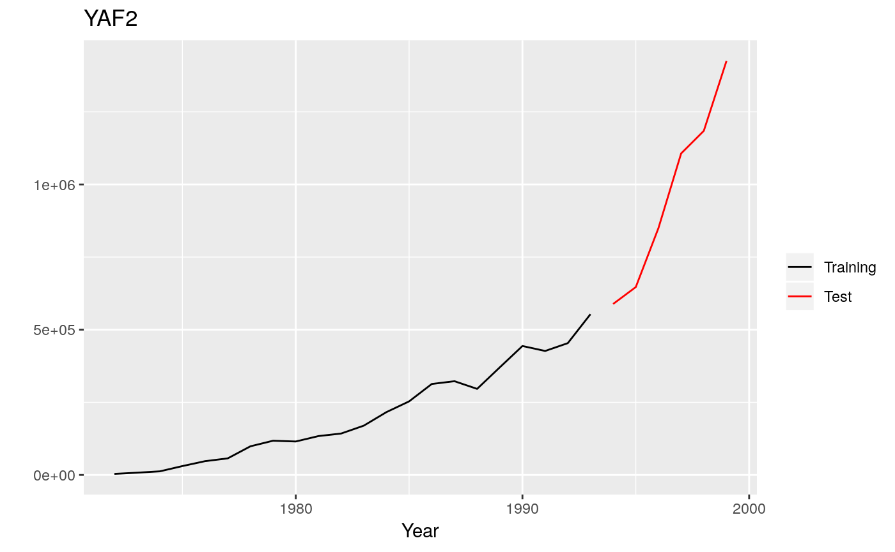

# Mcomp: Data from the M-Competitions

The R package *Mcomp* contains the 1001 time series from the
M-competition (Makridakis et al. 1982) and the 3003 time series from the
IJF-M3 competition (Makridakis and Hibon, 2000). See also the
[tscompdata package](https://github.com/robjhyndman/tscompdata).

## Installation

You can install the **stable** version from
[CRAN](https://cran.r-project.org/package=Mcomp).

``` r
pak::pak("Mcomp")
```

You can install the **development** version from
[Github](https://github.com/robjhyndman/Mcomp)

``` r
# install.packages("devtools")
pak::pak("robjhyndman/Mcomp")
```

## Usage

``` r
library(Mcomp)
#> Loading required package: forecast
#> Registered S3 method overwritten by 'quantmod':
#>   method            from
#>   as.zoo.data.frame zoo
library(ggplot2)
M1
#> M-Competition data: 1001 time series 
#> 
#>            Type of data
#> Period      DEMOGR INDUST MACRO1 MACRO2 MICRO1 MICRO2 MICRO3 Total
#>   MONTHLY       75    183     64     92     10     89    104   617
#>   QUARTERLY     39     18     45     59      5     21     16   203
#>   YEARLY        30     35     30     29     16     29     12   181
#>   Total        144    236    139    180     31    139    132  1001
autoplot(M1$YAF2)
```



``` r
subset(M1, "monthly")
#> M-Competition data: 617 MONTHLY time series
#> 
#>          Type of data
#> Period    DEMOGR INDUST MACRO1 MACRO2 MICRO1 MICRO2 MICRO3
#>   MONTHLY     75    183     64     92     10     89    104
```

## Sources

[Makridakis, S., A. Andersen, R. Carbone, R. Fildes, M. Hibon, R.
Lewandowski, J. Newton, E. Parzen, and R. Winkler (1982) The accuracy of
extrapolation (time series) methods: results of a forecasting
competition. *Journal of Forecasting*, **1**,
111–153.](http://doi.org/10.1002/for.3980010202)

[Makridakis and Hibon (2000) The M3-competition: results, conclusions
and implications. *International Journal of Forecasting*, **16**,
451-476.](https://doi.org/10.1016/S0169-2070(00)00057-1)

## License

This package is free and open source software, licensed under GPL-3
